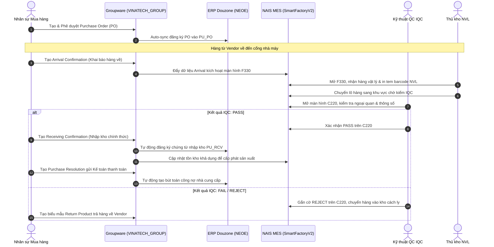
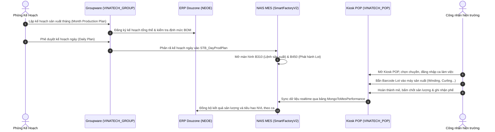
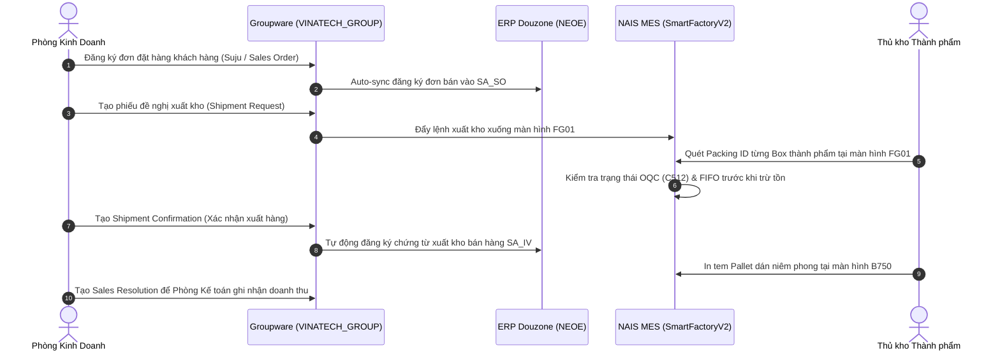

# 🌐 GW_12 — Hướng Dẫn Tích Hợp Đa Nền Tảng (Groupware ↔ ERP ↔ MES ↔ POP)

> **Mục tiêu:** Mô tả chi tiết 4 luồng giao dịch khép kín liên thông giữa 4 hệ thống cốt lõi tại Vinatech: **Groupware (GW)**, **ERP Douzone iU (NEOE)**, **NAIS MES (SmartFactoryV2)**, và **Kiosk POP (VINATECH_POP)**.

---

## 🧭 1. Bản Đồ Tổng Thể Luồng Tích Hợp 4 Chiều (4-Way Integration Matrix)

| Giai Đoạn Nghiệp Vụ | Thượng Nguồn (GW) | Trung Nguồn (ERP) | Hạ Nguồn Hiện Trường (MES) | Trạm Kiosk (POP) |
| :--- | :--- | :--- | :--- | :--- |
| **1. Mua hàng & Nhập kho NVL** | Duyệt PO & Khai báo Arrival | Lưu chứng từ PO & B/L hải quan | Quét Barcode nhận hàng F330 & IQC C220 | - |
| **2. Kế hoạch & Điều hành SX** | Duyệt Month Plan & Suju | Lưu lệnh sản xuất PR_WO & BOM | Tạo chỉ thị B310, phát hành Lot B450 | Bắn mã máy, chốt mẻ, báo phế POP Web |
| **3. Kiểm định & Đóng gói Box** | Theo dõi tiến độ | Ghi nhận chi phí dở dang WIP | Kiểm tra PQC/OQC C512, Đóng thùng B620 | Quét từng Cell vào Box Kiosk POP |
| **4. Xuất hàng & Doanh thu** | Duyệt Suju & Shipment Request | Hạch toán Doanh thu & Công nợ | Quét Packing ID xuất kho FG01, Tem B750 | - |

---

## 🔄 2. Chi Tiết 4 Luồng Giao Dịch Khép Kín (Closed-Loop Workflows)

### 2.1 Luồng 1: Mua Hàng & Quản Lý Kho Nguyên Vật Liệu (Procurement & Inbound WMS)

---

### 2.2 Luồng 2: Kế Hoạch & Điều Hành Sản Xuất Hiện Trường (Production Closed-Loop)

---

### 2.3 Luồng 3: Bán Hàng & Xuất Kho Thành Phẩm (Sales & Outbound WMS)

---

## 🔒 3. Bảo Mật & Xác Thực Người Dùng Tập Trung (Single Sign-On SSO)

1. **Cổng Đăng Nhập Duy Nhất:** Toàn bộ nhân sự đăng nhập tại `https://gw.vinatech.com`.
2. **Cơ chế Token SSO:**
   - Dịch vụ xác thực sinh mã Token và ghi nhận vào cơ sở dữ liệu `VINATECH_RESTFUL.dbo.VINA_SSO_TOKEN`.
   - Khi người dùng bấm liên kết chuyển tiếp sang MES Web Portal (`http://mes.hycap.co.kr:9952`) hoặc Kiosk POP (`https://pop.vinatech.com`), Token được truyền kèm header `Authorization: Bearer <TOKEN>`.
3. **Cơ Chế Khớp Nối Nhân Sự Liên Hệ Thống:**
   - Tài khoản Groupware (`VINA_EMP.NO_EMP`) được đối chiếu trực tiếp với mã người dùng ERP (`NEOE.MA_USER.ID_USER`).
   - Trên MES, bảng `SmartFramework.dbo.STB_UserInfo` liên kết thông qua cột `Appendix8 = NO_EMP`, đảm bảo quyền hạn được đồng nhất trên toàn bộ dây chuyền.
