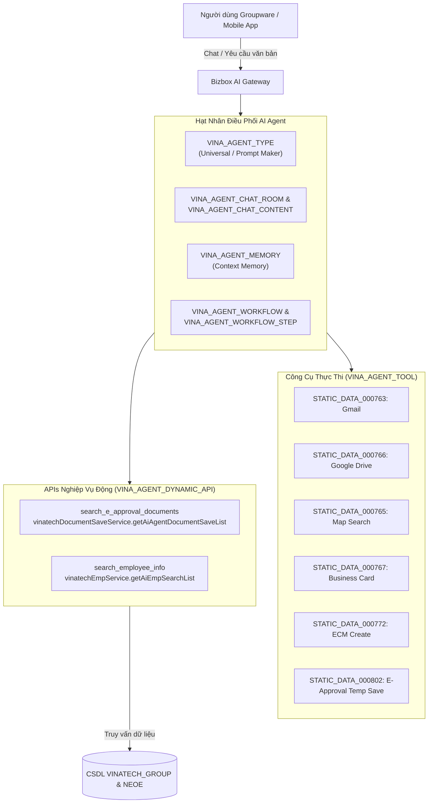

# GW_13 — Bizbox Alpha AI Agent Engine & Dynamic API Architecture

> **Mục tiêu:** Tài liệu hóa toàn diện và chuyên sâu về Hệ thống Trợ lý Trí tuệ Nhân tạo (AI Agent Subsystem) được tích hợp nguyên bản (native) bên trong phân hệ Groupware (Bizbox Alpha) tại Vinatech.
> **Cơ sở dữ liệu:** `VINATECH_GROUP`
> **Công nghệ nền tảng:** Java Spring Boot, Spring Service Beans, Tool Calling, Dynamic APIs, RAG & Vector/Keyword Memory.

---

## 🧭 1. Tổng Quan Kiến Trúc AI Agent Của Bizbox Alpha

Cơ sở dữ liệu `VINATECH_GROUP` chứa một hệ thống bảng chuyên trách quản lý vòng đời, phân loại, cấu hình công cụ (tools) và lịch sử đàm thoại của các AI Agent phục vụ người dùng doanh nghiệp:



---

## 🗄️ 2. Danh Mục 12 Bảng CSDL AI Agent (`VINA_AGENT_%`)

| Tên Bảng | Vai Trò | Chi Tiết Chức Năng |
| :--- | :--- | :--- |
| `VINA_AGENT_TYPE` | Định nghĩa Loại Agent | Cấu hình Agent phổ thông (Universal Agent) hoặc Agent tạo prompt (Prompt Maker Agent), cờ streaming (`AGENT_TYPE_STREAM_YN`), độ dài bộ nhớ (`AGENT_TYPE_CHAT_SAVE_LENGTH`). |
| `VINA_AGENT_TOOL` | Gán Tool cho Agent | Liên kết giữa Agent Type và các công cụ được phép gọi (Google Drive, Gmail, ECM, Approval, Dynamic API). |
| `VINA_AGENT_DYNAMIC_API` | Cấu hình API Động | Định nghĩa Spring Beans & Java Methods được ánh xạ thành Tool Calling cho LLM (ví dụ: `vinatechDocumentSaveService`). |
| `VINA_AGENT_CHAT_ROOM` | Phòng Chat Agent | Quản lý phiên hội thoại giữa nhân viên (`NO_EMP`) với AI Agent. |
| `VINA_AGENT_CHAT_CONTENT` | Nội dung Hội thoại | Lưu chi tiết từng lượt prompt của người dùng và phản hồi của Agent (kèm tokens tiêu thụ). |
| `VINA_AGENT_VOLATILITY_CHAT_ROOM` | Phiên Chat Tạm | Dành cho các phiên hỏi đáp không lưu vết (incognito/ephemeral chat). |
| `VINA_AGENT_MEMORY` | Bộ nhớ Ngữ cảnh | Lưu trữ sở thích cá nhân, ngữ cảnh công việc và lịch sử thao tác của từng nhân viên để cá nhân hóa phản hồi. |
| `VINA_AGENT_WORKFLOW` | Quy trình Tự động | Khai báo các chuỗi tác vụ AI tự động nhiều bước (Multi-step agent workflows). |
| `VINA_AGENT_WORKFLOW_STEP`| Các bước Workflow | Từng bước cụ thể trong quy trình (ví dụ: Trích xuất thông tin ➔ Kiểm tra chính sách ➔ Soạn dự thảo tờ trình). |
| `VINA_AGENT_WORKFLOW_LOG` | Nhật ký Workflow | Log chi tiết kết quả chạy của từng bước workflow. |
| `VINA_AGENT_TOKEN_LOG` | Quản lý Chi phí Token | Theo dõi số lượng Token tiêu thụ (Prompt tokens, Completion tokens) theo từng nhân sự và công ty (`CD_COMPANY`). |
| `VINA_AGENT_SCHEDULE_LOG`| Lịch trình chạy ngầm | Nhật ký kích hoạt các tác vụ AI định kỳ (scheduled cron tasks). |

---

## 🤖 3. Các Loại Agent Được Khai Báo Trong Hệ Thống

Dữ liệu thực tế kiểm tra từ bảng `VINA_AGENT_TYPE` và `VINA_STATIC_DATA`:

### 3.1 Universal Agent (범용에이전트 - Mã: `STATIC_DATA_000762`)
- **Tác giả khởi tạo:** `22070101` (Công ty `1000`).
- **Cấu hình:**
  - `AGENT_TYPE_VOLATILITY_YN`: `'N'` (Lưu lịch sử hội thoại).
  - `AGENT_TYPE_STREAM_YN`: `'Y'` (Hỗ trợ phản hồi streaming từng token thời gian thực).
  - `AGENT_TYPE_CHAT_SAVE_LENGTH`: `10` (Ghi nhớ 10 lượt hội thoại gần nhất làm ngữ cảnh ngắn hạn).
- **Các Tool được cấp quyền:**
  1. `STATIC_DATA_000763`: Gửi/Đọc Email (`gmail`).
  2. `STATIC_DATA_000765`: Tìm kiếm vị trí bản đồ (`map`).
  3. `STATIC_DATA_000766`: Tìm kiếm tài liệu Google Drive (`search_drive`).
  4. `STATIC_DATA_000767`: Quản lý danh thiếp kinh doanh (`business_card`).
  5. `STATIC_DATA_000771`: Tạo tài liệu Google Drive tự động (`create_drive`).
  6. `STATIC_DATA_000772`: Tạo tài liệu lưu trữ ECM (`create_ecm`).
  7. `STATIC_DATA_000802`: Lưu nháp văn bản phê duyệt điện tử (`approval`).
  8. `AGENT_DYNAMIC_API_20260323141055213801`: Tra cứu tờ trình điện tử (`search_e_approval_documents`).
  9. `AGENT_DYNAMIC_API_20260402150435240801`: Tra cứu thông tin nhân viên (`search_employee_info`).

### 3.2 Prompt Create Agent (프롬프트생성에이전트 - Mã: `STATIC_DATA_000770`)
- **Tác giả khởi tạo:** `22070101` (Công ty `1000`).
- **Cấu hình:**
  - `AGENT_TYPE_PROMPT_MAKER_YN`: `'Y'` (Chuyên trách tối ưu hóa câu lệnh prompt cho người dùng nghiệp vụ).
  - `AGENT_TYPE_PROMPT_MAKER_LENGTH`: `30` ký tự tối thiểu.
  - Cung cấp nút bấm **"✨ AI Tinh Chỉnh"** trên giao diện soạn thảo tờ trình (`draftDocument`) để hỗ trợ cán bộ công nhân viên trau chuốt câu từ trước khi trình lên lãnh đạo.

---

## ⚡ 4. Chi Tiết Các Dynamic APIs (Java Spring Backend Bridge)

Hệ thống sử dụng cơ chế Dynamic API phản chiếu (Reflection/Spring ApplicationContext) để LLM có thể gọi trực tiếp các phương thức nghiệp vụ của Backend Java:

### 4.1 Tra cứu Tờ trình Điện tử: `search_e_approval_documents`
- **Mã API:** `AGENT_DYNAMIC_API_20260323141055213801`
- **Spring Bean:** `vinatechDocumentSaveService`
- **Method Name:** `getAiAgentDocumentSaveList`
- **Mô tả hệ thống (System Prompt cho LLM):**
  > *"Search ONLY e-approval (electronic approval) documents such as drafted, received, and referenced items. Supports keyword search by title/content, document type filtering, and approval status filtering. NOT for general files, meeting minutes, or Google Drive documents. Use this tool only when the user explicitly asks about e-approval or approval workflow documents."*
- **Cấu trúc DTO trả về (Display Columns):**
  - `documentSaveCode`: Mã định danh văn bản
  - `vinatechDocumentTypeDto.documentTypeNameKr`: Tên loại biểu mẫu
  - `documentSaveSubject`: Tiêu đề tờ trình
  - `noEmpWriterName`: Tên người soạn thảo
  - `documentSaveStateName`: Trạng thái phê duyệt (Draft, Approving, Approved, Rejected)
  - `documentSaveRegDate`: Ngày tạo
  - `documentSaveContent`: Nội dung chi tiết văn bản

### 4.2 Tra cứu Danh bạ Nhân sự: `search_employee_info`
- **Mã API:** `AGENT_DYNAMIC_API_20260402150435240801`
- **Spring Bean:** `vinatechEmpService`
- **Method Name:** `getAiEmpSearchList`
- **Mô tả hệ thống (System Prompt cho LLM):**
  > *"Search employee info by name, department, position, job title, hire date, or birth date. Returns phone, email, and department details."*
- **Cấu trúc DTO trả về (Display Columns):**
  - `empName`: Tên nhân viên
  - `nmDept`: Phòng ban trực thuộc
  - `headNmDept`: Khối / Bộ phận cấp cao
  - `nmDutyStep`: Cấp bậc chức vụ
  - `nmDutyResp`: Vị trí / Trách nhiệm công việc
  - `nmTpEmp`: Loại hình lao động (Chính thức / Thử việc / Thời vụ)
  - `noTel`: Số điện thoại liên hệ
  - `noEmail`: Email công vụ
  - `dtEnter`: Ngày vào công ty
  - `dtBirth`: Ngày sinh
  - `ynMarry`: Tình trạng hôn nhân

---

## 🛠️ 5. Hướng Dẫn Vận Hành & Tận Dụng AI Agent Cho Đội Ngũ IT

1. **Kiểm tra nhật ký tiêu thụ Token:**
   ```sql
   SELECT TOP 20 CD_COMPANY, NO_EMP, SUM(PROMPT_TOKENS) AS TOTAL_PROMPT, SUM(COMPLETION_TOKENS) AS TOTAL_COMPLETION
   FROM VINA_AGENT_TOKEN_LOG WITH (NOLOCK)
   GROUP BY CD_COMPANY, NO_EMP
   ORDER BY TOTAL_COMPLETION DESC;
   ```
2. **Kiểm tra trạng thái kích hoạt Tool:**
   ```sql
   SELECT T.AGENT_TYPE, SD.STATIC_DATA_NAME_KR, SD.STATIC_DATA_FIELD1, API.AGENT_DYNAMIC_API_NAME
   FROM VINA_AGENT_TOOL T WITH (NOLOCK)
   LEFT JOIN VINA_STATIC_DATA SD WITH (NOLOCK) ON T.AGENT_TOOL_TYPE = SD.STATIC_DATA_CODE
   LEFT JOIN VINA_AGENT_DYNAMIC_API API WITH (NOLOCK) ON T.AGENT_DYNAMIC_API_CODE = API.AGENT_DYNAMIC_API_CODE;
   ```
3. **Ý nghĩa vận hành:** Tính năng AI Agent được nhúng sâu vào lõi Groupware chứng minh Bizbox Alpha tại Vinatech là một nền tảng văn phòng thông minh hiện đại, có khả năng tự động hóa việc tra cứu văn bản và hỗ trợ soạn thảo văn bản tự động cho người dùng.
