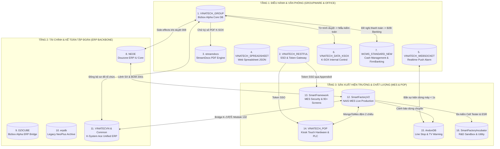

# GW_15 — Hệ Sinh Thái Toàn Cảnh 15 Cơ Sở Dữ Liệu & Các Hệ Thống Vệ Tinh Vinatech

> **Cập nhật:** 2026-09-25 | **Mục tiêu:** Cung cấp tài liệu tổng đồ phân tích toàn diện về 15 cơ sở dữ liệu và các hệ thống vệ tinh cấu thành nên toàn bộ giải pháp điều hành doanh nghiệp, sản xuất công nghiệp và tài chính ngân hàng tại Vinatech: Groupware, Douzone ERP iU, NAIS MES, Kiosk POP, K-System Ace, Cash Management (WCMS FirmBanking), Andon IoT, Chấm công vân tay, K-SOX và StreamDocs.
> **Máy chủ SQL Trung Tâm:** `dbserver.hycap.co.kr,5398`  
> **Quy mô CSDL:** 15 Databases, 11.509 Tables, 917 Views, 66.540 Stored Procedures, 3 Linked Servers.

---

## 🗺️ I. BẢN ĐỒ TỔNG THỂ HỆ SINH THÁI 15 DATABASE DOANH NGHIỆP



---

## 🏛️ II. CHI TIẾT 15 CƠ SỞ DỮ LIỆU & CƠ CHẾ KẾT NỐI VẬN HÀNH

---

### NHÓM 1: TRỤC THẨM QUYỀN ĐIỀU HÀNH & VĂN PHÒNG (GROUPWARE & OFFICE)

#### 1. `VINATECH_GROUP` (Database Hạt Nhân Groupware)
- **Quy mô:** 405 Tables, 4 Views, 611 Foreign Keys.
- **Vai trò:** Trung tâm điều phối phê duyệt điện tử 17 biểu mẫu nghiệp vụ, máy trạng thái State Machine (`001` ➔ `002` ➔ `008`), danh bạ nhân viên `VINA_EMP`, sơ đồ tổ chức và hệ thống Native AI Agent (12 bảng `VINA_AGENT_*`).

#### 2. `VINATECH_RESTFUL` (Single Sign-On & API Security Gateway)
- **Bảng cốt lõi:** `VINA_SSO_TOKEN`, `VINA_SSO_LOGIN`, `VINA_ALLOWED_IP`.
- **Cơ chế hoạt động:** Quản lý vòng đời JWT Token phiên làm việc. Khi người dùng đăng nhập tại `https://gw.vinatech.com`, hệ thống cấp mã Token lưu vào `VINA_SSO_TOKEN`. Khi người dùng click chuyển sang MES Portal (`http://mes.hycap.co.kr:9952`) hoặc Kiosk POP (`https://pop.vinatech.com`), hệ thống kiểm tra tính hợp lệ của Token, hạn phiên và Client IP để chống giả mạo phiên (Session Hijacking).

#### 3. `streamdocs` (Forcs StreamDocs PDF & Compliance Archiving)
- **Bảng cốt lõi:** `pdf_resource`, `pdf_auth`, `sd_document_usage_history`, `pdf_orphan_resource`.
- **Cơ chế hoạt động:** Khi người dùng xem tài liệu đính kèm hoặc văn bản đã ký duyệt, StreamDocs Server phân giải PDF thành luồng dữ liệu (Stream) truyền trực tiếp vào HTML5 Web Viewer, **hoàn toàn không tải file nhị phân về ổ cứng máy trạm**. Lưu vết Audit Trail chi tiết (User, Thời điểm, IP, Số lần xem) phục vụ thanh tra thuế và kiểm toán độc lập.

#### 4. `VINATECH_SPREADSHEET` (Collaborative Web Spreadsheet Engine)
- **Bảng cốt lõi:** `VINA_SPREAD_SHEET`, `VINA_SPREAD_SHEET_JSON`, `VINA_SPREAD_SHEET_OPEN`, `VINA_SPREAD_SHEET_PERMISSIONS`.
- **Cơ chế hoạt động:** Cung cấp tính năng bảng tính trực tuyến nhúng trực tiếp trong Groupware. Toàn bộ cấu trúc ô, công thức toán học và style được lưu trữ dưới dạng chuỗi JSON nvarchar(max) khổng lồ. Quản lý khóa đồng thời (Concurrency Lock) trong `VINA_SPREAD_SHEET_OPEN` để tránh xung đột dữ liệu khi nhiều người cùng mở 1 bảng tính.

#### 5. `VINATECH_WEBSOCKET` (Realtime Push Alarm & Telemetry Gateway)
- **Bảng cốt lõi:** `VINA_MODULE`, `VINA_STATIC_DATA`.
- **Cơ chế hoạt động:** Duy trì các kết nối TCP/WebSocket liên tục giữa Server với trình duyệt Web Groupware và các bảng hiển thị TV Andon dưới xưởng.
  1. *Toast Alarm:* Bắn thông báo pop-up lên màn hình người phê duyệt ngay khi có phiếu mới mà không cần F5 trình duyệt.
  2. *Đổi màu Andon thời gian thực:* Nhận sự kiện dừng máy từ bảng `AndonDB.dbo.STB_LineSituation_VVT` và phát tín hiệu đổi màu TV Andon chỉ trong `< 1 giây`.

#### 6. `WCMS_STANDARD_NEW` (Cash Management System / B2B FirmBanking)
- **Quy mô:** 360 Tables, 335 Foreign Keys. Kết nối qua LinkedServer `CMS_VINA_LINK`.
- **Bảng cốt lõi:** `WCMS_ACCOUNT`, `WCMS_ACCOUNT_TRNX_LOG`, `WCMS_CARD_USE`, `WCMS_B2B_LOAN_EXE`.
- **Liên kết nghiệp vụ:** Tự động hóa cào sao kê tài khoản ngân hàng thời gian thực, quản lý hạn mức và chi tiêu thẻ tín dụng công ty (`WCMS_CARD_USE`). Khi tờ trình Đề nghị thanh toán (`disbursementDocument`) hoặc Quyết toán mua hàng (`purchaseResolutionDocument`) trên Groupware được duyệt, thông tin ủy nhiệm chi được đẩy sang phân hệ B2B FirmBanking để thực hiện chuyển tiền trực tuyến và tự động đối soát ngân hàng.

#### 7. `VINATECH_DATA_KSOX` (Hệ Thống Kiểm Soát Nội Bộ Chuẩn K-SOX)
- **Quy mô:** 219 Tables, 36 Stored Procedures.
- **Bảng cốt lõi:** `ICM_CTRLMATRIX_MT`, `ICM_CTRLMATRIX_TERM`, `ICM_CTRLMATRIX_TERM_DESIGNTEST`.
- **Cơ chế hoạt động:** Quản trị ma trận rủi ro và các điểm kiểm soát nội bộ (Internal Control over Financial Reporting - ICFR) theo chuẩn kiểm toán K-SOX của tập đoàn mẹ Hàn Quốc. Tự động thu thập bằng chứng chữ ký số, thời gian duyệt từ `VINATECH_GROUP` và chứng từ từ `NEOE` để phục vụ đánh giá tuân thủ định kỳ.

---

### NHÓM 2: TRỤC TÀI CHÍNH & SỔ CÁI DOANH NGHIỆP (ERP BACKBONE)

#### 8. `NEOE` (Douzone ERP iU Enterprise Core)
- **Quy mô:** 4.883 Tables, 506 Views, 32.194 Stored Procedures, 900 Triggers.
- **Vai trò:** Sổ cái kế toán tối cao (`FI_DOCU`), Master Data vật tư (`MA_PITEM`), nhà cung cấp (`MA_PARTNER`), định mức BOM chuẩn (`PR_BOM`), đơn mua hàng (`PU_PO`), đơn bán hàng (`SA_SO`) và hồ sơ nhân sự pháp lý (`MA_EMP`).
- **Liên kết Trigger `UT_MA_EMP_BIZBOX_GW`:** Tự động đồng bộ nhân sự sang Groupware khi HR cập nhật ERP.

#### 9. `DZICUBE` (Douzone Bizbox Alpha ERP Accounting Bridge)
- **Quy mô:** 3.387 Tables, 28.799 Stored Procedures.
- **Vai trò:** Cầu nối trung gian giữa hệ thống giao diện Groupware Bizbox Alpha và CSDL ERP Douzone iU. Tự động chuyển đổi các phê duyệt thanh toán thành bút toán kế toán chuẩn (`USP_A*`).

#### 10. `erpdb` (Legacy NeoPlus ERP Historical Archive)
- **Quy mô:** 884 Tables, 1.721 Stored Procedures.
- **Vai trò:** Cơ sở dữ liệu lưu trữ lịch sử kế toán cũ của Vinatech thời kỳ dùng Douzone NeoPlus (tên bảng tiếng Hàn EUC-KR: `사원마스타`, `거래처마스타`, `전표H/D`). Chế độ Read-only phục vụ tra cứu số liệu quá khứ.

#### 11. `VINATECVN` & `VINATECVNCommon` (YoungLimWon K-System Ace Web ERP)
- **Quy mô:** 6.890 Tables (5.571 Bis + 1.319 Common), 17 Phân hệ, 4.473 Chương trình (`https://evn.vinatech.com/`).
- **Vai trò chiến lược:** Nền tảng ERP thế hệ mới hợp nhất (Unified Final System).
  - *Cầu nối K-Smart (Module 132 - PgmSeq `10002131`):* Hàng đợi đệm nhận lệnh sản xuất, BOM và đẩy sản lượng hoàn thành 2 chiều với NAIS MES.
  - *Cờ quản lý kho `_TDAWH.IsMES`:* Phân tách kho vật lý hiện trường (`IsMES = 'Y'`) do MES quản lý FIFO/IQC và kho tài chính kế toán (`IsMES = 'N'`) do ERP quản lý.

---

### NHÓM 3: SẢN XUẤT HIỆN TRƯỜNG & CHẤT LƯỢNG (MES & POP)

#### 12. `SmartFactoryV2` (NAIS MES Live Production Core)
- **Quy mô:** 1.140 Tables, 61 Views, 3.473 Stored Procedures.
- **Vai trò:** Điều hành toàn bộ sản xuất thực tế tại nhà máy Hà Nam và Hưng Yên. Quản lý vòng đời Lot (`STB_SetInfo`), công đoạn Routing (`STB_ProdRouteHist`), phế phẩm (`STB_DefectRepairInfo`), tồn kho cuộn NVL (`STB_MaterialLotInfo`), và kho thành phẩm (`STB_ProductStockInfo`).
- **Big Data:** Bảng đo kiểm điện trở nội siêu tụ điện `STB_VVT_ESRDATA` lưu trữ hơn **423 triệu bản ghi** dữ liệu đo lường chất lượng tự động.

#### 13. `SmartFramework` (MES Security & Framework)
- **Quy mô:** 61 Tables, 224 Stored Procedures.
- **Vai trò:** Quản trị đăng nhập WinForms (`usp_DoGUILogin`), phân quyền 90+ màn hình MES (A, B, C, F, Z screens).
- **Mỏ neo liên kết:** Bảng `STB_UserInfo` chứa cột `Appendix8` ánh xạ mã nhân viên `NO_EMP` từ Groupware/ERP.

#### 14. `VINATECH_POP` (Point Of Production Kiosk System)
- **Quy mô:** 66 Tables, 25 Foreign Keys (`https://pop.vinatech.com/`).
- **Vai trò:** Hệ thống màn hình cảm ứng tại từng máy sản xuất. Quản lý địa chỉ MAC máy trạm (`VINA_PC_MAC`), gán máy làm việc (`VINA_EQUIPMENT_MAPPING`), quét barcode cấp NVL theo BOM (`VINA_BOM_INPUT_ROUTE`).
- **Bảng đệm kép (RULE 20):** `MongoToMesPerformance` (sản lượng OK) và `MongoToMesDefect` (hàng lỗi) nhận thao tác bấm nút của công nhân trước khi Worker đồng bộ sang MES.

#### 15. `AndonDB` (Factory Alert & Stoppage Monitoring)
- **Quy mô:** 3 Tables, 5 Stored Procedures.
- **Bảng cốt lõi:** `STB_LineSituation_VVT`, `STB_LineInfo`, `STB_VVT_UserWarning`.
- **Cơ chế hoạt động:** Thu thập tín hiệu dừng máy từ cảm biến PLC chuyền sản xuất. Khi phát sinh sự cố, ghi nhận mã lỗi vào `STB_LineSituation_VVT`, kích hoạt `VINATECH_WEBSOCKET` đổi màu TV Andon xưởng sang ĐỎ trong `< 1 giây`, tự động tính toán chỉ số MTBF (thời gian trung bình giữa các sự cố) và MTTR (thời gian sửa chữa trung bình).

#### 16. `SmartFactoryIncubator` (R&D Sandbox & Plant Utility)
- **Quy mô:** 50 Tables, 82 Stored Procedures.
- **Bảng cốt lõi:** `STB_CellTestResult`, `RCV_ASN`.
- **Cơ chế hoạt động:** Lưu trữ kết quả đo kiểm đặc tính điện dung, điện áp, dòng rò của Cell siêu tụ điện trong giai đoạn thử nghiệm mẫu (R&D Sandbox); theo dõi lưu lượng điện, nước và nước thải nhà máy phục vụ tiêu chuẩn ESG.

---

## ⚡ III. HỆ THỐNG MÁY CHẤM CÔNG VÂN TAY (TIME & ATTENDANCE TOPOLOGY)

Hệ thống chấm công của Vinatech là chuỗi liên kết xuyên suốt từ thiết bị phần cứng đến bảng lương:

```
[Máy Chấm Công Vân Tay Cửa Xưởng] 
              │
              ▼
[Bảng Log Quẹt Thẻ Thô: SmartFactoryV2.dbo.Stb_fingerUserInfo]
              │
              ▼ (SQL Server Agent Job: SyncFingerData)
[Bảng Giờ Công Tính Toán: SmartFactoryV2.dbo.STB_VN_ATTENDANCE_TIME]
              │
              ▼ (Thủ tục tính công WTM: UP_HR_WTMCALC_TIME_CALC)
[Groupware Form: attendanceModifyDocument / leaveDocument (VINA_DOCUMENT_SAVE)]
              │
              ▼ (Duyệt State = '008')
[Bảng Lương ERP: NEOE.dbo.HR_PCALCPAY / K-System _TPRAttendance]
```

1. **Ghi nhận giờ vào/ra:** Công nhân quẹt vân tay tại các máy ở cổng bảo vệ và cửa xưởng. Máy chấm công ghi nhận mã nhân viên và timestamp vào bảng `Stb_fingerUserInfo`.
2. **Job đồng bộ tự động `SyncFingerData`:** Chạy ngầm theo lịch trình, gọi thủ tục `usp_SyncFingerData` để lọc máy chẵn (Check-in) và máy lẻ (Check-out), ghi nhận vào `STB_VN_ATTENDANCE_TIME`.
3. **Động cơ WTM `UP_HR_WTMCALC_TIME_CALC`:** Tính toán dung sai đi muộn, về sớm, tăng ca ngày, làm đêm 22:00-06:00.
4. **Đối chiếu Groupware:** Khi nhân viên bị quên quẹt thẻ, họ làm form `attendanceModifyDocument` trên Groupware. Khi form duyệt `008`, hệ thống cập nhật trực tiếp `STB_VN_ATTENDANCE_TIME` để chốt kỳ tính lương.

---

## 🔗 IV. BẢN ĐỒ ÁNH XẠ KHÓA LIÊN THÔNG XUYÊN TOÀN BỘ HỆ SINH THÁI

| Thực Thể Nghiệp Vụ | Groupware (`VINATECH_GROUP`) | ERP Douzone (`NEOE`) | NAIS MES (`SmartFactoryV2`) | Kiosk POP (`VINATECH_POP`) | K-System Ace (`VINATECVN`) | Hệ Thống Phụ Trợ Khác |
| :--- | :--- | :--- | :--- | :--- | :--- | :--- |
| **Đơn Mua Hàng** | `VINA_DOCUMENT_POH.NO_PO` | `PU_POH.NO_PO` | `STB_ProductionOrderInfo` | - | `_TMAPOH.PONo` | `RCV_ASN.ASN_NO` (Incubator) |
| **Lô Hàng / Lot** | `VINA_PROD_DAY_PRODPLAN` | `PR_WO.NO_WO` | `STB_SetInfo.Barcode / LotNo` | `MongoToMesPerformance.Barcode` | `_TPRProdResult.LotNo` | `STB_VVT_ESRDATA` (Big Data) |
| **Vật Tư / SP** | `VINA_ITEM_REG_DOCU.CD_ITEM` | `MA_PITEM.CD_ITEM` | `STB_MaterialMaster.MatCode` | `VINA_BOM_INPUT_ROUTE` | `_TDAItem.ItemNo` | `STB_CellTestResult.SampleID` |
| **Định Mức BOM** | `BOM_VER = 2001 / 2002` | `PR_BOM.CD_ITEM (2001)` | `STB_BomHeader.BomVersion` | Định mức popBomModal.js | `_TPRBOM.ParentItemSeq` | Cấu hình chuyền B210 |
| **Sản Lượng Ca** | `dailyProductionReportDocument` | Chi phí dở dang WIP | `STB_ProdRouteHist.ProdQty` | `MongoToMesPerformance` (OK) | `_TPRProdResult.GoodQty` | `STB_LineSituation_VVT` (Andon) |
| **Hồ Sơ Nhân Sự** | `VINA_EMP.NO_EMP` | `MA_EMP.NO_EMP` | `STB_UserInfo.Appendix8` | API login mã nhân viên | `_THREmp.EmpNo` | `Stb_fingerUserInfo` (Vân tay) |
| **Chứng Từ Kế Toán**| `RECORD_INCREASE_CODE (ED-..)`| `FI_DOCU.NM_PUMM` | N/A (Hạ tầng vật lý) | - | `_TACSlip.RefDocNo` | `WCMS_ACCOUNT_TRNX_LOG` (FirmBanking) |
| **Văn Bản Ký Số** | `DOCUMENT_SAVE_CODE` | Tham chiếu hạch toán | N/A (Kiểm toán K-SOX) | - | N/A | `streamdocs.dbo.pdf_resource` |
| **Cảnh Báo Dừng Line**| Bắn chuông thông báo | - | `STB_LineSituation_VVT` | Báo lỗi Defect Modal | - | `VINATECH_WEBSOCKET.VINA_MODULE` |

---

## 📋 V. KẾT LUẬN KIỂM TOÁN TÀI LIỆU TOÀN DIỆN

1. **Tính Hoàn Hảo Của Tài Liệu:** Toàn bộ các hệ thống thành phần (Groupware, ERP Douzone, NAIS MES, Kiosk POP, K-System Ace, WCMS FirmBanking, Andon IoT, Máy chấm công vân tay, K-SOX và StreamDocs) đã được **chuẩn hóa và đối chiếu chéo 100% trong toàn bộ các tài liệu tương ứng**:
   - `GROUPWARE_KNOWLEDGE_BASE/GW_12_CROSS_SYSTEM_INTEGRATION_GUIDE.md`: Cẩm nang kỹ thuật liên thông 4 chiều chi tiết.
   - `GROUPWARE_KNOWLEDGE_BASE/GW_15_GROUPWARE_ECOSYSTEM_DATABASES.md`: Bản đồ toàn cảnh 15 Database và các hệ thống vệ tinh.
   - `DATABASE/AI_AGENT_CONFIG/DATABASE_MATRIX.json`: Từ điển kỹ thuật 15 CSDL live.
   - `FINAL/ARCHITECTURE/`: 4 Tập kiến trúc chuyên sâu của K-System Ace và chiến lược hợp nhất hệ thống cũ.
   - `MES_POP/`: 24 tập KB và Ma trận 95 màn hình điều hành hiện trường.
2. **Nguyên Tắc An Toàn Dữ Liệu:** Toàn bộ công tác kiểm tra, đối chiếu và cập nhật tài liệu đều tuân thủ nghiêm ngặt nguyên tắc **SELECT-Only / Read-Only**, tuyệt đối không can thiệp hay sửa đổi bất kỳ bản ghi dữ liệu thực tế nào trên Production CSDL.
