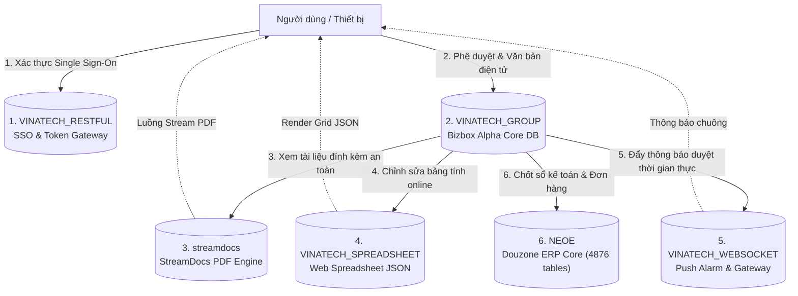

# GW_15 — Hệ Sinh Thái 5 Cơ Sở Dữ Liệu Hỗ Trợ Groupware

> **Mục tiêu:** Cung cấp tài liệu phân tích chuyên sâu về 5 cơ sở dữ liệu cấu thành nên toàn bộ giải pháp Groupware hoàn chỉnh tại Vinatech: Xác thực SSO, Trình xem PDF StreamDocs, Bảng tính Web Spreadsheet, Cổng truyền thông thời gian thực WebSocket, và Sổ cái ERP Douzone iU.
> **Máy chủ:** `dbserver.hycap.co.kr,5398`

---

## 🗺️ 1. Bản Đồ Tổng Thể 5 Database Thành Phần

---

## 🔑 2. CSDL `VINATECH_RESTFUL` — Single Sign-On & API Security

- **Vai trò:** Quản lý toàn bộ phiên làm việc (Session), Access Token, Refresh Token cho Web Portal, Mobile App và Kiosk xưởng.
- **Bảng cốt lõi:**
  1. `VINA_SSO_TOKEN`:
     - `SSO_TOKEN_CODE` (PK, `varchar(400)`): Chuỗi JWT hoặc Hash token truy cập.
     - `SSO_REFRESH_TOKEN` (`varchar(400)`): Token làm mới phiên khi Access Token hết hạn.
     - `ID_USER` / `CD_COMPANY`: Định danh người dùng và pháp nhân.
     - `SSO_TOKEN_CLIENT_IP`: Địa chỉ IP của máy khách kết nối.
     - `SSO_TOKEN_DIVICE`: Thiết bị sử dụng (`PC`, `Mobile`, `Kiosk`).
     - `SSO_TOKEN_REFRESH_DATE` / `SSO_TOKEN_REG_DATE`: Thời gian sống của Token.
  2. `VINA_SSO_LOGIN`:
     - Thống kê số lần đăng nhập trong ngày (`SSO_LOGIN_COUNT`) của từng tài khoản, phục vụ audit an ninh thông tin.
  3. `VINA_ALLOWED_IP`:
     - Danh sách IP Whitelist được phép gọi các API Gateway nội bộ.

---

## 📄 3. CSDL `streamdocs` — Forcs StreamDocs PDF & E-Form Engine

- **Vai trò:** Giải pháp bảo mật văn bản doanh nghiệp. Khi người dùng bấm "Xem trước" tài liệu đính kèm trên Groupware, hệ thống **không tải file nhị phân về máy trạm**, mà StreamDocs Server phân giải PDF thành luồng dữ liệu (Stream) truyền trực tiếp vào HTML5 Web Viewer.
- **Bảng cốt lõi:**
  1. `pdf_resource`: Lưu thông tin file PDF vật lý, kích thước, đường dẫn đĩa và mã băm MD5.
  2. `pdf_resource_owner`: Liên kết file PDF với ID tờ trình Groupware (`DOCUMENT_SAVE_CODE`) hoặc người dùng tải lên.
  3. `pdf_auth`: Quản lý token phiên được phép mở xem tài liệu.
  4. `pdf_open_limit_info`: Giới hạn số lần mở xem hoặc thời gian hết hạn của link preview.
  5. `sd_document_usage_history`: Audit Trail ghi nhận chi tiết: Ai, lúc nào, từ IP nào đã mở xem tài liệu bảo mật.
  6. `pdf_orphan_resource` & `sd_cron_schedule`: Quản lý lịch trình tự động quét dọn các file mồ côi bị xóa trên Groupware để thu hồi dung lượng ổ cứng.

---

## 📊 4. CSDL `VINATECH_SPREADSHEET` — Web Spreadsheet JSON Storage

- **Vai trò:** Cung cấp tính năng bảng tính cộng tác trực tuyến (tương tự Google Sheets/Excel Online) nhúng trực tiếp trong Groupware.
- **Nguyên lý lưu trữ:** Thay vì lưu file `.xlsx` nhị phân, hệ thống lưu toàn bộ dữ liệu ô, màu sắc, định dạng, công thức dưới dạng chuỗi JSON (`nvarchar(max)`) trong database.
- **Bảng cốt lõi:**
  1. `VINA_SPREAD_SHEET`: Metadata của bảng tính (`SPREAD_SHEET_CHANNEL`, `SPREAD_SHEET_FILE_NAME`, `DOCUMENT_TYPE_ID`).
  2. `VINA_SPREAD_SHEET_JSON`: Chứa chuỗi JSON khổng lồ lưu toàn bộ grid dữ liệu bảng tính.
  3. `VINA_SPREAD_SHEET_OPEN`: Quản lý khóa đồng thời (Concurrency Lock). Khi nhân viên A đang mở bảng tính, hệ thống khóa ghi để tránh xung đột dữ liệu với nhân viên B.
  4. `VINA_SPREAD_SHEET_PERMISSIONS`: Phân quyền chi tiết từng nhân viên: Đọc (`READ`), Ghi (`WRITE`), Duyệt (`APPROVAL`), Xuất file Excel (`EXPORT`), Xuất ECM (`ECM_EXPORT`).

---

## 🔌 5. CSDL `VINATECH_WEBSOCKET` — Realtime Push Alarm Gateway

- **Vai trò:** Duy trì các kết nối TCP/WebSocket liên tục giữa Server với trình duyệt Web Groupware và các bảng hiển thị TV Andon dưới xưởng sản xuất.
- **Ứng dụng thực tế:**
  1. **Thông báo tờ trình Groupware (Toast Alarm):** Khi có phiếu mới cần duyệt, WebSocket lập tức đẩy thông báo pop-up lên góc màn hình của người phê duyệt mà không cần F5 trình duyệt.
  2. **Đổi màu Andon thời gian thực:** Nhận sự kiện dừng máy từ bảng `AndonDB.dbo.STB_LineSituation_VVT` và phát tín hiệu đổi màu TV Andon chỉ trong vòng `< 1 giây`.
  3. **Giám sát thiết bị (Telemetry):** Đẩy dữ liệu đo đạc nhiệt độ, áp suất từ máy về dashboard kỹ thuật.
- **Bảng quản trị:** `VINA_MODULE` (khai báo các dịch vụ WebSocket như `WS_NOTICE`, `WS_ANDON`), `VINA_MENU`, `VINA_MENU_PERMISSIONS`, `VINA_STATIC_DATA` (cấu hình heartbeat, timeout).

---

## 🏢 6. CSDL `NEOE` — Douzone ERP iU Enterprise Backbone

- **Quy mô:** Hệ thống CSDL lớn nhất với **4,876 bảng**, là nguồn chân lý duy nhất (Single Source of Truth) cho tài chính, vật tư, nhân sự và đơn hàng.
- **Liên kết với Groupware:**
  1. **Đồng bộ Nhân sự (Trigger `NEOE.UT_MA_EMP_BIZBOX_GW`):** Bất kỳ cập nhật phòng ban/chức vụ nào trong `NEOE.NEOE.MA_EMP` lập tức kích hoạt trigger ghi vào `USER_MAPPING_INFO` để Groupware đồng bộ sơ đồ tổ chức.
  2. **Đồng bộ Mua hàng:** PO duyệt xong trên GW tự động ghi nhận vào `PU_POH` (Header) và `PU_POL` (Line). Hàng về ghi vào `PU_RCVH` / `PU_RCVL`.
  3. **Đồng bộ Bán hàng:** Suju duyệt xong trên GW tự động tạo `SA_SOH` và `SA_SOL`. Xuất hàng tạo `SA_GIRH` và `SA_GIRL`.
  4. **Hạch toán Kế toán:** Duyệt quyết toán (`purchaseResolutionDocument` / `disbursementDocument`) tự động phát hành chứng từ kế toán `FI_DOCU` và `FI_DOCU_D` kèm chuỗi `(ED-XXXXXXXXXXXXXX)`.
  5. **BOM Master:** Lưu trữ phiên bản BOM 2001 (Việt Nam) trong `PR_BOM` để đồng bộ xuống MES `STB_BomHeader`.
