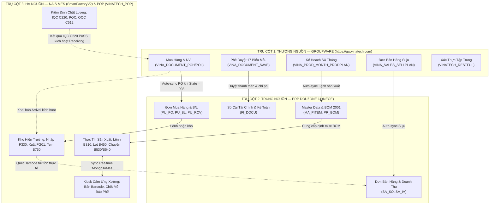

# 🌐 BẢN ĐỒ TÍCH HỢP TOÀN HỆ THỐNG VINATECH (GW ↔ ERP ↔ MES ↔ POP)

> **Cập nhật:** 2026-09-24 | **Phạm vi:** Toàn bộ hệ sinh thái phần mềm điều hành & sản xuất Vinatech  
> **Tài liệu kim chỉ nam:** [GW_00_CORE_OPERATING_PRINCIPLES.md](GROUPWARE_KNOWLEDGE_BASE/GW_00_CORE_OPERATING_PRINCIPLES.md) (*"No Approved Document, No Physical Movement"*)

---

## 🧭 1. Bản Đồ Tổng Quan 3 Trụ Cột Doanh Nghiệp

---

## 🗄️ 2. Ma Trận Bảng Dữ Liệu Thực Tế Giữa Các CSDL (Live DB Verified)

| Nghiệp Vụ | CSDL Groupware (`VINATECH_GROUP`) | CSDL ERP (`NEOE`) | CSDL MES (`SmartFactoryV2` / `SmartFramework`) | CSDL Hỗ Trợ Khác |
| :--- | :--- | :--- | :--- | :--- |
| **Đơn Mua Hàng** | `VINA_DOCUMENT_POH`, `POL` | `NEOE.PU_POH`, `PU_POL` | `dbo.STB_ProductionOrderInfo` | - |
| **Hàng Về / Khai Báo** | `VINA_DOCUMENT_RECEIVING_PHYSICAL_ITEM_H/L` | `NEOE.PU_BL` (Hải quan / B/L) | Màn hình `F330` (`materialDocNo`) | - |
| **Kiểm Định IQC** | Kiểm tra cờ QC PASS trước khi lập Receiving | - | `dbo.STB_MaterialQcInfo` (`QcResult = 'PASS'`) | - |
| **Nhập Kho Chính Thức** | `VINA_DOCUMENT_RECEIVING_CONFIRMATION_H/L` | `NEOE.PU_RCVH`, `PU_RCVL` | `dbo.STB_MaterialLotInfo` | - |
| **Quyết Toán Mua Hàng** | `VINA_DOCUMENT_PURCHASE_RESOLUTION` | `NEOE.FI_DOCU`, `FI_DOCU_D` (Khớp `ED-...`) | - | `VINA_DOCUMENT_ERP_DOCU_INFO_VIEW` |
| **Kế Hoạch Tháng** | `VINA_PROD_MONTH_PRODPLAN` | `NEOE.PR_WO` | `dbo.STB_DayProdPlan` (Màn hình `B310`) | - |
| **Lot Sản Xuất** | `dailyProductionOrderDocument` | `NEOE.PR_BOM` (Version 2001) | `dbo.STB_DayProdPlan`, `dbo.STB_ProdRouteHist` (`B450`) | `VINATECH_POP` |
| **Bán Hàng & Suju** | `VINA_SALES_SELLPLAN` | `NEOE.SA_SOH`, `SA_SOL` | - | - |
| **Đề Nghị Xuất Kho** | `VINA_SALES_PROD_HAND` | `NEOE.SA_GIRH`, `SA_GIRL` | Màn hình `FG01` (Quét Box PASS OQC) | - |
| **Xuất Kho & Tem Pallet** | `VINA_TRADE_ALL_INVOICE`, `VINA_DOCUMENT_TR_INV` | `NEOE.SA_IVH`, `SA_IVL` | Màn hình `B750` (Tem Pallet), `B752` (Container) | - |
| **Hồ Sơ Nhân Sự** | `VINA_EMP`, `VINA_ORG_CHART_NODE` | `NEOE.MA_USER`, `NEOE.MA_EMP` (Trigger `UT_MA_EMP_BIZBOX_GW`) | `SmartFramework.dbo.STB_UserInfo` (`Appendix8`) | `SmartFactoryV2.dbo.STB_VN_Employees` |
| **Chấm Công & Giờ Làm** | `VINA_DOCUMENT_LEAVE_REQUEST`, `leaveDocument` | `NEOE.HR_WTM_*` (Thủ tục `UP_HR_WTMCALC_TIME_CALC`) | `dbo.STB_VN_ATTENDANCE_TIME` (Job `SyncFingerData`) | `Stb_fingerUserInfo` |
| **Xác Thực Đăng Nhập** | SSO Token Gateway | Xác thực mật khẩu ERP (`ERPiUVerify` cho HQ) | `SmartFramework.dbo.usp_DoGUILogin` | `VINATECH_RESTFUL.dbo.VINA_SSO_TOKEN` |
| **Xem Tài Liệu PDF** | E-Approval Web Viewer | - | - | `streamdocs.dbo.pdf_resource` |
| **Bảng Tính Trực Tuyến** | Web Spreadsheet | - | - | `VINATECH_SPREADSHEET.dbo.VINA_SPREAD_SHEET_JSON` |
| **Chuông Báo Thời Gian Thực**| Realtime Push Notification | - | Đổi màu TV Andon khi máy dừng | `VINATECH_WEBSOCKET.dbo.VINA_MODULE` |

---

## ⚡ 3. Các Điểm Nghẽn Tích Hợp Thường Gặp & Cách Khắc Phục

1. **GW ➔ ERP PO Synchronization Failure:**
   - Khi PO duyệt `008` trên GW nhưng không sang ERP: Thường do mã nhà cung cấp `CD_PARTNER` hoặc mã vật tư `CD_ITEM` chưa được mở trên ERP `NEOE`.
2. **GW ➔ MES Arrival Failure:**
   - Khi đã làm Arrival trên GW nhưng MES `F330` không hiện: Kiểm tra phiếu Arrival đã sang trạng thái `008` chưa và mã kho nhận `CD_SL` có khớp phân quyền thủ kho không.
3. **MES ➔ GW IQC Gatekeeper:**
   - Khi QC đã kiểm tra xong nhưng GW không cho làm Receiving: Đảm bảo kỹ thuật viên QC đã nhấn nút **Confirm PASS** trên màn hình `C220` để cập nhật cột `QcResult = 'PASS'` trong bảng `STB_MaterialQcInfo`.
4. **BOM Version Lock (Chốt chặn phiên bản BOM 2001/2002):**
   - Khi tạo PO sản xuất tháng hoặc kế hoạch ngày, bắt buộc phiên bản BOM phải là **2001** (cho toàn bộ sản phẩm Việt Nam) hoặc **2002** (cho Cell line mới). Bất kỳ BOM version nào khác đều bị MES `B310`/`B450` từ chối nhận lệnh và không cho tạo Lot.
5. **Đồng Bộ Nhân Sự & Tổ Chức (Trigger `UT_MA_EMP_BIZBOX_GW`):**
   - Khi chuyển phòng ban cho nhân viên trong ERP `MA_EMP`, Trigger sẽ tự ghi vào `USER_MAPPING_INFO`. IT cần kiểm tra thêm bảng `SmartFactoryV2.dbo.STB_VN_Employees` (cột `CODEDEPARTMENT`) để MES không bị lệch thông tin phòng ban với Groupware.
6. **Truy Vết Chứng Từ ERP Qua Chuỗi `(ED-...)`:**
   - Khi một tờ trình Groupware được duyệt, mã hồ sơ `RECORD_INCREASE_CODE` (ví dụ `ED-VJPMTR000000021`) được chèn vào trường `NM_PUMM` của chứng từ kế toán `NEOE.NEOE.FI_DOCU`. Dùng View `VINA_DOCUMENT_ERP_DOCU_INFO_VIEW` để tra cứu hai chiều tức thì.

---

## 🎯 4. BẢNG ĐỐI CHIẾU CHÉO 3 CHIỀU: GROUPWARE ↔ MES ↔ POP (100% VERIFIED MAPPING)

Kết quả kiểm toán đối chiếu chéo giữa 3 phân hệ:

| Chuỗi Nghiệp Vụ | Thượng Nguồn: GROUPWARE (`VINATECH_GROUP`) | Trung Nguồn: NAIS MES (`SmartFactoryV2`) | Hạ Nguồn: POP KIOSK (`VINATECH_POP`) | Đánh Giá Khớp Nối |
| :--- | :--- | :--- | :--- | :---: |
| **1. Kế Hoạch & Lot SX** | `VINA_PROD_MONTH_PRODPLAN` duyệt `008` ➔ Kế hoạch ngày `dailyProductionOrderDocument` (BOM 2001/2002) | Nạp vào `STB_ProductionOrderInfo` (`B310`) ➔ `STB_DayProdPlan` (`B450`) chia Lot ➔ `STB_SetInfo` (`Barcode`, `LotNo`) | API `/api/pop/screen/getDayPlanList` và `getLotList` đọc trực tiếp từ `STB_DayProdPlan` và `STB_SetInfo` | **KHỚP 100%** |
| **2. Cấp NVL theo BOM** | Arrival `VINA_DOCUMENT_RECEIVING_PHYSICAL_ITEM_H` ➔ Tiếp nhận `F330` ➔ IQC `C220 PASS` ➔ Receiving `008` | `STB_MaterialLotInfo.CurrentQty` lưu tồn ➔ Trạm cấp NVL `B540/B597` quét trừ tồn và ghi `STB_RawMaterialInputHist` | Giao diện Kiosk `popMaterialInput.js` & `popBomModal.js` gọi API `saveMaterialInput` ghi thẳng vào `STB_RawMaterialInputHist` | **KHỚP 100%** |
| **3. Chốt Mẻ & Khai Phế** | Quản đốc mở form `dailyProductionReportDocument` ký duyệt báo cáo ca làm việc từ sản lượng tổng hợp | Đọc dữ liệu từ `STB_ProdRouteHist` (sản lượng OK) và `STB_DefectRepairInfo` (lỗi phế phẩm) | Công nhân chốt Kiosk ➔ Ghi bảng đệm `MongoToMesPerformance` & `MongoToMesDefect` ➔ Worker chuyển sang MES | **KHỚP 100%** (Cần update cả 2 bảng khi hotfix) |
| **4. Đóng Gói & Xuất Kho** | Bán hàng lập `deliverOutDocument` duyệt `008` ➔ Sau bốc hàng lập `deliverOutConfirmationDocument` duyệt `008` | Mở trạm `FG01` quét Box PASS OQC (`STB_VN_FINISHGOODS_forQCAudit`) ➔ Trạm `B750` in tem Pallet ➔ Trạm `B752` đối chiếu xe | Giao diện Kiosk `popManualPackModal.js` gom Box (Single/Split/Merge Pack) ➔ Ghi `STB_PackingInfo` | **KHỚP 100%** |
| **5. Xác Thực & Thiết Bị** | SSO Token Gateway `VINATECH_RESTFUL.dbo.VINA_SSO_TOKEN`, quản lý mã nhân viên `NO_EMP` | `SmartFramework.dbo.STB_UserInfo` ánh xạ cột `Appendix8 = NO_EMP`. SP `usp_DoGUILogin` chặn `CD_INCOM='099'` | Kiosk API `/api/common/login` xác thực SSO. Quản lý chiếm dụng máy qua `VINATECH_POP.dbo.VINA_EQUIPMENT_MAPPING` | **KHỚP 100%** |

### ⚠️ 5 Lưu Ý Vận Hành Sống Còn Giữa 3 Hệ Thống:
1. **Cơ Chế Bảng Đệm Kép (RULE 20):** Khi sửa máy/sản lượng chạy nhầm Kiosk, BẮT BUỘC cập nhật đồng thời cả `STB_ProdRouteHist` (MES) VÀ `MongoToMesPerformance` (POP) để tránh lệch mốc sản lượng Kiosk (`POP-ERR-31`).
2. **Chốt Chặn Phiên Bản BOM (2001/2002):** Groupware bắt buộc nạp BOM 2001/2002. Lệch BOM khiến MES `B450` mờ nút tạo Lot và POP Kiosk không thể nạp "Lượng kiến cấp".
3. **Typo Dịch Thuật Kho Việt Nam:** `ROH_VN_WH` (Bắc Ninh F1) và `ROH_BG_WH` (Bắc Giang F2) bị đảo tên tiếng Việt trên form GW. Cả GW, MES, POP phải luôn tuân theo tiền tố mã kho `VN` và `BG`.
4. **Khóa Máy Chiếm Dụng Kiosk (`VINA_EQUIPMENT_MAPPING`):** Nếu OP ca trước quên bấm "Hủy gán", máy bị kẹt `ACTIVE` khiến ca sau không thấy máy. Phải giải phóng bằng `MAPPING_STATUS = 'RELEASED'`.
5. **Chốt Chặn IQC Gatekeeper:** IQC trên MES `C220` (hoặc POP Quality tab) phải bấm Confirm PASS thì Groupware mới mở khóa form Receiving Confirmation.
