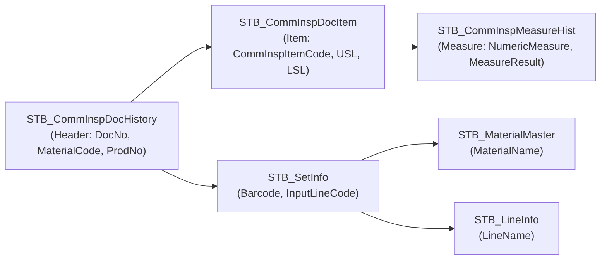
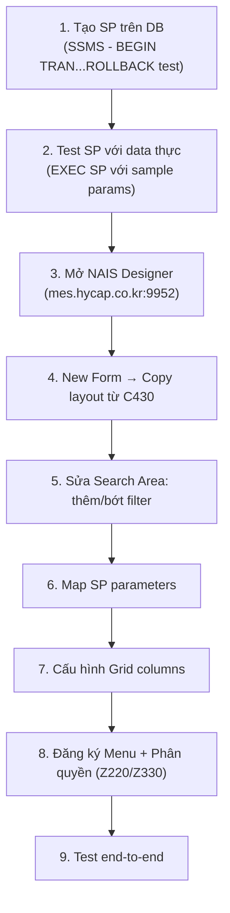

# Guide: Tạo Màn Hình Truy Vấn Kết Quả Kiểm Tra Độ Dày Lớp Phủ (Coating Thickness)

## Bối Cảnh

- **Màn C5300** hiện đang dùng để **nhập** dữ liệu kiểm tra coating thickness (PCBA BG2)
- Yêu cầu: Tạo màn hình **truy vấn** (query-only) kết quả, bố cục tương tự **C430** (RouteInspectionMeasureFullHist)
- Data lưu trong cùng hệ thống bảng CommInsp, với `CommInspTypeCode = 'ROUTE_QUALITY_PCBA_BG2'`

## Phân Tích Data

### Bảng & Quan Hệ



### Inspection Items liên quan (COATING)

| CommInspItemCode | CommInspItemName | Ghi chú |
|---|---|---|
| `COATING 1` | Top coating | |
| `COATING 2` | Bottom 1 | |
| `COATING 3` | Bottom 2 | |
| `COATING 11` | Độ dày | |

### Data mẫu

- **CommInspTypeCode:** `ROUTE_QUALITY_PCBA_BG2`
- **Tổng records:** ~530 (STB_CommInspDocHistory)
- **User nhập:** `vvtpqc_bg2`
- **Giá trị đo:** NumericMeasure (VD: 690, 580, 590...) + MeasureResult (OK/NG)

---

## Hướng Dẫn Phát Triển

### Bước 1: Tạo Stored Procedure truy vấn

SP mới dựa trên cấu trúc [usp_CommInspectionMeasureFullHist_get](file:///c:/Users/User%20Vinatech.DESKTOP-RJJSEQU/Desktop/PROCESS/MES/sql/procedures/usp_CommInspectionMeasureFullHist_get.sql) (SP của C430), nhưng filter cố định cho coating thickness.

**Tên đề xuất:** `usp_CoatingThicknessInspectionResult_get`

```sql
-- =============================================
-- Author:      <Tên dev>
-- Create date: 2026-06-23
-- Description: Truy vấn kết quả kiểm tra độ dày lớp phủ (Coating Thickness)
--              Màn hình query tương tự C430, data từ C5300 input
-- Test:
--   EXEC usp_CoatingThicknessInspectionResult_get 
--     'ducnv','Korean','VVT',NULL,'2026-06-01','2026-06-23',NULL,NULL,NULL
-- =============================================
CREATE PROCEDURE [dbo].[usp_CoatingThicknessInspectionResult_get]
    @pProcessUserID     VARCHAR(20),
    @pProcessLanguage   VARCHAR(20),
    @pCompanyCode       VARCHAR(20)  = NULL,
    @pWorkCenterCode    VARCHAR(20)  = NULL,
    @pFromDate          DATETIME,
    @pToDate            DATETIME,
    @pMaterialCode      VARCHAR(20)  = NULL,
    @pCommInspItemCode  VARCHAR(20)  = NULL,
    @pBarcode           VARCHAR(20)  = NULL,
    @pLineCode          VARCHAR(20)  = NULL,
    @pDecisionResult    VARCHAR(10)  = NULL   -- Thêm filter OK/NG
AS
BEGIN
    SET NOCOUNT ON;

    DECLARE 
        @CompanyCode     VARCHAR(20) = CASE WHEN ISNULL(@pCompanyCode,'') = '' THEN '*' ELSE @pCompanyCode END,
        @WorkCenterCode  VARCHAR(20) = CASE WHEN ISNULL(@pWorkCenterCode,'') = '' THEN '*' ELSE @pWorkCenterCode END,
        @FromDate        DATETIME    = CONVERT(VARCHAR(10), @pFromDate, 121) + ' 00:00:00',
        @ToDate          DATETIME    = CONVERT(VARCHAR(10), DATEADD(DAY, 1, @pToDate), 121) + ' 23:59:59',
        @MaterialCode    VARCHAR(20) = CASE WHEN ISNULL(@pMaterialCode,'') = '' THEN '*' ELSE @pMaterialCode END,
        @CommInspItemCode VARCHAR(20) = CASE WHEN ISNULL(@pCommInspItemCode,'') = '' THEN '*' ELSE @pCommInspItemCode END,
        @Barcode         VARCHAR(20) = CASE WHEN ISNULL(@pBarcode,'') = '' THEN '*' ELSE @pBarcode END,
        @LineCode        VARCHAR(20) = CASE WHEN ISNULL(@pLineCode,'') = '' THEN '*' ELSE @pLineCode END,
        @DecisionResult  VARCHAR(10) = CASE WHEN ISNULL(@pDecisionResult,'') = '' THEN '*' ELSE @pDecisionResult END;

    SELECT 
        SI.Barcode,
        SI.MaterialCode,
        MM.MaterialName,
        SI.InputLineCode    AS LineCode,
        LI.LineName,
        CII.CommInspItemCode,
        CII.CommInspItemName,
        CIMH.MeasureSeq,
        CIDI.CommInspLower   AS LSL,          -- Lower Spec Limit
        CIDI.CommInspUpper   AS USL,          -- Upper Spec Limit
        CASE 
            WHEN CII.CommInspInputType = '2' AND CIMH.MeasureResult = '0' THEN 'NG'
            WHEN CII.CommInspInputType = '2' AND (CIMH.MeasureResult = '1' OR CIMH.MeasureResult = 'OK') THEN 'OK'
            ELSE CONVERT(VARCHAR(15), CIMH.NumericMeasure) 
        END AS MeasureResult,
        CIMH.NumericMeasure,
        CIMH.MeasureDateTime,
        CIMH.MeasureUserID,
        CIDH.CommInspDocNo,
        CIDI.CommInspRemark
    FROM STB_CommInspMeasureHist CIMH WITH(NOLOCK)
        LEFT JOIN STB_CommInspDocItem    CIDI WITH(NOLOCK) ON CIMH.CommInspDocItemNo = CIDI.CommInspDocItemNo
        LEFT JOIN STB_CommInspDocHistory CIDH WITH(NOLOCK) ON CIDI.CommInspDocNo     = CIDH.CommInspDocNo
        LEFT JOIN STB_SetInfo           SI   WITH(NOLOCK) ON SI.ControlNo           = CIDH.ProdNo
        LEFT JOIN STB_CommInspItem      CII  WITH(NOLOCK) ON CII.CommInspItemCode   = CIDI.CommInspItemCode
        LEFT JOIN STB_LineInfo          LI   WITH(NOLOCK) ON SI.InputLineCode       = LI.LineCode
        LEFT JOIN STB_MaterialMaster    MM   WITH(NOLOCK) ON SI.MaterialCode        = MM.MaterialCode
    WHERE 1=1
        -- ★ Filter cố định: chỉ lấy data coating thickness (PCBA BG2)
        AND CIDH.CommInspTypeCode = 'ROUTE_QUALITY_PCBA_BG2'
        AND CIDI.CommInspItemCode LIKE 'COATING%'
        -- Filter động từ UI
        AND (@CompanyCode    = '*' OR CIDH.CompanyCode    = @CompanyCode)
        AND (@WorkCenterCode = '*' OR CIDH.WorkCenterCode = @WorkCenterCode)
        AND CIMH.MeasureDateTime BETWEEN @FromDate AND @ToDate
        AND (@Barcode        = '*' OR SI.Barcode          LIKE @Barcode + '%')
        AND (@MaterialCode   = '*' OR CIDH.MaterialCode   LIKE @MaterialCode + '%')
        AND (@CommInspItemCode = '*' OR CII.CommInspItemCode LIKE @CommInspItemCode + '%')
        AND (@LineCode       = '*' OR SI.InputLineCode    LIKE @LineCode + '%')
        AND (@DecisionResult = '*' OR CIMH.MeasureResult  = @DecisionResult)
    ORDER BY CIMH.MeasureDateTime DESC, CIMH.CommInspDocItemNo, CIMH.MeasureSeq;
END
```

> [!IMPORTANT]
> SP này chỉ SELECT, không INSERT/UPDATE/DELETE. An toàn để deploy.

---

### Bước 2: Cấu hình màn hình NAIS (SmartFramework)

Trong NAIS Designer, cần tạo:

#### 2.1 Tạo Menu mới

Vào **System → Menu Management** (hoặc nhờ admin):

| Thuộc tính | Giá trị |
|---|---|
| **MenuCode** | `C5301` hoặc `C5310` (theo numbering convention) |
| **MenuName** | `VVT_CoatingThicknessResult` |
| **Caption** | `Coating Thickness Inspection Result` |
| **ParentCode** | Cùng parent group với C5300 |

#### 2.2 Cấu hình Search Area

Tham khảo C430 layout, search area cần các filter:

| Filter | Parameter SP | Control Type | Ghi chú |
|---|---|---|---|
| **Date From/To** | `@pFromDate`, `@pToDate` | DatePicker | Mặc định 1 tháng gần nhất |
| **Material Code** | `@pMaterialCode` | TextBox + Popup | Popup tra MaterialMaster |
| **Line Code** | `@pLineCode` | ComboBox | Lấy từ STB_LineInfo |
| **Barcode** | `@pBarcode` | TextBox | Free text |
| **Inspection Item** | `@pCommInspItemCode` | ComboBox | Filter: COATING 1, 2, 3, 11 |
| **Decision Result** | `@pDecisionResult` | ComboBox | OK / NG / All |

#### 2.3 Cấu hình Grid (DataView)

**Grid chính** — `CoatingThicknessResult`:

| Column | Source Field | Width | Ghi chú |
|---|---|---|---|
| Barcode | `Barcode` | 150 | |
| Material Code | `MaterialCode` | 120 | |
| Material Name | `MaterialName` | 200 | |
| Line Code | `LineCode` | 80 | |
| Line Name | `LineName` | 120 | |
| Inspection Item | `CommInspItemName` | 150 | COATING 1/2/3/11 |
| Measure Seq | `MeasureSeq` | 60 | |
| LSL | `LSL` | 80 | Lower Spec Limit |
| USL | `USL` | 80 | Upper Spec Limit |
| Measure Value | `NumericMeasure` | 100 | Giá trị đo thực |
| Result | `MeasureResult` | 80 | OK/NG |
| Measure DateTime | `MeasureDateTime` | 150 | |
| Inspector | `MeasureUserID` | 100 | |

#### 2.4 Kết nối SP

Trong NAIS Designer:
1. **Select/Action** → `usp_CoatingThicknessInspectionResult_get`
2. **Parameter mapping**: Map mỗi search control → parameter SP tương ứng
3. **FocusRowStyle** → `CellFocus`
4. **DataAutoFill** → `True`

---

### Bước 3: Workflow thực hiện



---

### Bước 4: Script Deploy SP

> [!WARNING]
> Script dưới đây dùng `BEGIN TRAN...ROLLBACK` để test an toàn. Khi xác nhận OK thì đổi thành `COMMIT`.

```sql
BEGIN TRAN

-- Kiểm tra SP đã tồn tại chưa
IF EXISTS (SELECT 1 FROM sys.objects WHERE name = 'usp_CoatingThicknessInspectionResult_get' AND type = 'P')
BEGIN
    DROP PROCEDURE usp_CoatingThicknessInspectionResult_get
    PRINT 'Dropped existing SP'
END

-- Tạo SP mới
-- (paste nội dung CREATE PROCEDURE ở Bước 1 vào đây)

-- Test nhanh
EXEC usp_CoatingThicknessInspectionResult_get 
    'ducnv','Korean','VVT',NULL,'2026-06-01','2026-06-23',NULL,NULL,NULL

ROLLBACK -- Đổi thành COMMIT khi đã confirm OK
```

---

## User Review Required

> [!IMPORTANT]
> **Cần xác nhận trước khi tiến hành:**
> 1. **Screen ID mới**: Dùng `C5301` hay số khác? Cần check với admin NAIS xem ID nào trống
> 2. **CommInspTypeCode**: Confirm `ROUTE_QUALITY_PCBA_BG2` là đúng TypeCode cho coating thickness?
> 3. **Inspection Items**: Chỉ cần `COATING 1, 2, 3, 11` hay còn item khác?
> 4. **Phạm vi**: Chỉ BG2 hay cần cả Factory 1 (VVT_F1)?
> 5. **Export Excel**: Có cần nút export không?

## Open Questions

> [!WARNING]
> **Ai sẽ cấu hình NAIS Designer?** Nếu team EA (anh Triều) thì chỉ cần deliver SP. Nếu tự config thì cần quyền truy cập NAIS Designer.
