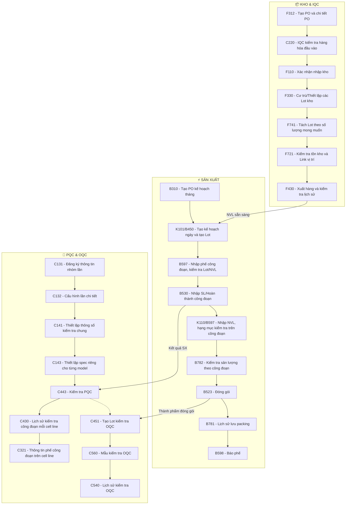

# KB_02 - Kho Nguyên Vật Liệu (WMS)

> **Màn hình:** F330, F312, F430, F110, F710, F721, F741, C220, HN551, HN866, HN544, FG00
> **Bảng chính:** `STB_MaterialLotInfo`, `STB_MaterialDocInfo`, `STB_MaterialStock`, `STB_MaterialWarehouse`
> **🔑 Keywords:** kho, warehouse, tồn kho, nhập kho, xuất kho, FIFO, holding, hết hạn, lot, NVL, nguyên vật liệu, phiếu nhập, phiếu xuất, chuyển kho
> ← [Về INDEX](KB_INDEX.md)

---

## 4. 📦 Kho Nguyên Vật Liệu (WMS)

> 🏭 **Cơ sở gốc:** VVT_F1 (Bắc Ninh) — F-series chuẩn dùng chung tất cả cơ sở
> 🔀 **Biến thể:** HN (Hà Nam): HN551/HN866 (kho TP), HN20-HN23 (kho R&D), HN544 (gộp túi bóng) | BG2: K181 (log ủy quyền NVL) → [KB_03 §6.14](KB_03_SAN_XUAT.md#614-nhà-máy-bg2--cấu-hình-triển-khai-hệ-thống-mes)

### 4.0 Sơ Đồ Quy Trình Tổng Quan (KHO & IQC -> SẢN XUẤT -> PQC & OQC)

> Sơ đồ dưới đây thể hiện luồng quy trình chính xuyên suốt 3 khu vực: **Kho & IQC**, **Sản xuất**, **PQC & OQC**. Mỗi bước gắn với Screen ID tương ứng trên hệ thống MES.



**Giải thích liên kết giữa 3 khu vực:**
- **KHO -> SẢN XUẤT:** Sau khi NVL qua IQC (C220) và nhập kho (F330), NVL sẵn sàng cấp cho sản xuất qua F430
- **SẢN XUẤT -> PQC:** Kết quả sản xuất tại B530 được kiểm tra PQC tại C443
- **SẢN XUẤT -> OQC:** Sau đóng gói (B523), thành phẩm chuyển sang OQC để tạo Lot kiểm tra (C451)
- **Đóng gói (B523):** Bộ chuyển thông tin Lot và số lượng sang bảng `STB_MaterialLotInfo` để quản lý và sử dụng

---

### 4.1 Tìm kiếm F721 trả về cả danh sách (không lọc được)

**Nguyên nhân:** Điều kiện lọc trong SP bị sai hoặc tham số truyền vào rỗng.

**Debug:**
```sql
SELECT OBJECT_DEFINITION(OBJECT_ID('usp_vvt_MaterialLotInfo_get'))
-- Tìm đến phần WHERE -> Kiểm tra điều kiện lọc theo MaterialCode
```

> ⚠️ **Lưu ý ẩn:** SP `usp_vvt_MaterialLotInfo_get` (tên "_get") thực tế **UPDATE 2 bảng** mỗi khi chạy - tự động điền `LotAttr10` cho các Lot bị thiếu ngày SX bằng cách parse mã Vendor Lot. Không có transaction bảo vệ phần UPDATE này.

---

### 4.2 Không tìm thấy mã lot ở màn C512

👉 **Chi tiết Nguyên nhân & Cách xử lý:** Xem tại [KB_05_QC_ELECTRODE.md § 7.2](KB_05_QC_ELECTRODE.md)

---

### 4.3 Chỉnh lại Kho bị nhập sai ở màn F330

**Triệu chứng:** Hàng nhập vào đúng nhưng kho bị chọn sai (VD: nhập vào kho BG nhưng lẽ ra phải vào kho BN).

> ⚠️ Phải UPDATE đồng thời **3 bảng**: `STB_MaterialDocInfo`, `STB_MaterialDocLotInfo`, `STB_MaterialLotInfo`. Thiếu bảng nào sẽ gây lệch dữ liệu.

```sql
-- Bước 1: Xác định MaterialDocNo
SELECT * FROM STB_MaterialDocInfo WHERE MaterialDocNo = '250221000220'

-- Bước 2: Sửa header phiếu
UPDATE STB_MaterialDocInfo
SET TargetMaterialWarehouseCode = 'ROH_HN_WH'
WHERE MaterialDocNo = '250221000220'

-- Bước 3: Tìm các LotID trong phiếu
SELECT LotID, MaterialLocationCode FROM STB_MaterialDocLotInfo
WHERE MaterialDocNo = '250221000220'

-- Bước 4: Update vị trí trong phiếu
UPDATE STB_MaterialDocLotInfo
SET MaterialLocationCode = 'ROH_HN_WH_01'
WHERE LotID IN ('LotID1', 'LotID2', ...)

-- Bước 5: Update tồn kho thực tế
UPDATE STB_MaterialLotInfo
SET MaterialWarehouseCode = 'ROH_HN_WH',
    MaterialLocationCode = 'ROH_HN_WH_01'
WHERE LotID IN ('LotID1', 'LotID2', ...)
```

**Mã kho hay dùng:**

| Nhà máy | WarehouseCode | LocationCode |
|---------|--------------|-------------|
| Bắc Giang | `ROH_BG_WH` | `ROH_BG_WH_01` |
| Hà Nam | `ROH_HN_WH` | `ROH_HN_WH_01` |
| Bắc Ninh (VVT) | `ROH_VN_WH` | `ROH_VN_WH_01` |

---

### 4.4 Chỉnh Code NVL nhập sai ở màn F312

**Triệu chứng:** Nhập nhầm mã NVL khi làm phiếu nhập kho F312.

```sql
-- Sửa đồng bộ 3 bảng (đầy đủ, bao gồm tồn kho thực tế)
-- Bước 1: Xem phiếu hiện tại
SELECT * FROM STB_MaterialDocDetail WHERE MaterialDocNo = '250806000399'
SELECT * FROM STB_MaterialDocLotInfo WHERE MaterialDocNo = '250806000399'

-- Bước 2: Sửa mã NVL trong Detail
UPDATE STB_MaterialDocDetail
SET MaterialCode = 'MÃ_ĐÚNG'
WHERE MaterialDocNo = '250806000399' AND MaterialCode = 'MÃ_SAI'

-- Bước 3: Sửa mã NVL trong LotInfo
UPDATE STB_MaterialDocLotInfo
SET MaterialCode = 'MÃ_ĐÚNG'
WHERE MaterialDocNo = '250806000399' AND MaterialCode = 'MÃ_SAI'

-- Bước 4: Sửa tồn kho thực tế
UPDATE STB_MaterialLotInfo
SET MaterialCode = 'MÃ_ĐÚNG'
WHERE LotID IN (
    SELECT LotID FROM STB_MaterialDocLotInfo WHERE MaterialDocNo = '250806000399'
)
```

---

### 4.5 Sửa số lượng màn F312

**Triệu chứng:** Số lượng phiếu nhập bị sai.

```sql
-- Xem số lượng hiện tại
SELECT * FROM STB_MaterialDocDetail
WHERE MaterialDocNo = '250213000154' AND MaterialCode = '122507G1PT0'

-- Sửa tất cả các cột số lượng
UPDATE STB_MaterialDocDetail
SET RequestQty = 200000, AllowQty = 200000, PickingAssignQty = 200000
WHERE MaterialDocNo = '250213000154' AND MaterialCode = '122507G1PT0'
```

---

### 4.6 Sửa ngày xuất kho màn F430

**Triệu chứng:** Hàng xuất kho bị ghi nhận sai ngày.

```sql
-- Tìm bản ghi cần sửa
SELECT * FROM STB_MaterialWarehouseInOutHist
WHERE LotID IN ('ML20250620000036', 'ML20250520000061')

-- Sửa ngày (giữ nguyên giờ phút giây)
UPDATE STB_MaterialWarehouseInOutHist
SET CreateDateTime = CAST('2025-06-30' AS DATETIME) + CAST(CreateDateTime AS TIME)
WHERE LotID IN ('ML20250620000036', 'ML20250520000061')
```

---

### 4.7 Chuyển Lot từ kho Holding ra kho chính

> **Mã HOLDING thực tế (xác minh DB 2026-05-17):** `HOLDING_VN_WH` (Bắc Ninh), `HOLDING_BG_WH` (Bắc Giang), `HOLDING_HN_WH` (Hà Nam).

```sql
-- Bước 1: Xem trạng thái Lot hiện tại
SELECT LotID, MaterialWarehouseCode, MaterialLocationCode
FROM STB_MaterialLotInfo WHERE LotID = 'ML20250430000174'

-- Bước 2: Cập nhật lịch sử xuất nhập (nếu có)
UPDATE STB_MaterialWarehouseInOutHist
SET TargetMaterialWarehouseCode = 'ROH_VN_WH'
WHERE LotID = 'ML20250430000174'

-- Bước 3: Cập nhật tồn kho
UPDATE STB_MaterialLotInfo
SET MaterialWarehouseCode = 'ROH_VN_WH',
    MaterialLocationCode = 'ROH_VN_WH_01'
WHERE LotID = 'ML20250430000174'
```

---

### 4.8 Sửa Location vật tư (F721 - Thuộc tính LotAttr09)

```sql
-- Xem location hiện tại
SELECT LotID, LotAttr09 AS [Location], MaterialLocationCode
FROM STB_MaterialDocLotInfo WHERE LotID = 'ML...'

-- Sửa location (phải sửa cả 2 bảng)
UPDATE STB_MaterialDocLotInfo SET LotAttr09 = 'Vị_Trí_Mới' WHERE LotID = 'ML...'
UPDATE STB_MaterialLotInfo SET MaterialLocationCode = 'Vị_Trí_Mới' WHERE LotID = 'ML...'
```
> **Xem vị trí trực quan:** `192.168.1.234:9000/tv`

---

### 4.9 FIFO & Validation NVL (Tắt/Bật chặn)

- **Tắt FIFO cho toàn bộ:** SP `usp_MaterialWarehouseInOutHist_iud` -> Comment out dòng FIFO check
- **Tắt FIFO cho NVL cụ thể:** SP `usp_VVTMaterialWarehouse_validFIFO`

> ⚠️ **Nordex Audit (từ 2026-02-05):** Logic chặn quét sai BOM trong SP `usp_RawMaterialInputHist_iud` đang bị **Comment Out tạm thời**. Hệ thống hiện chấp nhận NVL không có trong BOM - cần bật lại sau khi audit xong.

**Bypass NVL hết hạn (khi QC đã đồng ý):**
```sql
INSERT INTO stb_vvt_OpenExpiredMaterial
    (MaterialCode, LotID, ExpiredDate, OpenDate, OpenUserID, Remark)
VALUES
    ('mã_nvl', 'lot_id', '2026-04-10', GETDATE(), 'admin', 'QC đã kiểm tra OK')

-- Kiểm tra bypass đang active
SELECT * FROM stb_vvt_OpenExpiredMaterial
WHERE MaterialCode = 'mã_nvl' AND OpenDate >= DATEADD(DAY, -30, GETDATE())
```

---

### 4.10 Kiểm tra Hạn sử dụng NVL (Expiry Date)

- **Ngày sản xuất:** Cột `LotAttr10` trong `STB_MaterialDocLotInfo`
- **Shelf Life:** Cột `MMExtInt01` trong `STB_MaterialMaster`
- **Hạn dùng = LotAttr10 + MMExtInt01 (tháng)**
- **Đặc biệt `MDFLUX-002`:** hardcode 179 ngày thay vì 180

```sql
-- Tra cứu nhanh hạn sử dụng của 1 Lot
SELECT
    MDLI.LotID,
    MDLI.LotAttr10 AS [Ngày_SX],
    MM.MMExtInt01 AS [Hạn_Tháng],
    DATEADD(MONTH, MM.MMExtInt01, MDLI.LotAttr10) AS [Ngày_Hết_Hạn],
    CASE WHEN DATEADD(MONTH, MM.MMExtInt01, MDLI.LotAttr10) < GETDATE()
         THEN 'ĐÃ HẾT HẠN' ELSE 'CÒN HẠN' END AS [Trạng_Thái]
FROM STB_MaterialDocLotInfo MDLI
JOIN STB_MaterialMaster MM ON MDLI.MaterialCode = MM.MaterialCode
WHERE MDLI.LotID = 'ML...'
```

**Xử lý nếu hết hạn nhưng hàng vẫn dùng được:**
1. Báo QC xác nhận gia hạn
2. Thêm vào `stb_vvt_OpenExpiredMaterial` (xem §4.9) hoặc sửa `LotAttr10` / tăng `MMExtInt01`

**Hướng dẫn thay đổi hạn sử dụng NVL (Ví dụ: từ 5 tháng lên 6 tháng ở màn F330):**
- **Cách 1 (Qua UI):** Vào màn hình **A230 (Thông tin NVL Master)** -> Tìm kiếm theo mã nguyên vật liệu -> Tại cột cấu hình hạn sử dụng (**Shelf Life (tháng)** hoặc **MMExtInt01**) sửa đổi giá trị (VD từ `5` lên `6`) -> Bấm **Save** để lưu.
- **Cách 2 (Qua SQL Query):**
  ```sql
  -- Bước 1: SELECT kiểm tra trước
  SELECT MaterialCode, MaterialName, MMExtInt01
  FROM STB_MaterialMaster
  WHERE MaterialCode = 'MÃ_NVL'; -- VD: 'MDFLUX-003'

  -- Bước 2: UPDATE qua Transaction
  BEGIN TRAN;
  UPDATE STB_MaterialMaster
  SET MMExtInt01 = 6 -- Số tháng hạn dùng mới
  WHERE MaterialCode = 'MÃ_NVL';
  
  -- SELECT lại xác nhận
  SELECT MaterialCode, MaterialName, MMExtInt01 FROM STB_MaterialMaster WHERE MaterialCode = 'MÃ_NVL';
  
  COMMIT TRAN; -- hoặc ROLLBACK TRAN;
  ```
- **Lưu ý:** Sau khi thay đổi, ngày hết hạn mới ở màn F330 sẽ tự động cập nhật real-time theo cấu hình mới. Đối với các mã dung môi đặc biệt (như `MDFLUX-002`), hệ thống áp dụng logic `(MMExtInt01 * 30) - 1` ngày (6 tháng tương đương 179 ngày).

---

### 4.11 Lỗi không lưu được F330 - Cấu hình và sửa lỗi đọc "Đặc tính 10" (Vendor Lot No)

**Triệu chứng:** F330 báo lỗi khi nhập mã Lot nhà cung cấp ở "Đặc tính 10" (hoặc Lot tự động bị đưa vào kho `HOLDING` do thiếu Đặc tính 10).

**Bản chất:** "Đặc tính 10" (`LotExtText10` / `LotAttr10`) đại diện cho mã Vendor Lot của nhà cung cấp. Mặc định hệ thống sử dụng hàm parse SQL để tự động bóc tách thông tin ngày sản xuất từ mã này.

Có **3 cách xử lý/thiết lập** tùy thuộc vào tình huống:

#### Cách 1: Cấu hình độ dài quét tem trên UI F330 (Khi mã Lot Vendor quá dài)
* **Vị trí thiết lập:** Vào màn hình **F330** -> Tab thứ 3.
* **Thực hiện:** Thiết lập cấu hình chiều dài quét của mã để cắt chuỗi barcode lấy phần Lot phù hợp, giúp tránh lỗi do chuỗi barcode truyền vào quá dài.

#### Cách 2: Chỉnh sửa hàm tự động parse ngày sản xuất trong SQL (Phương pháp chuẩn hay dùng)
Khi nhà cung cấp thay đổi định dạng mã Lot Vendor, hệ thống sẽ không đọc được ngày sản xuất, gây lỗi `Exception occurred` hoặc tính sai hạn dùng. Bạn cần sửa đổi các SQL Function tương ứng.

##### 1. Phân biệt 2 Function của hệ thống:
* **Hàm [fn_VVT_getdatebyVendorLot](KB_10_KIEN_TRUC_VA_DATAFLOW.md) (2 tham số: `@materialcode`, `@vendorlot`):**
  * Dùng cho các vật tư chỉ có một định dạng Vendor Lot duy nhất từ một nhà cung cấp, không phân biệt nhà cung cấp khác nhau.
* **Hàm [fn_VVT_getdatebyVendorLot_MergeCode](KB_10_KIEN_TRUC_VA_DATAFLOW.md) (3 tham số: `@materialcode`, `@vendorlot`, `@sourceCustomerCode`):**
  * Dùng khi **cùng một mã vật tư** nhưng được cung cấp bởi **nhiều nhà cung cấp khác nhau** (`@sourceCustomerCode` ví dụ: `VV033`, `VV040`, `VV034`...) có định dạng mã Lot khác nhau (đặc biệt là nhóm Vỏ nhôm `GBAKAC-%`, Sleeve `GCMDPT-%`, Băng keo `GBRLAC-%`).

##### 2. Sửa ở đâu và sửa thế nào?
* **Bước 1: Xác định hàm cần sửa**
  Xem Stored Procedure của màn hình (ví dụ: `usp_MaterialDocLotInfo_get` hoặc `usp_vvt_MaterialLotInfo_get`) đang gọi hàm nào. Thường các nâng cấp mới của Vinatech đều ưu tiên chuyển qua dùng hàm 3 tham số `fn_VVT_getdatebyVendorLot_MergeCode` để quản lý theo nhà cung cấp (NCC).
* **Bước 2: Viết câu lệnh `ALTER FUNCTION`**
  Thêm một nhánh `WHEN` vào khối `CASE` của function tương ứng trong database.

##### 3. Các mẫu viết logic parse ngày thông dụng:

* **Mẫu 1: Định dạng Year-Month-Day dạng số thông thường (ví dụ: `260530...` -> 2026-05-30)**
  ```sql
  when @materialcode in ('MÃ_VẬT_TƯ') then '20'+ substring(@vendorlot,1,2)+'-'+ substring(@vendorlot,3,2)+'-'+ substring(@vendorlot,5,2)
  ```
  *(Nếu lấy năm 4 chữ số thì dùng `substring(@vendorlot,1,4)` tùy vị trí)*

  *Ví dụ thực tế (`GBCP00-005` với mã lot `H226042815` -> `2026-04-28`):*
  Năm (`26`) nằm từ ký tự thứ 3 (độ dài 2), Tháng (`04`) nằm từ ký tự thứ 5 (độ dài 2), Ngày (`28`) nằm từ ký tự thứ 7 (độ dài 2).
  * **Nếu viết mới:**
    ```sql
    when @materialcode = 'GBCP00-005' then '20' + substring(@vendorlot,3,2) + '-' + substring(@vendorlot,5,2) + '-' + substring(@vendorlot,7,2)
    ```
  * **Nếu gộp vào Case có sẵn (Khuyên dùng):** Trong hàm `fn_VVT_getdatebyVendorLot_MergeCode` đã có sẵn nhóm dùng chung logic parse này. Chỉ cần chèn thêm `'GBCP00-005'` vào danh sách `IN` có sẵn:
    ```sql
    when @materialcode in ('GCTN00-003', 'GBCP00-004', 'GBCP00-005') then 
        '20' + substring(@vendorlot,3,2) + '-' + substring(@vendorlot,5,2) + '-' + substring(@vendorlot,7,2)
    ```

* **Mẫu 2: Phân biệt theo Nhà cung cấp (`@sourceCustomerCode`)** (Chỉ dùng trong hàm `_MergeCode`)
  
  *Ví dụ 1: Vỏ nhôm `GBAKAC-005` phân biệt giữa NCC `VV033` và các NCC khác:*
  ```sql
  when @materialcode = 'GBAKAC-005' then 
      case 
          when @sourceCustomerCode = 'VV033' then '20'+ substring(@vendorlot,5,2) +'-'+ substring(@vendorlot,7,2) +'-'+ substring(@vendorlot,9,2)
          else '20'+ substring(@vendorlot,5,2) +'-'+ substring(@vendorlot,7,2) +'-'+ substring(@vendorlot,9,2)
      end
  ```

  *Ví dụ 2: Băng keo `GBRLAC-005` từ NCC `VV040` (Mã Lot dạng `062182605230673302` -> parse thành `2026-05-23`):*
  ```sql
  when @materialcode = 'GBRLAC-005' then 
      case 
          when @sourceCustomerCode = 'VV040' then '20' + substring(@vendorlot,6,2) + '-' + substring(@vendorlot,8,2) + '-' + substring(@vendorlot,10,2)
          else '20' + substring(@vendorlot,5,2) + '-' + substring(@vendorlot,7,2) + '-' + substring(@vendorlot,9,2)
      end
  ```

* **Mẫu 3: Định dạng mã hóa Tháng bằng Chữ cái (A=10, B=11, C=12 hoặc A=01, B=02...)**
  ```sql
  when @materialcode = 'GBAKAC-039' then '202'+ substring(@vendorlot,2,1) -- Năm
                                         +'-'
                                         + right('0' + case 
                                         when substring(@vendorlot,3,1)='A' then '10'
                                         when substring(@vendorlot,3,1)='B' then '11'
                                         when substring(@vendorlot,3,1)='C' then '12'
                                         else substring(@vendorlot,3,1) end,2) -- Tháng
                                         +'-'
                                         + substring(@vendorlot,4,2) -- Ngày
  ```

* **Mẫu 4: Định dạng cứng ngày 15 hàng tháng (khi mã Lot chỉ có Năm-Tháng)**
  ```sql
  when @materialcode='GADPCB-002' then '20'+ substring(@vendorlot,1,2)+'-'+ substring(@vendorlot,3,2) + '-15'
  ```

##### 4. Nguyên tắc kiểm tra sau khi sửa:
Chạy lệnh `SELECT` kiểm tra hàm trực tiếp trong SSMS trước khi thực hiện giao dịch nhập kho:
```sql
SELECT [dbo].[fn_VVT_getdatebyVendorLot_MergeCode]('MÃ_VẬT_TƯ', 'MÃ_VENDOR_LOT_TEST', 'MÃ_NCC')
-- Kết quả trả về phải đúng định dạng YYYY-MM-DD (Ví dụ: '2026-05-30')
```

#### Cách 3: Sửa thủ công bằng SQL (Workaround bypass nhanh)
Nếu cần đưa Lot ra khỏi kho HOLDING và bổ sung Đặc tính 10 khẩn cấp:
```sql
-- Bước 1: Thêm Đặc tính 10 (Mã Lot Vendor) vào Lot
UPDATE STB_MaterialLotInfo
SET LotExtText10 = 'MÃ_LOT_VENDOR_ĐÚNG'
WHERE LotID = 'lot_id_cần_sửa';

-- Bước 2: Kéo Lot ra khỏi kho HOLDING về kho chính (Ví dụ: ROH_BN_WH)
UPDATE STB_MaterialLotInfo
SET MaterialWarehouseCode = 'ROH_BN_WH', 
    MaterialLocationCode = 'ROH_BN_WH_01'
WHERE LotID = 'lot_id_cần_sửa';

-- Bước 3: Cập nhật đồng bộ Ngày sản xuất (LotAttr10) để tránh lỗi hạn dùng (Expiry Date check)
UPDATE STB_MaterialDocLotInfo  
SET LotAttr10 = 'YYYY-MM-DD' -- Ví dụ: '2026-04-10'
WHERE LotID = 'lot_id_cần_sửa';

UPDATE STB_MaterialLotInfo  
SET LotAttr10 = 'YYYY-MM-DD'
WHERE LotID = 'lot_id_cần_sửa';
```

---

### 4.12 Lỗi "Không tồn tại thiết lập Vỏ Nhôm" (B597)

*   **Triệu chứng:** `"Không tồn tại thiết lập Vỏ Nhôm của LotNo... với mã Vỏ Nhôm: GBDYAC-004 <> ECVT30-367"`
*   **Chi tiết & Giải pháp:** Xem chi tiết nguyên nhân gốc, cách trace và SQL script khắc phục tại [KB_05_QC_ELECTRODE.md#74-b597-báo-lỗi-không-tồn-tại-thiết-lập-vỏ-nhôm](KB_05_QC_ELECTRODE.md#74-b597-báo-lỗi-không-tồn-tại-thiết-lập-vỏ-nhôm).
*   **Checklist lỗi B597 đầy đủ:** Xem tại [KB_05_QC_ELECTRODE.md#83-checklist-khi-b597-báo-lỗi-khi-lưu-nvl](KB_05_QC_ELECTRODE.md#83-checklist-khi-b597-báo-lỗi-khi-lưu-nvl).

---

### 4.13 FIFO Kho thành phẩm (FG00)

- **VVT (Bắc Ninh):** SP `usp_VN_Update_ExportExcel`
- **Bắc Giang:** SP `usp_VN_Update_ExportExcel_BG`
- **Bật/tắt FIFO cho FG:** Vào màn **F110** -> Tích/bỏ tích option FIFO

---

### 4.14 Xóa mã Sparepart thừa

```sql
SELECT * FROM STB_VNSparePartInfo WHERE sparepartcode = '[Mã cần xóa]'
DELETE FROM STB_VNSparePartInfo WHERE sparepartcode = '[Mã cần xóa]'
```

---

### 4.15 Luồng nhập kho đầy đủ (F330)

```
Groupware (Arrival Confirmation duyệt xong)
    ↓
F330 - Nhận hàng, in tem NVL, gán Lot vào kho
    ↓
C220 - IQC kiểm tra chất lượng -> PASS
    ↓
Groupware (Receiving Confirmation)
    ↓
NVL sẵn sàng cho sản xuất
```

> Không nhập được F330 -> Groupware chưa duyệt Arrival Confirmation?
> Không làm được Receiving Confirmation -> C220 chưa PASS?

---

### 4.16 Hủy phiếu nhập kho F330 đã Confirmed

> ⚠️ **Chỉ làm khi hàng chưa được xuất kho hoặc dùng sản xuất.**

```sql
-- Bước 1: Tìm phiếu cần hủy
SELECT * FROM STB_MaterialDocInfo WHERE MaterialDocNo = 'Số_Tài_Liệu'

-- Bước 2: Kiểm tra xem đã có IQC chưa - nếu có phải xóa IQC records trước
SELECT * FROM STB_MaterialQcInfo WHERE MaterialDocNo = 'Số_Tài_Liệu'
-- Nếu có IQC PASS -> xóa thêm:
DELETE FROM STB_IQcDefectReport WHERE MaterialDocNo = 'Số_Tài_Liệu'
DELETE FROM STB_MaterialQcInfo WHERE MaterialDocNo = 'Số_Tài_Liệu'

-- Bước 3: Lấy danh sách LotID
SELECT LotID FROM STB_MaterialDocLotInfo WHERE MaterialDocNo = 'Số_Tài_Liệu'

-- Bước 4: Xóa theo thứ tự ngược (tránh lỗi FK)
DELETE FROM STB_MaterialLotInfo WHERE LotID IN (
    SELECT LotID FROM STB_MaterialDocLotInfo WHERE MaterialDocNo = 'Số_Tài_Liệu'
)
DELETE FROM STB_MaterialDocLotInfo WHERE MaterialDocNo = 'Số_Tài_Liệu'
DELETE FROM STB_MaterialDocDetail WHERE MaterialDocNo = 'Số_Tài_Liệu'
DELETE FROM STB_MaterialDocInfo WHERE MaterialDocNo = 'Số_Tài_Liệu'
```

---

### 4.17 Thu hồi Lot từ F430 về kho (Revert xuất kho)

**Tình huống:** Cần revert hàng đã xuất ở F430 về lại kho.

```sql
-- Bước 1: Xem trạng thái tồn kho hiện tại
SELECT LotID, MaterialWarehouseCode, MaterialLocationCode, CurrentQty
FROM STB_MaterialLotInfo WHERE LotID = 'ML20260407000696'

-- Bước 2: Tìm ID giao dịch xuất kho cần xóa
SELECT MaterialWarehouseInOutHistNo, SourceMaterialWarehouseCode,
       TargetMaterialWarehouseCode, CreateDateTime
FROM STB_MaterialWarehouseInOutHist
WHERE LotID = 'ML20260407000696'
ORDER BY CreateDateTime DESC

-- Bước 3: Xem vị trí gốc lúc mới nhập kho
SELECT LotID, MaterialLocationCode
FROM STB_MaterialDocLotInfo WHERE LotID = 'ML20260407000696'

-- Bước 4: Thực hiện revert
BEGIN TRAN
    DELETE FROM STB_MaterialWarehouseInOutHist
    WHERE MaterialWarehouseInOutHistNo = 'MÃ_GIAO_DỊCH_CẦN_XÓA'

    UPDATE STB_MaterialLotInfo
    SET MaterialWarehouseCode = 'ROH_HN_WH',
        MaterialLocationCode = 'ROH_HN_WH_01'
    WHERE LotID = 'ML20260407000696'

    SELECT * FROM STB_MaterialLotInfo WHERE LotID = 'ML20260407000696'
-- COMMIT khi chắc chắn đúng, ROLLBACK nếu sai
```

> **Tại sao phải xóa `STB_MaterialWarehouseInOutHist`?** Nếu chỉ sửa kho mà không xóa lịch sử, báo cáo xuất nhập tồn cuối tháng sẽ bị lệch.

#### 📝 Ví dụ thực tế (Hủy xuất / Trả lại kho Hà Nam):
Giao dịch xuất sai lúc 12:07 trưa ngày 11/05/2026 cho Lot `ML20260209000136`.
1. **Kiểm tra trạng thái hiện tại:**
   ```sql
   -- Kiểm tra Lot đang ở kho nào
   SELECT MaterialWarehouseCode, MaterialLocationCode FROM STB_MaterialLotInfo WHERE LotID = 'ML20260209000136';
   -- Kết quả: Lot đang ở kho ROUTE_HN_WH (đã lên chuyền).

   -- Trích xuất lịch sử xuất/nhập để tìm MaterialWarehouseInOutHistNo đại diện cho cú click xuất sai tại F430
   SELECT * FROM STB_MaterialWarehouseInOutHist
   WHERE LotID = 'ML20260209000136'
   ORDER BY CreateDateTime DESC;
   -- Kết quả: Tìm được MaterialWarehouseInOutHistNo = '20260511000320' (xuất bởi user VES-019 lên chuyền VELINE-09 lúc 12:07:31).
   ```
2. **Kịch bản sửa lỗi an toàn bằng Transaction:**
   ```sql
   BEGIN TRAN;

   -- B1: Xóa vệt log giao dịch xuất kho tại F430
   DELETE FROM STB_MaterialWarehouseInOutHist 
   WHERE LotID = 'ML20260209000136' AND MaterialWarehouseInOutHistNo = '20260511000320';

   -- B2: Kéo cuộn nguyên liệu từ kho ảo trên chuyền (ROUTE_HN_WH) quay trở về kho vật lý gốc (ROH_HN_WH)
   UPDATE STB_MaterialLotInfo
   SET 
       MaterialWarehouseCode = 'ROH_HN_WH', 
       MaterialLocationCode = 'ROH_HN_WH_01'
   WHERE LotID = 'ML20260209000136';

   -- Kiểm tra lại trước khi chốt
   SELECT * FROM STB_MaterialLotInfo WHERE LotID = 'ML20260209000136';

   COMMIT TRAN; -- Hoặc ROLLBACK nếu có lỗi
   ```

---

### 4.14 Fix: LIKE filter sai cho MaterialLocationCode khi cập nhật LotAttr10 (Đặc tính 10)

> **Ngày phát hiện:** 2026-06-03
> **Màn hình:** F330, F710
> **SP liên quan:** `usp_DoChangeMaterialDocLotInfo`, `usp_vvt_MaterialLotInfo_get`
> **Root cause:** Điều kiện `LIKE` filter cho `MaterialLocationCode` không match vì thiếu trailing `%`

#### Mô tả lỗi
- Khi nhập nguyên vật liệu vào kho BG2 (`MODULE_BG2_WH_01`), trường `LotAttr10` (Đặc tính 10 / Ngày SX Vendor) không được tự động parse từ `LotNo`.
- Giá trị `LotAttr10` giữ nguyên `1900-01-01` thay vì chuyển thành ngày đúng (ví dụ: `20260528` → `2026-05-28`).

#### Nguyên nhân gốc
Trong 2 SP `usp_DoChangeMaterialDocLotInfo` và `usp_vvt_MaterialLotInfo_get`, đoạn UPDATE `LotAttr10` có điều kiện:
```sql
MaterialLocationCode LIKE '%BG2_WH'  -- ❌ SAI
```
Nhưng tất cả location code đều có suffix `_01`, ví dụ:
- `MODULE_BG2_WH_01` ← không match `'%BG2_WH'`
- `HEADQUARTER_VN_WH_01` ← không match `'%VN_WH'`

Lỗi tương tự xảy ra cho `%VN_WH`, `%BG_WH`, `%HN_WH`.

#### Cách fix
Thêm trailing `%` vào tất cả LIKE pattern:
```sql
MaterialLocationCode LIKE '%BG2_WH%'  -- ✅ ĐÚNG
MaterialLocationCode LIKE '%VN_WH%'   -- ✅ ĐÚNG
MaterialLocationCode LIKE '%BG_WH%'   -- ✅ ĐÚNG
MaterialLocationCode LIKE '%HN_WH%'   -- ✅ ĐÚNG
```

#### Lưu ý quan trọng
- Lỗi này ảnh hưởng **tất cả các kho** nếu location code có suffix (không chỉ BG2).
- Sau khi fix SP, cần chờ user mở lại F330/F710 để SP tự động cập nhật các lot cũ.
- Hàm `fn_VVT_getdatebyVendorLot_MergeCode` parse ngày **hoạt động đúng** — lỗi chỉ nằm ở WHERE clause.

*Cập nhật: 2026-06-10*

---

### 4.19 F110 — Xác nhận nhập kho và Cấu hình Kho (Warehouse Configurations)

**Màn hình:** F110 (Xác nhận nhập kho NVL sau IQC)  
**Bảng DB liên quan:** `STB_MaterialWarehouse`, `STB_MaterialStockAttributeInfo`

#### 1. Cơ chế quản lý kho ảo & Line Warehouse (`STB_MaterialWarehouse`)
Mỗi kho trong hệ thống (kể cả kho ảo trên các chuyền sản xuất) được quản lý trong bảng `STB_MaterialWarehouse`. Cờ `IsRouteWarehouse = 1` dùng để phân biệt kho ảo cạnh chuyền (Route Warehouse) với kho vật lý thông thường.

#### 2. Cấu hình quản lý tồn kho theo từng mã nguyên vật liệu (`STB_MaterialStockAttributeInfo`)
Với mỗi mã nguyên vật liệu (`MaterialCode`), hệ thống cấu hình các cờ điều kiện sau để quyết định hành vi nhập/xuất tại F110/F330/F430:
*   `IsUseBarcode`: Có bắt buộc quản lý và quét bằng tem nhãn barcode hay không.
*   `IsFIFO`: Có kích hoạt tính năng kiểm tra Nhập trước - Xuất trước (FIFO) đối với mã này hay không.
*   `IsLotUse`: Có bắt buộc tách hàng thành các mã Lot riêng biệt để theo dõi vòng đời hay không.
*   *Lưu ý lỗi:* Nếu nguyên vật liệu mới không gộp box được (lỗi tại B523), thủ kho cần kiểm tra xem mã vật tư đó đã được tích đầy đủ các cờ cấu hình trên hay chưa (Xem hướng dẫn thiết lập Master Data tại [KB_06 § 2.1](KB_06_MASTER_DATA_TOOLS.md)).

---

### 4.20 F741 — Quy trình Tách Lot Nguyên Vật Liệu (Lot Splitting)

**Màn hình:** F741 (Tách Lot trước khi cấp lên chuyền)  
**Stored Procedure chính:** `usp_DoSplitRawMaterialAndMove`  
**Bảng ghi nhận lịch sử:** `STB_SupportRawMaterialSplitHist`

#### 1. Quy trình nghiệp vụ thực tế
Khi xuất nguyên vật liệu lên dây chuyền sản xuất, nếu số lượng cuộn/thùng gốc quá lớn so với nhu cầu của chuyền, thủ kho sử dụng màn hình F741 để tách Lot gốc thành các Lot con có số lượng nhỏ hơn.

#### 2. Logic xử lý chi tiết trong database
Khi thủ kho click xác nhận tách Lot trên UI, hệ thống sẽ thực hiện SP `usp_DoSplitRawMaterialAndMove` theo các bước:
1.  **Kiểm tra điều kiện Lot cha:**
    *   Lot gốc (`@pMaterialLotNo`) phải tồn tại trong bảng `STB_MaterialLotInfo`.
    *   `PickingQty = 0` (Lot hiện tại không trong trạng thái đang bị khóa để xuất kho).
    *   Số lượng yêu cầu tách (`@pSplitQty`) phải lớn hơn `0` và nhỏ hơn số lượng tồn hiện tại của Lot cha (`CurrentQty`).
2.  **Sinh Lot con mới:**
    *   Gọi hàm `SmartFramework.dbo.usp_DoCreateSerial` để tự động sinh mã số `MaterialLotNo` mới cho Lot con.
3.  **Tạo bản ghi Lot con (`STB_MaterialLotInfo`):**
    *   Sao chép toàn bộ thông tin thuộc tính từ Lot cha sang Lot con.
    *   Đặt `InitialQty = @pSplitQty` và `CurrentQty = @ppSplitQty`.
    *   Đặt cờ `IsSplitLot = 1` để đánh dấu đây là Lot được tách.
    *   Ghi nhận `BefMaterialLotNo` = `MaterialLotNo` của Lot cha (hoặc giữ nguyên Lot gốc ban đầu nếu Lot cha cũng là Lot đã tách).
    *   Thiết lập lại `PackingID` = `LotID` mới (Lot con sẽ có mã đóng gói riêng độc lập với Lot cha).
4.  **Cập nhật tồn kho Lot cha:**
    *   Giảm số lượng tồn thực tế của Lot cha trong `STB_MaterialLotInfo`:
        ```sql
        UPDATE STB_MaterialLotInfo
        SET CurrentQty = CurrentQty - @SplitQty
        WHERE MaterialLotNo = @MaterialLotNo;
        ```
5.  **Ghi log giao dịch:**
    *   Ghi nhận log giao dịch xuất nhập kho ảo trong bảng `STB_MaterialWarehouseInOutHist`.
    *   Ghi nhận liên kết cha-con vào bảng đối chiếu `STB_SupportRawMaterialSplitHist`:
        ```sql
        INSERT INTO STB_SupportRawMaterialSplitHist (MergeLotID, SplitLotID, TotalCurrentQty, SplitQty, IsFixed, CreateDateTime, CreateUserID)
        VALUES (@MaterialLotNo, @NewMaterialLotNo, @CurrentQty - @SplitQty, @SplitQty, 0, GETDATE(), @ProcessUserID);
        ```
6.  **Di chuyển vị trí:** Nếu người dùng truyền vào vị trí đích (`@pTargetLocation`), hệ thống sẽ tự động cập nhật vị trí mới cho Lot con vừa sinh ra.

---

### 4.21 F430 — Chi tiết Quy trình Xuất kho NVL (WMS Export Logic)

**Màn hình:** F430 (Xuất kho nguyên vật liệu)  
**Stored Procedure chính:** `usp_MaterialWarehouseInOutHist_iud_ConfirmExportNVL`  
**SP kiểm tra logic:** `usp_VVTMaterialWarehouse_validFIFO`

#### 1. Quy trình nghiệp vụ thực tế
Thủ kho quét mã Lot của nguyên vật liệu tại F430 để xác nhận xuất kho cấp cho sản xuất. Hàng sau khi quét sẽ chuyển từ các kho vật lý gốc (`ROH_VN_WH`, `ROH_HN_WH`...) sang kho ảo trên các chuyền sản xuất (`ROUTE_WH`, `ROUTE_HN_WH`...).

#### 2. Logic xử lý chi tiết trong database
1.  **Kiểm tra FIFO bắt buộc:**
    *   Đối với các kho nguyên liệu chính như `ROH_WH` hoặc `ROH_VN_WH`, hệ thống gọi SP `usp_VVTMaterialWarehouse_validFIFO` với tham số `@pKindCheck = 'FIFO'`.
    *   SP này đối soát ngày nhập kho (`GRDate`) của Lot đang quét với các Lot cùng mã hàng đang tồn trong kho. Nếu phát hiện có Lot nhập trước nhưng chưa được xuất, hệ thống sẽ chặn giao dịch và báo lỗi vi phạm nguyên tắc FIFO.
2.  **Khấu trừ & Di chuyển vị trí:**
    *   Hệ thống cập nhật thông tin kho và vị trí mới cho Lot trong bảng `STB_MaterialLotInfo` (Chuyển `MaterialWarehouseCode` sang kho ảo cạnh chuyền tương ứng với Line sản xuất được chọn).
    *   Ghi log lịch sử xuất kho chi tiết vào bảng `STB_MaterialWarehouseInOutHist` để phục vụ đối soát và báo cáo xuất nhập tồn cuối tháng.
3.  **Khôi phục xuất kho (Revert):**
    *   Nếu thủ kho quét xuất nhầm Lot, không được thực hiện xuất đè hay cập nhật thủ công một bảng riêng lẻ. Quy trình khôi phục chuẩn yêu cầu xóa dòng log giao dịch tương ứng trong `STB_MaterialWarehouseInOutHist` và cập nhật lại kho/vị trí gốc của Lot trong `STB_MaterialLotInfo` về kho vật lý ban đầu (Xem chi tiết câu lệnh rollback tại mục §4.17).

---

### 4.22 Hướng Dẫn Vận Hành & Khắc Phục Lỗi Quy Trình Kho NVL (WMS)

Dưới đây là cẩm nang vận hành chi tiết các màn hình thuộc phân hệ Kho Nguyên Vật Liệu (WMS) được đúc kết từ tài liệu thực tế của nhà máy:

#### 1. Quản lý Nhà cung cấp & Chỉ định Vật tư (A130, F130, F140)
*   **A130 (Thông tin đối tác giao dịch):** Dùng để thêm, sửa, xóa thông tin nhà cung cấp NVL và tài khoản đối tác.
*   **F130 / F140 (Chỉ định nhà cung cấp - vật tư):** Thiết lập mối quan hệ ánh xạ giữa mã NVL và mã nhà cung cấp (Vendor). Chỉ khi được thiết lập tại đây thì NVL mới có thể gọi ra trong các phiếu nhập kho.

#### 2. Tạo ghi chú đơn hàng nhập kho F312 (Inward Slip)
*   Thực hiện chọn "Code bên giao dịch" (liên kết từ cấu hình F130) để hiển thị danh sách NVL được phép của nhà cung cấp đó.
*   **⚠️ Khắc phục lỗi NVL không hiển thị trong màn hình F312:** Khi lập phiếu mà không tìm thấy mã NVL của nhà cung cấp trong ô lựa chọn, kiểm tra 3 nguyên nhân sau:
    1.  Mã NVL chưa được Map với nhà cung cấp tại màn hình **F140/F130**.
    2.  Mã NVL đang bị khóa/ngưng sử dụng trong màn hình **A230 (Thông tin vật liệu)** (cột "Đang đóng" bị tích chọn).
    3.  Mã NVL không bị đóng ở A230 nhưng **chưa tích chọn** vào 2 cột thuộc tính: **"Đang mua"** và **"Đang đặt hàng"** (đây là các cờ cấu hình bắt buộc cho hàng mua ngoài).
*   Nhập số lượng yêu cầu thực tế (`RequestQty`) và nhấn biểu tượng **Save** ở lưới bên dưới để lưu.

#### 3. Tiếp nhận, Nhập kho và In tem tại F330 (Warehouse Entry & Label Printing)
*   **Bước 1 (Xử lý hàng về):** Khi phiếu F312 mới tạo được gọi ra ở F330, cột `DocStatusName` ban đầu sẽ hiển thị trạng thái **"CREATE"**. Thủ kho bắt buộc phải click chọn dòng dữ liệu và nhấn nút **"Xử lý hàng nhập về"** để hệ thống chuyển trạng thái sang **"ARRIVAL"**. Lúc này nút tạo Lot mới sáng lên để thao tác.
*   **Bước 2 (Chia tem & Khai báo đặc tính 10):**
    *   Nhập `PackingQty` (Số lượng NVL của 1 tem/thùng) -> Hệ thống tự động tính Số tem = `ReceiveQty` / `PackingQty`.
    *   Nhập các thông tin bắt buộc (màu xanh đậm) -> Nhấn nút **"Tạo tem"** để sinh danh sách Lot.
    *   **⚠️ Cực kỳ quan trọng:** Sau khi sinh Lot, thủ kho bắt buộc phải nhập giá trị **"Số Lot No của nhà cung cấp"** vào cột **"Đặc tính 10"** (`LotAttr10` / `LotExtText10`) để hệ thống chạy hàm parse tự động tính ra ngày sản xuất và thời hạn hết hạn. Nếu cột này bị bỏ trống hoặc không nhảy ngày hết hạn, Lot sẽ tự động bị hệ thống đưa vào kho ảo **`HOLDING`** khi xuất kho và không thể cấp phát cho sản xuất. Nếu gặp sự cố điền Lot No đúng nhưng không nhảy đặc tính ngày, hãy báo ngay cho EA Team.
*   **Bước 3 (Xác nhận nhập kho):** Chỉ khi kết quả kiểm tra IQC tại màn hình **C220** của Lot hàng đó đã chuyển trạng thái **"PASS"** thì thủ kho mới có thể thực hiện nhấn 2 nút **"Kết thúc nhập kho"** và **"Xác nhận nhập kho"** tại F330. Việc nhấn đủ 2 nút này là bắt buộc để kết thúc quy trình nhập.

    > 🚦 **Tham chiếu mở rộng:** Chi tiết logic, mã SQL debug, và cách mở rộng cho cổng chặn IQC nhập kho (F330/C220) được tổng hợp tại **[KB_14 §6.3 Nhóm 11 — F330/C220 IQC](KB_14_TRACE_BUG_METHODOLOGY.md#nhóm-11-f330c220--chặn-nhập-kho-iqc-validation-liên-phòng-ban)**.

#### 4. Cấp phát sản xuất & Quy trình hoàn trả NVL (F430, F610, F620)
*   **Xuất kho ra chuyền (F430):** Sử dụng nút "Nguyên liệu đầu ra" để xuất NVL ra CellLine theo nguyên tắc FIFO. Nếu Lot nào thiếu ngày sản xuất ở đặc tính 10, hệ thống sẽ tự động chuyển Lot đó vào kho HOLDING.
*   **Quy trình hoàn trả NVL (Returns):**
    *   **Trường hợp 1 (Xuất nhầm Line hoặc Hoàn trả 100%):** Nếu xuất nhầm Line hoặc xuất ra bao nhiêu (ví dụ 500) mà trả lại nguyên vẹn bấy nhiêu (500), thủ kho sử dụng nút **"Nguyên liệu đầu vào"** tại màn hình **F430** để nhập lại kho.
    *   **Trường hợp 2 (Trả lại số dư thừa - Hoàn trả một phần):** Nếu xuất ra line 500 con, sản xuất sử dụng hết 100 con và trả lại kho 400 con dư thừa, **TUYỆT ĐỐI KHÔNG** dùng màn hình F430. Quy trình bắt buộc là:
        1.  Vào màn hình **F610** để thực hiện bước 1 nhập lại kho.
        2.  Vào màn hình **F620** để thực hiện bước 2 xác nhận nhập lại số dư 400 con.
        3.  Tiến hành quy trình nhập kho bình thường và thực hiện tách tem tại **F740** để in lại tem nhãn tương ứng với số lượng thực tế trả về.

#### 5. Báo cáo tồn kho & Lịch sử kho (F721, F761, F740)
*   **F761 (Lịch sử NVL vào kho):** Tra cứu toàn bộ lịch sử nhập kho. Chú ý cột `DocTypeName` nếu hiển thị chữ tiếng Hàn đại diện cho giao dịch hoàn trả từ sản xuất, các trường hợp còn lại là nhập mới từ phiếu F312. Tab "Summary" phục vụ bộ phận Kế toán đối soát.
*   **F721 (Báo cáo tồn kho NVL & Vị trí):** Dùng để xem tồn kho NVL hiện tại và thực hiện gán vị trí vật lý (Location). Thủ kho nhập vị trí và mã nguyên vật liệu, quét mã LotID để cập nhật vị trí lên hệ thống (có thể lưu từng Lot hoặc chọn tất cả rồi bấm lưu đồng loạt). Thông tin này sẽ đồng bộ trực tiếp lên màn hình Tivi giám sát vị trí kho (`192.168.1.234:9000/tv`).
*   **F740 (Tách Lot theo số lượng):** Dùng để chia tách 1 Lot có số lượng lớn thành nhiều Lot nhỏ theo nhu cầu thực tế (ví dụ: tách 1 Lot 400 thành 300 và 100). Nhập số lượng cần tách, nút **"SplitLot"** sẽ sáng lên để thực hiện thao tác tách Lot.

---


---

## 5. 📦 Kho Thành Phẩm (Finished Goods WMS - Gộp từ KB_08)


> **Màn hình liên quan:** HN551, HN544, HN866, HNC321, HN00, HN101, FG00
> ← [Về INDEX](KB_INDEX.md)

---

### 1. Lỗi Hàng xuất ở HN551 nhưng tồn kho HN866 vẫn còn

**Tư duy trace:**
- **HN551 (Xuất):** Ghi vào `STB_VN_FINISHGOODS_HN_Export` và đánh dấu "đã đi" vào sổ tồn kho.
- **HN866 (Tồn):** Chỉ đọc sổ tồn kho — cái nào `QtyOutput = 0` thì hiện lên.
- **Nguyên nhân thường gặp:** HN551 đã ghi sổ xuất nhưng **quên cập nhật** sổ tồn kho.

```sql
DECLARE @PackingID NVARCHAR(50) = 'PKHN023117'

-- BƯỚC 1: Kiểm tra trạng thái xuất kho
SELECT CodeExport, PackingID, LotNo, Qty, StatusExport, CreateDateTime
FROM STB_VN_FINISHGOODS_HN_Export WHERE PackingID = @PackingID

-- BƯỚC 2: Kiểm tra tồn kho thực tế
-- QtyOutput = 0 nhưng BƯỚC 1 có data → LỖI LOGIC TRỪ KHO
SELECT PackingID, Quantity, QtyOutput
FROM FinishGoodMESInstock_HN WHERE PackingID = @PackingID

-- BƯỚC 3: Kiểm tra Packing là "Tem To" hay "Tem Nhỏ"
SELECT PackingID FROM STB_PackingOutPutFinishGoods_HN
WHERE PackingOutPutFinishGoodsID = @PackingID
-- Có kết quả → Tem To → xuất 1 mã này sẽ tự động xuất các box con bên trong
```

**Fix (nếu QtyOutput sai):**
```sql
-- ⚠️ Xác minh DB (2026-05-17): Bảng KHÔNG có cột StatusInstock — chỉ có QtyOutput
UPDATE FinishGoodMESInstock_HN
SET QtyOutput = Quantity
WHERE PackingID = @PackingID

UPDATE STB_VN_FINISHGOODS_HN_Export
SET StatusExport = 1
WHERE PackingID = @PackingID
```

> **SP xuất kho:** `ExportWarehouseFinshGoodInventory_uid`

---

### 2. Phân biệt Tem To và Tem Nhỏ (Hà Nam)

| Loại tem | Định nghĩa | Bảng DB | Khi xuất |
|----------|-----------|---------|---------|
| **Tem To** (Pallet/Gộp) | Đại diện cho nhiều thùng gộp lại | `STB_PackingOutPutFinishGoods_HN` | Tự động xuất tất cả box con bên trong |
| **Tem Nhỏ** (Box đơn) | Dán trên từng thùng riêng lẻ | Không có trong bảng trên | Xuất từng box riêng |

```sql
-- Kiểm tra PackingID là Tem To hay Tem Nhỏ
SELECT COUNT(*) AS [SoKetQua]
FROM STB_PackingOutPutFinishGoods_HN
WHERE PackingOutPutFinishGoodsID = 'PKHN023117'
-- Có kết quả → Tem To | Không có → Tem Nhỏ
```

---

### 2.1 Lỗi Unique Constraint khi Gộp Túi Bóng (HN544) — PKQN2100175

**Triệu chứng:** Khi User nhập `Packing ID: PKQN2100175` trên màn hình **[HN544] Gộp túi bóng thành hộp nhỏ** và nhấn Tìm kiếm, hệ thống báo lỗi:
> **Column 'LotID' is constrained to be unique. Value '63RHHL180ME16XB001QN2100012' is already present.**

##### 🔴 Nguyên nhân gốc rễ:
Stored Procedure `usp_GetMaterialLotInfo_Packing_VVT_F3` sử dụng `UNION ALL` để gộp 3 truy vấn:

1. **Truy vấn 1:** Quét `STB_MaterialLotInfo` có `PackingID = 'PKQN2100175'` → Tìm **1 dòng** (LotID: `63RHHL180ME16XB001QN2100012`)
2. **Truy vấn 2:** Quét từ `STB_PackingNilonToBoxSmall_HN` (hộp nhỏ gộp)
3. **Truy vấn 3 (LỖI):** Quét `STB_DividePackaging` có `PackingID = 'PKQN2100175'`
   - Dòng này là **mã cha chưa được chia tách**, nên cột `PackingParentID` bị **NULL/trống**
   - JOIN condition: `LEFT JOIN STB_MaterialLotInfo MLI ON MLI.LotNo = DP.LotNo and MLI.PackingID = DP.PackingParentID`
   - Vì `DP.PackingParentID = NULL`, LEFT JOIN không khớp → **trả về dòng dummy với `LotID = NULL`**
   - Kết quả: Truy vấn 3 trả về **dòng thứ 2 có `LotID = NULL`**

4. **Khi DataTable nhận dữ liệu:** DataTable có constraint `Unique = true` trên cột `LotID`
   - Client-side code điền giá trị mặc định từ dòng 1 → **Duplicate LotID**
   - Ngoại lệ được ném ra

##### 🛠️ **Giải pháp:**

**Script 1: Hủy giao dịch lỗi (Revert Merge)**
```sql
BEGIN TRANSACTION;
BEGIN TRY

    -- 1. SAO LƯU BẢNG HỘP NHỎ TRƯỚC KHI XÓA
    IF NOT EXISTS (SELECT * FROM sys.tables WHERE name = 'STB_PackingNilonToBoxSmall_HN_BK')
    BEGIN
        SELECT * INTO STB_PackingNilonToBoxSmall_HN_BK 
        FROM STB_PackingNilonToBoxSmall_HN 
        WHERE PackingNilonToBoxSmallID = 'PK202605210000000005';
    END
    ELSE
    BEGIN
        INSERT INTO STB_PackingNilonToBoxSmall_HN_BK
        SELECT * 
        FROM STB_PackingNilonToBoxSmall_HN 
        WHERE PackingNilonToBoxSmallID = 'PK202605210000000005';
    END

    -- 2. XÓA GIAO DỊCH LỖI Ở STB_DividePackaging
    DELETE FROM STB_DividePackaging 
    WHERE PackingID = 'PKQN2100175';
    
    -- 3. XÓA RECORD HỘP NHỎ
    DELETE FROM STB_PackingNilonToBoxSmall_HN 
    WHERE PackingNilonToBoxSmallID = 'PK202605210000000005';

    COMMIT TRANSACTION;
    PRINT '==> HOÀN THÀNH HỦY GIAO DỊCH THÀNH CÔNG!';

END TRY
BEGIN CATCH
    ROLLBACK TRANSACTION;
    PRINT '==> CÓ LỖI XẢY RA. ĐÃ ROLLBACK!';
    SELECT ERROR_MESSAGE() AS ErrorMessage;
END CATCH;
```

**Script 2: Sửa Stored Procedure (Ngăn chặn lỗi lặp lại)**

Sửa đổi câu truy vấn 3 để loại trừ các mã cha chưa phân tách:

```sql
USE [SmartFactoryV2]
GO

-- Tìm ra phần UNION ALL cuối cùng (truy vấn 3)
-- Thêm điều kiện: AND ISNULL(DP.PackingParentID, '') <> ''

-- THÊM DÒNG NÀY vào cuối WHERE clause của UNION ALL thứ 3:
WHERE DP.PackingID = @pPackingID  
  AND ISNULL(DP.PackingParentID, '') <> ''  -- ← DÒNG MỚI
```

> **SP đầy đủ:** Xem chi tiết Stored Procedure tương ứng trong database để áp dụng thay đổi trên.

---

### 3. Lỗi Lot bị đổi MaterialCode sau khi sản xuất (VD: 5H1 → 6D1)

**Triệu chứng:** Hàng đang nhập liệu với Making = 5H1 nhưng sau đó trên hệ thống bị chuyển sang 6D1.

```sql
-- Bước 1: Kiểm tra MaterialCode hiện tại
SELECT SI.Barcode, SI.MaterialCode, SI.InputLineCode, SI.CreateDateTime
FROM STB_SetInfo SI
WHERE SI.Barcode IN ('pkpt2000146', 'pkpt2000147', 'pkpt2000145')

-- Bước 2: Kiểm tra lịch sử thay đổi MaterialCode
SELECT * FROM STB_LotChangeMaterialHistory
WHERE NewBarcode IN ('pkpt2000146', 'pkpt2000147', 'pkpt2000145')
   OR OldBarcode IN ('pkpt2000146', 'pkpt2000147', 'pkpt2000145')
ORDER BY CreateDateTime DESC

-- Bước 3: Fix — đổi lại MaterialCode đúng
UPDATE STB_SetInfo SET MaterialCode = '5H1_MATERIAL_CODE_ĐÚNG'
WHERE Barcode IN ('pkpt2000146', 'pkpt2000147', 'pkpt2000145')

UPDATE STB_MaterialLotInfo SET MaterialCode = '5H1_MATERIAL_CODE_ĐÚNG'
WHERE LotNo IN ('pkpt2000146', 'pkpt2000147', 'pkpt2000145')

#### 3.1 Đăng ký thay đổi mã vật tư thủ công qua STB_ChangeMaterialCode_HN (Màn hình HN15)
Trong một số trường hợp tại nhà máy Hà Nam, khi người dùng thực hiện thay đổi mã vật tư cho Lot đóng gói và cần ghi nhận lịch sử vào hệ thống để theo dõi và đồng bộ kho, ta thực hiện chèn dữ liệu lịch sử đổi mã vật tư:
```sql
INSERT INTO STB_ChangeMaterialCode_HN (
    oldMaterialCode, 
    IsUsed, 
    CreateDateTime, 
    CreateUserID, 
    NewMaterialCode, 
    PackingID, 
    LotID
)
VALUES (
    '2VSC820MC8XXXXVC01', -- Mã vật tư cũ
    1,                    -- Trạng thái sử dụng (Active)
    GETDATE(),            -- Ngày tạo
    'vanduc',             -- User thực hiện
    '2RSC820MC7XXXXB001', -- Mã vật tư mới
    'PKQN1100015',        -- Mã thùng đóng gói (PackingID)
    'SP260511-001'        -- Mã Lot sản phẩm (LotID)
);
```

---

### 4. Lỗi màn HNC321 (Qc nhập NG sản phẩm mang đi kiểm tra — Báo lỗi chữ Hàn Quốc)

Chi tiết về triệu chứng, nguyên nhân và các phương án bypass (bao gồm script SQL chèn lịch sử giả lập) đối với lỗi nhập phế màn HNC321, vui lòng tham khảo tại:
👉 [KB_05_QC_ELECTRODE.md § Kịch bản 3 — Lỗi nhập phế màn HNC321 báo lỗi tiếng Hàn](KB_05_QC_ELECTRODE.md#kịch-bản-sự-cố-khẩn-cấp-3-lỗi-nhập-phế-hnc321-báo-lỗi-tiếng-hàn)

---

### 5. Xóa nhập sản lượng công đoạn (VD: VE260509-004)

**Triệu chứng:** Cần hủy/xóa dữ liệu nhập sản lượng ở 1 công đoạn cụ thể.

> ⚠️ **Lưu ý:** Xóa phiếu F330 (nhập kho NVL) cần xóa IQC trước (nếu có).

**Xóa sản lượng công đoạn:**
```sql
-- Bước 1: Xem lịch sử routing của Barcode
SELECT * FROM STB_ProdRouteHist
WHERE ControlNo = (SELECT ControlNo FROM STB_SetInfo WHERE Barcode = 'VE260509-004')
ORDER BY ProdDateTime DESC

-- Bước 2: Xóa dòng lịch sử routing cần xóa (VD: VE08)
DELETE FROM STB_ProdRouteHist
WHERE ControlNo = (SELECT ControlNo FROM STB_SetInfo WHERE Barcode = 'VE260509-004')
AND RouteCode = 'VE08'

-- Bước 3: Reset DefectQty nếu cần
UPDATE STB_SetInfo
SET DefectQty = 0, IsDefect = 0
WHERE Barcode = 'VE260509-004'
-- Chỉ làm nếu DefectQty thực sự cần reset
```

**Xóa phiếu nhập kho F330 (có IQC):**
👉 **Chi tiết Script Fix:** Xem tại [KB_02_KHO_WMS.md § 4.16](KB_02_KHO_WMS.md)

---

### 6. HN00 — Tồn Kho Thành Phẩm Hà Nam

**Chức năng:** Màn hình quản lý thành phẩm riêng cho nhà máy **Hà Nam (VVT_F3)**.

- Route: Hà Nam dùng prefix `VE-` (thay vì `V-` của Bắc Ninh)
- Barcode: `VE260507-001` format
- Đơn giá: Lấy từ **HN101** theo mã kế toán

```sql
-- Kiểm tra tồn kho thành phẩm Hà Nam
SELECT PackingID, MaterialCode, Quantity, QtyOutput,
       Quantity - QtyOutput AS [TonThucTe]
FROM FinishGoodMESInstock_HN
WHERE Quantity - QtyOutput > 0
ORDER BY CreateDateTime DESC
```

---

### 7. HN101 — Thiết Lập Đơn Giá Theo Mã Kế Toán

**Chức năng:** Thiết lập đơn giá → hệ thống tự động tính tiền theo mã kế toán hiển thị tại HN00.

**Quy trình:** Tìm kiếm → (+) Thêm → Điền đầy đủ → Lưu

```sql
-- Kiểm tra đơn giá đã có chưa (⚠️ Bảng nội bộ Hà Nam, có thể là View hoặc bảng tạm)
SELECT * FROM STB_HN_AccountingPrice WHERE MaterialCode = 'Mã_Model'

-- Thêm đơn giá mới
INSERT INTO STB_HN_AccountingPrice (MaterialCode, AccountingCode, Price, CreateDateTime, CreateUserID)
VALUES ('Mã_Model', 'Mã_Kế_Toán', 0.254, GETDATE(), 'vinaadmin')
```

---

### 8. FG02 — Kho Thành Phẩm Bắc Giang (FG00)

**Chức năng:** Màn hình quản lý thành phẩm riêng cho nhà máy **Bắc Giang (VVT_F2)**.

- Route: Bắc Giang dùng prefix `V-` (thay vì `VE-` của Hà Nam)
- Barcode: `VVXX123R000001` format
- Bảng: `STB_VN_FINISHGOODS_BG`

```sql
-- Kiểm tra tồn kho thành phẩm Bắc Giang
SELECT IDCODE, MaterialCode, Quantity, CreateDate, DateExport
FROM STB_VN_FINISHGOODS_BG
WHERE CreateDate >= DATEADD(DAY, -30, GETDATE())
ORDER BY CreateDate DESC
```

**Sửa ngày màn FG00:**
```sql
-- Xem trước
SELECT IDCODE, CreateDate, DateExport FROM STB_VN_FINISHGOODS_BG
WHERE IDCODE = 'FGVN_BG20250211054041195484931'

-- Sửa cả 2 cột ngày
UPDATE STB_VN_FINISHGOODS_BG
SET CreateDate = CAST('2025-01-11' AS DATE),
    DateExport = CAST('2025-01-11' AS DATE)
WHERE IDCODE = 'FGVN_BG20250211054041195484931'
```

**So sánh HN00 vs FG00:**

| Đặc điểm | HN00 (Hà Nam) | FG00 (Bắc Giang) |
|----------|---------------|------------------|
| Bảng | `FinishGoodMESInstock_HN` | `STB_VN_FINISHGOODS_BG` |
| Route prefix | `VE-` | `V-` |
| Barcode format | `VE260507-001` | `VVXX123R000001` |
| Đơn giá | HN101 (theo mã kế toán) | Không có màn thiết lập riêng |

*Cập nhật: 2026-05-22*


---

## 🔴 Cẩm nang khắc phục lỗi theo Screen ID (Gộp từ KB_SCREEN_BUG_REF)

## A130 — Warehouse & Location (Khai báo kho & vị trí)

### Lỗi 1: Không hiển thị hoặc thiếu vị trí kho (Location) khi làm thủ tục nhập kho F330 hoặc chuyển kho
*   **Triệu chứng:** Khi thực hiện nhập kho tại **F330** hoặc điều chuyển kho, người dùng không thấy vị trí kho (Location) trong danh sách để chọn, hoặc hệ thống báo lỗi không tồn tại vị trí.
*   **Nguyên nhân gốc:** Chưa khai báo Location hoặc cờ sử dụng bị tắt (`IsUsed = 0`) trong bảng danh mục kho `STB_WarehouseLocation`.
*   **Cách khắc phục:** Vào màn hình **A130** (hoặc check trực tiếp bảng `STB_WarehouseLocation`), cấu hình thêm vị trí kho tương ứng cho mã kho và bật cờ hoạt động.
*   **Chi tiết nghiệp vụ:** Xem tại [KB_25_VINAENESSOL_HUNG_YEN.md § 8](KB_25_VINAENESSOL_HUNG_YEN.md#8-a130-kholocation--đối-tác).

---


## F110 — Operating Properties (Cấu hình thuộc tính quản lý tồn kho)

### Lỗi 1: Vật tư mới không thực hiện gộp Box được tại B523 hoặc B525
*   **Triệu chứng:** Khi công nhân quét gộp Box tại chuyền sản xuất, hệ thống báo lỗi chặn giao dịch do thiếu Lot hoặc cờ Barcode của mã vật tư đó.
*   **Nguyên nhân gốc:** Bảng cấu hình thuộc tính quản lý kho `STB_MaterialStockAttributeInfo` chưa được tạo dòng cho mã vật tư mới, hoặc các cờ quản lý `IsLotUse`, `IsUseBarcode` đang bị tắt (bằng 0).
*   **Cách khắc phục:** Vào màn hình **F110**, tìm mã vật tư, tick chọn `IsLotUse` và `IsUseBarcode` rồi nhấn Lưu. Hoặc chạy SQL cập nhật trực tiếp:
    ```sql
    UPDATE STB_MaterialStockAttributeInfo SET IsLotUse = 1, IsUseBarcode = 1 WHERE MaterialCode = 'MÃ_VẬT_TƯ';
    ```
*   **Chi tiết nghiệp vụ:** Xem tại [KB_06_MASTER_DATA_TOOLS.md § 2](KB_06_MASTER_DATA_TOOLS.md#2-cấu-hình-vận-hành-f110).

---


## F130 / F140 / A210 — Supplier Mapping & Material Sync (Luồng tích hợp nhà cung cấp & đồng bộ vật tư)

### Lỗi 1: Popup chọn Nhà cung cấp trống không khi tạo phiếu nhập kho ở F312
*   **Triệu chứng:** Thủ kho tạo phiếu nhập kho tại **F312** nhưng khi mở popup chọn nhà cung cấp thì danh sách trống rỗng.
*   **Nguyên nhân gốc:** Nhà cung cấp chưa được mapping liên kết được phép cung cấp mã vật tư tương ứng trong bảng `STB_MaterialVendorMapping` (Màn hình **F130** hoặc **F140**).
*   **Cách khắc phục:** Vào màn hình **F130** (chọn NCC, tick chọn các vật tư được phép cung cấp) hoặc **F140** (chọn vật tư, tick chọn NCC được phép mua) rồi nhấn Lưu. Hoặc chạy SQL chèn trực tiếp:
    ```sql
    INSERT INTO STB_MaterialVendorMapping (MaterialCode, VendorCode, IsUsed, CreateDateTime, CreateUserID)
    VALUES ('MÃ_VẬT_TƯ', 'MÃ_NCC', 1, GETDATE(), 'vinaadmin');
    ```
*   **Chi tiết nghiệp vụ:** Xem tại [KB_07_GROUPWARE_INTEGRATION.md § 6](KB_07_GROUPWARE_INTEGRATION.md#6-chỉ-định-ncc--nvl-f130--f140).

---


## F330 — Goods Receipt & Part Labels (Nhập kho nguyên vật liệu)

### Lỗi 1: Báo lỗi "Exception occurred" khi lưu phiếu nhập kho
*   **Triệu chứng:** Thủ kho nhập thông tin và click Lưu phiếu tại **F330** hệ thống văng popup báo lỗi Exception.
*   **Nguyên nhân gốc:** Trường `LotAttr10` (Đặc tính 10 / Ngày sản xuất Vendor) bị Null hoặc do định dạng quét mã Lot nhà cung cấp in quá dài vượt quá giới hạn thiết lập của trường.
*   **Cách khắc phục:**
    1. Cấu hình lại chiều dài quét cắt chuỗi mã Lot Vendor trên tab 3 giao diện F330.
    2. Sửa SQL Function parse ngày SX `fn_VVT_getdatebyVendorLot_MergeCode` nếu NCC thay đổi định dạng in Lot trên tem (Xem chi tiết tại [KB_02 § 4.11](KB_02_KHO_WMS.md#411-lỗi-không-lưu-được-f330---cấu-hình-và-sửa-lỗi-đọc-đặc-tính-10-vendor-lot-no)).

### Lỗi 2: Cần hủy/xóa phiếu nhập kho F330 đã được Xác nhận (Confirmed)
*   **Triệu chứng:** Thủ kho click xác nhận nhập nhầm số lượng/mã hàng và cần hủy phiếu nhập kho.
*   **Nguyên nhân gốc:** Giao dịch đã Confirmed và sinh LotInfo nên không thể xóa trực tiếp trên giao diện UI.
*   **Cách khắc phục:**
    Chạy SQL Script xóa theo thứ tự ngược (xóa IQC trước nếu có, sau đó xóa LotInfo, DocLotInfo, DocDetail và cuối cùng là DocInfo) để tránh vi phạm khóa ngoại FK:
    ```sql
    -- Hủy phiếu nhập F330
    DELETE FROM STB_MaterialLotInfo WHERE LotID IN (SELECT LotID FROM STB_MaterialDocLotInfo WHERE MaterialDocNo = 'MÃ_PHIẾU');
    DELETE FROM STB_MaterialDocLotInfo WHERE MaterialDocNo = 'MÃ_PHIẾU';
    DELETE FROM STB_MaterialDocDetail WHERE MaterialDocNo = 'MÃ_PHIẾU';
    DELETE FROM STB_MaterialDocInfo WHERE MaterialDocNo = 'MÃ_PHIẾU';
    ```
*   **Chi tiết nghiệp vụ:** Xem tại [KB_02_KHO_WMS.md § 4.16](KB_02_KHO_WMS.md#416-hủy-phiếu-nhập-kho-f330-đã-confirmed).

### Lỗi 3: Không đọc được ngày sản xuất cho nguyên vật liệu PCB/dây điện (không tự động nhảy hạn dùng, tự động vào kho HOLDING)
*   **Triệu chứng:** Khi quét mã Lot nhà cung cấp cho các mã PCB (`BEPCBA-%`) và dây điện (`BEMC00-%`) tại F330, nếu mã Lot không bắt đầu bằng ký tự `'2'` (không theo format date-based lot thông thường), hệ thống không parse được ngày sản xuất, lưu `1900-01-01` vào DB, gây lỗi hạn sử dụng hoặc tự động đưa Lot vào kho `HOLDING`. Ngoài ra, khi người dùng sửa ngày sản xuất trên lưới F330 và nhấn nút "Lot 변경" (Lot Change), hệ thống không cập nhật ngày sản xuất thực tế (`LotAttr10`) trong bảng tồn kho `STB_MaterialLotInfo`.
*   **Nguyên nhân gốc:** 
    1. Hàm SQL `fn_VVT_getdatebyVendorLot_MergeCode` không có nhánh xử lý fallback cho mã PCB/dây điện khi Vendor Lot không bắt đầu bằng `'2'`.
    2. SP `usp_DoChangeMaterialDocLotInfo` khi update tồn kho `STB_MaterialLotInfo` chỉ cập nhật cột `LotNo` mà bỏ quên cột `LotAttr10` (ngày sản xuất / MFG Date).
*   **Cách khắc phục:**
    1. Cập nhật SQL Function `fn_VVT_getdatebyVendorLot_MergeCode` (dòng 712) để tự động fallback về ngày hiện tại (`GETDATE()` / ngày về) cho các mã PCB (`BEPCBA-%`), dây điện (`BEMC00-%`) và phụ kiện liên quan nếu Vendor Lot không đúng định dạng:
       ```sql
       when (
           @materialcode like 'BEPCBA-%'
           or @materialcode like 'BEMC00-%'
           -- ... các mã liên quan ...
       ) then
           case 
               when LEFT(@vendorlot, 1) = '2' and len(@vendorlot) >= 8 and ISDATE(substring(@vendorlot,1,4)+'-'+ substring(@vendorlot,5,2)+'-'+ substring(@vendorlot,7,2)) = 1
                   then substring(@vendorlot,1,4)+'-'+ substring(@vendorlot,5,2)+'-'+ substring(@vendorlot,7,2)
               else CONVERT(VARCHAR(10), GETDATE(), 120)
           end
       ```
    2. Cập nhật SP `usp_DoChangeMaterialDocLotInfo` (dòng 235) để đồng bộ ngày sản xuất thực tế sang bảng tồn kho chính khi người dùng click Lot Change sửa trên UI:
       ```sql
       UPDATE STB_MaterialLotInfo
       SET LotNo = @LotNo,
           LotAttr10 = @PackDate  -- Bổ sung cập nhật MFG Date
       WHERE Lotid = @LotId;
       ```
*   **Chi tiết nghiệp vụ:** Xem tại [fn_VVT_getdatebyVendorLot_MergeCode.sql](../sql/procedures/fn_VVT_getdatebyVendorLot_MergeCode.sql#L712) và [usp_DoChangeMaterialDocLotInfo.sql](../sql/procedures/usp_DoChangeMaterialDocLotInfo.sql#L235).

---


## F430 — Goods Issue / Production Material Request (Xuất kho ra chuyền)

### Lỗi 1: Chặn quét xuất kho báo lỗi vi phạm nguyên tắc FIFO
*   **Triệu chứng:** Quét xuất Lot NVL ra chuyền tại **F430** hệ thống chặn và báo lỗi vi phạm FIFO (Lot nhập sau không được xuất trước).
*   **Nguyên nhân gốc:** Bật cờ `IsFIFO = 1` tại F110 và SP `usp_VVTMaterialWarehouse_validFIFO` phát hiện có Lot khác cùng mã có ngày nhập kho `CreateDateTime` cũ hơn đang tồn kho.
*   **Cách khắc phục:**
    1. Yêu cầu thủ kho tìm đúng Lot cũ nhất trong kho để xuất trước.
    2. Trường hợp khẩn cấp (hàng cũ bị hỏng hoặc thất lạc chưa kiểm kê), IT có thể bypass bằng cách lùi ngày tạo `CreateDateTime` của Lot hiện tại trên DB, hoặc tạm thời tắt check FIFO của mã vật tư đó bằng cách update cờ `IsFIFO = 0` tại bảng `STB_MaterialStockAttributeInfo`.
*   **Chi tiết nghiệp vụ:** Xem tại [KB_02_KHO_WMS.md § 4.9](KB_02_KHO_WMS.md#49-fifo--validation-nvl-tắtbật-chặn).

### Lỗi 2: Cần thu hồi Lot nguyên liệu đã xuất nhầm lên chuyền (Revert xuất kho)
*   **Triệu chứng:** Lot hàng đã bấm xuất ra chuyền tại F430 nhưng công nhân không chạy và cần trả lại kho gốc ROH.
*   **Nguyên nhân gốc:** Giao dịch xuất kho đã chèn log lịch sử vào bảng `STB_MaterialWarehouseInOutHist` và cập nhật kho ảo trên chuyền.
*   **Cách khắc phục:**
    Sử dụng Transaction xóa dòng log giao dịch và cập nhật kéo Lot về kho vật lý ban đầu:
    ```sql
    BEGIN TRAN;
    DELETE FROM STB_MaterialWarehouseInOutHist WHERE LotID = 'MÃ_LOT' AND MaterialWarehouseInOutHistNo = 'MÃ_GIAO_DỊCH_XUẤT_SAI';
    UPDATE STB_MaterialLotInfo SET MaterialWarehouseCode = 'ROH_HN_WH', MaterialLocationCode = 'ROH_HN_WH_01' WHERE LotID = 'MÃ_LOT';
    COMMIT TRAN;
    ```
*   **Chi tiết nghiệp vụ:** Xem tại [KB_02_KHO_WMS.md § 4.17](KB_02_KHO_WMS.md#417-thu-hồi-lot-từ-f430-về-kho-revert-xuất-kho).

---


## F721 — WMS Material Stock (Tồn kho nguyên vật liệu)

### Lỗi 1: Tồn kho của Lot bị treo ở trạng thái HOLD (không xuất được sản xuất)
*   **Triệu chứng:** Lot hàng hiển thị tồn kho đầy đủ tại màn hình **F721** nhưng khi quét ở F430 báo lỗi HOLD cấm xuất.
*   **Nguyên nhân gốc:** Do Lot đang ở kho ảo `HOLDING_WH` (hoặc `HOLDING_VN_WH`, `HOLDING_HN_WH`) do QC chưa đánh giá hoặc do hệ thống tự động đưa vào vì thiếu Đặc tính 10 lúc nhập kho.
*   **Cách khắc phục:**
    Kiểm tra chất lượng mẫu đo. Nếu QC đã PASS thực tế, chạy script chuyển kho thủ công kéo Lot về kho chính ROH:
    ```sql
    UPDATE STB_MaterialLotInfo SET MaterialWarehouseCode = 'ROH_HN_WH', MaterialLocationCode = 'ROH_HN_WH_01' WHERE LotID = 'MÃ_LOT';
    ```
*   **Chi tiết nghiệp vụ:** Xem tại [KB_02_KHO_WMS.md § 4.7](KB_02_KHO_WMS.md#47-chuyển-từ-kho-holding-sang-kho-chính).

---


## F741 — Lot Splitting (Quy trình tách Lot NVL)

### Lỗi 1: Lỗi không thực hiện tách được Lot NVL trên giao diện
*   **Triệu chứng:** OP thao tác chia nhỏ Lot NVL tại **F741** báo lỗi không in được tem hoặc sai số lượng chia.
*   **Nguyên nhân gốc:** Thiết lập quy cách đóng gói và cờ thuộc tính Lot tại F110 bị thiếu.
*   **Cách khắc phục:**
    Kiểm tra và thực hiện cấu hình đúng quy trình tách Lot trên UI, đảm bảo số lượng của các Lot con tổng cộng bằng Lot mẹ (Xem chi tiết tại [KB_02_KHO_WMS.md § 4.20](KB_02_KHO_WMS.md#420-f741--quy-trình-tách-lot-nguyên-vật-liệu-lot-splitting)).

---


## F742 / F746 — Slitting & Curling (Chia cuộn điện cực / Bo miệng)

### Lỗi 1: Cần hủy hoặc rollback giao dịch chia cuộn Slitting
*   **Triệu chứng:** Công nhân nhập sai thông số số lượng/chiều dài cuộn con sau chia cuộn Slitting tại **F742** và cần hoàn tác giao dịch.
*   **Nguyên nhân gốc:** Giao dịch đã sinh các Lot con liên kết khóa ngoại với Lot mẹ.
*   **Cách khắc phục:**
    Chạy script xóa ngược: bắt buộc phải tìm và xóa các bản ghi giao dịch của các Lot con trong bảng `STB_RawMaterialInputHist` (hoặc `STB_MaterialDocLotInfo` tùy trạm) trước, sau đó mới tiến hành xóa/revert Lot mẹ tại F742.
*   **Chi tiết nghiệp vụ:** Xem tại [KB_05_QC_ELECTRODE.md § 10.1](KB_05_QC_ELECTRODE.md#101-hủyrollback-slitting-f742-và-f746).

### Lỗi 2: Mismatch logic tính tuổi thọ dao Slitting và Hardcode địa lý Bắc Giang
*   **Triệu chứng:** Máy chia cuộn điện cực tại nhà máy Hà Nam hoặc Hưng Yên bị bypass hoàn toàn việc kiểm tra dao cắt (không cảnh báo thay dao), hoặc báo lỗi không tìm thấy máy nếu cố cấu hình dao. Hoặc dao slitting bị khóa thay dao quá sớm do tính sai hao mòn.
*   **Nguyên nhân gốc:** 
    1. SP `usp_DoCreateSlittingResult` bị hardcode lọc cứng nhà máy Bắc Giang (`RouteCode = 'V-11_BG'`).
    2. Hệ thống đếm số lần cắt (số cuộn con) thay vì tổng số mét cắt thực tế (`GoodQtyLength`) để so sánh với tuổi thọ thiết kế (`StandardQty`), dẫn đến dao bị khóa sớm.
*   **Cách khắc phục:** 
    Cập nhật SP `usp_DoCreateSlittingResult`: sửa điều kiện lọc `RouteCode LIKE 'V-11%'` để hỗ trợ toàn hệ thống và đổi cơ chế tính tuổi thọ sang dùng `SUM(GoodQtyLength)`:
    ```sql
    -- 1. Sửa RouteCode check hỗ trợ toàn hệ thống
    IF @MachineCode IN (select MachineCode from STB_ProductMachine where RouteCode LIKE 'V-11%') and @KnifeCheck > 0
    
    -- 2. Đo tuổi thọ thực tế bằng tổng số mét cắt
    SELECT @ProdQtyCheck = ISNULL(SUM(GoodQtyLength), 0) from STB_ElectrodeSlittingResult where SlittingKnifeLotID = @SlittingKnifeLotID
    ```
*   **Chi tiết nghiệp vụ:** Xem tại [KB_03_SAN_XUAT.md § 5](KB_03_SAN_XUAT.md#5-danh-sách-lỗi-logic-điểm-yếu--giải-pháp-bugs--troubleshooting).

---


## F743~F748 / C243 — Electrode Slitting & QC (Slitting & QC Điện cực Hà Nam)

### Lỗi 1: Cảnh báo "Trùng mã nguyên liệu" khi thiết lập chiều rộng cắt ở F744
*   **Triệu chứng:** Khai báo chiều rộng cắt cho Model mới tại **F744** bị hệ thống báo lỗi trùng mã và từ chối lưu.
*   **Nguyên nhân gốc:** Bản ghi cấu hình chiều rộng cho mã vật liệu tương ứng đã tồn tại trong bảng cấu hình master.
*   **Cách khắc phục:** Kiểm tra lại danh sách cấu hình hiện tại để chỉnh sửa trực tiếp thông số `Width` của bản ghi cũ thay vì tạo mới.

### Lỗi 2: Lỗi "Lot không tồn tại" khi quét xuất kho điện cực tại F430
*   **Triệu chứng:** Quét mã Lot cuộn điện cực sau khi slitting tại **F430** để xuất lên chuyền sản xuất bị báo lỗi Lot không tồn tại.
*   **Nguyên nhân gốc:** Lô hàng sau khi chốt slitting tại **F743** chưa được bộ phận QC tiến hành kiểm định và xác nhận PASS tại màn hình **C243**.
*   **Cách khắc phục:** QC truy cập màn hình **C243**, tìm Lot điện cực tương ứng, thực hiện kiểm định và xác nhận kết quả chất lượng PASS để Lot được kích hoạt tồn kho.

### Lỗi 3: Cần hủy hoặc rollback kết quả chia cuộn Slitting để cắt lại tại F743
*   **Triệu chứng:** OP nhập sai thông số chiều dài/số lượng cuộn con khi chia cuộn và cần rollback để thực hiện lại từ đầu.
*   **Nguyên nhân gốc:** Giao dịch chốt Slitting đã ghi nhận các Lot con vào bảng lịch sử.
*   **Cách khắc phục:** OP truy cập màn hình lịch sử slitting **F746**, tìm và xóa bỏ các dòng lịch sử của Lot con tương ứng trước, sau đó mới có thể thực hiện rollback/xóa Lot mẹ tại màn hình rollback **F742**.
*   **Chi tiết nghiệp vụ:** Xem tại [KB_05_QC_ELECTRODE.md § 10.1](KB_05_QC_ELECTRODE.md#101-flow-slitting-hà-nam).

---


## F750 — Stocktaking (Kiểm kê kho vật tư)

### Lỗi 1: Cảnh báo "Nguyên liệu phải được xuất kho lên Line trước khi chia nhỏ..." khi tách lô giá đỡ / chất mang (Substrate)
*   **Triệu chứng:** Khi chạy tác vụ chia/tách lô vật liệu giá đỡ substrate, hệ thống hiển thị thông báo lỗi chặn giao dịch (bằng tiếng Hàn hoặc tiếng Việt).
*   **Nguyên nhân gốc:** Lô vật liệu gốc chưa được thực hiện xuất kho lên chuyền sản xuất (chưa nằm ở kho công đoạn có cờ `IsRouteWarehouse = 1` mà vẫn đang tồn ở kho chính ROH), vi phạm điều kiện kiểm tra của Stored Procedure `usp_DoMakeStocktakingPlanResultForSupport`.
*   **Cách khắc phục:** Thủ kho thực hiện xuất kho Lot vật liệu gốc lên chuyền sản xuất trước (qua màn hình **F430**), sau đó mới thực hiện thao tác chia tách lô trên giao diện UI.
*   **Chi tiết nghiệp vụ:** Xem tại [KB_26_LIEN_KET_HE_THONG_VA_BUG_LOGIC.md § 5](KB_26_LIEN_KET_HE_THONG_VA_BUG_LOGIC.md#5-nghiên-cứu-điển-hình-tự-động-tách-lô-giá-đỡ-substrate-splitting-case-study).

---


## F761 — Material GR History (Lịch sử vật tư vào kho)

### Lỗi 1: Lệch số liệu báo cáo đối soát kho kế toán do hiểu nhầm giao dịch hiển thị chữ tiếng Hàn
*   **Triệu chứng:** Khi đối soát số liệu xuất nhập kho tại **F761**, kế toán phát hiện các dòng giao dịch có cột `DocTypeName` chứa ký tự chữ Hàn Quốc gây sai lệch số liệu nhập mới.
*   **Nguyên nhân gốc:** Ký tự tiếng Hàn đại diện cho loại giao dịch "hoàn trả vật tư thừa từ sản xuất về kho ROH" (Revert từ F430) chứ không phải nhập mới từ nhà cung cấp.
*   **Cách khắc phục:** Hướng dẫn bộ phận kế toán phân biệt loại giao dịch: Giao dịch có tên tiếng Hàn là giao dịch trả hàng ảo/revert từ sản xuất về, còn giao dịch nhập mới thực tế được sinh ra từ phiếu nhập **F312**.
*   **Chi tiết nghiệp vụ:** Xem tại [KB_02_KHO_WMS.md § 5](KB_02_KHO_WMS.md#5-báo-cáo-tồn-kho--lịch-sử-kho-f721-f761-f740).

---


## HN00 / HN101 — Hà Nam Accounting (Tồn kho & Đơn giá Hà Nam)

### Lỗi 1: Báo cáo tồn kho thành phẩm Hà Nam HN00 hiển thị Đơn giá bằng 0
*   **Triệu chứng:** Lưới báo cáo tồn kho HN00 hiển thị số lượng đúng nhưng cột Đơn giá và Thành tiền bị trống hoặc bằng 0.
*   **Nguyên nhân gốc:** Model sản phẩm mới chưa được khai báo đơn giá kế toán tương ứng tại màn hình **HN101** để mapping tính toán.
*   **Cách khắc phục:**
    Vào màn hình **HN101** thêm dòng thiết lập đơn giá mới cho Model, hoặc chạy script chèn trực tiếp:
    ```sql
    INSERT INTO STB_HN_AccountingPrice (MaterialCode, AccountingCode, Price, CreateDateTime, CreateUserID)
    VALUES ('MÃ_MODEL_MỚI', 'MÃ_KẾ_TOÁN', ĐƠN_GIÁ_USD, GETDATE(), 'vinaadmin');
    ```
*   **Chi tiết nghiệp vụ:** Xem tại [KB_02_KHO_WMS.md § 7](KB_02_KHO_WMS.md#7-hn101--thiết-lập-đơn-giá-theo-mã-kế-toán).

---


## F140 — Vendor-Material Mapping (Ánh xạ NCC - Vật tư)

> 🔗 **Xem thêm:** Mục [F130 / F140 / A210](#f130--f140--a210--supplier-mapping--material-sync) phía trên đã có chi tiết.

### Lỗi 1: Popup chọn NCC trống khi tạo phiếu nhập kho F312/F330
*   **Triệu chứng:** Thủ kho không tìm thấy NCC trong popup.
*   **Nguyên nhân gốc:** Chưa mapping NCC với vật tư trong `STB_MaterialVendorMapping`.
*   **Cách khắc phục:** Vào F140, chọn vật tư, tick chọn NCC được phép mua, nhấn Lưu.
*   **Chi tiết nghiệp vụ:** Xem tại [KB_07_GROUPWARE_INTEGRATION.md § 6](KB_07_GROUPWARE_INTEGRATION.md).

---


## F312 — Material Doc Edit (Sửa số lượng tài liệu nhập kho NVL)

### Lỗi 1: Cần sửa số lượng NVL đã nhập kho (MaterialDocNo)
*   **Triệu chứng:** Thủ kho nhập sai số lượng vào phiếu nhập kho, cần sửa lại.
*   **Nguyên nhân gốc:** Cột "Số tài liệu" = `MaterialDocNo` trong `STB_MaterialDocDetail`.
*   **Cách khắc phục:** Vào F312, tìm phiếu nhập kho theo MaterialDocNo, sửa số lượng. Kho chị Xuân phụ trách.
*   **Chi tiết nghiệp vụ:** Xem tại [KB_02_KHO_WMS.md § 4.5](KB_02_KHO_WMS.md) và [KB_07_GROUPWARE_INTEGRATION.md](KB_07_GROUPWARE_INTEGRATION.md).

---


## F320 — Material Transfer (Chuyển kho NVL)

### Lỗi 1: Chuyển kho NVL bị lỗi hoặc không cập nhật tồn kho
*   **Triệu chứng:** Thực hiện chuyển NVL giữa các kho tại F320 nhưng số lượng tồn kho không giảm/tăng tương ứng.
*   **Nguyên nhân gốc:** Trigger `tgMaterialLotInfoForUpdate` trên `STB_MaterialLotInfo` tự động đồng bộ tồn kho. Nếu Trigger bị disable hoặc lỗi thì tồn kho không cập nhật.
*   **Cách khắc phục:** Kiểm tra trạng thái Trigger, kiểm tra bảng `STB_MaterialStock` xem số lượng.
*   **Chi tiết nghiệp vụ:** Xem tại [KB_03_SAN_XUAT.md](KB_03_SAN_XUAT.md).

---


## F610 — Delivery Order (Đơn giao hàng)

### Lỗi 1: Không tạo được đơn giao hàng tại F610
*   **Triệu chứng:** Tạo đơn giao hàng tại F610 bị lỗi hoặc không hiện sản phẩm.
*   **Nguyên nhân gốc:** Sản phẩm chưa qua QC Audit (C530) hoặc chưa nhập kho thành phẩm.
*   **Cách khắc phục:** Kiểm tra sản phẩm đã PASS QC Audit và đã nhập kho FG.
*   **Chi tiết nghiệp vụ:** Xem tại [KB_02_KHO_WMS.md](KB_02_KHO_WMS.md).

---


## F620 — Delivery History (Lịch sử giao hàng)

### Lỗi 1: Lịch sử giao hàng F620 hiển thị thiếu phiếu giao
*   **Triệu chứng:** Phiếu giao đã tạo tại F610 nhưng không hiện tại F620.
*   **Nguyên nhân gốc:** Phiếu chưa được confirm/approve hoặc bộ lọc ngày bị sai.
*   **Cách khắc phục:** Kiểm tra lại bộ lọc ngày tìm kiếm, mở rộng khoảng thời gian.
*   **Chi tiết nghiệp vụ:** Xem tại [KB_02_KHO_WMS.md](KB_02_KHO_WMS.md).

---


## F710 — Warehouse Inventory (Tồn kho tổng hợp)

### Lỗi 1: Tồn kho F710 không khớp với thực tế
*   **Triệu chứng:** Số lượng tồn kho hiển thị tại F710 bị lệch so với kiểm kê thực tế.
*   **Nguyên nhân gốc:** Trigger `tgMaterialLotInfoForUpdate` bị lỗi hoặc tồn tại phiếu nhập/xuất chưa confirm.
*   **Cách khắc phục:** Chạy kiểm kê bằng F750 để điều chỉnh, hoặc kiểm tra trực tiếp `STB_MaterialStock`.
*   **Chi tiết nghiệp vụ:** Xem tại [KB_02_KHO_WMS.md](KB_02_KHO_WMS.md).

---


## F740 — Lot Splitting & Merge (Tách/Gộp Lot NVL)

### Lỗi 1: Tách Lot NVL bị lỗi không tạo được Lot con
*   **Triệu chứng:** Thực hiện tách Lot tại F740 nhưng hệ thống không sinh Lot con.
*   **Nguyên nhân gốc:** Số lượng tách vượt quá `CurrentQty` còn lại của Lot gốc.
*   **Cách khắc phục:** Kiểm tra `CurrentQty` trong `STB_MaterialLotInfo` của Lot gốc, đảm bảo số lượng tách hợp lệ.
*   **Chi tiết nghiệp vụ:** Xem tại [KB_02_KHO_WMS.md](KB_02_KHO_WMS.md) và [KB_03_SAN_XUAT.md](KB_03_SAN_XUAT.md).

---

## Appendix — Warehouse Infrastructure (DB Verified 2026-06-18)

### A.1 Active Warehouse Distribution (118 tổng)

> **STB_MaterialWarehouse** schema: 20 columns (MaterialWarehouseCode varchar(20) PK, CompanyCode, WorkCenterCode, MaterialWarehouseName nvarchar(100), IsUsed bit, IsRouteWarehouse bit)

| CompanyCode | WorkCenterCode | Factory | Count | Key Warehouses |
|---|---|---|---|---|
| **VVT** | **VVT_F1** | **Bắc Ninh** | **32** | W02BN (Materials), W04BN (Products), W06BN (WIP), W08BN (NG), W09BN (Semi), W11BN (Electrode), W15BN (Holding), W19BN (OQC) |
| **VVT** | **VVT_F2** | **Bắc Giang 1** | **20** | W01BG (Materials), W03BG (Products), W07BG (NG), W12BG (Electrode), W27BG (WIP), ROH_BG_WH, ROUTE_BG_WH |
| **VVT** | **VVT_F3** | **Hà Nam** | **13** | ROH_HN_WH, PROD_HN_WH, MODULE_HN_WH, SLITTING_HN_WH, HOLDING_HN_WH |
| **VVT** | **VVT_F4** | **Bắc Giang 2** | **5** | MODULE_BG2_WH, ROUTE_BG2_WH, W61-W63 |
| **VVT** | **VVT_F5** | **Hưng Yên** | **5** | ROH_HY_WH, ROUTE_HY_WH, MODULE_HY_WH, HOLDING_HY_WH, NG_RAW_HY_WH |
| **VNT** | **VNT_F1** | **VNT BN** | **16** | W20-W24, W33-W38 |
| **VNT** | **VNT_F2** | **VNT BG** | **7** | W06-W12 |
| **VNT** | **VNT_F3** | **VNT HN** | **6** | W13-W18 |
| **VNT** | **VNT_F4** | **VNT BG2** | **8** | W40-W46 |
| **VNT** | **VNT_F5** | **VNT HY** | **6** | W34-W38, W46 |
| | | **TỔNG** | **118** | |

> [!IMPORTANT]
> Warehouse code có 2 hệ thống song song:
> - **W##XX** (W02BN, W01BG...) = Mã kho theo quy ước Hàn Quốc
> - **PREFIX_XX_WH** (ROH_HN_WH, HOLDING_BG_WH...) = Mã kho logic (ROH=Raw material, PROD=Production, HOLDING=Giữ hàng, NG_RAW=NG, ROUTE=On route, MODULE=Module)

### A.2 STB_MaterialDocInfo Schema (82 columns — Core WMS Transaction)

> Bảng này là **trung tâm** của toàn bộ WMS. Mỗi phiếu nhập/xuất/chuyển kho = 1 record.

| Column nhóm | Columns chính | Mô tả |
|---|---|---|
| **Header** | `MaterialDocNo` (PK, varchar 20), `BasicDate`, `MaterialDocType`, `DocStatus` | Số phiếu + ngày + loại |
| **Source** | `SourceCompanyCode`, `SourceWorkCenterCode`, `SourceRouteCode`, `SourceMaterialWarehouseCode` | Kho nguồn |
| **Target** | `TargetCompanyCode`, `TargetWorkCenterCode`, `TargetRouteCode`, `TargetMaterialWarehouseCode` | Kho đích |
| **PO Link** | `PONo`, `FPItemWorkNo`, `RefMaterialDocNo` | Liên kết PO + phiếu tham chiếu |
| **Workflow** | `RequestUserID`, `RequestApprovalUserID`, `PickingUserID`, `SourceProcessUserID`, `TargetProcessUserID` | 5 mốc người dùng |
| **Flags** | `IsRequestApproval`, `IsAssignPicking`, `IsSourceFinish`, `IsTargetFinish`, `IsCancel` | 5 cờ trạng thái |
| **ERP** | `IsUploadERP`, `MDIErpRefText01..10` | 10 trường đồng bộ ERP |
| **Extension** | `MRMIExtText01..15`, `MRMIExtBit01..05` | 20 trường mở rộng |

### A.3 Stock Table Inventory

| Table | Mô tả |
|---|---|
| `STB_MaterialStock` | **★ Tồn kho NVL** chính (tính toán real-time) |
| `STB_MaterialStockHist` | Lịch sử thay đổi tồn kho |
| `STB_MaterialStockAttributeInfo` | Thuộc tính tồn kho (lot, location, etc.) |
| `STB_MaterialRouteMoveStockDetail` | Chi tiết chuyển kho theo Route |
| `STB_ProductStockInfo` | **★ Tồn kho thành phẩm** |
| `STB_ProductStockInfoUpload` | Upload tồn kho TP lên ERP |
| `STB_ProductStockInfoUploadHist` | Lịch sử upload |
| `STB_PackingQtyWarehouse` | SL đóng gói theo kho |
| `STB_SFGWarehouse_VVTF3` | Kho bán thành phẩm HN (VVT_F3) |
| `STB_SystemWarehouseMappingInfo` | Ánh xạ kho hệ thống |
| `STB_MaterialWarehouseInOutHist` | **★ Lịch sử nhập/xuất kho** |

---

*Cập nhật: 2026-06-18 — Bổ sung Appendix: Warehouse Infrastructure (118 active, 10 factory zones) + MaterialDocInfo 82 cols + Stock tables. DB verified.*