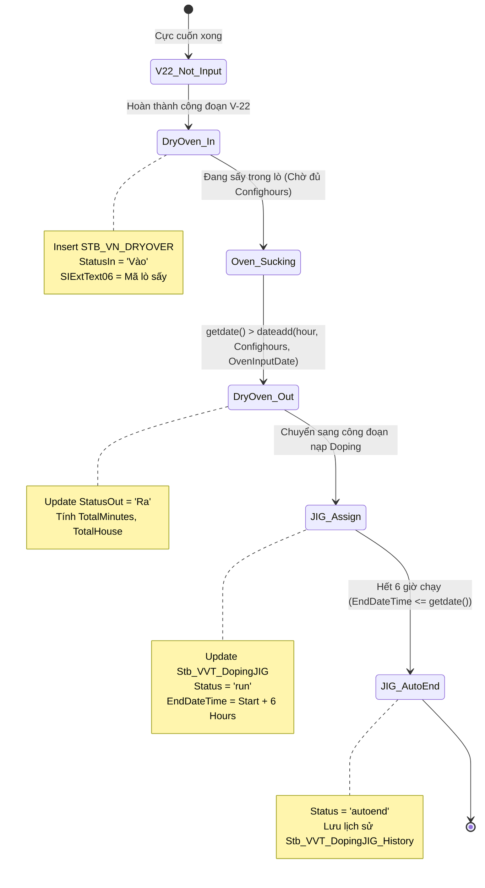
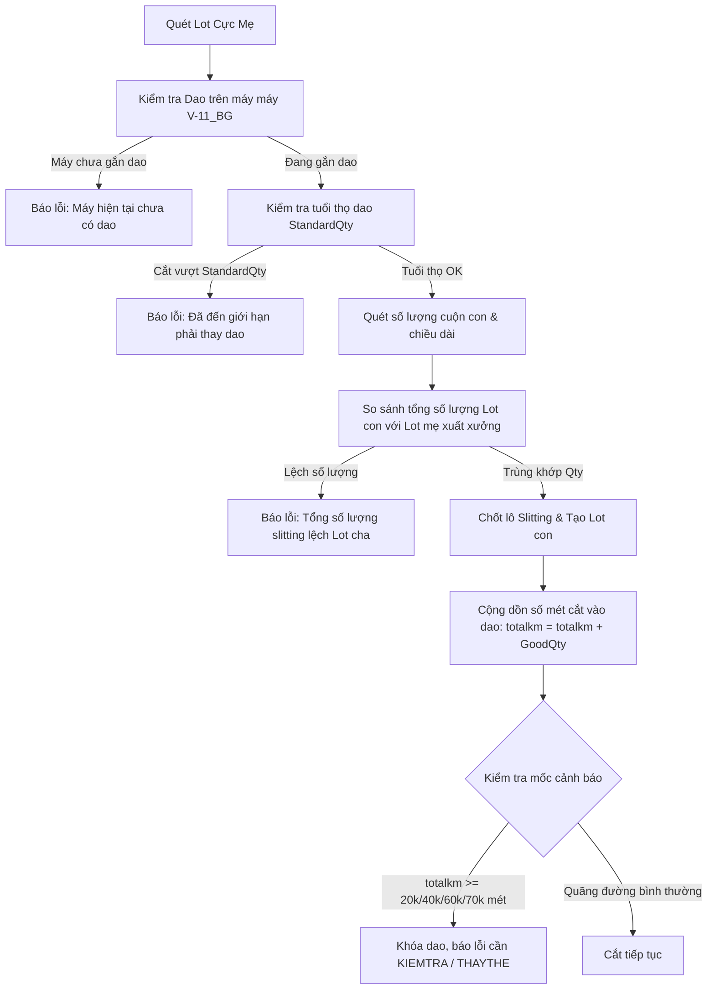

# KB_03 — Sản Xuất & Lịch Sử Routing

> **Màn hình liên quan:** B310, B450, B530, B540, B597, B598, B682, B726, B781, B782, B791
> ← [Về INDEX](KB_INDEX.md)

---

## 5. 🏭 Sản xuất & Lịch Sử Routing

### 5.1 Luồng Sản Xuất Đầy Đủ — Tham chiếu nhanh

```
B310 → Tạo PO (Lệnh Sản Xuất)
    ↓
B450 → Lập kế hoạch ngày + Tạo Lot + In tem
    ↓
B540 → Nhập nguyên liệu theo từng công đoạn (V22→V28)
    ↓
B597 → Kiểm tra thường xuyên (QC inline)
    ↓
B530 → Nhập số lượng sản xuất (bắt buộc nhập "Making")
    ↓
B523 → Đóng gói & In label thùng hàng
```

> 🏭 **Cơ sở:** Luồng trên là chuẩn **VVT_F1 (Bắc Ninh)**. Hà Nam dùng HN523 thay B523. BG2 dùng K101 thay B450, K109 thay B597. Xem [KB_INDEX § Mapping](KB_INDEX.md#bản-đồ-cơ-sở--màn-hình-factory--screen-mapping).

> ⚠️ **Cột IsFixed ở B450 phải được tích** mới tạo được Lot.
> ⚠️ **B530 bắt buộc nhập chữ "Making"** (chọn ở cột Status) nếu không công đoạn V25 sẽ bị chặn không cho lưu. Đây là điều kiện tiên quyết để hệ thống ghi nhận đang sản xuất.
> ⚠️ **Màn B540:** Không thể tích chọn trực tiếp vào checkbox `ProdQtyFinishYN` vì công đoạn đó đang sản xuất. Hệ thống sẽ tự động tích chọn checkbox này khi chốt sản lượng ở màn B530.
> ⚠️ **Màn B530:** Không thể hoàn thành kết quả sản xuất nếu chưa cập nhật `NULL` cho công đoạn trước đó để chốt lại, sau đó mới mở ra công đoạn tiếp theo.

---

### 5.2 Sửa JobDate màn B782 (Lịch sử Routing)

**Triệu chứng:** Barcode bị ghi nhận sai ngày sản xuất ở công đoạn nào đó.

```sql
-- Bước 1: Tìm ControlNo từ Barcode
SELECT ControlNo FROM STB_SetInfo WHERE Barcode IN ('VVPO273R010713', 'VVPO123R010711')

-- Bước 2: Xem lịch sử routing hiện tại của Barcode đó
SELECT * FROM STB_ProdRouteHist
WHERE ControlNo IN (
    SELECT ControlNo FROM STB_SetInfo WHERE Barcode = 'VVPO273R010713'
)
ORDER BY ProdDateTime

-- Bước 3: Sửa ngày (giữ nguyên giờ phút giây)
UPDATE STB_ProdRouteHist
SET ProdDateTime = CAST('2025-02-17' AS DATETIME) + CAST(ProdDateTime AS TIME),
    JobDate = '20250217'  -- Format: YYYYMMDD
WHERE ControlNo IN (
    SELECT ControlNo FROM STB_SetInfo WHERE Barcode IN ('VVPO273R010713', 'VVPO123R010711')
)
AND RouteCode = 'V-22_BG'  -- Chỉ sửa công đoạn cụ thể, không sửa hết
```

> **SP dùng để xác minh:** `usp_LotTrackingInfo_VVT2_get`

---

### 5.3 Sửa JobDate màn B781 (Packing History)

**Triệu chứng:** Lịch sử đóng gói bị ghi nhầm ngày.

```sql
-- Bước 1: Xem dữ liệu hiện tại (SP: usp_Vietnam_PackPrintTime_get)
SELECT SPT.*, SI.InputLineCode
FROM STB_SavePackingTime_VVT SPT
LEFT JOIN STB_SetInfo SI ON SPT.LotNo = SI.Barcode
WHERE SPT.LotNo IN ('VVPK173R015603', 'VVPK173R015606')

-- Bước 2: Sửa ngày (ghi lại ID cụ thể trước khi sửa)
UPDATE STB_SavePackingTime_VVT
SET PrintTime = CAST('2025-02-17' AS DATETIME) + CAST(PrintTime AS TIME)
WHERE LotNo IN ('VVPK173R015603', 'VVPK173R015606')
AND ID IN ('1217734', '1217736')  -- Dùng ID cụ thể, an toàn hơn
```

---

### 5.4 Sửa JobDate màn B598 (Production Error)

> ⚠️ **Cơ chế đặc biệt:** `JobDate` được tự động tạo từ `CreateDateTime`. Muốn JobDate về ngày **17** thì phải set `CreateDateTime` về ngày **18** (cộng 1 ngày so với ngày muốn).

```sql
-- Tìm bản ghi cần sửa
SELECT * FROM STB_VN_PRODUCTION_ERROR
WHERE CAST(CreateDateTime AS DATE) = '2025-02-18'

-- Sửa (chú ý cộng thêm 1 ngày)
UPDATE STB_VN_PRODUCTION_ERROR
SET CreateDateTime = CAST('2025-02-18' AS DATETIME) + CAST(CreateDateTime AS TIME)
WHERE IDPE IN ('ID1', 'ID2', ...)
```

---

### 5.5 Sửa ngày màn B726 (Scrap After Production)

```sql
-- Tìm dữ liệu: Ấn "Xem thông tin chi tiết" trên màn B726 để lấy ID
SELECT * FROM STB_VN_SCRAP_AFTERPRODUCTIONS WHERE ID = 4962

-- Sửa ngày
UPDATE STB_VN_SCRAP_AFTERPRODUCTIONS
SET CreateDateTime = CAST('2025-03-01' AS DATETIME) + CAST(CreateDateTime AS TIME)
WHERE ID = 4962

-- Xóa mềm (soft delete - không xóa hẳn)
UPDATE STB_VN_SCRAP_AFTERPRODUCTIONS
SET IsDeleted = 1
WHERE ID IN (6030, 6032, 6027, 6025, 6026, 6031)
```

---

### 5.6 Sửa ngày màn FG00 (Kho Thành Phẩm BG)

👉 **Chi tiết Script Fix:** Xem tại [KB_02_KHO_WMS.md § 8](KB_02_KHO_WMS.md)

---

### 5.7 Xóa PO (Production Order)

> ⚠️ **BẮT BUỘC xóa ở cả 2 màn hình: B450 và B310** và đủ tất cả bảng liên quan. Thiếu bảng nào sẽ gây inconsistent data.

```sql
-- === XÓA Ở B450 (kế hoạch ngày và lot) ===
-- Bước 1: Tìm DayPlanNo liên quan đến PO
SELECT DayPlanNo FROM STB_DayProdPlan WHERE PONo IN ('250303000008', '250304000011')

-- Bước 2: Xóa lot đã tạo (SetInfo)
DELETE FROM STB_SetInfo WHERE DayPlanNo IN ('2025030300011', '2025030400202')

-- Bước 3: Xóa kế hoạch ngày
DELETE FROM STB_DayProdPlan WHERE DayPlanNo IN ('2025030300011', '2025030400202')

-- === XÓA Ở B310 (PO gốc) ===
-- Phải xóa 3 bảng theo thứ tự này (tránh lỗi FK)
DELETE FROM STB_ProductionOrderRouting WHERE PONo IN ('250303000008', '250304000011')
DELETE FROM STB_ProductionOrderBom WHERE PONo IN ('250303000008', '250304000011')
DELETE FROM STB_ProductionOrderInfo WHERE PONo IN ('250303000008', '250304000011')
```

---

### 5.8 Sửa số lượng NG DefectQty (Màn B791)

**Triệu chứng:** Số lượng lỗi (NG) bị ghi nhận sai, cần sửa lại.

```sql
-- Bước 1: Tìm bản ghi
SELECT * FROM STB_DefectRepairInfo WHERE ControlNo = '20250314000351'

-- Bước 2: Sửa DefectQty
UPDATE STB_DefectRepairInfo
SET DefectQty = 4
WHERE ControlNo = '20250314000351'

-- Bước 3: Sửa số lượng input công đoạn sau
-- ProdQty tại công đoạn tiếp theo = TotalQty - DefectQty
UPDATE STB_ProdRouteHist
SET ProdQty = 3996
WHERE ControlNo = '20250314000351' AND RouteCode = 'MV-05'
```

---

### 5.9 Chuyển Line sản xuất (B452)

**Khi nào dùng:** Công nhân lập kế hoạch chọn nhầm Line ở B450, nhưng đã có sản lượng thực tế rồi.

```sql
-- Bước 1: Xác định Barcode bị sai Line
SELECT Barcode, InputLineCode FROM STB_SetInfo WHERE Barcode = 'VVOR163R010713'

-- Bước 2: Sửa Line trong SetInfo (trạng thái lot)
UPDATE STB_SetInfo
SET InputLineCode = 'VVBGC-12'
WHERE Barcode = 'VVOR163R010713'

-- Bước 3: Sửa Line trong ProdRouteHist (lịch sử routing)
UPDATE STB_ProdRouteHist
SET LineCode = 'VVBGC-12'
WHERE ControlNo = (SELECT ControlNo FROM STB_SetInfo WHERE Barcode = 'VVOR163R010713')

-- Bước 4: Kiểm tra lại
SELECT SI.Barcode, SI.InputLineCode, PRH.LineCode, PRH.RouteCode
FROM STB_SetInfo SI
JOIN STB_ProdRouteHist PRH ON SI.ControlNo = PRH.ControlNo
WHERE SI.Barcode = 'VVOR163R010713'
```

---

### 5.10 Chuyển mã Barcode VV → VJ

**Khi nào dùng:** Cần đổi đầu mã từ VV sang VJ cho tem hàng xuất khẩu hoặc theo yêu cầu khách hàng.

> ⚠️ Phải cập nhật đồng bộ TẤT CẢ bảng có lưu Barcode này.

```sql
-- Khai báo biến để dễ thay đổi
DECLARE @OldBarcode NVARCHAR(50) = 'VVOQ062R725633'
DECLARE @NewBarcode NVARCHAR(50) = 'VJOQ062R725633'

-- Cập nhật đồng bộ tất cả bảng
UPDATE STB_SetInfo SET Barcode = @NewBarcode WHERE Barcode = @OldBarcode
UPDATE STB_LotChangeMaterialHistory SET NewBarcode = @NewBarcode WHERE NewBarcode = @OldBarcode
UPDATE STB_SavePackingTime_VVT SET LotNo = @NewBarcode WHERE LotNo = @OldBarcode    -- B781
UPDATE STB_MaterialLotInfo SET LotNo = @NewBarcode WHERE LotNo = @OldBarcode         -- B523 in tem
UPDATE STB_ProdRouteHist SET ControlNo = @NewBarcode WHERE ControlNo = @OldBarcode   -- nếu cần

-- Xác nhận sau khi đổi
SELECT Barcode FROM STB_SetInfo WHERE Barcode = @NewBarcode
```

---

### 5.11 Lỗi kế hoạch ngày chọn nhầm Line (B450)

**Triệu chứng:** 2 Model khác nhau xuất hiện trên cùng 1 Line trong báo cáo Excel/Pivot.

**Truy vết:**
```sql
-- Tìm các DayPlan bị xung đột trên Line đó
SELECT DayPlanNo, PlanDate, MaterialCode, LineCode, CreateUserID, CreateDateTime
FROM STB_DayProdPlan
WHERE LineCode = 'VVBNTC-01' AND PlanDate = '20260516'
ORDER BY CreateDateTime

-- Dùng "Time Window" để tìm các kế hoạch bị tạo nhầm (trong 10 giây)
SELECT DayPlanNo, LineCode, MaterialCode, CreateDateTime
FROM STB_DayProdPlan
WHERE CreateUserID = 'ID_Người_Lập'
AND CreateDateTime BETWEEN '2026-05-16 08:00:00' AND '2026-05-16 08:00:10'
ORDER BY DayPlanNo ASC
```

**Xử lý:**
- **Chưa có sản lượng:** Hủy kế hoạch sai tại B450 → Tạo lại đúng Line
- **Đã có sản lượng:** Dùng script "Chuyển Line sản xuất" (Mục 5.9 trên)

### 5.12 Mở dữ liệu Andon theo tháng (B882)

**SP:** `usp_Vietnam_AndonDetail_get`
→ Vào SP → Tìm điều kiện lọc theo tháng → Chỉnh lại khoảng thời gian user yêu cầu.

---

### 5.13 Truy vết lịch sử 1 Barcode từ A→Z

```sql
-- 1. Query tổng hợp toàn bộ hành trình của 1 Barcode (Trực quan nhất)
SELECT
    SI.Barcode,
    SI.MaterialCode,
    MM.MaterialName,
    SI.ProdQty,
    SI.InputLineCode,
    SI.PONo,
    SI.LotDecisionResult AS [KQ_QC],
    SI.IsProdFinish AS [HoanThanh],
    PRH.RouteCode,
    PRH.ProdDateTime AS [Thoi_Gian_Quet],
    PRH.LineCode AS [Line_Cong_Doan]
FROM STB_SetInfo SI
JOIN STB_MaterialMaster MM ON SI.MaterialCode = MM.MaterialCode
LEFT JOIN STB_ProdRouteHist PRH ON SI.ControlNo = PRH.ControlNo
WHERE SI.Barcode = 'VVPO273R010713'
ORDER BY PRH.ProdDateTime ASC;

-- 2. Đối soát Công đoạn thực tế đã qua vs Công đoạn chuẩn theo PO:
-- B1: Lấy thông tin PONo và ControlNo từ Barcode
SELECT Barcode, ControlNo, PONo, MaterialCode FROM STB_SetInfo WHERE Barcode = 'VE260509-001';

-- B2: Tra cứu công đoạn đã thực hiện trong thực tế (dùng ControlNo tìm được ở B1)
SELECT RouteCode, ProdQty, CreateDateTime 
FROM STB_ProdRouteHist 
WHERE ControlNo = '20260507000467' 
ORDER BY CreateDateTime ASC;

-- B3: Tra cứu cấu hình định tuyến (Routing) chuẩn của PO (dùng PONo tìm được ở B1)
SELECT RouteCode, RouteIndex, IsOutputRoute, IsRequireMachine 
FROM STB_ProductionOrderRouting 
WHERE PONo = '260506000015' 
ORDER BY RouteIndex ASC;
```

---

### 5.14 Logic bóc tách Part No từ Model Name

**Mục đích:** Khi cần lấy mã Part No rút gọn (VD: `VEC3R0606QG`) từ chuỗi Model Name đầy đủ (VD: `HY-CAP VEC3R0606QG (1840)`).

```sql
-- Cách 1: Dùng chuỗi REPLACE lồng nhau (loại bỏ prefix/suffix)
SELECT REPLACE(REPLACE(REPLACE(REPLACE(REPLACE(REPLACE('HY-CAP VEC3R0606QG (1840)','HY-CAP ',''),'HY-CAP',''),'-C',''),'-M',''),'MSP',''),'(CY)','') AS model

-- Cách 2: Dùng SUBSTRING (lấy 12 ký tự sau dấu cách đầu tiên)
SELECT (RTRIM(LTRIM(SUBSTRING('HY-CAP VEC3R0606QG (1840)', CHARINDEX(' ', 'HY-CAP VEC3R0606QG (1840)'), 12)))) AS partno
```

---

### 5.15 Tra cứu Model Code và Size tại màn B597

**Mục đích:** Khi cần kiểm tra nhanh Size của Barcode tại công đoạn QC inline.

```sql
DECLARE @ModelSize VARCHAR(10) = '';
DECLARE @ModelName NVARCHAR(200) = '';

-- Bước 1: Lấy Size từ ModelBasicInfo (W x H)
SELECT @ModelSize = RIGHT('0'+CONVERT(VARCHAR, CONVERT(INT, MBISizeW)), 2) + CONVERT(VARCHAR, CONVERT(INT, MBISizeH))
FROM STB_ModelBasicInfo WITH(NOLOCK)
WHERE ModelCode = (SELECT MaterialCode FROM STB_SetInfo WITH(NOLOCK) WHERE Barcode = 'VVPR293R018602')

-- Bước 2: Lấy ModelName rút gọn
SELECT @ModelName = REPLACE(REPLACE(REPLACE(REPLACE(REPLACE(REPLACE(REPLACE(ModelName,@ModelSize,''),'(',''),')',''),' ',''),'HY-CAP ',''),'HY-CAP',''),'-','%')
FROM STB_ModelBasicInfo WITH(NOLOCK)
WHERE ModelCode = (SELECT MaterialCode FROM STB_SetInfo WITH(NOLOCK) WHERE Barcode = 'VVPR293R018602')

PRINT (@ModelName + ' ' + @ModelSize)
```

---

### 5.16 Quy trình 3 bước "Thám tử" truy vết và Hủy công đoạn / NG nhầm (Ví dụ: Lot VE260506-001)

Khi cần thực hiện rollback một Lot sản phẩm (ví dụ: `VE260506-001`) quay lại công đoạn trước (ví dụ: từ `VE09` về `VE07`) do công nhân nhập nhầm số lượng phế (NG) hoặc scan sai công đoạn, thực hiện theo 3 bước điều tra dữ liệu để đưa ra script xử lý chuẩn xác:

1. **Bước 1: Tìm mã định danh nội bộ (ControlNo) của Lot**
   ```sql
   SELECT Barcode, ControlNo, PONo 
   FROM STB_SetInfo 
   WHERE Barcode = 'VE260506-001';
   -- Kết quả: ControlNo là 20260428000408.
   ```
2. **Bước 2: Tra cứu lịch sử di chuyển (Routing History)**
   ```sql
   SELECT ProdRouteHistNo, RouteCode, ProdQty, CreateDateTime 
   FROM STB_ProdRouteHist 
   WHERE ControlNo = '20260428000408' 
   ORDER BY CreateDateTime ASC;
   -- Kết quả: Thấy danh sách các công đoạn quét. Ta xác định được VE08 và VE09 mới được quét nhầm chiều nay. Cần xóa hai bản ghi này.
   ```
3. **Bước 3: Tìm các bản ghi lỗi (NG) liên quan phát sinh**
   ```sql
   SELECT DefectSummaryNo, FindRouteCode, DefectQty, CreateDateTime 
   FROM STB_DefectRepairInfo 
   WHERE ControlNo = '20260428000408' 
     AND CreateDateTime >= '2026-05-11 16:00:00'; -- Lọc các lỗi nhập nhầm
   -- Kết quả: Tìm được các dòng lỗi với mã DefectSummaryNo.
   ```

**Kịch bản xử lý (Rollback / Revert):**
```sql
BEGIN TRANSACTION;

-- 1. Xóa Routing các bước quét nhầm (VE08, VE09)
DELETE FROM STB_ProdRouteHist 
WHERE ControlNo = (SELECT ControlNo FROM STB_SetInfo WHERE Barcode = 'VE260506-001')
  AND RouteCode IN ('VE08', 'VE09');

-- 2. Xóa các bản ghi lỗi (NG) nhập nhầm ở công đoạn sau và trạm trước lúc quét chuyển
-- Giải thích: Việc thêm trạm VE07 với mốc thời gian chèn nhầm là để xóa đi lượng phế
-- nhập nhầm cho trạm VE07 lúc khai báo chuyển tiếp VE08. Nếu giữ nguyên lượng phế này,
-- sản lượng của Lot khi chốt sang VE08 sẽ luôn bị hệ thống tự động trừ đi, không thể 
-- đưa về sản lượng gốc 5883 để công nhân nhập lại.
DELETE FROM STB_DefectRepairInfo 
WHERE ControlNo = (SELECT ControlNo FROM STB_SetInfo WHERE Barcode = 'VE260506-001')
  AND (
    FindRouteCode IN ('VE08', 'VE09')
    OR 
    (FindRouteCode = 'VE07' AND CreateDateTime >= '2026-05-11 16:00:00')
  );

-- 3. Kiểm tra lại: Lot phải khôi phục về trạng thái cuối cùng ở VE07 với ProdQty = 5883
SELECT RouteCode, ProdQty, CreateDateTime 
FROM STB_ProdRouteHist 
WHERE ControlNo = (SELECT ControlNo FROM STB_SetInfo WHERE Barcode = 'VE260506-001')
ORDER BY CreateDateTime ASC;

-- COMMIT; -- Chạy dòng này khi thấy kết quả đã đúng
-- ROLLBACK; -- Chạy dòng này để hủy nếu sai
```

---

### 5.17 Kiểm tra và truy vết nguồn gốc thay đổi Ký hiệu in phun (Marking Letter / MarkingCode)

Khi cần kiểm tra ký hiệu in phun dán nhãn của Lot sản phẩm (ví dụ: `VE251120-002`) và truy tìm ai đã thiết lập hoặc thay đổi ký hiệu này:

```sql
-- 1. Tra cứu MarkingCode của mã Lot
SELECT MarkingCode, LotNo, MaterialCode FROM STB_MaterialLotInfo WHERE LotNo = 'VE251120-002';
-- Kết quả: Lấy được MarkingCode = 'MK00000974'

-- 2. Đi ngược từ MarkingCode về bảng Master để xem người tạo/người thay đổi và thời gian thay đổi
SELECT MarkingCode, MarkingName, Barcode, 
       CreateUserID, CreateDateTime, 
       ChangeUserID, ChangeDateTime 
FROM STB_CreateMarkingLetterAndQtyForBarcode 
WHERE MarkingCode = 'MK00000974';
```

*Cập nhật: 2026-05-27*

---

## 6. 🏭 Cell Line — Vận Hành Chi Tiết Từng Màn Hình

> **Nguồn:** Phân tích 41 SP + ảnh màn hình (2026-04-13)

### 6.1 Bản đồ tổng quan Cell Line (V22 → V28)

```
[B310] Tạo PO
    ↓
[B450] Kế hoạch SX ngày — tạo Lot (DayPlanNo → STB_DayProdPlan)
    ↓  IsFixed=1 → sinh Barcode → in tem (B460/A460)
[B540] Assy Card Info — nhập NVL điện cực + sấy
    ↓  V-22: Cuốn | V-23: Lắp cao su (PHẢI scan NVL trước) | V-24: Curling | V-25: Bọc vỏ
[B530] Nhập sản lượng theo công đoạn
    ↓  usp_DoProcessProdRouteHistForCalc_SmartApp_VNT
[B597] Kiểm tra thường xuyên — nhập mã Lot NVL kho (ML...)
    ↓  Chặn: HOLD / Hết hạn / Sai chủng loại
[B523] Đóng gói — Gộp Box (VV→VJ)
    ↓
[B717] Bending & Tapping — bẻ chân, dán băng keo
```

---

### 6.2 B450 — Kế Hoạch Sản Xuất Theo Ngày

> 🏭 **Cơ sở gốc:** VVT_F1 (Bắc Ninh) | 🔀 **Biến thể:** **K101** (BG2 — Module, barcode `K164...`) → [§6.14](#614-nhà-máy-bg2--cấu-hình-triển-khai-hệ-thống-mes)

**Vận hành:**
1. Chọn ngày, Line, nhập PO → Điền `LineCode`, `PlanDate`, `PlanQty`, `RouteCode`, `BomVersion`
2. **Tích `IsFixed=1`** → Tab bên dưới mới xuất hiện nút **Tạo Lot**
3. Bấm **Tạo Lot** → sinh `ControlNo` → lưu vào `STB_SetInfo`
4. Bấm **In Tem** → in barcode ra nhãn

| SP | Chức năng |
|----|-----------|
| `usp_DayProdPlan_get` | Lấy danh sách kế hoạch ngày |
| `usp_SetInfo_get` | Lấy danh sách barcode/Lot đã tạo |
| `usp_DayProdPlan_iud` | Lưu/Sửa/Xóa kế hoạch ngày |
| `usp_DoFixDayProdPlan` | Đánh dấu kế hoạch đã Fixed |
| `usp_DoCancelDayProdPlan` | Hủy kế hoạch |

**Lỗi thường gặp:**

| Lỗi | Nguyên nhân |
|-----|-------------|
| Không tạo được Lot | `IsFixed` chưa tích → SP không cho sinh serial |
| Đã tạo Lot rồi không tạo thêm | `usp_DayProdPlan_iud` check `StartSerial` đã có → duplicate (thiết kế có chủ ý) |
| In tem lỗi | Sang A460 → Assembly Label → chọn số 2 của cột Định dạng |
| Lot tạo xong nhưng B540 không thấy | `DayPlanNo` không được link vào `STB_SetInfo.DayPlanNo` |

---

### 6.3 B530 — Nhập Số Lượng Sản Xuất (Chi Tiết SP)

> 🏭 **Cơ sở gốc:** VVT_F1 | 🔀 **Biến thể:** BG2 dùng chung B530 (cùng SP). HN cấu hình mã lỗi riêng → [§6.18](#618-cấu-hình-danh-mục-mã-lỗi-b530-nhà-máy-bắc-giang-bg)

**SP đầy đủ từ màn hình:**

| SP | Loại | Chức năng |
|----|------|-----------|
| `usp_GetProdRouteHistForBarcode_VNT` | Search | Thông tin Route History theo Barcode |
| `usp_GetProdRouteBarcodeForDefect_VNT` | Search | Danh sách lỗi theo Barcode |
| `usp_WasteWeight_get` | Search | Thông tin cân phế |
| `usp_DoProcessProdRouteHistForBarcode` | Execute | Submit sản lượng |
| `usp_DoProcessProdRouteHistForCalc_SmartApp_VNT` | Execute | Tính toán & validate (cổng chính) |
| `usp_DoUpdateProdRouteHistMarkingLetter` | Execute | Cập nhật ký hiệu đánh dấu |
| `usp_DoSplitLotAgingHN` | Execute | Tách Lot trước Aging (Hà Nam) |

**7 cổng chặn trong `usp_DoProcessProdRouteHistForCalc_SmartApp_VNT`:**

```
[GATE 1] Điện cực (V-22, VVT_F1/F2): usp_CheckInputElectrodeInputForCodeProduct
[GATE 2] NVL V-23/V-24 (VVT_F1/F2): usp_CheckInputRawMaterialCodeForProduct
[GATE 3] PQC Hà Nam (VE01/VE03/VE04/VE08): usp_CheckPQCInputForProductHistForBarcode
[GATE 4] Lot bị đóng: DPPExtText01 = '1' → RAISERROR 'Đã chốt'
[GATE 5] 20 phút (VNT, RouteIndex > 1): DATEDIFF(minute) <= 20 → RAISERROR
         ⚠️ BUG: Điều kiện @SIExtInt01 = Null (phải IS NULL) → Gate KHÔNG BAO GIỜ kích hoạt
[GATE 6] Bắt buộc mã máy: IsRequireMachine=1 AND MachineCode='' → RAISERROR
[GATE 7] PO không có Route: PONo IS NULL → RAISERROR 'Routing này không có trong PO'
```

> 🚦 **Tham chiếu mở rộng:** Chi tiết logic, mã SQL debug, và cách mở rộng cho 7 cổng chặn B530 trên (cùng 11 nhóm chặn tương tự như B597, B523, B452, B618, QC Audit...) được tổng hợp đầy đủ tại **[KB_14 §6 — Tổng Hợp Pattern Validation Gates](KB_14_TRACE_BUG_METHODOLOGY.md#6-tổng-hợp-pattern-validation-gates)**.


**Cột IsRawMaterialInputFinish — Gate quan trọng nhất:**
```sql
-- Kiểm tra trạng thái scan NVL
SELECT ControlNo, Barcode, IsRawMaterialInputFinish
FROM STB_ProdRouteHist
WHERE Barcode = 'VV...' AND RouteCode = 'V-23'
-- 0 = Chưa scan đủ → B530 BLOCK | 1 = Đã scan đủ → cho phép

-- Bypass khẩn cấp (chỉ khi được phê duyệt)
UPDATE STB_ProdRouteHist
SET IsRawMaterialInputFinish = 1
WHERE Barcode = 'VV...' AND RouteCode = 'V-23'
```

**Lỗi thường gặp tại B530:**

| Lỗi | Nguyên nhân |
|-----|-------------|
| "Chưa nhập NVL cho Lắp Cao Su" | GATE 2: không tìm thấy record trong `STB_RawMaterialInputHist` cho V-23/V-24 |
| "Chưa nhập điện cực âm/dương" | GATE 1: `usp_CheckInputElectrodeInputForCodeProduct` — check `tbl_SlittingStock` |
| "Routing không có trong PO" | Barcode thuộc PONo không có RouteCode trong `STB_ProductionOrderRouting` |
| "Đã hoàn thành thực tế rồi" | `AftProdQty <> 0` → công đoạn kế tiếp đã có dữ liệu → scan trùng |
| Chữ "Making" chưa nhập ở V-25 | `MarkingLetter` rỗng → `usp_DoUpdateProdRouteHistMarkingLetter` không có data |

---

### 6.4 B540 — Assy Card Info

**Các tab chính:**

| Tab | Chức năng |
|-----|-----------|
| Common | Thông tin chung: MaterialCode, Barcode, InputDateTime, ProdQty |
| RawMaterialInputHist | Lịch sử NVL đã scan vào (điện cực âm/dương) |
| Prod Qty Input | Số lượng sản xuất theo công đoạn |
| Assy Card Info Oven | Thông tin lò sấy |

**Sấy hàng (Oven):** 4 cột bôi đậm BẮT BUỘC nhập → mới được in barcode. Dữ liệu lưu vào `STB_SetInfo` cột `SIExtText01..05`.

**Lỗi: 1 con hàng Module nhưng hiển thị thông số Cell:**
```sql
-- Nguyên nhân: POType sai trong STB_ProductionOrderInfo
-- Fix:
UPDATE STB_ProductionOrderInfo
SET POType = 'MODULE'
WHERE MaterialCode = 'mã_hàng'
```

---

### 6.5 B523 — Đóng Gói (Gộp Box) — Quy Trình Mới

> 🏭 **Cơ sở gốc:** VVT_F1 | 🔀 **Biến thể:** **HN523** (Hà Nam), **HN544** (gộp túi bóng) → [KB_04 §6.5, §6.13](KB_04_DONG_GOI_IN_TEM.md)

**Quy trình mới (thay đổi so với cũ):**

| Bước | Quy trình cũ | Quy trình MỚI |
|------|-------------|---------------|
| 1 | Gộp box → In tem | Gộp box → **In tem Box To trước** |
| 2 | Chia box (tùy chọn) | **In tem Box To xong** → mới được Chia box |

**Quy tắc bắt buộc:**
```
⚠️ CHỈ ĐƯỢC IN TEM 1 LẦN DUY NHẤT
   → Muốn in lần 2 phải liên hệ EA Team

⚠️ PHẢI IN TEM BOX TO TRƯỚC KHI CHIA BOX

⚠️ SAU KHI CHIA BOX, PHẢI IN TEM BOX NHỎ TRƯỚC KHI CHIA TIẾP
```

**Logic VV → VJ (`usp_Vietnam_GetBoxIDForLotNo_VVT`):**
```sql
-- Cắt đuôi PartNo tự động (hàng Cell):
WHEN CHARINDEX('-', MM.MaterialName, 12) >= 12
THEN substring(MM.MaterialName, CHARINDEX('-', MM.MaterialName, 12), ...)
-- Mr.Tung add 2023-Feb-13: TỰ ĐỘNG LẤY ĐUÔI TRONG TÊN HÀNG của hàng CELL line
```

**Cổng chặn tại B523:**
```sql
-- Chặn nếu chưa cân → không cho in label
IF @pProcessUserID NOT IN ('vvt_worker','vvtworker',...)
    RAISERROR('Chưa cân — không được in label')
```

> 🚦 **Tham chiếu mở rộng:** Chi tiết các cổng chặn đóng gói (cân hàng, tiêu chuẩn đóng gói, in tem giới hạn) được tổng hợp tại **[KB_14 §6.3 Nhóm 3 — Đóng Gói](KB_14_TRACE_BUG_METHODOLOGY.md#nhóm-3-b523--chặn-đóng-gói-sp-usp_vietnam_doprocessprodpacking_vvt)**.

---

### 6.6 B717 — Bending & Tapping

> ⚠️ **Chỉ lưu được 1 lần đầu tiên** — nếu nhập sai phải UPDATE thủ công SQL

```sql
-- Sửa số lượng Bending/Tapping sai
UPDATE STB_VN_BENDING_TAPPING
SET QTYLOTNO = [số_đúng], QTYERROR = [lỗi_đúng]
WHERE LOTNO = 'mã_lot'

-- Xóa và nhập lại
DELETE FROM STB_VN_BENDING_TAPPING WHERE LOTNO = 'mã_lot'
```

---

### 6.7 B452 — Đổi Line Sai (Vietnam Print Lot Changed)

**Phân quyền đặc biệt:** Chỉ UserID trong whitelist hardcode trong SP mới được đổi Line.

```sql
-- Nếu UserID không có quyền → RAISERROR('Ban khong duoc phep thay doi ma Line')
-- Fix: IT thêm UserID vào SP usp_Set_VVT_Info_get
```

**Chức năng đặc biệt trong SP này:**
- Đổi PONo (chuyển PO khác cùng model trong tháng)
- Cập nhật RouteCode: đổi E- thành V-
- In tem Foxcon Label (cho user `sieusao`, `transao`, `daohuong`...)

---

### 6.8 Module Line — Quy Trình Đầy Đủ & Liên Kết Single Cell

**Khác biệt Cell vs Module:**

| Tiêu chí | Cell Line | Module Line |
|----------|-----------|-------------|
| RouteCode prefix | `V-01`, `V-23`... | `MV-01`, `MV-xx`... |
| POType | CELL | MODULE |
| Đóng gói | B523 → PackingID = VJ... | B525 → BoxID Module (Lưu bảng `STB_VN_MASTERMODULES`, `STB_VN_DETAILMODULES`) |
| Lịch sử | B782, B786, B791 | B789, B791 |
| Gate V-23/V-24 | ✅ Có check NVL | ❌ Không check |

**Flow Module Line:**
```
B310 (POType=MODULE) → B450 (Module Line Code) → B540 (Không check điện cực)
→ B530 (RouteCode = MV-xx) → B525 (Gộp Box Module) → B789 (Lịch sử) → B791 (Tracking)
```

#### 6.8.1 Các Bảng Cơ Sở Dữ Liệu Module & Cấu Trúc Schema
Hệ thống quản lý Module sử dụng một tập hợp các bảng cơ sở dữ liệu chuyên biệt để liên kết, theo dõi chất lượng, và lưu trữ lịch sử cấu hình lắp ráp:

1. **[STB_SingleCellModuleMappingHist](KB_03_SAN_XUAT.md) (Lịch sử mapping Single Cell ↔ Module Lot):**
   * Lưu thông tin mapping giữa Single Cell và Module Lot.
   * *Schema:* `ModuleLotNo` (varchar(20)), `Seq` (int), `SingleCellLotNo` (varchar(20)), `CreateDateTime` (datetime), `CreateUserID` (varchar(20)).

2. **[STB_ModuleProductionInfo](KB_03_SAN_XUAT.md) & [STB_ModuleProductionHist](KB_03_SAN_XUAT.md) (Thông tin & Lịch sử sản xuất module):**
   * Theo dõi tiến độ sản xuất, lượng pinhole, thay cell lỗi, thông số kiểm đo ESR/Farad của module.
   * *Schema chính:* `ModuleProductionNo` (varchar(20)), `JobStartDate` (date), `SemiProdLotNo1` (varchar(20)), `SemiProdLotNo2` (varchar(20)), `PinHoleQty` (numeric), `ChangeCellQty` (numeric), `Farad` (numeric), `ESR` (numeric), `FinishedProdLotNo` (varchar(20)), `ShipmentDate` (date), `ShipmentQty` (numeric).

3. **[STB_ModuleSemiProductionInfo](KB_03_SAN_XUAT.md) (Thông tin bán thành phẩm Module):**
   * Liên kết bản mạch PCB và các Single Cell cấu thành bán thành phẩm.
   * *Schema:* `ModuleSemiProductionNo` (varchar(20)), `ProdDate` (date), `Grade` (varchar(10)), `PCBLotNo` (varchar(20)), `SemiProdLotNo` (varchar(20)), `SingleCellLotNo1` (varchar(20)), `SingleCellLotNo2` (varchar(20)), `SingleCellLotNo3` (varchar(20)).

4. **[STB_SubAssemblyInfoForBE](KB_03_SAN_XUAT.md) (Mapping bán thành phẩm BE):**
   * Bản ghi liên kết thùng và mạch PCB cho công đoạn lắp ráp BE.
   * *Schema:* `SubAssemblyNo` (varchar(20)), `BoxBarcode` (varchar(20)), `PcbBarcode` (varchar(20)).

5. **[STB_ModuleLabelInfo](KB_03_SAN_XUAT.md) (Thông tin Serial Label Module):**
   * Liên kết mã serial nhãn in với Single Cell tương ứng.
   * *Schema:* `ModuleSerialNo` (varchar(20)), `ProductNo` (varchar(20)), `RevisionNo` (varchar(20)), `SingleLotNo` (varchar(20)).

6. **[STB_ModuleAssemblyLabelInfo](KB_03_SAN_XUAT.md) (Lịch sử tách/phát hành Lot con cho ráp Module):**
   * Lưu thông tin quan hệ giữa Lot ráp con (Assembly Lot) và Lot mẹ (Parent Lot).
   * *Schema:* `ModuleAssemblyLotNo` (varchar(20)), `ModuleParentLotNo` (varchar(20)), `IsPacking` (bit), `IsShipment` (bit).

7. **[STB_AssemblyCellWeightInfo](KB_03_SAN_XUAT.md) (Cân nặng Cell lắp ráp):**
   * Lưu dữ liệu cân nặng ghi nhận tại công đoạn lắp ráp.
   * *Schema:* `LineCode` (varchar(20)), `CellWeight` (numeric), `CreateDateTime` (datetime).

8. **[STB_VN_MASTERMODULES](KB_03_SAN_XUAT.md) & [STB_VN_DETAILMODULES](KB_03_SAN_XUAT.md) (Đóng gói gộp box module Việt Nam):**
   * *Master:* Lưu thông tin thùng (`GROUPID`, `LOTNO`, `QTY`, `TOTALQTY`, `VOL`, `FWAR`, `PARTNO`, `SIZE`, `PackingID` dạng `MVKQ[Month]...`).
   * *Detail:* Lưu chi tiết của từng Lot trong thùng (`GROUPID`, `LOTNO`, `QTYACT`, `LineCode`, `RouteCode`, `ProdQty`).

#### 6.8.2 Chi Tiết Các Logic Báo Cáo & Xử Lý Stored Procedures

##### 1. Logic Liên kết Cell vào Module Lot (`usp_DoCreateModuleLot`)
Khi thực hiện binding giữa Single Cell Barcode và Module Barcode:
* Hệ thống kiểm tra xem mã Module Barcode tồn tại trong `STB_SetInfo` hay không. Nếu không, raise lỗi: `'Mã Module Lot không tồn tại'`.
* Tiến hành update cột `ModuleBarcode` trong bảng `STB_SetInfo` cho Single Cell tương ứng:
  ```sql
  UPDATE STB_SetInfo SET ModuleBarcode = @ModuleBarcode WHERE Barcode = @Barcode;
  ```
* Tính toán số `Seq` tiếp theo và insert lịch sử vào bảng mapping:
  ```sql
  SELECT @NextSeq = ISNULL(MAX(seq), 0) + 1 FROM STB_SingleCellModuleMappingHist WHERE ModuleLotNo = @ModuleBarcode;
  INSERT INTO STB_SingleCellModuleMappingHist (ModuleLotNo, Seq, SingleCellLotNo, CreateUserID)
  VALUES (@ModuleBarcode, @NextSeq, @Barcode, @pProcessUserID);
  ```

##### 2. Logic Sinh Lot Ráp Module Từ Lot Mẹ (`usp_DoCreateModuleAssemblyLotNo`)
Khi chia Lot Module mẹ (Parent Lot) thành nhiều Lot con (mỗi Lot con có số lượng = 1) để dán nhãn lắp ráp:
* Hệ thống truy vấn thông tin `ProdQty`, `MaterialCode`, `PONo`, `DayPlanNo` từ `STB_SetInfo` của Lot mẹ.
* Kiểm tra xem Lot mẹ đã được tách trước đó chưa (bằng cách check `STB_ModuleAssemblyLabelInfo`). Nếu có, raise lỗi: `'Mã Lot đã tồn tại'`.
* Reset Serial Số trong `STB_SerialInfo` cho `@Header` về `0` để các Lot con bắt đầu từ `001`:
  ```sql
  UPDATE STB_SerialInfo SET SerialNo = 0 WHERE MaterialCode = '' AND Header = @Header;
  ```
* Lặp qua số lượng `ProdQty` lần, mỗi lần:
  * Gọi `usp_GetNewSerialNoForBarcode` để sinh `@SerialNo`.
  * Định dạng `@Barcode = @Header + RIGHT('000' + CONVERT(VARCHAR, @SerialNo), 3)`.
  * Insert vào `STB_ModuleAssemblyLabelInfo` và gọi `usp_DoCreateSetInfo` tạo thông tin Lot mới.
* Cuối cùng, thực hiện xóa Lot mẹ ra khỏi danh sách `STB_SetInfo` để tránh trùng lặp dữ liệu:
  ```sql
  DELETE FROM STB_SetInfo WHERE Barcode = @ModuleParentLotNo;
  ```

##### 3. Logic Tạo Số Serial Cho Nhãn Module (`usp_DoCreateModuleLabelInfo`)
* Sinh mã nhãn module định dạng: `PLS` + `[Ký tự cuối của RevisionNo]` + `[YY]` + `[Tuần trong năm]` + `V` + `[4 số serial tự tăng]`.
* Lấy số Index lớn nhất hiện tại:
  ```sql
  SELECT @StartIndex = ISNULL(MAX(RIGHT(ModuleSerialNo, 4)), 0) + 1 FROM STB_ModuleLabelInfo WHERE ModuleSerialNo LIKE @SerialHeader + '%';
  ```
* Insert danh sách serial tương ứng vào `STB_ModuleLabelInfo`.

##### 4. Tra cứu thông số Phân cấp Module Việt Nam (`usp_VN_PartNoModule`)
Cung cấp bảng ánh xạ cứng các dải thông số Điện áp (`VOL`) và Điện dung (`FARD`) theo Part No (NAMES) của Module để phục vụ kiểm tra ngoại quan và QC:
* Ví dụ:
  * `VEC2R7105QG(0813)`: `45~130` V, `≥2.50V`
  * `WEC3R0335QG(0820)`: `22~85` V, `≥2.55V`

**Giá thành Module:**
```sql
-- Kiểm tra giá thành Module
SELECT * FROM STB_VVT_StagePrices WHERE MaterialCode LIKE '%MDL%'

-- Thêm giá thành khi có model Module mới
INSERT INTO STB_VVT_StagePrices (MaterialCode, RouteCode, Price, IsUsed, CreateDateTime)
VALUES
    ('RDMD00-368', 'MV-01', 0.254127629071929, 1, GETDATE()),
    ('RDMD00-368', 'MV-02', 0.257442076659429, 1, GETDATE()),
    ('RDMD00-368', 'MV-03', 0.258507610420299, 1, GETDATE())
```

---

### 6.9 B351 — Lot Chuyển Đổi Nguyên Liệu

**Khi nào dùng:** Cần đổi mã hàng cho Lot đã sản xuất (sản xuất nhầm model, đổi PO).

| SP | Chức năng |
|----|-----------|
| `usp_GetDayProdPlanForChangeMaterial` | Lấy danh sách kế hoạch có thể đổi sang |
| `usp_GetSetInfoForChangeMaterial` | Lấy danh sách barcode đủ điều kiện đổi |
| `usp_DoChangeMaterialForSetInfo` | Thực hiện đổi — cập nhật MaterialCode, DayPlanNo |

```sql
-- Kiểm tra Lot sau khi đổi
SELECT OldBarcode, NewBarcode, ChangeDateTime, ChangeUserID
FROM STB_LotChangeMaterialHistory
WHERE OldBarcode = 'VV...' OR NewBarcode = 'VV...'

-- Sửa lại Barcode nếu định dạng sai sau khi đổi
UPDATE STB_RawMaterialInputHist SET Barcode = 'VVPR152R740601' WHERE Barcode = 'VVPR152.740601'
UPDATE STB_SetInfo SET Barcode = 'VVPR152R740601' WHERE Barcode = 'VVPR152.740601'
UPDATE STB_LotChangeMaterialHistory SET NewBarcode = 'VVPR152R740601' WHERE Newbarcode = 'VVPR152.740601'
```

---

### 6.10 B528 — Barrel Barcode (Gộp Thùng Xuất Hàng)

**Chức năng:** Tra cứu thùng Barrel/Carton khi xuất hàng.

| SP | Chức năng |
|----|-----------|
| `usp_BarrelBarcodeCartonInfo_get` | Lấy thông tin thùng Carton lớn |
| `usp_BarrelBarcodeSmallInfo_get` | Lấy thông tin thùng nhỏ bên trong |

```sql
-- ⚠️ Đã xác minh DB (2026-06-10): Bảng thực tế là STB_VietNam_CheckBarcode_2624
-- (STB_BarrelBarcodeInfo / STB_BarrelBarcodeDetail KHÔNG TỒN TẠI)

-- Tìm thùng Barrel theo PartNo và ngày
SELECT * FROM STB_VietNam_CheckBarcode_2624
WHERE PartNo = 'mã_hàng'
  AND CreateDateTime BETWEEN '2026-04-01' AND '2026-04-30'

-- Sửa số lượng thùng sai
UPDATE STB_VietNam_CheckBarcode_2624
SET Quantity = [số_đúng]
WHERE ID = [id] AND LotNo = 'mã_lot'

-- Xóa thùng tạo nhầm
DELETE FROM STB_VietNam_CheckBarcode_2624 WHERE ID = [id]
```

---

### 6.11 B802 — Vietnam Electrode Prod Route Hist (Lịch Sử SX Điện Cực)

**Chức năng:** Báo cáo lịch sử sản xuất và phế điện cực theo từng công đoạn (Mixing → Coating → Rollpress → Slitting).

| SP | Chức năng |
|----|-----------|
| `usp_Vietnam_ElectrodeProdRouteHist_get` | Lịch sử SX + giá thành điện cực |
| `usp_Vietnam_ElectrodeDefectHist_get` | Lịch sử phế điện cực theo công đoạn |

```sql
-- ⚠️ Đã xác minh DB (2026-06-10): Không có bảng STB_ElectrodeProdRouteHist.
-- Dữ liệu lịch sử SX điện cực được lấy qua SP usp_Vietnam_ElectrodeProdRouteHist_get
-- (SP này JOIN nhiều bảng nội bộ: STB_ElectrodeWasteInfoNew, STB_ProdRouteHist, v.v.)

-- Tìm Lot điện cực theo ngày + công đoạn (dùng SP)
EXEC usp_Vietnam_ElectrodeProdRouteHist_get
  @pCompanyCode = 'VVT',
  @pFromDate = '2026-04-01',
  @pToDate = '2026-04-13'

-- Sửa ngày Coating/Rollpress/Slitting bị sai
UPDATE STB_ElectrodeWasteInfoNew
SET CoatingDate = '2026-04-12', RollpressDate = '2026-04-12'
WHERE ElectrodeWasteNo IN (...)

-- Kiểm tra điện cực chưa cắt (Slitting_Date is NULL)
SELECT * FROM V_ElectrodeDefectHist
WHERE Slitting_Date IS NULL AND Coating_Date >= '2026-04-01'
```

**Mối quan hệ B802 ↔ B552:**
```
B552 (Electrode Measure Result) — NHẬP dữ liệu:
  → Mixing → Coating → Rollpress → Slitting
  → Mỗi bước: usp_ElectrodeStep_iud → ghi vào STB_ElectrodeStep
  (⚠️ "XxxInfo" ở đây là ký hiệu placeholder, SP thực tế: usp_ElectrodeStep_iud)

B802 (Electrode Prod Route Hist) — XEM TỔNG HỢP:
  → usp_Vietnam_ElectrodeProdRouteHist_get → đọc từ nhiều bảng
  → Hiển thị giá thành + phế tổng hợp theo Lot
  → Có thể "Making-Stop" để dừng sản xuất
```

---

### 6.12 B598 — Báo Phế Sản Xuất (Production Error/Scrap)

> 🏭 **Cơ sở gốc:** VVT_F1 | 🔀 **Biến thể:** **HN598** (Hà Nam — cùng logic, filter riêng)

> **Phân biệt:** B598 = phế **nguyên vật liệu** (kg/g). B530 DefectQty = phế **sản phẩm** (pcs).
> → Xem SQL sửa JobDate và hủy phế tại [Mục 5.4](#54-sửa-jobdate-màn-b598-production-error) (cùng file này).

| SP | Chức năng |
|----|-----------|
| `usp_vn_showproductionerror` | Lấy danh sách phế đã báo cáo |
| `usp_Add_ProductionError` | Thêm mới bản ghi phế NVL |
| `usp_VN_update_ProductionError` | Sửa bản ghi phế đã có (⚠️ SP nội bộ, có thể đã đổi tên hoặc tích hợp vào SP khác) |
| `usp_VN_update_CancelScrap` | Hủy/Cancel bản ghi phế (⚠️ SP nội bộ, có thể đã đổi tên hoặc tích hợp vào SP khác) |

```sql
-- Xem tất cả phế theo Line và ngày
SELECT * FROM STB_VN_PRODUCTION_ERROR
WHERE LineCode = 'VVBNC-01' AND JobDate = '2026-04-13'

-- Sửa cân nặng phế sai
UPDATE STB_VN_PRODUCTION_ERROR
SET WasteWeight = [cân_nặng_đúng], CanNangMoi = [cân_nặng_đúng]
WHERE ID = [id]

-- Hủy bản ghi phế
UPDATE STB_VN_PRODUCTION_ERROR
SET Status = 'CANCEL', CancelDateTime = GETDATE(), CancelUserID = 'admin'
WHERE ID = [id]

-- Kiểm tra tổng phế theo tháng
SELECT LineCode, SUM(WasteWeight) AS TongPhe, COUNT(*) AS SoBanGhi
FROM STB_VN_PRODUCTION_ERROR
WHERE JobDate BETWEEN '2026-04-01' AND '2026-04-30'
GROUP BY LineCode ORDER BY TongPhe DESC
```

---

### 6.13 Màn Hình Báo Cáo Phụ — Navigator Nhanh

| Màn hình | Chức năng | Liên kết |
|----------|-----------|---------|
| **B790** | Lịch sử nhập NVL theo thời gian | B597 |
| **B618** | Lịch sử hàng sản xuất lại (Rework) | Độc lập |
| **B682** | Báo cáo chi tiết lỗi Cell | DefectInfo |
| **B782** | Số lượng lỗi theo Lot/PO | ProdRouteHist |
| **B781** | Sản lượng đóng gói (lần lưu cuối B523) | B523 |
| **B733** | Check Box/Carton — troubleshoot B453/F110 | B523 |
| **B786** | ESR Monitoring Online | Máy ESR |
| **B882** | ANDON — theo dõi lỗi dây chuyền | `usp_getAndon_v1` |

---

### 6.14 Nhà Máy BG2 — Cấu Hình Triển Khai Hệ Thống MES

Hệ thống MES tại nhà máy Bắc Giang 2 (BG2) sử dụng hai màn hình giao dịch chính được tùy biến riêng:
*   **K101 (Kế hoạch sản xuất ngày BG2):** Tương đương với màn hình tiêu chuẩn **B450** nhưng chạy logic riêng cho nhà máy BG2.
*   **K109 (Kiểm tra thường xuyên BG2):** Tương đương với màn hình tiêu chuẩn **B597** nhưng lọc riêng cho nhà máy BG2 (`WorkCenterCode = 'VVT_BG2'`). Để truy cập K109, OP vào màn **B540** -> Nhấn nút **"Việt Nam_Kiểm tra thường xuyên_BG2"**.

Dưới đây là ma trận trạng thái các hạng mục công việc đã triển khai và các hạng mục còn tồn đọng (Pending) tại nhà máy BG2:

#### 1. Hạng mục đã hoàn thành 100%
*   **Phân hệ Kho NVL (WMS):**
    *   Cấu hình chỉ định nhà cung cấp cho từng mã nguyên vật liệu (màn hình **F140**).
    *   Tạo phiếu ghi chú đơn hàng nhập khẩu về kho (màn hình **F312**).
    *   Xác nhận nhập kho thực tế (màn hình **F320**) tự động liên kết sau khi bên IQC đánh giá PASS ở màn hình **C220**.
    *   Chia nhỏ lô hàng nhập khẩu thành các Lot con theo đúng quy tắc tem nhãn của VINA Thị (màn hình **F330** - dùng tem ML khi chia, còn chia nhỏ Lot theo số lượng mong muốn thì dùng màn hình **F740**).
    *   Cấp phát NVL ra CellLine và tra cứu lịch sử xuất kho (màn hình **F430**), hỗ trợ check FIFO phục vụ Audit khách hàng.
    *   Quản lý tồn kho NVL và quét Barcode để gán vị trí vật lý (màn hình **F721**).
    *   Triển khai phần mềm hiển thị sơ đồ vị trí (Location map) trực quan trên Tivi giám sát trong kho NVL.
*   **Phân hệ Sản xuất (Cell Line):**
    *   Cấu hình tạo PO mặc định theo Cellline.
    *   Tạo BOM trên hệ thống Groupware.
    *   Cấu hình định tuyến sản xuất (Routing) chi tiết cho sản phẩm.
    *   Cấu hình chọn máy sản xuất khi kết thúc công đoạn.
    *   Cấu hình danh mục lỗi chi tiết theo từng công đoạn sản xuất, tách biệt hoàn toàn giữa các nhà máy Bắc Ninh, Bắc Giang, Hà Nam (màn hình **C132**).
    *   Quản lý và tách biệt tài khoản công nhân vận hành của 3 nhà máy.
    *   Chốt sản lượng hoàn thành từng công đoạn dựa theo Routing sản phẩm (màn hình **B530**).
    *   Hỗ trợ OP chọn trạng thái Pass hoặc Fail cho từng công đoạn.
    *   Nhập và scan barcode NVL thô cho từng con hàng (màn hình **K109**), tích hợp logic ngăn chặn việc nhập sai mã NVL.
    *   Tra cứu thông tin chi tiết của con hàng đang sản xuất (màn hình **B540**).

#### 2. Hạng mục chưa hoàn thành (Pending / Đang triển khai)
*   **Phân hệ QC:**
    *   Triển khai quy trình tạo Lot kiểm tra OQC thành phẩm (màn hình **C151**).
    *   Triển khai màn hình kiểm tra dữ liệu đo kiểm thực tế OQC (màn hình **C153**).
    *   Thiết lập spec kiểm tra chất lượng chi tiết cho từng con hàng/model.
    *   Cấu hình lưu lịch sử kiểm tra OQC.
*   **Phân hệ Sản xuất & Kho:**
    *   Triển khai chức năng báo phế nguyên vật liệu trực tiếp trên CellLine (màn hình **B598**).
    *   Thiết lập chặn lưu NVL trên màn hình **K109** theo đúng tiêu chuẩn BOM (hiện tại mới đang ở mức thử nghiệm và chưa chặn cứng).
    *   Chưa cấu hình tiêu chuẩn BOM chi tiết chia theo từng công đoạn sản xuất.
    *   Chưa triển khai màn hình in tem đóng gói của sản xuất và kho.
*   **Hỗ trợ Sản xuất (Báo cáo & Giá thành):**
    *   Thiết lập đơn giá cho từng sản phẩm trên hệ thống.
    *   Thiết lập đơn giá cho nguyên vật liệu để tính toán chi phí phế thải sản xuất.
    *   Thiết lập đơn giá công đoạn sản xuất.
    *   Xây dựng báo cáo tổng hợp sản lượng nhập/xuất kho NVL.
*   **Spare Part (Thiết bị bảo trì):**
    *   *Chưa triển khai:* Cấu hình thông tin, quy trình nhập/xuất kho, lịch sử xuất kho, báo cáo tồn kho và thông tin nhân viên bảo trì.
*   **Kho thành phẩm:**
    *   *Đạt 90%:* In tem nhãn đóng gói, nhập kho bằng phần mềm, kiểm tra dữ liệu nhập/xuất kho trên hệ thống MES, xuất kho thành phẩm. Cần tích hợp nốt phần in ấn và đồng bộ dữ liệu xuất hàng.


#### 3. Kiu1EBF
 Tru00FAc Hu1EC7 Thu1ED1
g BG2 — Deep Dive

##### 3.1 Phu00E2
 Biu1EC7	 WorkCenterCode
BG2 du00F9
g **chung database SmartFactoryV2** (khu00F4
g tu00E1ch DB riu00EA
g). Phu00E2
 biu1EC7	 bu1EB1
g WorkCenterCode:

| WorkCenterCode | Nhu00E0 mu00E1y | Ghi chu00FA |
|---|---|---|
| `VVT_F4` | Bu1EAFc Giang 2 (Cell Line) | Du00F9
g trong STB_DayProdPlan, STB_SetInfo |
| `VNT_F4` | Bu1EAFc Giang 2 (Module/BE) | Du00F9
g trong WorkCenterInfo |

> u26A0`uFE0F **Lu01B0u u00FD:** SP `usp_DoCreateSetInfoForProdQty_VNT` du00F9
g `VVT_F4` u0111`u1EC3 phu00E2
 nhu00E1
h logic tu1EA1o Barcode. Khi query du1EEF liu1EC7u BG2, cu1EA7
 check Cu1EA2 HAI code.

##### 3.2 Su1EA3
 Phu1EA9m BG2 (Module / PCBA / SL7)

BG2 **KHu00D4NG su1EA3
 xuu1EA5	 tu1EE5 u0111iu1EC7
 thu00F4
g thu01B0`u1EDD
g** (Cell). BG2 su1EA3
 xuu1EA5	 **Module lu1EAFp ru00E1p** cho khu00E1ch hu00E0
g OEM:

| MaterialCode | MaterialName | MaterialType | Khu00E1ch hu00E0
g | Barcode Prefix |
|---|---|---|---|---|
| `BEPCBA-001` | 164181 | FERT | **Bloom Energy** (PCBA) | `K164...` |
| `EDVTMD-248` | 100099 | FERT | **Pliops** (SCM) | `K100...` |
| `EDVTSY-001` | 711711 | FERT | **Bloom Energy** (SL-7) | `VH-711711...` |
| `EDVTMD-246` | VEM540R0335QG | MDL | **Nordex** | Theo VNT_F3 format |

##### 3.3 Logic Tu1EA1o Barcode BG2 — Phu00E2
 Tu00EDch SP `usp_DoCreateSetInfoForProdQty_VNT`

**Nhu00E1
h VVT_F4 (du00F2
g 383-430 trong SP):**

```
CASE 1: PCBA/SCM (BEPCBA, EDVTMD-248)
  Header = 'K' + BloomEnergyPartNumber        -- Vu00ED du1EE5: 'K164181'
  Barcode = Header + BOMRevision + Year + Week + Serial(5 digits)
  Ku1EBF	 quu1EA3: K16418106262500741

CASE 2: SL-7 (EDVTSY-001)
  Header = 'VH-' + BloomEnergyPartNumber      -- Vu00ED du1EE5: 'VH-711711'
  Barcode = Header + '-' + Serial(6) + '-' + Week + Year + '-' + RevisionChar
  Ku1EBF	 quu1EA3: VH-711711-000001-2626-A

Ngou1EA1i lu1EC7 Nordex (EDVTMD-246): u0111i vu00E0o nhu00E1
h VNT_F3 (du00F2
g 311 SP)
```

##### 3.4 Tou00E0
 Bu1ED9 18 Mu00E0
 Hu00EC
h K1xx

| TCode | ScreenName | Chu1EE9c nu0103
g | SP chu00ED
h |
|---|---|---|---|
| **K100** | VNT_ModuleProdManagement_MENU | Menu chu00ED
h Module BG2 | u2014 |
| **K101** | DayProdPlanForMainLotMDL | Ku1EBF hou1EA1ch SX ngu00E0y (u2248B450) | `usp_DoCreateSetInfoForProdQty_VNT` |
| **K105** | VNT_ModuleAssemblyLabelInfo | In tem lu1EAFp ru00E1p Module | `usp_ModuleAssemblyLabelInfo_get` |
| **K107** | VNT_GetProdRouteHistForBarcode_PS | Lu1ECBch su1EED routing barcode | `usp_GetProdRouteHistForBarcode_PS_get` |
| **K109** | VNT_SelfInspectionRawMaterialBE | Quu00E9	 NVL BloomEnergy (u2248B597) | `usp_RawMaterialInputHist_iud` |
| **K110** | VNT_ModuleProductionInfo | Quu1EA3
 lu00FD SX Module | `usp_ModuleProductionInfo_iud/get` |
| **K120** | VNT_ModuleSemiProductionInfo | Bu00E1
 thu00E0
h phu1EA9m Module | `usp_ModuleSemiProductionInfo_iud/get` |
| **K130** | VNT_ModuleLabelInfo | In tem Module (SerialNo) | `usp_DoCreateModuleLabelInfo` |
| **K140** | VNT_ModuleProductionHistForPliops | Lu1ECBch su1EED SX Pliops | `usp_ModuleProductionHist_iud/get` |
| **K150** | VNT_ModuleSelfInspectionRawMaterial | Tu1EF1 kiu1EC3m NVL Module | `usp_RawMaterialInputHist_iud` |
| **K160** | VNT_PackingLabelHistForPS | Lu1ECBch su1EED tem u0111`u00F3
g gu00F3i | `usp_PackingLabelHistForPS_iud/get` |
| **K170** | VNT_GetBomInfoByLotOrItem | BOM theo Lot/Item | u2014 |
| **K180** | VNT_RawMaterialReverseTraceability | Truy xuu1EA5	 NVL ngu01B0`u1EE3c | `usp_GetReverseModelBomByBarcode` |
| **K181** | VNT_DelegateMaterialInputLog | Log u1EE7y quyu1EC1
 NVL | u2014 |
| **K190** | VNT_ProductTrackingByChangeNoticeInfo | Tracking Change Notice | `usp_ProductTrackingByChangeNoticeInfo` |
| **K195** | VNT_SubAssemblyInfoForBE | Sub-Assembly BloomEnergy | `usp_SubAssemblyInfoForBE_get` |
| **K198** | VNT_PrintBloomEnergySL7Label | Tem Bloom Energy SL-7 | `usp_DoPrintBloomEnergySL7Label` |
| **K199** | VNT_NordexPackingLabelPrintingHist_get | Lu1ECBch su1EED tem Nordex | `usp_NordexPackingLabelPrintingHist_get` |

##### 3.5 Database Tables Riu00EA
g Module (16 bu1EA3
g)

| Bu1EA3
g | Rows | Vai tru00F2 |
|---|---|---|
| `STB_QC_LOTNO_MODULE_VALUES` | 113,948 | Giu00E1 tru1ECB u0111o kiu1EC3m QC Module |
| `STB_ModuleAssemblyLabelInfo` | 16,507 | Tem lu1EAFp ru00E1p Module |
| `STB_ModuleSemiProductionInfo` | 2,425 | Bu00E1
 TP Module (K120) |
| `STB_ModuleLabelInfo` | 1,665 | Tem Module (K130) |
| `STB_ModuleProductionInfo` | 1,183 | SX Module (K110) |
| `STB_ModuleProductionHist` | 250 | Lu1ECBch su1EED SX (K140) |
| `STB_VN_MASTERMODULES` | 1,592 | Master Module config |
| `STB_VN_DETAILMODULES` | 2,027 | Chi tiu1EBF	 Module |

##### 3.6 K130 u2014 Logic Tu1EA1o Serial Tem Module

Format: `PLS` + RevisionChar + Year(2) + WeekIndex(2) + `V` + Serial(4)
Vu00ED du1EE5: `PLS1262600V0001`
Bu1EA3
g lu01B0u: `STB_ModuleLabelInfo` u2014 Key: `ModuleSerialNo`

##### 3.7 K110 u2014 Module Production (usp_ModuleProductionInfo_iud)

Bu1EA3
g `STB_ModuleProductionInfo`:
- `SemiProdLotNo1`, `SemiProdLotNo2`: Lot bu00E1
 TP u0111`u1EA7u vu00E0o
- `PinHoleQty`: Su1ED1 lu1ED7 kim (kiu1EC3m tra chu1EA5	 lu01B0`u1EE3
g)
- `Farad`, `ESR`: Thu00F4
g su1ED1 u0111iu1EC7

- `FinishedProdLotNo`: Lot thu00E0
h phu1EA9m u0111`u1EA7u ra

> **Khu00E1c biu1EC7	 vu1EDBi Cell Line:** Module KHONG du00F9
g `STB_ProdRouteHist`. Du00F9
g bu1EA3
g riu00EA
g `STB_ModuleProductionInfo` + `STB_ModuleSemiProductionInfo`.

##### 3.8 K109 vs K150 u2014 Hai Mu00E0
 Hu00EC
h Quu00E9	 NVL

| | K109 | K150 |
|---|---|---|
| **Mu1EE5c u0111`u00EDch** | Quu00E9	 NVL Bloom Energy | Quu00E9	 NVL Module chung |
| **SP back-end** | Giu1ED1
g nhau | Giu1ED1
g nhau |
| **Khu00E1c biu1EC7	** | Client UI filter riu00EA
g BE | Client UI filter Module |

---

### 6.15 Spare Part — H301/H302/H303/H305

| Màn hình | Chức năng |
|----------|-----------|
| **H301** | Cấu hình loại Spare Part (UsingQty, CycleReplace, LifeLotQty) |
| **H302** | Tồn kho / Nhập / Xuất kho Spare Part |
| **H303** | Lịch sử Lot Spare Part đã xuất + Barcode đã dùng qua |
| **H305** | Spare Part đang dùng (bôi đỏ nếu vượt CycleReplace) / Đã thay thế |

> ⚠️ Nếu số Lot trên Line chưa đủ điều kiện thay thế mà cố tình xuất → **lỗi**

---

### 6.16 In Tem Khách Hàng Đặc Biệt (B754~B758)

| Màn hình | Khách hàng | Chức năng |
|----------|-----------|-----------|
| **B754** | PAC | In tem Inner/Outer (SN riêng biệt) |
| **B755** | PAC | Lịch sử in tem từ B754 |
| **B756** | PAC | In tem thùng Carton + Cân nặng (tick `IsWeightLabel`) |
| **B757** | Digi-Key | In nhãn sản phẩm + nhãn Logistic (cần PO, PO Line, Pack List) |
| **B758** | Digi-Key | In tem thùng MIXED LOAD (Pack List, Weight, PackageCount) |

**Lưu ý B754:** Tem Inner và Outer tính Serial Number riêng biệt. Khi in OUTER phải **tick `IsOuter`**.

---

### 6.17 Root Cause Tổng Hợp — Cell Line

```
1. HOLDING → MaterialWarehouseCode LIKE 'HOLDING_%' trong STB_MaterialLotInfo
2. HẾT HẠN → LotAttr10 + (MMExtInt01 * 30 ngày) < GETDATE()
3. SAI CHỦNG LOẠI NVL → ProductGroupCode không match model
4. CHƯA SCAN NVL V-23/V-24 → STB_RawMaterialInputHist không có record
5. POType SAI → STB_ProductionOrderInfo.POType ghi sai lúc tạo PO
6. BENDING/TAPPING CHỈ LƯU 1 LẦN → check duplicate ID trong SP
7. KHÔNG ĐỔI ĐƯỢC LINE (B452) → UserID không trong whitelist hardcode SP
8. HẠNG MỤC CAO/THẤP SAI (B597) → SP cache biến lần đầu; C143 mapping sai
9. MÃ LOT VENDOR DÀI QUÁ → fn_VVT_getdatebyVendorLot parse fail
10. CHƯA NHẬP "MAKING" ĐẾN V-25 BỊ CHẶN → MarkingLetter rỗng tại bước trước
```

### 6.18 Cấu hình danh mục mã lỗi B530 nhà máy Bắc Giang (BG)

**Yêu cầu:** Đồng bộ danh mục mã lỗi trên màn hình B530 tại nhà máy Bắc Giang để tránh trùng lặp và phản ánh chính xác các lỗi phát sinh trong thực tế.

**1. Vô hiệu hóa (Disable) 28 mã lỗi trùng lặp/dư thừa:**
Set `IsUsed = 0` trong bảng `STB_DefectInfo` cho các mã lỗi sau:
- **Winding (V-22_BG):** `V-22_CC_BG`, `V-22_X12_BG`, `V-22_Z03_BG`, `V-22_Z04_BG`
- **Rubber/Riveting (V-23_BG):** `V-23_02_BG`, `V-23_2DR_BG`, `V-23_NE1_BG`, `V-23_NE2_BG`, `V-23_QQ_BG`, `V-23_XZ2_BG`, `V-23_X12_BG`, `V-24_2RY_BG`
- **Curling (V-24_BG):** `V-24_NE4_BG`, `V-24_22CT_BG`, `V-24_2CT_BG`, `V-24_2DR_BG`, `V-24_5VV_BG`, `V-24_NE22_BG`
- **Sleeving (V-25_BG):** `V-25_01_BG`, `V-25_2CT_BG`, `V-25_X03_BG`, `V-25_X12_BG`
- **Ngoại quan (V-27_BG):** `V-27_ZC_BG`, `V-27_ZD_BG`, `V-27_4GV_BG`, `V-27_5VI_BG`, `V-27_XP1_BG`, `V-27_RELY_BG`

*Chi tiết SQL tham khảo file script [fix_b530_disable_defects_BG.sql](../sql/scripts/fix_b530_disable_defects_BG.sql)*

**2. Thêm mới 7 mã lỗi thực tế vận hành:**
INSERT vào bảng `STB_DefectInfo` các mã lỗi sau:
- **Winding:** `V-22_BM_BG` (Winding_Xocha đen đầu đáy)
- **Rubber:** `V-23_DV_BG` (Rubber/riveting_Dập vỡ Tancha pan)
- **Rubber:** `V-23_RD_BG` (Rubber/riveting_Rách đáy xocha khi đưa vào vỏ nhôm)
- **Riveting:** `V-23_XZ3_BG` (Riveting_Thiếu thừa vòng đệm)
- **Curling:** `V-24_NE6_BG` (Curling_NG thừa thiếu cân nặng)
- **Curling:** `V-24_NE7_BG` (Curling_Xước chân tancha)
- **Curling:** `V-24_NE8_BG` (Curling_Lỗi mẻ miệng curling)

*Chi tiết SQL tham khảo file script [fix_b530_add_defects_BG.sql](../sql/scripts/fix_b530_add_defects_BG.sql)*

#### 6.18.1 Bối Cảnh Thay Đổi Quy Mô Lot Size & Mã Lỗi B530
Trong quá trình vận hành hệ thống MES tại nhà máy Vinatech Bắc Giang (BG), bộ phận sản xuất và chất lượng đã phát hành hai yêu cầu thay đổi cấu hình dữ liệu quan trọng:
1. **Thay đổi quy mô Lot No sản phẩm** (Lot Size) kết hợp thay đổi phương pháp sấy và số lượng mẫu test phá hủy.
2. **Chuẩn hóa danh mục mã lỗi hiển thị trên màn hình B530** (disable 28 mã trùng lặp/dư thừa và thêm mới 7 mã lỗi thực tế).

Tài liệu này ghi nhận kết quả đối soát thực tế giữa yêu cầu trong các file Excel và hiện trạng cấu hình trên cơ sở dữ liệu `SmartFactoryV2` (tính đến ngày 05/06/2026).

#### 6.18.2 Chi Tiết Cấu Hình Quy Mô Lot No Sản Xuất & Test Phá Hủy (Bắc Giang 1)
Dưới đây là bảng tổng hợp chi tiết cấu hình Lot Size, phương pháp sấy (Normal drying vs. Infrared drying), số lượng mẫu test phá hủy và thông số định mức cuộn nguyên liệu cho các model:

| Model | Lot Size Trước | Sấy Trước | Lot Size Sau | Sấy Sau | Quy cách đóng gói | Số mẫu phá hủy trước | Số mẫu phá hủy sau | Đặc tính cuộn nguyên liệu (Foil/Roll Specs) |
| :--- | :--- | :--- | :--- | :--- | :--- | :--- | :--- | :--- |
| **1320** | 1280 | Thường | 2000 / 4000 | Hồng ngoại | 2400 (1 máy 2 khay x 1k) | 21 / 63 | 13 / 39 (test 6) | 1 roll nhỏ = 400m / 167mm * 0.95 * 1000 = 2,275 pcs |
| **1325** | 1280 | Thường | 1700 / 3400 | Hồng ngoại | 2400 (1 máy 2 khay x 850) | 21 / 63 | 15 / 45 (test 6) | 1 roll nhỏ = 400m / 179mm * 0.95 * 1000 = 2,122 pcs |
| **1346** | 600 | Thường | 800 / 1600 | Hồng ngoại | 1200 (1 máy 2 khay x 400) | 17 / 51 | 12 / 36 (test 6) | 1 small roll = 400m / 185mm * 0.95 * 1000 = 2,054 pcs |
| **1625** | 900 | Thường | 1400 / 2400 | Hồng ngoại | 1400 (1 máy 2 khay x 700) | 20 / 60 | 13 / 39 (test 6) | Giữ nguyên |
| **1840** | 500 | Thường | 1000 / 2000 | Hồng ngoại | Thường: 500, Hela: 640 | 36 / 108 | 18 / 54 (test 6) | 1 small roll = 400m / 387mm * 0.95 * 1000 = 981 pcs |
| **1859** | 300 | Thường | 900 | Thường | 1 máy sấy 3 ngăn | - | - (test 6) | 1 small roll = 400m / 338mm * 0.95 * 1000 = 1,124 pcs |
| **VPC 0820** | 3000 | Thường | 3000 | Thường | 1 máy sấy 3 ngăn | - | - (test 6) | - |
| **VPC 0825** | 3000 | Thường | 3000 | Thường | 1 máy sấy 3 ngăn | - | - (test 6) | - |
| **VPC 1030** | 2000 | Thường | 2000 / 3000 | Thường | 1 máy sấy 3 ngăn | - | - (test 6) | 1 small roll = 400m / 165mm * 0.95 * 1000 = 2,303 pcs |
| **VPC 1040** | 2000 | Thường | 2000 / 3000 | Thường | 1 máy sấy 3 ngăn | - | - (test 6) | 1 small roll = 400m / 205mm * 0.95 * 1000 = 1,853 pcs |
| **VPC 1325** | 1000 | Thường | 3000 | Thường | 1 máy sấy 3 ngăn | - | - (test 6) | 1 small roll = 400m / 295mm * 0.95 * 1000 = 1,288 pcs |
| **VPC 1335** | 1000 | Thường | 3000 | Thường | 1 máy sấy 3 ngăn | - | - (test 6) | 1 small roll = 400m / 295mm * 0.95 * 1000 = 1,288 pcs |
| **2245** | 430 | Thường | 1290 | Thường | - | 10.46 | 3.48 (test 2) | 1 small roll = 400m / 575mm * 0.95 * 1000 = 660 pcs |
| **2570** | 300 | Thường | 900 | Thường | - | 8.33 | 2.77 (test 2) | 1 small roll = 400m / 575mm * 0.95 * 1000 = 660 pcs |
| **3562** | 179 | Thường | 537 / 1074 | Thường | 600 (1 ngăn 6 khay, 2 lot) | 50 | 17 (test 2) | 1 small roll = 400m / 1520mm * 0.95 * 1000 = 250 pcs |
| **3582** | 179 | Thường | 358 / 716 / 1074 | Thường | 600 (1 ngăn 4 khay, 2 lot) | 16 | 8 (test 2) | 1 small roll = 400m / 1520mm * 0.95 * 1000 = 250 pcs |
| **35105**| 179 | Thường | 358 / 716 / 1074 | Thường | 600 (1 ngăn 4 khay, 2 lot) | 16 | 8 (test 2) | 1 small roll = 400m / 1520mm * 0.95 * 1000 = 250 pcs |

#### 6.18.3 Script SQL Kiểm Chứng Đối Soát
Dưới đây là các câu lệnh SQL đã dùng để truy vấn và kiểm tra chéo dữ liệu trên Server:
```sql
-- 1. Kiểm tra cấu hình đóng gói của các Model/Size trong STB_PackingStandard
SELECT MaterialTypeCode, Size, Voltage, Farad, VinylBagQty, InnerBoxQty, OutBoxQty 
FROM STB_PackingStandard 
WHERE Size IN ('1320', '1325', '1346', '1625', '1840')
ORDER BY Size;

-- 2. Kiểm tra trạng thái của các mã lỗi đã disable và thêm mới
SELECT DefectCode, BasicDefectName, DefectGroupCode, IsUsed, ChangeUserID, ChangeDateTime
FROM STB_DefectInfo
WHERE DefectCode IN (
    'V-22_BM_BG', 'V-23_DV_BG', 'V-23_RD_BG', 'V-23_XZ3_BG', 'V-24_NE6_BG', 'V-24_NE7_BG', 'V-24_NE8_BG',
    'V-22_CC_BG', 'V-23_02_BG', 'V-24_2CT_BG', 'V-25_01_BG', 'V-27_ZC_BG'
)
ORDER BY IsUsed DESC, DefectCode;
```

#### 6.18.4 Đề Xuất Khắc Phục Gaps (Next Action Plan)
*   **Khai báo tiêu chuẩn đóng gói cho size `1840`:**
    Cần chạy câu lệnh chèn dữ liệu cấu hình đóng gói cho Model `1840` (hỏi ý kiến bộ phận sản xuất/kế hoạch trước khi chạy trên Production):
    ```sql
    INSERT INTO STB_PackingStandard (MaterialTypeCode, Size, Voltage, Farad, VinylBagQty, InnerBoxQty, OutBoxQty, CreateDateTime, CreateUserID)
    VALUES ('FERT', '1840', 0, 0, 0, 500, 1000, GETDATE(), 'vinaadmin');
    ```
*   **Tự động hóa quy trình QC cho Lot Size tăng:**
    Nếu QC muốn số lượng mẫu kiểm tra tự động giới hạn ở mức `6` mẫu test hủy thay vì `20` hay `50` như hiện tại, cần chỉnh sửa stored procedure `usp_Vietnam_MaterialFOQcDetail_get` để bổ sung logic phân nhánh `SampleQty` động theo `MaterialCode` và `LotSize`.

---

### 6.19 Hỗ trợ lưu nhiều mã vạch nguyên vật liệu (Multi-barcode Appending) cho Điện cực và Vỏ Case

**Mô tả:** Hệ thống hỗ trợ bắn nối tiếp nhiều cuộn nguyên vật liệu khác nhau (ngăn cách bởi dấu `;`) trên cùng một Lot sản phẩm để tránh trường hợp cuộn cũ hết giữa chừng nhưng Lot chưa chạy xong.

**1. Logic kiểm tra và Lưu trong `usp_Vietnam_RawMaterialInputHist_uid`:**
- **Kiểm tra trạng thái HOLD:** Nếu chuỗi `@pRawMaterialBarcode` chứa dấu `;`, hệ thống sử dụng một vòng lặp `WHILE` tách từng barcode con ra để kiểm tra trạng thái HOLD qua SP `usp_VVT_checkHOLD_Material`. Nếu có bất kỳ barcode con nào bị HOLD, hệ thống sẽ chặn không cho lưu.
- **Tính toán số lượng hợp lệ (`@count`):** Thay vì chỉ kiểm tra đơn lẻ, hệ thống lặp qua danh sách barcode ngăn cách bởi dấu `;`, đếm số lượng bản ghi tồn tại trong `stb_materialdoclotinfo` (hoặc `STB_MaterialLotInfo` đối với điện cực mới) và cộng dồn lại để validate.
- **Giới hạn điều kiện nối chuỗi (Append):**
  - **Điện cực (`ELECTRODEP`, `ELECTRODEM`):** Luôn cho phép nối chuỗi cho tất cả các size.
  - **Vỏ Case (`Case`):** Chỉ cho phép nối chuỗi đối với các size model đặc thù: `3562`, `3582`, `35105`.
  - Cấu trúc nối chuỗi: `RawMaterialBarcode = existingRawBarcode + ' ; ' + newRawBarcode`.
  - Hệ thống ghi nhận lịch sử vào bảng lịch sử phụ đối với Điện cực và Case (3562/3582/35105).

*Chi tiết mã nguồn tham khảo Stored Procedure `usp_Vietnam_RawMaterialInputHist_uid`*

**2. Gộp hiển thị trên lưới trong `usp_RawMaterialInputHist_get`:**
Khi load danh sách nguyên vật liệu đã bắn của Lot, hệ thống sử dụng `FOR XML PATH('')` gộp các dòng barcode có cùng `ProductGroupCode` và `Barcode` lại thành một chuỗi ngăn cách bởi `; ` hiển thị trong cột `RawBacodeList` đối với `ELECTRODEP`, `ELECTRODEM`, và `Case`.

*Chi tiết mã nguồn tham khảo Stored Procedure `usp_RawMaterialInputHist_get`*

---

### 6.20 📊 Dashboard, Andon & Monitoring (Gộp từ KB_22)

Hệ thống giám sát và hiển thị sản lượng, năng suất hiện trường của MES Vinatech bao gồm 3 lớp:
1. **Dashboard:** Tổng quan sản lượng theo công đoạn dành cho cấp quản lý.
2. **Andon:** Bảng hiển thị thông số và trạng thái lỗi tại xưởng dành cho công nhân và leader.
3. **UPH Tracking:** Theo dõi năng suất theo thời gian thực (Units Per Hour).

#### 6.20.1 Dashboard Configuration
Cấu hình các công đoạn hiển thị trên Dashboard được lưu tại bảng `STB_DashboardRouteInfo`:
```sql
-- Xem cấu hình hiển thị Dashboard
SELECT DashboardRouteCode, DashboardRouteName, ProdRouteTypeCode, WorkCenterCode
FROM STB_DashboardRouteInfo
ORDER BY WorkCenterCode, DashboardRouteCode;
```

#### 6.20.2 Andon Display
Các cấu hình hiển thị và dữ liệu Andon được lưu trong các bảng:
*   `CellLineANDON`: Cấu hình Line hiển thị trên màn hình Andon.
*   `DefectReportsAnDon`: Ghi nhận dữ liệu phế/lỗi hiển thị trên Andon (nhà máy Việt Nam).
*   `DefectReportsAndon_BG`: Ghi nhận dữ liệu phế/lỗi hiển thị trên Andon (nhà máy Bắc Giang).
*   `ProcessStepsANDON`: Các bước công đoạn hiển thị trên Andon.

```sql
-- Xem cấu hình Line hiển thị Andon
SELECT CellLineAndon, CellLineName FROM CellLineANDON;

-- Xem danh sách phế/NG hiển thị trên Andon trong ngày
SELECT * FROM DefectReportsAnDon WHERE CreateDateTime >= CAST(GETDATE() AS DATE);
```

#### 6.20.3 UPH (Units Per Hour) Tracking
UPH được tính dựa trên số lượng sản phẩm hoàn thành chia cho thời gian sản xuất thực tế. Nguồn dữ liệu lấy từ `STB_ProdRouteHist` (lịch sử quét mã vạch công đoạn).
Bảng liên quan: `VNT_UPHStatusInfo` (màn hình xem UPH), `VNT_UPHTimeSetupInfo` (cấu hình thời gian tính).

```sql
-- Tính UPH thô cho 1 Line trong 1 ca
SELECT LineCode, RouteCode,
       COUNT(*) AS TotalUnits,
       DATEDIFF(HOUR, MIN(CreateDateTime), MAX(CreateDateTime)) AS TotalHours,
       CASE WHEN DATEDIFF(HOUR, MIN(CreateDateTime), MAX(CreateDateTime)) > 0
            THEN CAST(COUNT(*) AS FLOAT) / DATEDIFF(HOUR, MIN(CreateDateTime), MAX(CreateDateTime))
            ELSE 0 END AS UPH
FROM STB_ProdRouteHist
WHERE LineCode = 'VELINE-01'
  AND RouteCode = 'V-22' -- Công đoạn Aging
  AND CreateDateTime >= CAST(GETDATE() AS DATE)
GROUP BY LineCode, RouteCode;
```

---

### 6.21 🔧 Máy Móc, Bảo Trì & Spare Parts Management (Gộp từ KB_20)

Hệ thống quản lý máy móc thiết bị hiện trường, lịch trình bảo trì và kho phụ tùng thay thế.

#### 6.21.1 Master Data Máy Móc
Các bảng cốt lõi:
*   `STB_MachineMaster`: Lưu thông tin master máy móc thiết bị.
*   `STB_ProductMachine`: Cấu hình mapping máy móc với công đoạn (`RouteCode`).

```sql
-- Xem tất cả máy active theo Line
SELECT MachineCode, MachineName, LineCode, WorkCenterCode
FROM STB_MachineMaster
WHERE IsUsed = 1
ORDER BY LineCode, MachineCode;

-- Xem cấu hình máy ↔ Route cho model cụ thể
SELECT PM.MachineCode, PM.RouteCode, MM.MachineName, MM.LineCode
FROM STB_ProductMachine PM
JOIN STB_MachineMaster MM ON PM.MachineCode = MM.MachineCode
WHERE PM.MaterialCode = 'ECVT30-367' -- Model cần kiểm tra
ORDER BY PM.RouteCode;
```

#### 6.21.2 Bảo Trì & Sửa Chữa Thiết Bị
Khi máy móc hỏng, thông tin sự cố được ghi nhận vào `STB_MachineRepairHistory`. Chi tiết kỹ thuật viên sửa và linh kiện thay thế được lưu tương ứng trong `STB_MachineRepairWorker` và `STB_MachineRepairMaterialHist`.
```sql
-- Xem lịch sử sửa chữa máy trong 30 ngày gần nhất
SELECT MachineRepairHistoryNo, MachineCode, JobDate,
       TroublePoint, TroubleText, RepairText, TotalRepairCost,
       DATEDIFF(MINUTE, JobStartDateTime, JobEndDateTime) AS RepairMinutes
FROM STB_MachineRepairHistory
WHERE JobDate >= DATEADD(DAY, -30, GETDATE())
ORDER BY JobDate DESC;
```

#### 6.21.3 Hiệu Chuẩn Thiết Bị Đo
Lịch sử hiệu chuẩn các thiết bị đo kiểm tại xưởng được lưu tại `STB_MeasurementControlCalibrateHistory_VVT` (tương ứng màn hình `VVT_MeasurementControlList`).
```sql
-- Xem lịch sử hiệu chuẩn của một thiết bị đo
SELECT ManagementNo, SerialNo, DayOfCalibration, Remark, Note
FROM STB_MeasurementControlCalibrateHistory_VVT
WHERE ManagementNo = 'MÃ_QUẢN_LÝ'
ORDER BY DayOfCalibration DESC;
```

#### 6.21.4 Spare Part (Phụ Tùng) H301 ~ H305
Kho phụ tùng thay thế cho máy móc tại xưởng được theo dõi qua các bảng:
*   `STB_VNSparePartInfo`: Master danh sách phụ tùng (spec, đơn giá, tồn an toàn).
*   `STB_VNSparePartStockInfo`: Tồn kho phụ tùng.
*   `STB_VNSparePartIOHistory`: Nhật ký xuất/nhập phụ tùng.
*   `STB_VN_SparePartLineUsage`: Nhật ký xuất phụ tùng cho Line máy.

```sql
-- Kiểm tra tồn kho phụ tùng dưới mức an toàn tối thiểu (SafeQty)
SELECT SparePartCode, SparePartName, CurrentStock, SafeQty,
       CASE WHEN CurrentStock < SafeQty THEN 'CẦN ĐẶT HÀNG' ELSE 'OK' END AS Status
FROM STB_VNSparePartInfo
WHERE IsUsed = 1 AND CurrentStock < SafeQty
ORDER BY CurrentStock ASC;
```

---

### 6.22 👤 Nhân Sự, Worker & Quản Lý Ca Kíp (Gộp từ KB_21)

Hệ thống quản lý thông tin công nhân hiện trường, ca kíp sản xuất và nhật ký bàn giao ca.

#### 6.22.1 Master Data Công Nhân (`STB_ProdWorkerInfo`)
Quản lý hồ sơ công nhân sản xuất hoạt động tại các Line.
```sql
-- Xem danh sách công nhân đang hoạt động (active) theo Line
SELECT WorkerCode, OrgWorkerName, WorkerGroupCode, LineCode, DATEJOIN
FROM STB_ProdWorkerInfo
WHERE IsUsed = 1 AND IsProdWorker = 1
ORDER BY LineCode, WorkerCode;
```

#### 6.22.2 Nhóm Công Nhân & Mapping Chi Phí
Công nhân được gán vào các tổ/nhóm chi phí để phục vụ tính toán giá thành công đoạn:
*   `STB_WorkerGroupInfo`: Danh mục nhóm công nhân (tổ/ca).
*   `STB_CostGroupWorkerMapping`: Gán công nhân vào nhóm chi phí tương ứng.

```sql
-- Xem phân công công nhân vào nhóm chi phí
SELECT CGM.CostGroupCode, WGI.CostGroupName, CGM.WorkerCode, PW.OrgWorkerName
FROM STB_CostGroupWorkerMapping CGM
JOIN STB_WorkerGroupInfo WGI ON CGM.CostGroupCode = WGI.CostGroupCode
JOIN STB_ProdWorkerInfo PW ON CGM.WorkerCode = PW.WorkerCode
ORDER BY CGM.CostGroupCode;
```

#### 6.22.3 Bàn Giao Ca (Worker Takeover)
Quy trình bàn giao tình trạng máy, sản lượng dở dang và lưu ý ca trước được nhập tại màn hình `VNT_WorkerTakeoverInfo` và lưu vào bảng `STB_WorkerTakeoverInfo`.
```sql
-- Xem nội dung bàn giao ca trong tuần
SELECT WorkerTakeoverNo, JobDate, TimeShiftCode, TakeoverLineCode,
       TakeoverContent, WriteWorkerCode, IsConfirm, ConfirmWorkerCode
FROM STB_WorkerTakeoverInfo
WHERE JobDate >= DATEADD(DAY, -7, GETDATE())
ORDER BY JobDate DESC, WriteDateTime DESC;
```

#### 6.22.4 Truy Vết Lịch Sử Quét Của Công Nhân
Khi công nhân scan barcode tại các công đoạn, thông tin được lưu tại bảng `STB_ProdRouteWorkerHist` để đối soát trách nhiệm:
```sql
-- Tra cứu công nhân xử lý barcode cụ thể
SELECT PRWH.WorkerCode, PW.OrgWorkerName,
       PRH.ControlNo, PRH.RouteCode, PRH.CreateDateTime
FROM STB_ProdRouteWorkerHist PRWH
JOIN STB_ProdRouteHist PRH ON PRWH.ProdRouteHistNo = PRH.ProdRouteHistNo
JOIN STB_ProdWorkerInfo PW ON PRWH.WorkerCode = PW.WorkerCode
WHERE PRH.ControlNo = 'MÃ_BARCODE'
ORDER BY PRH.CreateDateTime ASC;
```

---

*Cập nhật: 2026-06-14 | Gộp nội dung từ KB_19, KB_20, KB_21, và KB_22 để đồng bộ hoá tri thức nghiệp vụ Sản Xuất*


---

### 6.23 Thiết Bị Phụ Trợ MES (Lò Sấy, Gá Doping & Dao Cắt Slitting) (Gộp từ KB_30)


> **Môi trường:** SmartFactoryV2 & SmartFramework trên dbserver.hycap.co.kr,5398
> **Ngày cập nhật:** 2026-06-10

---

#### 1. Bản Chất Nghiệp Vụ & Quy Trình Thực Tế (Operational Flow)
Trong nhà máy sản xuất tụ điện Vinatech, ngoài các thiết bị chính trên dây chuyền, các thiết bị phụ trợ (Lò sấy - Dry Oven, Đồ gá nạp - Doping JIG, Dao chia cuộn - Slitting Knife) đóng vai trò quyết định đến chất lượng sản phẩm (chống bavia, ẩm, hoặc bóc tách điện cực lỗi). Hệ thống MES theo dõi chặt chẽ vòng đời và thông số của các thiết bị này.

*   **Lò sấy cực (Dry Oven):** Cực tụ sau khi cuốn/phết cần được sấy khô trong lò. MES theo dõi thời gian sấy tối thiểu (tùy theo từng chủng loại sản phẩm) và bắt buộc phải ghi nhận các thông số áp suất, nhiệt độ lúc vào/ra lò.
*   **Gá nạp Doping (Doping JIG):** Công đoạn lão hóa sơ bộ bằng cách nạp điện cực thông qua đồ gá (JIG). JIG được gán với Lot điện cực trên MES và chạy trong chu kỳ sạc/nạp mặc định là **6 giờ**.
*   **Dao cắt Slitting (Slitting Cutter & Knife):** Lưỡi dao chia cuộn cực mẹ thành cuộn cực con. Hệ thống MES giám sát số mét đã cắt (tuổi thọ thực tế) và số lần cắt của từng lưỡi dao để đưa ra cảnh báo kiểm tra định kỳ hoặc khóa máy bắt buộc phải thay dao nhằm ngăn ngừa bavia gây chập tụ.

---

#### 2. Luồng Dữ Liệu & Máy Trạng Thái (Data Flow & State Machine)

##### 2.1. Sơ đồ Luồng Trạng Thái Lò Sấy & Gá Doping


##### 2.2. Sơ đồ Luồng Cắt Cuộn Cực & Giám Sát Tuổi Thọ Dao Slitting


---

#### 3. Bản Đồ Database: Bảng & Stored Procedures Cốt Lõi

##### 3.1. Các bảng CSDL liên quan (`SmartFactoryV2`)
*   `SmartFactoryV2.dbo.STB_VN_DRYOVER`: Lưu trữ thông tin chi tiết các ca sấy tụ (Barcode, mã lò, ngày vào, ngày ra, nhiệt độ, áp suất, trạng thái Vào/Ra).
*   `SmartFactoryV2.dbo.Stb_VVT_DopingJIG`: Lưu thông tin gán đồ gá JIG đang chạy nạp điện cực tụ.
*   `SmartFactoryV2.dbo.Stb_VVT_DopingJIG_History`: Lưu lịch sử sử dụng của đồ gá JIG sau khi kết thúc chu kỳ.
*   `SmartFactoryV2.dbo.Stb_Vietnam_SlitCutter`: Theo dõi quãng đường cắt (mét) của lưỡi dao slitting thế hệ cũ.
*   `SmartFactoryV2.dbo.STB_VN_SlittingKnifeInfo`: Danh mục lưỡi dao slitting thế hệ mới, cấu hình tuổi thọ tối đa (`StandardQty`).
*   `SmartFactoryV2.dbo.STB_VN_SlittingKnifeInUse`: Theo dõi lưỡi dao nào đang được lắp trên máy cắt chia cuộn nào (`MachineCode`).
*   `SmartFactoryV2.dbo.STB_ElectrodeSlittingResult`: Lưu trữ kết quả phân tách cuộn cực, liên kết với `SlittingKnifeLotID`.
*   `SmartFactoryV2.dbo.Stb_SlittingStock_VVT`: Tồn kho bán thành phẩm cuộn cực con sau khi slitting.

##### 3.2. Các Stored Procedures (SPs) chính
*   `usp_VN_DryOver`: Xử lý logic vào lò và ra lò cho Lot cực, kiểm tra điều kiện tiên quyết và tính toán thời gian sấy đạt chuẩn.
*   `usp_VN_AddDryOven`: SELECT dữ liệu lò sấy theo Barcode và hiển thị đánh giá chất lượng sấy.
*   `usp_Vietnam_DryOven_iud`: Cập nhật thông số áp suất, nhiệt độ lò sấy do công nhân nhập từ giao diện UI.
*   `usp_Vietnam_DopingJIG_uid`: Xử lý gán Lot tụ vào đồ gá JIG, tự động ngắt JIG sau 6 giờ và lưu trữ lịch sử nạp.
*   `usp_DoSlittingLot`: Thực hiện phân tách cuộn cực con, tự động tính diện tích tồn kho ($m^2$) theo công thức tỉ lệ chiều rộng.
*   `usp_ChotSlittingLot`: Chốt lô chia cuộn cực, kiểm tra đối soát tổng số lượng cực con có khớp 100% với cực mẹ không.
*   `usp_DoCreateSlittingResult`: Tạo barcode và kết quả cuộn cực con, tích hợp kiểm tra giới hạn tuổi thọ dao slitting.
*   `usp_Vietnam_SlitCutter_iud`: Cộng dồn mét cắt và đưa ra cảnh báo kiểm tra định kỳ lưỡi dao theo các mốc 20k/40k/60k/70k mét.
*   `usp_VN_ExportSlittingKnife_iud`: Nghiệp vụ lắp lưỡi dao slitting mới vào máy chia cuộn.
*   `usp_VN_ImportSlittingKnife_iud`: Nghiệp vụ thu hồi lưỡi dao slitting về kho.

---

#### 4. Phân Tích Logic Code & Validation Checks

##### 4.1. Cấu hình thời gian sấy lò theo từng chủng loại sản phẩm (`usp_VN_DryOver`)
Thời gian sấy bắt buộc khác nhau phụ thuộc vào mã vật liệu (`MaterialCode`):
```sql
DECLARE @Confighours INT = 0
SET @Confighours = CASE 
    WHEN @MaterialCodes IN ('ECVT27-382','ECVT30-333','ECVT27-353','ECVT30-250','ECVT30-262',...) THEN 3  -- Sấy cực nhanh 3 giờ
    WHEN @MaterialCodes IN ('LIVT38-016','LIVT38-009','LIVT38-027') THEN 12                                 -- Sấy tiêu chuẩn 12 giờ
    WHEN @MaterialCodes IN ('ECVT27-358','ECVT27-369','ECVT30-271',...) THEN 15                             -- Sấy sâu 15 giờ
    WHEN @MaterialCodes IN ('ECVT27-247','ECVT30-115','ECVT30-316',...) THEN 20                             -- Sấy sâu 20 giờ
    WHEN @MaterialCodes IN ('ECVT30-357') THEN 30                                                           -- Sấy đặc biệt 30 giờ
    ELSE 9                                                                                                  -- Mặc định sấy 9 giờ
END
```
Hệ thống kiểm tra nếu thời gian hiện tại chưa vượt qua thời gian vào lò cộng với `@Confighours` thì sẽ chặn không cho làm thủ tục ra lò.

##### 4.2. Công thức tính toán diện tích tồn kho cực Slitting (`usp_DoSlittingLot`)
Số lượng tồn kho của cuộn cực con sau khi slitting (`CurrentQty`) không tính bằng số cuộn mà tính bằng diện tích ($m^2$):
$$\text{CurrentQty} = \text{LengthSlitting} \times \left(\frac{\text{WidthSlitting}}{1000}\right)$$
```sql
---

#### 5. Danh Sách Lỗi Logic, Điểm Yếu & Giải Pháp (Bugs & Troubleshooting)

##### 🔴 Bug #1: Lỗi toán tử SQL bypass kiểm tra công đoạn V-22 bắt buộc (`usp_VN_DryOver`)
*   **Chi tiết & Giải pháp:** Xem chi tiết tại [KB_03_SAN_XUAT.md#lỗi-1-lỗi-toán-tử-sql-bypass-kiểm-tra-công-đoạn-sấy-v-22-bắt-buộc](KB_03_SAN_XUAT.md#lỗi-1-lỗi-toán-tử-sql-bypass-kiểm-tra-công-đoạn-sấy-v-22-bắt-buộc).

##### 🔴 Bug #2: Bug thời gian ghi nhận lịch sử Doping JIG khiến mất dữ liệu log (`usp_Vietnam_DopingJIG_uid`)
*   **Chi tiết & Giải pháp:** Xem chi tiết tại [KB_03_SAN_XUAT.md#lỗi-1-lỗi-thời-gian-ghi-nhận-lịch-sử-jig-khiến-mất-dữ-liệu-log-khi-tự-động-ngắt](KB_03_SAN_XUAT.md#lỗi-1-lỗi-thời-gian-ghi-nhận-lịch-sử-jig-khiến-mất-dữ-liệu-log-khi-tự-động-ngắt).

##### 🔴 Bug #3: Mismatch logic tuổi thọ dao và Hardcode địa lý Bắc Giang (`usp_DoCreateSlittingResult`)
*   **Chi tiết & Giải pháp:** Xem chi tiết tại [KB_03_SAN_XUAT.md#lỗi-2-mismatch-logic-tính-tuổi-thọ-dao-slitting-và-hardcode-địa-lý-bắc-giang](KB_03_SAN_XUAT.md#lỗi-2-mismatch-logic-tính-tuổi-thọ-dao-slitting-và-hardcode-địa-lý-bắc-giang).


---

## 🔴 Cẩm nang khắc phục lỗi theo Screen ID (Gộp từ KB_SCREEN_BUG_REF)

## B210 / B220 / B230 / B240 — Production Routing Setup (Thiết lập định tuyến sản xuất)

### Lỗi 1: Màn hình B450 không tìm thấy Line sản xuất để tạo Lot
*   **Triệu chứng:** Khi lập kế hoạch ngày tại **B450** để sinh mã Lot cho PO, người dùng không thể chọn được Line sản xuất mong muốn trong dropdown.
*   **Nguyên nhân gốc:** Line sản xuất chưa được kích hoạt (`IsUsed = 0`) tại màn hình đăng ký Line **B210** (`STB_LineInfo`), hoặc cấu hình sai mã nhà máy (`WorkCenterCode`).
*   **Cách khắc phục:** Vào màn hình **B210**, tìm Line tương ứng, kiểm tra và tick chọn cờ `IsUsed`, đảm bảo `WorkCenterCode` khớp với khu vực sản xuất rồi Lưu lại.
*   **Chi tiết nghiệp vụ:** Xem tại [KB_06_MASTER_DATA_TOOLS.md § 10](KB_06_MASTER_DATA_TOOLS.md#10-thiết-lập-line--route-b210b220b230b240).

### Lỗi 2: Giao diện B530 không hiển thị Máy khi OP scan chốt công đoạn
*   **Triệu chứng:** OP thực hiện quét chốt sản lượng tại **B530** nhưng không hiển thị danh sách thiết bị/máy chạy trong dropdown chọn máy.
*   **Nguyên nhân gốc:** Máy móc chưa được cấu hình phân bổ thuộc công đoạn (RouteCode) đang chạy trong bảng `STB_MachineMaster` (Màn hình **B240**).
*   **Cách khắc phục:** Vào màn hình **B240**, kiểm tra và gán máy móc đang chạy vào đúng công đoạn (RouteCode) tương ứng.
*   **Chi tiết nghiệp vụ:** Xem tại [KB_06_MASTER_DATA_TOOLS.md § 10](KB_06_MASTER_DATA_TOOLS.md#10-thiết-lập-line--route-b210b220b230b240).

---


## B250 / B270 — Cell / Machine Mapping (Đồng bộ chuyền & máy chạy mới)

### Lỗi 1: Popup gán máy B270 trống không hiển thị danh sách thiết bị
*   **Triệu chứng:** Khi bấm vào popup để gán máy chạy cho Route sản xuất ở màn hình **B270**, danh sách máy trống trơn không có bản ghi nào.
*   **Nguyên nhân gốc:** Do Stored Procedure `usp_Set_VVT_Info_get` bị hardcode kiểm tra Whitelist UserID của người thao tác, hoặc cấu hình sai thiết lập máy trong bảng `STB_ProductMachine`.
*   **Cách khắc phục:**
    Sửa đổi SP `usp_Set_VVT_Info_get` để bổ sung thêm UserID của người vận hành hiện tại vào Whitelist, hoặc cập nhật trực tiếp DB:
    ```sql
    -- Thêm điều kiện Whitelist User trong SP
    SELECT OBJECT_DEFINITION(OBJECT_ID('usp_Set_VVT_Info_get'));
    ```
*   **Chi tiết nghiệp vụ:** Xem tại [KB_01_UI_PHAN_QUYEN.md § 1.3](KB_01_UI_PHAN_QUYEN.md#13-lỗi-popup-b270-trống-không-hiện-danh-sách-máy).

### Lỗi 2: Cell hoặc Line sản xuất mới thêm không hiển thị hoặc không quét được trên hệ thống
*   **Triệu chứng:** Khi có yêu cầu thêm Cell/Line mới (Ví dụ: `VVBNTC-05`), OP không thể thực hiện các thao tác gán máy hay quét sản lượng ở các công đoạn.
*   **Nguyên nhân gốc:** Cell mới chưa được khai báo đồng bộ đồng thời ở cả 3 bảng master: `STB_LineInfo`, `STB_MachineMaster` (Màn hình **B250**) và `STB_ProductMachine` (Màn hình **B270**).
*   **Cách khắc phục:**
    Chạy SQL đồng bộ trong một Transaction để chèn Line, Machine và liên kết tự động tất cả các Route từ `V-22` đến `V-28`:
    ```sql
    BEGIN TRANSACTION;
    -- 1. Thêm LineInfo
    INSERT INTO STB_LineInfo (LineCode, CompanyCode, WorkCenterCode, LineName, LineDesc, LineType, IsUsed, CreateDateTime, CreateUserID)
    VALUES ('VVBNTC-05', 'VVT', 'VVT_F2', 'BN Manual (P20)', 'Thủ công Bắc Ninh', 'Medium', 1, GETDATE(), 'vinaadmin');
    -- 2. Thêm MachineMaster (B250)
    INSERT INTO STB_MachineMaster (MachineCode, CompanyCode, WorkCenterCode, MachineName, IsProdMachine, MachineTypeCode, IsUsed, CreateDateTime, CreateUserID)
    VALUES ('VVBNTC-05', 'VVT', 'VVT_F2', 'BN Manual (P20)', 1, 'M00001', 1, GETDATE(), 'vinaadmin');
    -- 3. Gán máy vào Route (B270)
    INSERT INTO STB_ProductMachine (MachineCode, LineCode, RouteCode, CreateDateTime, CreateUserID)
    SELECT 'VVBNTC-05', 'VVBNTC-05', r.RouteCode, GETDATE(), 'vinaadmin'
    FROM (
        SELECT 'V-22_BG' AS RouteCode UNION ALL SELECT 'V-23_BG' UNION ALL SELECT 'V-24_BG' UNION ALL
        SELECT 'V-25_BG' UNION ALL SELECT 'V-26_BG' UNION ALL SELECT 'V-27_BG' UNION ALL SELECT 'V-28_BG'
    ) r;
    COMMIT;
    ```
*   **Chi tiết nghiệp vụ:** Xem tại [KB_06_MASTER_DATA_TOOLS.md § 7](KB_06_MASTER_DATA_TOOLS.md#7-thêm-cellline-mới-b250-b270).

---


## B260 — Worker Management (Nhân sự sản xuất)

### Lỗi 1: Tên nhân viên mới không hiển thị trong dropdown chọn nhân viên tại B530 hoặc B540
*   **Triệu chứng:** Nhân viên đã đăng ký thành công trên MES nhưng OP không tìm thấy tên khi chốt sản lượng.
*   **Nguyên nhân gốc:** Khi khai báo nhân viên, cột mã nhóm nhân viên (`WorkerGroupCode`) bị điền sai (không phải nhóm `VE-01` của nhà máy).
*   **Cách khắc phục:** Vào màn hình **B260**, tìm mã nhân viên, cập nhật lại cột `WorkerGroupCode` chính xác thành `VE-01` rồi nhấn Lưu.
*   **Chi tiết nghiệp vụ:** Xem tại [KB_06_MASTER_DATA_TOOLS.md § 12](KB_06_MASTER_DATA_TOOLS.md#12-b260---thông-tin-nhân-viên-sản-xuất).

---


## B310 / B450 — Production Orders & Day Plan (Kế hoạch tháng / ngày)

### Lỗi 1: Lỗi không đồng bộ được lệnh sản xuất (PO) từ Groupware sang MES
*   **Triệu chứng:** Kế hoạch sản xuất đã được lập trên Groupware nhưng thủ kho hoặc OP không thấy hiển thị thông tin PO tại màn hình **B310** hay **B450** trên MES để bắt đầu tạo Lot.
*   **Nguyên nhân gốc:** PO trên Groupware chưa được duyệt trạng thái "Arrival Confirmation", hoặc Windows Service đồng bộ trung gian (ESM Bridge) bị treo/chết, khiến dữ liệu không được đẩy vào bảng trung gian `ESM_DayProdPlan`.
*   **Cách khắc phục:**
    1. Yêu cầu quản lý duyệt PO trên Groupware.
    2. Nếu đã duyệt nhưng vẫn lệch, IT kiểm tra trạng thái Windows Service ESM, hoặc chạy query cưỡng bức đồng bộ thủ công qua ESM Bridge Tables.
*   **Chi tiết nghiệp vụ:** Xem tại [KB_07_GROUPWARE_INTEGRATION.md § 6](KB_07_GROUPWARE_INTEGRATION.md#6-lỗi-không-đồng-bộ-được-po-từ-groupware-sang-mes).

---


## B418 — Packing Quantity Standards (Quy cách đóng gói theo Size)

### Lỗi 1: Popup gộp Box tại B523 báo lỗi "Chưa có tiêu chuẩn đóng gói" do sai lệch kích thước Size
*   **Triệu chứng:** Khi công nhân quét gộp Box tại B523, hệ thống báo lỗi chặn đứng quy trình: `"Chưa có tiêu chuẩn đóng gói"`.
*   **Nguyên nhân gốc:** Kích thước Size của Model (`MBISizeD` lấy từ **A410**) chưa được khai báo số lượng đóng gói định mức (`PackQty`) tương ứng trong bảng `STB_PackingStandard`.
*   **Cách khắc phục:** Vào màn hình **A418**, đăng ký Size mới và thiết lập số lượng đóng gói định mức tương ứng (`PackQty`) rồi nhấn Lưu.
*   **Chi tiết nghiệp vụ:** Xem tại [KB_06_MASTER_DATA_TOOLS.md § 11](KB_06_MASTER_DATA_TOOLS.md#11-a418---số-lượng-đóng-gói-theo-size).

---


## B442 — Electrode Production Plan (Kế hoạch & in tem điện cực)

### Lỗi 1: Không tạo được kế hoạch hoặc in tem điện cực cho Model mới
*   **Triệu chứng:** Khi lập kế hoạch và in tem điện cực tại **B442**, Model mới không hiển thị hoặc không cho phép in.
*   **Nguyên nhân gốc:** Model chưa được khai báo ở bảng thông tin Model master (**A230**) hoặc thiếu cấu hình công đoạn tương ứng.
*   **Cách khắc phục:** Đăng ký đầy đủ mã Model ở màn hình **A230** trước khi thao tác trên **B442**.
*   **Chi tiết nghiệp vụ:** Xem tại [KB_05_QC_ELECTRODE.md § 1 (Phần 1)](KB_05_QC_ELECTRODE.md#1-lập-kế-hoạch--in-tem-điện-cực-b310-b442-a230).

---


## B452 — Line Changing (Chuyển Line sản xuất)

### Lỗi 1: Không đổi được Line sản xuất cho Lot sản phẩm
*   **Triệu chứng:** Khi thực hiện đổi chuyền sản xuất cho Lot tại màn hình **B452**, hệ thống báo lỗi không có quyền hoặc chặn không cho lưu.
*   **Nguyên nhân gốc:** Stored Procedure `usp_Vietnam_ChangeProductionOrderRoutingLine_VNT` kiểm soát tính năng này chứa một danh sách Whitelist UserID được hardcode cứng.
*   **Cách khắc phục:**
    ALTER SP `usp_Vietnam_ChangeProductionOrderRoutingLine_VNT` để bổ sung UserID của nhân viên vận hành hiện tại vào danh sách được phép.
*   **Chi tiết nghiệp vụ:** Xem tại [KB_03_SAN_XUAT.md § 6.7](KB_03_SAN_XUAT.md#67-b452-không-đổi-được-line).

---


## B530 — Route Input / Production Qty Output (Nhập sản lượng công đoạn)

### Lỗi 1: Lỗi cấm Scan nhanh dưới 20 phút (Gate 20 phút) bị lỗi/không chặn được
*   **Triệu chứng:** Hệ thống không thực hiện chặn được việc OP scan chốt công đoạn quá nhanh (dưới 20 phút).
*   **Nguyên nhân gốc:** Lỗi logic so sánh Null trong SP `usp_DoProcessProdRouteHistForCalc_SmartApp_VNT` dòng 218: `IF @SIExtInt01 = Null` (Trong SQL phải dùng `IS NULL`).
*   **Cách khắc phục:**
    ALTER SP sửa lại cú pháp so sánh Null chuẩn: `IF @SIExtInt01 IS NULL`.
*   **Chi tiết nghiệp vụ:** Xem tại [KB_12_DEEP_CORE_ANALYSIS_AND_AUDIT.md § 2.2](KB_12_DEEP_CORE_ANALYSIS_AND_AUDIT.md#bug-1-gate-20-phút-không-bao-giờ-hoạt-động).

### Lỗi 2: OP báo lỗi không chốt được công đoạn, báo "Routing không có trong PO" hoặc "Đã hoàn thành thực tế rồi"
*   **Triệu chứng:** OP scan chốt sản lượng tại **B530** hệ thống báo lỗi không chốt được.
*   **Nguyên nhân gốc:** Do bỏ qua công đoạn trước đó chưa scan chốt, hoặc PO cấu hình sai thứ tự RoutingIndex.
*   **Cách khắc phục:**
    IT kiểm tra lịch sử quét Routing của Barcode bằng Golden Query để phát hiện công đoạn bị bỏ qua. Cho OP quay lại scan trạm trước, hoặc chèn dòng Routing giả lập để thông luồng (Xem phương pháp trace tại [Kịch bản 2](#kịch-bản-sự-cố-khẩn-cấp-2-lỗi-không-chốt-được-công-đoạn-b530)).

### Lỗi 3: Thiếu hoặc dư thừa danh mục lỗi (Defect Code) hiển thị tại lưới nhập lỗi của xưởng BN & BG1
*   **Triệu chứng:** Giao diện nhập lỗi của tổ sản xuất Bắc Ninh và Bắc Giang 1 hiển thị các danh mục lỗi cũ đã bãi bỏ (gây nhầm lẫn cho công nhân), hoặc thiếu các mã lỗi mới phát sinh cần theo dõi để quản lý chất lượng tốt hơn.
*   **Nguyên nhân gốc:** Bảng master data danh mục lỗi `STB_DefectInfo` chưa được cập nhật kịp thời theo rà soát thực tế của tổ sản xuất.
*   **Cách khắc phục:**
    1. Vô hiệu hóa 28 lỗi dư thừa bằng cách chạy script update cờ sử dụng về `IsUsed = 0` trên bảng `STB_DefectInfo`:
       ```sql
       UPDATE STB_DefectInfo
       SET IsUsed = 0,
           ChangeDateTime = GETDATE(),
           ChangeUserID = 'vanduc'
       WHERE DefectCode IN ('MÃ_LỖI_1', 'MÃ_LỖI_2', ...);
       ```
    2. Khai báo bổ sung 7 mã lỗi mới bằng cách chạy script `INSERT` vào bảng `STB_DefectInfo` (cho các công đoạn Winding `V-22_BG`, Rubber/riveting `V-23_BG`, Curling `V-24_BG`):
       - `V-22_BM_BG`: Winding_Xocha đen đầu đáy (Winding_Xocha black marks top bottom)
       - `V-23_DV_BG`: Rubber/riveting_Dập vỡ Tancha pan (Rubber/riveting_ATL bent or broke when stamped)
       - `V-23_RD_BG`: Rubber/riveting_Rách đáy xocha khi đưa vào vỏ nhôm (Rubber/riveting_Xocha bottom paper tear)
       - `V-23_XZ3_BG`: Riveting_Thiếu thừa vòng đệm (Riveting_Insufficient or excessive gasket)
       - `V-24_NE6_BG`: Curling_NG thừa thiếu cân nặng (Curling_Overweight or underweight)
       - `V-24_NE7_BG`: Curling_Xước chân tancha (Curling_Lead terminal scrash)
       - `V-24_NE8_BG`: Curling_Lỗi mẻ miệng curling (Curling_Deformation around mouth)
*   **Chi tiết nghiệp vụ:** Xem tại [fix_b530_disable_defects_BG.sql](../sql/scripts/fix_b530_disable_defects_BG.sql) và [fix_b530_add_defects_BG.sql](../sql/scripts/fix_b530_add_defects_BG.sql).

---

---


## B552 — Slitting Configurations (Thiết lập chia cuộn điện cực)

### Lỗi 1: Cảnh báo chặn "Không tồn tại thiết lập Điện cực... Chưa CONFIG trong bảng STB_SLITTINGLOCATIONCONFIG_VVT"
*   **Triệu chứng:** Khi thực hiện chia cuộn điện cực tại **B552**, hệ thống báo lỗi chặn không cho thực hiện giao dịch chia cuộn.
*   **Nguyên nhân gốc:** Chưa cấu hình thông số chiều rộng, cực dương (BY) và cực âm (YP) của mã hàng (PartNo) tương ứng trong bảng cấu hình chia cuộn `stb_slittinglocationconfig_vvt`.
*   **Cách khắc phục:** Chạy SQL chèn bổ sung cấu hình cho mã PartNo bị thiếu (BY = Cực dương, YP = Cực âm):
    ```sql
    INSERT INTO stb_slittinglocationconfig_vvt (PartNo, SlittingCode, SlittingSize, Farad, Width, WarehouseLocation, LocationWarehouse)
    VALUES ('MÃ_PART_NO', 'BY', '200', '10', '17.7', 'VVT_F2', 'kho2'),
           ('MÃ_PART_NO', 'YP', '180', '10', '17.7', 'VVT_F2', 'kho2');
    ```
*   **Chi tiết nghiệp vụ:** Xem tại [KB_05_QC_ELECTRODE.md § 8.2](KB_05_QC_ELECTRODE.md#82-lỗi-chưa-config-trong-stb_slittinglocationconfig_vvt).

---


## B560 — Hela OutBox List (In tem thùng Hela)

### Lỗi 1: Lỗi in thiếu tem nhỏ (chỉ in 73/80 tem)
*   **Triệu chứng:** Khi in tem thùng Hela có quy cách 80 hộp nhỏ, hệ thống chỉ hiển thị `InBoxLabelCount = 73` và in thiếu tem.
*   **Nguyên nhân gốc:** Biến cục bộ `@InBoxLabelList` và cột tương ứng trong bảng `STB_HelaBarcodeOutBoxHist` khai báo kiểu dữ liệu `VARCHAR(1000)` quá ngắn, khiến chuỗi tem bị cắt cụt (truncation).
*   **Cách khắc phục:**
    1. Chạy ALTER TABLE đổi cột `InBoxLabelList` thành `VARCHAR(MAX)`.
    2. ALTER Stored Procedure `usp_DoCreateHelaInBoxBarcodeList` đổi biến `@InBoxLabelList` thành `VARCHAR(MAX)`.
    3. Update khôi phục lại chuỗi tem đầy đủ cho các Lot bị lỗi.
*   **Chi tiết nghiệp vụ:** Xem tại [KB_04_DONG_GOI_IN_TEM.md § 6.14](KB_04_DONG_GOI_IN_TEM.md#614-lỗi-cắt-chuỗi-danh-sách-tem-nhỏ-b560---truncation-in-inboxlabellist).

---


## B618 — Rework (Làm lại sản phẩm)

### Lỗi 1: Không có quyền thao tác trên giao diện Rework B618
*   **Triệu chứng:** Công nhân không thể thực hiện quét/xác nhận làm lại sản phẩm lỗi tại chuyền.
*   **Nguyên nhân gốc:** SP `usp_Vietnam_GetLotInfoForRework_VNT` bị hardcode kiểm tra Whitelist UserID.
*   **Cách khắc phục:**
    Sửa SP để bổ sung thêm UserID của OP hiện hành vào danh sách Whitelist cho phép thao tác Rework.
*   **Chi tiết nghiệp vụ:** Xem tại [KB_26_LIEN_KET_HE_THONG_VA_BUG_LOGIC.md § 2](KB_26_LIEN_KET_HE_THONG_VA_BUG_LOGIC.md#2-lỗi-phân-quyền-màn-hình-rework-b618).

---


## B682 / B781 / B786 / B789 / B791 — Stage Prices & Defect Reports (Giá công đoạn & Báo cáo lỗi)

### Lỗi 1: Đơn giá công đoạn sản xuất bị hiển thị trống (Null)
*   **Triệu chứng:** Lưới dữ liệu sản lượng hiển thị đơn giá bằng 0 hoặc trống, không tính được lương/hiệu suất.
*   **Nguyên nhân gốc:** Model sản phẩm chưa được khai báo đơn giá tương ứng với công đoạn và mã nhà máy (`WorkCenterCode`) trong bảng thiết lập Stage Prices.
*   **Cách khắc phục:**
    Khai báo bổ sung đơn giá cho Model sản phẩm vào bảng `STB_VVT_StagePrices` tương ứng:
    ```sql
    INSERT INTO STB_VVT_StagePrices (model, WorkCenterCode, RouteV22, PriceV22...)
    VALUES ('MÃ_MODEL', 'MÃ_NHÀ_MÁY', 'ROUTE_CODE', ĐƠN_GIÁ);
    ```
*   **Chi tiết nghiệp vụ:** Xem tại [KB_06_MASTER_DATA_TOOLS.md § 3](KB_06_MASTER_DATA_TOOLS.md#3-fix-giá-công-đoạn-stage-prices).

### Lỗi 2: Báo cáo lỗi chi tiết Cell B682 bị lẫn lộn các lỗi không thuộc bộ phận sản xuất (VE%, VP%)
*   **Triệu chứng:** Báo cáo chi tiết lỗi sản phẩm Cell Line Bắc Giang/Bắc Ninh hiển thị lẫn lộn cả các lỗi thuộc bộ phận Điện cực (Electrode - mã `VE%`) và bộ phận Module (mã `VP%`).
*   **Nguyên nhân gốc:** Stored Procedure `usp_Get_VVT_Prod_Bad_Status` khi truy vấn lịch sử công đoạn và bảng lỗi `STB_DefectRepairInfo` chỉ lọc `RouteCode LIKE 'V%'`. Do công đoạn của Điện cực Hà Nam bắt đầu bằng `VE` (Ví dụ: `VE01`) và Module bắt đầu bằng `VP` (Ví dụ: `VP01`), chúng đều bị lọc nhầm vào kết quả Cell Line Bắc Giang/Bắc Ninh.
*   **Cách khắc phục:** Sửa SP `usp_Get_VVT_Prod_Bad_Status` tại khối CTE `ViewBarcode` và `RawView` để thêm logic lọc loại trừ:
    ```sql
    -- Thêm logic lọc loại trừ VE và VP tại các xưởng khác Hà Nam
    AND b.RouteCode LIKE 'V%'
    AND (@WorkCenterCode = 'VVT_F3' OR (b.RouteCode NOT LIKE 'VE%' AND b.RouteCode NOT LIKE 'VP%'))
    ```
*   **Chi tiết nghiệp vụ:** Xem tại mã nguồn Stored Procedure [usp_Get_VVT_Prod_Bad_Status.sql](../sql/procedures/usp_Get_VVT_Prod_Bad_Status.sql#L53).

---

---


## B754 / B756 — PAC Customer Labels (In tem nhãn khách hàng PAC)

### Lỗi 1: Lỗi in tem thùng nhãn ngoài (Outer Label) không hiển thị đúng Serial hoặc cân nặng
*   **Triệu chứng:** In tem thùng lớn tại B756 báo lỗi thiếu Serial nhãn hoặc không hiển thị trọng lượng thực tế.
*   **Nguyên nhân gốc:** Không tích chọn cờ `IsOuter = 1` khi in nhãn ngoài (Outer) dẫn đến hệ thống hiểu nhầm là nhãn trong (Inner), hoặc chưa bật chế độ `IsWeightLabel`.
*   **Cách khắc phục:**
    1. Nhắc nhở công nhân tick chọn `IsOuter` khi in nhãn ngoài thùng (Outer) vì nhãn trong và nhãn ngoài chạy Serial độc lập.
    2. Khi in tem cân nặng, tick chọn `IsWeightLabel` trước khi nhấn nút.
*   **Chi tiết nghiệp vụ:** Xem tại [KB_04_DONG_GOI_IN_TEM.md § 6.9.1](KB_04_DONG_GOI_IN_TEM.md#691-in-tem-khách-hàng-pac-b754--b755--b756).

---


## B757 / B758 — Digi-Key Customer Labels (In tem nhãn khách hàng Digi-Key)

### Lỗi 1: Lỗi in nhãn Logistic tại B757 bị chặn báo thiếu thông tin
*   **Triệu chứng:** Bấm "IN NHÃN LOGISTIC" hệ thống báo lỗi không in được.
*   **Nguyên nhân gốc:** Chưa nhập đủ các trường bắt buộc gồm: PO Number, PO Line Number, Pack List Number.
*   **Cách khắc phục:**
    1. Yêu cầu nhập đầy đủ thông số PO và số dòng PO tương ứng trước khi in.
    2. Nếu in cho thùng hàng hỗn hợp (Mixed Load), chuyển sang sử dụng màn hình **B758**.
*   **Chi tiết nghiệp vụ:** Xem tại [KB_04_DONG_GOI_IN_TEM.md § 6.9.2](KB_04_DONG_GOI_IN_TEM.md#692-in-tem-khách-hàng-digi-key-b757--b758).

---


## B790 — Phoenix Contact Labels (Thiết kế/In tem Phoenix Contact)

### Lỗi 1: Tem in ra Phoenix Contact bị sai định dạng ngày Datecode
*   **Triệu chứng:** Tem Phoenix Contact in ra tại màn hình **B790** hiển thị sai định dạng ngày (không phải định dạng YYMMDD yêu cầu).
*   **Nguyên nhân gốc:** Cột `InputJobDate` trong bảng `STB_SetInfo` bị null hoặc lưu sai định dạng ngày khiến SP `usp_Vietnam_PhoenixContactLabelPrint_get` trích xuất datecode bị lỗi.
*   **Cách khắc phục:**
    Chạy script kiểm tra `InputJobDate` và cập nhật lại ngày đúng cho Barcode bị lỗi:
    ```sql
    -- Sửa ngày bắt đầu sản xuất cho Lot
    UPDATE STB_SetInfo SET InputJobDate = '2026-06-12' WHERE Barcode = 'MÃ_BARCODE';
    ```
*   **Chi tiết nghiệp vụ:** Xem tại [KB_04_DONG_GOI_IN_TEM.md § 6.10](KB_04_DONG_GOI_IN_TEM.md#610-thiết-kế-tem-phoenix-contact-yêu-cầu-đặc-biệt-tại-b790).

---


## B802 — Electrode Production History (Báo cáo & Đối soát điện cực)

### Lỗi 1: Sai lệch số lượng/mã cuộn điện cực thực tế so với báo cáo B802
*   **Triệu chứng:** Khi mở báo cáo lịch sử sản xuất điện cực trên **B802**, số lượng cuộn hoặc tổng số mét sản xuất thực tế bị lệch so với dữ liệu chốt công đoạn.
*   **Nguyên nhân gốc:** Bỏ qua việc quét/chốt các công đoạn bán thành phẩm điện cực (Coating/Slitting) hoặc do sai lệch giá trị `ProdQty` trong bảng `STB_ProdRouteHist` của điện cực.
*   **Cách khắc phục:** IT tiến hành đối soát thông tin qua bảng lịch sử điện cực `STB_ElectrodeProdRouteHist` và điều chỉnh lại sản lượng thực tế khớp với số mét cuộn.
*   **Chi tiết nghiệp vụ:** Xem tại [KB_03_SAN_XUAT.md § 6.11](KB_03_SAN_XUAT.md#611-b802---vietnam-electrode-prod-route-hist-lịch-sử-sx-điện-cực) và [KB_05_QC_ELECTRODE.md § 3](KB_05_QC_ELECTRODE.md#3-báo-cáo--đối-soát-điện-cực-b802).

---


## H301~H305 — Spare Parts Management (Quản lý kho & tuổi thọ phụ tùng)

### Lỗi 1: Phụ tùng máy bị mòn/hỏng thực tế nhưng hệ thống không cảnh báo hoặc chặn không cho thay thế
*   **Triệu chứng:** Phụ tùng trên line bị mòn nhưng hệ thống MES không hiển thị cảnh báo đỏ hoặc không cho phép quét barcode để xuất phụ tùng thay mới.
*   **Nguyên nhân gốc:** Chưa thiết lập hoặc khai báo sai chu kỳ thay thế định mức (`CycleReplace` theo ngày) và tuổi thọ chạy Lot (`LifeLotQty`) của phụ tùng tại **H301** (`STB_VNSparePartInfo`), hoặc Lot phụ tùng chưa được nhập kho tại **H302**.
*   **Cách khắc phục:**
    1. Kiểm tra tồn kho phụ tùng tại màn hình **H304** / **H302**.
    2. Truy cập màn hình **H301**, cấu hình đầy đủ `CycleReplace` và `LifeLotQty` cho mã phụ tùng tương ứng.
    3. Thực hiện xuất phụ tùng lên chuyền tại **H303** và theo dõi lịch sử thay thế tại **H305**.
*   **Chi tiết nghiệp vụ:** Xem tại [KB_03_SAN_XUAT.md § 6.15](KB_03_SAN_XUAT.md#615-spare-part--h301h302h303h305) và [KB_03_SAN_XUAT.md](KB_03_SAN_XUAT.md).

---


## HN523 / HN544 — Custom Matching & Merge (Gộp box túi nilon / Gộp tùy chỉnh Hà Nam)

### Lỗi 1: Khi bấm gộp box tùy chỉnh ở HN544 báo lỗi "Column LotID is constrained to be unique"
*   **Triệu chứng:** OP nhập Packing ID tại màn hình **HN544** nhấn Tìm kiếm hệ thống crash báo lỗi trùng lặp khóa chính LotID: `Value '...' is already present`.
*   **Nguyên nhân gốc:** Stored Procedure `usp_GetMaterialLotInfo_Packing_VVT_F3` sử dụng `UNION ALL` gộp 3 truy vấn, trong đó truy vấn thứ 3 thực hiện JOIN với bảng chia tách `STB_DividePackaging` bị sai logic khi có mã cha chưa phân tách (PackingParentID = NULL), trả về dòng dummy có LotID bị null/duplicate.
*   **Cách khắc phục:**
    ALTER Stored Procedure `usp_GetMaterialLotInfo_Packing_VVT_F3` bổ sung thêm điều kiện lọc loại trừ mã cha chưa phân tách ở khối WHERE của UNION thứ 3:
    ```sql
    WHERE DP.PackingID = @pPackingID  
      AND ISNULL(DP.PackingParentID, '') <> '' -- Dòng sửa lỗi
    ```
*   **Chi tiết nghiệp vụ:** Xem tại [KB_02_KHO_WMS.md § 2.1](KB_02_KHO_WMS.md#21-lỗi-unique-constraint-khi-gộp-túi-bóng-hn544--pkqn2100175).

### Lỗi 2: Gộp túi bóng thành hộp nhỏ ở HN544 bị mất số lượng (CurrentQty = 0)
*   **Triệu chứng:** Sau khi thực hiện gộp nilon thành hộp nhỏ, số lượng tồn hiển thị bằng 0 và không in được tem nhãn.
*   **Nguyên nhân gốc:** Lệch dữ liệu khi dồn số lượng giữa các Lot phụ.
*   **Cách khắc phục:**
    Chạy script dồn tổng số lượng thực tế vào 1 Lot duy nhất và xóa các Lot phụ rác:
    ```sql
    UPDATE STB_MaterialLotInfo SET InitialQty = 20, CurrentQty = 20 WHERE MaterialLotNo = 'MÃ_LOT_CẦN_GIỮ';
    DELETE FROM STB_MaterialLotInfo WHERE MaterialLotNo IN ('MÃ_LOT_RÁC_1', 'MÃ_LOT_RÁC_2');
    ```
*   **Chi tiết nghiệp vụ:** Xem tại [KB_04_DONG_GOI_IN_TEM.md § 6.5](KB_04_DONG_GOI_IN_TEM.md#65-lỗi-gộp-túi-bóng-bị-mất-số-lượng-qty--0--hn544).

### Lỗi 3: Báo lỗi tiếng Hàn "Bạn chưa nhập kết quả..." hoặc sản lượng hiển thị bằng 0 ở HN523
*   **Triệu chứng:** Nhập mã Lot để gộp box ở màn hình gộp tùy chỉnh **HN523**, hệ thống báo lỗi tiếng Hàn hoặc hiển thị sản lượng đầu ra (OutputQty) bằng 0.
*   **Nguyên nhân gốc:** Cấu hình Routing của PO thiếu cờ công đoạn cuối làm công đoạn đầu ra (`IsOutputRoute = 1`), khiến Stored Procedure `usp_Vietnam_GetProdPackingForBarcode_VVT` trả về sản lượng bằng 0.
*   **Cách khắc phục:** Cập nhật lại cấu hình Routing của PO trên DB để đặt công đoạn cuối làm công đoạn đầu ra:
    ```sql
    UPDATE STB_ProductionOrderRouting SET IsOutputRoute = 1 WHERE PONo = 'MÃ_PO' AND RouteCode = 'MÃ_CÔNG_ĐOẠN_CUỐI';
    ```
*   **Chi tiết nghiệp vụ:** Xem tại [KB_04_DONG_GOI_IN_TEM.md § 6.13](KB_04_DONG_GOI_IN_TEM.md#613-phân-tích-nguyên-nhân-lỗi-gộp-box-tùy-chỉnh-trên-màn-hình-hn523-sản-lượng-hiển-thị--0--cảnh-báo-tiếng-hàn).

---


## HN551 / HN866 — FG Export & InStock (Xuất kho & Tồn kho thành phẩm Hà Nam)

### Lỗi 1: Hàng đã xuất kho ở HN551 nhưng tồn kho trên màn HN866 vẫn còn nguyên
*   **Triệu chứng:** Lịch sử xuất hàng đã ghi nhận thành công tại màn hình xuất **HN551** nhưng khi vào màn hình kiểm tra tồn kho **HN866** vẫn thấy hiện Packing ID cũ, gây lệch tồn kho thực tế.
*   **Nguyên nhân gốc:** SP xử lý xuất kho `ExportWarehouseFinshGoodInventory_uid` thực hiện ghi nhận vào bảng xuất `STB_VN_FINISHGOODS_HN_Export` nhưng bị lỗi/quên không cập nhật cột cờ xuất `QtyOutput` trong bảng tồn kho `FinishGoodMESInstock_HN`.
*   **Cách khắc phục:**
    Chạy script SQL đồng bộ cờ xuất kho cho Packing ID bị lỗi:
    ```sql
    -- Cập nhật cờ xuất kho bằng số lượng gốc của thùng
    UPDATE FinishGoodMESInstock_HN SET QtyOutput = Quantity WHERE PackingID = 'MÃ_PACKING_LỖI';
    UPDATE STB_VN_FINISHGOODS_HN_Export SET StatusExport = 1 WHERE PackingID = 'MÃ_PACKING_LỖI';
    ```
*   **Chi tiết nghiệp vụ:** Xem tại [KB_02_KHO_WMS.md § 1](KB_02_KHO_WMS.md#1-lỗi-hàng-xuất-ở-hn551-nhưng-tồn-kho-hn866-vẫn-còn).

---


## K101 / K109 / K110 — BG2 Production Plan & Scan (Sản xuất và quét NVL nhà máy BG2)

### Lỗi 1: Không tạo được Lot hoặc không chốt được sản lượng tại nhà máy Bắc Giang 2 (BG2)
*   **Triệu chứng:** Công nhân tại nhà máy BG2 không thể thực hiện các thao tác lập kế hoạch ngày hay quét chốt sản lượng trên các màn hình chuẩn B450 hay B597.
*   **Nguyên nhân gốc:** Nhà máy BG2 chạy cơ sở dữ liệu và phân hệ riêng biệt, sử dụng màn hình đặc thù: **K101** (tương đương B450) và **K109** (tương đương B597) có lọc riêng cho `WorkCenterCode = 'VVT_BG2'`.
*   **Cách khắc phục:** Hướng dẫn công nhân mở đúng màn hình của BG2:
    1. Lập kế hoạch ngày tại **K101** thay vì B450.
    2. Để quét NVL, OP mở màn hình **B540** -> nhấn nút **"Việt Nam_Kiểm tra thường xuyên_BG2"** để kích hoạt giao diện **K109** (tích hợp logic chặn quét sai NVL theo BOM).
*   **Chi tiết nghiệp vụ:** Xem tại [KB_03_SAN_XUAT.md § 6.9](KB_03_SAN_XUAT.md#69-sự-khác-biệt-vận-hành-bg2).

### Lỗi 2: Bấm "Tạo Lot" báo lỗi duplicate key trên index `XS_Barcode` của `STB_SetInfo`

> 🐛 **Phát hiện:** 2026-06-16 | Màn hình: **K101** (VVT_F4) | SP: `usp_DoCreateSetInfoForProdQty_VNT` → `usp_DoCreateSetInfo`

*   **Triệu chứng:** Khi bấm nút **"Tạo Lot"** trên màn hình K101, hệ thống báo lỗi SQL:
    ```
    위반한 중복 키 값은 (0)입니다.
    Cannot insert duplicate key row in object 'dbo.STB_SetInfo' with unique index 'XS_Barcode'.
    ```
    (Bản dịch: "Không thể chèn hàng trùng khóa vào bảng `dbo.STB_SetInfo` do unique index `XS_Barcode`. Giá trị khóa trùng là (0).")

*   **Nguyên nhân gốc (3 tầng):**
    1.  **Thiếu mapping trong `STB_BomRevision_Map`:** SP `usp_DoCreateSetInfo` truy vấn bảng `STB_BomRevision_Map` để lấy `BloomEnergyBOMRevision` (ví dụ: `'26'`) dùng khi tạo Barcode cho Lot. Nếu `MaterialCode` của sản phẩm chưa có trong bảng này → biến `@BloomEnergyBOMRevision = NULL`.
    2.  **`CONCAT_NULL_YIELDS_NULL = ON` (mặc định SQL Server — chuẩn ISO):** Đây là hành vi **mặc định** của SQL Server. Khi ghép chuỗi có bất kỳ thành phần `NULL` nào, **toàn bộ kết quả trả về `NULL`**. Ví dụ: `'K164181' + NULL + '26'` → `NULL`. Không cần `SET` thủ công, SQL Server đã bật sẵn.
    3.  **`ISNULL(NULL, '')` → chuỗi rỗng `''`:** SP dùng `ISNULL(@Barcode, '')` như một fallback, nhưng kết quả là Barcode trở thành `''` (rỗng). Khi tạo nhiều Lot, tất cả đều có Barcode = `''` → vi phạm unique index `XS_Barcode`.

*   **Cách kiểm tra nhanh:**
    ```sql
    -- Bước 1: Xác nhận MaterialCode bị thiếu mapping
    SELECT MaterialCode FROM STB_BomRevision_Map
    WHERE MaterialCode = '[Mã Model bị lỗi]'
    -- Nếu 0 rows → đây là nguyên nhân

    -- Bước 2: Xem các bản ghi mẫu để biết format cần insert
    SELECT TOP 5 * FROM STB_BomRevision_Map ORDER BY CreateDateTime DESC
    ```

*   **Cách khắc phục:** Thêm bản ghi cho sản phẩm bị thiếu vào `STB_BomRevision_Map`:
    ```sql
    -- Lấy BOMRevision hiện tại của sản phẩm từ BOM master
    SELECT TOP 1 BomVersion FROM STB_BomInfo
    WHERE MaterialCode = '[Mã Model]' AND IsDeleted = 0
    ORDER BY CreateDateTime DESC

    -- Insert vào mapping table
    INSERT INTO STB_BomRevision_Map (MaterialCode, BloomEnergyBOMRevision, CreateDateTime)
    VALUES ('[Mã Model]', '[BomVersion lấy được]', GETDATE())
    ```

*   **⚠️ Lưu ý quan trọng về `CONCAT_NULL_YIELDS_NULL`:**
    -   Giá trị `ON` là **mặc định của SQL Server** (ISO standard), **không phải lỗi cấu hình**.
    -   Không nên tắt (`SET CONCAT_NULL_YIELDS_NULL OFF`) vì sẽ gây ra hành vi không chuẩn và có thể tạo ra barcode sai thay vì lỗi — khó debug hơn.
    -   **Bước xử lý đúng:** Luôn đảm bảo `STB_BomRevision_Map` có đầy đủ dữ liệu khi thêm model mới (xem Checklist thêm model mới).

*   **Phòng ngừa:** Thêm bước kiểm tra `STB_BomRevision_Map` vào quy trình thêm model mới (xem `new_model_checklist.md` Bước 3b).

---


## B220 — Route Group Setup (Thiết lập nhóm Route)

> 🔗 **Xem thêm:** Mục [B210 / B220 / B230 / B240](#b210--b220--b230--b240--production-routing-setup) phía trên đã có chi tiết lỗi thiết lập Line/Route.

### Lỗi 1: Nhóm Route không hiển thị đúng công đoạn khi cấu hình sản xuất
*   **Triệu chứng:** Khi lập PO tại B310, danh sách công đoạn bị thiếu hoặc sai thứ tự.
*   **Nguyên nhân gốc:** Nhóm Route chưa được cấu hình đúng tại B220.
*   **Cách khắc phục:** Vào B220 kiểm tra Route Group, đảm bảo các RouteCode được gán đúng thứ tự.
*   **Chi tiết nghiệp vụ:** Xem tại [KB_06_MASTER_DATA_TOOLS.md § 10](KB_06_MASTER_DATA_TOOLS.md) và [KB_25_VINAENESSOL_HUNG_YEN.md](KB_25_VINAENESSOL_HUNG_YEN.md).

---


## B230 — Machine Route Mapping (Ánh xạ máy - Route)

> 🔗 **Xem thêm:** Mục [B210 / B220 / B230 / B240](#b210--b220--b230--b240--production-routing-setup) phía trên.

### Lỗi 1: Dùng B230 thay thế khi B270 bị lỗi popup
*   **Triệu chứng:** B270 bị lỗi popup trống không hiển thị danh sách máy. Cần cách thay thế.
*   **Nguyên nhân gốc:** SP `usp_Set_VVT_Info_get` bị hardcode Whitelist UserID tại B270.
*   **Cách khắc phục:** Sử dụng B230 để gán máy vào Route khi B270 gặp sự cố. B230 có giao diện tương tự nhưng không qua SP bị whitelist.
*   **Chi tiết nghiệp vụ:** Xem tại [KB_01_UI_PHAN_QUYEN.md § 1.3](KB_01_UI_PHAN_QUYEN.md) và [KB_25_VINAENESSOL_HUNG_YEN.md](KB_25_VINAENESSOL_HUNG_YEN.md).

---


## B240 — Machine Master Setup (Thiết lập máy theo công đoạn)

> 🔗 **Xem thêm:** Mục [B210 / B220 / B230 / B240](#b210--b220--b230--b240--production-routing-setup) phía trên.

### Lỗi 1: B530 không hiển thị máy trong dropdown khi chốt sản lượng
*   **Triệu chứng:** OP quét chốt sản lượng tại B530 nhưng không thấy máy trong danh sách chọn.
*   **Nguyên nhân gốc:** Máy chưa được gán vào Route đang chạy tại B240.
*   **Cách khắc phục:** Vào B240, chọn máy và gán vào RouteCode tương ứng.
*   **Chi tiết nghiệp vụ:** Xem tại [KB_06_MASTER_DATA_TOOLS.md § 10](KB_06_MASTER_DATA_TOOLS.md).

---


## B270 — Product Machine Mapping (Ánh xạ máy - sản phẩm)

> 🔗 **Xem thêm:** Mục [B250 / B270](#b250--b270--cell--machine-mapping) phía trên đã có chi tiết lỗi popup trống và thêm Cell/Line mới.


## B301 — Production Order Info (Thông tin lệnh sản xuất chi tiết)

### Lỗi 1: Dữ liệu PO bị lệch giữa B301 và B310
*   **Triệu chứng:** Thông tin chi tiết PO tại B301 không khớp với tổng quan tại B310.
*   **Nguyên nhân gốc:** Bảng `STB_ProductionOrderInfo` có dữ liệu không nhất quán do đồng bộ lỗi từ Groupware.
*   **Cách khắc phục:** Kiểm tra dữ liệu trực tiếp trong DB và đồng bộ lại từ Groupware ESM Bridge.
*   **Chi tiết nghiệp vụ:** Xem tại [KB_19_ALL_DATABASES_MAP.md](KB_19_ALL_DATABASES_MAP.md).

---


## B450 — Day Production Plan (Kế hoạch sản xuất ngày)

> 🔗 **Xem thêm:** Mục [B310 / B450](#b310--b450--production-orders--day-plan) phía trên đã có chi tiết lỗi đồng bộ PO.

### Lỗi 1: Không tạo được Lot do chưa tích cờ IsFixed
*   **Triệu chứng:** OP lập kế hoạch ngày tại B450, bấm tạo Lot nhưng hệ thống không sinh được Lot.
*   **Nguyên nhân gốc:** Cột `IsFixed` trong `STB_DayProdPlan` chưa được tích chọn (= 0).
*   **Cách khắc phục:** Vào B450, tìm dòng kế hoạch ngày tương ứng, tick chọn cột `IsFixed` rồi nhấn Lưu. Sau đó bấm tạo Lot.
*   **Chi tiết nghiệp vụ:** Xem tại [KB_03_SAN_XUAT.md § 2](KB_03_SAN_XUAT.md).

### Lỗi 2: Xóa PO phải xóa đồng thời ở B310 và B450
*   **Triệu chứng:** Xóa PO tại B310 nhưng dữ liệu kế hoạch ngày vẫn còn tại B450 gây lỗi trùng.
*   **Nguyên nhân gốc:** Xóa PO cần xóa cả 3 bảng: `STB_ProductionOrderInfo`, `STB_ProductionOrderBom`, `STB_ProductionOrderRouting` (B310) VÀ `STB_DayProdPlan`, `STB_SetInfo` (B450).
*   **Cách khắc phục:** Xóa PO theo quy trình đầy đủ 5 bảng.
*   **Chi tiết nghiệp vụ:** Xem tại [KB_03_SAN_XUAT.md § 5.7](KB_03_SAN_XUAT.md).

---


## B453 — Production Schedule (Lịch trình sản xuất)

### Lỗi 1: Lịch trình sản xuất không hiển thị dữ liệu sau khi tạo Lot
*   **Triệu chứng:** Sau khi tạo Lot tại B450, mở B453 nhưng không thấy lịch trình sản xuất tương ứng.
*   **Nguyên nhân gốc:** B453 hiển thị dựa trên dữ liệu `STB_SetInfo` kết hợp `STB_DayProdPlan`. Nếu `InputJobDate` bị NULL hoặc `IsFixed = 0` thì lịch trình không hiển thị.
*   **Cách khắc phục:** Kiểm tra B450 đã tích `IsFixed` và Lot đã được tạo thành công.
*   **Chi tiết nghiệp vụ:** Xem tại [KB_03_SAN_XUAT.md § 2](KB_03_SAN_XUAT.md) và [KB_04_DONG_GOI_IN_TEM.md](KB_04_DONG_GOI_IN_TEM.md).

---


## B460 — Production Line Status (Trạng thái Line sản xuất)

### Lỗi 1: Trạng thái Line không cập nhật real-time
*   **Triệu chứng:** Màn hình B460 hiển thị trạng thái Line sản xuất bị delay hoặc không chính xác.
*   **Nguyên nhân gốc:** Dữ liệu lấy từ bảng `STB_SetInfo` kết hợp `STB_ProdRouteHist` có thể bị delay do cache hoặc lỗi refresh.
*   **Cách khắc phục:** Nhấn nút Refresh/Tìm kiếm lại. Nếu vẫn sai, kiểm tra trực tiếp bảng `STB_ProdRouteHist` xem công đoạn đã được ghi nhận chưa.
*   **Chi tiết nghiệp vụ:** Xem tại [KB_03_SAN_XUAT.md § 6](KB_03_SAN_XUAT.md) và [KB_25_VINAENESSOL_HUNG_YEN.md](KB_25_VINAENESSOL_HUNG_YEN.md).

---


## B470 — Electrode Line Status (Trạng thái Line điện cực)

### Lỗi 1: Trạng thái Line điện cực không hiển thị hoặc không chính xác
*   **Triệu chứng:** B470 không hiện dữ liệu Line điện cực hoặc hiện sai công đoạn đang chạy.
*   **Nguyên nhân gốc:** Dữ liệu điện cực lưu ở bảng riêng (`STB_ElectrodeCoatingInfo`, `STB_ElectrodeSlittingResult`). Nếu Line điện cực chưa được cấu hình Route tương ứng thì B470 sẽ trống.
*   **Cách khắc phục:** Kiểm tra cấu hình Route điện cực tại B220 và mapping máy tại B270.
*   **Chi tiết nghiệp vụ:** Xem tại [KB_05_QC_ELECTRODE.md § 8](KB_05_QC_ELECTRODE.md) và [KB_25_VINAENESSOL_HUNG_YEN.md](KB_25_VINAENESSOL_HUNG_YEN.md).

---


## B528 — Barrel Barcode (In tem thùng phuy/Barrel)

### Lỗi 1: Lỗi in tem Barrel hoặc không sinh được mã Barcode Barrel
*   **Triệu chứng:** Bấm in tem thùng Barrel tại B528 bị lỗi hoặc barcode không hiển thị.
*   **Nguyên nhân gốc:** Cấu hình Barrel chưa được khai báo trong bảng cấu hình sản phẩm, hoặc chưa có template tem Barrel tại Z530/A460.
*   **Cách khắc phục:** Kiểm tra cấu hình template tem Barrel tại Z530, mapping tại A460, và đảm bảo Lot đã hoàn thành đóng gói tại B523.
*   **Chi tiết nghiệp vụ:** Xem tại [KB_03_SAN_XUAT.md § 6.10](KB_03_SAN_XUAT.md).

---


## B540 — Process Input V22→V28 (Nhập NVL theo công đoạn)

### Lỗi 1: Không nhập được NVL do thiếu 4 cột màu bắt buộc
*   **Triệu chứng:** OP quét nhập NVL tại B540 nhưng hệ thống không cho lưu, báo thiếu thông tin bắt buộc.
*   **Nguyên nhân gốc:** 4 cột màu đặc biệt trên lưới B540 phải được nhập đầy đủ trước khi in barcode. Đây là requirement cứng trong SP `usp_Vietnam_RawMaterialInputHist_uid`.
*   **Cách khắc phục:** Hướng dẫn OP nhập đầy đủ 4 cột màu (hiển thị nền vàng/cam trên grid). Nếu vẫn lỗi, kiểm tra `STB_MaterialLotInfo` xem Lot NVL có tồn tại không.
*   **Chi tiết nghiệp vụ:** Xem tại [KB_03_SAN_XUAT.md § 6.4](KB_03_SAN_XUAT.md) và [KB_14_TRACE_BUG_METHODOLOGY.md](KB_14_TRACE_BUG_METHODOLOGY.md).

### Lỗi 2: Checkbox ProdQtyFinishYN không tích được
*   **Triệu chứng:** OP muốn hoàn thành công đoạn nhưng không tích được checkbox `ProdQtyFinishYN`.
*   **Nguyên nhân gốc:** Hệ thống tự động tích `ProdQtyFinishYN` khi chốt sản lượng ở B530, không cho tích trực tiếp.
*   **Cách khắc phục:** OP cần chốt sản lượng tại B530 trước, hệ thống sẽ tự tích checkbox.
*   **Chi tiết nghiệp vụ:** Xem tại [KB_03_SAN_XUAT.md § 2](KB_03_SAN_XUAT.md).

---


## B726 — Scrap After Production (Báo phế sau sản xuất)

### Lỗi 1: Báo phế không thành công hoặc bản ghi phế không hiển thị
*   **Triệu chứng:** OP thực hiện báo phế sản phẩm sau sản xuất tại B726 nhưng hệ thống không ghi nhận hoặc dữ liệu không hiển thị.
*   **Nguyên nhân gốc:** SP `usp_vn_scrapafterproduction` thực hiện xóa mềm (`IsDeleted = 1`), nếu Lot đã bị đánh dấu xóa trước đó thì không tạo được bản ghi phế mới.
*   **Cách khắc phục:** Kiểm tra bảng `STB_VN_SCRAP_AFTERPRODUCTIONS` xem Lot đã tồn tại chưa. Nếu cần xóa lại: `UPDATE STB_VN_SCRAP_AFTERPRODUCTIONS SET IsDeleted = 0 WHERE LotNo = 'MÃ_LOT'`.
*   **Chi tiết nghiệp vụ:** Xem tại [KB_03_SAN_XUAT.md § 6](KB_03_SAN_XUAT.md).

---


## B733 — Box Matching Report (Báo cáo gộp Box)

### Lỗi 1: Báo cáo B733 hiển thị trống không có dữ liệu
*   **Triệu chứng:** Mở B733 tìm kiếm Lot nhưng không hiện kết quả gộp Box nào.
*   **Nguyên nhân gốc:** Lot đó chưa được gộp Box tại B523 (chưa hoàn thành đóng gói).
*   **Cách khắc phục:** Kiểm tra B523 xem Lot đã được gộp Box chưa. Nếu chưa, thực hiện gộp Box trước rồi quay lại B733.
*   **Chi tiết nghiệp vụ:** Xem tại [KB_03_SAN_XUAT.md § 6.5](KB_03_SAN_XUAT.md).

---


## B755 — PAC Inner Label (In tem nhãn trong PAC)

> 🔗 **Xem thêm:** Mục [B754 / B756](#b754--b756--pac-customer-labels) phía trên đã có chi tiết lỗi in tem PAC.

### Lỗi 1: In tem Inner Label PAC bị thiếu Serial hoặc thông tin sai
*   **Triệu chứng:** Tem trong (Inner Label) PAC in ra thiếu Serial hoặc trọng lượng không đúng.
*   **Nguyên nhân gốc:** Nhầm lẫn giữa nhãn trong (Inner) và nhãn ngoài (Outer). Serial nhãn trong và ngoài chạy độc lập.
*   **Cách khắc phục:** Đảm bảo chọn đúng loại tem (Inner). Không tick `IsOuter` khi in nhãn trong.
*   **Chi tiết nghiệp vụ:** Xem tại [KB_04_DONG_GOI_IN_TEM.md § 6.9.1](KB_04_DONG_GOI_IN_TEM.md).

---


## B756 — PAC Outer Label (In tem nhãn ngoài PAC)

> 🔗 **Xem thêm:** Mục [B754 / B756](#b754--b756--pac-customer-labels) phía trên đã có chi tiết lỗi in tem PAC Outer.

### Lỗi 1: Tem thùng Outer Label PAC không hiển thị Serial hoặc cân nặng
*   **Triệu chứng:** In tem thùng lớn B756 thiếu Serial nhãn hoặc không hiện trọng lượng.
*   **Nguyên nhân gốc:** Chưa tick `IsOuter = 1` khi in nhãn ngoài, hoặc chưa bật `IsWeightLabel`.
*   **Cách khắc phục:** Tick `IsOuter` cho nhãn ngoài. Tick `IsWeightLabel` cho tem cân nặng.
*   **Chi tiết nghiệp vụ:** Xem tại [KB_04_DONG_GOI_IN_TEM.md § 6.9.1](KB_04_DONG_GOI_IN_TEM.md) và [KB_14_TRACE_BUG_METHODOLOGY.md](KB_14_TRACE_BUG_METHODOLOGY.md).

---


## B758 — Digi-Key Mixed Load Label (In tem hàng hỗn hợp Digi-Key)

> 🔗 **Xem thêm:** Mục [B757 / B758](#b757--b758--digi-key-customer-labels) phía trên đã có chi tiết lỗi in tem Digi-Key.

### Lỗi 1: Không in được tem Mixed Load tại B758
*   **Triệu chứng:** In tem thùng hàng hỗn hợp (Mixed Load) Digi-Key bị lỗi.
*   **Nguyên nhân gốc:** Thùng chứa nhiều model/size khác nhau, SP cần kiểm tra tất cả barcode trong thùng khớp.
*   **Cách khắc phục:** Đảm bảo tất cả barcode trong thùng đã được gộp box tại B523 và thông tin PO đầy đủ.
*   **Chi tiết nghiệp vụ:** Xem tại [KB_04_DONG_GOI_IN_TEM.md § 6.9.2](KB_04_DONG_GOI_IN_TEM.md).

---


## B767 — Customer Label Print (In tem nhãn khách hàng chung)

### Lỗi 1: Không in được tem cho khách hàng mới
*   **Triệu chứng:** Khi in tem cho khách hàng mới tại B767, hệ thống báo lỗi không tìm thấy mẫu tem.
*   **Nguyên nhân gốc:** Chưa tạo mẫu tem tại Z530 và chưa mapping tại A460.
*   **Cách khắc phục:** Tạo mẫu tem mới tại Z530, approve layout, sau đó mapping model vào mẫu tem tại A460.
*   **Chi tiết nghiệp vụ:** Xem tại [KB_04_DONG_GOI_IN_TEM.md § 6.16](KB_04_DONG_GOI_IN_TEM.md).

---


## B782 — Lot Routing History (Lịch sử Routing theo Lot)

### Lỗi 1: Sai ngày sản xuất (JobDate) trên báo cáo B782
*   **Triệu chứng:** Barcode hiển thị sai ngày sản xuất trên lịch sử Routing.
*   **Nguyên nhân gốc:** Cột `JobDate` trong `STB_ProdRouteHist` bị ghi nhận sai do OP chốt sản lượng không đúng ca.
*   **Cách khắc phục:**
    ```sql
    UPDATE STB_ProdRouteHist SET JobDate = 'NGÀY_ĐÚNG'
    WHERE ControlNo = (SELECT ControlNo FROM STB_SetInfo WHERE Barcode = 'MÃ_BARCODE')
    AND RouteCode = 'MÃ_CÔNG_ĐOẠN';
    ```
*   **Chi tiết nghiệp vụ:** Xem tại [KB_03_SAN_XUAT.md § 5.2](KB_03_SAN_XUAT.md).

---


## B786 — ESR History (Lịch sử ESR toàn nhà máy)

> 🔗 **Xem thêm:** Mục [B682 / B781 / B786 / B789 / B791](#b682--b781--b786--b789--b791--stage-prices) phía trên.

### Lỗi 1: Tab Online báo Status khác OK hoặc không lấy được data ESR
*   **Triệu chứng:** Tab Online tại B786 hiển thị Status Error, dữ liệu ESR không cập nhật.
*   **Nguyên nhân gốc:** Phần mềm đo ESR tại máy bị mất kết nối hoặc chưa upload kết quả vào bảng `Stb_ESRValueMonitor`.
*   **Cách khắc phục:** Kiểm tra phần mềm đo ESR trên máy tính chuyền. Cột "Mã công ty" trên B786 = version phần mềm đo.
*   **Chi tiết nghiệp vụ:** Xem tại [KB_03_SAN_XUAT.md § 6](KB_03_SAN_XUAT.md).

---


## B791 — NG Defect Repair (Sửa chữa lỗi NG)

> 🔗 **Xem thêm:** Mục [B682 / B781 / B786 / B789 / B791](#b682--b781--b786--b789--b791--stage-prices) phía trên.

### Lỗi 1: Lệch DefectQty và ProdQty khi sửa lỗi NG
*   **Triệu chứng:** Sau khi sửa chữa lỗi NG, số lượng hàng lỗi và hàng tốt bị lệch tổng.
*   **Nguyên nhân gốc:** SP `usp_ModuleLotTrackingInfo_VVT2_get` đọc từ cả `STB_DefectRepairInfo` và `STB_ProdRouteHist`. Khi sửa phải cập nhật đồng bộ cả 2 bảng.
*   **Cách khắc phục:** Cập nhật đồng thời `DefectQty` trong `STB_DefectRepairInfo` và `ProdQty` trong `STB_ProdRouteHist`.
*   **Chi tiết nghiệp vụ:** Xem tại [KB_03_SAN_XUAT.md § 5.8](KB_03_SAN_XUAT.md) và [KB_05_QC_ELECTRODE.md § 9.5](KB_05_QC_ELECTRODE.md).

---


## B882 — ANDON Display (Màn hình ANDON trên MES)

### Lỗi 1: Dữ liệu ANDON không cập nhật hoặc hiển thị trống
*   **Triệu chứng:** Dashboard ANDON tại B882 không hiển thị sản lượng real-time.
*   **Nguyên nhân gốc:** SP `usp_Vietnam_AndonDetail_get` lấy dữ liệu từ `STB_ProdRouteHist` lọc theo `WorkCenterCode`. Nếu WorkCenterCode sai hoặc không khớp sẽ trống.
*   **Cách khắc phục:** Kiểm tra tham số filter WorkCenterCode trên ANDON display khớp với mã nhà máy đang chạy.
*   **Chi tiết nghiệp vụ:** Xem tại [KB_03_SAN_XUAT.md § 6](KB_03_SAN_XUAT.md) và [KB_19_ALL_DATABASES_MAP.md](KB_19_ALL_DATABASES_MAP.md).

---


## B934 — User Permission Config (Cấu hình quyền người dùng SX)

### Lỗi 1: Người dùng không có quyền thao tác trên màn hình sản xuất
*   **Triệu chứng:** OP đăng nhập MES nhưng các nút Save/Delete trên màn hình sản xuất bị disable.
*   **Nguyên nhân gốc:** UserID chưa được cấp quyền Execute cho các Button trên ScreenObject.
*   **Cách khắc phục:** Vào B934 hoặc Z220 gán quyền Execute cho Role tương ứng.
*   **Chi tiết nghiệp vụ:** Xem tại [KB_01_UI_PHAN_QUYEN.md § 2](KB_01_UI_PHAN_QUYEN.md).

---


## B935 — Role Screen Mapping (Gán màn hình cho vai trò SX)

### Lỗi 1: Nhóm vai trò sản xuất không thấy màn hình mới trên menu
*   **Triệu chứng:** Sau khi tạo màn hình mới, nhóm SX không nhìn thấy trên menu MES.
*   **Nguyên nhân gốc:** Màn hình mới chưa được gán vào Role của nhóm SX tại B935/Z220.
*   **Cách khắc phục:** Vào B935 hoặc Z220, chọn Role Group tương ứng, tick chọn Screen ID mới, Lưu lại.
*   **Chi tiết nghiệp vụ:** Xem tại [KB_01_UI_PHAN_QUYEN.md § 1.4](KB_01_UI_PHAN_QUYEN.md).

---


## H302 — Machine Repair History (Lịch sử sửa chữa máy)

> 🔗 **Xem thêm:** Mục [H301~H305](#h301h305--spare-parts-management) phía trên đã có tổng quan Spare Parts.

### Lỗi 1: Không ghi nhận được lịch sử sửa chữa máy
*   **Triệu chứng:** OP nhập thông tin sửa chữa tại H302 nhưng không lưu được.
*   **Nguyên nhân gốc:** Thiếu thông tin bắt buộc (MachineCode, TroublePoint, RepairText) hoặc máy chưa đăng ký tại B250.
*   **Cách khắc phục:** Đảm bảo máy đã đăng ký B250 và nhập đủ các trường bắt buộc.
*   **Chi tiết nghiệp vụ:** Xem tại [KB_03_SAN_XUAT.md § 3](KB_03_SAN_XUAT.md).

---


## H303 — Machine Calibration (Hiệu chuẩn thiết bị đo)

### Lỗi 1: Thiết bị đo hết hạn hiệu chuẩn nhưng hệ thống không cảnh báo
*   **Triệu chứng:** Thiết bị đo vượt quá hạn hiệu chuẩn mà H303 không cảnh báo.
*   **Nguyên nhân gốc:** Lịch hiệu chuẩn chưa được thiết lập hoặc ngày hiệu chuẩn tiếp theo bị NULL.
*   **Cách khắc phục:** Vào H303, cập nhật lịch hiệu chuẩn (NextCalibrationDate) cho thiết bị.
*   **Chi tiết nghiệp vụ:** Xem tại [KB_03_SAN_XUAT.md § 4](KB_03_SAN_XUAT.md).

---


## H304 — Spare Part Inventory (Tồn kho phụ tùng)

### Lỗi 1: Tồn kho phụ tùng bị lệch so với thực tế
*   **Triệu chứng:** H304 hiển thị số lượng phụ tùng tồn kho khác với kiểm kê thực tế.
*   **Nguyên nhân gốc:** Phiếu xuất/nhập phụ tùng chưa được xác nhận hoặc dữ liệu bị trùng.
*   **Cách khắc phục:** Kiểm tra lịch sử xuất/nhập phụ tùng tại H305, đối chiếu và điều chỉnh.
*   **Chi tiết nghiệp vụ:** Xem tại [KB_03_SAN_XUAT.md § 5](KB_03_SAN_XUAT.md).

---


## H305 — Spare Part In/Out History (Lịch sử xuất nhập phụ tùng)

> 🔗 **Xem thêm:** Mục [H301~H305](#h301h305--spare-parts-management) phía trên đã có tổng quan Spare Parts.

### Lỗi 1: Lịch sử xuất nhập phụ tùng không đồng bộ
*   **Triệu chứng:** Phiếu xuất/nhập ghi nhận tại H305 nhưng tồn kho H304 không cập nhật.
*   **Nguyên nhân gốc:** Phiếu chưa được confirm hoặc SP đồng bộ tồn kho bị lỗi.
*   **Cách khắc phục:** Kiểm tra trạng thái confirm của phiếu, chạy đồng bộ lại nếu cần.
*   **Chi tiết nghiệp vụ:** Xem tại [KB_03_SAN_XUAT.md § 5](KB_03_SAN_XUAT.md) và [KB_03_SAN_XUAT.md § 6.15](KB_03_SAN_XUAT.md).

---


## K109 — BG2 Material Scanning (Quét NVL nhà máy BG2)

> 🔗 **Xem thêm:** Mục [K101 / K109 / K110](#k101--k109--k110--bg2-production-plan--scan) phía trên đã có chi tiết BG2.

### Lỗi 1: Quét NVL tại BG2 bị chặn sai chủng loại
*   **Triệu chứng:** OP BG2 quét NVL bị lỗi tương tự B597 nhưng trên giao diện K109.
*   **Nguyên nhân gốc:** Logic K109 tương đương B597, lọc riêng cho `WorkCenterCode = 'VVT_BG2'`. Cùng nguyên nhân HOLD/Hết hạn/Sai BOM.
*   **Cách khắc phục:** Áp dụng cùng quy trình debug B597 (xem mục B597 phía trên).
*   **Chi tiết nghiệp vụ:** Xem tại [KB_03_SAN_XUAT.md § 6.9](KB_03_SAN_XUAT.md).

### Lỗi 2: Quét mã vạch nhà cung cấp (Vendor Lot) báo lỗi "Vật liệu [KđV] chưa thiết lập trong BOM, khác với mã QRCODE nhập vào"
*   **Triệu chứng:** Khi quét mã barcode nguyên vật liệu nhà cung cấp (LotNo của Vendor, ví dụ: `K164181062623000609`), hệ thống báo lỗi không tìm thấy vật liệu trong BOM, đồng thời hiển thị tên vật liệu là `[KđV]` (Không định vị/Chưa xác định).
*   **Nguyên nhân gốc:** 
    1. Trong stored procedure `usp_RawMaterialInputHist_CheckLabelBOM`, logic so khớp `@MaterialCurrent` từ `STB_MaterialLotInfo` chỉ sử dụng điều kiện `LotID = @pRawMaterialBarcode`. Do mã vạch quét là Vendor Lot (`LotNo`), lookup trả về `NULL`, dẫn đến tên vật liệu bị gán mặc định là `[KđV]`.
    2. Nhóm mã vật tư `164181` bị comment (`--,'164181'`) trong SP, không được áp dụng thiết lập hoặc kiểm tra đúng BOM.
*   **Cách khắc phục:** 
    Sửa lại logic stored procedure `usp_RawMaterialInputHist_CheckLabelBOM` để fallback tìm theo `LotNo` nếu `LotID` không tìm thấy:
    ```sql
    -- Tìm kiếm theo LotID trước
    SELECT @MaterialCurrent = MaterialCode 
    FROM STB_MaterialLotInfo WITH(NOLOCK) 
    WHERE LotID = @pRawMaterialBarcode;

    -- Nếu không thấy, tìm kiếm fallback theo LotNo (Vendor Lot)
    IF @MaterialCurrent IS NULL
    BEGIN
        SELECT @MaterialCurrent = MaterialCode 
        FROM STB_MaterialLotInfo WITH(NOLOCK) 
        WHERE LotNo = @pRawMaterialBarcode;
    END
    ```
    Đồng thời, bỏ comment cho nhóm mã vật tư `164181` trong SP nếu cần kiểm tra BOM cho nhóm này.
*   **Chi tiết nghiệp vụ:** Xem log debug ngày 2026-06-15.

---


## K110 — BG2 Warehouse Operations (Vận hành kho BG2)

### Lỗi 1: Kho BG2 không hiển thị NVL đã nhập
*   **Triệu chứng:** Thủ kho BG2 không tìm thấy NVL đã nhập kho tại K110.
*   **Nguyên nhân gốc:** WarehouseCode của kho BG2 khác với kho chính. Dữ liệu lọc theo `WorkCenterCode = 'VVT_BG2'`.
*   **Cách khắc phục:** Kiểm tra WarehouseCode của phiếu nhập kho F330 khớp với kho BG2.
*   **Chi tiết nghiệp vụ:** Xem tại [KB_02_KHO_WMS.md](KB_02_KHO_WMS.md).

---


---

### Kịch bản sự cố khẩn cấp 1: Hủy/Xóa sản lượng công đoạn sản xuất (B530)

#### 📐 KỊCH BẢN A: Hủy/Xóa sản lượng công đoạn sản xuất (Màn hình B530)
*   **Triệu chứng:** Công nhân scan nhầm sản lượng vào công đoạn `V-26` (Aging) trong khi Lot chưa chạy xong công đoạn `V-25`. Cần hủy công đoạn `V-26`.
*   **Ví dụ Demo:** Hủy công đoạn sản xuất mã `VE08` của Lot `VE260509-004`.
*   **Quy trình xử lý bằng Transaction:**
    ```sql
    BEGIN TRANSACTION;
    BEGIN TRY
        -- 1. Xem lịch sử công đoạn của Barcode để xác định sequence (ProcSeq)
        SELECT PRH.ControlNo, PRH.RouteCode, PRH.ProdQty, PRH.CreateDateTime
        FROM STB_ProdRouteHist PRH
        JOIN STB_SetInfo SI ON PRH.ControlNo = SI.ControlNo
        WHERE SI.Barcode = 'VE260521-002'


        -- 2. Thực hiện xóa công đoạn bị nhầm (Ví dụ: RouteCode = 'VE08')
        -- Ràng buộc xóa theo ControlNo và đúng RouteCode của dòng cuối
        DELETE FROM STB_ProdRouteHist
        WHERE ControlNo = (SELECT ControlNo FROM STB_SetInfo WHERE Barcode = 'VE260509-004')
          AND RouteCode = 'VE08';

        -- 3. Cập nhật reset trạng thái lỗi (DefectQty) trên SetInfo nếu cần
        UPDATE STB_SetInfo
        SET DefectQty = 0, IsDefect = 0
        WHERE Barcode = 'VE260509-004';
        --thường là sẽ cần phải xóa ng theo nhưng nếu user quên chưa nhập ng (nv vẫn =0) thì không cần xóa ng

        COMMIT TRANSACTION;
        PRINT 'Hủy công đoạn thành công!';
    END TRY
    BEGIN CATCH
        ROLLBACK TRANSACTION;
        PRINT 'Lỗi: ' + ERROR_MESSAGE();
    END CATCH;
    ```

---

### Kịch bản sự cố khẩn cấp 2: Lỗi không chốt được công đoạn (B530)

#### 📐 KỊCH BẢN A: Chặn do quên scan Nguyên vật liệu tại trạm trước (V-23 / V-24)
*   **Triệu chứng:** Khi bấm chốt công đoạn `V-23` (Lắp cao su) hoặc `V-24` (Curling), hệ thống báo lỗi: *"Chưa nhập NVL cho Lắp Cao Su"* hoặc *"Chưa nhập NVL cho Curling"*.
*   **Nguyên nhân:** SP `usp_CheckInputRawMaterialCodeForProduct` kiểm tra và phát hiện barcode sản phẩm chưa được scan gán Lot vật tư đầu vào tại trạm **B540**.
*   **Cách khắc phục chuẩn:** Yêu cầu công nhân quay lại màn hình **B540**, scan barcode sản phẩm và quét đúng mã Lot NVL (cao su, sleeve) tương ứng.
*   **Bypass khẩn cấp bằng SQL (IT chèn dữ liệu giả lập NVL để thông luồng):**
    ```sql
    -- Chèn trực tiếp bản ghi scan NVL cho Barcode
    INSERT INTO STB_RawMaterialInputHist 
        (Barcode, RouteCode, MaterialCode, RawMaterialBarcode, CreateDateTime, CreateUserID)
    VALUES 
        ('Mã_Barcode_Bị_Lỗi', 'V-23', 'Mã_Vật_Tư_Cao_Su', 'Mã_Lot_NVL_Thực_Tế', GETDATE(), 'vinaadmin');
    ```

#### 📐 KỊCH BẢN B: Chặn do công đoạn phía sau đã được scan trước ("Đã hoàn thành thực tế rồi")
*   **Triệu chứng:** Công nhân quên chốt công đoạn `V-25` nhưng đã scan chốt công đoạn `V-26`. Khi quay lại chốt `V-25` thì hệ thống báo lỗi: *"Đã hoàn thành thực tế rồi"*.
*   **Nguyên nhân:** SP chặn chốt công đoạn trước nếu công đoạn sau đã có dữ liệu sản lượng (`AftProdQty <> 0`).
*   **Cách khắc phục:**
    1.  Chạy script **hủy công đoạn sau** (`V-26`) trước (Xem mục 4.2).
    2.  Yêu cầu công nhân scan chốt công đoạn trước (`V-25`) trên UI.
    3.  Sau đó scan chốt lại công đoạn sau (`V-26`) đúng thứ tự.


#### 📐 KỊCH BẢN C: Chặn do Gate 20 phút (Chỉ áp dụng tại nhà máy Bắc Ninh - VNT)
*   **Triệu chứng:** Khi bấm chốt công đoạn, hệ thống báo lỗi: *"Thời gian scan quá nhanh, phải đợi tối thiểu 20 phút từ công đoạn trước"*.
*   **Nguyên nhân:** SP `usp_DoProcessProdRouteHistForCalc_SmartApp_VNT` chặn đăng ký liên tiếp giữa các công đoạn có thời gian chênh lệch dưới 20 phút nhằm chống scan khống.
*   **Cách khắc phục (Bypass lùi giờ scan trước):**
    ```sql
    -- Lùi thời gian scan của công đoạn ngay trước đó về 25 phút trước
    UPDATE STB_ProdRouteHist
    SET CreateDateTime = DATEADD(MINUTE, -25, GETDATE())
    WHERE ControlNo = (SELECT ControlNo FROM STB_SetInfo WHERE Barcode = 'Mã_Barcode_Bị_Chặn')
      AND RouteCode = 'Mã_Công_Đoạn_Trước'; -- Ví dụ: 'V-22'
    ```
