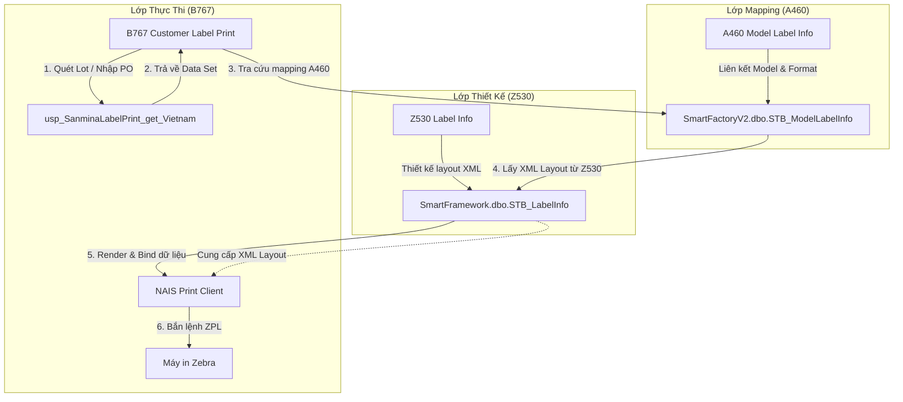

# Cẩm Nang Phát Triển Tem Nhãn Sanmina (Z530 & B767 Connection Guide)

Tài liệu này phân tích chi tiết mối liên hệ giữa **thiết kế mẫu tem Sanmina tại màn hình Z530 (Label Info)** và **quy trình in tem thực tế tại màn hình B767 (Customer Label Print)** trên hệ thống NAIS MES của Vinatech. Tài liệu này đóng vai trò là tài liệu kỹ thuật mẫu (Blueprint) giúp lập trình viên phát triển các loại tem nhãn tương tự trong tương lai.

---

## 1. 📐 Tổng Quan Kiến Trúc In Tem Nhãn (Z530 ➔ A460 ➔ B767)

Hệ thống in tem nhãn khách hàng của NAIS MES được thiết kế theo mô hình 3 lớp tách biệt nhằm tối đa khả năng tái sử dụng:



1. **Lớp Thiết Kế - Z530 (Label Info):** Nơi cất giữ cấu trúc layout mẫu thiết kế dưới dạng tài liệu XML (sử dụng chuẩn DevExpress XtraReports) trong trường `Format` của bảng `SmartFramework.dbo.STB_LabelInfo`.
2. **Lớp Mapping - A460 (Model Label Info):** Ánh xạ mã hàng (`ModelCode`/`MaterialCode`) với tên mẫu thiết kế (`FormatName`) và phân loại nhãn (`LabelType`).
3. **Lớp Thực Thi - B767 (Customer Label Print):** Giao diện chạy nghiệp vụ. Khi người dùng nhập thông tin và bấm in, hệ thống chạy Stored Procedure để lấy nguồn dữ liệu (Data Source), sau đó lấy template tương ứng từ Z530 thông qua ánh xạ ở A460, liên kết dữ liệu vào các tham số (Parameters) của mẫu và xuất lệnh in.

---

## 2. 📂 Chi Tiết Thiết Kế Mẫu Tem Tại Z530

Mẫu tem Sanmina được lưu trữ tại Z530 dưới tên định dạng `SanminaIndiaLabel_ver2`. Template sử dụng bộ máy hiển thị **DevExpress XtraReports** xoay ngang 90 độ (`Angle="90"`, `BarCodeOrientation="RotateLeft"`) để in trên khổ giấy dọc có kích thước `70mm x 155mm`.

### 2.1 Các Tham Số Đầu Vào (Parameters) Trong XML Layout
Template định nghĩa 23 tham số chính để nhận dữ liệu từ tầng CSDL:

| Tên Parameter | Mô tả | Định dạng dữ liệu |
| :--- | :--- | :--- |
| `SupplierName` | Tên nhà cung cấp (Mặc định: `Vinatech Vina`) | `string` |
| `SanminaPartNumber` | Mã linh kiện của Sanmina (Mặc định: `LFIBLM164855`) | `string` |
| `PartDesc` | Mô tả linh kiện (Mặc định: `CAP,TH EDLC 720F 3V D35MMXL105MM`) | `string` |
| `MFR` | Nhà sản xuất (Mặc định: `VINA TECHNOLOGY`) | `string` |
| `MPN` | Mã sản phẩm Vinatech (Mặc định: `VEC3R0727QG`) | `string` |
| `Quantity` | Số lượng sản phẩm trên tem hiện tại (Outer: Full Qty, Inner: Qty / 2) | `string` |
| `PONumber` | Số đơn đặt hàng (PO Number) | `string` |
| `LotCode` | Mã Datecode dạng ngày (`YYMMDD`) | `string` |
| `LotCode2` | Mã Datecode dạng tuần (`WWYY` - ví dụ: `2926`) | `string` |
| `PackingDate` | Ngày đóng gói thực tế (`YYMMDD`) | `string` |
| `InspEmpID` | Mã nhân viên QC (OQC) | `string` |
| `InspEmpName` | Tên nhân viên QC (đã xóa dấu tiếng Việt) | `string` |
| `CartonBoxNo` | Số thứ tự thùng (`XX/YY` - ví dụ: `01/10`) | `string` |
| `LabelClass` | Phân loại nhãn (`Outer` hoặc `Inner`) | `string` |
| `BoxSerialNo` | Serial lưu lịch sử (Outer gộp cả 2 serial inner cách nhau bằng dấu phẩy) | `string` |
| `PrintSerialNo` | Serial hiển thị trên tem (cột S/N hiển thị trực quan) | `string` |
| `OuterSerial` | Serial của Outer Box | `string` |
| `Inner1Serial` | Serial của Inner Box thứ nhất | `string` |
| `Inner2Serial` | Serial của Inner Box thứ hai | `string` |
| `OuterQty` | Tổng số lượng Outer Box | `string` |
| `InnerQty` | Số lượng Inner Box | `string` |
| `SerialListForQR` | Danh sách Serial dùng riêng để sinh QR Code | `string` |

### 2.2 Công Thức Ghép Mã QR Code (QR Code Bindings)
Trọng tâm của con tem Sanmina là mã QR Code (`barCode6`). QR Code này chứa toàn bộ siêu dữ liệu của thùng hàng được ghép lại theo chuẩn ngăn cách bởi dấu gạch đứng kép `||`.

Công thức ghép (Expression) được cấu hình trực tiếp trên DevExpress Control như sau:
```xml
<ExpressionBindings>
  <Item1 Ref="44" EventName="BeforePrint" PropertyName="Text" 
         Expression="Concat(?SupplierName, '||', ?SanminaPartNumber, '||', ?PartDesc, '||', ?MFR, '||', ?MPN, '||', ?Quantity, '||', ?PONumber, '||', ?LotCode2, '||', ?PackingDate, '||', ?InspEmpName, '||', ?CartonBoxNo, '||', ?SerialListForQR)" />
</ExpressionBindings>
```

#### Dữ liệu đầu ra thực tế của QR Code:
*   **Với nhãn Outer (Tem ngoài thùng):**
    `Vinatech Vina||LFIBLM164855||CAP,TH EDLC 720F 3V D35MMXL105MM||VINA TECHNOLOGY||VEC3R0727QG||100||PO123456||2926||260716||NGUYEN VAN A||01/10||VINA292600101||VINA292600102`
*   **Với nhãn Inner (Tem trong thùng):**
    `Vinatech Vina||LFIBLM164855||CAP,TH EDLC 720F 3V D35MMXL105MM||VINA TECHNOLOGY||VEC3R0727QG||50||PO123456||2926||260716||NGUYEN VAN A||01/10||VINA292600101`

---

## 3. ⚙️ Logic Truy Vấn Dữ Liệu In Tem Tại B767

Khi người dùng thực hiện thao tác in tem tại B767, hệ thống gọi Stored Procedure [usp_SanminaLabelPrint_get_Vietnam](file:///c:/Users/User Vinatech.DESKTOP-RJJSEQU/.gemini/antigravity-ide/brain/cc210399-2d3d-48a9-82bd-3ec6d6b90f26/scratch/usp_SanminaLabelPrint_get_Vietnam.sql). Logic của SP này xử lý các nhiệm vụ cốt lõi sau:

### 3.1 Kiểm Tra Điều Kiện Ràng Buộc (Validation Gates)
*   **Đóng gói hoàn tất:** Kiểm tra trường `IsProdFinish` trong bảng `STB_SetInfo` phải bằng `1`. Nếu chưa hoàn thành đóng gói tại màn hình **B523**, hệ thống chặn và báo lỗi: `"Kiểm tra màn hình B523 xem đóng gói hay chưa. Gọi sản xuất"`.
*   **Đúng chủng loại vật tư:** Mã hàng phải là `VEC3R0727QG` (Mã SP: `35105`). Nếu không đúng, báo lỗi: `"Lot đã nhập không phải hàng VEC3R0727QG (35105)"`.

### 3.2 Thuật Toán Tính Toán Tuần Và Ngày Đóng Gói
*   **Tính Datecode dạng ngày (`@rDC`):** Lấy ngày sản xuất thực tế từ LotNo (phân tích bằng hàm `dbo.fnPharseLotNo`) và format thành dạng `YYMMDD`.
*   **Tính Datecode dạng tuần (`@rDC2`):** Tính toán số tuần tiêu chuẩn ISO và năm dạng `WWYY`:
    ```sql
    SET @rDC2 = (SELECT RIGHT(100 + DATEPART(ISO_WEEK, d), 2) + FORMAT(d, 'yy')  
                 FROM (SELECT CAST(dbo.fnPharseLotNo(@LotNo, 'D') AS DATE) AS d) AS t);
    ```
*   **Lấy ngày đóng gói (`@packingDate`):** Lấy từ lịch sử ghi nhận thời gian đóng gói tại bảng `STB_SavePackingTime_VVT` và format thành `YYMMDD`.

### 3.3 Chuẩn Hóa Tên Nhân Viên QC (Clean Vietnamese Diacritics)
Để tránh lỗi font chữ unicode hoặc lỗi render ký tự đặc biệt trên máy in Zebra mã vạch, SP thực hiện loại bỏ toàn bộ dấu tiếng Việt của tên nhân viên QC từ bảng `STB_ProdWorkerInfo` bằng chuỗi lệnh `REPLACE` lồng nhau:
```sql
SET @InspEmpName = REPLACE(@InspEmpName, N'À', 'A')
SET @InspEmpName = REPLACE(@InspEmpName, N'Á', 'A')
...
SET @InspEmpName = REPLACE(@InspEmpName, N'Đ', 'D')
```

### 3.4 Logic Sinh Số Serial Độc Bản Cho Inner & Outer
Mỗi Outer Box chứa đúng 2 Inner Box. Do đó, cứ **1 thùng Outer sẽ tiêu thụ 2 số Serial Inner** tăng liên tục.
*   **Bước 1: Lấy số serial lớn nhất đã phát hành:**
    ```sql
    DECLARE @SerialPrefix VARCHAR(10) = 'VINA' + @rDC2 -- Ví dụ: VINA2926
    DECLARE @MaxSerial INT = 0

    SELECT @MaxSerial = ISNULL(MAX(TRY_CAST(RIGHT(BoxSerialNo, 5) AS INT)), 0)
    FROM STB_SanminaIndiaLabelPrintHist WITH(NOLOCK)
    WHERE BoxSerialNo LIKE @SerialPrefix + '%'
      AND LEN(BoxSerialNo) = 13
    ```
*   **Bước 2: Sử dụng bảng tạm phân loại loại tem in (`#LabelTypes`):**
    ```sql
    CREATE TABLE #LabelTypes (
        LabelClass VARCHAR(10),
        SortOrder INT
    )
    INSERT INTO #LabelTypes VALUES ('Outer', 1) -- Tem dán ngoài
    INSERT INTO #LabelTypes VALUES ('Inner', 2) -- Tem trong 1
    INSERT INTO #LabelTypes VALUES ('Inner', 3) -- Tem trong 2
    ```
*   **Bước 3: Công thức gán serial cho từng dòng dữ liệu:**
    Với mỗi thùng thứ `Num` (từ 1 đến `@pTotalBox`):
    *   **Inner 1 (SortOrder = 2):** Nhận Serial = `@SerialPrefix + RIGHT('00000' + CONVERT(VARCHAR, @MaxSerial + (#tmp.Num-1)*2 + 1), 5)`
    *   **Inner 2 (SortOrder = 3):** Nhận Serial = `@SerialPrefix + RIGHT('00000' + CONVERT(VARCHAR, @MaxSerial + (#tmp.Num-1)*2 + 2), 5)`
    *   **Outer (SortOrder = 1):** Nhận cả 2 serial cách nhau bằng dấu phẩy: `Inner1Serial + ', ' + Inner2Serial` (Ví dụ: `VINA292600101, VINA292600102`).

---

## 4. 📝 Lịch Sử In Ấn (History Logging)

Mỗi khi lệnh in được thực thi trên client, hệ thống sẽ thực hiện gọi stored procedure [usp_SanminaIndiaLabelPrintHist_iud](file:///c:/Users/User Vinatech.DESKTOP-RJJSEQU/.gemini/antigravity-ide/brain/cc210399-2d3d-48a9-82bd-3ec6d6b90f26/scratch/usp_SanminaIndiaLabelPrintHist_iud.sql) để lưu vết lịch sử vào bảng `STB_SanminaIndiaLabelPrintHist`.

### 4.1 Cấu trúc bảng lưu trữ lịch sử (`STB_SanminaIndiaLabelPrintHist`)
```sql
CREATE TABLE STB_SanminaIndiaLabelPrintHist (
    Id BIGINT IDENTITY(1,1) PRIMARY KEY,
    SupplierName VARCHAR(50),
    SanminaPartNumber VARCHAR(50),
    PartDesc NVARCHAR(100),
    MFR VARCHAR(50),
    MPN VARCHAR(50),
    Quantity VARCHAR(10),
    PONumber VARCHAR(50),
    LotNo VARCHAR(50),
    LotCode VARCHAR(6),
    PackingDate VARCHAR(6),
    InspEmpID VARCHAR(10),
    InspEmpName NVARCHAR(100),
    CartonBoxNo VARCHAR(10),
    PrintTime DATETIME,
    PrintUserID VARCHAR(20),
    BoxSerialNo VARCHAR(50) -- Đã sửa đổi độ rộng từ VARCHAR(20) lên VARCHAR(50) để chứa chuỗi gộp Outer.
)
```

> [!WARNING]
> **Lưu ý Hotfix ID_20:** Trước đây cột `BoxSerialNo` trong bảng lịch sử có độ rộng `VARCHAR(20)`. Khi thực hiện in tem Outer (chứa chuỗi gộp của 2 serial cách nhau bởi dấu phẩy, độ dài khoảng 30 ký tự), hệ thống bị lỗi tràn dữ liệu (String truncation error). Cần đảm bảo cột `BoxSerialNo` trong bảng và tham số `@pBoxSerialNo` trong SP luôn có độ dài tối thiểu `VARCHAR(50)`.

---

## 5. 🛠️ Blueprint: Quy Trình Thiết Kế & Triển Khai Tem Tương Tự Từ Đầu

Để phát triển một con tem khách hàng mới (ví dụ cho khách hàng X) hoạt động theo cơ chế tương tự Sanmina, hãy tuân theo 6 bước chuẩn sau:

### Bước 1: Khai báo bảng lịch sử in (History Table)
Tạo bảng lưu lịch sử in nhãn `STB_XLabelPrintHist` tương tự `STB_SanminaIndiaLabelPrintHist`, đảm bảo trường `BoxSerialNo` có độ dài tối thiểu `VARCHAR(50)` để đề phòng trường hợp chuỗi gộp serial của tem Outer.

### Bước 2: Tạo Stored Procedure Insert Lịch Sử
Viết stored procedure `usp_XLabelPrintHist_iud` để ghi dữ liệu từ client vào bảng lịch sử vừa tạo ở Bước 1.

### Bước 3: Viết Stored Procedure Lấy Dữ Liệu In Tem (`usp_XLabelPrint_get`)
Tạo SP truy vấn nguồn dữ liệu với các yêu cầu:
1.  Nhận các tham số: `@pProcessUserID`, `@pProcessLanguage`, `@pPONumber`, `@pLotNo`, `@pQuantity`, `@pTotalBox`.
2.  Thêm cổng chặn kiểm tra Lot đã hoàn thành công đoạn trước chưa (`IsProdFinish = 1`) và kiểm tra đúng model.
3.  Tính toán các biến phụ trợ (Datecode ngày, Datecode tuần, ngày đóng gói).
4.  Lấy tên nhân viên kiểm tra chất lượng (OQC) và làm sạch tiếng Việt không dấu.
5.  Thực hiện logic sinh số Serial tự tăng:
    *   Tự động truy vấn số lớn nhất của tuần hiện tại trong bảng lịch sử ở Bước 1.
    *   Dùng `CROSS JOIN` với bảng tạm phân loại (Outer/Inner) để nhân dòng dữ liệu (ví dụ 1 Outer + N Inner).
    *   Chia tỉ lệ số lượng (Quantity) cho nhãn Inner nếu cần.
    *   Gộp danh sách serial bằng dấu phẩy `,` cho trường `PrintSerialNo` / `BoxSerialNo` và bằng dấu gạch đứng kép `||` cho trường `SerialListForQR` đối với dòng Outer.

### Bước 4: Thiết kế Layout Mẫu Tem Tại Z530
1.  Vào màn hình **Z530 (Label Info)** trên NAIS MES Client.
2.  Bấm Thêm mới và thiết kế mẫu nhãn bằng công cụ tích hợp (DevExpress Report Designer).
3.  Khai báo đầy đủ các tham số (Parameters) tương tự như bộ kết quả đầu ra của SP ở Bước 3.
4.  Kéo thả các Label và liên kết chúng với các Parameters tương ứng (`ExpressionBindings`).
5.  Với mã QR Code, thiết lập kiểu barcode là `QRCode`, sử dụng hàm `Concat` trong Expression để ghép nối các trường dữ liệu theo định dạng chuẩn mà khách hàng yêu cầu (sử dụng dấu ngăn cách như `||` hoặc `|`).
6.  Lưu lại thiết kế (hệ thống tự động biên dịch thành file XML lưu vào `SmartFramework.dbo.STB_LabelInfo.Format`). Ghi lại tên template (ví dụ: `XCustomerLabel_Template`).

### Bước 5: Cấu hình ánh xạ tem tại A460
1.  Vào màn hình **A460 (Model Label Info)**.
2.  Tạo dòng ánh xạ mới: liên kết mã hàng (`ModelCode`/`MaterialCode`) với tên mẫu thiết kế (`FormatName` = `XCustomerLabel_Template`).
3.  Chọn phân loại nhãn (`LabelType` = `XCustomerLabel`).

### Bước 6: Phát Triển/Cấu Hình Màn Hình In Tem (Tương tự B767)
1.  Tạo màn hình in tem mới hoặc tích hợp vào màn hình in tem chung (như B767).
2.  Liên kết grid kết quả tìm kiếm với Stored Procedure `usp_XLabelPrint_get` ở Bước 3.
3.  *Quan trọng:* Đảm bảo thuộc tính `데이터 추가` (Append Data) của Search Function trên UI được cấu hình là `False` để tránh lặp dữ liệu trên lưới khi người dùng tìm kiếm lại.
4.  Cấu hình nút Action in tem dạng `PrintLabel`, trỏ tới nguồn dữ liệu là grid kết quả và định cấu hình Mapping Format lấy từ A460.
5.  Thiết lập sự kiện sau khi in thành công (Post-Print Event) để gọi SP insert lịch sử `usp_XLabelPrintHist_iud` ở Bước 2.
