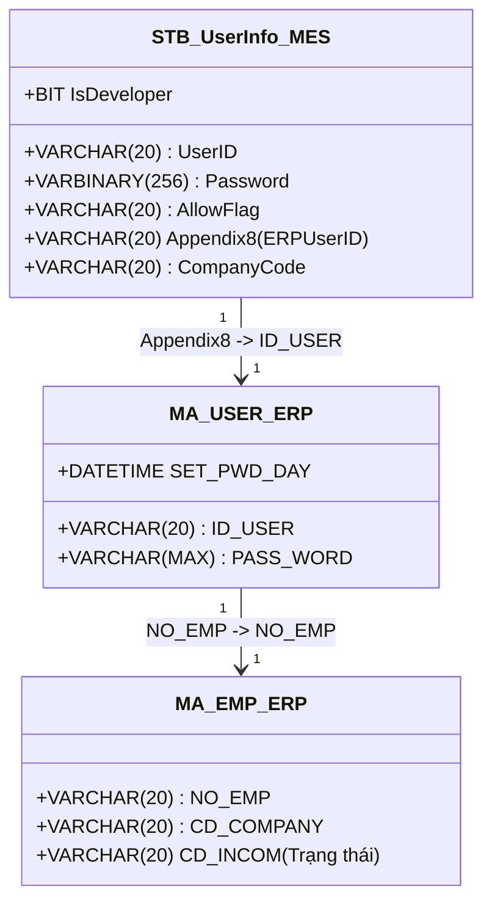
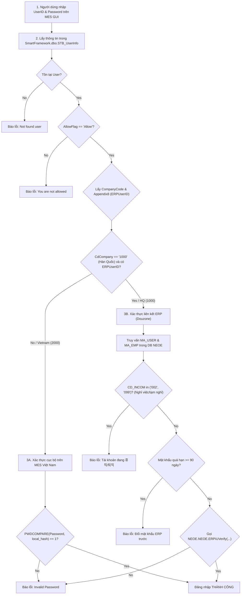

# KB_07 — Groupware & MES Integration (Quy trình vận hành & Xác thực liên kết)

> **Màn hình:** Groupware (gw.vinatech.com), F330, C220, B310, B450, FG01, B750, B752, Z410
> **Bảng chính:** `VINATECH_GROUP` (382 tables), `VINA_DOCUMENT_*`, `ESM_*` (19 bridge tables)
> **🔑 Keywords:** groupware, mua hàng, purchase, BOM, duyệt, approval, tờ trình, ESM, sync, ERP, Douzone, kho active
> ← [Về INDEX](KB_INDEX.md)

---

## 1. Tổng Quan Hệ Thống Vận Hành

Hệ thống quản trị và vận hành của Vinatech được thiết lập trên sự liên kết chặt chẽ giữa 3 nền tảng:
*   **Groupware (gw.vinatech.com):** Cổng phê duyệt tờ trình hành chính, nhân sự, mua hàng, bán hàng và kế hoạch sản xuất ở thượng nguồn.
*   **ERP Douzone (NEOE):** Hệ thống quản trị tài chính, kế toán, quản lý nhân sự gốc và lưu trữ Master Data trung tâm.
*   **NAIS MES (http://mes.hycap.co.kr:9952):** Hệ thống thực thi sản xuất tại hiện trường nhà xưởng (quét barcode, quản lý routing, QC và kho vật lý).

---

## 2. 🔑 Cơ Chế Xác Thực Người Dùng (User Authentication Process)

Quy trình đăng nhập và xác thực của người dùng trên hệ thống MES được điều phối bởi Stored Procedure `usp_DoGUILogin` (và `usp_DoDeveloperLogin`, `usp_DoRfcLogin`, `usp_DoMobileLogin`) trong database `SmartFramework`.

### 2.1 Bản đồ thuộc tính Xác thực & Liên kết Tài khoản
Tài khoản đăng nhập MES được cấu hình thông qua màn hình **Z410** (bảng `SmartFramework.dbo.STB_UserInfo`).
*   **Appendix8 (ERPUserID):** Lưu mã nhân viên ERP của người dùng (ví dụ: `32511007`), đóng vai trò là "Foreign Key" liên thông sang ERP/Groupware.
*   **AllowFlag:** Cờ cho phép tài khoản hoạt động (`Allow` / `Deny`).
*   **IsDeveloper:** Cờ cho phép tài khoản đăng nhập qua chế độ debug phát triển (`1` / `0`).



### 2.2 Sơ đồ Luồng Logic Xác thực Đăng nhập (Authentication Logic Flow)



### 2.3 Phân Tích 4 Phương Thức Đăng Nhập Hệ Thống

| Stored Procedure | Phạm vi áp dụng | Đặc điểm xác thực | Nguồn kiểm tra mật khẩu |
| :--- | :--- | :--- | :--- |
| `usp_DoGUILogin` | Ứng dụng NAIS MES trên máy tính | **Phân luồng:**<br>- **HQ (1000):** Liên thông ERP, gọi `ERPiUVerify` để khớp mật khẩu từ ERP, check trạng thái nhân sự, chặn quá 90 ngày đổi mật khẩu.<br>- **VN (2000):** Khớp mật khẩu local trong `STB_UserInfo`. | `STB_UserInfo.Password` (VN) hoặc `NEOE.MA_USER.PASS_WORD` (HQ) |
| `usp_DoDeveloperLogin` | Dành cho IT/Developer để debug | Giống hệt `usp_DoGUILogin` nhưng kiểm tra thêm điều kiện bắt buộc `IsDeveloper = 1` trong `STB_UserInfo`. | Tương tự GUI Login |
| `usp_DoRfcLogin` | Kết nối dạng API/RFC từ bên ngoài | Chỉ xác thực cục bộ (Local database) thông qua hàm `PWDCOMPARE` trên bảng `STB_UserInfo`. | `STB_UserInfo.Password` |
| `usp_DoMobileLogin` | MES trên thiết bị di động (PDA) | Kiểm tra trực tiếp plaintext password bằng toán tử so sánh bằng (`=`). | So sánh plaintext trực tiếp với `STB_UserInfo.Password` |

---

## 3. Luồng Mua Hàng & Nhập Kho Vật Tư (Purchase & Receiving Flow)

Quy trình quản lý nhập mua nguyên vật liệu từ nhà cung cấp ngoài hoặc công ty mẹ HQ:

```
1. Purchase Order Registration (Groupware - purchaseOrderDocument) ➔ Đơn đặt hàng ➔ Đẩy xuống ERP
2. Arrival Confirmation (Groupware - arrivalConfirmationDocument) ➔ Khai báo hàng về đến nhà máy
3. F330 (MES) ➔ Thủ kho nhận hàng thực tế + in tem nhãn (Assemble/Part Label)
4. C220 (MES) ➔ QC kiểm tra chất lượng ➔ Cập nhật PASS vào STB_MaterialQcInfo
5. Receiving Confirmation (Groupware - receivingConfirmationDocument) ➔ Ghi nhận tồn kho chính thức vào ERP & MES
6. Purchase Resolution (Groupware - purchaseResolutionDocument) ➔ Gom hóa đơn cước vận chuyển, quyết toán kế toán
```

---

## 4. Luồng Bán Hàng & Xuất Kho Thành Phẩm (Sales & Shipment Flow)

Quy trình quản lý xuất hàng thành phẩm/bán thành phẩm cho khách hàng hoặc luân chuyển nội bộ:

```
1. Sales Order Request (Groupware - salesOrderDocument) ➔ Đăng ký đơn bán Suju ➔ Tự tạo PO tháng
2. Shipment Request (Groupware - deliverOutDocument) ➔ Yêu cầu xuất kho ➔ Kết nối dữ liệu tồn kho MES
3. FG01 (MES) ➔ Thủ kho scan Packing ID (kiểm tra PASS OQC ở C530/C546) ➔ Chuyển kho tạm
4. B750 (MES) ➔ Gom pallet, in tem dán niêm phong (Pallet Label)
5. B752 (MES) ➔ Quét pallet lên xe, giám sát đối chiếu Container thực xuất
6. Shipment Confirmation (Groupware - deliverOutConfirmationDocument) ➔ Chốt xuất hàng, đăng ký doanh thu ERP
7. Sales Resolution (Groupware - salesResolutionDocument) ➔ Tự động sinh gửi phòng kế toán duyệt sổ sách tài chính
```

---

## 5. Luồng Kế Hoạch & Chỉ Thị Sản Xuất (PO & Production Plan)

Quy trình liên kết kế hoạch từ Groupware xuống việc chia mẻ, chia Lot và chạy máy thực tế ở hiện trường nhà xưởng:

```
[Month Production Plan (GW)] ──(Xác nhận lô hàng)──> [MES B310 (PO xuất hiện)]
                                                             │
[Daily Production Order (GW)] ──(Chốt kế hoạch ngày)─> [MES B450 (Kế hoạch ngày)]
                                                             │
                                                             v (Chia Lot, In tem)
                                                      [Chạy máy B540/B597/B530]
                                                             │
[Daily Production Report (GW)] <──(Ghi nhận sản lượng)──────┘
```

---

## 6. Luồng Quản Lý Nhân Sự & Chấm Công (HR & Time Attendance Flow)

Quy trình quản lý chấm công công nhân trên chuyền và trạng thái tài khoản đăng nhập:

*   **Đồng bộ chấm công:** SQL Agent Job `SyncFingerData` chạy định kỳ gọi stored procedure `usp_SyncFingerData` để lấy dữ liệu quét vân tay từ bảng máy chấm công hiện trường `Stb_fingerUserInfo` (phân biệt Check-in/Check-out qua mã máy lẻ/chẵn), tính toán giờ làm việc thực tế và chèn vào bảng chấm công `STB_VN_ATTENDANCE_TIME`. Trưởng ca và nhân sự sử dụng form **Attendance Modify** (`attendanceModifyDocument`) để điều chỉnh ngày công nếu có sai lệch.
*   **Xin nghỉ phép / Hủy phép:** Sử dụng tờ trình xin nghỉ phép `leaveDocument` (loại nghỉ phép G05, G14, G15, G16, v.v.) và tờ trình hủy phép `leaveCancelDocument`. Thông tin duyệt nghỉ phép được dùng để HR đối chiếu đối soát bảng chấm công MES.
*   **Tờ trình nghỉ việc ➔ Khóa tài khoản MES:** Khi tờ trình nghỉ việc `empRetireDocument` được phê duyệt hoàn toàn trên Groupware, phòng nhân sự chuyển trạng thái nhân sự trên ERP sang "Nghỉ việc" (`CD_INCOM = '099'`).
    *   Tài khoản HQ: `usp_DoGUILogin` kiểm tra trực tiếp bảng ERP `NEOE.MA_EMP`. Vì `CD_INCOM = '099'`, hệ thống tự động khóa đăng nhập ngay lập tức.
    *   Tài khoản Việt Nam: Nhân sự khóa thủ công tài khoản trong màn hình cấu hình **Z410** (đổi trạng thái `AllowFlag` thành `Deny` trong `STB_UserInfo`).

---

## 7. Chỉ Định NCC ↔ NVL (F130 / F140)

*   **F130 — Chỉ định từ Nhà cung cấp:** Chọn NCC ở lưới bên trái ➔ bên phải hiển thị danh sách NVL ➔ Tick chọn ô **"Sử dụng"** cho từng NVL được phép mua ➔ Lưu.
*   **F140 — Chỉ định từ Vật liệu:** Chọn NVL ở lưới bên trái ➔ bên phải hiển thị danh sách NCC ➔ Tick chọn ô **"Sử dụng"** cho từng NCC được phép cung cấp ➔ Lưu.

---

## 8. Luồng Master Data Chi Tiết (A210, F130/F140)

```
Item Registration Document (Groupware)
    ➔ Loại: Cell / Module / Raw material
    ➔ Điền đầy đủ thông tin: MaterialCode, MaterialName, Unit, MaterialTypeCode
    ➔ Sau khi duyệt ➔ sync xuống A230 (STB_MaterialMaster)
    ↓
A230 (MES) — Kiểm tra mã đã sync chưa
    ↓
F130/F140 — Chỉ định NCC được phép cung cấp NVL này
    ↓
F110 — Cấu hình thuộc tính kho (IsLotUse, IsUseBarcode)
    ↓
A310 — Kiểm tra BOM đã có NVL này chưa
```

---

## 9. 🔌 ESM & ERP Interface Engine (Cầu nối và Đồng bộ dữ liệu)

Hệ thống sử dụng hai luồng đồng bộ chính để liên kết dữ liệu nghiệp vụ: tiến trình ngầm **ESM Collector Service** quét các bảng bridge và stored procedure **`usp_ERPInterface_daemon`** định kỳ xử lý bảng giao tiếp ERP.

### 9.1 Cơ chế Daemon Đồng bộ ERP (`usp_ERPInterface_daemon`)
Mọi thay đổi từ Master Data và trạng thái nhập xuất vật lý được hệ thống đẩy vào bảng giao tiếp `STB_ERP_INTERFACE` (ở trạng thái `InterfaceFinYn = 'N'`). Stored procedure `usp_ERPInterface_daemon` chạy ngầm để quét và thực hiện:
*   **Đồng bộ danh mục sản phẩm (MaterialMaster):** Nhận lệnh `INSERT`/`UPDATE`/`DELETE` để đồng bộ trực tiếp sang bảng sản phẩm ERP Douzone (`erpsvr.erpdb.dbo.product`).
*   **Đồng bộ nhập kho (GR):** Chạy hàm tạo số phiếu nhập của ERP (`MM0310_NUM_OUT`) và chèn dữ liệu mẻ nhập vào bảng nhập của ERP (`ERPSVR.ERPDB.DBO.제품입고대장`). Nếu là hàng trả lại (`GR_RETURN_MATERIAL`/`GR_RETURN_PRODUCT`), hệ thống ghi nhận vào bảng xuất trả (`제품출고대장`).
*   **Đồng bộ xuất kho/tiêu hao (GI):** Gọi hàm sinh mã xuất (`FM0306_NUM_OUT`) và ghi nhận lượng tiêu hao vào bảng tiêu hao vật tư của ERP (`ERPSVR.ERPDB.DBO.자재투입`).

### 9.2 Danh sách bảng ESM và chức năng

| Bảng ESM | Chức năng | Hướng sync |
| :--- | :--- | :--- |
| `ESM_DayProdPlan` | Kế hoạch SX ngày — từ Groupware/ERP đẩy xuống MES | ERP ➔ MES |
| `ESM_DirectDayProdPlan` | Kế hoạch SX trực tiếp (bypass Groupware) | ERP ➔ MES |
| `ESM_ProdRouteHist` | Sản lượng theo công đoạn — MES đẩy lên ERP | MES ➔ ERP |
| `ESM_ProdRouteLotHist` | Sản lượng theo Lot — chi tiết hơn ProdRouteHist | MES ➔ ERP |
| `ESM_RawMaterialInputHist` | NVL tiêu thụ trên chuyền — MES đẩy lên ERP | MES ➔ ERP |
| `ESM_WarehouseInOutHist` | Xuất/nhập kho NVL — MES đẩy lên ERP | MES ➔ ERP |
| `ESM_DefectInfo` | Phế liệu/NG — MES đẩy lên ERP | MES ➔ ERP |
| `ESM_LotUpdateTarget` | Danh sách LotID cần update lên ERP | MES ➔ ERP |

### 9.3 Cơ chế sync — Cờ `ErpUpdate`
Mỗi bảng ESM có cột `ErpUpdate` (char):
*   `'N'` hoặc `NULL`: Chưa sync lên ERP — **ESM Collector sẽ pick up** để đồng bộ.
*   `'Y'`: Đã sync thành công lên ERP.

### 9.4 Cấu hình ESM Collection (`ESM_ProdCollectionSetting`)

| CdCompany | CollectionType | Batch Size (Ngày/Đêm) | Sleep (ms) | Dawn Time |
| :--- | :--- | :--- | :--- | :--- |
| `1000` (HQ - Hàn Quốc) | `erp` | 50/50 records | 1000ms | 01:00-07:00 |
| `1000` (HQ - Hàn Quốc) | `mes` | 200/200 records | 1000ms | 01:00-06:00 |
| `2000` (VVT - Bắc Giang/Bắc Ninh) | `erp` | 0/0 (disabled) | 1000ms | 01:00-07:00 |
| `2000` (VVT - Bắc Giang/Bắc Ninh) | `mes` | 200/200 records | 1000ms | 01:00-06:00 |
| `3000` (VVT_F3 - Hà Nam) | `mes` | 200/200 records | 1000ms | 01:00-06:00 |

---

## 10. Ma Trận 25+ Biểu Mẫu Groupware & Điểm Tương Tác MES/ERP
