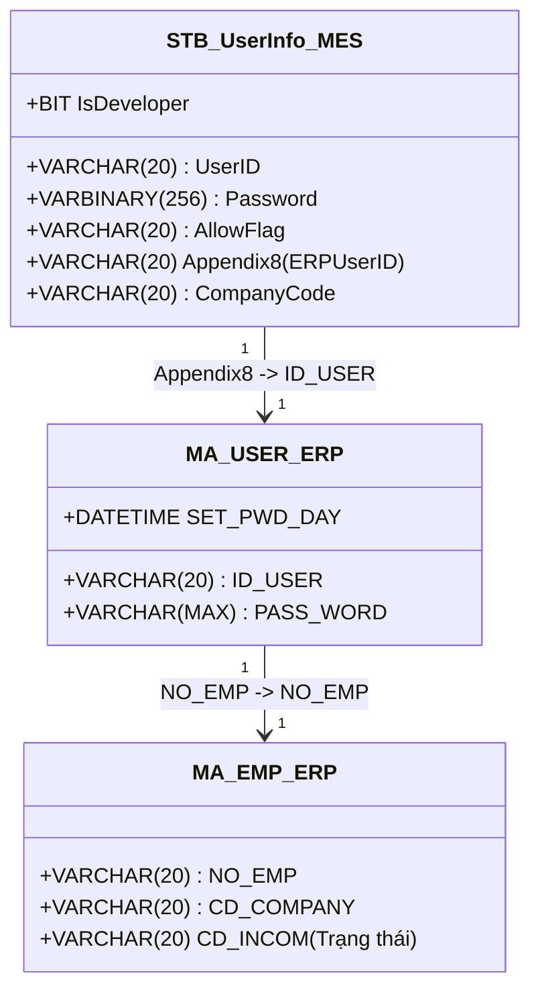
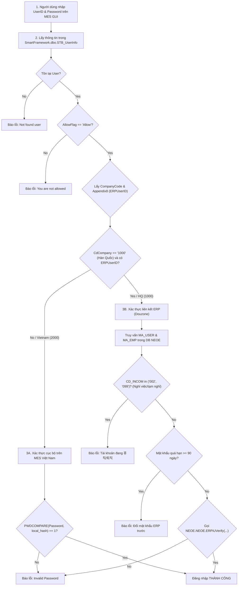

# KB_07 — Groupware & MES Integration (Quy trình vận hành & Xác thực liên kết)

> **Màn hình liên quan:** Groupware (gw.vinatech.com), F330, C220, B310, B450, FG01, B750, B752, Z410
> ← [Về INDEX](KB_INDEX.md)

---

## 1. Tổng Quan Hệ Thống Vận Hành

Hệ thống quản trị và vận hành của Vinatech được thiết lập trên sự liên kết chặt chẽ giữa 3 nền tảng:
*   **Groupware (gw.vinatech.com):** Cổng phê duyệt tờ trình hành chính, nhân sự, mua hàng, bán hàng và kế hoạch sản xuất ở thượng nguồn.
*   **ERP Douzone (NEOE):** Hệ thống quản trị tài chính, kế toán, quản lý nhân sự gốc và lưu trữ Master Data trung tâm.
*   **NAIS MES (http://mes.hycap.co.kr:9952):** Hệ thống thực thi sản xuất tại hiện trường nhà xưởng (quét barcode, quản lý routing, QC và kho vật lý).

---

## 2. 🔑 Cơ Chế Xác Thực Người Dùng (User Authentication Process)

Quy trình đăng nhập và xác thực của người dùng trên hệ thống MES được điều phối bởi Stored Procedure `usp_DoGUILogin` (và `usp_DoDeveloperLogin`, `usp_DoRfcLogin`, `usp_DoMobileLogin`) trong database `SmartFramework`.

### 2.1 Bản đồ thuộc tính Xác thực & Liên kết Tài khoản
Tài khoản đăng nhập MES được cấu hình thông qua màn hình **Z410** (bảng `SmartFramework.dbo.STB_UserInfo`).
*   **Appendix8 (ERPUserID):** Lưu mã nhân viên ERP của người dùng (ví dụ: `32511007`), đóng vai trò là "Foreign Key" liên thông sang ERP/Groupware.
*   **AllowFlag:** Cờ cho phép tài khoản hoạt động (`Allow` / `Deny`).
*   **IsDeveloper:** Cờ cho phép tài khoản đăng nhập qua chế độ debug phát triển (`1` / `0`).



### 2.2 Sơ đồ Luồng Logic Xác thực Đăng nhập (Authentication Logic Flow)



### 2.3 Phân Tích 4 Phương Thức Đăng Nhập Hệ Thống

| Stored Procedure | Phạm vi áp dụng | Đặc điểm xác thực | Nguồn kiểm tra mật khẩu |
| :--- | :--- | :--- | :--- |
| `usp_DoGUILogin` | Ứng dụng NAIS MES trên máy tính | **Phân luồng:**<br>- **HQ (1000):** Liên thông ERP, gọi `ERPiUVerify` để khớp mật khẩu từ ERP, check trạng thái nhân sự, chặn quá 90 ngày đổi mật khẩu.<br>- **VN (2000):** Khớp mật khẩu local trong `STB_UserInfo`. | `STB_UserInfo.Password` (VN) hoặc `NEOE.MA_USER.PASS_WORD` (HQ) |
| `usp_DoDeveloperLogin` | Dành cho IT/Developer để debug | Giống hệt `usp_DoGUILogin` nhưng kiểm tra thêm điều kiện bắt buộc `IsDeveloper = 1` trong `STB_UserInfo`. | Tương tự GUI Login |
| `usp_DoRfcLogin` | Kết nối dạng API/RFC từ bên ngoài | Chỉ xác thực cục bộ (Local database) thông qua hàm `PWDCOMPARE` trên bảng `STB_UserInfo`. | `STB_UserInfo.Password` |
| `usp_DoMobileLogin` | MES trên thiết bị di động (PDA) | Kiểm tra trực tiếp plaintext password bằng toán tử so sánh bằng (`=`). | So sánh plaintext trực tiếp với `STB_UserInfo.Password` |

---

## 3. Luồng Mua Hàng & Nhập Kho Vật Tư (Purchase & Receiving Flow)

Quy trình quản lý nhập mua nguyên vật liệu từ nhà cung cấp ngoài hoặc công ty mẹ HQ:

```
1. Purchase Order Registration (Groupware - purchaseOrderDocument) ➔ Đơn đặt hàng ➔ Đẩy xuống ERP
2. Arrival Confirmation (Groupware - arrivalConfirmationDocument) ➔ Khai báo hàng về đến nhà máy
3. F330 (MES) ➔ Thủ kho nhận hàng thực tế + in tem nhãn (Assemble/Part Label)
4. C220 (MES) ➔ QC kiểm tra chất lượng ➔ Cập nhật PASS vào STB_MaterialQcInfo
5. Receiving Confirmation (Groupware - receivingConfirmationDocument) ➔ Ghi nhận tồn kho chính thức vào ERP & MES
6. Purchase Resolution (Groupware - purchaseResolutionDocument) ➔ Gom hóa đơn cước vận chuyển, quyết toán kế toán
```

---

## 4. Luồng Bán Hàng & Xuất Kho Thành Phẩm (Sales & Shipment Flow)

Quy trình quản lý xuất hàng thành phẩm/bán thành phẩm cho khách hàng hoặc luân chuyển nội bộ:

```
1. Sales Order Request (Groupware - salesOrderDocument) ➔ Đăng ký đơn bán Suju ➔ Tự tạo PO tháng
2. Shipment Request (Groupware - deliverOutDocument) ➔ Yêu cầu xuất kho ➔ Kết nối dữ liệu tồn kho MES
3. FG01 (MES) ➔ Thủ kho scan Packing ID (kiểm tra PASS OQC ở C530/C546) ➔ Chuyển kho tạm
4. B750 (MES) ➔ Gom pallet, in tem dán niêm phong (Pallet Label)
5. B752 (MES) ➔ Quét pallet lên xe, giám sát đối chiếu Container thực xuất
6. Shipment Confirmation (Groupware - deliverOutConfirmationDocument) ➔ Chốt xuất hàng, đăng ký doanh thu ERP
7. Sales Resolution (Groupware - salesResolutionDocument) ➔ Tự động sinh gửi phòng kế toán duyệt sổ sách tài chính
```

---

## 5. Luồng Kế Hoạch & Chỉ Thị Sản Xuất (PO & Production Plan)

Quy trình liên kết kế hoạch từ Groupware xuống việc chia mẻ, chia Lot và chạy máy thực tế ở hiện trường nhà xưởng:

```
[Month Production Plan (GW)] ──(Xác nhận lô hàng)──> [MES B310 (PO xuất hiện)]
                                                             │
[Daily Production Order (GW)] ──(Chốt kế hoạch ngày)─> [MES B450 (Kế hoạch ngày)]
                                                             │
                                                             v (Chia Lot, In tem)
                                                      [Chạy máy B540/B597/B530]
                                                             │
[Daily Production Report (GW)] <──(Ghi nhận sản lượng)──────┘
```

---

## 6. Luồng Quản Lý Nhân Sự & Chấm Công (HR & Time Attendance Flow)

Quy trình quản lý chấm công công nhân trên chuyền và trạng thái tài khoản đăng nhập:

*   **Đồng bộ chấm công:** SQL Agent Job `SyncFingerData` chạy định kỳ gọi stored procedure `usp_SyncFingerData` để lấy dữ liệu quét vân tay từ bảng máy chấm công hiện trường `Stb_fingerUserInfo` (phân biệt Check-in/Check-out qua mã máy lẻ/chẵn), tính toán giờ làm việc thực tế và chèn vào bảng chấm công `STB_VN_ATTENDANCE_TIME`. Trưởng ca và nhân sự sử dụng form **Attendance Modify** (`attendanceModifyDocument`) để điều chỉnh ngày công nếu có sai lệch.
*   **Xin nghỉ phép / Hủy phép:** Sử dụng tờ trình xin nghỉ phép `leaveDocument` (loại nghỉ phép G05, G14, G15, G16, v.v.) và tờ trình hủy phép `leaveCancelDocument`. Thông tin duyệt nghỉ phép được dùng để HR đối chiếu đối soát bảng chấm công MES.
*   **Tờ trình nghỉ việc ➔ Khóa tài khoản MES:** Khi tờ trình nghỉ việc `empRetireDocument` được phê duyệt hoàn toàn trên Groupware, phòng nhân sự chuyển trạng thái nhân sự trên ERP sang "Nghỉ việc" (`CD_INCOM = '099'`).
    *   Tài khoản HQ: `usp_DoGUILogin` kiểm tra trực tiếp bảng ERP `NEOE.MA_EMP`. Vì `CD_INCOM = '099'`, hệ thống tự động khóa đăng nhập ngay lập tức.
    *   Tài khoản Việt Nam: Nhân sự khóa thủ công tài khoản trong màn hình cấu hình **Z410** (đổi trạng thái `AllowFlag` thành `Deny` trong `STB_UserInfo`).

---

## 7. Chỉ Định NCC ↔ NVL (F130 / F140)

*   **F130 — Chỉ định từ Nhà cung cấp:** Chọn NCC ở lưới bên trái ➔ bên phải hiển thị danh sách NVL ➔ Tick chọn ô **"Sử dụng"** cho từng NVL được phép mua ➔ Lưu.
*   **F140 — Chỉ định từ Vật liệu:** Chọn NVL ở lưới bên trái ➔ bên phải hiển thị danh sách NCC ➔ Tick chọn ô **"Sử dụng"** cho từng NCC được phép cung cấp ➔ Lưu.

---

## 8. Luồng Master Data Chi Tiết (A210, F130/F140)

```
Item Registration Document (Groupware)
    ➔ Loại: Cell / Module / Raw material
    ➔ Điền đầy đủ thông tin: MaterialCode, MaterialName, Unit, MaterialTypeCode
    ➔ Sau khi duyệt ➔ sync xuống A230 (STB_MaterialMaster)
    ↓
A230 (MES) — Kiểm tra mã đã sync chưa
    ↓
F130/F140 — Chỉ định NCC được phép cung cấp NVL này
    ↓
F110 — Cấu hình thuộc tính kho (IsLotUse, IsUseBarcode)
    ↓
A310 — Kiểm tra BOM đã có NVL này chưa
```

---

## 9. 🔌 ESM & ERP Interface Engine (Cầu nối và Đồng bộ dữ liệu)

Hệ thống sử dụng hai luồng đồng bộ chính để liên kết dữ liệu nghiệp vụ: tiến trình ngầm **ESM Collector Service** quét các bảng bridge và stored procedure **`usp_ERPInterface_daemon`** định kỳ xử lý bảng giao tiếp ERP.

### 9.1 Cơ chế Daemon Đồng bộ ERP (`usp_ERPInterface_daemon`)
Mọi thay đổi từ Master Data và trạng thái nhập xuất vật lý được hệ thống đẩy vào bảng giao tiếp `STB_ERP_INTERFACE` (ở trạng thái `InterfaceFinYn = 'N'`). Stored procedure `usp_ERPInterface_daemon` chạy ngầm để quét và thực hiện:
*   **Đồng bộ danh mục sản phẩm (MaterialMaster):** Nhận lệnh `INSERT`/`UPDATE`/`DELETE` để đồng bộ trực tiếp sang bảng sản phẩm ERP Douzone (`erpsvr.erpdb.dbo.product`).
*   **Đồng bộ nhập kho (GR):** Chạy hàm tạo số phiếu nhập của ERP (`MM0310_NUM_OUT`) và chèn dữ liệu mẻ nhập vào bảng nhập của ERP (`ERPSVR.ERPDB.DBO.제품입고대장`). Nếu là hàng trả lại (`GR_RETURN_MATERIAL`/`GR_RETURN_PRODUCT`), hệ thống ghi nhận vào bảng xuất trả (`제품출고대장`).
*   **Đồng bộ xuất kho/tiêu hao (GI):** Gọi hàm sinh mã xuất (`FM0306_NUM_OUT`) và ghi nhận lượng tiêu hao vào bảng tiêu hao vật tư của ERP (`ERPSVR.ERPDB.DBO.자재투입`).

### 9.2 Danh sách bảng ESM và chức năng

| Bảng ESM | Chức năng | Hướng sync |
| :--- | :--- | :--- |
| `ESM_DayProdPlan` | Kế hoạch SX ngày — từ Groupware/ERP đẩy xuống MES | ERP ➔ MES |
| `ESM_DirectDayProdPlan` | Kế hoạch SX trực tiếp (bypass Groupware) | ERP ➔ MES |
| `ESM_ProdRouteHist` | Sản lượng theo công đoạn — MES đẩy lên ERP | MES ➔ ERP |
| `ESM_ProdRouteLotHist` | Sản lượng theo Lot — chi tiết hơn ProdRouteHist | MES ➔ ERP |
| `ESM_RawMaterialInputHist` | NVL tiêu thụ trên chuyền — MES đẩy lên ERP | MES ➔ ERP |
| `ESM_WarehouseInOutHist` | Xuất/nhập kho NVL — MES đẩy lên ERP | MES ➔ ERP |
| `ESM_DefectInfo` | Phế liệu/NG — MES đẩy lên ERP | MES ➔ ERP |
| `ESM_LotUpdateTarget` | Danh sách LotID cần update lên ERP | MES ➔ ERP |

### 9.3 Cơ chế sync — Cờ `ErpUpdate`
Mỗi bảng ESM có cột `ErpUpdate` (char):
*   `'N'` hoặc `NULL`: Chưa sync lên ERP — **ESM Collector sẽ pick up** để đồng bộ.
*   `'Y'`: Đã sync thành công lên ERP.

### 9.4 Cấu hình ESM Collection (`ESM_ProdCollectionSetting`)

| CdCompany | CollectionType | Batch Size (Ngày/Đêm) | Sleep (ms) | Dawn Time |
| :--- | :--- | :--- | :--- | :--- |
| `1000` (HQ - Hàn Quốc) | `erp` | 50/50 records | 1000ms | 01:00-07:00 |
| `1000` (HQ - Hàn Quốc) | `mes` | 200/200 records | 1000ms | 01:00-06:00 |
| `2000` (VVT - Bắc Giang/Bắc Ninh) | `erp` | 0/0 (disabled) | 1000ms | 01:00-07:00 |
| `2000` (VVT - Bắc Giang/Bắc Ninh) | `mes` | 200/200 records | 1000ms | 01:00-06:00 |
| `3000` (VVT_F3 - Hà Nam) | `mes` | 200/200 records | 1000ms | 01:00-06:00 |

---

## 10. Ma Trận 25+ Biểu Mẫu Groupware & Điểm Tương Tác MES/ERP

Dưới đây là bảng tổng hợp tất cả các loại biểu mẫu hành chính, nhân sự, mua bán hàng trên hệ thống Groupware và cách thức chúng tương tác với MES:

| Nhóm chức năng | Tên Biểu Mẫu (Tiếng Việt) | Tên Biểu Mẫu (English) | Mã Form ID (Groupware) | Điểm Tương Tác Trên MES / ERP / Database |
| :--- | :--- | :--- | :--- | :--- |
| **Hệ thống** | Cổng đăng nhập Groupware | Groupware Login Gateway | - | Xác thực trực tiếp qua ERP `NEOE.MA_USER` / `MA_EMP` |
| **Mua hàng** | Đơn đặt hàng | Purchase Order Registration | `purchaseOrderDocument` | Tạo PO trên ERP, khóa hủy nếu có `Receiving` chờ duyệt |
| **Mua hàng** | Hủy đơn đặt hàng | Purchase Order Cancel | `purchaseOrderCancelDocument` | Xóa dữ liệu kế hoạch nhập hàng trên ERP & MES |
| **Mua hàng** | Đóng đơn đặt hàng | Purchase Order Closing | `purchaseOrderClosingDocument` | Chốt kết thúc các dòng item còn dư trong PO |
| **Mua hàng** | Xác nhận hàng về | Arrival Confirmation | `arrivalConfirmationDocument` | Đồng bộ dữ liệu xuống **MES F330** để in tem mã vạch |
| **Mua hàng** | Xác nhận nhập kho | Receiving Confirmation | `receivingConfirmationDocument` | Chỉ cho phép chọn các Lot đã được **IQC PASS** ở **MES C220** |
| **Mua hàng** | Trả lại hàng | Return Product Document | - | Chuyển Lot hàng lỗi vào kho NG trong MES, giảm trừ ERP |
| **Mua hàng** | Sổ quyết toán mua hàng | Purchase Resolution | `purchaseResolutionDocument` | Đối chiếu hóa đơn logistics đính kèm, ghi sổ nợ ERP |
| **Bán hàng** | Đăng ký đơn bán hàng | Sales Order Request (Suju) | `salesOrderDocument` | Tạo Suju trên ERP, tự động sinh Month Production Plan |
| **Bán hàng** | Yêu cầu xuất hàng | Shipment Request | `deliverOutDocument` | Kết nối dữ liệu tồn kho **MES FG01** để quét Packing ID |
| **Bán hàng** | Xác nhận thực xuất | Shipment Confirmation | `deliverOutConfirmationDocument` | Chốt xuất hàng, in nhãn Pallet tại **MES B750**, theo dõi tại **B752** |
| **Bán hàng** | Quyết toán doanh thu | Sales Resolution (Domestic) | `salesResolutionDocument` | Tự động sinh khi Shipment Confirm được duyệt để chốt sổ kế toán |
| **Bán hàng** | Quyết toán xuất khẩu | Sales Resolution (Overseas) | `salesResolutionOverseasDocument` | Tương tự Sales Resolution nhưng có kiểm tra tờ khai hải quan |
| **Bán hàng** | Hủy/Đóng đơn bán | Sales Order Cancel/Closing | `salesOrderCancelDocument` | Xóa/Đóng Suju trên ERP nếu chưa đăng ký Shipment Request |
| **Bán hàng** | Xóa thực xuất | Shipment Data Delete | `deliverOutDeleteDocument` | Revert hoàn trả tồn kho trên MES và ERP (nếu kế toán chưa duyệt) |
| **Sản xuất** | Yêu cầu kế hoạch tháng | Production Plan Request | `productionPlanRequestDocument` | Tạo kế hoạch sản lượng tháng, đồng bộ xuống **MES B310** |
| **Sản xuất** | Đóng kế hoạch tháng | Production Plan Close | `productionPlanCloseDocument` | Chốt và kết thúc kế hoạch sản xuất tháng |
| **Sản xuất** | Chỉ thị sản xuất ngày | Daily Production Order | `dailyProductionOrderDocument` | Sync kế hoạch ngày xuống **MES B450** để chia Lot, in tem |
| **Sản xuất** | Báo cáo sản xuất ngày | Daily Production Report | `dailyProductionReportDocument` | Đối chiếu Lot chạy máy tại **B540/B597** và sản lượng tại **B530** |
| **Nhân sự** | Đơn xin nghỉ phép | Leave Document | `leaveDocument` | Ghi nhận nghỉ phép năm G05, G14, G15, G16, đối chiếu chấm công |
| **Nhân sự** | Đơn hủy nghỉ phép | Leave Cancel | `leaveCancelDocument` | Hủy ngày nghỉ phép đã được phê duyệt trước đó |
| **Nhân sự** | Đơn nghỉ việc | Employee Retire Document | `empRetireDocument` | Set ngày nghỉ việc, ERP chuyển CD_INCOM=099 khóa đăng nhập MES |
| **Hành chính** | Đơn đi công tác | Business Trip Document | `businessTripDocument` | Đăng ký lộ trình, trợ cấp ăn uống, visa, hãng bay |
| **Hành chính** | Báo cáo công tác về | Business Trip Report | `businessTripReport` | Đính kèm cuống vé bay/xe, HR đối chiếu quyết toán |
| **Hành chính** | Thay đổi công tác | Business Trip Change | `businessTripChangeDocument` | Điều chỉnh ngày đi, chuyến bay phái cử |
| **Hành chính** | Đi làm ngày lễ/nghỉ | Holiday Work Request | `holidayWorkRequest` | Đăng ký đi làm ngoài giờ, duyệt cộng thêm ngày công ở ERP |
| **Hành chính** | Báo cáo đi làm lễ | Holiday Work Report | `holidayWorkReport` | HR & Kế toán đối chiếu chấm công, tính lương tăng ca |
| **Hành chính** | Sửa đổi ngày công | Attendance Modify | `attendanceModifyDocument` | Sửa giờ công trong `STB_VN_ATTENDANCE_TIME` nếu vân tay sai |
| **Hành chính** | Đăng ký đóng dấu | Seal Request Document | `sealRequestDocument` | Xin phê duyệt sử dụng con dấu công ty / con dấu chi nhánh |
| **Tài chính** | Yêu cầu thanh toán | Disbursement Document | `disbursementDocument` | Liên kết chứng từ PO/Expense Report, định tuyến tài khoản kế toán Nợ/Có (627/642/241/331) trên ERP |
| **Tự do** | Tờ trình phê duyệt tự do | Draft Document | `draftDocument` | Trình ký văn bản tự do, hỗ trợ tính năng AI tinh chỉnh nội dung |

---

## 11. ✍️ Cẩm Nang Lập & Vận Hành Chi Tiết Từng Loại Biểu Mẫu (Step-by-Step User Guide)

Dưới đây là cẩm nang hướng dẫn chi tiết lập và vận hành cho toàn bộ các biểu mẫu (Forms) trên Groupware tích hợp với hệ thống MES/ERP Douzone của Vinatech. Hướng dẫn này được thiết kế để bất kỳ người dùng hay kỹ sư hệ thống nào cũng có thể tự ánh xạ cách tạo, điền thông tin và theo dõi luồng chạy kỹ thuật của từng form.

---

### 11.1 Nhóm Biểu Mẫu Mua Hàng & Nhập Kho Vật Tư (Purchase & Receiving)

#### A. Đơn Đề Xuất Chi Phí / Yêu Cầu Mua Sắm
*   **Đường dẫn trên Groupware:** `Electronic Document ➔ Cost ➔ Expense Report Document`
*   **Mã Form ID:** `expenseReportDocument` (hoặc `Expense Report`)
*   **Tuyến phê duyệt mặc định:** `22205010-Nguyễn Thị Thúy_V6 ➔ 21910034-Trần Quang Thỏa` (CEO duyệt cuối).
*   **Quy trình tạo form:**
    1.  Thiết lập đường line phê duyệt và tiêu đề form. Điền người sử dụng thực tế tại trường **"Thay đổi người sử dụng"** (nếu làm hộ người khác).
    2.  **Mua hàng trong nước (Local):** Bắt buộc nhập VAT, không cần chọn phần đổi ngoại tệ (tính theo VNĐ).
    3.  **Mua hàng nước ngoài (Overseas):** Không cần nhập VAT, bắt buộc tích chọn chuyển đổi ngoại tệ (tỷ giá tự động tính theo thời gian thực).
    4.  Nhập số tiền chính xác theo báo giá của nhà cung cấp. Soạn nội dung chi tiết trong khung Rich-text.
    5.  Nhấn **Submit** (Gửi đi) hoặc **Lưu tạm thời** để lưu nháp.
*   **Tác động kỹ thuật & Vận hành:** Đơn được duyệt sẽ trở thành chứng từ cơ sở đầu nguồn, được liên kết trực tiếp vào form Đơn đặt hàng (PO) và Sổ quyết toán thanh toán (`purchaseResolutionDocument`) để đối chiếu audit công nợ.

#### B. Đơn Yêu Cầu Mua Hàng - Phân Loại Vật Tư
*   **Đường dẫn trên Groupware:** `Electronic Document ➔ Purchase ➔ Purchase Request Document`
*   **Mã Form ID:** `purchaseRequestDocument`
*   **Tuyến phê duyệt & Bộ phận tiếp nhận:** Phân cấp theo loại vật tư:
    *   *Nguyên vật liệu:* `Đào Thị Phiên ➔ Trần Quang Thỏa` | Tiếp nhận: `Phòng Mua hàng` | Tham chiếu: `Trần Quang Thỏa`.
    *   *Vật tư phụ:* `Đào Thị Phiên ➔ Trần Quang Thỏa` | Tiếp nhận: `Phòng Mua hàng` | Tham chiếu: `Trần Quang Thỏa`.
    *   *Tài sản IT:* `Nguyễn Văn Nha ➔ Nguyễn Thành Phi` | Tiếp nhận: `Nhóm kỹ thuật IT` | Tham chiếu: `Nguyễn Văn Nha`.
    *   *Thiết bị/Nhà xưởng:* `Đào Thị Phiên ➔ Trần Quang Thỏa ➔ CEO` | Tiếp nhận: `Nhóm kỹ thuật` (CC nhóm Kế toán).
*   **Quy trình tạo form:** Chọn đúng loại vật tư cần mua, điền số lượng yêu cầu, thông số kỹ thuật và bộ phận sử dụng. Nhấn **Submit** gửi phê duyệt.
*   **Tác động kỹ thuật:** Sau khi được phê duyệt hoàn toàn, bộ phận mua hàng tiếp nhận để tiến hành tạo đơn đặt hàng (PO) trên Groupware/ERP.

#### C. Đơn Đặt Hàng (Purchase Order Registration)
*   **Đường dẫn trên Groupware:** `Electronic Document ➔ Purchase ➔ Purchase Order Registration Document`
*   **Mã Form ID:** `purchaseOrderDocument`
*   **Tuyến phê duyệt mặc định:** `71908026-Đào Thị Phiên ➔ 21910034-Trần Quang Thỏa` (hoặc tuyến sếp Hàn đã cài sẵn: `Team Leader ➔ Group Leader ➔ Lee Sang Hun ➔ Kim Kyeong Cheol`). CC nhóm Kế toán.
*   **Quy trình tạo form:**
    1.  Chọn tuyến duyệt, đặt tiêu đề. Chọn đúng **Phân loại Tài liệu** (ví dụ: `Nguyên liệu thô` hoặc `Hàng nhập của pháp nhân`).
    2.  Tìm và chọn nhà cung cấp tại trường **Đối tác (Vendor)**. Nhấn **Kết nối tài liệu** để liên kết form `Expense Report` hoặc `Purchase Request` đã duyệt.
    3.  Chọn **Loại Đặt hàng** (Ví dụ: `Domestic Order (VAT 10)` - mã `1100`, hoặc `Import Order-T/T` - mã `1130`).
    4.  Nhập đồng tiền giao dịch (`VND`/`USD`...) và tỷ giá thực tế nếu sử dụng ngoại tệ.
    5.  Tại lưới chi tiết, nhấn **Thêm dòng** để nhập mã hàng, số lượng, đơn giá. **Bắt buộc chọn đúng phiên bản BOM 2001** (Việt Nam). Chọn mã **Kho nhập** (ví dụ: `ROH_VN_WH` cho Bắc Ninh) và mã **Cost Center** gánh chi phí.
    6.  Tích chọn giao dịch phân phối nếu là hàng chuyển thẳng không qua kho MES.
    7.  Nhấn **Submit (Gửi đi)** ➔ **Confirm** để chốt số liệu.
*   **Tác động kỹ thuật & Vận hành:** Khi duyệt hoàn tất, PO tự động ghi nhận vào ERP. Hệ thống khóa hủy PO nếu đang có form nhập kho (`receivingConfirmationDocument`) liên đới ở trạng thái chờ duyệt. Nếu Vendor là công ty mẹ HQ (Mã đối tác `13000`), hệ thống tự động sinh một đơn Yêu cầu nhận đơn hàng (Suju) ở Groupware HQ.

#### D. Xác Nhận Hàng Về (Arrival Confirmation)
*   **Đường dẫn trên Groupware:** `Electronic Document ➔ Purchase ➔ Arrival Confirmation Document`
*   **Mã Form ID:** `arrivalConfirmationDocument`
*   **Tuyến phê duyệt:** `71908026-Đào Thị Phiên ➔ 21910034-Trần Quang Thỏa` (CC nhóm Kế toán).
*   **Quy trình tạo form:**
    1.  Nhấn tải danh sách PO đã approved để liên kết thông tin.
    2.  Chọn **Ngày hàng về thực tế** và **Loại hình thanh toán**.
    3.  Tại lưới chi tiết, nhập số lượng thực tế hàng về tại cột **Số lượng Nhập kho**.
    4.  *(Nếu là hàng nhập khẩu)*: Điền các thông số bắt buộc: **Số B/L**, Ngày phát hành B/L, Số thông quan tờ khai, Ngày khai hải quan để ERP làm thủ tục.
    5.  Tại lưới MES Label, điền số lượng lot mỗi bao bì, số lượng nhãn và nhấn **Tạo nhãn thủ công** (hoặc để hệ thống tự tạo khi hoàn tất tiếp nhận).
    6.  Nhấn **Submit** để gửi duyệt.
*   **Tác động kỹ thuật & Vận hành:** Sau khi duyệt xong, dữ liệu hàng về lập tức truyền xuống trạm tiếp nhận **MES F330**. Thủ kho mở màn hình **F330**, tra cứu số phiếu giao nhận (`materialDocNo`) nạp tự động, kiểm đếm hàng thực tế và in tem mã vạch vật tư (`Part Label`) dán lên bao bì. Các bản ghi Lot tương ứng sẽ được sinh ra trong bảng `STB_MaterialLotInfo`. Hệ thống cũng gửi email tự động thông báo cho đội QC tiến hành lấy mẫu kiểm định IQC.

#### E. Xác Nhận Nhập Kho (Receiving Confirmation)
*   **Đường dẫn trên Groupware:** `Electronic Document ➔ Purchase ➔ Receiving Confirmation Document` (UI hiển thị sai chính tả: `Receiving Confirmation Doucment`)
*   **Mã Form ID:** `receivingConfirmationDocument`
*   **Tuyến phê duyệt:** `71908026-Đào Thị Phiên ➔ 21910034-Trần Quang Thỏa` (CC nhóm Kế toán).
*   **Quy trình tạo form:**
    *   ⚠️ **Ràng buộc cứng:** Chỉ tạo được form khi các Lot hàng đã được bộ phận QC kiểm định chất lượng đạt trạng thái **PASS** tại màn hình **MES C220** (hoặc `C220_SPS`), lưu trong bảng `STB_MaterialQcInfo`.
    1.  Tải đơn hàng PO tương ứng và chọn **Ngày nhập kho vật lý**.
    2.  Tại lưới chi tiết, chọn các Lot đạt tiêu chuẩn QC PASS (hệ thống tự nạp số lượng tương thích).
    3.  Chọn mã **Kho nhận thực tế** và gửi duyệt.
*   **Tác động kỹ thuật & Vận hành:** Sau khi hoàn tất phê duyệt, số lượng tồn kho trên cả ERP và MES sẽ tự động tăng tương ứng. Dữ liệu tồn kho chính thức được ghi nhận trong cơ sở dữ liệu.

#### F. Trả Lại Hàng (Return Product Document)
*   **Đường dẫn trên Groupware:** `Electronic Document ➔ Purchase ➔ Return Product Document`
*   **Mã Form ID:** `returnProductDocument`
*   **Tuyến phê duyệt:** `71908026-Đào Thị Phiên ➔ 21910034-Trần Quang Thỏa`.
*   **Quy trình tạo form:**
    1.  Chọn tài liệu nhập kho đã lập trước đó để liên kết thông tin.
    2.  Chọn phân loại: **Trả lại sản phẩm** (Product Return) hoặc **Trả lại nguyên vật liệu** (Raw Material Return).
    3.  Tìm kiếm mã hàng và chọn đúng số **LOT** cụ thể cần trả lại cho nhà cung cấp.
    4.  Điền ngày xuất trả thực tế, phân loại VAT. Đối với ngoại tệ, tỷ giá bắt buộc phải là **tỷ giá gốc khi mua hàng** lấy từ lịch sử đơn hàng. Nhấn gửi duyệt.
*   **Tác động kỹ thuật:** Sau khi được phê duyệt, các Lot hàng bị trả lại sẽ **tự động chuyển vào kho lỗi (NG) trong MES** (ví dụ: `NG_RAW_VN_WH` cho Bắc Ninh) và cập nhật ghi giảm tồn kho/công nợ trong ERP.

#### G. Hủy / Xóa Đơn Đặt Hàng (Purchase Order Data Delete Document)
*   **Đường dẫn trên Groupware:** `Electronic Document ➔ Purchase ➔ Purchase Order Data Delete Document`
*   **Mã Form ID:** `purchaseOrderCancelDocument`
*   **Tuyến phê duyệt:** `71908026-Đào Thị Phiên ➔ 21910034-Trần Quang Thỏa`.
*   **Quy trình tạo form:** Tra cứu và chọn số PO cần hủy. Điền lý do hủy chi tiết vào ô lý do cập nhật và gửi duyệt.
*   *Ràng buộc:* Chỉ thực hiện được khi PO **chưa từng phát sinh giao dịch nhập kho** (Arrival/Receiving). Nếu đang có form `receivingConfirmationDocument` liên quan ở trạng thái chờ duyệt, hệ thống sẽ khóa cứng.
*   **Tác động kỹ thuật:** Khi duyệt xong, hệ thống tự động xóa sạch dữ liệu đăng ký nhập hàng liên quan của PO này trên ERP và MES. Các item trong PO này sẽ biến mất khỏi màn hình lựa chọn của form *Arrival Confirmation*. Toàn bộ thông tin B/L hay thông quan đi kèm cũng bị xóa khỏi DB.

#### H. Đóng Đơn Đặt Hàng (Purchase Order Closing Document)
*   **Đường dẫn trên Groupware:** `Electronic Document ➔ Purchase ➔ Purchase Order Closing Document`
*   **Mã Form ID:** `purchaseOrderClosingDocument`
*   **Tuyến phê duyệt:** `71908026-Đào Thị Phiên ➔ 21910034-Trần Quang Thỏa`.
*   **Quy trình tạo form:** Chọn số PO, tick chọn các dòng mặt hàng (items) còn dư trong PO cần đóng và gửi duyệt.
*   **Tác động kỹ thuật:** Giữ nguyên dữ liệu lịch sử PO gốc nhưng xóa dữ liệu kế hoạch nhập hàng liên quan của các item được chọn đóng trên ERP và MES. Các dòng item đã đóng sẽ bị ẩn đi trên màn hình *Arrival Confirmation*. Nếu đóng một phần, hệ thống tự động tính toán lại tổng giá trị còn lại của PO và cập nhật lên ERP/MES.

#### I. Sổ Quyết Toán Mua Hàng (Purchase Resolution)
*   **Đường dẫn trên Groupware:** `Electronic Document ➔ Cost Management ➔ Purchase Resolution Document`
*   **Mã Form ID:** `purchaseResolutionDocument`
*   **Tuyến phê duyệt:** `22205010-Nguyễn Thị Thúy_V6 ➔ 21910034-Trần Quang Thỏa` (CC nhóm Kế toán).
*   **Quy trình tạo form:**
    1.  Chọn phân loại tài liệu (Ví dụ: `Trong nước` hoặc `Quốc tế`).
    2.  Chọn ngày thanh toán (Theo lịch cố định: **ngày 15** hoặc **ngày 30** hàng tháng, hoặc ngày tự chọn đã thỏa thuận với Kế toán).
    3.  *(Nếu là hàng nhập khẩu)*: Đăng ký chi phí phụ B/L và thông quan bằng cách chọn đối tác phụ trách, nhập số tiền chi phí phụ (cước tàu, THC, CFS, FSC...), chọn bộ phận chịu chi phí.
    4.  Tại bảng mặt hàng thanh toán, click chọn **Bản ghi nợ** để chọn mã tài khoản kế toán tương thích với loại hàng hóa cần thanh toán (Bút toán phân kỳ Cost).
    5.  Nhập loại thuế, tiền thuế VAT tương ứng và gửi duyệt.
*   **Tác động kỹ thuật & Vận hành:** Khi duyệt hoàn tất, hệ thống tự động chạy kiểm tra các cờ sai lệch (`changeDistribuCheck`, `changeRequestDateCheck`, `changeCostCdCcCheck`, `changeCondPriceCheck`, `changeInvoiceNoCheck`). Nếu hợp lệ, hệ thống tự động phát hành chứng từ kế toán ERP chính thức.

#### J. Xác Nhận Nhận Hàng Liên Công Ty (Corporate Receiving Confirmation)
*   **Đường dẫn trên Groupware:** `Electronic Document ➔ Purchase ➔ Corporate Receiving Confirmation Document`
*   **Mã Form ID:** `corporateReceivingConfirmationDocument` (hoặc liên kết qua `receivingConfirmationDocument`)
*   **Tuyến tiếp nhận:** Nhóm kỹ thuật thiết bị/nhà xưởng (`Nguyễn Thị Minh Hiền`, `Nguyễn Thị Hậu`, `Đào Thị Phiên`).
*   **Quy trình tạo form & Vận hành:**
    1.  Nhấn bắt đầu xác nhận thông tin hàng nhập khẩu liên công ty.
    2.  Thủ kho sử dụng máy quét PDA quét mã vạch **Packing ID** trên các thùng hàng thực tế nhận được từ công ty mẹ Hàn Quốc (Vendor mã `13000`).
    3.  Hệ thống đối chiếu mã Packing ID và số lượng thực quét với thông tin phiếu xuất của phía HQ. Khi quét mã lần đầu, lưới danh mục toàn bộ các mặt hàng được khai báo trong phiếu xuất của HQ sẽ tự động hiển thị để đối chiếu.

---

### 11.2 Nhóm Biểu Mẫu Bán Hàng & Xuất Khẩu (Sales & Shipment)

#### A. Đơn Bán Hàng / Suju (Sales Order Request)
*   **Đường dẫn trên Groupware:** `Electronic Document ➔ Sales ➔ Sales Order Document`
*   **Mã Form ID:** `salesOrderDocument`
*   **Tuyến phê duyệt:** `11804002-Lê Thị Vân Anh ➔ Kim Kyeong Cheol (CEO)`. CC nhóm Kế toán.
*   **Quy trình tạo form:**
    1.  Đặt tiêu đề, chọn liên kết đến **Kế hoạch bán hàng (Sales Plan)** đã duyệt.
    2.  Chọn **Loại đơn hàng** (Ví dụ: `Trong nướcĐơn bán hàng-Bình thường` - mã `1100`, hoặc `Việt Nam-Xuất khẩu` - mã `1150`).
    3.  Chọn điều kiện Incoterms tại trường **Điều kiện giao hàng** (Ví dụ: `[DDP]`, `[FOB]`, `[CIF]`).
    4.  Chọn **Đồng tiền giao dịch**, phương thức vận chuyển (`AIR` / `OCEAN`), nhóm kinh doanh, loại thuế và tỷ giá thực tế.
    5.  Tại lưới chi tiết mặt hàng, nhập mã sản phẩm, số lượng đặt hàng, đơn giá bán, ngày yêu cầu giao hàng mong muốn và mã kho thành phẩm xuất đi. Nhấn **Submit** gửi phê duyệt.
*   **Tác động kỹ thuật & Vận hành:** Sau khi được phê duyệt hoàn toàn, đơn hàng tự động đăng ký vào ERP dưới dạng Suju. Đồng thời, hệ thống tự động sinh một kế hoạch sản xuất tháng tương ứng trên giao diện *Month Production Plan* của nhà máy phụ trách để sẵn sàng chạy sản xuất.

#### B. Yêu Cầu Xuất Hàng (Shipment Request)
*   **Đường dẫn trên Groupware:** `Electronic Document ➔ Sales ➔ Deliver Out Document`
*   **Mã Form ID:** `deliverOutDocument`
*   **Tuyến phê duyệt:** `71903004-Nguyễn Thị Linh_V1 ➔ 21910034-Trần Quang Thỏa`.
*   **Bộ phận tiếp nhận:** Nhóm Xuất nhập khẩu (`Nguyễn Thị Linh_V1`, `Nguyễn Thị Thúy_V7`, `Vũ Thị Minh Ngọc`). CC nhân viên chất lượng (QC).
*   **Quy trình tạo form:**
    1.  Chọn liên kết đến đơn bán hàng **Suju** đã được duyệt.
    2.  Nhập số lượng yêu cầu xuất kho tại trường **Số lượng yêu cầu**.
    3.  *(Nếu là xuất khẩu)*: Nhập thông tin hóa đơn xuất khẩu (Invoice) liên kết từ phân hệ SFA.
    4.  Nhấn **Submit**. Người lập form (người trình) sẽ được hệ thống tự động duyệt qua bước của mình (Auto-approved).
*   **Tác động kỹ thuật & Vận hành:** ERP ghi nhận trạng thái yêu cầu xuất hàng. Form này gửi tín hiệu chuẩn bị hàng đến kho hiện trường MES. Thủ kho sử dụng thiết bị PDA mở màn hình **MES FG01**, tiến hành quét (scan) mã vạch **Packing ID** của các thùng hàng thực tế bốc từ kệ. Hệ thống tự động kiểm tra xem các Box này có được đánh giá **PASS OQC** (kiểm định chất lượng xuất xưởng tại màn hình **C530/C546** - bảng `STB_VN_FINISHGOODS_forQCAudit`) hay không. Nếu PASS, hệ thống cho phép ghi nhận xuất sang kho trung chuyển tạm thời.

#### C. Xác Nhận Thực Xuất (Shipment Confirmation)
*   **Đường dẫn trên Groupware:** `Electronic Document ➔ Sales ➔ Shipment Confirmation Document`
*   **Mã Form ID:** `deliverOutConfirmationDocument`
*   **Bộ phận tiếp nhận:** 
    *   *Trong nước:* Nhóm Kinh doanh nội địa (`Nguyễn Trường Sa`, `Nguyễn Trà Linh`, `Đào Thị Bích Ngọc`...).
    *   *Xuất khẩu:* Nhóm Xuất nhập khẩu (`Nguyễn Thị Linh_V1`, `Nguyễn Thị Thúy_V7`, `Vũ Thị Minh Ngọc`). CC nhóm Kế toán.
*   **Quy trình tạo form & Vận hành:**
    1.  Tại kho hiện trường MES:
        *   Tại màn hình **B750**, thủ kho gom các thùng hàng lẻ thành Pallet, thực hiện lệnh in tem Pallet dán niêm phong cụm Pallet đã bọc màng PE.
        *   Khi bốc dỡ Pallet lên Container/Xe tải, nhân viên quét mã tem Pallet.
        *   Mở màn hình **B752** để đối chiếu giám sát danh sách chi tiết các Pallet trong thùng xe Container so với phiếu yêu cầu xuất hàng gốc.
    2.  Trên Groupware: Nhân viên lập form **Shipment Confirmation**, chọn liên kết đến biểu mẫu *Shipment Request* đã hoàn tất ở bước trước.
    3.  Khai báo thông tin bán hàng: nhập thông tin doanh thu (giao dịch trong nước) hoặc nhập thông tin khai báo Hải quan và ngày tàu chạy (giao dịch xuất khẩu) và gửi duyệt.
*   **Tác động kỹ thuật:** Sau khi duyệt hoàn tất, hệ thống tự động ghi nhận xuất kho thành phẩm vật lý khỏi ERP/MES và tự động khởi tạo đơn quyết toán doanh thu (`salesResolutionDocument` / `salesResolutionOverseasDocument`) gửi phòng Kế toán chốt doanh số.

#### D. Quyết Toán Doanh Thu (Sales Resolution Document - Domestic / Overseas)
*   **Đường dẫn trên Groupware:** `Electronic Document ➔ Cost ➔ Sales Resolution Document` (hoặc `salesResolutionOverseasDocument`)
*   **Mã Form ID:** `salesResolutionDocument` (Trong nước) / `salesResolutionOverseasDocument` (Xuất khẩu)
*   **Bộ phận tiếp nhận:** Phòng Kế toán (Accounting Team).
*   **Quy trình & Tác động kỹ thuật:** Biểu mẫu này được hệ thống **tự động khởi tạo và trình duyệt** ngay sau khi đơn *Shipment Confirmation* được phê duyệt hoàn tất. Kế toán viên kiểm tra đối chiếu và thực hiện phê duyệt bút toán kế toán tạm hoãn để ghi nhận doanh thu chính thức vào sổ sách tài chính ERP.

#### E. Hủy / Đóng Đơn Bán Hàng (Sales Order Cancel & Closing)
*   **Đường dẫn trên Groupware:** `Electronic Document ➔ Sales ➔ Sales Order Cancel/Closing Document`
*   **Mã Form ID:** `salesOrderCancelDocument`
*   **Tuyến phê duyệt:** `11804002-Lê Thị Vân Anh` (Final Approval).
*   **Quy trình tạo form:** Chọn số Suju cần hủy/đóng. Chọn loại hành động:
    *   **Hủy Suju (Suju Delete):** Xóa dữ liệu Suju khỏi hệ thống. Chỉ thực hiện được khi PO yêu cầu xuất hàng liên kết với Suju này **chưa được đăng ký**.
    *   **Đóng Suju (Suju Closing):** Đóng/kết thúc đơn hàng đối với các phần sản lượng chưa giao. Chỉ thực hiện được khi yêu cầu xuất hàng liên quan không ở trạng thái đang xử lý. Nhấn gửi duyệt.
*   **Tác động kỹ thuật:** Sau khi được phê duyệt, hệ thống tự động cập nhật đóng/hủy Suju tương ứng trong ERP.

#### F. Xóa Dữ Liệu Xuất Hàng (Shipment Data Delete Document)
*   **Đường dẫn trên Groupware:** `Electronic Document ➔ Sales ➔ Shipment Data Delete Document`
*   **Mã Form ID:** `deliverOutDeleteDocument`
*   **Quy trình tạo form:** Dùng khi thủ kho/logistics nhập sai thông tin xuất hàng cần thu hồi dữ liệu. Chọn số chứng từ xuất hàng cần xóa, điền lý do và gửi duyệt.
*   *Ràng buộc:* Phiếu toán kế toán liên quan **chưa được phê duyệt** (미결전표 상태). Nếu kế toán đã duyệt chốt sổ, hệ thống sẽ khóa chức năng xóa.
*   **Tác động kỹ thuật:** Khi được duyệt xóa, hệ thống sẽ đồng thời hủy bỏ toàn bộ chuỗi dữ liệu liên quan trên ERP bao gồm: Yêu cầu xuất hàng (의뢰), Hóa đơn (송장), Thực xuất (출하), Doanh thu (매출) và Phiếu toán (전표), hoàn trả lại tồn kho vật lý trên MES.

---

### 11.3 Nhóm Biểu Mẫu Kế Hoạch & Sản Xuất (Production Planning & Execution)

#### A. Yêu Cầu Kế Hoạch Sản Xuất Tháng
*   **Đường dẫn trên Groupware:** `Electronic Document ➔ Basic ➔ Production Plan Request Document`
*   **Mã Form ID:** `productionPlanRequestDocument`
*   **Quy trình tạo form:**
    1.  Nhập tiêu đề tài liệu (`documentSaveSubject`).
    2.  Chọn tổ sản xuất, đội sản xuất.
    3.  Nhập ngày bắt đầu chạy kế hoạch (`Production Start Date`) và ngày kết thúc (`Production End Date`).
    4.  Nhập nội dung chi tiết/ghi chú và nhấn gửi duyệt.
*   **Tác động kỹ thuật:** Đơn được duyệt sẽ thiết lập kế hoạch sản xuất chính thức trong tháng, làm cơ sở để phân rã nguyên vật liệu và liên thông tạo các đề xuất mua hàng thiếu hụt trên hệ thống.

#### B. Đơn Đóng Kế Hoạch Sản Xuất Tháng
*   **Đường dẫn trên Groupware:** `Electronic Document ➔ Basic ➔ Production Plan Close Document`
*   **Mã Form ID:** `productionPlanCloseDocument`
*   **Quy trình tạo form:** Tương tự đơn yêu cầu kế hoạch, dùng để chốt và đóng kế hoạch sản xuất tháng đã hoàn thành.

#### C. Chỉ Thị Sản Xuất Ngày (Daily Production Order)
*   **Đường dẫn trên Groupware:** `Electronic Document ➔ Basic ➔ Daily Production Order Document`
*   **Mã Form ID:** `dailyProductionOrderDocument`
*   **Quy trình tạo form:**
    1.  Chọn phân loại tờ trình sản xuất (Ví dụ: `F/C MEA` hoặc `S/C Điện cực`). Chọn loại xuất/trả hàng (`warehouseInOutCode`: `불출` - Xuất / `반납` - Trả).
    2.  Chọn Line làm việc, số lượng vật tư cần xuất.
    3.  Tại lưới Kế hoạch ngày bên dưới, nhấn nút **"+"** để thêm dòng: chọn Nhà máy sản xuất (`VVT_F1`, `VVT_F2`, `VVT_F3`), ngày chạy máy, Line sản xuất, Ca làm việc và Số lượng chỉ thị.
    4.  Tích chọn các dòng kế hoạch ngày vừa tạo (dòng sẽ chuyển sang màu xanh) và nhấn **Mục tiêu lựa chọn Đã xác nhận** ➔ Chọn **Áp dụng** để chốt kế hoạch ngày.
*   **Tác động kỹ thuật & Vận hành:** Dữ liệu tự động đồng bộ xuống bảng `STB_DayProdPlan` của màn hình **MES B450**. Tại MES B450, tổ trưởng sản xuất nhấn nút **"Tạo lô (LOT)"** chia tổng số lượng kế hoạch ngày thành các Lot nhỏ (ví dụ: 5.000 sản phẩm/Lot) và thực hiện in tem nhãn barcode lô (`Assemble Label` - format cấu hình tại A460) phát xuống chuyền chạy máy. Một khi kế hoạch ngày đã ở trạng thái Xác nhận (확정) hoặc Đã chốt/Mở ca (마감), người dùng không thể thực hiện lệnh hủy kế hoạch ngày.

#### D. Báo Cáo Sản Xuất Ngày (Daily Production Report)
*   **Đường dẫn trên Groupware:** `Electronic Document ➔ Basic ➔ Daily Production Report Document`
*   **Mã Form ID:** `dailyProductionReportDocument`
*   **Quy trình tạo form:**
    1.  Chọn phân loại tài liệu (Ví dụ: `F/C MEA`, `S/C`...), nhập ngày sản xuất thực tế.
    2.  Liên kết **Số Kế hoạch Ngày** (`dayPlanNo`) và nhập **Số Lot** (`lotNo`), mã vật tư, Line sản xuất, Công đoạn.
    3.  Nhập số lượng đầu vào (`inputQty`), số lượng lỗi (`defectQty`), thực tế sản xuất (`prodQty`). Nhấn gửi duyệt báo cáo ca làm việc.
*   **Tác động kỹ thuật:** Đối chiếu trực tiếp với dữ liệu quét tem Lot nguyên vật liệu cấp vào máy tại trạm **B540/B597** (lưu trong `STB_RawMaterialInputHist`), kết quả đo PQC tại trạm **C443** (lưu trong `STB_CommInspDocHistory`) và sản lượng chốt tại trạm **B530** (lưu trong `STB_ProdRouteHist`). Nếu Lot đã được quét ghi nhận sản lượng thực tế tại xưởng, người dùng không thể xóa Lot trên hệ thống.

---

### 11.4 Nhóm Biểu Mẫu Hành Chính, Nhân Sự & Tài Chính (HR, Admin & Finance)

#### A. Đơn Xin Nghỉ Phép (Leave Document)
*   **Đường dẫn trên Groupware:** `Electronic Document ➔ Basic ➔ Leave Document`
*   **Mã Form ID:** `leaveDocument`
*   **Tuyến phê duyệt & Tiếp nhận:**
    *   *Tuyến phê duyệt:* `Trưởng ca/Trưởng nhóm (Team Leader) ➔ Trưởng phòng (Group Leader) ➔ Lee Sang Hun ➔ Kim Kyeong Cheol (CEO)`.
    *   *Bộ phận tiếp nhận:* `Đinh Thị Huyền_V2` (hoặc thêm `Nguyễn Thị Hoàn` cho các tuyến quan trọng).
*   **Quy trình tạo form:**
    1.  Chọn phân loại tài liệu (`Thông thường` / `Khác(유급)`).
    2.  Chọn **Loại nghỉ phép** (`cdWcode`): Nghỉ phép năm (G05), nghỉ nửa ngày (G14), nghỉ bù/thưởng (G15), nghỉ việc gia đình (G16), nghỉ khác hưởng lương (G17) hoặc không lương (G18).
    3.  Chọn thời gian nghỉ (từ ngày... đến ngày...), số ngày đề xuất.
    4.  Nhập tên nhân viên thay thế/ủy quyền bàn giao công việc tạm thời. Chọn có chỉ định người duyệt thay (`proxyApprovalYn`) hay không. Nhấn gửi duyệt.
*   **Tác động kỹ thuật & Vận hành:** Khi duyệt thành công, thông tin nghỉ phép được lưu trữ để phòng Nhân sự đối chiếu bảng chấm công MES. SQL Agent Job `SyncFingerData` chạy định kỳ gọi stored procedure `usp_SyncFingerData` để lấy dữ liệu quét vân tay từ bảng máy chấm công hiện trường `Stb_fingerUserInfo`, tính toán giờ làm việc thực tế và cập nhật vào bảng `STB_VN_ATTENDANCE_TIME`. Ngày nghỉ phép được dùng làm căn cứ hợp lệ cho những ngày không quét vân tay.

#### B. Đơn Hủy Nghỉ Phép (Leave Cancel Document)
*   **Đường dẫn trên Groupware:** `Electronic Document ➔ Basic ➔ Leave Cancel Document`
*   **Mã Form ID:** `leaveCancelDocument`
*   **Tuyến phê duyệt:** `Team Leader ➔ Group Leader ➔ Kim Kyeong Cheol (CEO)`. Tiếp nhận: `Đinh Thị Huyền_V2, Nguyễn Thị Hoàn`.
*   **Quy trình tạo form:** Dùng để hủy ngày nghỉ phép đã được phê duyệt trước đó. Người dùng nhập lý do hủy phép tại khung nội dung (`documentSaveContent`) và gửi duyệt.
*   **Tác động kỹ thuật:** Hoàn trả lại ngày phép năm tương ứng trên ERP/Groupware cho nhân viên.

#### C. Đơn Nghỉ Việc (Employee Retire Document)
*   **Đường dẫn trên Groupware:** `Electronic Document ➔ Human Sources ➔ Employee Retire Document`
*   **Mã Form ID:** `empRetireDocument`
*   **Tuyến phê duyệt:** `Team Leader ➔ Group Leader ➔ Quản lý người Hàn ➔ Bác Jang (Group Leader) ➔ Bác COO (CEO - duyệt cuối)`. Tiếp nhận: `Lê Thị Vân Anh ➔ Kim Kyeong Cheol (CEO)`.
*   **Quy trình tạo form:**
    1.  Chọn nhân sự áp dụng (nếu làm hộ cho công nhân dưới quyền).
    2.  Nhập chính xác **Ngày nghỉ việc**, **Ngày làm việc cuối cùng**.
    3.  Nhập người tiếp nhận bàn giao công việc thay thế.
    4.  Nhập số điện thoại, email và địa chỉ liên hệ sau khi nghỉ (để HR làm thủ tục chốt sổ BHXH). Nhập lý do nghỉ việc và gửi duyệt.
*   **Tác động kỹ thuật & Khóa tài khoản MES:** Khi tờ trình nghỉ việc được phê duyệt hoàn toàn, phòng Nhân sự cập nhật ngày làm việc cuối cùng và chuyển trạng thái nhân viên sang "Nghỉ việc" (`CD_INCOM = '099'`) trên ERP Douzone.
    *   *Tài khoản Hàn Quốc (CdCompany = 1000):* Stored procedure `usp_DoGUILogin` của MES truy vấn trực tiếp bảng ERP `NEOE.MA_EMP`. Do `CD_INCOM = '099'`, hệ thống sẽ khóa và chặn đăng nhập MES ngay lập tức.
    *   *Tài khoản Việt Nam (CdCompany = 2000):* Nhân sự truy cập màn hình cấu hình hệ thống **MES Z410** đổi trạng thái `AllowFlag` của nhân viên đó từ `'Allow'` sang `'Deny'` trong bảng `STB_UserInfo` để khóa tài khoản thủ công.

#### D. Đơn Đi Công Tác (Business Trip Document)
*   **Đường dẫn trên Groupware:** `Electronic Document ➔ Holiday work request ➔ Business Trip Document`
*   **Mã Form ID:** `businessTripDocument`
*   **Tuyến tiếp nhận/CC:**
    *   *Trong nước:* `Đinh Thị Huyền_V2, Nguyễn Thị Hoàn` (Final).
    *   *Nước ngoài:* `Đinh Thị Huyền_V2, Nguyễn Thị Hoàn` và nhóm nhận Kế toán.
*   **Quy trình tạo form:**
    1.  Chọn loại công tác (Trong nước / Nước ngoài), nhập địa điểm đến và chọn Quốc gia, Thành phố, loại chỗ ở, tình trạng phái cử.
    2.  Chọn thời gian đi (từ ngày... đến ngày...). Nhập ngày hết hạn Hộ chiếu/Visa (nếu đi nước ngoài).
    3.  Để thêm người đi cùng, click **Thêm nhiều người** để tìm kiếm theo tên/mã nhân viên.
    4.  Khai báo số lượng bữa ăn tự túc mỗi ngày để hệ thống tự động nhân hệ số phụ cấp ăn uống và tính toán tổng chi phí dự toán của chuyến đi.
    5.  Bắt buộc đính kèm tệp tin hình ảnh/tài liệu lộ trình công tác và gửi duyệt.
*   **Tác động kỹ thuật:** Lưu thông tin đăng ký chuyến đi và khoản tạm ứng chi phí. Cho phép người dùng hủy đơn đã gửi (nếu chưa được duyệt hết) bằng cách vào mục *My Documents*, nhấn *Hủy đơn đăng ký* (form sẽ chuyển về mục lưu trữ tạm thời *Temporary Storage* để sửa hoặc xóa). Người dùng có thể nhấn *Sao chép tài liệu* từ form đã duyệt thành công để tạo form mới nhanh chóng.

#### E. Báo Báo Công Tác Về (Business Trip Report)
*   **Đường dẫn trên Groupware:** `Business Trip ➔ Business Trip Report`
*   **Mã Form ID:** `businessTripReport`
*   **Tuyến tiếp nhận/CC:** `Đinh Thị Huyền_V2, Nguyễn Thị Hoàn`.
*   **Quy trình tạo form:**
    1.  Nhấn nút **"Liên kết tài liệu"** ➔ Chọn mục **"Tài liệu của tôi"** ➔ Nhấn **"Kiểm tra"** để lọc và chọn đúng đơn đi công tác đã được duyệt ở bước trước.
    2.  Hệ thống tự nạp danh sách người đi và thời gian. Chọn ngày về thực tế.
    3.  Bắt buộc chọn **Hãng Hàng Không** đã chuyên chở và tải lên hình ảnh chụp **Cuống vé máy bay (Boarding Pass)** hoặc vé tàu xe thực tế để làm căn cứ.
    4.  Soạn thảo nội dung báo cáo chi tiết công việc đã thực hiện và gửi duyệt.
*   **Tác động kỹ thuật & Quyết toán:** Phòng Nhân sự và Kế toán đối chiếu chi phí chênh lệch thực tế để làm thủ tục chi trả thêm hoặc thu hồi tạm ứng dựa trên Cost Center được thiết lập.

#### F. Thay Đổi Thông Tin Công Tác (Business Trip Change)
*   **Đường dẫn trên Groupware:** `Electronic Document ➔ Business Trip ➔ Business Trip Change Document`
*   **Mã Form ID:** `businessTripChangeDocument`
*   **Tuyến tiếp nhận:** `Đinh Thị Huyền_V2, Nguyễn Thị Hoàn ➔ Nguyễn Thành Phi` (Final).
*   **Quy trình tạo form:** Nhấp **"Liên kết tài liệu"** để gọi lại form đi công tác đã duyệt của chuyến đi cần thay đổi. Tiến hành cập nhật thông tin lịch trình mới (đổi chuyến bay, thay đổi ngày công tác...), ghi rõ lý do thay đổi và gửi duyệt lại.

#### G. Đi Làm Ngày Nghỉ / Lễ (Holiday Work Request)
*   **Đường dẫn trên Groupware:** `Electronic Document ➔ Holiday work request`
*   **Mã Form ID:** `holidayWorkRequest`
*   **Quy trình tạo form:**
    1.  Đặt tiêu đề, lý do tăng ca đi làm ngày nghỉ/lễ.
    2.  Click **Chọn nhân viên** (hoặc **Thêm người**) để đưa các nhân sự cùng tăng ca vào danh sách.
    3.  Chọn ngày làm việc, số giờ đăng ký làm việc dự kiến của từng người và gửi duyệt.
*   **Tác động kỹ thuật & Vận hành:** Khi đơn được phê duyệt, HR Admin có thể truy cập thực đơn `Management ➔ Holiday Work Management ➔ Holiday Work Ledger` để giám sát toàn cục và export Excel phục vụ đối soát.

#### H. Báo Cáo Đi Làm Lễ / Ngày Nghỉ (Holiday Work Report)
*   **Đường dẫn trên Groupware:** `Electronic Document ➔ Attendance ➔ Holiday Work Request` (loại báo cáo)
*   **Mã Form ID:** `holidayWorkReport`
*   **Quy trình tạo form:**
    1.  Click nút **"Liên kết tài liệu"** ➔ Chọn đơn đăng ký đi làm ngày nghỉ/lễ tương ứng đã duyệt.
    2.  Cập nhật lại thời gian làm việc thực tế: **"Thời gian vào" (Check-in)** và **"Kết thúc" (Check-out)**.
    3.  Đính kèm báo cáo tóm tắt công việc đã thực hiện (nếu cần), nhập nội dung mô tả chi tiết và gửi duyệt.
*   **Tác động kỹ thuật & Tính lương:** Kế toán truy cập thực đơn `Management ➔ Holiday Work Management ➔ Holiday Work Calculate Management` để kiểm tra các form báo cáo đã duyệt, phục vụ chạy lệnh duyệt thanh toán/cộng thêm ngày công tính lương tăng ca trên ERP.

#### I. Sửa Đổi Ngày Công (Attendance Modify)
*   **Đường dẫn trên Groupware:** `Electronic Document ➔ Attendance ➔ Attendance Modify Document`
*   **Mã Form ID:** `attendanceModifyDocument`
*   **Tuyến phê duyệt:** `Lee Sang Hun ➔ Kim Kyeong Cheol (CEO)`. CC nhóm Kế toán.
*   **Quy trình tạo form:** Dùng khi vân tay của công nhân bị lỗi, quên quét hoặc quét sai máy. Nhập mã nhân viên, ngày cần sửa đổi ngày công, thời gian Check-in/Check-out mong muốn, lý do điều chỉnh cụ thể và gửi duyệt.
*   **Tác động kỹ thuật:** Sau khi được phê duyệt, dữ liệu giờ công trong bảng chấm công MES `STB_VN_ATTENDANCE_TIME` sẽ được cập nhật điều chỉnh trực tiếp theo thông tin đã duyệt.

#### J. Đăng Kỳ Đóng Dấu (Seal Request Document)
*   **Đường dẫn trên Groupware:** `Electronic Document ➔ Basic ➔ Seal Request Document`
*   **Mã Form ID:** `sealRequestDocument`
*   **Tuyến phê duyệt:** `11804002-Lê Thị Vân Anh ➔ Kim Kyeong Cheol` (CEO duyệt cuối).
*   **Quy trình tạo form:**
    1.  Chọn phân loại tài liệu: `Chi nhánh인감(Thông thường)`, `Sử dụng인감`, hoặc `Chi nhánh인감(Quan trọng)`.
    2.  Chọn loại con dấu công ty tương ứng.
    3.  Nhập mục đích sử dụng, người nhận bàn giao dấu, số lượng bản đóng dấu, ngày sử dụng dấu.
    4.  Tích chọn có nộp lại con dấu sử dụng/chi nhánh hay không và gửi duyệt. (Lưu ý liên hệ support team để cấu hình chính xác tuyến phê duyệt trước khi gửi).

#### K. Tờ Trình Phê Duyệt Tự Do (Draft Document)
*   **Đường dẫn trên Groupware:** `Electronic Document ➔ Basic ➔ Draft Document`
*   **Mã Form ID:** `draftDocument`
*   **Tuyến tiếp nhận mặc định:** `12407001-Đồng Thị Hòe ➔ 11910035-Nguyễn Thành Phi` (Final).
*   **Quy trình tạo form:**
    1.  Chọn tuyến duyệt, đặt tiêu đề và đính kèm file không giới hạn.
    2.  Điền nội dung trình ký tự do bằng trình Rich-text Editor.
    3.  💡 **Tính năng "✨ AI Tinh Chỉnh":** Người dùng có thể nhấn nút **"✨ AI Tinh Chỉnh"** bên cạnh khung soạn thảo để AI tự động tối ưu hóa câu chữ, ngữ pháp trước khi trình duyệt lên quản lý cấp cao.
    4.  Nhấn gửi duyệt. (Cho phép hủy đơn đã gửi nếu sếp chưa duyệt tới, form hủy sẽ quay lại mục lưu nháp *Temporary Storage*).

#### L. Yêu Cầu Cấp Giấy Chứng Nhận (Certificate Request)
*   **Đường dẫn trên Groupware:** `Electronic Document ➔ Basic ➔ Certificate Request Document`
*   **Mã Form ID:** `certificateRequestDocument`
*   **Bộ phận tiếp nhận:** Nhóm nhận Kế toán và `Đinh Thị Huyền_V2`.
*   **Quy trình tạo form:** Nhập số lượng bản cấp, ngày yêu cầu cấp, mục đích cấp, tên người nhận. Tích chọn loại giấy tờ cần cấp (Giấy xác nhận công tác, Chứng từ khấu trừ thuế, Xác nhận thuế TNCN, hoặc Giấy xác nhận kinh nghiệm làm việc) và gửi duyệt.

#### M. Đăng Ký Ký Túc Xá / Nhà Tắm (Dormitory Application)
*   **Đường dẫn trên Groupware:** `Electronic Document ➔ Basic ➔ Dormitory Application Document`
*   **Mã Form ID:** `dormitoryApplicationDocument`
*   **Quy trình tạo form:** Chọn ngày bắt đầu ở, ngày kết thúc ở. Tích chọn tùy chọn đăng ký `Y` hoặc `N` và gửi duyệt.

#### N. Tuyển Dụng Đặc Biệt / Yêu Cầu Đặc Thù (Special Recruitment)
*   **Đường dẫn trên Groupware:** `Electronic Document ➔ Basic ➔ Special Recruitment Document`
*   **Mã Form ID:** `specialRecruitmentDocument`
*   **Quy trình tạo form:** Chọn phân loại hàng hóa/vật tư (`Materials`, `In-Process Goods`, `Products`, `Others`), nhập tên mặt hàng đặc biệt, tên khách hàng nhận hàng, số lượng đặc thù, số Lot đặc biệt và gửi duyệt.

#### O. Yêu Cầu Thanh Toán (Disbursement Document)
*   **Đường dẫn trên Groupware:** `Electronic Document ➔ Cost ➔ Dusbursenment Document` *(⚠️ Lưu ý lỗi chính tả trên menu hệ thống)*
*   **Mã Form ID:** `disbursementDocument`
*   **Tuyến phê duyệt mặc định:** `22205010-Nguyễn Thị Thúy_V6 ➔ 21910034-Trần Quang Thỏa` (CEO duyệt cuối). CC nhóm Kế toán.
*   **Quy trình tạo form:**
    1.  Thiết lập tuyến phê duyệt bằng nút **"Chọn dòng phê duyệt +"** bên góc phải. Đặt tiêu đề và đính kèm hóa đơn/vận đơn.
    2.  Nhấp nút **"Liên kết Tài liệu"** để tìm kiếm và ghim các tờ trình đề xuất chi phí (`Expense Report` hoặc `PO`) đã duyệt trước đó.
    3.  Tại lưới **Chi tiết**, chọn nút **"Chọn Tài khoản"** bên cột **Nợ (Mục 8)**:
        *   *Bộ phận sản xuất (Kho NVL, Chuyền SX):* Tìm chọn tài khoản đầu **`627`** (Ví dụ: `627..`).
        *   *Bộ phận hỗ trợ (Support, EA, Finance, PUR...):* Tìm chọn tài khoản đầu **`642`** (Ví dụ: `64231` Office supplies).
        *   *Mặt hàng trị giá >= 30 triệu VND:* Bắt buộc chọn tài khoản đầu **`241`** (Tài sản dở dang).
        *   *Thuế GTGT đầu vào:* Chọn tài khoản bắt đầu bằng **`133`** (thường chọn `13311`; mua ở nước ngoài không cần chọn).
    4.  Nhấp nút **"Chọn Tài khoản"** bên cột **Có (Mục 9)**:
        *   *Nhà cung cấp trong nước (thanh toán VND):* Chọn mã **`33111`**.
        *   *Nhà cung cấp nước ngoài (thanh toán USD):* Chọn mã **`33112`** (và điền Loại tiền tệ là `USD` cùng số tiền ngoại tệ tại Mục 16 & 17).
    5.  Thiết lập **Ngày dự kiến cấp vốn** (Mục 11 - chọn Lương, Hóa đơn điện, Hóa đơn nước, Vật tư...) và **Ngày phát hành** (Mục 12 - ngày hóa đơn).
    6.  Chọn **Loại Chứng từ** (Mục 13: `Tax bill` nếu có hóa đơn GTGT, `bill` nếu không hóa đơn), **Trung tâm Chi phí (Cost Center)** của bộ phận chịu chi phí (nếu 1 hóa đơn cho nhiều bộ phận, nhấn nút **"+ Thêm"** để tách giá trị).
    7.  Chọn **Loại Thuế (Mục 15):** `[21]` cho VAT 10%, `[71]` cho VAT 8%, và `[22]` nếu không thuế.
    8.  Nhập lý do chi tiết vào khung nội dung ghi chú và nhấn **Trình duyệt** để gửi đi.
*   **Tác động kỹ thuật:** Giao dịch thanh toán được đồng bộ trực tiếp lên ERP Douzone dưới dạng các chứng từ ghi sổ kế toán (Nợ/Có) tương thích với tài khoản kế toán được định tuyến, phục vụ đối soát audit công nợ mua hàng thượng nguồn.

---

### 11.5 Nhóm Biểu Mẫu Quản Lý Master Data (Master Data Management)

#### A. Đăng Ký Mã Vật Tư Mới (Item Registration)
*   **Đường dẫn trên Groupware:** `Electronic Document ➔ Item ➔ Item Registration Document`
*   **Mã Form ID:** `itemRegistrationDocument` (hoặc `itemRegistration`)
*   **Quy trình tạo form:**
    1.  Chọn người duyệt, đặt tiêu đề. Tuyến phê duyệt được hệ thống tự động khóa dựa trên loại vật tư đăng ký.
    2.  Chọn phân loại tài liệu phù hợp (Ví dụ: `Nguyên liệu thô` - mã `STATIC_DATA_000174`, `Mô-đun` - mã `STATIC_DATA_000509`...).
    3.  Trên lưới giao diện, người dùng có thể nhấn **Add** (Thêm tab), **Copy** (Sao chép thông số tab cũ để sửa lại nhanh), hoặc **Delete** (Xóa tab).
    4.  Khai báo chi tiết các thuộc tính vật tư bắt buộc: loại vật tư (clsItem: raw materials, subsidiary materials...), tên vật tư, tên tiếng Anh, quy cách, loại sản xuất (Phát triển / Hàng loạt), đối tác chính, hạn sử dụng, kích thước (Size), loại thu mua, cực tính điện cực, thông số QC đặc thù (AC-ESR, DC-ESR, dòng rò...). Nhấn gửi duyệt.
*   **Tác động kỹ thuật & Vận hành:** Sau khi được phê duyệt hoàn toàn, mã vật tư mới tự động đăng ký vào hệ thống ERP Việt Nam, sau đó đồng bộ sang ERP Hàn Quốc (HQ) và tự động nạp xuống màn hình thiết lập thiết bị **MES A230** để sẵn sàng sử dụng.

#### B. Cập Nhật Thông Tin Mã Code (Item Change)
*   **Đường dẫn trên Groupware:** `Electronic Document ➔ Item ➔ Item Change Document`
*   **Mã Form ID:** `itemChangeDocument`
*   **Quy trình tạo form:**
    1.  Nhấp chọn **"Tìm kiếm mặt hàng"**, chọn mã code cần sửa đổi thông tin trong popup. Hệ thống tự động nạp dữ liệu cũ.
    2.  Tiến hành sửa đổi các trường cần thiết: kiểu loại mua hàng, kho đưa vào, kho đưa ra, Cost Center.
    3.  Nhập lý do cập nhật chi tiết và gửi duyệt.
*   **Tác động kỹ thuật:** Cập nhật thông tin cấu hình vật tư tương ứng trên ERP và MES sau khi được duyệt.

#### C. Phê Duyệt BOM Trên Groupware (BOM Addition And Update)
*   **Đường dẫn trên Groupware:** `Electronic Document ➔ Production/Development ➔ BOM Addition And Update Document`
*   **Mã Form ID:** `bomAdditionDocument`
*   **Quy trình tạo form & Vận hành:**
    1.  **Bước 1: Thiết lập BOM trên ERP (EBOM):** Người dùng tìm kiếm màn hình "EBOM" trên ERP, chọn mã thành phẩm, nhấn Tìm kiếm. **Bắt buộc nhập/chọn BOM Version code của Việt Nam là 2001** (Hoặc 2002 cho Cell line mới). Thêm dòng chọn mã NVL con, số lượng định mức và lưu lại.
    2.  **Bước 2: Phê duyệt trên Groupware:** Vào form `bomAdditionDocument`, đặt tên form, đính kèm file, nhấn nút tìm kiếm mã code thành phẩm đã cấu hình EBOM trên ERP. Nhập ghi chú giải thích rõ ràng lý do thay đổi BOM và gửi duyệt.
*   **Tác động kỹ thuật:** Sau khi form Groupware được duyệt, tiến trình đồng bộ tự động chạy: nạp dữ liệu BOM sang màn hình quản trị **MES A310** (để kiểm tra BOM) và áp dụng vào màn hình giám sát PO hiện trường **MES B310**. Nếu phiên bản BOM không phải là 2001/2002, hệ thống MES sẽ báo lỗi và cấm tạo Lot sản xuất.

#### D. Đăng Ký Nhà Thầu / Khách Hàng (Partner Management)
*   **Đường dẫn trên Groupware:** `Electronic Document ➔ Basic ➔ Partner Management`
*   **Mã Form ID:** `partnerManagementDocument` (hoặc `partnerManagement`)
*   **Quy trình tạo form:**
    1.  Click chọn nút **"Chọn dòng phê duyệt +"** (nút số 4 bên góc phải) để thiết lập tuyến duyệt.
    2.  Đặt tiêu đề (mặc định hiển thị `Partner Document`). Bắt buộc đính kèm: **Giấy đăng ký doanh nghiệp (DKKD)** (Ngoại trừ: NCC dịch vụ ăn uống, tiếp khách phát sinh nhỏ lẻ không thường xuyên) và **Thông báo tài khoản ngân hàng thụ hưởng** chính thức của đối tác.
    3.  Khai báo **Thông tin cơ bản Đối tác:** Chọn đúng Pháp nhân Việt Nam **`VINATech VINA Co., Ltd (2000)`**. Nhập Tên đối tác, Người đại diện, Email, **Mã số thuế (bắt buộc chính xác tuyệt đối)**, Loại thuế chọn **"Thông thường"**, Sử dụng chọn **"Use"** (kích hoạt sử dụng ngay).
    4.  Khai báo **Thông tin Ngân hàng:** Chọn Ngân hàng, nhập Số tài khoản, Chủ tài khoản thụ hưởng (Không cần điền nếu thanh toán bằng tiền mặt nhỏ lẻ).
    5.  Khai báo **Thông tin Tín dụng:**
        *   Nếu đối tác là **Nhà cung cấp (Vendor/Supplier):** Quản lý tín dụng chọn **`N`**.
        *   Nếu đối tác là **Khách hàng (Customer):** Quản lý tín dụng chọn **`Y`**, nhóm tín dụng chọn **"Thông thường"**.
    6.  Nhập lý do lựa chọn đối tác tại khung nội dung ghi chú và gửi duyệt.
*   **Tác động kỹ thuật:** Sau khi được phê duyệt hoàn toàn, thông tin đối tác mới sẽ tự động đăng ký vào hệ thống ERP Douzone để làm cơ sở tạo các đơn hàng PO/Suju mua bán hàng.

#### E. Cập Nhật Thông Tin Đối Tác (Modify Partner Management)
*   **Đường dẫn trên Groupware:** `Electronic Document ➔ Basic ➔ Modify Partner Management`
*   **Mã Form ID:** `modifyPartnerManagementDocument`
*   **Quy trình tạo form:** Nhấp chọn mục **"Chọn nhà thầu/vendor/khách hàng cần thay đổi thông tin"** để tìm và chọn đối tác cũ. Trực tiếp nhập đè dữ liệu mới (địa chỉ, số tài khoản ngân hàng mới...), đính kèm văn bản DKKD điều chỉnh, ghi rõ lý do thay đổi và gửi duyệt.

#### F. Đăng Ký / Thay Thế Đơn Giá (Item Price Addition & Change Document)
*   **Đường dẫn trên Groupware:** `Electronic Document ➔ Item ➔ Item Price Addition Document` (hoặc `Item Price Change Document`)
*   **Mã Form ID:** `itemPriceAdditionDocument` (hoặc `itemPriceChangeDocument`)
*   **Tuyến phê duyệt:** `71908026-Đào Thị Phiên ➔ 21910034-Trần Quang Thỏa` (Final). CC nhóm Kế toán.
*   **Quy trình tạo form & Ràng buộc:**
    *   *Ràng buộc:* Mặt hàng bắt buộc phải được tạo mã code thành công trước khi đăng ký đơn giá.
    1.  Chọn loại đơn giá: **Đơn giá [Bán] (Sales Price)** hoặc **Đơn giá [Mua] (Purchase Price)**.
    2.  Chọn mã vật tư, chọn nhà cung cấp/khách hàng tương ứng. Nhập đơn giá mới, ngày bắt đầu hiệu lực (Start Date) và ngày kết thúc (End Date). Gửi duyệt.
*   **Tác động kỹ thuật:** Đơn giá được duyệt tự động cập nhật xuống hệ thống ERP, tự động ghi nhận lịch sử thay đổi đơn giá và áp vào các đơn hàng PO/Suju theo mốc thời gian hiệu lực.

#### G. Xác Nhận Nhập Kho Vật Lý Sản Phẩm (Product Receiving Confirmation)
*   **Đường dẫn trên Groupware:** `Electronic Document ➔ Purchase ➔ Product Receiving Confirmation Document`
*   **Mã Form ID:** `receivingPhysicalItemConfirmationDocument`
*   **Quy trình tạo form:**
    1.  Chọn phân loại giao dịch tại trường **allWarehouseInOutCode**: `Nhập kho` (`I`) hoặc `Xuất hàng` (`O`). Nhập ghi chú lý do.
    2.  Tại lưới chi tiết Lot hàng, nhập mã sản phẩm, số Lot sản xuất (`LotNo`), mã kho nhận/xuất, số lượng sản phẩm trong Lot. Tích chọn ô *Sản phẩm nhập kho của công ty* và gửi duyệt.
*   **Tác động kỹ thuật:** Khai báo nhập xuất kho vật lý nội bộ cho các Lot bán thành phẩm/thành phẩm giữa các kho sản xuất và kho lưu trữ của nhà máy.


---

## 12. BOM Management Chi Tiết

### 12.1 Cấu trúc BOM trong DB
*   `STB_BomHeader` (Header — 1 BOM cho 1 Model): Lưu `BomHeaderNo` (PK), `MaterialCode` (Mã Model), `BomVersion`, `Status`.
*   `STB_BomDetail` (Detail — N NVL con cho 1 BOM): Lưu `ChildMaterialCode` (Mã NVL con), `Qty` (Định mức tiêu thụ), `Unit`, `RouteCode` (Công đoạn sử dụng NVL).

### 12.2 BOM Version đang dùng
*   `2001`: BOM Cell line cũ (Việt Nam).
*   `2002`: BOM Cell line mới đang active (Dùng chính cho Việt Nam).
*   `1`: BOM Electrode (Điện cực).

---

## 13. Danh Sách Kho Đầy Đủ (Verified 2026-06-10)

Bảng đối chiếu 100% mã kho sử dụng trên ERP và MES tại các nhà máy Vinatech Việt Nam:

| Mã Kho (Warehouse Code) | Công ty | Nhà máy | Tên Kho Tiếng Hàn | Tên Kho Tiếng Việt | Ghi Chú / Ý Nghĩa Vận Hành |
| :--- | :--- | :--- | :--- | :--- | :--- |
| **ROH_VN_WH** | VVT | VVT_F1 | 원자재창고(베트남) | Kho nguyên vật liệu Bắc Giang *(⚠️ Typo dịch)* | **Kho NVL chính nhà máy F1 (Bắc Ninh)** |
| **ROH_BG_WH** | VVT | VVT_F2 | Bg_원자재창고(베트남) | Kho nguyên vật liệu Bắc Ninh *(⚠️ Typo dịch)* | **Kho NVL chính nhà máy F2 (Bắc Giang)** |
| **HOLDING_VN_WH** | VVT | VVT_F1 | Hold원자재창고(베트남) | Kho nguyên vật liệu chờ xử lý Bắc Ninh | Kho tạm giữ kiểm tra IQC (F1 - Bắc Ninh) |
| **HOLDING_BG_WH** | VVT | VVT_F2 | Bg_Hold원자재창고(베트남) | Kho nguyên vật liệu chờ xử lý Bắc Giang | Kho tạm giữ kiểm tra IQC (F2 - Bắc Giang) |
| **MODULE_VN_WH** | VVT | VVT_F1 | 모듈(베트남) | Kho nguyên liệu cho hàng module Bắc Ninh | Kho cấp vật tư cho chuyền sản xuất Module F1 |
| **MODULE_BG_WH** | VVT | VVT_F2 | Bg_모듈(베트남) | Kho nguyên liệu cho hàng module Bắc Giang | Kho cấp vật tư cho chuyền sản xuất Module F2 |
| **ROUTE_VN_WH** | VVT | VVT_F1 | 공정창고(베트남) | Sản xuất Bắc Ninh | Kho ảo trên chuyền sản xuất F1 (Bắc Ninh) |
| **ROUTE_BG_WH** | VVT | VVT_F2 | Bg_공정창고(베트남) | Sản xuất Bắc Giang | Kho ảo trên chuyền sản xuất F2 (Bắc Giang) |
| **PROD_VN_WH** | VVT | VVT_F1 | 완제품창고(베트남) | Kho thành phẩm Bắc Ninh | Kho lưu trữ thành phẩm chính F1 (Bắc Ninh) |
| **PROD_BG_WH** | VVT | VVT_F2 | Bg_완제품창고(베트남) | Kho thành phẩm Bắc Giang | Kho lưu trữ thành phẩm chính F2 (Bắc Giang) |
| **W27** | VVT | VVT_F3 | 창고(비나에너솔) | Kho (Vina Enersol) | Kho nhà máy F3 (Vina Enersol Hà Nam) |

> [!WARNING]
> **LƯU Ý LỖI DỊCH THUẬT KHI LÀM FORM:**
> Cột tên tiếng Việt bị đảo ngược nhầm lẫn giữa Bắc Ninh và Bắc Giang ở hai kho chính: `ROH_VN_WH` ghi nhầm thành Bắc Giang, còn `ROH_BG_WH` ghi nhầm thành Bắc Ninh. Khi thao tác cấu hình hoặc chọn kho trên các form Groupware (`purchaseOrderDocument`, `receivingConfirmationDocument`), người dùng bắt buộc phải tuân theo ký hiệu chuẩn: **`VN` = Nhà máy Bắc Ninh (F1)** và **`BG` = Nhà máy Bắc Giang (F2)** bất kể cột hiển thị tiếng Việt bị dịch sai.

---

## 14. 🛠️ Cẩm Nang Hỗ Trợ Kỹ Thuật (Troubleshooting Guide)

### 14.1 Sự cố Đăng nhập MES
1.  **Lỗi: "Not found user" hoặc "Invalid Password"**
    *   *User Việt Nam:* Check tài khoản đã khởi tạo trong màn hình **Z410** chưa.
    *   *User Hàn Quốc:* Check cột `Appendix8` trong `STB_UserInfo` đã trỏ đúng ID_USER của ERP chưa.
2.  **Lỗi: "You are not allowed"**
    *   Kiểm tra AllowFlag của tài khoản trong `STB_UserInfo`. Chạy SQL sửa đổi:
        ```sql
        UPDATE SmartFramework.dbo.STB_UserInfo SET AllowFlag = 'Allow' WHERE UserID = 'Mã_Nhân_Viên'
        ```

### 14.2 Sự cố Đồng bộ Kế hoạch/Sản lượng
1.  **PO tháng không xuất hiện trên MES B310:**
    *   Kiểm tra xem trên Groupware đã nhấn nút **"Xác nhận lô hàng"** chưa (trạng thái phải chuyển sang "Sản xuất").
    *   Kiểm tra BOM Version đã chọn đúng **2001** (hoặc **2002**) chưa.
2.  **Sản lượng sản xuất không hiển thị trên ERP:**
    *   Kiểm tra xem các bản ghi trong `ESM_ProdRouteHist` có bị treo ở trạng thái `'N'` không:
        ```sql
        SELECT Count(*) FROM ESM_ProdRouteHist WITH(NOLOCK) WHERE ErpUpdate = 'N' OR ErpUpdate IS NULL
        ```
    *   Nếu số lượng lớn và không thay đổi trong thời gian dài -> Kiểm tra xem Windows Service **ESM Collector** trên server có bị dừng (Stopped) hay không.

### 14.3 Sự cố IQC (C220) & Nhập kho (Receiving)
*   Nếu không tìm thấy Lot hàng trên form **Receiving Confirmation** của Groupware, check xem QC đã làm IQC chưa hoặc IQC có bị Reject không.
    *   Truy vấn kiểm tra trạng thái QC:
        ```sql
        SELECT MaterialDocNo, MaterialLotNo, QcResult 
        FROM STB_MaterialQcInfo WITH(NOLOCK) 
        WHERE MaterialDocNo = 'Số_Chứng_Từ_Hàng_Về'
        ```
        Nếu `QcResult` khác `'PASS'`, hệ thống sẽ chặn không cho phép lập form nhập kho chính thức.

---

## Appendix — VINATECH_GROUP Database Structure (DB Verified 2026-06-18)

> **Tổng: 382 tables** (VINA_* prefix) — Database cho Groupware (gw.vinatech.com)

### Top 10 Tables by Row Count

| # | Table | Rows | Mô tả |
|---|---|---|---|
| 1 | `VINA_DOCUMENT_APPROVAL_SAVE` | **816K** | **★ Lịch sử phê duyệt tờ trình** |
| 2 | `VINA_DOCUMENT_APPROVAL_SAVE_LIST_VIEW` | 815K | View tổng hợp phê duyệt |
| 3 | `VINA_RELIABILITY_DATA` | 327K | Dữ liệu độ tin cậy sản phẩm |
| 4 | `VINA_RECORD_INCREASE` | 305K | Tracking tăng trưởng record |
| 5 | `VINA_GOOGLE_ECM_SYNC_ERROR_LOG` | 196K | Log đồng bộ ECM ↔ Google |
| 6 | `VINA_ATTACHED_FILE` | 136K | Tệp đính kèm |
| 7 | `VINA_DOCUMENT_SAVE` | 135K | **Bản lưu tờ trình** |
| 8 | `VINA_DOCUMENT_COST_DETAIL` | 96K | Chi phí chi tiết |
| 9 | `VINA_DAILY_ATTENDANCE` | 82K | Chấm công hàng ngày |
| 10 | `VINA_DOCUMENT_ECM_EXPORT` | 78K | Export ECM |

### Document Categories (VINA_DOCUMENT_*)

| Nhóm | Tables | Mô tả |
|---|---|---|
| **Approval Flow** | `_APPROVAL_SAVE`, `_APPROVAL_SETTING`, `_APPROVAL_SHEET` | Quy trình phê duyệt |
| **Purchase** | `_PURCHASE_REQUEST`, `_PURCHASE_ORDER_CHANGE/CANCEL` | Mua hàng + thay đổi |
| **Cost** | `_COST`, `_COST_DETAIL`, `_COST_DOCU`, `_COST_CARD_BAN` | Quản lý chi phí |
| **Production** | `_DAILY_PRODUCTION_ORDER`, `_DAILY_PRODUCTION_REPORT` | **★ Lệnh SX & Báo cáo** |
| **Material** | `_ARRIVAL_CONFIRMATION`, `_ARRIVAL_CONFIRMATION_LOT` | Xác nhận hàng về |
| **BOM** | `_BOM` | BOM từ Groupware |
| **Quality** | `_QUALITY_RELIABILITY` | Dữ liệu chất lượng |
| **HR** | `_ATTENDANCE_MODIFY`, `_BUSINESSTRIP` | Chấm công, Công tác |

### Verified ERP Integration Tables (Liên kết KB_07)

| MES Table/SP | → | Groupware Table | Luồng |
|---|---|---|---|
| `NEOE.MA_USER` / `MA_EMP` | ← | `VINA_DOCUMENT_APPROVAL_SAVE` | User auth → approve |
| `SmartFactoryV2.STB_ProductionOrderInfo` | ← | `VINA_DOCUMENT_DAILY_PRODUCTION_ORDER` | Lệnh SX từ GW → MES |
| `ERPSVR.ERPDB.DBO.*` | ← | `VINA_DOCUMENT_COST` | Chi phí MES → ERP |

---

*Cập nhật: 2026-06-18 — Bổ sung Appendix: VINATECH_GROUP DB Structure (382 tables) + Top 10 by rows + Document categories + ERP Integration. DB verified.*
