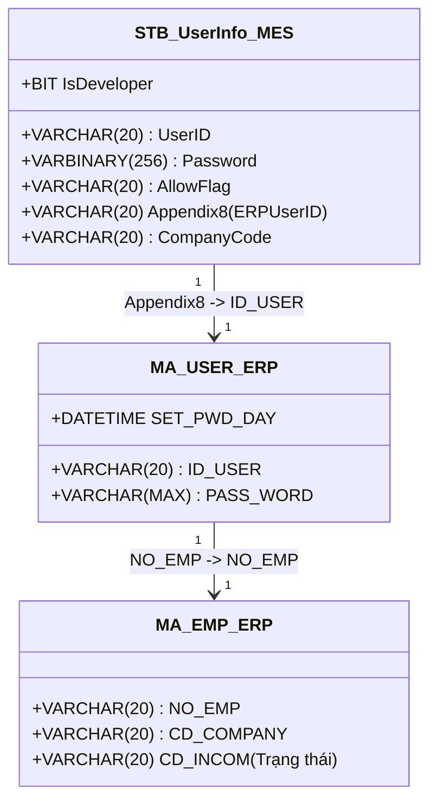
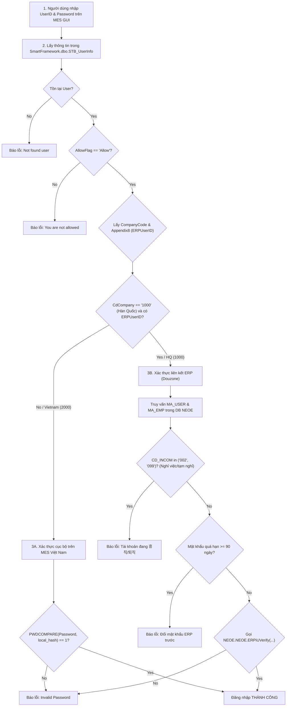
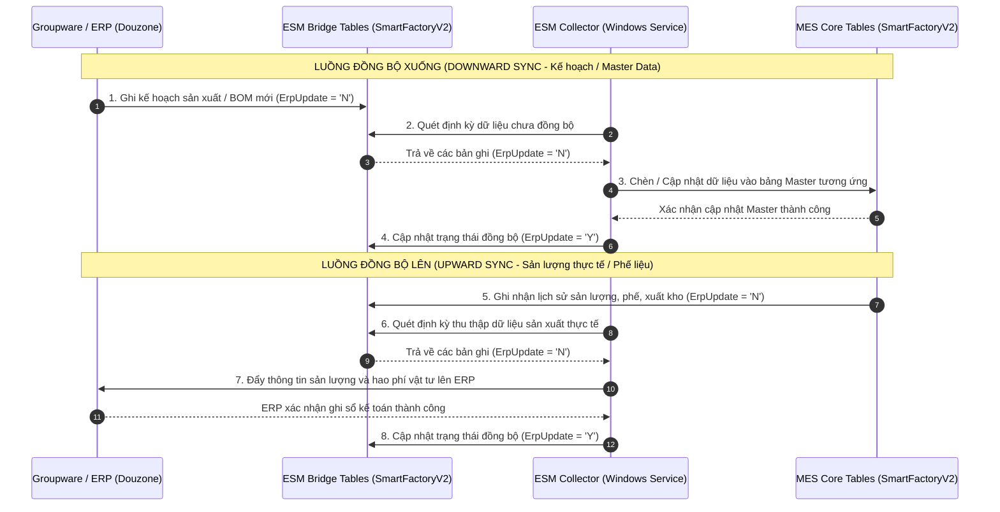

# KB_07 — Groupware & MES Integration (Quy trình vận hành & Xác thực liên kết)

> **Màn hình liên quan:** Groupware (gw.vinatech.com), F330, C220, B310, B450, FG01, B750, B752, Z410
> ← [Về INDEX](KB_INDEX.md)

---

## 1. Tổng Quan Hệ Thống Vận Hành

Hệ thống quản trị và vận hành của Vinatech được thiết lập trên sự liên kết chặt chẽ giữa 3 nền tảng:
*   **Groupware (gw.vinatech.com):** Cổng phê duyệt tờ trình hành chính, nhân sự, mua hàng, bán hàng và kế hoạch sản xuất ở thượng nguồn.
*   **ERP Douzone (NEOE):** Hệ thống quản trị tài chính, kế toán, quản lý nhân sự gốc và lưu trữ Master Data trung tâm.
*   **NAIS MES (http://mes.hycap.co.kr:9952):** Hệ thống thực thi sản xuất tại hiện trường nhà xưởng (quét barcode, quản lý routing, QC và kho vật lý).

---

## 2. 🔑 Cơ Chế Xác Thực Người Dùng (User Authentication Process)

Quy trình đăng nhập và xác thực của người dùng trên hệ thống MES được điều phối bởi Stored Procedure `usp_DoGUILogin` (và `usp_DoDeveloperLogin`, `usp_DoRfcLogin`, `usp_DoMobileLogin`) trong database `SmartFramework`.

### 2.1 Bản đồ thuộc tính Xác thực & Liên kết Tài khoản
Tài khoản đăng nhập MES được cấu hình thông qua màn hình **Z410** (bảng `SmartFramework.dbo.STB_UserInfo`).
*   **Appendix8 (ERPUserID):** Lưu mã nhân viên ERP của người dùng (ví dụ: `32511007`), đóng vai trò là "Foreign Key" liên thông sang ERP/Groupware.
*   **AllowFlag:** Cờ cho phép tài khoản hoạt động (`Allow` / `Deny`).
*   **IsDeveloper:** Cờ cho phép tài khoản đăng nhập qua chế độ debug phát triển (`1` / `0`).



### 2.2 Sơ đồ Logic Xác thực Đăng nhập (Authentication Logic Flow)



### 2.3 Phân Tích 4 Phương Thức Đăng Nhập Hệ Thống

| Stored Procedure | Phạm vi áp dụng | Đặc điểm xác thực | Nguồn kiểm tra mật khẩu |
| :--- | :--- | :--- | :--- |
| `usp_DoGUILogin` | Ứng dụng NAIS MES trên máy tính | **Phân luồng:**<br>- **HQ (1000):** Liên thông ERP, gọi `ERPiUVerify` để khớp mật khẩu từ ERP, check trạng thái nhân sự, chặn quá 90 ngày đổi mật khẩu.<br>- **VN (2000):** Khớp mật khẩu local trong `STB_UserInfo`. | `STB_UserInfo.Password` (VN) hoặc `NEOE.MA_USER.PASS_WORD` (HQ) |
| `usp_DoDeveloperLogin` | Dành cho IT/Developer để debug | Giống hệt `usp_DoGUILogin` nhưng kiểm tra thêm điều kiện bắt buộc `IsDeveloper = 1` trong `STB_UserInfo`. | Tương tự GUI Login |
| `usp_DoRfcLogin` | Kết nối dạng API/RFC từ bên ngoài | Chỉ xác thực cục bộ (Local database) thông qua hàm `PWDCOMPARE` trên bảng `STB_UserInfo`. | `STB_UserInfo.Password` |
| `usp_DoMobileLogin` | MES trên thiết bị di động (PDA) | Kiểm tra trực tiếp plaintext password bằng toán tử so sánh bằng (`=`). | So sánh plaintext trực tiếp với `STB_UserInfo.Password` |

---

## 3. Luồng Mua Hàng & Nhập Kho Vật Tư (Purchase & Receiving Flow)

Quy trình quản lý nhập mua nguyên vật liệu từ nhà cung cấp ngoài hoặc công ty mẹ HQ:

```
1. Purchase Order Registration (Groupware - purchaseOrderDocument) ➔ Đơn đặt hàng ➔ Đẩy xuống ERP
2. Arrival Confirmation (Groupware - arrivalConfirmationDocument) ➔ Khai báo hàng về đến nhà máy
3. F330 (MES) ➔ Thủ kho nhận hàng thực tế + in tem nhãn (Assemble/Part Label)
4. C220 (MES) ➔ QC kiểm tra chất lượng ➔ Cập nhật PASS vào STB_MaterialQcInfo
5. Receiving Confirmation (Groupware - receivingConfirmationDocument) ➔ Ghi nhận tồn kho chính thức vào ERP & MES
6. Purchase Resolution (Groupware - purchaseResolutionDocument) ➔ Gom hóa đơn cước vận chuyển, quyết toán kế toán
```

### Chi tiết tương tác các form và màn hình:
*   **Không nhập được F330:** PO tháng chưa được nhân viên mua hàng lập tờ trình **Arrival Confirmation** hoặc tờ trình đang ở trạng thái chờ duyệt. Khi duyệt xong, dữ liệu mới được nạp xuống MES F330 để in nhãn mã vạch.
*   **Không làm được Receiving Confirmation:** Hệ thống sẽ gọi API đối chiếu trực tiếp với database MES. **Chỉ các Lot hàng có trạng thái IQC là PASS** tại màn hình **C220** (bảng `STB_MaterialQcInfo`) mới hiển thị lên lưới của Groupware để chọn nhập kho chính thức.
*   **Hủy đơn mua hàng:** Dùng form `purchaseOrderCancelDocument`. Nếu đang tồn tại tờ trình `receivingConfirmationDocument` chờ duyệt liên quan đến PO này, hệ thống sẽ khóa cứng cấm hủy PO.

---

## 4. Luồng Bán Hàng & Xuất Kho Thành Phẩm (Sales & Shipment Flow)

Quy trình quản lý xuất hàng thành phẩm/bán thành phẩm cho khách hàng hoặc luân chuyển nội bộ:

```
1. Sales Order Request (Groupware - salesOrderDocument) ➔ Đăng ký đơn bán Suju ➔ Tự tạo PO tháng
2. Shipment Request (Groupware - deliverOutDocument) ➔ Yêu cầu xuất kho ➔ Kết nối dữ liệu tồn kho MES
3. FG01 (MES) ➔ Thủ kho scan Packing ID (kiểm tra PASS OQC ở C530/C546) ➔ Chuyển kho tạm
4. B750 (MES) ➔ Gom pallet, in tem dán niêm phong (Pallet Label)
5. B752 (MES) ➔ Quét pallet lên xe, giám sát đối chiếu Container thực xuất
6. Shipment Confirmation (Groupware - deliverOutConfirmationDocument) ➔ Chốt xuất xưởng, đăng ký doanh thu ERP
7. Sales Resolution (Groupware - salesResolutionDocument) ➔ Tự động sinh gửi phòng kế toán duyệt sổ sách tài chính
```

### Chi tiết tương tác các form và màn hình:
*   **Màn hình FG01:** Khi yêu cầu xuất hàng được duyệt, thủ kho sử dụng súng bắn Barcode quét mã **Packing ID** trên các thùng hàng. Hệ thống tự động kiểm duyệt Lot hàng phải đạt chuẩn chất lượng xuất xưởng **OQC PASS** tại màn hình **C530/C546** (ghi nhận trong bảng `STB_VN_FINISHGOODS_forQCAudit`).
*   **Màn B750/B752:** Sau khi quét trên FG01, thủ kho in tem Pallet dán niêm phong tại **B750**, bốc xếp lên xe và mở màn hình giám sát **B752** để đối chiếu danh sách Pallet thực xuất so với lệnh xuất kho gốc.
*   **Hủy thực xuất:** Sử dụng tờ trình `deliverOutDeleteDocument` để hoàn trả tồn kho. Chỉ thực hiện được khi phiếu toán kế toán (전표) trên ERP đang ở trạng thái chờ duyệt (미결전표). Khi được duyệt, toàn bộ chuỗi dữ liệu (Yêu cầu xuất, Thực xuất, Doanh thu) sẽ bị xóa sạch khỏi ERP và MES.

---

## 5. Luồng Kế Hoạch & Chỉ Thị Sản Xuất (PO & Production Plan)

Quy trình liên kết kế hoạch từ Groupware xuống việc chia mẻ, chia Lot và chạy máy thực tế ở hiện trường nhà xưởng:

```
[Month Production Plan (GW)] ──(Xác nhận lô hàng)──> [MES B310 (PO xuất hiện)]
                                                             │
[Daily Production Order (GW)] ──(Chốt kế hoạch ngày)─> [MES B450 (Kế hoạch ngày)]
                                                             │
                                                             v (Chia Lot, In tem)
                                                      [Chạy máy B540/B597/B530]
                                                             │
[Daily Production Report (GW)] <──(Ghi nhận sản lượng)──────┘
```

### Chi tiết tương tác các form và màn hình:
*   **PO tháng ➔ MES B310:** Kế hoạch sản xuất tháng lập trên Groupware và nhấn **"Xác nhận lô hàng"** (chuyển sang trạng thái "Sản xuất") sẽ tự động đồng bộ xuống bảng `STB_ProductionOrderInfo` hiển thị trên màn hình **MES B310**. Phiên bản BOM bắt buộc chọn đúng **2001** (hoặc **2002** cho Cell line mới).
*   **Chỉ thị ngày ➔ MES B450:** Chỉ thị sản xuất ngày (`dailyProductionOrderDocument`) thiết lập nhà máy, ca, line và sản lượng. Khi nhấn chốt kế hoạch ngày trên Groupware, dữ liệu đồng bộ xuống bảng `STB_DayProdPlan` của màn hình **MES B450**. Tại đây, tổ trưởng tiến hành **"Tạo lô (LOT)"** chia Lot sản xuất (bảng `STB_MaterialLotInfo`) và in tem nhãn.
*   **Báo cáo ngày:** Công nhân quét Lot NVL cấp vào máy tại **B540/B597**, đo PQC tại **C443** và chốt sản lượng ca tại **B530** (ghi nhận lịch sử công đoạn `STB_ProdRouteHist`). Dữ liệu sản lượng thực xuất và phế phẩm tự động kết nối về form **Báo cáo sản xuất ngày** (`dailyProductionReportDocument`) trên Groupware để tổ trưởng ký trình duyệt báo cáo ca.

---

## 6. Luồng Quản Lý Nhân Sự & Chấm Công (HR & Time Attendance Flow)

Quy trình quản lý chấm công công nhân trên chuyền và trạng thái tài khoản đăng nhập:

*   **Đồng bộ chấm công:** SQL Agent Job `SyncFingerData` chạy định kỳ gọi stored procedure `usp_SyncFingerData` để lấy dữ liệu quét vân tay từ bảng máy chấm công hiện trường `Stb_fingerUserInfo` (phân biệt Check-in/Check-out qua mã máy lẻ/chẵn), tính toán giờ làm việc thực tế và chèn vào bảng chấm công `STB_VN_ATTENDANCE_TIME`. Trưởng ca và nhân sự sử dụng form **Attendance Modify** (`attendanceModifyDocument`) để điều chỉnh ngày công nếu có sai lệch.
*   **Xin nghỉ phép / Hủy phép:** Sử dụng tờ trình xin nghỉ phép `leaveDocument` (loại nghỉ phép G05, G14, G15, G16, v.v.) và tờ trình hủy phép `leaveCancelDocument`. Thông tin duyệt nghỉ phép được dùng để HR đối chiếu đối soát bảng chấm công MES.
*   **Tờ trình nghỉ việc ➔ Khóa tài khoản MES:** Khi tờ trình nghỉ việc `empRetireDocument` được phê duyệt hoàn toàn trên Groupware, phòng nhân sự chuyển trạng thái nhân sự trên ERP sang "Nghỉ việc" (`CD_INCOM = '099'`).
    *   Tài khoản HQ: `usp_DoGUILogin` kiểm tra trực tiếp bảng ERP `NEOE.MA_EMP`. Vì `CD_INCOM = '099'`, hệ thống tự động khóa đăng nhập ngay lập tức.
    *   Tài khoản Việt Nam: Nhân sự khóa thủ công tài khoản trong màn hình cấu hình **Z410** (đổi trạng thái `AllowFlag` thành `Deny` trong `STB_UserInfo`).

---

## 7. Chỉ Định NCC ↔ NVL (F130 / F140)

*   **F130 — Chỉ định từ Nhà cung cấp:** Chọn NCC ở lưới bên trái ➔ bên phải hiển thị danh sách NVL ➔ Tick chọn ô **"Sử dụng"** cho từng NVL được phép mua ➔ Lưu.
*   **F140 — Chỉ định từ Vật liệu:** Chọn NVL ở lưới bên trái ➔ bên phải hiển thị danh sách NCC ➔ Tick chọn ô **"Sử dụng"** cho từng NCC được phép cung cấp ➔ Lưu.

> **Tác động:** Bảng dữ liệu liên kết `STB_MaterialVendorMapping` kiểm soát danh sách NCC được phép xuất hiện tại màn hình tạo tài liệu nhập kho MES F312.

---

## 8. Luồng Master Data Chi Tiết (A210, F130/F140)

```
Item Registration Document (Groupware)
    ➔ Loại: Cell / Module / Raw material
    ➔ Điền đầy đủ thông tin: MaterialCode, MaterialName, Unit, MaterialTypeCode
    ➔ Sau khi duyệt ➔ sync xuống A230 (STB_MaterialMaster)
    ↓
A230 (MES) — Kiểm tra mã đã sync chưa
    ↓
F130/F140 — Chỉ định NCC được phép cung cấp NVL này
    ↓
F110 — Cấu hình thuộc tính kho (IsLotUse, IsUseBarcode)
    ↓
A310 — Kiểm tra BOM đã có NVL này chưa
```

---

## 9. 🔌 ESM Bridge Tables — Cầu Nối MES ↔ ERP (Douzone)

Hệ thống sử dụng **18 bảng ESM_*** làm "bridge" để đồng bộ dữ liệu 2 chiều giữa MES và ERP. Tiến trình chạy ngầm Windows Service (ESM Collector) thực hiện quét và đồng bộ dữ liệu định kỳ.

### 9.1 Danh sách bảng ESM và chức năng

| Bảng ESM | Chức năng | Hướng sync |
| :--- | :--- | :--- |
| `ESM_DayProdPlan` | Kế hoạch SX ngày — từ Groupware/ERP đẩy xuống MES | ERP ➔ MES |
| `ESM_DirectDayProdPlan` | Kế hoạch SX trực tiếp (bypass Groupware) | ERP ➔ MES |
| `ESM_ProdRouteHist` | Sản lượng theo công đoạn — MES đẩy lên ERP | MES ➔ ERP |
| `ESM_ProdRouteLotHist` | Sản lượng theo Lot — chi tiết hơn ProdRouteHist | MES ➔ ERP |
| `ESM_RawMaterialInputHist` | NVL tiêu thụ trên chuyền — MES đẩy lên ERP | MES ➔ ERP |
| `ESM_WarehouseInOutHist` | Xuất/nhập kho NVL — MES đẩy lên ERP | MES ➔ ERP |
| `ESM_DefectInfo` | Phế liệu/NG — MES đẩy lên ERP | MES ➔ ERP |
| `ESM_LotUpdateTarget` | Danh sách LotID cần update lên ERP | MES ➔ ERP |

### 9.2 Cơ chế sync — Cờ `ErpUpdate`
Mỗi bảng ESM có cột `ErpUpdate` (char):
*   `'N'` hoặc `NULL`: Chưa sync lên ERP — **ESM Collector sẽ pick up** để đồng bộ.
*   `'Y'`: Đã sync thành công lên ERP.

### 9.3 Cấu hình ESM Collection (`ESM_ProdCollectionSetting`)

| CdCompany | CollectionType | Batch Size (Ngày/Đêm) | Sleep (ms) | Dawn Time |
| :--- | :--- | :--- | :--- | :--- |
| `1000` (HQ - Hàn Quốc) | `erp` | 50/50 records | 1000ms | 01:00-07:00 |
| `1000` (HQ - Hàn Quốc) | `mes` | 200/200 records | 1000ms | 01:00-06:00 |
| `2000` (VVT - Bắc Giang/Bắc Ninh) | `erp` | 0/0 (disabled) | 1000ms | 01:00-07:00 |
| `2000` (VVT - Bắc Giang/Bắc Ninh) | `mes` | 200/200 records | 1000ms | 01:00-06:00 |
| `3000` (VVT_F3 - Hà Nam) | `mes` | 200/200 records | 1000ms | 01:00-06:00 |

> ⚠️ **Lưu ý nghiệp vụ:** Tại Việt Nam (`2000`) và Hà Nam (`3000`), tiến trình đồng bộ `erp` collection bị chặn (Batch Size = 0 hoặc không cấu hình). Chỉ có tiến trình thu thập sản lượng `mes` hoạt động để đẩy sản lượng thực tế ngược lên ERP.

### 9.4 Sơ Đồ Tuần Tự Đồng Bộ Dữ Liệu (ESM Sync Sequence)



---

## 10. BOM Management Chi Tiết

### 10.1 Cấu trúc BOM trong DB
*   `STB_BomHeader` (Header — 1 BOM cho 1 Model): Lưu `BomHeaderNo` (PK), `MaterialCode` (Mã Model), `BomVersion`, `Status`.
*   `STB_BomDetail` (Detail — N NVL con cho 1 BOM): Lưu `ChildMaterialCode` (Mã NVL con), `Qty` (Định mức tiêu thụ), `Unit`, `RouteCode` (Công đoạn sử dụng NVL).

### 10.2 BOM Version đang dùng
*   `2001`: BOM Cell line cũ (Việt Nam).
*   `2002`: BOM Cell line mới đang active (Dùng chính cho Việt Nam).
*   `1`: BOM Electrode (Điện cực).

---

## 11. Danh Sách Kho Đầy Đủ (Verified 2026-06-10)

Bảng đối chiếu 100% mã kho sử dụng trên ERP và MES tại các nhà máy Vinatech Việt Nam:

| Mã Kho (Warehouse Code) | Công ty | Nhà máy | Tên Kho Tiếng Hàn | Tên Kho Tiếng Việt | Ghi Chú / Ý Nghĩa Vận Hành |
| :--- | :--- | :--- | :--- | :--- | :--- |
| **ROH_VN_WH** | VVT | VVT_F1 | 원자재창고(베트남) | Kho nguyên vật liệu Bắc Giang *(⚠️ Typo dịch)* | **Kho NVL chính nhà máy F1 (Bắc Ninh)** |
| **ROH_BG_WH** | VVT | VVT_F2 | Bg_원자재창고(베트남) | Kho nguyên vật liệu Bắc Ninh *(⚠️ Typo dịch)* | **Kho NVL chính nhà máy F2 (Bắc Giang)** |
| **HOLDING_VN_WH** | VVT | VVT_F1 | Hold원자재창고(베트남) | Kho nguyên vật liệu chờ xử lý Bắc Ninh | Kho tạm giữ kiểm tra IQC (F1 - Bắc Ninh) |
| **HOLDING_BG_WH** | VVT | VVT_F2 | Bg_Hold원자재창고(베트남) | Kho nguyên vật liệu chờ xử lý Bắc Giang | Kho tạm giữ kiểm tra IQC (F2 - Bắc Giang) |
| **MODULE_VN_WH** | VVT | VVT_F1 | 모듈(베트남) | Kho nguyên liệu cho hàng module Bắc Ninh | Kho cấp vật tư cho chuyền sản xuất Module F1 |
| **MODULE_BG_WH** | VVT | VVT_F2 | Bg_모듈(베트남) | Kho nguyên liệu cho hàng module Bắc Giang | Kho cấp vật tư cho chuyền sản xuất Module F2 |
| **ROUTE_VN_WH** | VVT | VVT_F1 | 공정창고(베트남) | Sản xuất Bắc Ninh | Kho ảo trên chuyền sản xuất F1 (Bắc Ninh) |
| **ROUTE_BG_WH** | VVT | VVT_F2 | Bg_공정창고(베트남) | Sản xuất Bắc Giang | Kho ảo trên chuyền sản xuất F2 (Bắc Giang) |
| **PROD_VN_WH** | VVT | VVT_F1 | 완제품창고(베트남) | Kho thành phẩm Bắc Ninh | Kho lưu trữ thành phẩm chính F1 (Bắc Ninh) |
| **PROD_BG_WH** | VVT | VVT_F2 | Bg_완제품창고(베트남) | Kho thành phẩm Bắc Giang | Kho lưu trữ thành phẩm chính F2 (Bắc Giang) |
| **W27** | VVT | VVT_F3 | 창고(비나에너솔) | Kho (Vina Enersol) | Kho nhà máy F3 (Vina Enersol Hà Nam) |

> [!WARNING]
> **LƯU Ý LỖI DỊCH THUẬT KHI LÀM FORM:**
> Cột tên tiếng Việt bị đảo ngược nhầm lẫn giữa Bắc Ninh và Bắc Giang ở hai kho chính: `ROH_VN_WH` ghi nhầm thành Bắc Giang, còn `ROH_BG_WH` ghi nhầm thành Bắc Ninh. Khi thao tác cấu hình hoặc chọn kho trên các form Groupware (`purchaseOrderDocument`, `receivingConfirmationDocument`), người dùng bắt buộc phải tuân theo ký hiệu chuẩn: **`VN` = Nhà máy Bắc Ninh (F1)** và **`BG` = Nhà máy Bắc Giang (F2)** bất kể cột hiển thị tiếng Việt bị dịch sai.

---

## 12. 🛠️ Cẩm Nang Hỗ Trợ Kỹ Thuật (Troubleshooting Guide)

### 12.1 Sự cố Đăng nhập MES
1.  **Lỗi: "Not found user" hoặc "Invalid Password"**
    *   *User Việt Nam:* Check tài khoản đã khởi tạo trong màn hình **Z410** chưa.
    *   *User Hàn Quốc:* Check cột `Appendix8` trong `STB_UserInfo` đã trỏ đúng ID_USER của ERP chưa.
2.  **Lỗi: "You are not allowed"**
    *   Kiểm tra AllowFlag của tài khoản trong `STB_UserInfo`. Chạy SQL sửa đổi:
        ```sql
        UPDATE SmartFramework.dbo.STB_UserInfo SET AllowFlag = 'Allow' WHERE UserID = 'Mã_Nhân_Viên'
        ```

### 12.2 Sự cố Đồng bộ Kế hoạch/Sản lượng
1.  **PO tháng không xuất hiện trên MES B310:**
    *   Kiểm tra xem trên Groupware đã nhấn nút **"Xác nhận lô hàng"** chưa (trạng thái phải chuyển sang "Sản xuất").
    *   Kiểm tra BOM Version đã chọn đúng **2001** (hoặc **2002**) chưa.
2.  **Sản lượng sản xuất không hiển thị trên ERP:**
    *   Kiểm tra xem các bản ghi trong `ESM_ProdRouteHist` có bị treo ở trạng thái `'N'` không:
        ```sql
        SELECT Count(*) FROM ESM_ProdRouteHist WITH(NOLOCK) WHERE ErpUpdate = 'N' OR ErpUpdate IS NULL
        ```
    *   Nếu số lượng lớn và không thay đổi trong thời gian dài -> Kiểm tra xem Windows Service **ESM Collector** trên server có bị dừng (Stopped) hay không.

### 12.3 Sự cố IQC (C220) & Nhập kho (Receiving)
*   Nếu không tìm thấy Lot hàng trên form **Receiving Confirmation** của Groupware, check xem QC đã làm IQC chưa hoặc IQC có bị Reject không.
    *   Truy vấn kiểm tra trạng thái QC:
        ```sql
        SELECT MaterialDocNo, MaterialLotNo, QcResult 
        FROM STB_MaterialQcInfo WITH(NOLOCK) 
        WHERE MaterialDocNo = 'Số_Chứng_Từ_Hàng_Về'
        ```
        Nếu `QcResult` khác `'PASS'`, hệ thống sẽ chặn không cho phép lập form nhập kho chính thức.
