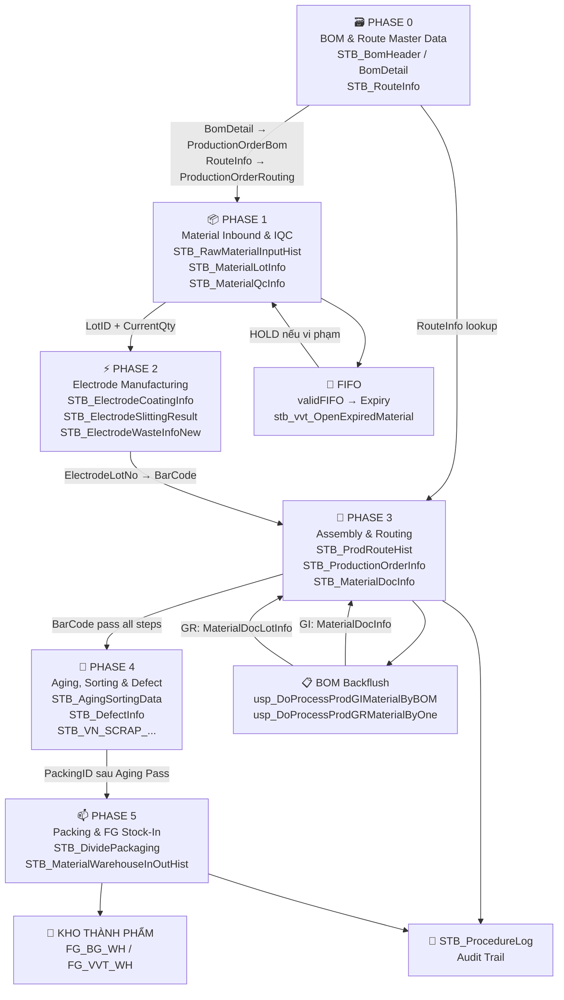

## 2. 🗺️ Luồng Dữ Liệu Tổng Quan (End-to-End Data Flow)

### 2.1 Sơ đồ luồng dữ liệu qua 6 Phase



### 2.2 Vòng Đời & Phả Hệ Dữ Liệu (Data Lifecycle & Genealogy)

> **Hình dung đơn giản:** Giống như một người đi qua nhiều trạm hải quan. Mỗi trạm đóng dấu (= ghi record). Truy vết = xem lại tất cả các dấu đã đóng trên hộ chiếu.

#### Khái niệm cốt lõi:
1. **ControlNo / Barcode**: Chứng minh thư của 1 viên tụ điện. Sinh ra tại máy cuốn, theo suốt đến khi đóng thùng (`VVPR292R710617`).
2. **LotID**: Chứng minh thư của 1 kiện NVL trong kho. Prefix `ML...` = do kho cấp.
3. **PONo**: Số lệnh sản xuất. Gom nhiều Barcode vào 1 nhóm để sản xuất cùng 1 đợt.
4. **RouteCode**: Mã công đoạn. Từ `V-01` (đầu) đến `V-28` (đóng gói). Barcode phải đi đủ các bước theo thứ tự.
5. **ProductGroupCode**: Nhóm phân loại NVL. Dùng trong validation khi OP scan (`ELECTROLYTE`, `SLEEVE`, `CASE`).

#### Truy Vết 360 Độ (Golden Query)
Câu lệnh sau truy vấn toàn bộ "lịch sử cuộc đời" của một viên tụ từ lúc sinh ra đến khi vào thùng:
```sql
SELECT 
    PRH.ControlNo AS [Mã vạch SP], 
    PRH.PONo AS [Lệnh SX], 
    RI.RouteName AS [Công đoạn],
    PRH.CreateDateTime AS [Giờ quét],
    DP.PackingID AS [Mã Thùng hàng],
    DP.ParentPackingID AS [Mã BigBox]
FROM STB_ProdRouteHist PRH WITH(NOLOCK)
LEFT JOIN STB_RouteInfo RI WITH(NOLOCK) ON PRH.RouteCode = RI.RouteCode
LEFT JOIN STB_DividePackaging DP WITH(NOLOCK) ON PRH.ControlNo = DP.LotNo
WHERE PRH.ControlNo = '20260409000089' -- Thay mã vạch cần tra vào đây
ORDER BY PRH.CreateDateTime ASC
```

### 2.3 Bảng Ánh Xạ Màn Hình (Screen ID) Theo Từng Phase Quy Trình

| Phase sản xuất | Nhóm Screen ID | Chức năng nghiệp vụ liên quan |
|---|---|---|
| **PHASE 0** <br> (Master Data) | A210, A230, A310, A320, A410, A418, A419, A460, Z220, Z330, Z410 | Khai báo NVL, BOM, Route, tiêu chuẩn đóng gói, nhãn in và tài khoản. |
| **PHASE 1** <br> (Kho NVL & IQC) | F312, F330, F110, F721, F741, F430, C121, C122, C220, F130, F140 | Tạo PO, kiểm tra đầu vào (IQC), nhập kho, in tem NVL, tách lô, quản lý vị trí kho. |
| **PHASE 2** <br> (Sản xuất Điện cực) | B802, B552, F743-F748, C243 | Sản xuất và kiểm tra chất lượng cuộn điện cực (Coating, Slitting). |
| **PHASE 3** <br> (Lắp ráp & Routing) | B310, B450, B452, B530, B540, B597, B782, K101, K109 | Kế hoạch ngày, tạo Lot sản xuất, ghi nhận sản lượng công đoạn, nạp NVL. |
| **PHASE 4** <br> (PQC & Defect) | C131, C132, C141, C143, C443, C430, C321, B598 | Kiểm tra chất lượng công đoạn (PQC), quản lý phế, spec kiểm tra theo model. |
| **PHASE 5** <br> (Đóng gói & OQC) | B351, B453, B523, B525, B528, B717, B781, B789, C451, C510, C512, C530, C540, C560 | In tem pack, gộp box cell/module, đóng thùng xuất hàng, kiểm tra chất lượng đầu ra (OQC). |
| **PHASE 6** <br> (Thành phẩm & Kho) | FG00, FG01, FG02, HN551, HN866, HNC321, HN00, HN101 | Nhập/xuất kho thành phẩm, quản lý tồn kho thành phẩm (Bắc Ninh, Bắc Giang, Hà Nam). |

---

## 3. 🏢 Ma Trận Nhà Máy (The Factory Matrix - VNT vs VVT vs HN)

> **Nhất quán trong sự khác biệt:** MES Vinatech quản lý nhiều nhà máy với các quy tắc đặt tên và logic riêng biệt.

| Đặc điểm | VNT (Bắc Ninh — Electrode) | VVT (Bắc Giang — Cell/Module) | HN (Hà Nam — VVT_F3) |
|-----------|---------------------------|---------------------------|--------------------------|
| **Tiền tố Route** | `E-xx` (E-01, E-02...) | `V-xx` (V-01, V-22...), `MV-xx` (Module) | `VE-xx` (VE01, VE06...) |
| **Mã WorkCenter** | `VNT_F1` ~ `VNT_F5` | `VVT_F1`, `VVT_F2`, `VVT_F4` | `VVT_F3` |
| **Logic Đóng gói** | Standard Packing | Merge Box/Donggoi (VVT logic) | `Vietnam_Donggoi_HN` |
| **Quy tắc Barcode**| `VV...` prefix | `VV...` (Cell), `VJ...` (converted) | `VE...` (VE260507-001) |

---

## 4. ⚙️ Phân Tích Stored Procedures Theo Phase

### Phase 0 — Master Data: BOM & Routing
*Nền tảng được tham chiếu bởi tất cả phase sau.*
*   `usp_BomHeader_iud`, `usp_BomDetail_iud`, `usp_RouteInfo_iud`
*   **Kỹ thuật:** `MERGE + OPENXML + CURSOR`. Client gửi XML, SP dùng Cursor duyệt từng dòng để Upsert.

### Phase 1 — Material Inbound & Quality Control (WMS & IQC)
*Nhập NVL, kiểm tra chất lượng (IQC), quản lý Lot theo FIFO.*
*   `usp_RawMaterialInputHist_iud` & `usp_Vietnam_RawMaterialInputHist_uid`: Validation NVL đầu vào. *Lưu ý: Logic kiểm tra BOM hiện đang bị khóa tạm thời (Nordex Audit).*
*   `usp_MaterialQcInfo_iud`: Ghi kết quả IQC. Nếu Fail → `STB_NCR_Report`.
*   `usp_MaterialWarehouseInOutHist_iud`: Ghi lịch sử xuất/nhập, gọi `usp_VVTMaterialWarehouse_validFIFO` để chặn vi phạm FIFO hoặc Hết hạn.

### Phase 2 — Electrode Manufacturing (Điện cực)
*Theo dõi quá trình: Coating → Rolling Press → Slitting.*
*   `pop_Electrode_Coating_iud`: Upsert thông số phủ. Trừ `CurrentQty` của NVL (`STB_MaterialLotInfo`), ghi `STB_MaterialWarehouseUsageHist`. Dùng `BEGIN TRAN`.
*   `usp_ElectrodeSlittingResult_iud`: Ghi nhận các cuộn nhỏ sau khi cắt.
*   `usp_ElectrodeWasteInfoNew_iud`: Ghi nhận phế liệu điện cực.

### Phase 2.5 — Lập Kế Hoạch & Chuẩn Bị Sản Xuất
*Nối Master Data với Sản xuất thực tế.*
*   `usp_ProductionOrderRouting_iud`: Copy `STB_RouteInfo` sang `STB_ProductionOrderRouting`. Cài đặt `RouteIndex`, `IsInputRoute`, `IsOutputRoute`.
*   `usp_SetInfo_iud`: "Khai sinh" `ControlNo` (Barcode) cho từng viên tụ.

### Phase 3 — Assembly & Production Routing (Trái tim hệ thống)
*Theo dõi từng sản phẩm qua chuỗi công đoạn.*
*   `usp_CheckInputRawMaterialCodeForProduct`: Validation Gate. Chặn route nếu chưa nạp đủ NVL theo BOM (tại V-23, V-24).
*   **`usp_DoProcessProdRouteHist` (Core Engine)**: Ghi lịch sử quét vào `STB_ProdRouteHist`. Validate số lượng (không được vượt công đoạn trước).
*   `usp_DoProcessProdGIMaterialByBOM`: Được gọi ở mọi Route. Trừ tồn kho NVL (Backflush) tự động.
*   `usp_DoProcessProdGRMaterialByOne`: Chỉ gọi ở bước cuối (`IsOutputRoute=1`). Tạo phiếu nhận thành phẩm (GR).

### Phase 4 — Aging, Sorting & Defect Management
*Đo kiểm và phân loại chất lượng.*
*   `usp_InsertDataAgingAndSorting`: Ghi kết quả Aging (Pass/Fail/A/B/C).
*   `usp_DefectInfo_iud`: Ghi nhận hàng NG.
*   `usp_Add_VN_SCRAP_WEIGHSCALE_PRODUCTIONS`: Cân phế liệu → quy đổi số lượng.

### Phase 5 — Packing & FG Stock-In (Đóng gói)
*Đóng gói và nhập kho thành phẩm.*
*   `usp_DivideAndPrintPackagingLabels`: Chia gói (Túi/Inner box) → `STB_DividePackaging`. Trả về dữ liệu in tem. Đọc 11 bảng khác nhau.
*   `usp_Vietnam_DoProcessBigBoxPacking_VVT_F3`: Gộp túi thành thùng Carton (Big Box).
*   `usp_VN_FinishGood_BG_StockIn_iud`: Nhập kho thành phẩm vào `FG_BG_WH`.

### Phase 6 — Warehouse & Export (Xuất kho)
*Quản lý tồn kho thực tế và xuất hàng đi khách.*
*   `ImportWarehouseFinshGood_uid`: Khai báo hàng từ xưởng vào kho Inventory (`STB_VN_FINISHGOODS_HN_New`).
*   `ExportWarehouseFinshGood_uid`: Xuất hàng, trừ tồn kho, ghi nhận Invoice.

---

## 5. 📘 Từ Điển Bảng & Stored Procedures (Metadata Dictionary)

### 5.1 Sơ đồ quan hệ giữa các nhóm bảng

```
            ┌──────────────────────────────────────────────────────────┐
            │                  MASTER DATA (Nhóm 1)                     │
            │   STB_BomHeader ←→ STB_BomDetail                         │
            │   STB_RouteInfo   STB_MaterialMaster                     │
            │   STB_ModelBasicInfo  STB_UserInfo  STB_LineInfo          │
            └──────────────────────┬────────────────────────────────────┘
                                   │ copy xuống
            ┌──────────────────────▼────────────────────────────────────┐
            │              KẾ HOẠCH & LỆNH SX (Nhóm 2)                  │
            │   STB_DayProdPlan → STB_ProductionOrderInfo                │
            │   STB_ProductionOrderRouting (← RouteInfo)                 │
            │   STB_ProductionOrderBom (← BomDetail)                     │
            │   STB_SetInfo (ControlNo/Barcode)                          │
            │   STB_LineRouteMapping                                     │
            └────────┬───────────────────────────┬──────────────────────┘
                     │                           │
      ┌──────────────▼──────────┐   ┌────────────▼──────────────────────┐
      │  QUẢN LÝ VẬT TƯ (Nhóm 3) │   │  ROUTING & TRACKING (Nhóm 5)      │
      │  STB_MaterialLotInfo ◄──────│──── STB_ProdRouteHist               │
      │  STB_MaterialStock         │   │  (↑ mỗi scan barcode = 1 record)  │
      │  STB_MaterialDocInfo       │   │                                    │
      │  STB_MaterialDocDetail     │   │  Triggers:                         │
      │  STB_MaterialDocLotInfo    │   │   → GI: MaterialDocInfo/Detail     │
      │  STB_MaterialDocLotInfo    │   │   → GR: MaterialDocInfo/Detail/Lot │
      │  STB_MaterialWarehouse...  │   └────────────────────────────────────┘
      │  STB_RawMaterialInputHist  │
      └──────────────┬─────────────┘
```

### 5.2 SP → Table Mapping (Quick Reference)

| Stored Procedure | Tables READ | Tables WRITE |
|-----------------|-------------|--------------|
| `usp_Prod_Daily_Input_Schedule_iud` | — | Exec SP nhánh (`usp_Medium_Daily_Input`) |
| `usp_ProductionOrderRouting_iud` | — | **MERGE** STB_ProductionOrderRouting |
| `usp_SetInfo_iud` | — | **MERGE** STB_SetInfo |
| `usp_BomHeader_iud` | BomHeader, UserInfo | **MERGE** BomHeader; UPDATE BomDetail |
| `usp_RouteInfo_iud` | RouteInfo | **MERGE** RouteInfo |
| `usp_RawMaterialInputHist_iud` | — | INSERT RawMaterialInputHist, MaterialLotInfo |
| `usp_MaterialQcInfo_iud` | QcInfo, IQcDefectReport, NCR_REPORT | **MERGE** QcInfo; UPDATE IQcDefectReport, NCR_Report |
| `usp_MaterialWarehouseInOutHist_iud`| MaterialLotInfo, MaterialMaster, stb_vvt_OpenExpiredMaterial, ... | INSERT MaterialWarehouseInOutHist |
| `usp_VVTMaterialWarehouse_validFIFO`| MaterialLotInfo, MaterialWarehouseInOutHist, MaterialDocLotInfo | — (Chỉ Validate) |
| `pop_Electrode_Coating_iud` | MaterialLotInfo, MaterialWarehouseInOutHist, ... | **MERGE** ElectrodeCoatingInfo; UPDATE MaterialLotInfo |
| `usp_DoProcessProdRouteHist` | ProdRouteHist, ProductionOrderInfo, ProductionOrderRouting, RouteInfo, SetInfo | INSERT ProdRouteHist, ProcedureLog; UPDATE LineRouteMapping... |
| `usp_DoProcessProdGIMaterialByBOM` | LineRouteMapping, MaterialStock, ProductionOrderBom... | INSERT MaterialDocDetail, MaterialDocInfo |
| `usp_DivideAndPrintPackagingLabels` | MaterialLotInfo, ModelBasicInfo, PackingLabelSpec, SetInfo... | INSERT DividePackaging |
| `usp_VN_FinishGood_BG_StockIn_iud` | MaterialLotInfo | INSERT MaterialWarehouseInOutHist; UPDATE MaterialLotInfo |

### 5.3 Key Identifiers (Chuỗi định danh)

```
VendorBarcode (Từ nhà cung cấp)
    │
    ↓ (Nhập kho)
LotID (Chứng minh thư nguyên liệu kho: ML...)
    │
    ├── ElectrodeLotNumber (Mã cuộn điện cực Phase 2)
    │
    └── ControlNo / Barcode (Mã viên tụ / Sản phẩm Phase 3+)
            │
            └── PackingID (Mã túi / Hộp nhỏ Phase 5)
                    │
                    └── BigBoxID (Thùng Carton bự Phase 5)
```

---

## 6. 🛠️ Nhật Ký Tùy Chỉnh & Gỡ Lỗi Nâng Cao

### 6.1 Lỗi không đăng nhập được MES
> Hướng dẫn chi tiết cách xử lý lỗi đăng nhập MES, vui lòng xem tại [KB_01_UI_PHAN_QUYEN.md § 1.1](KB_01_UI_PHAN_QUYEN.md).

### 6.2 Các case study gỡ lỗi thực tế

#### Case 1: Chèn hậu tố "Dynamic Suffix" (GBAKAC-600F)
*   **Vấn đề:** Muốn in thêm đuôi `-600F` trên nhãn nhưng không được sửa tên trong `STB_MaterialMaster` (vì rủi ro DB).
*   **Giải pháp:** Dùng lệnh `REPLACE` ngay trong SP `usp_MaterialDocLotInfo_get` và SP in tem để chèn "ảo" đuôi này khi hiển thị, giữ nguyên Data gốc.

#### Case 2: Cưỡng bức Scan vật tư (V-23, V-24)
*   **Vấn đề:** Công nhân quên scan vật liệu → Lỗi Backflush hụt tồn kho.
*   **Giải pháp:** Chèn đoạn check vào thẳng `usp_DoProcessProdRouteHist`. Nếu chưa scan đủ, Raise Error bằng tiếng Việt. Cấm đi tiếp.

#### Case 3: Bắt buộc quét LOT cũ nhất (FIFO Validation)
*   **Vấn đề:** Công nhân thích quét Lot mới → Lot cũ bị mốc, hết hạn.
*   **Giải pháp:** Bật cờ `IsFIFO = 1` trong `STB_MaterialStockAttributeInfo`. `usp_VVTMaterialWarehouse_validFIFO` sẽ chặn nếu Lot scan không phải là Lot có `CreateDateTime` cũ nhất.

#### Case 4: Lỗi "Exception occurred" tại F330 do `LotAttr10` NULL
*   **Vấn đề:** Quét mã mới bị Exception màn hình.
*   **Giải pháp:** Do cột `LotAttr10` (Ngày SX) bị rỗng, hàm DATEADD cộng thêm hạn dùng bị crash. Chạy lệnh UPDATE SQL điền tay `LotAttr10` cho các Lot bị lỗi. Đồng thời thêm Đặc tính tiêu chuẩn (A, B, C...) vào `STB_MaterialAttribute`.

#### Case 5: Truy vết kế hoạch sai Line (Lỗi B450)
*   **Vấn đề:** 2 Model khác nhau nhảy chung vào 1 Line báo cáo.
*   **Giải pháp:** Xem chi tiết cách sử dụng Time Window Query để quét đối soát và hướng dẫn sửa lỗi chuyển Line/hủy kế hoạch ngày tại [KB_03_SAN_XUAT.md#511-lỗi-kế-hoạch-ngày-chọn-nhầm-line-b450](KB_03_SAN_XUAT.md#511-lỗi-kế-hoạch-ngày-chọn-nhầm-line-b450).

---
*Cập nhật: 2026-06-12 | Gộp KB_10 và KB_11*


---

