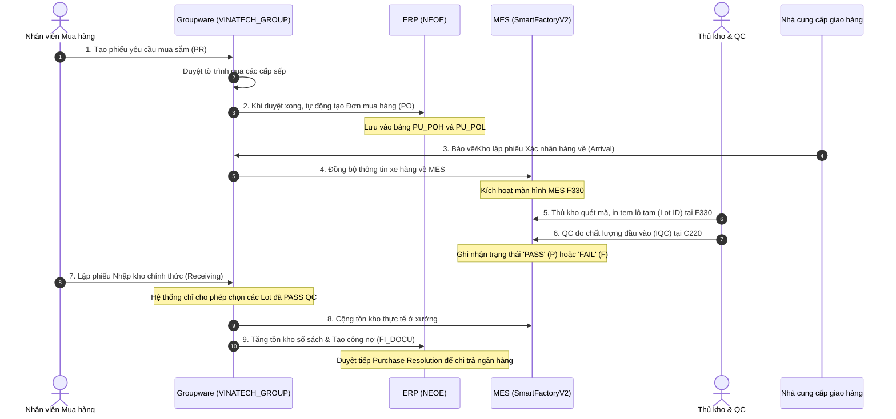
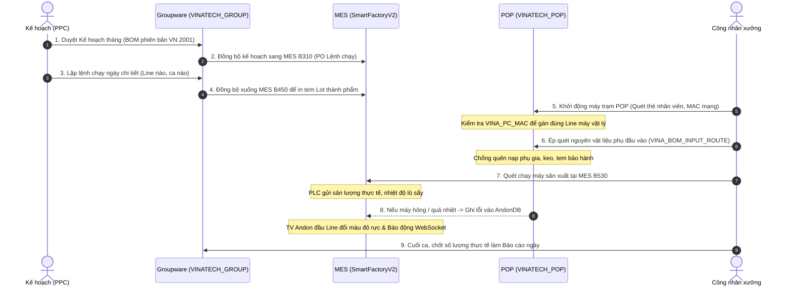
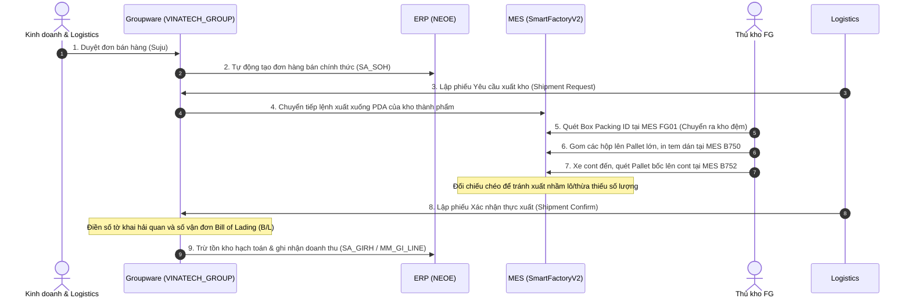

## 7. Cẩm Nang Nhập Môn Hệ Thống Liên Thông (Gộp từ KB_20)


> **Dành cho:** Kỹ sư thiết kế hệ thống, lập trình viên, nhân viên vận hành và AI mới tiếp cận hệ sinh thái phần mềm Vinatech.
>
> **Mục tiêu:** Giúp người mới bắt đầu (chưa từng biết về hệ thống) có thể hiểu rõ từng bước đi của dữ liệu, cách mà các nền tảng **Groupware (Văn phòng)**, **ERP (Kế toán)** và **MES (Nhà xưởng)** giao tiếp với nhau qua các bảng cơ sở dữ liệu vật lý.
>
> ← [Quay lại Mục Lục chính](KB_INDEX.md) | 🗄️ [Tra cứu cấu trúc CSDL chi tiết (KB_19)](KB_19_ALL_DATABASES_MAP.md)

---

### 🏰 1. Phép Ẩn Dụ "Bốn Vương Quốc" (Understanding the Systems)

Để dễ hình dung hệ thống lớn này, hãy tưởng tượng toàn bộ Vinatech là một đế chế gồm **Bốn Vương Quốc** làm việc với nhau thông qua những "sứ giả" cơ sở dữ liệu:

```
┌─────────────────────────────────────────────────────────────────────────┐
│                    VƯƠNG QUỐC GROUPWARE (GW)                            │
│                 "Văn phòng ký duyệt & Hành chính"                       │
│  - Nơi con người đưa ra quyết định, đề xuất và ký duyệt giấy tờ.        │
│  - Bảng trung tâm: VINA_DOCUMENT_SAVE (Phiếu lưu), VINA_EMP (Nhân sự)   │
└────────────────────────────────────┬────────────────────────────────────┘
                                     │
                                     │ (Sứ giả: Sync PO / Plan / Items)
                                     v
┌────────────────────────────────────┴────────────────────────────────────┐
│                       VƯƠNG QUỐC ERP (DOUZONE)                          │
│                    "Hầm vàng kế toán & Master Data"                     │
│  - Nơi quản lý tiền bạc, công nợ, định giá vật tư gốc và sổ cái.        │
│  - Bảng trung tâm: MA_ITEM (Vật tư), PU_POH (Đơn mua), FI_DOCU (Sổ cái)  │
└────────────────────────────────────┬────────────────────────────────────┘
                                     │
                                     │ (Sứ giả: Sync Lệnh ngày / Tồn thực)
                                     v
┌─────────────────────────────────────────────────────────────────────────┐
│                        VƯƠNG QUỐC MES (NAIS)                            │
│                   "Đốc công & Vận hành nhà xưởng"                       │
│  - Nơi trực tiếp quét barcode, in tem, QC hàng hóa, chạy máy vật lý.    │
│  - Bảng trung tâm: STB_MaterialLotInfo (Lô), STB_ProdRouteHist (Chạy máy)│
└────────────────────────────────────┬────────────────────────────────────┘
                                     │
                                     │ (Sứ giả: Mạng lưới an ninh & Còi báo)
                                     v
┌─────────────────────────────────────────────────────────────────────────┐
│                   VƯƠNG QUỐC PHỤ TRỢ (HELPERS)                          │
│            "Hệ thống đường ống, cảm biến và bảo vệ"                     │
│  - SSO (RESTFUL): Bảo vệ soát vé.   - POP (MAC): Máy trạm hiện trường.  │
│  - Andon (Alerts): Chuông báo lỗi.  - WebSocket: Mạng lưới truyền tin.  │
│  - WCMS (Cash): Chuyển tiền NH.     - streamdocs: Kính xem PDF an toàn. │
└─────────────────────────────────────────────────────────────────────────┘
```

*   **Tại sao cần cả 3 vương quốc chính?**
    *   **Groupware** giúp các phòng ban ngồi bàn giấy duyệt đề xuất từ xa.
    *   **ERP** giúp ban giám đốc nhìn thấy bức tranh tài chính và công nợ pháp lý.
    *   **MES** giúp công nhân ở xưởng chạy máy, quét mã vạch và kiểm QC mà không bị nhầm lẫn.

---

### 🔄 2. Ba Dòng Đời Nghiệp Vụ Cốt Lõi (The 3 Master Lifecycles)

Mọi hoạt động tại Vinatech đều là sự phối hợp nhịp nhàng giữa các hệ thống thông qua 3 quy trình chính dưới đây:

#### 2.1 Quy trình Mua hàng & Nhập kho (Procure-to-Pay)
*Quy trình này theo dấu từ lúc nhà máy cần mua nguyên vật liệu cho đến lúc vật tư nằm trên kệ kho xưởng và nhà cung cấp nhận được tiền.*



---

#### 2.2 Quy trình Chỉ thị & Vận hành Sản xuất (Production Execution)
*Quy trình này biến các con số kế hoạch sản xuất trên bàn giấy thành sản phẩm thực tế ra lò từ máy móc.*



---

#### 2.3 Quy trình Bán hàng & Xuất khẩu Container (Order-to-Cash)
*Quy trình xuất thành phẩm tụ điện ra cảng giao cho khách hàng quốc tế.*



---

### 📋 3. Ma Trận Biểu Mẫu Hành Chính Tích Hợp (Form-to-DB-to-MES Summary)

Để tránh trùng lặp tài liệu kỹ thuật, chi tiết các bước nghiệp vụ và các câu truy vấn SQL mẫu (Golden Queries) đối soát của từng biểu mẫu đã được hợp nhất tại Mục 9 của **[Bản đồ cơ sở dữ liệu toàn hệ thống (KB_19)](KB_19_ALL_DATABASES_MAP.md)**. 

Dưới đây là bảng tra cứu nhanh 17 biểu mẫu cốt lõi dành cho người mới:

| # | Tên Biểu Mẫu (Hành Chính) | Mã Form ID | Vai Trò Nghiệp Vụ Cốt Lõi | Liên Kết Tra Cứu Kỹ Thuật (SQL & DB) |
|---|---|---|---|---|
| 3.1 | Đơn Yêu Cầu Mua Sắm (PR) | `expenseReportDocument` / `purchaseRequestDocument` | Soạn và duyệt xin ngân sách mua sắm vật tư thiết bị. | [Chi tiết & SQL (KB_19)](KB_19_ALL_DATABASES_MAP.md#91-đơn-yêu-cầu-mua-sắm-pr--expense-report) |
| 3.2 | Đơn Đặt Hàng (PO) | `purchaseOrderDocument` | Tạo đơn PO chính thức gửi cho nhà cung cấp xác nhận số lượng, giá. | [Chi tiết & SQL (KB_19)](KB_19_ALL_DATABASES_MAP.md#92-đơn-đặt-hàng-purchase-order---po) |
| 3.3 | Xác Nhận Hàng Về (Arrival) | `arrivalConfirmationDocument` | Khai báo xe hàng về đến cổng nhà máy để in tem lô tạm. | [Chi tiết & SQL (KB_19)](KB_19_ALL_DATABASES_MAP.md#93-xác-nhận-hàng-về-arrival-confirmation) |
| 3.4 | Xác Nhận Nhập Kho (GR) | `receivingConfirmationDocument` | Nhập kho chính thức các Lot đã PASS QC để cộng tồn kho. | [Chi tiết & SQL (KB_19)](KB_19_ALL_DATABASES_MAP.md#94-xác-nhận-nhập-kho-receiving-confirmation) |
| 3.5 | Sổ Quyết Toán Mua Hàng | `purchaseResolutionDocument` | Quyết toán chi phí, hạch toán công nợ và chuẩn bị chi tiền. | [Chi tiết & SQL (KB_19)](KB_19_ALL_DATABASES_MAP.md#95-sổ-quyết-toán-mua-hàng-purchase-resolution) |
| 3.6 | Đơn Xin Nghỉ Việc | `empRetireDocument` | Khóa tài khoản nhân sự thôi việc trên GW, ERP, MES để bảo mật. | [Chi tiết & SQL (KB_19)](KB_19_ALL_DATABASES_MAP.md#96-đơn-xin-nghỉ-việc-employee-retire-document) |
| 3.7 | Đi Làm Ngày Nghỉ / Lễ | `holidayWorkRequest` | Đăng ký tăng ca ngoài giờ, đối chiếu với giờ quẹt vân tay MES. | [Chi tiết & SQL (KB_19)](KB_19_ALL_DATABASES_MAP.md#97-đi-làm-ngày-nghỉ--lễ-holiday-work-request) |
| 3.8 | Đăng Ký Đơn Bán Hàng | `salesOrderDocument` | Đăng ký đơn Suju bán tụ điện cho khách hàng quốc tế. | [Chi tiết & SQL (KB_19)](KB_19_ALL_DATABASES_MAP.md#98-đăng-ký-đơn-bán-hàng-sales-order--suju) |
| 3.9 | Yêu Cầu Xuất Hàng | `deliverOutDocument` | Tạo lệnh xuất kho thành phẩm và chuyển tiếp xuống PDA MES. | [Chi tiết & SQL (KB_19)](KB_19_ALL_DATABASES_MAP.md#99-yêu-cầu-xuất-hàng-shipment-request) |
| 3.10 | Xác Nhận Thực Xuất | `deliverOutConfirmationDocument` | Xác nhận xe cont rời bánh, trừ tồn kho và ghi nhận doanh thu. | [Chi tiết & SQL (KB_19)](KB_19_ALL_DATABASES_MAP.md#910-xác-nhận-thực-xuất-shipment-confirmation) |
| 3.11 | Chỉ Thị Sản Xuất Ngày | `dailyProductionOrderDocument` | Giao chỉ tiêu mẻ/lô cho từng chuyền để sinh mã Lot in tem. | [Chi tiết & SQL (KB_19)](KB_19_ALL_DATABASES_MAP.md#911-chỉ-thị-sản-xuất-ngày-daily-production-order) |
| 3.12 | Báo Cáo Sản Xuất Ngày | `dailyProductionReportDocument` | Báo cáo sản lượng mẻ thực tế cuối ca để chấm điểm KPI. | [Chi tiết & SQL (KB_19)](KB_19_ALL_DATABASES_MAP.md#912-báo-cáo-sản-xuất-ngày-daily-production-report) |
| 3.13 | Yêu Cầu Tuyển Dụng | `empRequestDocument` | Đăng ký xin tuyển thêm nhân sự mới cho phòng ban. | [Chi tiết & SQL (KB_19)](KB_19_ALL_DATABASES_MAP.md#913-yêu-cầu-tuyển-dụng-recruitment--emp-request) |
| 3.14 | Yêu Cầu Đi Công Tác | `businessTripDocument` | Đăng ký công tác để tạm ứng và hạch toán chi phí công tác. | [Chi tiết & SQL (KB_19)](KB_19_ALL_DATABASES_MAP.md#914-yêu-cầu-đi-công-tác-business-trip-request) |
| 3.15 | Đăng Ký Nhà Thầu / Khách | `partnerRegistrationDocument` | Khai báo mã đối tác mới và đồng bộ sang ERP và CMS ngân hàng. | [Chi tiết & SQL (KB_19)](KB_19_ALL_DATABASES_MAP.md#915-đăng-ký-nhà-thầu--khách-hàng-partner--contractor-registration) |
| 3.16 | Yêu Cầu Thay Đổi BOM | `bomRevisionDocument` | Cập nhật định mức linh kiện sản xuất và sync sang POP Kiosk. | [Chi tiết & SQL (KB_19)](KB_19_ALL_DATABASES_MAP.md#916-yêu-cầu-thay-đổi-định-mức-bom-revision-request) |
| 3.17 | Đăng Ký Các Loại Code | `itemRegistrationDocument` | Tạo mã vật tư mới để bắt đầu thực hiện mua bán hoặc sản xuất. | [Chi tiết & SQL (KB_19)](KB_19_ALL_DATABASES_MAP.md#917-đăng-ký-các-loại-code-item--code-registration) |

---

### 🛠️ 4. Cẩm Nang Gỡ Lỗi Nhanh Cho Lập Trình Viên Mới (Onboarding Troubleshooting)

Khi vận hành hệ thống liên thông, lỗi phát sinh thường nằm ở các "khớp nối" dữ liệu. Dưới đây là cách chẩn đoán nhanh:

#### 4.1 Tại sao đơn mua hàng (PO) đã duyệt trên GW nhưng không sync sang ERP?
*   **Khớp nối bị lỗi:** Trạng thái văn bản trên GW chưa chuyển sang duyệt hoàn toàn.
*   **Cách kiểm tra:** Chạy câu lệnh SQL kiểm tra trạng thái phê duyệt:
    ```sql
    SELECT DOCUMENT_SAVE_STATE 
    FROM VINATECH_GROUP.dbo.VINA_DOCUMENT_SAVE WITH(NOLOCK)
    WHERE DOCUMENT_SAVE_CODE = 'MÃ_PHIẾU_CỦA_BẠN';
    ```
    *Nếu kết quả trả về là `'APPROVING'` (đang duyệt) hoặc `'REJECTED'` (bị từ chối) thay vì `'APPROVED'` (đã duyệt), đơn PO sẽ không bao giờ được sync.*

#### 4.2 Tại sao màn hình MES F330 không nhìn thấy phiếu hàng về (Arrival)?
*   **Khớp nối bị lỗi:** Cờ trạng thái tiếp nhận ở MES chưa kích hoạt hoặc phiếu Arrival chưa được ký duyệt bởi kho/bảo vệ trên GW.
*   **Cách kiểm tra:** Đảm bảo bản ghi trong bảng `VINATECH_GROUP.dbo.VINA_DOCUMENT_RECEIVING_PHYSICAL_ITEM_H` có trạng thái duyệt bằng `'APPROVED'`.

#### 4.3 Tại sao cờ `ERP_FLAG` trong CMS báo lỗi `'E'` (Error)?
*   **Khớp nối bị lỗi:** Khi đồng bộ dòng tiền ngân hàng sang ERP, mã ngân hàng/đối tác hoặc tài khoản định khoản không khớp giữa hai hệ thống (lệch Master Data).
*   **Cách kiểm tra:**
    ```sql
    SELECT ERP_TX_MSG 
    FROM WCMS_STANDARD_NEW.dbo.WCMS_ACCOUNT_TRNX_LOG WITH(NOLOCK)
    WHERE ERP_FLAG = 'E';
    ```
    *Đọc nội dung thông báo lỗi trong cột `ERP_TX_MSG` để biết chính xác mã đối tác nào đang bị thiếu trên danh mục ERP.*

#### 4.4 Tại sao Kiosk POP tại chuyền sản xuất báo lỗi không nhận diện được Line máy?
*   **Khớp nối bị lỗi:** Máy tính Kiosk mới được thay thế card mạng hoặc cài lại Windows dẫn đến địa chỉ MAC mạng thay đổi, không còn khớp với cấu hình trong cơ sở dữ liệu.
*   **Cách kiểm tra:**
    1. Lấy địa chỉ MAC mạng thực tế trên máy tính trạm (chạy lệnh `getmac` ở cmd).
    2. Chạy câu lệnh đối chiếu xem MAC này đã được đăng ký đúng máy trạm chưa:
       ```sql
       SELECT PC_MAC_ADDRESS, PC_IPV4_ADDRESS, EQUIPMENT_SETTING_IDS 
       FROM VINATECH_POP.dbo.VINA_PC_MAC WITH(NOLOCK)
       WHERE PC_MAC_ADDRESS = 'ĐỊA_CHỈ_MAC_MỚI';
       ```
    3. Nếu không tìm thấy dòng nào, IT cần cập nhật địa chỉ MAC mới vào bảng `VINA_PC_MAC` để ứng dụng POP load được cấu hình.

---

### 📚 5. Từ Điển Thuật Ngữ Nghiệp Vụ & Viết Tắt MES Vinatech (Gộp từ MES_GLOSSARY)


> **Mục đích:** Định nghĩa toàn bộ thuật ngữ chuyên ngành và các từ viết tắt sử dụng trong hệ thống tài liệu và database của NAIS MES tại Vinatech. Giúp AI mới và lập trình viên hiểu nhất quán nghiệp vụ của nhà máy.
> ← [Về INDEX](KB_INDEX.md)

---

#### 📦 1. Phân Hệ Kho Nguyên Vật Liệu (WMS - Warehouse Management System)

*   **WMS (Warehouse Management System):** Hệ thống quản lý kho nguyên vật liệu.
*   **NVL (Nguyên Vật Liệu):** Vật tư đầu vào mua ngoài phục vụ sản xuất (ví dụ: bột than, dung môi electrolyte, vỏ nhôm alu case, sleeve...).
*   **IQC (Incoming Quality Control):** Kiểm tra chất lượng nguyên vật liệu đầu vào. Hàng nhập kho bắt buộc phải qua IQC (Màn hình `C220`) và đạt trạng thái **PASS** mới được cấp phát.
*   **LotID / MaterialLotNo:** Mã vạch duy nhất do kho cấp khi tiếp nhận NVL (thường bắt đầu bằng prefix `ML...`).
*   **Vendor Lot / LotExtText10 (Đặc tính 10 / LotAttr10):** Mã Lot của nhà cung cấp in trên tem hàng về. Hệ thống sử dụng hàm parse SQL để tách ngày sản xuất từ mã này nhằm tính thời hạn sử dụng.
*   **Location (Vị trí):** Vị trí vật lý lưu trữ Lot hàng trong kho (ví dụ: `ROH_HN_WH_01`).
*   **FIFO (First In, First Out):** Nguyên tắc Nhập trước - Xuất trước. Hệ thống chặn xuất Lot mới nếu còn Lot cũ cùng mã hàng trong kho.
*   **Holding (Kho khóa):** Trạng thái Lot hàng bị khóa chất lượng hoặc cận date, tự động hoặc thủ công di chuyển vào các kho ảo `HOLDING_WH` để ngăn chặn cấp phát lên chuyền.
*   **Shelf Life (Hạn sử dụng):** Số tháng sử dụng của NVL tính từ Ngày sản xuất (quy định trong cột `MMExtInt01` của `STB_MaterialMaster`).
*   **GR (Goods Receipt) / GI (Goods Issue):** 
    *   *GR (Nhập kho):* Nhận hàng vào kho vật lý hoặc kho ảo.
    *   *GI (Xuất kho):* Xuất hàng cấp phát cho sản xuất hoặc xuất kho ảo tiêu hao theo BOM.

---

#### ⚡ 2. Phân Hệ Sản Xuất & Lịch Sử Định Tuyến (WIP & Route Control)

*   **WIP (Work In Progress):** Bán thành phẩm đang nằm trên dây chuyền sản xuất giữa các công đoạn.
*   **PO (Production Order) / PONo:** Lệnh sản xuất tháng hoặc PO sản xuất. Dùng để gom nhóm các barcode sản phẩm chạy chung một model và tiêu chuẩn kỹ thuật.
*   **DayPlan / DayPlanNo:** Kế hoạch sản xuất theo ngày (Màn hình `B450`), được tạo từ PO và gán cho các Line cụ thể. Tích chọn `IsFixed = 1` để chốt kế hoạch và bắt đầu sinh Lot sản phẩm.
*   **Barcode / ControlNo:** 
    *   *Barcode:* Mã tem in ra dán lên Lot sản phẩm thực tế (ví dụ: `VVPO...`, `VE...`).
    *   *ControlNo:* Mã số định danh nội bộ (PK) của Barcode đó trong database để liên kết lịch sử routing, tránh trùng lặp khi đổi mã tem.
*   **Route (Định tuyến/Công đoạn):** Chuỗi công đoạn sản xuất sản phẩm (ví dụ: `V-22` Cuốn, `V-23` Lắp cao su, `V-25` Bọc vỏ...).
*   **Making:** Trạng thái sản xuất đang diễn ra, bắt buộc phải chọn ở cột Status khi công nhân chốt sản lượng tại màn hình `B530` ở công đoạn `V-25`.
*   **Backflush:** Cơ chế tự động trừ tồn kho nguyên vật liệu tương ứng trong kho ảo cạnh chuyền (`ROUTE_WH`) dựa trên định mức BOM khi công đoạn sản xuất tương ứng hoàn thành.
*   **IsOutputRoute:** Cờ đánh dấu công đoạn cuối cùng của sản phẩm (ví dụ: `V-28` hoặc `VE-10`), khi chốt công đoạn này hệ thống tự động tạo phiếu nhận thành phẩm (GR).

---

#### 🔬 3. Phân Hệ Kiểm Chất Lượng (Quality Control & Audit)

*   **PQC (Process Quality Control):** Kiểm tra chất lượng trong công đoạn sản xuất. Được thực hiện tại trạm `C443` nhằm phát hiện sớm sản phẩm NG.
*   **OQC / FOQC (Outgoing Quality Control / Final OQC):** Kiểm tra chất lượng thành phẩm đầu ra trước khi đóng thùng xuất xưởng (Màn hình `C530`/`C546`).
*   **Defect (NG - Not Good):** Sản phẩm lỗi, phế phẩm phát sinh trên dây chuyền.
*   **DefectQty:** Số lượng sản phẩm bị lỗi ghi nhận tại công đoạn (lưu trong `STB_SetInfo` hoặc `STB_DefectRepairInfo`).
*   **QC Audit Pass / Reject:** Trạng thái phê duyệt xuất xưởng của lô thành phẩm. Nếu trạng thái là **Reject**, hệ thống sẽ chặn cứng không cho xuất kho tại màn hình Cargo.
*   **Bypass:** Cơ chế cấu hình hoặc dùng SQL can thiệp để bỏ qua một bước kiểm tra (ví dụ: bypass hạn dùng cho Lot NVL, bypass Gate chốt sản lượng...).

---

#### 📦 4. Phân Hệ Đóng Gói & Thành Phẩm (Packing & Finished Goods)

*   **PackingID / BoxID:** Mã số định danh của túi hoặc hộp nhỏ đựng sản phẩm sau khi gộp box (Màn hình `B523`).
*   **BigBoxID / ParentPackingID:** Mã số định danh của thùng carton lớn chứa nhiều hộp nhỏ để xuất xưởng.
*   **Box Matching (Khớp Box):** Quy trình quét kiểm tra khớp nhãn giữa các hộp con và thùng mẹ để tránh đóng gói sai chủng loại Model.
*   **FG (Finished Goods):** Thành phẩm cuối cùng đã qua đóng gói và QC Audit đạt chuẩn, sẵn sàng giao cho khách hàng (giao Cargo).

---

#### 🛠 5. Thuật Ngữ Kỹ Thuật Hệ Thống (Technical terms)

*   **SP (Stored Procedure):** Thủ tục lưu trữ trong SQL Server. Chứa 90% logic nghiệp vụ và validation của hệ thống NAIS MES.
*   **TCode (Transaction Code):** Mã rút gọn của màn hình giao diện (ví dụ: `B523`, `F330`, `C220`...).
*   **Bridge Table (Bảng cầu nối):** Các bảng trung gian trong database `SmartFactoryV2` bắt đầu bằng prefix `STB_ESM_...` dùng để đồng bộ dữ liệu giữa MES và ERP Douzone.
*   **Active Trigger:** Các trigger đang hoạt động trên các bảng giao dịch để tự động thực thi đồng bộ dữ liệu (như đồng bộ tồn kho sang `STB_MaterialStock`).
*   **SQL Agent Job:** Các tiến trình chạy ngầm theo lịch trình của SQL Server để tự động backup, đồng bộ ERP, hoặc gửi email cảnh báo.

---

