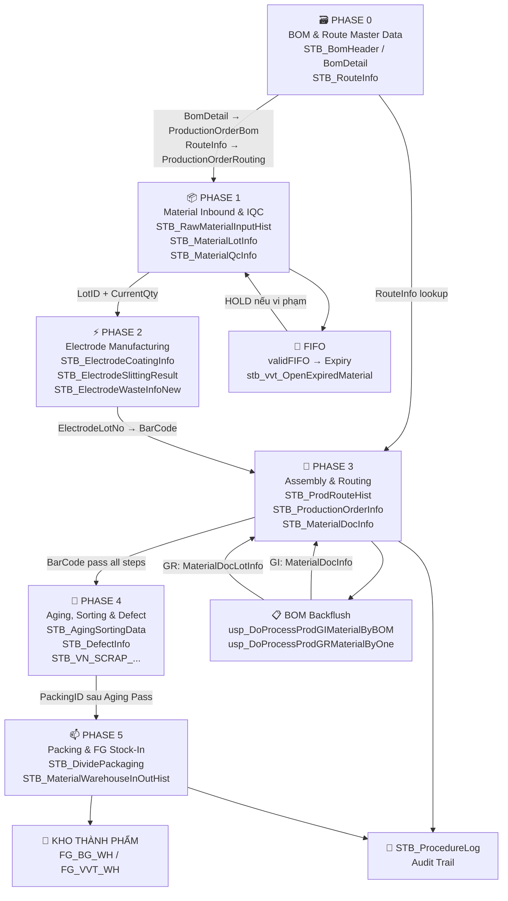
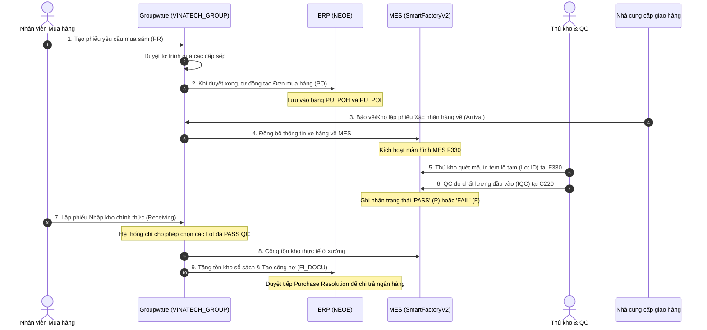
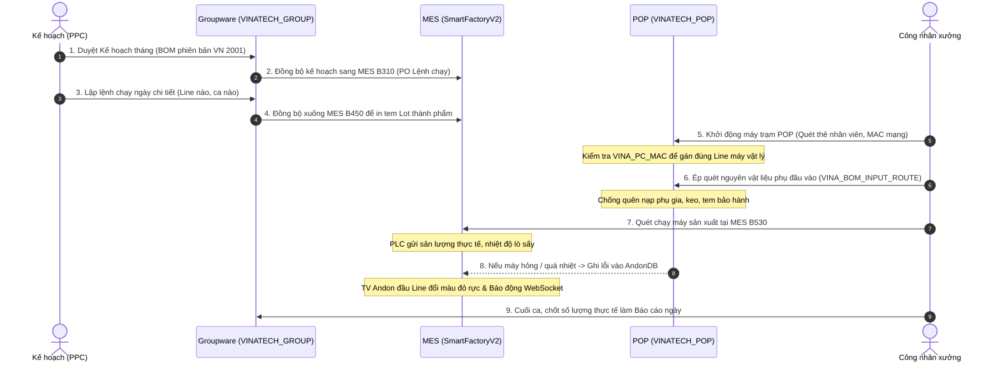
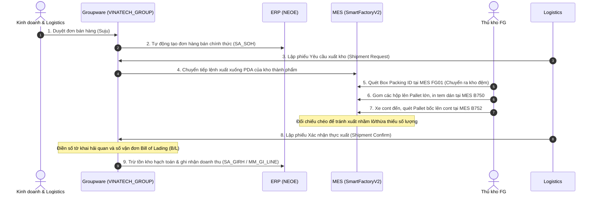

# KB_10 — Kiến Trúc & Luồng Dữ Liệu (Architecture & Data Flow)

> **Mục đích:** Hiểu bản chất thiết kế của hệ thống MES NAIS
> **Bảng chính:** `STB_ScreenObjects`, `STB_StringResources`, `STB_ProcedureLog` (19.3M rows)
> **🔑 Keywords:** kiến trúc, architecture, dataflow, trigger, agent job, metadata, framework, screen, SP, naming, OQC, electrode, IoT, cost, shift, serial
> ← [Về INDEX](KB_INDEX.md)

---

## 0. 🥖 Bản Dịch Bình Dân: Hiểu Sơ Đồ Luồng Dữ Liệu MES Trong 5 Phút

> **Dành cho ai?** Tài liệu này dành cho bất kỳ ai (kể cả không biết IT hay Database) muốn hiểu hệ thống NAIS MES đang làm cái gì dưới xưởng.
> **Cách đọc:** Hãy tưởng tượng luồng MES giống như **Quy trình mở một Tiệm Bánh Tráng Trộn Sinh Viên.**

### GIAI ĐOẠN 0: Giao thức từ Tổng công ty (Phase 0 - Master Data)
*Tưởng tượng:* Bạn chuẩn bị khai trương tiệm bánh tráng.
*   **Hệ thống ERP (Kế toán tổng):** Đây là Ông chủ lớn trên trụ sở. Ông ấy gửi cho bạn 2 cuốn sổ:
    1.  **Sổ Nguyên Liệu (M_Materials):** Danh sách các món ăn (Bánh tráng, Xoài, Bò khô, Lạc rang...).
    2.  **Sổ Công Thức (M_BOMs):** Dạy bạn 1 suất bánh tráng thì cần 100g bánh, 20g xoài, 10g bò khô. (Chính là cái gọi là `BomVersion`).
*   **Hành động của MES:** MES lấy 2 cuốn sổ này cất vào tủ sắt (`Cấu Hình Master Data`) để làm thước đo chuẩn mực không ai được làm sai.

### GIAI ĐOẠN 1: Nhận chỉ tiêu bán hàng bắt buộc (Phase 1 - Lệnh Sản Xuất)
*Tưởng tượng:* Sáng sớm, Quản lý giao chỉ tiêu bán hàng trong ngày.
*   **PO Tháng (B310):** Chỉ tiêu tháng này phải bán được 30.000 bịch bánh tráng.
*   **Kế hoạch Ngày (B450 - Kế hoạch Ca):** Chia nhỏ ra, Cửa hàng số 1 (Line 1) ca sáng hôm nay (Shift 1) phải làm xong 1.000 bịch.
*   **⚠️ CÚ CHỐT QUAN TRỌNG NHẤT (`Nút FixDayPlan`):** 
    Quản lý vạch nếp xong phải **Ký Tên Đóng Dấu Chốt Sổ (IsFixed = True)**. Nếu quản lý quên ký, nhân viên bên dưới tuyệt đối không được phép luộc trứng hay thái xoài. (Máy quét dưới xưởng sẽ văng lỗi *Plan is locked*).

### GIAI ĐOẠN 2: Đi chợ nhập nguyên liệu (Phase 2 - Kho NVL)
*Tưởng tượng:* Xe tải ba gác chở Bánh Tráng, Xoài, Bò khô tới trước cửa tiệm.
*   **Bơm vào kho (F330):** Bạn không vác cả bao tải 50kg bò khô ném vào bếp. Bạn lấy túi zip chia nhỏ ra mỗi túi 1kg. Dán lên mỗi túi zip một tờ giấy ghi ID: "Bò Khô - Lô 01". (Đây chính là quá trình **Tạo Mã Barcode nhỏ (`M_Lots`)**).
*   **⚠️ CÚ CHỐT SỐNG CÒN (Đặc Tính 10):** 
    Lúc dán tem, bạn **BẮT BUỘC phải ghi Hạn Sử Dụng (VD: Hết hạn ngày 30/12)**. Nếu bạn quên ghi ngày ném sổ, túi bò khô đó lập tức bị "Bảo vệ" ném vào phòng Giam Lỏng (kho `Holding`). Tuyệt đối cấm mang vào bếp!
*   **Thử Độc (C220 - IQC):** Quản lý chất lượng nếm thử miếng bò mốc không? Ngon (Pass) thì cho lên kệ. Dở (Fail) thì trả lại thằng bán.
*   **Nhập Bếp (F430 - Move Inventory):** Xách cái túi Zip 1kg Bò khô đó từ "Kho Ngoài" (`SubInv: Main`) ném vào "Bàn Bếp" (`SubInv: Line`) để chuẩn bị trộn.

### GIAI ĐOẠN 3: Bếp trưởng trộn bánh và sự tích cấn trừ kho (Phase 3 - Sản Xuất & Tự Kiểm)
*Tưởng tượng:* Quá trình trộn bánh tráng thực tế của Bếp trưởng. (Trái tim của hệ thống MES, nơi dữ liệu dao động dữ dội nhất).
*   **Bắt đầu làm (B540 - Quét mã sinh Lệnh):** 
    Bếp trưởng xách túi Bò Khô 1kg đó ra, lấy "súng bắn bill" tít một phát vào mã vạch trên túi zip. 
    Lúc này, hệ thống sẽ khai sinh ra một chiếc Nồi Trộn Ảo (phần mềm gọi là `W_WIPLots` - Lot Bán Thành Phẩm). Cái nồi này được dán nhãn: **"Đang làm Bịch Bánh Tráng Số 001. Trạng thái: ĐANG NẤU (Run)"**.
*   **⚠️ CÚ PHÉP THUẬT QUAN TRỌNG NHẤT: BACKFLUSH (Cấn trừ tồn kho tự động):**
    Ngay khi tiếng "tít" vang lên, một bóng ma vô hình trong máy tính (gọi là `SP_CONSUME`) sẽ lôi cuốn **Sổ Công Thức (BomVersion)** ra dò.
    *   Sổ ghi: "1 suất hao 10g Bò khô".
    *   Bóng ma sẽ chạy thẳng vào hệ thống máy tính của cái túi Zip Bò khô 1kg kia... nó tự động dùng bút tẩy con số 1000g đi, viết lại thành **990g**. 
    *   => *Đó chính là Backflush! Công nhân không cần phải tự chép tay sổ kho báo "hôm nay tôi xài hết 10g", máy tính đã trừ nợ dùm họ một cách vô hình.*
*   **Kiểm tra Giữa Chiều (B597 - Bếp tự nếm):** 
    Bếp phó nếm thử xem mẻ bánh này vừa miệng chưa. Ghi vào sổ tay nội bộ của nhà bếp (Bảng dữ liệu này mang cờ `TEST`). 
    *Lưu ý: Cái này chỉ là bếp tự kiểm tra nhau cho yên tâm, không có giá trị pháp lý với cơ quan chức năng.*
*   **Khai Báo Phế Liệu (B530 - Báo Lỗi / Defect):** 
    Đang trộn thì bếp trưởng hắt xì hơi văng nước bọt vào nồi! Rất tiếc, cả mẻ bánh đó phải đổ sọt rác. 
    Lúc này thợ phải bấm nút "Khai Báo Lỗi" trên màn hình. Họ chọn mã lỗi C132: "Lỗi mất vệ sinh". Hệ thống sẽ trừ điểm KPI ca làm việc đó. 
    *(⚠️ Chú ý: Cuối giờ chiều, 10 thằng thợ cùng thi nhau bấm "Lưu Lỗi" 1 lúc, cửa hàng sẽ nghẽn mạng! Thợ IT gọi cái này là `Deadlock Table` do nghẽn cổ chai dữ liệu).*
*   **Thanh Tra Y Tế Gõ Cửa (C443 - PQC Độc Lập):** 
    Đây là thanh tra của Cục Vệ sinh An toàn thực phẩm (Phòng QC riêng biệt). Họ lấy mẫu mang về phòng Lab xét nghiệm vi khuẩn. Dữ liệu của họ lưu vào một cuốn sổ xịn có Mộc Đỏ (Cờ `QUALITY`).
    *   **Nếu Thanh tra bảo MẶN QUÁ (Fail):** Chiếc "Nồi Trộn 001" ngay lập tức bị cảnh sát niêm phong! Phần mềm đổi Trạng thái nhãn nồi thành **HOLD (Khóa/Giam lỏng)**. Không ai được quyền đụng vào nồi bánh này để mang đi đóng gói.
    *   **Nếu Thanh tra OK (Pass):** Nồi bánh dán mộc XANH, tiếp tục chờ đi sang phòng Đóng Hộp.

### GIAI ĐOẠN 4 & 5: Đóng hộp và dán tem bảo hành (Phase 4 & 5 - Đóng gói & Đầu ra)
*Tưởng tượng:* Nhét 50 bịch bánh nhỏ vào 1 cái Thùng Cartoon lớn giao Shipper.
*   **Tạo thùng bự (B523 - Đóng Packing):** Gom 50 bịch bánh con nhét vô 1 Thùng Carton bự. Máy sinh ra mã vạch bự, dán lên thùng (Barcode `Outer`).
*   **⚠️ LƯU Ý MỰC IN:** Luật của xưởng là tem Thùng Bự chỉ được phát ra duy nhất 1 lần để chống làm giả nhái. Máy in rách tem thì khóc ròng, phải gọi IT vào phá khóa (`Void`) mới in lại được.
*   **Khám nghiệm tử thi lần cuối (C530 - Đo 20 Params):** Thùng đóng xong, QC lôi ra đo cân nặng, đo độ mặn ngọt, độ giòn bề mặt (20 thông số). 
*   **⚠️ CÚ CHỐT VÀO KHO (EvaluateResult = OK):** Đo xong phải đóng dấu MỘC ĐỎ chữ "OK / NGON". Cột dữ liệu thiếu chữ OK này thì kho Thành phẩm (Bắc Ninh/Bắc Giang) kiên quyết không mở cửa cho xe tải đổ hàng vào. (Lệnh bị khóa `Hold_Line_FG`).

### GIAI ĐOẠN CỐT: Xe tải lăn bánh & Thu tiền (Phase 6 - Kết xuất ERP)
*Tưởng tượng:* Shipper tới bốc thùng hàng đi giao.
*   **In tem ra đường (B453):** Dán cái mã bưu điện ngoài cùng lên Thùng Cartoon. Trên phần mềm phải đánh dấu Tick vô cái ô "Là Tem Ngoài" (`IsOuterPrinted`). Không tick ô này, ông bảo vệ cổng không cho ra.
*   **Thu tiền (Job Sync ERP):** Khi Thùng Cartoon bước qua khỏi cổng điện tử nhà máy, Hệ thống Tự Động Gửi 1 Vạn Tin Nhắn SMS (`Trigger Background Job`) bắn báo cáo về Kế Toán Trụ Sở. 
*   **Kết cục:** Kế toán nghe "Ting Ting" -> Xuất Hóa Đơn -> Đếm tiền. Cây gia phả Lô sản phẩm khép lại một kiếp luân hồi êm đẹp.

---

## 1. 🏛️ Kiến Trúc Hệ Thống (NAIS Architecture)

### 1.1 Tổng Quan Kiến Trúc (The Three Pillars)

> **Câu hỏi cốt lõi:** Khi OP bấm nút "Save" trên màn hình B597 — chuyện gì xảy ra phía sau?

Hệ thống được xây dựng trên **3 Trụ cột chính**:

*   **Trụ cột 1 — Metadata (SmartFramework):** *"UI chỉ là vỏ, não nằm trong DB"*
    MES không fix cứng hành vi của từng nút bấm trong code phần mềm (C#/Java). Thay vào đó:
    *   Mỗi nút "Save" chỉ gọi 1 tên SP được cấu hình trong bảng `STB_ScreenObjects`.
    *   Muốn thay đổi hành vi → sửa trong DB, **không cần đóng gói lại phần mềm**.
    
    ```
    OP bấm "Save" → NAIS Framework đọc STB_ScreenObjects → Gọi đúng SP → SP xử lý → Ghi DB
    ```

*   **Trụ cột 2 — Stored Procedures:** *"Mọi hành động đều có dấu vết"*
    Mọi thao tác của OP đều được ghi vào bảng lịch sử (`Hist`) thông qua SP. SP là nơi chứa toàn bộ:
    *   **Validation** (kiểm tra hợp lệ trước khi lưu).
    *   **Business logic** (tính toán, kiểm tra FIFO, kiểm tra hạn dùng).
    *   **Ghi dữ liệu** (INSERT/UPDATE vào DB).

*   **Trụ cột 3 — Recursive Logic (Tính toán trực tiếp):** *"Tồn kho sản xuất tự cập nhật qua SP, không dùng triggers"*
    > ⚠️ **Lưu ý (Audit 2026-05-05):** Hệ thống **không sử dụng Triggers trên các bảng sản xuất chính** (như `STB_ProdRouteHist`, `STB_SetInfo`) để tự động trừ kho/cập nhật tồn kho sản phẩm.
    
    Thay vào đó, logic cập nhật tồn kho sản xuất được thực hiện **trực tiếp** thông qua chuỗi gọi Stored Procedure:
    `usp_DoProcessProdRouteHist` → `usp_DoProcessProdGIMaterialByBOM` → `usp_DoCreateMaterialDocLotInfoNotUsedBarcode`.
    *(Lưu ý: Đối với phân hệ kho WMS vật tư, hệ thống vẫn sử dụng Trigger liên hoàn như `tgMaterialLotInfoForUpdate` trên bảng `STB_MaterialLotInfo` để đồng bộ số lượng tồn kho tổng sang `STB_MaterialStock`).*

### 1.2 Kiến Trúc Vận Hành NAIS (NAIS Framework Architecture)

> **Nguyên lý cốt lõi:** NAIS (SmartFramework) là hệ thống **Metadata-Driven**. Giao diện (UI) không chứa logic, mọi hành động (Click, Search, Save) đều được cấu hình trong database metadata để gọi Stored Procedure.

#### Phân vùng Database
Hệ thống Vinatech MES chia làm 2 cơ sở dữ liệu (DB) chính:
*   **`SmartFactoryV2`**: Chứa toàn bộ dữ liệu nghiệp vụ (Sản lượng, Tồn kho, Lệnh sản xuất, BOM, Route).
*   **`SmartFramework`**: Chứa Metadata hệ thống (Menu, User, Quyền hạn, Cấu hình giao diện, Template nhãn in `STB_LabelInfo`).

#### Cách tìm Logic đằng sau bất kỳ màn hình nào
Để hiểu thấu đáo hệ thống, bạn không cần đọc code C#, chỉ cần truy vấn database `SmartFramework` với tài khoản `vanduc`:

**Bước 1: Tìm Tên Màn Hình (ScreenName)**
Tra cứu `Caption` (hiển thị trên tab) và `Name` (ID kỹ thuật) trong `STB_ScreenInfo`.

**Bước 2: Tìm SP tương ứng**
```sql
SELECT ScreenName, ObjectName, ObjectType, Description 
FROM SmartFramework.dbo.STB_ScreenObjects 
WHERE ScreenName = 'VVT_MaterialStockList' -- Thay bằng tên màn hình
```
*   `SearchFunction`: SP dùng để nạp dữ liệu vào Grid (lưới).
*   `ExecuteFunction`: SP dùng khi nhấn nút Save/Delete/Process.

### 1.3 Bảng Ánh Xạ Screen → SP → Table (Database-Driven Architecture)

> **Nguyên tắc vàng:** Mọi thứ trên UI — button, grid, thông báo lỗi, thông báo chặn — đều **khởi nguồn từ database**. Hệ thống MES được thiết kế hoàn toàn **Database-Driven**: IT Admin tạo SP/Function dưới DB → kéo lên UI qua bảng `STB_ScreenObjects` → tạo ra CRUD, UX, validation.

#### Quy mô hệ thống (thống kê thực tế)

| Thành phần | Số lượng | Nằm ở đâu |
|---|---|---|
| Stored Procedures | **3,395** | SmartFactoryV2 |
| Functions (Scalar + Table) | **106** | SmartFactoryV2 |
| Triggers | **33** | SmartFactoryV2 |
| RAISERROR points (trong SP) | **960** | Trong code SP |
| Lệnh `usp_RaiseLocalizedError` | **134** | Đa ngôn ngữ KR/VN/EN |
| String Resources (label/error) | **17,751** | SmartFramework |
| Screen definitions | **1,467 (1,026 unique TCodes)** | SmartFramework |
| Screen Objects (Action/Search/Execute/View) | **7,604** | SmartFramework |

#### Mô hình 3 tầng: UI → SP → Table

```
┌─────────────────────────────────────────────────────────────────────┐
│                      BỀ MẶT (SmartFramework UI)                     │
│                                                                     │
│  STB_ScreenInfo (1,467 screens / 1,026 TCodes) → Name, TCode, Caption             │
│       │                                                             │
│       └── STB_ScreenObjects (7,604 objects)                        │
│               ├── SearchFunction (1,856) → SP _get → nạp Grid      │
│               ├── ExecuteFunction (1,572) → SP _iud → ghi dữ liệu │
│               ├── Action (2,362) → Nút bấm → gọi ExecuteFunction   │
│               └── View (1,814) → Định nghĩa Grid/Tab hiển thị     │
└─────────────────────────────┬───────────────────────────────────────┘
                              │ gọi SP
┌─────────────────────────────▼───────────────────────────────────────┐
│                   BẢN CHẤT (SmartFactoryV2 DB)                      │
│                                                                     │
│  3,395 SPs chứa: Validation → Business Logic → CRUD → RAISERROR   │
│  106 Functions: fn_VVT_getdatebyVendorLot, fn_GetWeekIndex...      │
│  33 Triggers: Auto-log, auto-sync, chặn sửa, đồng bộ DayPlanNo   │
└─────────────────────────────┬───────────────────────────────────────┘
                              │ đọc/ghi
┌─────────────────────────────▼───────────────────────────────────────┐
│                       DỮ LIỆU (Tables)                              │
│                                                                     │
│  STB_SetInfo, STB_ProdRouteHist, STB_MaterialLotInfo...            │
│  + Cross-DB: SmartFramework.dbo.STB_StringResources (error msgs)   │
│  + Cross-DB: SmartFramework.dbo.STB_LabelInfo (tem XML layout)     │
└─────────────────────────────────────────────────────────────────────┘
```

#### Ví dụ cụ thể: B523 (Đóng gói) — 46 objects

| ObjectType | ObjectName | Chức năng |
|---|---|---|
| **SearchFunction** | `usp_Vietnam_GetProdPackingForBarcode_VVT` | Load danh sách Lot theo Barcode |
| **SearchFunction** | `usp_Vietnam_GetBoxIDForLotNo_VVT` | Load box đã gộp |
| **ExecuteFunction** | `usp_Vietnam_DoProcessProdPacking_VVT` | **Core:** Gộp box → validation → ghi DB |
| **ExecuteFunction** | `usp_DoCreatePackingLabelInfo` | Tạo dữ liệu in tem |
| **ExecuteFunction** | `usp_SplitPackingBox` | Chia box |
| **Action** | `MergeBox` | Nút "Box합포" (Gộp box) → gọi ExecuteFunction ở trên |
| **Action** | `SplitBoxQty` | Nút "Chia box" |
| **Action** | `LabelPrint` | Nút "In tem" |
| **View** | `ProdPackingForBarcode` | Grid hiển thị kết quả Search |

> 💡 **Query tra cứu nhanh:** Khi nhận lỗi từ bất kỳ màn hình nào, chạy query sau để biết SP nào đứng đằng sau:
> ```sql
> -- Bước 1: Tìm ScreenName từ TCode
> SELECT Name FROM SmartFramework.dbo.STB_ScreenInfo WHERE TCode = 'B523'
> -- Kết quả: 'Vietnam_Donggoi'
>
> -- Bước 2: Liệt kê tất cả SP/Action
> SELECT ObjectName, ObjectType, Caption
> FROM SmartFramework.dbo.STB_ScreenObjects
> WHERE ScreenName = 'Vietnam_Donggoi'
> ORDER BY ObjectType, ObjectName
> ```

### 1.4 Cơ Chế Error / Notification (Từ DB → UI Popup)

> **Mọi thông báo lỗi, thông báo chặn trên UI đều xuất phát từ SP trong database.**

#### Pipeline xử lý Error Message

```
Bước 1: SP viết message (thường tiếng Hàn)
        SET @ErrorMsg = '이미 Lot를 생성하였습니다'
                        ↓
Bước 2: Gọi usp_RaiseLocalizedError(@pProcessLanguage, @ErrorMsg)
                        ↓
Bước 3: SP này wrap message = '^' + @pMessage + '^'
                        ↓
Bước 4: Gọi SmartFramework.dbo.usp_GetAddonStringResource
        → Lookup trong STB_StringResources theo Language + Name
                        ↓
Bước 5: Tìm thấy bản dịch Vietnamese/English → trả về @ErrorMessage
                        ↓
Bước 6: RAISERROR(@ErrorMessage, 16, 1) → Client nhận → Popup UI
```

#### Bảng `STB_StringResources` (17,751 bản ghi)

| Language | Số lượng | Ghi chú |
|---|---|---|
| Default (Korean) | 17,751 | Bản gốc — mọi message viết tiếng Hàn trước |
| Vietnamese | 15,548 | Bản dịch cho operator VN |
| English | 7,377 | Bản dịch EN (chưa đầy đủ) |

> ⚠️ **Tại sao popup hiện tiếng Hàn?** Vì message đó chưa có bản dịch Vietnamese trong `STB_StringResources`. Fix: INSERT thêm bản ghi Language='Vietnamese' với Value tiếng Việt.

#### 2 Pattern Error trong SP

| Pattern | Cách dùng | Số lượng | Khi nào dùng |
|---|---|---|---|
| `RAISERROR(@msg, 16, 1)` | Trực tiếp, hardcode message | 960 | Logic đơn giản, không cần đa ngôn ngữ |
| `EXEC usp_RaiseLocalizedError` | Qua pipeline đa ngôn ngữ | 134 | Cần hiển thị đúng ngôn ngữ user |

#### Query debug error message

```sql
-- Tìm bản dịch của 1 error message
SELECT Language, Name, Value
FROM SmartFramework.dbo.STB_StringResources
WHERE Name LIKE '%이미 Lot%'  -- Tìm theo tiếng Hàn gốc
ORDER BY Language

-- Thêm bản dịch Vietnamese cho message chưa có
INSERT INTO SmartFramework.dbo.STB_StringResources (Language, Type, Name, Value, ChangeDateTime)
VALUES ('Vietnamese', 'Addon', '^이미 Lot를 생성하였습니다^', N'Lot đã được tạo rồi', GETDATE())
```

### 1.5 Cross-Database Links (Liên kết giữa các DB)

> **"Link dữ liệu giữa các màn hình thực chất là link dữ liệu giữa các table giữa các database."**

#### 3 Database chính + liên kết

```
┌──────────────────────┐     ┌──────────────────────┐     ┌──────────────────────┐
│   SmartFactoryV2     │     │   SmartFramework      │     │  SmartFramework_File │
│                      │     │                       │     │                      │
│ 3,395 SPs            │────▶│ STB_ScreenObjects     │     │ File attachments     │
│ Dữ liệu nghiệp vụ   │     │ STB_StringResources   │     │ Label XML layout     │
│ STB_SetInfo          │     │ STB_LabelInfo         │     │                      │
│ STB_ProdRouteHist    │◀────│ STB_ScreenInfo        │     │                      │
│ STB_MaterialLotInfo  │     │ STB_UserInfo          │     │                      │
└──────────────────────┘     └──────────────────────┘     └──────────────────────┘
         │                            │
         │ 869 SPs gọi cross-DB       │
         └────────────────────────────┘
```

| Hướng link | Mục đích | Ví dụ SP |
|---|---|---|
| SmartFactoryV2 → SmartFramework | Serial generation | `SmartFramework.dbo.usp_DoCreateSerial` |
| SmartFactoryV2 → SmartFramework | Error message lookup | `SmartFramework.dbo.usp_GetAddonStringResource` |
| SmartFactoryV2 → SmartFramework | User info | `SmartFramework.dbo.STB_UserInfo` |
| SmartFactoryV2 → SmartFramework | Label template | `SmartFramework.dbo.STB_LabelInfo` |
| SmartFactoryV2 → SmartFramework | Serial rule config | `SmartFramework.dbo.usp_GetSerialRule` |

> **Số lượng:** 869 SPs trong SmartFactoryV2 có cross-DB reference tới SmartFramework.

### 1.6 Triggers — Logic Ẩn Tự Chạy (33 Triggers)

> **Triggers = hành động tự động chạy khi data thay đổi.** Operator không biết, không thấy trên UI, nhưng ảnh hưởng trực tiếp đến dữ liệu.

#### Inventory đầy đủ 33 Triggers

| # | Trigger | Bảng | Loại | Tác động |
|---|---|---|---|---|
| 1 | `tgMaterialLotInfoForInsert` | STB_MaterialLotInfo | INSERT | Auto-log khi tạo Lot NVL mới |
| 2 | `tgMaterialLotInfoForUpdate` | STB_MaterialLotInfo | UPDATE | **Đồng bộ tồn kho → STB_MaterialStock** |
| 3 | `tgMaterialLotInfoForDelete` | STB_MaterialLotInfo | DELETE | Auto-log khi xóa Lot |
| 4 | `tgMaterialDocDetailForInsert` | STB_MaterialDocDetail | INSERT | Auto-log phiếu nhập chi tiết |
| 5 | `tgMaterialDocDetailForUpdate` | STB_MaterialDocDetail | UPDATE | Auto-log sửa phiếu |
| 6 | `tgMaterialDocDetailForDelete` | STB_MaterialDocDetail | DELETE | Auto-log xóa phiếu |
| 7 | `tgMaterialDocInfoDelete` | STB_MaterialDocInfo | DELETE | Auto-log xóa header phiếu |
| 8 | `tgMaterialDocLotInfoIUD` | STB_MaterialDocLotInfo | IUD | Auto-log mọi thay đổi Lot phiếu |
| 9 | `tgMaterialDocPickingPlanIUD` | STB_MaterialDocPickingPlan | IUD | Auto-log picking plan |
| 10 | `TR_DayProdPlan_Close` | STB_DayProdPlan | UPDATE | **Chặn sửa kế hoạch đã Close** |
| 11 | `utr_STB_SetInfo_DayPlanNo_iu` | STB_SetInfo | I/U | Đồng bộ DayPlanNo vào SetInfo |
| 12 | `utr_SetInfoRemoveHist` | STB_SetInfo | DELETE | **Log khi xóa Lot** (truy vết) |
| 13 | `utr_ProdRouteHist_DayPlanNo_iu` | STB_ProdRouteHist | I/U | Đồng bộ DayPlanNo vào routing |
| 14 | `utr_MaterialCodeByLine_i` | STB_ProdRouteHist | INSERT | Track vật tư đang chạy trên Line |
| 15 | `utr_DefectRepairInfo_DayPlanNo_iu` | STB_DefectRepairInfo | I/U | Đồng bộ DayPlanNo vào sửa lỗi |
| 16 | `trg_syncSTB_DefectRepairInfo` | STB_DefectRepairInfo | I/U | Sync thông tin sửa lỗi |
| 17 | `utr_ElectrodeCoatingInfo_DayPlanNo_iu` | STB_ElectrodeCoatingInfo | I/U | Đồng bộ DayPlanNo vào Coating |
| 18 | `utr_ElectrodeRollPressingInfo_DayPlanNo_iu` | STB_ElectrodeRollPressingInfo | I/U | Đồng bộ DayPlanNo vào Rolling |
| 19 | `utr_ElectrodeSlittingResult_DayPlanNo_iu` | STB_ElectrodeSlittingResult | I/U | Đồng bộ DayPlanNo vào Slitting |
| 20 | `utr_ElectrodeWasteInfo_DayPlanNo_iu` | STB_ElectrodeWasteInfoNew | I/U | Đồng bộ DayPlanNo vào phế điện cực |
| 21 | `TRG_FinalProductInfo` | STB_FinalProductInfo | I/U | Auto xử lý thành phẩm |
| 22 | `utr_DeleteCheckScheduleExceptionHist` | STB_LineInfo | DELETE | Xóa lịch ngoại lệ khi xóa Line |
| 23 | `utr_MachineInfoChangeHist` | STB_MachineMaster | UPDATE | **Log mọi thay đổi thông tin máy** |
| 24 | `utr_ModelSpecHist_insert` | STB_ModelSpec | INSERT | Log thêm spec model |
| 25 | `utr_ModelSpecHist_update` | STB_ModelSpec | UPDATE | Log sửa spec model |
| 26 | `utr_ModelSpecHist_delete` | STB_ModelSpec | DELETE | Log xóa spec model |
| 27-29 | `utr_ProductStockInfoUpload_i/u/d` | STB_ProductStockInfoUpload | IUD | Auto sync tồn kho TP |
| 30 | `TR_RawMaterialInputHist_DelegateLog_Insert` | STB_RawMaterialInputHist | INSERT | **Log ủy quyền quét NVL** |
| 31 | `TR_RawMaterialInputHist_DelegateLog_update` | STB_RawMaterialInputHist | UPDATE | Log sửa ủy quyền NVL |
| 32 | `utr_UpdateDeleteRollbackForLogTable` | DDLChangeLog | DELETE | Chặn xóa log DDL |
| 33 | `utr_ProcedureChangesLog` | (DDL Trigger) | ALTER/DROP | **Track mọi thay đổi SP/Function** |

> ⚠️ **Quan trọng cho IT Admin:**
> - Trigger #2 (`tgMaterialLotInfoForUpdate`) là **"bóng ma"** đồng bộ tồn kho. Khi UPDATE `STB_MaterialLotInfo` trực tiếp bằng SQL → trigger tự chạy → `STB_MaterialStock` tự cập nhật.
> - Trigger #33 (`utr_ProcedureChangesLog`) ghi lại **mọi lần ALTER/DROP SP** vào bảng `DDLChangeLog`. Dùng để truy vết ai sửa SP gì, lúc nào.

### 1.7 Hệ Sinh Thái 20 Database (Full Ecosystem Map)

> Toàn bộ hệ thống Vinatech chạy trên **20 databases** trên cùng SQL Server, chia thành 4 nhóm:

| Nhóm | Database | Chức năng |
|---|---|---|
| **Core MES** | `SmartFactoryV2` (994 tables, 3,395 SPs) | Dữ liệu nghiệp vụ chính |
| | `SmartFramework` (Screen, User, Label, String) | Metadata framework |
| | `SmartFramework_File` | File attachments, tem XML |
| | `SmartFramework_Temp` | Data tạm |
| **ERP & Kế toán** | `NEOE` | ERP Douzone (Master Data, PO, Invoice) |
| | `erpdb` | ERP legacy |
| | `DZICUBE` | OLAP Cube cho BI/báo cáo |
| **Groupware & HR** | `VINATECH_GROUP` | Văn phòng duyệt, HR, tờ trình |
| | `VINATECH_DATA_KSOX` | Dữ liệu ký số xác thực |
| | `VINATECH_SPREADSHEET` | Spreadsheet nội bộ |
| | `streamdocs` | Xem PDF an toàn |
| **Hệ thống phụ trợ** | `VINATECH_POP` (43 tables) | POP Kiosk xưởng (VINA_PC_MAC, BOM_INPUT_ROUTE) |
| | `VINATECH_RESTFUL` | SSO & API authentication |
| | `VINATECH_WEBSOCKET` | Real-time notification |
| | `AndonDB` (3 tables) | Hệ thống cảnh báo lỗi Line |
| | `WCMS_Standard` / `WCMS_STANDARD_NEW` | Chuyển tiền ngân hàng (Cash Management) |
| **Backup & Incubator** | `SmartFactoryV2_261807` | Backup snapshot |
| | `SmartFactoryIncubator` | Môi trường thử nghiệm |
| | `VINATECH_POP_240625` | POP backup |

#### Linked Servers (Kết nối ERP Korea)

| Linked Server | IP | Mục đích |
|---|---|---|
| `ERPSVR` | 110.11.27.7:2433 | ERP Korea (đọc Master Data gốc) |
| `OLDNAISSVR` | 110.11.27.5 | NAIS server cũ (legacy) |
| `CMS_VINA_LINK` | 110.11.27.5\MESTESTDB:8080 | CMS ngân hàng |

### 1.8 SQL Agent Jobs — Tự Động Hóa Nền (Background Automation)

> Hệ thống có **~40 Agent Jobs** chạy tự động mỗi ngày. Đây là "người lao công vô hình" xử lý đồng bộ dữ liệu, snapshot, và backup.

| Nhóm | Job | Lịch | Chức năng |
|---|---|---|---|
| **Đồng bộ liên nhà máy** | `Tranfer_BacGiang_To_BacNinh` (20+ steps) | Daily | Sync dữ liệu BG → BN |
| | `Tranfer_BN_BG` (19 steps) | Daily | Sync dữ liệu BN → BG |
| **Thành phẩm** | `Transfer_FG00_To_C560` | Daily | Chuyển data FG00 → C560 (OQC) |
| | `VN_FINISHEDGOODS_TO_KR_FINISHEDGOODS` | Daily | Sync tồn kho TP → HQ Korea |
| | `VVT_GETDATA_FINISHEDGOOD` | Daily | Lấy data thành phẩm tổng hợp |
| | `vvt_finishgoodCapture` | Daily | Snapshot tồn kho TP |
| **Snapshot & Capture** | `vvt_materialSnapshot` | Daily | Snapshot tồn kho NVL |
| | `vvt_semiInventoryCapture` | Daily | Snapshot bán thành phẩm |
| | `vvt_productreceipt560` | Daily | Auto-insert sản lượng C560 |
| **HR & Chấm công** | `SyncFingerData` | Daily | Đồng bộ dữ liệu vân tay |
| | `VCM_thoigian_08PM` | Daily 8PM | Cập nhật giờ công |
| | `NameShift` | Daily | Phân ca tự động |
| **Email Alert** | `MakeMaterialExpirationEmailAlert` | Daily | Cảnh báo NVL sắp hết hạn |
| | `MakeEmailEquipmentCalibrationCheck` | Daily | Cảnh báo hiệu chuẩn thiết bị |
| **ERP I/F** | `ERP ?????? ??(IU)` (12 jobs) | Monthly | Đồng bộ ERP hàng tháng |
| | `ERP ???? I/F` | Daily | Interface ERP hàng ngày |
| **Backup** | `DB???(4??).?? ??_1` | Daily | Full backup DB (4TB) |
| | `ERPU_DB_full-backup-daily` | Daily | Backup ERP |

> ⚠️ **Quan trọng:** Job `Tranfer_BacGiang_To_BacNinh` có 20+ steps — nếu 1 step fail, dữ liệu giữa 2 nhà máy sẽ bị lệch. Kiểm tra Job History khi phát hiện data BG/BN không khớp.

### 1.9 SP Naming Convention & Phân Lớp Code (Code Archaeology)

#### Quy tắc đặt tên SP (3,395 SPs)

| Pattern | Số lượng | Ý nghĩa | Ví dụ |
|---|---|---|---|
| `*_get` | **594** | Đọc dữ liệu (SELECT) — dùng cho SearchFunction | `usp_ProdRouteHist_get` |
| `*_iud` | **347** | Insert/Update/Delete — dùng cho ExecuteFunction | `usp_SetInfo_iud` |
| `usp_Do*` | **380** | Hành động xử lý (Process) — core engine | `usp_DoProcessProdRouteHist` |
| `usp_VN_*` | **377** | Vinatech custom (VN = Vietnam) | `usp_VN_Update_GoodFinish_HY_New` |
| `usp_Vietnam_*` | **159** | Vinatech custom (tên dài hơn) | `usp_Vietnam_DoProcessProdPacking_VVT` |
| `usp_vvt*` | **105** | VVT-specific logic | `usp_vvt_MaterialLotInfo_get` |
| `*_uid` | **32** | Variant: Update/Insert/Delete | `usp_VN_FinishGood_BG_StockIn_uid` |
| `pop_*` | **5** | POP Kiosk chuyên dụng | `pop_Electrode_Coating_iud` |
| Other | 1,416 | NAIS gốc (Korea) | `usp_BomHeader_iud` |

#### Phân lớp: NAIS gốc vs Vinatech custom

```
SmartFactoryV2 (994 tables)
├── NAIS gốc (Korea): ~793 tables (STB_* prefix)
│   └── SP gốc: usp_*, pop_*
└── Vinatech custom: 201 tables (VVT_*, VN_*, Vietnam_*, FinishGood*, stb_vvt_*)
    └── SP custom: usp_VN_*, usp_Vietnam_*, usp_vvt*
```

> 💡 **Cách phân biệt nhanh:** SP có `VN`, `Vietnam`, `VVT`, `HN`, `BG`, `HY`, `Enesol` trong tên = **Vinatech tự viết**. SP không có = **NAIS gốc** (Korea dev viết).

#### Serial Rules (Cách sinh mã tự động)

| Bảng | Prefix | SerialLen | Ví dụ mã sinh ra |
|---|---|---|---|
| STB_SetInfo | YYYYMMDD | 6 | `20260618000001` |
| STB_ProdRouteHist | YYYYMMDD | 6 | `20260618000001` |
| STB_MaterialLotInfo | YYYYMMDD | 6 | `ML20260618000001` |
| STB_MaterialDocInfo | YYMMDD | 6 | `260618000001` |
| STB_DayProdPlan | YYYYMMDD | 5 | `2026061800001` |
| STB_DividePackaging | HNDPK | 10 | `HNDPK0000000001` |

#### Hệ thống phân quyền (80 UserTypes)

| Nhóm | UserType | Số users | Quyền |
|---|---|---|---|
| **Sản xuất** | ProductionManagement | 191 | Quản lý SX toàn bộ |
| | vi_productionCell | 127 | Operator Cell Line |
| | VVT_WorkerManagement | 106 | Quản lý công nhân VVT |
| | vi_productionTech | 56 | Kỹ thuật SX |
| **QC** | QualityManagement | 130 | Quản lý QC |
| | vi_QC | 100 | Nhân viên QC |
| | VVT_QC_Team | 46 | QC Team VVT |
| **Kho** | MaterialManagement | 97 | Quản lý NVL |
| | vi_warehouse | 74 | Thủ kho |
| | ROHWarehouseUser | 56 | User kho nguyên liệu |
| **IT** | Admin | 69 | Full quyền |
| | Developer | 14 | Dev (debug) |
| | FunctionExtentsion | 38 | Mở rộng function |

> Quyền được gán qua `STB_UserPermissionGroup` (UserID → UserType) + `STB_UserTypeBasicPermission` (UserType → ScreenID + FuncID + Allow).

#### VW_WipResult — View tính WIP lớn nhất (17,684 chars, 9 tables)

View này join: `STB_ProdRouteHist` + `STB_SetInfo` + `STB_RouteInfo` + `STB_LineInfo` + `STB_MaterialMaster` + `STB_MaterialQcInfo` + `STB_DefectRepairInfo` + `STB_BasicRoutingInfo` + `STB_BasicRoutingDetail` → Tính toán WIP (Work In Progress) toàn nhà máy.

#### DDLChangeLog — Audit Trail cho IT Admin

```sql
-- Xem 10 thay đổi SP gần nhất
SELECT TOP 10 PostTime, LoginName, EventType, ObjectName, LEFT(CommandText, 100) AS Preview
FROM SmartFactoryV2.dbo.DDLChangeLog WITH(NOLOCK)
ORDER BY PostTime DESC

-- Xem ai sửa 1 SP cụ thể
SELECT PostTime, LoginName, EventType
FROM SmartFactoryV2.dbo.DDLChangeLog WITH(NOLOCK)
WHERE ObjectName = 'usp_Vietnam_DoProcessProdPacking_VVT'
ORDER BY PostTime DESC
```

> **Columns:** LogID, EventType, PostTime, LoginName, UserName, DatabaseName, ObjectName, CommandText (full SQL), EventXML, IpAddr

### 1.10 OQC Pipeline (Luồng Kiểm Tra Chất Lượng Thành Phẩm)

> OQC = Outgoing Quality Control — kiểm tra SP trước khi xuất kho cho khách hàng.

```
C451 (PQC InProcess)     C560 (FG Receipt)      C530 (OQC Sample)        C531 (OQC Packing)
┌─────────────────┐     ┌──────────────────┐    ┌──────────────────┐     ┌──────────────────┐
│ Quét barcode SP  │     │ Nhập sản lượng   │    │ Đo 20 params     │     │ Gộp box OQC      │
│                  │────▶│ vào kho FG       │───▶│ Pass/Fail/Hold   │────▶│ In tem OQC       │
│ usp_DoFinish     │     │ usp_Products     │    │ usp_DoUpdateMat  │     │ usp_DoProcess    │
│ CommInspDoc_VNT  │     │ ReceiptHist_iud  │    │ QcInfo_Success   │     │ OQCrefer_VVT     │
└─────────────────┘     └──────────────────┘    └──────────────────┘     └──────────────────┘
                                                         │
                                                   C540 (OQC History)
                                                ┌──────────────────┐
                                                │ Lịch sử kết quả  │
                                                │ usp_ProdInspec   │
                                                │ tionHist_get     │
                                                └──────────────────┘
```

| TCode | Tên | SPs chính | Chức năng |
|---|---|---|---|
| C451 | PQC In-Process | `usp_DoFinishCommInspDoc_VNT`, `usp_DoAddCommInspMeasureHistForBarcode` | Nhập kết quả kiểm tra công đoạn |
| C530 | OQC Sample Management | `usp_DoUpdateMaterialQcInfo_Success/Fail/Hold/Complete`, `usp_DoMakeMaterialQcSampleResult` | **Core OQC:** Đo mẫu, nhập 20 params, quyết định Pass/Fail |
| C531 | OQC Packing | `usp_DoProcessOQCrefer_VVT`, `usp_DoProcessProdPackingByOne_VNT` | Gộp box OQC + in tem OQC |
| C540 | OQC History | `usp_ProdInspectionHist_get` | Xem lịch sử kết quả OQC |
| C560 | FG Receipt | `usp_ProductsReceiptHist_iud` | Nhập sản lượng thành phẩm vào kho FG |

> 💡 **Kết quả OQC ảnh hưởng trực tiếp:** Pass → FG Stock-In cho phép xuất kho. Fail → Hold. Rescreening = kiểm tra lại lần 2.

### 1.11 Electrode Manufacturing Flow (Sản Xuất Điện Cực)

> Điện cực = vật liệu quan trọng nhất trong sản xuất tụ điện. Lỗi điện cực = lỗi toàn bộ sản phẩm.

```
B802 (Nhập SX)         F743 (Slitting)       F744 (Width)        F745 (Merge Lot)       F748 (Transfer WH)
┌──────────────┐      ┌───────────────┐     ┌──────────────┐    ┌───────────────┐      ┌───────────────┐
│ Quét barcode  │      │ Chia cuộn     │     │ Kiểm tra     │    │ Gộp các cuộn  │      │ Chuyển kho    │
│ cuộn điện cực │─────▶│ (Split Lot)   │────▶│ chiều rộng   │───▶│ nhỏ thành     │─────▶│ sau QC Pass   │
│               │      │ usp_DoSplit   │     │ Width Test   │    │ cuộn lớn      │      │               │
│ usp_Vietnam_  │      │ LotSlitting   │     │ usp_Width    │    │ usp_Vietnam_  │      │ usp_Update_   │
│ Electrode     │      │               │     │ Slitting_uid │    │ DoProcessMat  │      │ POIL_Lot_     │
│ ProdRouteHist │      │               │     │              │    │ PackingVVT    │      │ Transfer_WH   │
│ _get          │      │               │     │              │    │               │      │               │
└──────────────┘      └───────────────┘     └──────────────┘    └───────────────┘      └───────────────┘
                              │
                        F746 (History)
                      ┌───────────────┐
                      │ Xem lịch sử   │
                      │ Parent→Child   │
                      │ chia cuộn      │
                      └───────────────┘
```

| TCode | SPs chính | Mục đích |
|---|---|---|
| B802 | `usp_Vietnam_ElectrodeProdRouteHist_get` | Nhập SX Electrode vào routing |
| F743 | `usp_DoSlittingLot`, `usp_DoSplitLot`, `usp_ChotSlittingLot` | **Core:** Chia cuộn lớn → nhiều cuộn nhỏ |
| F744 | `usp_WidthSlitting_uid` | Kiểm tra chiều rộng sau slitting |
| F745 | `usp_Vietnam_DoProcessMaterialPacking_VVT` | Gộp các cuộn nhỏ thành batch lớn |
| F746 | `usp_GetParentSplitedMaterialLotInfo`, `usp_GetChildSplitedMaterialLotInfo` | Truy vết Parent→Child cuộn |
| F748 | `usp_Update_POIL_Lot_Transfer_WarehouseCode` | Chuyển kho sau QC |

> ⚠️ **Bảng key Electrode:** `STB_ElectrodeCoatingInfo`, `STB_ElectrodeSlittingResult`, `STB_ElectrodeRollPressingInfo`, `STB_ElectrodeWasteInfoNew`.

### 1.12 Customer Label Pipeline (In Tem Khách Hàng Chuyên Biệt)

> Mỗi khách hàng lớn có luồng in tem riêng, với template XML riêng và SP riêng.

| TCode | Khách hàng | SP chính | Đặc biệt |
|---|---|---|---|
| **K198** | Bloom Energy | `usp_DoPrintBloomEnergySL7Label` | Barcode SL-7 format riêng |
| **K199** | Nordex | `usp_NordexPackingLabelPrintingHist_get` | Packing label chuyên dụng |
| **B754** | PAC | `usp_VN_PACBoxLabelPrintHist_iud`, `usp_PACBoxLabalInfo_get_Vietnam` | Tem thùng KH PAC |
| **B755** | PAC (History) | `usp_PACBoxLabelPrintHist_get` | Lịch sử in tem PAC |
| **B756** | PAC (Carton) | `usp_PACLabelCartonWeight_get_Vietnam` | Tem carton + cân nặng |
| **B757** | DigiKey | `usp_VN_DigiKeyLabelInnerPrintHist_iud`, `usp_DigiKeyLabelInner_get_Vietnam` | Tem inner DigiKey |
| **B758** | DigiKey (Package) | `usp_VN_DigiKeySingleLevelPackagePrintHist_iud` | Single-level package DigiKey |
| **B790** | Phoenix Contact | `usp_Vietnam_PhoenixContactLabelPrint_get` | Tem Phoenix Contact |

> 💡 Template XML lưu trong `SmartFramework.dbo.STB_LabelInfo`, mỗi khách có layout riêng. Khi thêm khách hàng mới → phải: (1) Tạo template XML, (2) Tạo SP in tem, (3) Cấu hình ScreenObjects.

### 1.13 Subsystem Map (Hệ Thống Phụ Trợ)

| Subsystem | DB | Tables | Chức năng | Liên kết MES |
|---|---|---|---|---|
| **Groupware** | VINATECH_GROUP | **383** | Document workflow, HR, tuyển dụng, đánh giá, bán hàng | `VINA_DOCUMENT_*` → tờ trình, duyệt, kế hoạch SX |
| **POP Kiosk** | VINATECH_POP | 43 | Kiosk xưởng: quét NVL, in tem, hiển thị sản lượng | `VINA_PC_MAC` map IP→Line, gọi SP SmartFactoryV2 |
| **RESTful/SSO** | VINATECH_RESTFUL | 3 | SSO: `VINA_SSO_TOKEN`, `VINA_SSO_LOGIN`, `VINA_ALLOWED_IP` | Xác thực user login cho tất cả hệ thống |
| **WebSocket** | VINATECH_WEBSOCKET | 7 | Push notification real-time | Alert sản xuất, cảnh báo lỗi |
| **Andon** | AndonDB | 3 | Cảnh báo lỗi Line: `STB_LineSituation_VVT` (error/status) | Hiển thị trên TV/dashboard sản xuất |
| **CMS** | WCMS_Standard | ? | Cash Management — chuyển tiền ngân hàng | Linked Server `CMS_VINA_LINK` |
| **Enesol/HY** | SmartFactoryV2 (shared) | 3 riêng + shared | Sản phẩm pin Enesol, screens D-series (D000→D110) | Dùng chung DB nhưng có UserType `EnesolProd*` riêng |
| **ERP** | NEOE, erpdb | ? | Douzone ERP: Master Data, PO, Invoice, GL | Linked Server `ERPSVR` (110.11.27.7:2433) |
| **BI/Cube** | DZICUBE | ? | OLAP Cube cho báo cáo, dashboard BI | Aggregation từ SmartFactoryV2 |
| **Spreadsheet** | VINATECH_SPREADSHEET | ? | Spreadsheet nội bộ (kiểu Google Sheets) | Import/Export data MES |

#### Groupware Document Types (Ví dụ luồng phiếu)

```
Groupware VINA_DOCUMENT_*
├── VINA_DOCUMENT_APPROVAL → Duyệt tờ trình/đề xuất
├── VINA_DOCUMENT_PURCHASE_REQUEST → Yêu cầu mua hàng → ERP PO
├── VINA_DOCUMENT_SALES_ORDER → Đơn hàng → Production Plan
├── VINA_DOCUMENT_SAMPLE_REQUEST → Yêu cầu mẫu QC
├── VINA_DOCUMENT_SERVICE_REQUEST → Yêu cầu dịch vụ
├── VINA_DOCUMENT_SEAL_REQUEST → Yêu cầu đóng dấu
└── VINA_WORKFLOW → Luồng duyệt (VINA_WORKFLOW_STEP → từng bước duyệt)
```

### 1.15 IoT & Sensor System (S-series)

> S120 = IoT Measure History dashboard. Dữ liệu sensor nhiệt độ/độ ẩm từ các máy trên Line.

| Bảng/SP | Size | Chức năng |
|---|---|---|
| `STB_IoTMeasureHist` | **28.7 triệu rows** | Lưu giá trị đo (DeviceID, MeasureItemCode, MeasureValue) |
| `usp_VN_Temperature_Humidity` | 19,392 chars | Xử lý dữ liệu nhiệt độ/độ ẩm — SP lớn nhất IoT |
| `usp_IoTDeviceDataSpecOverAlram` | 5,505 chars | Cảnh báo khi sensor vượt ngưỡng |
| `usp_VN_Temperature_TVshow` | 808 chars | Hiển thị lên TV dashboard |
| `usp_DoCreateIoTMeasureHist` | 635 chars | INSERT dữ liệu IoT vào bảng |

> 💡 **Luồng IoT:** Sensor gửi data → `usp_DoCreateIoTMeasureHist` INSERT → `usp_IoTDeviceDataSpecOverAlram` kiểm tra ngưỡng → Alert nếu vượt → `usp_VN_Temperature_TVshow` hiển thị TV.

### 1.16 Cost Management (T-series / StagePrices)

> Giá công đoạn = tiền trả cho công nhân theo từng bước sản xuất.

**Bảng `STB_VVT_StagePrices`** — 83 columns:
- `model` = mã sản phẩm
- `RouteV22` → `RouteV34` = 13 công đoạn BN/BG1 (V-series)
- `PriceV22` → `PriceV34` = Giá tương ứng
- `RouteVE01` → `RouteVE10` = 10 công đoạn Hà Nam (VE-series)
- `PriceVE01` → `PriceVE10` = Giá HN
- `RouteVP01` → `RouteVP08` = 8 công đoạn Hưng Yên (P-series)
- `PriceVP01` → `PriceVP08` = Giá HY
- `MaterialCodeVN_V22` → `_V34` = Mã vật tư VN tương ứng

> ⚠️ **Hardcode columns:** Mỗi nhà máy có cột riêng (V, VE, VP). Nếu thêm nhà máy mới → phải ALTER TABLE thêm cột.

### 1.17 Ca Làm Việc (Shift System)

| CodeShift | Tên | Giờ bắt đầu | Giờ kết thúc |
|---|---|---|---|
| CS01 | Ca ngày | 10:29 | 22:30 |
| CS02 | Ca đêm | 22:31 | 10:30 |

**Tính ca tự động:** Function `fnGetJobDateShiftTime(DateTime, CompanyCode, WorkCenter, Line, Route, NULL)` → trả về `YYYYMMDD` + `ShiftCode` + `TimeCode`. SP `usp_DoProcessProdRouteHist` gọi function này mỗi lần quét barcode → **OP không chọn ca, hệ thống tự tính.**

### 1.18 Vision & XRF Inspection (S-series Deep)

| TCode | Tên | SP chính | Chức năng |
|---|---|---|---|
| S212 | Vision Group Inspection | `usp_VisionGroupInspectionInfo_get` | Kết quả kiểm tra thị giác (camera AI) — report only |
| S213 | Vision Inspection Result | `usp_VisionInspectionResult_get` | Chi tiết kết quả Vision theo lô |
| S215 | XRF Inspection | `usp_XRFInspectionInfo_get` | Kết quả kiểm tra XRF (X-Ray Fluorescence) — thành phần hóa học |

> 💡 Vision + XRF = thiết bị kiểm tra tự động (không cần OP nhập tay). Data ghi trực tiếp từ máy vào DB.

### 1.19 Reliability Test (R-series)

> Kiểm tra độ tin cậy sản phẩm — chạy test dài hạn (nhiệt độ, độ ẩm, tuổi thọ).

```
R110 (Yêu cầu test)    →    R210 (Quản lý test)    →    R220 (Nhập kết quả đo)
┌───────────────┐           ┌───────────────┐           ┌───────────────┐
│ Tạo yêu cầu   │           │ Confirm/Cancel │           │ Nhập giá trị  │
│ + Chọn mẫu    │──────────▶│ quản lý tiến độ│──────────▶│ đo theo time  │
│ _iud + Sample  │           │ DoConfirmRT    │           │ MeasureInfo   │
│ Info_iud       │           │ DoCancelRT     │           │ _iud          │
└───────────────┘           └───────────────┘           └───────────────┘
                                                              │
                                                        R230 (RT Master)
                                                        usp_RTInfo_iud
                                                        usp_DoMakeNewRTSeq
```

### 1.20 FG Product Management (G-series) & Daifuku Warehouse

| TCode | Tên | SP chính | Chức năng |
|---|---|---|---|
| G100/G102 | Sales GI | `usp_SalesGI_*` | Xuất kho bán hàng |
| G610 | Product Stock | `usp_ProductStock_get` | Tồn kho thành phẩm |
| G630 | Transform Model | `usp_TransformModel_*` | Chuyển đổi model sản phẩm |
| **G660** | **Daifuku Warehouse** | `usp_DaifukuWarehouse_iud/get/Del` | **Robot kho tự động Daifuku** |
| G661 | Warehouse Receipt | `usp_WarehouseReceipt_get` | Nhập kho robot |
| G662 | Warehouse Delivery | `usp_WarehouseDelivery_get` | Xuất kho robot |
| G680 | Product Stock Upload | `usp_ProductStockInfo_*` | Upload tồn kho (Agent Job snapshot) |
| G710 | Shipment History | `usp_ShipmentHist_*` | Lịch sử xuất hàng |

> 💡 **Daifuku** = hệ thống kho tự động robot Nhật Bản. MES gửi lệnh nhập/xuất → Daifuku robot tự lấy hàng. `usp_WarehouseGrid_iud` = quản lý vị trí (slot) trong kho robot.

---
### 1.14 Bản Đồ TCode Prefix (Phân Loại 1,026 Màn Hình Unique)

> Mỗi prefix = 1 module chức năng. Biết prefix = biết ngay chức năng thuộc nhóm nào.

| Prefix | Screens | Module | Ví dụ |
|---|---|---|---|
| **B** | 373 | **Sản xuất** (Production) — màn hình lớn nhất | B523 (Đóng gói), B530 (Nhập SL), B597 (Scan NVL) |
| **H** | 180 | **Hà Nam** (VVT_F3) — variant của B-series | HN523, HN530, HN597 |
| **C** | 155 | **QC & Chất lượng** (Quality Control) | C451 (PQC), C530 (OQC), C560 (FG Receipt) |
| **F** | 124 | **Kho & Vật tư** (Material/Warehouse) | F330 (Phiếu NVL), F721 (Tồn kho), F743 (Slitting) |
| **Z** | 52 | **System Admin** (Quản trị hệ thống) | Z410 (User), Z530 (Label Design), Z320 (StringResource) |
| **A** | 33 | **Master Data & Kế hoạch** | A210 (BOM), A310 (Route), A418 (Model), A510 (PO) |
| **P** | 30 | **Nhân sự & Tài liệu** (HR/Document) | P111 (Chấm công), P170 (NV Info), P210 (Document) |
| **K** | 28 | **Đặc biệt / Khách hàng** | K101 (LotTracking), K198 (Bloom), K199 (Nordex) |
| **V** | 26 | **Vietnam TOP Menu** (Kế toán, HR, SX, QC, Kho, Máy) | V100(Accounting), V300(Cell), V500(QC), V700(WH) |
| **L** | 25 | **SPT Support** (Sản phẩm phụ trợ) | L120(NVL SPT), L140(Đóng gói SPT), L310(Tồn kho SPT) |
| **E** | 24 | **Bán hàng** (Sales) | E310 (Sales Order), E410 (GI Request), E610 (Complaints) |
| **G** | 23 | **Thành phẩm** (FG Stock/Sales GI) | G100(Xuất KH), G610(Tồn kho TP), G680(Upload), G710(Shipment) |
| **M** | 22 | **MEA** (Đo lường & bản vẽ sản phẩm) | M130(NVL MEA), M220(OQC MEA), M910(ClassInfo) |
| **T** | 16 | **Chi phí SX** (Cost Management) | T110(Chi phí Route), T120(Apply), T888(Thông tin phế) |
| **D** | 6 | **Enesol/Hưng Yên** | D051, D100, D110 |
| **Khác** | 49 | **S**(SmartFactory/IoT), **W**(WorkTime/Ca), **R**(Reliability Test), **I**(IT Inventory) | S120(IoT), W210(DailyWork), R110(Request), IT01(Devices) |

---

## 2. 🗺️ Luồng Dữ Liệu Tổng Quan (End-to-End Data Flow)

### 2.1 Sơ đồ luồng dữ liệu qua 6 Phase



### 2.2 Vòng Đời & Phả Hệ Dữ Liệu (Data Lifecycle & Genealogy)

> **Hình dung đơn giản:** Giống như một người đi qua nhiều trạm hải quan. Mỗi trạm đóng dấu (= ghi record). Truy vết = xem lại tất cả các dấu đã đóng trên hộ chiếu.

#### Khái niệm cốt lõi:
1. **ControlNo / Barcode**: Chứng minh thư của 1 viên tụ điện. Sinh ra tại máy cuốn, theo suốt đến khi đóng thùng (`VVPR292R710617`).
2. **LotID**: Chứng minh thư của 1 kiện NVL trong kho. Prefix `ML...` = do kho cấp.
3. **PONo**: Số lệnh sản xuất. Gom nhiều Barcode vào 1 nhóm để sản xuất cùng 1 đợt.
4. **RouteCode**: Mã công đoạn. Từ `V-01` (đầu) đến `V-28` (đóng gói). Barcode phải đi đủ các bước theo thứ tự.
5. **ProductGroupCode**: Nhóm phân loại NVL. Dùng trong validation khi OP scan (`ELECTROLYTE`, `SLEEVE`, `CASE`).

#### Truy Vết 360 Độ (Golden Query)
Câu lệnh sau truy vấn toàn bộ "lịch sử cuộc đời" của một viên tụ từ lúc sinh ra đến khi vào thùng:
```sql
SELECT 
    PRH.ControlNo AS [Mã vạch SP], 
    PRH.PONo AS [Lệnh SX], 
    RI.RouteName AS [Công đoạn],
    PRH.CreateDateTime AS [Giờ quét],
    DP.PackingID AS [Mã Thùng hàng],
    DP.ParentPackingID AS [Mã BigBox]
FROM STB_ProdRouteHist PRH WITH(NOLOCK)
LEFT JOIN STB_RouteInfo RI WITH(NOLOCK) ON PRH.RouteCode = RI.RouteCode
LEFT JOIN STB_DividePackaging DP WITH(NOLOCK) ON PRH.ControlNo = DP.LotNo
WHERE PRH.ControlNo = '20260409000089' -- Thay mã vạch cần tra vào đây
ORDER BY PRH.CreateDateTime ASC
```

### 2.3 Bảng Ánh Xạ Màn Hình (Screen ID) Theo Từng Phase Quy Trình

| Phase sản xuất | Nhóm Screen ID | Chức năng nghiệp vụ liên quan |
|---|---|---|
| **PHASE 0** <br> (Master Data) | A210, A230, A310, A320, A410, A418, A419, A460, Z220, Z330, Z410 | Khai báo NVL, BOM, Route, tiêu chuẩn đóng gói, nhãn in và tài khoản. |
| **PHASE 1** <br> (Kho NVL & IQC) | F312, F330, F110, F721, F741, F430, C121, C122, C220, F130, F140 | Tạo PO, kiểm tra đầu vào (IQC), nhập kho, in tem NVL, tách lô, quản lý vị trí kho. |
| **PHASE 2** <br> (Sản xuất Điện cực) | B802, B552, F743-F748, C243 | Sản xuất và kiểm tra chất lượng cuộn điện cực (Coating, Slitting). |
| **PHASE 3** <br> (Lắp ráp & Routing) | B310, B450, B452, B530, B540, B597, B782, K101, K109 | Kế hoạch ngày, tạo Lot sản xuất, ghi nhận sản lượng công đoạn, nạp NVL. |
| **PHASE 4** <br> (PQC & Defect) | C131, C132, C141, C143, C443, C430, C321, B598 | Kiểm tra chất lượng công đoạn (PQC), quản lý phế, spec kiểm tra theo model. |
| **PHASE 5** <br> (Đóng gói & OQC) | B351, B453, B523, B525, B528, B717, B781, B789, C451, C510, C512, C530, C540, C560 | In tem pack, gộp box cell/module, đóng thùng xuất hàng, kiểm tra chất lượng đầu ra (OQC). |
| **PHASE 6** <br> (Thành phẩm & Kho) | FG00, FG01, FG02, HN551, HN866, HNC321, HN00, HN101 | Nhập/xuất kho thành phẩm, quản lý tồn kho thành phẩm (Bắc Ninh, Bắc Giang, Hà Nam). |

---

## 3. 🏢 Ma Trận Nhà Máy (The Factory Matrix - VNT vs VVT vs HN)

> **Nhất quán trong sự khác biệt:** MES Vinatech quản lý nhiều nhà máy với các quy tắc đặt tên và logic riêng biệt.

| Đặc điểm | VNT (Bắc Ninh — Electrode) | VVT (Bắc Giang — Cell/Module) | HN (Hà Nam — VVT_F3) |
|-----------|---------------------------|---------------------------|--------------------------|
| **Tiền tố Route** | `E-xx` (E-01, E-02...) | `V-xx` (V-01, V-22...), `MV-xx` (Module) | `VE-xx` (VE01, VE06...) |
| **Mã WorkCenter** | `VNT_F1` ~ `VNT_F5` | `VVT_F1`, `VVT_F2`, `VVT_F4` | `VVT_F3` |
| **Logic Đóng gói** | Standard Packing | Merge Box/Donggoi (VVT logic) | `Vietnam_Donggoi_HN` |
| **Quy tắc Barcode**| `VV...` prefix | `VV...` (Cell), `VJ...` (converted) | `VE...` (VE260507-001) |

---

## 4. ⚙️ Phân Tích Stored Procedures Theo Phase

### Phase 0 — Master Data: BOM & Routing
*Nền tảng được tham chiếu bởi tất cả phase sau.*
*   `usp_BomHeader_iud`, `usp_BomDetail_iud`, `usp_RouteInfo_iud`
*   **Kỹ thuật:** `MERGE + OPENXML + CURSOR`. Client gửi XML, SP dùng Cursor duyệt từng dòng để Upsert.

### Phase 1 — Material Inbound & Quality Control (WMS & IQC)
*Nhập NVL, kiểm tra chất lượng (IQC), quản lý Lot theo FIFO.*
*   `usp_RawMaterialInputHist_iud` & `usp_Vietnam_RawMaterialInputHist_uid`: Validation NVL đầu vào. *Lưu ý: Logic kiểm tra BOM hiện đang bị khóa tạm thời (Nordex Audit).*
*   `usp_MaterialQcInfo_iud`: Ghi kết quả IQC. Nếu Fail → `STB_NCR_Report`.
*   `usp_MaterialWarehouseInOutHist_iud`: Ghi lịch sử xuất/nhập, gọi `usp_VVTMaterialWarehouse_validFIFO` để chặn vi phạm FIFO hoặc Hết hạn.

### Phase 2 — Electrode Manufacturing (Điện cực)
*Theo dõi quá trình: Coating → Rolling Press → Slitting.*
*   `pop_Electrode_Coating_iud`: Upsert thông số phủ. Trừ `CurrentQty` của NVL (`STB_MaterialLotInfo`), ghi `STB_MaterialWarehouseUsageHist`. Dùng `BEGIN TRAN`.
*   `usp_ElectrodeSlittingResult_iud`: Ghi nhận các cuộn nhỏ sau khi cắt.
*   `usp_ElectrodeWasteInfoNew_iud`: Ghi nhận phế liệu điện cực.

### Phase 2.5 — Lập Kế Hoạch & Chuẩn Bị Sản Xuất
*Nối Master Data với Sản xuất thực tế.*
*   `usp_ProductionOrderRouting_iud`: Copy `STB_RouteInfo` sang `STB_ProductionOrderRouting`. Cài đặt `RouteIndex`, `IsInputRoute`, `IsOutputRoute`.
*   `usp_SetInfo_iud`: "Khai sinh" `ControlNo` (Barcode) cho từng viên tụ.

### Phase 3 — Assembly & Production Routing (Trái tim hệ thống)
*Theo dõi từng sản phẩm qua chuỗi công đoạn.*
*   `usp_CheckInputRawMaterialCodeForProduct`: Validation Gate. Chặn route nếu chưa nạp đủ NVL theo BOM (tại V-23, V-24).
*   **`usp_DoProcessProdRouteHist` (Core Engine)**: Ghi lịch sử quét vào `STB_ProdRouteHist`. Validate số lượng (không được vượt công đoạn trước).
*   `usp_DoProcessProdGIMaterialByBOM`: Được gọi ở mọi Route. Trừ tồn kho NVL (Backflush) tự động.
*   `usp_DoProcessProdGRMaterialByOne`: Chỉ gọi ở bước cuối (`IsOutputRoute=1`). Tạo phiếu nhận thành phẩm (GR).

### Phase 4 — Aging, Sorting & Defect Management
*Đo kiểm và phân loại chất lượng.*
*   `usp_InsertDataAgingAndSorting`: Ghi kết quả Aging (Pass/Fail/A/B/C).
*   `usp_DefectInfo_iud`: Ghi nhận hàng NG.
*   `usp_Add_VN_SCRAP_WEIGHSCALE_PRODUCTIONS`: Cân phế liệu → quy đổi số lượng.

### Phase 5 — Packing & FG Stock-In (Đóng gói)
*Đóng gói và nhập kho thành phẩm.*
*   `usp_DivideAndPrintPackagingLabels`: Chia gói (Túi/Inner box) → `STB_DividePackaging`. Trả về dữ liệu in tem. Đọc 11 bảng khác nhau.
*   `usp_Vietnam_DoProcessBigBoxPacking_VVT_F3`: Gộp túi thành thùng Carton (Big Box).
*   `usp_VN_FinishGood_BG_StockIn_iud`: Nhập kho thành phẩm vào `FG_BG_WH`.

### Phase 6 — Warehouse & Export (Xuất kho)
*Quản lý tồn kho thực tế và xuất hàng đi khách.*
*   `ImportWarehouseFinshGood_uid`: Khai báo hàng từ xưởng vào kho Inventory (`STB_VN_FINISHGOODS_HN_New`).
*   `ExportWarehouseFinshGood_uid`: Xuất hàng, trừ tồn kho, ghi nhận Invoice.

---

## 5. 📘 Từ Điển Bảng & Stored Procedures (Metadata Dictionary)

### 5.1 Sơ đồ quan hệ giữa các nhóm bảng

```
            ┌──────────────────────────────────────────────────────────┐
            │                  MASTER DATA (Nhóm 1)                     │
            │   STB_BomHeader ←→ STB_BomDetail                         │
            │   STB_RouteInfo   STB_MaterialMaster                     │
            │   STB_ModelBasicInfo  STB_UserInfo  STB_LineInfo          │
            └──────────────────────┬────────────────────────────────────┘
                                   │ copy xuống
            ┌──────────────────────▼────────────────────────────────────┐
            │              KẾ HOẠCH & LỆNH SX (Nhóm 2)                  │
            │   STB_DayProdPlan → STB_ProductionOrderInfo                │
            │   STB_ProductionOrderRouting (← RouteInfo)                 │
            │   STB_ProductionOrderBom (← BomDetail)                     │
            │   STB_SetInfo (ControlNo/Barcode)                          │
            │   STB_LineRouteMapping                                     │
            └────────┬───────────────────────────┬──────────────────────┘
                     │                           │
      ┌──────────────▼──────────┐   ┌────────────▼──────────────────────┐
      │  QUẢN LÝ VẬT TƯ (Nhóm 3) │   │  ROUTING & TRACKING (Nhóm 5)      │
      │  STB_MaterialLotInfo ◄──────│──── STB_ProdRouteHist               │
      │  STB_MaterialStock         │   │  (↑ mỗi scan barcode = 1 record)  │
      │  STB_MaterialDocInfo       │   │                                    │
      │  STB_MaterialDocDetail     │   │  Triggers:                         │
      │  STB_MaterialDocLotInfo    │   │   → GI: MaterialDocInfo/Detail     │
      │  STB_MaterialDocLotInfo    │   │   → GR: MaterialDocInfo/Detail/Lot │
      │  STB_MaterialWarehouse...  │   └────────────────────────────────────┘
      │  STB_RawMaterialInputHist  │
      └──────────────┬─────────────┘
```

### 5.2 SP → Table Mapping (Quick Reference)

| Stored Procedure | Tables READ | Tables WRITE |
|-----------------|-------------|--------------|
| `usp_Prod_Daily_Input_Schedule_iud` | — | Exec SP nhánh (`usp_Medium_Daily_Input`) |
| `usp_ProductionOrderRouting_iud` | — | **MERGE** STB_ProductionOrderRouting |
| `usp_SetInfo_iud` | — | **MERGE** STB_SetInfo |
| `usp_BomHeader_iud` | BomHeader, UserInfo | **MERGE** BomHeader; UPDATE BomDetail |
| `usp_RouteInfo_iud` | RouteInfo | **MERGE** RouteInfo |
| `usp_RawMaterialInputHist_iud` | — | INSERT RawMaterialInputHist, MaterialLotInfo |
| `usp_MaterialQcInfo_iud` | QcInfo, IQcDefectReport, NCR_REPORT | **MERGE** QcInfo; UPDATE IQcDefectReport, NCR_Report |
| `usp_MaterialWarehouseInOutHist_iud`| MaterialLotInfo, MaterialMaster, stb_vvt_OpenExpiredMaterial, ... | INSERT MaterialWarehouseInOutHist |
| `usp_VVTMaterialWarehouse_validFIFO`| MaterialLotInfo, MaterialWarehouseInOutHist, MaterialDocLotInfo | — (Chỉ Validate) |
| `pop_Electrode_Coating_iud` | MaterialLotInfo, MaterialWarehouseInOutHist, ... | **MERGE** ElectrodeCoatingInfo; UPDATE MaterialLotInfo |
| `usp_DoProcessProdRouteHist` | ProdRouteHist, ProductionOrderInfo, ProductionOrderRouting, RouteInfo, SetInfo | INSERT ProdRouteHist, ProcedureLog; UPDATE LineRouteMapping... |
| `usp_DoProcessProdGIMaterialByBOM` | LineRouteMapping, MaterialStock, ProductionOrderBom... | INSERT MaterialDocDetail, MaterialDocInfo |
| `usp_DivideAndPrintPackagingLabels` | MaterialLotInfo, ModelBasicInfo, PackingLabelSpec, SetInfo... | INSERT DividePackaging |
| `usp_VN_FinishGood_BG_StockIn_iud` | MaterialLotInfo | INSERT MaterialWarehouseInOutHist; UPDATE MaterialLotInfo |

### 5.3 Key Identifiers (Chuỗi định danh)

```
VendorBarcode (Từ nhà cung cấp)
    │
    ↓ (Nhập kho)
LotID (Chứng minh thư nguyên liệu kho: ML...)
    │
    ├── ElectrodeLotNumber (Mã cuộn điện cực Phase 2)
    │
    └── ControlNo / Barcode (Mã viên tụ / Sản phẩm Phase 3+)
            │
            └── PackingID (Mã túi / Hộp nhỏ Phase 5)
                    │
                    └── BigBoxID (Thùng Carton bự Phase 5)
```

---

## 6. 🛠️ Nhật Ký Tùy Chỉnh & Gỡ Lỗi Nâng Cao

### 6.1 Lỗi không đăng nhập được MES
> Hướng dẫn chi tiết cách xử lý lỗi đăng nhập MES, vui lòng xem tại [KB_01_UI_PHAN_QUYEN.md § 1.1](KB_01_UI_PHAN_QUYEN.md).

### 6.2 Các case study gỡ lỗi thực tế

#### Case 1: Chèn hậu tố "Dynamic Suffix" (GBAKAC-600F)
*   **Vấn đề:** Muốn in thêm đuôi `-600F` trên nhãn nhưng không được sửa tên trong `STB_MaterialMaster` (vì rủi ro DB).
*   **Giải pháp:** Dùng lệnh `REPLACE` ngay trong SP `usp_MaterialDocLotInfo_get` và SP in tem để chèn "ảo" đuôi này khi hiển thị, giữ nguyên Data gốc.

#### Case 2: Cưỡng bức Scan vật tư (V-23, V-24)
*   **Vấn đề:** Công nhân quên scan vật liệu → Lỗi Backflush hụt tồn kho.
*   **Giải pháp:** Chèn đoạn check vào thẳng `usp_DoProcessProdRouteHist`. Nếu chưa scan đủ, Raise Error bằng tiếng Việt. Cấm đi tiếp.

#### Case 3: Bắt buộc quét LOT cũ nhất (FIFO Validation)
*   **Vấn đề:** Công nhân thích quét Lot mới → Lot cũ bị mốc, hết hạn.
*   **Giải pháp:** Bật cờ `IsFIFO = 1` trong `STB_MaterialStockAttributeInfo`. `usp_VVTMaterialWarehouse_validFIFO` sẽ chặn nếu Lot scan không phải là Lot có `CreateDateTime` cũ nhất.

#### Case 4: Lỗi "Exception occurred" tại F330 do `LotAttr10` NULL
*   **Vấn đề:** Quét mã mới bị Exception màn hình.
*   **Giải pháp:** Do cột `LotAttr10` (Ngày SX) bị rỗng, hàm DATEADD cộng thêm hạn dùng bị crash. Chạy lệnh UPDATE SQL điền tay `LotAttr10` cho các Lot bị lỗi. Đồng thời thêm Đặc tính tiêu chuẩn (A, B, C...) vào `STB_MaterialAttribute`.

#### Case 5: Truy vết kế hoạch sai Line (Lỗi B450)
*   **Vấn đề:** 2 Model khác nhau nhảy chung vào 1 Line báo cáo.
*   **Giải pháp:** Xem chi tiết cách sử dụng Time Window Query để quét đối soát và hướng dẫn sửa lỗi chuyển Line/hủy kế hoạch ngày tại [KB_03_SAN_XUAT.md#511-lỗi-kế-hoạch-ngày-chọn-nhầm-line-b450](KB_03_SAN_XUAT.md#511-lỗi-kế-hoạch-ngày-chọn-nhầm-line-b450).

---
*Cập nhật: 2026-06-12 | Gộp KB_10 và KB_11*


---

## 7. Cẩm Nang Nhập Môn Hệ Thống Liên Thông (Gộp từ KB_20)


> **Dành cho:** Kỹ sư thiết kế hệ thống, lập trình viên, nhân viên vận hành và AI mới tiếp cận hệ sinh thái phần mềm Vinatech.
>
> **Mục tiêu:** Giúp người mới bắt đầu (chưa từng biết về hệ thống) có thể hiểu rõ từng bước đi của dữ liệu, cách mà các nền tảng **Groupware (Văn phòng)**, **ERP (Kế toán)** và **MES (Nhà xưởng)** giao tiếp với nhau qua các bảng cơ sở dữ liệu vật lý.
>
> ← [Quay lại Mục Lục chính](KB_INDEX.md) | 🗄️ [Tra cứu cấu trúc CSDL chi tiết (KB_19)](KB_19_ALL_DATABASES_MAP.md)

---

### 🏰 1. Phép Ẩn Dụ "Bốn Vương Quốc" (Understanding the Systems)

Để dễ hình dung hệ thống lớn này, hãy tưởng tượng toàn bộ Vinatech là một đế chế gồm **Bốn Vương Quốc** làm việc với nhau thông qua những "sứ giả" cơ sở dữ liệu:

```
┌─────────────────────────────────────────────────────────────────────────┐
│                    VƯƠNG QUỐC GROUPWARE (GW)                            │
│                 "Văn phòng ký duyệt & Hành chính"                       │
│  - Nơi con người đưa ra quyết định, đề xuất và ký duyệt giấy tờ.        │
│  - Bảng trung tâm: VINA_DOCUMENT_SAVE (Phiếu lưu), VINA_EMP (Nhân sự)   │
└────────────────────────────────────┬────────────────────────────────────┘
                                     │
                                     │ (Sứ giả: Sync PO / Plan / Items)
                                     v
┌────────────────────────────────────┴────────────────────────────────────┐
│                       VƯƠNG QUỐC ERP (DOUZONE)                          │
│                    "Hầm vàng kế toán & Master Data"                     │
│  - Nơi quản lý tiền bạc, công nợ, định giá vật tư gốc và sổ cái.        │
│  - Bảng trung tâm: MA_ITEM (Vật tư), PU_POH (Đơn mua), FI_DOCU (Sổ cái)  │
└────────────────────────────────────┬────────────────────────────────────┘
                                     │
                                     │ (Sứ giả: Sync Lệnh ngày / Tồn thực)
                                     v
┌─────────────────────────────────────────────────────────────────────────┐
│                        VƯƠNG QUỐC MES (NAIS)                            │
│                   "Đốc công & Vận hành nhà xưởng"                       │
│  - Nơi trực tiếp quét barcode, in tem, QC hàng hóa, chạy máy vật lý.    │
│  - Bảng trung tâm: STB_MaterialLotInfo (Lô), STB_ProdRouteHist (Chạy máy)│
└────────────────────────────────────┬────────────────────────────────────┘
                                     │
                                     │ (Sứ giả: Mạng lưới an ninh & Còi báo)
                                     v
┌─────────────────────────────────────────────────────────────────────────┐
│                   VƯƠNG QUỐC PHỤ TRỢ (HELPERS)                          │
│            "Hệ thống đường ống, cảm biến và bảo vệ"                     │
│  - SSO (RESTFUL): Bảo vệ soát vé.   - POP (MAC): Máy trạm hiện trường.  │
│  - Andon (Alerts): Chuông báo lỗi.  - WebSocket: Mạng lưới truyền tin.  │
│  - WCMS (Cash): Chuyển tiền NH.     - streamdocs: Kính xem PDF an toàn. │
└─────────────────────────────────────────────────────────────────────────┘
```

*   **Tại sao cần cả 3 vương quốc chính?**
    *   **Groupware** giúp các phòng ban ngồi bàn giấy duyệt đề xuất từ xa.
    *   **ERP** giúp ban giám đốc nhìn thấy bức tranh tài chính và công nợ pháp lý.
    *   **MES** giúp công nhân ở xưởng chạy máy, quét mã vạch và kiểm QC mà không bị nhầm lẫn.

---

### 🔄 2. Ba Dòng Đời Nghiệp Vụ Cốt Lõi (The 3 Master Lifecycles)

Mọi hoạt động tại Vinatech đều là sự phối hợp nhịp nhàng giữa các hệ thống thông qua 3 quy trình chính dưới đây:

#### 2.1 Quy trình Mua hàng & Nhập kho (Procure-to-Pay)
*Quy trình này theo dấu từ lúc nhà máy cần mua nguyên vật liệu cho đến lúc vật tư nằm trên kệ kho xưởng và nhà cung cấp nhận được tiền.*



---

#### 2.2 Quy trình Chỉ thị & Vận hành Sản xuất (Production Execution)
*Quy trình này biến các con số kế hoạch sản xuất trên bàn giấy thành sản phẩm thực tế ra lò từ máy móc.*



---

#### 2.3 Quy trình Bán hàng & Xuất khẩu Container (Order-to-Cash)
*Quy trình xuất thành phẩm tụ điện ra cảng giao cho khách hàng quốc tế.*



---

### 📋 3. Ma Trận Biểu Mẫu Hành Chính Tích Hợp (Form-to-DB-to-MES Summary)

Để tránh trùng lặp tài liệu kỹ thuật, chi tiết các bước nghiệp vụ và các câu truy vấn SQL mẫu (Golden Queries) đối soát của từng biểu mẫu đã được hợp nhất tại Mục 9 của **[Bản đồ cơ sở dữ liệu toàn hệ thống (KB_19)](KB_19_ALL_DATABASES_MAP.md)**. 

Dưới đây là bảng tra cứu nhanh 17 biểu mẫu cốt lõi dành cho người mới:

| # | Tên Biểu Mẫu (Hành Chính) | Mã Form ID | Vai Trò Nghiệp Vụ Cốt Lõi | Liên Kết Tra Cứu Kỹ Thuật (SQL & DB) |
|---|---|---|---|---|
| 3.1 | Đơn Yêu Cầu Mua Sắm (PR) | `expenseReportDocument` / `purchaseRequestDocument` | Soạn và duyệt xin ngân sách mua sắm vật tư thiết bị. | [Chi tiết & SQL (KB_19)](KB_19_ALL_DATABASES_MAP.md#91-đơn-yêu-cầu-mua-sắm-pr--expense-report) |
| 3.2 | Đơn Đặt Hàng (PO) | `purchaseOrderDocument` | Tạo đơn PO chính thức gửi cho nhà cung cấp xác nhận số lượng, giá. | [Chi tiết & SQL (KB_19)](KB_19_ALL_DATABASES_MAP.md#92-đơn-đặt-hàng-purchase-order---po) |
| 3.3 | Xác Nhận Hàng Về (Arrival) | `arrivalConfirmationDocument` | Khai báo xe hàng về đến cổng nhà máy để in tem lô tạm. | [Chi tiết & SQL (KB_19)](KB_19_ALL_DATABASES_MAP.md#93-xác-nhận-hàng-về-arrival-confirmation) |
| 3.4 | Xác Nhận Nhập Kho (GR) | `receivingConfirmationDocument` | Nhập kho chính thức các Lot đã PASS QC để cộng tồn kho. | [Chi tiết & SQL (KB_19)](KB_19_ALL_DATABASES_MAP.md#94-xác-nhận-nhập-kho-receiving-confirmation) |
| 3.5 | Sổ Quyết Toán Mua Hàng | `purchaseResolutionDocument` | Quyết toán chi phí, hạch toán công nợ và chuẩn bị chi tiền. | [Chi tiết & SQL (KB_19)](KB_19_ALL_DATABASES_MAP.md#95-sổ-quyết-toán-mua-hàng-purchase-resolution) |
| 3.6 | Đơn Xin Nghỉ Việc | `empRetireDocument` | Khóa tài khoản nhân sự thôi việc trên GW, ERP, MES để bảo mật. | [Chi tiết & SQL (KB_19)](KB_19_ALL_DATABASES_MAP.md#96-đơn-xin-nghỉ-việc-employee-retire-document) |
| 3.7 | Đi Làm Ngày Nghỉ / Lễ | `holidayWorkRequest` | Đăng ký tăng ca ngoài giờ, đối chiếu với giờ quẹt vân tay MES. | [Chi tiết & SQL (KB_19)](KB_19_ALL_DATABASES_MAP.md#97-đi-làm-ngày-nghỉ--lễ-holiday-work-request) |
| 3.8 | Đăng Ký Đơn Bán Hàng | `salesOrderDocument` | Đăng ký đơn Suju bán tụ điện cho khách hàng quốc tế. | [Chi tiết & SQL (KB_19)](KB_19_ALL_DATABASES_MAP.md#98-đăng-ký-đơn-bán-hàng-sales-order--suju) |
| 3.9 | Yêu Cầu Xuất Hàng | `deliverOutDocument` | Tạo lệnh xuất kho thành phẩm và chuyển tiếp xuống PDA MES. | [Chi tiết & SQL (KB_19)](KB_19_ALL_DATABASES_MAP.md#99-yêu-cầu-xuất-hàng-shipment-request) |
| 3.10 | Xác Nhận Thực Xuất | `deliverOutConfirmationDocument` | Xác nhận xe cont rời bánh, trừ tồn kho và ghi nhận doanh thu. | [Chi tiết & SQL (KB_19)](KB_19_ALL_DATABASES_MAP.md#910-xác-nhận-thực-xuất-shipment-confirmation) |
| 3.11 | Chỉ Thị Sản Xuất Ngày | `dailyProductionOrderDocument` | Giao chỉ tiêu mẻ/lô cho từng chuyền để sinh mã Lot in tem. | [Chi tiết & SQL (KB_19)](KB_19_ALL_DATABASES_MAP.md#911-chỉ-thị-sản-xuất-ngày-daily-production-order) |
| 3.12 | Báo Cáo Sản Xuất Ngày | `dailyProductionReportDocument` | Báo cáo sản lượng mẻ thực tế cuối ca để chấm điểm KPI. | [Chi tiết & SQL (KB_19)](KB_19_ALL_DATABASES_MAP.md#912-báo-cáo-sản-xuất-ngày-daily-production-report) |
| 3.13 | Yêu Cầu Tuyển Dụng | `empRequestDocument` | Đăng ký xin tuyển thêm nhân sự mới cho phòng ban. | [Chi tiết & SQL (KB_19)](KB_19_ALL_DATABASES_MAP.md#913-yêu-cầu-tuyển-dụng-recruitment--emp-request) |
| 3.14 | Yêu Cầu Đi Công Tác | `businessTripDocument` | Đăng ký công tác để tạm ứng và hạch toán chi phí công tác. | [Chi tiết & SQL (KB_19)](KB_19_ALL_DATABASES_MAP.md#914-yêu-cầu-đi-công-tác-business-trip-request) |
| 3.15 | Đăng Ký Nhà Thầu / Khách | `partnerRegistrationDocument` | Khai báo mã đối tác mới và đồng bộ sang ERP và CMS ngân hàng. | [Chi tiết & SQL (KB_19)](KB_19_ALL_DATABASES_MAP.md#915-đăng-ký-nhà-thầu--khách-hàng-partner--contractor-registration) |
| 3.16 | Yêu Cầu Thay Đổi BOM | `bomRevisionDocument` | Cập nhật định mức linh kiện sản xuất và sync sang POP Kiosk. | [Chi tiết & SQL (KB_19)](KB_19_ALL_DATABASES_MAP.md#916-yêu-cầu-thay-đổi-định-mức-bom-revision-request) |
| 3.17 | Đăng Ký Các Loại Code | `itemRegistrationDocument` | Tạo mã vật tư mới để bắt đầu thực hiện mua bán hoặc sản xuất. | [Chi tiết & SQL (KB_19)](KB_19_ALL_DATABASES_MAP.md#917-đăng-ký-các-loại-code-item--code-registration) |

---

### 🛠️ 4. Cẩm Nang Gỡ Lỗi Nhanh Cho Lập Trình Viên Mới (Onboarding Troubleshooting)

Khi vận hành hệ thống liên thông, lỗi phát sinh thường nằm ở các "khớp nối" dữ liệu. Dưới đây là cách chẩn đoán nhanh:

#### 4.1 Tại sao đơn mua hàng (PO) đã duyệt trên GW nhưng không sync sang ERP?
*   **Khớp nối bị lỗi:** Trạng thái văn bản trên GW chưa chuyển sang duyệt hoàn toàn.
*   **Cách kiểm tra:** Chạy câu lệnh SQL kiểm tra trạng thái phê duyệt:
    ```sql
    SELECT DOCUMENT_SAVE_STATE 
    FROM VINATECH_GROUP.dbo.VINA_DOCUMENT_SAVE WITH(NOLOCK)
    WHERE DOCUMENT_SAVE_CODE = 'MÃ_PHIẾU_CỦA_BẠN';
    ```
    *Nếu kết quả trả về là `'APPROVING'` (đang duyệt) hoặc `'REJECTED'` (bị từ chối) thay vì `'APPROVED'` (đã duyệt), đơn PO sẽ không bao giờ được sync.*

#### 4.2 Tại sao màn hình MES F330 không nhìn thấy phiếu hàng về (Arrival)?
*   **Khớp nối bị lỗi:** Cờ trạng thái tiếp nhận ở MES chưa kích hoạt hoặc phiếu Arrival chưa được ký duyệt bởi kho/bảo vệ trên GW.
*   **Cách kiểm tra:** Đảm bảo bản ghi trong bảng `VINATECH_GROUP.dbo.VINA_DOCUMENT_RECEIVING_PHYSICAL_ITEM_H` có trạng thái duyệt bằng `'APPROVED'`.

#### 4.3 Tại sao cờ `ERP_FLAG` trong CMS báo lỗi `'E'` (Error)?
*   **Khớp nối bị lỗi:** Khi đồng bộ dòng tiền ngân hàng sang ERP, mã ngân hàng/đối tác hoặc tài khoản định khoản không khớp giữa hai hệ thống (lệch Master Data).
*   **Cách kiểm tra:**
    ```sql
    SELECT ERP_TX_MSG 
    FROM WCMS_STANDARD_NEW.dbo.WCMS_ACCOUNT_TRNX_LOG WITH(NOLOCK)
    WHERE ERP_FLAG = 'E';
    ```
    *Đọc nội dung thông báo lỗi trong cột `ERP_TX_MSG` để biết chính xác mã đối tác nào đang bị thiếu trên danh mục ERP.*

#### 4.4 Tại sao Kiosk POP tại chuyền sản xuất báo lỗi không nhận diện được Line máy?
*   **Khớp nối bị lỗi:** Máy tính Kiosk mới được thay thế card mạng hoặc cài lại Windows dẫn đến địa chỉ MAC mạng thay đổi, không còn khớp với cấu hình trong cơ sở dữ liệu.
*   **Cách kiểm tra:**
    1. Lấy địa chỉ MAC mạng thực tế trên máy tính trạm (chạy lệnh `getmac` ở cmd).
    2. Chạy câu lệnh đối chiếu xem MAC này đã được đăng ký đúng máy trạm chưa:
       ```sql
       SELECT PC_MAC_ADDRESS, PC_IPV4_ADDRESS, EQUIPMENT_SETTING_IDS 
       FROM VINATECH_POP.dbo.VINA_PC_MAC WITH(NOLOCK)
       WHERE PC_MAC_ADDRESS = 'ĐỊA_CHỈ_MAC_MỚI';
       ```
    3. Nếu không tìm thấy dòng nào, IT cần cập nhật địa chỉ MAC mới vào bảng `VINA_PC_MAC` để ứng dụng POP load được cấu hình.

---

### 📚 5. Từ Điển Thuật Ngữ Nghiệp Vụ & Viết Tắt MES Vinatech (Gộp từ MES_GLOSSARY)


> **Mục đích:** Định nghĩa toàn bộ thuật ngữ chuyên ngành và các từ viết tắt sử dụng trong hệ thống tài liệu và database của NAIS MES tại Vinatech. Giúp AI mới và lập trình viên hiểu nhất quán nghiệp vụ của nhà máy.
> ← [Về INDEX](KB_INDEX.md)

---

#### 📦 1. Phân Hệ Kho Nguyên Vật Liệu (WMS - Warehouse Management System)

*   **WMS (Warehouse Management System):** Hệ thống quản lý kho nguyên vật liệu.
*   **NVL (Nguyên Vật Liệu):** Vật tư đầu vào mua ngoài phục vụ sản xuất (ví dụ: bột than, dung môi electrolyte, vỏ nhôm alu case, sleeve...).
*   **IQC (Incoming Quality Control):** Kiểm tra chất lượng nguyên vật liệu đầu vào. Hàng nhập kho bắt buộc phải qua IQC (Màn hình `C220`) và đạt trạng thái **PASS** mới được cấp phát.
*   **LotID / MaterialLotNo:** Mã vạch duy nhất do kho cấp khi tiếp nhận NVL (thường bắt đầu bằng prefix `ML...`).
*   **Vendor Lot / LotExtText10 (Đặc tính 10 / LotAttr10):** Mã Lot của nhà cung cấp in trên tem hàng về. Hệ thống sử dụng hàm parse SQL để tách ngày sản xuất từ mã này nhằm tính thời hạn sử dụng.
*   **Location (Vị trí):** Vị trí vật lý lưu trữ Lot hàng trong kho (ví dụ: `ROH_HN_WH_01`).
*   **FIFO (First In, First Out):** Nguyên tắc Nhập trước - Xuất trước. Hệ thống chặn xuất Lot mới nếu còn Lot cũ cùng mã hàng trong kho.
*   **Holding (Kho khóa):** Trạng thái Lot hàng bị khóa chất lượng hoặc cận date, tự động hoặc thủ công di chuyển vào các kho ảo `HOLDING_WH` để ngăn chặn cấp phát lên chuyền.
*   **Shelf Life (Hạn sử dụng):** Số tháng sử dụng của NVL tính từ Ngày sản xuất (quy định trong cột `MMExtInt01` của `STB_MaterialMaster`).
*   **GR (Goods Receipt) / GI (Goods Issue):** 
    *   *GR (Nhập kho):* Nhận hàng vào kho vật lý hoặc kho ảo.
    *   *GI (Xuất kho):* Xuất hàng cấp phát cho sản xuất hoặc xuất kho ảo tiêu hao theo BOM.

---

#### ⚡ 2. Phân Hệ Sản Xuất & Lịch Sử Định Tuyến (WIP & Route Control)

*   **WIP (Work In Progress):** Bán thành phẩm đang nằm trên dây chuyền sản xuất giữa các công đoạn.
*   **PO (Production Order) / PONo:** Lệnh sản xuất tháng hoặc PO sản xuất. Dùng để gom nhóm các barcode sản phẩm chạy chung một model và tiêu chuẩn kỹ thuật.
*   **DayPlan / DayPlanNo:** Kế hoạch sản xuất theo ngày (Màn hình `B450`), được tạo từ PO và gán cho các Line cụ thể. Tích chọn `IsFixed = 1` để chốt kế hoạch và bắt đầu sinh Lot sản phẩm.
*   **Barcode / ControlNo:** 
    *   *Barcode:* Mã tem in ra dán lên Lot sản phẩm thực tế (ví dụ: `VVPO...`, `VE...`).
    *   *ControlNo:* Mã số định danh nội bộ (PK) của Barcode đó trong database để liên kết lịch sử routing, tránh trùng lặp khi đổi mã tem.
*   **Route (Định tuyến/Công đoạn):** Chuỗi công đoạn sản xuất sản phẩm (ví dụ: `V-22` Cuốn, `V-23` Lắp cao su, `V-25` Bọc vỏ...).
*   **Making:** Trạng thái sản xuất đang diễn ra, bắt buộc phải chọn ở cột Status khi công nhân chốt sản lượng tại màn hình `B530` ở công đoạn `V-25`.
*   **Backflush:** Cơ chế tự động trừ tồn kho nguyên vật liệu tương ứng trong kho ảo cạnh chuyền (`ROUTE_WH`) dựa trên định mức BOM khi công đoạn sản xuất tương ứng hoàn thành.
*   **IsOutputRoute:** Cờ đánh dấu công đoạn cuối cùng của sản phẩm (ví dụ: `V-28` hoặc `VE-10`), khi chốt công đoạn này hệ thống tự động tạo phiếu nhận thành phẩm (GR).

---

#### 🔬 3. Phân Hệ Kiểm Chất Lượng (Quality Control & Audit)

*   **PQC (Process Quality Control):** Kiểm tra chất lượng trong công đoạn sản xuất. Được thực hiện tại trạm `C443` nhằm phát hiện sớm sản phẩm NG.
*   **OQC / FOQC (Outgoing Quality Control / Final OQC):** Kiểm tra chất lượng thành phẩm đầu ra trước khi đóng thùng xuất xưởng (Màn hình `C530`/`C546`).
*   **Defect (NG - Not Good):** Sản phẩm lỗi, phế phẩm phát sinh trên dây chuyền.
*   **DefectQty:** Số lượng sản phẩm bị lỗi ghi nhận tại công đoạn (lưu trong `STB_SetInfo` hoặc `STB_DefectRepairInfo`).
*   **QC Audit Pass / Reject:** Trạng thái phê duyệt xuất xưởng của lô thành phẩm. Nếu trạng thái là **Reject**, hệ thống sẽ chặn cứng không cho xuất kho tại màn hình Cargo.
*   **Bypass:** Cơ chế cấu hình hoặc dùng SQL can thiệp để bỏ qua một bước kiểm tra (ví dụ: bypass hạn dùng cho Lot NVL, bypass Gate chốt sản lượng...).

---

#### 📦 4. Phân Hệ Đóng Gói & Thành Phẩm (Packing & Finished Goods)

*   **PackingID / BoxID:** Mã số định danh của túi hoặc hộp nhỏ đựng sản phẩm sau khi gộp box (Màn hình `B523`).
*   **BigBoxID / ParentPackingID:** Mã số định danh của thùng carton lớn chứa nhiều hộp nhỏ để xuất xưởng.
*   **Box Matching (Khớp Box):** Quy trình quét kiểm tra khớp nhãn giữa các hộp con và thùng mẹ để tránh đóng gói sai chủng loại Model.
*   **FG (Finished Goods):** Thành phẩm cuối cùng đã qua đóng gói và QC Audit đạt chuẩn, sẵn sàng giao cho khách hàng (giao Cargo).

---

#### 🛠 5. Thuật Ngữ Kỹ Thuật Hệ Thống (Technical terms)

*   **SP (Stored Procedure):** Thủ tục lưu trữ trong SQL Server. Chứa 90% logic nghiệp vụ và validation của hệ thống NAIS MES.
*   **TCode (Transaction Code):** Mã rút gọn của màn hình giao diện (ví dụ: `B523`, `F330`, `C220`...).
*   **Bridge Table (Bảng cầu nối):** Các bảng trung gian trong database `SmartFactoryV2` bắt đầu bằng prefix `STB_ESM_...` dùng để đồng bộ dữ liệu giữa MES và ERP Douzone.
*   **Active Trigger:** Các trigger đang hoạt động trên các bảng giao dịch để tự động thực thi đồng bộ dữ liệu (như đồng bộ tồn kho sang `STB_MaterialStock`).
*   **SQL Agent Job:** Các tiến trình chạy ngầm theo lịch trình của SQL Server để tự động backup, đồng bộ ERP, hoặc gửi email cảnh báo.

---

## Appendix — Core Table Volumes & Production Infrastructure (DB Verified 2026-06-18)

### A.1 Top 10 Transactional Tables by Row Count

| # | Table | Rows | Vai trò |
|---|---|---|---|
| 1 | **`STB_ProcedureLog`** | **19,318,951** | ★ Audit log mọi SP call — "Sổ đen" hệ thống |
| 2 | **`STB_ProdRouteHist`** | **3,297,607** | ★★★ Visa stamp — mỗi scan = 1 record |
| 3 | `STB_ProdRouteSummary` | **1,873,854** | Tổng hợp sản lượng per Route/Line/Date |
| 4 | `STB_MaterialDocLotInfo` | **1,176,771** | Chi tiết Lot per phiếu nhập/xuất kho |
| 5 | `STB_MaterialLotInfo` | **996,824** | ★★ Master Lot NVL (Current = live stock) |
| 6 | `STB_CommInspDocHistory` | **826,344** | Lịch sử kiểm tra QC per Barcode |
| 7 | **`STB_SetInfo`** | **760,640** | ★★★ Product Passport — 1 record/sản phẩm |
| 8 | `STB_MaterialDocInfo` | **670,294** | Header phiếu nhập/xuất/chuyển kho |
| 9 | `STB_DayProdPlan` | **272,839** | Kế hoạch sản xuất ngày |
| 10 | `STB_ProductionOrderInfo` | **22,555** | PO (Lệnh SX) — ~22.5K lệnh tổng |

> [!IMPORTANT]
> **Growth rate ước tính:**
> - `STB_ProdRouteHist` tăng ~4,800 rows/ngày (2 ca × ~2,400 barcode scans/ca)
> - `STB_ProcedureLog` tăng ~50K rows/ngày (mọi SP call đều log)
> - `STB_SetInfo` tăng ~1,000 rows/ngày (sản phẩm mới)

### A.2 Production Table Family (31 tables — STB_Prod* verified)

| Table | Mô tả |
|---|---|
| **`STB_ProdRouteHist`** | ★★★ Core routing (3.3M rows) — Visa stamp |
| `STB_ProdRouteHist_Back` | Backup routing |
| `STB_ProdRouteHist_Temp` | Routing tạm thời |
| `STB_ProdRouteHistCancelHist` | Lịch sử hủy scan |
| `STB_ProdRouteHistNotes` | Ghi chú per scan |
| **`STB_ProdRouteSummary`** | ★ Tổng hợp sản lượng (1.9M rows) |
| `STB_ProdRouteSummary_NEW` | Summary phiên bản mới |
| `STB_ProdRouteSummary_VNM` | Summary riêng VN |
| `STB_ProdRouteWorkerHist` | Lịch sử công nhân per route |
| `STB_ProdSerialMappingInfo` | Ánh xạ serial |
| `STB_ProdLinePlan` | Kế hoạch theo Line |
| `STB_ProdInspIndivisualSpec` | Spec kiểm tra riêng |
| **`STB_ProductionOrderInfo`** | ★ PO Header (22.5K) |
| `STB_ProductionOrderBom` | BOM per PO |
| `STB_ProductionOrderRouting` | Routing per PO |
| `STB_ProductionOrderBatchInfo` | Batch info per PO |
| `STB_ProductionOrderSalesInfo` | Sales link per PO |
| `STB_ProductionPlan` | Kế hoạch SX tháng |
| `STB_ProductMachine` | Máy per sản phẩm |
| `STB_ProductMoistureMeasureHist` | Đo độ ẩm SP |
| `STB_ProductsReceiptHist` | Lịch sử nhập kho TP |
| `STB_ProductsReceiptHistMove` | Chuyển nhập kho |
| **`STB_ProductStockInfo`** | ★ Tồn kho thành phẩm |
| `STB_ProductStockInfoUpload` | Upload tồn kho → ERP |
| `STB_ProductStockInfoUploadHist` | Lịch sử upload |
| `STB_ProdWorkerInfo` | Thông tin công nhân SX |
| `STB_ProductGroup` | Nhóm sản phẩm |

---

*Cập nhật: 2026-06-18 — Bổ sung Appendix: Core Table Volumes (Top 10: ProcedureLog 19.3M, ProdRouteHist 3.3M, SetInfo 760K) + Production Table Family (31 tables). DB verified.*
