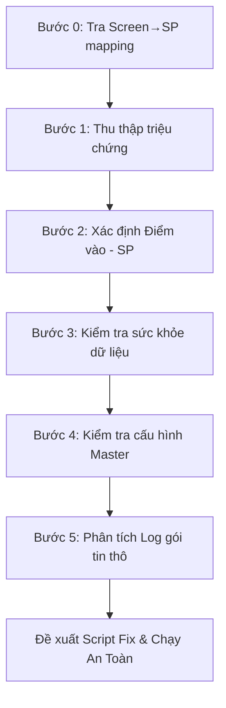
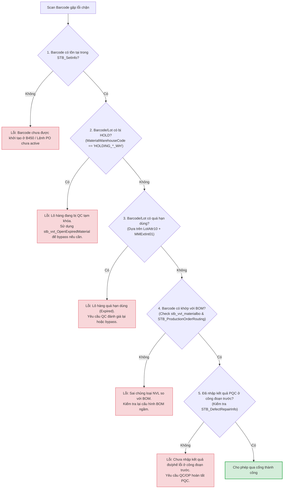

# 📘 KB_14_TRACE_BUG_METHODOLOGY — Cẩm Nang Truy Vết Lỗi & Dữ Liệu NAIS MES

> **Cập nhật:** 2026-06-18 | **Tác giả:** Antigravity (Google DeepMind Team)
> **🔑 Keywords:** trace, debug, lỗi, bug, truy vết, methodology, validation gate, cổng chặn, log, ProcedureLog, TerminalDataLog, barcode, block, chặn
> **Mục tiêu:** Hướng dẫn từng bước (Step-by-step) đầy đủ, chính xác, trực quan để kỹ sư vận hành/lập trình viên có thể tự mình truy tìm và sửa lỗi dữ liệu trên hệ thống MES Vinatech mà không cần đoán mò.

---

## 1. 🛡️ TRIẾT LÝ VÀ NGUYÊN TẮC VÀNG
> **"Không đoán mò — Chỉ tin vào dữ liệu thực tế trong Database"**

Khi tiếp nhận báo lỗi từ hiện trường, tuyệt đối không vội vàng đưa ra kết luận dựa trên mô tả cảm tính. Mọi lỗi hệ thống đều để lại dấu vết trong cơ sở dữ liệu. Bắt buộc phải thực hiện truy vấn `SELECT` để xác minh trạng thái thực của dữ liệu trước khi đưa ra phương án xử lý.

> [!IMPORTANT]
> **Quy tắc an toàn giao dịch (Transaction Handling)**
> Mọi lệnh UPDATE hoặc DELETE sửa đổi dữ liệu do sự cố đều bắt buộc phải thực hiện trong một **Explicit Transaction (`BEGIN TRAN ... ROLLBACK / COMMIT`)**. Tuyệt đối không chạy lệnh update trực tiếp mà không kiểm tra `@ROWCOUNT` để tránh cập nhật sai hàng loạt bản ghi.

> [!WARNING]
> **Rủi ro sập luồng do hàm đổi kiểu (TRY_CONVERT vs CONVERT)**
> Hàm `fn_VVT_getdatebyVendorLot` phân tích ngày sản xuất từ mã Lot bằng các hàm cắt chuỗi tĩnh (`substring`) và convert ngày. Khi nhà cung cấp thay đổi format mã Lot (không theo cấu trúc `dd/mm/yyyy`), hàm sẽ crash do lỗi convert kiểu dữ liệu. Hãy luôn sử dụng `TRY_CONVERT` thay vì `CONVERT` để bảo vệ SP khỏi lỗi sập luồng.

> [!CAUTION]
> **Tránh tranh chấp khóa bảng (Table-Lock Deadlocks)**
> Trong giờ cao điểm chốt ca (07:30 - 08:30 và 19:30 - 20:30), lượng bản ghi quét công đoạn gửi lên `STB_ProdRouteHist` đạt mức hàng chục ngàn dòng. Việc cập nhật hàng loạt hoặc chạy trigger đồng bộ tồn kho liên hoàn không tối ưu hóa chỉ mục (Indexes) sẽ dẫn đến lock leo thang (Lock Escalation) thành Table-Lock, gây treo toàn bộ ứng dụng MES hiện trường.

---

## 2. 📋 QUY TRÌNH TRUY VẾT LỖI 6 BƯỚC CHUẨN Y KHOA



### BƯỚC 0: Tra Screen → SP Mapping (Xác định SP đứng sau màn hình)

> **Mọi thao tác trên UI đều gọi SP.** Trước khi debug, phải biết SP nào đứng đằng sau nút bấm gây lỗi.

```sql
-- Bước 0.1: Tìm ScreenName từ TCode
SELECT Name, Caption FROM SmartFramework.dbo.STB_ScreenInfo WHERE TCode = 'B523'

-- Bước 0.2: Liệt kê tất cả SP/Action của màn hình đó
SELECT ObjectName, ObjectType, Caption
FROM SmartFramework.dbo.STB_ScreenObjects
WHERE ScreenName = 'Vietnam_Donggoi'  -- Thay bằng Name từ bước 0.1
ORDER BY ObjectType, ObjectName
```

> 📖 **Tham chiếu:** Xem chi tiết kiến trúc Database-Driven tại [KB_10 §1.3](../KB_10/KB_10_01_ARCHITECTURE.md#13-bảng-ánh-xạ-screen--sp--table-database-driven-architecture)

### BƯỚC 1: Thu Thập Triệu Chứng Hiện Trường (Symptoms)
Trước khi mở SQL Server Management Studio (SSMS), hãy thu thập đủ **5 thông tin vàng**:
1. **Màn hình xảy ra lỗi:** (Mã TCode, ví dụ: `B523`, `B597`, `F330`...).
2. **Mã đối tượng bị lỗi:** (Mã Barcode, mã Lot, mã PO, hoặc mã Nguyên vật liệu...).
3. **Thao tác thực hiện:** (Nhấn nút "Gộp Box", "In tem", hay "Xác nhận nhập kho"...).
4. **Thông báo lỗi hiển thị trên giao diện (UI Error):** (Chụp ảnh màn hình hoặc ghi lại nguyên văn thông báo).
5. **Nhân sự thực hiện & Thời gian xảy ra lỗi:** (Để thu hẹp phạm vi quét log).

---

### BƯỚC 2: Xác Định Điểm Vào Hệ Thống (Entry Point - UI ➔ SP Mapping)
Hệ thống NAIS MES vận hành bằng cách gọi các Stored Procedure (SP) từ UI. Để biết nút bấm trên giao diện gọi SP nào, chạy các câu lệnh tra cứu sau:

```sql
-- 1. Tìm tên màn hình gốc theo mã TCode hiển thị trên UI
SELECT Name AS ScreenName, Caption, TCode 
FROM SmartFramework.dbo.STB_ScreenInfo
WHERE TCode = 'B523'; -- Thay thế bằng TCode bị lỗi

-- 2. Tìm tên Object (Nút bấm) và xem SP/Event tương ứng
-- Kết quả ScreenName ở bước 1 sẽ dùng làm điều kiện lọc ở đây
SELECT ObjectName, Caption, LinkURL, EventName 
FROM SmartFramework.dbo.STB_ScreenObjects
WHERE ScreenName = 'Vietnam_Donggoi_Hnam' -- Tên màn hình tìm được ở bước 1
  AND ObjectType = 'Action';
```

> 💡 **Mẹo:** Tên Stored Procedure thường nằm trong cột `LinkURL` hoặc `EventName` dưới dạng `usp_Vietnam_DoProcess...` hoặc `usp_DoProcess...`.

---

### BƯỚC 3: Kiểm Tra "Sức Khỏe" Dữ Liệu Hiện Tại (Data State Check)
Hệ thống chặn không cho thao tác thường do trạng thái Lot hoặc Barcode không đủ điều kiện (chưa qua công đoạn trước, chưa QC, hoặc đã bị báo phế). Chạy câu lệnh kiểm tra tổng quát sau:

```sql
-- Kiểm tra trạng thái toàn diện của một mã Barcode/Lot
SELECT 
    Barcode,
    MaterialCode,
    ProdQty,
    LotDecisionResult,  -- Trạng thái QC: 'PASS' = Đạt, 'FAIL' = Lỗi, NULL = Chưa đánh giá
    IsDefect,           -- 1 = Đang bị đánh dấu lỗi (NG), 0 = Bình thường
    DefectQty,          -- Số lượng lỗi
    IsProdFinish,       -- 1 = Đã hoàn tất công đoạn sản xuất, 0 = Chưa hoàn tất
    InputLineCode       -- Line sản xuất đăng ký
FROM STB_SetInfo
WHERE Barcode = 'Mã_Barcode_Cần_Check'; -- Ví dụ: 'SP20260525-001'
```

#### 2.1 Cây Chẩn Đoán Lỗi Quét Barcode (Barcode Blockage Decision Tree)

Dưới đây là sơ đồ cây quyết định giúp lập trình viên/AI khoanh vùng nhanh nguyên nhân gây lỗi chặn scan barcode:



---

### BƯỚC 4: Kiểm Tra Cấu Hình Master Data (Configuration Check)
Nhiều lỗi xảy ra do thiếu cấu hình vật tư, thiết bị hoặc phân quyền trên hệ thống:

```sql
-- 1. Kiểm tra cấu hình gộp lot/sử dụng barcode của vật tư (Màn hình F110)
-- Nếu IsLotUse = 0 hoặc IsUseBarcode = 0, hệ thống sẽ chặn không cho quét Lot/In tem
SELECT MaterialCode, IsUseBarcode, IsLotUse 
FROM STB_MaterialStockAttributeInfo
WHERE MaterialCode = 'Mã_Vật_Tư_Cần_Check';

-- 2. Kiểm tra thông số voltage/farad của Model (Màn hình A410)
SELECT ModelCode, MBIExtText04 AS Voltage, MBIExtText05 AS Farad
FROM STB_ModelBasicInfo
WHERE ModelCode = 'Mã_Model_Cần_Check';
```

---

### BƯỚC 5: Phân Tích Log Hệ Thống Để Tìm Nguyên Nhân Gốc (Root Cause Analysis)
Khi giao diện báo lỗi chung chung (Ví dụ: "Lỗi hệ thống, liên hệ Admin"), đây là bước quan trọng nhất để xem lỗi thực tế xảy ra ở dòng code nào trong Database:

```sql
-- 1. Tra cứu log gói tin thô gửi từ Client lên Server
-- Giúp xác định chính xác dữ liệu Client truyền lên là gì
SELECT ProcessDateTime, IPAddress, Data, ProcessResult
FROM STB_ProcessTerminalDataLog
WHERE CAST(ProcessDateTime AS DATE) = CAST(GETDATE() AS DATE)
  AND Data LIKE '%Mã_Barcode_Cần_Check%'
ORDER BY ProcessDateTime DESC;

-- 2. Tra cứu log chi tiết các biến số bên trong Stored Procedure
-- Được SP tự động ghi lại khi xảy ra lỗi/validate chặn
SELECT ProcedureName, VariableName, VariableValue, CreateDateTime
FROM STB_ProcedureLog
WHERE CAST(CreateDateTime AS DATE) = CAST(GETDATE() AS DATE)
ORDER BY CreateDateTime DESC;
```

---

## 3. 🔍 ĐỌC VÀ PHÂN TÍCH CHUỖI DỮ LIỆU LOG (DATA LOG ANATOMY)

Cột `Data` trong bảng `STB_ProcessTerminalDataLog` lưu chuỗi dữ liệu thô phân tách bằng ký tự gạch đứng `|`.

**Ví dụ một chuỗi log gộp Box:**
`PRODPACKING|VELINE-01|VE10|SP20260525-001|1000|PK001|vanduc|...`

**Phân tích cấu trúc:**
1. `PRODPACKING`: Tên Action/Event (Sẽ được Route vào SP `usp_DoProcessTerminalData`).
2. `VELINE-01`: Mã Line sản xuất thực hiện.
3. `VE10`: Mã công đoạn sản xuất.
4. `SP20260525-001`: Mã Lot/Barcode sản phẩm.
5. `1000`: Số lượng sản phẩm (`ProdQty`).
6. `PK001`: Mã thùng/Box ID đích.
7. `vanduc`: Tài khoản User thực hiện.

> ⚠️ **Dấu hiệu bất thường cần tìm:**
> - Số lượng (`ProdQty`) truyền lên bằng `0` hoặc âm.
> - Mã Line hoặc mã Công đoạn bị trống hoặc không tồn tại trong Master Data.
> - Tài khoản User thực hiện chưa được phân quyền trên Line/Kho đó.

---


---

