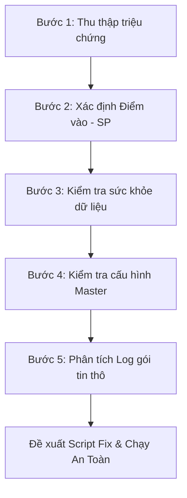
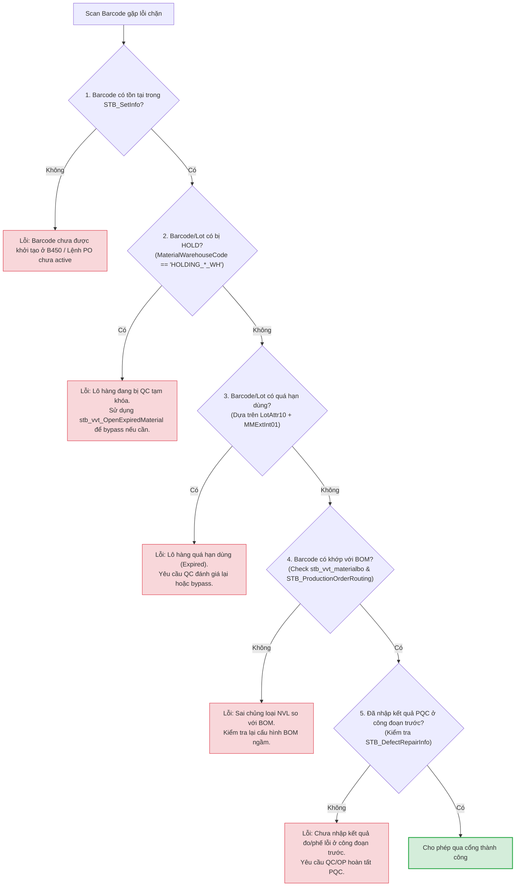

# 📘 KB_14_TRACE_BUG_METHODOLOGY — Cẩm Nang Truy Vết Lỗi & Dữ Liệu NAIS MES

> **Cập nhật:** 2026-05-25 | **Tác giả:** Antigravity (Google DeepMind Team)
> **Mục tiêu:** Hướng dẫn từng bước (Step-by-step) đầy đủ, chính xác, trực quan để kỹ sư vận hành/lập trình viên có thể tự mình truy tìm và sửa lỗi dữ liệu trên hệ thống MES Vinatech mà không cần đoán mò.

---

## 1. 🛡️ TRIẾT LÝ VÀ NGUYÊN TẮC VÀNG
> **"Không đoán mò — Chỉ tin vào dữ liệu thực tế trong Database"**

Khi tiếp nhận báo lỗi từ hiện trường, tuyệt đối không vội vàng đưa ra kết luận dựa trên mô tả cảm tính. Mọi lỗi hệ thống đều để lại dấu vết trong cơ sở dữ liệu. Bắt buộc phải thực hiện truy vấn `SELECT` để xác minh trạng thái thực của dữ liệu trước khi đưa ra phương án xử lý.

> [!IMPORTANT]
> **Quy tắc an toàn giao dịch (Transaction Handling)**
> Mọi lệnh UPDATE hoặc DELETE sửa đổi dữ liệu do sự cố đều bắt buộc phải thực hiện trong một **Explicit Transaction (`BEGIN TRAN ... ROLLBACK / COMMIT`)**. Tuyệt đối không chạy lệnh update trực tiếp mà không kiểm tra `@ROWCOUNT` để tránh cập nhật sai hàng loạt bản ghi.

> [!WARNING]
> **Rủi ro sập luồng do hàm đổi kiểu (TRY_CONVERT vs CONVERT)**
> Hàm `fn_VVT_getdatebyVendorLot` phân tích ngày sản xuất từ mã Lot bằng các hàm cắt chuỗi tĩnh (`substring`) và convert ngày. Khi nhà cung cấp thay đổi format mã Lot (không theo cấu trúc `dd/mm/yyyy`), hàm sẽ crash do lỗi convert kiểu dữ liệu. Hãy luôn sử dụng `TRY_CONVERT` thay vì `CONVERT` để bảo vệ SP khỏi lỗi sập luồng.

> [!CAUTION]
> **Tránh tranh chấp khóa bảng (Table-Lock Deadlocks)**
> Trong giờ cao điểm chốt ca (07:30 - 08:30 và 19:30 - 20:30), lượng bản ghi quét công đoạn gửi lên `STB_ProdRouteHist` đạt mức hàng chục ngàn dòng. Việc cập nhật hàng loạt hoặc chạy trigger đồng bộ tồn kho liên hoàn không tối ưu hóa chỉ mục (Indexes) sẽ dẫn đến lock leo thang (Lock Escalation) thành Table-Lock, gây treo toàn bộ ứng dụng MES hiện trường.

---

## 2. 📋 QUY TRÌNH TRUY VẾT LỖI 5 BƯỚC CHUẨN Y KHOA



### BƯỚC 1: Thu Thập Triệu Chứng Hiện Trường (Symptoms)
Trước khi mở SQL Server Management Studio (SSMS), hãy thu thập đủ **5 thông tin vàng**:
1. **Màn hình xảy ra lỗi:** (Mã TCode, ví dụ: `B523`, `B597`, `F330`...).
2. **Mã đối tượng bị lỗi:** (Mã Barcode, mã Lot, mã PO, hoặc mã Nguyên vật liệu...).
3. **Thao tác thực hiện:** (Nhấn nút "Gộp Box", "In tem", hay "Xác nhận nhập kho"...).
4. **Thông báo lỗi hiển thị trên giao diện (UI Error):** (Chụp ảnh màn hình hoặc ghi lại nguyên văn thông báo).
5. **Nhân sự thực hiện & Thời gian xảy ra lỗi:** (Để thu hẹp phạm vi quét log).

---

### BƯỚC 2: Xác Định Điểm Vào Hệ Thống (Entry Point - UI ➔ SP Mapping)
Hệ thống NAIS MES vận hành bằng cách gọi các Stored Procedure (SP) từ UI. Để biết nút bấm trên giao diện gọi SP nào, chạy các câu lệnh tra cứu sau:

```sql
-- 1. Tìm tên màn hình gốc theo mã TCode hiển thị trên UI
SELECT Name AS ScreenName, Caption, TCode 
FROM SmartFramework.dbo.STB_ScreenInfo
WHERE TCode = 'B523'; -- Thay thế bằng TCode bị lỗi

-- 2. Tìm tên Object (Nút bấm) và xem SP/Event tương ứng
-- Kết quả ScreenName ở bước 1 sẽ dùng làm điều kiện lọc ở đây
SELECT ObjectName, Caption, LinkURL, EventName 
FROM SmartFramework.dbo.STB_ScreenObjects
WHERE ScreenName = 'Vietnam_Donggoi_Hnam' -- Tên màn hình tìm được ở bước 1
  AND ObjectType = 'Action';
```

> 💡 **Mẹo:** Tên Stored Procedure thường nằm trong cột `LinkURL` hoặc `EventName` dưới dạng `usp_Vietnam_DoProcess...` hoặc `usp_DoProcess...`.

---

### BƯỚC 3: Kiểm Tra "Sức Khỏe" Dữ Liệu Hiện Tại (Data State Check)
Hệ thống chặn không cho thao tác thường do trạng thái Lot hoặc Barcode không đủ điều kiện (chưa qua công đoạn trước, chưa QC, hoặc đã bị báo phế). Chạy câu lệnh kiểm tra tổng quát sau:

```sql
-- Kiểm tra trạng thái toàn diện của một mã Barcode/Lot
SELECT 
    Barcode,
    MaterialCode,
    ProdQty,
    LotDecisionResult,  -- Trạng thái QC: 'PASS' = Đạt, 'FAIL' = Lỗi, NULL = Chưa đánh giá
    IsDefect,           -- 1 = Đang bị đánh dấu lỗi (NG), 0 = Bình thường
    DefectQty,          -- Số lượng lỗi
    IsProdFinish,       -- 1 = Đã hoàn tất công đoạn sản xuất, 0 = Chưa hoàn tất
    InputLineCode       -- Line sản xuất đăng ký
FROM STB_SetInfo
WHERE Barcode = 'Mã_Barcode_Cần_Check'; -- Ví dụ: 'SP20260525-001'
```

#### 2.1 Cây Chẩn Đoán Lỗi Quét Barcode (Barcode Blockage Decision Tree)

Dưới đây là sơ đồ cây quyết định giúp lập trình viên/AI khoanh vùng nhanh nguyên nhân gây lỗi chặn scan barcode:



---

### BƯỚC 4: Kiểm Tra Cấu Hình Master Data (Configuration Check)
Nhiều lỗi xảy ra do thiếu cấu hình vật tư, thiết bị hoặc phân quyền trên hệ thống:

```sql
-- 1. Kiểm tra cấu hình gộp lot/sử dụng barcode của vật tư (Màn hình F110)
-- Nếu IsLotUse = 0 hoặc IsUseBarcode = 0, hệ thống sẽ chặn không cho quét Lot/In tem
SELECT MaterialCode, IsUseBarcode, IsLotUse 
FROM STB_MaterialStockAttributeInfo
WHERE MaterialCode = 'Mã_Vật_Tư_Cần_Check';

-- 2. Kiểm tra thông số voltage/farad của Model (Màn hình A410)
SELECT ModelCode, MBIExtText04 AS Voltage, MBIExtText05 AS Farad
FROM STB_ModelBasicInfo
WHERE ModelCode = 'Mã_Model_Cần_Check';
```

---

### BƯỚC 5: Phân Tích Log Hệ Thống Để Tìm Nguyên Nhân Gốc (Root Cause Analysis)
Khi giao diện báo lỗi chung chung (Ví dụ: "Lỗi hệ thống, liên hệ Admin"), đây là bước quan trọng nhất để xem lỗi thực tế xảy ra ở dòng code nào trong Database:

```sql
-- 1. Tra cứu log gói tin thô gửi từ Client lên Server
-- Giúp xác định chính xác dữ liệu Client truyền lên là gì
SELECT ProcessDateTime, IPAddress, Data, ProcessResult
FROM STB_ProcessTerminalDataLog
WHERE CAST(ProcessDateTime AS DATE) = CAST(GETDATE() AS DATE)
  AND Data LIKE '%Mã_Barcode_Cần_Check%'
ORDER BY ProcessDateTime DESC;

-- 2. Tra cứu log chi tiết các biến số bên trong Stored Procedure
-- Được SP tự động ghi lại khi xảy ra lỗi/validate chặn
SELECT ProcedureName, VariableName, VariableValue, CreateDateTime
FROM STB_ProcedureLog
WHERE CAST(CreateDateTime AS DATE) = CAST(GETDATE() AS DATE)
ORDER BY CreateDateTime DESC;
```

---

## 3. 🔍 ĐỌC VÀ PHÂN TÍCH CHUỖI DỮ LIỆU LOG (DATA LOG ANATOMY)

Cột `Data` trong bảng `STB_ProcessTerminalDataLog` lưu chuỗi dữ liệu thô phân tách bằng ký tự gạch đứng `|`.

**Ví dụ một chuỗi log gộp Box:**
`PRODPACKING|VELINE-01|VE10|SP20260525-001|1000|PK001|vanduc|...`

**Phân tích cấu trúc:**
1. `PRODPACKING`: Tên Action/Event (Sẽ được Route vào SP `usp_DoProcessTerminalData`).
2. `VELINE-01`: Mã Line sản xuất thực hiện.
3. `VE10`: Mã công đoạn sản xuất.
4. `SP20260525-001`: Mã Lot/Barcode sản phẩm.
5. `1000`: Số lượng sản phẩm (`ProdQty`).
6. `PK001`: Mã thùng/Box ID đích.
7. `vanduc`: Tài khoản User thực hiện.

> ⚠️ **Dấu hiệu bất thường cần tìm:**
> - Số lượng (`ProdQty`) truyền lên bằng `0` hoặc âm.
> - Mã Line hoặc mã Công đoạn bị trống hoặc không tồn tại trong Master Data.
> - Tài khoản User thực hiện chưa được phân quyền trên Line/Kho đó.

---


---

## 4. 🛠️ CÁC CÂU LỆNH SQL UTILITIES CỨU HỘ NHANH

### A. Kiểm tra nhanh lịch sử di chuyển Lot (Routing Trace)
Khi Lot không hiển thị ở công đoạn hiện tại, kiểm tra xem nó đã qua công đoạn trước chưa:
```sql
SELECT Barcode, ProcSeq, ProcessCode, MachineCode, InQty, OutQty, JobDate, CreateUserID, CreateDateTime
FROM STB_ProdRouteHist
WHERE Barcode = 'Mã_Barcode_Cần_Tra'
ORDER BY ProcSeq ASC;
```

### B. Kiểm tra Lot Nguyên vật liệu đầu vào (WMS Trace)
Khi kho NVL báo không gộp được hoặc hệ thống báo Lot nguyên vật li�### E. Kiểm tra bản ghi chuyển đổi tên Lot (B353 → B523)
Khi B353 đã chuyển đổi lot nhưng B523 vẫn in lot cũ, kiểm tra:
```sql
-- 1. Xem bản ghi chuyển đổi trong STB_ChangePartNoAndLotNo
SELECT * FROM STB_ChangePartNoAndLotNo WITH(NOLOCK) 
WHERE oldLotID = 'MÃ_LOT_CŨ' OR NewLotID = 'MÃ_LOT_MỚI'

-- 2. Xem cấu hình auto VJ (nguyên nhân thường gặp khi bị ghi đè)
SELECT PrintVJ, MaterialCode, PartNo FROM STB_Vietnam_PackingPrinting WITH(NOLOCK) 
WHERE MaterialCode = (SELECT MaterialCode FROM STB_SetInfo WITH(NOLOCK) WHERE Barcode = 'MÃ_BARCODE')

-- 3. Xem barcode gốc thực tế (VV hay VJ?)
SELECT Barcode, MaterialCode FROM STB_SetInfo WITH(NOLOCK) WHERE Barcode = 'MÃ_BARCODE'
```

> ⚠️ **Bug đã biết (2026-06-18):** SP `usp_Vietnam_GetBoxIDForLotNo_VVT` tra cứu `STB_ChangePartNoAndLotNo` bằng `@LotNo` (VV prefix) nhưng bảng lưu `oldLotID` với VJ prefix → lookup không match → bị auto VJ ghi đè. Xem chi tiết tại [KB_04 §6.18](KB_04_DONG_GOI_IN_TEM.md#618-bug-b353-chuyển-đổi-lot-nhưng-b523-vẫn-in-tem-theo-lot-cũ-stb_changepartnoandlotno-bị-bỏ-qua).

---

## 6. 🚦 TỔNG HỢP PATTERN VALIDATION GATES — Yêu Cầu Giả Định Khách Hàng & Cách Thực Hiện Trong SP

> **Mục đích:** Bảng tổng quan tất cả "cổng chặn" (Validation Gates) trong hệ thống MES, được trình bày dưới dạng **yêu cầu giả định của khách hàng** (hypothetical customer requirements) và **cách SP thực hiện** yêu cầu đó. Giúp kỹ sư hiểu nhanh pattern thiết kế chung khi cần thêm/sửa/bỏ một gate.

### 6.1 Bảng Master Reference — 12 Nhóm Validation Gates

| # | Màn Hình | SP Chính | Loại Chặn | Yêu Cầu Giả Định KH | Bảng DB Chính | KB Chi Tiết |
|---|----------|----------|-----------|---------------------|---------------|-------------|
| 1 | **B597** | `usp_Vietnam_RawMaterialInputHist_uid` | NVL đầu vào (7 gates) | Chặn NVL HOLD/hết hạn/sai loại/sai vỏ/sai electrolyte/sai độ dày/thiếu config | `STB_MaterialLotInfo`, `STB_BomDetail`, `STB_MaterialMaster`, `stb_slittinglocationconfig_vvt` | KB_05 §7 |
| 2 | **B530** | `usp_DoProcessProdRouteHistForCalc_SmartApp_VNT` | Chốt sản lượng (7 gates) | Chặn chưa scan NVL/chưa PQC/Lot đóng/20 phút/thiếu máy/PO sai route | `STB_ProdRouteHist`, `STB_RawMaterialInputHist`, `STB_DefectRepairInfo` | KB_03 §6.3 |
| 3 | **B523** | `usp_Vietnam_DoProcessProdPacking_VVT` | Đóng gói (3 gates) | Chặn chưa cân/chưa QC Pass/thiếu tiêu chuẩn đóng gói | `STB_PackingStandard`, `STB_SetInfo`, `STB_DividePackaging` | KB_03 §6.5 |
| 4 | **B452** | `usp_Set_VVT_Info_get` | Phân quyền đổi Line | Chặn user không có quyền đổi Line/PO | `STB_SetInfo` (hardcode whitelist trong SP) | KB_03 §6.7 |
| 5 | **B618** | `usp_GetInforLotReworkHaNamFactory_uid` | Phân quyền Rework | Chặn user không có quyền khai báo Rework | `STB_LotReworkInfo_HN` (hardcode whitelist) | KB_26 §6.2 |
| 6 | **HNC321** | `usp_Vietnam_ScrapInput_HN` | Nhập phế (1 gate) | Chặn nhập phế nếu chưa có lịch sử công đoạn trước | `STB_ProdRouteHist`, `STB_DefectRepairInfo` | KB_05 cẩm nang C321 |
| 7 | **QC Audit** | `usp_VN_WaitingCheckBeforeExport_forQCAudit_Pass` | Khóa trạng thái QC | Chặn đổi Reject→Pass (khóa cứng 1 chiều) | `STB_VN_FINISHGOODS_forQCAudit` | KB_26 §3 Bug 2 |
| 8 | **Returns** | `usp_DoValidateMaterialDocBarcodeForReturn` | Xác thực trả hàng | Chặn nhận hàng trả nếu chưa IQC Pass | `STB_MaterialQcInfo`, `STB_MaterialMaster` | KB_26 §6.3 Bug 2 |
| 9 | **Lò Sấy** | `usp_VN_DryOver` | Thời gian sấy | Chặn ra lò nếu chưa đủ Confighours theo MaterialCode | `STB_VN_DRYOVER` (hardcode thời gian trong SP) | KB_03 §6.23 |
| 10 | **Slitting Knife** | `usp_DoCreateSlittingResult` | Tuổi thọ dao | Chặn cắt nếu dao vượt StandardQty (20k/40k/60k/70k m) | `STB_VN_SlittingKnifeInfo`, `STB_VN_SlittingKnifeInUse` | KB_03 §6.23 |
| 11 | **F330/C220** | `usp_Vietnam_MaterialGrFromOrder_get` | IQC nhập kho | Chặn nhận hàng nếu IQC chưa Pass | `STB_MaterialQcInfo`, `STB_CommInspDocHistory` | KB_02 §4.15 |
| 12 | **Electrode** | `usp_GetElectroMixPresentStep_vietnam` | Thứ tự bước cân | Chặn nếu bước cân nhảy sai thứ tự (logic ca đêm/ngày) | `STB_ElectrodeMixStepInfo`, `STB_ElectrodeStep` | KB_05 §8.6 |

---

### 6.2 Pattern Thiết Kế Chung — 4 Loại Cổng Chặn Trong MES

Dựa trên phân tích 12 nhóm trên, hệ thống MES sử dụng **4 pattern thiết kế** cổng chặn chính:

#### Pattern A: Kiểm Tra Trạng Thái Dữ Liệu (Data State Check)
```
IF (trạng thái dữ liệu KHÔNG đạt điều kiện)
    RAISERROR('Thông báo lỗi', 16, 1)
    RETURN
```
**Áp dụng tại:** B597 (HOLD/Hết hạn/Sai loại), B530 (Gate 1-3: chưa scan NVL/chưa PQC), HNC321 (chưa có routing trước), F330/C220 (IQC chưa Pass), Slitting Knife (vượt tuổi thọ)

**Cách mở rộng:** Thêm/sửa điều kiện `IF` trong SP. Thường cần SELECT từ bảng Master/Transaction để check.

#### Pattern B: Kiểm Tra Phân Quyền Hardcode (User Whitelist)
```
IF (@pProcessUserID NOT IN ('user1', 'user2', ...))
    RAISERROR('Không có quyền', 16, 1)
    RETURN
```
**Áp dụng tại:** B452 (đổi Line), B618 (Rework), B523 (cân - tài khoản worker)

**Cách mở rộng:** Thêm UserID vào danh sách hardcode hoặc (tốt hơn) chuyển sang kiểm tra phân quyền động qua `SmartFramework.dbo.STB_UserPermission`.

#### Pattern C: Khóa Trạng Thái Một Chiều (One-Way State Lock)
```
IF (@currentStatus = 'Reject')  -- Không cho đổi ngược
    RAISERROR('Đã reject, không đổi được')
```
**Áp dụng tại:** QC Audit (Reject → Pass bị khóa), Returns (IQC bắt buộc cho mọi loại hàng kể cả FG)

**Cách mở rộng:** Mở rộng điều kiện `ELSE IF` để cho phép đổi ngược khi cần.

#### Pattern D: Kiểm Tra Cấu Hình Hardcode (Configuration Hardcode)
```
SET @Confighours = CASE WHEN @MaterialCode IN ('mã1','mã2',...) THEN 3
                        WHEN @MaterialCode IN ('mã3',...) THEN 12
                        ELSE 9 END
```
**Áp dụng tại:** Lò Sấy (thời gian sấy theo model), B597 (mapping Vỏ Nhôm/Electrolyte hardcode), Electrode Mixing (thứ tự cân ca đêm)

**Cách mở rộng:** Thêm mã mới vào CASE/IN list trong SP, hoặc (tốt hơn) tạo bảng cấu hình riêng để tránh sửa SP.

---

### 6.3 Chi Tiết 12 Nhóm — Kịch Bản Yêu Cầu Giả Định & Cách Thực Hiện

#### Nhóm 1: B597 — Chặn NVL Đầu Vào (SP `usp_Vietnam_RawMaterialInputHist_uid`)

> **Pattern:** A (Data State Check) + D (Configuration Hardcode)

| # | Yêu Cầu Giả Định KH | Logic Trong SP | SQL Debug | Cách Mở Rộng |
|---|---------------------|----------------|-----------|-------------|
| 1.1 | "NVL bị QC hold không được đưa vào chuyền" | Check `MaterialWarehouseCode LIKE 'HOLDING_%'` trong `STB_MaterialLotInfo` | `SELECT MaterialWarehouseCode FROM STB_MaterialLotInfo WHERE LotID = 'ML...'` | Chuyển kho về `ROH_*_WH` khi QC Pass |
| 1.2 | "NVL hết hạn sử dụng không được dùng" | Check `LotAttr10 + (MMExtInt01 × 30 ngày) < GETDATE()`. Lấy `LotAttr10` từ `STB_MaterialDocLotInfo`, nếu rỗng (Lot tách `%SP%/%SL%/%SM%`) thì fallback sang `STB_MaterialLotInfo` | `SELECT LotAttr10 FROM STB_MaterialDocLotInfo WHERE LotID = 'ML...'` (nếu rỗng check `STB_MaterialLotInfo`) | Gia hạn: UPDATE `LotAttr10` hoặc thêm vào `stb_vvt_OpenExpiredMaterial` |
| 1.3 | "NVL phải khớp BOM của PO đang SX" | Check `@pProductGroupCode` match với BOM qua IF/ELSE | `SELECT BD.MaterialCode FROM STB_BomDetail BD JOIN STB_BomHeader BH ON BD.BomHeaderNo = BH.BomHeaderNo WHERE BH.MaterialCode = 'Mã_Model'` | Thêm mã NVL thay thế vào BOM tại A310 |
| 1.4 | "Vỏ nhôm phải đúng chủng loại cho model" | Hardcode danh sách mã vỏ nhôm trong IF/NOT IN (⚠️ KHÔNG có bảng config) | `SELECT OBJECT_DEFINITION(OBJECT_ID('usp_Vietnam_RawMaterialInputHist_uid'))` → Ctrl+F 'Vỏ Nhôm' | Thêm mã vỏ mới vào NOT IN list trong SP |
| 1.5 | "Electrolyte phải khớp BOM model" | CTE `eleclyte1` hardcode mapping Electrolyte ↔ Model ↔ Size | Đọc SP → tìm CTE `eleclyte1` | Thêm UNION ALL vào CTE với mã mới |
| 1.6 | "Điện cực phải đúng độ dày (Thickness)" | Check `MaterialThickness` trong `STB_MaterialMaster` | `SELECT MaterialCode, MaterialThickness FROM STB_MaterialMaster WHERE MaterialCode = 'Mã_Điện_Cực'` | UPDATE `MaterialThickness` sang số nguyên (tránh .000000) |
| 1.7 | "Điện cực Slitting phải có cấu hình trong bảng config" | Check tồn tại trong `stb_slittinglocationconfig_vvt` theo PartNo | `SELECT * FROM stb_slittinglocationconfig_vvt WHERE PartNo = '1025'` | INSERT cấu hình mới (BY + YP cho cả 2 cực) |

**📌 Chi tiết:** Xem [KB_05 §7](KB_05_QC_ELECTRODE.md#7-kiểm-tra-chất-lượng-qc) và [KB_05 §8.3](KB_05_QC_ELECTRODE.md#83-checklist-khi-b597-báo-lỗi-khi-lưu-nvl)

---

#### Nhóm 2: B530 — Chặn Chốt Sản Lượng (SP `usp_DoProcessProdRouteHistForCalc_SmartApp_VNT`)

> **Pattern:** A (Data State Check)

| # | Yêu Cầu Giả Định KH | Logic Trong SP (Gate) | SQL Debug | Cách Mở Rộng |
|---|---------------------|----------------------|-----------|-------------|
| 2.1 | "Phải scan điện cực trước khi chốt V-22" | GATE 1: `usp_CheckInputElectrodeInputForCodeProduct` — check `tbl_SlittingStock` | `SELECT * FROM Stb_SlittingStock_VVT WHERE Barcode = 'VV...'` | Thêm logic check cho model mới |
| 2.2 | "Phải scan NVL V-23/V-24 trước khi chốt" | GATE 2: `usp_CheckInputRawMaterialCodeForProduct` — check `STB_RawMaterialInputHist` | `SELECT * FROM STB_RawMaterialInputHist WHERE Barcode = 'VV...' AND RouteCode IN ('V-23','V-24')` | Bypass: SET `IsRawMaterialInputFinish = 1` |
| 2.3 | "PQC phải nhập lỗi trước khi chốt (HN)" | GATE 3: `usp_CheckPQCInputForProductHistForBarcode` — check `STB_DefectRepairInfo` | `SELECT * FROM STB_DefectRepairInfo WHERE ControlNo = '...' AND FindRouteCode = 'VE...'` | ⚠️ Bug: Gate yêu cầu CÓ lỗi, không chấp nhận lô đạt 100% |
| 2.4 | "Lot đã chốt kế hoạch không cho sửa" | GATE 4: `DPPExtText01 = '1'` → RAISERROR 'Đã chốt' | `SELECT DPPExtText01 FROM STB_DayProdPlan WHERE DayPlanNo = '...'` | UPDATE `DPPExtText01 = NULL` để mở lại |
| 2.5 | "Chặn chốt liên tục dưới 20 phút" | GATE 5: `DATEDIFF(minute) <= 20` (**⚠️ BUG: = Null thay IS NULL → không hoạt động**) | N/A (gate bị vô hiệu) | Fix: đổi `= Null` thành `IS NULL` |
| 2.6 | "Bắt buộc chọn mã máy khi chốt" | GATE 6: `IsRequireMachine=1 AND MachineCode=''` | `SELECT IsRequireMachine FROM STB_ProductionOrderRouting WHERE PONo = '...' AND RouteCode = '...'` | Set `IsRequireMachine = 0` nếu line thủ công |
| 2.7 | "Routing phải có trong PO" | GATE 7: `PONo IS NULL` → RAISERROR 'Routing không có trong PO' | `SELECT RouteCode FROM STB_ProductionOrderRouting WHERE PONo = '...'` | Thêm RouteCode vào PO tại B310 |

**📌 Chi tiết:** Xem [KB_03 §6.3](KB_03_SAN_XUAT.md#63-b530--nhập-số-lượng-sản-xuất-chi-tiết-sp)

---

#### Nhóm 3: B523 — Chặn Đóng Gói (SP `usp_Vietnam_DoProcessProdPacking_VVT`)

> **Pattern:** A + B (Data Check + User Whitelist)

| # | Yêu Cầu Giả Định KH | Logic Trong SP | SQL Debug |
|---|---------------------|----------------|-----------|
| 3.1 | "Phải cân hàng trước khi in label" | Check `@pProcessUserID NOT IN ('vvt_worker','vvtworker',...)` — chặn user ngoài line | Xem whitelist trong SP |
| 3.2 | "Phải có tiêu chuẩn đóng gói (PackingStandard)" | Check `STB_PackingStandard` theo Size/MaterialTypeCode | `SELECT * FROM STB_PackingStandard WHERE Size = '1840'` |
| 3.3 | "Chỉ in tem 1 lần, in lần 2 phải liên hệ EA" | Logic check trong SP + flag `PrintCount` | Liên hệ EA để reset |

**📌 Chi tiết:** Xem [KB_03 §6.5](KB_03_SAN_XUAT.md#65-b523--đóng-gói-gộp-box--quy-trình-mới) và [KB_04 §6](KB_04_DONG_GOI_IN_TEM.md)

---

#### Nhóm 4: B452 — Chặn Đổi Line (SP `usp_Set_VVT_Info_get`)

> **Pattern:** B (User Whitelist Hardcode)

| Yêu Cầu Giả Định KH | Logic Trong SP | Cách Mở Rộng |
|---------------------|----------------|-------------|
| "Chỉ quản lý SX được phép đổi Line/PO" | `IF @pProcessUserID NOT IN ('user1','user2',...) → RAISERROR` | Thêm UserID vào whitelist trong SP |

**📌 Chi tiết:** Xem [KB_03 §6.7](KB_03_SAN_XUAT.md#67-b452--đổi-line-sai-vietnam-print-lot-changed)

---

#### Nhóm 5: B618 — Chặn Rework (SP `usp_GetInforLotReworkHaNamFactory_uid`)

> **Pattern:** B (User Whitelist Hardcode) → Đã có Hotfix chuyển sang phân quyền động

| Yêu Cầu Giả Định KH | Logic Trong SP (Trước Fix) | Logic Sau Fix | 
|---------------------|---------------------------|--------------| 
| "Chỉ quản lý QC/SX được khai báo Rework" | Hardcode: `IF NOT IN ('HaiTrieu','hoangxuan','ngocanh','doanthao')` | Check `STB_UserPermission` WHERE `ScreenID='B618'` + Fallback whitelist cũ |

**📌 Chi tiết:** Xem [KB_26 §6.2](KB_26_LIEN_KET_HE_THONG_VA_BUG_LOGIC.md#2-quy-trình-làm-lại-sản-phẩm-rework-flow)

---

#### Nhóm 6: HNC321 — Chặn Nhập Phế (SP `usp_Vietnam_ScrapInput_HN`)

> **Pattern:** A (Data State Check)

| Yêu Cầu Giả Định KH | Logic Trong SP | SQL Debug | Cách Mở Rộng |
|---------------------|----------------|-----------|-------------|
| "Phải có lịch sử công đoạn trước mới được nhập phế" | Check `STB_ProdRouteHist` cho RouteCode trước đó. Nếu không có → RAISERROR tiếng Hàn | `SELECT * FROM STB_ProdRouteHist WHERE ControlNo = '...' ORDER BY CreateDateTime` | Chèn dòng Routing giả lập cho công đoạn trước |

**📌 Chi tiết:** Xem [KB_05 cẩm nang C321](KB_05_QC_ELECTRODE.md#c321--hnc321--defect-repair--scrap-management)

---

#### Nhóm 7: QC Audit — Chặn Pass/Reject (SP `usp_VN_WaitingCheckBeforeExport_forQCAudit_Pass`)

> **Pattern:** C (One-Way State Lock)

| Yêu Cầu Giả Định KH | Logic Trong SP (Bug) | Đề Xuất Fix |
|---------------------|---------------------|-------------|
| "Không cho đổi ngược Pass→Reject nhưng CHO PHÉP đổi Reject→Pass" | `ELSE IF (@getStatusCheck IS NULL)` → chỉ cho update khi NULL, KHÔNG cho khi Reject | Đổi thành `ELSE IF (@getStatusCheck IS NULL OR @getStatusCheck = 'Reject')` |

**📌 Chi tiết:** Xem [KB_26 §3 Bug 2](KB_26_LIEN_KET_HE_THONG_VA_BUG_LOGIC.md#bug-2-sự-bất-đối-xứng-khóa-cứng-trong-qc-audit-passreject)

---

#### Nhóm 8: Returns — Chặn Trả Hàng (SP `usp_DoValidateMaterialDocBarcodeForReturn`)

> **Pattern:** C (One-Way State Lock — áp dụng sai scope)

| Yêu Cầu Giả Định KH | Logic Trong SP (Bug) | Đề Xuất Fix |
|---------------------|---------------------|-------------|
| "Hàng trả lại từ khách phải qua IQC" | Bắt buộc IQC Pass cho MỌI loại hàng kể cả Thành phẩm (FERT) — sai vì FG không có IQC | Thêm check `MaterialTypeCode`: chỉ yêu cầu IQC cho NVL (`ROH`) |

**📌 Chi tiết:** Xem [KB_26 §6.3](KB_26_LIEN_KET_HE_THONG_VA_BUG_LOGIC.md#3-phân-hệ-trả-hàng-returns--rma-flow)

---

#### Nhóm 9: Lò Sấy — Chặn Thời Gian (SP `usp_VN_DryOver`)

> **Pattern:** D (Configuration Hardcode)

| Yêu Cầu Giả Định KH | Logic Trong SP | SQL Debug | Cách Mở Rộng |
|---------------------|----------------|-----------|-------------|
| "Phải sấy đủ X giờ theo từng loại model mới được ra lò" | CASE WHEN `@MaterialCodes IN (...)` THEN 3/9/12/15/20/30 giờ | `SELECT * FROM STB_VN_DRYOVER WHERE Barcode = '...'` rồi so sánh `OvenInputDate + Confighours` với `GETDATE()` | Thêm MaterialCode mới vào CASE WHEN (hoặc tạo bảng config riêng) |

**📌 Chi tiết:** Xem [KB_03 §6.23](KB_03_SAN_XUAT.md#623-thiết-bị-phụ-trợ-mes-lò-sấy-gá-doping--dao-cắt-slitting)

---

#### Nhóm 10: Slitting Knife — Chặn Tuổi Thọ Dao (SP `usp_DoCreateSlittingResult`)

> **Pattern:** A (Data State Check)

| Yêu Cầu Giả Định KH | Logic Trong SP | SQL Debug | Cách Mở Rộng |
|---------------------|----------------|-----------|-------------|
| "Dao cắt phải được kiểm tra/thay thế khi đạt mốc 20k/40k/60k/70k mét" | Check `totalkm >= StandardQty` trong `STB_VN_SlittingKnifeInUse` | `SELECT KnifeID, totalkm, StandardQty FROM STB_VN_SlittingKnifeInUse WHERE MachineCode = '...'` | Thay dao mới → reset `totalkm = 0` |

**📌 Chi tiết:** Xem [KB_03 §6.23](KB_03_SAN_XUAT.md#623-thiết-bị-phụ-trợ-mes-lò-sấy-gá-doping--dao-cắt-slitting)

---

#### Nhóm 11: F330/C220 — Chặn Nhập Kho IQC (Validation liên phòng ban)

> **Pattern:** A (Data State Check — liên hệ thống)

| Yêu Cầu Giả Định KH | Logic Trong SP | SQL Debug | Cách Mở Rộng |
|---------------------|----------------|-----------|-------------|
| "NVL nhập kho phải qua IQC trước khi xác nhận" | Check `DecisionResult = 'P'` trong `STB_MaterialQcInfo` | `SELECT MaterialQcNo, DecisionResult FROM STB_MaterialQcInfo WHERE MaterialLotNo = 'ML...'` | QC hoàn thành nhập kết quả tại C220 → set PASS |

**📌 Chi tiết:** Xem [KB_02 §4.15](KB_02_KHO_WMS.md#415-luồng-nhập-kho-đầy-đủ-f330)

---

#### Nhóm 12: Electrode Mixing — Chặn Bước Cân (SP `usp_GetElectroMixPresentStep_vietnam`)

> **Pattern:** D (Configuration Hardcode — logic ca đêm/ngày)

| Yêu Cầu Giả Định KH | Logic Trong SP | SQL Debug | Cách Mở Rộng |
|---------------------|----------------|-----------|-------------|
| "Phải cân lần lượt theo thứ tự (Seq). Ca đêm cho phép đảo thứ tự Binder trước" | SP nhận `@pOrder = 'kdem'` để đảo thứ tự. Ca ngày quên bỏ tích checkbox → bị nhảy thứ tự | `EXEC usp_GetElectroMixPresentStep_vietnam 'VVQN...', ''` | Bỏ tích checkbox "CA ĐÊM CHUẨN BỊ TRƯỚC" → Bấm "Làm mới màn hình". Nếu kẹt: DELETE `STB_ElectrodeMixStepInfo` WHERE Lot bị kẹt |

**📌 Chi tiết:** Xem [KB_05 §8.6](KB_05_QC_ELECTRODE.md#86-quy-trình-cân-điện-cực-mixing--phần-mềm-cân-điện-cực-electrodeweighing)

---

### 6.4 Hướng Dẫn Khi Khách Hàng Yêu Cầu "Thêm Gate Chặn Mới"

Khi nhận yêu cầu bổ sung một cổng chặn mới (ví dụ: "Chặn nếu nhiệt độ phòng ngoài spec"), thực hiện theo checklist:

```
□ 1. XÁC ĐỊNH PATTERN: Yêu cầu thuộc Pattern nào? (A/B/C/D)
□ 2. XÁC ĐỊNH SP: Tìm SP nào đang xử lý tại màn hình đó
     → SmartFramework.dbo.STB_ScreenObjects WHERE ScreenName = '...'
□ 3. TÌM VỊ TRÍ: Đọc SP source → tìm các RAISERROR/IF block hiện có
     → SELECT OBJECT_DEFINITION(OBJECT_ID('usp_...'))
□ 4. THÊM LOGIC: Chèn IF block mới VÀO SAU gate cuối hiện tại
     (Giữ nguyên thứ tự gate cũ để tránh regression)
□ 5. TEST: Chạy SP với dữ liệu test → Verify RAISERROR khi sai
□ 6. DEPLOY: ALTER PROCEDURE trên Production
□ 7. GHI CHÉP: Cập nhật KB file tương ứng + KB_INDEX.md
```

---

*Cập nhật: 2026-06-18 | Thêm §5.E (B353→B523 bug trace) + Tổng hợp 12 nhóm Validation Gates từ toàn bộ SP hệ thống MES Vinatech bởi Antigravity AI.*
�i được ra lò" | CASE WHEN `@MaterialCodes IN (...)` THEN 3/9/12/15/20/30 giờ | `SELECT * FROM STB_VN_DRYOVER WHERE Barcode = '...'` rồi so sánh `OvenInputDate + Confighours` với `GETDATE()` | Thêm MaterialCode mới vào CASE WHEN (hoặc tạo bảng config riêng) |

**📌 Chi tiết:** Xem [KB_03 §6.23](KB_03_SAN_XUAT.md#623-thiết-bị-phụ-trợ-mes-lò-sấy-gá-doping--dao-cắt-slitting)

---

#### Nhóm 10: Slitting Knife — Chặn Tuổi Thọ Dao (SP `usp_DoCreateSlittingResult`)

> **Pattern:** A (Data State Check)

| Yêu Cầu Giả Định KH | Logic Trong SP | SQL Debug | Cách Mở Rộng |
|---------------------|----------------|-----------|-------------|
| "Dao cắt phải được kiểm tra/thay thế khi đạt mốc 20k/40k/60k/70k mét" | Check `totalkm >= StandardQty` trong `STB_VN_SlittingKnifeInUse` | `SELECT KnifeID, totalkm, StandardQty FROM STB_VN_SlittingKnifeInUse WHERE MachineCode = '...'` | Thay dao mới → reset `totalkm = 0` |

**📌 Chi tiết:** Xem [KB_03 §6.23](KB_03_SAN_XUAT.md#623-thiết-bị-phụ-trợ-mes-lò-sấy-gá-doping--dao-cắt-slitting)

---

#### Nhóm 11: F330/C220 — Chặn Nhập Kho IQC (Validation liên phòng ban)

> **Pattern:** A (Data State Check — liên hệ thống)

| Yêu Cầu Giả Định KH | Logic Trong SP | SQL Debug | Cách Mở Rộng |
|---------------------|----------------|-----------|-------------|
| "NVL nhập kho phải qua IQC trước khi xác nhận" | Check `DecisionResult = 'P'` trong `STB_MaterialQcInfo` | `SELECT MaterialQcNo, DecisionResult FROM STB_MaterialQcInfo WHERE MaterialLotNo = 'ML...'` | QC hoàn thành nhập kết quả tại C220 → set PASS |

**📌 Chi tiết:** Xem [KB_02 §4.15](KB_02_KHO_WMS.md#415-luồng-nhập-kho-đầy-đủ-f330)

---

#### Nhóm 12: Electrode Mixing — Chặn Bước Cân (SP `usp_GetElectroMixPresentStep_vietnam`)

> **Pattern:** D (Configuration Hardcode — logic ca đêm/ngày)

| Yêu Cầu Giả Định KH | Logic Trong SP | SQL Debug | Cách Mở Rộng |
|---------------------|----------------|-----------|-------------|
| "Phải cân lần lượt theo thứ tự (Seq). Ca đêm cho phép đảo thứ tự Binder trước" | SP nhận `@pOrder = 'kdem'` để đảo thứ tự. Ca ngày quên bỏ tích checkbox → bị nhảy thứ tự | `EXEC usp_GetElectroMixPresentStep_vietnam 'VVQN...', ''` | Bỏ tích checkbox "CA ĐÊM CHUẨN BỊ TRƯỚC" → Bấm "Làm mới màn hình". Nếu kẹt: DELETE `STB_ElectrodeMixStepInfo` WHERE Lot bị kẹt |

**📌 Chi tiết:** Xem [KB_05 §8.6](KB_05_QC_ELECTRODE.md#86-quy-trình-cân-điện-cực-mixing--phần-mềm-cân-điện-cực-electrodeweighing)

---

### 6.4 Hướng Dẫn Khi Khách Hàng Yêu Cầu "Thêm Gate Chặn Mới"

Khi nhận yêu cầu bổ sung một cổng chặn mới (ví dụ: "Chặn nếu nhiệt độ phòng ngoài spec"), thực hiện theo checklist:

```
□ 1. XÁC ĐỊNH PATTERN: Yêu cầu thuộc Pattern nào? (A/B/C/D)
□ 2. XÁC ĐỊNH SP: Tìm SP nào đang xử lý tại màn hình đó
     → SmartFramework.dbo.STB_ScreenObjects WHERE ScreenName = '...'
□ 3. TÌM VỊ TRÍ: Đọc SP source → tìm các RAISERROR/IF block hiện có
     → SELECT OBJECT_DEFINITION(OBJECT_ID('usp_...'))
□ 4. THÊM LOGIC: Chèn IF block mới VÀO SAU gate cuối hiện tại
     (Giữ nguyên thứ tự gate cũ để tránh regression)
□ 5. TEST: Chạy SP với dữ liệu test → Verify RAISERROR khi sai
□ 6. DEPLOY: ALTER PROCEDURE trên Production
□ 7. GHI CHÉP: Cập nhật KB file tương ứng + KB_INDEX.md
```

---


---

## 7. 📋 CASE STUDY THỰC TẾ — Phương Pháp Truy Vết Từ Đầu Đến Cuối

### 7.1 Case Study: B353 chuyển đổi Lot nhưng B523 vẫn in tem Lot cũ (VJ/VV Prefix Mismatch)

> **Ngày:** 2026-06-18 | **Lot:** `VJQM153R025606` → `VVQM153R025606` | **Model:** `ECVT30-255`
> **Báo lỗi:** "Lot đã chuyển đổi ở màn B353 nhưng ra màn B523 in tem thì vẫn là lot cũ"

#### Bước 1: Thu thập triệu chứng
| Thông tin | Giá trị |
|-----------|---------|
| Màn hình gốc | B353 (Thay đổi tên lot hàng) |
| Màn hình lỗi | B523 (In tem đóng gói) |
| Barcode gốc (DB) | `VVQM153R025606` |
| Lot cũ (in tem) | `VJQM153R025606` |
| Lot mới (mong muốn) | `VVQM153R025606` |

#### Bước 2: Xác định Entry Point (UI → SP)
```sql
-- Tìm SP đằng sau B523 (in tem)
SELECT ObjectName, ObjectType FROM SmartFramework.dbo.STB_ScreenObjects 
WHERE ScreenName = (SELECT Name FROM SmartFramework.dbo.STB_ScreenInfo WHERE TCode = 'B523')
-- → SearchFunction: usp_Vietnam_GetBoxIDForLotNo_VVT (load data in tem)
```

#### Bước 3: Kiểm tra sức khỏe dữ liệu
```sql
-- 3a. Bản ghi B353 có lưu thành công không?
SELECT id, oldLotID, NewLotID, isLotID FROM STB_ChangePartNoAndLotNo WITH(NOLOCK)
WHERE oldLotID LIKE '%QM153R025606%' OR NewLotID LIKE '%QM153R025606%'
-- → ID=1572, oldLotID='VJQM153R025606', NewLotID='VVQM153R025606' ✅

-- 3b. Lịch sử B351?
SELECT * FROM STB_LotChangeMaterialHistory WHERE OldBarcode LIKE '%QM153R025606%'
-- → 0 rows ❌

-- 3c. Cấu hình auto VJ?
SELECT PrintVJ, MaterialCode FROM STB_Vietnam_PackingPrinting WITH(NOLOCK)
WHERE MaterialCode = 'ECVT30-255'
-- → PrintVJ = True ⚠️
```

#### Bước 4: Root Cause — Trace logic SP từng biến

| Bước | Dòng SP | Biến | Giá trị | Kết quả |
|------|---------|------|---------|---------|
| 1 | Input | `@LotNo` | `VVQM153R025606` | Barcode gốc DB |
| 2 | ~545 | `@LotNoFirst` | `NULL` | Không có trong STB_LotChangeMaterialHistory |
| 3 | ~548 | Lookup STB_ChangePartNoAndLotNo | `WHERE oldLotid=NULL OR oldLotid='VVQM...'` | ❌ MISS — bảng lưu VJ prefix |
| 4 | ~644 | CASE condition | `NULL = NULL` → FALSE | Skip conversion |
| 5 | ~754 | Fall-through | `@allowVJ=1` → `STUFF(LotNo,1,2,'VJ')` | Auto VJ ghi đè |

**Root Cause:** B353 lưu `oldLotID` với **VJ prefix** nhưng SP tra cứu bằng `@LotNo` có **VV prefix** → lookup miss.

#### Bước 5: Fix SP (phiên bản an toàn — có guard chống collision)

**Chỗ 1 (sau dòng ~548):** Thêm IF fallback block
```sql
-- [FIX-20260618] Fallback VJ lookup — CHỈ khi chưa match VV VÀ @LotNo bắt đầu 'VV'
IF @oldLotid IS NULL AND @LotNo LIKE 'VV%'
BEGIN
    SELECT @oldLotid=oldLotid, @newLotid=newLotid 
    FROM [STB_ChangePartNoAndLotNo] 
    WHERE oldLotid = STUFF(@LotNo,1,2,'VJ') AND isLotID = 1
END
```

**Chỗ 2 (dòng ~644):** Mở rộng CASE condition
```diff
- when (@LotNoFirst = @oldLotid or @oldLotid =@Lotno) then @newLotid
+ when (@LotNoFirst = @oldLotid or @oldLotid =@Lotno or (@newLotid IS NOT NULL AND @oldLotid = STUFF(@LotNo,1,2,'VJ'))) then @newLotid
```

**⚠️ Guard an toàn:** `IF @oldLotid IS NULL AND @LotNo LIKE 'VV%'` đảm bảo:
- Lot đã có record VV riêng → KHÔNG chạy fallback → không bị collision
- Lot Module (MVV%) → KHÔNG match `LIKE 'VV%'` → bỏ qua
- Lot bình thường không B353 → fallback chạy nhưng STUFF không match gì → NULL → skip

#### Bước 6: Kiểm chứng an toàn trên DB Production (bắt buộc trước khi deploy)

**Quy trình kiểm chứng fix SP:**

```sql
-- 1. Đếm record collision (cả VV+VJ đều tồn tại) → fix phải skip nhóm này
SELECT COUNT(*) AS CollisionPairs
FROM STB_ChangePartNoAndLotNo a WITH(NOLOCK)
JOIN STB_ChangePartNoAndLotNo b WITH(NOLOCK) ON STUFF(a.oldLotID,1,2,'VJ') = b.oldLotID
WHERE a.isLotID = 1 AND b.isLotID = 1 AND a.oldLotID LIKE 'VV%' AND b.oldLotID LIKE 'VJ%'

-- 2. Đếm lot bị affected = VJ-only (không có bản VV)
SELECT COUNT(*) AS AffectedLots
FROM STB_ChangePartNoAndLotNo WITH(NOLOCK)
WHERE isLotID = 1 AND oldLotID LIKE 'VJ%'
  AND NOT EXISTS (SELECT 1 FROM STB_ChangePartNoAndLotNo b WITH(NOLOCK) 
                  WHERE b.oldLotID = STUFF(STB_ChangePartNoAndLotNo.oldLotID,1,2,'VV') AND b.isLotID = 1)

-- 3. Kiểm tra false positive: suffix ký tự 3+ phải giống nhau
SELECT COUNT(*) AS TotalMatches,
    SUM(CASE WHEN SUBSTRING(MLI.LotNo,3,50) = SUBSTRING(c.oldLotID,3,50) THEN 1 ELSE 0 END) AS Valid,
    SUM(CASE WHEN SUBSTRING(MLI.LotNo,3,50) <> SUBSTRING(c.oldLotID,3,50) THEN 1 ELSE 0 END) AS FalsePositive
FROM STB_MaterialLotInfo MLI WITH(NOLOCK)
JOIN STB_ChangePartNoAndLotNo c WITH(NOLOCK) ON c.oldLotID = STUFF(MLI.LotNo,1,2,'VJ') AND c.isLotID = 1
WHERE MLI.CompanyCode = 'VVT' AND MLI.LotNo LIKE 'VV%'
  AND NOT EXISTS (SELECT 1 FROM STB_ChangePartNoAndLotNo d WITH(NOLOCK) WHERE d.oldLotID = MLI.LotNo AND d.isLotID = 1)

-- 4. Verify SP chỉ SELECT, không ghi DB (INSERT ở dòng 476, fix ở dòng 557+654 = SAU insert)
```

**Kết quả kiểm chứng thực tế (2026-06-18):**

| Chỉ số | Giá trị | Đánh giá |
|--------|---------|----------|
| Tổng record B353 (isLotID=1) | 1,457 (126 VJ + 1,325 VV) | — |
| Collision pairs (VV+VJ cùng tồn tại) | 4 cặp | ✅ Guard `IF @oldLotid IS NULL` chặn |
| Lot VJ-only bị bug | 122 | Fix sẽ tác động đúng nhóm này |
| Lot affected qua MaterialLotInfo | 58 | 58/58 valid suffix, 0 false positive |
| Module lots (MVV prefix) | 20,368 | ✅ Guard `LIKE 'VV%'` chặn 100% |
| SP write impact | INSERT dòng 476 dùng @LotNo trực tiếp | ✅ Fix ở dòng 557+654 = SAU insert, không ảnh hưởng |

> [!IMPORTANT]
> **3 lớp guard an toàn:**
> 1. `IF @oldLotid IS NULL` → Lot đã có record VV riêng → SKIP fallback → không collision
> 2. `@LotNo LIKE 'VV%'` → Module lot (MVV%) → SKIP → không bị STUFF tạo chuỗi rác
> 3. `@newLotid IS NOT NULL` → Không tìm thấy gì → SKIP → lot bình thường không bị ảnh hưởng

#### Bài học rút ra
1. **VJ/VV prefix mismatch** là nguồn lỗi phổ biến — luôn kiểm tra cả 2 biến thể
2. **`NULL = NULL` → FALSE** trong SQL — tránh dùng `=` so sánh giá trị có thể NULL
3. **Có 4 cặp lot VV/VJ đều tồn tại** trong STB_ChangePartNoAndLotNo — fix mù quáng sẽ collision
4. **Khi debug lot conversion**: check đồng thời STB_LotChangeMaterialHistory (B351) + STB_ChangePartNoAndLotNo (B353) + STB_Vietnam_PackingPrinting (auto VJ)
5. **Trước khi sửa SP production**: chạy query kiểm chứng collision + false positive + write impact

> 🔗 **Chi tiết đầy đủ:** Xem KB_04 §6.18
---

### 7.2 Case Study: B442 in tem Electrode lỗi "Not found label type" + Độ dày = 0

> **Ngày:** 2026-06-18 | **Màn hình:** B442 (Kế hoạch Điện cực) | **Model:** `CRFYL85-01` (120µ), `CRFYN85L-01` (180µ)
> **Báo lỗi 1:** Cột "Độ dày" hiển thị `0.00` trên grid SetInfo
> **Báo lỗi 2:** Bấm in tem → popup `"Not found label type"`

#### Bước 1: Xác định Entry Point
```
Ảnh 1 (Object F5): B442 → ElectrodePlan_Vietnam
├── SearchFunction: usp_DayProdPlan_get, usp_SetInfo_get, usp_MainAssemblePartWeight_get
├── ExecuteFunction: usp_SetInfo_iud_VNT
└── Action: LabelPrint (in tem)
```

#### Bước 2: Debug "Độ dày = 0" (SIExtReal03)
```sql
-- Kiểm tra SetInfo
SELECT Barcode, MaterialCode, SIExtReal03 AS Thickness FROM STB_SetInfo WITH(NOLOCK) 
WHERE MaterialCode IN ('CRFYL85-01','CRFYN85L-01')
-- → SIExtReal03 = 0.00 ❌

-- Kiểm tra logic auto-fill trong usp_DayProdPlan_get:
-- CASE WHEN SI.SIExtReal03 IS NOT NULL THEN SI.SIExtReal03
--      ELSE CONVERT(NUMERIC(20,5), ISNULL(MM.MaterialThickness, '0.0'))
-- END AS SIExtReal03
-- → Lấy từ STB_MaterialMaster.MaterialThickness

-- Kiểm tra MaterialThickness
SELECT MaterialCode, MaterialThickness FROM STB_MaterialMaster WITH(NOLOCK)
WHERE MaterialCode IN ('CRFYL85','CRFYL85-01','CRFYN85L','CRFYN85L-01')
-- → Model cũ: 120/180 ✅ | Model mới: '' (rỗng) ❌
```

**Root Cause 1:** Model mới chưa được cấu hình `MaterialThickness` tại A230 (MaterialMaster).

**Fix 1:** Vào A230 hoặc chạy SQL set `MaterialThickness`.

#### Bước 3: Debug "Not found label type" (LabelPrint)
```sql
-- Kiểm tra STB_ModelLabelInfo (bảng mapping Model → LabelType)
SELECT ModelCode, LabelType, FormatName FROM STB_ModelLabelInfo WITH(NOLOCK) 
WHERE ModelCode IN ('CRFYL85','CRFYL85-01','CRFYN85L','CRFYN85L-01')
-- → Model cũ: có ElectLabel, AssembleLabel, PartLabel ✅
-- → Model mới: 0 rows ❌
```

**Root Cause 2:** Model mới chưa có record trong `STB_ModelLabelInfo` → client B442 tìm LabelType → không tìm thấy → exception.

**Fix 2:** Vào A460 thêm hoặc chạy SQL copy từ model cũ.

#### Bước 4: Data Flow tổng thể
```
A230 (MaterialMaster) ─── MaterialThickness ───→ STB_MaterialMaster
         ↓                                              ↓
A460 (LabelInfo) ── LabelType/FormatName ──→ STB_ModelLabelInfo    usp_DayProdPlan_get
         ↓                                              ↓               ↓ (auto-fill)
B442 (ElectrodePlan) ─── LabelPrint ───→ Tìm LabelType      STB_SetInfo.SIExtReal03
         ↓                                 ↓                       ↓
    Exception nếu thiếu              "Not found label type"     Tem hiển thị "Độ dày"
```

#### Bước 5: Checklist thêm model Electrode mới (CRF%)
1. ☐ **A230** → `STB_MaterialMaster.MaterialThickness` = giá trị đúng (120/180/200...)
2. ☐ **A460** → `STB_ModelLabelInfo`: thêm `ElectLabel` (bắt buộc) + `AssembleLabel`, `PartLabel` (tùy dây chuyền)
3. ☐ **Verify:** Tạo lot test tại B442 → kiểm tra cột "Độ dày" → bấm in tem

#### Bài học rút ra
1. Lỗi in tem Electrode thường do **2 nguyên nhân đồng thời**: thiếu MaterialThickness + thiếu LabelType
2. **`STB_ModelLabelInfo`** là bảng ẩn quan trọng — không thấy rõ trên UI nhưng quyết định in tem có thành công không
3. **Luôn copy config từ model cũ cùng loại** khi thêm model mới — tránh bỏ sót
4. **Stack trace `Awoo.SmartFramework...PrintLabel`** → 100% là thiếu LabelType trong `STB_ModelLabelInfo`

> 🔗 **Chi tiết fix:** Xem KB_04 §6.20, KB_05 (Electrode), KB_01 §1.2


---

*Cập nhật: 2026-06-18 | Tổng hợp 12 nhóm Validation Gates + Case Study B353/B523 + B442 Electrode bởi Antigravity AI.*

