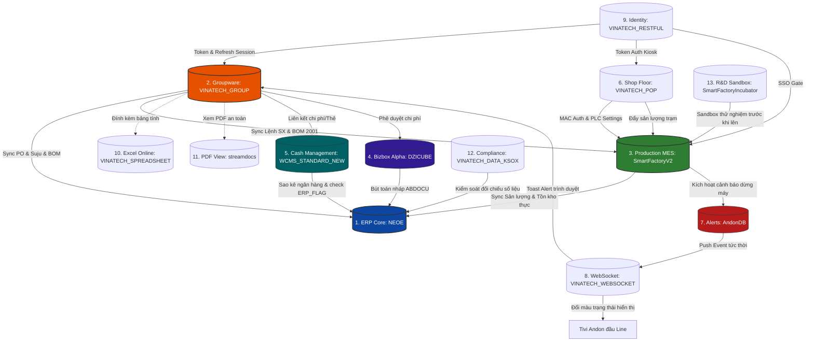

# 🗄️ BẢN ĐỒ CƠ SỞ DỮ LIỆU TOÀN HỆ THỐNG (VINATECH MASTER DATABASE ARCHITECTURE)

> **Mục đích:** Bản đồ 19 databases, 6,648 tables.
> **🔑 Keywords:** database, DB, bảng, table, ERD, SmartFactoryV2, SmartFramework, NEOE, VINATECH_GROUP, schema, linked server
>
> 📖 **Dành cho người mới:** Nếu bạn mới tiếp cận hệ thống lần đầu, hãy đọc **[Cẩm nang nhập môn hệ thống liên thông (KB_20)](../KB_10/KB_10_01_ARCHITECTURE.md)** trước để hiểu toàn cảnh và luồng vận hành của các phân hệ.
>
> *Quy tắc vận hành tối thượng: Chỉ thực hiện truy vấn đọc dữ liệu (`SELECT` kết hợp `WITH(NOLOCK)`). Tuyệt đối KHÔNG chạy các câu lệnh thay đổi dữ liệu (`INSERT`, `UPDATE`, `DELETE`, `DROP`) trên các database production.*

---

## 🗺️ 1. Sơ Đồ Kiến Trúc Liên Thông Cơ Sở Dữ Liệu (Database Integration Map)

Hệ thống vận hành của Vinatech được cấu thành từ 13 cơ sở dữ liệu nghiệp vụ chuyên biệt (tổng cộng 20 user DB trên instance, gồm thêm SmartFramework UI×3, backup×2, và WCMS legacy×1), liên kết chặt chẽ với nhau để tạo thành một hệ thống thông tin nhất quán từ văn phòng (Groupware) đến nhà xưởng (MES) và tài chính kế toán (ERP):

## 🔗 1.5 SQL Linked Servers — Cầu nối liên máy chủ (Verified 2026-06-18)

> Hệ thống sử dụng **6 Linked Servers** để giao tiếp chéo giữa các máy chủ SQL khác nhau:

| Linked Server | Data Source | Vai trò |
|---|---|---|
| `ERPSVR` | `110.11.27.7:2433` | **★ ERP Douzone Server** — Truy vấn trực tiếp `ERPSVR.NEOE.dbo.xxx` từ MES |
| `OLDNAISSVR` | `110.11.27.5` | Old NAIS MES server — Dữ liệu legacy |
| `110.11.27.5` | `110.11.27.5` | Direct link to OLD MES (SQLNCLI) |
| `110.11.27.5\MESTESTDB,8080` | Test DB instance | Test/Staging environment |
| `CMS_VINA_LINK` | `110.11.27.5\MESTESTDB,8080` | CMS Vietnam link (OLE DB) |
| `SVR-VINAT2` | `SVR-VINAT2` | VinaT2 server — Cross-factory sync |

> [!IMPORTANT]
> **Cách dùng trong SP:** `SELECT * FROM ERPSVR.NEOE.dbo.MA_USER` — Truy vấn ERP trực tiếp từ MES SP mà không cần ETL.

---

## 🗂️ 2. Vai Trò & Cấu Trúc Chi Tiết Của 13 Hệ Thống Cơ Sở Dữ Liệu

### 2.1. AndonDB — Giám Sát Cảnh Báo & Dừng Máy
*   **Vai trò nghiệp vụ:** Giám sát trạng thái hoạt động vật lý của các line sản xuất thời gian thực, phát hiện sự cố dừng máy (Line Downtime), tự động gửi thông báo (App/Email) tới tổ trưởng và đội bảo trì thiết bị để giảm thiểu tổn thất năng suất.
*   **Bảng nghiệp vụ cốt lõi:**
    *   `STB_LineSituation_VVT`: Ghi nhận tình huống lỗi đầu line.
        *   `linecode` (`varchar(20)`): Mã line xảy ra sự cố.
        *   `routecode` (`varchar(20)`): Mã công đoạn xảy ra sự cố (ví dụ: `V-23`, `B540`).
        *   `status` (`int`): `0` = Đang chạy bình thường, `1` = Sự cố dừng máy, `2` = Chờ (Idle).
        *   `statusApp` / `statusEmail` (`int`): Cờ kiểm soát gửi tin (`0` = Chưa gửi, `1` = Đã gửi thành công).
        *   `errorcode` / `errorname` (`nvarchar(1000)`): Mã lỗi và mô tả lỗi dừng máy.
    *   `STB_LineInfo`: Danh mục master các dây chuyền sản xuất.
        *   `LineCode` (`varchar(20)`): Mã dây chuyền định danh.
        *   `MonitoringGroup` (`nvarchar(50)`): Nhóm gom cụm các line để hiển thị chung trên một màn hình TV Andon giám sát.
    *   `STB_VVT_UserWarning`: Quản lý tài khoản nhận tin cảnh báo.
        *   `username` / `password` (`varchar(50)`): Tài khoản đăng nhập app nhận tin cảnh báo.
        *   `groupid` (`varchar(50)`): Phân nhóm nhận tin (ví dụ: `MAINTENANCE` - Kỹ thuật bảo trì).

---

### 2.2. DZICUBE — Douzone Bizbox Alpha Groupware & Accounting Core
*   **Vai trò nghiệp vụ:** Lưu trữ cấu hình hệ thống Groupware đóng gói Douzone Bizbox Alpha, quản lý định mức phê duyệt chi phí, tài sản cố định, tích hợp đối chiếu thẻ doanh nghiệp và chuyển chứng từ hạch toán kế toán nháp sang ERP.
*   **Bảng nghiệp vụ cốt lõi:**
    *   `ABDOCU` (Header chứng từ nháp) / `ABDOCU_D` (Line chứng từ nháp):
        *   `NO_DOCU` (`varchar(20)`): Số chứng từ kế toán nháp phát sinh từ phê duyệt Groupware.
        *   `CD_ACCT` (`varchar(10)`): Mã tài khoản kế toán định khoản (Nợ/Có).
        *   `AM_DR` / `AM_CR` (`numeric`): Số tiền phát sinh Nợ / Có.
        *   `CD_PARTNER` (`varchar(20)`): Mã nhà cung cấp/khách hàng liên quan.
        *   `CD_CC` (`varchar(10)`): Mã trung tâm chi phí chịu phí (Cost Center).
    *   `ABASSET`: Quản lý tài sản cố định.
        *   `CD_ASSET` (`varchar(20)`): Mã tài sản cố định.
        *   `AM_ACQ` (`numeric`): Nguyên giá mua tài sản.
        *   `CD_DEPT` (`varchar(10)`): Phòng ban chịu trách nhiệm quản lý tài sản.
    *   `A_TAXBILL`: Quản lý hóa đơn thuế VAT điện tử.
        *   `NO_TAX` (`varchar(30)`): Số hóa đơn thuế GTGT.
        *   `AM_SUPPLY` / `AM_VAT` (`numeric`): Tiền hàng trước thuế / Tiền thuế GTGT.

---

### 2.3. erpdb — Cơ Sở Dữ Liệu ERP Cũ (Legacy Archive)
*   **Vai trò nghiệp vụ:** Lưu trữ dữ liệu lịch sử của hệ thống ERP cũ (Douzone NeoPlus / Smart A) phục vụ cho kế toán đối chiếu số liệu các năm trước. Database ở trạng thái đóng băng (Read-only).
*   **Đặc điểm kỹ thuật đặc thù:**
    *   **Tên bảng bằng tiếng Hàn (Korean Collation):** Hệ thống sử dụng bộ font và mã hóa ký tự đặc thù Hàn Quốc. Các bảng chính được đặt tên trực tiếp bằng tiếng Hàn:
        *   `사원마스타` (Sawon Master): Danh mục Nhân sự cũ.
        *   `거래처마스타` (Georaecheo Master): Danh mục Đối tác cũ.
        *   `전표H` (Jeonpyo Header) / `전표D` (Jeonpyo Detail): Chứng từ kế toán cũ.
        *   `품목마스타` (Pummok Master): Danh mục Vật tư cũ.
    *   **Lưu ý:** Lập trình viên/AI không cần kết nối hoặc đồng bộ dữ liệu với database tĩnh này trong các tác vụ nghiệp vụ hiện tại.

---

### 2.4. NEOE — ERP Douzone iU (Central General Ledger)
*   **Vai trò nghiệp vụ:** Hệ thống hoạch định tài nguyên doanh nghiệp trung tâm (ERP), quản lý Ledger tài chính kế toán chính thức, Master dữ liệu vật tư/đối tác, quản lý đơn mua hàng (PO), đơn bán hàng (Suju), định mức BOM sản xuất và xuất nhập kho hạch toán.
*   **Bảng nghiệp vụ cốt lõi:**
    *   `MA_ITEM`: Master danh mục vật tư sản phẩm.
        *   `CD_ITEM` (`nvarchar(20)`): Mã vật tư duy nhất.
        *   `NM_ITEM` / `STND_ITEM` (`nvarchar(100)`): Tên và quy cách thông số vật tư.
    *   `MA_PARTNER`: Master danh mục khách hàng, nhà cung cấp.
        *   `CD_PARTNER` (`nvarchar(20)`): Mã đối tác.
        *   `NO_BIZ` (`nvarchar(20)`): Mã số thuế đối tác (bắt buộc).
    *   `PU_POH` (Header PO) / `PU_POL` (Line PO):
        *   `NO_PO` (`nvarchar(20)`): Số đơn đặt mua hàng.
        *   `QT_PO` / `UM` / `AM` (`numeric`): Số lượng, đơn giá và thành tiền nội tệ VND.
    *   `PU_RCVH` (Header nhập kho mua) / `PU_RCVL` (Line nhập kho mua):
        *   `NO_RCV` (`nvarchar(20)`): Số phiếu nhập kho mua hàng (kết quả của Receiving trên GW).
    *   `SA_SOH` (SO Header) / `SA_SOL` (SO Line):
        *   `NO_SO` (`nvarchar(20)`): Số đơn bán hàng từ khách hàng (Suju).
    *   `FI_DOCU` (Header bút toán) / `FI_DOCU_F` (Line bút toán — ⚠️ KB gốc ghi `FI_DOCU_D` nhưng bảng thực tế là `FI_DOCU_F`):
        *   `NO_DOCU` (`nvarchar(20)`): Mã chứng từ kế toán chính thức ghi sổ.
    *   `PR_BOM`: Định mức nguyên vật liệu sản xuất.
        *   `CD_BOM` / `CD_ITEM` / `CD_MATL` / `QT_BOM`: Liên kết cấu trúc lắp ráp.

---

### 2.5. SmartFactoryIncubator — Sandbox Thử Nghiệm R&D
*   **Vai trò nghiệp vụ:** Môi trường Sandbox cô lập hoàn toàn phục vụ đội R&D nghiên cứu sản phẩm mới (Tụ điện siêu hóa Supercapacitors), thử nghiệm thiết bị kiểm tra cell tự động và thử nghiệm cấu hình SCM/ASN trước khi triển khai lên hệ thống chính thức.
*   **Bảng nghiệp vụ cốt lõi:**
    *   `STB_CellTestResult`: Kết quả đo kiểm thông số cell.
        *   `ProdNo` (`varchar(50)`): Mã Lot/ControlNo của cell tụ được đo kiểm.
        *   `Voltage` / `Capacitance` / `ESR` / `LeakageCurrent` (`numeric`): Kết quả đo điện thế, điện dung (Farad), nội trở và dòng rò rỉ.
    *   `STB_CellTestResultRT`: Kết quả đo thời gian thực liên tục (Real-time telemetry).
    *   `RCV_ASN` (Nhận) / `OUT_ASN` (Xuất): Thử nghiệm khai báo trước thông tin giao hàng (Advanced Shipping Notice).
    *   `LUNAR_TO_SOLAR`: Bảng chuyển đổi lịch Âm - Dương phục vụ lập lịch nghỉ ca ngày lễ Tết cho nhà máy Việt Nam & Hàn Quốc.

---

### 2.6. streamdocs — Forcs PDF Document Web-Stream Server
*   **Vai trò nghiệp vụ:** Quản lý metadata và an ninh cho tệp PDF đính kèm biểu mẫu Groupware. Máy chủ StreamDocs chuyển đổi tệp PDF thành dữ liệu luồng để hiển thị trực tiếp trên Web Viewer của Groupware, ngăn ngừa hành vi tải file trực tiếp về máy cá nhân để bảo mật thông tin.
*   **Bảng nghiệp vụ cốt lõi:**
    *   `pdf_resource`: Lưu trữ định danh tệp PDF vật lý.
        *   `resource_id` (`varchar(50)`): Mã băm MD5 định danh duy nhất của tệp.
        *   `file_size` / `file_path` (`varchar`): Kích thước và đường dẫn vật lý trên máy chủ.
    *   `pdf_resource_owner`: Liên kết chủ sở hữu tệp.
        *   `document_save_code` (`varchar(50)`): Mã văn bản trên Groupware sở hữu tệp PDF này.
    *   `pdf_auth`: Quản lý khóa phiên truy cập tệp.
        *   `session_token` (`varchar(500)`): Token được cấp phép để render luồng dữ liệu PDF lên trình duyệt.
    *   `sd_document_usage_history`: Nhật ký xem tài liệu (Audit Trail).
        *   `user_id` / `client_ip` / `view_timestamp`: Ai, IP nào đã xem tài liệu vào lúc nào.

---

### 2.7. VINATECH_DATA_KSOX — ICFR Compliance & Internal Control
*   **Vai trò nghiệp vụ:** Quản lý quy trình tuân thủ kiểm soát nội bộ báo cáo tài chính (Internal Control over Financial Reporting - ICFR) theo tiêu chuẩn luật K-SOX (Hàn Quốc) dành cho công ty niêm yết.
*   **Bảng nghiệp vụ cốt lõi:**
    *   `ICM_CTRLMATRIX_MT` (Master ma trận kiểm soát) / `ICM_CTRLMATRIX_TERM` (Kỳ đánh giá):
        *   `CONTROL_UUID` (`varchar(50)`): ID duy nhất của chốt kiểm soát quy trình (ví dụ: Chốt kiểm soát PO cần 3 báo giá).
        *   `PROCESS_CODE` (`varchar(20)`): Mã quy trình nghiệp vụ (Mua hàng, bán hàng, kho, kế toán...).
    *   `ICM_CTRLMATRIX_TERM_DESIGNTEST`: Lưu kết quả kiểm thử thiết kế kiểm soát.
        *   `TEST_UUID` (`varchar(50)`): ID bản ghi kiểm thử.
        *   `SAMPLE_SIZE` (`int`): Số lượng mẫu chứng từ được kiểm toán rút ngẫu nhiên.
        *   `TEST_RESULT` (`nvarchar(20)`): Kết quả đánh giá (`PASS`/`FAIL`).
        *   `ATTACH_FILE_ID` (`varchar(50)`): Đường dẫn đính kèm bằng chứng kiểm toán (chụp màn hình chứng từ).
    *   `COM_APPROVAL_LINE` / `COM_APPROVAL_HIST`: Tuyến ký duyệt và nhật ký ký duyệt kết quả kiểm soát nội bộ của CEO/CFO.

---

### 2.8. VINATECH_GROUP — Groupware Core Portal & Electronic Approval
*   **Vai trò nghiệp vụ:** Cổng thông tin nội bộ (Groupware), quản lý sơ đồ tổ chức, tài khoản nhân viên, luồng phê duyệt văn bản điện tử (Electronic Approval) và lập kế hoạch sản xuất tháng/ngày đầu vào.
*   **Bảng nghiệp vụ cốt lõi:**
    *   `VINA_DOCUMENT_SAVE`: Header chung lưu trữ mọi biểu mẫu trình duyệt.
        *   `DOCUMENT_SAVE_CODE` (`varchar(50)`): Mã định danh duy nhất của tài liệu (Khóa ngoại chính liên kết tất cả các bảng form nghiệp vụ).
        *   `DOCUMENT_SAVE_STATE` (`varchar(50)`): Trạng thái phiếu duyệt (`DRAFT`, `APPROVING`, `APPROVED`, `REJECTED`).
        *   `DOCUMENT_SAVE_CONTENT` (`ntext`): Nội dung Rich-text HTML hiển thị trên web.
    *   `VINA_DOCUMENT_POH` (Header PO) / `VINA_DOCUMENT_POL` (Line PO): Biểu mẫu đơn mua hàng.
        *   `NO_PO` (`nvarchar(20)`): Số PO đồng bộ sang ERP sau khi duyệt.
        *   `DOCUMENT_POL_REMAIN_QT_PO` (`numeric`): Số lượng PO còn lại chưa nhập kho thực tế.
    *   `VINA_EMP`: Danh mục tài khoản người dùng.
        *   `NO_EMP` (`nvarchar(10)`): Mã nhân viên (khóa liên kết tài khoản).
        *   `EMP_STOP` (`char(1)`): Cờ khóa tài khoản/Nghỉ việc (`Y` = Đã nghỉ, `N` = Hoạt động).
    *   `VINA_ORG_CHART_NODE`: Cây sơ đồ tổ chức phòng ban.
        *   `ORG_CHART_NODE_TYPE` (`nvarchar(50)`): Loại nút (`DEPT` = Phòng ban, `EMP` = Nhân viên).
        *   `ORG_CHART_NODE_NAME` (`nvarchar(100)`): Tên hiển thị của phòng ban hoặc nhân viên.
    *   `VINA_WORKFLOW_RELATION`: Nhật ký phê duyệt thực tế của biểu mẫu.
        *   `NO_EMP_APPROVER` (`nvarchar(10)`): Mã nhân viên sếp ký duyệt.
        *   `APPROVAL_STATE` (`varchar(20)`): Kết quả duyệt bước (`APPROVED`, `REJECTED`, `PENDING`).
    *   `VINA_PROD_MONTH_PRODPLAN`: Kế hoạch sản xuất tháng.
        *   `BOM_VERSION` (`nvarchar(10)`): Phiên bản BOM chạy (bắt buộc cấu hình = `2001` cho nhà máy VN).

---

### 2.9. VINATECH_POP — Point Of Production Terminal Gateway
*   **Vai trò nghiệp vụ:** Cơ sở dữ liệu kiosk đầu cuối tại xưởng, quản lý cấu hình card mạng MAC xác thực trạm, cấu hình file log PLC máy móc, định tuyến ép buộc quét vật tư phụ theo công đoạn và map thiết bị với lệnh ngày.
*   **Bảng nghiệp vụ cốt lõi:**
    *   `VINA_PC_MAC`: Ánh xạ MAC card mạng máy trạm xưởng.
        *   `PC_MAC_ADDRESS` (`varchar(50)`): Địa chỉ MAC vật lý của kiosk.
        *   `EQUIPMENT_SETTING_IDS` (`varchar(1000)`): Danh sách mã máy được PC này điều khiển (cách nhau bằng dấu phẩy).
        *   `EQUIPMENT_SETTING_JSON` (`varchar(max)`): Cấu hình thiết bị chi tiết dạng JSON nạp trực tiếp vào ứng dụng POP Client.
    *   `VINA_EQUIPMENT_SETTING`: Thông số giao tiếp thu thập dữ liệu PLC.
        *   `EQUIPMENT_SETTING_FILENAME_DATA_PATTERN` (`varchar(200)`): Biểu thức Regex lọc file log PLC (ví dụ: `^OCV_.*\.log$`).
        *   `EQUIPMENT_SETTING_TEMPERATURE` / `_STEAM_TEMPERATURE` (`varchar(50)`): Ngưỡng giới hạn nhiệt độ cảnh báo.
    *   `VINA_BOM_INPUT_ROUTE`: Ràng buộc quét nguyên vật liệu đầu công đoạn.
        *   `MATERIAL_CODE` (`nvarchar(50)`): Mã thành phẩm chính.
        *   `SUB_MATERIAL_CODE` (`nvarchar(50)`): Mã vật tư phụ cần quét chặn lỗi.
        *   `INPUT_ROUTE_CODE` (`nvarchar(20)`): Công đoạn (Route) ép buộc công nhân phải quét mã vật tư phụ này.
    *   `VINA_EQUIPMENT_MAPPING`: Gán máy móc vật lý chạy cho Lệnh ngày.
        *   `DAY_PLAN_NO` (`nvarchar(50)`): Mã kế hoạch ngày từ MES.
        *   `MAPPING_STATUS` (`nvarchar(20)`): Trạng thái máy (`ACTIVE` = Đang chạy, `RELEASED` = Đã giải phóng).

---

### 2.10. VINATECH_RESTFUL — Single Sign-On (SSO) & RESTful API Gateway
*   **Vai trò nghiệp vụ:** Cổng xác thực tập trung một lần (SSO) cho toàn bộ hệ sinh thái phần mềm nội bộ Vinatech. Lưu trữ và kiểm tra hiệu lực Token của client, thống kê lượt truy cập và whitelist IP.
*   **Bảng nghiệp vụ cốt lõi:**
    *   `VINA_SSO_TOKEN`: Quản lý Access Token hoạt động.
        *   `SSO_TOKEN_CODE` (`varchar(400)`): Chuỗi JWT Access Token gửi kèm header các request.
        *   `ID_USER` / `CD_COMPANY` (`nvarchar`): Tài khoản và công ty được cấp phiên làm việc.
        *   `SSO_TOKEN_CLIENT_IP` (`nvarchar(50)`): Địa chỉ IP máy trạm gửi request.
    *   `VINA_SSO_LOGIN`: Thống kê tần suất đăng nhập hàng ngày.
        *   `SSO_LOGIN_COUNT` (`int`): Số lần đăng nhập trong ngày của tài khoản.
        *   `SSO_LOGIN_REG_DATE` (`datetime`): Thời điểm đăng nhập lần đầu trong ngày.
    *   `VINA_ALLOWED_IP`: Whitelist IP máy chủ được gọi dịch vụ RESTful API bảo mật.

---

### 2.11. VINATECH_SPREADSHEET — Web Collaborative Spreadsheet
*   **Vai trò nghiệp vụ:** Cơ sở dữ liệu bảng tính Excel trực tuyến tích hợp trong Groupware, phục vụ cộng tác thời gian thực. Lưu dữ liệu dưới dạng JSON cấu trúc lớn để tối ưu tài nguyên lưu trữ và hiển thị.
*   **Bảng nghiệp vụ cốt lõi:**
    *   `VINA_SPREAD_SHEET`: Metadata bảng tính.
        *   `SPREAD_SHEET_CHANNEL` (`varchar(500)`): ID/Kênh định danh duy nhất của bảng tính.
        *   `SPREAD_SHEET_FILE_NAME` (`nvarchar(500)`): Tên file hiển thị (ví dụ: `Ke_hoach_tuan_BG.xlsx`).
    *   `VINA_SPREAD_SHEET_JSON`: Nội dung ô dữ liệu vật lý.
        *   `SPREAD_SHEET_JSON` (`nvarchar(max)`): Toàn bộ cấu trúc ô, giá trị, công thức, màu sắc định dạng được lưu trữ dưới dạng một chuỗi văn bản JSON khổng lồ.
    *   `VINA_SPREAD_SHEET_PERMISSIONS`: Phân quyền thao tác chi tiết.
        *   `SPREAD_SHEET_PERMISSIONS_READ` / `_WRITE` / `_APPROVAL` / `_EXPORT` (`char(1)`): Cờ phân quyền Đọc, Ghi, Phê duyệt, và Xuất file Excel (`Y`/`N`).
    *   `VINA_SPREAD_SHEET_OPEN`: Khóa Concurrency chống ghi đè dữ liệu.
        *   `NO_EMP` / `CD_COMPANY` / `SPREAD_SHEET_OPEN_REG_DATE`: Ai đang mở chỉnh sửa bảng tính lúc nào để hệ thống khóa quyền ghi của người thứ hai.

---

### 2.12. VINATECH_WEBSOCKET — WebSocket Real-time Alert Router
*   **Vai trò nghiệp vụ:** Cấu hình cổng kết nối và các module dịch vụ truyền thông thời gian thực song song TCP, phục vụ đẩy thông báo Toast báo động hoặc Andon tức thời xuống nhà xưởng.
*   **Bảng nghiệp vụ cốt lõi:**
    *   `VINA_MODULE`: Khai báo các module WebSocket dịch vụ hoạt động.
        *   `MODULE_CODE` (ví dụ: `WS_ANDON` cho Tivi Andon, `WS_NOTICE` cho thông báo đẩy Groupware).
    *   `VINA_STATIC_DATA`: Lưu cấu hình tham số mạng của WebSocket Server.
        *   `CODE` / `VALUE` (ví dụ: `WS_PORT` = `8085`, `HEARTBEAT_TIMEOUT` = `30`).

---

### 2.13. WCMS_STANDARD_NEW — Cash Management System (CMS)
*   **Vai trò nghiệp vụ:** Tự động hóa kết nối tài chính với các ngân hàng liên kết, cào sao kê số dư giao dịch thời gian thực và tự động tạo bút toán nợ/có đồng bộ sang ERP `NEOE`.
*   **Bảng nghiệp vụ cốt lõi:**
    *   `WCMS_ACCOUNT_TRNX_LOG`: Lịch sử sao kê chi tiết tiền vào/ra từ ngân hàng.
        *   `ACCOUNT_TRNX_LOG_UUID` (`nvarchar(40)`): ID duy nhất của bản ghi sao kê.
        *   `ACCOUNT_NO` (`nvarchar(100)`): Số tài khoản ngân hàng phát sinh giao dịch.
        *   `IN_AMOUNT` / `OUT_AMOUNT` (`numeric`): Số tiền ghi Có (vào) / Số tiền ghi Nợ (ra).
        *   `BALANCE` (`numeric`): Số dư tài khoản sau giao dịch.
        *   `ERP_FLAG` (`nchar(1)`): Cờ đồng bộ sang ERP (`Y` = Đã đồng bộ, `N` = Chưa đồng bộ).
        *   `ERP_TX_MSG` (`nvarchar(200)`): Kết quả đồng bộ hoặc thông báo lỗi từ ERP.
    *   `WCMS_CARD`: Danh mục quản lý thẻ tín dụng doanh nghiệp cấp cho nhân sự.
        *   `CARD_NO` (`nvarchar(100)`): Số thẻ (được mã hóa/che ký tự).
        *   `USER_UUID` (`nvarchar(40)`): Nhân viên được giao sử dụng thẻ.
        *   `ERP_CODE` (`nvarchar(20)`): Mã thẻ tương ứng khai báo trong ERP.
    *   `WCMS_BIZ_PARTNER_ACCOUNT`: Tài khoản ngân hàng thụ hưởng của nhà cung cấp phục vụ chuyển khoản Firm Banking tự động.
        *   `BIZ_PARTNER_UUID` (`nvarchar(40)`): Mã liên kết đối tác (Vendor Code trên ERP).
        *   `ACCOUNT_NO` / `OWNER_NAME` (`nvarchar`): Số tài khoản và tên chủ tài khoản thụ hưởng.

---

## 🔗 3. Các Luồng Nghiệp Vụ Liên Thông Nghiệp Vụ Cốt Lõi (Multi-DB Workflows)
