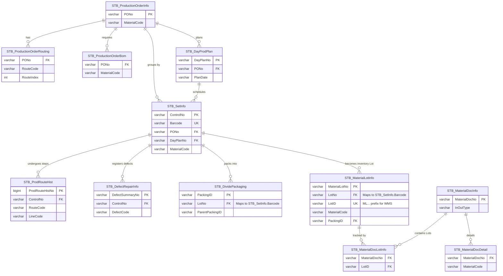



> **Mục đích:** Bảng tra cứu siêu tốc các cột (columns) quan trọng trong các bảng cốt lõi. Giúp AI không phải chạy `sp_help` hay dò dẫm tên cột, tiết kiệm 50% thời gian viết câu `SELECT`.

### 🧬 Sơ Đồ Quan Hệ Thực Thể Cốt Lõi (Entity Relationship Diagram - ERD)

Dưới đây là sơ đồ Mermaid ERD thể hiện sự liên kết khóa ngoại thực tế giữa các bảng nghiệp vụ chính trong cơ sở dữ liệu `SmartFactoryV2`:

---

### 1. STB_MaterialLotInfo (Kho & Tồn Kho)
- `LotID`: Mã vạch chính của NVL (prefix `ML...`).
- `LotNo`: Mã Lot thành phẩm (dùng khi join với STB_SetInfo.Barcode).
- `MaterialLotNo`: PK của bảng (dùng trong WHERE khi UPDATE).
- `MaterialCode`: Mã NVL.
- `MaterialWarehouseCode`: Mã kho hiện tại (VD: `ROH_VN_WH`, `ROH_HN_WH`). ⚠️ KHÔNG PHẢI `WarehouseCode`.
- `MaterialLocationCode`: Vị trí trong kho.
- `CurrentQty` / `InitialQty`: Số lượng hiện tại / ban đầu. ⚠️ KHÔNG PHẢI `InitQty`.
- `PackingID`: Mã thùng đã gộp vào (NULL = chưa gộp).
- `CreateDateTime`: Ngày tạo Lot (Quan trọng để check FIFO).
- `LotAttr09`: Thường lưu Location thủ công (do user nhập).
- `VendorLotNo`: Mã Lot do nhà cung cấp in. ⚠️ KHÔNG PHẢI `VendorLot`.

### 2. STB_ProdRouteHist (Lịch Sử Sản Xuất)
- `ProdRouteHistNo`: PK của bảng.
- `ControlNo`: Mã Barcode/Lot đang chạy chuyền (join với STB_SetInfo.ControlNo).
- `RouteCode`: Mã công đoạn (VD: `V-22_BG`, `V-23`, `VE-22`).
- `LineCode`: Mã Line sản xuất.
- `MachineCode`: Mã máy chạy. ⚠️ KHÔNG PHẢI `EquipmentCode`.
- `WorkerCode`: Mã nhân viên. ⚠️ KHÔNG PHẢI `WorkerID`.
- `JobDate`: Ngày thực hiện (kiểu DATE, format YYYY-MM-DD).
- `ProdDateTime`: Timestamp đầy đủ khi quét công đoạn.
- `ProdQty`: Số lượng sản xuất tại công đoạn. ⚠️ KHÔNG PHẢI `GoodQty`.
- `PONo`, `DayPlanNo`, `MaterialCode`, `BomVersion`, `ShiftCode`.

⚠️ Các cột KHÔNG TỒN TẠI trong bảng này: `LotID`, `RoutePrefix`, `EquipmentCode`, `WorkerID`, `GoodQty`, `DefectQty`.

### 3. STB_SetInfo (Thông Tin Gốc Của Barcode)
- `ControlNo`: PK. Mã nội bộ duy nhất cho mỗi Barcode (join với STB_ProdRouteHist).
- `Barcode`: Mã tem in ra thực tế (VD: `VVPO273R010713`).
- `MaterialCode`: Mã thành phẩm/bán thành phẩm.
- `PONo`: Mã lệnh sản xuất. ⚠️ KHÔNG PHẢI `WorkOrderNo`.
- `DayPlanNo`: Mã kế hoạch ngày.
- `InputLineCode`: Line sản xuất.
- `ProdQty`: Số lượng sản xuất.
- `InputJobDate`: Ngày bắt đầu sản xuất.
- `LotDecisionResult`: Kết quả QC (`PASS`/`FAIL`/NULL).
- `IsDefect` (bit), `DefectQty` (int): Có hàng lỗi không.
- `IsProdFinish` (bit): Đã hoàn thành sản xuất chưa.

### 4. STB_MaterialDocLotInfo & STB_MaterialDocDetail (Lịch Sử Nhập/Xuất)
- `MaterialDocNo`: Mã phiếu nhập/xuất kho.
- `LotID`: Mã Lot tham gia.
- `StockQty`: Số lượng tồn kho của Lot (trong STB_MaterialDocLotInfo). ⚠️ KHÔNG PHẢI `Qty`.
- `RequestQty` / `PickingQty`: Số lượng yêu cầu / thực xuất (trong STB_MaterialDocDetail).
- `InOutType`: Loại nhập (In) hoặc xuất (Out).

### 5. STB_ProcedureLog (Nhật Ký Chạy Stored Procedure)
- `Idx`: ID tự tăng của dòng log (bigint). ⚠️ KHÔNG PHẢI `LogNo`.
- `ProcedureName`: Tên Stored Procedure thực thi.
- `VariableName`: Tên biến được ghi nhận (ví dụ: `@ProdRouteHistNo`, `@Barcode`).
- `VariableValue`: Giá trị thực tế của biến đó khi chạy.
- `CreateDateTime`: Thời gian chạy và ghi log.

### 6. STB_VVT_StagePrices (Bảng Giá Công Đoạn)
- `model`: Mã model sản phẩm.
- `WorkCenterCode`: Phân biệt nhà máy (`VVT_F1`, `VVT_F2`, `VVT_F3`, `VVT_F4`).
- `RouteV22` -> `RouteV34`: Mã công đoạn (V22..V34).
- `PriceV22` -> `PriceV34`: Đơn giá tương ứng.
- `RouteVE01` -> `RouteVE10`: Công đoạn Hà Nam (VE).
- `PriceVE01` -> `PriceVE10`: Đơn giá tương ứng Hà Nam.

### 7. STB_SlittingLocationConfig_VVT (Cấu hình Slitting)
- `PartNo`: Mã model rút gọn (VD: `1025`).
- `SlittingCode`: `BY` (Cực dương) hoặc `YP` (Cực âm).
- `SlittingSize`: Kích thước (VD: `200`).
- `Width`: Chiều rộng cắt (Width).
- `WarehouseLocation`: Vị trí kho (VD: `VVT_F2`).
- `PositiveLocation` / `NegativeLocation`: Vị trí khay đựng cụ thể.

*(Bất kỳ khi nào viết Query, hãy ưu tiên sử dụng các tên cột chuẩn này)*

> ⚠️ **Verified against DB: 2026-06-14** — Tất cả tên cột đã được kiểm chứng thực tế 100% bằng hệ thống.

---

### 🧬 Bản Đồ Quy Mô & Phân Loại Đối Tượng Hệ Thống (Bảng, SPs, Màn Hình)

Hệ thống NAIS MES tại Vinatech vận hành trên một kiến trúc CSDL SQL Server đồ sộ, được thiết kế theo mô hình **Đa Phân Hệ Tích Hợp Động (Dynamic Integrated Subsystems)**. Quy mô hệ thống bao gồm:
* **976 Bảng cơ sở dữ liệu (Database Tables)** chia thành bảng chuẩn (Standard SmartFactory) và các bảng tùy chỉnh riêng cho nhà máy Việt Nam (Vietnam Custom).
* **3,314 Stored Procedures (SPs)** đảm nhận toàn bộ logic tính toán, kiểm tra (validation) và điều hướng dữ liệu.
* **1,442 Màn hình (Screens)** được đăng ký động trong hệ thống thông qua giao diện SmartFramework.

#### 1. Phân Loại 976 Bảng Cơ Sở Dữ Liệu (Database Tables)

Toàn bộ 976 bảng trong database `SmartFactoryV2` được phân chia một cách hệ thống dựa trên tiền tố (Prefix) và phân hệ nghiệp vụ:

| Nhóm Prefix | Số Lượng Bảng | Chức Năng & Ý Nghĩa Nghiệp Vụ | Ví Dụ Điển Hình |
|:---|:---:|:---|:---|
| **`STB_`** | **721** | Bảng chuẩn của hệ thống SmartFactory (Hàn Quốc). Quản lý dữ liệu nền, WIP, WMS, thiết bị, và lịch sử công đoạn chuẩn. | `STB_SetInfo`, `STB_ProdRouteHist`, `STB_MaterialLotInfo`, `STB_ProductionOrderInfo` |
| **`STB_VN_`** | **117** | Các bảng tùy chỉnh riêng cho thị trường Việt Nam (Bắc Giang, Hà Nam). Lưu thông tin gộp module, xuất/nhập thành phẩm, ghi nhận phế phẩm thực tế cân scale. | `STB_VN_MASTERMODULES`, `STB_VN_DETAILMODULES`, `STB_VN_FINISHGOODS_forQCAudit`, `STB_VN_SCRAP_AFTERPRODUCTIONS` |
| **`STB_VVT_`** | **23** | Bảng tùy chỉnh nâng cao cho Vinatech Vina (điện cực, ESR, giá công đoạn, cảnh báo). | `STB_VVT_ESRDATA`, `STB_VVT_StagePrices`, `STB_VVT_SortingErrorData` |
| **`STB_ESM_` / `ESM_`** | **18** | Bảng tích hợp cầu nối với hệ thống ERP Douzone và Groupware (sync kế hoạch ngày, BOM, dữ liệu kế toán). | `ESM_DayProdPlan`, `ESM_ProdRouteHist` |
| **`VNTVN_`** | **11** | Bảng phân quyền, quản lý tài khoản người dùng Việt Nam. | `VNTVN_Users`, `VNTVN_UserRoles` |
| **`AspNet`** | **7** | Hệ thống bảng bảo mật Identity mặc định. | `AspNetUsers`, `AspNetRoles` |
| **`OUT_`** | **2** | Bảng giao tiếp Cargo, đồng bộ kết quả xuất kho thành phẩm ra cảng. | `OUT_ASN` (yêu cầu), `OUT_RSLT` (kết quả) |
| **`Other`** | **76** | Bảng tạm, bảng backup dữ liệu lịch sử hoặc trung gian. | `FinishGoodMESInstock_HN`, `stb_DetailAgaingHN` |

#### 2. Bản Đồ 3,314 Stored Procedures (Logic Engine)

Logic nghiệp vụ của hệ thống không nằm ở ứng dụng Client, mà được đóng gói toàn bộ trong các Stored Procedures tại database để tối ưu hóa hiệu năng giao dịch. Các SPs được phân loại như sau:

*   **Stored Procedures Truy Vấn (SELECT Queries) — 998 SPs:**
    *   Có tiền tố `usp_Get...` hoặc hậu tố `..._get`.
    *   Chỉ thực hiện các câu lệnh `SELECT` để đổ dữ liệu lên Grid hoặc Dashboard trên UI Client.
    *   Ví dụ: `usp_GetMaterialLotInfoForReturn`, `usp_WarehouseDelivery_get`.
*   **Stored Procedures Nghiệp Vụ/Giao Dịch (Action / IUD) — 676 SPs:**
    *   Có tiền tố `usp_Do...` hoặc hậu tố `..._iud`.
    *   Thực hiện chèn (`INSERT`), cập nhật (`UPDATE`), hoặc xóa (`DELETE`) dữ liệu trong các khối giao dịch (`BEGIN TRANSACTION ... COMMIT`).
    *   Ví dụ: `usp_DoApplyStocktakingToStock`, `usp_SalesOrder_iud`.
*   **Phân loại theo Phân Hệ Tùy Chỉnh Việt Nam (632 SPs):**
    *   `usp_VN_...` (370 SPs): Quản lý gộp module, xuất nhập thành phẩm Bắc Giang/Hà Nam, kiểm tra QC Audit, chấm công thực tế.
    *   `usp_Vietnam_...` (156 SPs): Quản lý cân trọng lượng, cấu hình Andon, in tem nhãn Foxconn/Schneider/Digi-Key.
    *   `usp_VVT_...` (105 SPs): Logic kiểm tra FIFO thành phẩm, kiểm tra HOLD kho, ghi nhận dữ liệu ESR.
    *   `usp_HN_...` (1 SP): SP chuyên dụng cho xuất nhập thành phẩm Hà Nam qua Excel (`usp_HN_FinishGood_ImportExcel_uid`).

#### 3. Bản Đồ Phân Hệ 1,442 Màn Hình (SmartFramework Screens)

Hệ thống NAIS MES có tổng cộng **1,442 màn hình** được khai báo trong hệ thống. Mã giao dịch màn hình (**TCode**) là định danh chính của màn hình, được phân nhóm nghiệp vụ theo chữ cái đầu tiên:

| Ký tự TCode | Số Màn Hình | Phân Hệ Nghiệp Vụ | Màn Hình Tiêu Biểu |
|:---:|:---:|:---|:---|
| **`B`** | **372** | **Production Management (Sản xuất):** Lịch trình, Work Orders, POs, công đoạn ráp Cell/Module, gộp Box, Andon, báo phế trên Line. | `B301` (PO Info), `B530` (Prod Route Input), `B523` (Vietnam Đóng gói), `B882` (Andon Report) |
| **`H`** | **160** | **Equipment & Maintenance (Bảo trì/Thiết bị):** Lịch bảo dưỡng máy, Spare Parts tồn kho, hiệu chuẩn dụng cụ đo. | `H301` (Spare Parts Basic Info) |
| **`C`** | **154** | **Quality Control (QC):** Thiết lập hạng mục kiểm tra, kết quả IQC, kiểm định PQC, duyệt xuất xưởng OQC/FOQC, OCV & Aging. | `C112` (AQL Basic Rules), `C522` (Aging ESR SD), `C530` (QC Audit) |
| **`F`** | **124** | **WMS & Inventory (Kho WMS):** Nhập kho NVL, di chuyển vị trí, FIFO validation, xuất kho sản xuất, kiểm kê kho vật lý. | `F330` (Goods Receipt), `F750` (Kiểm kê kho) |
| **`Z`** | **52** | **System Admin (Hệ thống):** Menu cấu hình, phân quyền vai trò, định nghĩa String Resource đa ngôn ngữ. | `Z110` (Screen Config), `Z220` (Role Screen Mapping) |
| **`A`** | **33** | **Master Data (Dữ liệu nền):** Khai báo Model, Mã vật tư, BOM, Khai báo Line/Route, thiết lập dải số lượng đóng gói. | `A410` (Model Basic Info), `A230` (Material Master), `A310` (BOM Info) |
| **`P`** | **30** | **HR & Attendance (Nhân sự & Chấm công):** Quản lý ca kíp, chấm công công nhân. | `P111` (Attendance Time) |
| **`K`** | **27** | **Worker Assignments (Ca kíp sản xuất):** Theo dõi lịch sử phân line, bản đồ bố trí công nhân. | `K101` (Worker Assignment) |
| **Khác** | **138** | Các phân hệ chuyên biệt (Đồng bộ Douzone ERP, powerBI bridge, test lab). | `D000` (VinaEnesol Factory Menu) |

#### 4. Kiến Trúc Màn Hình Động (Dynamic UI Registry) của SmartFramework

Lý do hệ thống NAIS MES có thể vận hành hơn 1,400 màn hình một cách nhẹ nhàng trên một phần mềm Client duy nhất là nhờ kiến trúc **Dynamic UI Registry** nằm trong database `SmartFramework`. 

Mỗi khi một màn hình được mở:
1. **Truy vấn Đăng Ký Màn Hình (`STB_ScreenInfo`):** Client gửi `TCode` (ví dụ: `B530`) để lấy thông tin khai báo (`Name` - tên Class thực thi, `ParentName` - Thư mục menu, `Caption` - Tiêu đề đa ngôn ngữ).
2. **Tải Layout Giao Diện (`STB_ScreenLayoutInfo`):** Tải cấu trúc XML thiết kế lưới (Grid), các nút bấm (Buttons), và các ô nhập liệu (Textboxes) được cấu hình động cho màn hình đó.
3. **Binding Đối Tượng (`STB_ScreenObjects`):** Ánh xạ các trường dữ liệu trên màn hình với các cột của bảng CSDL hoặc tham số của Stored Procedure tương ứng.
4. **Hiển thị & Thực thi:** Client tự động sinh (render) giao diện người dùng dựa trên metadata tải về, giải thích lý do tại sao thay đổi cấu trúc lưới hay thêm cột kiểm tra chỉ cần cập nhật ở database (ví dụ qua bảng `STB_ScreenLayoutInfo`) mà không cần compile/redeploy lại app Client.

---

## Appendix — Verified DB Inventory (DB Verified 2026-06-18)

> **Tổng: 19 user databases** trên SQL Server instance — **6,648 tables**

### Complete DB Table Count

| # | Database | Tables | Mô tả | Trạng thái |
|---|---|---|---|---|
| 1 | **SmartFactoryV2** | **994** | **★ Production MES** — Core SX | 🟢 Active |
| 2 | **NEOE** | 4,876 | ERP Douzone — Master Data | 🟢 Active |
| 3 | **DZICUBE** | **3,383** | **★ Bizbox Alpha** — Groupware accounting | 🟢 Active |
| 4 | **erpdb** | 884 | ERP Legacy — Read-only archive | 🟡 Frozen |
| 5 | **VINATECH_GROUP** | **382** | Groupware — Doc approvals | 🟢 Active |
| 6 | **WCMS_STANDARD_NEW** | 360 | Cash Management | 🟢 Active |
| 7 | **VINATECH_DATA_KSOX** | 190+ | K-SOX Compliance | 🟢 Active |
| 8 | **SmartFramework** | 61 | UI Framework — Screens/Perms | 🟢 Active |
| 9 | **SmartFactoryIncubator** | 50 | R&D Sandbox | 🟡 Dev |
| 10 | **VINATECH_POP** | 42 | Shop Floor Terminal (POP) | 🟢 Active |
| 11 | **streamdocs** | 16 | PDF Viewer | 🟢 Active |
| 12 | **VINATECH_SPREADSHEET** | 15 | Excel Online | 🟢 Active |
| 13 | **VINATECH_RESTFUL** | ~10 | SSO/Token Auth | 🟢 Active |
| 14 | **VINATECH_WEBSOCKET** | ~5 | WebSocket/Menu push | 🟢 Active |
| 15 | **AndonDB** | 3 | Andon Alerts | 🟢 Active |
| 16 | **SmartFramework_File** | — | File storage | 🟢 Active |
| 17 | **SmartFramework_Temp** | — | Temp workspace | 🟢 Active |
| 18 | **SmartFactoryV2_261807** | — | Backup snapshot | 🔵 Backup |
| 19 | **VINATECH_POP_240625** | — | POP backup | 🔵 Backup |

### AndonDB (3 tables — smallest operational DB)

| Table | Mô tả |
|---|---|
| `STB_LineInfo` | Config Line cho Andon display |
| `STB_LineSituation_VVT` | Trạng thái line real-time |
| `STB_VVT_UserWarning` | Cảnh báo user |

### VINATECH_SPREADSHEET (15 tables)

| Table chính | Mô tả |
|---|---|
| `VINA_SPREAD_SHEET` | Bảng tính chính |
| `VINA_SPREAD_SHEET_HISTORY` | Lịch sử sửa |
| `VINA_SPREAD_SHEET_JSON` | Dữ liệu JSON |
| `VINA_MENU` / `VINA_MODULE` | Menu + Module config |
| `VINA_MENU_PERMISSIONS` | Phân quyền menu |

---

*Cập nhật: 2026-06-18 — Bổ sung Appendix: Verified DB Inventory (19 DBs, 6,648 tables total) + AndonDB + Spreadsheet detail. DB verified.*
