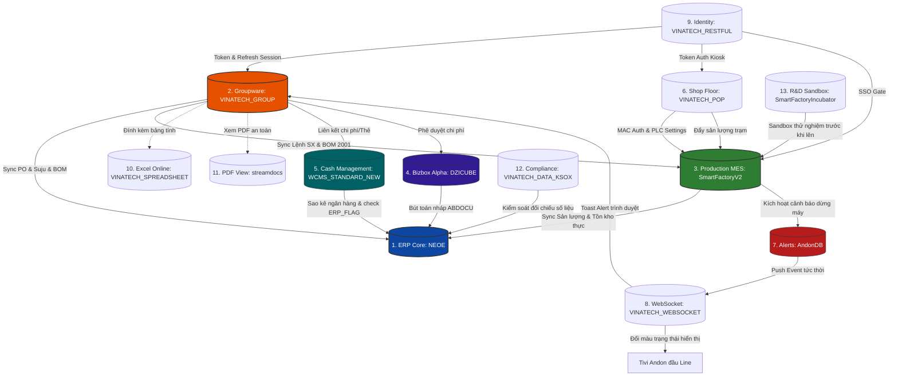

# 🗄️ BẢN ĐỒ CƠ SỞ DỮ LIỆU TOÀN HỆ THỐNG (VINATECH MASTER DATABASE ARCHITECTURE)

> **Mục đích:** Hướng dẫn toàn diện về kiến trúc và cấu trúc dữ liệu của 13 hệ thống cơ sở dữ liệu vận hành tại Vinatech Việt Nam. Tài liệu này đóng vai trò là cẩm nang kỹ thuật giúp kỹ sư hệ thống, lập trình viên và AI hiểu rõ vai trò, cấu trúc bảng cốt lõi, cơ chế liên thông nghiệp vụ liên hệ thống (Data Pipelines) và cách viết các truy vấn đối soát dữ liệu (Golden Audit Queries).
>
> *Quy tắc vận hành tối thượng: Chỉ thực hiện truy vấn đọc dữ liệu (`SELECT` kết hợp `WITH(NOLOCK)`). Tuyệt đối KHÔNG chạy các câu lệnh thay đổi dữ liệu (`INSERT`, `UPDATE`, `DELETE`, `DROP`) trên các database production.*

---

## 🗺️ 1. Sơ Đồ Kiến Trúc Liên Thông Cơ Sở Dữ Liệu (Database Integration Map)

Hệ thống vận hành của Vinatech được cấu thành từ 13 cơ sở dữ liệu chuyên biệt, liên kết chặt chẽ với nhau để tạo thành một hệ thống thông tin nhất quán từ văn phòng (Groupware) đến nhà xưởng (MES) và tài chính kế toán (ERP):



---

## 🗂️ 2. Vai Trò & Cấu Trúc Chi Tiết Của 13 Hệ Thống Cơ Sở Dữ Liệu

### 2.1. AndonDB — Giám Sát Cảnh Báo & Dừng Máy
*   **Vai trò nghiệp vụ:** Giám sát trạng thái hoạt động vật lý của các line sản xuất thời gian thực, phát hiện sự cố dừng máy (Line Downtime), tự động gửi thông báo (App/Email) tới tổ trưởng và đội bảo trì thiết bị để giảm thiểu tổn thất năng suất.
*   **Bảng nghiệp vụ cốt lõi:**
    *   `STB_LineSituation_VVT`: Ghi nhận tình huống lỗi đầu line.
        *   `linecode` (`varchar(20)`): Mã line xảy ra sự cố.
        *   `routecode` (`varchar(20)`): Mã công đoạn xảy ra sự cố (ví dụ: `V-23`, `B540`).
        *   `status` (`int`): `0` = Đang chạy bình thường, `1` = Sự cố dừng máy, `2` = Chờ (Idle).
        *   `statusApp` / `statusEmail` (`int`): Cờ kiểm soát gửi tin (`0` = Chưa gửi, `1` = Đã gửi thành công).
        *   `errorcode` / `errorname` (`nvarchar(1000)`): Mã lỗi và mô tả lỗi dừng máy.
    *   `STB_LineInfo`: Danh mục master các dây chuyền sản xuất.
        *   `LineCode` (`varchar(20)`): Mã dây chuyền định danh.
        *   `MonitoringGroup` (`nvarchar(50)`): Nhóm gom cụm các line để hiển thị chung trên một màn hình TV Andon giám sát.
    *   `STB_VVT_UserWarning`: Quản lý tài khoản nhận tin cảnh báo.
        *   `username` / `password` (`varchar(50)`): Tài khoản đăng nhập app nhận tin cảnh báo.
        *   `groupid` (`varchar(50)`): Phân nhóm nhận tin (ví dụ: `MAINTENANCE` - Kỹ thuật bảo trì).

---

### 2.2. DZICUBE — Douzone Bizbox Alpha Groupware & Accounting Core
*   **Vai trò nghiệp vụ:** Lưu trữ cấu hình hệ thống Groupware đóng gói Douzone Bizbox Alpha, quản lý định mức phê duyệt chi phí, tài sản cố định, tích hợp đối chiếu thẻ doanh nghiệp và chuyển chứng từ hạch toán kế toán nháp sang ERP.
*   **Bảng nghiệp vụ cốt lõi:**
    *   `ABDOCU` (Header chứng từ nháp) / `ABDOCU_D` (Line chứng từ nháp):
        *   `NO_DOCU` (`varchar(20)`): Số chứng từ kế toán nháp phát sinh từ phê duyệt Groupware.
        *   `CD_ACCT` (`varchar(10)`): Mã tài khoản kế toán định khoản (Nợ/Có).
        *   `AM_DR` / `AM_CR` (`numeric`): Số tiền phát sinh Nợ / Có.
        *   `CD_PARTNER` (`varchar(20)`): Mã nhà cung cấp/khách hàng liên quan.
        *   `CD_CC` (`varchar(10)`): Mã trung tâm chi phí chịu phí (Cost Center).
    *   `ABASSET`: Quản lý tài sản cố định.
        *   `CD_ASSET` (`varchar(20)`): Mã tài sản cố định.
        *   `AM_ACQ` (`numeric`): Nguyên giá mua tài sản.
        *   `CD_DEPT` (`varchar(10)`): Phòng ban chịu trách nhiệm quản lý tài sản.
    *   `A_TAXBILL`: Quản lý hóa đơn thuế VAT điện tử.
        *   `NO_TAX` (`varchar(30)`): Số hóa đơn thuế GTGT.
        *   `AM_SUPPLY` / `AM_VAT` (`numeric`): Tiền hàng trước thuế / Tiền thuế GTGT.

---

### 2.3. erpdb — Cơ Sở Dữ Liệu ERP Cũ (Legacy Archive)
*   **Vai trò nghiệp vụ:** Lưu trữ dữ liệu lịch sử của hệ thống ERP cũ (Douzone NeoPlus / Smart A) phục vụ cho kế toán đối chiếu số liệu các năm trước. Database ở trạng thái đóng băng (Read-only).
*   **Đặc điểm kỹ thuật đặc thù:**
    *   **Tên bảng bằng tiếng Hàn (Korean Collation):** Hệ thống sử dụng bộ font và mã hóa ký tự đặc thù Hàn Quốc. Các bảng chính được đặt tên trực tiếp bằng tiếng Hàn:
        *   `사원마스타` (Sawon Master): Danh mục Nhân sự cũ.
        *   `거래처마스타` (Georaecheo Master): Danh mục Đối tác cũ.
        *   `전표H` (Jeonpyo Header) / `전표D` (Jeonpyo Detail): Chứng từ kế toán cũ.
        *   `품목마스타` (Pummok Master): Danh mục Vật tư cũ.
    *   **Lưu ý:** Lập trình viên/AI không cần kết nối hoặc đồng bộ dữ liệu với database tĩnh này trong các tác vụ nghiệp vụ hiện tại.

---

### 2.4. NEOE — ERP Douzone iU (Central General Ledger)
*   **Vai trò nghiệp vụ:** Hệ thống hoạch định tài nguyên doanh nghiệp trung tâm (ERP), quản lý Ledger tài chính kế toán chính thức, Master dữ liệu vật tư/đối tác, quản lý đơn mua hàng (PO), đơn bán hàng (Suju), định mức BOM sản xuất và xuất nhập kho hạch toán.
*   **Bảng nghiệp vụ cốt lõi:**
    *   `MA_ITEM`: Master danh mục vật tư sản phẩm.
        *   `CD_ITEM` (`nvarchar(20)`): Mã vật tư duy nhất.
        *   `NM_ITEM` / `STND_ITEM` (`nvarchar(100)`): Tên và quy cách thông số vật tư.
    *   `MA_PARTNER`: Master danh mục khách hàng, nhà cung cấp.
        *   `CD_PARTNER` (`nvarchar(20)`): Mã đối tác.
        *   `NO_BIZ` (`nvarchar(20)`): Mã số thuế đối tác (bắt buộc).
    *   `PU_POH` (Header PO) / `PU_POL` (Line PO):
        *   `NO_PO` (`nvarchar(20)`): Số đơn đặt mua hàng.
        *   `QT_PO` / `UM` / `AM` (`numeric`): Số lượng, đơn giá và thành tiền nội tệ VND.
    *   `PU_RCVH` (Header nhập kho mua) / `PU_RCVL` (Line nhập kho mua):
        *   `NO_RCV` (`nvarchar(20)`): Số phiếu nhập kho mua hàng (kết quả của Receiving trên GW).
    *   `SA_SOH` (SO Header) / `SA_SOL` (SO Line):
        *   `NO_SO` (`nvarchar(20)`): Số đơn bán hàng từ khách hàng (Suju).
    *   `FI_DOCU` (Header bút toán) / `FI_DOCU_D` (Line bút toán):
        *   `NO_DOCU` (`nvarchar(20)`): Mã chứng từ kế toán chính thức ghi sổ.
    *   `PR_BOM`: Định mức nguyên vật liệu sản xuất.
        *   `CD_BOM` / `CD_ITEM` / `CD_MATL` / `QT_BOM`: Liên kết cấu trúc lắp ráp.

---

### 2.5. SmartFactoryIncubator — Sandbox Thử Nghiệm R&D
*   **Vai trò nghiệp vụ:** Môi trường Sandbox cô lập hoàn toàn phục vụ đội R&D nghiên cứu sản phẩm mới (Tụ điện siêu hóa Supercapacitors), thử nghiệm thiết bị kiểm tra cell tự động và thử nghiệm cấu hình SCM/ASN trước khi triển khai lên hệ thống chính thức.
*   **Bảng nghiệp vụ cốt lõi:**
    *   `STB_CellTestResult`: Kết quả đo kiểm thông số cell.
        *   `ProdNo` (`varchar(50)`): Mã Lot/ControlNo của cell tụ được đo kiểm.
        *   `Voltage` / `Capacitance` / `ESR` / `LeakageCurrent` (`numeric`): Kết quả đo điện thế, điện dung (Farad), nội trở và dòng rò rỉ.
    *   `STB_CellTestResultRT`: Kết quả đo thời gian thực liên tục (Real-time telemetry).
    *   `RCV_ASN` (Nhận) / `OUT_ASN` (Xuất): Thử nghiệm khai báo trước thông tin giao hàng (Advanced Shipping Notice).
    *   `LUNAR_TO_SOLAR`: Bảng chuyển đổi lịch Âm - Dương phục vụ lập lịch nghỉ ca ngày lễ Tết cho nhà máy Việt Nam & Hàn Quốc.

---

### 2.6. streamdocs — Forcs PDF Document Web-Stream Server
*   **Vai trò nghiệp vụ:** Quản lý metadata và an ninh cho tệp PDF đính kèm biểu mẫu Groupware. Máy chủ StreamDocs chuyển đổi tệp PDF thành dữ liệu luồng để hiển thị trực tiếp trên Web Viewer của Groupware, ngăn ngừa hành vi tải file trực tiếp về máy cá nhân để bảo mật thông tin.
*   **Bảng nghiệp vụ cốt lõi:**
    *   `pdf_resource`: Lưu trữ định danh tệp PDF vật lý.
        *   `resource_id` (`varchar(50)`): Mã băm MD5 định danh duy nhất của tệp.
        *   `file_size` / `file_path` (`varchar`): Kích thước và đường dẫn vật lý trên máy chủ.
    *   `pdf_resource_owner`: Liên kết chủ sở hữu tệp.
        *   `document_save_code` (`varchar(50)`): Mã văn bản trên Groupware sở hữu tệp PDF này.
    *   `pdf_auth`: Quản lý khóa phiên truy cập tệp.
        *   `session_token` (`varchar(500)`): Token được cấp phép để render luồng dữ liệu PDF lên trình duyệt.
    *   `sd_document_usage_history`: Nhật ký xem tài liệu (Audit Trail).
        *   `user_id` / `client_ip` / `view_timestamp`: Ai, IP nào đã xem tài liệu vào lúc nào.

---

### 2.7. VINATECH_DATA_KSOX — ICFR Compliance & Internal Control
*   **Vai trò nghiệp vụ:** Quản lý quy trình tuân thủ kiểm soát nội bộ báo cáo tài chính (Internal Control over Financial Reporting - ICFR) theo tiêu chuẩn luật K-SOX (Hàn Quốc) dành cho công ty niêm yết.
*   **Bảng nghiệp vụ cốt lõi:**
    *   `ICM_CTRLMATRIX_MT` (Master ma trận kiểm soát) / `ICM_CTRLMATRIX_TERM` (Kỳ đánh giá):
        *   `CONTROL_UUID` (`varchar(50)`): ID duy nhất của chốt kiểm soát quy trình (ví dụ: Chốt kiểm soát PO cần 3 báo giá).
        *   `PROCESS_CODE` (`varchar(20)`): Mã quy trình nghiệp vụ (Mua hàng, bán hàng, kho, kế toán...).
    *   `ICM_CTRLMATRIX_TERM_DESIGNTEST`: Lưu kết quả kiểm thử thiết kế kiểm soát.
        *   `TEST_UUID` (`varchar(50)`): ID bản ghi kiểm thử.
        *   `SAMPLE_SIZE` (`int`): Số lượng mẫu chứng từ được kiểm toán rút ngẫu nhiên.
        *   `TEST_RESULT` (`nvarchar(20)`): Kết quả đánh giá (`PASS`/`FAIL`).
        *   `ATTACH_FILE_ID` (`varchar(50)`): Đường dẫn đính kèm bằng chứng kiểm toán (chụp màn hình chứng từ).
    *   `COM_APPROVAL_LINE` / `COM_APPROVAL_HIST`: Tuyến ký duyệt và nhật ký ký duyệt kết quả kiểm soát nội bộ của CEO/CFO.

---

### 2.8. VINATECH_GROUP — Groupware Core Portal & Electronic Approval
*   **Vai trò nghiệp vụ:** Cổng thông tin nội bộ (Groupware), quản lý sơ đồ tổ chức, tài khoản nhân viên, luồng phê duyệt văn bản điện tử (Electronic Approval) và lập kế hoạch sản xuất tháng/ngày đầu vào.
*   **Bảng nghiệp vụ cốt lõi:**
    *   `VINA_DOCUMENT_SAVE`: Header chung lưu trữ mọi biểu mẫu trình duyệt.
        *   `DOCUMENT_SAVE_CODE` (`varchar(50)`): Mã định danh duy nhất của tài liệu (Khóa ngoại chính liên kết tất cả các bảng form nghiệp vụ).
        *   `DOCUMENT_SAVE_STATE` (`varchar(50)`): Trạng thái phiếu duyệt (`DRAFT`, `APPROVING`, `APPROVED`, `REJECTED`).
        *   `DOCUMENT_SAVE_CONTENT` (`ntext`): Nội dung Rich-text HTML hiển thị trên web.
    *   `VINA_DOCUMENT_POH` (Header PO) / `VINA_DOCUMENT_POL` (Line PO): Biểu mẫu đơn mua hàng.
        *   `NO_PO` (`nvarchar(20)`): Số PO đồng bộ sang ERP sau khi duyệt.
        *   `DOCUMENT_POL_REMAIN_QT_PO` (`numeric`): Số lượng PO còn lại chưa nhập kho thực tế.
    *   `VINA_EMP`: Danh mục tài khoản người dùng.
        *   `NO_EMP` (`nvarchar(10)`): Mã nhân viên (khóa liên kết tài khoản).
        *   `EMP_STOP` (`char(1)`): Cờ khóa tài khoản/Nghỉ việc (`Y` = Đã nghỉ, `N` = Hoạt động).
    *   `VINA_ORG_CHART_NODE`: Cây sơ đồ tổ chức phòng ban.
        *   `ORG_CHART_NODE_TYPE` (`nvarchar(50)`): Loại nút (`DEPT` = Phòng ban, `EMP` = Nhân viên).
        *   `ORG_CHART_NODE_NAME` (`nvarchar(100)`): Tên hiển thị của phòng ban hoặc nhân viên.
    *   `VINA_WORKFLOW_RELATION`: Nhật ký phê duyệt thực tế của biểu mẫu.
        *   `NO_EMP_APPROVER` (`nvarchar(10)`): Mã nhân viên sếp ký duyệt.
        *   `APPROVAL_STATE` (`varchar(20)`): Kết quả duyệt bước (`APPROVED`, `REJECTED`, `PENDING`).
    *   `VINA_PROD_MONTH_PRODPLAN`: Kế hoạch sản xuất tháng.
        *   `BOM_VERSION` (`nvarchar(10)`): Phiên bản BOM chạy (bắt buộc cấu hình = `2001` cho nhà máy VN).

---

### 2.9. VINATECH_POP — Point Of Production Terminal Gateway
*   **Vai trò nghiệp vụ:** Cơ sở dữ liệu kiosk đầu cuối tại xưởng, quản lý cấu hình card mạng MAC xác thực trạm, cấu hình file log PLC máy móc, định tuyến ép buộc quét vật tư phụ theo công đoạn và map thiết bị với lệnh ngày.
*   **Bảng nghiệp vụ cốt lõi:**
    *   `VINA_PC_MAC`: Ánh xạ MAC card mạng máy trạm xưởng.
        *   `PC_MAC_ADDRESS` (`varchar(50)`): Địa chỉ MAC vật lý của kiosk.
        *   `EQUIPMENT_SETTING_IDS` (`varchar(1000)`): Danh sách mã máy được PC này điều khiển (cách nhau bằng dấu phẩy).
        *   `EQUIPMENT_SETTING_JSON` (`varchar(max)`): Cấu hình thiết bị chi tiết dạng JSON nạp trực tiếp vào ứng dụng POP Client.
    *   `VINA_EQUIPMENT_SETTING`: Thông số giao tiếp thu thập dữ liệu PLC.
        *   `EQUIPMENT_SETTING_FILENAME_DATA_PATTERN` (`varchar(200)`): Biểu thức Regex lọc file log PLC (ví dụ: `^OCV_.*\.log$`).
        *   `EQUIPMENT_SETTING_TEMPERATURE` / `_STEAM_TEMPERATURE` (`varchar(50)`): Ngưỡng giới hạn nhiệt độ cảnh báo.
    *   `VINA_BOM_INPUT_ROUTE`: Ràng buộc quét nguyên vật liệu đầu công đoạn.
        *   `MATERIAL_CODE` (`nvarchar(50)`): Mã thành phẩm chính.
        *   `SUB_MATERIAL_CODE` (`nvarchar(50)`): Mã vật tư phụ cần quét chặn lỗi.
        *   `INPUT_ROUTE_CODE` (`nvarchar(20)`): Công đoạn (Route) ép buộc công nhân phải quét mã vật tư phụ này.
    *   `VINA_EQUIPMENT_MAPPING`: Gán máy móc vật lý chạy cho Lệnh ngày.
        *   `DAY_PLAN_NO` (`nvarchar(50)`): Mã kế hoạch ngày từ MES.
        *   `MAPPING_STATUS` (`nvarchar(20)`): Trạng thái máy (`ACTIVE` = Đang chạy, `RELEASED` = Đã giải phóng).

---

### 2.10. VINATECH_RESTFUL — Single Sign-On (SSO) & RESTful API Gateway
*   **Vai trò nghiệp vụ:** Cổng xác thực tập trung một lần (SSO) cho toàn bộ hệ sinh thái phần mềm nội bộ Vinatech. Lưu trữ và kiểm tra hiệu lực Token của client, thống kê lượt truy cập và whitelist IP.
*   **Bảng nghiệp vụ cốt lõi:**
    *   `VINA_SSO_TOKEN`: Quản lý Access Token hoạt động.
        *   `SSO_TOKEN_CODE` (`varchar(400)`): Chuỗi JWT Access Token gửi kèm header các request.
        *   `ID_USER` / `CD_COMPANY` (`nvarchar`): Tài khoản và công ty được cấp phiên làm việc.
        *   `SSO_TOKEN_CLIENT_IP` (`nvarchar(50)`): Địa chỉ IP máy trạm gửi request.
    *   `VINA_SSO_LOGIN`: Thống kê tần suất đăng nhập hàng ngày.
        *   `SSO_LOGIN_COUNT` (`int`): Số lần đăng nhập trong ngày của tài khoản.
        *   `SSO_LOGIN_REG_DATE` (`datetime`): Thời điểm đăng nhập lần đầu trong ngày.
    *   `VINA_ALLOWED_IP`: Whitelist IP máy chủ được gọi dịch vụ RESTful API bảo mật.

---

### 2.11. VINATECH_SPREADSHEET — Web Collaborative Spreadsheet
*   **Vai trò nghiệp vụ:** Cơ sở dữ liệu bảng tính Excel trực tuyến tích hợp trong Groupware, phục vụ cộng tác thời gian thực. Lưu dữ liệu dưới dạng JSON cấu trúc lớn để tối ưu tài nguyên lưu trữ và hiển thị.
*   **Bảng nghiệp vụ cốt lõi:**
    *   `VINA_SPREAD_SHEET`: Metadata bảng tính.
        *   `SPREAD_SHEET_CHANNEL` (`varchar(500)`): ID/Kênh định danh duy nhất của bảng tính.
        *   `SPREAD_SHEET_FILE_NAME` (`nvarchar(500)`): Tên file hiển thị (ví dụ: `Ke_hoach_tuan_BG.xlsx`).
    *   `VINA_SPREAD_SHEET_JSON`: Nội dung ô dữ liệu vật lý.
        *   `SPREAD_SHEET_JSON` (`nvarchar(max)`): Toàn bộ cấu trúc ô, giá trị, công thức, màu sắc định dạng được lưu trữ dưới dạng một chuỗi văn bản JSON khổng lồ.
    *   `VINA_SPREAD_SHEET_PERMISSIONS`: Phân quyền thao tác chi tiết.
        *   `SPREAD_SHEET_PERMISSIONS_READ` / `_WRITE` / `_APPROVAL` / `_EXPORT` (`char(1)`): Cờ phân quyền Đọc, Ghi, Phê duyệt, và Xuất file Excel (`Y`/`N`).
    *   `VINA_SPREAD_SHEET_OPEN`: Khóa Concurrency chống ghi đè dữ liệu.
        *   `NO_EMP` / `CD_COMPANY` / `SPREAD_SHEET_OPEN_REG_DATE`: Ai đang mở chỉnh sửa bảng tính lúc nào để hệ thống khóa quyền ghi của người thứ hai.

---

### 2.12. VINATECH_WEBSOCKET — WebSocket Real-time Alert Router
*   **Vai trò nghiệp vụ:** Cấu hình cổng kết nối và các module dịch vụ truyền thông thời gian thực song song TCP, phục vụ đẩy thông báo Toast báo động hoặc Andon tức thời xuống nhà xưởng.
*   **Bảng nghiệp vụ cốt lõi:**
    *   `VINA_MODULE`: Khai báo các module WebSocket dịch vụ hoạt động.
        *   `MODULE_CODE` (ví dụ: `WS_ANDON` cho Tivi Andon, `WS_NOTICE` cho thông báo đẩy Groupware).
    *   `VINA_STATIC_DATA`: Lưu cấu hình tham số mạng của WebSocket Server.
        *   `CODE` / `VALUE` (ví dụ: `WS_PORT` = `8085`, `HEARTBEAT_TIMEOUT` = `30`).

---

### 2.13. WCMS_STANDARD_NEW — Cash Management System (CMS)
*   **Vai trò nghiệp vụ:** Tự động hóa kết nối tài chính với các ngân hàng liên kết, cào sao kê số dư giao dịch thời gian thực và tự động tạo bút toán nợ/có đồng bộ sang ERP `NEOE`.
*   **Bảng nghiệp vụ cốt lõi:**
    *   `WCMS_ACCOUNT_TRNX_LOG`: Lịch sử sao kê chi tiết tiền vào/ra từ ngân hàng.
        *   `ACCOUNT_TRNX_LOG_UUID` (`nvarchar(40)`): ID duy nhất của bản ghi sao kê.
        *   `ACCOUNT_NO` (`nvarchar(100)`): Số tài khoản ngân hàng phát sinh giao dịch.
        *   `IN_AMOUNT` / `OUT_AMOUNT` (`numeric`): Số tiền ghi Có (vào) / Số tiền ghi Nợ (ra).
        *   `BALANCE` (`numeric`): Số dư tài khoản sau giao dịch.
        *   `ERP_FLAG` (`nchar(1)`): Cờ đồng bộ sang ERP (`Y` = Đã đồng bộ, `N` = Chưa đồng bộ).
        *   `ERP_TX_MSG` (`nvarchar(200)`): Kết quả đồng bộ hoặc thông báo lỗi từ ERP.
    *   `WCMS_CARD`: Danh mục quản lý thẻ tín dụng doanh nghiệp cấp cho nhân sự.
        *   `CARD_NO` (`nvarchar(100)`): Số thẻ (được mã hóa/che ký tự).
        *   `USER_UUID` (`nvarchar(40)`): Nhân viên được giao sử dụng thẻ.
        *   `ERP_CODE` (`nvarchar(20)`): Mã thẻ tương ứng khai báo trong ERP.
    *   `WCMS_BIZ_PARTNER_ACCOUNT`: Tài khoản ngân hàng thụ hưởng của nhà cung cấp phục vụ chuyển khoản Firm Banking tự động.
        *   `BIZ_PARTNER_UUID` (`nvarchar(40)`): Mã liên kết đối tác (Vendor Code trên ERP).
        *   `ACCOUNT_NO` / `OWNER_NAME` (`nvarchar`): Số tài khoản và tên chủ tài khoản thụ hưởng.

---

## 🔗 3. Các Luồng Nghiệp Vụ Liên Thông Nghiệp Vụ Cốt Lõi (Multi-DB Workflows)

Kiến thức cốt lõi về sự tương tác và tích hợp giữa các hệ thống (System Thinking) được thể hiện qua các luồng đi của dữ liệu liên phòng ban và liên hệ thống dưới đây:

### 3.1. Luồng Nghiệp Vụ Mua Sắm & Quyết Toán Thanh Toán (Procure-to-Pay Pipeline)

```
[Groupware: Tạo PO] ──► [ERP: Tạo PU_POH] ──► [Groupware: Tạo Arrival] 
                                                    │
[ERP: Nhập kho PU_RCVH] ◄── [Groupware: Duyệt Receiving] ◄── [MES: Kiểm QC F330/C220 PASS] 
          │
[Groupware: Tạo Đề nghị Thanh toán] ──► [ERP: Hạch toán công nợ FI_DOCU] ──► [CMS: Chi trả ngân hàng]
```

1.  **Khởi tạo đơn đặt hàng:** Nhân viên mua hàng tạo đơn đề xuất mua hàng trên Groupware. Sau khi ban giám đốc duyệt thông qua tuyến duyệt tĩnh (`VINA_WORKFLOW_STEP`), hệ thống đẩy dữ liệu sang ERP `NEOE` để tạo đơn mua hàng chính thức (`PU_POH`/`PU_POL`) và cấp mã đơn hàng `NO_PO`.
2.  **Xác nhận hàng về (Arrival):** Khi nhà cung cấp giao hàng đến cổng bảo vệ, nhân viên kho lập phiếu **Arrival Confirmation** trên Groupware (`VINA_DOCUMENT_RECEIVING_PHYSICAL_ITEM_H`). Luồng thông tin tự động ghi nhận vào MES `STB_MaterialDocInfo` để kích hoạt giao diện **MES F330**.
3.  **In tem nhãn & Kiểm QC:** Thủ kho Vinatech quét nhận hàng tại màn hình **MES F330**, in tem mã vạch chứa thông tin lô (`STB_MaterialLotInfo`). Đội ngũ QC tiến hành đo kiểm chất lượng tại **MES C220**. Kết quả ghi nhận vào `STB_CommInspDocHistory`.
4.  **Nhập kho chính thức (Receiving):** Nếu kết quả QC báo **PASS** (ký hiệu `'P'`), Groupware hiển thị danh sách các Lot hợp lệ để nhân viên lập phiếu **Receiving Confirmation** (`VINA_DOCUMENT_PU_RCVH`). Sau khi duyệt, hệ thống tự động cộng số dư tồn kho tại MES (`STB_MaterialLotInfo.CurrentQty`) và đẩy nghiệp vụ nhập kho chính thức sang ERP (`PU_RCVH`/`PU_RCVL`).
5.  **Quyết toán & Thanh toán:** Nhân viên kế toán lập **Purchase Resolution** trên Groupware (`VINA_DOCUMENT_PURCHAE_RESOLUTION`) đối chiếu với số lượng thực nhập và đơn giá thỏa thuận. Duyệt hoàn tất sẽ tự động định khoản tài khoản chi phí (`FI_DOCU`/`FI_DOCU_D`) trên ERP `NEOE`. Hệ thống Cash Management System (`WCMS_STANDARD_NEW`) truy xuất số dư tài khoản ngân hàng, tạo lệnh chuyển tiền Firm Banking trả tiền cho nhà cung cấp.

---

### 3.2. Luồng Nghiệp Vụ Chỉ Thị & Vận Hành Sản Xuất (Production Scheduling & Execution)

```
[Groupware: Month Plan] ──► [MES: Order B310] ──► [Groupware: Daily Plan & Lot Split] 
                                                               │
[MES: Quét chạy máy B530] ◄── [POP: Quét NVL phụ & Map máy] ◄── [MES: In nhãn Lot B450]
          │
[Andon: Ghi lỗi dừng máy] ──► [WebSocket Server] ──► [TV Andon hiển thị tức thời]
```

1.  **Duyệt Kế hoạch tháng:** Phòng Kế hoạch sản xuất lập kế hoạch tháng trên Groupware (`VINA_PROD_MONTH_PRODPLAN`), áp dụng BOM phiên bản Việt Nam **2001**. Khi trạng thái chuyển sang `'Sản xuất'`, dữ liệu tự động đồng bộ sang màn hình chỉ thị sản xuất **MES B310** (PO Info).
2.  **Lập Lệnh chạy ngày:** Groupware lập tiếp Kế hoạch ngày (`VINA_DOCUMENT_DAILY_PRODUCTION_ORDER`) phân bổ chi tiết số lượng sản xuất theo từng Line, Ca làm việc (`SHIFT_CODE`) và thực hiện chia Lot (`VINA_DOCUMENT_DAILY_PRODUCTION_ORDER_LOT`). Dữ liệu được đồng bộ xuống màn hình **MES B450** để in tem nhãn lô thành phẩm và chèn sẵn trạng thái hàng chờ chạy chuyền vào `STB_SetInfo` của MES.
3.  **Vận hành đầu line (Shop Floor POP):** Công nhân tại Line khởi động PC trạm Kiosk POP. Ứng dụng `VINATECH_POP` xác thực địa chỉ MAC card mạng (`VINA_PC_MAC`), tự động liên kết máy trạm với Line sản xuất tương ứng. Khi chạy máy:
    *   POP đối chiếu `VINA_BOM_INPUT_ROUTE` để yêu cầu công nhân phải quét mã vật tư phụ bắt buộc tại đầu công đoạn (tránh việc công nhân quên nạp vật tư phụ).
    *   POP gán mã máy vật lý đang hoạt động vào Kế hoạch ngày của MES thông qua `VINA_EQUIPMENT_MAPPING`.
4.  **Báo cáo dừng máy (Andon Alerting):** Nếu máy móc xảy ra sự cố đột ngột hoặc PLC trả tín hiệu quá nhiệt/dừng máy, sự kiện dừng máy được ghi ngay vào `AndonDB.dbo.STB_LineSituation_VVT` với cột `status` = `1`. WebSocket Server (`VINATECH_WEBSOCKET`) bắt sự kiện thay đổi dữ liệu này và phát tín hiệu TCP thời gian thực đẩy màu nền TV Andon đầu line sang đỏ rực, đồng thời bắn Toast Alert lên màn hình duyệt của quản đốc xưởng trên Groupware.

---

### 3.3. Luồng Nghiệp Vụ Bán Hàng & Xuất Hàng Container (Order-to-Cash Pipeline)

```
[Groupware: Duyệt Suju] ──► [ERP: Tạo SO SA_SOH] ──► [Groupware: Shipment Request]
                                                                │
[ERP: Giảm tồn hạch toán] ◄── [MES: Quét bốc cont B752] ◄── [MES: Xuét kho tạm FG01]
          │
[Groupware: Shipment Confirm] ──► [ERP: Ghi doanh thu] ──► [Cảng: ASN Cargo Sync]
```

1.  **Ký duyệt Suju:** Nhân viên kinh doanh đăng ký đơn hàng của khách hàng trên Groupware (`VINA_DOCUMENT_SALES_ORDER`). Khi được phê duyệt, hệ thống tự động đẩy dữ liệu sang ERP `NEOE` tạo đơn bán hàng SO (`SA_SOH`/`SA_SOL`) và sinh mã Suju `NO_SO`.
2.  **Yêu cầu xuất kho:** Khi đến hạn giao hàng, nhân viên lập phiếu duyệt **Shipment Request** trên Groupware (`VINA_DOCUMENT_DELIVER_OUT_CONFIRMATION_IV`). Luồng dữ liệu kích hoạt lệnh xuất kho trên hệ thống MES.
3.  **Hiện trường kho thành phẩm:** 
    *   Thủ kho quét mã các hộp hàng thành phẩm **Packing ID** trên thiết bị PDA chạy màn hình **MES FG01** để xuất kho tạm trung chuyển.
    *   Thực hiện gộp các Packing ID lên một Pallet và in tem Pallet lớn trên màn hình **MES B750** (`Pallet ID`).
    *   Khi xe Container cập bến, thủ kho chạy màn hình **MES B752** để quét bốc xếp các Pallet lên lòng xe Container, hệ thống tự động kiểm tra đối soát chéo số lượng quét thực tế có khớp với Shipment Request đã được duyệt trên Groupware hay không để ngăn chặn xuất thừa/thiếu hàng.
4.  **Xác nhận xuất hàng & Khai báo hải quan:** Sau khi Container rời cảng, nhân viên cập nhật Số tờ khai hải quan (`NO_CUSTOMS`) và số vận đơn (`NO_BL`) trên phiếu **Shipment Confirmation** của Groupware (`VINA_DOCUMENT_DELIVER_OUT_CONFIRMATION`). Duyệt hoàn tất sẽ tự động kích hoạt ERP hạch toán giảm tồn kho thành phẩm chính thức, ghi nhận doanh thu xuất khẩu (`SA_GIRH`/`SA_GIRL`) và đồng bộ kết quả ASN sang cổng thông tin Cargo của cảng.

---

## 🔍 4. Bộ Câu Hỏi SQL Tra Cứu & Đối Chiếu Siêu Cấp (Golden Audit Queries)

Dưới đây là 4 câu truy vấn SQL mẫu (SELECT-ONLY) chuyên dụng giúp Kỹ sư hệ thống và AI dễ dàng đối chiếu dữ liệu chéo giữa các hệ thống cơ sở dữ liệu để tìm ra nguồn gốc lỗi logic:

### Mẫu 4.1: Đối chiếu đơn mua hàng (PO) liên thông Groupware ↔ ERP ↔ MES
Giúp kiểm tra xem một đơn mua hàng đã được duyệt trên Groupware đã đồng bộ thành công sang ERP và có Lot nào đã được quét nhập kho ở MES chưa.
```sql
SELECT 
    GW_H.DOCUMENT_SAVE_CODE AS [GW Doc Code],
    GW_H.NO_PO AS [PO Number],
    GW_L.CD_ITEM AS [Item Code],
    GW_L.QT_PO AS [Qty Ordered (GW)],
    GW_L.DOCUMENT_POL_REMAIN_QT_PO AS [Qty Remaining (GW)],
    -- Đối chiếu thông tin ERP
    ERP_L.QT_PO AS [Qty Registered (ERP)],
    -- Đối chiếu số liệu nhập kho thực tế tại MES
    (SELECT SUM(ML.CurrentQty) 
     FROM SmartFactoryV2.dbo.STB_MaterialLotInfo ML WITH(NOLOCK) 
     WHERE ML.PurchaseOrderNo = GW_H.NO_PO AND ML.MaterialCode = GW_L.CD_ITEM) AS [Actual Qty in MES WH]
FROM VINATECH_GROUP.dbo.VINA_DOCUMENT_POH GW_H WITH(NOLOCK)
INNER JOIN VINATECH_GROUP.dbo.VINA_DOCUMENT_POL GW_L WITH(NOLOCK) 
    ON GW_H.DOCUMENT_SAVE_CODE = GW_L.DOCUMENT_SAVE_CODE
-- Join sang ERP NEOE
LEFT JOIN NEOE.dbo.PU_POL ERP_L WITH(NOLOCK) 
    ON GW_H.NO_PO = ERP_L.NO_PO AND GW_L.CD_ITEM = ERP_L.CD_ITEM
WHERE GW_H.NO_PO = 'PO20260612001' -- Thay bằng mã PO thực tế cần đối soát
   OR GW_H.DOCUMENT_SAVE_CODE = 'DOC-PO-99882';
```

### Mẫu 4.2: Đối soát dòng tiền ngân hàng và cờ đồng bộ ERP của Cash Management System
Kiểm tra danh sách sao kê ngân hàng có lượng tiền biến động lớn nhưng chưa đồng bộ được sang sổ cái ERP hoặc đồng bộ bị lỗi.
```sql
SELECT 
    LOG.ACCOUNT_NO AS [Bank Account],
    LOG.TRNX_DATE AS [Transaction Date],
    LOG.IN_AMOUNT AS [Amount In],
    LOG.OUT_AMOUNT AS [Amount Out],
    LOG.BOOK_DESC AS [Statement Description],
    LOG.ERP_FLAG AS [Sync State], -- 'Y' = Success, 'N' = Pending, 'E' = Error
    LOG.ERP_TX_DATE AS [Sync Date],
    LOG.ERP_TX_MSG AS [Error Message from ERP],
    -- Tra cứu xem đã tạo chứng từ kế toán nào trên ERP tương ứng chưa
    ERP.NO_DOCU AS [ERP Voucher No]
FROM WCMS_STANDARD_NEW.dbo.WCMS_ACCOUNT_TRNX_LOG LOG WITH(NOLOCK)
LEFT JOIN NEOE.dbo.FI_DOCU_D ERP WITH(NOLOCK) 
    ON LOG.ACCOUNT_TRNX_LOG_UUID = ERP.NO_IS -- Giả định UUID được gán vào cột NO_IS tham chiếu ERP
WHERE LOG.ERP_FLAG <> 'Y' -- Lọc các giao dịch chưa sync thành công
  AND (LOG.IN_AMOUNT > 100000000 OR LOG.OUT_AMOUNT > 100000000) -- Lọc giao dịch trên 100 triệu VND
ORDER BY LOG.TRNX_DATE DESC;
```

### Mẫu 4.3: Kiểm toán an ninh - Phát hiện Token SSO đang hoạt động của nhân viên đã thôi việc
Đối chiếu trạng thái tài khoản trên Groupware để phát hiện các Token SSO trong cache chưa bị thu hồi (revoke) của nhân viên đã ký đơn nghỉ việc.
```sql
SELECT 
    SSO.ID_USER AS [Active Username],
    SSO.SSO_TOKEN_CLIENT_IP AS [Client IP],
    SSO.SSO_TOKEN_DIVICE AS [Device],
    SSO.SSO_TOKEN_REG_DATE AS [Session Created Time],
    E.EMP_STOP AS [GW Status], -- 'Y' = Đã khóa tài khoản trên Groupware
    E.DT_ENTER_LEAVE AS [Resignation Date],
    -- Lấy tên nhân viên từ sơ đồ tổ chức
    O.ORG_CHART_NODE_NAME AS [Employee Name]
FROM VINATECH_RESTFUL.dbo.VINA_SSO_TOKEN SSO WITH(NOLOCK)
INNER JOIN VINATECH_GROUP.dbo.VINA_EMP E WITH(NOLOCK) 
    ON SSO.ID_USER = E.NO_EMP AND SSO.CD_COMPANY = E.CD_COMPANY
LEFT JOIN VINATECH_GROUP.dbo.VINA_ORG_CHART_NODE O WITH(NOLOCK) 
    ON E.NO_EMP = O.NO_EMP AND E.CD_COMPANY = O.CD_COMPANY
WHERE E.EMP_STOP = 'Y' -- Chỉ lọc những tài khoản đã bị khóa/nghỉ việc
   OR E.DT_ENTER_LEAVE <= CAST(GETDATE() AS DATE)
ORDER BY SSO.SSO_TOKEN_REG_DATE DESC;
```

### Mẫu 4.4: Đối soát hiệu suất Line - Kết hợp POP quét NVL, MES chạy máy và Andon cảnh báo lỗi
Hệ thống hóa lịch sử chạy máy của một Lot cụ thể: kiểm tra xem Lot đó được quét chạy máy ở Line nào, máy trạm nào, có bị lỗi dừng máy Andon nào phát sinh trong ca sản xuất đó hay không.
```sql
SELECT 
    SI.Barcode AS [Lot/Box No],
    SI.MaterialCode AS [Product Model],
    SI.InputLineCode AS [Line Code],
    -- Lịch sử quét chạy máy trên MES
    PRH.RouteCode AS [Operation Step],
    PRH.ProdDateTime AS [MES Scan Time],
    PRH.MachineCode AS [Machine Code],
    -- Tra cứu cấu hình máy trạm POP tương ứng qua MAC
    POP.PC_MAC_ADDRESS AS [POP Kiosk MAC],
    POP.PC_IPV4_ADDRESS AS [POP IP],
    -- Tra cứu xem có phát sinh dừng máy Andon tại Line này trong khoảng thời gian chạy Lot không
    (SELECT TOP 1 ANDON.errorname 
     FROM AndonDB.dbo.STB_LineSituation_VVT ANDON WITH(NOLOCK) 
     WHERE ANDON.linecode = SI.InputLineCode 
       AND ANDON.status = 1 -- Trạng thái dừng máy
       AND ANDON.createdatetime BETWEEN DATEADD(HOUR, -1, PRH.ProdDateTime) AND DATEADD(HOUR, 1, PRH.ProdDateTime)) AS [Coinciding Andon Error]
FROM SmartFactoryV2.dbo.STB_SetInfo SI WITH(NOLOCK)
INNER JOIN SmartFactoryV2.dbo.STB_ProdRouteHist PRH WITH(NOLOCK) 
    ON SI.ControlNo = PRH.ControlNo
LEFT JOIN VINATECH_POP.dbo.VINA_PC_MAC POP WITH(NOLOCK) 
    ON POP.EQUIPMENT_SETTING_IDS LIKE '%' + PRH.MachineCode + '%'
WHERE SI.Barcode = 'VVPO273R010713' -- Mã Lot cần đối soát lịch sử chạy chuyền
ORDER BY PRH.ProdDateTime ASC;
```

---

## 🧬 5. Tư Duy Hệ Thống & Phân Tầng Kiến Trúc (System Thinking & Architectural Layering)

Để vận hành hệ thống Vinatech ở mức tốt nhất, chúng ta cần tư duy về 13 cơ sở dữ liệu này dưới dạng các phân tầng kiến trúc logic thay vì các DB độc lập. Sự liên kết này được chia làm 5 tầng chức năng:

| Phân Tầng | Các Cơ Sở Dữ Liệu | Vai Trò Trong Chuỗi Giá Trị Vận Hành |
| :--- | :--- | :--- |
| **1. Lớp Giao Dịch Cốt Lõi (Core Transaction Layer)** | `NEOE` (ERP), `SmartFactoryV2` (MES), `VINATECH_GROUP` (Groupware) | Lưu dữ liệu gốc (Master Data), kế hoạch sản xuất chính, lệnh sản xuất và hạch toán kế toán tổng hợp. Đây là "xương sống" của Vinatech. |
| **2. Lớp Tích Hợp Văn Phòng & Cộng Tác (Office Collaboration Layer)** | `DZICUBE` (Bizbox Alpha), `streamdocs` (PDF Viewer), `VINATECH_SPREADSHEET` (Excel Online) | Hỗ trợ phê duyệt hành chính từ xa, đính kèm bảng tính cộng tác động và bảo mật hiển thị tài liệu thiết kế sản phẩm. |
| **3. Lớp IoT Nhà Xưởng & Thời Gian Thực (Shop Floor IoT Layer)** | `VINATECH_POP` (POP Kiosk), `AndonDB` (Alerts), `VINATECH_WEBSOCKET` (WS Server) | Kết nối máy móc vật lý (PLC), bắt sự kiện dừng máy đầu line và chuyển tiếp tín hiệu thời gian thực lên bảng giám sát. |
| **4. Lớp An Ninh & Tuân Thủ (Security & Compliance Layer)** | `WCMS_STANDARD_NEW` (CMS), `VINATECH_RESTFUL` (SSO), `VINATECH_DATA_KSOX` (K-SOX) | Bảo mật xác thực một lần, whitelist IP API Gateway, quản lý dòng tiền tự động với ngân hàng và kiểm toán chốt kiểm soát nội bộ. |
| **5. Lớp Thử Nghiệm & Lưu Trữ Lịch Sử (Dev & Archive Layer)** | `SmartFactoryIncubator` (R&D), `erpdb` (Legacy ERP) | Môi trường Sandbox thử nghiệm sản phẩm mới (R&D) và kho dữ liệu ERP cũ trước khi chuyển đổi hệ thống. |

---

## 🛠️ 6. Các Kịch Bản Lỗi Vận Hành Thực Tế & Cách Khắc Phục (Troubleshooting Scenarios)

Dưới đây là cẩm nang hướng dẫn xử lý các sự cố đồng bộ dữ liệu chéo giữa các cơ sở dữ liệu thường gặp trong thực tế vận hành:

### Kịch Bản 6.1: Cờ đồng bộ `ERP_FLAG` của sao kê ngân hàng bị kẹt trong `WCMS_STANDARD_NEW`
*   **Triệu chứng:** Sao kê ngân hàng đã cào về CMS thành công nhưng không đẩy được bút toán kế toán sang ERP `NEOE`. Cột `ERP_FLAG` trong bảng `WCMS_ACCOUNT_TRNX_LOG` ở trạng thái `'E'` (Error) hoặc giữ nguyên `'N'` (Pending) không chuyển sang `'Y'`.
*   **Nguyên nhân:** Lỗi kết nối API Gateway giữa CMS và ERP, hoặc mã đối tác/tài khoản kế toán định khoản bị trống/lỗi cấu trúc trên ERP.
*   **Phương án xử lý (SELECT-only & Hướng dẫn phục hồi):**
    1. *Tìm kiếm các giao dịch bị kẹt:*
       ```sql
       SELECT ACCOUNT_TRNX_LOG_UUID, ACCOUNT_NO, TRNX_DATE, IN_AMOUNT, OUT_AMOUNT, ERP_TX_MSG 
       FROM WCMS_STANDARD_NEW.dbo.WCMS_ACCOUNT_TRNX_LOG WITH(NOLOCK)
       WHERE ERP_FLAG IN ('N', 'E');
       ```
    2. *Hướng dẫn khắc phục:* Nếu lỗi do mã đối tác sai, cập nhật thông tin tài khoản đối tác trong `WCMS_BIZ_PARTNER_ACCOUNT` khớp với mã vendor ERP. Sau đó, DBA cần cập nhật cờ `ERP_FLAG = 'N'` và xóa log lỗi `ERP_TX_MSG = NULL` để Agent Job quét và đẩy lại chứng từ trong chu kỳ tiếp theo.

### Kịch Bản 6.2: Khóa Concurrency trong `VINATECH_SPREADSHEET` bị treo
*   **Triệu chứng:** Người dùng mở bảng tính cộng tác trên Groupware báo lỗi: *"Tài liệu đang được chỉnh sửa bởi người dùng khác"* mặc dù người dùng kia đã tắt trình duyệt từ lâu.
*   **Nguyên nhân:** Khi người dùng đóng tab trình duyệt đột ngột hoặc mất mạng, sự kiện ngắt kết nối WebSocket không kích hoạt được lệnh xóa bản ghi khóa phiên trong bảng `VINA_SPREAD_SHEET_OPEN`.
*   **Phương án xử lý (SELECT-only & Hướng dẫn phục hồi):**
    1. *Tra cứu phiên khóa đang bị treo:*
       ```sql
       SELECT SPREAD_SHEET_CHANNEL, NO_EMP, CD_COMPANY, SPREAD_SHEET_OPEN_REG_DATE 
       FROM VINATECH_SPREADSHEET.dbo.VINA_SPREAD_SHEET_OPEN WITH(NOLOCK)
       WHERE SPREAD_SHEET_CHANNEL = 'ID_BANG_TINH_BI_KHOA';
       ```
    2. *Hướng dẫn khắc phục:* Xác nhận với nhân viên có `NO_EMP` tương ứng xem họ có đang mở file thực tế không. Nếu không, DBA thực hiện lệnh `DELETE FROM VINATECH_SPREADSHEET.dbo.VINA_SPREAD_SHEET_OPEN WHERE SPREAD_SHEET_CHANNEL = 'ID_BANG_TINH_BI_KHOA' AND NO_EMP = 'MA_NHAN_VIEN'` để giải phóng khóa ghi lập tức.

### Kịch Bản 6.3: Lỗi Collation Conflict khi đối chiếu dữ liệu lịch sử từ `erpdb`
*   **Triệu chứng:** Khi chạy câu lệnh SQL JOIN đối chiếu danh mục vật tư cũ từ `erpdb` với danh mục vật tư hiện tại của MES `SmartFactoryV2` hoặc ERP `NEOE` báo lỗi:
    `"Cannot resolve the collation conflict between 'Korean_Wansung_Unicode' and 'SQL_Latin1_General_CP1_CI_AS' in the JOIN operation."`
*   **Nguyên nhân:** Database `erpdb` sử dụng collation Hàn Quốc (`Korean_Wansung_Unicode`) trong khi các database mới sử dụng collation chuẩn quốc tế/Việt Nam.
*   **Phương án xử lý (SELECT-only):**
    *   *Câu truy vấn đối chiếu chuẩn hóa Collation:*
        ```sql
        SELECT 
            MES.MaterialCode AS [MES Code], 
            MES.MaterialName AS [MES Name],
            OLD.품목명 AS [Legacy Name]
        FROM SmartFactoryV2.dbo.STB_MaterialMaster MES WITH(NOLOCK)
        INNER JOIN erpdb.dbo.품목마스타 OLD WITH(NOLOCK) 
            -- Ép kiểu collation về DATABASE_DEFAULT ở mệnh đề JOIN
            ON MES.MaterialCode COLLATE DATABASE_DEFAULT = OLD.품목코드 COLLATE DATABASE_DEFAULT;
        ```

### Kịch Bản 6.4: Máy trạm POP không load được cấu hình thiết bị từ `VINATECH_POP`
*   **Triệu chứng:** Màn hình Kiosk đầu chuyền hiển thị thông báo lỗi thiết bị hoặc không hiển thị thông số lò sấy/nhiệt độ hơi nước.
*   **Nguyên nhân:** Địa chỉ MAC của PC trạm bị thay đổi (thay card mạng mới) dẫn đến bảng `VINA_PC_MAC` không ánh xạ được thiết bị, hoặc chuỗi JSON cấu hình `EQUIPMENT_SETTING_JSON` bị lỗi cú pháp.
*   **Phương án xử lý (SELECT-only & Hướng dẫn phục hồi):**
    1. *Kiểm tra địa chỉ IP và MAC hiện tại của trạm:*
       ```sql
       SELECT PC_MAC_ADDRESS, PC_IPV4_ADDRESS, EQUIPMENT_SETTING_IDS, SYSTEM_VERSION 
       FROM VINATECH_POP.dbo.VINA_PC_MAC WITH(NOLOCK)
       WHERE PC_IPV4_ADDRESS = 'IP_MAY_TRAM_DANG_LOI';
       ```
    2. *Hướng dẫn khắc phục:* Nếu địa chỉ MAC thực tế của máy trạm không trùng khớp với `PC_MAC_ADDRESS` trong DB, DBA cần cập nhật lại địa chỉ MAC mới vào bảng. Nếu do JSON lỗi, copy chuỗi `EQUIPMENT_SETTING_JSON` ra công cụ Lint để chuẩn hóa lại cú pháp JSON trước khi lưu lại.

---

## 🛡️ 7. Tiêu Chuẩn Bảo Mật & Phân Quyền Giữa Các Cơ Sở Dữ Liệu (Security & Authentication Matrix)

Để đảm bảo an toàn thông tin, các cơ sở dữ liệu của Vinatech áp dụng 3 cơ chế xác thực chéo chặt chẽ:

1.  **Xác thực thiết bị vật lý (Kiosk):** `VINATECH_POP` dùng `VINA_PC_MAC` để khóa chặt quyền điều khiển PLC của máy trạm theo đúng địa chỉ MAC mạng. Ngăn chặn việc cắm nhầm máy tính từ line này sang line khác điều khiển sai thông số.
2.  **Bảo mật tài liệu PDF:** `streamdocs` dùng `pdf_auth` cấp khóa token thời gian thực (`session_token`) giới hạn IP và số lần mở tài liệu. Tuyệt đối không lưu link tĩnh của file bản vẽ thiết kế sản phẩm.
3.  **Thu hồi quyền lập tức (Resignation Revoke):** `VINATECH_RESTFUL` chạy job liên tục đối chiếu tài khoản SSO `VINA_SSO_TOKEN` với danh sách nhân viên đã nghỉ việc (`EMP_STOP = 'Y'`) tại `VINATECH_GROUP.dbo.VINA_EMP`. Nếu phát hiện có Token hoạt động của nhân viên đã thôi việc, hệ thống tự động xóa Token đó để logout tài khoản trên tất cả các nền tảng (MES, Groupware, Portal, App) ngay lập tức.

---

*Tài liệu được biên soạn và chuẩn hóa dựa trên phân tích trực tiếp cấu trúc của toàn bộ 13 hệ thống cơ sở dữ liệu vật lý tại Vinatech Việt Nam.*

