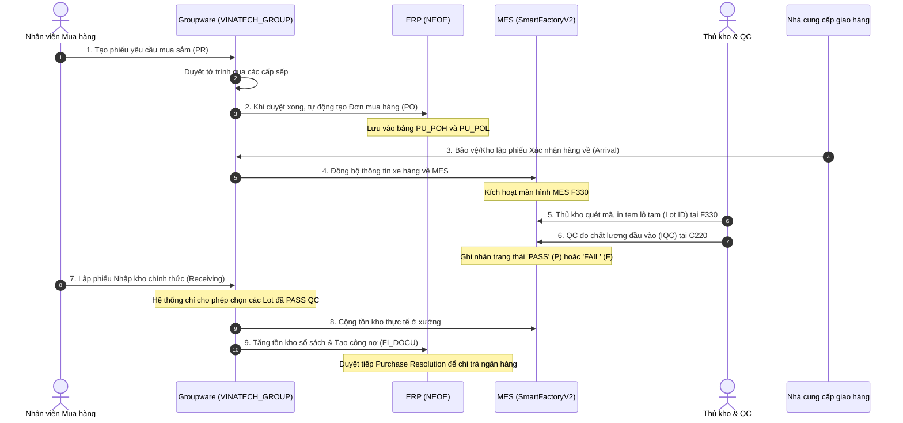
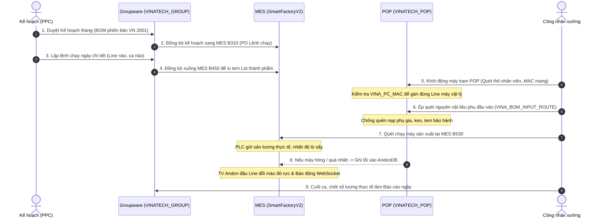
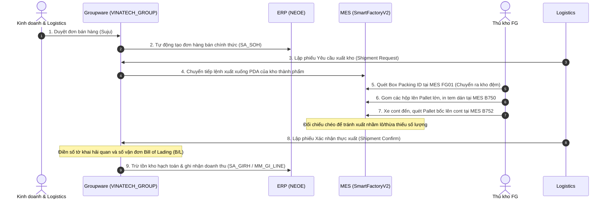

# 📖 CẨM NANG NHẬP MÔN HỆ THỐNG LIÊN THÔNG (VINATECH INTEGRATION HANDBOOK FOR NEWCOMERS)

> **Dành cho:** Kỹ sư thiết kế hệ thống, lập trình viên, nhân viên vận hành và AI mới tiếp cận hệ sinh thái phần mềm Vinatech.
>
> **Mục tiêu:** Giúp người mới bắt đầu (chưa từng biết về hệ thống) có thể hiểu rõ từng bước đi của dữ liệu, cách mà các nền tảng **Groupware (Văn phòng)**, **ERP (Kế toán)** và **MES (Nhà xưởng)** giao tiếp với nhau qua các bảng cơ sở dữ liệu vật lý.
>
> ← [Quay lại Mục Lục chính](KB_INDEX.md) | 🗄️ [Tra cứu cấu trúc CSDL chi tiết (KB_19)](KB_19_ALL_DATABASES_MAP.md)

---

## 🏰 1. Phép Ẩn Dụ "Bốn Vương Quốc" (Understanding the Systems)

Để dễ hình dung hệ thống lớn này, hãy tưởng tượng toàn bộ Vinatech là một đế chế gồm **Bốn Vương Quốc** làm việc với nhau thông qua những "sứ giả" cơ sở dữ liệu:

```
┌─────────────────────────────────────────────────────────────────────────┐
│                    VƯƠNG QUỐC GROUPWARE (GW)                            │
│                 "Văn phòng ký duyệt & Hành chính"                       │
│  - Nơi con người đưa ra quyết định, đề xuất và ký duyệt giấy tờ.        │
│  - Bảng trung tâm: VINA_DOCUMENT_SAVE (Phiếu lưu), VINA_EMP (Nhân sự)   │
└────────────────────────────────────┬────────────────────────────────────┘
                                     │
                                     │ (Sứ giả: Sync PO / Plan / Items)
                                     v
┌────────────────────────────────────┴────────────────────────────────────┐
│                       VƯƠNG QUỐC ERP (DOUZONE)                          │
│                    "Hầm vàng kế toán & Master Data"                     │
│  - Nơi quản lý tiền bạc, công nợ, định giá vật tư gốc và sổ cái.        │
│  - Bảng trung tâm: MA_ITEM (Vật tư), PU_POH (Đơn mua), FI_DOCU (Sổ cái)  │
└────────────────────────────────────┬────────────────────────────────────┘
                                     │
                                     │ (Sứ giả: Sync Lệnh ngày / Tồn thực)
                                     v
┌─────────────────────────────────────────────────────────────────────────┐
│                        VƯƠNG QUỐC MES (NAIS)                            │
│                   "Đốc công & Vận hành nhà xưởng"                       │
│  - Nơi trực tiếp quét barcode, in tem, QC hàng hóa, chạy máy vật lý.    │
│  - Bảng trung tâm: STB_MaterialLotInfo (Lô), STB_ProdRouteHist (Chạy máy)│
└────────────────────────────────────┬────────────────────────────────────┘
                                     │
                                     │ (Sứ giả: Mạng lưới an ninh & Còi báo)
                                     v
┌─────────────────────────────────────────────────────────────────────────┐
│                   VƯƠNG QUỐC PHỤ TRỢ (HELPERS)                          │
│            "Hệ thống đường ống, cảm biến và bảo vệ"                     │
│  - SSO (RESTFUL): Bảo vệ soát vé.   - POP (MAC): Máy trạm hiện trường.  │
│  - Andon (Alerts): Chuông báo lỗi.  - WebSocket: Mạng lưới truyền tin.  │
│  - WCMS (Cash): Chuyển tiền NH.     - streamdocs: Kính xem PDF an toàn. │
└─────────────────────────────────────────────────────────────────────────┘
```

*   **Tại sao cần cả 3 vương quốc chính?**
    *   **Groupware** giúp các phòng ban ngồi bàn giấy duyệt đề xuất từ xa.
    *   **ERP** giúp ban giám đốc nhìn thấy bức tranh tài chính và công nợ pháp lý.
    *   **MES** giúp công nhân ở xưởng chạy máy, quét mã vạch và kiểm QC mà không bị nhầm lẫn.

---

## 🔄 2. Ba Dòng Đời Nghiệp Vụ Cốt Lõi (The 3 Master Lifecycles)

Mọi hoạt động tại Vinatech đều là sự phối hợp nhịp nhàng giữa các hệ thống thông qua 3 quy trình chính dưới đây:

### 2.1 Quy trình Mua hàng & Nhập kho (Procure-to-Pay)
*Quy trình này theo dấu từ lúc nhà máy cần mua nguyên vật liệu cho đến lúc vật tư nằm trên kệ kho xưởng và nhà cung cấp nhận được tiền.*



---

### 2.2 Quy trình Chỉ thị & Vận hành Sản xuất (Production Execution)
*Quy trình này biến các con số kế hoạch sản xuất trên bàn giấy thành sản phẩm thực tế ra lò từ máy móc.*



---

### 2.3 Quy trình Bán hàng & Xuất khẩu Container (Order-to-Cash)
*Quy trình xuất thành phẩm tụ điện ra cảng giao cho khách hàng quốc tế.*



---

## 📋 3. Bản Đồ 12 Biểu Mẫu Hành Chính Dưới Góc Nhìn Người Mới (Scenario Matrix)

Dưới đây là bảng phân tích kịch bản từng bước cho **12 biểu mẫu cốt lõi**. Mỗi biểu mẫu được giải thích rõ ràng kèm câu truy vấn đối soát dữ liệu được chú giải chi tiết.

---

### 3.1. Đơn Yêu Cầu Mua Sắm (PR / Expense Report)
*   **Mã Form ID:** `expenseReportDocument` hoặc `purchaseRequestDocument`
*   **Ý nghĩa thực tế:** Khi một phòng ban muốn mua sắm bất kỳ thứ gì (thiết bị, công cụ dụng cụ, hoặc nguyên vật liệu sản xuất), họ phải làm phiếu này đầu tiên để xin ngân sách.
*   **Kịch bản vận hành:**
    1.  Nhân viên soạn phiếu trên giao diện web Groupware, điền các thông tin: Tên vật tư, số lượng dự kiến, giá ước tính, và đính kèm báo giá (tệp PDF được lưu qua `streamdocs`).
    2.  Phiếu đi qua luồng ký duyệt trên Groupware.
    3.  Khi trạng thái chuyển thành `APPROVED`, hệ thống gọi Stored Procedure `usp_SyncPurchaseRequest` để tự động tạo một yêu cầu mua sắm tương ứng trên ERP `NEOE` để phòng mua hàng bắt đầu tìm nhà cung cấp.
*   **Bảng dữ liệu bị tác động:**
    *   `VINATECH_GROUP.dbo.VINA_DOCUMENT_SAVE`: Lưu trạng thái duyệt (`DOCUMENT_SAVE_STATE`).
    *   `VINATECH_GROUP.dbo.VINA_DOCUMENT_PURCHASE_REQUEST`: Chi tiết mặt hàng yêu cầu.
    *   `NEOE.dbo.PU_PRH` (Header phiếu PR trên ERP) & `PU_PRL` (Line chi tiết).
*   **SQL Đối soát cho người mới:**
    ```sql
    -- Tìm xem tờ trình mua hàng trên GW đã được đồng bộ thành công sang phiếu yêu cầu mua (PR) trên ERP chưa
    SELECT 
        GW.DOCUMENT_SAVE_CODE AS [Mã tờ trình GW],
        GW.DOCUMENT_SAVE_SUBJECT AS [Tiêu đề đề xuất],
        GW.DOCUMENT_SAVE_STATE AS [Trạng thái duyệt GW],
        ERP_H.NO_PR AS [Số phiếu PR trên ERP],
        ERP_L.CD_ITEM AS [Mã vật tư],
        ERP_L.QT_PR AS [Số lượng đề xuất mua]
    FROM VINATECH_GROUP.dbo.VINA_DOCUMENT_SAVE GW WITH(NOLOCK) -- Bảng lưu thông tin chung của tờ trình GW
    INNER JOIN VINATECH_GROUP.dbo.VINA_DOCUMENT_PURCHASE_REQUEST GW_Detail WITH(NOLOCK)
        ON GW.DOCUMENT_SAVE_CODE = GW_Detail.DOCUMENT_SAVE_CODE
    LEFT JOIN NEOE.dbo.PU_PRH ERP_H WITH(NOLOCK) -- Bảng Header phiếu yêu cầu mua trên ERP
        ON GW.DOCUMENT_SAVE_CODE = ERP_H.NO_PR -- Mã tờ trình GW thường được map làm số phiếu ERP
    LEFT JOIN NEOE.dbo.PU_PRL ERP_L WITH(NOLOCK) -- Bảng Line chi tiết phiếu yêu cầu mua trên ERP
        ON ERP_H.NO_PR = ERP_L.NO_PR
    WHERE GW.DOCUMENT_SAVE_CODE = 'DOC-PR-2026-0001'; -- Thay bằng mã tờ trình thực tế cần đối soát
    ```

---

### 3.2. Đơn Đặt Hàng (Purchase Order - PO)
*   **Mã Form ID:** `purchaseOrderDocument`
*   **Ý nghĩa thực tế:** Khi đã chọn được nhà cung cấp, phòng mua hàng lập đơn đặt hàng chính thức (PO) gửi cho nhà cung cấp xác nhận số lượng, giá và thời gian giao hàng.
*   **Kịch bản vận hành:**
    1.  Nhân viên mua hàng tạo đơn PO trên Groupware, liên kết với PR đã duyệt ở bước trên.
    2.  Chọn phiên bản định mức lắp ráp sản phẩm (BOM phiên bản Việt Nam `2001`).
    3.  Sau khi duyệt hoàn tất, dữ liệu ghi vào bảng `PU_POH` / `PU_POL` của ERP làm căn cứ tính công nợ sau này.
*   **Liên thông MES:** Thông tin PO xuất hiện trên màn hình **MES B310** để giám sát tiến độ giao hàng và sản xuất.
*   **SQL Đối soát cho người mới:**
    ```sql
    -- Kiểm tra xem đơn đặt hàng PO từ Groupware đã được đồng bộ sang ERP chưa
    SELECT 
        POH.DOCUMENT_SAVE_CODE AS [Mã tờ trình GW],
        POH.NO_PO AS [Số PO chính thức],
        POL.CD_ITEM AS [Mã vật tư đặt mua],
        POL.QT_PO AS [Số lượng đặt mua (GW)],
        POL.DOCUMENT_POL_REMAIN_QT_PO AS [Số lượng còn lại chưa giao]
    FROM VINATECH_GROUP.dbo.VINA_DOCUMENT_POH POH WITH(NOLOCK) -- Bảng đầu đơn PO trên GW
    INNER JOIN VINATECH_GROUP.dbo.VINA_DOCUMENT_POL POL WITH(NOLOCK) -- Bảng chi tiết dòng PO trên GW
        ON POH.DOCUMENT_SAVE_CODE = POL.DOCUMENT_SAVE_CODE
    WHERE POH.NO_PO = 'PO20260614001'; -- Thay bằng mã số PO cần đối soát
    ```

---

### 3.3. Xác Nhận Hàng Về (Arrival Confirmation)
*   **Mã Form ID:** `arrivalConfirmationDocument`
*   **Ý nghĩa thực tế:** Khi xe tải của nhà cung cấp chở vật tư đến cổng bảo vệ nhà máy, thủ kho cần khai báo để hệ thống biết hàng đã về đến nơi vật lý và chuẩn bị kiểm tra chất lượng.
*   **Kịch bản vận hành:**
    1.  Thủ kho lập phiếu Arrival trên Groupware, nhập mã PO và số lượng thực tế giao trên hóa đơn.
    2.  Hệ thống ghi nhận và tự động đẩy lệnh tiếp nhận xuống MES, chèn sẵn các bản ghi lô hàng tạm (Lot ID dạng `ML...`) để chuẩn bị in tem nhãn.
*   **Liên thông MES:** Dữ liệu tự động hiển thị trên màn hình **MES F330** (Goods Receipt) để thủ kho sẵn sàng quét nhận hàng.
*   **SQL Đối soát cho người mới:**
    ```sql
    -- Tra cứu xem phiếu báo hàng về (Arrival) trên GW đã tạo chứng từ tiếp nhận dưới MES chưa
    SELECT 
        ARR_H.DOCUMENT_SAVE_CODE AS [Mã phiếu Arrival GW],
        ARR_L.CD_ITEM AS [Mã vật tư giao],
        ARR_L.QT_RECEIVING_PHYSICAL AS [Số lượng giao thực tế],
        MDI.MaterialDocNo AS [Số chứng từ nhận hàng MES],
        MLI.LotID AS [Mã vạch LotID tạm được sinh ra],
        MLI.InitialQty AS [Số lượng Lot khởi tạo]
    FROM VINATECH_GROUP.dbo.VINA_DOCUMENT_RECEIVING_PHYSICAL_ITEM_H ARR_H WITH(NOLOCK)
    INNER JOIN VINATECH_GROUP.dbo.VINA_DOCUMENT_RECEIVING_PHYSICAL_ITEM_L ARR_L WITH(NOLOCK)
        ON ARR_H.DOCUMENT_SAVE_CODE = ARR_L.DOCUMENT_SAVE_CODE
    LEFT JOIN SmartFactoryV2.dbo.STB_MaterialDocInfo MDI WITH(NOLOCK) -- Bảng chứng từ kho MES
        ON ARR_H.DOCUMENT_SAVE_CODE = MDI.MaterialDocNo -- Liên kết qua mã document GW
    LEFT JOIN SmartFactoryV2.dbo.STB_MaterialLotInfo MLI WITH(NOLOCK) -- Bảng danh sách Lot của MES
        ON MDI.MaterialDocNo = MLI.MaterialDocNo AND ARR_L.CD_ITEM = MLI.MaterialCode
    WHERE ARR_H.DOCUMENT_SAVE_CODE = 'ARR20260614001'; -- Mã phiếu Arrival cần tra cứu
    ```

---

### 3.4. Xác Nhận Nhập Kho (Receiving Confirmation)
*   **Mã Form ID:** `receivingConfirmationDocument`
*   **Ý nghĩa thực tế:** Hàng hóa sau khi QC kiểm tra đạt chất lượng (PASS) mới được chính thức ghi nhận vào tồn kho của công ty.
*   **Kịch bản vận hành:**
    1.  Nhân viên kho tạo phiếu trên Groupware.
    2.  Hệ thống quét bảng QC lịch sử của MES (`STB_CommInspDocHistory`). Chỉ những Lot nào có kết quả QC là `'P'` (Pass) mới hiện lên danh sách để chọn nhập kho.
    3.  Khi duyệt xong phiếu này, hệ thống sẽ tự động cộng dồn số dư tồn kho tại MES và đồng bộ phiếu nhập kho sang ERP để kế toán tính giá thành.
*   **SQL Đối soát cho người mới:**
    ```sql
    -- Kiểm tra số lượng tồn kho thực tế ở MES và số lượng nhập kho sổ sách ở ERP có khớp với phiếu duyệt trên GW không
    SELECT 
        RCV.DOCUMENT_SAVE_CODE AS [Mã phiếu nhập kho GW],
        RCVL.CD_ITEM AS [Mã vật tư],
        RCVL.QTY_RCV AS [Số lượng nhập (GW)],
        -- Số lượng tồn thực tế đang ghi nhận tại xưởng (MES)
        (SELECT SUM(CurrentQty) 
         FROM SmartFactoryV2.dbo.STB_MaterialLotInfo WITH(NOLOCK) 
         WHERE MaterialDocNo = RCV.DOCUMENT_SAVE_CODE AND MaterialCode = RCVL.CD_ITEM) AS [Tồn kho thực tế MES],
        -- Số lượng nhập kho sổ sách kế toán (ERP)
        (SELECT SUM(QT_RCV) 
         FROM NEOE.dbo.PU_RCVL WITH(NOLOCK) 
         WHERE NO_RCV = RCV.DOCUMENT_SAVE_CODE AND CD_ITEM = RCVL.CD_ITEM) AS [Nhập kho hạch toán ERP]
    FROM VINATECH_GROUP.dbo.VINA_DOCUMENT_PU_RCVH RCV WITH(NOLOCK)
    INNER JOIN VINATECH_GROUP.dbo.VINA_DOCUMENT_PU_RCVL RCVL WITH(NOLOCK)
        ON RCV.DOCUMENT_SAVE_CODE = RCVL.DOCUMENT_SAVE_CODE
    WHERE RCV.DOCUMENT_SAVE_CODE = 'RCV20260614001'; -- Mã phiếu nhập kho cần đối soát
    ```

---

### 3.5. Sổ Quyết Toán Mua Hàng (Purchase Resolution)
*   **Mã Form ID:** `purchaseResolutionDocument`
*   **Ý nghĩa thực tế:** Giai đoạn cuối cùng của mua hàng. Kế toán lập quyết toán chi tiết để chuẩn bị chuyển khoản tiền cho nhà cung cấp, phân bổ các chi phí phụ trội như thuế hải quan, phí vận chuyển logistics.
*   **Kịch bản vận hành:**
    1.  Kế toán viên lập quyết toán trên Groupware đối chiếu với số lượng thực nhập và đơn giá thỏa thuận ban đầu.
    2.  Chọn tài khoản định khoản kế toán (ví dụ: Nợ 152 - Nguyên vật liệu, Có 331 - Phải trả người bán).
    3.  Duyệt hoàn tất sẽ tự động tạo bút toán chính thức (`FI_DOCU` / `FI_DOCU_D`) trên ERP.
*   **SQL Đối soát cho người mới:**
    ```sql
    -- Kiểm tra xem bút toán kế toán chính thức đã được sinh tự động trên ERP từ phiếu quyết toán GW chưa
    SELECT 
        PR.DOCUMENT_SAVE_CODE AS [Mã quyết toán GW],
        PR.PAYMENT_DATE AS [Ngày hẹn thanh toán],
        PRL.CD_ACCT AS [Mã tài khoản chi phí (GW)],
        PRL.AM AS [Số tiền quyết toán VND],
        FD.NO_DOCU AS [Số chứng từ ERP chính thức],
        FD.CD_ACCT AS [Tài khoản định khoản ERP],
        FD.AM_DR AS [Phát sinh Nợ (ERP)],
        FD.AM_CR AS [Phát sinh Có (ERP)]
    FROM VINATECH_GROUP.dbo.VINA_DOCUMENT_PURCHAE_RESOLUTION PR WITH(NOLOCK)
    INNER JOIN VINATECH_GROUP.dbo.VINA_DOCUMENT_PURCHAE_RESOLUTION_LINE PRL WITH(NOLOCK)
        ON PR.DOCUMENT_SAVE_CODE = PRL.DOCUMENT_SAVE_CODE
    LEFT JOIN NEOE.dbo.FI_DOCU_D FD WITH(NOLOCK) -- Bảng dòng chứng từ kế toán trên ERP
        ON PR.DOCUMENT_SAVE_CODE = FD.NO_IS -- Cột NO_IS trên ERP dùng để lưu vết mã nguồn từ GW
    WHERE PR.DOCUMENT_SAVE_CODE = 'RES20260614001'; -- Mã phiếu quyết toán cần tra cứu
    ```

---

### 3.6. Đơn Xin Nghỉ Việc (Employee Retire Document)
*   **Mã Form ID:** `empRetireDocument`
*   **Ý nghĩa thực tế:** Khi một nhân viên nghỉ việc, tài khoản của họ trên tất cả các hệ thống (GW, ERP, MES, App di động) phải bị vô hiệu hóa ngay lập tức để bảo mật dữ liệu.
*   **Kịch bản vận hành:**
    1.  Nhân sự lập đơn xin thôi việc trên Groupware.
    2.  Khi sếp phê duyệt ngày làm việc cuối cùng, phòng nhân sự chuyển trạng thái nhân viên trên ERP sang "Nghỉ việc" (`CD_INCOM = '099'`).
*   **Liên thông MES & Bảo mật:**
    *   **Tài khoản Hàn Quốc:** Khi đăng nhập MES, SP `usp_DoGUILogin` truy vấn trực tiếp bảng `NEOE.dbo.MA_EMP`. Nếu thấy mã nghỉ việc `'099'`, hệ thống sẽ từ chối đăng nhập ngay lập tức.
    *   **Tài khoản Việt Nam:** Nhân sự thay đổi thủ công cờ `AllowFlag` thành `'Deny'` trên màn hình phân quyền hệ thống **MES Z410**.
*   **SQL Đối soát cho người mới:**
    ```sql
    -- Kiểm tra xem tài khoản nhân sự nghỉ việc đã bị khóa đồng bộ trên cả ERP và MES chưa
    SELECT 
        R.DOCUMENT_SAVE_CODE AS [Mã đơn nghỉ việc GW],
        R.NO_EMP AS [Mã nhân viên],
        R.DT_RETIRE AS [Ngày nghỉ việc chính thức],
        E.CD_INCOM AS [Trạng thái nhân sự ERP], -- Nếu là '099' tức là đã nghỉ việc trên ERP
        U.UserID AS [Tài khoản MES],
        U.AllowFlag AS [Trạng thái hoạt động MES] -- Nếu là 'Deny' tức là đã bị khóa truy cập MES
    FROM VINATECH_GROUP.dbo.VINA_DOCUMENT_EMP_RETIRE R WITH(NOLOCK)
    LEFT JOIN NEOE.dbo.MA_EMP E WITH(NOLOCK) ON R.NO_EMP = E.NO_EMP -- Join sang danh mục nhân sự ERP
    LEFT JOIN SmartFramework.dbo.STB_UserInfo U WITH(NOLOCK) -- Join sang danh sách tài khoản MES
        ON R.NO_EMP = U.Appendix8 -- Cột Appendix8 trên MES lưu mã nhân viên gốc
    WHERE R.NO_EMP = 'VVT-01234'; -- Thay thế bằng mã nhân viên cần đối soát
    ```

---

### 3.7. Đi Làm Ngày Nghỉ / Lễ (Holiday Work Request)
*   **Mã Form ID:** `holidayWorkRequest`
*   **Ý nghĩa thực tế:** Để tính đúng tiền lương tăng ca cho công nhân sản xuất vào ngày lễ hoặc chủ nhật, thông tin đăng ký làm việc ngoài giờ phải khớp với giờ quét vân tay thực tế tại xưởng.
*   **Kịch bản vận hành:**
    1.  Tổ trưởng hoặc công nhân đăng ký tăng ca ngày lễ trên Groupware.
    2.  Cuối ngày lễ, dữ liệu quét vân tay tại đầu line được SQL Agent Job quét tự động chuyển vào bảng `STB_VN_ATTENDANCE_TIME` của MES.
    3.  Phòng nhân sự đối chiếu số giờ đăng ký trên GW và số giờ chấm công thực tế trên MES để duyệt bảng lương.
*   **SQL Đối soát cho người mới:**
    ```sql
    -- So sánh giờ tăng ca đăng ký trên tờ trình GW và giờ chấm công thực tế quét vân tay dưới MES
    SELECT 
        HW.DOCUMENT_SAVE_CODE AS [Mã đơn GW],
        HW.NO_EMP AS [Mã nhân viên],
        HW.WORK_DATE AS [Ngày làm việc],
        HW.ACTUAL_WORK_HOURS AS [Giờ tăng ca đăng ký (GW)],
        AT.WorkHours AS [Giờ làm việc thực tế (MES)],
        AT.OvertimeHours AS [Giờ tăng ca thực tế (MES)]
    FROM VINATECH_GROUP.dbo.VINA_DOCUMENT_HOLIDAY_WORK HW WITH(NOLOCK)
    LEFT JOIN SmartFactoryV2.dbo.STB_VN_ATTENDANCE_TIME AT WITH(NOLOCK) -- Bảng giờ công chấm vân tay MES
        ON HW.NO_EMP = AT.WorkerCode AND HW.WORK_DATE = AT.JobDate
    WHERE HW.NO_EMP = 'VVT-05678' AND HW.WORK_DATE = '2026-06-14';
    ```

---

### 3.8. Đăng Ký Đơn Bán Hàng (Sales Order / Suju)
*   **Mã Form ID:** `salesOrderDocument`
*   **Ý nghĩa thực tế:** Khi nhận được đơn đặt hàng từ khách hàng, bộ phận kinh doanh đăng ký đơn Suju để làm căn cứ lập kế hoạch sản xuất và làm thủ tục xuất khẩu.
*   **Kịch bản vận hành:**
    1.  Nhân viên kinh doanh tạo đơn Suju trên Groupware, nhập thông tin: Mã khách hàng, điều khoản Incoterms, số lượng đặt hàng, đơn giá.
    2.  Sau khi sếp duyệt, hệ thống tự động đẩy dữ liệu sang ERP tạo đơn bán hàng SO chính thức (`SA_SOH` / `SA_SOL`).
*   **SQL Đối soát cho người mới:**
    ```sql
    -- Kiểm tra xem đơn hàng bán Suju trên GW đã tạo đơn hàng SO tương ứng bên ERP chưa
    SELECT 
        SO.NO_SO AS [Mã Suju GW],
        SOL.CD_ITEM AS [Mã thành phẩm],
        SOL.QT_SO AS [Số lượng đặt hàng],
        ERP_H.NO_SO AS [Số phiếu SO trên ERP],
        ERP_L.QT_SO AS [Số lượng đăng ký ERP]
    FROM VINATECH_GROUP.dbo.VINA_DOCUMENT_SALES_ORDER SO WITH(NOLOCK)
    INNER JOIN VINATECH_GROUP.dbo.VINA_DOCUMENT_SALES_ORDER_LINE SOL WITH(NOLOCK)
        ON SO.DOCUMENT_SAVE_CODE = SOL.DOCUMENT_SAVE_CODE
    LEFT JOIN NEOE.dbo.SA_SOH ERP_H WITH(NOLOCK) ON SO.NO_SO = ERP_H.NO_SO
    LEFT JOIN NEOE.dbo.SA_SOL ERP_L WITH(NOLOCK) 
        ON ERP_H.NO_SO = ERP_L.NO_SO AND SOL.CD_ITEM = ERP_L.CD_ITEM
    WHERE SO.NO_SO = 'SO-20260614-001';
    ```

---

### 3.9. Yêu Cầu Xuất Hàng (Shipment Request)
*   **Mã Form ID:** `deliverOutDocument`
*   **Ý nghĩa thực tế:** Khi hàng hóa đã sẵn sàng xuất khẩu, nhân viên logistics lập phiếu yêu cầu xuất kho để thủ kho thành phẩm chuẩn bị đóng hàng lên Container.
*   **Kịch bản vận hành:**
    1.  Tạo phiếu Shipment Request trên Groupware.
    2.  Hệ thống kiểm tra tồn kho thành phẩm thực tế để đảm bảo đủ hàng xuất.
    3.  Duyệt hoàn tất sẽ đồng bộ thông tin yêu cầu xuống thiết bị PDA cầm tay của thủ kho thành phẩm.
*   **Liên thông MES:** Kích hoạt danh sách yêu cầu xuất kho trên giao diện màn hình **MES FG01** (PDA Xuất kho).
*   **SQL Đối soát cho người mới:**
    ```sql
    -- Kiểm tra phiếu yêu cầu xuất kho từ GW đã liên thông sang ERP để lập phiếu xuất hạch toán chưa
    SELECT 
        SR.DOCUMENT_SAVE_CODE AS [Mã phiếu yêu cầu xuất GW],
        SRL.CD_ITEM AS [Mã thành phẩm],
        SRL.QT_REQUEST AS [Số lượng yêu cầu xuất],
        GIR.NO_GIR AS [Số phiếu yêu cầu xuất ERP],
        GIL.QT_GIR AS [Số lượng đăng ký trên ERP]
    FROM VINATECH_GROUP.dbo.VINA_DOCUMENT_DELIVER_OUT_CONFIRMATION_IV SR WITH(NOLOCK)
    INNER JOIN VINATECH_GROUP.dbo.VINA_DOCUMENT_DELIVER_OUT_CONFIRMATION_IV_LINE SRL WITH(NOLOCK)
        ON SR.DOCUMENT_SAVE_CODE = SRL.DOCUMENT_SAVE_CODE
    LEFT JOIN NEOE.dbo.SA_GIRH GIR WITH(NOLOCK) ON SR.DOCUMENT_SAVE_CODE = GIR.NO_GIR
    LEFT JOIN NEOE.dbo.SA_GIRL GIL WITH(NOLOCK) 
        ON GIR.NO_GIR = GIL.NO_GIR AND SRL.CD_ITEM = GIL.CD_ITEM
    WHERE SR.DOCUMENT_SAVE_CODE = 'SHIP-REQ-2026-0002';
    ```

---

### 3.10. Xác Nhận Thực Xuất (Shipment Confirmation)
*   **Mã Form ID:** `deliverOutConfirmationDocument`
*   **Ý nghĩa thực tế:** Khi hàng đã bốc lên Container thực tế tại sân nhà máy và xe rời bánh, phiếu này được duyệt để xác nhận xuất hàng chính thức, làm thủ tục hải quan và ghi nhận doanh thu.
*   **Kịch bản vận hành:**
    1.  Nhân viên xuất nhập khẩu cập nhật Số tờ khai hải quan và số vận đơn Bill of Lading (B/L) lên phiếu.
    2.  Sau khi duyệt hoàn tất, hệ thống tự động trừ tồn kho vật lý tại MES và tạo bút toán xuất kho giảm tồn trên ERP.
*   **Liên thông MES:** Thủ kho đóng Pallet tại màn hình **MES B750** và quét bốc xếp cont tại **MES B752** đối chiếu trực tiếp với phiếu này.
*   **SQL Đối soát cho người mới:**
    ```sql
    -- Kiểm tra xem số lượng Pallet đã bốc xếp thực tế dưới xưởng (MES) và số lượng trừ kho kế toán (ERP) có khớp với phiếu xác nhận xuất không
    SELECT 
        SC.DOCUMENT_SAVE_CODE AS [Mã xác nhận xuất GW],
        SC.NO_CUSTOMS AS [Số tờ khai hải quan],
        SC.NO_BL AS [Số vận đơn B/L],
        -- Đếm số lượng Pallet đã quét bốc cont thành công dưới MES
        (SELECT COUNT(DISTINCT Barcode) 
         FROM SmartFactoryV2.dbo.STB_SetInfo WITH(NOLOCK) 
         WHERE PONo = SC.DOCUMENT_SAVE_CODE) AS [Số Pallet bốc cont thực tế (MES)],
        -- Số lượng hàng hạch toán giảm tồn kho trên ERP
        (SELECT SUM(QT_GI) 
         FROM NEOE.dbo.MM_GI_LINE WITH(NOLOCK) 
         WHERE NO_IS = SC.DOCUMENT_SAVE_CODE) AS [Sản lượng xuất kho (ERP)]
    FROM VINATECH_GROUP.dbo.VINA_DOCUMENT_DELIVER_OUT_CONFIRMATION SC WITH(NOLOCK)
    WHERE SC.DOCUMENT_SAVE_CODE = 'SHIP-CONF-2026-0002';
    ```

---

### 3.11. Chỉ Thị Sản Xuất Ngày (Daily Production Order)
*   **Mã Form ID:** `dailyProductionOrderDocument`
*   **Ý nghĩa thực tế:** Chỉ thị chạy máy chi tiết cho từng Line trong ngày hôm nay.
*   **Kịch bản vận hành:**
    1.  Phòng kế hoạch sản xuất lập kế hoạch ngày trên Groupware, phân bổ số lượng mẻ/lô cho từng dây chuyền sản xuất.
    2.  Hệ thống tự động đồng bộ kế hoạch ngày này xuống MES để khởi tạo phiên làm việc tại xưởng.
*   **Liên thông MES:** Dữ liệu hiển thị trên màn hình **MES B450** (Daily Production Plan). Công nhân tại đây sẽ bấm nút in tem mã vạch Lot ID cho các mẻ hàng chờ chạy máy.
*   **SQL Đối soát cho người mới:**
    ```sql
    -- Kiểm tra xem kế hoạch ngày từ GW đã được đẩy xuống MES và thực hiện in tem Lot chưa
    SELECT 
        GW_D.DAY_PLAN_NO AS [Mã kế hoạch ngày GW],
        GW_D.LINE_CODE AS [Mã dây chuyền],
        GW_D.WORK_DATE AS [Ngày sản xuất],
        GW_D.PLAN_QTY AS [Sản lượng kế hoạch (GW)],
        MES_D.DayProdPlanNo AS [Mã kế hoạch dưới MES],
        MES_D.ProdOrderQty AS [Sản lượng kế hoạch (MES)],
        MES_D.JobState AS [Trạng thái chạy máy MES], -- 0 = Mới tạo, 1 = Đang chạy
        -- Đếm số lượng Lot con đã được chia và in tem dưới xưởng
        (SELECT COUNT(*) 
         FROM SmartFactoryV2.dbo.STB_SetInfo WITH(NOLOCK) 
         WHERE DayPlanNo = GW_D.DAY_PLAN_NO) AS [Số lượng Lot đã chia tem]
    FROM VINATECH_GROUP.dbo.VINA_DOCUMENT_DAILY_PRODUCTION_ORDER GW_D WITH(NOLOCK)
    LEFT JOIN SmartFactoryV2.dbo.STB_DayProdPlan MES_D WITH(NOLOCK) -- Bảng kế hoạch ngày MES
        ON GW_D.DAY_PLAN_NO = MES_D.DayProdPlanNo
    WHERE GW_D.DAY_PLAN_NO = 'PLAN-2026-0614-01';
    ```

---

### 3.12. Báo Cáo Sản Xuất Ngày (Daily Production Report)
*   **Mã Form ID:** `dailyProductionReportDocument`
*   **Ý nghĩa thực tế:** Kết quả sản lượng thực tế cuối ca của dây chuyền sản xuất.
*   **Kịch bản vận hành:**
    1.  Cuối ca, tổ trưởng lập báo cáo trên Groupware, lấy số liệu sản phẩm tốt và sản phẩm lỗi (Defect) thực tế.
    2.  Hệ thống đối chiếu trực tiếp với nhật ký quét sản phẩm tại các máy móc dưới xưởng để tránh báo cáo khống.
*   **Liên thông MES:** Đối chiếu với dữ liệu quét công đoạn tại màn hình **MES B530** (Prod Route Input) và lịch sử hành trình Lot.
*   **SQL Đối soát cho người mới:**
    ```sql
    -- Đối chiếu sản lượng Lot báo cáo trên GW với số lượng quét máy thực tế dưới xưởng (MES)
    SELECT 
        GW_L.LOT_NO AS [Mã Lot hàng],
        GW_L.PLAN_QTY AS [Sản lượng kế hoạch],
        GW_L.PROD_QTY AS [Sản lượng báo cáo (GW)],
        -- Số lượng sản phẩm thực tế đi qua công đoạn kiểm tra cuối của MES
        (SELECT SUM(ProdQty) 
         FROM SmartFactoryV2.dbo.STB_ProdRouteHist WITH(NOLOCK) 
         WHERE ControlNo = SI.ControlNo AND RouteCode = 'GATE_NAME') AS [Sản lượng quét máy thực tế (MES)],
        SI.IsProdFinish AS [Trạng thái đóng Lot] -- 1 = Đã sản xuất xong hoàn toàn
    FROM VINATECH_GROUP.dbo.VINA_DOCUMENT_DAILY_PRODUCTION_ORDER_LOT GW_L WITH(NOLOCK)
    LEFT JOIN SmartFactoryV2.dbo.STB_SetInfo SI WITH(NOLOCK) -- Bảng thông tin Lot gốc của MES
        ON GW_L.LOT_NO = SI.Barcode
    WHERE GW_L.LOT_NO = 'LOT-20260614-001';
    ```
---

### 3.13. Yêu Cầu Tuyển Dụng (Recruitment / Emp Request)
*   **Mã Form ID:** `empRequestDocument`
*   **Ý nghĩa thực tế:** Dành cho các trưởng phòng ban đề xuất tuyển dụng thêm nhân sự mới để bổ sung năng lực cho đội ngũ.
*   **Kịch bản vận hành:**
    1.  Trưởng bộ phận lập phiếu trên Groupware, điền các thông tin: Vị trí cần tuyển, số lượng, yêu cầu kỹ năng, mức lương đề xuất và lý do tuyển dụng.
    2.  Sau khi được duyệt qua các cấp nhân sự và ban giám đốc, thông tin này làm căn cứ để phòng nhân sự đăng tuyển.
*   **Liên thông hệ thống:** Phiếu này không có màn hình MES trực tiếp. Tuy nhiên, khi nhân sự mới được tuyển vào, thông tin sẽ được đăng ký trên ERP `NEOE` và sync tự động sang MES `SmartFramework.dbo.STB_UserInfo` qua màn hình **Z410** để cấp quyền chạy máy hiện trường.
*   **SQL Đối soát cho người mới:**
    ```sql
    -- Tìm xem phiếu đề xuất tuyển dụng đã được duyệt trên GW chưa
    SELECT 
        DOCUMENT_SAVE_CODE AS [Mã phiếu GW],
        DOCUMENT_SAVE_SUBJECT AS [Tiêu đề],
        DOCUMENT_SAVE_STATE AS [Trạng thái duyệt]
    FROM VINATECH_GROUP.dbo.VINA_DOCUMENT_SAVE WITH(NOLOCK)
    WHERE DOCUMENT_TYPE_ID = 'empRequestDocument'
      AND DOCUMENT_SAVE_CODE = 'MÃ_PHIẾU_CẦN_TÌM';
    ```

---

### 3.14. Yêu Cầu Đi Công Tác (Business Trip Request)
*   **Mã Form ID:** `businessTripDocument`
*   **Ý nghĩa thực tế:** Nhân viên đăng ký lịch trình đi công tác trong hoặc ngoài nước để làm căn cứ tạm ứng chi phí và tính công công tác.
*   **Kịch bản vận hành:**
    1.  Nhân sự lập phiếu trên Groupware, điền: Nơi đi/nơi đến, mục đích, thời gian, và số tiền tạm ứng (nếu có).
    2.  Sau khi sếp duyệt, phòng kế toán thực hiện chi tạm ứng và đồng bộ nghiệp vụ tạm ứng sang ERP.
*   **SQL Đối soát cho người mới:**
    ```sql
    -- Kiểm tra trạng thái duyệt của phiếu đi công tác để kế toán hạch toán tạm ứng chi phí
    SELECT 
        DOCUMENT_SAVE_CODE AS [Mã tờ trình GW],
        DOCUMENT_SAVE_STATE AS [Trạng thái duyệt],
        DOCUMENT_SAVE_SUBJECT AS [Mục đích công tác]
    FROM VINATECH_GROUP.dbo.VINA_DOCUMENT_SAVE WITH(NOLOCK)
    WHERE DOCUMENT_TYPE_ID = 'businessTripDocument'
      AND DOCUMENT_SAVE_CODE = 'MÃ_PHIẾU_GW';
    ```

---

### 3.15. Đăng Ký Nhà Thầu / Khách Hàng (Partner / Contractor Registration)
*   **Mã Form ID:** `partnerRegistrationDocument`
*   **Ý nghĩa thực tế:** Khi muốn giao dịch với một nhà cung cấp mới hoặc mở bán cho khách hàng mới, mã đối tác phải được đăng ký và phê duyệt hợp lệ.
*   **Kịch bản vận hành:**
    1.  Nhân viên kinh doanh hoặc mua hàng lập phiếu đăng ký thông tin đối tác trên Groupware, điền: Tên doanh nghiệp, mã số thuế, địa chỉ, tài khoản ngân hàng thụ hưởng.
    2.  Sau khi duyệt hoàn tất, hệ thống tự động đẩy dữ liệu sang ERP tạo mã đối tác chính thức trong bảng `NEOE.dbo.MA_PARTNER`.
*   **Liên thông hệ thống:** Thông tin tài khoản ngân hàng được liên kết tự động với hệ thống Cash Management System (`WCMS_STANDARD_NEW.dbo.WCMS_BIZ_PARTNER_ACCOUNT`) phục vụ thanh toán Firm Banking tự động về sau.
*   **SQL Đối soát cho người mới:**
    ```sql
    -- Kiểm tra xem đối tác đăng ký từ GW đã đồng bộ thành công sang Master Data của ERP chưa
    SELECT 
        GW.DOCUMENT_SAVE_CODE AS [Mã phiếu đăng ký GW],
        GW.DOCUMENT_SAVE_STATE AS [Trạng thái duyệt],
        ERP.CD_PARTNER AS [Mã đối tác ERP],
        ERP.LN_PARTNER AS [Tên đối tác],
        ERP.NO_BIZ AS [Mã số thuế]
    FROM VINATECH_GROUP.dbo.VINA_DOCUMENT_SAVE GW WITH(NOLOCK)
    LEFT JOIN NEOE.dbo.MA_PARTNER ERP WITH(NOLOCK)
        ON ERP.NO_BIZ = 'MÃ_SỐ_THUẾ_CỦA_ĐỐI_TÁC' -- Tìm theo MST để đối chiếu mã ERP sinh ra
    WHERE GW.DOCUMENT_SAVE_CODE = 'MÃ_PHIẾU_ĐĂNG_KÝ_GW';
    ```

---

### 3.16. Yêu Cầu Thay Đổi Định Mức (BOM Revision Request)
*   **Mã Form ID:** `bomRevisionDocument`
*   **Ý nghĩa thực tế:** Khi phòng R&D thay đổi thiết kế sản phẩm (ví dụ: thay đổi loại băng keo, hoặc cuộn màng nhôm mới), định mức vật tư (BOM) cần được cập nhật có kiểm soát để tránh công nhân lắp ráp sai linh kiện.
*   **Kịch bản vận hành:**
    1.  Kỹ sư thiết kế lập phiếu yêu cầu thay đổi BOM trên Groupware, chỉ rõ mặt hàng thay thế, tỉ lệ hao hụt mới.
    2.  Sau khi phê duyệt, hệ thống sync cấu trúc BOM mới sang ERP `NEOE.dbo.PR_BOM` và MES `SmartFactoryV2.dbo.STB_MaterialBOM`.
*   **Liên thông MES:** Tác động trực tiếp đến danh mục vật tư phụ bắt buộc phải quét tại các kiosk POP hiện trường (`VINATECH_POP.dbo.VINA_BOM_INPUT_ROUTE`) để chặn lỗi công nhân nạp sai chủng loại vật tư phụ.
*   **SQL Đối soát cho người mới:**
    ```sql
    -- Kiểm tra xem định mức BOM mới đã được đồng bộ xuống MES để áp dụng cho dây chuyền chưa
    SELECT 
        BOM.ParentMaterialCode AS [Mã thành phẩm chính],
        BOM.ChildMaterialCode AS [Mã vật tư phụ cấu thành],
        BOM.UnitQty AS [Định mức tiêu hao tiêu chuẩn],
        BOM.IsUse AS [Trạng thái hoạt động ở xưởng] -- 1 = Có hiệu lực chạy máy
    FROM SmartFactoryV2.dbo.STB_MaterialBOM BOM WITH(NOLOCK)
    WHERE BOM.ParentMaterialCode = 'MÃ_SẢN_PHẨM_CHÍNH'
      AND BOM.ChildMaterialCode = 'MÃ_VẬT_TƯ_PHỤ';
    ```

---

### 3.17. Đăng Ký Các Loại Code (Item / Code Registration)
*   **Mã Form ID:** `itemRegistrationDocument`
*   **Ý nghĩa thực tế:** Đăng ký mã vật tư mới (nguyên vật liệu phụ, bán thành phẩm, thành phẩm) vào hệ thống trước khi có thể thực hiện bất kỳ giao dịch mua bán hay sản xuất nào.
*   **Kịch bản vận hành:**
    1.  Bộ phận kỹ thuật lập phiếu đăng ký mã vật tư mới trên Groupware, điền các thông tin: Tên vật tư, thông số kỹ thuật, quy cách đóng gói, đơn vị tính, loại vật tư.
    2.  Sau khi duyệt hoàn tất, hệ thống sync sang ERP `NEOE.dbo.MA_ITEM` và MES `SmartFactoryV2.dbo.STB_MaterialMaster`.
*   **Liên thông MES:** Cho phép thủ kho thực hiện nhận hàng và in tem nhãn tại **MES F330** và cấu hình NCC được mua tại **MES F130/F140**.
*   **SQL Đối soát cho người mới:**
    ```sql
    -- Kiểm tra xem mã vật tư mới đăng ký trên GW đã sync thành công xuống Master Data của MES chưa
    SELECT 
        MES.MaterialCode AS [Mã vật tư MES],
        MES.MaterialName AS [Tên vật tư],
        MES.MaterialTypeCode AS [Loại vật tư], -- ví dụ: RAW = Nguyên vật liệu
        MES.IsUse AS [Trạng thái hoạt động] -- 1 = Hoạt động tốt
    FROM SmartFactoryV2.dbo.STB_MaterialMaster MES WITH(NOLOCK)
    WHERE MES.MaterialCode = 'MÃ_VẬT_TƯ_MỚI';
    ```

---

## 🛠️ 4. Cẩm Nang Gỡ Lỗi Nhanh Cho Lập Trình Viên Mới (Onboarding Troubleshooting)

Khi vận hành hệ thống liên thông, lỗi phát sinh thường nằm ở các "khớp nối" dữ liệu. Dưới đây là cách chẩn đoán nhanh:

### 4.1 Tại sao đơn mua hàng (PO) đã duyệt trên GW nhưng không sync sang ERP?
*   **Khớp nối bị lỗi:** Trạng thái văn bản trên GW chưa chuyển sang duyệt hoàn toàn.
*   **Cách kiểm tra:** Chạy câu lệnh SQL kiểm tra trạng thái phê duyệt:
    ```sql
    SELECT DOCUMENT_SAVE_STATE 
    FROM VINATECH_GROUP.dbo.VINA_DOCUMENT_SAVE WITH(NOLOCK)
    WHERE DOCUMENT_SAVE_CODE = 'MÃ_PHIẾU_CỦA_BẠN';
    ```
    *Nếu kết quả trả về là `'APPROVING'` (đang duyệt) hoặc `'REJECTED'` (bị từ chối) thay vì `'APPROVED'` (đã duyệt), đơn PO sẽ không bao giờ được sync.*

### 4.2 Tại sao màn hình MES F330 không nhìn thấy phiếu hàng về (Arrival)?
*   **Khớp nối bị lỗi:** Cờ trạng thái tiếp nhận ở MES chưa kích hoạt hoặc phiếu Arrival chưa được ký duyệt bởi kho/bảo vệ trên GW.
*   **Cách kiểm tra:** Đảm bảo bản ghi trong bảng `VINATECH_GROUP.dbo.VINA_DOCUMENT_RECEIVING_PHYSICAL_ITEM_H` có trạng thái duyệt bằng `'APPROVED'`.

### 4.3 Tại sao cờ `ERP_FLAG` trong CMS báo lỗi `'E'` (Error)?
*   **Khớp nối bị lỗi:** Khi đồng bộ dòng tiền ngân hàng sang ERP, mã ngân hàng/đối tác hoặc tài khoản định khoản không khớp giữa hai hệ thống (lệch Master Data).
*   **Cách kiểm tra:**
    ```sql
    SELECT ERP_TX_MSG 
    FROM WCMS_STANDARD_NEW.dbo.WCMS_ACCOUNT_TRNX_LOG WITH(NOLOCK)
    WHERE ERP_FLAG = 'E';
    ```
    *Đọc nội dung thông báo lỗi trong cột `ERP_TX_MSG` để biết chính xác mã đối tác nào đang bị thiếu trên danh mục ERP.*

### 4.4 Tại sao Kiosk POP tại chuyền sản xuất báo lỗi không nhận diện được Line máy?
*   **Khớp nối bị lỗi:** Máy tính Kiosk mới được thay thế card mạng hoặc cài lại Windows dẫn đến địa chỉ MAC mạng thay đổi, không còn khớp với cấu hình trong cơ sở dữ liệu.
*   **Cách kiểm tra:**
    1. Lấy địa chỉ MAC mạng thực tế trên máy tính trạm (chạy lệnh `getmac` ở cmd).
    2. Chạy câu lệnh đối chiếu xem MAC này đã được đăng ký đúng máy trạm chưa:
       ```sql
       SELECT PC_MAC_ADDRESS, PC_IPV4_ADDRESS, EQUIPMENT_SETTING_IDS 
       FROM VINATECH_POP.dbo.VINA_PC_MAC WITH(NOLOCK)
       WHERE PC_MAC_ADDRESS = 'ĐỊA_CHỈ_MAC_MỚI';
       ```
    3. Nếu không tìm thấy dòng nào, IT cần cập nhật địa chỉ MAC mới vào bảng `VINA_PC_MAC` để ứng dụng POP load được cấu hình.

---

## 📚 5. Giải Nghĩa Từ Vựng Viết Tắt (Onboarding Glossary)

| Thuật ngữ | Tên đầy đủ | Giải thích đơn giản | vương quốc sở tại |
| :--- | :--- | :--- | :--- |
| **PR** | Purchase Request | Tờ trình đề xuất xin mua hàng. | Groupware |
| **PO** | Purchase Order | Đơn đặt hàng chính thức gửi cho nhà cung cấp. | ERP & Groupware |
| **Suju** | Sales Order | Đơn đặt bán hàng của khách hàng mua tụ điện. | ERP & Groupware |
| **IQC** | Incoming Quality Control | Đo kiểm chất lượng nguyên vật liệu đầu vào (đạt mới cho nhập kho). | MES (C220) |
| **OQC** | Outgoing Quality Control | Đo kiểm chất lượng thành phẩm đầu ra (đạt mới cho bốc cont xuất khẩu). | MES (C530) |
| **Lot ID** | Lot Identification | Mã lô hàng (ví dụ: cuộn màng nhôm, mẻ điện dịch). Dùng để truy vết chất lượng. | MES |
| **Packing ID**| Packing Identification| Mã hộp/thùng chứa sản phẩm sau khi đóng gói. | MES |
| **Pallet ID** | Pallet Identification | Mã đế gỗ gom nhiều hộp hàng để xe nâng bốc xếp. | MES (B750) |
| **BOM 2001** | Bill of Materials 2001 | Định mức nguyên vật liệu lắp ráp sản phẩm (chuẩn riêng cho nhà máy Việt Nam). | ERP & MES |
| **Collation** | Database Collation | Bộ mã hóa ký tự (ví dụ: erpdb dùng mã Hàn Quốc, MES dùng UTF-8). Lệch Collation sẽ gây lỗi khi JOIN. | Database |
| **SSO** | Single Sign-On | Cổng đăng nhập tập trung (chỉ cần đăng nhập 1 lần đi được tất cả các web). | RESTFUL SSO |

---

*Tài liệu được biên soạn và chuẩn hóa trực quan hóa nhằm hỗ trợ tối đa cho kỹ sư mới gia nhập đội ngũ Vinatech Việt Nam.*
