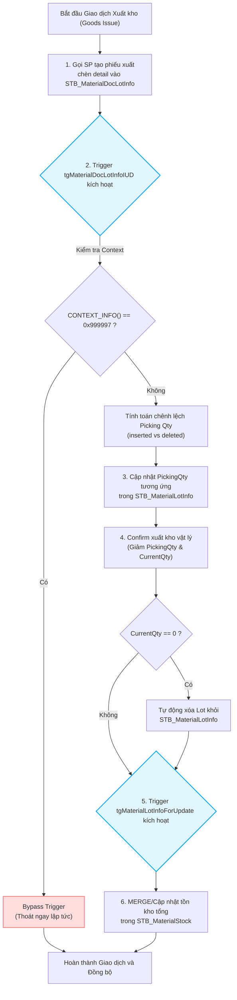

# KB_26 — Liên Kết Hệ Thống & Phân Tích Lỗi Logic

> **Màn hình liên quan:** B597, B530, C443, C512, C530, C546, HN551, FG00
> ← [Về INDEX](KB_INDEX.md)

---

## 1. 🔄 Luồng liên kết liên phòng ban vận hành (WMS ↔ Sản xuất ↔ QC ↔ Xuất hàng)

Hệ thống NAIS MES vận hành trơn tru dựa trên sự liên kết chặt chẽ về dữ liệu giữa các phòng ban. Luồng dữ liệu đi qua các công đoạn như sau:

```
[Kho WMS NVL] 
   │ (Nhập kho F330, tạo Lot ML... trong STB_MaterialLotInfo)
   ▼
[Sản xuất (Cuốn/Lắp ráp)] 
   │ (Scan Lot NVL tại B540/B597 -> Kiểm tra BOM/Hạn dùng -> Ghi STB_RawMaterialInputHist)
   ▼
[QC Inline (PQC)] 
   │ (Kiểm tra công đoạn tại C443 -> Nhập giá trị/số lượng lỗi vào STB_CommInspDocHistory)
   ▼
[Sản xuất chốt số lượng B530]
   │ (SP check IsRawMaterialInputFinish & CheckPQCInput -> Confirm và ghi STB_ProdRouteHist)
   ▼
[Đóng gói gộp thùng B523/B525]
   │ (Gộp thùng in tem Box/Carton -> Tạo PackingID/BoxID -> Lưu STB_MaterialLotInfo)
   ▼
[QC Audit xuất xưởng (OQC/FOQC)]
   │ (Kiểm mẫu tại C530/C546 -> Đánh giá Pass/Reject -> Cập nhật STB_VN_FINISHGOODS_forQCAudit)
   ▼
[Kho Thành phẩm & Xuất hàng]
   │ (Bắn mã box xuất kho -> SP check StatusCheck='Pass' -> Xuất Cargo và Sync Groupware)
```

---

## 2. 📦 Cơ chế trừ kho tự động (WMS ↔ Production Triggers)

Việc trừ tồn kho nguyên vật liệu khi đưa vào sản xuất không được thực hiện trực tiếp bằng câu lệnh `UPDATE` thủ công trong ứng dụng, mà được ủy thác cho cơ chế **Trigger liên hoàn** của database SQL Server:

### 2.1 Sơ Đồ Cơ Chế Trực Quan (Trigger Cascade Flowchart)



### Bước 1: Khởi tạo chứng từ xuất kho sản xuất (Goods Issue)
Khi sản xuất tiêu hao nguyên vật liệu, hệ thống gọi SP `usp_DoProcessProdGIMaterialForBarcode` để tạo một chứng từ xuất kho trong `STB_MaterialDocInfo` và chèn chi tiết lô vật tư vào `STB_MaterialDocLotInfo`.

### Bước 2: Kích hoạt Trigger chứng từ `tgMaterialDocLotInfoIUD`
Khi một dòng được chèn, sửa hoặc xóa trong `STB_MaterialDocLotInfo`, Trigger `tgMaterialDocLotInfoIUD` được kích hoạt tự động để cập nhật trạng thái lấy hàng (`PickingQty`) của Lot tương ứng trong `STB_MaterialLotInfo`.
*   **Cơ chế Bypass hủy chứng từ**: Khi hủy tài liệu xuất/nhập kho (qua SP `usp_DoCancelMaterialDoc`), hệ thống sẽ đặt `CONTEXT_INFO() = 0x999997`. Trigger kiểm tra điều kiện này và thoát ngay lập tức để tránh làm sai lệch lượng `PickingQty` (vốn được hoàn trả thủ công trong SP hủy):
    ```sql
    IF CONTEXT_INFO() = 0x999997 BEGIN
        RETURN
    END
    ```
*   **Cập nhật Picking Qty**:
    ```sql
    -- Khi xóa hoặc cập nhật chứng từ, PickingQty trong kho được hoàn trả
    WHEN MATCHED THEN
        UPDATE SET PickingQty = T.PickingQty - S.PickingQty;
    ```

### Bước 3: Confirm xuất kho vật lý và trừ tồn kho Lot
Khi thủ kho hoặc hệ thống xác nhận xuất kho vật lý (ví dụ qua SP `usp_DoProcessMaterialLotInfoOutput`):
* Hệ thống cập nhật giảm đồng thời `PickingQty` và `CurrentQty` (tồn kho thực tế của Lot):
  ```sql
  UPDATE STB_MaterialLotInfo
  SET PickingQty = PickingQty - @pUsedQty,
      CurrentQty = CurrentQty - @pUsedQty
  WHERE MaterialLotNo = @MaterialLotNo;
  ```
* Nếu số lượng tồn kho của Lot về bằng `0`, hệ thống sẽ tự động xóa Lot này khỏi bảng tồn kho hiện hành `STB_MaterialLotInfo`.

### Bước 4: Kích hoạt Trigger đồng bộ tồn kho tổng `tgMaterialLotInfoForUpdate`
Khi `CurrentQty` trong `STB_MaterialLotInfo` thay đổi, trigger `tgMaterialLotInfoForUpdate` lập tức được kích hoạt để đồng bộ lượng tồn kho tổng hợp trong bảng thống kê kho `STB_MaterialStock` (áp dụng MERGE tương tự để cộng dồn hoặc trừ bớt lượng `StockQty` thực tế).

---

## 3. 🐛 4 Lỗi Logic (Bugs) Hệ Thống Phát Hiện & Script Khắc Phục

Dưới đây là 4 lỗi logic lập trình được phát hiện trực tiếp từ việc kiểm tra mã nguồn Stored Procedures trong database:

### Bug 1: Logic chặn PQC Gate 3 bắt buộc phải có lỗi mới cho đi tiếp
*   **Vị trí:** SP `usp_CheckPQCInputForProductHistForBarcode`
*   **Triệu chứng:** Khi công nhân confirm sản lượng ở màn hình B530, hệ thống báo lỗi `"Bên PQC chưa nhập số lượng NG. Vui lòng bảo bên PQC nhập số lượng NG."` dù lô hàng hoàn toàn đạt chuẩn và QC đã nhập mã không lỗi (các mã đuôi `_00` như `V-22_00` đại diện cho Đạt chất lượng).
*   **Nguyên nhân gốc:** SP đếm số lượng bản ghi phế lỗi (`DRI.DefectSummaryNo`) trong `STB_DefectRepairInfo` nhưng loại trừ các mã lỗi Đạt (`flag = 'QC'`) trong hàm `fn_VVT_QCPARTCODE()`. 
    Do đó, nếu lô hàng không có lỗi thực tế (hoặc chỉ có mã đạt `_00`), biến `@NG_Count` bằng `0`. Khối lệnh kiểm tra `IF (ISNULL(@NG_Count, 0) <= 0)` kích hoạt và ném ra ngoại lệ chặn đứng sản xuất.
*   **Giải pháp khắc phục:** Sửa đổi SP để kiểm tra xem PQC đã thực hiện đánh giá chưa (có dòng ghi nhận trong `STB_DefectRepairInfo` bất kể mã lỗi hay mã đạt), thay vì bắt buộc phải có lỗi thực tế:
    ```sql
    -- SỬA ĐỔI ĐỀ XUẤT:
    -- Đếm tổng tất cả các đánh giá của PQC tại công đoạn (bao gồm cả mã Đạt '_00')
    SELECT
        @NG_Count = COUNT(DRI.DefectSummaryNo)
    FROM
        STB_DefectRepairInfo DRI WITH(NOLOCK)
        INNER JOIN STB_SetInfo SI WITH(NOLOCK) ON SI.ControlNo = DRI.ControlNo
        LEFT OUTER JOIN STB_DefectInfo DI WITH(NOLOCK) ON DI.DefectCode = DRI.DefectCode
    WHERE
        SI.Barcode = @pBarcode AND
        DRI.FindRouteCode = @pRouteCode AND
        DI.DirectlyUnder IN ('PQC'); -- Không loại trừ flag='QC' nữa để ghi nhận các mã '_00'
    ```

---

### Bug 2: Sự bất đối xứng (Khóa cứng) trong QC Audit Pass/Reject
*   **Vị trí:** SP `usp_VN_WaitingCheckBeforeExport_forQCAudit_Pass`
*   **Triệu chứng:** Tại màn hình duyệt QC Audit xuất kho, nếu người dùng lỡ tay bấm **Reject** một lô hàng, sau đó muốn bấm duyệt lại thành **Pass** thì hệ thống không cho phép cập nhật và nút Pass bị vô hiệu hóa. Ngược lại, nếu đang ở trạng thái **Pass**, nút **Reject** vẫn cho phép bấm tự do.
*   **Nguyên nhân gốc:** Trong SP Pass, điều kiện cập nhật chỉ chấp nhận khi trạng thái kiểm tra đang là `NULL`:
    ```sql
    ELSE IF (@getStatusCheck IS NULL)
        BEGIN
            UPDATE STB_VN_FINISHGOODS_forQCAudit SET StatusCheck = 'Pass' ...
        END
    ```
    Khi đã bị Reject, `StatusCheck = 'Reject'` (không phải `NULL`), dẫn đến khối lệnh UPDATE bị bỏ qua. Trái lại, trong SP Reject, không có cổng chặn trạng thái cũ, cho phép UPDATE đè thoải mái.
*   **Giải pháp khắc phục:** Cho phép cập nhật trạng thái từ `'Reject'` sang `'Pass'` để người dùng sửa sai khi thao tác nhầm:
    ```sql
    -- SỬA ĐỔI ĐỀ XUẤT:
    IF (@getStatusCheck = 'Pass')
        BEGIN
            RAISERROR(N'Packing này đã được đánh giá pass', 16, 1);
        END
    ELSE IF (@getStatusCheck IS NULL OR @getStatusCheck = 'Reject') -- Cho phép đổi từ Reject sang Pass
        BEGIN
            UPDATE STB_VN_FINISHGOODS_forQCAudit
            SET StatusCheck = 'Pass'
            WHERE ID = @pID;
        END
    ```

> 🚦 **Tham chiếu mở rộng:** Chi tiết yêu cầu giả định của khách hàng, phân loại Pattern C (One-Way State Lock) và checklist mở rộng cho QC Audit được tổng hợp tại **[KB_14 §6.3 Nhóm 7 — QC Audit](KB_14_TRACE_BUG_METHODOLOGY.md#nhóm-7-qc-audit--chặn-passreject-sp-usp_vn_waitingcheckbeforeexport_forqcaudit_pass)**.

---

### Bug 3: Hardcode địa điểm Bắc Giang gây ẩn dữ liệu ở các kho khác
*   **Vị trí:** SP `usp_VN_WaitingCheckBeforeExport_forQCAudit_get` và `usp_VN_WaitingCheckBeforeExport_forQCAudit_pass_get`
*   **Triệu chứng:** Khi mở màn hình kiểm định xuất xưởng tại nhà máy Hà Nam hoặc Hưng Yên, danh sách hàng chờ QC Audit bị trống rỗng, không hiển thị bất cứ dữ liệu nào.
*   **Nguyên nhân gốc:** Cả hai Stored Procedure tải dữ liệu chờ duyệt đều bị hardcode bộ lọc địa điểm:
    ```sql
    WHERE Flag = 1 AND FGLocation LIKE N'Bắc Giang'
    ```
*   **Giải pháp khắc phục:** Chuyển bộ lọc địa điểm thành tham số truyền vào từ UI hoặc bỏ lọc cứng nếu màn hình dùng chung cho toàn hệ thống:
    ```sql
    -- SỬA ĐỔI ĐỀ XUẤT:
    -- Thêm tham số @pFGLocation VARCHAR(50) = NULL vào SP
    -- Trong WHERE chỉnh thành:
*   **Vị trí:** Các SP `usp_VN_WaitingCheckBeforeExport_forQCAudit_get` và tương đương.
*   **Triệu chứng:** Các nhà máy Hà Nam/Hưng Yên không hiển thị dữ liệu.
*   **Giải pháp:** Thay lọc cứng bằng tham số động `(@pFGLocation IS NULL OR FGLocation LIKE @pFGLocation)`.

### Bug 4: Lỗi lọc typo biến `@Statusout` gây validation sai dòng dữ liệu
*   **Vị trí:** SP `usp_VN_Update_ExportExcel_BG_test_Audit` (Dòng 75)
*   **Triệu chứng:** Hệ thống báo lỗi chưa kiểm tra QC dù carton mới đã được Pass do nhầm lẫn logic `AND @Statusout IS NULL`.
*   **Giải pháp:** Đổi điều kiện lọc về đúng cột vật lý của bảng: `AND Statusout IS NULL`.

### Bug 5: Gate 20 phút không bao giờ hoạt động do so sánh với Null
*   **Vị trí:** SP `usp_DoProcessProdRouteHistForCalc_SmartApp_VNT` (Dòng 264)
*   **Triệu chứng:** Công nhân chốt công đoạn liên tục không bị cảnh báo Takt Time 20 phút.
*   **Nguyên nhân gốc:** So sánh `SIExtInt01 = Null` trong SQL Server trả về `UNKNOWN`.
*   **Giải pháp:** 
    ```sql
    -- Đổi toán tử so sánh từ = Null thành IS NULL
    IF @CompanyCode = 'VNT' AND @SIExtInt01 IS NULL AND @RouteIndex > 1 AND @RouteCode <> 'E-25' AND @RouteCode <> 'E-23'
    ```

### Bug 6: Rủi ro crash luồng chạy do lỗi phân tích định dạng Vendor Lot
*   **Vị trí:** Function `fn_VVT_getdatebyVendorLot` (Dòng 188)
*   **Triệu chứng:** Hệ thống crash với lỗi `Conversion failed` khi parse Vendor Lot cho mã `WRHI00-002`.
*   **Giải pháp:** Sử dụng `TRY_CONVERT` để tránh crash ứng dụng:
    ```sql
    when @materialcode='WRHI00-002' then ISNULL(convert(varchar(10), TRY_CONVERT(date, @vendorlot, 103), 120), '')
    ```

---

### Bug 7: Lỗi mất đồng bộ ngày sản xuất khi cập nhật hàng loạt (Batch Update)
*   **Vị trí:** Trigger `tgMaterialDocLotInfoIUD` (Dòng 268) trên bảng `STB_MaterialDocLotInfo`
*   **Triệu chứng:** Khi người dùng thực hiện cập nhật ngày sản xuất (`LotAttr10`) hàng loạt trên chứng từ nhập/xuất kho (ví dụ: qua file excel hoặc chỉnh sửa lưới hàng loạt), chỉ có duy nhất Lot có ID lớn nhất được đồng bộ ngày sản xuất sang bảng tồn kho `STB_MaterialLotInfo`. Tất cả các Lot khác cùng đợt cập nhật bị mất đồng bộ (vẫn giữ ngày cũ).
*   **Nguyên nhân gốc:** Trigger thực hiện kiểm tra thay đổi ngày sản xuất bằng cách so sánh hai biến đơn `@BefLotAttr10` và `@AftLotAttr10` (được SELECT từ bảng `deleted` và `inserted`). Nếu có thay đổi, trigger chạy lệnh:
    ```sql
    UPDATE STB_MaterialLotInfo
       SET LotAttr10 = @AftLotAttr10
     WHERE LotID = (SELECT MAX(LotID) FROM inserted)
    ```
    Do SQL Server Trigger chạy một lần cho toàn bộ câu lệnh (batch-level), bảng `inserted` có thể chứa nhiều dòng. Câu lệnh trên chỉ khớp và cập nhật duy nhất Lot có `MAX(LotID)`, bỏ qua toàn bộ các Lot khác trong cùng lô update.
*   **Giải pháp khắc phục:** Sửa câu lệnh UPDATE trong Trigger sử dụng phép JOIN trực tiếp để đồng bộ cho toàn bộ danh sách Lot bị ảnh hưởng:
    ```sql
    -- SỬA ĐỔI ĐỀ XUẤT:
    UPDATE T
       SET T.LotAttr10 = I.LotAttr10
      FROM STB_MaterialLotInfo T
      JOIN inserted I ON T.LotID = I.LotID
      JOIN deleted D ON I.LotID = D.LotID
     WHERE I.LotAttr10 <> D.LotAttr10;
    ```

---

## 4. 🏢 Phân Tích Liên Kết Stage Prices & Mẫu Route Nhà Máy Hưng Yên (VNES F4)

Nhà máy mới Hưng Yên (`WorkCenterCode = 'VVT_F4'`) sử dụng mô hình thiết lập riêng biệt cần lưu ý cho các nhà phát triển hệ thống:

### 4.1 Cấu Hình Mã Route Dạng `P-`
Khác với Bắc Giang (`V-xx`) hay Hà Nam (`VE-xx`), Hưng Yên định cấu hình các công đoạn lắp ráp/đóng gói bằng các route code dạng `P-` (ví dụ: `P-01`, `P-02`, `P-03`, `P-04`, `P-05`, `P-06`).

### 4.2 Ánh Xạ Stage Prices (Đơn Giá Công Đoạn)
Bảng Stage Prices (`STB_VVT_StagePrices`) không được thiết kế thêm các cột riêng cho Hưng Yên (như `RouteHYxx`). Thay vào đó:
*   Hệ thống ánh xạ các công đoạn `P-` của Hưng Yên vào các cột `RouteVP01` -> `RouteVP08` và đơn giá công đoạn vào `PriceVP01` -> `PriceVP08`.
*   Truy vấn lấy danh sách Stage Prices của Hưng Yên (thực thi qua SP `usp_getListStagePricesAndMaterialCodeHY`) thực hiện lọc:
    ```sql
    SELECT Model, RouteVP01, ..., RouteVP08, PriceVP01, ..., PriceVP08
    FROM STB_VVT_StagePrices 
    WHERE WorkCenterCode = 'VVT_F4'
    ```

### 4.3 Cơ Chế Ngắt Tự Động Cascade của Route `V-33` & `P-01`
*   Trong SP chốt sản lượng `ForCalc`, hệ thống có logic rẽ nhánh đặc biệt cho hai route này:
    ```sql
    if(@routecode IN ('V-33', 'P-01'))
    ```
*   Logic này thay đổi điều kiện tìm công đoạn tiếp theo từ `APOR.RouteIndex > POR.RouteIndex` thành `>=` (bao gồm cả dấu bằng).
*   Hậu quả là `@AftRouteCode` trỏ ngược lại chính nó (`V-33` hoặc `P-01`). Việc này ngăn hệ thống tự động ghi nhận bản ghi "Input" cho công đoạn sau, buộc trạm kế tiếp phải scan thủ công để khởi động Lot, đồng thời để lại trường `CompleteRoute` ở trạng thái rỗng (NULL).

---

## 5. ⚙️ Hệ Thống Tác Vụ Ngầm (Active Triggers & Agent Jobs Audit)

Hệ thống NAIS MES vận hành tự động một phần nhờ vào các Trigger và SQL Server Agent Jobs chạy ngầm trong database để đảm bảo tính nhất quán dữ liệu và đồng bộ liên nhà máy.

### 5.1 Các Triggers Hoạt Động Ngầm (Active Triggers)

Dưới đây là các trigger quan trọng đang hoạt động trên production database:

*   **Đồng bộ tồn kho tổng (`STB_MaterialLotInfo`):**
    *   *Triggers:* `tgMaterialLotInfoForInsert`, `tgMaterialLotInfoForUpdate`, `tgMaterialLotInfoForDelete`.
    *   *Chức năng:* Khi thủ kho nhập mới, xuất kho hoặc điều chỉnh số lượng của bất kỳ Lot nào trong `STB_MaterialLotInfo`, các trigger này tự động cập nhật tăng/giảm số lượng tồn kho tương ứng trong bảng thống kê tồn kho tổng `STB_MaterialStock` để đồng bộ dữ liệu.
*   **Tự động cập nhật Kế hoạch ngày (`DayPlanNo`):**
    *   *Triggers:* `utr_ProdRouteHist_DayPlanNo_iu` (trên `STB_ProdRouteHist`), `utr_STB_SetInfo_DayPlanNo_iu` (trên `STB_SetInfo`).
    *   *Chức năng:* Khi tạo mới hoặc cập nhật một Lot sản phẩm hoặc ghi nhận lịch sử quét công đoạn, trigger tự động truy vấn và gắn mã kế hoạch ngày `DayPlanNo` tương ứng từ `STB_DayProdPlan` nếu bị thiếu để đảm bảo dữ liệu báo cáo sản lượng chính xác.
*   **Đồng bộ tài liệu WMS (`STB_MaterialDocDetail`):**
    *   *Triggers:* `tgMaterialDocDetailForInsert`, `tgMaterialDocDetailForUpdate`, `tgMaterialDocDetailForDelete`.
    *   *Chức năng:* Tự động đồng bộ số lượng chi tiết yêu cầu xuất/nhập trong chứng từ giữa các bảng Detail và Master.

### 5.2 Các SQL Agent Jobs Chạy Định Kỳ (SQL Agent Jobs)

Hệ thống thiết lập các SQL Agent Jobs để thực hiện đồng bộ chéo giữa các nhà máy và cập nhật dữ liệu từ các hệ thống ngoại vi:

*   **Đồng bộ dữ liệu chéo Bắc Ninh ↔ Bắc Giang:**
    *   *Job `Tranfer_BacGiang_To_BacNinh`:* Thực thi SP `usp_VN_Finshed_Waiting_BG` để chuyển thông tin Lot/Packing bán thành phẩm sản xuất tại Bắc Giang đang chờ xử lý sang cơ sở dữ liệu của Bắc Ninh.
    *   *Job `Tranfer_BN_BG`:* Thực thi SP `usp_VN_Finshed_Waiting` để chuyển dữ liệu hàng chờ từ Bắc Ninh sang Bắc Giang.
*   **Đồng bộ dữ liệu kiểm định thành phẩm (`Transfer_FG00_To_C560`):**
    *   *Chức năng:* Chuyển dữ liệu thành phẩm đã đóng gói tại kho `FG00` Bắc Giang sang công đoạn kiểm tra OQC màn hình `C560` (Job `vvt_productreceipt560` / `vvt_productreceipt560` thực thi chèn tự động dữ liệu sang `C560`).
*   **Đồng bộ Master Data từ ERP Douzone (`ITF_?????`):**
    *   *Job `ITF_?????`:* Chạy các script đồng bộ định kỳ dữ liệu Khách hàng, Mã vật tư mới, BOM, Đơn hàng từ ERP Douzone và Groupware thông qua các bảng Bridge (`STB_ESM_...`) sang bảng Master của MES.
*   **Cảnh báo vận hành tự động (Email Alerts):**
    *   *Job `MakeMaterialExpirationEmailAlert`:* Định kỳ quét các lô nguyên vật liệu cận date hoặc đã hết hạn sử dụng trong `STB_MaterialLotInfo` để gửi email cảnh báo tự động cho bộ phận Kho và QC.
    *   *Job `MakeEmailEquipmentCalibrationCheck`:* Tự động gửi email cảnh báo các thiết bị đo/hiệu chuẩn sắp đến hạn kiểm định.
*   **Đồng bộ chấm công nhân sự:**
    *   *Job `SyncFingerData`:* Đồng bộ dữ liệu quét vân tay từ máy chấm công hiện trường về bảng nhân sự `STB_UserInfo` và giao ca.

### 5.3 Hướng dẫn cấu hình Database Mail cho Cảnh báo Tự động (Gộp từ KB_17)

Để các SQL Agent Jobs gửi email cảnh báo tự động thành công (như Job cảnh báo hết hạn nguyên vật liệu hoặc đến hạn hiệu chuẩn thiết bị đo), cơ sở dữ liệu SQL Server cần được cấu hình tính năng **Database Mail** làm cổng gửi thư SMTP qua tài khoản email công ty (Office 365 hoặc Google Workspace).

#### 1. Thông số cấu hình SMTP phổ biến
Tùy thuộc vào nền tảng email doanh nghiệp đang sử dụng:
*   **Microsoft Office 365 (Mặc định doanh nghiệp):**
    *   SMTP Server: `smtp.office365.com`
    *   Port: `587`
    *   SSL (Secure Connection): Bắt buộc chọn (Yes).
    *   Authentication: Basic authentication sử dụng email công ty và mật khẩu (hoặc App Password nếu tài khoản bật bảo mật 2 lớp MFA).
*   **Google Workspace (Gmail Doanh nghiệp):**
    *   SMTP Server: `smtp.gmail.com`
    *   Port: `587`
    *   SSL (Secure Connection): Bắt buộc chọn (Yes).
    *   Authentication: Basic authentication sử dụng email công ty và **Mật khẩu ứng dụng (App Password)** tạo từ tài khoản Google.

#### 2. Các bước cấu hình qua SSMS (SQL Server Management Studio)
1.  Kết nối vào SQL Server Database qua SSMS.
2.  Mở thư mục **Management** → Nhấp chuột phải vào **Database Mail** → Chọn **Configure Database Mail**.
3.  Chọn **Set up Database Mail by performing the following tasks** → Nhấn **Next**.
4.  Nhập tên **Profile Name** (ví dụ: `Vinatech_Alert`).
5.  Tại danh sách SMTP Accounts, nhấn **Add...** để khai báo tài khoản gửi:
    *   *Email Address:* Email công ty của bạn.
    *   *Server name / Port:* Thông số SMTP tương ứng ở trên.
    *   *SSL:* Tích chọn *This server requires a secure connection (SSL)*.
    *   *Authentication:* Chọn *Basic authentication*, nhập Email và Mật khẩu/App Password.
6.  Nhấn **OK** → **Next** cho tới khi hoàn tất.
7.  **Kiểm tra hoạt động:** Nhấp chuột phải vào **Database Mail** → Chọn **Send Test E-mail...**, nhập địa chỉ email nhận và nhấn gửi để xác nhận tính năng chạy bình thường.

*(Lưu ý: Sau khi cấu hình thành công Profile `Vinatech_Alert`, bạn có thể chỉ định Profile này trong cài đặt của các Job Agent như `MakeMaterialExpirationEmailAlert` để tự động gửi thông báo khi phát hiện lỗi).*

---
*Cập nhật: 2026-06-14 | Chứng thực và bổ sung thông tin từ database thực tế & Gộp nội dung cấu hình DB Mail từ KB_17*


---

## 6. Phân Hệ SCM, Rework, Trả Hàng & Kiểm Kê (Gộp từ KB_27)


> **Màn hình liên quan:** F750 (Kiểm kê), B618 (Lịch sử Rework), SCM01 (Sales Order), FG00/HN551 (Xuất kho thành phẩm), Return01 (Nhận hàng trả lại)
> ← [Về INDEX](KB_INDEX.md)

---

### 1. 🔄 Luồng SCM, Sales Order & Kế Hoạch Xuất Hàng (WMS ↔ Sales ↔ Cargo)

Hệ thống NAIS MES quản lý luồng bán hàng và xuất hàng thông qua mối liên kết từ Đơn đặt hàng (Sales Order) của bộ phận Kinh doanh cho tới chứng từ xuất kho thực tế (Delivery) của bộ phận Kho thành phẩm.

#### Sơ đồ luồng dữ liệu (Dataflow)
```
  [Bộ phận Kinh doanh] 
     │ (Nhập đơn hàng: STB_SalesOrder -> STB_SalesOrderItem)
     ▼
  [Kế hoạch Sản xuất] 
     │ (Sản xuất theo đơn PO/Model -> Đóng gói gộp box in PackingID)
     ▼
  [Kho Thành Phẩm] 
     │ (Quét PackingID đóng thùng thành phẩm -> Khớp PackingID vào ShipmentOrder)
     ▼
  [Bắn Barcode Xuất Hàng] 
     │ (Thao tác màn xuất Cargo -> Lưu OUT_ASN / Kết quả OUT_RSLT)
     ▼
  [Đồng bộ ERP / Groupware] 
     │ (Cập nhật giảm tồn kho thành phẩm thực tế)
     ▼
  [Cập nhật chi tiết lịch sử] 
     │ (Gọi SP usp_WarehouseDelivery_get)
```

#### Chi tiết các bảng liên quan (Table Schemas)
1. **`STB_SalesOrder` (Đơn đặt hàng):** Lưu trữ thông tin chung của đơn hàng (Mã đơn, Loại đơn `OrderType`, 거래처 `CustomerCode`, Ngày giao hàng yêu cầu `RequestDeliveryDate`).
2. **`STB_SalesOrderItem` (Chi tiết đơn hàng):** Chi tiết từng mặt hàng (`ModelCode`), số lượng đặt (`OrderQty`), số lượng đã sản xuất (`FixedQty`), số lượng kế hoạch xuất kho (`GIPlanQty`).
3. **`STB_ShipmentOrderInfo` (Thông tin xuất hàng):** Liên kết giữa Số lệnh xuất hàng (`ShipmentOrderNo`), Lô đóng gói (`PackingID`), Mã vật tư (`MaterialCode`) và Số lượng lấy hàng (`PickingQty`).
4. **`OUT_ASN` (Shipment Attempt Table) & `OUT_RSLT` (Shipment Result Table):** Hai bảng trung gian lưu thông tin xuất kho thành phẩm thực tế đi Cargo, liên kết qua `PACK_ID` (PackingID).

#### Stored Procedure Cốt Lõi: `usp_WarehouseDelivery_get`
Khi bộ phận vận hành hoặc PowerBI cần xem báo cáo xuất kho thành phẩm thực tế:
```sql
SELECT Substring(Convert(Varchar(10), RR.CRT_DT, 121), 0 ,12) AS WorkDate
      , RR.ITM_CD  AS Item_Cd
      , (SELECT SM.MaterialName FROM STB_MaterialMaster SM WHERE SM.MaterialCode = RR.ITM_CD) AS Item_Nm
      , RR.PACK_ID   AS PackingID
      , RR.ITM_QTY  AS ShipQty			  			  
      , CONVERT(BIT, 1) AS ShipStatus
FROM OUT_RSLT RR    -- Bảng kết quả xuất kho thực tế
     LEFT OUTER JOIN OUT_ASN RA ON RR.PACK_ID = RA.PACK_ID
    WHERE 1=1
   AND (Substring(Convert(Varchar(10), RR.CRT_DT, 121), 0 ,12) BETWEEN @FromDate AND @ToDate)
   AND RR.PACK_ID LIKE @PackingID
 ORDER BY WorkDate
```

---

### 2. 🛠️ Quy Trình Làm Lại Sản Phẩm (Rework Flow)

Khi phát hiện lô hàng bán thành phẩm hoặc thành phẩm không đạt chất lượng nhưng có thể tái chế/làm lại (Rework), bộ phận QC/Sản xuất sẽ thực hiện khai báo trên hệ thống để chuyển đổi lô hàng cũ sang trạng thái sản xuất lại.

#### Sơ đồ luồng dữ liệu Rework
```
  [Lô hàng lỗi/NG] ──> [Đánh giá QC] ──> [Khai báo Rework (B618)] 
                                                │
                                                ▼
                                    Tạo Lot Rework mới (LotNoRework)
                                                │
                                                ▼
                                    Ghi STB_LotReworkInfo_HN
                                                │
                                                ▼
                                    Chuyển lại dây chuyền chính
```

#### Chi tiết bảng `STB_LotReworkInfo_HN`
* `LotNo`: Mã lô ban đầu bị lỗi.
* `LotNoRework`: Mã lô làm lại mới được tạo ra để chạy tiếp trên Line.
* `MaterialCode`: Mã nguyên vật liệu/sản phẩm.
* `ReworkQty`: Số lượng làm lại.
* `CreateUserID` / `CreateDateTime`: Người thực hiện và thời gian khai báo.

#### SP Quản lý Rework: `usp_GetInforLotReworkHaNamFactory_uid`
Stored Procedure này xử lý thêm/sửa/xóa thông tin Lot Rework từ giao diện XML truyền vào.

#### 🐛 Bug Logic 1: Khóa cứng tài khoản người dùng thao tác Rework
* **Vị trí:** SP `usp_GetInforLotReworkHaNamFactory_uid` (Dòng 41-45)
* **Triệu chứng:** Khi quản lý sản xuất mới hoặc tài khoản vận hành khác (`vinaadmin`, v.v.) thực hiện khai báo Rework, hệ thống ném lỗi: `Bạn không có quyền vui lòng liên hệ EA !` và chặn đứng giao dịch.
* **Nguyên nhân gốc:** Lập trình viên hardcode danh sách tài khoản có quyền thao tác trực tiếp trong code SQL:
  ```sql
  IF (@pProcessUserID NOT IN ('HaiTrieu','hoangxuan','ngocanh','doanthao'))
  BEGIN
      RAISERROR(N'Bạn không có quyền vui lòng liên hệ EA !',16,1)
      RETURN;
  END
  ```
* **Giải pháp khắc phục:** Đã tạo bản vá SQL an toàn kết hợp cơ chế kiểm tra quyền hạn động qua `SmartFramework.dbo.STB_UserPermission` (cho ScreenID `'B618'`) và cơ chế Fallback danh sách user cũ để tránh làm gián đoạn sản xuất.
  * **Hotfix Script:** `04_FIX_REWORK_HARDCODED_PERMISSION.sql`
  * **Mã SQL thay thế:**
    ```sql
    -- Kiểm tra phân quyền động kết hợp Fallback an toàn
    DECLARE @HasPermission BIT = 0;
    IF @pProcessUserID IN ('vinaadmin', 'sa', 'vina_ea') SET @HasPermission = 1;
    IF @pProcessUserID IN ('HaiTrieu','hoangxuan','','ngocanh','doanthao') SET @HasPermission = 1;
    IF EXISTS (
        SELECT 1 FROM SmartFramework.dbo.STB_UserPermission 
        WHERE UserID = @pProcessUserID AND ScreenID = 'B618' AND Allow = 1
    ) SET @HasPermission = 1;

    IF @HasPermission = 0
    BEGIN
        RAISERROR(N'Bạn không có quyền thao tác Rework, vui lòng liên hệ bộ phận EA!', 16, 1);
        RETURN;
    END
    ```

> 🚦 **Tham chiếu mở rộng:** Chi tiết logic, mã SQL debug, và cách mở rộng cho phân quyền Rework được tổng hợp tại **[KB_14 §6.3 Nhóm 5 — Rework](KB_14_TRACE_BUG_METHODOLOGY.md#nhóm-5-b618--chặn-rework-sp-usp_getinforlotreworkhanamfactory_uid)**.

---

### 3. 📦 Phân Hệ Trả Hàng (Returns & RMA Flow)

Phân hệ Trả hàng giải quyết các trường hợp: (1) Trả lại nguyên vật liệu lỗi cho nhà cung cấp (Vendor Return) hoặc (2) Khách hàng trả lại thành phẩm lỗi (Customer Return).

#### Sơ đồ luồng xác thực và tạo nhãn trả hàng
```
  [Quét Barcode Lô hàng Trả] 
       │
       ▼
  [Xác thực thông tin: usp_DoValidateMaterialDocBarcodeForReturn]
       │ (Kiểm tra trạng thái nhập kho ARRIVAL & QC IQC Pass)
       ▼
  [Khai báo Tách/Trả hàng] 
       │
       ▼
  [Tạo mã/nhãn trả hàng: usp_DoCreateLabelForReturn]
       │ (Tự động sinh mã Lô mới qua usp_GetSerialRule)
       ▼
  [Ghi nhận vào STB_RouteMaterialLotInfo]
```

#### Chi tiết nghiệp vụ & Stored Procedures
1. **`STB_RouteMaterialLotInfo`:** Lưu thông tin lô vật tư trả lại sau khi được in nhãn mới để theo dõi trên chuyền hoặc xuất trả.
2. **`STB_MaterialLotSnapshot`:** Lưu ảnh chụp trạng thái tồn kho của Lô tại thời điểm trả hàng để đối soát.

#### 🐛 Bug Logic 2: Khóa cứng luồng trả hàng do bắt buộc kiểm định IQC
* **Vị trí:** SP `usp_DoValidateMaterialDocBarcodeForReturn` (Dòng 60-86)
* **Triệu chứng:** Khi thực hiện quét barcode để nhận hàng trả lại từ Khách hàng (Customer Return), hệ thống báo lỗi `"수입검사 합격처리가 되지 않았습니다."` (Chưa hoàn thành kiểm tra IQC đạt chất lượng).
* **Nguyên nhân gốc:** SP kiểm tra nếu loại tài liệu là Nhập kho (`@MaterialDocType = 'GR'`) và yêu cầu QC kiểm định (`@IsRequireQC = 1`), nó sẽ bắt buộc tìm thông tin 수입검사 (IQC - kiểm định mua hàng đầu vào) trong bảng `STB_MaterialQcInfo` với quyết định kiểm tra phải là `'P'` (Pass):
  ```sql
  IF @IsRequireQC = 1 BEGIN
      SELECT @InspectionType = MVM.InspectionType ...
      IF @InspectionType <> 'NONE' AND ISNULL(@MaterialIqcNo,'') = '' BEGIN
          EXEC usp_RaiseLocalizedError @ProcessLanguage, '수입검사의뢰 정보를 찾을 수 없습니다.' -- Không tìm thấy thông tin kiểm định IQC
          RETURN
      END
      
      SELECT @DecisionResult = MQI.DecisionResult FROM STB_MaterialQcInfo WHERE MaterialQcNo = @MaterialIqcNo
      IF @DecisionResult <> 'P' BEGIN
          EXEC usp_RaiseLocalizedError @ProcessLanguage, '수입검사 합격처리가 되지 않았습니다.' -- IQC chưa pass
          RETURN
      END
  END
  ```
  Tuy nhiên, hàng trả về từ khách hàng (Customer Return) là **Thành phẩm** do nhà máy sản xuất ra, không phải là Nguyên vật liệu mua ngoài nên hoàn toàn không đi qua quy trình IQC mua hàng đầu vào (IQC chỉ dành cho NVL nhà cung cấp). Điều này chặn đứng không cho phép nhận hàng khách trả lại.
* **Giải pháp khắc phục:** Đã tạo bản vá SQL an toàn để bỏ qua kiểm tra IQC đối với thành phẩm (FERT) hoặc bán thành phẩm (HALB) sản xuất nội bộ khi khách trả hàng, chỉ bắt buộc check IQC đối với NVL nhập mua ngoài (ROH).
  * **Hotfix Script:** `05_FIX_RETURNS_FG_IQC_VALIDATION.sql`
  * **Mã SQL thay thế:**
    ```sql
    -- Lấy loại vật tư từ STB_MaterialMaster để phân biệt
    SELECT @MaterialTypeCode = MaterialTypeCode FROM STB_MaterialMaster WHERE MaterialCode = @MaterialCode


    IF @MaterialDocType = 'GR' BEGIN
        -- Chỉ bắt buộc kiểm tra IQC nếu là Nguyên vật liệu mua ngoài (ROH)
        IF @IsRequireQC = 1 AND @MaterialTypeCode = 'ROH' BEGIN
            -- (Thực hiện logic check IQC cũ...)
        END
    END
    ```

> 🚦 **Tham chiếu mở rộng:** Chi tiết kịch bản lỗi trả hàng và giải thích luồng RMA được tổng hợp tại **[KB_14 §6.3 Nhóm 8 — Returns](KB_14_TRACE_BUG_METHODOLOGY.md#nhóm-8-returns--chặn-trả-hàng-sp-usp_dovalidatematerialdocbarcodeforreturn)**.

---

### 4. 📊 Quy Trình Kiểm Kê Kho Thực Tế (Stocktaking - F750)

Màn hình **[F750] Kiểm kê kho vật tư** dùng để đối soát số lượng tồn kho vật lý thực tế tại các vị trí trong kho so với số lượng sổ sách hiện thời trên MES.

#### Quy trình tự động cân bằng kho (Auto-reconciliation)
Khi người dùng bấm nút **Cập nhật kết quả kiểm kê (Apply Stocktaking)**:
1. **Đối soát số lượng:** SP `usp_DoApplyStocktakingToStock` so sánh `BasicQty` (Tồn sổ sách lúc tạo phiếu kiểm kê) với `StocktakingQty` (Tồn thực tế kiểm đếm được).
2. **Xử lý Hao hụt kho (BasicQty > StocktakingQty):**
   * Tự động sinh một chứng từ xuất kho ảo (`GIMaterialDocNo`) có loại là `GI_STOCKTAKING` và trạng thái `FINISH`.
   * Gọi SP `usp_DoMakeMaterialDocDetailLotForStocktaking` để tạo bản ghi giảm số lượng trong `STB_MaterialDocLotInfo`.
3. **Xử lý Thặng dư kho (BasicQty < StocktakingQty):**
   * Tự động sinh một chứng từ nhập kho ảo (`GRMaterialDocNo`) có loại là `GR_STOCKTAKING` và trạng thái `FINISH`.
   * Gọi SP `usp_DoMakeMaterialDocDetailLotForStocktaking` để tạo bản ghi tăng số lượng trong `STB_MaterialDocLotInfo`.
4. **Xác nhận giao dịch:** Chạy SP `usp_DoFixMaterialDoc` để chốt lượng xuất/nhập ảo này, tự động kích hoạt trigger cập nhật `STB_MaterialLotInfo.CurrentQty` và `STB_MaterialStock.StockQty`.
5. **Cập nhật thuộc tính:** Cập nhật vị trí kho mới, PackingID mới và gán `IsApplied = 1` trong bảng `STB_StocktakingPlanResult`.

```
                  ┌──────────────────────────────┐
                  │ So sánh BasicQty vs CountQty │
                  └──────────────┬───────────────┘
                                 │
                 ┌───────────────┴───────────────┐
                 ▼                               ▼
       [BasicQty > CountQty]           [BasicQty < CountQty]
         (Hao hụt kho)                   (Thừa tồn kho)
                 │                               │
  ┌──────────────▼──────────────┐ ┌──────────────▼──────────────┐
  │ Tạo phiếu xuất kho ảo GI     │ │ Tạo phiếu nhập kho ảo GR     │
  │ loại GI_STOCKTAKING         │ │ loại GR_STOCKTAKING         │
  └──────────────┬──────────────┘ └──────────────┬──────────────┘
                 │                               │
                 └───────────────┬───────────────┘
                                 ▼
                    ┌─────────────────────────┐
                    │ Chạy SP DoFixMaterialDoc│
                    │ Cân bằng tồn kho sổ sách│
                    └─────────────────────────┘
```

---

### 5. 🔬 Nghiên Cứu Điển Hình: Tự Động Tách Lô Giá Đỡ (Substrate Splitting Case Study)

Hệ thống NAIS MES có một thiết kế nghiệp vụ cực kỳ đặc thù cho việc tách lô vật liệu **Giá đỡ / Chất mang (Substrate - 지지체)**. Việc tách lô này không sử dụng màn hình chia Lot thông thường, mà **mượn cơ chế tự động kiểm kê (Stocktaking)** để thực hiện nhằm tránh việc tạo các chứng từ xuất/nhập phức tạp trên WMS.

#### SP Thực thi: `usp_DoMakeStocktakingPlanResultForSupport`
Quy trình diễn ra như sau:
1. **Kiểm tra trạng thái:** Đảm bảo lô gộp (`MergeLotID`) chưa được xác nhận hoàn thành (`IsFixed = 0`).
2. **Xác thực vị trí kho:** Kiểm tra xem lô nguyên liệu gốc có nằm trong cùng một kho công đoạn (`IsRouteWarehouse = 1`) hay không. Nếu nằm phân tán, chặn giao dịch:
   ```sql
   IF @MaterialWarehouseCode NOT IN (SELECT MaterialWarehouseCode FROM STB_MaterialWarehouse WHERE IsRouteWarehouse = 1) BEGIN
       EXEC usp_RaiseLocalizedError @pProcessLanguage, '원자재가 공정창고에 없습니다...' -- Nguyên liệu phải được xuất kho lên Line trước khi chia nhỏ.
       RETURN
   END
   ```
3. **Khởi tạo chứng từ kiểm kê ảo:** Tạo một mã phiếu kiểm kê mới trong `STB_StocktakingDoc` và chèn các dòng dữ liệu vào `STB_StocktakingPlanResult`:
   * **Lô gốc (Original Lots):** Gán số lượng kiểm kê thực tế bằng `0` (làm trống tồn kho lô gốc).
   * **Lô gộp mới (Merged Lot):** Gán số lượng kiểm kê thặng dư bằng lượng còn lại (`TotalMergeQty - TotalSplitQty`).
   * **Các lô con tách nhỏ (Split Lots):** Gán số lượng kiểm kê bằng lượng tách (`SplitQty`).
4. **Cân bằng tự động:** Gọi SP `usp_DoApplyStocktakingToStock` để thực hiện giao dịch GI/GR ảo, từ đó xóa các lô gốc và tạo mới các lô con trong bảng tồn kho `STB_MaterialLotInfo`.
5. **Khóa giao dịch:** Đổi trạng thái `IsFixed = 1` trong bảng lịch sử tách lô `STB_SupportRawMaterialSplitHist`.

> [!TIP]
> **Nhận xét kiến trúc:** Việc sử dụng cơ chế Kiểm kê (`Stocktaking`) để thực hiện tác vụ chia lô (Split Lot) là một giải pháp thiết kế thông minh giúp bypass các quy trình xét duyệt rườm rà của thủ kho WMS. Tuy nhiên, điều này sẽ tạo ra hàng loạt chứng từ `GI_STOCKTAKING`/`GR_STOCKTAKING` ảo trong lịch sử kho, có thể gây nhiễu cho việc đối soát dữ liệu kế toán kho trên ERP (Douzone Groupware).

---
*Cập nhật: 2026-06-10 | Phân tích chi tiết quy trình SCM, Returns, Rework và Stocktaking thực tế từ Database SmartFactoryV2 và SmartFramework*

---

## Appendix — ESM Bridge Tables (DB Verified 2026-06-18)

> **19 tables** prefix `ESM_` trong SmartFactoryV2 — cầu nối dữ liệu **ERP ↔ MES**

### ESM Bridge Table Inventory

| Table | Mô tả | Hướng sync |
|---|---|---|
| **`ESM_DayProdPlan`** | ★ Kế hoạch ngày (sync từ ERP) | ERP → MES |
| `ESM_DayProdPlanBatchLog` | Log batch sync DPP | — |
| `ESM_DayProdPlanClose` | DPP đã đóng | MES → ERP |
| `ESM_DayProdPlanError` | Lỗi sync DPP | — |
| `ESM_DayProdPlanNotData` | DPP không có data | — |
| `ESM_DayProdPlanUpdateTarget` | Target update DPP | ERP → MES |
| `ESM_DirectDayProdPlan` | DPP trực tiếp | ERP → MES |
| `ESM_DirectDayProdPlanHead` | Header DPP trực tiếp | ERP → MES |
| **`ESM_ProdRouteHist`** | ★ Lịch sử routing (sync lên ERP) | MES → ERP |
| `ESM_ProdRouteLotHist` | Lot routing history | MES → ERP |
| `ESM_ProdCollectionSetting` | Cài đặt thu thập SX | Config |
| **`ESM_RawMaterialInputHist`** | ★ Lịch sử nhập NVL | MES → ERP |
| `ESM_RawMaterialLotInputHist` | Lot NVL nhập chi tiết | MES → ERP |
| `ESM_DefectInfo` | Thông tin lỗi sync | MES → ERP |
| `ESM_DefectInfoErr` | Lỗi sync defect | — |
| `ESM_LotUpdateTarget` | Target update Lot | ERP → MES |
| `ESM_QtPlanTemp` | QT Plan tạm | Temp |
| `ESM_SyncDeleteTarget` | Target xóa sync | ERP → MES |
| `ESM_WarehouseInOutHist` | ★ Lịch sử nhập/xuất kho | MES → ERP |

> [!NOTE]
> **Pattern ESM Bridge:** Mỗi bảng ESM_ là "hộp thư trung gian" — MES ghi vào bảng ESM → Agent Job đọc bảng ESM → Push lên ERP. Nếu sync fail → error log vào bảng `_Error`/`_Err`. Kiểm tra bảng error khi data ERP-MES bị lệch.

---

*Cập nhật: 2026-06-18 — Bổ sung Appendix: ESM Bridge Tables (19 tables, ERP↔MES sync). DB verified.*
