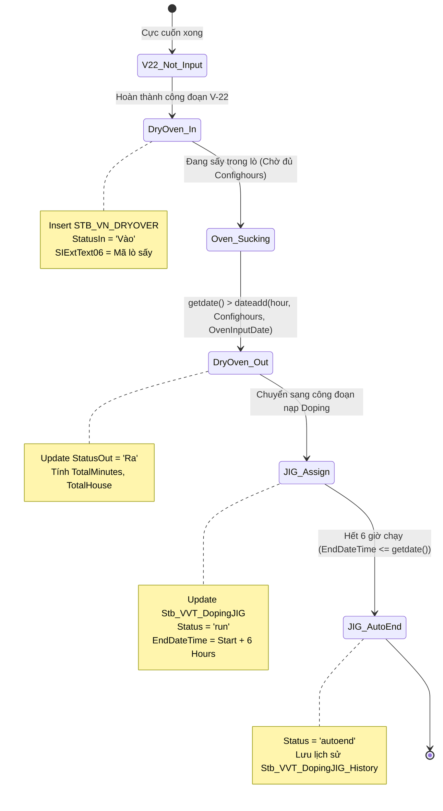
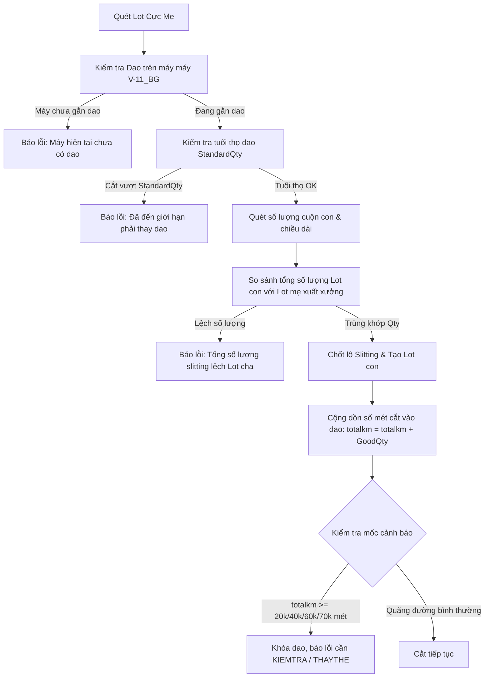

# 📕 KB_30: Thiết Bị Phụ Trợ MES — Lò Sấy, Gá Doping & Dao Cắt Slitting

> **Môi trường:** SmartFactoryV2 & SmartFramework trên dbserver.hycap.co.kr,5398
> **Ngày cập nhật:** 2026-06-10

---

## 1. Bản Chất Nghiệp Vụ & Quy Trình Thực Tế (Operational Flow)
Trong nhà máy sản xuất tụ điện Vinatech, ngoài các thiết bị chính trên dây chuyền, các thiết bị phụ trợ (Lò sấy - Dry Oven, Đồ gá nạp - Doping JIG, Dao chia cuộn - Slitting Knife) đóng vai trò quyết định đến chất lượng sản phẩm (chống bavia, ẩm, hoặc bóc tách điện cực lỗi). Hệ thống MES theo dõi chặt chẽ vòng đời và thông số của các thiết bị này.

*   **Lò sấy cực (Dry Oven):** Cực tụ sau khi cuốn/phết cần được sấy khô trong lò. MES theo dõi thời gian sấy tối thiểu (tùy theo từng chủng loại sản phẩm) và bắt buộc phải ghi nhận các thông số áp suất, nhiệt độ lúc vào/ra lò.
*   **Gá nạp Doping (Doping JIG):** Công đoạn lão hóa sơ bộ bằng cách nạp điện cực thông qua đồ gá (JIG). JIG được gán với Lot điện cực trên MES và chạy trong chu kỳ sạc/nạp mặc định là **6 giờ**.
*   **Dao cắt Slitting (Slitting Cutter & Knife):** Lưỡi dao chia cuộn cực mẹ thành cuộn cực con. Hệ thống MES giám sát số mét đã cắt (tuổi thọ thực tế) và số lần cắt của từng lưỡi dao để đưa ra cảnh báo kiểm tra định kỳ hoặc khóa máy bắt buộc phải thay dao nhằm ngăn ngừa bavia gây chập tụ.

---

## 2. Luồng Dữ Liệu & Máy Trạng Thái (Data Flow & State Machine)

### 2.1. Sơ đồ Luồng Trạng Thái Lò Sấy & Gá Doping


### 2.2. Sơ đồ Luồng Cắt Cuộn Cực & Giám Sát Tuổi Thọ Dao Slitting


---

## 3. Bản Đồ Database: Bảng & Stored Procedures Cốt Lõi

### 3.1. Các bảng CSDL liên quan (`SmartFactoryV2`)
*   `SmartFactoryV2.dbo.STB_VN_DRYOVER`: Lưu trữ thông tin chi tiết các ca sấy tụ (Barcode, mã lò, ngày vào, ngày ra, nhiệt độ, áp suất, trạng thái Vào/Ra).
*   `SmartFactoryV2.dbo.Stb_VVT_DopingJIG`: Lưu thông tin gán đồ gá JIG đang chạy nạp điện cực tụ.
*   `SmartFactoryV2.dbo.Stb_VVT_DopingJIG_History`: Lưu lịch sử sử dụng của đồ gá JIG sau khi kết thúc chu kỳ.
*   `SmartFactoryV2.dbo.Stb_Vietnam_SlitCutter`: Theo dõi quãng đường cắt (mét) của lưỡi dao slitting thế hệ cũ.
*   `SmartFactoryV2.dbo.STB_VN_SlittingKnifeInfo`: Danh mục lưỡi dao slitting thế hệ mới, cấu hình tuổi thọ tối đa (`StandardQty`).
*   `SmartFactoryV2.dbo.STB_VN_SlittingKnifeInUse`: Theo dõi lưỡi dao nào đang được lắp trên máy cắt chia cuộn nào (`MachineCode`).
*   `SmartFactoryV2.dbo.STB_ElectrodeSlittingResult`: Lưu trữ kết quả phân tách cuộn cực, liên kết với `SlittingKnifeLotID`.
*   `SmartFactoryV2.dbo.Stb_SlittingStock_VVT`: Tồn kho bán thành phẩm cuộn cực con sau khi slitting.

### 3.2. Các Stored Procedures (SPs) chính
*   `usp_VN_DryOver`: Xử lý logic vào lò và ra lò cho Lot cực, kiểm tra điều kiện tiên quyết và tính toán thời gian sấy đạt chuẩn.
*   `usp_VN_AddDryOven`: SELECT dữ liệu lò sấy theo Barcode và hiển thị đánh giá chất lượng sấy.
*   `usp_Vietnam_DryOven_iud`: Cập nhật thông số áp suất, nhiệt độ lò sấy do công nhân nhập từ giao diện UI.
*   `usp_Vietnam_DopingJIG_uid`: Xử lý gán Lot tụ vào đồ gá JIG, tự động ngắt JIG sau 6 giờ và lưu trữ lịch sử nạp.
*   `usp_DoSlittingLot`: Thực hiện phân tách cuộn cực con, tự động tính diện tích tồn kho ($m^2$) theo công thức tỉ lệ chiều rộng.
*   `usp_ChotSlittingLot`: Chốt lô chia cuộn cực, kiểm tra đối soát tổng số lượng cực con có khớp 100% với cực mẹ không.
*   `usp_DoCreateSlittingResult`: Tạo barcode và kết quả cuộn cực con, tích hợp kiểm tra giới hạn tuổi thọ dao slitting.
*   `usp_Vietnam_SlitCutter_iud`: Cộng dồn mét cắt và đưa ra cảnh báo kiểm tra định kỳ lưỡi dao theo các mốc 20k/40k/60k/70k mét.
*   `usp_VN_ExportSlittingKnife_iud`: Nghiệp vụ lắp lưỡi dao slitting mới vào máy chia cuộn.
*   `usp_VN_ImportSlittingKnife_iud`: Nghiệp vụ thu hồi lưỡi dao slitting về kho.

---

## 4. Phân Tích Logic Code & Validation Checks

### 4.1. Cấu hình thời gian sấy lò theo từng chủng loại sản phẩm (`usp_VN_DryOver`)
Thời gian sấy bắt buộc khác nhau phụ thuộc vào mã vật liệu (`MaterialCode`):
```sql
DECLARE @Confighours INT = 0
SET @Confighours = CASE 
    WHEN @MaterialCodes IN ('ECVT27-382','ECVT30-333','ECVT27-353','ECVT30-250','ECVT30-262',...) THEN 3  -- Sấy cực nhanh 3 giờ
    WHEN @MaterialCodes IN ('LIVT38-016','LIVT38-009','LIVT38-027') THEN 12                                 -- Sấy tiêu chuẩn 12 giờ
    WHEN @MaterialCodes IN ('ECVT27-358','ECVT27-369','ECVT30-271',...) THEN 15                             -- Sấy sâu 15 giờ
    WHEN @MaterialCodes IN ('ECVT27-247','ECVT30-115','ECVT30-316',...) THEN 20                             -- Sấy sâu 20 giờ
    WHEN @MaterialCodes IN ('ECVT30-357') THEN 30                                                           -- Sấy đặc biệt 30 giờ
    ELSE 9                                                                                                  -- Mặc định sấy 9 giờ
END
```
Hệ thống kiểm tra nếu thời gian hiện tại chưa vượt qua thời gian vào lò cộng với `@Confighours` thì sẽ chặn không cho làm thủ tục ra lò.

### 4.2. Công thức tính toán diện tích tồn kho cực Slitting (`usp_DoSlittingLot`)
Số lượng tồn kho của cuộn cực con sau khi slitting (`CurrentQty`) không tính bằng số cuộn mà tính bằng diện tích ($m^2$):
$$\text{CurrentQty} = \text{LengthSlitting} \times \left(\frac{\text{WidthSlitting}}{1000}\right)$$
```sql
# 📕 KB_30: Thiết Bị Phụ Trợ MES — Lò Sấy, Gá Doping & Dao Cắt Slitting

> **Môi trường:** SmartFactoryV2 & SmartFramework trên dbserver.hycap.co.kr,5398
> **Ngày cập nhật:** 2026-06-10

---

## 1. Bản Chất Nghiệp Vụ & Quy Trình Thực Tế (Operational Flow)
Trong nhà máy sản xuất tụ điện Vinatech, ngoài các thiết bị chính trên dây chuyền, các thiết bị phụ trợ (Lò sấy - Dry Oven, Đồ gá nạp - Doping JIG, Dao chia cuộn - Slitting Knife) đóng vai trò quyết định đến chất lượng sản phẩm (chống bavia, ẩm, hoặc bóc tách điện cực lỗi). Hệ thống MES theo dõi chặt chẽ vòng đời và thông số của các thiết bị này.

*   **Lò sấy cực (Dry Oven):** Cực tụ sau khi cuốn/phết cần được sấy khô trong lò. MES theo dõi thời gian sấy tối thiểu (tùy theo từng chủng loại sản phẩm) và bắt buộc phải ghi nhận các thông số áp suất, nhiệt độ lúc vào/ra lò.
*   **Gá nạp Doping (Doping JIG):** Công đoạn lão hóa sơ bộ bằng cách nạp điện cực thông qua đồ gá (JIG). JIG được gán với Lot điện cực trên MES và chạy trong chu kỳ sạc/nạp mặc định là **6 giờ**.
*   **Dao cắt Slitting (Slitting Cutter & Knife):** Lưỡi dao chia cuộn cực mẹ thành cuộn cực con. Hệ thống MES giám sát số mét đã cắt (tuổi thọ thực tế) và số lần cắt của từng lưỡi dao để đưa ra cảnh báo kiểm tra định kỳ hoặc khóa máy bắt buộc phải thay dao nhằm ngăn ngừa bavia gây chập tụ.

---

## 2. Luồng Dữ Liệu & Máy Trạng Thái (Data Flow & State Machine)

### 2.1. Sơ đồ Luồng Trạng Thái Lò Sấy & Gá Doping


### 2.2. Sơ đồ Luồng Cắt Cuộn Cực & Giám Sát Tuổi Thọ Dao Slitting


---

## 3. Bản Đồ Database: Bảng & Stored Procedures Cốt Lõi

### 3.1. Các bảng CSDL liên quan (`SmartFactoryV2`)
*   `SmartFactoryV2.dbo.STB_VN_DRYOVER`: Lưu trữ thông tin chi tiết các ca sấy tụ (Barcode, mã lò, ngày vào, ngày ra, nhiệt độ, áp suất, trạng thái Vào/Ra).
*   `SmartFactoryV2.dbo.Stb_VVT_DopingJIG`: Lưu thông tin gán đồ gá JIG đang chạy nạp điện cực tụ.
*   `SmartFactoryV2.dbo.Stb_VVT_DopingJIG_History`: Lưu lịch sử sử dụng của đồ gá JIG sau khi kết thúc chu kỳ.
*   `SmartFactoryV2.dbo.Stb_Vietnam_SlitCutter`: Theo dõi quãng đường cắt (mét) của lưỡi dao slitting thế hệ cũ.
*   `SmartFactoryV2.dbo.STB_VN_SlittingKnifeInfo`: Danh mục lưỡi dao slitting thế hệ mới, cấu hình tuổi thọ tối đa (`StandardQty`).
*   `SmartFactoryV2.dbo.STB_VN_SlittingKnifeInUse`: Theo dõi lưỡi dao nào đang được lắp trên máy cắt chia cuộn nào (`MachineCode`).
*   `SmartFactoryV2.dbo.STB_ElectrodeSlittingResult`: Lưu trữ kết quả phân tách cuộn cực, liên kết với `SlittingKnifeLotID`.
*   `SmartFactoryV2.dbo.Stb_SlittingStock_VVT`: Tồn kho bán thành phẩm cuộn cực con sau khi slitting.

### 3.2. Các Stored Procedures (SPs) chính
*   `usp_VN_DryOver`: Xử lý logic vào lò và ra lò cho Lot cực, kiểm tra điều kiện tiên quyết và tính toán thời gian sấy đạt chuẩn.
*   `usp_VN_AddDryOven`: SELECT dữ liệu lò sấy theo Barcode và hiển thị đánh giá chất lượng sấy.
*   `usp_Vietnam_DryOven_iud`: Cập nhật thông số áp suất, nhiệt độ lò sấy do công nhân nhập từ giao diện UI.
*   `usp_Vietnam_DopingJIG_uid`: Xử lý gán Lot tụ vào đồ gá JIG, tự động ngắt JIG sau 6 giờ và lưu trữ lịch sử nạp.
*   `usp_DoSlittingLot`: Thực hiện phân tách cuộn cực con, tự động tính diện tích tồn kho ($m^2$) theo công thức tỉ lệ chiều rộng.
*   `usp_ChotSlittingLot`: Chốt lô chia cuộn cực, kiểm tra đối soát tổng số lượng cực con có khớp 100% với cực mẹ không.
*   `usp_DoCreateSlittingResult`: Tạo barcode và kết quả cuộn cực con, tích hợp kiểm tra giới hạn tuổi thọ dao slitting.
*   `usp_Vietnam_SlitCutter_iud`: Cộng dồn mét cắt và đưa ra cảnh báo kiểm tra định kỳ lưỡi dao theo các mốc 20k/40k/60k/70k mét.
*   `usp_VN_ExportSlittingKnife_iud`: Nghiệp vụ lắp lưỡi dao slitting mới vào máy chia cuộn.
*   `usp_VN_ImportSlittingKnife_iud`: Nghiệp vụ thu hồi lưỡi dao slitting về kho.

---

## 4. Phân Tích Logic Code & Validation Checks

### 4.1. Cấu hình thời gian sấy lò theo từng chủng loại sản phẩm (`usp_VN_DryOver`)
Thời gian sấy bắt buộc khác nhau phụ thuộc vào mã vật liệu (`MaterialCode`):
```sql
DECLARE @Confighours INT = 0
SET @Confighours = CASE 
    WHEN @MaterialCodes IN ('ECVT27-382','ECVT30-333','ECVT27-353','ECVT30-250','ECVT30-262',...) THEN 3  -- Sấy cực nhanh 3 giờ
    WHEN @MaterialCodes IN ('LIVT38-016','LIVT38-009','LIVT38-027') THEN 12                                 -- Sấy tiêu chuẩn 12 giờ
    WHEN @MaterialCodes IN ('ECVT27-358','ECVT27-369','ECVT30-271',...) THEN 15                             -- Sấy sâu 15 giờ
    WHEN @MaterialCodes IN ('ECVT27-247','ECVT30-115','ECVT30-316',...) THEN 20                             -- Sấy sâu 20 giờ
    WHEN @MaterialCodes IN ('ECVT30-357') THEN 30                                                           -- Sấy đặc biệt 30 giờ
    ELSE 9                                                                                                  -- Mặc định sấy 9 giờ
END
```
Hệ thống kiểm tra nếu thời gian hiện tại chưa vượt qua thời gian vào lò cộng với `@Confighours` thì sẽ chặn không cho làm thủ tục ra lò.

### 4.2. Công thức tính toán diện tích tồn kho cực Slitting (`usp_DoSlittingLot`)
Số lượng tồn kho của cuộn cực con sau khi slitting (`CurrentQty`) không tính bằng số cuộn mà tính bằng diện tích ($m^2$):
$$\text{CurrentQty} = \text{LengthSlitting} \times \left(\frac{\text{WidthSlitting}}{1000}\right)$$
```sql
SELECT @WidthSlitting = [width] FROM STB_WidthSlitting WHERE MaterialCode = @MaterialCode
-- Lấy chiều rộng (mm) chia cho 1000 để đổi ra mét, nhân với chiều dài cắt (mét) để tính diện tích m2
INSERT INTO STB_MaterialLotInfo (... CurrentQty, LengthSlitting ...)
VALUES (..., @LengthSlitting * (@WidthSlitting*(1.0)/1000), @LengthSlitting)
```

---

## 5. Danh Sách Lỗi Logic, Điểm Yếu & Giải Pháp (Bugs & Troubleshooting)

### 🔴 Bug #1: Lỗi toán tử SQL bypass kiểm tra công đoạn V-22 bắt buộc (`usp_VN_DryOver`)
*   **Chi tiết & Giải pháp:** Xem chi tiết tại [KB_SCREEN_BUG_REF.md#lỗi-1-lỗi-toán-tử-sql-bypass-kiểm-tra-công-đoạn-sấy-v-22-bắt-buộc](KB_SCREEN_BUG_REF.md#lỗi-1-lỗi-toán-tử-sql-bypass-kiểm-tra-công-đoạn-sấy-v-22-bắt-buộc).

### 🔴 Bug #2: Bug thời gian ghi nhận lịch sử Doping JIG khiến mất dữ liệu log (`usp_Vietnam_DopingJIG_uid`)
*   **Chi tiết & Giải pháp:** Xem chi tiết tại [KB_SCREEN_BUG_REF.md#lỗi-1-lỗi-thời-gian-ghi-nhận-lịch-sử-jig-khiến-mất-dữ-liệu-log-khi-tự-động-ngắt](KB_SCREEN_BUG_REF.md#lỗi-1-lỗi-thời-gian-ghi-nhận-lịch-sử-jig-khiến-mất-dữ-liệu-log-khi-tự-động-ngắt).

### 🔴 Bug #3: Mismatch logic tuổi thọ dao và Hardcode địa lý Bắc Giang (`usp_DoCreateSlittingResult`)
*   **Chi tiết & Giải pháp:** Xem chi tiết tại [KB_SCREEN_BUG_REF.md#lỗi-2-mismatch-logic-tính-tuổi-thọ-dao-slitting-và-hardcode-địa-lý-bắc-giang](KB_SCREEN_BUG_REF.md#lỗi-2-mismatch-logic-tính-tuổi-thọ-dao-slitting-và-hardcode-địa-lý-bắc-giang).
