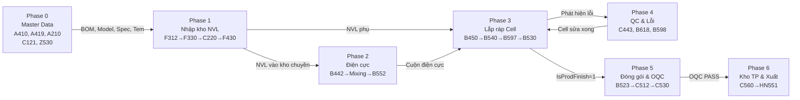

# 🗺️ PROCESS FLOW MAP — Bản Đồ Luồng Đi Màn Hình Nhà Máy MES Vinatech

> **Mục tiêu:** Bản đồ điều hướng duy nhất để hiểu quy trình vận hành nhà máy đi qua màn hình nào, theo thứ tự nào, liên kết thế nào, và đọc tài liệu chi tiết ở đâu.  
> **Nguyên tắc:** File này CHỈ CHỨA LINK — nội dung chi tiết nằm ở các KB/doc chuyên biệt.  
> **Cập nhật:** 2026-06-27 | **Tổng:** 81 file .md (không tính node_modules)  
> ← [Về INDEX](KB_INDEX.md)

---

## 📋 BẢN ĐỒ TÀI LIỆU — ĐỌC FILE NÀO, KHI NÀO?

### Nhóm 1: Điều Hướng & Tổng Quan (Đọc đầu tiên)

| Tài liệu | Nội dung | Khi nào đọc |
|---|---|---|
| **[PROCESS_FLOW_MAP.md](PROCESS_FLOW_MAP.md)** | **File này** — Bản đồ luồng đi & link | Đọc đầu tiên khi cần hiểu quy trình |
| [KB_INDEX.md](KB_INDEX.md) | Bảng tra cứu chính: TABLE→KB, SCREEN→KB, Triệu chứng→KB | Khi cần debug hoặc tra cứu nhanh |
| [VNT_VVT_MES_OPERATIONAL_CURRICULUM.md](VNT_VVT_MES_OPERATIONAL_CURRICULUM.md) | Giáo trình học tập 6 phần + SQL trace + lộ trình đọc KB | Khi mới vào, cần học bài bản |

### Nhóm 2: Hướng Dẫn Thao Tác Chi Tiết (Đọc khi cần "bấm nút nào")

| Tài liệu | Nội dung | Khi nào đọc |
|---|---|---|
| [VNT_VVT_MES_OPERATIONAL_GUIDE_E2E.md](VNT_VVT_MES_OPERATIONAL_GUIDE_E2E.md) | Thao tác chi tiết Step-by-step + biến đổi DB từng bước | Khi cần biết bấm nút nào, quét gì, DB thay đổi gì |
| [ALL_SCREENS_DOCUMENTATION.md](ALL_SCREENS_DOCUMENTATION.md) | Tài liệu chi tiết 129 màn hình: SP, View, Action, DB table | Khi cần tra cứu kỹ thuật 1 màn hình cụ thể |
| [in_tem_b523_va_design_z530.md](in_tem_b523_va_design_z530.md) | Nghiên cứu sâu B523 (17 nút, 9 validation gates) + Z530 (thiết kế tem) | Khi debug in tem / đóng gói |

### Nhóm 3: KB Chuyên Sâu (Đọc theo vấn đề)

| Phân hệ | KB File | Khi nào đọc |
|---|---|---|
| Kho WMS | [KB_02/](KB_02/INDEX.md) (4 chunks) | NVL, FIFO, Hạn dùng, Kho TP |
| Sản xuất | [KB_03/](KB_03/INDEX.md) (5 chunks) | B530, B597, Rework, Module |
| Đóng gói & In tem | [KB_04/](KB_04/INDEX.md) (3 chunks) | B523, B525, PackingStandard |
| QC & Electrode | [KB_05/](KB_05/INDEX.md) (6 chunks) | IQC, PQC, OQC, Coating, Slitting |
| Master Data | [KB_06](KB_06_MASTER_DATA_TOOLS.md) | Thêm model mới, BOM, Material |
| Groupware/ERP | [KB_07/](KB_07/INDEX.md) (3 chunks) | ESM, Mua hàng, Đồng bộ PO |
| Kiến trúc | [KB_10/](KB_10/INDEX.md) (4 chunks) | Framework, Triggers, Data flow |
| Methodology | [KB_14/](KB_14/INDEX.md) (3 chunks) | Trace bug 6 bước, Validation gates |
| 19 DBs Map | [KB_19/](KB_19/INDEX.md) (4 chunks) | ERD, DB Architecture |
| Bug Fixbook | [KB_31](KB_31_SCREEN_BUG_FIXBOOK.md) | **★ Đọc trước khi debug** — 70+ bugs |
| SP Engine | [KB_30](KB_30_CORE_SP_ENGINE.md) | Core SP line-by-line |
| Screen→SP→Table | [KB_32](KB_32_SCREEN_SP_TABLE_MAP.md) | Map kỹ thuật Screen→SP→Table |
| Deep Core Audit | [KB_12](KB_12_DEEP_CORE_ANALYSIS_AND_AUDIT.md) | Deep core analysis |
| Case Study | [KB_15](KB_15_EA_MES_CASE_STUDY_XUONG_MAY.md) | Ví dụ thực tế |
| SP Archaeology | [KB_37](KB_37_SP_ARCHAEOLOGY_BUGS_AND_PATTERNS.md) | TOP 20 SPs, patterns |
| Discovery Prompt | [KB_29](KB_29_SUPER_DEEP_SYSTEM_DISCOVERY_PROMPT.md) | Meta-prompt (AI only) |

### Nhóm 4: Nhà Máy Đặc Thù

| Nhà máy | Tài liệu | Khi nào đọc |
|---|---|---|
| Hà Nam (VVT_F3) | [KB_36](KB_36_HANAM_FACTORY_SCREENS.md) | HN523, HN551, HN866 |
| Hưng Yên (VNT_F5) | [KB_25/](KB_25/INDEX.md), [HY_SCREEN_REFERENCE.md](../sql/scripts/hy_clone/HY_SCREEN_REFERENCE.md), [HY_9_SCREENS_DOCUMENTATION.md](../sql/scripts/hy_clone/HY_9_SCREENS_DOCUMENTATION.md) | HY clone screens (9 screens, 70+ SPs) |
| BG2 (VVT_F4) | [KB_03 §6.14](KB_03/KB_03_02_CELL_LINE.md), [BG2_DEEP_DIVE.md](../sql/scripts/bg2/BG2_DEEP_DIVE.md), [BG2_ACTION_PLAN.md](../sql/scripts/bg2/BG2_ACTION_PLAN.md) | K-series screens, VP/ND routes |
| VinaEnesol | [KB_25/](KB_25/INDEX.md) | D-series screens |

### Nhóm 5: Vận Hành & Tools

| Tài liệu | Nội dung |
|---|---|
| [MES_DAILY_PLAYBOOK.md](MES_DAILY_PLAYBOOK.md) | Checklist giám sát hàng ngày + SQL queries |
| [MES_OPERATIONAL_LOG.md](MES_OPERATIONAL_LOG.md) | Nhật ký sự cố (#001-#006) |
| [MES_SCRIPT_GUIDE.md](MES_SCRIPT_GUIDE.md) | 4 PowerShell scripts (run_query, validate, deploy, db_sync) |
| [sql/hotfixes/README.md](../sql/hotfixes/README.md) | 17 hotfix scripts đã triển khai |

### Nhóm 6: AI Agent Config (Dành cho AI)

| Tài liệu | Nội dung |
|---|---|
| [BOOTSTRAP.md](../AI_AGENT_CONFIG/BOOTSTRAP.md) | Đọc đầu session — Rules, Tools, KB routing |
| [KNOWLEDGE.md](../AI_AGENT_CONFIG/KNOWLEDGE.md) | Cheat sheet bảng/SP + Golden Queries |
| [SKILLS.md](../AI_AGENT_CONFIG/SKILLS.md) | SQL templates + Lessons learned |
| [RULES.md](../AI_AGENT_CONFIG/RULES.md) | Quy tắc an toàn chi tiết |

---

## 🔄 TỔNG QUAN LUỒNG SẢN XUẤT END-TO-END

```
 ┌─────────────────────────────────────────────────────────────────────┐
 │                    LUỒNG ĐI CHÍNH (MAIN FLOW)                     │
 │                                                                     │
 │  PHASE 0          PHASE 1         PHASE 2          PHASE 3         │
 │  Master Data  →   Nhập kho NVL →  Điện cực      →  Lắp ráp Cell   │
 │  A410,A419,       F312,F330,      B442,Mixing,     B450,B540,      │
 │  A210,A230,       C220,F721,      B802,B552,       B597,B530,      │
 │  C121,C122        F430            C243              B717            │
 │                                                                     │
 │  PHASE 4          PHASE 5         PHASE 6                          │
 │  QC Công đoạn  →  Đóng gói &  →  Kho Thành phẩm                  │
 │  C443,C321,       OQC             & Xuất hàng                     │
 │  B618,B598        B523,C512,      C560,HN551,                     │
 │                   C530,C531,      G100,HN866                      │
 │                   C546                                              │
 └─────────────────────────────────────────────────────────────────────┘
```

---

## 🚀 CHI TIẾT TỪNG PHASE — MÀN HÌNH & LIÊN KẾT

---

### PHASE 0: Khai Báo Master Data & Tiêu Chuẩn (Trước khi sản xuất)

```
A410 (Model Master) ──→ A419 (Packing Standard) ──→ A210/A310 (BOM)
        │                        │                         │
        ▼                        ▼                         ▼
   A230 (Material Master)   A460 (Label Config)    B210/B220/B230
   C121→C122 (QC Config)   Z530 (Label Design)    (Line/Route/Mapping)
   C131→C132 (Defect)      C151 (OQC Item FERT)   B250/B260/B270
   C141→C143 (CommInsp)    Z110/Z120 (Base/Serial) (Machine/Worker)
```

| Màn hình | Vai trò | Chuyển tiếp | Doc chi tiết |
|---|---|---|---|
| **A410** | Khai báo Model (Vol, Farad, OQC type) | → A419, → C151 | [E2E §1.1](VNT_VVT_MES_OPERATIONAL_GUIDE_E2E.md), [KB_06](KB_06_MASTER_DATA_TOOLS.md), [ALL_SCREENS](ALL_SCREENS_DOCUMENTATION.md#a410-modelbasicinfo) |
| **A419** | Tiêu chuẩn đóng gói theo Size | → B523 tra khi đóng box | [E2E §1.2](VNT_VVT_MES_OPERATIONAL_GUIDE_E2E.md), [KB_04 §6.1](KB_04/KB_04_01_CORE_PACKAGING.md) |
| **A210/A310** | BOM định mức NVL | → B530 Backflush trừ kho | [E2E §1.3](VNT_VVT_MES_OPERATIONAL_GUIDE_E2E.md), [KB_06](KB_06_MASTER_DATA_TOOLS.md) |
| **A230** | Vật tư + độ dày | → B442 tự load | [KB_06](KB_06_MASTER_DATA_TOOLS.md), [ALL_SCREENS](ALL_SCREENS_DOCUMENTATION.md#a230-materialmaster) |
| **C121→C122** | Nhóm & hạng mục QC → gán NVL | → C220 tạo phiếu IQC | [KB_05 §7](KB_05/KB_05_01_QC_OVERVIEW.md), [ALL_SCREENS](ALL_SCREENS_DOCUMENTATION.md#c121-qcinspectiongroup) |
| **A460→Z530** | Mapping Model→Tem + Thiết kế tem | → B523/B790 in tem | [B523+Z530 Research](in_tem_b523_va_design_z530.md), [ALL_SCREENS](ALL_SCREENS_DOCUMENTATION.md#a460-modellabelinfo) |

> 📖 **Checklist thêm Model mới (8 bước bắt buộc):** [new_model_checklist.md](file:///C:/Users/User%20Vinatech.DESKTOP-RJJSEQU/.gemini/antigravity-ide/knowledge/vinatech_new_model_checklist/artifacts/new_model_checklist.md)

---

### PHASE 1: Nhập Kho NVL & Kiểm Định IQC

```
F312 (Tạo phiếu) ──→ F330 (Nhập kho + In tem ML...)
                              │
                              ▼
                     C220 (IQC Test) ──→ F330 (Xác nhận nhập kho)
                                          │  ⚠️ Chặn nếu C220 chưa PASS
                                          ▼
                                  F721 (Gán vị trí kệ kho)
                                          │
                                          ▼
                                  F430 (Xuất NVL ra chuyền)
                                    ⚠️ Chặn FIFO + Hạn dùng
```

| Màn hình | Vai trò | Gate chặn | Doc chi tiết |
|---|---|---|---|
| **F312** | Tạo phiếu nhập kho NVL | — | [E2E §2.1](VNT_VVT_MES_OPERATIONAL_GUIDE_E2E.md), [KB_02 §4.5](KB_02/KB_02_01_NVL_WMS.md) |
| **F330** | Tạo Lot ML..., parse VendorLot, in tem | ⚠️ Xác nhận chặn nếu C220 chưa PASS | [E2E §2.2/2.4](VNT_VVT_MES_OPERATIONAL_GUIDE_E2E.md), [KB_02 §4](KB_02/KB_02_01_NVL_WMS.md), [ALL_SCREENS](ALL_SCREENS_DOCUMENTATION.md#f330-materialreceiptandprintlabel) |
| **C220** | Kiểm tra chất lượng IQC | — | [E2E §2.3](VNT_VVT_MES_OPERATIONAL_GUIDE_E2E.md), [KB_05 §9.1](KB_05/KB_05_03_QC_FLOW.md), [ALL_SCREENS](ALL_SCREENS_DOCUMENTATION.md#c220-materialiqcinfosamplemanagement) |
| **F721** | Gán vị trí kệ kho | — | [E2E §2.5](VNT_VVT_MES_OPERATIONAL_GUIDE_E2E.md), [ALL_SCREENS](ALL_SCREENS_DOCUMENTATION.md#f721-vvt_materialstocklist) |
| **F430** | Xuất NVL kho chính → kho chuyền | ⚠️ FIFO + Hạn dùng | [E2E §3.1](VNT_VVT_MES_OPERATIONAL_GUIDE_E2E.md), [KB_02 §4.10](KB_02/KB_02_01_NVL_WMS.md), [ALL_SCREENS](ALL_SCREENS_DOCUMENTATION.md#f430-vnt_materialwarehouseinouthist) |

> 🔗 **Link Phase 0→1:** A210 BOM quy định NVL → F312/F330 nhập đúng NVL.  
> 🔗 **Link Phase 1→2/3:** F430 xuất NVL → B540/B597 nạp trên chuyền.

---

### PHASE 2: Sản Xuất Điện Cực (Xưởng Bắc Ninh VNT_F2 + HY VNT_F5)

```
B442 (Kế hoạch Electrode) ──→ B470 (Config Mixing Steps)
           │                           │
           ▼                           ▼
   In tem cuộn EL...         Mixing (App Electron cân)
                                       │
                                       ▼
                              B802 (SX Coating/Press)
                                       │
                                       ▼
                              B552 (Slitting — Xả cuộn)
                                       │
                                       ├──→ C243 (QC Slitting)
                                       ▼
                              C460 (QC Electrode Inspection)
                                       │
                                       ▼
                         Tồn kho điện cực → B540 (nạp chuyền Cell)
```

| Màn hình | Vai trò | Gate chặn | Doc chi tiết |
|---|---|---|---|
| **B442** | Kế hoạch SX cuộn, sinh Lot EL... | — | [E2E §3.5.1](VNT_VVT_MES_OPERATIONAL_GUIDE_E2E.md), [KB_05 §8](KB_05/KB_05_02_ELECTRODE.md), [ALL_SCREENS](ALL_SCREENS_DOCUMENTATION.md#b442-electrodeplan_vietnam) |
| **B470** | Config bước trộn Mixing | — | [ALL_SCREENS](ALL_SCREENS_DOCUMENTATION.md#b470-vnt_electrodeprcscard) |
| **Mixing** | App Electron cân NVL (COM port) | ⚠️ Sai bước cân | [E2E §3.5.2](VNT_VVT_MES_OPERATIONAL_GUIDE_E2E.md), [KB_05 §8](KB_05/KB_05_02_ELECTRODE.md) |
| **B802** | SX Coating/RollPressing | — | [KB_03 §6.11](KB_03/KB_03_02_CELL_LINE.md), [ALL_SCREENS](ALL_SCREENS_DOCUMENTATION.md#b802-vietnam_eletrodeprodroutehist) |
| **B552** | Slitting — xả cuộn lớn → nhỏ | ⚠️ Chặn nếu chưa config `stb_slittinglocationconfig_vvt` | [E2E §3.5.3](VNT_VVT_MES_OPERATIONAL_GUIDE_E2E.md), [KB_05 §8.1](KB_05/KB_05_02_ELECTRODE.md), [ALL_SCREENS](ALL_SCREENS_DOCUMENTATION.md#b552-vietnam_electrodemeasureresult) |
| **C243** | QC kiểm tra Slitting | — | [ALL_SCREENS](ALL_SCREENS_DOCUMENTATION.md#c243-checkslittinglot) |
| **C460** | QC Electrode Inspection | — | [ALL_SCREENS](ALL_SCREENS_DOCUMENTATION.md#c460-electrodeinspectionhistoryforbarcode) |

> 🔗 **Link Phase 2→3:** Cuộn điện cực con (tồn `Stb_SlittingStock_VVT`) → B540 nạp vào chuyền Cell.  
> 🏭 **HY variant:** B442→**HY442**, B470→**HY470**, B552→**HY552**, B802→**HY802**, C460→**HY460** — [HY Screen Reference](../sql/scripts/hy_clone/HY_SCREEN_REFERENCE.md)

---

### PHASE 3: Lắp Ráp Cell & Chốt Sản Lượng

```
B450 (Kế hoạch ngày) ──→ In tem Barcode (ControlNo VV.../VJ...)
           │                      │
           ▼                      ▼
      B540 (Nạp NVL đầu chuyền + Sấy lò)
           │
           ▼
      B597 (Quét NVL phụ: vỏ nhôm, cao su, electrolyte)
           │
           ▼
      B530 (Chốt sản lượng: V-22 → V-23 → V-24 → V-25 → V-27 → V-28)
           │                                              │
           │  [Mỗi chặng: Backflush tự trừ NVL]          │
           │                                              ▼
           │                                  [Chặng cuối: IsProdFinish = 1]
           │                                              │
           ├──→ B717/B718 (Bending/Tapping)               ▼
           │                                      Sang PHASE 5: B523
           ▼
      B782 (Lịch sử SX — tra cứu)
```

| Màn hình | Vai trò | Gate chặn | Doc chi tiết |
|---|---|---|---|
| **B450** | Kế hoạch ngày + sinh Barcode | — | [E2E §4.1](VNT_VVT_MES_OPERATIONAL_GUIDE_E2E.md), [KB_03 §5.7](KB_03/KB_03_01_OVERVIEW.md), [ALL_SCREENS](ALL_SCREENS_DOCUMENTATION.md#b450-dayprodplanformainlot) |
| **B540** | Nạp NVL điện cực + sấy lò | — | [E2E §5.1](VNT_VVT_MES_OPERATIONAL_GUIDE_E2E.md), [KB_03 §6.1](KB_03/KB_03_02_CELL_LINE.md), [ALL_SCREENS](ALL_SCREENS_DOCUMENTATION.md#b540-assycardinfo) |
| **B597** | Quét NVL phụ (Self-Inspection) | ⚠️ HOLD / Hết hạn / Không BOM | [E2E §5.2](VNT_VVT_MES_OPERATIONAL_GUIDE_E2E.md), [KB_05 §7](KB_05/KB_05_01_QC_OVERVIEW.md), [ALL_SCREENS](ALL_SCREENS_DOCUMENTATION.md#b597-vnt_selfinspectionrawmaterial2) |
| **B530** | Chốt sản lượng (core SP) | ⚠️ 7 cổng chặn | [E2E §5.3](VNT_VVT_MES_OPERATIONAL_GUIDE_E2E.md), [KB_03 §6.3](KB_03/KB_03_02_CELL_LINE.md), [KB_30](KB_30_CORE_SP_ENGINE.md), [ALL_SCREENS](ALL_SCREENS_DOCUMENTATION.md#b530-vnt_prodroutebybarcode) |
| **B717** | Bending/Tapping | — | [KB_03 §6.6](KB_03/KB_03_02_CELL_LINE.md), [ALL_SCREENS](ALL_SCREENS_DOCUMENTATION.md#b717-bendingtapping) |
| **B782** | Lịch sử SX theo Barcode | — | [KB_03 §5.2](KB_03/KB_03_01_OVERVIEW.md), [ALL_SCREENS](ALL_SCREENS_DOCUMENTATION.md#b782-vnt_lottrackinginfo_vvt22) |

> 🔗 **Link Phase 1→3:** F430 xuất NVL → B540/B597 nạp vào chuyền.  
> 🔗 **Link Phase 3→5:** B530 chặng cuối (`IsProdFinish=1`) → B523 đóng gói.  
> 🏭 **BG2 variant:** B450→**K101**, B597→**K109** — Route VP-series/ND-series — [KB_03 §6.14](KB_03/KB_03_02_CELL_LINE.md), [BG2 Deep Dive](../sql/scripts/bg2/BG2_DEEP_DIVE.md)

---

### PHASE 4: QC Công Đoạn & Xử Lý Lỗi (Song song Phase 3)

```
                B530 (Phát hiện lỗi/phế)
                      │
          ┌───────────┼───────────┐
          ▼           ▼           ▼
    C443 (PQC)   B618 (Rework)  B598 (Báo phế NVL)
                      │                │
                      ▼                ▼
               C321 (Sửa Cell)   HNC321 (Nhập phế HN)
                      │
                      ▼
               B726 (Scrap After Prod)
```

| Màn hình | Vai trò | Doc chi tiết |
|---|---|---|
| **C443** | PQC inline (trong chuyền) | [KB_05 §7](KB_05/KB_05_03_QC_FLOW.md), [ALL_SCREENS](ALL_SCREENS_DOCUMENTATION.md#c443-vietnam_inspectionpqc) |
| **B618** | Rework/Sorting | [KB_26 §2](KB_26/KB_26_01_LINKS_BUGS.md), [ALL_SCREENS](ALL_SCREENS_DOCUMENTATION.md#b618-reworksorting) |
| **C321** | Sửa Cell lỗi | [KB_05 §9.5](KB_05/KB_05_03_QC_FLOW.md), [ALL_SCREENS](ALL_SCREENS_DOCUMENTATION.md#c321-vietnampqc_reliabilityassay) |
| **B598** | Báo phế NVL | [KB_03 §6.12](KB_03/KB_03_02_CELL_LINE.md), [ALL_SCREENS](ALL_SCREENS_DOCUMENTATION.md#b598-vvt_proscraps2) |
| **B726** | Scrap After Production | [ALL_SCREENS](ALL_SCREENS_DOCUMENTATION.md#b726-scrapafterproduction) |
| **C486** | Error Data Sorting | [ALL_SCREENS](ALL_SCREENS_DOCUMENTATION.md#c486-errordatasorting) |

---

### PHASE 5: Đóng Gói & Kiểm Tra OQC

```
B523 (Đóng gói — 17 nút, 9 validation gates)
  ├── In tem Box To (OutBox) trước
  ├── Chia Box (InnerBox) sau
  └── Xử lý đổi đầu mã VV→VJ
           │
           ▼
    C512 (Tạo Lot OQC → MaterialQcNo)
           │
           ├─────────────────────────┐
           ▼                         ▼
    C530 (OQC Sample thủ công)  C546 (FOQC tự động ESR/OCV)
           │                         │
           ▼                         ▼
    C531 (Phân cấp OQC Packing)
           │
           ▼
    [PASS] ──→ Sang PHASE 6: C560
```

| Màn hình | Vai trò | Gate chặn | Doc chi tiết |
|---|---|---|---|
| **B523** | Đóng gói Cell→Túi/Hộp→Carton | ⚠️ IsProdFinish, PQC, A419 config | [E2E §6.1](VNT_VVT_MES_OPERATIONAL_GUIDE_E2E.md), [KB_04 §4.1](KB_04/KB_04_01_CORE_PACKAGING.md), **[B523+Z530 Deep Research](in_tem_b523_va_design_z530.md)**, [ALL_SCREENS](ALL_SCREENS_DOCUMENTATION.md#b523-vietnam_donggoi) |
| **C512** | Tạo Lot OQC | — | [E2E §6.2](VNT_VVT_MES_OPERATIONAL_GUIDE_E2E.md), [KB_05 §7.2](KB_05/KB_05_03_QC_FLOW.md), [ALL_SCREENS](ALL_SCREENS_DOCUMENTATION.md#c512-setlistforoqclotmanagement_vvt2) |
| **C530** | OQC Sample thủ công | — | [E2E §6.3](VNT_VVT_MES_OPERATIONAL_GUIDE_E2E.md), [KB_05 §9](KB_05/KB_05_03_QC_FLOW.md), [ALL_SCREENS](ALL_SCREENS_DOCUMENTATION.md#c530-materialoqcinfosamplemanagement) |
| **C546** | FOQC — OCV/ESR tự động | — | [E2E §6.4](VNT_VVT_MES_OPERATIONAL_GUIDE_E2E.md), [KB_05 §9.6](KB_05/KB_05_03_QC_FLOW.md), [ALL_SCREENS](ALL_SCREENS_DOCUMENTATION.md#c546-foqc_materialoqcinfosamplemanagement) |
| **C531** | Phân cấp OQC Packing | — | [KB_04 §6.19](KB_04/KB_04_01_CORE_PACKAGING.md), [ALL_SCREENS](ALL_SCREENS_DOCUMENTATION.md#c531-vvt_prodrouteforpacking_oqc) |

> 🔗 **Link Phase 3→5:** B530 chặng cuối → B523 đóng gói.  
> 🔗 **Link Phase 5→6:** C530/C546 PASS → C560 nhập kho TP.  
> 🏭 **HN variant:** B523→**HN523**, thêm **HN544** gộp túi bóng — [KB_36](KB_36_HANAM_FACTORY_SCREENS.md)

---

### PHASE 6: Nhập/Xuất Kho Thành Phẩm

```
C560 (Nhập kho TP) ──→ HN551 / G100 (Xuất kho)
        │   ⚠️ Chặn nếu OQC       │
        │   chưa PASS               ▼
        ▼                    Invoice → Khách hàng
  B750 (FG Out Temp)
  HN866 (Tồn kho TP HN)
  F710 (Tồn kho NVL)
  G660 (Daifuku Warehouse)
```

| Màn hình | Vai trò | Gate chặn | Doc chi tiết |
|---|---|---|---|
| **C560** | Nhập kho thành phẩm | ⚠️ OQC chưa PASS | [E2E §7.1](VNT_VVT_MES_OPERATIONAL_GUIDE_E2E.md), [KB_02 §5](KB_02/KB_02_02_FG_WMS.md), [ALL_SCREENS](ALL_SCREENS_DOCUMENTATION.md#c560-vnt_productsreceipthist) |
| **HN551** | Xuất kho TP theo Invoice | — | [E2E §7.2](VNT_VVT_MES_OPERATIONAL_GUIDE_E2E.md), [KB_02 §5](KB_02/KB_02_02_FG_WMS.md), [KB_36](KB_36_HANAM_FACTORY_SCREENS.md) |
| **G100** | Xuất kho bán hàng | — | [KB_07 §4](KB_07/KB_07_01_OVERVIEW_FLOWS.md), [ALL_SCREENS](ALL_SCREENS_DOCUMENTATION.md#g100-salesgi) |
| **B750** | FG Out Temporary | — | [ALL_SCREENS](ALL_SCREENS_DOCUMENTATION.md#b750-finishgoodouttemporary) |
| **G660** | Kho tự động Daifuku | — | [KB_34](KB_34_UNDOCUMENTED_SUBSYSTEMS.md), [ALL_SCREENS](ALL_SCREENS_DOCUMENTATION.md#g660-daifuku_warehouse) |

---

## 🏭 BIẾN THỂ THEO NHÀ MÁY

| Nhà máy | Route | Barcode | Luồng chính | Màn hình riêng | Tài liệu |
|---|---|---|---|---|---|
| **Bắc Ninh (VVT_F1)** | V-22→V-28 | `VV...` | B450→B540→B597→B530→B523→C530→C560 | *(Chuẩn gốc)* | [KB_03](KB_03/KB_03_02_CELL_LINE.md), [KB_33](KB_33_FACTORY_WORKCENTER_MATRIX.md) |
| **Bắc Giang (VVT_F2)** | V-series | `VV...` | Giống VVT_F1 | — | [KB_33](KB_33_FACTORY_WORKCENTER_MATRIX.md) |
| **Hà Nam (VVT_F3)** | VE01→VE10 | `VE...` | Tương tự, Route VE-series | **HN523**, **HN544**, **HN551**, **HN866**, **HNC321** | [KB_36](KB_36_HANAM_FACTORY_SCREENS.md) |
| **BG2 (VVT_F4)** | VP01→VP18, ND01→ND10 | `K...` | Module/Nordex production | **K101**, **K109**, **K110**, **K130**, **K199** | [KB_03 §6.14](KB_03/KB_03_02_CELL_LINE.md), [BG2 docs](../sql/scripts/bg2/) |
| **Hưng Yên (VNT_F5)** | D-series | `D...` | VinaEnesol battery | **D000-D110**, **HY121-HY802** (9 screens) | [KB_25](KB_25/KB_25_01_OVERVIEW.md), [HY docs](../sql/scripts/hy_clone/) |
| **Electrode (VNT_F2)** | E-01→E-34 | `MEA...` | Mixing→Coating→Slitting | — | [KB_05 §8](KB_05/KB_05_02_ELECTRODE.md), [KB_33](KB_33_FACTORY_WORKCENTER_MATRIX.md) |

> 📖 **Quy tắc đọc biến thể:** Muốn hiểu **HN523** → đọc **B523** (gốc) trước → rồi [KB_36](KB_36_HANAM_FACTORY_SCREENS.md) để biết khác biệt.

### Mapping Gốc (B) → Biến thể (HN/K/HY)

| Chức năng | B-Gốc | HN (Hà Nam) | K (BG2) | HY (Hưng Yên) | KB |
|---|---|---|---|---|---|
| Kế hoạch SX ngày | **B450** | — | **K101** | — | KB_03 |
| Quét NVL | **B597** | — | **K109** | — | KB_05 |
| Đóng gói box | **B523** | **HN523** | — | — | KB_04, KB_36 |
| Gộp túi bóng | B523 | **HN544** | — | — | KB_04 |
| Xuất kho TP | — | **HN551** | — | — | KB_02, KB_36 |
| Tồn kho TP | — | **HN866** | — | — | KB_02, KB_36 |
| QC Group | **C121** | — | — | **HY121** | KB_05, HY docs |
| IQC | **C220** | — | — | **HY220** | KB_05, HY docs |
| PO Management | **B310** | — | — | **HY310** | KB_03, HY docs |
| Kế hoạch Electrode | **B442** | — | — | **HY442** | KB_05, HY docs |
| Electrode Measure | **B552** | — | — | **HY552** | KB_05, HY docs |
| Electrode Report | **B802** | — | — | **HY802** | KB_03, HY docs |
| QC Electrode | **C460** | — | — | **HY460** | KB_05, HY docs |

---

## 🔗 BẢN ĐỒ LIÊN KẾT GIỮA CÁC PHASE



---

## 🚦 CỔNG CHẶN HỆ THỐNG (VALIDATION GATES)

> Chi tiết đầy đủ: [E2E Guide — Bảng cơ chế chặn](VNT_VVT_MES_OPERATIONAL_GUIDE_E2E.md#-tóm-tắt-các-cơ-chế-chặn-của-hệ-thống-validation-gates-summary)  
> Chi tiết B523 (9 gates): [B523+Z530 Research §3.5](in_tem_b523_va_design_z530.md)

| Phase | Gate | Mô tả | Sửa ở đâu |
|---|---|---|---|
| 1 | F330 → Xác nhận | C220 chưa PASS | Hoàn thành C220 |
| 1 | F430 → Xuất kho | Vi phạm FIFO | Xuất Lot cũ trước |
| 1 | F430 → Xuất kho | Lot hết hạn | Bypass `stb_vvt_OpenExpiredMaterial` |
| 3 | B530 → Chốt SL | Chưa quét B597 | Hoàn thành B597 |
| 3 | B530 → Chốt SL | Vượt SL chặng trước | Kiểm tra B782 |
| 5 | B523 → Đóng gói | Thiếu config A419 | Cấu hình A419 |
| 5 | B523 → Gộp Box | 9 cổng chặn tuần tự | [Xem flow chart B523](in_tem_b523_va_design_z530.md) |
| 6 | C560 → Nhập TP | OQC chưa PASS | Hoàn thành OQC |

---

## 📊 TÔI ĐANG Ở MÀN NÀO → ĐỌC GÌ?

| Màn hình | KB chính | E2E Guide | ALL_SCREENS |
|---|---|---|---|
| **A410** / A419 / A210 | [KB_06](KB_06_MASTER_DATA_TOOLS.md) | [§1](VNT_VVT_MES_OPERATIONAL_GUIDE_E2E.md) | [A410](ALL_SCREENS_DOCUMENTATION.md#a410-modelbasicinfo) |
| **F312** / **F330** | [KB_02](KB_02/KB_02_01_NVL_WMS.md) | [§2](VNT_VVT_MES_OPERATIONAL_GUIDE_E2E.md) | [F330](ALL_SCREENS_DOCUMENTATION.md#f330-materialreceiptandprintlabel) |
| **C220** | [KB_05 §9](KB_05/KB_05_03_QC_FLOW.md) | [§2.3](VNT_VVT_MES_OPERATIONAL_GUIDE_E2E.md) | [C220](ALL_SCREENS_DOCUMENTATION.md#c220-materialiqcinfosamplemanagement) |
| **F430** | [KB_02](KB_02/KB_02_01_NVL_WMS.md) | [§3.1](VNT_VVT_MES_OPERATIONAL_GUIDE_E2E.md) | [F430](ALL_SCREENS_DOCUMENTATION.md#f430-vnt_materialwarehouseinouthist) |
| **B442** / B552 / B802 | [KB_05 §8](KB_05/KB_05_02_ELECTRODE.md) | [§3.5](VNT_VVT_MES_OPERATIONAL_GUIDE_E2E.md) | [B442](ALL_SCREENS_DOCUMENTATION.md#b442-electrodeplan_vietnam) |
| **B450** | [KB_03 §5.7](KB_03/KB_03_01_OVERVIEW.md) | [§4.1](VNT_VVT_MES_OPERATIONAL_GUIDE_E2E.md) | [B450](ALL_SCREENS_DOCUMENTATION.md#b450-dayprodplanformainlot) |
| **B540** / **B597** | [KB_03](KB_03/KB_03_02_CELL_LINE.md), [KB_05 §7](KB_05/KB_05_01_QC_OVERVIEW.md) | [§5](VNT_VVT_MES_OPERATIONAL_GUIDE_E2E.md) | [B540](ALL_SCREENS_DOCUMENTATION.md#b540-assycardinfo) |
| **B530** | [KB_03](KB_03/KB_03_02_CELL_LINE.md), [KB_30](KB_30_CORE_SP_ENGINE.md) | [§5.3](VNT_VVT_MES_OPERATIONAL_GUIDE_E2E.md) | [B530](ALL_SCREENS_DOCUMENTATION.md#b530-vnt_prodroutebybarcode) |
| **B523** / HN523 | [KB_04](KB_04/KB_04_01_CORE_PACKAGING.md), [B523+Z530](in_tem_b523_va_design_z530.md) | [§6.1](VNT_VVT_MES_OPERATIONAL_GUIDE_E2E.md) | [B523](ALL_SCREENS_DOCUMENTATION.md#b523-vietnam_donggoi) |
| **Z530** / **A460** | [B523+Z530 Research](in_tem_b523_va_design_z530.md) | — | [Z530](ALL_SCREENS_DOCUMENTATION.md#z530-labelinfo) |
| **C512** / **C530** / **C546** | [KB_05](KB_05/KB_05_03_QC_FLOW.md) | [§6.2-6.4](VNT_VVT_MES_OPERATIONAL_GUIDE_E2E.md) | [C530](ALL_SCREENS_DOCUMENTATION.md#c530-materialoqcinfosamplemanagement) |
| **C560** / **HN551** | [KB_02](KB_02/KB_02_02_FG_WMS.md) | [§7](VNT_VVT_MES_OPERATIONAL_GUIDE_E2E.md) | [C560](ALL_SCREENS_DOCUMENTATION.md#c560-vnt_productsreceipthist) |
| **K101-K199** (BG2) | [KB_03 §6.14](KB_03/KB_03_02_CELL_LINE.md), [BG2](../sql/scripts/bg2/) | — | [K101](ALL_SCREENS_DOCUMENTATION.md#k101-dayprodplanformainlotmdl) |
| **D000-D110** (Enesol) | [KB_25](KB_25/KB_25_01_OVERVIEW.md) | — | [D000](ALL_SCREENS_DOCUMENTATION.md#d000-vinaenesol_management_menu) |
| **HY121-HY802** | [HY docs](../sql/scripts/hy_clone/HY_SCREEN_REFERENCE.md) | — | — |
| **Lỗi / Bug** | [KB_31 (Bug Fixbook)](KB_31_SCREEN_BUG_FIXBOOK.md) | — | — |
| **Trace / Debug** | [KB_14 (Methodology)](KB_14/KB_14_01_METHODOLOGY.md) | — | — |

---

## 📎 MÀN HÌNH BỔ TRỢ (Không nằm trong luồng chính)

| Nhóm | Màn hình | Chức năng | Tài liệu |
|---|---|---|---|
| **Tem khách hàng** | B754-B758, B790, B791, B767 | PAC, DigiKey, Phoenix, Sanmina | [KB_35](KB_35_TRIGGERS_JOBS_LABELS.md), [B523+Z530](in_tem_b523_va_design_z530.md) |
| **Bending/Tapping** | B717, B718 | Bẻ cong / Dán keo | [KB_03 §6.6](KB_03/KB_03_02_CELL_LINE.md) |
| **Barrel/Schneider** | B528, B453, B560 | Thùng tròn, Schneider, Hela | [KB_03 §6.10](KB_03/KB_03_02_CELL_LINE.md) |
| **ESR/Aging** | C522, B934, B935, B786 | Đo ESR tự động | [KB_05 §9](KB_05/KB_05_03_QC_FLOW.md) |
| **Tracking** | B781, B789 | Lot Tracking Info | [KB_03](KB_03/KB_03_01_OVERVIEW.md) |
| **ANDON** | B882 | Hiệu suất chuyền | [KB_34](KB_34_UNDOCUMENTED_SUBSYSTEMS.md) |
| **Login/Quyền** | Z210, Z220, Z410, Z330 | User, Role, Permission | [KB_01](KB_01_UI_PHAN_QUYEN.md) |
| **Giá công đoạn** | B682 | Stage Prices | [KB_01 §3.1](KB_01_UI_PHAN_QUYEN.md) |
| **Kho tự động** | G660 | Daifuku Warehouse | [KB_34](KB_34_UNDOCUMENTED_SUBSYSTEMS.md) |
| **Vision/XRF** | S212, S213, S215 | Kiểm tra hình ảnh | [KB_34](KB_34_UNDOCUMENTED_SUBSYSTEMS.md) |
| **Kho NVL** | F110, F140, F710, F740, F741, F750, F761 | Thuộc tính, Split, Stocktake | [KB_02](KB_02/KB_02_01_NVL_WMS.md) |
| **Slitting HN** | F742-F748 | Slitting riêng Hà Nam | [KB_05 §10](KB_05/KB_05_04_SLITTING_4M_RELIABILITY.md) |
| **Return** | F610, F620, G400 | Trả hàng NVL/TP | [ALL_SCREENS](ALL_SCREENS_DOCUMENTATION.md) |
| **Hà Nam QC** | C540, C541, C561-C564, C585 | QC riêng HN | [KB_36](KB_36_HANAM_FACTORY_SCREENS.md) |
| **PO** | B301, B310, B351, B353, B452, B460 | Lệnh SX, Chuyển đổi Lot | [KB_03 §5.7](KB_03/KB_03_01_OVERVIEW.md) |

---

## 📁 KIỂM KÊ TÀI LIỆU SOURCE (81 FILES)

> Danh sách đầy đủ tất cả .md trong `MES/` (không tính node_modules). Grouped by role.

### Root & Config (6 files)
| File | Size | Vai trò |
|---|---|---|
| `GEMINI.md` | 1 KB | Auto-context cho AI |
| `README.md` | 2 KB | Chuyển hướng tới KB |
| `in_tem_b523_va_design_z530.md` | 38 KB | **Nghiên cứu sâu B523+Z530** |
| `C5300_CoatingThickness_Guide.md` | 10 KB | **Hướng dẫn tạo màn hình truy vấn PCBA BG2** |
| `AI_AGENT_CONFIG/BOOTSTRAP.md` | 5 KB | Đọc đầu session |
| `AI_AGENT_CONFIG/KNOWLEDGE.md` | 9 KB | Cheat sheet bảng/SP |
| `AI_AGENT_CONFIG/RULES.md` + `SKILLS.md` + `README.md` | 15 KB | Quy tắc + Templates |

### MES_MASTER_KNOWLEDGE_BASE (56 files)
| Nhóm | Files | Tổng Size |
|---|---|---|
| **Navigational** | PROCESS_FLOW_MAP, KB_INDEX, E2E Guide, Curriculum | ~90 KB |
| **ALL_SCREENS** | ALL_SCREENS_DOCUMENTATION | 438 KB |
| **KB_01-KB_37** | 11 standalone + 10 chunked (42 chunks) | ~1,100 KB |
| **Operational** | Daily Playbook, Operational Log, Script Guide | 20 KB |

### sql/ Scripts (6 files)
| File | Size | Vai trò |
|---|---|---|
| `sql/hotfixes/README.md` | 7 KB | 17 hotfix scripts registry |
| `sql/scripts/bg2/BG2_ACTION_PLAN.md` | 3 KB | BG2 fix checklist |
| `sql/scripts/bg2/BG2_DEEP_DIVE.md` | 16 KB | BG2 SP analysis |
| `sql/scripts/hy_clone/README.md` | 2 KB | HY clone deployment guide |
| `sql/scripts/hy_clone/HY_SCREEN_REFERENCE.md` | 47 KB | 9 HY screens full reference |
| `sql/scripts/hy_clone/HY_9_SCREENS_DOCUMENTATION.md` | 72 KB | HY screens documentation |

---

> **Ngày cập nhật:** 2026-06-27 | **Tác giả:** Antigravity AI  
> **Single Source of Truth cho navigation.** Content chi tiết → [E2E Guide](VNT_VVT_MES_OPERATIONAL_GUIDE_E2E.md). Giáo trình → [Curriculum](VNT_VVT_MES_OPERATIONAL_CURRICULUM.md). Kỹ thuật SP/DB → [KB files](KB_INDEX.md). B523/Z530 sâu → [Research file](in_tem_b523_va_design_z530.md).
