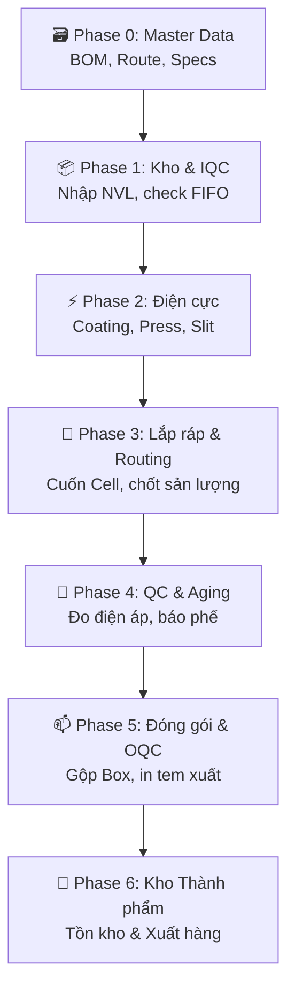

# 🎓 Vinatech NAIS MES — Giáo Trình Vận Hành & Luồng Đi Dữ Liệu Toàn Diện (E2E)

> **Mục tiêu:** Tài liệu này tổng hợp toàn bộ tri thức vận hành hệ thống MES từ mã nguồn (các file `.md` trong `AI_AGENT_CONFIG/`, `MES_MASTER_KNOWLEDGE_BASE/`) và cơ sở dữ liệu thực tế (`SmartFactoryV2`, `SmartFramework`), sắp xếp theo một lộ trình học tập tuyến tính (Step-by-step) để bạn không bỏ sót bất kỳ phần kiến thức nào.

> 🧭 **Điều hướng nhanh:**
> - Cần biết **luồng đi màn hình nhanh** → [PROCESS_FLOW_MAP.md](PROCESS_FLOW_MAP.md) (chỉ link, không detail)
> - Cần **thao tác chi tiết step-by-step** → [VNT_VVT_MES_OPERATIONAL_GUIDE_E2E.md](VNT_VVT_MES_OPERATIONAL_GUIDE_E2E.md)
> - Cần **tra cứu kỹ thuật 1 màn** → [ALL_SCREENS_DOCUMENTATION.md](ALL_SCREENS_DOCUMENTATION.md)
> - File này là **giáo trình học bài bản** — đọc nếu mới vào hệ thống.

---

## 🗺️ Bản Đồ Lộ Trình Học Tập (Curriculum Map)

Giáo trình gồm 6 học phần đi từ tổng quan đến chi tiết kỹ thuật:

```
[Học phần 1: Địa lý & Kiến trúc MES]
        │
        ▼
[Học phần 2: Phả hệ Mã định danh (Genealogy)]
        │
        ▼
[Học phần 3: Luồng Dữ liệu 6 Phase & Màn hình]
        │
        ▼
[Học phần 4: Chi tiết Core SQL Engine & Backflush]
        │
        ▼
[Học phần 5: Kịch bản Giám sát & Gỡ lỗi thực tế]
        │
        ▼
[Học phần 6: Bản đồ Đọc chi tiết 37 file KB]
```

---

## 🏛️ Học Phần 1: Tổng Quan Kiến Trúc & Địa Lý Hệ Thống

Hệ thống NAIS MES của Vinatech được thiết kế theo mô hình đa nhà máy. Trong đó cơ sở Bắc Ninh (VNT) là chuẩn gốc, các cơ sở khác được clone hoặc fork tùy biến.

### 1. Phân bố Địa lý & Quy tắc đặt tên (Factory Matrix)

| Nhà máy | Công ty (CompanyCode) | Mã Xưởng (WorkCenter) | Tiền tố Route | Định dạng Barcode | Kho Thành Phẩm |
|:---|:---|:---|:---|:---|:---|
| **Bắc Ninh** (Điện cực) | `VNT` | `VNT_F1` ~ `VNT_F5` | `E-xx` (E-01, E-02) | `VJ...` | — |
| **Bắc Giang** (Cell/Module)| `VVT` | `VVT_F1`, `VVT_F2`, `VVT_F4` | `V-xx` / `MV-xx` | `VV...` (Cell), `VJ...` (Convert) | `STB_VN_FINISHGOODS_BG` |
| **Hà Nam** (VVT_F3) | `VVT_F3` | `VVT_F3` | `VE-xx` (VE01, VE06) | `VE...` (VE260507-001) | `FinishGoodMESInstock_HN` |
| **Hưng Yên** (VVT_F4) | `VVT_F4` (Enesol) | `VVT_F4` | `D-xx` | D-series custom | Enesol custom |

### 2. Hai Cơ Sở Dữ Liệu Cốt Lõi
Hệ thống chạy song song 2 database chính trên Server `dbserver.hycap.co.kr,5398`:
1. **`SmartFactoryV2`:** Chứa toàn bộ dữ liệu nghiệp vụ sản xuất, kho bãi, chất lượng (BOM, PO, Routing, Inventory, QC).
2. **`SmartFramework`:** Chứa cấu hình giao diện UI, phân quyền user, quản lý thiết bị đầu cuối, danh mục lỗi, dịch đa ngôn ngữ.

*Đọc thêm:* [BOOTSTRAP.md](file:///c:/Users/User%20Vinatech.DESKTOP-RJJSEQU/Desktop/PROCESS/MES/AI_AGENT_CONFIG/BOOTSTRAP.md) & [KB_19_01_ARCHITECTURE.md](file:///c:/Users/User%20Vinatech.DESKTOP-RJJSEQU/Desktop/PROCESS/MES/MES_MASTER_KNOWLEDGE_BASE/KB_19/KB_19_01_ARCHITECTURE.md).

---

## 🎫 Học Phần 2: Phả Hệ Mã Định Danh (Data Genealogy)

Để hiểu luồng đi của dữ liệu, bạn cần nắm chắc cách các thực thể chuyển đổi định danh từ lúc là nguyên vật liệu thô đến khi thành thùng hàng xuất xưởng.

```
VendorBarcode (Mã vạch nhà cung cấp)
   │
   ▼ [Nhập kho NVL tại F330] → Hệ thống cấp Lot ID mới
LotID / MaterialLotNo (Mã Lot kho cấp, bắt đầu bằng 'ML...')
   │
   ├──► ElectrodeLotNumber (Mã cuộn điện cực sau khi qua trạm Coating B802/Slitting B552)
   │
   ▼ [Quét chốt trạm Cuốn B530] → "Khai sinh" tụ điện
ControlNo / Barcode (Mã vạch định danh của từng viên tụ: VD 'VV...')
   │
   ▼ [Gộp Box nhỏ tại trạm Đóng gói B523]
PackingID (Mã túi / Hộp trong Inner Box)
   │
   ▼ [Đóng Carton lớn tại trạm B523/B525]
BigBoxID / ParentPackingID (Mã thùng Carton ngoài)
```

*Quy tắc sinh mã Barcode sản phẩm (`ControlNo`):*
- **Bắc Ninh (VNT):** Bắt đầu bằng `VJ` (Ví dụ: `VJPP163R072701`).
- **Bắc Giang / Hà Nam:** Bắt đầu bằng `VV` (Ví dụ: `VVPP163R072701`).
- **Module:** Bắt đầu bằng `M` + `VJ/VV` (Ví dụ: `MVJPP163R072701`).
- **Năm/Tháng:** Mã hóa ký tự chữ cái (Ví dụ: Năm 2026 = `Q`, Tháng 6 = `O`).

*Đọc thêm:* [KNOWLEDGE.md](file:///c:/Users/User%20Vinatech.DESKTOP-RJJSEQU/Desktop/PROCESS/MES/AI_AGENT_CONFIG/KNOWLEDGE.md).

---

## 🔄 Học Phần 3: Luồng Dữ Liệu 6 Phase & Bản Đồ Màn Hình

Hành trình sản xuất và dữ liệu của nhà máy đi qua 6 phase tuần tự. Dưới đây là sơ đồ ánh xạ giữa **Quy trình vận hành -> Bảng dữ liệu chính -> Màn hình UI (Screen ID)**:



### 3.1 Bảng phân tích 6 Phase chi tiết

| Phase | Nghiệp vụ vận hành | Bảng dữ liệu chính (DB) | Màn hình chính (Screen ID) |
|:---|:---|:---|:---|
| **Phase 0** | Khai báo BOM, Định tuyến (Route), Tiêu chuẩn đóng gói | `STB_BomHeader`, `STB_BomDetail`, `STB_RouteInfo`, `STB_PackingStandard` | **A410** (Model Master), **A419** (Packing Standard), **A210** (BOM Master) |
| **Phase 1** | Nhập nguyên vật liệu thô từ NCC, kiểm định chất lượng IQC, kiểm soát FIFO | `STB_MaterialLotInfo`, `STB_MaterialStock`, `STB_MaterialQcInfo`, `stb_vvt_OpenExpiredMaterial` | **F330** (Nhập kho NVL), **C220** (IQC Test), **F110** (Thuộc tính vật tư), **F710** (Tồn kho NVL) |
| **Phase 2** | Sản xuất cuộn điện cực dương/âm (Coating -> Pressing -> Slitting) | `STB_ElectrodeCoatingInfo`, `STB_ElectrodeSlittingResult`, `STB_ElectrodeWasteInfoNew` | **B802** (SX Điện cực), **B552** (Slitting), **C243** (QC Slitting) |
| **Phase 3** | Lắp ráp (Cuốn tụ), nạp NVL vào chuyền, ghi nhận lịch sử công đoạn (Routing) | `STB_SetInfo` (Khai sinh Barcode), `STB_ProdRouteHist`, `STB_RawMaterialInputHist` | **B450** (Kế hoạch ngày), **B530** (Chốt sản lượng), **B540** (Quét NVL vào chuyền), **B782** (Lịch sử SX) |
| **Phase 4** | QC công đoạn (PQC), đo điện áp & nội trở (Aging/Sorting), xử lý lỗi/phế | `STB_AgingSortingData`, `STB_DefectRepairInfo`, `STB_VN_PRODUCTION_ERROR` | **C443** (PQC Inline), **C321** (Sửa Cell), **B598** / **HNC321** (Quét báo phế NVL) |
| **Phase 5** | Đóng gói Cell/Module vào túi nilon/hộp nhỏ, gộp Big Box, kiểm tra OQC xuất xưởng | `STB_DividePackaging`, `STB_SavePackingTime_VVT`, `VVT_OQC_REFER` | **B523** / **HN523** (Đóng gói), **C530** (OQC Sample), **C531** (OQC Packing) |
| **Phase 6** | Nhập kho thành phẩm, lưu trữ tồn kho, xuất hóa đơn chuyển đi khách hàng | `STB_VN_FINISHGOODS_BG`, `STB_VN_FINISHGOODS_HN_New`, `InvoiceFinishGoodStockOutBG` | **HN551** (Xuất kho TP HN), **HN866** (Tồn kho TP HN), **C560** (FG Receipt) |

*Đọc thêm:* [KB_10_02_DATAFLOW_SP.md](file:///c:/Users/User%20Vinatech.DESKTOP-RJJSEQU/Desktop/PROCESS/MES/MES_MASTER_KNOWLEDGE_BASE/KB_10/KB_10_02_DATAFLOW_SP.md) & [screen_id_reference.md](file:///c:/Users/User%20Vinatech.DESKTOP-RJJSEQU/.gemini/antigravity-ide/knowledge/vinatech_screen_id_reference/artifacts/screen_id_reference.md).

---

## ⚙️ Học Phần 4: Động Cơ SQL Core Engine & Logic Backflush

Hệ thống MES hoạt động dựa trên các stored procedure (SP) cốt lõi xử lý dữ liệu giao dịch lớn. Dưới đây là luồng xử lý chi tiết khi công nhân thực hiện thao tác quét chốt công đoạn trên phần mềm:

### 1. usp_DoProcessProdRouteHist (SP ghi nhận lịch sử công đoạn)
Khi người dùng chốt sản lượng (tại màn hình `B530` hoặc SmartApp di động), SP này chạy qua 11 bước:
1. **Lấy PO Info:** Xác định công đoạn hiện tại có phải là chặng đầu (`IsInputRoute=1`) hay chặng cuối (`IsOutputRoute=1`) của lệnh sản xuất.
2. **Tính Ca/Ngày làm việc:** Gọi hàm `fnGetJobDateShiftTime` để tự tính ca hiện tại (Ca ngày/Ca đêm) dựa trên giờ quét thực tế của server.
3. **Kiểm tra nhập tuyến:** Nếu không phải công đoạn đầu, kiểm tra xem sản phẩm đã qua bước đầu chưa (`IsLineInput=1`).
4. **Kiểm tra sản lượng chặng trước:** Chặn không cho chốt vượt quá sản lượng chặng trước đó (Trừ các công đoạn đóng gói/cắt uốn được bypass).
5. **Ghi nhận:** INSERT record mới vào bảng lịch sử chặng `STB_ProdRouteHist` và bảng log `STB_ProcedureLog`.
6. **Gọi Backflush (Trừ NVL):** Gọi tiếp SP `usp_DoProcessProdGIMaterialByBOM`.
7. **Xử lý chặng cuối:** Nếu là chặng cuối (`IsOutputRoute=1`), hệ thống cập nhật hoàn thành PO, đổi trạng thái sản phẩm (`IsProdFinish=1`) và tự động gọi SP nhập kho bán thành phẩm `usp_DoProcessProdGRMaterialByOne`.

### 2. Luồng trừ kho tự động (BOM Backflush)
Quá trình trừ kho nguyên vật liệu diễn ra tự động thông qua SP `usp_DoProcessProdGIMaterialByBOM` tại mỗi công đoạn chốt sản phẩm:
- Đọc bảng BOM lệnh sản xuất `STB_ProductionOrderBom` để tìm các NVL có cấu hình `IsUseFlush = 1` (trừ kho ngay) và `IsUseBackFlush = 0`.
- Kiểm tra tồn kho tại bảng `STB_MaterialStock`. Nếu thiếu NVL so với định mức BOM nhân với lượng sản phẩm chốt -> Báo lỗi `부ọc 자재가 있습니다` (Không đủ vật tư) và chặn quy trình.
- Lấy thông tin kho được gán cho Line/Route tại bảng `STB_LineRouteMapping`.
- Tạo phiếu xuất kho `GI` (Goods Issue) ghi vào các bảng `STB_MaterialDocInfo`, `STB_MaterialDocDetail`, và `STB_MaterialDocLotInfo` (áp dụng thuật toán **FIFO** tự động chọn Lot NVL cũ nhất trong kho để xuất).

### 3. Logic Đóng gói (Merge Box)
SP `usp_Vietnam_DoProcessProdPacking_VVT` xử lý gộp các Cell riêng lẻ vào túi/thùng tại màn hình `B523`:
- Nhận chuỗi XML danh sách các barcode sản phẩm truyền từ client lên.
- Sử dụng `OPENXML` kết hợp `CURSOR` để duyệt qua từng barcode.
- Áp dụng logic so sánh số lượng đóng gói tiêu chuẩn (`MergeQty` cấu hình trong `STB_PackingStandard`). Khi số lượng sản phẩm quét gom đủ thùng -> Hệ thống tạo ra một `PackingID` mới lưu vào bảng `STB_DividePackaging` và gửi lệnh in tem thùng ra Client.

*Đọc thêm:* [KB_30_CORE_SP_ENGINE.md](file:///c:/Users/User%20Vinatech.DESKTOP-RJJSEQU/Desktop/PROCESS/MES/MES_MASTER_KNOWLEDGE_BASE/KB_30_CORE_SP_ENGINE.md).

---

## 🛠️ Học Phần 5: Giám Sát, Trace Bug & Vận Hành Thực Tế

### 1. Kịch bản kiểm tra sức khỏe hệ thống hàng ngày (Daily Check)
Kỹ sư vận hành MES kiểm tra hệ thống theo lịch trình:
- **Kiểm tra nghẽn DB (Block Sessions):** Phòng trường hợp giao dịch bị treo gây đơ phần mềm.
  ```sql
  SELECT r.blocking_session_id AS [ID_Chặn], r.session_id AS [Bị_Chặn], wait_time/1000 AS [Chờ_Giây], t.text AS [SQL]
  FROM sys.dm_exec_requests r WITH(NOLOCK)
  CROSS APPLY sys.dm_exec_sql_text(r.sql_handle) t WHERE r.blocking_session_id <> 0;
  ```
- **Kiểm tra lỗi Stored Procedure gần đây:** Quét log lỗi ghi nhận từ xưởng:
  ```sql
  SELECT TOP 50 ProcedureName, VariableValue, CreateDateTime 
  FROM SmartFactoryV2.dbo.STB_ProcedureLog WITH(NOLOCK)
  WHERE CreateDateTime >= DATEADD(HOUR, -24, GETDATE()) ORDER BY CreateDateTime DESC;
  ```

*Đọc thêm:* [MES_DAILY_PLAYBOOK.md](file:///c:/Users/User%20Vinatech.DESKTOP-RJJSEQU/Desktop/PROCESS/MES/MES_MASTER_KNOWLEDGE_BASE/MES_DAILY_PLAYBOOK.md).

### 2. Các mẫu SQL truy vết Barcode (Golden Queries)

Khi xảy ra lỗi dữ liệu, sử dụng 1 trong 3 mẫu truy vấn dưới đây để trace ngược lịch sử:

#### Mẫu A: Dành cho sản phẩm Cell & Module (Truy vết chặng & đóng gói)
```sql
SELECT SI.Barcode, SI.ControlNo, SI.PONo, PRH.RouteCode, RI.RouteName, PRH.ProdQty, PRH.CreateDateTime, DP.PackingID, DP.ParentPackingID
FROM STB_SetInfo SI WITH(NOLOCK)
LEFT JOIN STB_ProdRouteHist PRH WITH(NOLOCK) ON SI.ControlNo = PRH.ControlNo
LEFT JOIN STB_RouteInfo RI WITH(NOLOCK) ON PRH.RouteCode = RI.RouteCode
LEFT JOIN STB_DividePackaging DP WITH(NOLOCK) ON SI.Barcode = DP.LotNo
WHERE SI.Barcode = 'MÃ_BARCODE_CẦN_TRA' OR SI.ControlNo = 'MÃ_BARCODE_CẦN_TRA'
ORDER BY PRH.CreateDateTime ASC;
```

#### Mẫu B: Dành cho cuộn điện cực (Coating/Slitting)
```sql
SELECT MLI.MaterialLotNo, MLI.MaterialCode, MLI.CurrentQty, C.MachineCode AS [Coating_MC], S.ProductionQty AS [Slitting_Qty], S.CreateDateTime
FROM STB_MaterialLotInfo MLI WITH(NOLOCK)
LEFT JOIN STB_ElectrodeCoatingInfo C WITH(NOLOCK) ON MLI.MaterialLotNo = C.ElectrodeLotNumber
LEFT JOIN STB_ElectrodeSlittingResult S WITH(NOLOCK) ON MLI.MaterialLotNo = S.ElectrodeLotNumber
WHERE MLI.MaterialLotNo = 'MÃ_LOT_ĐIỆN_CỰC';
```

#### Mẫu C: Dành cho Nguyên vật liệu (Kho & Trạm nạp chuyền)
```sql
SELECT MLI.MaterialLotNo, MLI.MaterialCode, MM.MaterialName, MLI.CurrentQty, RMIH.MachineCode, RMIH.RouteCode, RMIH.CreateDateTime
FROM STB_MaterialLotInfo MLI WITH(NOLOCK)
LEFT JOIN STB_MaterialMaster MM WITH(NOLOCK) ON MLI.MaterialCode = MM.MaterialCode
LEFT JOIN STB_RawMaterialInputHist RMIH WITH(NOLOCK) ON MLI.MaterialLotNo = RMIH.MaterialLotNo
WHERE MLI.MaterialLotNo = 'MÃ_LOT_NVL';
```

---

## 📚 Học Phần 6: Lộ Trình Đọc 37 File Knowledge Base (KB) Chi Tiết

Sau khi đã nắm vững các học phần tổng quan ở trên, bạn hãy mở các file tài liệu KB trong thư mục [MES_MASTER_KNOWLEDGE_BASE/](file:///c:/Users/User%20Vinatech.DESKTOP-RJJSEQU/Desktop/PROCESS/MES/MES_MASTER_KNOWLEDGE_BASE/) theo thứ tự logic dưới đây để nghiên cứu từng chủ đề sâu nhất:

### Phân đoạn 1: Nền tảng và Vận hành cơ bản
1. **[KB_01_UI_PHAN_QUYEN.md](file:///c:/Users/User%20Vinatech.DESKTOP-RJJSEQU/Desktop/PROCESS/MES/MES_MASTER_KNOWLEDGE_BASE/KB_01_UI_PHAN_QUYEN.md):** Đọc để hiểu cách phân quyền user trên giao diện MES và cấu hình đơn giá công đoạn (Stage Prices).
2. **[KB_02_01_NVL_WMS.md](file:///c:/Users/User%20Vinatech.DESKTOP-RJJSEQU/Desktop/PROCESS/MES/MES_MASTER_KNOWLEDGE_BASE/KB_02/KB_02_01_NVL_WMS.md):** Nghiệp vụ kho NVL (WMS), cơ chế quản lý Lot và FIFO.
3. **[KB_03_02_CELL_LINE.md](file:///c:/Users/User%20Vinatech.DESKTOP-RJJSEQU/Desktop/PROCESS/MES/MES_MASTER_KNOWLEDGE_BASE/KB_03/KB_03_02_CELL_LINE.md):** Vận hành dây chuyền sản xuất Cell/Module, chốt chặng và Rework.
4. **[KB_04_01_CORE_PACKAGING.md](file:///c:/Users/User%20Vinatech.DESKTOP-RJJSEQU/Desktop/PROCESS/MES/MES_MASTER_KNOWLEDGE_BASE/KB_04/KB_04_01_CORE_PACKAGING.md):** Nghiệp vụ đóng gói, tiêu chuẩn đóng thùng và in tem nhãn.

### Phân đoạn 2: Chất lượng & Dữ liệu Master
5. **[KB_05_03_QC_FLOW.md](file:///c:/Users/User%20Vinatech.DESKTOP-RJJSEQU/Desktop/PROCESS/MES/MES_MASTER_KNOWLEDGE_BASE/KB_05/KB_05_03_QC_FLOW.md):** Quy trình QC ba chặng (IQC -> PQC -> OQC) và kiểm tra độ tin cậy.
6. **[KB_05_02_ELECTRODE.md](file:///c:/Users/User%20Vinatech.DESKTOP-RJJSEQU/Desktop/PROCESS/MES/MES_MASTER_KNOWLEDGE_BASE/KB_05/KB_05_02_ELECTRODE.md):** Chi tiết quy trình sản xuất điện cực cuộn (Coating, Slitting).
7. **[KB_06_MASTER_DATA_TOOLS.md](file:///c:/Users/User%20Vinatech.DESKTOP-RJJSEQU/Desktop/PROCESS/MES/MES_MASTER_KNOWLEDGE_BASE/KB_06_MASTER_DATA_TOOLS.md):** Hướng dẫn các bước khai báo Master Data khi nhà máy ra Model sản phẩm mới.

### Phân đoạn 3: Phân tích Kiến trúc & Tích hợp hệ thống
8. **[KB_10_01_ARCHITECTURE.md](file:///c:/Users/User%20Vinatech.DESKTOP-RJJSEQU/Desktop/PROCESS/MES/MES_MASTER_KNOWLEDGE_BASE/KB_10/KB_10_01_ARCHITECTURE.md):** Kiến trúc hạ tầng, framework và trigger hệ thống.
9. **[KB_19_01_ARCHITECTURE.md](file:///c:/Users/User%20Vinatech.DESKTOP-RJJSEQU/Desktop/PROCESS/MES/MES_MASTER_KNOWLEDGE_BASE/KB_19/KB_19_01_ARCHITECTURE.md):** Bản đồ 19 cơ sở dữ liệu liên thông và cấu trúc ERD.
10. **[KB_07_01_OVERVIEW_FLOWS.md](file:///c:/Users/User%20Vinatech.DESKTOP-RJJSEQU/Desktop/PROCESS/MES/MES_MASTER_KNOWLEDGE_BASE/KB_07/KB_07_01_OVERVIEW_FLOWS.md):** Cơ chế tích hợp, đồng bộ dữ liệu giữa MES và ERP/Groupware.
11. **[KB_26_01_LINKS_BUGS.md](file:///c:/Users/User%20Vinatech.DESKTOP-RJJSEQU/Desktop/PROCESS/MES/MES_MASTER_KNOWLEDGE_BASE/KB_26/KB_26_01_LINKS_BUGS.md):** Các liên kết nghiệp vụ chéo và xử lý lỗi logic tích hợp.

### Phân đoạn 4: Nghiên cứu các trường hợp đặc biệt & Phân hệ mở rộng
12. **[KB_25_01_OVERVIEW.md](file:///c:/Users/User%20Vinatech.DESKTOP-RJJSEQU/Desktop/PROCESS/MES/MES_MASTER_KNOWLEDGE_BASE/KB_25/KB_25_01_OVERVIEW.md):** Tìm hiểu hệ thống chi nhánh VinaEnesol Hưng Yên (D-series).
13. **[KB_36_HANAM_FACTORY_SCREENS.md](file:///c:/Users/User%20Vinatech.DESKTOP-RJJSEQU/Desktop/PROCESS/MES/MES_MASTER_KNOWLEDGE_BASE/KB_36_HANAM_FACTORY_SCREENS.md):** Tìm hiểu các màn hình đặc thù riêng cho nhà máy Hà Nam.
14. **[KB_34_UNDOCUMENTED_SUBSYSTEMS.md](file:///c:/Users/User%20Vinatech.DESKTOP-RJJSEQU/Desktop/PROCESS/MES/MES_MASTER_KNOWLEDGE_BASE/KB_34_UNDOCUMENTED_SUBSYSTEMS.md):** Các phân hệ phụ trợ ít tài liệu (Spare Parts, Mold, Scrap, ANDON).
15. **[KB_35_TRIGGERS_JOBS_LABELS.md](file:///c:/Users/User%20Vinatech.DESKTOP-RJJSEQU/Desktop/PROCESS/MES/MES_MASTER_KNOWLEDGE_BASE/KB_35_TRIGGERS_JOBS_LABELS.md):** Danh sách các Trigger, SQL Agent Job và Template nhãn khách hàng.

### Phân đoạn 5: Phương pháp luận xử lý sự cố nâng cao
16. **[KB_14_01_METHODOLOGY.md](file:///c:/Users/User%20Vinatech.DESKTOP-RJJSEQU/Desktop/PROCESS/MES/MES_MASTER_KNOWLEDGE_BASE/KB_14/KB_14_01_METHODOLOGY.md):** Triết lý trace bug và quy trình 6 bước ứng phó sự cố.
17. **[KB_31_SCREEN_BUG_FIXBOOK.md](file:///c:/Users/User%20Vinatech.DESKTOP-RJJSEQU/Desktop/PROCESS/MES/MES_MASTER_KNOWLEDGE_BASE/KB_31_SCREEN_BUG_FIXBOOK.md):** Cẩm nang tra cứu và xử lý nhanh 70+ lỗi thường gặp nhất.
18. **[KB_37_SP_ARCHAEOLOGY_BUGS_AND_PATTERNS.md](file:///c:/Users/User%20Vinatech.DESKTOP-RJJSEQU/Desktop/PROCESS/MES/MES_MASTER_KNOWLEDGE_BASE/KB_37_SP_ARCHAEOLOGY_BUGS_AND_PATTERNS.md):** Khảo cổ lỗi Stored Procedure cũ và các mẫu viết code SQL chuẩn cho MES.

---

Chúc bạn có một lộ trình học tập và làm chủ hệ thống MES Vinatech thuận lợi! Nếu bạn gặp bất kỳ điểm nghẽn hoặc có câu hỏi nào cần chạy thử SQL trên database để kiểm tra, hãy cho tôi biết ngay.
