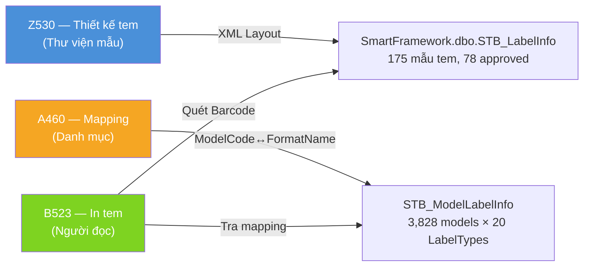
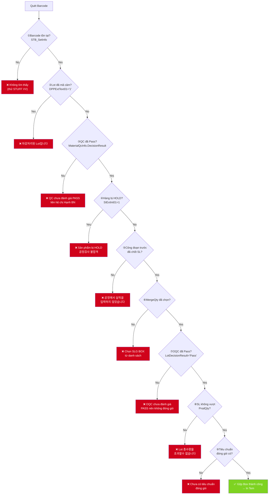

# 🔬 Nghiên Cứu Chi Tiết: Màn Hình B523 (Đóng Gói & In Tem) và Z530 (Thiết Kế Tem)

> **Ngày nghiên cứu:** 2026-06-23
> **Nguồn dữ liệu:** KB_04, KB_31, KB_35, DB SmartFactoryV2 + SmartFramework (DB verified)
> **Phạm vi:** Toàn bộ nút bấm (DB-verified), SP, bảng DB, luồng xử lý, và kịch bản lỗi

> 🧭 **Điều hướng:**
> - Tổng quan luồng đóng gói → [PROCESS_FLOW_MAP.md §Phase 5](MES_MASTER_KNOWLEDGE_BASE/PROCESS_FLOW_MAP.md)
> - Nghiệp vụ đóng gói chung → [KB_04](MES_MASTER_KNOWLEDGE_BASE/KB_04/KB_04_01_CORE_PACKAGING.md)
> - Bugs đóng gói → [KB_04/KB_04_02_SCREEN_BUGS.md](MES_MASTER_KNOWLEDGE_BASE/KB_04/KB_04_02_SCREEN_BUGS.md)
> - File này là **nghiên cứu sâu chỉ cho B523 + Z530** — DB verified 17 nút bấm + 9 validation gates.

---

## 1. 🏗️ Kiến Trúc Tổng Quan: Mô Hình 3 Lớp In Tem



| Lớp | Màn hình | Bảng DB | Vai trò |
|-----|----------|---------|---------|
| **1. Thư viện mẫu** | Z530 | `SmartFramework.dbo.STB_LabelInfo` | Lưu XML layout thiết kế tem |
| **2. Bản đồ mapping** | A460 | `STB_ModelLabelInfo` | Nối ModelCode → FormatName |
| **3. Người đọc (in)** | B523, B790, B442... | Đọc từ 2 bảng trên | Quét barcode → tra mapping → load XML → in |

---

## 2. 📺 MÀN HÌNH Z530 — Label Layout Design (Thiết Kế Tem)

### 2.1 Tổng Quan

| Thuộc tính | Giá trị |
|------------|---------|
| **Screen ID** | Z530 |
| **Nhóm** | Z — Hệ thống & Phân quyền |
| **DB** | `SmartFramework.dbo.STB_LabelInfo` |
| **KB liên quan** | KB_31 |
| **Layout Name** | `LabelInfo` (61KB XML), `LabelInfoForApproval` (929KB XML) |
| **Chức năng chính** | Tạo/chỉnh sửa/phê duyệt mẫu thiết kế tem nhãn (XML layout) |

### 2.2 Bảng DB: STB_LabelInfo (SmartFramework)

| Cột | Kiểu | Mô tả | Ghi chú |
|-----|------|-------|---------|
| `LabelType` | nvarchar(30) | **PK** — Loại tem | VD: `AssembleLabel`, `BoxLabel`, `ElectLabel` |
| `FormatName` | nvarchar(30) | **PK** — Tên mẫu tem | VD: `전극라벨`, `Phoenix_Contact_V1` |
| `FormatVersion` | int | **PK** — Phiên bản | Mặc định = 1 |
| `PaperType` | nvarchar(30) | Loại giấy | `Common` |
| `CommandType` | varchar(20) | Loại lệnh in | `Report` |
| `Dpi` | varchar(20) | Độ phân giải | `200`, `400`, `600` |
| `Format` | nvarchar(MAX) | **XML Layout** | Chứa toàn bộ thiết kế tem (3KB-13KB mỗi mẫu) |
| `PartitionQty` | int | Số phân vùng in | — |
| `ProdSnType` | nvarchar(50) | Loại Serial Number | — |
| `BarcodeModel` | varchar(20) | Kiểu barcode | — |
| `LabelImageFileID` | bigint | ID file ảnh preview | — |
| `ApplyDate` | date | Ngày áp dụng | Khi approve |
| `IsApproval` | bit | **Đã duyệt?** | `1` = Active, `NULL/0` = Draft |
| `ApprovalUserID` | varchar(20) | User duyệt | — |
| `ApprovalDateTime` | datetime | Thời điểm duyệt | — |
| `LabelRemark` | nvarchar(MAX) | Ghi chú | — |
| `DataSourceViewName` | varchar(100) | View cung cấp data in | VD: `SetInfo` |
| `PrinterName` | nvarchar(100) | Máy in mặc định | — |
| `CreateDateTime` | datetime | Ngày tạo | — |
| `CreateUserID` | varchar(20) | User tạo | — |
| `ChangeDateTime` | datetime | Ngày sửa cuối | — |
| `ChangeUserID` | varchar(20) | User sửa cuối | — |

### 2.3 Thống Kê Mẫu Tem (DB Verified 2026-06-23)

| Metric | Giá trị |
|--------|---------|
| **Tổng mẫu tem** | **175** |
| **Đã duyệt (IsApproval=1)** | **78** |
| **Bản nháp** | 97 |
| **LabelType nhiều nhất** | BloomEnergyLabel (23), BoxLabel (19), TestLabel (5) |
| **Tổng LabelType riêng biệt** | **110+** |

### 2.4 ⭐ Tất Cả Nút Bấm / Action trên Z530 (DB-Verified từ XML Layout)

> [!IMPORTANT]
> Z530 sử dụng **2 layouts** trong SmartFramework:
> - `LabelInfo` — Layout chính (thiết kế/quản lý tem): **1 custom action** + framework buttons
> - `LabelInfoForApproval` — Layout phê duyệt: **2 custom actions**

#### Layout 1: `LabelInfo` — Thiết Kế & Quản Lý Mẫu Tem

| # | Nút bấm | Action Name | Chức năng chi tiết |
|---|---------|-------------|-------------------|
| 1 | **🔍 Tìm kiếm (Search)** | *(Framework)* | Load danh sách mẫu tem từ `STB_LabelInfo`. Lọc theo LabelType, FormatName, IsApproval |
| 2 | **💾 Lưu (Save)** | *(Framework IUD)* | INSERT/UPDATE mẫu tem vào `STB_LabelInfo`. Lưu XML layout, PaperType, CommandType, Dpi |
| 3 | **🗑️ Xóa (Delete)** | *(Framework IUD)* | DELETE mẫu tem khỏi `STB_LabelInfo` |
| 4 | **📋 Sao chép mẫu (Copy Label)** | `CopyLabel` | ⭐ **Custom action duy nhất.** Nhân bản mẫu tem hiện tại sang FormatName/LabelType mới. Giữ nguyên XML layout |
| 5 | **🎨 Thiết kế tem (Label Designer)** | *(Framework PrintLabel editor)* | Mở trình thiết kế visual kéo thả (Awoo SmartFramework Label Designer). Cho phép kéo thả Text, Barcode, Image, Shape, Line lên canvas tem |
| 6 | **👁️ Xem trước (Preview)** | *(Framework)* | Render mẫu tem với data mẫu trên màn hình |
| 7 | **🖨️ In thử (Test Print)** | *(Framework PrintLabel)* | Gửi lệnh in test ra máy in đã cấu hình trong `PrinterName` |

#### Layout 2: `LabelInfoForApproval` — Phê Duyệt Mẫu Tem

| # | Nút bấm | Action Name | Chức năng chi tiết |
|---|---------|-------------|-------------------|
| 8 | **✅ Phê duyệt (Approval)** | `ApprovalLabel` | Set `IsApproval = 1`, ghi `ApplyDate`, `ApprovalUserID`, `ApprovalDateTime`. **Bắt buộc** trước khi sử dụng mẫu tem trong sản xuất |
| 9 | **🔄 Làm mới (Refresh)** | `Refresh` | Reload danh sách tem sau khi phê duyệt |

> [!TIP]
> **Quy trình tạo tem mới trên Z530:**
> 1. **Tìm kiếm** → Kiểm tra mẫu tem cùng loại đã tồn tại chưa
> 2. **Sao chép mẫu** (CopyLabel) → Nhân bản từ mẫu tem cũ cùng khách hàng
> 3. **Thiết kế tem** (Label Designer) → Kéo thả chỉnh sửa layout XML
> 4. **Lưu** (Save) → Ghi XML vào DB
> 5. **Xem trước** (Preview) → Kiểm tra layout
> 6. **Phê duyệt** (ApprovalLabel) → Set `IsApproval = 1` → Sẵn sàng sử dụng
> 7. **Vào A460** → Map `ModelCode → FormatName` vừa tạo

### 2.5 Phân Loại LabelType Phổ Biến (Top 20 LabelType)

| LabelType | Số mẫu | Dùng cho | Màn hình in |
|-----------|--------|----------|-------------|
| `BloomEnergyLabel` | 23 | Tem Bloom Energy (khách hàng lớn) | K198, BG2 screens |
| `BoxLabel` | 19 | Tem thùng đóng gói tiêu chuẩn | B523, B525 |
| `TestLabel` | 5 | Tem test (dev) | — |
| `PartLabel` | 5 | Tem vật tư kho NVL | F330, F721 |
| `AssembleLabel` | 3 | Tem sản xuất Cell/Module | B450, B540 |
| `OvenInputLabel` | 3 | Tem nhập lò sấy | — |
| `ModuleLabel` | 3 | Tem Module | B525, B453 |
| `VentLabel` | 3 | Tem Vent | — |
| `JabilLabel` | 2 | Tem Jabil (khách hàng) | — |
| `BoxLabelVVT` | 2 | Tem thùng VVT riêng | — |
| `ElectLabel` | 1 | Tem điện cực | B442 |
| `PackingLabel` | 1 | Tem đóng gói | B523 |
| `Phoenix_Label` | 1 | Tem Phoenix Contact | B790 |
| `FoxconnLabel` | 1 | Tem Foxconn | — |
| `HellaLabel` | 1 | Tem Hella | B560 |
| `SchneiderLabel` | 1 | Tem Schneider | — |
| `SanminaIndiaLabel` | 1 | Tem Sanmina India | — |

---

## 3. 📦 MÀN HÌNH B523 — Đóng Gói & In Tem (Packaging & Label Printing)

### 3.1 Tổng Quan

| Thuộc tính | Giá trị |
|------------|---------|
| **Screen ID** | B523 |
| **Nhóm** | B5xx — Sản xuất Cell Line |
| **DB chính** | `STB_DividePackaging`, `STB_SavePackingTime_VVT` |
| **SP chính** | `usp_Vietnam_DoProcessProdPacking_VVT` |
| **KB liên quan** | KB_03, KB_04, KB_31, KB_32 |
| **Layout Name** | `VVT_ProdPacking_vvt` (253KB XML) |
| **Chức năng** | Đóng gói sản phẩm → Gộp Box → In tem nhãn |

### 3.2 Bảng DB Liên Quan

#### 3.2.1 STB_DividePackaging — Lịch sử chia/gộp Box

| Cột | Kiểu | Mô tả |
|-----|------|-------|
| `DividePackagingID` | varchar(50) | PK |
| `PackingID` | varchar(50) | Mã Box (VD: `PKHN023117`) |
| `Qty` | numeric | Số lượng trong Box |
| `MaterialCode` | varchar(50) | Mã vật tư |
| `LotNo` | varchar(50) | Mã Lot |
| `GRDate` | varchar(50) | Ngày nhận hàng |
| `ParentPackingID` | varchar(50) | Box cha (nếu gộp lớn) |
| `TypeBox` | int | Loại Box |
| `IsSmailBox` | varchar(1) | Hộp nhỏ? |
| `IsNilonlBox` | varchar(1) | Túi nilon? |
| `isSliptPacking` | bit | Đã chia? |
| `MergeParentId` | varchar(50) | ID gộp cha |
| `PackingParentID` | varchar(50) | ID packing cha |
| `MergeNilonToSmallBox` | varchar(50) | Gộp nilon → hộp nhỏ |
| `WorkCenterCode` | nvarchar(50) | Nhà máy |
| `MarkingCode` | varchar(100) | Mã marking |

#### 3.2.2 STB_SavePackingTime_VVT — Lịch sử in tem đóng gói

| Cột | Kiểu | Mô tả |
|-----|------|-------|
| `PackingID` | varchar(30) | Mã Box |
| `LotNo` | varchar(30) | Mã Lot |
| `MaterialCode` | varchar(30) | Mã vật tư |
| `MaterialName` | varchar(200) | Tên vật tư |
| `PackQty` | numeric | **Số lượng đóng gói** (có thể âm cho Module!) |
| `PrintTime` | datetime | Thời gian in |
| `EmpNo` | varchar(30) | Nhân viên in |
| `isPrinted` | bit | Đã in chưa? (`0`=lưu, `1`=đã in) |
| `isModule` | bit | Hàng Module? |
| `PartNo` | varchar(50) | Mã PartNo (trích từ MaterialName) |
| `id` | int | Auto-increment PK |
| `EmpChange` | varchar(30) | Nhân viên sửa |
| `LableQty` | numeric | Số tem in |

#### 3.2.3 STB_PackingStandard — Tiêu chuẩn đóng gói (cấu hình A419)

| Cột | Mô tả | Ví dụ |
|-----|-------|-------|
| `MaterialTypeCode` | Loại vật tư | `FERT` |
| `Size` | Kích thước (4 chữ số) | `0813` = 8×13mm, `1840` = 18×40mm |
| `Voltage` | Điện áp | — |
| `Farad` | Điện dung | — |
| `VinylBagQty` | SL mỗi túi bóng | 500 |
| `InnerBoxQty` | SL hộp nhỏ | 4000 |
| `OutBoxQty` | SL thùng lớn | 8000 |

#### 3.2.4 STB_ModelLabelInfo — Mapping Model → Tem (cấu hình A460)

| Cột | Kiểu | Mô tả |
|-----|------|-------|
| `ModelCode` | varchar(50) | PK — Mã sản phẩm (= MaterialCode) |
| `LabelType` | nvarchar(30) | PK — Loại tem |
| `FormatName` | nvarchar(30) | Tên mẫu tem (nối sang Z530) |
| `CreateDateTime` | datetime | Ngày tạo |
| `CreateUserID` | varchar(20) | User tạo |

**Thống kê mapping:** 3,828 models × 20 LabelTypes. Top LabelTypes:

| LabelType | Số mapping | Vai trò |
|-----------|-----------|---------|
| `PartLabel` | 2,440 | Tem vật tư kho |
| `AssembleLabel` | 1,029 | Tem sản xuất |
| `BoxLabel` | 789 | Tem thùng đóng gói |
| `ElectLabel` | 403 | Tem điện cực |
| `BoxLabel2` | 203 | Tem thùng phụ |
| `MEA_ProdLotLabel` | 118 | Tem MEA |
| `Slitting_Label` | 61 | Tem slitting |
| `Pass_Label` | 48 | Tem QC Pass |

### 3.3 ⭐ Tất Cả 17 Nút Bấm / Action trên B523 (DB-Verified từ XML Layout)

> [!IMPORTANT]
> Danh sách **17 actions** được trích xuất trực tiếp từ `SmartFramework.dbo.STB_ScreenLayoutInfo` (Layout `VVT_ProdPacking_vvt`, 253KB XML). Đây là danh sách **chính xác và đầy đủ**.

#### NHÓM 1: TÌM KIẾM & LOAD DATA (4 nút)

| # | Caption (UI) | Action Name | SP Backend | Chức năng chi tiết |
|---|-------------|-------------|------------|-------------------|
| 1 | **🔍 Tìm kiếm (검색)** | `Refresh` | `usp_Vietnam_GetProdPackingForBarcode_VVT` | **Load thông tin Lot khi nhập barcode.** Trả về: ControlNo, PONo, MaterialCode, MaterialName, ProdQty, RemainQty, InProdQty, BoxQty, VinylBagQty/InnerBoxQty/OutBoxQty (từ STB_PackingStandard), LabelType=`BoxLabel`, DecisionResult. **Validation:** (1) Barcode tồn tại STB_SetInfo? (2) CompanyCode=VVT? (3) QC Pass? (4) Lot đã mã cảm DPPExtText01='1'? |
| 2 | **🔄 Lot Refresh** | `LotRefresh` | Giống SP Refresh | Reload data Lot hiện tại trên grid (VD: sau khi sửa SL) |
| 3 | **🔄 Refresh** | `Refresh` (2nd) | — | Reload toàn bộ màn hình |
| 4 | **🔄 Only Refresh** | `OnlyRefresh` | — | Refresh nhẹ, chỉ load lại data hiện tại, không reset input |

#### NHÓM 2: ĐÓNG GÓI — GỘP/HỦY/CHIA BOX (5 nút)

| # | Caption (UI) | Action Name | SP Backend | Chức năng chi tiết |
|---|-------------|-------------|------------|-------------------|
| 5 | **📦 Gộp Box (Box합치기)** | `MergeBox` | `usp_Vietnam_DoProcessProdPacking_VVT` → loop gọi `usp_DoProcessProdPackingByOne_VNT` | **Gộp nhiều Lot vào 1 Box.** Cần chọn SLG Box (MergeQty) trước. Cursor loop qua grid, mỗi Lot gọi SP con. Sinh PackingID = `PK` + YearCode + MonthCode + DayCode + SerialNo(5). Sinh BoxID = MaterialCode + Header + SerialNo(5). Gọi `usp_DoProcessTerminalData` để INSERT ProdRouteHist + MaterialLotInfo. **Validation 9 bước** (xem mục 3.5) |
| 6 | **📦 BoxID Tạo (BoxID생성)** | `DoProductionByBoxCount` | `usp_DoProcessProdPackingByOne_VNT` | Tạo BoxID trực tiếp cho 1 Lot (không qua loop MergeBox). Dùng khi gộp box đơn lẻ |
| 7 | **🔄 Hủy Gộp Box (취소)** | `DoCancelProdPacking` | `usp_DoCancelProdPacking_LotNo` | **Rã Box → Giải phóng Lot con.** Trừ sản lượng: ProdRouteHist, ProdRouteSummary, ProductionOrderInfo. Gọi `usp_DoCancelMaterialDoc` hủy chứng từ. **Chặn cứng** nếu VE%/SP%/RW% đã nhập kho FG (`STB_VN_FINISHGOODS_HN_New`) |
| 8 | **🗑️ Xóa dữ liệu (데이터삭제)** | `DeleteData` | — | Xóa dòng dữ liệu đã chọn trên grid |
| 9 | **🗑️+🔄 Xóa & Refresh** | `DeleteAndRefresh` | — | Xóa dữ liệu + Reload grid |

#### NHÓM 3: IN TEM & LƯU SỐ LƯỢNG (5 nút)

| # | Caption (UI) | Action Name | SP Backend | Chức năng chi tiết |
|---|-------------|-------------|------------|-------------------|
| 10 | **🏷️ In Tem (LabelPrint)** | `LabelPrint` | ActionType=`PrintLabel` (Framework) | **In tem nhãn sản phẩm.** Load XML template từ `STB_LabelInfo` qua mapping `STB_ModelLabelInfo`. UI config: 참조뷰(Ref View)=grid, 라벨유형(LabelType field), 포맷형(FormatName field). Template phải `IsApproval=1`. **Lỗi hay gặp:** "Not found label type" khi thiếu mapping A460 |
| 11 | **🏷️ In Tem VN (VietnamBoxLabelPrint)** | `VietnamBoxLabelPrint` | SP riêng cho tem Box Vietnam | In tem Box đặc thù cho thị trường VN. Khác LabelPrint chuẩn ở format + nội dung |
| 12 | **🏷️ In Tem Hela (HelaBarcodePrint)** | `HelaBarcodePrint` | SP liên quan Hela customer | In tem cho khách hàng Hela (mã vạch barcode đặc biệt). Dùng bảng `STB_HelaBarcodeOutBoxHist` |
| 13 | **📊 Nhập SL Tem (입력수량)** | `InputLabelQty` | `usp_savePackingLabelQty_VVT` | **Lưu số lượng tem đã in** vào `STB_SavePackingTime_VVT`. Logic đặc biệt: (1) HN (VVT_F3) mỗi PackingID chỉ lưu 1 lần, (2) Module (MV%) PackQty âm, (3) User whitelist logic riêng |
| 14 | **💾 Lưu Label Info** | `SaveLabelInfo` | — | Lưu thông tin cấu hình label đã chỉnh trên grid |

#### NHÓM 4: HỖ TRỢ & TIỆN ÍCH (3 nút)

| # | Caption (UI) | Action Name | SP Backend | Chức năng chi tiết |
|---|-------------|-------------|------------|-------------------|
| 15 | **📊 Nhập SL Box (InputBoxQty)** | `InputBoxQty` | — | Nhập/chỉnh sửa số lượng trong 1 Box đã gộp |
| 16 | **📦 SL Packing Còn Lại** | `PackingLotRemainQty` | SP popup | Hiển thị số lượng Lot còn lại chưa gộp box. Tra `STB_MaterialLotInfo` WHERE PackingID IS NULL |
| 17 | **🔄 BoxID Info Refresh** | `BoxIDInfoRefresh` | — | Refresh thông tin BoxID trên panel BoxID (sau khi gộp xong, load lại PackingID + danh sách Lot trong box) |

### 3.4 Luồng Xử Lý Nghiệp Vụ B523

```
┌─── BƯỚC 1: QUÉT BARCODE ──────────────────────────────────────────┐
│                                                                     │
│  Nhập Barcode sản phẩm (VD: VVQN192R710621)                       │
│  → Bấm "Tìm kiếm" (Refresh) hoặc Enter                           │
│  → SP: usp_Vietnam_GetProdPackingForBarcode_VVT                    │
│  → Kiểm tra:                                                       │
│     ✓ Barcode có trong STB_SetInfo? (Nếu không → STUFF VV prefix) │
│     ✓ CompanyCode = VVT?                                          │
│     ✓ QC Pass? (DecisionResult từ STB_MaterialQcInfo)             │
│     ✓ Lot đã mã cảm? (DPPExtText01='1') → Chặn                  │
│     ✓ Chuyển đổi Lot? (STB_LotChangeMaterialHistory)              │
│  → Load lên grid:                                                  │
│     ControlNo, DayPlanNo, PONo, Barcode, MaterialCode,             │
│     MaterialName (hardcode override cho 14 barcodes VVQN192),      │
│     POPlanQty, LineCode, LineName, RouteCode, WorkerCode,          │
│     JobDate, PlanQty, ProdQty, RemainQty, InProdQty,               │
│     BasicBoxQty, BoxQty, VinylBagQty, InnerBoxQty, OutBoxQty,      │
│     LabelType='BoxLabel', DecisionResult, MergeQty, MarkingCode    │
│                                                                     │
│  PackingStandard JOIN:                                              │
│  STB_PackingStandard ON MaterialTypeCode + Size                     │
│  (Size = 4 ký tự từ MaterialName sau dấu '(' )                    │
│                                                                     │
└──────────────────────────┬──────────────────────────────────────────┘
                           ↓
┌─── BƯỚC 2: CHỌN SỐ LƯỢNG GỘP BOX ───────────────────────────────┐
│                                                                     │
│  User chọn từ dropdown SLG Box:                                    │
│    • VinylBagQty (túi bóng) — VD: 500                              │
│    • InnerBoxQty (hộp nhỏ)  — VD: 4000                            │
│    • OutBoxQty (thùng lớn)   — VD: 8000                           │
│  → Popup SP: usp_Vvt_TieuChuanPacking_Vvt (16KB)                  │
│  → Tra STB_PackingStandard theo MaterialTypeCode='FERT' + Size     │
│                                                                     │
│  ⚠️ NẾU THIẾU → Lỗi "Chưa có tiêu chuẩn đóng gói"              │
│     → Fix: INSERT STB_PackingStandard tại A419                     │
│                                                                     │
└──────────────────────────┬──────────────────────────────────────────┘
                           ↓
┌─── BƯỚC 3: GỘP BOX (MergeBox) ───────────────────────────────────┐
│                                                                     │
│  Bấm "Gộp Box" (Box합치기) = Action `MergeBox`                     │
│  → SP: usp_Vietnam_DoProcessProdPacking_VVT                        │
│    ├── Validation: @pMergeQty NULL? → "Chọn SLG BOX"              │
│    ├── CURSOR loop qua từng Lot trên grid                          │
│    │   Tính @total += @InProdQty                                   │
│    │   Nếu @pMergeQty < @total + @InProdQty → cắt InProdQty       │
│    └── Mỗi iteration gọi:                                          │
│         usp_DoProcessProdPackingByOne_VNT                           │
│         ├── Check: DPPExtText01='1' → "마감처리된 Lot입니다"       │
│         ├── Check: IsHolding(SIExtInt01)=1 → "hàng lỗi"           │
│         ├── Check: BefRouteCode ProdQty=0 → "chưa chốt SL"       │
│         │   (Đặc biệt: 6 MaterialCode bypass V-34_BG,V-29_BG)     │
│         ├── Check: LotDecisionResult≠'Pass' → "OQC chưa Pass"     │
│         ├── Check: CurrentQty + InProdQty > ProdQty (trừ V-28)     │
│         ├── Sinh PackingID: PK + YearCode + MonthCode + DayCode    │
│         │   + SerialNo(5 digits) → VD: PKB0N1800015                │
│         ├── Sinh BoxID: MaterialCode + YMD + SerialNo(5)           │
│         └── Gọi usp_DoProcessTerminalData (@Data = packed string)  │
│              → INSERT STB_ProdRouteHist (công đoạn đóng gói)       │
│              → INSERT STB_MaterialLotInfo (tạo Lot kho)            │
│              → INSERT STB_MaterialDocInfo/Detail (nhập kho ảo)     │
│              → INSERT STB_DividePackaging (lịch sử)                │
│                                                                     │
└──────────────────────────┬──────────────────────────────────────────┘
                           ↓
┌─── BƯỚC 4: IN TEM (LabelPrint) ──────────────────────────────────┐
│                                                                     │
│  Bấm "In Tem" (LabelPrint) hoặc "VietnamBoxLabelPrint"            │
│  → UI trace (Object Explorer F5):                                   │
│     ActionType = PrintLabel                                         │
│     참조뷰 (Ref View) = grid ProdPackingForBarcode                 │
│     라벨유형 (LabelType) = cột LabelType trên grid                 │
│     포맷형 (FormatName) = cột FormatName trên grid                 │
│                                                                     │
│  → Chuỗi JOIN 3 bảng:                                              │
│     STB_MaterialMaster MM → NỘI DUNG tem (MaterialName)            │
│     STB_ModelLabelInfo MLI → MAPPING template (FormatName)          │
│     STB_LabelInfo LBI → XML TEMPLATE (thiết kế tem)                │
│                                                                     │
│  → Render XML + Gửi lệnh → Máy in (Dpi 200/400/600)              │
│                                                                     │
│  ⚠️ THIẾU MLI → "Not found label type" ❌                         │
│  ⚠️ THIẾU LBI hoặc IsApproval=0 → Tem trắng ❌                   │
│  ⚠️ SAI MaterialName → Tem in sai nội dung ❌                     │
│                                                                     │
└──────────────────────────┬──────────────────────────────────────────┘
                           ↓
┌─── BƯỚC 5: LƯU SỐ LƯỢNG TEM (InputLabelQty) ────────────────────┐
│                                                                     │
│  Bấm "Nhập SL Tem" (InputLabelQty)                                │
│  → SP: usp_savePackingLabelQty_VVT (11KB)                          │
│  → Logic:                                                          │
│     1. Parse XML → cursor lấy PackingID, LotQty, LotNo            │
│     2. Fallback LotNo từ @pLotNo param nếu grid rỗng              │
│     3. Module (MV%): PackQty *= -1 (logic nghiệp vụ)              │
│     4. Trace LotChangeMaterialHistory 6 cấp (chain lookup)         │
│     5. Tìm Barcode thật trong STB_SetInfo                          │
│     6. INSERT STB_SavePackingTime_VVT:                             │
│        • HN (VVT_F3): checkpackingid → chỉ INSERT 1 lần           │
│        • Ngoài HN: INSERT mọi lần + user whitelist logic           │
│                                                                     │
└─────────────────────────────────────────────────────────────────────┘
```

### 3.5 Validation Gates (9 Cổng Chặn Tuần Tự)



### 3.6 Chuỗi SP Đầy Đủ B523

| # | SP | Kích thước | Vai trò | Gọi bởi |
|---|----|-----------|---------|---------| 
| 1 | `usp_Vietnam_GetProdPackingForBarcode_VVT` | 14,955 chars | **Search** — Load data khi quét barcode | UI `Refresh` action |
| 2 | `usp_Vietnam_DoProcessProdPacking_VVT` | 5,776 chars | **Execute** — Điều phối gộp box (cursor loop) | UI `MergeBox` action |
| 3 | `usp_DoProcessProdPackingByOne_VNT` | 11,404 chars | **Core** — Gộp 1 Lot vào Box, sinh PackingID/BoxID | SP #2 loop |
| 4 | `usp_DoProcessTerminalData` | Framework | **Terminal** — INSERT vào ProdRouteHist + MaterialLotInfo | SP #3 |
| 5 | `usp_savePackingLabelQty_VVT` | 11,001 chars | **Save** — Lưu SL tem đã in | UI `InputLabelQty` action |
| 6 | `usp_DoCancelProdPacking_LotNo` | 5,877 chars | **Cancel** — Hủy gộp box, rollback sản lượng | UI `DoCancelProdPacking` action |
| 7 | `usp_SplitPackingBox` | 809 chars | **Split** — Chia box lớn → nhỏ | UI (nếu có) |
| 8 | `usp_Vietnam_GetBoxIDForLotNo_VVT` | **38,488 chars** | **BoxID Lookup** — Tra BoxID cho in tem, logic VV↔VJ | UI khi in tem |
| 9 | `usp_Vvt_TieuChuanPacking_Vvt` | 16,348 chars | **Popup** — Tiêu chuẩn packing | UI popup chọn SLG Box |
| 10 | `usp_DoMakeModelLabelInfo` | 2,971 chars | **A460** — MERGE mapping ModelCode→LabelType→FormatName | Màn A460, dùng chung |
| 11 | `usp_DoCancelMaterialDoc` | Framework | **Cancel Doc** — Hủy chứng từ nhập kho | SP #6 |

---

## 4. 🔗 Quan Hệ Giữa B523 và Z530

```
┌───────────────────────────────────────────────────────────────────┐
│                    LUỒNG SETUP TEM MỚI (4 bước)                   │
│                                                                   │
│  ① Z530: Thiết kế mẫu tem (XML layout) → Phê duyệt IsApproval=1│
│     Layout: LabelInfo → Action: CopyLabel, Save, Label Designer  │
│     Layout: LabelInfoForApproval → Action: ApprovalLabel          │
│     ↓                                                             │
│  ② A460: Map ModelCode → FormatName vừa tạo                      │
│     SP: usp_DoMakeModelLabelInfo (MERGE INTO STB_ModelLabelInfo)  │
│     ↓                                                             │
│  ③ F110: Bật IsLotUse = 1, IsUseBarcode = 1                      │
│     Bảng: STB_MaterialStockAttributeInfo                          │
│     ↓                                                             │
│  ④ B523: In thử tem → OK                                        │
│                                                                   │
│  CHUỖI JOIN KHI IN TEM (trong SP usp_SetInfo_get):               │
│                                                                   │
│  STB_MaterialMaster MM  → NỘI DUNG trên tem (MaterialName)       │
│       ↓ JOIN                                                      │
│  STB_ModelLabelInfo MLI → MAPPING template nào (FormatName)       │
│       ↓ JOIN                                                      │
│  STB_LabelInfo LBI      → XML TEMPLATE (thiết kế tem Z530)       │
│       ↓ RankIndex = 1 (version mới nhất)                          │
│                                                                   │
│  Thiếu MLI → "Not found label type" ❌                            │
│  Thiếu LBI hoặc IsApproval=0 → Tem trắng / không in ❌            │
│  Sai MM.MaterialName → Tem in sai nội dung ❌                     │
└───────────────────────────────────────────────────────────────────┘
```

---

## 5. 🐛 Kịch Bản Lỗi Thường Gặp & SQL Fix

### 5.1 Lỗi trên B523 (9 kịch bản)

| # | Lỗi | Nguyên nhân | Fix nhanh |
|---|------|------------|-----------|
| 1 | **"Chưa có tiêu chuẩn đóng gói"** | Thiếu `STB_PackingStandard` cho Size mới | INSERT PackingStandard tại A419 |
| 2 | **Không gộp box được** (4 nguyên nhân) | IsLotUse=0, QC chưa Pass, đã gộp box khác, thiếu PackingStandard | Debug 4 bước: F110→QC→PackingID→PackingStandard |
| 3 | **Packing Qty âm** | Lỗi SP `usp_savePackingLabelQty_VVT` hoặc scan đúp | UPDATE `STB_MaterialLotInfo.CurrentQty` + `STB_SavePackingTime_VVT.PackQty` |
| 4 | **"공정에서 실적을 입력하지 않았습니다"** | Công đoạn trước chưa chốt SL (BefRouteCode) | Quét B530 trước, hoặc INSERT `STB_ProdRouteHist`, hoặc sửa `IsOutputRoute` |
| 5 | **In sai tem VJ vs VV** | Config `PrintVJ` trong `STB_Vietnam_PackingPrinting` | Sửa `PrintVJ = 0/1` hoặc hardcode WHEN clause trong SP |
| 6 | **B353 chuyển lot nhưng B523 vẫn in lot cũ** | Bug VJ/VV lookup trong `usp_Vietnam_GetBoxIDForLotNo_VVT` | Fix fallback VJ lookup (IF @oldLotid IS NULL AND @LotNo LIKE 'VV%') |
| 7 | **Hủy gộp box bị chặn "đã nhập kho"** | Lot đã trong `STB_VN_FINISHGOODS_HN_New` | Script 5 bước: Delete FG → Cancel MaterialDoc → Trừ ProdRouteHist → ProdRouteSummary → POInfo |
| 8 | **Cắt chuỗi InBoxLabelList (B560)** | `VARCHAR(1000)` quá ngắn cho 80+ tem | ALTER cột → `VARCHAR(MAX)` trong SP + table |
| 9 | **"마감처리된 Lot입니다"** | Lot đã mã cảm (DPPExtText01='1') | Kiểm tra DayProdPlan, liên hệ quản lý để mở mã cảm |

### 5.2 Lỗi trên Z530 (4 kịch bản)

| # | Lỗi | Nguyên nhân | Fix nhanh |
|---|------|------------|-----------|
| 1 | **"Not found label type" khi in tem** | Thiếu record `STB_ModelLabelInfo` cho ModelCode | INSERT mapping tại A460 hoặc SQL: `INSERT INTO STB_ModelLabelInfo` |
| 2 | **Tem in trắng/không ra** | Template chưa `IsApproval = 1` | Vào Z530 layout `LabelInfoForApproval` → bấm ApprovalLabel |
| 3 | **Tem in sai nội dung** | `MaterialName` sai trong `STB_MaterialMaster` | UPDATE `MaterialName` tại A230 hoặc SQL |
| 4 | **Tem thiếu Vol/Farad/Thickness** | `STB_ModelBasicInfo` chưa config MBIExtText04/05, hoặc `MaterialThickness` rỗng | Cập nhật tại A410 (Vol/Farad) hoặc A230 (MaterialThickness) |

---

## 6. 📊 Bảng Tham Chiếu Nhanh

### 6.1 B523: Action → SP → Bảng DB Write

| Action (UI) | SP | Bảng Write |
|-------------|-----|-----------|
| `Refresh` (Tìm kiếm) | `usp_Vietnam_GetProdPackingForBarcode_VVT` | — (SELECT only) |
| `MergeBox` (Gộp box) | `..DoProcessProdPacking_VVT` → `..ByOne_VNT` | `STB_ProdRouteHist`, `STB_MaterialLotInfo`, `STB_MaterialDocInfo/Detail/LotInfo`, `STB_DividePackaging` |
| `DoProductionByBoxCount` (BoxID) | `usp_DoProcessProdPackingByOne_VNT` | Giống MergeBox |
| `LabelPrint` (In tem) | Framework PrintLabel | — (SELECT XML từ STB_LabelInfo) |
| `VietnamBoxLabelPrint` | SP riêng VN | — |
| `HelaBarcodePrint` | SP Hela | `STB_HelaBarcodeOutBoxHist` |
| `InputLabelQty` (Lưu SL) | `usp_savePackingLabelQty_VVT` | `STB_SavePackingTime_VVT` |
| `DoCancelProdPacking` (Hủy) | `usp_DoCancelProdPacking_LotNo` | DELETE `STB_ProdRouteHist`, Cancel `STB_MaterialDocInfo` |
| `PackingLotRemainQty` | SP popup | — (SELECT) |

### 6.2 Z530: Action → Logic → Bảng DB

| Action (UI) | Logic | Bảng |
|-------------|-------|------|
| Search (Tìm kiếm) | SELECT | `SmartFramework.dbo.STB_LabelInfo` |
| Save (Lưu) | INSERT/UPDATE | `SmartFramework.dbo.STB_LabelInfo` (cột `Format` = XML) |
| Delete (Xóa) | DELETE | `SmartFramework.dbo.STB_LabelInfo` |
| `CopyLabel` (Sao chép) | INSERT bản sao | `SmartFramework.dbo.STB_LabelInfo` |
| `ApprovalLabel` (Phê duyệt) | UPDATE IsApproval=1 | `SmartFramework.dbo.STB_LabelInfo` |
| Label Designer | Client-side editor | — (kéo thả tạo XML) |

### 6.3 Hệ Thống Tem Khách Hàng (Label Tables — 32 bảng riêng)

| Khách hàng | Bảng riêng | Màn hình in |
|-----------|-----------|-------------|
| PAC | `STB_PACLablePrintHist` / `V1` | B754, B755, B756 |
| DigiKey | `STB_DigiKeyLabelInnerPrintHist` | B757, B758 |
| Bloom Energy | `STB_VN_BloomBoxLabelPrintHist` | K198, BG2 |
| Nordex | `STB_NordexPackingLabelPrintingHist` | K199 |
| Jabil | `STB_JabilManualLabelPrintHist` | — |
| Foxconn | `STB_VN_STAMP_FOXCONN` | — |
| Sanmina | `STB_SanminaIndiaLabelPrintHist` | — |
| Farnell | `STB_FarnellLabelPrintHist` | — |
| Acbel | `STB_AcbelLabelPrintHist` | — |
| Klemove | `STB_KlemoveLabelInfo` | — |
| Thailand | `STB_VN_STAMP_THAILO` / `STB_VN_THAILANSTAMP` | — |
| VinaEnesol | `STB_VINAEnesolBoxLabelPrintHist` | D110 |

### 6.4 Checklist Debug Nhanh (10 bước)

```
□  1. A460 → STB_ModelLabelInfo: ModelCode + LabelType có record?
□  2. Z530 → STB_LabelInfo: FormatName tồn tại + IsApproval = 1?
□  3. A419 → STB_PackingStandard: Size + MaterialTypeCode='FERT' có?
□  4. F110 → STB_MaterialStockAttributeInfo: IsLotUse=1, IsUseBarcode=1?
□  5. A230 → STB_MaterialMaster: MaterialName đúng? MaterialThickness có?
□  6. A410 → STB_ModelBasicInfo: MBIExtText04/05 (Vol/Farad) có?
□  7. STB_SetInfo: LotDecisionResult = 'PASS'?
□  8. STB_MaterialLotInfo: PackingID IS NULL (chưa gộp box khác)?
□  9. STB_ProductionOrderRouting: IsOutputRoute = 1 cho route đúng?
□ 10. STB_Vietnam_PackingPrinting: PrintVJ = 0/1 đúng?
```

### 6.5 SQL Query Tra Cứu Nhanh

```sql
-- 1. Tìm mẫu tem đang dùng cho 1 Model
SELECT ModelCode, LabelType, FormatName 
FROM STB_ModelLabelInfo WITH(NOLOCK) WHERE ModelCode = 'MÃ_MODEL';

-- 2. Kiểm tra template tem có approved chưa
SELECT LabelType, FormatName, IsApproval, ApplyDate
FROM SmartFramework.dbo.STB_LabelInfo WITH(NOLOCK) 
WHERE FormatName = 'TÊN_MẪU' AND IsApproval = 1;

-- 3. Kiểm tra tiêu chuẩn đóng gói
SELECT * FROM STB_PackingStandard WITH(NOLOCK) WHERE MaterialTypeCode = 'FERT';

-- 4. Debug Lot không gộp box được
SELECT Barcode, LotDecisionResult, IsDefect, SIExtInt01 AS IsHolding
FROM STB_SetInfo WITH(NOLOCK) WHERE Barcode = 'MÃ_BARCODE';

-- 5. Kiểm tra Lot đã gộp box chưa
SELECT LotNo, PackingID, CurrentQty FROM STB_MaterialLotInfo WITH(NOLOCK)
WHERE LotNo = 'MÃ_BARCODE';

-- 6. Xem lịch sử in tem
SELECT * FROM STB_SavePackingTime_VVT WITH(NOLOCK) WHERE LotNo = 'MÃ_LOT';

-- 7. Kiểm tra cấu hình VJ
SELECT PrintVJ, MaterialCode, PartNo FROM STB_Vietnam_PackingPrinting WITH(NOLOCK)
WHERE MaterialCode = 'MÃ_VẬT_TƯ';
```

---

*Nguồn: KB_04 (Core Packaging + Screen Bugs), KB_31 (Bug Fixbook), KB_35 (Labels/Triggers), SmartFramework.STB_ScreenLayoutInfo XML parsed, DB verified 2026-06-23*
