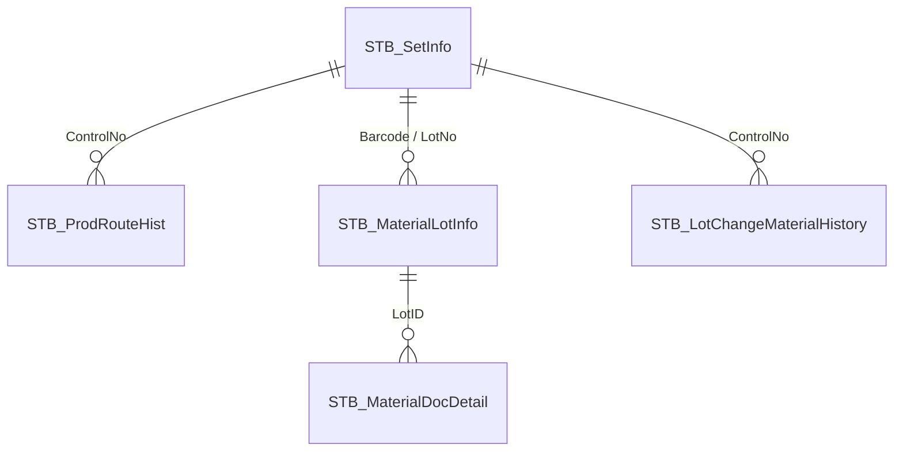

# 🏛️ 01 — System Architecture & Dual Database Topology

> **Cơ chế:** NAIS MES vận hành theo kiến trúc **Metadata-Driven UI** kết hợp CSDL kép.

---

## 1. 🔌 Cấu Trúc CSDL Kép (Dual Database Topology)

```
                       [ NAIS MES Client Application ]
                                      │
                   ┌──────────────────┴──────────────────┐
                   ▼                                     ▼
        ┌─────────────────────┐               ┌─────────────────────┐
        │   SmartFramework    │               │   SmartFactoryV2    │
        │ (UI & Metadata DB)  │               │ (Data & Logic DB)   │
        └──────────┬──────────┘               └──────────┬──────────┘
                   │                                     │
         • STB_ScreenInfo                      • STB_SetInfo (Barcode/Lot)
         • STB_ScreenObjects                   • STB_MaterialLotInfo (Kho)
         • STB_UserPermission                  • STB_ProdRouteHist (Sản xuất)
         • STB_StringResources                 • STB_MaterialDocDetail (Chứng từ)
```

1. **`SmartFramework` (UI & Metadata):**
   * Quản lý menu, đối tượng UI, nút bấm (`STB_ScreenObjects`), phân quyền User/UserType (`STB_UserPermission`).
   * Chứa từ điển thông báo lỗi đa ngôn ngữ (`STB_StringResources`). Khi SP trong DB gọi `usp_RaiseLocalizedError`, hệ thống tự tra cứu chuỗi tiếng Việt/tiếng Hàn tương ứng.
2. **`SmartFactoryV2` (Core Data & Business Logic):**
   * Quản lý toàn bộ dữ liệu giao dịch sản xuất, kho NVL, kho thành phẩm, QC, Slitting điện cực và Master Data.
   * Chứa 500+ Stored Procedures nghiệp vụ.

---

## 2. 🛡️ Ma Trận 4 Bảng Sống Còn (Core Transaction Tables)

Mọi thao tác sửa chữa dữ liệu, chuyển đổi Lot (B351) hay hủy phiếu đều phải đảm bảo toàn vẹn trên 4 bảng sau:



1. **`STB_SetInfo` (Quản lý Barcode & Kế hoạch ngày):**
   * Khóa định danh: `ControlNo`, `Barcode`.
   * Cột cốt lõi: `MaterialCode`, `DayPlanNo`, `PONo`, `InputLineCode`, `CurrentRouteCode`, `DefectQty`, `LotDecisionResult`.
2. **`STB_MaterialLotInfo` (Quản lý Tồn kho & Đóng gói):**
   * Khóa định danh: `LotID`, `LotNo`, `MaterialLotNo`.
   * Cột cốt lõi: `MaterialWarehouseCode`, `CurrentQty`, `PackingID`, `LotAttr10` (Ngày SX Vendor), `ValidMonth`.
3. **`STB_ProdRouteHist` (Lịch sử Công đoạn Sản xuất):**
   * Khóa định danh: `ProdRouteHistNo`, `ControlNo`.
   * Cột cốt lõi: `RouteCode`, `FindRouteCode`, `ProdQty`, `DefectQty`, `CompleteRoute` (để NULL nếu muốn mở luồng tiếp theo), `JobDate`.
4. **`STB_MaterialDocDetail` (Chi tiết Chứng từ Kho):**
   * Khóa định danh: `MaterialDocNo`, `ItemNo`.
   * Cột cốt lõi: `LotID`, `MaterialCode`, `Qty`, `MaterialWarehouseCode`.
