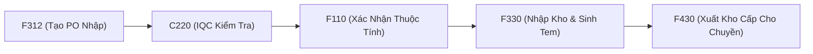

# 📦 01 — WMS Warehouse Management & Stock Operations

> **Phân hệ:** Quản lý kho nguyên vật liệu (ROH), kho bán thành phẩm, kho thành phẩm (FERT) và cơ chế FIFO.

---

## 1. 🔄 Luồng Vận Hành Kho Chuẩn



---

## 2. 🛡️ Quy Tắc FIFO & Hạn Dùng (Expiry Date)

1. **Nguyên tắc FIFO (`usp_VVTMaterialWarehouse_validFIFO`):**
   * Nếu bật `IsFIFO = 1` tại `STB_MaterialStockAttributeInfo` (F110), hệ thống sẽ chặn xuất các Lot nhập sau nếu Lot cũ hơn cùng mã còn tồn kho.
   * **Bypass khẩn cấp:** Update `IsFIFO = 0` hoặc lùi `CreateDateTime` của Lot cần xuất.
2. **Hạn sử dụng NVL (`ValidMonth`):**
   * Ngày hết hạn = `LotAttr10` (Ngày SX Vendor) + `ValidMonth` (Tháng).
   * Nếu hết hạn, hệ thống tự chuyển Lot vào kho `HOLDING_WH`.
   * **Ân xá Lot:** Khai báo Lot vào bảng `stb_vvt_OpenExpiredMaterial` để cho phép chuyền quét tại B597.

---

## 3. ❌ Trình Tự Hủy Phiếu Nhập Kho F330 (Confirmed)

Để tránh lỗi vi phạm khóa ngoại (FK Violation), bắt buộc xóa theo thứ tự ngược:
```sql
BEGIN TRANSACTION;
-- 1. Xóa chi tiết Lot tồn kho
DELETE FROM STB_MaterialLotInfo WHERE LotID IN (SELECT LotID FROM STB_MaterialDocLotInfo WHERE MaterialDocNo = 'MÃ_PHIẾU');
-- 2. Xóa liên kết Doc - Lot
DELETE FROM STB_MaterialDocLotInfo WHERE MaterialDocNo = 'MÃ_PHIẾU';
-- 3. Xóa chi tiết chứng từ
DELETE FROM STB_MaterialDocDetail WHERE MaterialDocNo = 'MÃ_PHIẾU';
-- 4. Xóa tiêu đề chứng từ
DELETE FROM STB_MaterialDocInfo WHERE MaterialDocNo = 'MÃ_PHIẾU';
COMMIT TRANSACTION;
```
