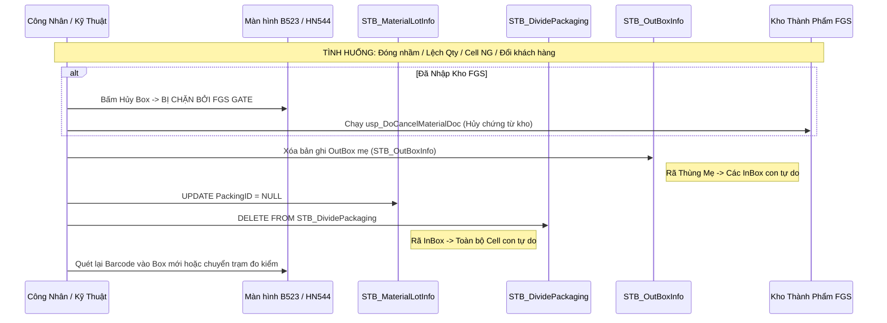

# 🏭 BẢN ĐỒ CHI TIẾT CÁC CÔNG ĐOẠN SẢN XUẤT MES VINATECH
## (End-to-End Manufacturing Process Pipeline & Database Architecture)

> **Cơ sở dữ liệu trung tâm:** `SmartFactoryV2` & `SmartFramework`  
> **Hệ thống điều hành:** NAIS MES System (Vinatech Core MES)  
> **Nhà máy áp dụng:** Bắc Ninh (`VVT_F1`), Hưng Yên (`VVT_F5`), Hà Nam (`VVT_F3`), Bắc Giang 2 (`VVT_F4`).  
> **Tài liệu tham chiếu:** [DB_02_MES_MANUFACTURING_PROCESS_PIPELINE.md](file:///c:/Users/User%20Vinatech.DESKTOP-RJJSEQU/Desktop/PROCESS/MES_LEGACY_BACKUP/DATABASE_KNOWLEDGE_BASE/DB_02_MES_MANUFACTURING_PROCESS_PIPELINE.md), [KB_03_02_CELL_LINE.md](file:///c:/Users/User%20Vinatech.DESKTOP-RJJSEQU/Desktop/PROCESS/MES_LEGACY_BACKUP/MES_MASTER_KNOWLEDGE_BASE/KB_03/KB_03_02_CELL_LINE.md), [KB_04_01_CORE_PACKAGING.md](file:///c:/Users/User%20Vinatech.DESKTOP-RJJSEQU/Desktop/PROCESS/MES_LEGACY_BACKUP/MES_MASTER_KNOWLEDGE_BASE/KB_04/KB_04_01_CORE_PACKAGING.md), [KB_05_01_QC_AND_ELECTRODE_CORE.md](file:///c:/Users/User%20Vinatech.DESKTOP-RJJSEQU/Desktop/PROCESS/MES_LEGACY_BACKUP/MES_MASTER_KNOWLEDGE_BASE/KB_05/KB_05_01_QC_AND_ELECTRODE_CORE.md), [KB_10_FACTORY_WORKCENTER_MATRIX.md](file:///c:/Users/User%20Vinatech.DESKTOP-RJJSEQU/Desktop/PROCESS/MES_LEGACY_BACKUP/MES_MASTER_KNOWLEDGE_BASE/KB_10_FACTORY_WORKCENTER_MATRIX.md).

---

## 🗺️ 1. Sơ Đồ Tổng Quan Luồng Sản Xuất Khép Kín (End-to-End Workflow)

```mermaid
flowchart TD
    subgraph ELECTRODE["⚡ GIAI ĐOẠN 1: PHÂN XƯỞNG ĐIỆN CỰC (ELECTRODE LINE)"]
        direction TB
        E1["1. MIXING (Trộn hồ điện cực)<br>Route: E-01<br>Màn hình: B470, B552, App Cân CMC"]
        E2["2. COATING (Tráng phủ Al Foil)<br>Route: E-02<br>Màn hình: B552, B802"]
        E3["3. ROLLPRESS (Cán ép cuộn cực)<br>Route: E-03<br>Màn hình: B552, B802"]
        E4["4. SLITTING (Cắt chia cuộn cực con)<br>Route: E-28<br>Màn hình: B552, C460 (In tem cuộn)"]
        
        E1 -->|Bồn hồ sệt| E2
        E2 -->|Cuộn foil đã sấy| E3
        E3 -->|Cuộn cán đạt độ dày| E4
    end

    subgraph HANDOVER["🔄 GIAI ĐOẠN 2: CHUYỂN GIAO NVL & KHỞI TẠO LOT CELL"]
        direction TB
        H1["4.1 Lập Kế hoạch ngày & Sinh Barcode Cell<br>Màn hình: B450 (IsFixed=1)"]
        H2["4.2 In Tem Thẻ Chuyền AssembleLabel<br>Màn hình: B450, A460, Z530"]
        H3["4.3 Scan Nạp Cuộn Cực & Kiểm Tra 3 Lớp Chặn<br>Màn hình: B597 / B540 (Multi-barcode)"]
        
        H1 --> H2 --> H3
    end

    subgraph CELL["🔋 GIAI ĐOẠN 3: PHÂN XƯỞNG LẮP RÁP CELL (ASSEMBLY: V-22 ➔ V-28)"]
        direction TB
        C1["5. WINDING (Quấn cuộn Jelly Roll)<br>Route: V-22 / V-22_BG / VE01<br>Màn hình: B540, B530, C443"]
        C2["6. RIVETING & RUBBER (Hàn chân & Lắp cao su)<br>Route: V-23 / V-23_BG / VE03<br>Màn hình: B540, B530"]
        C3["7. CURLING (Lồng vỏ & Miết miệng lon)<br>Route: V-24 / V-24_BG / VE06<br>Màn hình: B530, B540"]
        C4["8. VACUUM DRYING (Sấy lò chân không)<br>Route: V-25 / V-25_BG / VE07<br>Màn hình: B540, B530 (4 cột màu sấy)"]
        C5["9. ELECTROLYTE FILLING (Bơm dung dịch điện phân)<br>Route: V-26 / V-26_BG<br>Màn hình: B530, B540"]
        C6["10. WASHING & SLEEVE (Rửa vỏ & Bọc màng co)<br>Route: V-27 / V-28<br>Màn hình: B530, B717"]
        
        C1 --> C2 --> C3 --> C4 --> C5 --> C6
    end

    subgraph AGING_TEST["🔬 GIAI ĐOẠN 4: LÃO HÓA & ĐO KIỂM ĐIỆN (AGING & TESTING)"]
        direction TB
        T1["11. AGING (Ủ nhiệt ổn định hóa học)<br>Route: V-29 / Buồng nhiệt 65-70°C<br>Bảng: STB_AgingHist"]
        T2["12. CELL TESTER (Đo nạp xả OCV / ESR / Cap)<br>Màn hình: C310, C443<br>Bảng: STB_CellTesterResult"]
        
        T1 --> T2
    end

    subgraph PACKING["📦 GIAI ĐOẠN 5: ĐÓNG GÓI & XUẤT XƯỞNG (SORTING & PACKING)"]
        direction TB
        P1["13. INBOX PACKING (Đóng hộp nhỏ/khay xốp)<br>Màn hình: B510, B523, HN544"]
        P2["14. OUTBOX PACKING & SCALE (Đóng thùng carton mẹ)<br>Màn hình: B520, B523 (Cân Gross/Net)"]
        P3["15. BENDING & TAPPING (Bẻ chân cực & Dán băng dính)<br>Màn hình: B717"]
        P4["16. CUSTOMER FINAL LABEL & FGS (Tem xuất kho)<br>Màn hình: B525, B767 (Sanmina), B754-B758"]
        
        P1 --> P2 --> P3 --> P4
    end

    ELECTRODE -->|Cuộn Slitting| HANDOVER
    HANDOVER -->|Mở khóa NVL| CELL
    CELL -->|Thân Cell hoàn thiện| AGING_TEST
    AGING_TEST -->|Cell PASS chỉ số điện| PACKING

    style ELECTRODE fill:#e6f2ff,stroke:#0066cc,stroke-width:2px
    style HANDOVER fill:#fff2e6,stroke:#ff6600,stroke-width:2px
    style CELL fill:#e6ffe6,stroke:#009933,stroke-width:2px
    style AGING_TEST fill:#f3e8ff,stroke:#7e22ce,stroke-width:2px
    style PACKING fill:#fef9c3,stroke:#ca8a04,stroke-width:2px
```



---

## ⚡ 2. Chi Tiết Từng Công Đoạn Sản Xuất

### PHẦN 1: PHÂN XƯỞNG ĐIỆN CỰC (ELECTRODE LINE)

| STT | Tên Công Đoạn & Mô Tả Kỹ Thuật | Mã Route | Màn Hình MES | Stored Procedure Cốt Lõi | Bảng CSDL Cốt Lõi | Cột Khóa / Trường Dữ Liệu | Cơ Chế Kiểm Soát & Quy Tắc Hủy/Xóa |
|:---:|:---|:---:|:---:|:---|:---|:---|:---|
| **1** | **Mixing (Trộn hồ điện cực):** Cân tỷ lệ dung môi, bột than dẫn điện Super P, chất kết dính CMC, PTFE, BM-400B... theo công thức nghiêm ngặt để tạo bồn hồ cực đạt độ nhớt và tỷ trọng tiêu chuẩn. | `E-01` | **B470**<br>**B552** (Tab Mix)<br>App Cân CMC | `usp_DoCreateElectrodeMixStepInfo_electron`<br>`usp_GetElectroMixPresentStep_vietnam` | `STB_ElectrodeMixInfo`<br>`STB_ElectrodeMixStepInfo`<br>`STB_ElectrodeStep`<br>`STB_SetInfo` | `ElectrodeLotNumber`<br>`MaterialLotNumber`<br>`ElectrodeStep`<br>`Seq` | **Chỉ xóa khi Coating = 0:** Xóa Cascade tuần tự 3 bảng: `StepInfo` $\rightarrow$ `MixInfo` $\rightarrow$ `STB_SetInfo`. Không được xóa mẻ khi đã đưa sang máy tráng. |
| **2** | **Coating (Tráng phủ Al Foil):** Bơm hồ điện cực sệt quét đều 2 mặt lên lá nhôm (Al Foil), chạy qua buồng sấy nhiệt làm bay hơi dung môi và kết dính lớp bột lên foil. | `E-02` | **B552** (Tab Coat)<br>**B802** (Báo cáo) | `usp_ElectrodeCoatingInfo_HY_get`<br>`usp_Vietnam_ElectrodeProdRouteHist_get` | `STB_ElectrodeCoatingInfo`<br>`STB_CoatingToSlittingMaster` | `ElectrodeLotNumber`<br>`MachineCode`<br>`CoatingDate`<br>`Speed`, `OvenTemp` | **CẤM XÓA DB:** Khi đã tráng foil thì đã tiêu hao vật tư nhôm và hóa chất thật. Bắt buộc nhập Báo phế (NG/Scrap) trên B552/B802 để giữ cân bằng kho kế toán. |
| **3** | **Rollpress (Cán nén / Ép cuộn):** Foil sau tráng được đưa qua các quả lô gia nhiệt chịu lực ép hàng chục tấn để nén chặt bột than, đạt độ dày chính xác (`MaterialThickness` tại **A230** như 120µm, 180µm). | `E-03` | **B552** (Tab Roll)<br>**B802** | `usp_ElectrodeRollPressingInfo_HY_get`<br>`usp_ElectrodeRollPressingInfo_HY_iud` | `STB_ElectrodeWasteInfoNew`<br>`STB_ElectrodeRollPressingInfo_HY` | `ElectrodeWasteNo`<br>`RollpressDate`<br>`ElectrodeThickness` | **Điều chỉnh số liệu đo:** Không xóa trực tiếp dòng CSDL; chỉ cập nhật độ dày và thông số thông qua SP chuẩn. |
| **4** | **Slitting (Cắt chia cuộn cực con):** Dao cắt xẻ cuộn foil lớn thành nhiều cuộn cực nhỏ có chiều rộng (Width) theo bản vẽ máy quấn. In tem barcode dán lên từng cuộn con. | `E-28` | **B552** (Tab Slit)<br>**C460** (QC đo) | `usp_SlittingLocationConfig_VVT_get`<br>`usp_SlittingLocationConfig_VVT_iud` | `STB_ElectrodeSlittingResult`<br>`STB_ElectrodeSlittingInfo`<br>`STB_ElectrodeSlittingResultHist` | `ElectrodeLotNumber`<br>`Seq`, `Barcode`<br>`SlittingWidth`<br>`ElectrodeThick` | **Safe Delete:** Khi cắt thừa/nhầm Seq: Bắt buộc ghi log vào `Hist` (Flag=`'DELETE'`) trước, rồi mới xóa bản ghi trong `Result`. |

---

### PHẦN 2: CHUYỂN GIAO & KHỞI TẠO LỆNH SẢN XUẤT CELL

| STT | Nghiệp Vụ & Mô Tả Kỹ Thuật | Màn Hình | Stored Procedure Cốt Lõi | Bảng CSDL Cốt Lõi | Cột Khóa / Trường Dữ Liệu | Cơ Chế Kiểm Soát & Quy Tắc Vận Hành |
|:---:|:---|:---:|:---|:---|:---|:---|
| **4.1** | **Tạo Kế hoạch SX & Sinh Lot Cell:** Lập kế hoạch sản xuất ngày, chỉ định PO, Line, Model, số lượng dự kiến. | **B450**<br>(hoặc B310 PO) | `usp_DayProdPlan_iud`<br>`usp_DoFixDayProdPlan`<br>`usp_DoCreateSetInfoForProdQty_VNT` | `STB_DayProdPlan`<br>`STB_SetInfo`<br>`STB_ProductionOrderInfo` | `DayPlanNo`<br>`ControlNo`<br>`Barcode`<br>`IsFixed = 1` | **Bẫy IsFixed:** Phải tick chọn `IsFixed = 1` mới xuất hiện nút Tạo Lot và sinh Barcode. Nếu thiếu sẽ không bung được Lot sang B540. |
| **4.2** | **In Tem Lắp Ráp (Assemble Label):** In tem nhãn mã vạch dán lên thẻ theo dõi chuyền sản xuất (Assy Card). | **A460**<br>**B450** / **Z530** | `usp_SetInfo_get`<br>`usp_DoMakeModelLabelInfo` | `STB_ModelLabelInfo`<br>`STB_LabelInfo` (SmartFramework) | `ModelCode`<br>`LabelType = 'AssembleLabel'`<br>`FormatName` | **Not found label type:** Nếu Model mới chưa map tem trong **A460** hoặc XML layout chưa duyệt trong **Z530**, máy in sẽ báo lỗi đỏ chặn in. |
| **4.3** | **Scan NVL Cuộn Cực & Chống Lẫn:** Quét mã cuộn Slitting vào chuyền Cell trước khi đưa lên cọc quấn. | **B597**<br>**B540** | `usp_RawMaterialInputHist_get`<br>`usp_Vietnam_RawMaterialInputHist_uid` | `STB_RawMaterialInputHist`<br>`STB_MaterialLotInfo`<br>`STB_ProductionOrderBom` | `Barcode` (Cell)<br>`MaterialLotNo` (Cuộn)<br>`RouteCode`<br>`CreateDateTime` | **3 Lớp Chặn (Gates):**<br>1. Hàng bị HOLD ➔ Chặn.<br>2. Hàng hết hạn bảo quản ➔ Chặn.<br>3. Mã cuộn không nằm trong BOM ➔ Báo lỗi *"Sai chủng loại"*. Hỗ trợ lưu nhiều cuộn nối tiếp bằng dấu `;`. |

---

### PHẦN 3: PHÂN XƯỞNG LẮP RÁP CELL (CELL ASSEMBLY: V-22 ➔ V-28)

| STT | Công Đoạn (Route) | Ý Nghĩa Kỹ Thuật | Màn Hình | Stored Procedure Cốt Lõi | Bảng CSDL Cốt Lõi | Cột Khóa / Trường Liên Kết | Lưu Ý Vận Hành & Bẫy Cổng Chặn (Gates) |
|:---:|:---|:---|:---:|:---|:---|:---|:---|
| **5** | **WINDING (Quấn Cell)**<br>`V-22` / `V-22_BG`<br>`VE01` (Hà Nam)<br>`VP01` (BG2) | Máy tự động cuộn lá cực (+), màng ngăn Separator và lá cực (-) thành lõi Jelly Roll tròn, dán băng keo cố định. Camera Vision kiểm tra mép cực. | **B540**<br>**B530**<br>**C443** (QC) | `usp_CheckInputElectrodeInputForCodeProduct`<br>`usp_DoProcessProdRouteHistForCalc_SmartApp_VNT`<br>`usp_GetCommInspection_HistoryForBarcode_Vietnam` | `STB_SetInfo`<br>`STB_ProdRouteHist`<br>`STB_VisionGroup1InspectionInfo`<br>`STB_DefectInfo` | `Barcode`<br>`ControlNo`<br>`RouteCode = 'V-22'`<br>`ProdRouteHistNo`<br>`VisionJudgement` | **[GATE 1] Chặn Điện Cực:** Nếu chưa nạp cuộn cực âm/dương ở B540/B597, B530 sẽ chặn không cho chốt sản lượng. Hủy kết quả đo QC C443: Chỉ xóa dòng đo có `RouteCode='VE01'`, không xóa `STB_SetInfo`. |
| **6** | **RIVETING & RUBBER (Hàn chân & Lắp cao su)**<br>`V-23` / `V-23_BG`<br>`VE03` (Hà Nam) | Tán đinh rive liên kết chân cực với nắp gioăng cao su chịu áp, hàn siêu âm chân cực vào tab lá nhôm. | **B540**<br>**B530** | `usp_CheckInputRawMaterialCodeForProduct`<br>`usp_DoProcessProdRouteHistForCalc_SmartApp_VNT` | `STB_ProdRouteHist`<br>`STB_RawMaterialInputHist`<br>`STB_DefectInfo` | `ControlNo`<br>`RouteCode = 'V-23'`<br>`IsRawMaterialInputFinish` | **[GATE 2] Chặn NVL Lắp Cao Su:** Bắt buộc quét mã Lot nắp cao su trước, cột `IsRawMaterialInputFinish` phải bằng `1`. Nếu bằng `0`, B530 báo lỗi đỏ chặn chuyển trạm. |
| **7** | **CURLING (Lồng vỏ & Miết miệng lon)**<br>`V-24` / `V-24_BG`<br>`VE06` (Hà Nam) | Lồng lõi Jelly Roll vào vỏ lon nhôm (Alu Case), lăn gân tạo ngấn (Beading) và miết gập viền miệng nhôm ôm khít gioăng cao su chống xì hở. | **B530**<br>**B540** | `usp_DoProcessProdRouteHistForCalc_SmartApp_VNT`<br>`usp_DoProcessDefectRepairInfoByBarcode_SmartApp` | `STB_ProdRouteHist`<br>`STB_DefectInfo` (`V-24_NE6_BG`, `V-24_2CT_BG`) | `ControlNo`<br>`RouteCode = 'V-24'`<br>`ProdQty`, `DefectQty` | **Kiểm soát kích thước:** Sau khi miết, QC kiểm tra đường kính miệng và chiều cao lon. Nếu NG nhập mã lỗi `V-24_NE6_BG` để giảm trừ sản lượng pass. |
| **8** | **VACUUM DRYING (Sấy hút chân không)**<br>`V-25` / `V-25_BG`<br>`VE07` (Hà Nam) | Đưa khay Cell vào lò sấy Dry Oven ở nhiệt độ cao và áp suất chân không âm sâu để hút kiệt toàn bộ hơi ẩm trước khi bơm hóa chất. | **B540**<br>**B530** | `usp_VN_DryOver`<br>`usp_DoUpdateProdRouteHistMarkingLetter` | `STB_ProdRouteHist`<br>`STB_SetInfo` | `ControlNo`<br>`RouteCode = 'V-25'`<br>`MarkingLetter` | **Bẫy 4 Cột Màu & Marking:** Màn hình B540 bắt buộc nhập đủ 4 thông số sấy lò và ký tự `MarkingLetter`. Nếu để trống, B530 sẽ RAISERROR chặn không cho hoàn tất. |
| **9** | **ELECTROLYTE FILLING (Bơm dung dịch điện phân)**<br>`V-26` / `V-26_BG` | Bơm dung dịch hóa chất điện phân dẫn ion vào trong thân Cell trong phòng khô (Dry Room), sau đó đóng nút bịt kín lỗ bơm (Plug Sealing). | **B530**<br>**B540** | `usp_DoProcessProdRouteHistForCalc_SmartApp_VNT` | `STB_ProdRouteHist`<br>`STB_RawMaterialInputHist` | `ControlNo`<br>`RouteCode = 'V-26'`<br>`MaterialLotNo` (Dung dịch) | Quét mã Lot hóa chất điện phân kiểm soát hạn sử dụng (Shelf life) trước khi bơm vào mẻ Cell. |
| **10** | **WASHING & SLEEVE (Rửa vỏ & Bọc màng co)**<br>`V-27` / `V-28` | Rửa sạch hóa chất rò rỉ bám dính ngoài vỏ nhôm, sấy khô, luồn ống màng co nhựa (Sleeve PET/PVC in thông số cực tính) và gia nhiệt co màng. | **B530**<br>**B717** | `usp_VN_BendingTapping_iud`<br>`usp_DoProcessProdRouteHistForCalc_SmartApp_VNT` | `STB_ProdRouteHist`<br>`STB_VN_BENDING_TAPPING` | `ControlNo`<br>`RouteCode = 'V-27'` / `'V-28'` | Chuẩn bị ngoại quan sạch sẽ và cách điện an toàn trước khi chuyển sang phân khu ủ nhiệt Aging. |

---

### PHẦN 4: LÃO HÓA & ĐO KIỂM PHÂN HẠNG ĐIỆN (AGING & TESTING)

| STT | Công Đoạn | Ý Nghĩa Kỹ Thuật | Màn Hình | Stored Procedure Cốt Lõi | Bảng CSDL Cốt Lõi | Cột Khóa / Trường Dữ Liệu | Cơ Chế Cập Nhật & Xử Lý Lỗi |
|:---:|:---|:---|:---:|:---|:---|:---|:---|
| **11** | **AGING (Ủ nhiệt lão hóa)** | Đặt khay Cell vào phòng nhiệt (65°C - 70°C) từ 24h - 72h để dung dịch điện phân thẩm thấu hoàn toàn và kích hoạt bề mặt than hoạt tính. | **B530**<br>(Tab Aging)<br>Buồng Aging | `usp_DoSplitLotAgingHN`<br>`usp_GetProdRouteHistForBarcode_VNT` | `STB_AgingHist`<br>`STB_ProdRouteHist` | `AgingNo`<br>`Barcode`<br>`InDateTime`<br>`OutDateTime`<br>`Temperature` | **Kiểm soát thời gian ủ:** Cell chưa đủ số giờ ủ tối thiểu theo quy định công nghệ sẽ bị hệ thống tự động khóa không cho đẩy sang trạm đo kiểm tiếp theo. |
| **12** | **CELL TESTER (Đo nạp/xả & Phân hạng điện)** | Máy đo tự động nạp xả dòng xung để đo 3 thông số vàng: Điện áp mạch hở (**OCV/Volt**), Điện dung (**Capacitance/Farad**), Nội trở (**ESR/mΩ**). Phân hạng Grade Cell. | **C310**<br>**C443** (QC)<br>Máy đo tự động | `usp_CellTesterResult_VVT_get`<br>`usp_DoProcessTestResult` | `STB_CellTesterResult`<br>`STB_SetInfo` | `Barcode`<br>`VoltVal`<br>`CapVal`<br>`ESRVal`<br>`Judgement` (`PASS`/`NG`)<br>`InspDateTime` | **Cơ chế Ghi đè hiệu lực (Overwrite):** Khi đo lại (Re-test), bản ghi có `InspDateTime` mới nhất sẽ được lấy làm kết quả phân hạng. Nếu `Judgement = 'NG'`, Cell bị khóa không cho đóng gói. |

---

### PHẦN 5: ĐÓNG GÓI & XUẤT XƯỞNG (SORTING & PACKING)

| STT | Công Đoạn | Ý Nghĩa Kỹ Thuật | Màn Hình | Stored Procedure Cốt Lõi | Bảng CSDL Cốt Lõi | Cột Khóa / Trường Dữ Liệu | Quy Tắc Đóng Gói & Hủy/Rã Box |
|:---:|:---|:---|:---:|:---|:---|:---|:---|
| **13** | **INBOX PACKING (Đóng hộp con / Khay xốp)** | Quét từng con Cell đã PASS vào hộp nhỏ/khay xốp theo quy cách số lượng (`STB_PackingStandard` ở **A419**). In dán tem InBox. | **B510**<br>**B523**<br>**HN544** | `usp_Vietnam_GetProdPackingForBarcode_VVT`<br>`usp_Vietnam_DoProcessProdPacking_VVT` | `STB_BoxInfo`<br>`STB_InBoxHistory`<br>`STB_DividePackaging` | `BoxID` / `PackingID`<br>`Barcode`<br>`BoxQty`<br>`CurrentQty` | **Rã InBox giải phóng Cell:** Chạy script set `PackingID = NULL` trên `STB_MaterialLotInfo` và `DELETE STB_DividePackaging` để hoàn trả Cell về trạng thái tự do. |
| **14** | **OUTBOX PACKING & SCALE (Đóng thùng carton lớn & Cân)** | Gom nhiều InBox con vào thùng Carton lớn, đặt lên cân điện tử lấy trọng lượng thực để chống đóng thiếu Cell. | **B520**<br>**B523** | `usp_Vietnam_GetBoxIDForLotNo_VVT`<br>`usp_PACLabelCartonWeight_get_Vietnam` | `STB_OutBoxInfo`<br>`STB_VietNam_CheckBarcode_2624` | `OutBoxID`<br>`BoxID`<br>`GrossWeight`<br>`NetWeight` | **Hủy OutBox:** Xóa bản ghi trong `STB_OutBoxInfo` để rã thùng mẹ về lại các InBox con độc lập. |
| **15** | **BENDING & TAPPING (Bẻ chân & Dán băng dính)** | Bẻ gập chân cực theo góc yêu cầu (90 độ, chân chữ L) và dán băng keo cách điện cố định chống ngắn mạch trước khi giao hàng. | **B717** | `usp_VN_BendingTapping_get`<br>`usp_VN_BendingTapping_iud` | `STB_VN_BENDING_TAPPING` | `Barcode`<br>`LineCode`<br>`WorkerCode`<br>`WorkDate` | **Chỉ lưu 1 lần:** SP chặn không cho cập nhật đè lần thứ hai nếu không có quyền can thiệp đặc biệt từ kỹ thuật. |
| **16** | **CUSTOMER LABEL & FGS (In tem xuất & Nhập kho FGS)** | In tem nhãn đặc thù cho từng khách hàng (Sanmina, Hela, PAC, Digi-Key, Solum, Phoenix Contact...) và đẩy chứng từ nhập kho thành phẩm. | **B525**<br>**B767** (Sanmina)<br>**B754~B758**<br>**B790** | `usp_SanminaLabelPrint_get_Vietnam`<br>`usp_VN_PACBoxLabelPrintHist_iud`<br>`usp_Vietnam_PhoenixContactLabelPrint_get` | `STB_SanminaIndiaLabelPrintHist`<br>`STB_VN_FINISHGOODS_HN_New`<br>`STB_FinishGoodStockOutBG` | `PackingID`<br>`MaterialDocNo`<br>`CustomerSerialNo`<br>`PrintSerialNo` | **Cổng Chặn FGS:** Khi đã nhập kho thành phẩm, UI sẽ khóa nút hủy đóng gói. Muốn rã box bắt buộc phải chạy `EXEC usp_DoCancelMaterialDoc` để hủy chứng từ kho trước. |

---

## 🛡️ 3. Cơ Chế 7 Cổng Chặn Kiểm Soát Tại B530 (`usp_DoProcessProdRouteHistForCalc_SmartApp_VNT`)

Trong công đoạn sản xuất Cell, Stored Procedure trung tâm này chịu trách nhiệm xác thực trước khi cho phép chốt sản lượng:

```
[GATE 1] Điện cực (V-22): usp_CheckInputElectrodeInputForCodeProduct
         -> Kiểm tra Stb_SlittingStock_VVT xem đã quét cuộn cực âm / dương chưa.
[GATE 2] NVL Lắp cao su (V-23 / V-24): usp_CheckInputRawMaterialCodeForProduct
         -> Bắt buộc IsRawMaterialInputFinish = 1 trong STB_ProdRouteHist.
[GATE 3] PQC Hà Nam (VE01 / VE03 / VE04 / VE08): usp_CheckPQCInputForProductHistForBarcode
         -> Bắt buộc công đoạn PQC kiểm tra ngoại quan / kích thước đạt chuẩn.
[GATE 4] Lot đã bị chốt (DPPExtText01 = '1'):
         -> RAISERROR: 'Lệnh sản xuất đã chốt, không cho nhập thêm'.
[GATE 5] Takt Time 20 phút (VNT): DATEDIFF(minute) <= 20:
         -> Chặn nhập vượt tốc độ dây chuyền vật lý.
[GATE 6] Bắt buộc chỉ định mã máy: IsRequireMachine = 1 AND MachineCode = '':
         -> RAISERROR: 'Công đoạn này bắt buộc chọn Machine'.
[GATE 7] Định tuyến PO: PONo IS NULL hoặc RouteCode không nằm trong STB_ProductionOrderRouting:
         -> RAISERROR: 'Routing này không có trong PO'.
```

---

## 🔍 4. Cơ Chế Rã Box Hoàn Trả Cell Về Trạng Thái Tự Do



### Script SQL Rã Box An Toàn (Transaction Template):
```sql
BEGIN TRANSACTION;
BEGIN TRY
    DECLARE @PackingID NVARCHAR(50) = N'MÃ_PACKING_CẦN_RÃ';

    -- 1. Giải phóng các con Cell / Lot con
    UPDATE STB_MaterialLotInfo 
    SET PackingID = NULL 
    WHERE PackingID = @PackingID;

    -- 2. Xóa lịch sử đóng gói hộp Cell
    DELETE FROM STB_DividePackaging 
    WHERE PackingID = @PackingID;

    -- 3. Xóa lịch sử đóng gói hộp Module (nếu có)
    DELETE FROM STB_SavePackingTime_VVT 
    WHERE PackingID = @PackingID;

    -- Đổi thành COMMIT khi chạy thật
    ROLLBACK TRANSACTION;
    PRINT N'Thử nghiệm rã box thành công!';
END TRY
BEGIN CATCH
    ROLLBACK TRANSACTION;
    PRINT N'Lỗi: ' + ERROR_MESSAGE();
END CATCH;
```

---

## ⚠️ 5. Ba Nguyên Tắc Vàng Bảo Toàn Dữ Liệu (Golden Rules)

1. **Nguyên tắc Phân xưởng Điện cực:** CẤM XÓA mẻ Coating và Rollpress. Mọi sai hỏng phải ghi nhận qua hình thức **Báo phế (Scrap / NG)** để bảo toàn số dư vật tư trên hệ thống kế toán ERP.
2. **Nguyên tắc Phân xưởng Cell:** Khi hủy sản lượng hoặc sửa số lượng tại B530, **chỉ xóa/sửa đúng `RouteCode` tại công đoạn đó**, tuyệt đối không xóa bản ghi gốc trong `STB_SetInfo` làm mất phả hệ Cell.
3. **Nguyên tắc Đóng gói:** Rã Box chỉ can thiệp vào các bảng liên kết đóng gói (`PackingID`, `DividePackaging`, `OutBoxInfo`), giữ nguyên vẹn kết quả đo kiểm điện OCV/ESR/Cap trong `STB_CellTesterResult`.
