# 🏭 SmartFactoryV2 — Manufacturing Process Pipeline & DB Schema Mapping

> **Phạm vi:** Toàn bộ chuỗi sản xuất khép kín từ **Điện cực (Electrode Line)** chuyển giao sang **Lắp ráp Cell (Cell Assembly Line)**.  
> **Cơ sở dữ liệu chính:** `SmartFactoryV2`  
> **Tài liệu tham chiếu:** [BAN_DO_CHI_TIET_CONG_DOAN_SAN_XUAT_MES_VINATECH.md](BAN_DO_CHI_TIET_CONG_DOAN_SAN_XUAT_MES_VINATECH.md) *(Bản đồ phân rã chi tiết 16 công đoạn, RouteCode & SP)*, [KB_05_01_QC_AND_ELECTRODE_CORE.md](file:///c:/Users/User%20Vinatech.DESKTOP-RJJSEQU/Desktop/PROCESS/MES_LEGACY_BACKUP/MES_MASTER_KNOWLEDGE_BASE/KB_05/KB_05_01_QC_AND_ELECTRODE_CORE.md), [KB_03_02_CELL_LINE.md](file:///c:/Users/User%20Vinatech.DESKTOP-RJJSEQU/Desktop/PROCESS/MES_LEGACY_BACKUP/MES_MASTER_KNOWLEDGE_BASE/KB_03/KB_03_02_CELL_LINE.md), [KB_09_SCREEN_BUG_FIXBOOK.md](file:///c:/Users/User%20Vinatech.DESKTOP-RJJSEQU/Desktop/PROCESS/MES_LEGACY_BACKUP/MES_MASTER_KNOWLEDGE_BASE/KB_09_SCREEN_BUG_FIXBOOK.md).

---

## 🗺️ 1. Bản Đồ Dòng Chảy Dữ Liệu Xuyên Suốt (End-to-End Pipeline)

Hệ thống MES Vinatech quản lý hai phân xưởng độc lập nhưng liên kết chặt chẽ theo nguyên lý **"Thành phẩm xưởng Điện cực là Nguyên vật liệu đầu vào của xưởng Cell"**:

```mermaid
flowchart TD
    subgraph ELECTRODE["⚡ GIAI ĐOẠN 1: PHÂN XƯỞNG ĐIỆN CỰC (ELECTRODE LINE)"]
        direction TB
        E1["1. MIXING (Trộn hồ điện cực)<br>Bảng: STB_ElectrodeMixInfo, STB_ElectrodeMixStepInfo<br>Màn hình: B470, B552 Tab Mixing"]
        E2["2. COATING (Tráng phủ lá Al Foil)<br>Bảng: STB_ElectrodeCoatingInfo<br>Màn hình: B552 Tab Coating, B802"]
        E3["3. ROLLPRESS (Cán ép cuộn cực)<br>Bảng: STB_ElectrodeWasteInfoNew, Tab Rollpress B552<br>Màn hình: B552 Tab Rollpress"]
        E4["4. SLITTING (Cắt chia cuộn cực)<br>Bảng: STB_ElectrodeSlittingResult, STB_ElectrodeSlittingInfo<br>Màn hình: B552 Tab Slitting (In tem nhãn barcode)"]
        
        E1 -->|Bồn hồ sệt| E2
        E2 -->|Cuộn foil đã tráng| E3
        E3 -->|Cuộn ép đạt spec độ dày| E4
    end

    subgraph HANDOVER["🔄 CHUYỂN GIAO NGUYÊN VẬT LIỆU (B597)"]
        E4 -->|Cuộn Slitting Barcode| H1["Scan nạp NVL đầu vào chuyền Cell<br>Bảng: STB_RawMaterialInputHist<br>Màn hình: B597 (Hỗ trợ Multi-barcode)"]
    end

    subgraph CELL["🔋 GIAI ĐOẠN 2: PHÂN XƯỞNG CELL ASSEMBLY (LẮP RÁP CELL)"]
        direction TB
        C1["5. WINDING (Quấn cuộn Jelly Roll)<br>Route: V-22_BG / VE01<br>Bảng: STB_SetInfo, STB_ProdRouteHist, STB_VisionGroup1InspectionInfo<br>Màn hình: B540, B530, C443"]
        C2["6. ASSEMBLY & CHEMICAL (Lắp ráp & Hóa chất)<br>Công đoạn: Bending, Riveting, Curling, Sấy Chân Không, Bơm Điện Phân<br>Bảng: STB_ProdRouteHist, STB_DefectInfo<br>Màn hình: B530, B540"]
        C3["7. AGING & TESTING (Lão hóa & Đo kiểm điện OCV/ESR/Cap)<br>Bảng: STB_AgingHist, STB_CellTesterResult<br>Màn hình: B530, C310, C443"]
        C4["8. SORTING & PACKING (Phân loại & Đóng thùng)<br>Bảng: STB_BoxInfo, STB_InBoxHistory, STB_OutBoxInfo<br>Màn hình: B510 (InBox), B520/B523 (OutBox), B525 (Tem FGS)"]
        
        H1 --> C1
        C1 --> C2
        C2 --> C3
        C3 --> C4
    end

    style ELECTRODE fill:#e6f2ff,stroke:#0066cc,stroke-width:2px
    style HANDOVER fill:#fff2e6,stroke:#ff6600,stroke-width:2px
    style CELL fill:#e6ffe6,stroke:#009933,stroke-width:2px
```

---

## 🗄️ 2. Chi Tiết Kiến Trúc Bảng CSDL Từng Công Đoạn

### ⚡ PHÂN XƯỞNG 1: ĐIỆN CỰC (ELECTRODE)

#### 1. Công đoạn MIXING (Pha Trộn Dung Dịch Điện Cực)
* **Ý nghĩa:** Cân các hóa chất theo công thức nghiêm ngặt (Dung môi, bột than Super P, Binder CMC, PTFE, BM-400B...) để tạo ra bồn dung dịch hồ điện cực đạt độ nhớt và tỷ trọng tiêu chuẩn.
* **Bảng CSDL cốt lõi:**
  1. `STB_ElectrodeMixInfo`: Lưu thông tin chung của mẻ (`ElectrodeLotNumber`, `MachineCode`, `WorkDate`, `WorkerCode`, `ProductionQty`, `TankInsideTemp`, `ViscosityValue`).
  2. `STB_ElectrodeMixStepInfo`: Lưu chi tiết các bước cân (`ElectrodeLotNumber`, `ElectrodeStep`, `Seq`, `ElectrodeMaterialCode`, `InputQty1`, `InputQty2`, `MaterialLotNumber`).
  3. `STB_ElectrodeStep`: Cấu hình danh mục bước cân và dung sai tiêu chuẩn (`StdMinVal`, `StdMaxVal`).
  4. `STB_SetInfo`: Mã Barcode gốc của mẻ trộn khởi tạo trên hệ thống.
* **Màn hình & SP:** **B470** (Thẻ công đoạn KTSP), **B552** (Tab Mixing), App cân CMC Electron (`usp_DoCreateElectrodeMixStepInfo_electron`, `usp_GetElectroMixPresentStep_vietnam`).
* **Quy tắc An toàn / Rollback:** Chỉ được xóa mẻ trộn khi **`STB_ElectrodeCoatingInfo = 0`**. Xóa tuần tự Cascade 3 bảng: `STB_ElectrodeMixStepInfo` $\rightarrow$ `STB_ElectrodeMixInfo` $\rightarrow$ `STB_SetInfo`.

---

#### 2. Công đoạn COATING (Tráng Phủ Lá Nhôm Al Foil)
* **Ý nghĩa:** Bơm hỗn hợp hồ điện cực sệt từ bồn Mixing quét phủ đều 2 mặt lên lá Al Foil, sau đó chạy qua buồng sấy nhiệt để làm bay hơi dung môi và kết dính lớp bột cực lên foil.
* **Bảng CSDL cốt lõi:**
  1. `STB_ElectrodeCoatingInfo`: Ghi nhận thông số và sản lượng tráng (`ElectrodeLotNumber`, `MachineCode`, `WorkerCode`, `CoatingDate`, `ProductionQty`, `DefectQty`, `Speed`, `OvenTemp`).
  2. `STB_CoatingToSlittingMaster`: Bảng ánh xạ quan hệ giữa cuộn mẹ Coating và các mã chia cuộn con Slitting.
* **Màn hình & SP:** **B552** (Tab Coating), **B802** (Báo cáo lịch sử sản xuất và phế điện cực), SP `usp_ElectrodeCoatingInfo_HY_get`, `usp_Vietnam_ElectrodeProdRouteHist_get`.
* **Quy tắc An toàn / Rollback:** **KHÔNG ĐƯỢC XÓA DB**. Khi đã có dữ liệu Coating, vật tư nhôm và hóa chất đã hao phí vật lý. Mọi sự cố phải báo phế (Scrap / NG) trên giao diện B552/B802 để bảo toàn cân bằng kiểm kê kế toán.

---

#### 3. Công đoạn ROLLPRESS (Cán Nén / Ép Cuộn Cực)
* **Ý nghĩa:** Cuộn foil sau khi sấy tráng được đưa qua các trục lăn chịu áp lực và gia nhiệt lớn để nén chặt lớp vật liệu, đạt độ dày chính xác theo quy cách thiết kế (`MaterialThickness` tại màn hình **A230** như 120µm, 180µm, 200µm).
* **Bảng CSDL cốt lõi:**
  1. `STB_ElectrodeWasteInfoNew`: Lưu thông tin ngày cán, ngày tráng (`RollpressDate`, `CoatingDate`, `ElectrodeWasteNo`).
  2. `STB_ElectrodeRollPressingInfo_HY`: Bảng thông tin ép cuộn chi tiết (triển khai cho nhà máy Hưng Yên & chuẩn hóa).
  3. `STB_ElectrodeRollPressingVisualInspectionInfo_HY`: Dữ liệu kiểm tra ngoại quan sau cán ép.
* **Màn hình & SP:** **B552** (Tab Rollpress), SP `usp_ElectrodeRollPressingInfo_HY_get` / `_iud`.
* **Quy tắc An toàn / Rollback:** Thay đổi thông số cán ép chỉ điều chỉnh số liệu đo hoặc ngày thực hiện qua SP chuẩn, không xóa trực tiếp record.

---

#### 4. Công đoạn SLITTING (Cắt Chia Cuộn Cực Con)
* **Ý nghĩa:** Cắt cuộn foil cán ép lớn thành nhiều cuộn cực nhỏ có chiều rộng (Width) theo đúng bản vẽ thiết kế để sẵn sàng đưa vào máy quấn Cell. Tại đây, hệ thống sinh mã vạch riêng và in tem barcode dán lên từng cuộn cực con.
* **Bảng CSDL cốt lõi:**
  1. `STB_ElectrodeSlittingResult`: Lưu danh sách các cuộn cực thành phẩm sau cắt (`ElectrodeLotNumber`, `Seq`, `Barcode`, `SlittingWidth`, `GoodQtyLength`, `ProductionQty`, `ElectrodeThick`).
  2. `STB_ElectrodeSlittingInfo`: Thông tin chung của ca cắt (`ElectrodeLotNumber`, `MachineCode`, `WorkerCode`, `WorkDate`, `SlittingLength`).
  3. `STB_ElectrodeSlittingResultHist`: Bảng Audit log lưu vết các lần xóa / điều chỉnh cuộn cắt (`ID`, `ElectrodeLotNumber`, `Seq`, `Flag`, `CreateDateTime`, `CreateUserID`).
  4. `STB_SlittingLocationConfig_VVT`: Cấu hình vị trí chia dao cắt theo model vật tư.
* **Màn hình & SP:** **B552** (Tab Slitting), **C460** (QC kiểm tra ngoại quan & đo kích thước cuộn cực).
* **Quy tắc An toàn / Rollback:** Khi cắt thừa hoặc nhầm kích thước cần xóa Seq:
  1. Bắt buộc ghi nhận log xóa vào `STB_ElectrodeSlittingResultHist` (Flag = `'DELETE'`).
  2. Sau đó mới chạy lệnh `DELETE FROM STB_ElectrodeSlittingResult WHERE ElectrodeLotNumber=... AND Seq=...`.

---

### 🔄 MẮT XÍCH CHUYỂN GIAO: B597 (Material Input Scanning)
* Cuộn cực Slitting sau khi dán tem barcode sẽ được vận chuyển sang xưởng Cell.
* Công nhân vận hành máy quấn Cell phải quét mã cuộn cực tại màn hình **B597** để mở khóa Lot trước khi sản xuất.
* **Bảng lưu trữ:** `STB_RawMaterialInputHist` (`RawMaterialInputHistNo`, `LineCode`, `Barcode`, `MaterialLotNo`, `RouteCode`, `CreateDateTime`). Hỗ trợ lưu nối tiếp nhiều cuộn cực phân cách bởi dấu `;` khi cuộn cũ hết giữa mẻ.

---

### 🔋 PHÂN XƯỞNG 2: LẮP RÁP CELL (CELL ASSEMBLY)

#### 5. Công đoạn WINDING (Quấn Cuộn Cực & Màng Ngăn - Jelly Roll)
* **Ý nghĩa:** Máy quấn tự động cuộn lá cực dương (+), màng ngăn (Separator) và lá cực âm (-) lại thành lõi cuộn tròn (Jelly Roll) và hàn chân cực (Terminal).
* **Mã Route chuẩn:** `V-22_BG` (Hà Nam / Bắc Ninh) hoặc `VE01` (QC Phân hệ).
* **Bảng CSDL cốt lõi:**
  1. `STB_SetInfo`: Quản lý thực thể Lot sản phẩm Cell (`Barcode`, `MaterialCode`, `Status`, `WorkCenterCode`, `InputLineCode`).
  2. `STB_ProdRouteHist`: Ghi nhận sản lượng từng lần chạy máy (`ProdRouteHistNo`, `ControlNo`, `RouteCode`, `LineCode`, `ProdQty`, `ProdDateTime`, `WorkerCode`).
  3. `STB_VisionGroup1InspectionInfo`: Dữ liệu máy chụp Vision tự động kiểm tra căn chỉnh mép cuộn cực và độ thò thụt chân cực.
  4. `STB_DefectInfo`: Lưu danh mục lỗi phế phẩm phát sinh tại trạm quấn (`V-22_BM_BG` - Xocha đen đầu đáy, `V-22_CC_BG`,...).
* **Màn hình & SP:** **B540** (Quét Lot vào chuyền tự động), **B530** (Nhập sản lượng công đoạn thủ công), **C443** (Kiểm tra đo thông số QC Winding).
* **Quy tắc An toàn / Rollback:** Muốn hủy kết quả đo kiểm Winding trên C443: Chỉ xóa các dòng đo kiểm có `RouteCode = 'VE01'` (hoặc `V-22_BG`) trong bảng đo kiểm con, không xóa `STB_SetInfo`.

---

#### 6. Công đoạn LẮP RÁP CƠ KHÍ & HÓA CHẤT (Assembly & Chemical Process)
* **Ý nghĩa:** Lõi Jelly Roll được lồng vào vỏ nhôm (Alu Case), đóng nắp cao su (Rubber / Riveting - `V-23_BG`), miết mép vỏ (Curling - `V-24_BG`), đưa vào lò sấy hút chân không (Vacuum Drying Oven - `V-25_BG`) để loại bỏ hoàn toàn hơi ẩm, sau đó bơm dung dịch điện phân (Electrolyte Filling) trong phòng khô và bịt kín.
* **Bảng CSDL cốt lõi:**
  1. `STB_ProdRouteHist`: Lưu vết tuần tự qua từng RouteCode (`V-23_BG` $\rightarrow$ `V-24_BG` $\rightarrow$ `V-25_BG`...).
  2. `STB_SetInfo`: Cập nhật trạng thái công đoạn hiện tại của Lot.
  3. `STB_RawMaterialInputHist`: Quét ghi nhận mã vỏ nhôm (Alu Case), mã nắp cao su, mã hóa chất điện phân.

---

#### 7. Công đoạn AGING & CELL TESTER (Lão Hóa & Đo Kiểm Phân Loại Điện)
* **Ý nghĩa:** Cell sau khi hoàn thiện được ủ nhiệt (Aging) để dung dịch điện phân ngấm sâu vào màng cực, sau đó đưa vào hệ thống máy kiểm tra tự động nạp/xả để đo các chỉ số cơ lý: Điện áp hở mạch (OCV), Điện dung (Capacitance/Farad), Nội trở tương đương (ESR).
* **Bảng CSDL cốt lõi:**
  1. `STB_AgingHist`: Lưu thời gian và nhiệt độ buồng ủ Aging (`AgingNo`, `Barcode`, `InDateTime`, `OutDateTime`, `Temperature`).
  2. `STB_CellTesterResult`: Lưu kết quả đo kiểm điện của từng con Cell (`Barcode`, `VoltVal`, `CapVal`, `ESRVal`, `Judgement`, `InspDateTime`).

---

#### 8. Công đoạn SORTING & PACKING (Phân Hạng & Đóng Gói Thành Phẩm)
* **Ý nghĩa:** Phân hạng Cell theo dải Farad/ESR, đóng khay/thùng nhỏ (InBox), dán tem thùng nhỏ, đóng thùng lớn (OutBox), cân trọng lượng xác thực và dán tem xuất khẩu FGS (Sanmina, Hela, Standard).
* **Bảng CSDL cốt lõi:**
  1. `STB_BoxInfo` & `STB_InBoxHistory`: Quản lý danh sách Cell trong từng hộp InBox (`BoxID`, `Barcode`, `BoxQty`).
  2. `STB_OutBoxInfo`: Quản lý thùng mẹ chứa nhiều InBox con (`OutBoxID`, `GrossWeight`, `NetWeight`).
  3. `STB_HelaPackingCheckHist` / `STB_SanminaPackingCheckHist`: Lưu vết kiểm tra đóng gói riêng cho các khách hàng lớn.
* **Màn hình:** **B510** (Đóng InBox), **B520 / B523** (Đóng OutBox & Cân trọng lượng), **B525** (In tem xuất kho FGS).

---

## 📊 3. Ma Trận Bảng CSDL Xuyên Suốt Chuỗi Công Đoạn

| Phân xưởng | Công đoạn (Route) | Màn hình MES | Bảng Dữ Liệu Chính | Cột Khóa / Liên Kết | Chính Sách Hủy / Xóa |
|:---|:---|:---:|:---|:---|:---|
| **Điện cực** | **Mixing** | B470, B552 | `STB_ElectrodeMixInfo` `STB_ElectrodeMixStepInfo` | `ElectrodeLotNumber` `MaterialLotNumber` | Cho phép xóa bằng Hotfix khi `Coating = 0` |
| **Điện cực** | **Coating** | B552, B802 | `STB_ElectrodeCoatingInfo` | `ElectrodeLotNumber` | **CẤM XÓA**. Chỉ xử lý Báo phế (NG) |
| **Điện cực** | **Rollpress** | B552, B802 | `STB_ElectrodeWasteInfoNew` | `ElectrodeWasteNo` | Sửa thông số qua SP / Không xóa gốc |
| **Điện cực** | **Slitting** | B552 | `STB_ElectrodeSlittingResult` `STB_ElectrodeSlittingInfo` | `ElectrodeLotNumber` `Seq`, `Barcode` | Ghi log vào `Hist` rồi mới xóa `Result` |
| **Chuyển giao** | **Scan NVL** | B597 | `STB_RawMaterialInputHist` | `Barcode`, `MaterialLotNo` | Cập nhật kho hoặc bypass FIFO/BOM |
| **Cell Line** | **Winding** | B540, B530, C443 | `STB_SetInfo` `STB_ProdRouteHist` `STB_VisionGroup1InspectionInfo` | `Barcode` `ControlNo` `RouteCode='V-22_BG'` | Hủy kết quả đo bằng lọc RouteCode |
| **Cell Line** | **Assembly/Dry** | B530, B540 | `STB_ProdRouteHist` | `ControlNo`, `RouteCode` | Điều chỉnh qua SP chốt sản lượng B530 |
| **Cell Line** | **Aging / OCV** | B530, C310 | `STB_AgingHist` `STB_CellTesterResult` | `Barcode`, `InspDateTime` | Đo lại thì update bản ghi mới nhất |
| **Cell Line** | **Packing** | B510, B520, B525 | `STB_BoxInfo` `STB_InBoxHistory` `STB_OutBoxInfo` | `BoxID`, `OutBoxID`, `Barcode` | Rã Box hoàn trả Cell về trạng thái tự do |
