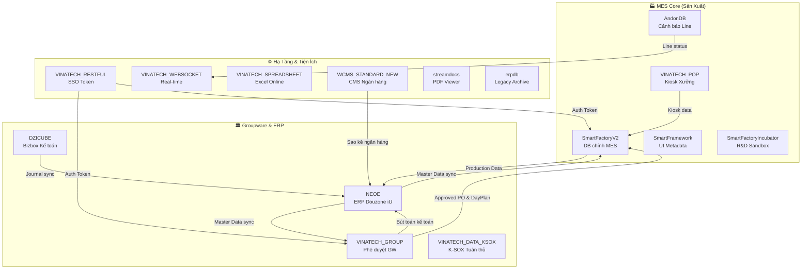

# 🗄️ DATABASE KNOWLEDGE BASE — Master Index

> **Cập nhật:** 2026-08-26
> **Tổng:** 15 CSDL trên cùng SQL Server Instance `dbserver.hycap.co.kr,5398`
> **Mục đích:** Tài liệu hóa toàn bộ cơ sở dữ liệu trong hệ sinh thái Vinatech

---

## 📊 Tổng Quan Hệ Sinh Thái Database

---

## 📁 Danh Mục File Tài Liệu

### 🏭 Nhóm 1: MES — Sản Xuất & Hiện Trường

| # | File | Database | Vai trò | Quy mô |
|---|------|----------|---------|--------|
| 01 | *Đã có trong KB_INDEX* | **SmartFactoryV2** | DB nghiệp vụ MES chính | ~500+ bảng |
| 02 | *Đã có trong KB_01* | **SmartFramework** | UI Metadata & Phân quyền | ~50+ bảng |
| 03 | [DB_03_VINATECH_GROUP.md](DB_03_VINATECH_GROUP.md) | **VINATECH_GROUP** | Groupware phê duyệt điện tử | ~200+ bảng |
| 04 | [DB_04_NEOE_ERP.md](DB_04_NEOE_ERP.md) | **NEOE** | ERP Douzone iU (Sổ cái trung tâm) | 4876 bảng |
| 05 | [DB_05_DZICUBE.md](DB_05_DZICUBE.md) | **DZICUBE** | Bizbox Kế toán Douzone | 3300+ bảng |
| 06 | [DB_06_VINATECH_POP.md](DB_06_VINATECH_POP.md) | **VINATECH_POP** | Kiosk đầu cuối xưởng | ~20+ bảng |
| 07 | [DB_07_AndonDB.md](DB_07_AndonDB.md) | **AndonDB** | Andon cảnh báo dây chuyền | 3 bảng |
| 08 | [DB_08_VINATECH_RESTFUL.md](DB_08_VINATECH_RESTFUL.md) | **VINATECH_RESTFUL** | SSO Token bảo mật | 3 bảng |
| 09 | [DB_09_VINATECH_WEBSOCKET.md](DB_09_VINATECH_WEBSOCKET.md) | **VINATECH_WEBSOCKET** | WebSocket realtime | ~5 bảng |
| 10 | [DB_10_VINATECH_SPREADSHEET.md](DB_10_VINATECH_SPREADSHEET.md) | **VINATECH_SPREADSHEET** | Excel Online cộng tác | ~10 bảng |
| 11 | [DB_11_WCMS.md](DB_11_WCMS.md) | **WCMS_STANDARD_NEW** | CMS quản lý dòng tiền | ~15+ bảng |
| 12 | [DB_12_SmartFactoryIncubator.md](DB_12_SmartFactoryIncubator.md) | **SmartFactoryIncubator** | R&D Sandbox | ~50 bảng |
| 13 | [DB_13_VINATECH_DATA_KSOX.md](DB_13_VINATECH_DATA_KSOX.md) | **VINATECH_DATA_KSOX** | K-SOX tuân thủ nội bộ | ~15+ bảng |
| 14 | [DB_14_erpdb_Legacy.md](DB_14_erpdb_Legacy.md) | **erpdb** | ERP cũ (Archive only) | 884 bảng |
| 15 | [DB_15_streamdocs.md](DB_15_streamdocs.md) | **streamdocs** | PDF Viewer Forcs | ~10 bảng |

### 📌 Ghi Chú Quan Trọng

> [!IMPORTANT]
> **SmartFactoryV2** và **SmartFramework** đã được tài liệu hóa chi tiết trong `MES_MASTER_KNOWLEDGE_BASE/` (KB_01 → KB_11).
> Các file DB_01 và DB_02 KHÔNG được tạo trùng lặp — tham chiếu trực tiếp từ KB_INDEX.

> [!WARNING]
> **erpdb** là CSDL tĩnh (Archive). Không tác động trong vận hành MES/GW hiện tại.

---

## 🔗 Tra Cứu Nhanh Theo Nghiệp Vụ

| Khi cần... | Tra DB nào |
|------------|-----------|
| Debug lỗi sản xuất MES | SmartFactoryV2 (KB_INDEX) |
| Check phân quyền / UI Layout | SmartFramework (KB_01) |
| Tra PO / Form phê duyệt / Suju | VINATECH_GROUP (DB_03) |
| Tra mã vật tư / BOM / Vendor gốc | NEOE (DB_04) |
| Tra bút toán kế toán / hóa đơn thuế | DZICUBE (DB_05) |
| Check cấu hình Kiosk / MAC / PLC | VINATECH_POP (DB_06) |
| Check trạng thái dừng line / cảnh báo | AndonDB (DB_07) |
| Check SSO Token / phiên đăng nhập | VINATECH_RESTFUL (DB_08) |
| Check thông báo real-time / WebSocket | VINATECH_WEBSOCKET (DB_09) |
| Check bảng tính cộng tác trực tuyến | VINATECH_SPREADSHEET (DB_10) |
| Check sao kê ngân hàng / thẻ doanh nghiệp | WCMS (DB_11) |
| Check kết quả R&D / Cell thử nghiệm | SmartFactoryIncubator (DB_12) |
| Check ma trận kiểm soát K-SOX | VINATECH_DATA_KSOX (DB_13) |
| Tra dữ liệu kế toán lịch sử cũ | erpdb (DB_14) |
| Check PDF viewer / StreamDocs | streamdocs (DB_15) |

---

*Tất cả CSDL đều nằm trên cùng một SQL Server Instance: `dbserver.hycap.co.kr,5398`*
