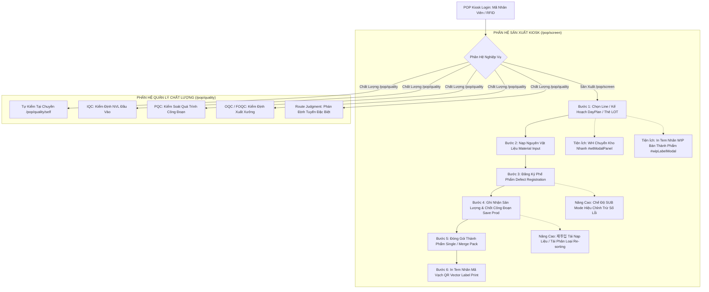

<!--
AI-READY METADATA
Purpose: Hướng dẫn chuyên sâu toàn diện về luồng vận hành (Process Flow), 4 vùng giao diện Kiosk, từng nút bấm/modal và tác động cơ sở dữ liệu ngầm của POP Web
Scope: Khai thác thực tế 100% giao diện pop.vinatech.com/pop/screen và pop.vinatech.com/pop/quality
Single Source of Truth: POP_KB_02_SCREEN_OPERATIONS.md
Target Tables: STB_SetInfo, STB_ProdRouteHist, STB_MaterialLotInfo, STB_PackingInfo, STB_DefectInfo, VINA_MATERIAL_INPUT_HIST, VINA_KIOSK_SESSION, VINA_EQUIPMENT_MAPPING
Related Files:
  - [POP_KB_INDEX.md](file:///c:/Users/User%20Vinatech.DESKTOP-RJJSEQU/Desktop/PROCESS/MES_LEGACY_BACKUP/POP_KNOWLEDGE_BASE/POP_KB_INDEX.md)
  - [POP_KB_01_ARCHITECTURE_AND_API.md](file:///c:/Users/User%20Vinatech.DESKTOP-RJJSEQU/Desktop/PROCESS/MES_LEGACY_BACKUP/POP_KNOWLEDGE_BASE/POP_KB_01_ARCHITECTURE_AND_API.md)
  - [POP_KB_04_ROLLBACK_AND_SAFETY.md](file:///c:/Users/User%20Vinatech.DESKTOP-RJJSEQU/Desktop/PROCESS/MES_LEGACY_BACKUP/POP_KNOWLEDGE_BASE/POP_KB_04_ROLLBACK_AND_SAFETY.md)
  - [POP_USER_MANUAL.md](file:///c:/Users/User%20Vinatech.DESKTOP-RJJSEQU/Desktop/PROCESS/MES_LEGACY_BACKUP/POP_KNOWLEDGE_BASE/POP_USER_MANUAL.md)
-->

# POP_KB_02 — Cẩm Nang Vận Hành Chuyên Sâu Giao Diện POP Kiosk, Luồng Quy Trình & Tác Động Dữ Liệu

> **Hệ thống:** POP Kiosk Web Application — `https://pop.vinatech.com/`  
> **Cập nhật thực địa:** 2026-09-09 (Tích hợp toàn bộ Luồng Nghiệp Vụ End-to-End + Cấu Trúc DOM 4 Vùng Giao Diện)  
> **Dây chuyền kiểm tra chuẩn hóa:** `BG2 Module Line #2` (`VBG2MD-02`), Work Order `#2026080300015`  
> **Cơ sở dữ liệu liên đới:** `SmartFactoryV2` + `VINATECH_POP`  
> **🔑 Keywords:** process flow, screen operation, ADD mode, SUB mode, WIP label, WH transfer, self inspection, material input, defect, packing, merge pack, label print  
> ← [Về INDEX](file:///c:/Users/User%20Vinatech.DESKTOP-RJJSEQU/Desktop/PROCESS/MES_LEGACY_BACKUP/POP_KNOWLEDGE_BASE/POP_KB_INDEX.md)

---

## 1. 🔄 SƠ ĐỒ LUỒNG VẬN HÀNH TỔNG QUAN (END-TO-END PROCESS FLOW)

Hệ thống POP Web bao gồm 2 phân hệ URL chính với chu trình khép kín:



---

## 2. 🏗️ BẢN ĐỒ CẤU TRÚC GIAO DIỆN 4 VÙNG TOÀN DIỆN TRÊN KIOSK

```
+---------------------------------------------------------------------------------------------------+
| [VÙNG 1: HEADER] Đồng hồ thực · Chip công nhân · Hard Reload · Tên Chuyền · Logo Cty · Menu Thiết Bị|
+------------------------------------+----------------------------------+---------------------------+
| [VÙNG 2: SIDEBAR TRÁI]             | [VÙNG 3: KHU VỰC TRUNG TÂM]      | [VÙNG 4: CONTROL PANEL]   |
| 1. Module Assembly, Label (ND06)   |  - Header Kế hoạch & Model BOM   |  - Header LOT đang chọn   |
| 2. Capacitance, ESR Check (ND07)   |  - Danh sách Thẻ LOT (Card View) |  - Nút In Nhãn Tem        |
| 3. Packing, Label (ND08)           |  - Thẻ Chi tiết LOT Metrics      |  - Chế độ SUB / ADD       |
| ---------------------------------- |    * Sản xuất Đạt (Good)         |  - Bàn phím số Numpad     |
| * Nút WH Chuyển kho                |    * Phẩm lỗi (Defect EA)        |  - Nút LOẠI LỖI (Defect)  |
| * Nút Tự kiểm (Self-Inspection)    |    * Công nhân & Thời gian       |  - Nút ĐĂNG KÝ            |
| * Nút Nhãn WIP (Bán thành phẩm)    |    * Thiết bị máy móc kết nối    |  - Nút GHI NHẬN SẢN XUẤT  |
|                                    |                                  |  - Menu phụ (⋮)           |
|                                    |                                  |    * 재투입 (Tái nạp liệu)|
|                                    |                                  |    * Tái phân loại        |
+------------------------------------+----------------------------------+---------------------------+
| [FOOTER] Trạng thái kết nối WebSocket · Bàn phím ảo On/Off · Đa ngôn ngữ (VI | KO | EN)           |
+---------------------------------------------------------------------------------------------------+
```

---

## 3. 🧭 VÙNG 1: HEADER — ĐIỀU KHIỂN HỆ THỐNG & PHIÊN LÀM VIỆC

| Thành phần / Nút bấm | Selector / ID | Hành vi khi kích hoạt | Tác động Backend & DB |
|----------------------|---------------|-----------------------|-----------------------|
| **Đồng hồ thực** | `.header-clock` | Hiển thị ngày giờ `YYYY-MM-DD HH:mm:ss` chuẩn từ Server | Đồng bộ nhịp tim với `VINA_KIOSK_SESSION.LAST_HEARTBEAT` |
| **Chip Công Nhân** | `#workerChip` / `#workerModal` | Click vào mở **Modal Chọn Công Nhân**, tìm theo mã thẻ/tên | Cập nhật `VINA_KIOSK_SESSION.WORKER_ID` & `WORKER_NAME` |
| **Hard Reload** | `#btnHardReload` | Xóa bộ nhớ đệm Vuex/LocalStorage và ép tải lại toàn bộ DOM từ DB | Khởi tạo lại phiên, đọc lại trạng thái mới nhất từ `SmartFactoryV2` |
| **Badge Tên Chuyền** | `#lineBadge` / `#lineModal` | Click vào mở **Cây phân cấp Xưởng/Chuyền** để đổi sang Line khác | Giải phóng Kiosk Session cũ, bind session sang `LINE_CODE` mới |
| **Menu Thiết Bị** | `#btnEquipmentPanel` | Mở/đóng thanh trạng thái thiết bị ngoại vi gắn với trạm Kiosk | Đọc cấu hình từ `VINATECH_POP.dbo.VINA_EQUIPMENT_MAPPING` |

---

## 4. 🔄 VÙNG 2: SIDEBAR TRÁI — TIẾN TRÌNH ROUTING & TIỆN ÍCH NHANH

### 4.1 Pipeline 3 Công Đoạn Tiêu Chuẩn (Ví dụ Dây chuyền Module)
1. **Bước 1: `Module Assembly, Label` (Mã công đoạn: `ND06`):**
   - Lắp ráp linh kiện, dán tem nhãn thân module. Tỷ lệ hoàn thành: `1/1 Completed`.
2. **Bước 2: `Module Capacitance, ESR(DC,AC) Check` (Mã công đoạn: `ND07`):**
   - Đo kiểm dung lượng (Capacitance) và nội trở (ESR) xoay chiều/một chiều qua cổng RS232/Ethernet.
3. **Bước 3: `Packing, Label` (Mã công đoạn: `ND08`):**
   - Đóng gói thành phẩm vào thùng Carton, in tem thùng Box Label.

### 4.2 Bộ Công Cụ Nhanh (Quick Launch Buttons)
* **`WH Chuyển kho` (`#wtModalPanel`):**
  - Mở giao diện điều chuyển kho nội bộ ngay tại xưởng.
  - Chọn **Kho xuất (Source WH)** $\rightarrow$ **Kho nhập (Target WH)** $\rightarrow$ Chọn Lot để chuyển tồn kho.
  - *Rollback:* Có thể tự đảo ngược chiều chuyển kho nếu phát hiện nhầm lẫn.
* **`Tự kiểm` (Self-Inspection at `/pop/quality/self`):**
  - Cho phép công nhân tự kiểm tra xác suất định kỳ (In-Line QC) bằng dụng cụ: Thước kẹp (*Caliper*), Panme (*Micrometer*), Cân điện tử (*Scale*)... Đánh giá Pass/Fail.
* **`Nhãn WIP` (`#btnWipLabel` / `#wipLabelModal`):**
  - In tem mã vạch bán thành phẩm trung gian lưu khay/xe đẩy, lưu trọng lượng khay (Tare weight).

---

## 5. 🏭 CHI TIẾT BƯỚC 1: KHỞI TẠO CA & CHỌN LỆNH SẢN XUẤT (WORK ORDER)

### 5.1 Luồng Thao Tác UI
1. **Đăng nhập Worker:** Nhập mã nhân viên hoặc quẹt thẻ RFID (API: `/api/common/login`).
2. **Chọn Chuyền (Line):** Chọn dây chuyền vật lý tương ứng với vị trí Kiosk (API: `/api/common/getLineList`).
3. **Chọn Lịch & Kế hoạch (DayPlan / Work Order):** 
   - Mở `#dayPlanModal`: Chọn ngày kế hoạch sản xuất (Mặc định hôm nay).
   - Danh sách Lệnh SX hiển thị: Mã WO, Model, Số lượng kế hoạch (PlanQty), Số lượng hoàn thành (ProdQty).
4. **Chọn LOT Làm Việc (Card View):**
   - Mỗi Lot hiển thị thẻ màu: 🟢 Xanh (Hoàn thành), 🟡 Vàng (Đang chạy), ⚪ Xám (Chưa chạy).
   - Hiển thị mã Lot (ví dụ: `20260804001`), tiến độ công đoạn, và **chỉ số nạp NVL BOM (ví dụ: `0/13 →`)**.

### 5.2 Tác Động Database & API
- **API Đọc:**
  - `POST /api/pop/screen/getDayPlanList`: Đọc `SmartFactoryV2.dbo.STB_DayProdPlan`.
  - `POST /api/pop/screen/getLotList`: Đọc `SmartFactoryV2.dbo.STB_SetInfo` với điều kiện `DayPlanID = @DayPlanID`.
- **Tác động DB:** **HOÀN TOÀN READ-ONLY**. Chưa có dữ liệu nào bị ghi hay thay đổi.

---

## 6. 📦 CHI TIẾT BƯỚC 2: NHẬP NGUYÊN VẬT LIỆU (MATERIAL INPUT)

### 6.1 Luồng Thao Tác UI
- Khi bấm vào chỉ số nạp NVL (ví dụ `0/13 →`) trên thẻ Lot:
  - Bảng BOM định mức hiển thị danh sách vật tư quy định: Tên NVL, Mã NVL, Tỷ lệ định mức (BOM Rate), SL yêu cầu.
  - Công nhân quét mã vạch cuộn/thùng NVL vào ô quét.
  - Nhập số lượng thực tế sử dụng.
  - Có 2 chế độ:
    1. **Nhập cho từng LOT:** Nhập chính xác số lượng tiêu hao cho Lot hiện hành.
    2. **Phân phối hàng loạt (Batch Distribution):** Quét 1 cuộn NVL lớn và phân bổ đều/theo tỷ lệ cho tất cả các Lot đang mở trong ca.

### 6.2 Tác Động Database & Nguy Cơ Sai Lệch
```sql
-- 1. Trừ tồn kho NVL trực tiếp trong SmartFactoryV2
UPDATE SmartFactoryV2.dbo.STB_MaterialLotInfo
SET Qty = Qty - @InputQty,
    ModifyDate = GETDATE(),
    Modifier = @WorkerID
WHERE MaterialLotNo = @MaterialLotNo;

-- 2. Ghi nhật ký tiêu hao vào VINATECH_POP (đối chiếu schema chuẩn thực tế)
INSERT INTO VINATECH_POP.dbo.VINA_MATERIAL_INPUT_HIST (
    LOT_NO, MATERIAL_LOT_NO, SUB_MATERIAL_CODE, SUB_MATERIAL_NAME, 
    INPUT_QTY, INPUT_DATE_TIME, WORKER_ID, ROUTE_CODE, STATUS
) VALUES (
    @LotNo, @MaterialLotNo, @MaterialCode, @MaterialName, 
    @InputQty, GETDATE(), @WorkerID, @RouteCode, 'NORMAL'
);

-- 3. Đánh dấu cờ nạp NVL trên STB_SetInfo
UPDATE SmartFactoryV2.dbo.STB_SetInfo
SET IsLineInput = 1
WHERE LotNo = @LotNo;
```
> [!CAUTION]
> Thao tác Nhập NVL **TRỪ KHO TỨC THÌ**. Trên UI **KHÔNG CÓ NÚT ROLLBACK** để tránh gian lận hao hụt kho ERP.
> Nếu quét nhầm cuộn hoặc nhập sai số lượng, bắt buộc phải nhờ IT xử lý SQL hoàn kho có `BEGIN TRAN...ROLLBACK`.

---

## 7. ⚠️ CHI TIẾT BƯỚC 3: ĐĂNG KÝ PHẾ PHẨM (DEFECT REGISTRATION) & CHẾ ĐỘ SUB MODE

### 7.1 Luồng Thao Tác UI
- Khi phát hiện sản phẩm lỗi trên chuyền:
  - Bấm nút **`LOẠI LỖI` (`#btnDefectType` $\rightarrow$ `#defectTypeModal`)**.
  - Chọn Nhóm lỗi (Lỗi hàn, Lỗi kích thước, Lỗi ngoại quan, Lỗi nội trở ESR cao...).
  - Chọn Mã lỗi chi tiết (Defect Code).
  - Sử dụng Numpad cảm ứng để nhập số lượng phế (Scrap Qty).
  - Bấm nút **`ĐĂNG KÝ`**.

### 7.2 Cơ Chế Rollback Bằng Chế Độ `SUB Mode` Ngay Trên Kiosk
- Nếu lỡ tay bấm thừa số lỗi (ví dụ: thực tế lỗi 2 cái nhưng bấm nhầm 20 cái):
  - Chuyển công tắc chế độ **`#prodModeIndicator`** từ **`ADD`** sang **`SUB`**.
  - Nhập số lượng cần trừ bớt (ví dụ: `18`) trên Numpad $\rightarrow$ Bấm **`ĐĂNG KÝ`**.
  - Hệ thống tự động trừ lùi số lượng lỗi trong phiên làm việc mà không làm sai lệch số liệu!

### 7.3 Tác Động Database
- **Ghi nhận lỗi:** Ghi vào bảng `SmartFactoryV2.dbo.STB_DefectInfo`:
  - `LotNo`: Lot hiện hành.
  - `DefectCode`: Mã lỗi được chọn.
  - `DefectQty`: Số lượng lỗi.
  - `RouteCode`: Công đoạn phát sinh lỗi.
- **Cập nhật số lượng Lot:**
  - `STB_SetInfo.BadQty = BadQty + @DefectQty`
  - `STB_SetInfo.GoodQty = TotalQty - BadQty`

---

## 8. 🚀 CHI TIẾT BƯỚC 4: GHI NHẬN SẢN XUẤT & CHỐT CÔNG ĐOẠN (SAVE PRODUCTION)

### 8.1 Luồng Thao Tác UI
- Sau khi kiểm tra đủ số lượng thành phẩm và phế phẩm:
  - Công nhân bấm nút lớn **`GHI NHẬN SẢN XUẤT`** (Save Production).
  - Kiosk hiển thị hộp thoại xác nhận: Lot No, Số lượng Đạt (Good), Số lượng Lỗi (Bad), Công nhân phụ trách.
  - Bấm **"Đồng ý"**.

### 8.2 Tác Động Database & Routing Engine
```sql
-- 1. Đóng công đoạn hiện tại và chuyển sang công đoạn kế tiếp trong Routing
EXEC SmartFactoryV2.dbo.USP_POP_SET_ROUTE_COMPLETE
    @LotNo = @LotNo,
    @LineCode = @LineCode,
    @RouteCode = @CurrentRoute,
    @GoodQty = @GoodQty,
    @BadQty = @BadQty,
    @WorkerID = @WorkerID;

-- 2. Ghi nhận lịch sử vào STB_ProdRouteHist
-- 3. Trạng thái STB_SetInfo chuyển từ công đoạn hiện hành sang công đoạn kế tiếp
```
> [!WARNING]
> Sau khi bấm Save Production, Lot đã tiến lên công đoạn sau trong MES.
> Không thể hoàn tác từ Web POP. Nếu cần kéo lùi Lot, phải dùng màn hình MES Desktop WinForm (Màn hình Route Jump / Status Reset) hoặc chạy SP điều chỉnh.

---

## 9. 📦 CHI TIẾT BƯỚC 5: ĐÓNG GÓI & ĐÓNG GÓI GỘP (PACKING & MERGE PACK)

### 9.1 Các Chế Độ Đóng Gói
1. **Đóng gói đơn lẻ (Single Lot Packing):**
   - 1 Thùng Carton = 1 Lot duy nhất.
   - Nhập số lượng đóng gói (theo tiêu chuẩn quy cách thùng, ví dụ: 200 pcs/box).
2. **Đóng gói gộp nhiều Lot (Merge Packing):**
   - Sử dụng khi các Lot lẻ cuối ca không đủ 1 thùng tiêu chuẩn.
   - Bấm **"Tìm Lot còn lại" (Find Remaining)** để quét thêm Lot lẻ cùng mã hàng (Model).
   - POP gộp các Lot lẻ và sinh mã Box duy nhất trong `STB_PackingInfo`.
3. **Đóng gói liên nhà máy (Cross-plant Packing):**
   - Chọn Kho đích: Kho Thành Phẩm Hà Nam (`WH_HN_FG`) hoặc Kho Hưng Yên (`WH_HY_FG`).

### 9.2 Lịch Sử Đóng Gói & Chức Năng Hoàn Tác (Rollback)
- **Nút "Hủy Đóng Gói" (Cancel Packing):**
  - Mở tab **Lịch sử đóng gói** (Packing History).
  - Chọn dòng mã Box vừa đóng gói sai.
  - Bấm **"Hủy Đóng Gói"**.
  - Hệ thống gọi API: `POST /api/pop/screen/cancelPacking`.
  - **Tác động DB:** 
    - `STB_PackingInfo`: Cập nhật `IsCanceled = 1` (Soft Delete).
    - `STB_SetInfo`: Trả trạng thái Lot về trước khi đóng gói (`PackStatus = 0`).

---

## 10. 🏷️ CHI TIẾT BƯỚC 6: IN TEM NHÃN MÃ VẠCH (LABEL PRINTING)

Khi bấm nút **`🖨️ In Nhãn` (`#btnOpenLabelPrint`)**:
- Mở cửa sổ cấu hình in chuyên nghiệp:
  - **Kích thước tem chuẩn:** `83mm x 49mm` (Quy cách tem dán tiêu chuẩn Vinatech).
  - **Bộ sinh mã QR Code Vector:** Render trực tiếp mã QR 2D độ phân giải cao chứa chuỗi dữ liệu truy vết: Model, Lot, Ngày SX, Số lượng.
  - **Tham số hiển thị:** `Barcode`, `MaterialName`, `CreateUserID`, `LabelQty`, `LineName`.
  - **Số lượng bản in (Copies counter):** Nút tăng giảm số tem cần in.
  - **Tỷ lệ co giãn (Print Scale %):** Tinh chỉnh kích thước vừa vặn với khổ giấy máy in Zebra mà không bị tràn lề.
  - **In lại (Re-print):** Luôn sẵn sàng trong tab Lịch sử đóng gói mà không làm thay đổi dữ liệu kho.

---

## 11. ⚙️ TÁC VỤ NÂNG CAO (MENU PHỤ ⋮ `#btnToggleSecondary`)

Nhấp vào nút ba chấm mở ra 2 tính năng nghiệp vụ nâng cao:
1. **`재투입` (Re-input / Tái nạp liệu):**
   - Cho phép đưa bán thành phẩm lỗi sau khi sửa chữa (Rework) quay trở lại dây chuyền sản xuất để chạy lại công đoạn kiểm tra.
2. **`Tái phân loại` (Re-sorting):**
   - Phân chia lại số lượng sản phẩm giữa các Lot hoặc phân loại lại cấp phẩm chất lượng (Grade A / Grade B / Scrap).
   - Tự động phân phối theo tỷ lệ hoặc nhập thủ công cho từng Lot.

---

## 12. 🔬 PHÂN HỆ QUẢN LÝ CHẤT LƯỢNG (/pop/quality)

| Màn hình | Chức Năng Nghiệp Vụ | API / SP Liên Quan | Trạng Thái Phán Định |
|----------|---------------------|-------------------|----------------------|
| **Tự kiểm (Self-Insp)** | Kiểm tra kích thước tại chuyền bằng Caliper, Panme, Cân | `/api/quality/self/save` | Đạt (Pass) / Lỗi (Fail) |
| **IQC (Incoming QC)** | Kiểm tra NVL đầu vào trước khi cấp cho sản xuất | `/api/quality/iqc/save` | Đạt (OK) / Trả hàng (NG) / Chờ xử lý (Hold) |
| **PQC (Process QC)** | Lấy mẫu kiểm tra kích thước, ngoại quan trên chuyền | `/api/quality/pqc/save` | Tiếp tục SX / Dừng chuyền cảnh báo |
| **OQC (Outgoing QC)** | Kiểm định lô đóng gói trước khi nhập kho thành phẩm | `/api/quality/oqc/save` | Nhập kho (Pass) / Rã thùng tái kiểm (Reject) |
| **FOQC (Final OQC)** | Kiểm tra độ tin cậy thành phẩm xuất khẩu | `/api/quality/foqc/save` | Cấp chứng chỉ xuất xưởng (COA) |
| **Route Judgment** | Phán định tuyến điều hướng Lot đặc biệt | `/api/quality/judgeRoute` | Chuyển thẳng / Rework / Tiêu hủy |

---

## 13. 📑 TỔNG HỢP DANH MỤC MODAL & ID PHẦN TỬ ĐỂ DEBUG NHANH

| Tên Modal / Panel | ID Selector | API Endpoint Kích Hoạt | Bảng Database Đích |
|-------------------|-------------|------------------------|--------------------|
| Chọn Kế hoạch SX | `#dayPlanModal` | `/api/pop/screen/getDayPlanList` | `STB_DayProdPlan` |
| Chọn Chuyền SX | `#lineModal` | `/api/common/getLineList` | `STB_LineInfo` |
| Chọn Công nhân | `#workerModal` | `/api/common/getWorkerList` | `STB_WorkerInfo` |
| Bảng Thiết bị | `#equipmentModal` | `/api/common/getEquipmentList` | `VINA_EQUIPMENT_MAPPING` |
| Đăng ký Loại lỗi | `#defectTypeModal` | `/api/pop/screen/saveDefect` | `STB_DefectInfo` |
| In Nhãn WIP | `#wipLabelModal` | `/api/pop/screen/printWipLabel` | `VINA_WIP_STOCK_HIST` |
| Điều chuyển kho | `#wtModalPanel` | `/api/pop/screen/transferWarehouse` | `STB_ProdRouteHist` |
| In Tem Nhãn | `.label-print-modal` | `/api/pop/screen/printLabel` | `VINA_LABEL_INFO` |
| Menu Mở rộng | `#secondaryActionsMenu` | Nội bộ Kiosk UI | `VINA_POP_ACTION_LOG` |

---

## 14. 📌 QUY TẮC AN TOÀN BẤT BIẾN KHI VẬN HÀNH TRÊN POP

1. **Kiểm tra thông tin Lot:** Luôn đối chiếu tem cứng vật lý trên khay với Lot Card hiển thị trên POP trước khi thao tác.
2. **Sử dụng chế độ `SUB Mode` để sửa sai số lượng:** Nếu lỡ tay bấm thừa số lượng sản phẩm hoặc phế phẩm, chuyển ngay sang chế độ `SUB` Mode để trừ bớt trước khi bấm "Ghi nhận sản xuất".
3. **Hạn chế quét nhầm NVL:** Thao tác trừ kho vật tư là tức thì và không có nút Undo trên Web.
4. **Sử dụng chức năng Hủy Đóng Gói kịp thời:** Nếu dán nhầm tem hoặc gộp nhầm Lot, thực hiện hủy ngay tại Kiosk trong tab Lịch sử đóng gói trước khi chuyển giao kho MES.
5. **Không tự ý chuyển đổi Line khi đang dở ca:** Đổi Line sẽ giải phóng phiên làm việc Kiosk Session hiện hành.
