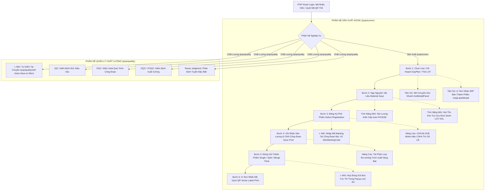

<!--
AI-READY METADATA
Purpose: Hướng dẫn chuyên sâu toàn diện về luồng vận hành (Process Flow), 4 vùng giao diện Kiosk, từng nút bấm/modal và tác động cơ sở dữ liệu ngầm của POP Web
Scope: Khai thác thực tế 100% giao diện pop.vinatech.com/pop/screen và pop.vinatech.com/pop/quality (Đồng bộ theo Bộ Slide Đào Tạo Chuẩn 2026-09 của DX Team)
Single Source of Truth: POP_KB_02_SCREEN_OPERATIONS.md
Source Slide Deck: POP_KNOWLEDGE_BASE/assets/POP.pptx
Slide Images: POP_KNOWLEDGE_BASE/assets/slides_images/
Target Tables: STB_SetInfo, STB_ProdRouteHist, STB_MaterialLotInfo, STB_PackingInfo, STB_DefectInfo, VINA_MATERIAL_INPUT_HIST, VINA_KIOSK_SESSION, VINA_EQUIPMENT_MAPPING, STB_DayProdPlan, STB_BomDetail
Related Files:
  - [POP_KB_INDEX.md](file:///c:/Users/User%20Vinatech.DESKTOP-RJJSEQU/Desktop/PROCESS/MES_LEGACY_BACKUP/POP_KNOWLEDGE_BASE/POP_KB_INDEX.md)
  - [POP_KB_01_ARCHITECTURE_AND_API.md](file:///c:/Users/User%20Vinatech.DESKTOP-RJJSEQU/Desktop/PROCESS/MES_LEGACY_BACKUP/POP_KNOWLEDGE_BASE/POP_KB_01_ARCHITECTURE_AND_API.md)
  - [POP_KB_03_TROUBLESHOOTING.md](file:///c:/Users/User%20Vinatech.DESKTOP-RJJSEQU/Desktop/PROCESS/MES_LEGACY_BACKUP/POP_KNOWLEDGE_BASE/POP_KB_03_TROUBLESHOOTING.md)
  - [POP_KB_04_ROLLBACK_AND_SAFETY.md](file:///c:/Users/User%20Vinatech.DESKTOP-RJJSEQU/Desktop/PROCESS/MES_LEGACY_BACKUP/POP_KNOWLEDGE_BASE/POP_KB_04_ROLLBACK_AND_SAFETY.md)
-->

# POP_KB_02 — Cẩm Nang Vận Hành Chuyên Sâu Giao Diện POP Kiosk, Luồng Quy Trình & Tác Động Dữ Liệu

> **Hệ thống:** POP Kiosk Web Application — `https://pop.vinatech.com/`  
> **Phiên bản chuẩn hóa:** v2.0 (Cập nhật 2026-09 theo Bộ Slide Đào Tạo Chính Thức của DX Team)  
> **Tác giả tài liệu gốc:** Hanbit Kang | **Hiệu chỉnh:** Vietnam DX Team  
> **Cơ sở dữ liệu liên đới:** `SmartFactoryV2` + `VINATECH_POP`  
> **🔑 Keywords:** process flow, screen operation, ADD mode, SUB mode, WIP label, WH transfer, self inspection, material input, defect, packing, merge pack, label print, marking, auto-save  
> ← [Về INDEX](file:///c:/Users/User%20Vinatech.DESKTOP-RJJSEQU/Desktop/PROCESS/MES_LEGACY_BACKUP/POP_KNOWLEDGE_BASE/POP_KB_INDEX.md)

---

## 1. 🔄 SƠ ĐỒ LUỒNG VẬN HÀNH TỔNG QUAN (END-TO-END PROCESS FLOW)

Hệ thống POP Web bao gồm 2 phân hệ URL chính với chu trình khép kín:



---

## 2. 🏗️ BẢN ĐỒ CẤU TRÚC GIAO DIỆN 4 VÙNG TOÀN DIỆN TRÊN KIOSK
*(Tham chiếu Slide 08 — `image21.png`)*

```
+---------------------------------------------------------------------------------------------------+
| [VÙNG 1: HEADER] Đồng hồ thực · Chip công nhân · Hard Reload · Tên Chuyền · Logo Cty · Menu Thiết Bị|
+------------------------------------+----------------------------------+---------------------------+
| [VÙNG 2: SIDEBAR TRÁI]             | [VÙNG 3: KHU VỰC TRUNG TÂM]      | [VÙNG 4: CONTROL PANEL]   |
| 1. Module Assembly, Label (ND06)   |  - Header Kế hoạch & Model BOM   |  - Header LOT đang chọn   |
| 2. Capacitance, ESR Check (ND07)   |  - Danh sách Thẻ LOT (Card View) |  - Nút In Nhãn Tem        |
| 3. Packing, Label (ND08)           |  - Thẻ Chi tiết LOT Metrics      |  - Chế độ SUB / ADD       |
| ---------------------------------- |    * Sản xuất Đạt (Good)         |  - Bàn phím số Numpad     |
| * Nút WH Chuyển kho                |    * Phẩm lỗi (Defect EA)        |  - Nút LOẠI LỖI (Defect)  |
| * ⭐ Nút Tự kiểm (Self-Inspection) |    * Công nhân & Thời gian       |  - Nút ĐĂNG KÝ            |
| * Nút Nhãn WIP (Bán thành phẩm)    |    * Thiết bị máy móc kết nối    |  - Nút GHI NHẬN SẢN XUẤT  |
|                                    |                                  |  - Menu phụ (⋮)           |
|                                    |                                  |    * 재투입 (Tái nạp liệu)|
|                                    |                                  |    * Tái phân loại        |
+------------------------------------+----------------------------------+---------------------------+
| [FOOTER] Bàn phím ảo On/Off · Đa ngôn ngữ (VI | KO | EN) · Công tắc Chế độ Tối/Sáng 🌓             |
+---------------------------------------------------------------------------------------------------+
```

---

## 3. 🧭 VÙNG 1: HEADER — ĐIỀU KHIỂN HỆ THỐNG & PHIÊN LÀM VIỆC
*(Tham chiếu Slide 09 — `image11.png`)*

| Thành phần / Nút bấm | Selector / ID | Hành vi khi kích hoạt | Tác động Backend & DB |
|----------------------|---------------|-----------------------|-----------------------|
| **Đồng hồ thực** | `.header-clock` | Hiển thị ngày giờ `YYYY-MM-DD HH:mm:ss` chuẩn từ Server | Đồng bộ nhịp tim với `VINA_KIOSK_SESSION.LAST_HEARTBEAT` |
| **Chip Công Nhân** | `#workerChip` / `#workerModal` | Click vào mở **Modal Chọn Công Nhân**, tìm theo mã thẻ/tên | Cập nhật `VINA_KIOSK_SESSION.WORKER_ID` & `WORKER_NAME` |
| **Hard Reload** | `#btnHardReload` | Xóa bộ nhớ đệm Vuex/LocalStorage và ép tải lại toàn bộ DOM từ DB | Khởi tạo lại phiên, đọc lại trạng thái mới nhất từ `SmartFactoryV2` |
| **Badge Tên Chuyền** | `#lineBadge` / `#lineModal` | Click vào mở **Cây phân cấp Xưởng/Chuyền** để đổi sang Line khác | Giải phóng Kiosk Session cũ, bind session sang `LINE_CODE` mới |
| **Menu Thiết Bị** | `#btnEquipmentPanel` | Mở/đóng thanh trạng thái thiết bị ngoại vi gắn với trạm Kiosk | Đọc cấu hình từ `VINATECH_POP.dbo.VINA_EQUIPMENT_MAPPING` |

---

## 4. 🔄 VÙNG 2: SIDEBAR TRÁI — TIẾN TRÌNH ROUTING & TIỆN ÍCH NHANH

### 4.1 Pipeline Công Đoạn Tiêu Chuẩn
Liệt kê toàn bộ các công đoạn sản xuất của dây chuyền hiện hành. Công đoạn đang thao tác được làm sáng (Active). Khi chạm vào công đoạn nào, toàn bộ giao diện làm việc chính sẽ đổi sang công đoạn đó.

### 4.2 Bộ Công Cụ Nhanh (Quick Launch Buttons)
* **`WH Chuyển kho` (`#wtModalPanel`):**
  - Mở giao diện điều chuyển kho nội bộ ngay tại xưởng.
  - Chọn **Kho xuất (Source WH)** $\rightarrow$ **Kho nhập (Target WH)** $\rightarrow$ Chọn Lot để chuyển tồn kho.
  - *Rollback:* Có thể tự đảo ngược chiều chuyển kho nếu phát hiện nhầm lẫn.
* **⭐ `Tự kiểm` (`#btnSelfInspection` at `/pop/quality/self` — Slide 49, 50):**
  - Nút nằm ở **góc dưới cùng bên trái màn hình Kiosk**.
  - Cho phép công nhân tự kiểm tra xác suất định kỳ (In-Line QC) bằng dụng cụ: Thước kẹp (*Caliper*), Panme (*Micrometer*), Cân điện tử (*Scale*)...
  - **Cơ chế Auto-save on blur:** Click ra ngoài ô nhập liệu là hệ thống tự động lưu DB và đồng bộ tức thì về NAIS MES.
* **`Nhãn WIP` (`#btnWipLabel` / `#wipLabelModal`):**
  - In tem mã vạch bán thành phẩm trung gian lưu khay/xe đẩy, lưu trọng lượng khay (Tare weight).

---

## 5. 🏭 CHI TIẾT BƯỚC 1: KHỞI TẠO CA & CHỌN LỆNH SẢN XUẤT (WORK ORDER)
*(Tham chiếu Slide 11, 12, 13, 14, 18, 19, 20)*

### 5.1 Luồng Thao Tác UI
1. **Đăng nhập Worker (Slide 11, 12):** Nhập mã nhân viên hoặc quét trực tiếp thẻ QR bằng máy đọc scanner (API: `/api/common/login`).
2. **Chọn Chuyền (Line):** Chọn nơi làm việc (WorkCenter) và Dây chuyền (Line) tương ứng vị trí Kiosk (API: `/api/common/getLineList`).
3. **Hai Phương Thức Chọn LOT Làm Việc:**
   - **Phương thức 1: Scan Barcode trực tiếp (Slide 19 — `image2.png`):**
     - Quét trực tiếp Barcode từ tem dán trên khay/xe cấp phát vật tư bằng máy đọc barcode scanner.
     - Hệ thống tự động tìm kiếm, hiển thị thông tin LOT và DayPlan tương ứng -> Bấm nút **"Thêm"**.
   - **Phương thức 2: Chọn theo Kế Hoạch Ngày (Slide 13, 20 — `image10.png`, `image8.png`):**
     - Click vào vùng bên dưới thẻ LOT hiện tại -> Mở popup Lịch sản xuất.
     - Dùng nút `◀ ▶` điều hướng tháng, chọn ngày làm việc (mặc định hôm nay).
     - Danh sách các Lệnh sản xuất trong ngày hiển thị ở cột bên phải -> Chọn LSX cần làm.
     - Bấm nút **"Thêm"** để nạp danh sách LOT.

### 5.2 Tác Động Database & API
- **API Đọc:**
  - `POST /api/pop/screen/getDayPlanList`: Đọc `SmartFactoryV2.dbo.STB_DayProdPlan`.
  - `POST /api/pop/screen/getLotList`: Đọc `SmartFactoryV2.dbo.STB_SetInfo` với điều kiện `DayPlanID = @DayPlanID`.
- **Tác động DB:** **HOÀN TOÀN READ-ONLY**. Chưa có dữ liệu nào bị ghi hay thay đổi.

---

## 6. 📦 CHI TIẾT BƯỚC 2: NHẬP NGUYÊN VẬT LIỆU (MATERIAL INPUT)
*(Tham chiếu Slide 21, 22, 23 — `image27.png`, `image34.png`, `image15.png`)*

### 6.1 Luồng Thao Tác & Khóa Liên Động (Interlock)
- **Khóa nút sản xuất (Slide 21):** Nút cam **"Nhập vật liệu"** ở góc dưới phải hiển thị tiến độ `(0/6)` (đã nạp 0/6 loại NVL theo BOM). Nút "Đăng ký" và "Hoàn thành sản xuất" sẽ bị **VÔ HIỆU HÓA HOÀN TOÀN** cho đến khi toàn bộ vật tư theo BOM được nạp đủ!
- **Màn hình chi tiết nạp NVL (Slide 22):** Chia làm 2 tab:
  - Tab **"Nhập thủ công"**: Danh sách các NVL chưa cấp phát.
  - Tab **"Tự động / Hoàn thành"**: Danh sách các NVL đã nạp đủ.

### 6.2 Hai Tính Năng Nạp NVL Nâng Cao Mới
1. **⭐ Nút "Lượng kiến cấp" (Estimated Supply Qty / Auto-Fill BOM — Slide 22):**
   - Chạm vào nút **"Lượng kiến cấp"** -> Hệ thống **tự động tính toán và điền đủ 100% số lượng cần thiết theo định mức BOM**, giúp công nhân không phải gõ số lẻ thập phân thủ công.
   - Khi trạm có kết nối cân điện tử, khối lượng tự động đọc qua cổng RS232/Ethernet.
2. **⭐ Nút "Tồn kho" (Warehouse Stock Lookup — Slide 23):**
   - Chạm vào nút **"Tồn kho"** -> Gõ mã LOT NVL vào ô tìm kiếm.
   - Hệ thống lọc ra danh sách các cuộn/thùng NVL đang có sẵn trong kho công đoạn (`ROUTE_VN_WH`) kèm số lượng tồn thực tế (`CurrentQty`).
   - Công nhân chọn đúng LOT NVL xuất dùng và bấm **Lưu**.

### 6.3 Tác Động Database & Nguy Cơ Sai Lệch
```sql
-- 1. Trừ tồn kho NVL trực tiếp trong SmartFactoryV2
UPDATE SmartFactoryV2.dbo.STB_MaterialLotInfo
SET CurrentQty = CurrentQty - @InputQty,
    ModifyDate = GETDATE(),
    Modifier = @WorkerID
WHERE MaterialLotNo = @MaterialLotNo;

-- 2. Ghi nhật ký tiêu hao vào VINATECH_POP
INSERT INTO VINATECH_POP.dbo.VINA_MATERIAL_INPUT_HIST (
    LOT_NO, MATERIAL_LOT_NO, SUB_MATERIAL_CODE, SUB_MATERIAL_NAME, 
    INPUT_QTY, INPUT_DATE_TIME, WORKER_ID, ROUTE_CODE, STATUS
) VALUES (
    @LotNo, @MaterialLotNo, @MaterialCode, @MaterialName, 
    @InputQty, GETDATE(), @WorkerID, @RouteCode, 'NORMAL'
);

-- 3. Đánh dấu cờ nạp NVL trên STB_SetInfo
UPDATE SmartFactoryV2.dbo.STB_SetInfo
SET IsLineInput = 1
WHERE LotNo = @LotNo;
```
> [!CAUTION]
> Thao tác Nhập NVL **TRỪ KHO TỨC THÌ**. Trên UI **KHÔNG CÓ NÚT ROLLBACK** để tránh gian lận hao hụt kho ERP.
> Nếu quét nhầm cuộn hoặc nhập sai số lượng, bắt buộc phải nhờ IT xử lý SQL hoàn kho có `BEGIN TRAN...ROLLBACK`.

---

## 7. ⚠️ CHI TIẾT BƯỚC 3: ĐĂNG KÝ PHẾ PHẨM (DEFECT REGISTRATION) & NHẬP MÃ MARKING

### 7.1 Luồng Đăng Ký Lỗi & Chế Độ SUB Mode
*(Tham chiếu Slide 24, 25, 26 — `image32.png`, `image29.png`, `image30.png`)*

- Khi phát hiện sản phẩm lỗi trên chuyền:
  1. Bấm nút **`LOẠI LỖI` (`#btnDefectType`)**.
  2. Chọn Mã lỗi chi tiết trong bảng danh mục lỗi.
  3. Sử dụng Numpad cảm ứng để nhập số lượng phế.
  4. Bấm nút **`ĐĂNG KÝ`** -> Hệ thống ghi nhận số lỗi và tự động reset Numpad về `0`.
- **Cơ Chế Sửa Sai Bằng Chế Độ `SUB Mode`:**
  - Nếu lỡ tay bấm thừa số lỗi (ví dụ: thực tế lỗi 2 cái nhưng bấm nhầm 20 cái):
  - Chuyển công tắc chế độ **`#prodModeIndicator`** từ **`ADD`** sang **`SUB`**.
  - Nhập số lượng cần trừ bớt (`18`) trên Numpad $\rightarrow$ Bấm **`ĐĂNG KÝ`**.
  - Hệ thống tự động trừ lùi số lượng lỗi trong phiên làm việc mà không làm sai lệch số liệu!

### 7.2 ⭐ Nhập Mã Marking Tại Công Đoạn Bọc Vỏ (Curling / Marking)
*(Tham chiếu Slide 29 — `image35.png` — TÍNH NĂNG ĐẶC BIỆT MỚI)*

- **Vị trí UI:** Tại công đoạn **Bọc Vỏ**, nút **"Mã marking"** (`#btnMarkingCode`) nằm ở **góc trên bên phải màn hình, ngay cạnh biểu tượng In nhãn**.
- **Quy trình thao tác:**
  1. Chạm vào nút **"Mã marking"** -> Popup `#markingModal` xuất hiện.
  2. Dùng máy quét mã vạch hoặc bàn phím để nhập mã Marking khắc trên thân vỏ sản phẩm.
  3. Chạm nút **"Lưu lại"** để hệ thống ghi nhận mã Marking vào cơ sở dữ liệu trước khi chuyển công đoạn tiếp theo.

---

## 8. 🚀 CHI TIẾT BƯỚC 4: GHI NHẬN SẢN XUẤT & CHỐT CÔNG ĐOẠN (SAVE PRODUCTION)
*(Tham chiếu Slide 27 — `image16.png`)*

- Sau khi kiểm tra đủ số lượng thành phẩm và phế phẩm:
  1. Công nhân bấm nút lớn **`HOÀN THÀNH SẢN XUẤT`** (Save Production).
  2. Kiosk hiển thị hộp thoại xác nhận **"Xác nhận Kết thúc?"** gồm 2 cột:
     - **Cột trái:** Tên Công đoạn, Người thực hiện, SL Đạt (Good Qty), SL Lỗi (Defect Qty), Thời gian gia công, Mã LOT.
     - **Cột phải:** Danh sách thiết bị kết nối (**`Thiết Bị: N máy`**).
       - Tải toàn bộ máy từ `STB_ProductMachine` theo `LineCode` + `RouteCode`.
       - Lọc bỏ các máy đang bị chiếm dụng (`MAPPING_STATUS = 'ACTIVE'`) ở các Kế hoạch (`DAY_PLAN_NO`) khác trong `VINA_EQUIPMENT_MAPPING`.
       - Nếu thiếu máy do OP ca trước quên bấm Release: IT chạy script chuyển `MAPPING_STATUS = 'RELEASED'` cho các Plan cũ.
  3. Bấm **"Đồng ý"** (Xác nhận kết thúc).
- **Tác động Database:**
  - Gọi SP `SmartFactoryV2.dbo.USP_POP_SET_ROUTE_COMPLETE`.
  - Ghi nhận `STB_ProdRouteHist`.
  - Cập nhật `STB_SetInfo.IsProdFinish = 1` và chuyển `CurrentRoute` sang công đoạn kế tiếp.

---

## 9. 📦 CHI TIẾT BƯỚC 5: ĐÓNG GÓI & ĐÓNG GÓI GỘP (PACKING & MERGE PACK)
*(Tham chiếu Slide 31-39)*

### 9.1 Ba (03) Nghiệp Vụ Đóng Gói Chuẩn Hóa
Chỉ những LOT đã hoàn thành 100% tất cả các công đoạn sản xuất trước đó mới hiển thị trong danh sách Đóng gói với trạng thái **"Đang Chờ"**.

1. **Đóng gói đơn (Single Pack — Slide 34 — `image22.png`):**
   - 1 Box duy nhất cho toàn bộ số lượng của LOT (VD: 1 Box x 5,980 = 5,980 EA).
   - Chọn LOT -> Nhập số lượng -> Bấm **"ĐÓNG GÓI"**.
2. **Đóng gói chia nhiều Box (Split Pack — Slide 35 — `image24.png`):**
   - Áp dụng khi chia 1 LOT ra nhiều Box (Box 1: 1,500, Box 2: 1,500, Box 3: 1,500, Box 4: 1,480 = Tổng 5,980 EA).
   - Nút **"Thêm hộp"** để tăng số box; Dấu **`X`** màu đỏ để xóa bớt box.
   - Bấm **"Đóng gói"** -> Chọn **"Cả" (All)** để hoàn tất toàn bộ các Box.
3. **Đóng gói gộp nhiều LOT (Merge Pack — Slide 36, 37 — `image49.png`, `image25.png`):**
   - Tích chọn từ 2 LOT trở lên. **Các LOT được chọn chuyển sang Màu Tím**.
   - Nhập số lượng đóng gói quy cách (VD: 6,000 EA) -> Hệ thống trừ tuần tự theo **nguyên tắc FIFO từ trên xuống**.
   - **Gộp LOT khác ngày (Slide 37):** Nếu các LOT trong ngày đã hết, bấm nút **"Lệnh SX"** để chọn Kế hoạch của ngày khác. **Yêu cầu bắt buộc: Phải cùng Model sản phẩm!**

### 9.2 ⭐ Lịch Sử Đóng Gói & HỦY ĐÓNG GÓI TRỰC TIẾP TRÊN UI (Slide 39 — `image28.png` & Live POP UI)

**Thao tác hủy đóng gói trên giao diện POP Kiosk có thể thực hiện theo 2 cách:**

1. **Cách 1: Chạm trực tiếp thẻ Lot đã đóng trong "Tiến độ LOT" (Nhanh nhất):**
   - Khi Lot đã có hộp (thẻ hiển thị icon Hộp màu cam hoặc tick xanh kèm mã hộp bên dưới, ví dụ `ECVT30-357QR1800379`), chạm thẳng vào thẻ đó.
   - Hệ thống hiển thị hộp thoại cảnh báo:
     > **Xác nhận quản trị viên**  
     > *Hủy hộp này?*  
     > `ECVT30-357QR1800379`  
     > **Nhập mã nhân viên quản trị**  
     > `[ Ô nhập mã NV ]`  
     > `[ Có ]`  `[ Không ]`
   - Bắt buộc nhập mã nhân viên có quyền quản trị (ví dụ: `92603003`). Bấm **[Có]** ➔ Kích hoạt ngay Stored Procedure `usp_DoCancelProdPacking_LotNo`.
2. **Cách 2: Vào popup "Lịch sử" đóng gói:**
   - Chạm vào nút **"Lịch sử"** ở góc dưới màn hình Đóng gói -> Hộp thoại danh sách Box hiển thị chi tiết: Mã Box, Số lượng, Ngày/giờ, Tên công nhân.
   - **In lại nhãn:** Bấm nút **"In"** trên từng Box để in lại tem dán.
   - **HỦY ĐÓNG GÓI TỪNG BOX:** Bấm nút **"Hủy"** trên từng Box -> Nhập xác nhận quản trị viên -> Bấm đồng ý.
   - **HỦY TẤT CẢ (Cancel All Boxes):** Bấm nút **"Hủy tất cả"** ở góc trên để hoàn tác toàn bộ các Box của lệnh sản xuất cùng lúc.

- **Dưới Database hệ thống chạy gì:**
  - Gọi duy nhất SP: `SmartFactoryV2.dbo.usp_DoCancelProdPacking_LotNo`.
  - Ghi Audit Trail vào `STB_ProdRouteHistCancelHist`.
  - Xóa toàn bộ bản ghi lượt chốt công đoạn đóng gói trong `STB_ProdRouteHist` (`V-28` / `V-28_HY`).
  - Xóa toàn bộ bản ghi Box BTP tương ứng trong `STB_MaterialLotInfo` (xóa `PackingID`).
  - Giảm lũy kế hoàn thành `ProdFinishQty` trong `STB_ProductionOrderInfo` và `OutputQty` trong `STB_ProdRouteSummary`.
  - Hủy chứng từ kho trong `STB_MaterialDocInfo` (`IsCancel = 1`).
  - Cập nhật `STB_SetInfo.IsProdFinish = 0`, khôi phục số lượng sẵn sàng trên Kiosk POP về 100%.
  - *Xem chi tiết tại SoT:* [POP_KB_04_ROLLBACK_AND_SAFETY.md §2.5](file:///c:/Users/User%20Vinatech.DESKTOP-RJJSEQU/Desktop/PROCESS/MES_LEGACY_BACKUP/POP_KNOWLEDGE_BASE/POP_KB_04_ROLLBACK_AND_SAFETY.md#25--đóng-gói-packing--cơ-chế-hủy-hộp--rollback-đóng-gói-trên-pop-web-kiosk).

- **📌 Nghiệp vụ thực tế với Đóng gói gộp (Merge Pack):**
  - Khi một Lot được chia làm nhiều Box hoặc gộp chung với Lot khác (ví dụ Lot `VVQR113R060640` chia Box đơn 500 EA mã `PKQR1800400` và Box gộp 1,477 EA mã `PKQR1800401`):
  - Công nhân có thể chọn hủy riêng lẻ từng Box mà không ảnh hưởng tới Box còn lại. Số lượng của Box bị hủy sẽ ngay lập tức xuất hiện trở lại ở danh sách chờ đóng gói của chính Lot đó.
  - **Điều kiện tiên quyết:** Thùng hàng chưa quét xuất kho vật lý sang kho thành phẩm / FGS (`ShipFlag = 0`). Với nhà máy Hà Nam, nếu đã nhập kho `STB_VN_FINISHGOODS_HN_New` thì SP sẽ chặn không cho hủy.

---

## 10. 🏷️ CHI TIẾT BƯỚC 6: IN TEM NHÃN MÃ VẠCH (LABEL PRINTING)
*(Tham chiếu Slide 45, 46, 47 — `image45.png`, `image51.png`, `image43.png`)*

- Bấm nút **"In Nhãn"** ở góc trên bên phải màn hình Lắp ráp hoặc dưới màn hình Đóng gói:
  - **Đề xuất nhãn phù hợp ⭐:** Hệ thống tự động gắn dấu sao cho mẫu tem tối ưu nhất với Model sản phẩm.
  - **Kích thước chuẩn:** `83mm x 49mm` (hoặc quy cách tem dán thùng Box).
  - **Chỉnh sửa tên vật tư:** Cho phép chỉnh sửa trực tiếp trường `MaterialNo` ngay trên giao diện trước khi in nếu có yêu cầu đặc biệt.
  - **Xem trước kích thước thực (Preview):** Hiển thị trực quan mã QR vector 2D và các thông số trước khi xuất lệnh in.
  - **In lại không giới hạn:** Công nhân có thể in lại cùng một nhãn bất kỳ lúc nào nếu tem bị rách hoặc mờ.

> [!WARNING]
> ### ⚠️ CẢNH BÁO KỸ THUẬT: HẠN CHẾ IN TEM THÙNG (BOX PACKING LABEL) TRÊN POP KIOSK
> - **Đặc điểm mã vạch Box Label:** Mẫu tem dán thùng quy chuẩn (`포장라벨NewVietNam`) chứa đối tượng `barCode4` (chuẩn Code 128, cấu hình DevExpress `AutoModule = true`, nhận biểu thức `?PackingID`).
> - **Khác biệt cốt lõi:**
>   - **MES WinForm (B523):** Gọi chuỗi SP `usp_Vietnam_DoProcessProdPacking_VVT` ➔ tự động sinh chuỗi `PackingID` chuẩn **11 ký tự** (`PK` + Tháng `QR` + Ngày `19` + Serial `00142` ➔ `PKQR1900142`). Chuỗi 11 ký tự này giúp Code 128 bung rộng toàn bộ chiều ngang khung in, máy quét barcode đọc được ngay 100%.
>   - **POP Kiosk:** Không gọi SP sinh mã `PackingID` lưu vào `STB_MaterialLotInfo`, nên khi bấm in trên POP, tham số `?PackingID` bị thiếu hoặc rút gọn ➔ DevExpress `AutoModule = true` co rúm các vạch lại rất hẹp, khiến máy quét không bắt được tiêu cự!
> - **Quy định vận hành:** Đối với các Box thành phẩm chia theo thùng quy cách chuẩn bị qua OQC xuất xưởng, **BẮT BUỘC dùng màn hình WinForm B523 / B528 để in lại tem chuẩn**, không dùng tem in từ Kiosk POP.

---

## 11. ⚙️ TÁC VỤ NÂNG CAO (MENU PHỤ ⋮ — TÁI PHÂN LOẠI RE-SORTING)
*(Tham chiếu Slide 40-43 — `image31.png`, `image33.png`, `image41.png`, `image50.png`)*

- Chạm menu **`⋮`** ở góc dưới phải -> Chọn **"Tái phân loại"** (Bắt buộc phải chọn Lệnh sản xuất trước):
  - **Phương thức 1: Phân phối theo tỷ lệ (Slide 42):** Nhập tổng số lượng tái phân loại -> Hệ thống tự chia đều theo tỷ lệ lỗi còn lại của từng LOT.
  - **Phương thức 2: Nhập riêng từng LOT (Slide 43):** Nhập trực tiếp số lượng vào từng dòng LOT.
- **Tác động dữ liệu:** Tạo ra LOT Tái phân loại MỚI, cộng dồn sản lượng đạt vào kết quả sản xuất. Số lượng lỗi trên LOT gốc không bị trừ mất mà ghi lại lịch sử phân loại để phục vụ kiểm toán truy vết.

---

## 12. 🔬 PHÂN HỆ QUẢN LÝ CHẤT LƯỢNG (/pop/quality) & TỰ KIỂM TẠI CHUYỀN
*(Tham chiếu Slide 48, 49, 50 — `image44.png`, `image46.png`, `image47.png`)*

### 12.1 Hạng Mục Kiểm Tra Thường Xuyên (Tự Kiểm Tại Chuyền)
- **Đường dẫn:** `https://pop.vinatech.com/pop/quality/self` (hoặc bấm nút **"Tự kiểm"** ở góc dưới bên trái Kiosk).
- **Quy trình vận hành:**
  1. Chọn công đoạn cần đo kiểm.
  2. Danh sách các hạng mục kiểm tra hiển thị (chiều dài, chiều rộng, độ dày, khối lượng, điện áp, nội trở...).
  3. **⭐ CƠ CHẾ AUTO-SAVE ON BLUR:** Nhập giá trị đo vào ô dữ liệu -> **Chỉ cần click chuột hoặc chạm ra bên ngoài ô nhập**, hệ thống sẽ **TỰ ĐỘNG LƯU VÀO DATABASE VÀ ĐỒNG BỘ TỨC THÌ VỀ NAIS MES** mà không cần nút Save riêng lẻ!
  4. **Tăng số mẫu đo `[+]`:** Bấm nút `[+]` để tăng số lần đo mẫu kiểm tra hoặc thêm ghi chú giải trình hiện trường.
  5. **Biểu đồ xu hướng (Trend Chart):** Tích hợp biểu đồ theo dõi đường giới hạn Spec (USL/LSL/Target) để kiểm soát chất lượng quá trình.

### 12.2 Tổng Hợp Toàn Bộ Phân Hệ Quality
| Màn hình | Chức Năng Nghiệp Vụ | API / SP Liên Quan | Trạng Thái Phán Định |
|----------|---------------------|-------------------|----------------------|
| **⭐ Tự kiểm (Self-Insp)** | Kiểm tra kích thước tại chuyền (Auto-Save on blur) | `/api/quality/self/save` | Đạt (Pass) / Lỗi (Fail) |
| **IQC (Incoming QC)** | Kiểm tra NVL đầu vào trước khi cấp cho sản xuất | `/api/quality/iqc/save` | Đạt (OK) / Trả hàng (NG) / Chờ xử lý (Hold) |
| **PQC (Process QC)** | Lấy mẫu kiểm tra kích thước, ngoại quan trên chuyền | `/api/quality/pqc/save` | Tiếp tục SX / Dừng chuyền cảnh báo |
| **OQC (Outgoing QC)** | Kiểm định lô đóng gói trước khi nhập kho thành phẩm | `/api/quality/oqc/save` | Nhập kho (Pass) / Rã thùng tái kiểm (Reject) |
| **FOQC (Final OQC)** | Kiểm tra độ tin cậy thành phẩm xuất khẩu | `/api/quality/foqc/save` | Cấp chứng chỉ xuất xưởng (COA) |
| **Route Judgment** | Phán định tuyến điều hướng Lot đặc biệt | `/api/quality/judgeRoute` | Chuyển thẳng / Rework / Tiêu hủy |

---

## 13. 📑 TỔNG HỢP DANH MỤC MODAL & ID PHẦN TỬ ĐỂ DEBUG NHANH

| Tên Modal / Panel | ID Selector | API Endpoint Kích Hoạt | Bảng Database Đích | Tham Chiếu Slide |
|-------------------|-------------|------------------------|--------------------|:----------------:|
| Chọn Kế hoạch SX | `#dayPlanModal` | `/api/pop/screen/getDayPlanList` | `STB_DayProdPlan` | Slide 13, 20 |
| Chọn Chuyền SX | `#lineModal` | `/api/common/getLineList` | `STB_LineInfo` | Slide 09 |
| Chọn Công nhân | `#workerModal` | `/api/common/getWorkerList` | `STB_WorkerInfo` | Slide 11 |
| Bảng Thiết bị | `#equipmentModal` | `/api/common/getEquipmentList` | `VINA_EQUIPMENT_MAPPING` | Slide 08 |
| Đăng ký Loại lỗi | `#defectTypeModal` | `/api/pop/screen/saveDefect` | `STB_DefectInfo` | Slide 24 |
| ⭐ Nhập Mã Marking | `#markingModal` / `#btnMarkingCode` | `/api/pop/screen/saveMarkingCode` | `STB_SetInfo.MarkingCode` | Slide 29 |
| ⭐ Nút Lượng Kiến Cấp | `#btnAutoFillBOM` | Tính toán nội bộ Vuex theo BOM | `STB_BomDetail` | Slide 22 |
| ⭐ Nút Tồn Kho NVL | `#btnWarehouseStock` | `/api/pop/screen/getMaterialStock`| `STB_MaterialLotInfo` | Slide 23 |
| ⭐ Lịch Sử Đóng Gói & Hủy Box | `#packingHistoryModal` | `/api/pop/screen/cancelPacking` | `STB_PackingInfo`, `STB_SetInfo` | Slide 39 |
| In Tem Nhãn | `.label-print-modal` | `/api/pop/screen/printLabel` | `VINA_LABEL_INFO` | Slide 38, 45 |
| In Nhãn WIP | `#wipLabelModal` | `/api/pop/screen/printWipLabel` | `VINA_WIP_STOCK_HIST` | - |
| Điều chuyển kho | `#wtModalPanel` | `/api/pop/screen/transferWarehouse` | `STB_ProdRouteHist` | - |
| ⭐ Màn hình Tự Kiểm | `#btnSelfInspection` | `/api/quality/self/save` (on blur) | `VINA_SELF_INSP_HIST` | Slide 49, 50 |
| Menu Mở rộng | `#secondaryActionsMenu` | Nội bộ Kiosk UI | `VINA_POP_ACTION_LOG` | Slide 28, 41 |

---

## 14. 📌 BẢY (07) QUY TẮC AN TOÀN BẤT BIẾN KHI VẬN HÀNH TRÊN POP

1. **Kiểm tra thông tin Lot:** Luôn đối chiếu tem cứng vật lý trên khay với Lot Card hiển thị trên POP trước khi thao tác. Quét trực tiếp Barcode để tải nhanh và chính xác nhất.
2. **Sử dụng chế độ `SUB Mode` để sửa sai số lượng:** Nếu lỡ tay bấm thừa số lượng sản phẩm hoặc phế phẩm, chuyển ngay sang chế độ `SUB` Mode để trừ bớt trước khi bấm "Hoàn thành sản xuất".
3. **Quy tắc bắt buộc nhập NVL:** Phải nhập đủ vật liệu theo BOM (dùng nút "Lượng kiến cấp" để nạp nhanh) thì nút "Đăng ký" và "Hoàn thành sản xuất" mới mở khóa.
4. **Nhập mã Marking tại công đoạn Bọc Vỏ:** Bắt buộc bấm nút "Mã marking" ở góc trên bên phải để lưu mã thân vỏ trước khi chuyển công đoạn.
5. **Cơ chế Hủy Đóng Gói (Rollback) kịp thời:** Nếu đóng gói nhầm hoặc cần dán lại tem, bấm nút "Lịch sử" -> bấm nút **[HỦY]** từng Box hoặc **[HỦY TẤT CẢ]** để khôi phục số lượng LOT về trạng thái Đang Chờ ngay trên Kiosk.
6. **Auto-save tại màn hình Tự kiểm:** Chỉ cần click chuột ra ngoài ô nhập liệu là kết quả đo đã được lưu vào cơ sở dữ liệu và đồng bộ NAIS. Không cần tìm nút Save.
7. **Không tự ý chuyển đổi Line khi đang dở ca:** Đổi Line sẽ giải phóng phiên làm việc Kiosk Session hiện hành và đặt lại toàn bộ dữ liệu đang tải dở.

---

## 15. ⚙️ HƯỚNG DẪN CẤU HÌNH MAPPING SLOT NVL TRÊN WEB UI (`/popSetting/assemblyGroupMapping`)

### 15.1 Mục đích & Nghiệp vụ
Khi dây chuyền áp dụng chế độ nạp theo cụm/nhóm (`INPUT_MODE = 'GROUP'` trong bảng `VINA_ASSEMBLY_GROUP_MODE`), màn hình POP (`/pop/screen`) **KHÔNG** lấy danh sách NVL trực tiếp từ BOM phẳng mà dựa vào cấu hình slot trong bảng `VINATECH_POP.dbo.VINA_GROUP_INPUT_ROUTE`.
Nếu một nhóm vật tư (như `BOTTOM-PLATE`, `TERMINAL-PLATE`, `WASHER`...) có trong BOM nhưng chưa được khai báo slot cho Chuyền/Line đó, công nhân mở POP lên sẽ **không thấy ô quét NVL**.

### 15.2 Thao tác trên Web UI POP Setting
- **Đường dẫn Web:** `https://pop.vinatech.com/popSetting/assemblyGroupMapping`
- **Menu điều hướng:** `POP Setting` ➔ `조립 그룹 투입 매핑` *(Assembly Group Input Mapping)*

#### Các bước cấu hình:
1. **Chọn Chuyền (Line):** Chọn Công ty (`VVT`) và mã Dây chuyền cần cấu hình (ví dụ `TCX1`, `TCX2`).
2. **Cách 1 — Thêm thủ công từng Slot:**
   - Bấm **Thêm Slot (슬롯 추가)**.
   - **Mã Slot (`SLOT_CODE`):** Ví dụ `BOTTOM-PLATE`, `TERMINAL-PLATE`.
   - **Tên Slot (`SLOT_NAME`):** Ví dụ `BOTTOM-PLATE` (Đế dán), `TERMINAL-PLATE` (Terminal plate).
   - **Công đoạn bắt buộc quét (`ROUTE_CODE`):** Chọn công đoạn thực tế cần quét (ví dụ: `V-22` Cuốn hoặc `V-24` Cuốn mép).
   - **Nhóm Master MES (`MASTER_GROUP_CODES`):** Chọn đúng mã `ProductGroupCode` từ Master MES (`BOTTOM-PLATE`, `TERMINAL-PLATE`...). Có thể map nhiều mã cách nhau bằng dấu chấm phẩy `;`.
   - **Bắt buộc quét (`IS_REQUIRED`):** Chọn `Y` (bắt buộc) hoặc `N`.
   - **Thứ tự hiển thị (`DISPLAY_ORDER`):** Nhập số thứ tự hiển thị trên Kiosk.
   - Bấm **Lưu (저장)** (`/popSetting/saveGroupInputRouteProcess`).
3. **Cách 2 — Sao chép cấu hình từ Chuyền mẫu (Copy Mapping):**
   - Sử dụng tính năng **Copy cấu hình (`/popSetting/copyGroupInputRouteProcess`)**: Chọn Line nguồn đã cấu hình chuẩn (ví dụ các line `VVHYC-04`, `VVHYC-13`) ➔ Chọn Line đích cần áp dụng (`TCX1`, `TCX2`) ➔ Bấm **Sao chép**.
4. **Kiểm tra sau cấu hình:**

---

## 16. ⚡ VẬN HÀNH DÂY CHUYỀN ĐIỆN CỰC & SLITTING LINE TRÊN POP KIOSK (`/pop/screen`)

> **Hệ sinh thái:** POP Web Single Page Application (SPA) chuyên biệt  
> **Chuyền phụ trách:** `Điện cực Bắc Ninh` (`ElectrodeBN`) & `SLITTING LINE`  
> **Tài khoản kiểm chứng:** `92603003` (Nguyễn Văn Đức)  
> **Mã Lot mẫu:** `VVQQ2520001E76` (Cuộn Mẹ `CREHCO85`), `VVQQ2520001E79` (Đã xẻ 21 cuộn con `SRFHCEK0-xxx`)  

### 16.1 Bản đồ Module Frontend POP Điện Cực
Khác với giao diện Cell Line lắp ráp thông thường (nạp BOM phẳng theo con EA), giao diện Điện cực được điều phối bởi 6 module JavaScript chuyên trách:
- `popMixing.js`: Giao diện & quy trình Trộn (Pha khô, Tạo hạt, Nhào trộn), tích hợp kết nối cân điện tử qua RS232 và in nhãn mẻ Slurry.
- `popCoating.js`: Giao diện Mạ điện cực, ma trận đo độ dày phủ 1 mặt / 2 mặt (`First/Middle/Last` x `Trái/Giữa/Phải` theo µm) và bảng thông số buồng mạ (Nhiệt độ, độ ẩm, khe đầu, khổ mạ).
- `popRolling.js`: Giao diện Ép cuộn (Roll Pressing), ma trận đo nén sau cán, kiểm soát nhiệt độ trục cán 130°C, tốc độ đường cán 30 m/min và mật độ nén g/cc.
- `popSlitting.js`: Giao diện Xẻ băng điện cực, cấu hình dao xẻ theo khổ mm x EA, nhận diện khổ còn lại và phân bổ cuộn con.
- `slitHandoffLineMap`: Bản đồ điều hướng chuyển chuyền tự động từ `ElectrodeBN` sang `SLITTING LINE`.
- `popElectrodeInfoConfig.js` & `popElectrodeProcess.js`: Khởi tạo và đồng bộ trạng thái công nghệ điện cực.

---

### 16.2 Quy trình Thao tác Thực tế 4 Công Đoạn trên POP Kiosk

#### Bước 1: Chọn Chuyền & Nạp Thẻ Lot Điện Cực (Cuộn Mẹ)
1. Trên thanh header POP Kiosk, nhấn **CHUYỀN** ➔ Chọn: **`Điện cực Bắc Ninh`** (`ElectrodeBN`).
2. Nhấn vào khu vực **LOT / Lệnh sản xuất** ➔ Mở modal tìm kiếm.
3. Nhập mã Lot Cuộn Mẹ (ví dụ: `VVQQ2520001E76`) hoặc chọn Lịch tháng tương ứng (ví dụ: Tháng 8/2026, DayPlan `2026082500040`).
4. Nhấn dòng kết quả ➔ Bấm **[+ Thêm]** để nạp dữ liệu Lot lên giao diện chính.

#### Bước 2: Thao tác Công đoạn 01 — Trộn (Mixing / Route V-01)
- **Gán máy:** Chọn từ Mixer #1 (`VVEP284`) đến Mixer #7 (`VVEP426`).
- **Nạp BOM 3 Pha:**
  1. *Pha 1 (Trộn khô):* Than hoạt tính HCE (`GAHCCA-001`), Super P Carbon (`GATCCC-001`), PVP (`GAADCB-001`).
  2. *Pha 2 (Tạo hạt):* CMC Binder (`GADACB-001`), Nước cất (`WTRN01-001`).
  3. *Pha 3 (Nhào trộn Slurry):* Nước cất cân bù độ nhớt.
- **Tính năng mở rộng:** Bấm nút **[⚖ Kết nối cân]** để đọc trực tiếp số cân từ cổng COM cân điện tử, bấm **[🖨️ In Nhãn]** để in tem mẻ trộn dán lên thùng Slurry trung gian.
- **Dữ liệu ngầm:** Lưu vào `SmartFactoryV2.dbo.STB_ElectrodeMixInfo` và `STB_ElectrodeMixStepInfo` (13 bước cân).

#### Bước 3: Thao tác Công đoạn 02 — Mạ (Coating / Route V-02)
- **Gán máy:** Coater #1 (`VVEP287`).
- **Chọn chế độ mạ:** Chọn mạ **Một mặt (One Side)** hoặc **Hai mặt (Both Side)**.
- **Nhập ma trận độ dày:** Nhập số đo kiểm thực tế tại các điểm `FIRST1..3`, `MIDDLE1..3`, `LAST1..3` tại 3 vị trí ngang màng (`Trái`, `Giữa`, `Phải`) với đơn vị micron (µm) (ví dụ: 202 µm, 201 µm).
- **Kiểm tra thông số môi trường:** Xác nhận Nhiệt độ phòng phủ (`20 °C`), Độ ẩm (`10 %`), Khe hở gạt hồ (100 µm / 200 µm), Khổ phủ (485 mm).
- **Dữ liệu ngầm:** Lưu vào `STB_ElectrodeCoatingInfo` (Sản lượng Kế hoạch, Thực tế, Đạt, Lỗi).

#### Bước 4: Thao tác Công đoạn 03 — Ép cuộn (Roll Pressing / Route V-03)
- **Gán máy:** Roll Pressing #1 (`VVEP427`).
- **Nhập thông số cán ép:** Xác nhận Nhiệt độ kiểm soát SX (`130 °C`), Tốc độ đường cán (`30 m/min`), Khe đầu ban đầu (`10 µm`).
- **Nhập ma trận đo sau ép:** Đo và nhập độ dày sau nén tại First/Middle/Last để đảm bảo cuộn foil đạt độ dày danh định (ví dụ: 200 µm). Nhập mật độ cán (`g/cc`).
- **Dữ liệu ngầm:** Lưu vào `STB_ElectrodeRollPressingInfo` và cập nhật độ dày cuộn mẹ tại `STB_SetInfo.SIExtReal03`.

#### Bước 5: Chuyển Line sang Chuyền Cắt (Slitting Handoff)
- Trên thanh tab công đoạn của `ElectrodeBN`, bấm vào tab **`↳ Cắt (Slitting) (Chuyển line)`**.
- Hệ thống hiển thị hộp thoại xác nhận chuyển chuyền:
  > *"Bạn có muốn chuyển sang Dây chuyền Cắt (SLITTING LINE) không?"*
- Bấm **[Chuyển line]** ➔ POP Kiosk tự động nạp cấu hình và chuyển phiên làm việc sang **`CHUYỀN: SLITTING LINE`**.

#### Bước 6: Thao tác trên Giao diện SLITTING LINE
1. **Nạp Cuộn Mẹ (Mother Roll):** Nhấn **[Chọn LOT]** ➔ Tìm và nạp cuộn mẹ `VVQQ2520001E76`.
2. **Cấu hình thông số cuộn:**
   - Chọn loại lá cực: **`Lá ăn mòn`** hoặc **`Lá hóa thành`**.
   - Chọn loại than hoạt tính: **`HCE`**, **`CY`**, **`YP`**, **`BY`**, **`BA`**.
   - Hệ thống tự động đọc và hiển thị *Khổ còn lại* (ví dụ 485 mm).
3. **Cài đặt dao xẻ (`+ Thêm khổ`):**
   - Bấm **[+ Thêm khổ]** để tạo cấu hình dải cắt: Nhập `Chiều rộng xẻ (mm)` và `Số lượng cuộn (EA)`.
   - Có thể cấu hình đa khổ xẻ trên cùng 1 cuộn mẹ (ví dụ: 17.7mm x 10 cuộn, 90mm x 5 cuộn...).
4. **Thực hiện xẻ & In tem cuộn con:**
   - Bấm **[Chạy xẻ]**: Hệ thống ghi nhận kết quả vào `STB_ElectrodeSlittingResult`, tự động sinh mã Barcode cho từng cuộn con (`<LotMẹ>-001`, `<LotMẹ>-002`... như `VVQQ2520001E79-001` đến `-021`), sinh record trong `STB_SetInfo` với mã `SRF%` tương ứng, in tem barcode dán lên từng cuộn và nhập kho `Stb_SlittingStock_VVT` sẵn sàng cấp cho chuyền Cell Line.

