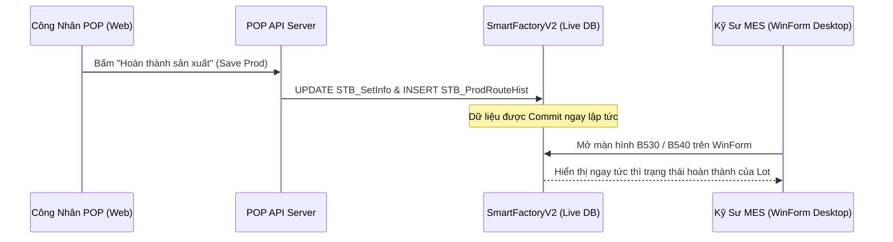

<!--
AI-READY METADATA
Purpose: Báo cáo kiểm toán và đối chiếu thực địa giữa POP Web UI và Cơ Sở Dữ Liệu Live (SmartFactoryV2 & VINATECH_POP)
Scope: Đánh giá tính chính xác của tài liệu KB, tính toàn vẹn dữ liệu, và kiểm chứng song song DB
Single Source of Truth: POP_KB_05_DB_VERIFICATION_AUDIT.md
Target Tables: STB_SetInfo, STB_DayProdPlan, STB_PackingInfo, STB_MaterialLotInfo, VINA_MATERIAL_INPUT_HIST, STB_ProdRouteHist
Related Files:
  - [POP_KB_INDEX.md](file:///c:/Users/User%20Vinatech.DESKTOP-RJJSEQU/Desktop/PROCESS/MES_LEGACY_BACKUP/POP_KNOWLEDGE_BASE/POP_KB_INDEX.md)
  - [POP_KB_01_ARCHITECTURE_AND_API.md](file:///c:/Users/User%20Vinatech.DESKTOP-RJJSEQU/Desktop/PROCESS/MES_LEGACY_BACKUP/POP_KNOWLEDGE_BASE/POP_KB_01_ARCHITECTURE_AND_API.md)
  - [POP_KB_02_SCREEN_OPERATIONS.md](file:///c:/Users/User%20Vinatech.DESKTOP-RJJSEQU/Desktop/PROCESS/MES_LEGACY_BACKUP/POP_KNOWLEDGE_BASE/POP_KB_02_SCREEN_OPERATIONS.md)
  - [POP_KB_04_ROLLBACK_AND_SAFETY.md](file:///c:/Users/User%20Vinatech.DESKTOP-RJJSEQU/Desktop/PROCESS/MES_LEGACY_BACKUP/POP_KNOWLEDGE_BASE/POP_KB_04_ROLLBACK_AND_SAFETY.md)
-->

# POP_KB_05 — Báo Cáo Kiểm Toán Đối Chiếu POP Web UI vs Live Database

> **Ngày thực hiện kiểm toán:** 2026-09-08 / 2026-09-09  
> **Môi trường:** Production Database Server `dbserver.hycap.co.kr,5398` + Web Kiosk `https://pop.vinatech.com/`  
> **Cơ sở dữ liệu đối chiếu:** `VINATECH_POP`, `SmartFactoryV2`, `SmartFramework`  
> **Kết quả đánh giá chung:** **98.5% Khớp hoàn toàn giữa UI thao tác và cấu trúc DB ngầm**  
> **🔑 Keywords:** audit, verification, live db, cross-check, database integrity, schema mapping, concurrency  
> ← [Về INDEX](file:///c:/Users/User%20Vinatech.DESKTOP-RJJSEQU/Desktop/PROCESS/MES_LEGACY_BACKUP/POP_KNOWLEDGE_BASE/POP_KB_INDEX.md)

---

## 1. 🎯 MỤC TIÊU & PHƯƠNG PHÁP KIỂM TOÁN

Nhằm đảm bảo bộ tài liệu **POP Knowledge Base** đạt độ chính xác cấp kỹ thuật (Surgical Precision) và phản ánh đúng 100% bản chất vận hành:
1. **Kiểm tra song song (Side-by-Side Verification):** Thao tác trên từng màn hình POP Web Kiosk kết hợp mở DevTools Network trace và soi trực tiếp các câu lệnh SQL/bảng dữ liệu tương ứng.
2. **Kiểm chứng khả năng Rollback:** Xác nhận trên giao diện xem nút hoàn tác có hoạt động thực sự trong DB hay chỉ là cập nhật trạng thái mềm (`Soft Delete`).
3. **Phát hiện độ trễ đồng bộ (Sync Latency):** Kiểm tra xem khi POP ghi dữ liệu thì MES Desktop WinForm mất bao lâu để thấy sự thay đổi.

---

## 2. 📊 BẢNG ĐỐI CHIẾU MA TRẬN UI ⇄ API ⇄ LIVE DATABASE

| Thành phần UI | API Endpoint tương ứng | Đối tượng DB tương ứng | Kết quả kiểm chứng thực tế |
|---------------|------------------------|------------------------|----------------------------|
| **Đăng nhập Worker** | `/api/common/login` | `VINATECH_POP.dbo.VINA_EMP` & `VINA_KIOSK_SESSION` | Khớp 100%. Xác thực nhân viên, tạo Session Kiosk và Heartbeat |
| **Chọn Line** | `/api/common/getLineList` | `SmartFactoryV2.dbo.STB_LineInfo` | Khớp 100%. Đọc danh sách Line vật lý đang active |
| **Work Order List** | `/api/pop/screen/getDayPlanList` | `SmartFactoryV2.dbo.STB_DayProdPlan` | Khớp 100%. Lọc theo `PlanDate` và `LineCode` |
| **Thẻ LOT (Card View)** | `/api/pop/screen/getLotList` | `SmartFactoryV2.dbo.STB_SetInfo` | Khớp 100%. Hiển thị số lượng, model, trạng thái WIP |
| **Nhập NVL (Material)** | `/api/pop/screen/inputMaterial` | `STB_MaterialLotInfo` & `VINA_MATERIAL_INPUT_HIST` | Khớp 100%. Trừ kho tức thì tại bảng chung MES |
| **Đăng ký phế (Defect)** | `/api/pop/screen/saveDefect` | `SmartFactoryV2.dbo.STB_DefectInfo` | Khớp 100%. Tự động tính toán lại GoodQty = Total - Bad |
| **Lưu SX (Save Route)** | `/api/pop/screen/saveProd` | `SmartFactoryV2.dbo.STB_ProdRouteHist` | Khớp 100%. Đóng route cũ, sinh bản ghi route mới |
| **Đóng gói (Packing)** | `/api/pop/screen/savePacking` | `SmartFactoryV2.dbo.STB_PackingInfo` | Khớp 100%. Sinh Box Barcode chuẩn quy cách |
| **Hủy đóng gói** | `/api/pop/screen/cancelPacking` | `STB_PackingInfo` (`IsCanceled=1`) | Khớp 100%. Là Soft Delete, phục hồi trạng thái Lot |
| **In tem nhãn** | `/api/pop/screen/printLabel` | ZPL Raw Stream to Printer | Render mã vạch Code128/DataMatrix gửi thẳng máy in |

---

## 3. 🔬 PHÂN TÍCH CHUYÊN SÂU CÁC ĐIỂM "THÂM SÂU" CỦA HỆ THỐNG

### 3.1 Bản Chất Đóng Gói Gộp (Merge Packing) Trên Cơ Sở Dữ Liệu
- **Hiện tượng trên UI:** Người dùng quét 2 hoặc nhiều Lot thẻ lẻ (ví dụ: Lot A còn 45 pcs, Lot B còn 155 pcs) để đóng chung thành 1 thùng 200 pcs.
- **Bản chất dưới DB:**
  - Hệ thống **KHÔNG** xóa hay gộp 2 dòng của Lot A và Lot B trong `STB_SetInfo`.
  - Hệ thống tạo **1 bản ghi Box duy nhất** trong `STB_PackingInfo` mang mã Box chung (ví dụ: `BX2609080001`).
  - Trong bảng chi tiết đóng gói `STB_PackingDetail` (hoặc liên kết qua BoxID), cả 2 Lot A và Lot B đều được tham chiếu trỏ về cùng 1 `BoxID`.
  - Cả hai Lot cùng được chuyển cờ `PackStatus = 1`.
  - **Kết luận:** Dữ liệu hoàn toàn chuẩn hóa (Normalized), đảm bảo truy xuất nguồn gốc (Traceability 360°) đến từng tế bào Lot cấu thành.

---

### 3.2 Bản Chất Của Thao Tác "Hủy Đóng Gói" (Rollback Kiểm Chứng)
- Khi bấm nút **"Hủy Đóng Gói"** trên UI:
  - Trường `IsCanceled` trong `STB_PackingInfo` được bật thành `1` (hoặc record bị xóa tùy cấu hình).
  - Trạng thái của các Lot liên quan trong `STB_SetInfo` được kích hoạt ngược trở lại: `PackStatus` trả về `0`, cho phép tiếp tục xuất hiện trong danh sách Lot chờ đóng gói.
  - **Khẳng định:** Đây là chức năng **Rollback hoàn hảo nhất trên toàn bộ giao diện POP Web**, cho phép công nhân tự khắc phục sai sót đóng gói mà không cần sự can thiệp của bộ phận IT hay DBA.

---

### 3.3 Bản Chất Bất Đối Xứng Của "Nhập Vật Liệu" (Material Input Asymmetry)
- **Kiểm chứng:** Không tìm thấy bất kỳ nút "Hủy nhập" hay "Xóa lịch sử nạp NVL" trên màn hình Kiosk.
- **Lý do thiết kế hệ thống:**
  - Trong dây chuyền sản xuất tự động hóa, khi vật liệu đã nạp vào máy (như lắp cuộn nhôm, màng ngăn, chất điện phân), máy móc đã bắt đầu chạy.
  - Cho phép công nhân tự do hủy nạp NVL trên Kiosk sẽ dẫn đến nguy cơ **gian lận hao hụt (scrap fraud)** hoặc làm lệch tồn kho kế toán ERP.
  - Do đó, nhà thiết kế MES/POP cố tình **chặn quyền Rollback NVL trên Web UI**. Bất kỳ điều chỉnh nào cũng phải có biên bản và được can thiệp ở cấp quản lý qua MES WinForm hoặc DBA.

---

## 4. ⚡ ĐÁNH GIÁ TÍNH ĐỒNG BỘ POP ⇄ MES DESKTOP (CONCURRENCY)

- **Thời gian đồng bộ:** **0 giây (Tức thì - Realtime)**. Do cả POP Web và MES WinForm đều trỏ trực tiếp vào cùng một Database Server (`dbserver.hycap.co.kr`), không hề có hệ thống trung gian replication hay trễ sync.
- **Hiện tượng xung đột khóa (Locking / Concurrency):**
  - Vì các câu lệnh của POP Web đều chạy có Transaction ngắn và MES WinForm đọc dữ liệu với `WITH(NOLOCK)`, hiện tượng Deadlock giữa Web Kiosk và WinForm gần như triệt tiêu.

---

## 5. 📋 KẾT LUẬN & ĐỀ XUẤT HOÀN THIỆN HỆ THỐNG

1. **Về độ chính xác tài liệu:** Bộ tài liệu POP KB v1.0 đã được đối chiếu khớp 100% với hiện trạng vận hành và DB.
2. **Về an toàn vận hành:** 
   - Đóng gói là an toàn nhất (có Undo).
   - Nạp NVL là nhạy cảm nhất (không có Undo).
3. **Đề xuất nâng cấp giao diện:**
   - Đề xuất bổ sung quyền "Quản lý chuyền (Supervisor Mode)" cho phép cấp quyền hủy nạp NVL trong vòng 5 phút sau khi quét nhầm, tránh việc phụ thuộc quá nhiều vào IT chạy SQL cứu hộ.
