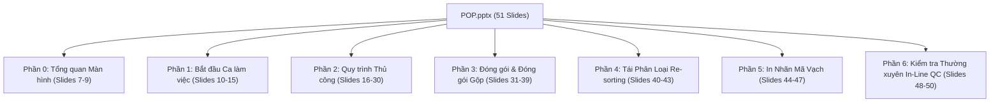

<!--
AI-READY METADATA
Purpose: Phân tích và Ánh Xạ Toàn Diện Bộ Slide Đào Tạo Chính Thức POP.pptx (2026-09) của DX Team vào Hệ Thống POP Knowledge Base
Scope: 51 Slides trong file POP.pptx, liên kết 50 file ảnh tại POP_KNOWLEDGE_BASE/assets/slides_images/
Single Source of Truth: POP_KNOWLEDGE_BASE/POP_SLIDE_DECK_MAPPING_AND_ANALYSIS.md
Authors: Hanbit Kang (Created) | Vietnam DX Team (Modified 2026-09) | Antigravity AI Agent (Synthesized)
Related Files:
  - [POP_KB_INDEX.md](file:///c:/Users/User%20Vinatech.DESKTOP-RJJSEQU/Desktop/PROCESS/MES_LEGACY_BACKUP/POP_KNOWLEDGE_BASE/POP_KB_INDEX.md)
  - [POP_USER_MANUAL.md](file:///c:/Users/User%20Vinatech.DESKTOP-RJJSEQU/Desktop/PROCESS/MES_LEGACY_BACKUP/POP_KNOWLEDGE_BASE/POP_USER_MANUAL.md)
  - [POP_KB_02_SCREEN_OPERATIONS.md](file:///c:/Users/User%20Vinatech.DESKTOP-RJJSEQU/Desktop/PROCESS/MES_LEGACY_BACKUP/POP_KNOWLEDGE_BASE/POP_KB_02_SCREEN_OPERATIONS.md)
  - [POP_KB_04_ROLLBACK_AND_SAFETY.md](file:///c:/Users/User%20Vinatech.DESKTOP-RJJSEQU/Desktop/PROCESS/MES_LEGACY_BACKUP/POP_KNOWLEDGE_BASE/POP_KB_04_ROLLBACK_AND_SAFETY.md)
-->

# 📑 POP.PPTX — BẢNG PHÂN TÍCH & ÁNH XẠ TOÀN DIỆN SLIDE ĐÀO TẠO POP (2026-09)

> **Tài liệu gốc:** `POP_KNOWLEDGE_BASE/assets/POP.pptx`  
> **Tiêu đề gốc:** *Hướng Dẫn Sử Dụng POP (S/C Production) (2026-09)*  
> **Tác giả:** Hanbit Kang | **Hiệu chỉnh:** Vietnam DX Team  
> **Thư mục ảnh trích xuất:** `POP_KNOWLEDGE_BASE/assets/slides_images/`  
> **Mục tiêu:** Đối chiếu 100% nội dung slide đào tạo thực địa với hệ thống tài liệu Knowledge Base, làm rõ các tính năng mới chưa từng được ghi nhận trước đây.

---

## 🧭 1. TỔNG QUAN CẤU TRÚC 6 PHẦN CỦA SLIDE DECK

Bộ tài liệu đào tạo chính thức bao gồm **51 slides nội dung** được phân bổ thành 7 phần chuẩn hóa (Phần 0 đến Phần 6):

---

## 📊 2. BẢNG MA TRẬN ÁNH XẠ CHI TIẾT 51 SLIDES (SLIDE-TO-KB MATRIX)

| Slide | File Ảnh Minh Họa | Phân Hệ / Tiêu Đề Nghiệp Vụ | Thao Tác UI Cốt Lõi | Dữ Liệu & DB Liên Đới | File KB Tương Ứng |
| :---: | :--- | :--- | :--- | :--- | :--- |
| **01** | `image18.png` | **Bìa tài liệu** | Hướng Dẫn Sử Dụng POP (S/C Production) (2026-09) | Metadata tài liệu | [POP_KB_INDEX.md](file:///c:/Users/User%20Vinatech.DESKTOP-RJJSEQU/Desktop/PROCESS/MES_LEGACY_BACKUP/POP_KNOWLEDGE_BASE/POP_KB_INDEX.md) |
| **02** | `image14.png` | **Mục lục Phần 0 & 1** | Tổng quan màn hình & Bắt đầu ca làm việc | Mục lục hệ thống | [POP_USER_MANUAL.md](file:///c:/Users/User%20Vinatech.DESKTOP-RJJSEQU/Desktop/PROCESS/MES_LEGACY_BACKUP/POP_KNOWLEDGE_BASE/POP_USER_MANUAL.md) |
| **03** | `image1.png` | **Mục lục Phần 2** | Quy trình thủ công, nạp NVL, đăng ký lỗi, marking | Mục lục hệ thống | [POP_USER_MANUAL.md](file:///c:/Users/User%20Vinatech.DESKTOP-RJJSEQU/Desktop/PROCESS/MES_LEGACY_BACKUP/POP_KNOWLEDGE_BASE/POP_USER_MANUAL.md) |
| **04** | `image5.png` | **Mục lục Phần 3 & 4** | Đóng gói đơn/chia/gộp, tái phân loại | Mục lục hệ thống | [POP_USER_MANUAL.md](file:///c:/Users/User%20Vinatech.DESKTOP-RJJSEQU/Desktop/PROCESS/MES_LEGACY_BACKUP/POP_KNOWLEDGE_BASE/POP_USER_MANUAL.md) |
| **05** | `image19.png` | **Mục lục Phần 5** | In nhãn tem mã vạch | Mục lục hệ thống | [POP_USER_MANUAL.md](file:///c:/Users/User%20Vinatech.DESKTOP-RJJSEQU/Desktop/PROCESS/MES_LEGACY_BACKUP/POP_KNOWLEDGE_BASE/POP_USER_MANUAL.md) |
| **06** | `image3.png` | **Mục lục Phần 6** | Hạng mục kiểm tra thường xuyên (In-line QC) | Mục lục hệ thống | [POP_USER_MANUAL.md](file:///c:/Users/User%20Vinatech.DESKTOP-RJJSEQU/Desktop/PROCESS/MES_LEGACY_BACKUP/POP_KNOWLEDGE_BASE/POP_USER_MANUAL.md) |
| **07** | `image13.png` | **Phần 0: Mở đầu** | Giới thiệu đường dẫn `https://pop.vinatech.com/pop/screen` | Endpoint URL | [POP_KB_01_ARCHITECTURE_AND_API.md](file:///c:/Users/User%20Vinatech.DESKTOP-RJJSEQU/Desktop/PROCESS/MES_LEGACY_BACKUP/POP_KNOWLEDGE_BASE/POP_KB_01_ARCHITECTURE_AND_API.md) |
| **08** | `image21.png` | **Bố cục 4 khu vực Kiosk** | 1. Header, 2. Menu quy trình, 3. Trạng thái thiết bị, 4. Khu vực chính, 5. Phím ảo & Đa ngữ (KO/EN/VI) | UI Layout Architecture | [POP_KB_02_SCREEN_OPERATIONS.md](file:///c:/Users/User%20Vinatech.DESKTOP-RJJSEQU/Desktop/PROCESS/MES_LEGACY_BACKUP/POP_KNOWLEDGE_BASE/POP_KB_02_SCREEN_OPERATIONS.md) |
| **09** | `image11.png` | **Chức năng chung Header** | Ngày giờ thực, Tên công nhân, Tên chuyền, Nút (↻) reload | Session Heartbeat & Cache reload | [POP_KB_02_SCREEN_OPERATIONS.md](file:///c:/Users/User%20Vinatech.DESKTOP-RJJSEQU/Desktop/PROCESS/MES_LEGACY_BACKUP/POP_KNOWLEDGE_BASE/POP_KB_02_SCREEN_OPERATIONS.md) |
| **10** | `image7.png` | **Phần 1: Mở đầu Bắt đầu** | Bắt đầu ca làm việc | Quy trình khởi tạo | [POP_USER_MANUAL.md](file:///c:/Users/User%20Vinatech.DESKTOP-RJJSEQU/Desktop/PROCESS/MES_LEGACY_BACKUP/POP_KNOWLEDGE_BASE/POP_USER_MANUAL.md) |
| **11-12** | `image4.png` | **Chọn Công Nhân** | Đổi công ty -> Chọn phòng ban (trái) -> Chọn nhân viên (phải) -> Quét thẻ QR siêu tốc | `VINA_KIOSK_SESSION.WORKER_ID` | [POP_KB_02_SCREEN_OPERATIONS.md](file:///c:/Users/User%20Vinatech.DESKTOP-RJJSEQU/Desktop/PROCESS/MES_LEGACY_BACKUP/POP_KNOWLEDGE_BASE/POP_KB_02_SCREEN_OPERATIONS.md) |
| **13** | `image10.png` | **Chọn Ngày (Lịch Sản Xuất)**| Điều hướng tháng `◀ ▶`, chọn ngày, xem tóm tắt Kế hoạch/Đạt/Lỗi & số lệnh | `STB_DayProdPlan.DayPlanDate` | [POP_KB_02_SCREEN_OPERATIONS.md](file:///c:/Users/User%20Vinatech.DESKTOP-RJJSEQU/Desktop/PROCESS/MES_LEGACY_BACKUP/POP_KNOWLEDGE_BASE/POP_KB_02_SCREEN_OPERATIONS.md) |
| **14** | `image23.png` | **Chọn Lệnh Sản Xuất** | Chọn DayPlan, kiểm tra mã SP, tên SP, số lượng kế hoạch, số LOT. Quét LOT tự tải LSX | `STB_DayProdPlan.DayPlanNo` | [POP_KB_02_SCREEN_OPERATIONS.md](file:///c:/Users/User%20Vinatech.DESKTOP-RJJSEQU/Desktop/PROCESS/MES_LEGACY_BACKUP/POP_KNOWLEDGE_BASE/POP_KB_02_SCREEN_OPERATIONS.md) |
| **15** | `image42.png` | **Menu Quy Trình & LOT** | Xem tiến trình quy trình bên trái; danh sách thẻ LOT; huy hiệu trạng thái | `STB_SetInfo`, `STB_ProdRouteHist` | [POP_KB_02_SCREEN_OPERATIONS.md](file:///c:/Users/User%20Vinatech.DESKTOP-RJJSEQU/Desktop/PROCESS/MES_LEGACY_BACKUP/POP_KNOWLEDGE_BASE/POP_KB_02_SCREEN_OPERATIONS.md) |
| **16** | `image6.png` | **Phần 2: Mở đầu Thủ công** | Thao tác sản xuất thủ công trên chuyền | Quy trình gia công | [POP_USER_MANUAL.md](file:///c:/Users/User%20Vinatech.DESKTOP-RJJSEQU/Desktop/PROCESS/MES_LEGACY_BACKUP/POP_KNOWLEDGE_BASE/POP_USER_MANUAL.md) |
| **17** | `image9.png` | **Bố cục Màn hình Thủ công**| Danh sách LOT (trái), Bảng LOT hiện tại + Numpad (giữa), Bộ nút điều khiển (dưới) | 3 vùng tương tác | [POP_KB_02_SCREEN_OPERATIONS.md](file:///c:/Users/User%20Vinatech.DESKTOP-RJJSEQU/Desktop/PROCESS/MES_LEGACY_BACKUP/POP_KNOWLEDGE_BASE/POP_KB_02_SCREEN_OPERATIONS.md) |
| **18** | `image12.png` | **Chọn Thẻ LOT** | Thanh lệnh SX, thẻ LOT, thanh tiến trình công đoạn, tỷ lệ NVL đã nạp `(0/6)` | Kiểm tra trạng thái LOT | [POP_KB_02_SCREEN_OPERATIONS.md](file:///c:/Users/User%20Vinatech.DESKTOP-RJJSEQU/Desktop/PROCESS/MES_LEGACY_BACKUP/POP_KNOWLEDGE_BASE/POP_KB_02_SCREEN_OPERATIONS.md) |
| **19** | `image2.png` | **Chọn LOT - Cách 1 (Scan)** | Quét trực tiếp Barcode từ tem cấp phát -> Bấm "Thêm" | Scan tự động tìm DayPlan | [POP_USER_MANUAL.md](file:///c:/Users/User%20Vinatech.DESKTOP-RJJSEQU/Desktop/PROCESS/MES_LEGACY_BACKUP/POP_KNOWLEDGE_BASE/POP_USER_MANUAL.md) |
| **20** | `image8.png` | **Chọn LOT - Cách 2 (Lịch)** | Click vùng dưới LOT hiện tại -> Chọn ngày -> Chọn LSX bên phải -> Bấm "Thêm" | Chọn theo kế hoạch ngày | [POP_USER_MANUAL.md](file:///c:/Users/User%20Vinatech.DESKTOP-RJJSEQU/Desktop/PROCESS/MES_LEGACY_BACKUP/POP_KNOWLEDGE_BASE/POP_USER_MANUAL.md) |
| **21** | `image27.png` | **Truy Cập Nhập Vật Liệu** | Nút cam `(0/6)` ở góc dưới phải. Khóa nút "Đăng ký" nếu chưa nạp đủ vật liệu | Interlock nạp NVL bắt buộc | [POP_KB_02_SCREEN_OPERATIONS.md](file:///c:/Users/User%20Vinatech.DESKTOP-RJJSEQU/Desktop/PROCESS/MES_LEGACY_BACKUP/POP_KNOWLEDGE_BASE/POP_KB_02_SCREEN_OPERATIONS.md) |
| **22** | `image34.png` | **Chi Tiết Nhập Vật Liệu** | Tab Nhập thủ công vs Tự động/Hoàn thành; **Nút "Lượng kiến cấp"**; **Nút "Tồn kho"** | `STB_MaterialLotInfo`, `VINA_MATERIAL_INPUT_HIST` | [POP_KB_02_SCREEN_OPERATIONS.md](file:///c:/Users/User%20Vinatech.DESKTOP-RJJSEQU/Desktop/PROCESS/MES_LEGACY_BACKUP/POP_KNOWLEDGE_BASE/POP_KB_02_SCREEN_OPERATIONS.md) |
| **23** | `image15.png` | **Tra Cứu Tồn Kho LOT NVL** | Nút "Tồn kho" -> Gõ mã LOT NVL -> Tìm kiếm -> Chọn LOT và nạp số lượng | `STB_MaterialLotInfo.CurrentQty` | [POP_KB_02_SCREEN_OPERATIONS.md](file:///c:/Users/User%20Vinatech.DESKTOP-RJJSEQU/Desktop/PROCESS/MES_LEGACY_BACKUP/POP_KNOWLEDGE_BASE/POP_KB_02_SCREEN_OPERATIONS.md) |
| **24** | `image32.png` | **Chọn Loại Lỗi** | Chạm nút xanh lá **"LOẠI LỖI"** -> Chọn mã lỗi tương ứng | `STB_DefectCodeMaster` | [POP_KB_02_SCREEN_OPERATIONS.md](file:///c:/Users/User%20Vinatech.DESKTOP-RJJSEQU/Desktop/PROCESS/MES_LEGACY_BACKUP/POP_KNOWLEDGE_BASE/POP_KB_02_SCREEN_OPERATIONS.md) |
| **25** | `image29.png` | **Nhập Số Lượng Lỗi** | Bàn phím số Numpad cảm ứng (1-9, Clear, Enter) | Nhập liệu số lượng phế phẩm | [POP_KB_02_SCREEN_OPERATIONS.md](file:///c:/Users/User%20Vinatech.DESKTOP-RJJSEQU/Desktop/PROCESS/MES_LEGACY_BACKUP/POP_KNOWLEDGE_BASE/POP_KB_02_SCREEN_OPERATIONS.md) |
| **26** | `image30.png` | **Đăng Ký Lỗi** | Chạm nút **"ĐĂNG KÝ"** -> Ghi nhận lỗi -> Tự động reset về 0 cho lần nhập tiếp | `STB_ProdRouteHist.DefectQty` | [POP_KB_02_SCREEN_OPERATIONS.md](file:///c:/Users/User%20Vinatech.DESKTOP-RJJSEQU/Desktop/PROCESS/MES_LEGACY_BACKUP/POP_KNOWLEDGE_BASE/POP_USER_MANUAL.md) |
| **27** | `image16.png` | **Hoàn Thành Sản Xuất** | Nút tím **"HOÀN THÀNH SẢN XUẤT"** -> Popup xác nhận lần cuối -> Chốt routing LOT | `STB_SetInfo.IsProdFinish=1` | [POP_KB_02_SCREEN_OPERATIONS.md](file:///c:/Users/User%20Vinatech.DESKTOP-RJJSEQU/Desktop/PROCESS/MES_LEGACY_BACKUP/POP_KNOWLEDGE_BASE/POP_KB_02_SCREEN_OPERATIONS.md) |
| **28** | `image37.png` | **Menu Thêm (Nút ⋮)** | Menu mở rộng góc dưới phải -> Chọn "Tái phân loại" | Context Menu | [POP_KB_02_SCREEN_OPERATIONS.md](file:///c:/Users/User%20Vinatech.DESKTOP-RJJSEQU/Desktop/PROCESS/MES_LEGACY_BACKUP/POP_KNOWLEDGE_BASE/POP_KB_02_SCREEN_OPERATIONS.md) |
| **29** | `image35.png` | **⭐ Nhập Mã Marking Bọc Vỏ**| **Nút "Mã marking"** góc trên phải tại công đoạn Bọc Vỏ -> Popup nhập mã marking | Ghi nhận Barcode thân vỏ | [POP_KB_02_SCREEN_OPERATIONS.md](file:///c:/Users/User%20Vinatech.DESKTOP-RJJSEQU/Desktop/PROCESS/MES_LEGACY_BACKUP/POP_KNOWLEDGE_BASE/POP_KB_02_SCREEN_OPERATIONS.md) |
| **30** | `image36.png` | **Kiểm Tra Định Mức BOM** | Nút **"Xem BOM"** góc trên danh sách LOT -> Tra cứu định mức NVL, Plan Qty, ĐVT | `STB_BomDetail` | [POP_USER_MANUAL.md](file:///c:/Users/User%20Vinatech.DESKTOP-RJJSEQU/Desktop/PROCESS/MES_LEGACY_BACKUP/POP_KNOWLEDGE_BASE/POP_USER_MANUAL.md) |
| **31** | `image17.png` | **Phần 3: Mở đầu Đóng Gói** | Đóng gói đơn, đóng gói chia & đóng gói gộp | Quy trình đóng gói Box | [POP_USER_MANUAL.md](file:///c:/Users/User%20Vinatech.DESKTOP-RJJSEQU/Desktop/PROCESS/MES_LEGACY_BACKUP/POP_KNOWLEDGE_BASE/POP_USER_MANUAL.md) |
| **32** | `image39.png` | **Vào Quy Trình Đóng Gói** | Chạm "Đóng gói" trên menu. Chỉ hiển thị LOT đã hoàn thành 100% công đoạn trước | Điều kiện hoàn thành routing | [POP_KB_02_SCREEN_OPERATIONS.md](file:///c:/Users/User%20Vinatech.DESKTOP-RJJSEQU/Desktop/PROCESS/MES_LEGACY_BACKUP/POP_KNOWLEDGE_BASE/POP_KB_02_SCREEN_OPERATIONS.md) |
| **33** | `image38.png` | **Tổng Quan 3 Kiểu Đóng Gói**| 1. Đóng gói đơn, 2. Đóng gói chia (chia box), 3. Đóng gói gộp (gộp LOT) | Kiến trúc đóng gói | [POP_KB_02_SCREEN_OPERATIONS.md](file:///c:/Users/User%20Vinatech.DESKTOP-RJJSEQU/Desktop/PROCESS/MES_LEGACY_BACKUP/POP_KNOWLEDGE_BASE/POP_KB_02_SCREEN_OPERATIONS.md) |
| **34** | `image22.png` | **1. Đóng Gói Đơn** | Chọn 1 LOT -> Nhập SL/Box -> Bấm "ĐÓNG GÓI" (VD: 1 Box x 5,980 = 5,980 EA) | `STB_PackingInfo` | [POP_USER_MANUAL.md](file:///c:/Users/User%20Vinatech.DESKTOP-RJJSEQU/Desktop/PROCESS/MES_LEGACY_BACKUP/POP_KNOWLEDGE_BASE/POP_USER_MANUAL.md) |
| **35** | `image24.png` | **2. Đóng Gói Chia (Nhiều Box)**| Nhập SL từng Box (Box 1, 2, 3..), nút "Thêm hộp", nút `X` xóa hộp, nút "Cả" (All) | Multi-box Packing | [POP_USER_MANUAL.md](file:///c:/Users/User%20Vinatech.DESKTOP-RJJSEQU/Desktop/PROCESS/MES_LEGACY_BACKUP/POP_KNOWLEDGE_BASE/POP_USER_MANUAL.md) |
| **36** | `image49.png` | **3. Đóng Gói Gộp (Merge Pack)**| Chọn nhiều LOT (màu tím), nhập số lượng đóng gói (VD: 6,000 EA) -> Trừ FIFO | Merge Pack FIFO logic | [POP_KB_02_SCREEN_OPERATIONS.md](file:///c:/Users/User%20Vinatech.DESKTOP-RJJSEQU/Desktop/PROCESS/MES_LEGACY_BACKUP/POP_KNOWLEDGE_BASE/POP_KB_02_SCREEN_OPERATIONS.md) |
| **37** | `image25.png` | **Gộp LOT Khác Ngày** | Hết LOT trong ngày -> Bấm "Lệnh SX" chọn DayPlan ngày khác (Bắt buộc cùng Model) | Cross-day Merge | [POP_USER_MANUAL.md](file:///c:/Users/User%20Vinatech.DESKTOP-RJJSEQU/Desktop/PROCESS/MES_LEGACY_BACKUP/POP_KNOWLEDGE_BASE/POP_USER_MANUAL.md) |
| **38** | `image26.png` | **In Nhãn Sau Đóng Gói** | Tab Nhãn LOT / Nhãn Box; Checkbox chọn loại nhãn; Nút tăng giảm số bản in | Vector QR Label | [POP_KB_02_SCREEN_OPERATIONS.md](file:///c:/Users/User%20Vinatech.DESKTOP-RJJSEQU/Desktop/PROCESS/MES_LEGACY_BACKUP/POP_KNOWLEDGE_BASE/POP_KB_02_SCREEN_OPERATIONS.md) |
| **39** | `image28.png` | **⭐ Lịch Sử & HỦY ĐÓNG GÓI** | **Nút "Lịch sử"**: Danh sách Box; In lại tem; **Nút [HỦY]** từng Box & **[HỦY TẤT CẢ]** | **Rollback Box -> Khôi phục LOT** | [POP_KB_04_ROLLBACK_AND_SAFETY.md](file:///c:/Users/User%20Vinatech.DESKTOP-RJJSEQU/Desktop/PROCESS/MES_LEGACY_BACKUP/POP_KNOWLEDGE_BASE/POP_KB_04_ROLLBACK_AND_SAFETY.md) |
| **40** | `image31.png` | **Phần 4: Mở đầu Tái Phân Loại**| Tái phân loại phế phẩm để thu hồi sản phẩm đạt | Re-sorting Process | [POP_USER_MANUAL.md](file:///c:/Users/User%20Vinatech.DESKTOP-RJJSEQU/Desktop/PROCESS/MES_LEGACY_BACKUP/POP_KNOWLEDGE_BASE/POP_USER_MANUAL.md) |
| **41** | `image33.png` | **Truy Cập Tái Phân Loại** | Menu `⋮` -> "Tái phân loại" (Bắt buộc phải chọn Lệnh sản xuất trước) | Validation check | [POP_USER_MANUAL.md](file:///c:/Users/User%20Vinatech.DESKTOP-RJJSEQU/Desktop/PROCESS/MES_LEGACY_BACKUP/POP_KNOWLEDGE_BASE/POP_USER_MANUAL.md) |
| **42** | `image41.png` | **Tái Phân Loại: Phân Bổ Tỷ Lệ**| Nhập tổng số lượng trừ -> Hệ thống tự chia đều theo tỷ lệ lỗi còn lại của từng LOT | Auto Proportion Split | [POP_USER_MANUAL.md](file:///c:/Users/User%20Vinatech.DESKTOP-RJJSEQU/Desktop/PROCESS/MES_LEGACY_BACKUP/POP_KNOWLEDGE_BASE/POP_USER_MANUAL.md) |
| **43** | `image50.png` | **Tái Phân Loại: Nhập Từng LOT**| Nhập trực tiếp số lượng vào từng dòng LOT. Tạo LOT mới, không xóa lịch sử lỗi | Audit Trail Preservation | [POP_USER_MANUAL.md](file:///c:/Users/User%20Vinatech.DESKTOP-RJJSEQU/Desktop/PROCESS/MES_LEGACY_BACKUP/POP_KNOWLEDGE_BASE/POP_USER_MANUAL.md) |
| **44** | `image40.png` | **Phần 5: Mở đầu In Nhãn** | In tem nhãn mã vạch thành phẩm & bán thành phẩm | Printing Subsystem | [POP_USER_MANUAL.md](file:///c:/Users/User%20Vinatech.DESKTOP-RJJSEQU/Desktop/PROCESS/MES_LEGACY_BACKUP/POP_KNOWLEDGE_BASE/POP_USER_MANUAL.md) |
| **45** | `image45.png` | **Truy Cập Màn Hình In Nhãn**| Nút "In Nhãn" góc trên phải màn hình Lắp ráp hoặc dưới màn hình Đóng gói | Print Modal Launch | [POP_KB_02_SCREEN_OPERATIONS.md](file:///c:/Users/User%20Vinatech.DESKTOP-RJJSEQU/Desktop/PROCESS/MES_LEGACY_BACKUP/POP_KNOWLEDGE_BASE/POP_KB_02_SCREEN_OPERATIONS.md) |
| **46** | `image51.png` | **Chọn LOT & Định Dạng Nhãn**| Đề xuất nhãn phù hợp có gắn Sao ⭐; Cho phép sửa `MaterialNo` trước khi in; Chọn tất cả | Label Layout Master Data | [POP_KB_02_SCREEN_OPERATIONS.md](file:///c:/Users/User%20Vinatech.DESKTOP-RJJSEQU/Desktop/PROCESS/MES_LEGACY_BACKUP/POP_KNOWLEDGE_BASE/POP_KB_02_SCREEN_OPERATIONS.md) |
| **47** | `image43.png` | **Thực Hiện In Nhãn** | Tự tính tổng tờ in; Xem trước kích thước thực (83x49mm); In lại không giới hạn | Zebra/Intermec Print Output | [POP_KB_02_SCREEN_OPERATIONS.md](file:///c:/Users/User%20Vinatech.DESKTOP-RJJSEQU/Desktop/PROCESS/MES_LEGACY_BACKUP/POP_KNOWLEDGE_BASE/POP_KB_02_SCREEN_OPERATIONS.md) |
| **48** | `image44.png` | **Phần 6: Mở đầu Tự Kiểm** | Hạng mục kiểm tra thường xuyên tại trạm (In-Line QC) | In-Line Quality Inspection | [POP_USER_MANUAL.md](file:///c:/Users/User%20Vinatech.DESKTOP-RJJSEQU/Desktop/PROCESS/MES_LEGACY_BACKUP/POP_KNOWLEDGE_BASE/POP_USER_MANUAL.md) |
| **49** | `image46.png` | **Truy Cập Nút "Tự Kiểm"** | Nút **"Tự kiểm"** nằm ở góc dưới cùng bên trái màn hình Kiosk | Navigation to `/pop/quality/self` | [POP_KB_02_SCREEN_OPERATIONS.md](file:///c:/Users/User%20Vinatech.DESKTOP-RJJSEQU/Desktop/PROCESS/MES_LEGACY_BACKUP/POP_KNOWLEDGE_BASE/POP_KB_02_SCREEN_OPERATIONS.md) |
| **50** | `image47.png` | **⭐ Bố Cục Tự Kiểm & Auto-Save**| Nút quay lại; Đổi công đoạn; **Cơ chế Auto-save on blur đồng bộ NAIS**; Spec; `[+]` mẫu; Trend Chart | Realtime DB & NAIS Sync | [POP_KB_02_SCREEN_OPERATIONS.md](file:///c:/Users/User%20Vinatech.DESKTOP-RJJSEQU/Desktop/PROCESS/MES_LEGACY_BACKUP/POP_KNOWLEDGE_BASE/POP_KB_02_SCREEN_OPERATIONS.md) |
| **51** | `image48.png` | **Slide Kết Thúc** | Vinatech Core Values (Passion, Communication, Share) | Corporate Culture | - |

---

## 🔍 3. NĂM (05) ĐIỂM PHÁT HIỆN MỚI QUAN TRỌNG TỪ SLIDE DECK

So với tài liệu KB trước đây được tổng hợp từ reverse-engineering API và UI scraping, việc phân tích tài liệu slide đào tạo chuẩn 2026-09 đã làm sáng tỏ 5 điểm nghiệp vụ then chốt:

### 3.1 Nút "Mã Marking" tại công đoạn Bọc Vỏ (Slide 29)
- **Vị trí UI:** Nằm ở góc trên bên phải, ngay cạnh biểu tượng In nhãn tại công đoạn Bọc Vỏ (*Curling / Marking*).
- **Hành vi:** Khi bấm, mở popup chuyên dụng để công nhân quét hoặc gõ mã marking khắc trên vỏ lon/module.
- **Tác động:** Liên kết mã vỏ thực tế vào bản ghi LOT trước khi đi tiếp các công đoạn kiểm tra sau.

### 3.2 Nút "Lượng kiến cấp" & "Tồn kho" khi nạp NVL (Slide 22, 23)
- **Nút "Lượng kiến cấp" (Estimated Supply Qty):** Cho phép nạp tự động đúng 100% số lượng cần thiết theo định mức BOM chỉ với một thao tác chạm, giải phóng công nhân khỏi việc gõ số thập phân thủ công.
- **Nút "Tồn kho" (Warehouse Stock):** Cho phép tra cứu đích danh LOT NVL trong kho công đoạn (`ROUTE_VN_WH`), kiểm tra số lượng tồn và chỉ định chính xác LOT NVL xuất dùng.

### 3.3 Chuẩn Hóa 3 Nghiệp Vụ Đóng Gói (Slide 33-37)
- **Đóng gói đơn (Single Pack):** 1 Box duy nhất cho toàn bộ số lượng LOT.
- **Đóng gói chia (Split Pack):** 1 LOT chia nhiều Box, có nút `[Thêm hộp]`, nút xóa `[X]`, và nút `[Cả]` để chốt toàn bộ.
- **Đóng gói gộp (Merge Pack):** Tích chọn nhiều LOT, nhận diện trực quan bằng **Màu Tím**, áp dụng nguyên tắc trừ FIFO từ trên xuống dưới. Cho phép gộp LOT khác ngày bằng cách bấm nút "Lệnh SX" (yêu cầu bắt buộc cùng Model).

### 3.4 Cơ Chế Rollback Hủy Đóng Gói Trực Tiếp Trên UI (Slide 39)
- **Tính chính thống:** Slide 39 khẳng định hệ thống Kiosk POP hỗ trợ đầy đủ cơ chế Rollback đóng gói thông qua nút **"Lịch sử"**.
- **Hai cấp độ hủy:**
  - **Hủy từng Box:** Nút `[HỦY]` trên từng dòng Box -> Khôi phục số lượng của Box đó về lại LOT gốc ngay lập tức.
  - **Hủy tất cả:** Nút `[HỦY TẤT CẢ]` ở góc trên cho phép xóa toàn bộ các Box của lệnh sản xuất cùng lúc.
- **Cơ chế an toàn:** Hộp thoại xác nhận số lượng hiển thị trước khi hủy, bảo đảm không bị bấm nhầm.

### 3.5 Cơ Chế Tự Động Lưu (Auto-Save on Blur) Tại Màn Hình Tự Kiểm (Slide 50)
- **Hành vi:** Tại giao diện In-Line QC (`/pop/quality/self`), công nhân nhập giá trị đo (chiều dài, điện áp, nội trở, độ dày...). Ngay khi **click chuột ra bên ngoài ô nhập**, hệ thống sẽ **tự động lưu vào cơ sở dữ liệu và đồng bộ tức thì với NAIS MES**.
- **Tính năng mở rộng:** Cho phép công nhân bấm nút `[+]` để tăng số lần đo mẫu kiểm tra, thêm ghi chú sự cố, và theo dõi trực quan Biểu đồ xu hướng (Trend Chart) ngay trên Kiosk.
