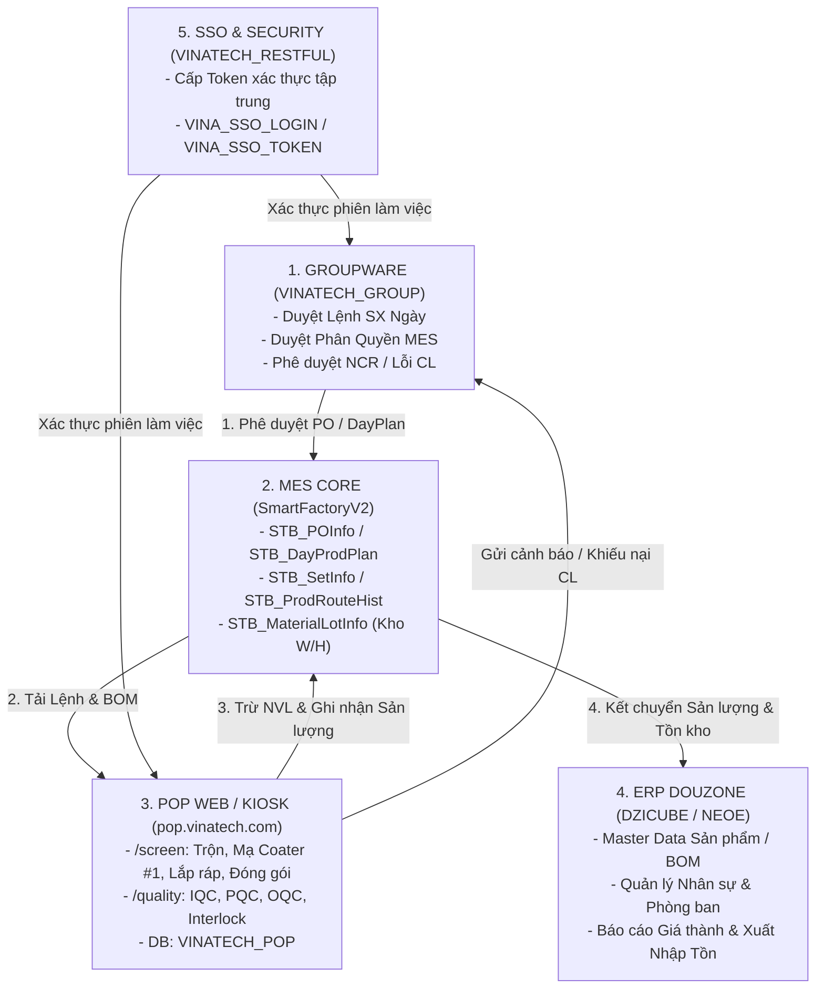

<!--
AI-READY METADATA
Purpose: Master System Integration Guide — Liên kết 360° giữa POP, MES, Groupware & ERP
Scope: Vinatech Enterprise Ecosystem (SmartFactoryV2, VINATECH_POP, VINATECH_GROUP, DZICUBE, VINATECH_RESTFUL, SmartFramework)
Single Source of Truth: POP_KNOWLEDGE_BASE/POP_SYSTEM_INTEGRATION_GUIDE.md
Related Files:
  - [POP_USER_MANUAL.md](file:///c:/Users/User%20Vinatech.DESKTOP-RJJSEQU/Desktop/PROCESS/MES_LEGACY_BACKUP/POP_KNOWLEDGE_BASE/POP_USER_MANUAL.md)
  - [POP_TRAINING_SCREEN_QUALITY.md](file:///c:/Users/User%20Vinatech.DESKTOP-RJJSEQU/Desktop/PROCESS/MES_LEGACY_BACKUP/POP_KNOWLEDGE_BASE/POP_TRAINING_SCREEN_QUALITY.md)
  - [DB_06_VINATECH_POP.md](file:///c:/Users/User%20Vinatech.DESKTOP-RJJSEQU/Desktop/PROCESS/MES_LEGACY_BACKUP/DATABASE_KNOWLEDGE_BASE/DB_06_VINATECH_POP.md)
  - [DB_03_INTEGRATION_SSO_SECURITY.md](file:///c:/Users/User%20Vinatech.DESKTOP-RJJSEQU/Desktop/PROCESS/MES_LEGACY_BACKUP/DATABASE_KNOWLEDGE_BASE/DB_03_INTEGRATION_SSO_SECURITY.md)
  - [SYSTEM_INTEGRATION_MAP.md](file:///c:/Users/User%20Vinatech.DESKTOP-RJJSEQU/Desktop/PROCESS/MES_LEGACY_BACKUP/SYSTEM_INTEGRATION_MAP.md)
-->

# 🌐 VINATECH ENTERPRISE INTEGRATION MASTER GUIDE
## Kiến Trúc Liên Kết Đa Chiều: POP Web ⇄ MES Core ⇄ Groupware ⇄ ERP

> **Phiên bản:** v2.0 (Khởi tạo 2026-08-29 dựa trên Live DB & Web Verification)  
> **Phạm vi:** 33 Cơ sở dữ liệu và các Phân hệ Web Vận hành tại Vinatech  
> **Cổng Truy Cập Chính:** `https://pop.vinatech.com/` | `http://mes.hycap.co.kr:9952/`

---

## 🗺️ 1. TỔNG QUAN BẢN ĐỒ KIẾN TRÚC TOÀN HỆ THỐNG



---

## ⚡ 2. CHI TIẾT 4 LUỒNG TÍCH HỢP NGHIỆP VỤ CỐT LÕI

### 2.1 Luồng Lệnh Sản Xuất & DayPlan (Order-to-Execution Lifecycle)

1. **Khởi tạo & Duyệt Kế hoạch (Groupware):**
   - Quản lý xưởng lập Lệnh sản xuất ngày trên Groupware qua chứng từ: `VINA_DOCUMENT_DAILY_PRODUCTION_ORDER` (hoặc `VINA_DOCUMENT_DAILY_PRODUCTION_ORDER_COATING` cho chuyền Điện cực).
   - Sau khi các cấp ký duyệt (Approval), dữ liệu được tự động đẩy sang MES Core.
2. **Khai triển DayPlan trong MES (`SmartFactoryV2`):**
   - Hệ thống MES sinh bản ghi kế hoạch tại `STB_DayProdPlan` (Mã DayPlan dạng `2026082500040`, Line `ElectrodeBN`).
   - Tự động bóc tách BOM theo Master Data (`STB_BomMaster`, `STB_BomDetail`).
3. **Thao tác Thực tế trên POP Web (`https://pop.vinatech.com/pop/screen`):**
   - Công nhân chọn Dây chuyền `Điện cực Bắc Ninh` ➔ Chọn DayPlan ➔ Chọn LOT (`VVQQ2520001E75`).
   - POP Web đọc tồn kho công đoạn tại `STB_MaterialLotInfo` (`ROUTE_VN_WH`), hiển thị mã NVL `CS200` (`GAJCFO-002`) và mã thay thế `GAYF00-001`.
   - Bấm `NHẬP` ➔ Trừ tồn kho tức thì tại Live DB `SmartFactoryV2` và ghi log `VINATECH_POP.dbo.VINA_MATERIAL_INPUT_HIST`.
4. **Đồng bộ về ERP:**
   - Sau khi công đoạn hoàn thành, sản lượng đạt và phế phẩm được tổng hợp vào `STB_ProdRouteHist` và đồng bộ sang ERP Douzone (`DZICUBE`) để tính định mức tiêu hao và giá thành.

---

### 2.2 Luồng Kiểm Soát Chất Lượng & Interlock (Quality & Defect Lifecycle)

| Điểm Kiểm Soát | Phân Hệ Thực Hiện | Bảng CSDL Tham Chiếu | Cơ Chế Khóa (Interlock) |
| :--- | :--- | :--- | :--- |
| **IQC (NVL Đầu vào)** | POP `/quality` & Kho | `STB_MaterialLotInfo` | Chặn quét LOT NVL nếu `HoldError` có giá trị hoặc quá hạn `EndOfLifeDate`. |
| **PQC (Công đoạn)** | POP `/screen` & Coater #1 | `VINA_EQUIPMENT_SETTING` | Đọc dữ liệu cảm biến PLC (độ dày màng, nhiệt độ), cảnh báo nếu lệch Baseline. |
| **BOM Validation** | POP Web BOM Engine | `VINA_BOM_INPUT_ROUTE` | Khóa nút *Hoàn thành sản xuất* nếu công nhân chưa nhập đủ 100% NVL theo BOM. |
| **Defect & NCR** | POP Web + Groupware | `TB_DEFECT_HIST`, `STB_NCR_Report` | Nếu tỷ lệ lỗi vượt ngưỡng, hệ thống kích hoạt chứng từ bất thường trên Groupware (`HN_AbnormalReports`). |
| **Re-sorting (Tái phân loại)** | POP Web `⋯` Menu | `TB_RESORT_HIST` | Thu hồi sản phẩm đạt từ LOT phế phẩm sau khi có biên bản thẩm định QC. |
| **OQC (Xuất xưởng)** | POP `/quality` | `TB_OQC_RESULT`, `STB_SetInfo` | Bắt buộc `IsFinalInspection = True` mới cho phép in tem Box và xuất kho thành phẩm. |

---

### 2.3 Luồng Đóng Gói, Gộp Thùng & Phân Phối (Packaging & Warehouse)

```
[Hoàn thành 100% Công Đoạn]
          │
          ▼
[Màn hình Đóng gói POP Web] ───► [Kiểm tra Quy cách Box: 200 EA]
          │
    ┌─────┴─────────────────────────┐
    ▼                               ▼
[Đóng gói Đơn lẻ (Single)]     [Đóng gói Gộp (Merge Pack)]
- Chọn 1 LOT                   - Bật chế độ Gộp (>= 2 LOTs)
- Nhập SL ➔ Bấm PACK           - Find Remaining: Quét LOT lẻ từ DayPlan cũ
                               - Cơ chế trừ lùi FIFO từ trên xuống
          │                                 │
          └────────────────┬────────────────┘
                           ▼
             [Kiểm tra Khác Nhà Máy?]
              ├── Có ➔ Popup chọn Kho Nhập Đích
              └── Không ➔ Cùng nhà máy
                           │
                           ▼
          [Sinh Mã Box & Cập nhật Live DB]
          - Tạo bản ghi STB_BoxInfo
          - Mở giao diện In Tem Mã Vạch (In Nhãn LOT & Nhãn Box)
```

---

### 2.4 Luồng Xác Thực & Định Danh Trạm Kiosk (Security & SSO)

1. **Đăng nhập Một Lần (SSO):**
   - Đăng nhập qua Portal hoặc POP Web ➔ Hệ thống cấp Token lưu tại `VINATECH_RESTFUL.dbo.VINA_SSO_TOKEN`.
   - Ghi nhận thống kê đăng nhập hàng ngày tại `VINATECH_RESTFUL.dbo.VINA_SSO_LOGIN` (VD: user `92603003` - Vinatech VINA).
2. **Định danh Kiosk vật lý (Hardware MAC Auth):**
   - Các trạm máy tính Kiosk cảm ứng dưới xưởng được cấu hình cố định địa chỉ MAC trong bảng `VINATECH_POP.dbo.VINA_PC_MAC`.
   - Khi Kiosk khởi động, hệ thống tự động nhận diện xưởng, dây chuyền và các thiết bị đo (cân điện tử, máy quét) được gán cho trạm đó mà không cần cấu hình lại.

---

## 🛠️ 3. SỔ TAY VẬN HÀNH & XỬ LÝ SỰ CỐ NHANH (RUNBOOK)

### 3.1 Các Lệnh Tra Cứu & Khắc Phục Khẩn Cấp (CLI Hub)

| Tình huống sự cố | Lệnh điều phối khẩn cấp | Ý nghĩa & Hành động |
| :--- | :--- | :--- |
| **Truy vết 360° mã LOT/Barcode bất kỳ** | `.\mes.ps1 trace "<LotID>"` | Quét đồng thời Kho (`STB_MaterialLotInfo`), Thùng (`STB_SetInfo`), Lịch sử SX (`STB_ProdRouteHist`). |
| **Debug màn hình MES / POP bị lỗi** | `.\mes.ps1 screen "<ScreenID>"` | Liệt kê Stored Procedure, Bảng DB, Cột và logic xử lý của màn hình đó. |
| **Kiểm tra sức khỏe 15 Database** | `.\mes.ps1 health` | Kiểm tra kết nối, trạng thái và độ trễ của toàn bộ hệ sinh thái CSDL. |
| **Tra cứu tài liệu nghiệp vụ nhanh** | `.\mes.ps1 find "<Keyword>"` | Quét tìm tức thì trong toàn bộ 78+ file Knowledge Base nội bộ. |
| **Tạo file SQL Fix an toàn có Backup** | `.\mes.ps1 new-fix "<Tên_Lỗi>"` | Sinh script chuẩn có `BEGIN TRAN ... ROLLBACK` và UTF-8 BOM. |

---

### 3.2 Bảng Mã Lỗi Phổ Biến & Hướng Xử Lý

| Triệu chứng trên Web / Kiosk | Nguyên nhân gốc (Root Cause) | Bảng DB cần kiểm tra | Cách xử lý chuẩn |
| :--- | :--- | :--- | :--- |
| **Nút "Hoàn thành sản xuất" bị mờ (Disabled)** | Chưa nhập đủ 100% NVL theo định mức BOM. | `VINA_BOM_INPUT_ROUTE`, `STB_BomDetail` | Kiểm tra badge NVL (VD: `0/6`), bấm vào NVL còn thiếu và hoàn tất nhập kho. |
| **Quét Barcode báo "LOT bị khóa (HOLD)"** | LOT NVL có cờ lỗi `HoldError` hoặc chưa qua kiểm định IQC. | `STB_MaterialLotInfo.HoldError` | Liên hệ QC mở khóa trên chứng từ Groupware hoặc gán trạng thái UNHOLD sau kiểm tra. |
| **Không tìm thấy LOT trên màn hình Đóng gói** | LOT chưa hoàn thành đủ 100% các công đoạn trước trong chu trình. | `STB_SetInfo.IsLineInput`, `STB_ProdRouteHist` | Kiểm tra lại tiến độ các trạm trước; chỉ khi trạm cuối hoàn tất thì LOT mới hiện lên. |
| **Lỗi đóng gói khác nhà máy không lưu được** | Chưa chọn Kho Nhập Đích liên nhà máy. | `STB_WarehouseMaster` | Chọn kho hàng tiếp nhận từ popup cảnh báo trước khi nhấn xác nhận đóng gói. |
