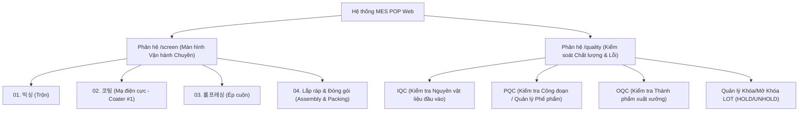
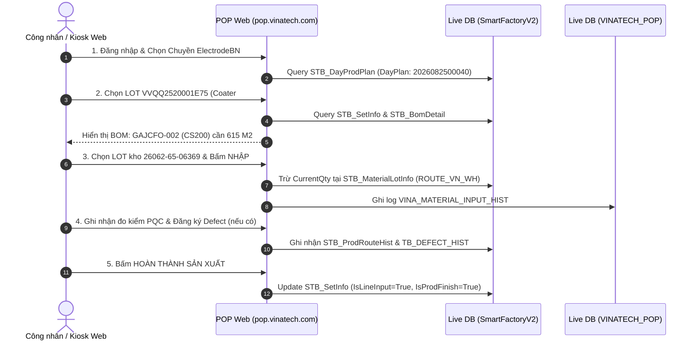

<!--
AI-READY METADATA
Purpose: Tài liệu Đồng hành Đào tạo Hệ thống POP Kiosk, Phân hệ /screen và /quality
Scope: Vinatech MES POP Web System & Quality Operations Training Companion
Single Source of Truth: POP_KNOWLEDGE_BASE/POP_TRAINING_SCREEN_QUALITY.md
Related Files:
  - [POP_USER_MANUAL.md](file:///c:/Users/User%20Vinatech.DESKTOP-RJJSEQU/Desktop/PROCESS/MES_LEGACY_BACKUP/POP_KNOWLEDGE_BASE/POP_USER_MANUAL.md)
  - [DB_06_VINATECH_POP.md](file:///c:/Users/User%20Vinatech.DESKTOP-RJJSEQU/Desktop/PROCESS/MES_LEGACY_BACKUP/DATABASE_KNOWLEDGE_BASE/DB_06_VINATECH_POP.md)
  - [KB_05_01_QC_AND_ELECTRODE_CORE.md](file:///c:/Users/User%20Vinatech.DESKTOP-RJJSEQU/Desktop/PROCESS/MES_LEGACY_BACKUP/MES_MASTER_KNOWLEDGE_BASE/KB_05/KB_05_01_QC_AND_ELECTRODE_CORE.md)
  - [KB_05_02_SCREEN_BUGS_QC.md](file:///c:/Users/User%20Vinatech.DESKTOP-RJJSEQU/Desktop/PROCESS/MES_LEGACY_BACKUP/MES_MASTER_KNOWLEDGE_BASE/KB_05/KB_05_02_SCREEN_BUGS_QC.md)
-->

# 🎓 TÀI LIỆU ĐỒNG HÀNH ĐÀO TẠO MES POP & QUALITY SYSTEM

> **Phiên bản:** v1.0 (Khởi tạo 2026-08-29 trong buổi đào tạo Google Meet)  
> **Tài khoản Đào tạo / Demo:** `User: 92603003` | `Pass: 123456`  
> **Trọng tâm Đào tạo:** Phân hệ Màn hình Vận hành (`/screen`) & Quản lý Chất lượng (`/quality`)

---

## 📌 1. TỔNG QUAN PHẠM VI ĐÀO TẠO

Hệ thống MES POP Web System của Vinatech đóng vai trò là giao diện tương tác trực tiếp của công nhân tại trạm sản xuất (Kiosk) và các bộ phận kiểm soát chất lượng (QC):



---

## ⚡ 2. PHÂN TÍCH CA ĐÀO TẠO THỰC TẾ: CHUYỀN ĐIỆN CỰC BẮC NINH (ĐỐI CHIẾU LIVE DB 100%)

### 2.1 Bối cảnh Màn hình & Bản đồ Dữ liệu Live Database

| Thông tin trên Giao diện Web | Trường Dữ liệu trong CSDL | Bảng CSDL Nguồn | Giá trị Thực tế Live DB |
| :--- | :--- | :--- | :--- |
| **Chuyền sản xuất** | `LineCode`, `WorkCenterCode` | `STB_DayProdPlan` | `ElectrodeBN` (VVT_F1 - Bắc Ninh) |
| **Kế hoạch Ngày (DayPlan)** | `DayPlanNo` | `STB_DayProdPlan` | `2026082500040` (PO: `260825000020`) |
| **LOT hiện tại** | `Barcode`, `ControlNo` | `STB_SetInfo` | Barcode: `VVQQ2520001E75` (ControlNo: `20260829000199`) |
| **Tên sản phẩm LOT** | `MaterialCode` / `MaterialName` | `STB_MaterialMaster` | Mã: `CREHCO85` - *Coatingroll- HCE 200 (SuperP 6%) (-)* |
| **NVL cần nhập theo BOM** | `MaterialCode` / `MaterialName` | `STB_MaterialMaster` | `GAJCFO-002` (Tên hiển thị: `CS200`, Loại: `ROH`) |
| **NVL thay thế cho phép** | `AltMaterialCode` | `STB_MaterialMaster` | `GAYF00-001` (*20SC01 W: 500mm*) |
| **Kho công đoạn cấp** | `MaterialWarehouseCode` | `STB_MaterialLotInfo`| `ROUTE_VN_WH` (공정창고(베트남)) |
| **LOT NVL đang chọn** | `LotNo`, `MaterialLotNo` | `STB_MaterialLotInfo`| LotNo: `26062-65-06369` (SysLot: `20260730000410`) |
| **Tồn kho LOT đang chọn** | `CurrentQty` | `STB_MaterialLotInfo`| `5839.00 M2` (Khớp 100% UI Web) |

---

## 🔍 3. KIẾN TRÚC VẬN HÀNH & LUỒNG XỬ LÝ DỮ LIỆU ĐIỆN CỰC



---

## 📊 4. PHÂN HỆ VẬN HÀNH `/screen` VÀ KIỂM SOÁT CHẤT LƯỢNG `/quality`

### 4.1 Điểm Kiểm Soát Chất Lượng (Quality Interlocks)

1. **Kiểm tra IQC / Hạn Dùng NVL:**
   - Khi quét chọn LOT `26062-65-06369` từ kho `ROUTE_VN_WH`, hệ thống kiểm tra trường `EndOfLifeDate` và `HoldError` trong bảng `STB_MaterialLotInfo`.
   - Nếu LOT bị `HOLD` hoặc quá hạn sử dụng, hệ thống bật cảnh báo đỏ và khóa nút `NHẬP`.
2. **Kiểm tra Định mức BOM & Mã Thay Thế:**
   - Hệ thống đối chiếu `MaterialCode = 'GAJCFO-002'` theo BOM. Nếu dùng mã phụ `GAYF00-001`, hệ thống kiểm tra bảng liên kết thay thế `STB_MaterialMaster.AltMaterialCode`.
3. **PQC & Thu thập Tham số Thiết bị (Coater #1):**
   - Thiết bị Coater #1 thu thập dữ liệu độ dày lớp mạ, nhiệt độ sấy qua bảng `VINA_EQUIPMENT_SETTING` và `VINA_PLC_BASELINE`.
4. **Xử lý Tái phân loại (Re-sorting) sau PQC:**
   - Nếu phát sinh lỗi công đoạn mạ, LOT được ghi nhận defect nhưng vẫn có thể trích xuất phần màng đạt tiêu chuẩn qua chức năng Re-sorting (tạo LOT con mới và cộng dồn sản lượng đạt).


---

## 🌐 4. KẾT QUẢ XÁC MINH TRỰC TIẾP TRÊN LIVE WEB (https://pop.vinatech.com/)

Đã thực hiện đăng nhập trực tiếp bằng tài khoản `92603003` và rà soát phân hệ `/pop/screen`:

### 4.1 Cấu Trúc Nhà Máy & Dây Chuyền Thực Tế Trên Web

```
https://pop.vinatech.com/
├── 🏢 VINATech VINA Co.,Ltd (Việt Nam)
│   ├── Nhà Máy Bắc Ninh (Chuyền Điện Cực, Trộn, Coater #1, MEA...)
│   └── Nhà Máy Bắc Giang
│
├── 🏢 비나텍(주) (Hàn Quốc)
│   ├── 전주공장 (Jeonju): 전극 1~5 라인, 코팅 1~2 라인, 탄소 1 라인
│   ├── 완주공장 (Wanju): MEA 3/5/7 Layer, MEA 타발, DEV Setup, DMFC, Roll Trans #1
│   ├── 완주2공장 (Wanju 2): AssyLine-01D, F4 전극/포장, Pouch 타발/조립, Slitting, Winding 1~2
│   └── 탄소기술원 (Carbon Institute): SPT Line, SPT Setup
```

### 4.2 Tính Năng Nổi Bật Đã Verify Trên Web `/pop/screen`
1. **Equipment Mapping Modal (`Tap to map equipment`):** Cho phép chọn và gán thiết bị vật lý trực tiếp cho dây chuyền đang vận hành.
2. **Line Search Modal:** Cho phép chuyển đổi linh hoạt giữa các pháp nhân (VINATech VINA / Hàn Quốc) và từng xưởng/chuyền sản xuất mà không cần đăng xuất.
3. **Cơ chế tải Lệnh sản xuất & DayPlan:** Đồng bộ tự động theo thời gian thực với cơ sở dữ liệu MES trung tâm.

---

## 🚀 5. QUY CHUẨN ĐỒNG HÀNH VÀ CẬP NHẬT KHI ĐÀO TẠO

Trong suốt quá trình tham gia đào tạo qua Google Meet:
1. **Khi có màn hình mới:** Chụp ảnh màn hình hoặc gửi mô tả màn hình (`Screen ID` / `Tên màn hình`).
2. **Khi có quy tắc nghiệp vụ mới:** AI sẽ ghi chú vào tài liệu này và đối chiếu với Live Database qua các script an toàn `mes.ps1`.
3. **Khi có thắc mắc kỹ thuật từ giảng viên:** AI hỗ trợ tra cứu nguyên nhân gốc (Root Cause) và câu lệnh kiểm tra ngay trong ca học.

