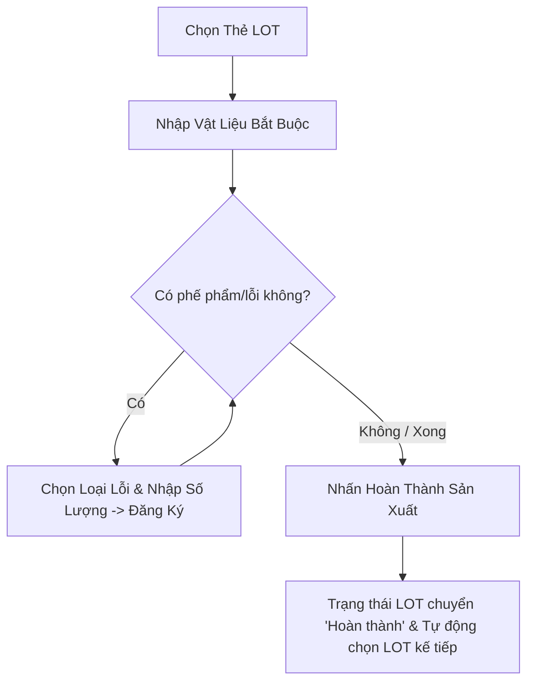
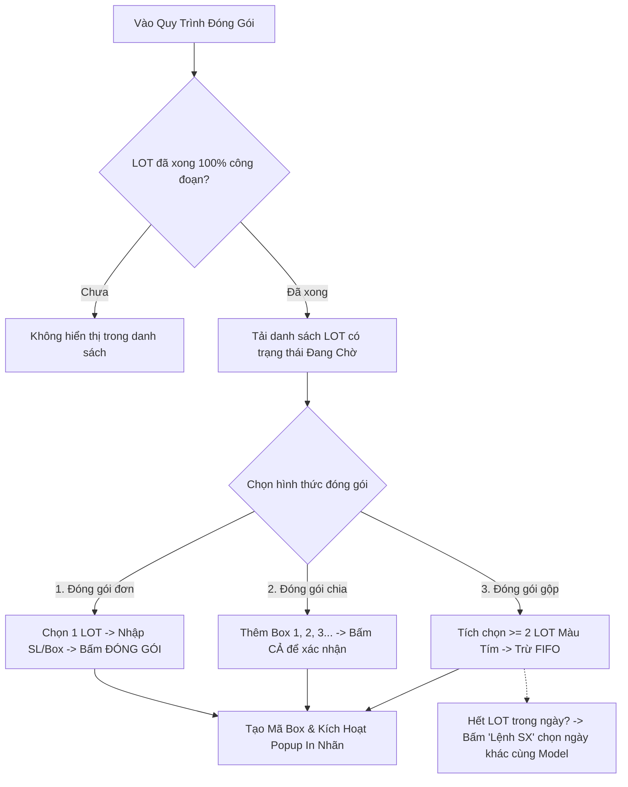
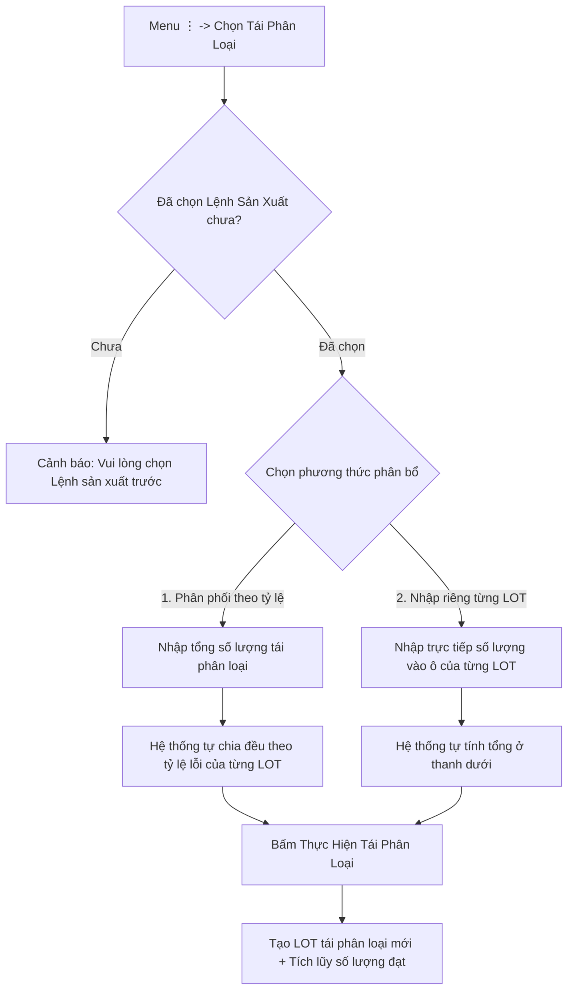
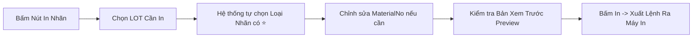
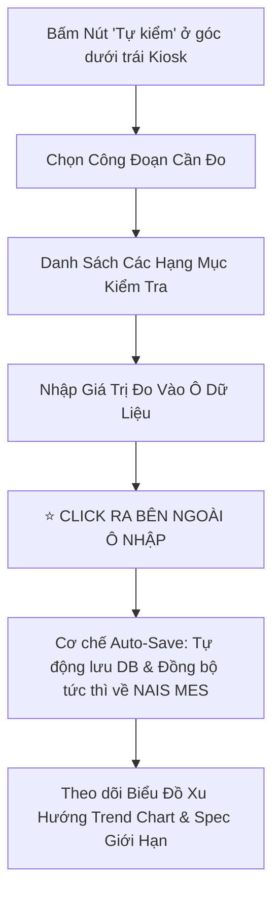

<!--
AI-READY METADATA
Purpose: Cẩm Nang Vận Hành Hệ Thống POP Kiosk Vinatech (Point of Production) Cho Công Nhân & Kỹ Sư
Scope: 100% Giao diện thực tế pop.vinatech.com/pop/screen và pop.vinatech.com/pop/quality
Single Source of Truth: POP_KNOWLEDGE_BASE/POP_USER_MANUAL.md
Authors: Hanbit Kang (Created) | Vietnam DX Team (Modified 2026-09) | Antigravity AI Agent (Integrated)
Source Presentation: POP_KNOWLEDGE_BASE/assets/POP.pptx
Slide Images: POP_KNOWLEDGE_BASE/assets/slides_images/
Related Files:
  - [POP_KB_INDEX.md](file:///c:/Users/User%20Vinatech.DESKTOP-RJJSEQU/Desktop/PROCESS/MES_LEGACY_BACKUP/POP_KNOWLEDGE_BASE/POP_KB_INDEX.md)
  - [POP_SLIDE_DECK_MAPPING_AND_ANALYSIS.md](file:///c:/Users/User%20Vinatech.DESKTOP-RJJSEQU/Desktop/PROCESS/MES_LEGACY_BACKUP/POP_KNOWLEDGE_BASE/POP_SLIDE_DECK_MAPPING_AND_ANALYSIS.md)
  - [POP_KB_02_SCREEN_OPERATIONS.md](file:///c:/Users/User%20Vinatech.DESKTOP-RJJSEQU/Desktop/PROCESS/MES_LEGACY_BACKUP/POP_KNOWLEDGE_BASE/POP_KB_02_SCREEN_OPERATIONS.md)
  - [POP_KB_04_ROLLBACK_AND_SAFETY.md](file:///c:/Users/User%20Vinatech.DESKTOP-RJJSEQU/Desktop/PROCESS/MES_LEGACY_BACKUP/POP_KNOWLEDGE_BASE/POP_KB_04_ROLLBACK_AND_SAFETY.md)
-->

# HƯỚNG DẪN SỬ DỤNG HỆ THỐNG POP KIOSK (POINT OF PRODUCTION)
**Tài liệu hướng dẫn vận hành hệ thống POP dành cho công nhân, chuyền trưởng & kỹ sư vận hành sản xuất**  
*Phiên bản: v2.0 (Cập nhật 2026-09 theo Bộ Slide Đào Tạo Chuẩn DX Team) — Tác giả: Hanbit Kang — Hiệu chỉnh: Vietnam DX Team*  
*Tài liệu gốc: `POP_KNOWLEDGE_BASE/assets/POP.pptx` | URL Hệ thống: `https://pop.vinatech.com/pop/screen`*

---

## 📑 MỤC LỤC CHI TIẾT

1. [Phần 0: Tổng Quan Giao Diện POP Kiosk](#phần-0-tổng-quan-giao-diện-pop-kiosk)
   - [0.1 Bố cục 4 khu vực màn hình Kiosk](#01-bố-cục-4-khu-vực-màn-hình-kiosk)
   - [0.2 Các chức năng chung trên Header](#02-các-chức-năng-chung-trên-header)
2. [Phần 1: Bắt Đầu Ca Làm Việc](#phần-1-bắt-đầu-ca-làm-việc)
   - [1.1 Chọn Công Nhân (Đăng nhập thủ công & Quét mã QR)](#11-chọn-công-nhân-đăng-nhập-thủ-công--quét-mã-qr)
   - [1.2 Chọn Dây Chuyền Sản Xuất](#12-chọn-dây-chuyền-sản-xuất)
   - [1.3 Chọn Ngày Làm Việc (Lịch Sản Xuất)](#13-chọn-ngày-làm-việc-lịch-sản-xuất)
   - [1.4 Chọn Lệnh Sản Xuất (Work Order / DayPlan)](#14-chọn-lệnh-sản-xuất-work-order--dayplan)
   - [1.5 Menu Quy Trình & Danh Sách Thẻ LOT](#15-menu-quy-trình--danh-sách-thẻ-lot)
3. [Phần 2: Quy Trình Thao Tác Thủ Công (Manual Process)](#phần-2-quy-trình-thao-tác-thủ-công-manual-process)
   - [2.1 Bố cục màn hình thao tác thủ công](#21-bố-cục-màn-hình-thao-tác-thủ-công)
   - [2.2 Chọn thẻ LOT làm việc (Scan Barcode vs Chọn theo Lịch)](#22-chọn-thẻ-lot-làm-việc-scan-barcode-vs-chọn-theo-lịch)
   - [2.3 Nhập Vật Liệu (Material Input) — Bắt buộc](#23-nhập-vật-liệu-material-input--bắt-buộc)
     - [2.3.1 Tính năng Nút "Lượng kiến cấp" (Auto-Fill BOM)](#231-tính-năng-nút-lượng-kiến-cấp-auto-fill-bom)
     - [2.3.2 Tính năng Nút "Tồn kho" (Tra cứu đích danh LOT NVL)](#232-tính-năng-nút-tồn-kho-tra-cứu-đích-danh-lot-nvl)
   - [2.4 Đăng Ký Phế Phẩm / Lỗi (Defect Registration)](#24-đăng-ký-phế-phẩm--lỗi-defect-registration)
   - [2.5 Hoàn Thành Đăng Ký Sản Xuất](#25-hoàn-thành-đăng-ký-sản-xuất)
   - [2.6 Menu Mở Rộng (Nút ⋮) & Kiểm Tra Định Mức BOM](#26-menu-mở-rộng-nút--và-kiểm-tra-định-mức-bom)
   - [2.7 ⭐ Nhập Mã Marking tại Công Đoạn Bọc Vỏ (Curling / Marking)](#27--nhập-mã-marking-tại-công-đoạn-bọc-vỏ-curling--marking)
4. [Phần 3: Đóng Gói & Đóng Gói Gộp (Packing & Merge Packing)](#phần-3-đóng-gói--đóng-gói-gộp-packing--merge-packing)
   - [3.1 Vào quy trình đóng gói & Điều kiện hoàn thành](#31-vào-quy-trình-đóng-gói--điều-kiện-hoàn-thành)
   - [3.2 Ba (03) Kiểu Đóng Gói Chuẩn Hóa](#32-ba-03-kiểu-đóng-gói-chuẩn-hóa)
     - [3.2.1 Kiểu 1: Đóng gói đơn (Single Pack)](#321-kiểu-1-đóng-gói-đơn-single-pack)
     - [3.2.2 Kiểu 2: Đóng gói chia nhiều Box (Split Pack)](#322-kiểu-2-đóng-gói-chia-nhiều-box-split-pack)
     - [3.2.3 Kiểu 3: Đóng gói gộp nhiều LOT (Merge Pack) & Gộp khác ngày](#323-kiểu-3-đóng-gói-gộp-nhiều-lot-merge-pack--gộp-khác-ngày)
   - [3.3 In Nhãn Sau Đóng Gói (Nhãn LOT & Nhãn Box)](#33-in-nhãn-sau-đóng-gói-nhãn-lot--nhãn-box)
   - [3.4 ⭐ Lịch Sử Đóng Gói — In Lại Nhãn & HỦY ĐÓNG GÓI (UI Rollback)](#34--lịch-sử-đóng-gói--in-lại-nhãn--hủy-đóng-gói-ui-rollback)
5. [Phần 4: Tái Phân Loại (Re-sorting)](#phần-4-tái-phân-loại-re-sorting)
   - [4.1 Mục đích & Điều kiện truy cập](#41-mục-đích--điều-kiện-truy-cập)
   - [4.2 Tái phân loại tự động phân phối theo tỷ lệ](#42-tái-phân-loại-tự-động-phân-phối-theo-tỷ-lệ)
   - [4.3 Tái phân loại nhập riêng từng LOT](#43-tái-phân-loại-nhập-riêng-từng-lot)
6. [Phần 5: In Nhãn Tem Mã Vạch (Label Printing)](#phần-5-in-nhãn-tem-mã-vạch-label-printing)
   - [5.1 Truy cập màn hình in nhãn](#51-truy-cập-màn-hình-in-nhãn)
   - [5.2 Chọn LOT & Đề xuất nhãn phù hợp ⭐](#52-chọn-lot--đề-xuất-nhãn-phù-hợp-)
   - [5.3 Chỉnh sửa MaterialNo & Thực hiện in](#53-chỉnh-sửa-materialno--thực-hiện-in)
7. [Phần 6: Hạng Mục Kiểm Tra Thường Xuyên (In-Line QC / Tự Kiểm Tại Chuyền)](#phần-6-hạng-mục-kiểm-tra-thường-xuyên-in-line-qc--tự-kiểm-tại-chuyền)
   - [6.1 Truy cập chức năng Tự kiểm (`#btnSelfInspection`)](#61-truy-cập-chức-năng-tự-kiểm-btnselfinspection)
   - [6.2 ⭐ Bố cục màn hình kiểm tra & Cơ chế Auto-Save on Blur](#62--bố-cục-màn-hình-kiểm-tra--cơ-chế-auto-save-on-blur)
   - [6.3 Quản lý mẫu đo `[+]`, Spec giới hạn & Biểu đồ xu hướng](#63-quản-lý-mẫu-đo--spec-giới-hạn--biểu-đồ-xu-hướng)
8. [Tóm Tắt Các Điểm Lưu Ý Vận Hành Quan Trọng](#tóm-tắt-các-điểm-lưu-ý-vận-hành-quan-trọng)

---

## PHẦN 0: TỔNG QUAN GIAO DIỆN POP KIOSK

Màn hình POP (Point of Production) được thiết kế tối ưu hóa cho màn hình cảm ứng Kiosk tại các trạm sản xuất của Vinatech, giúp công nhân thao tác chính xác, trực quan mà không cần bàn phím chuột truyền thống.

```
+-----------------------------------------------------------------------------------------+
| [1] HEADER: [Tên Công Ty] | Ngày Giờ Thực | [Dây Chuyền] | [Tên Công Nhân] | Nút (↻)    |
+-------------------+---------------------------------------------------------------------+
| [2] MENU QUY TRÌNH| [3] THANH TRẠNG THÁI THIẾT BỊ (Equipment Chip Bar)                  |
|   - Công đoạn 1   +---------------------------------------------------------------------+
|   - Công đoạn 2   |                                                                     |
|   - ...           | [4] KHU VỰC LÀM VIỆC CHÍNH (Main Work Area)                         |
|   - Lắp ráp       |     - Danh sách LOT thẻ (Card View)                                 |
|   - Đóng gói      |     - Chi tiết tiến độ / Bàn phím số cảm ứng                        |
|   - Tự kiểm       |     - Bảng nhập vật tư / Đăng ký lỗi                                |
|                   |                                                                     |
+-------------------+---------------------------------------------------------------------+
| Chuyển đổi ngôn ngữ [KO | EN | VI]                          Công tắc Chế độ Tối/Sáng 🌓 |
+-----------------------------------------------------------------------------------------+
```

### 0.1 Bố cục 4 khu vực màn hình Kiosk
*(Tham chiếu Slide 08 — `image21.png`)*

1. **Header (Thanh tiêu đề phía trên):** Hiển thị thông tin phiên làm việc gồm: Ngày/giờ thực tế, Tên Dây chuyền hiện tại, Tên Công nhân đang đăng nhập, và Nút làm mới dữ liệu.
2. **Menu Quy trình (Process Menu bên trái):** Liệt kê toàn bộ các công đoạn sản xuất của dây chuyền hiện tại theo đúng thứ tự chu trình. Chạm vào từng công đoạn để chuyển đổi giao diện tương ứng.
3. **Thanh trạng thái thiết bị (Equipment Chip Bar):** Hiển thị trạng thái kết nối phần cứng của các thiết bị được kết nối với Kiosk:
   - 🟢 **Bình thường (Normal):** Thiết bị đang kết nối ổn định.
   - 🟡 **Trì hoãn (Delayed):** Tín hiệu truyền nhận dữ liệu chậm.
   - 🔴 **Mất kết nối (Disconnected):** Mất tín hiệu với máy móc/cân/đầu đọc mã vạch.
4. **Khu vực Chính (Main Work Area):** Không gian thao tác nghiệp vụ, nội dung sẽ thay đổi linh hoạt theo công đoạn được lựa chọn ở Menu bên trái.
5. **Thanh chân trang (Footer):** Phía dưới cùng của màn hình là nút bật/tắt Bàn phím ảo, chuyển đổi nhanh **Đa ngôn ngữ** (`KO` - Tiếng Hàn / `EN` - Tiếng Anh / `VI` - Tiếng Việt) và công tắc chuyển đổi **Giao diện Tối/Sáng (Dark/Light mode)**.

---

### 0.2 Các chức năng chung trên Header
*(Tham chiếu Slide 09 — `image11.png`)*

* **Ngày và Giờ (Realtime Date & Time):** Cập nhật liên tục theo thời gian thực của máy chủ hệ thống.
* **Tên Công Nhân (Worker Name):** Chạm trực tiếp vào tên Công nhân để mở popup đổi người thao tác.
* **Tên Dây Chuyền (Line Name):** Chạm trực tiếp vào tên Dây chuyền để mở cây phân cấp đổi sang dây chuyền sản xuất khác.
  > [!WARNING]
  > Việc đổi dây chuyền sản xuất khi đang tải dở lệnh sản xuất sẽ **đặt lại (reset) toàn bộ dữ liệu phiên làm việc hiện tại**.
* **Nút Tải lại (↻ - Refresh):** Nằm ở góc phải trên cùng của Header, dùng để xóa bộ nhớ đệm và tải lại trạng thái mới nhất từ cơ sở dữ liệu MES.

---

## PHẦN 1: BẮT ĐẦU CA LÀM VIỆC


### 1.1 Chọn Công Nhân (Đăng nhập thủ công & Quét mã QR)
*(Tham chiếu Slide 11, 12 — `image4.png`)*

Trước khi bắt đầu bất kỳ thao tác nào trên Kiosk, công nhân phải đăng ký thông tin người vận hành:
1. **Chuyển đổi Công ty:** Chọn Trụ sở chính (Vinatech) hoặc Chi nhánh nhà máy tương ứng.
2. **Chọn Phòng ban:** Chạm chọn phòng ban trực thuộc tại cây danh mục bên trái.
3. **Chọn Nhân viên:** Chạm chọn thẻ tên nhân viên của mình ở danh sách bên phải.
4. **Xác nhận:** Tên công nhân sẽ ngay lập tức hiển thị trên thanh Header.

> [!TIP]
> **Đăng nhập siêu tốc bằng mã QR:** Nếu có thẻ nhân viên in mã QR/Barcode, công nhân chỉ cần đưa thẻ vào đầu đọc mã vạch để đăng nhập ngay lập tức mà không cần tìm kiếm thủ công.

---

### 1.2 Chọn Dây Chuyền Sản Xuất
1. **Chọn Nơi làm việc (WorkCenter):** Chọn xưởng hoặc khu vực làm việc từ danh sách bên trái.
2. **Chọn Dây chuyền (Line):** Chọn tên dây chuyền mà bạn đang đứng máy từ danh sách bên phải.
3. **Xác nhận:** Tên dây chuyền được gán thành công sẽ hiển thị trên Header.

---

### 1.3 Chọn Ngày Làm Việc (Lịch Sản Xuất)
*(Tham chiếu Slide 13 — `image10.png`)*

1. **Điều hướng Tháng:** Dùng nút `◀` hoặc `▶` để chuyển đổi qua lại giữa các tháng.
2. **Chọn Ngày:** Chạm vào ngày cần sản xuất. *Hệ thống tự động chọn mặc định là ngày hôm nay.*
3. **Tóm tắt Sản lượng:** Dưới lịch sẽ hiển thị tổng số lượng **Kế hoạch (Plan)** / **Đạt (Good)** / **Lỗi (Defect)** của ngày đã chọn.
4. **Số lượng Lệnh:** Con số nhỏ hiển thị phía dưới mỗi ô ngày thể hiện số lượng lệnh sản xuất (DayPlan) có trong ngày đó.

---

### 1.4 Chọn Lệnh Sản Xuất (Work Order / DayPlan)
*(Tham chiếu Slide 14 — `image23.png`)*

Khi chọn một ngày, danh sách các Lệnh sản xuất sẽ hiển thị:
1. **Số Lệnh Sản Xuất (Work Order No):** Mã DayPlan duy nhất của đợt sản xuất.
2. **Thông tin Sản phẩm:** Kiểm tra chính xác Mã sản phẩm (Item Code) và Tên sản phẩm (Item Name).
3. **Kiểm tra Số lượng:** Xác nhận số lượng kế hoạch và tổng số lượng LOT cần chạy.
4. **Chọn dòng:** Chạm vào dòng lệnh sản xuất để hệ thống tự động tải toàn bộ danh sách LOT con.

> [!TIP]
> **Quét mã vạch tự động tải lệnh:** Công nhân có thể quét trực tiếp mã vạch trên phiếu LOT bằng đầu đọc scanner; hệ thống sẽ tự động tìm kiếm, chọn và tải đúng Lệnh sản xuất tương ứng.

---

### 1.5 Menu Quy Trình & Danh Sách Thẻ LOT
*(Tham chiếu Slide 15 — `image42.png`)*

1. **Menu Quy trình:** Chuỗi các công đoạn sản xuất của dây chuyền hiển thị ở cột bên trái; công đoạn đang làm việc sẽ được tô sáng (Active).
2. **Thẻ LOT (LOT Cards):** Toàn bộ các LOT thuộc Lệnh sản xuất đã chọn hiển thị trực quan dạng thẻ.
3. **Huy hiệu Trạng thái (Status Badge):**
   - ⏳ `Chờ nhập vật liệu` (Material Waiting)
   - ⚙️ `Đang tiến hành` (In Progress)
   - ✅ `Hoàn thành` (Completed)
4. **Chọn LOT:** Chạm vào thẻ LOT để hiển thị bảng thông tin chi tiết và bàn phím thao tác ở khu vực bên phải.

---

## PHẦN 2: QUY TRÌNH THAO TÁC THỦ CÔNG (MANUAL PROCESS)

Dành cho các công đoạn sản xuất lắp ráp thủ công hoặc bán tự động.



### 2.1 Bố cục màn hình thao tác thủ công
*(Tham chiếu Slide 17 — `image9.png`)*

Màn hình được chia làm 3 khu vực chức năng chính:
- **Khu vực 1 (Trái):** Danh sách các thẻ LOT của Lệnh sản xuất kèm thanh tiến độ.
- **Khu vực 2 (Phải - Giữa):** Bảng chi tiết LOT hiện tại + Bàn phím số cảm ứng để nhập số lượng lỗi.
- **Khu vực 3 (Dưới cùng):** Bộ 3 nút điều khiển chính:
  - 🟠 **Nhập vật liệu (Material Input)**
  - 🟢 **Loại lỗi (Defect Type)** / 🔵 **Đăng ký lỗi (Register)**
  - 🟣 **Hoàn thành sản xuất (Complete Production)**

---

### 2.2 Chọn thẻ LOT làm việc (Scan Barcode vs Chọn theo Lịch)
*(Tham chiếu Slide 18, 19, 20 — `image12.png`, `image2.png`, `image8.png`)*

Có 2 phương thức chọn LOT làm việc:
* **Cách 1: Scan Barcode trực tiếp (Slide 19):** Quét trực tiếp Barcode từ tem dán trên khay/xe cấp phát vật tư bằng máy đọc barcode -> Popup hiển thị thông tin LOT và số lượng -> Nhấn nút **"Thêm"**.
* **Cách 2: Chọn theo Kế hoạch Ngày (Slide 20):**
  1. Click vào vùng bên dưới của thẻ LOT hiện tại.
  2. Chọn ngày làm việc trên lịch sản xuất.
  3. Danh sách các Lệnh sản xuất trong ngày hiển thị ở cột bên phải -> Chọn LSX cần thực hiện.
  4. Nhấn nút **"Thêm"** để nạp danh sách LOT.

---

### 2.3 Nhập Vật Liệu (Material Input) — Bắt buộc
*(Tham chiếu Slide 21, 22, 23 — `image27.png`, `image34.png`, `image15.png`)*

> [!IMPORTANT]
> **Quy tắc bắt buộc:** Công nhân PHẢI nhập đầy đủ vật liệu đầu vào trước khi hoàn thành LOT. Nút **"Đăng ký"** và **"Hoàn thành sản xuất"** sẽ bị KHÓA (Disabled) nếu chưa nạp đủ vật liệu!
> Nút **"Nhập vật liệu"** màu cam ở góc dưới phải hiển thị tiến độ dạng phân số, ví dụ `(0/6)` (đã nạp 0/6 loại NVL theo BOM).

#### 2.3.1 Tính năng Nút "Lượng kiến cấp" (Auto-Fill BOM)
*(Tham chiếu Slide 22 — `image34.png`)*

1. Chọn LOT mục tiêu cần nạp vật liệu.
2. Trên màn hình Chi tiết nhập vật liệu, hệ thống chia thành 2 tab:
   - Tab **"Nhập thủ công"**: Danh sách các NVL chưa được cấp phát.
   - Tab **"Tự động/Hoàn thành"**: Danh sách các NVL đã được nạp đủ.
3. **Bấm Nút "Lượng kiến cấp":** Hệ thống sẽ **tự động tính toán và điền đủ 100% số lượng cần thiết theo định mức BOM**, giúp công nhân không phải gõ số lẻ thập phân thủ công.
4. Nếu trạm có kết nối Cân điện tử, số lượng/khối lượng sẽ tự động đọc từ cân khi đặt vật tư lên bàn cân.

#### 2.3.2 Tính năng Nút "Tồn kho" (Tra cứu đích danh LOT NVL)
*(Tham chiếu Slide 23 — `image15.png`)*

Áp dụng khi cần chỉ định chính xác mã LOT NVL xuất từ kho công đoạn:
1. Nhấn nút **"Tồn kho"** trên màn hình nhập vật liệu.
2. Nhập mã LOT NVL cần cấp vào ô tìm kiếm **"Tìm LOT"**.
3. Danh sách các cuộn/thùng LOT NVL trong kho công đoạn (`ROUTE_VN_WH`) hiển thị kèm số lượng tồn kho thực tế (`CurrentQty`).
4. Chạm chọn LOT mong muốn, nhập số lượng xuất dùng và bấm **Lưu**.

---

### 2.4 Đăng Ký Phế Phẩm / Lỗi (Defect Registration)
*(Tham chiếu Slide 24, 25, 26 — `image32.png`, `image29.png`, `image30.png`)*

Khi phát sinh sản phẩm lỗi trong quá trình gia công:
1. **Chọn Loại lỗi:** Chạm nút xanh lá **"LOẠI LỖI"** ở góc dưới phải -> Bảng danh sách mã lỗi xuất hiện -> Chạm chọn loại lỗi phù hợp.
2. **Nhập Số lượng lỗi:** Dùng bàn phím số Numpad cảm ứng để nhập số lượng phế phẩm phát sinh.
3. **Đăng ký:** Chạm nút **"ĐĂNG KÝ"** (Register).
   - Hệ thống ghi nhận số lượng lỗi vào cơ sở dữ liệu `SmartFactoryV2.dbo.STB_ProdRouteHist`.
   - Bàn phím số tự động đặt lại về `0` để sẵn sàng cho lần ghi nhận tiếp theo.

---

### 2.5 Hoàn Thành Đăng Ký Sản Xuất
*(Tham chiếu Slide 27 — `image16.png`)*

1. Sau khi đã nạp đủ vật liệu và đăng ký phế phẩm (nếu có), chạm nút tím **"HOÀN THÀNH SẢN XUẤT"**.
2. **Popup xác nhận:** Hiển thị thông tin kiểm tra lần cuối: Công đoạn, Tên công nhân, Số lượng đạt (Good Qty), Số lượng lỗi (Defect Qty), Thời gian gia công, Danh sách thiết bị kết nối.
3. **Xác nhận hoàn tất:**
   - Trạng thái LOT chuyển thành **`Hoàn thành` (Completed)**.
   - Hệ thống tự động chuyển vùng chọn sang LOT kế tiếp trong danh sách.

---

### 2.6 Menu Mở Rộng (Nút ⋮) & Kiểm Tra Định Mức BOM
*(Tham chiếu Slide 28, 30 — `image37.png`, `image36.png`)*

* **Menu Thêm (Nút `⋮`):** Nằm ở góc dưới cùng bên phải màn hình thủ công. Chạm vào để mở chức năng **Tái phân loại (Re-sorting)** nhằm thu hồi sản phẩm đạt từ các LOT có phế phẩm.
* **Kiểm Tra BOM (Nút "Xem BOM"):** Nằm ở góc trên bên phải của danh sách LOT. Cho phép tra cứu nhanh toàn bộ Bảng kê vật liệu (BOM) của Lệnh sản xuất (gồm Mã vật tư, Tên vật liệu, Định mức yêu cầu, Đơn vị tính và Nhà cung cấp).

---

### 2.7 ⭐ Nhập Mã Marking tại Công Đoạn Bọc Vỏ (Curling / Marking)
*(Tham chiếu Slide 29 — `image35.png` — TÍNH NĂNG ĐẶC BIỆT MỚI)*

> [!IMPORTANT]
> Tại công đoạn **Bọc Vỏ (Curling / Marking)**, hệ thống bắt buộc phải liên kết mã Marking khắc trên thân lon trước khi hoàn thành công đoạn.

1. **Vị trí nút:** Trên giao diện công đoạn Bọc Vỏ, nút **"Mã marking"** nằm ở **góc trên bên phải màn hình, ngay cạnh biểu tượng In nhãn**.
2. **Thao tác:** Chạm vào nút **"Mã marking"** -> Popup nhập mã marking hiển thị.
3. **Nhập liệu:** Công nhân dùng máy quét mã vạch hoặc bàn phím để nhập chuỗi ký tự Marking trên thân vỏ.
4. **Lưu kết quả:** Chạm nút **"Lưu lại"** để hệ thống ghi nhận mã Marking vào bản ghi LOT.

---

## PHẦN 3: ĐÓNG GÓI & ĐÓNG GÓI GỘP (PACKING & MERGE PACKING)

Công đoạn đóng gói thành phẩm vào thùng (Box) và in tem nhãn dán Box/LOT.



### 3.1 Vào quy trình đóng gói & Điều kiện hoàn thành
*(Tham chiếu Slide 32 — `image39.png`)*

- Chạm vào mục **"Đóng gói"** trên Menu quy trình bên trái.
- **Điều kiện hiển thị:** **Chỉ những LOT đã hoàn thành 100% tất cả các công đoạn sản xuất trước đó** mới được phép hiển thị trên màn hình đóng gói với trạng thái **"Đang Chờ"**.

---

### 3.2 Ba (03) Kiểu Đóng Gói Chuẩn Hóa
*(Tham chiếu Slide 33, 34, 35, 36, 37 — `image38.png`, `image22.png`, `image24.png`, `image49.png`, `image25.png`)*

Hệ thống POP hỗ trợ 3 kiểu đóng gói linh hoạt:

#### 3.2.1 Kiểu 1: Đóng gói đơn (Single Pack)
*(Tham chiếu Slide 34 — `image22.png`)*

Áp dụng khi đóng gói toàn bộ số lượng của 1 LOT vào đúng 1 thùng duy nhất:
1. Chạm chọn LOT cần đóng gói trong danh sách bên trái (trạng thái *Đang Chờ*).
2. Nhập số lượng đóng gói (VD: `1 BOX x 5,980 = 5,980 EA`).
3. Chạm nút **"ĐÓNG GÓI"** để xác nhận xuất Box.

#### 3.2.2 Kiểu 2: Đóng gói chia nhiều Box (Split Pack)
*(Tham chiếu Slide 35 — `image24.png`)*

Áp dụng khi số lượng của 1 LOT lớn và cần chia thành nhiều thùng tiêu chuẩn:
1. Chạm chọn LOT cần đóng gói.
2. Nhập số lượng đóng gói cho từng Box:
   - *Ví dụ:* Box 1: 1,500 EA | Box 2: 1,500 EA | Box 3: 1,500 EA | Box 4: 1,480 EA = Tổng 5,980 EA.
3. **Thêm / Bớt Box:**
   - Chạm nút **"Thêm hộp"** nếu muốn chia thêm thùng mới.
   - Chạm dấu **`X`** màu đỏ bên cạnh Box để xóa bớt thùng dư thừa.
4. Chạm nút **"Đóng gói"** -> Chọn **"Cả" (All)** để hoàn tất đóng gói toàn bộ các Box cùng lúc.

#### 3.2.3 Kiểu 3: Đóng gói gộp nhiều LOT (Merge Pack) & Gộp khác ngày
*(Tham chiếu Slide 36, 37 — `image49.png`, `image25.png`)*

Áp dụng khi một LOT không đủ số lượng làm tròn thùng quy cách và cần gộp thêm từ các LOT lẻ khác:
- *Ví dụ:* LOT chính có 5,980 EA, quy cách thùng là 6,000 EA -> Cần gộp thêm 20 EA từ 1 LOT phụ khác.
1. Chạm chọn LOT chính và các LOT phụ cần gộp. **Các LOT được chọn sẽ chuyển sang Màu Tím**.
2. Nhập số lượng đóng gói thùng quy cách (VD: `6,000 EA`).
3. **Nguyên tắc trừ số lượng FIFO:** Hệ thống tự động trừ hết 5,980 EA của LOT chính, sau đó trừ tiếp 20 EA từ LOT phụ (LOT phụ còn dư 1,480 EA).
4. **Trường hợp gộp LOT khác ngày (Slide 37):** Nếu các LOT trong kế hoạch ngày hôm đó đã hết:
   - Chạm vào nút **"Lệnh SX"**.
   - Chọn Kế hoạch sản xuất của ngày khác.
   - **LƯU Ý BẮT BUỘC:** Kế hoạch được chọn **phải cùng Model sản phẩm** với các LOT cần gộp!
   - Sau đó chọn các LOT và đóng gói bình thường.

---

### 3.3 In Nhãn Sau Đóng Gói (Nhãn LOT & Nhãn Box)
*(Tham chiếu Slide 38 — `image26.png`)*

Ngay sau khi đóng gói thành công, popup in nhãn sẽ xuất hiện:
1. **Chuyển đổi Tab xem trước:** Xem trước nội dung của `Nhãn LOT` và `Nhãn Box` trên 2 tab riêng biệt.
2. **Lựa chọn loại nhãn:** Sử dụng hộp kiểm checkbox để chọn in nhãn LOT, nhãn Box hoặc cả hai.
3. **Điều chỉnh số bản in:** Tăng/giảm số lượng bản in bằng nút `−` / `+`.
4. **Bấm In:** Chạm nút **"In"** để gửi lệnh in ra máy in mã vạch.

---

### 3.4 ⭐ Lịch Sử Đóng Gói — In Lại Nhãn & HỦY ĐÓNG GÓI (UI Rollback)
*(Tham chiếu Slide 39 — `image28.png` — CƠ CHẾ HOÀN TÁC CHÍNH THỨC)*

> [!TIP]
> **Khả năng Rollback 100% trên UI:** Công nhân có thể in lại tem hoặc **HỦY HOÀN TOÀN** thao tác đóng gói bị nhầm lẫn trực tiếp trên giao diện Kiosk mà không cần can thiệp IT.

1. **Mở Lịch sử:** Chạm vào nút **"Lịch sử"** ở góc dưới màn hình đóng gói -> Hộp thoại danh sách Box đã đóng gói hiển thị.
2. **Thông tin hiển thị:** Mã Box ID, Số lượng, Thời gian đóng gói và Tên công nhân thực hiện.
3. **In lại nhãn (Reprint):** Chạm vào nút **"In"** trên bất kỳ Box nào để in lại tem dán.
4. **HỦY ĐÓNG GÓI TỪNG BOX:**
   - Chạm vào nút **"Hủy"** trên dòng Box cần hủy.
   - Popup xác nhận số lượng hiển thị -> Bấm xác nhận -> **Hệ thống hủy mã Box và KHÔI PHỤC NGAY LẬP TỨC số lượng sản phẩm về lại LOT gốc (trạng thái Đang Chờ)**.
5. **HỦY TẤT CẢ (Cancel All Boxes):**
   - Chạm vào nút **"Hủy tất cả"** ở góc trên hộp thoại để hủy toàn bộ các Box đã đóng của Lệnh sản xuất.

---

## PHẦN 4: TÁI PHÂN LOẠI (RE-SORTING)

Dùng để thu hồi và trích xuất lại các sản phẩm đạt tiêu chuẩn từ các LOT bị ghi nhận phế phẩm/lỗi sau khi được kiểm tra lại.



### 4.1 Mục đích & Điều kiện truy cập
*(Tham chiếu Slide 41 — `image33.png`)*

- **Truy cập:** Chạm vào menu **`⋮`** ở góc dưới phải màn hình thủ công -> Chọn **"Tái phân loại"**.
- **Điều kiện bắt buộc:** Phải chọn Lệnh sản xuất trước khi vào. Nếu chưa chọn, hệ thống cảnh báo: *"Vui lòng chọn lệnh sản xuất trước"*.

---

### 4.2 Tái phân loại tự động phân phối theo tỷ lệ
*(Tham chiếu Slide 42 — `image41.png`)*

1. Nhập tổng số lượng sản phẩm đạt cần trích xuất vào ô **"Số lượng tái phân loại"**.
2. Hệ thống tự động phân bổ tỷ lệ trừ vào số lượng lỗi còn lại của từng LOT:
   - *Ví dụ:* LOT 1 có 20 lỗi, LOT 2 có 10 lỗi. Nhập số lượng tái phân loại: 30 EA -> Hệ thống tự động chia LOT 1 trừ 20, LOT 2 trừ 10.
3. Kiểm tra kết quả trên bản xem trước và chạm nút **"Thực hiện tái phân loại"**.

---

### 4.3 Tái phân loại nhập riêng từng LOT
*(Tham chiếu Slide 43 — `image50.png`)*

1. Nhập số lượng cụ thể trực tiếp vào ô nhập liệu của từng dòng LOT tương ứng.
2. Tổng số lượng trừ sẽ tự động được cộng dồn và hiển thị ở phía dưới.
3. Chạm nút **"Thực hiện tái phân loại"** để lưu kết quả.

> [!NOTE]
> Sau khi hoàn tất, một **LOT Tái phân loại mới** sẽ được tạo ra và số lượng đạt được tích lũy vào kết quả sản xuất. Số lượng lỗi trên LOT gốc không bị xóa mất mà được lưu giữ đầy đủ trong lịch sử phục vụ truy xuất nguồn gốc.

---

## PHẦN 5: IN NHÃN TEM MÃ VẠCH (LABEL PRINTING)

Dùng để in tem nhãn dán lên LOT sản phẩm hoặc thùng thành phẩm.



### 5.1 Truy cập màn hình in nhãn
*(Tham chiếu Slide 45 — `image45.png`)*

- Chạm nút **"In Nhãn"** ở góc trên bên phải màn hình Lắp ráp hoặc dưới màn hình Đóng gói.
- Popup in nhãn chuyên dụng sẽ xuất hiện.

---

### 5.2 Chọn LOT & Đề xuất nhãn phù hợp ⭐
*(Tham chiếu Slide 46 — `image51.png`)*

1. **Chọn LOT:** Chạm chọn các LOT cần in (có thể chọn nhiều LOT hoặc bấm nút **"Chọn tất cả"**).
2. **Loại Nhãn Tối Ưu:** Hệ thống tự động đề xuất loại nhãn tương thích nhất với sản phẩm (được đánh dấu sao ⭐).
3. **Thông số Nhãn:** Định dạng kích thước tem được tự động áp dụng (ví dụ: `83mm x 49mm`).

---

### 5.3 Chỉnh sửa MaterialNo & Thực hiện in
*(Tham chiếu Slide 46, 47 — `image51.png`, `image43.png`)*

1. **Chỉnh sửa tên vật tư:** Công nhân có thể chỉnh sửa lại trường `MaterialNo` (tên/mã hiển thị trên tem) ngay trên giao diện nếu có yêu cầu đặc biệt trước khi in.
2. **Bản xem trước (Preview):** Xem trước trực quan hình dạng thực tế của tem in trước khi xuất lệnh.
3. **Thực hiện in:** Chạm nút **"In"** để gửi dữ liệu ra máy in mã vạch.
4. **In lại không giới hạn:** Công nhân có thể in lại cùng một nhãn bất kỳ lúc nào nếu tem bị rách hoặc mờ.

---

## PHẦN 6: HẠNG MỤC KIỂM TRA THƯỜNG XUYÊN (IN-LINE QC / TỰ KIỂM TẠI CHUYỀN)
*(Tham chiếu Slide 48, 49, 50 — `image44.png`, `image46.png`, `image47.png` — PHÂN HỆ QUAN TRỌNG MỚI)*

Phân hệ **Kiểm tra thường xuyên (Tự kiểm)** cho phép công nhân đo kiểm xác suất chất lượng (In-Line Quality Control) định kỳ ngay tại trạm sản xuất bằng các dụng cụ đo (thước kẹp Caliper, panme Micrometer, cân Scale, máy đo điện áp...).



### 6.1 Truy cập chức năng Tự kiểm (`#btnSelfInspection`)
*(Tham chiếu Slide 49 — `image46.png`)*

- Để vào phân hệ kiểm tra chất lượng tại chuyền, chạm vào nút **"Tự kiểm"** nằm ở **góc dưới cùng bên trái màn hình Kiosk**.
- Đường dẫn hệ thống tương ứng: `https://pop.vinatech.com/pop/quality/self`.

---

### 6.2 ⭐ Bố cục màn hình kiểm tra & Cơ chế Auto-Save on Blur
*(Tham chiếu Slide 50 — `image47.png`)*

Giao diện tự kiểm bao gồm 5 vùng chức năng chính:
1. **Nút Quay lại:** Chạm để quay trở lại giao diện sản xuất chính của Kiosk.
2. **Bộ chuyển đổi Công đoạn:** Cho phép chuyển đổi linh hoạt giữa các công đoạn của dây chuyền để nhập các hạng mục kiểm tra tương ứng.
3. **Danh sách Hạng mục kiểm tra:** Liệt kê toàn bộ các chỉ tiêu chất lượng cần đo kiểm của công đoạn (ví dụ: Chiều dài, Chiều rộng, Độ dày, Khối lượng, Nội trở, Điện áp...).
4. **Ô nhập Giá trị đo & CƠ CHẾ AUTO-SAVE ON BLUR:**
   > [!IMPORTANT]
   > **Cơ chế lưu tự động tức thì:** Khi công nhân vừa nhập xong giá trị đo, chỉ cần **click chuột hoặc chạm ra bên ngoài ô nhập (Event `blur`)**, hệ thống sẽ **TỰ ĐỘNG LƯU** kết quả đo vào cơ sở dữ liệu và **ĐỒNG BỘ NGAY LẬP TỨC VỀ HỆ THỐNG NAIS MES** mà không cần bấm nút "Lưu" riêng lẻ!
5. **Tiêu chuẩn đo (Spec Limits):** Hiển thị rõ ràng dải dung sai tiêu chuẩn cho phép (USL / LSL / Target) và mẫu kiểm tra.

---

### 6.3 Quản lý mẫu đo `[+]`, Spec giới hạn & Biểu đồ xu hướng
*(Tham chiếu Slide 50 — `image47.png`)*

* **Tăng / Giảm Mẫu đo:** Công nhân có thể tăng số lần đo mẫu kiểm tra bằng cách chạm vào dấu **`[+]`** hoặc thêm ghi chú giải trình hiện trường.
* **Tích hợp Biểu đồ Xu hướng (Trend Chart):** Giao diện tích hợp biểu đồ theo dõi trực quan các điểm đo so với đường giới hạn Spec, giúp phát hiện ngay xu hướng trôi dạt thông số trước khi phát sinh phế phẩm.
* **Quy định đổi Spec:** Nếu phát hiện sai khác thông số kỹ thuật tiêu chuẩn, công nhân không được tự ý sửa mà phải liên hệ ngay **Bộ phận Kỹ thuật Sản phẩm (PE/R&D)** để cập nhật Master Data trên NAIS.

---

## ⚠️ TÓM TẮT CÁC ĐIỂM LƯU Ý VẬN HÀNH QUAN TRỌNG

| Tình huống / Thao tác | Quy tắc & Hướng xử lý | Tham Chiếu Slide |
| :--- | :--- | :---: |
| **Đổi Dây Chuyền (Line)** | Đổi chuyền khi đang tải dở lệnh SX sẽ **reset toàn bộ dữ liệu** phiên làm việc hiện tại. | Slide 09 |
| **Chọn LOT Nhanh** | Có thể **quét trực tiếp Barcode** trên tem cấp phát để tự động tải DayPlan và LOT. | Slide 19 |
| **Nạp NVL Nhanh** | Bấm nút **"Lượng kiến cấp"** để tự động điền 100% định mức BOM mà không cần gõ số lẻ. | Slide 22 |
| **Chọn LOT NVL Kho** | Bấm nút **"Tồn kho"** để tra cứu và xuất dùng đích danh LOT NVL trong kho công đoạn. | Slide 23 |
| **Khóa Nút Hoàn Thành** | Bắt buộc phải **nhập đủ vật liệu theo BOM** thì nút *Đăng ký / Hoàn thành* mới mở khóa. | Slide 21 |
| **Nhập Mã Marking** | Tại công đoạn **Bọc Vỏ**, bấm nút **"Mã marking"** ở góc trên phải cạnh nút In nhãn để lưu mã vỏ. | Slide 29 |
| **Đóng Gói Chia** | Chia 1 LOT ra nhiều Box, dùng nút *Thêm hộp*, nút *X* xóa hộp và nút *Cả* để chốt toàn bộ. | Slide 35 |
| **Đóng Gói Gộp** | Chọn từ 2 LOT trở lên (**chuyển màu tím**). Trừ số lượng theo **FIFO từ trên xuống**. | Slide 36 |
| **Gộp LOT Khác Ngày** | Bấm nút "Lệnh SX" chọn DayPlan ngày khác, **bắt buộc phải cùng Model sản phẩm**. | Slide 37 |
| **Hủy Đóng Gói (Rollback)** | Bấm nút **"Lịch sử"** -> Bấm nút **[HỦY]** từng Box hoặc **[HỦY TẤT CẢ]** để khôi phục LOT về Đang Chờ. | Slide 39 |
| **Auto-Save Tự Kiểm** | Tại màn hình Tự kiểm, chỉ cần **click ra ngoài ô nhập** là hệ thống tự lưu và đồng bộ NAIS. | Slide 50 |
