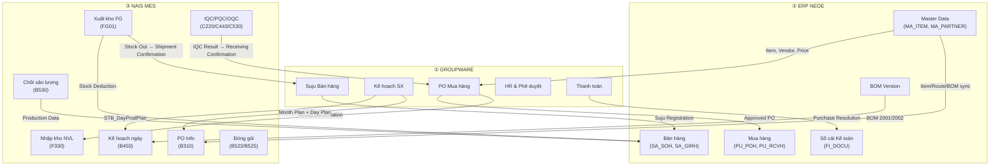
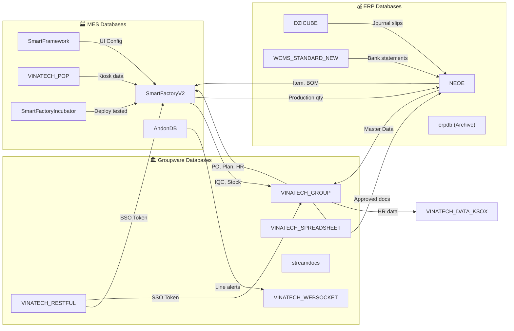

# 🌐 SYSTEM INTEGRATION MAP — Bản Đồ Liên Hệ Giữa Các Nền Tảng & Database

> **Cập nhật:** 2026-08-26
> **Phạm vi:** Toàn bộ hệ sinh thái phần mềm Vinatech Việt Nam
> **Server:** SQL Server Instance `dbserver.hycap.co.kr,5398`
> **Nhà máy:** Bắc Giang (F1), Hà Nam (F3), Hưng Yên (F4)

---

## 🏛️ 1. Ba Nền Tảng Hệ Thống Chính

Hệ thống quản trị của Vinatech liên kết chặt chẽ giữa 3 nền tảng chính, mỗi nền tảng đảm nhiệm một tầng nghiệp vụ khác nhau:

```
┌──────────────────────────────────────────────────────────────────────────┐
│                     HỆ SINH THÁI VINATECH                              │
│                                                                         │
│  ┌─────────────────┐   ┌─────────────────┐   ┌─────────────────┐       │
│  │  ① GROUPWARE    │   │  ② ERP NEOE     │   │  ③ NAIS MES     │       │
│  │  gw.vinatech.com│   │  (Douzone iU)   │   │  mes.hycap.co.kr│       │
│  │                 │   │                 │   │  :9952           │       │
│  │  Phê duyệt     │   │  Sổ cái trung   │   │  Sản xuất       │       │
│  │  điện tử, HR,   │   │  tâm, Master    │   │  hiện trường,   │       │
│  │  Kế hoạch SX    │   │  Data gốc,      │   │  quét barcode,  │       │
│  │                 │   │  Tài chính       │   │  QC, Kho vật lý │       │
│  └────────┬────────┘   └────────┬────────┘   └────────┬────────┘       │
│           │                     │                     │                 │
│           └──────────┬──────────┴──────────┬──────────┘                 │
│                      │                     │                            │
│              ┌───────▼───────┐    ┌────────▼───────┐                    │
│              │ Dòng dữ liệu │    │  Dòng dữ liệu │                    │
│              │ THƯỢNG NGUỒN  │    │  HẠ NGUỒN      │                    │
│              │ (Plan → Exec) │    │  (Exec → Report)│                   │
│              └───────────────┘    └────────────────┘                    │
└──────────────────────────────────────────────────────────────────────────┘
```

### ① Groupware (gw.vinatech.com)
- **URL:** `https://gw.vinatech.com`
- **Database:** `VINATECH_GROUP` (DB chính) + `VINATECH_RESTFUL` (SSO) + `VINATECH_SPREADSHEET` (Excel Online) + `streamdocs` (PDF)
- **Vai trò:** Cổng phê duyệt tờ trình hành chính, nhân sự, mua sắm, kế hoạch sản xuất ở thượng nguồn
- **Tài khoản mẫu:** Company `VINATech VINA Co.,Ltd` / Employee ID `92603003` / Pass `123456`

### ② ERP Douzone iU (NEOE)
- **Database:** `NEOE` (ERP chính 4876 bảng) + `DZICUBE` (Bizbox Kế toán 3300+ bảng) + `WCMS_STANDARD_NEW` (CMS ngân hàng) + `erpdb` (Legacy archive)
- **Vai trò:** Sổ cái trung tâm lưu trữ Master Data gốc (vật tư, đối tác, BOM, HR), hạch toán tài chính
- **Nguyên tắc:** Single Source of Truth cho Master Data → Đồng bộ sang GW và MES

### ③ NAIS MES (mes.hycap.co.kr:9952)
- **URL:** `http://mes.hycap.co.kr:9952`
- **Database:** `SmartFactoryV2` (DB nghiệp vụ chính) + `SmartFramework` (UI Metadata) + `VINATECH_POP` (Kiosk) + `AndonDB` (Cảnh báo) + `SmartFactoryIncubator` (R&D)
- **Vai trò:** Thực thi sản xuất tại hiện trường nhà xưởng (quét barcode, routing, QC, kho vật lý)
- **POP System (pop.vinatech.com):** Giao diện Kiosk cảm ứng cho công nhân tại dây chuyền
- **Tài khoản POP mẫu:** Company `VINATech VINA Co.,Ltd` / Employee ID `92603003` / Pass `123456`

---

## 🔗 2. Ma Trận Liên Kết Dữ Liệu Giữa 3 Nền Tảng

### 2.1 Luồng Dữ Liệu Tổng Thể



### 2.2 Chi Tiết 6 Dòng Dữ Liệu Chính

| # | Luồng | Nguồn | Đích | Dữ liệu truyền | Bảng DB liên quan |
|---|-------|-------|------|----------------|------------------|
| 1 | **Mua hàng (P2P)** | GW → MES → ERP | `VINA_DOCUMENT_POH/POL` → `STB_MaterialLotInfo` → `PU_POH/RCVH` | PO, Arrival, IQC, Receiving, Payment | GW: `VINA_DOCUMENT_POH`, MES: `STB_MaterialLotInfo`, ERP: `PU_POH` |
| 2 | **Kế hoạch SX** | GW → MES | `VINA_PROD_MONTH_PRODPLAN` → `STB_DayProdPlan` | Month Plan → Day Plan → Lot/Barcode | GW: `VINA_PROD_MONTH_PRODPLAN`, MES: `STB_DayProdPlan` |
| 3 | **Sản xuất** | MES (nội bộ) | B450 → B530 → B523 → C530 | Khai sinh barcode → Routing → Packing → OQC | MES: `STB_SetInfo`, `STB_ProdRouteHist`, `STB_DividePackaging` |
| 4 | **Bán hàng (O2C)** | GW → MES → ERP | `VINA_DOCUMENT_SALES_ORDER` → FG01/B750/B752 → `SA_SOH/GIRH` | Suju → Xuất kho → Pallet → Container | GW: `VINA_DOCUMENT_SALES_ORDER`, MES: `STB_MaterialLotInfo`, ERP: `SA_SOH` |
| 5 | **Master Data** | ERP → GW + MES | `MA_ITEM` → `VINA_DOCUMENT_ITEM_REGISTRATION` + `STB_MaterialMaster` | Item Code, BOM, Vendor, Price | ERP: `MA_ITEM`, GW: `VINA_DOCUMENT_ITEM_REGISTRATION_H`, MES: `STB_MaterialMaster` |
| 6 | **HR & Phân quyền** | GW → MES | `VINA_EMP` → MES Z410 (`STB_UserInfo`) | Employee ID, Dept, Role, MES Permission | GW: `VINA_EMP`, MES: `SmartFramework.STB_UserInfo` |

---

## 🗄️ 3. Ma Trận Database ↔ Nền Tảng

### 3.1 Ánh Xạ 15 Database Theo Nền Tảng

| Nền tảng | Database | Vai trò | Mối liên hệ |
|----------|----------|---------|-------------|
| **MES** | `SmartFactoryV2` | DB nghiệp vụ sản xuất chính | ← Nhận Master Data từ NEOE, Nhận PO/Plan từ VINATECH_GROUP |
| **MES** | `SmartFramework` | UI Metadata, Menu, Phân quyền | ← Nhận thông tin nhân sự từ VINATECH_GROUP |
| **MES** | `VINATECH_POP` | Kiosk cảm ứng xưởng | → Đồng bộ dữ liệu chính sang SmartFactoryV2 |
| **MES** | `AndonDB` | Bảng cảnh báo dừng line | → Push event qua VINATECH_WEBSOCKET |
| **MES** | `SmartFactoryIncubator` | R&D Sandbox thử nghiệm | → Deploy kết quả lên SmartFactoryV2 khi ổn định |
| **GW** | `VINATECH_GROUP` | Phê duyệt điện tử, PO, HR | ↔ Đồng bộ 2 chiều với NEOE và SmartFactoryV2 |
| **GW** | `VINATECH_RESTFUL` | SSO Token bảo mật | → Xác thực cho GW, MES, POP, Mobile |
| **GW** | `VINATECH_SPREADSHEET` | Bảng tính cộng tác | → Lưu trữ kế hoạch, báo cáo trên GW portal |
| **GW** | `streamdocs` | PDF Viewer Forcs | → Render tài liệu đính kèm trên GW |
| **GW** | `VINATECH_WEBSOCKET` | Realtime push notification | ← Nhận event từ AndonDB, GW approval |
| **ERP** | `NEOE` | Sổ cái trung tâm ERP iU | ← Nhận dữ liệu sản xuất từ MES, bút toán từ GW |
| **ERP** | `DZICUBE` | Bizbox Kế toán Douzone | → Sinh bút toán nháp → đồng bộ vào NEOE |
| **ERP** | `WCMS_STANDARD_NEW` | CMS quản lý dòng tiền ngân hàng | ↔ Đồng bộ sao kê/bút toán với NEOE |
| **ERP** | `erpdb` | Legacy ERP (Archive only) | ✖ Không kết nối hệ thống hiện tại |
| **K-SOX** | `VINATECH_DATA_KSOX` | Tuân thủ kiểm soát nội bộ | ← Lấy dữ liệu HR từ VINATECH_GROUP |

### 3.2 Sơ Đồ Kết Nối Chi Tiết



---

## 🔄 4. Các Luồng Nghiệp Vụ Liên Hệ Thống Chi Tiết

### 4.1 Luồng Mua Hàng — Procure-to-Pay (P2P)

```
① GW: Tạo PO (VINA_DOCUMENT_POH) → Phê duyệt → Đăng ký ERP
② ERP: PU_POH ghi nhận PO
③ GW: Arrival Confirmation → kích hoạt MES F330
④ MES: F330 nhận hàng, in tem NVL (Sinh LotNo ML...)
⑤ MES: C220 kiểm IQC → PASS/FAIL
⑥ GW: Receiving Confirmation → cập nhật tồn kho GW + ERP (PU_RCVH)
⑦ GW: Purchase Resolution → sinh bút toán kế toán → ERP FI_DOCU
```

### 4.2 Luồng Sản Xuất — Plan-to-Produce

```
① GW: Đăng ký kế hoạch tháng (VINA_PROD_MONTH_PRODPLAN) → MES B310
② GW: Lập kế hoạch ngày → MES B450 (STB_DayProdPlan, IsFixed=1)
③ MES: B450 khai sinh Barcode (ControlNo) → in tem Lot
④ MES: B597/B540 quét NVL vào Line (check BOM + Hạn dùng)
⑤ MES: B530 chốt sản lượng (Backflush trừ kho NVL tự động)
⑥ MES: C443 đo PQC → Aging → Sorting
⑦ MES: B523 gộp Cell vào Box → B525 gộp Box vào Carton
⑧ MES: C530 duyệt OQC → PASS mới được xuất kho
```

### 4.3 Luồng Bán Hàng — Order-to-Cash (O2C)

```
① GW: Đăng ký Suju (VINA_DOCUMENT_SALES_ORDER) → ERP SA_SOH
② GW: Shipment Request → MES FG01
③ MES: FG01 quét Packing ID xuất kho → trừ tồn kho MES
④ MES: B750 in tem Pallet → B752 bốc xếp Container
⑤ GW: Shipment Confirmation → ERP SA_GIRH ghi nhận doanh thu
```

---

## 🔐 5. Bảo Mật & SSO

### 5.1 Cơ Chế Single Sign-On

```
Người dùng → Đăng nhập Portal (GW/POP) → VINATECH_RESTFUL cấp Token
→ Token được gắn vào mỗi request → Các ứng dụng MES/GW/Mobile xác thực Token
→ IP Whitelist (VINA_ALLOWED_IP) bảo vệ API Gateway
```

### 5.2 Thông Tin Đăng Nhập Hệ Thống

| Hệ thống | URL | Company | Account | Password |
|-----------|-----|---------|---------|----------|
| **POP** | `pop.vinatech.com/login` | VINATech VINA Co.,Ltd | 92603003 | 123456 |
| **Groupware** | `gw.vinatech.com/login` | VINATech VINA Co.,Ltd | 92603003 | 123456 |
| **MES** | `mes.hycap.co.kr:9952` | — | Phân quyền qua Z410 | — |

---

## 📊 6. Thống Kê Quy Mô Hệ Thống

| Database | Số bảng | Tầm quan trọng | Trạng thái |
|----------|---------|----------------|-----------|
| SmartFactoryV2 | ~500+ | ⭐⭐⭐⭐⭐ | Active - Nghiệp vụ sản xuất |
| NEOE | 4876 | ⭐⭐⭐⭐⭐ | Active - Sổ cái ERP |
| DZICUBE | 3300+ | ⭐⭐⭐⭐ | Active - Kế toán Bizbox |
| VINATECH_GROUP | ~200+ | ⭐⭐⭐⭐⭐ | Active - Phê duyệt GW |
| erpdb | 884 | ⭐ | Archive - Legacy |
| SmartFramework | ~50+ | ⭐⭐⭐⭐ | Active - UI Metadata |
| VINATECH_POP | ~20+ | ⭐⭐⭐ | Active - Kiosk |
| SmartFactoryIncubator | ~50 | ⭐⭐ | Active - R&D |
| WCMS_STANDARD_NEW | ~15+ | ⭐⭐⭐ | Active - CMS ngân hàng |
| VINATECH_DATA_KSOX | ~15+ | ⭐⭐ | Active - K-SOX |
| AndonDB | 3 | ⭐⭐⭐ | Active - Cảnh báo |
| VINATECH_RESTFUL | 3 | ⭐⭐⭐⭐ | Active - SSO |
| VINATECH_WEBSOCKET | ~5 | ⭐⭐ | Active - Realtime |
| VINATECH_SPREADSHEET | ~10 | ⭐⭐ | Active - Excel Online |
| streamdocs | ~10 | ⭐ | Active - PDF |

---

## 🗺️ 7. Bản Đồ Tra Cứu Nhanh Theo Tình Huống

| Tình huống | Nền tảng | Database | Tài liệu tham chiếu |
|------------|----------|----------|---------------------|
| Lỗi sản xuất B530/B523 | MES | SmartFactoryV2 | KB_03, KB_04, KB_08, KB_09 |
| Lỗi phân quyền MES | MES | SmartFramework | KB_01 (Z410) |
| Lỗi kho NVL / FIFO | MES | SmartFactoryV2 | KB_02 |
| Lỗi QC/OQC/Electrode | MES | SmartFactoryV2 | KB_05 |
| PO không đồng bộ sang MES | GW+MES | VINATECH_GROUP + SF2 | GW_02, DB_03_INTEGRATION_PURCHASE |
| Kế hoạch không hiện B310/B450 | GW+MES | VINATECH_GROUP + SF2 | GW_03, DB_03_INTEGRATION_PRODUCTION_PLANNING |
| Đối chiếu tồn kho MES vs ERP | MES+ERP | SF2 + NEOE | VOL_01 (Mẫu 6.1), DB_04 |
| Lỗi đăng nhập SSO | GW | VINATECH_RESTFUL | DB_08 |
| Andon TV không cập nhật | MES | AndonDB + VINATECH_WEBSOCKET | DB_07, DB_09 |
| Kiosk POP mất kết nối | MES | VINATECH_POP | DB_06 |
| Sai bút toán kế toán | ERP | NEOE + DZICUBE | DB_04, DB_05 |
| Lỗi sao kê ngân hàng | ERP | WCMS_STANDARD_NEW | DB_11 |
| K-SOX audit / tuân thủ | K-SOX | VINATECH_DATA_KSOX | DB_13 |

---

*Tài liệu được biên soạn dựa trên phân tích trực tiếp cấu trúc 15 CSDL thực tế và 3 nền tảng vận hành tại Vinatech Việt Nam.*
