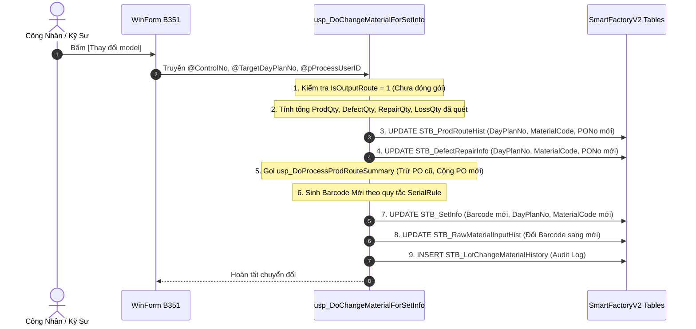
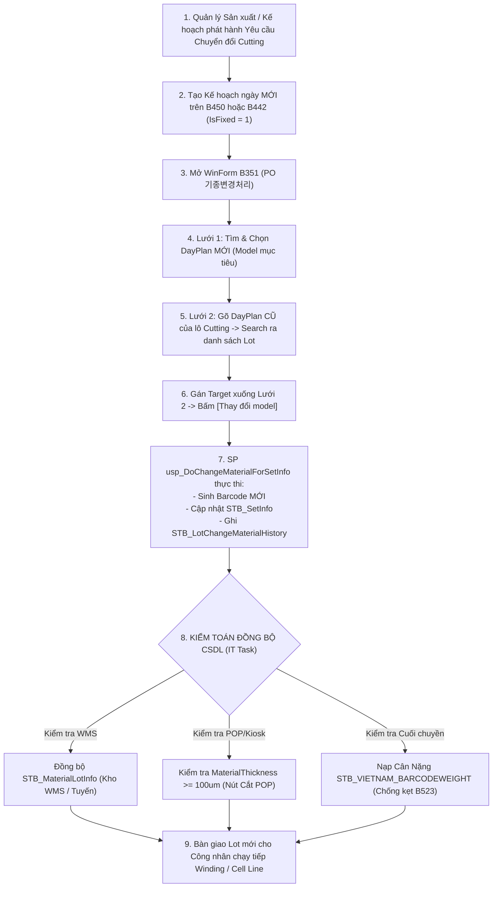

# 📘 VINATECH MES — CẨM NANG VẬN HÀNH CHUYÊN SÂU MÀN HÌNH B351 & PROCESS CHUYỂN ĐỔI CUTTING

> **Hệ thống:** NAIS Core MES WinForm & Kiosk POP (`SmartFactoryV2`)  
> **Mã màn hình:** `B351` (`PO 기종변경처리` — Lot Transition / Chuyển Đổi Model & Kế Hoạch Sản Xuất)  
> **Phân hệ phụ trách:** EA Team / Quản trị Vận hành MES (Nguyễn Văn Đức - `vanduc`)  
> **Tài liệu tham chiếu:** `KB_03_02_CELL_LINE.md`, `KB_04_02_SCREEN_BUGS.md`, `KB_05_01_QC_AND_ELECTRODE_CORE.md`, `QUICK_MATRIX.json`

---

## I. TỔNG QUAN BẢN CHẤT MÀN HÌNH B351

### 1.1 Mục Đích Nghiệp Vụ Cốt Lõi
Màn hình **B351** (Tên tiếng Hàn: `PO 기종변경처리` — Xử lý thay đổi chủng loại/model theo PO) là công cụ chuyên dụng trong phân hệ **Quản lý sản xuất (Production Management)** của MES WinForm.

Màn hình này được thiết kế để giải quyết bài toán: **Chuyển đổi một hoặc nhiều Lot bán thành phẩm (WIP) từ Kế hoạch sản xuất / PO cũ sang Kế hoạch sản xuất / PO mới** khi:
1. **Thay đổi kế hoạch sản xuất khẩn cấp:** Đơn hàng cũ bị hủy, hoãn hoặc khách hàng yêu cầu đổi sang model tương đương.
2. **Sản xuất nhầm Kế hoạch ngày (DayPlan) hoặc PO:** Công nhân/tổ trưởng tạo và chạy lệnh trên PO sai nhưng các công đoạn gia công bán thành phẩm (như Cắt cuộn/lá cực, Quấn cuộn) đã hoàn tất một phần.
3. **Tái sử dụng Bán thành phẩm của công đoạn Thượng nguồn (Upstream WIP):** Điển hình là công đoạn **Cutting / Slitting (Cắt xẻ điện cực / chia cuộn)**: Cuộn cực hoặc phôi tấm đã được gia công đạt chuẩn cơ lý nhưng dư thừa hoặc cần điều chuyển sang một Model thành phẩm khác có cùng quy cách vật liệu (cùng độ dày, cùng chủng loại lá than/foil).

---

### 1.2 Điều Kiện Tiên Quyết Bất Biến (Pre-flight Gate)
> [!IMPORTANT]
> **Quy Tắc Sống Còn Của B351:** Màn hình B351 **CHỈ CHO PHÉP** chuyển đổi các Lot **ĐANG Ở DẠNG BÁN THÀNH PHẨM (WIP)** và **CHƯA ĐÓNG GÓI THÀNH PHẨM (Box Packing)**.

Bên trong Stored Procedure thực thi `usp_DoChangeMaterialForSetInfo`, hệ thống kiểm tra:
```sql
SELECT @ProdFinishQty = SUM(PRH.ProdQty)
FROM STB_ProdRouteHist PRH
INNER JOIN STB_ProductionOrderRouting POR
    ON POR.PONo = PRH.PONo 
   AND POR.RouteCode = PRH.RouteCode 
   AND POR.IsOutputRoute = 1  -- Công đoạn xuất xưởng / Đóng gói cuối cùng
WHERE PRH.ControlNo = @ControlNo;

IF ISNULL(@ProdFinishQty, 0) > 0
BEGIN
    EXEC usp_RaiseLocalizedError 
        @pProcessLanguage = @pProcessLanguage,
        @pMessage = '박스포장한 이력이 있는 LOT는 변경이 불가합니다'; -- "Lot đã có lịch sử đóng gói Box thì KHÔNG ĐƯỢC PHÉP thay đổi!"
    RETURN;
END
```
👉 **Hệ quả nghiệp vụ:** Các lô hàng tại công đoạn **Cutting / Slitting / Winding** (chưa đi đến công đoạn OutputRoute cuối cùng) **hoàn toàn đủ điều kiện** để chuyển đổi tại B351. Một khi lô hàng đã đóng thùng qua B523/B528, B351 sẽ chặn đứng 100%.

---

## II. KIẾN TRÚC GIAO DIỆN & LUỒNG THAO TÁC 2 LƯỚI (MASTER-DETAIL)

Màn hình B351 vận hành theo cấu trúc liên kết 2 lưới (Master-Detail Grid):

```
┌────────────────────────────────────────────────────────────────────────────────────────────────┐
│  LƯỚI 1 (MASTER): Kế hoạch sản xuất MỤC TIÊU (DayProdPlanForChangeMaterial)                   │
│  [SP: usp_GetDayProdPlanForChangeMaterial]                                                    │
│  Lọc theo: CompanyCode, WorkCenterCode, LineCode, Từ ngày -> Đến ngày, POType (FERT/HALB/MDL) │
│  Hiển thị: DayPlanNo (Mới), PONo (Mới), MaterialCode (Mới), MaterialName, PlanQty, ProdQty    │
└────────────────────────────────┬───────────────────────────────────────────────────────────────┘
                                 │
                   (User chọn Kế hoạch đích ở Lưới 1)
                   (Gán Target xuống các dòng ở Lưới 2)
                                 │
                                 ▼
┌────────────────────────────────────────────────────────────────────────────────────────────────┐
│  LƯỚI 2 (DETAIL): Danh sách Lot / Barcode HIỆN TẠI (SetInfoForChangeMaterial)                  │
│  [SP: usp_GetSetInfoForChangeMaterial]                                                        │
│  Tìm kiếm theo: DayPlanNo hiện tại (Cũ)                                                        │
│  Hiển thị: Barcode, ControlNo, MaterialCode (Cũ), ProdQty, TargetDayPlanNo, TargetMaterialCode │
└────────────────────────────────┬───────────────────────────────────────────────────────────────┘
                                 │
                   [Bấm Nút: THAY ĐỔI MODEL (ChangeMaterial)]
                                 │
                                 ▼
            [Thực thi SP: usp_DoChangeMaterialForSetInfo]
```

### Quy Trình Thao Tác Chuẩn 3 Bước Trên UI (Chống lỗi `No data to process`):
1. **Bước 1 — Tìm Kế hoạch mục tiêu (Lưới 1):**
   - Chọn khoảng ngày hợp lệ (`FromDate` ~ `ToDate`), chọn Nhà máy (`CompanyCode`), Phân xưởng (`WorkCenterCode`).
   - Nhấn **Search** Lưới 1 để hiển thị danh sách Kế hoạch ngày khả dụng. Click chọn dòng Kế hoạch của Model MỚI cần đổi sang.
2. **Bước 2 — Tìm Lot & Gán Target (Lưới 2):**
   - Nhập `DayPlanNo` cũ của lô Cutting vào ô tìm kiếm Lưới 2 $\rightarrow$ Bấm **Search** để hiển thị danh sách các Lot.
   - Tích chọn các Lot cần chuyển đổi $\rightarrow$ Thực hiện thao tác gán Target từ dòng đã chọn ở Lưới 1 xuống Lưới 2.
   - **Kiểm tra trực quan:** Các cột `TargetDayPlanNo`, `TargetMaterialCode`, `TargetMaterialName` ở Lưới 2 **bắt buộc phải hiển thị mã mới** (không được để trống/NULL).
3. **Bước 3 — Thực hiện Chuyển đổi:**
   - Nhấn nút **[Thay đổi model]** trên thanh công cụ góc phải.
   - NAIS Client sẽ gửi mảng danh sách chứa `@pControlNo` và `@pTargetDayPlanNo` xuống CSDL để kích hoạt thủ tục `usp_DoChangeMaterialForSetInfo`.

---

## III. GIẢI PHÃU 3 STORED PROCEDURES CỐT LÕI CỦA B351

### 3.1 SP 1: `usp_GetDayProdPlanForChangeMaterial` (Truy Vấn Kế Hoạch Đích)
* **Tham số đầu vào:**
  - `@pCompanyCode`: `VVT` (Vinatech Việt Nam) hoặc `VNT` (Hà Nam).
  - `@pWorkCenterCode`: Phân xưởng (`VVT_F1`, `VVT_F2`, `VVT_F4`, `VVT_F5`...).
  - `@pFromDate`, `@pToDate`: Khoảng ngày kế hoạch.
  - `@pPOType`: Mặc định `'FERT'` (Thành phẩm).
  - `@pBarcode`: Tìm theo Barcode (nếu có).
* **Quy tắc phân loại POType đặc biệt:**
  ```sql
  DECLARE @POType VARCHAR(20) = CASE 
      WHEN @CompanyCode = 'VVT' AND @Barcode LIKE 'M%' THEN 'MODULE'
      WHEN @CompanyCode = 'VNT' AND @Barcode LIKE 'vjqp233r060%' THEN 'HALB'
      ELSE @pPOType 
  END;
  ```
* **Điều kiện lọc:**
  - Kế hoạch phải ở trạng thái đã chốt phát hành: `DPP.IsFixed = 1` và `DPP.IsCancel = 0`.
  - Phải liên kết hợp lệ với Master Data: `STB_ModelBasicInfo` và `STB_ProductionOrderInfo`.

---

### 3.2 SP 2: `usp_GetSetInfoForChangeMaterial` (Truy Vấn Danh Sách Lot Cũ)
* **Tham số đầu vào:** `@pDayPlanNo` (Mã kế hoạch ngày hiện tại cần lấy Lot).
* **Điều kiện lọc:**
  - `SI.DayPlanNo = @DayPlanNo`
  - `SI.IsLoss = 0` (Chỉ lấy các Lot còn hiệu lực, không lấy Lot đã hủy/báo tổn thất toàn phần).
* **Dữ liệu trả về ban đầu:** Cung cấp sẵn 3 cột rỗng `TargetDayPlanNo = ''`, `TargetMaterialCode = ''`, `TargetMaterialName = ''` để UI WinForm hứng giá trị khi người dùng map từ Lưới 1 sang.

---

### 3.3 SP 3: `usp_DoChangeMaterialForSetInfo` (Trái Tim Xử Lý Giao Dịch)
Đây là thủ tục quan trọng nhất, thực hiện 6 bước cập nhật CSDL liên hoàn:



#### Chi tiết các tác vụ CSDL trong SP:
1. **Điều chuyển Sản Lượng Lũy Kế Trên PO (`STB_ProdRouteSummary`):**
   - Lấy toàn bộ lịch sử quét thực tế đã chốt trong `STB_ProdRouteHist` và phế phẩm trong `STB_DefectRepairInfo`.
   - Gọi `usp_DoProcessProdRouteSummary` với sản lượng **DƯƠNG (+)** để cộng dồn vào PO mục tiêu (`@TargetPONo`).
   - Gọi `usp_DoProcessProdRouteSummary` với sản lượng **ÂM (-)** để khấu trừ khỏi PO cũ (`@BefPONo`).
   - Đảm bảo tỷ lệ hoàn thành kế hoạch (% Progress) giữa PO cũ và PO mới không bị sai lệch số liệu.
2. **Cập nhật Bảng Lịch Sử Công Đoạn & Phế Phẩm:**
   - Cập nhật đồng loạt `PONo`, `DayPlanNo`, `MaterialCode` trong `STB_ProdRouteHist` và `STB_DefectRepairInfo` theo `@ControlNo`.
3. **Cơ Chế Tự Động Sinh Barcode Mới:**
   - **Tiền tố doanh nghiệp:** `@FirstString = 'VV'` (hoặc `'VJ'` nếu `@aftCompanyCode = 'VNT'`).
   - **Phân loại Module:** Nếu `MaterialTypeCode = 'MDL'`, Header sẽ bắt đầu bằng chữ `'M'` $\rightarrow$ `MVV...` / `MVJ...`.
   - **Mã hóa Thời Gian:**
     + Năm: `@YearCode` lấy từ bảng `STB_YearInfo`.
     + Tháng: `@MonthCode = CHAR(@Month + 73)` (Quy tắc ASCII: Tháng 1 $\rightarrow$ `J`, Tháng 2 $\rightarrow$ `K`, Tháng 3 $\rightarrow$ `L`...).
     + Ngày: `@DayCode = RIGHT('00' + DAY, 2)`.
   - **Thông số Kỹ thuật:** Ghép Điện áp `@Volt` (`MBIExtText01`) và Điện dung `@Capacity` (`MBIExtText02`) từ bảng `STB_ModelBasicInfo`.
   - **Cấp số Serial mới:** Gọi `usp_GetNewSerialNoForBarcodeUsingString` để nhảy số thứ tự tự động:
     $$\text{NewBarcode} = \text{Header} + \text{RIGHT}('00' + \text{SerialNo}, 2)$$
4. **Cập nhật Bảng Định Danh Lot & NVL Đầu Vào:**
   - `UPDATE STB_SetInfo`: Lưu Barcode mới, MaterialCode mới, DayPlanNo mới, PONo mới.
   - `UPDATE STB_RawMaterialInputHist`: Đổi Barcode cũ sang Barcode mới để giữ nguyên phả hệ NVL đã nạp.
5. **Ghi Nhận Lịch Sử Audit Bắt Buộc:**
   - `INSERT INTO STB_LotChangeMaterialHistory`: Lưu lại toàn bộ cặp thông tin (`OldBarcode`, `NewBarcode`, `BefMaterialCode`, `AftMaterialCode`, `BefDayPlanNo`, `AftDayPlanNo`, `CreateDateTime`, `CreateUserID`).

---

## IV. BẢN CHẤT NGHIỆP VỤ: "JOB CHUYỂN ĐỔI CUTTING TỪ MÀN HÌNH B351"

### 4.1 Tại Sao Lại Có Job Chuyển Đổi Cutting Tại B351?
Tại nhà máy Vinatech, công đoạn **Cutting / Slitting** là mắt xích phân tách giữa hai thế giới:
* **Thượng nguồn (Upstream):** Sản xuất Cuộn cực (Electrode Mixing $\rightarrow$ Coating $\rightarrow$ Roll Pressing). Đơn vị tính: Mét, Kg, Khổ rộng (mm).
* **Hạ nguồn (Downstream):** Lắp ráp Cell / Module (Winding $\rightarrow$ Assembly $\rightarrow$ Aging $\rightarrow$ Packing). Đơn vị tính: Con thành phẩm (EA, Pieces).

Tại trạm **Cutting** (Cắt lá cực hoặc chia cuộn Slitting):
1. **Trường hợp 1 (Tái điều chuyển BTP lá cắt):** Xưởng đã chạy lệnh cắt phôi hoặc xẻ cuộn cực cho PO cũ, nhưng đơn hàng bị giảm số lượng hoặc đổi sang Model khác. Do kích thước lá cắt và độ dày tương thích với Model mới, Quản đốc sản xuất phát hành một **Job chuyển đổi** để tận dụng toàn bộ số phôi đã cắt này sang Model mới mà không phải hủy phế.
2. **Trường hợp 2 (Đổi PO/DayPlan trước khi đưa vào chuyền Cell):** Lot điện cực sau khi cắt xong có mã Barcode gán theo kế hoạch cũ. Để chuyền Quấn cuộn (Winding / B597 / B540 / Kiosk POP) có thể quét nạp cuộn vào DayPlan mới của ngày hôm nay, lô hàng bắt buộc phải đi qua **B351 để tái cấp Barcode và gán sang DayPlan mới**.

---

### 4.2 Sơ Đồ Quy Trình Thực Tế Một "Job Chuyển Đổi Cutting":



---

## V. MA TRẬN 5 KHOẢNG HẪNG ĐỒNG BỘ CSDL & SỰ CỐ THƯỜNG GẶP (GAPS & PITFALLS)

Dù B351 đã hoàn thành trên WinForm, hệ thống MES vẫn tồn tại **5 khoảng hẫng đồng bộ (Synchronization Gaps)** giữa các phân hệ mà Kỹ sư IT vận hành bắt buộc phải nắm:

| Khoảng Hẫng | Phân Tầng Bị Ảnh Hưởng | Triệu Chứng Thực Tế | Cơ Chế Gây Lỗi | Giải Pháp Kỹ Thuật (SOP) |
|:---:|:---|:---|:---|:---|
| **GAP 1** | **WMS Kho Tuyến** (`STB_MaterialLotInfo`) | Quét Barcode mới ở trạm kế tiếp báo lỗi: *"Không tìm thấy tồn kho NVL / Lot không tồn tại"*. | B351 chỉ cập nhật `STB_SetInfo`, **KHÔNG cập nhật** `STB_MaterialLotInfo`. Bảng kho WMS vẫn giữ mã cũ. | Chạy SQL đồng bộ: Cập nhật `LotNo`, `MaterialLotNo`, `MaterialCode` trong `STB_MaterialLotInfo` theo Barcode mới. |
| **GAP 2** | **Kiosk POP Cutting** (Nút Cắt bị mờ) | Trên Web Kiosk POP, công nhân vào màn hình Cắt/Slitting thấy **Nút "Cắt điện cực" bị mờ không bấm được** (Rule 20.3). | Model mới có thông số `MaterialThickness < 100` trong `STB_MaterialMaster` (hoặc rỗng), logic an toàn Kiosk tự động khóa. | Kiểm tra `MaterialThickness` trong `STB_MaterialMaster`. Nếu nhỏ hơn 100, điều chỉnh lại thông số chuẩn hoặc cấu hình bypass. |
| **GAP 3** | **Đóng Gói B523** (Thiếu Cân Nặng) | Lot chạy đến cuối chuyền đóng gói B523, bấm **[In Tem &]** bị popup đỏ: *"Could not find Kho Thành phẩm chưa nhập cân nặng..."* | SP `usp_Vietnam_GetBoxIDForLotNo_VVT` tính `@lotweight = 0` do mã mới chưa có bản ghi trong `STB_VIETNAM_BARCODEWEIGHT`. | Nạp trọng lượng vào `STB_VIETNAM_BARCODEWEIGHT` + `STB_VN_FINISHGOODS` + mapping `STB_ChangePartNoAndLotNo`. |
| **GAP 4** | **Lỗi Định Dạng Barcode** (Dấu chấm `.`) | Barcode mới sinh ra có định dạng `VVPR152.740601` thay vì chữ `R` (`VVPR152R740601`), máy quét không nhận diện được. | Lỗi cắt ghép chuỗi trong phiên bản cũ của SP sinh số tự động khi xử lý MonthCode / DayCode. | Sửa đồng loạt Barcode bị lỗi trong cả 3 bảng: `STB_RawMaterialInputHist`, `STB_SetInfo`, `STB_LotChangeMaterialHistory`. |
| **GAP 5** | **Yêu Cầu Rollback** (Về lại mã cũ) | Sau khi chuyển đổi xong, Sản xuất báo nhầm và yêu cầu hủy chuyển đổi để in lại tem cũ. B351 **không có nút Hoàn tác**. | B351 đã chuyển trạng thái một chiều. Nếu tự ý xóa record sẽ gây đứt gãy Traceability và lệch sản lượng PO. | **Bắt buộc có xác nhận Quản lý**. Sau đó thực thi kịch bản Rollback chuẩn đồng bộ 4 bảng bọc Transaction. |

---

## VI. SỔ TAY XỬ LÝ SỰ CỐ B351 CHUẨN 4 DÒNG VÀNG (CHEAT SHEET)

### 📌 Ca 1: Bấm nút [Thay đổi model] bị popup đỏ `No data to process`
1. 🎯 **Nguyên nhân gốc:** Người dùng chưa gán Kế hoạch mục tiêu từ Lưới 1 xuống Lưới 2, khiến các cột `TargetDayPlanNo` / `TargetMaterialCode` ở Lưới 2 bị trống/NULL. Client kiểm tra mảng rỗng nên chặn.
2. 📍 **Hiện trạng:** Dữ liệu chưa thay đổi gì trong CSDL.
3. 🛠️ **Thao tác OP trên UI:** (1) Chọn dòng Kế hoạch Model MỚI ở Lưới 1, (2) Chọn các dòng Lot ở Lưới 2 và bấm gán Target để cột `TargetDayPlanNo` hiển thị mã mới, (3) Bấm lại nút **[Thay đổi model]**.
4. ⚡ **SQL Hotfix:** Không cần SQL, xử lý 100% bằng thao tác UI.

---

### 📌 Ca 2: Lỗi popup đỏ `박스포장한 이력이 있는 LOT는 변경이 불가합니다` khi bấm đổi
1. 🎯 **Nguyên nhân gốc:** Lô hàng đã đi qua công đoạn Đóng gói hoàn thành (`POR.IsOutputRoute = 1` trong `STB_ProdRouteHist`). B351 chặn cứng để bảo vệ tính toàn vẹn của thùng đóng gói.
2. 📍 **Hiện trạng:** Lot đã có sản lượng đóng gói (`ProdFinishQty > 0`).
3. 🛠️ **Thao tác OP trên UI:** Phải thực hiện Hủy đóng gói Box tại màn hình **B523** (hoặc dùng chức năng Rollback đóng gói) để giải phóng sản lượng đóng gói về 0 trước khi mang sang B351.
4. ⚡ **SQL Hotfix (Kiểm tra nhanh):**
   ```sql
   SELECT PRH.ControlNo, PRH.RouteCode, PRH.ProdQty, POR.IsOutputRoute
   FROM STB_ProdRouteHist PRH WITH(NOLOCK)
   INNER JOIN STB_ProductionOrderRouting POR WITH(NOLOCK)
       ON POR.PONo = PRH.PONo AND POR.RouteCode = PRH.RouteCode AND POR.IsOutputRoute = 1
   WHERE PRH.ControlNo = (SELECT ControlNo FROM STB_SetInfo WHERE Barcode = 'MÃ_BARCODE');
   ```

---

### 📌 Ca 3: Rollback đồng bộ 4 bảng sau khi B351 đã đổi mã (Cần quản lý phê duyệt)
1. 🎯 **Nguyên nhân gốc:** Đổi nhầm mã tại B351, cần khôi phục lại mã gốc ban đầu (`BefMaterialCode`, `BefDayPlanNo`, `BefBarcode`).
2. 📍 **Hiện trạng:** `STB_SetInfo` mang mã mới, `STB_ProdRouteHist` mang mã mới, `STB_LotChangeMaterialHistory` đã ghi nhận log.
3. 🛠️ **Thao tác OP trên UI:** Không thể thao tác trên UI, bắt buộc IT can thiệp qua SQL Studio.
4. ⚡ **Master Rollback SQL Template (Author 'vanduc' - Bọc Transaction):**
   ```sql
   -- ====================================================================
   -- ROLLBACK B351 LOT CONVERSION — ĐỒNG BỘ 4 BẢNG CHUẨN RULE 1 & RULE 20
   -- ====================================================================
   DECLARE @ControlNo VARCHAR(20) = '20260815000123';
   DECLARE @BarcodeGoc VARCHAR(50) = 'VVPN263R850606';
   DECLARE @MaterialCodeGoc VARCHAR(50) = 'LIVT38-018';
   DECLARE @DayPlanNoGoc VARCHAR(20) = '2026081500012';
   DECLARE @BarcodeB351 VARCHAR(50) = 'VVQQ143R850605';
   DECLARE @CPHNo VARCHAR(20) = '12345'; -- Lấy từ STB_LotChangeMaterialHistory

   BEGIN TRANSACTION;
   BEGIN TRY
       -- B1. Snapshot an toàn
       IF NOT EXISTS (SELECT 1 FROM sys.tables WHERE name = 'BAK_STB_SetInfo_' + @CPHNo)
           SELECT * INTO BAK_STB_SetInfo_Temp FROM STB_SetInfo WITH(NOLOCK) WHERE ControlNo = @ControlNo;

       -- B2. Cập nhật STB_SetInfo về mã gốc
       UPDATE STB_SetInfo
       SET Barcode = @BarcodeGoc, MaterialCode = @MaterialCodeGoc, DayPlanNo = @DayPlanNoGoc
       WHERE ControlNo = @ControlNo;

       -- B3. Cập nhật STB_MaterialLotInfo về mã gốc
       UPDATE STB_MaterialLotInfo
       SET MaterialCode = @MaterialCodeGoc, MaterialLotNo = @BarcodeGoc, LotNo = @BarcodeGoc
       WHERE LotNo IN (@BarcodeB351, @BarcodeGoc) OR MaterialLotNo IN (@BarcodeB351, @BarcodeGoc);

       -- B4. Cập nhật STB_ProdRouteHist (Tránh lỗi ô lịch sử quá trình sản xuất bị trống trên B525)
       UPDATE STB_ProdRouteHist
       SET DayPlanNo = @DayPlanNoGoc, MaterialCode = @MaterialCodeGoc
       WHERE ControlNo = @ControlNo;

       -- B5. Xóa nhật ký chuyển đổi B351
       DELETE FROM STB_LotChangeMaterialHistory WHERE CPHNo = @CPHNo;

       COMMIT TRANSACTION;
       PRINT '==> [SUCCESS] Rollback B351 hoàn tất thành công 100%!';
   END TRY
   BEGIN CATCH
       IF @@TRANCOUNT > 0 ROLLBACK TRANSACTION;
       PRINT '==> [ERROR] Rollback thất bại: ' + ERROR_MESSAGE();
       THROW;
   END CATCH;
   ```

---

## VII. TỔNG KẾT & KHUYẾN NGHỊ VẬN HÀNH CHO EA TEAM

1. **Khi nhận yêu cầu "Chuyển đổi Cutting":**
   - Luôn xác nhận trước: Lô hàng đã cắt xong đang ở dạng cuộn BTP hay lá rời, đã tạo DayPlan mục tiêu trên B450/B442 chưa.
   - Hướng dẫn OP thao tác chuẩn 2 lưới trên B351 để họ tự chủ động, hạn chế việc IT phải can thiệp SQL thủ công.
2. **Hậu kiểm sau chuyển đổi:**
   - Tra cứu audit log: `SELECT * FROM STB_LotChangeMaterialHistory WHERE NewBarcode = '...'` để xác nhận việc chuyển đổi đã ghi nhận đúng.
   - Nếu lô hàng tiếp tục đi sang chuyền Cell và đến đóng gói, chủ động kiểm tra trước cân nặng trong `STB_VIETNAM_BARCODEWEIGHT` để tránh việc công nhân bị chặn lúc in tem ở B523.
3. **Phân loại sự cố chuẩn Rule 22:**
   - Mọi thao tác thực hiện trên WinForm B351 thuộc phân hệ **MES** (Core WinForm).
   - Mọi thao tác nạp cuộn hoặc cắt lá diễn ra tại Kiosk xưởng thuộc phân hệ **POP** (Kiosk Web). Báo cáo tuần hoặc ticket cần tách bạch rõ ràng.
