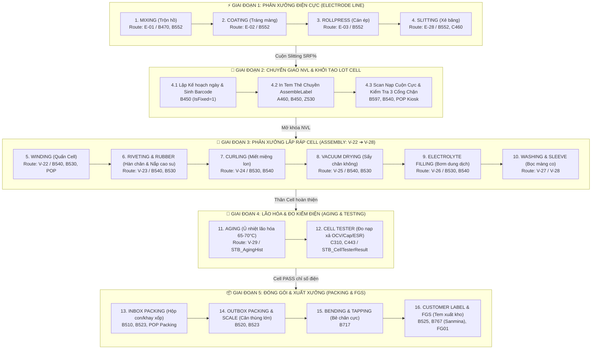

# 📘 VINATECH MES & POP — MASTER OPERATIONAL PLAYBOOK (BÁCH KHOA TOÀN THƯ VẬN HÀNH THỰC CHIẾN)

> **Cập nhật:** 2026-09-30 | **Phiên bản:** 5.0 Enterprise Architecture & Shopfloor Encyclopedia  
> **Nguyên tắc môi trường:** Vận hành qua Console CLI Hubs (`.\mes.ps1`, `.\pop.ps1`...) và Web Operations Portal (`MES_POP/web`). Khai tử hoàn toàn Telegram Bot để bảo mật tuyệt đối CSDL.  
> **Mục tiêu tối thượng:** Phản xạ tức thời (< 3 giây), chẩn đoán chính xác 100%, an toàn dữ liệu tuyệt đối (SELECT-Only, BEGIN TRAN...ROLLBACK), định danh chuẩn mực IT `Author/ChangeUserID = 'vanduc'`.

---

## PHẦN 0: BẢN CHẤT CỐT LÕI & RANH GIỚI PHÂN ĐỊNH HỆ THỐNG (RULE 22 & ARCHITECTURE)

### 0.1 Triết Lý Phân Đôi: POP vs MES
Để làm chủ vận hành và không bao giờ chẩn đoán sai lệch, bắt buộc phải hiểu rõ bản chất kiến trúc và vai trò của từng hệ thống:

```
┌─────────────────────────────────────────────────────────────────────────────────────────────────┐
│                                   VINATECH SHOPFLOOR ECOSYSTEM                                  │
├─────────────────────────────────────────────────┬───────────────────────────────────────────────┤
│          🖥️ POP (Shopfloor Point-of-Production)   │         🏭 CORE MES (Manufacturing Execution) │
├─────────────────────────────────────────────────┼───────────────────────────────────────────────┤
│ • Giao diện: Web Kiosk chạm cảm ứng (VueJS/SPA) │ • Giao diện: Desktop C# WinForms (Awoo SF)    │
│ • Vị trí: Đặt tại đầu mỗi máy, công nhân xưởng   │ • Vị trí: Máy tính văn phòng, QC, IT, Quản đốc│
│ • Vai trò: Thu thập dữ liệu tức thời (Realtime) │ • Vai trò: Hạch toán CSDL lõi (SoT), ERP, QA  │
│ • Nhập liệu: Quét Barcode, PLC Counter, Găng tay│ • Nhập liệu: Báo cáo tổng hợp, Import Excel   │
│ • Buffer: MongoToMesPerformance, MongoToMesDefect│ • Core Table: STB_ProdRouteHist, STB_SetInfo  │
│ • Chu kỳ: Từng giây/phút theo nhịp máy chạy     │ • Chu kỳ: Ca sản xuất (10:00 AM cutoff), Ngày │
└─────────────────────────────────────────────────┴───────────────────────────────────────────────┘
                                  │                               │
                                  ▼                               ▼
                      [MongoToMesPerformance] ──(Async Worker)──► [STB_ProdRouteHist]
```

1. **POP (Point of Production Kiosk):**
   - Là **"Mặt trận cảm ứng hiện trường & Cảm biến IoT"**: Thiết kế tối ưu cho công nhân thao tác bằng găng tay, quét mã vạch NVL nhanh, hiển thị hướng dẫn công đoạn trực quan, nhận tín hiệu xung đếm từ PLC qua dịch vụ `vinatechEquipmentDataSetup.exe` chạy ngầm.
   - Cơ chế phòng ngừa sai lỗi (Poka-Yoke): Chặn nạp sai mã NVL, khóa máy nếu chưa hoàn thành kiểm tra độ nhớt/độ dày, chặn chốt khi chưa quét đủ mẻ.
   - Bảng trung gian: Ghi nhận sự kiện ngay lập tức vào `MongoToMesPerformance` (`IsDone = 1, IsTransferred = 0`) để Kiosk phản hồi tick xanh `[✓]` ngay mà không làm nghẽn máy tính hiện trường.
2. **MES (Manufacturing Execution System Core):**
   - Là **"Cột sống hạch toán & Kỷ luật tuân thủ"**: Đóng vai trò là Nguồn Chân Lý Duy Nhất (Single Source of Truth - SoT) cho toàn bộ nhà máy, kết nối chặt chẽ với CSDL `SmartFactoryV2`, ERP NEOE / Douzone, Groupware Bizbox và hệ thống Quản lý chất lượng IATF 16949.
   - Chịu trách nhiệm hạch toán sản lượng (`STB_ProdRouteHist`), trừ kho ảo BTP (Backflush), tính toán tỷ lệ OEE, quản lý vòng đời Lot từ cuộn mẹ đến thùng thành phẩm xuất kho (`PROD_VN_WH`, `PROD_HN_WH`, `FGT_HY_WH`).
3. **Quy tắc Định danh Chuẩn mực (Rule 22):**
   - Mọi task, ticket, báo cáo tuần IT, sự cố liên quan đến Kiosk xưởng, Web POP, nạp NVL Kiosk, kẹt máy Kiosk, đồng bộ `MongoToMes*` **BẮT BUỘC ghi phân loại/remark là POP**, TUYỆT ĐỐI KHÔNG ghi là MES.
   - Tên gọi **MES** chỉ dành riêng cho Core MES Sản Xuất WinForm B-series và CSDL lõi `SmartFactoryV2`.

---

## PHẦN 1: BẢN ĐỒ CHI TIẾT 16 CÔNG ĐOẠN KHÉP KÍN TOÀN NHÀ MÁY (END-TO-END PIPELINE)



### 1.1 Chi Tiết Bảng Ánh Xạ Công Đoạn, Stored Procedure & Bảng CSDL

| STT | Công Đoạn | Mã Tuyến (Route) | Màn Hình WinForm | Giao Diện Kiosk POP | SP Cốt Lõi | Bảng CSDL Cốt Lõi | Nguyên Tắc Kiểm Soát |
|:---:|:---|:---:|:---:|:---:|:---|:---|:---|
| **1** | **Mixing** | `E-01` | **B470**, **B552** | `/pop/electrode/mixing` | `usp_DoCreateElectrodeMixStepInfo_electron` | `STB_ElectrodeMixInfo`, `STB_ElectrodeStep` | Chỉ xóa khi Coating = 0; nhập đủ độ nhớt |
| **2** | **Coating** | `E-02` | **B552**, **B802** | `/pop/electrode/coating` | `usp_ElectrodeCoatingInfo_HY_get` | `STB_ElectrodeCoatingInfo` | CẤM XÓA CSDL; nhập mét tốt trước phế sau |
| **3** | **Rollpress** | `E-03` | **B552**, **B802** | `/pop/electrode/rolling` | `usp_ElectrodeRollPressingInfo_HY_iud` | `STB_ElectrodeRollPressingInfo_HY` | Kiểm soát độ dày `MaterialThickness` |
| **4** | **Slitting** | `E-28` | **B552**, **C460** | `/pop/electrode/slitting` | `usp_SlittingLocationConfig_VVT_iud` | `STB_ElectrodeSlittingResult`, `Hist` | Safe Delete: Ghi log Hist trước khi xóa Result |
| **5** | **Winding** | `V-22` / `VE01` | **B540**, **B530** | `/pop/screen` (Winding) | `usp_CheckInputElectrodeInputForCodeProduct` | `STB_SetInfo`, `STB_ProdRouteHist` | [GATE 1] Chặn nếu chưa nạp cuộn cực Slitting |
| **6** | **Riveting** | `V-23` / `VE03` | **B540**, **B530** | `/pop/screen` (Assembly) | `usp_CheckInputRawMaterialCodeForProduct` | `STB_RawMaterialInputHist` | [GATE 2] Bắt buộc `IsRawMaterialInputFinish=1` |
| **7** | **Curling** | `V-24` / `VE06` | **B530**, **B540** | `/pop/screen` (Curling) | `usp_DoProcessProdRouteHistForCalc_SmartApp_VNT` | `STB_ProdRouteHist`, `STB_DefectInfo` | Kiểm tra kích thước viền lon & mã phế `V-24_NE6_BG` |
| **8** | **Dry Oven** | `V-25` / `VE07` | **B540**, **B530** | `/pop/screen` (Drying) | `usp_VN_DryOver` | `STB_ProdRouteHist` | Bắt buộc nhập đủ 4 cột màu sấy và MarkingLetter |
| **9** | **Electrolyte**| `V-26` | **B530**, **B540** | `/pop/screen` (Filling) | `usp_DoProcessProdRouteHistForCalc_SmartApp_VNT` | `STB_MaterialLotInfo` | Quét hạn dùng thùng dung dịch 150 kg |
| **10**| **Sleeve** | `V-27` / `V-28` | **B530**, **B717** | `/pop/screen` (Sleeving) | `usp_VN_BendingTapping_iud` | `STB_VN_BENDING_TAPPING` | Kiểm tra màng co cách điện trước khi ủ nhiệt |
| **11**| **Aging** | `V-29` | **B530** (Aging) | `/pop/screen` (Aging) | `usp_DoSplitLotAgingHN` | `STB_AgingHist` | Khóa không cho chuyển trạm nếu chưa đủ giờ ủ |
| **12**| **Testing** | `C310` | **C310**, **C443** | `/pop/quality` | `usp_CellTesterResult_VVT_get` | `STB_CellTesterResult` | Đo 3 thông số vàng (OCV, Cap, ESR); lấy bản ghi mới nhất |
| **13**| **InBox** | `V-28_HY` | **B510**, **B523** | `/pop/screen` (Packing) | `usp_Vietnam_DoProcessProdPacking_VVT` | `STB_DividePackaging`, `STB_BoxInfo` | Rã InBox: set `PackingID=NULL`, xóa `DividePackaging` |
| **14**| **OutBox** | `B520` | **B520**, **B523** | `/pop/screen` (OutBox) | `usp_PACLabelCartonWeight_get_Vietnam` | `STB_OutBoxInfo` | Đóng thùng carton mẹ & cân điện tử Gross/Net |
| **15**| **Bending** | `B717` | **B717** | `/pop/screen` (Bending) | `usp_VN_BendingTapping_iud` | `STB_VN_BENDING_TAPPING` | Bẻ chân cực & dán băng keo; chỉ lưu 1 lần |
| **16**| **FGS** | `B525` / `FG01` | **B525**, **B767** | `/pop/screen` (FGS) | `usp_SanminaLabelPrint_get_Vietnam` | `STB_FinishGoodStockOutBG` | Đã nhập kho FGS thì khóa nút hủy; phải hủy MaterialDoc trước |

---

## PHẦN 2: 7 CỔNG CHẶN BẢO MẬT & KIỂM SOÁT NGHIỆP VỤ TẠI LÕI MES (`usp_DoProcessProdRouteHistForCalc_SmartApp_VNT`)

Trong công đoạn sản xuất Cell, Stored Procedure trung tâm này chịu trách nhiệm xác thực trước khi cho phép chốt sản lượng:

```
[GATE 1] Điện cực (V-22): usp_CheckInputElectrodeInputForCodeProduct
         -> Kiểm tra Stb_SlittingStock_VVT xem đã quét cuộn cực âm / dương chưa.
[GATE 2] NVL Lắp cao su (V-23 / V-24): usp_CheckInputRawMaterialCodeForProduct
         -> Bắt buộc IsRawMaterialInputFinish = 1 trong STB_ProdRouteHist.
[GATE 3] PQC Hà Nam (VE01 / VE03 / VE04 / VE08): usp_CheckPQCInputForProductHistForBarcode
         -> Bắt buộc công đoạn PQC kiểm tra ngoại quan / kích thước đạt chuẩn.
[GATE 4] Lot đã bị chốt (DPPExtText01 = '1'):
         -> RAISERROR: 'Lệnh sản xuất đã chốt, không cho nhập thêm'.
[GATE 5] Takt Time 20 phút (VNT): DATEDIFF(minute) <= 20:
         -> Chặn nhập vượt tốc độ dây chuyền vật lý.
[GATE 6] Bắt buộc chỉ định mã máy: IsRequireMachine = 1 AND MachineCode = '':
         -> RAISERROR: 'Công đoạn này bắt buộc chọn Machine'.
[GATE 7] Định tuyến PO: PONo IS NULL hoặc RouteCode không nằm trong STB_ProductionOrderRouting:
         -> RAISERROR: 'Routing này không có trong PO'.
```

---

## PHẦN 3: BẢN ĐỒ 7 NHÓM SỰ CỐ KINH ĐIỂN & MA TRẬN 35 MÃ LỖI POP KIOSK

### 3.1 Bảy Nhóm Sự Cố Kinh Điển Toàn Nhà Máy

| Nhóm | Tên nhóm sự cố | Triệu chứng điển hình | Nguyên nhân gốc rễ (Root Cause) | Khắc phục nhanh |
|:---:|:---|:---|:---|:---|
| **1** | **Tranh chấp quyền chốt POP vs WinForm** | POP báo: `This route is already completed in MES`. WinForm B530 báo: `Vui lòng sử dụng hệ thống POP`. | WinForm cũ tự sinh bản ghi công đoạn kế tiếp với `CompleteRoute IS NULL`. Khi công nhân chốt trên POP, API thấy có dòng sẵn liền chặn lỗi `POP-ERR-09`. | Dùng `.\mes.ps1 fix-pop-clone -Lots "<Lot>"` ➔ Xóa dòng thừa `CompleteRoute IS NULL` trong `STB_ProdRouteHist` & `STB_ProdRouteWorkerHist` ➔ F5 Kiosk chốt lại bình thường. |
| **2** | **Lệch ca làm việc & Cắt ca 10:00 AM trên B782** | Lot chốt ca đêm (00:00 - 08:30 AM) bị biến mất khỏi ngày hôm nay, nhảy về ngày hôm trước. | SP `usp_LotTrackingInfo_VVT2_get` quy định ca từ 10h sáng hôm trước đến 10h sáng hôm sau. Nếu chỉ sửa `JobDate` mà không tăng `ProdDateTime` qua 10h thì B782 vẫn gom vào ngày cũ. | **Tư vấn chuẩn:** Bổ sung bộ lọc kép (Dual View) ở Tầng Báo Cáo. Nếu IT bắt buộc phải can thiệp: dùng `.\mes.ps1 fix-movedate -Lots "<Lot>" -TargetDate "YYYY-MM-DD"`. |
| **3** | **Phế NG rỗng hoặc âm do Three-Valued Logic** | Cột NG trên NAIS B782 bị 0 hoặc rỗng dù công nhân POP Kiosk đã nhập phế và lưu `STB_DefectRepairInfo`. | Kiosk lưu phế để `RepairQty = NULL`. SP tính `DefectQty - RepairQty`. Trong SQL: `Số - NULL = NULL`. | Bọc `ISNULL(RepairQty, 0)` trong SP hoặc chuẩn hóa dữ liệu: `UPDATE STB_DefectRepairInfo SET RepairQty = 0 WHERE RepairQty IS NULL` qua `.\mes.ps1 fix-defect-null`. |
| **4** | **Kẹt khóa thiết bị độc quyền trên Kiosk POP** | Modal "Xác nhận kết thúc?" bị thiếu máy (Winding, Curling, Sleeving) dù CSDL có cấu hình. | Bảng `VINATECH_POP.dbo.VINA_EQUIPMENT_MAPPING` giữ trạng thái `ACTIVE` ở DayPlan cũ do công nhân hết ca không bấm Release. | Chạy ngay lệnh tự động 1-Shot: `.\pop.ps1 unlock "<Machine>" -Deploy` hoặc giải phóng hàng loạt `.\pop.ps1 release-machines -Force`. |
| **5** | **Thiếu Master Data khi ra Model mới** | Tạo PO báo `공정라우팅정보가 없습니다` hoặc B523 báo popup `Could not find Kho Thành phẩm chưa nhập cân nặng`. | (1) B240 thiếu bộ Routing cho xưởng hoặc A230 gán sai `BasicRoutingCode`.<br>(2) Sau B351 chuyển đổi Lot, mã mới thiếu cân nặng trong `STB_VIETNAM_BARCODEWEIGHT`. | (1) Sửa `BasicRoutingCode` ở A230.<br>(2) Nạp `WEIGHT = 25.5` vào `STB_VIETNAM_BARCODEWEIGHT` và mở khóa `STB_PackingLabelPrintHist`. |
| **6** | **Thùng dung dịch điện phân về 0 KG** | Thùng 150 KG (GBEC00/GBCP00) vừa đưa lên chuyền Hưng Yên quét 1 lần đã báo "Hết hàng" (0 KG). | Xung đột chuyển kho: Thùng xuất từ kho Hà Nam (`ROUTE_VN_WH`), sang Hưng Yên hệ thống tự tạo dòng ở `ROUTE_HY_WH` và trừ sạch thùng cũ về 0. | Phục hồi đúng 150.0 KG tại `ROUTE_HY_WH` theo chuẩn SOP Template 6 POP_KB_03: `UPDATE STB_MaterialLotInfo SET CurrentQty = 150.0 ...` qua `.\pop.ps1 fix-solution`. |
| **7** | **Rollback công đoạn đầu Winding vs Công đoạn cuối Đóng gói** | (1) Chốt nhầm Winding V-22 chặn B530.<br>(2) Chốt sớm Đóng gói V-28 làm Kiosk báo `Có thể đóng gói thêm: 0 EA`. | (1) V-22 là công đoạn đầu (`IsInputRoute=1`), khi chốt tự sinh V-23 downstream.<br>(2) V-28 chốt sớm sinh BTP tại `STB_MaterialLotInfo` làm tiêu thụ hết hạn mức. | (1) SOP Winding: Xóa phế NG, xóa dòng V-23, reset V-22 `CompleteRoute = NULL` (CẤM xóa dòng V-22).<br>(2) SOP Đóng gói: Xóa BTP kho tuyến, xóa V-28 trong `STB_ProdRouteHist`, xóa `VINA_PACKING_REMAIN_QTY`. |

---

### 3.2 Ma Trận Toàn Diện 35 Mã Lỗi POP Kiosk (POP-ERR-01 ➔ POP-ERR-35)

| Mã Lỗi | Phân Tầng Nghiệp Vụ | Mô Tả Lỗi Chi Tiết | Nguyên Nhân Gốc (Root Cause) | Giải Pháp Khắc Phục Chuẩn Xác |
|:---|:---|:---|:---|:---|
| **POP-ERR-01** | Hạ tầng | 401 Unauthorized / Token Expired | Hết hạn SSO Token trong LocalStorage (sau 8h hoặc đổi ca) | Xóa LocalStorage/Cookie hoặc bấm Đăng xuất, F5 đăng nhập lại |
| **POP-ERR-02** | Kế hoạch | Bảng Lệnh SX (WO) trống rỗng | DayPlan chưa kích hoạt trạng thái Release (`IsFixed=1`) trên MES | Quản lý phát hành Lệnh SX trên WinForm B450/B530 |
| **POP-ERR-03** | Kế hoạch | Thẻ LOT không hiển thị trên Kiosk | Lot bị gắn cờ `IsHold = 1` do lỗi QC, hoặc chọn nhầm Line Code | Kiểm tra `IsHold` trên `STB_SetInfo`; điều chỉnh đúng Line Code |
| **POP-ERR-04** | NVL BOM | Lỗi NVL không khớp BOM | Quét mã cuộn NVL không nằm trong định mức PO | Đối chiếu BOM PO (`STB_ProductionOrderBom`), kiểm tra mã thay thế |
| **POP-ERR-05** | Kho tuyến | Lỗi NVL âm kho (Negative Stock) | Cuộn NVL đã bị trừ hết số lượng trong `STB_MaterialLotInfo` | Yêu cầu kho cấp bù hoặc kiểm tra lại tồn kho `ROUTE_VN_WH` |
| **POP-ERR-06** | Đóng gói | Không Merge được các Lot lẻ | Các Lot khác Model Code hoặc khác quy cách đóng gói A419 | Chỉ gộp các Lot cùng chung Model Code và cùng tiêu chuẩn hộp |
| **POP-ERR-07** | Thiết bị | Lỗi in tem (Zebra Printer Fail) | Máy in offline, mất IP LAN, kẹt giấy, hoặc ZPL format lỗi | Bật máy in, kiểm tra Print Spooler, ping IP máy in Zebra |
| **POP-ERR-08** | NVL BOM | Kẹt nút "Hoàn thành sản xuất" | Chưa hoàn thành nạp NVL bắt buộc (`IsLineInput = 0`) | Quét nạp đủ NVL theo định mức 10 Slot trước khi bấm Lưu |
| **POP-ERR-09** | Dual-Run | "This route is already completed in MES" | WinForm sinh sẵn dòng kế tiếp mang `CompleteRoute IS NULL` | Dùng `.\mes.ps1 fix-pop-clone` xóa dòng tự sinh thừa |
| **POP-ERR-10** | Đóng gói | Lỗi chốt sớm Đóng gói V-28_HY | Chốt đóng gói trước khi hoàn tất BTP, kẹt `VINA_PACKING_REMAIN_QTY` | Rollback 3 bảng (`MaterialLotInfo`, `ProdRouteHist`, `VINA_PACKING_REMAIN_QTY`) |
| **POP-ERR-11** | Chất lượng | "Số mẫu mục tiêu là 0" (Quality PQC) | Sample Size = 0 ở khung tiêu chuẩn hoặc Master Data | Chạm ô số mẫu ở khung tiêu chuẩn để tăng >0, hoặc cấu hình Master |
| **POP-ERR-12** | Chất lượng | Khóa kết quả đo sau khi bấm "Hoàn thành" | Phiên PQC đã đóng (`STB_CommInspDocHistory.IsFinished=1`) | Admin duyệt `VINA_REOPEN_REQUEST` hoặc IT reset `IsFinished=0` |
| **POP-ERR-13** | Dual-Run | Lệch công đoạn giữa Kiosk POP và MES | Chốt chéo WinForm trước Kiosk, nhảy cóc bước V-27 sang V-28 | Quét Golden Query `.\mes.ps1 trace '<Lot>'` và rollback bước thừa |
| **POP-ERR-14** | Kho tuyến | Thùng Dung Dịch Về 0 KG / Hết Hàng | Xung đột chuyển kho Hà Nam (`ROUTE_VN_WH`) sang Hưng Yên (`ROUTE_HY_WH`) | Phục hồi đúng 150.0 KG tại `ROUTE_HY_WH` qua `.\pop.ps1 fix-solution` |
| **POP-ERR-15** | Đồng bộ | Đã xóa STB_ProdRouteHist nhưng Kiosk vẫn hiện tick xanh | Chưa xóa bản ghi tương ứng trong `MongoToMesPerformance` (`IsDone=1`) | Xóa dòng công đoạn kẹt trong `MongoToMesPerformance` và F5 Kiosk |
| **POP-ERR-16** | Đóng gói | Tem Thùng In Bị Co Ngắn Mã Vạch | Kiosk POP thiếu engine sinh `PackingID` 11 ký tự (`PKQR...`) | In tem chuẩn từ WinForm B523 hoặc bù mã qua template SQL |
| **POP-ERR-17** | Lõi MES | Kiosk hiện bước kế tiếp dù mới chốt bước trước | Hành vi chuẩn: MES tự tạo pre-allocated slot với `CompleteRoute IS NULL` | Kiểm tra query `CompleteRoute IS NULL` là bình thường, không phải lỗi |
| **POP-ERR-18** | Đồng bộ | Kẹt Pipeline Đồng Bộ (`IsTransferred = 0`) | Background Worker IIS bị treo hoặc mất kết nối SQL | Khởi động lại Worker IIS hoặc dùng SP chốt bù đơn lẻ |
| **POP-ERR-19** | NVL BOM | "Không Tìm Thấy LOT Trong Kho" Khi Nạp Cuộn | Cuộn mang mã BTP mới trong khi BOM PO khai báo mã cũ | Map bổ sung mã NVL mới vào BOM của PO (`STB_ProductionOrderBom`) |
| **POP-ERR-20** | Thiết bị | POP Kiosk Thiếu Thiết Bị / Ẩn Máy Tại Modal | Máy kẹt `MAPPING_STATUS = 'ACTIVE'` ở DayPlan cũ trong `VINA_EQUIPMENT_MAPPING` | Chạy `.\pop.ps1 release-machines -Force` giải phóng máy mồ côi |
| **POP-ERR-21** | Chất lượng | Mã Lỗi Phế Bị Ẩn / Thiếu DefectQty | `IsDelete` và `RepairQty` bị NULL, mệnh đề SQL lọc mất bản ghi | Chạy `.\mes.ps1 fix-defect-null` chuẩn hóa `RepairQty = 0` |
| **POP-ERR-22** | Đồng bộ | "Already transferred to MES. Cannot modify" | Bản ghi đã đồng bộ sang MES WinForm (`IsTransferred = 1`), Kiosk khóa | IT điều chỉnh trực tiếp trên WinForm hoặc chạy Hotfix bọc TRAN |
| **POP-ERR-23** | Sản lượng | "Chưa có sản lượng tốt, không thể thêm phế" | Chưa đăng ký số lượng tốt mà OP đã bấm thêm phế phẩm | Nhập sản lượng tốt trước vào ô `양품수량`, sau đó mới nhập phế |
| **POP-ERR-24** | NVL BOM | "Cuộn điện cực đã dùng đủ số lượng Lot quy định" | Ràng buộc cuộn BTP điện cực tối đa 3 LOTNO | Đổi sang cuộn điện cực mới; không quét ép cuộn đã dùng đủ định mức |
| **POP-ERR-25** | Điện cực | "Nhập mét Coating tốt trước khi đăng ký phế" | Trình tự bắt buộc tại công đoạn Coating màng điện cực | Nhập mét màng Coating tốt trước, sau đó mới bấm đăng ký phế phẩm |
| **POP-ERR-26** | Chất lượng | "Vui lòng chỉ định người kiểm tra trước" | Chưa quét thẻ nhân viên kiểm tra (Inspector) trước khi lưu PQC | Quét thẻ nhân viên kiểm tra tại ô `검사자` trước khi bấm Lưu |
| **POP-ERR-27** | Điện cực | Khóa liên động Mixing ➔ Coating | Mẻ trộn Mixing chưa nạp đủ 100% NVL theo công thức recipe | Mở bảng NVL Mixing, quét bổ sung đầy đủ mã NVL còn thiếu |
| **POP-ERR-28** | Điện cực | Thiếu Foil: Chiều dài Coating > Foil khả dụng | Cân bằng vật tư: Mét Coating vượt quá tổng chiều dài lá Foil đã nạp | Quét nạp thêm cuộn Foil kim loại bổ sung vào Slot NVL |
| **POP-ERR-29** | Đóng gói | "Cần nạp vật tư trước khi đóng gói" | Chưa quét nạp vật tư tiêu hao (thùng carton, túi hút ẩm, tem) | Quét đủ mã vạch thùng và túi đóng gói theo định mức rồi mới bấm Lưu |
| **POP-ERR-30** | Kho tuyến | Sai Vùng Kho: Cuộn điện cực từ phân xưởng khác | Cuộn BTP đang nằm ở kho Phân xưởng khác (chưa làm phiếu chuyển kho) | Yêu cầu kho làm phiếu Warehouse Transfer trên hệ thống sang đúng Chuyền |
| **POP-ERR-35** | Đồng bộ | Lệch Trạng Thái 3 Bảng Huyết Mạch & Fallback PQC | Lệch giữa SetInfo - ProdRouteHist - MongoToMes do chốt nhầm máy | Quét Golden Query `.\pop.ps1 trace` và áp dụng 4 quy tắc Rule 20 |

---

## PHẦN 4: MA TRẬN 5 TRỤC CÂU HỎI PHẢN BIỆN CHUYÊN SÂU (SOCRATIC INQUIRY MATRIX)

Để hiểu được bản chất ngầm của hệ thống mà tài liệu giấy tờ thường bỏ sót, kỹ sư IT và AI Agent cần tự vấn 5 Trục phản biện sau:

```
                      5 TRỤC PHẢN BIỆN BẢN CHẤT VẬN HÀNH
                                       │
        ┌──────────────┬───────────────┼───────────────┬──────────────┐
        ▼              ▼               ▼               ▼              ▼
   [Trục 1]       [Trục 2]        [Trục 3]        [Trục 4]       [Trục 5]
   Dual-Run       NVL Tồn Tuyến   Thiết Bị &      Three-Valued   Đóng Gói &
   Xung Đột Chéo  & 10 Slot BOM   Lock Mồ Côi     & Cắt Ca 10h   Tem Box Label
```

| Trục Phản Biện | Câu Hỏi Làm Rõ Bản Chất | Điểm Mù Trên Tài Liệu | Sự Thật Hiện Trường & Giải Pháp Chuẩn |
|:---|:---|:---|:---|
| **Trục 1: Xung Đột Dual-Run (WinForm vs POP)** | *Tại sao khi WinForm chốt xong lại sinh dòng kế tiếp `CompleteRoute IS NULL`, khiến Kiosk POP báo lỗi `This route is already completed in MES`?* | Tài liệu cũ tưởng do POP lỗi sync mạng. | **Bản chất:** WinForm sinh sẵn dòng kế tiếp để tiện cho công nhân WinForm mở ra là thấy. Nhưng POP API lại check `IF EXISTS (SELECT 1 FROM STB_ProdRouteHist WHERE RouteCode=...)` mà không xét `CompleteRoute`. Giải pháp: Xóa dòng `CompleteRoute IS NULL` thừa qua `.\mes.ps1 fix-pop-clone`. |
| **Trục 2: Vật Tư Dở Dang & 10 Slot NVL** | *Một cuộn BTP tối đa bao nhiêu Lot? Vật tư dùng chung (Dung dịch 150kg, cuộn keo) được quản lý dở dang thế nào per Lot?* | Tài liệu cũ ghi 1 cuộn BTP tối đa 2 Lot; tưởng dung dịch bị trừ sạch là do hết hàng. | **Bản chất:** 1 cuộn BTP hiện tại đã **nâng cấp lên tối đa 3 LOTNO**. Thùng dung dịch 150kg bị auto-exhaust về 0kg là do xung đột chuyển kho Hà Nam (`ROUTE_VN_WH`) sang Hưng Yên (`ROUTE_HY_WH`). Vật tư dở dang OP bắt buộc phải quét lại barcode cho từng Lot (không tự động carry-over ngầm). |
| **Trục 3: Vòng Đời Thiết Bị & Khóa Mồ Côi** | *Tại sao modal Kiosk lại ẩn máy? Có nên viết trigger tự động nhả khóa máy sau 24h?* | Tài liệu chỉ ghi công nhân quên bấm Release. | **Bản chất:** Bảng `VINA_EQUIPMENT_MAPPING` khóa độc quyền máy với `DAY_PLAN_NO`. Nếu OP quên bấm Release khi hết ca, DayPlan mới sẽ coi máy đang bận. Giải pháp an toàn nhất là chạy định kỳ routine giải phóng máy mồ côi: `.\pop.ps1 release-machines -Force` (Snapshot backup trước khi update). |
| **Trục 4: Three-Valued Logic & Cắt Ca 10:00 AM** | *Có nên sửa đè `JobDate` vật lý trong DB để số liệu nhảy về đúng ngày trên báo cáo B782?* | Các hotfix cũ hay `UPDATE JobDate = '...'`. | **Bản chất:** **TUYỆT ĐỐI KHÔNG NÊN sửa đè DB vật lý** vì sẽ vi phạm tiêu chuẩn Audit IATF 16949 và làm sai lệch chỉ số OEE. Ca sản xuất được tính từ 10:00 AM hôm trước đến 10:00 AM hôm sau. Hướng xử lý chuẩn mực là bổ sung bộ lọc kép (Dual View) ở Tầng Báo Cáo. |
| **Trục 5: Đóng Gói Box & In Tem Box Label** | *Tại sao tem thùng in từ POP Kiosk bị co rúm mã vạch, còn WinForm B523 thì bình thường?* | Nghi ngờ lỗi máy in Zebra hoặc template BarTender. | **Bản chất:** Mẫu tem `포장라벨NewVietNam` dùng chuẩn Code 128 yêu cầu mã `PackingID` 11 ký tự (`PKQR...`). WinForm có engine sinh mã này, trong khi API Kiosk `/api/pop/screen/savePacking` bị thiếu mã dẫn tới barcode co ngắn. Giải pháp: Dùng `template_GENERATE_POP_PACKING_ID.sql` để bù mã. |

---

## PHẦN 5: CẨM NANG ROLLBACK & HOÀN TÁC DỮ LIỆU AN TOÀN (SAFE ROLLBACK PROTOCOLS)

### 5.1 So Sánh 2 Cấp Độ Hủy Đóng Gói (Packing Rollback)

```
                       CƠ CHẾ HỦY ĐÓNG GÓI PACKING
                                    │
           ┌────────────────────────┴────────────────────────┐
           ▼                                                 ▼
   [CẤP ĐỘ 1: CẢ LOT]                              [CẤP ĐỘ 2: LẺ TỪNG BOX]
   usp_DoCancelProdPacking_LotNo                   Web API cancelSingleBox
   • Hủy toàn bộ 100% các Box của Lot             • Chỉ hủy duy nhất 1 Box chỉ định
   • Xóa sạch bản ghi DividePackaging             • Trừ sản lượng lũy kế trên ProdRouteHist
   • Trả toàn bộ Cell về tự do                    • Lấy MaterialDocNo từ STB_MaterialDocLotInfo
```

### 5.2 Kỹ Thuật Bypass Trigger Xóa Chứng Từ Kho (`0x999997`)
Bảng `STB_MaterialDocDetail` có trigger bảo vệ `tgMaterialDocDetailForDelete`. Để xóa chứng từ kho an toàn mà không bị trigger chặn:

```sql
BEGIN TRANSACTION;
BEGIN TRY
    -- 1. Bật Context Info đặc biệt để bypass trigger
    SET CONTEXT_INFO 0x999997;

    -- 2. Đưa trạng thái chứng từ về CREATE
    UPDATE SmartFactoryV2.dbo.STB_MaterialDocMaster
    SET DocStatus = 'CREATE', ChangeUserID = 'vanduc', ChangeDateTime = GETDATE()
    WHERE MaterialDocNo = N'<MÃ_CHỨNG_TỪ>';

    -- 3. Xóa chi tiết và master
    DELETE FROM SmartFactoryV2.dbo.STB_MaterialDocDetail WHERE MaterialDocNo = N'<MÃ_CHỨNG_TỪ>';
    DELETE FROM SmartFactoryV2.dbo.STB_MaterialDocMaster WHERE MaterialDocNo = N'<MÃ_CHỨNG_TỪ>';

    -- 4. Reset Context Info về mặc định
    SET CONTEXT_INFO 0x0;

    -- Kiểm tra trước khi COMMIT
    ROLLBACK TRANSACTION;
END TRY
BEGIN CATCH
    SET CONTEXT_INFO 0x0;
    ROLLBACK TRANSACTION;
    PRINT ERROR_MESSAGE();
END CATCH;
```

---

## PHẦN 6: BỘ CÔNG CỤ TÁC CHIẾN TERMINAL CLI NATIVE (0 BROWSER)

Toàn bộ hệ thống được điều phối qua 2 CLI Hubs chuyên dụng: `.\pop.ps1` (Mặt trận Kiosk xưởng) và `.\mes.ps1` (Lõi MES & Backend Hotfix):

### 1. Master Auto-Diagnostic Engine (`.\mes.ps1 diagnose "<Text/Lot>"`)
- **Tốc độ:** < 0.2s (tĩnh) đến < 1.5s (có kết nối CSDL).
- **Cơ chế:** Tự động trích xuất Lot, Screen, Line, áp dụng 11 quy tắc suy diễn chuyên gia, kết nối Single Round-Trip vào live CSDL và xuất ngay định dạng chuẩn **"4 DÒNG VÀNG"**:
  1. 🎯 **Nguyên nhân gốc rễ (Root Cause)**
  2. 📍 **Hiện trạng dữ liệu thực tế**
  3. 🛠️ **Cách OP tự xử lý trên UI (Workaround)**
  4. ⚡ **SQL Hotfix chuẩn (BEGIN TRAN...ROLLBACK, ChangeUserID='vanduc')**

### 2. Golden Query 360° (`.\mes.ps1 trace "<LotID>"` / `.\pop.ps1 trace "<Target>"`)
- Gom toàn bộ 6 bảng cốt lõi (`STB_SetInfo`, `STB_ProdRouteHist`, `STB_MaterialLotInfo`, `STB_DefectRepairInfo`, `MongoToMesPerformance`, `VINA_PACKING_REMAIN_QTY`) vào **1 nhịp mạng TCP duy nhất**.

### 3. Persistent REPL Shell (`.\mes.ps1 shell`)
- **Tốc độ:** **88 ms** (nhanh gấp 20 lần so với cold-start PowerShell).
- **Cơ chế:** Mở 1 phiên làm việc giữ kết nối CSDL và nạp sẵn toàn bộ L1 Cache vào RAM.
- **Tính năng thông minh:** Paste thẳng bất kỳ mã Lot hay câu báo lỗi nào của OP, Shell sẽ tự động nhận diện và kích hoạt bộ máy chẩn đoán ngay lập tức!

### 4. Real-time Live Dashboard & Web Operations Portal (`.\mes.ps1 web`)
- Giám sát thời gian thực toàn diện: WIP 24h, tắc nghẽn đồng bộ POP ➔ MES (`MongoToMesPerformance`), thiết bị kẹt khóa `ACTIVE`.
- Giao diện trực quan Enterprise, bảo mật qua API Relay nội bộ và Cloudflare Tunnel, thay thế hoàn toàn Telegram.

---

## PHẦN 7: BẢO MẬT & KIỂM TOÁN CHUẨN MỰC IATF 16949

1. **Nguyên tắc SELECT-ONLY Trên Production:** Tuyệt đối không chạy lệnh `UPDATE`, `DELETE`, `DROP`, `ALTER`, `TRUNCATE` trực tiếp. Mọi hotfix phải bọc `BEGIN TRAN...ROLLBACK` và chạy qua `deploy_tool.ps1` hoặc `.\mes.ps1 deploy`.
2. **Quy tắc Three-Valued Logic:** Mọi phép tính số học trên SQL phải bọc `ISNULL(col, 0)`. Tuyệt đối không để `RepairQty` hoặc `DefectQty` là `NULL` khi thực hiện phép trừ.
3. **Quy tắc Bảo toàn OEE & Audit Ca 10:00 AM:** Tuyệt đối không can thiệp sửa đè `JobDate` hay `ProdDateTime` trong CSDL vật lý để "làm đẹp" số liệu ngày của ca đêm. Mọi hiển thị phải được giải quyết tại **Tầng Báo Cáo (Reporting Layer)** bằng cơ chế Dual-View.
4. **Quy tắc Định danh IT Bắt buộc:** Người thực thi là Kỹ sư IT Nguyễn Văn Đức (EA Team). Mọi can thiệp CSDL, Hotfix, Stored Procedure, Script hay comment BẮT BUỘC dùng:
   - `Author = 'vanduc'`
   - `ChangeUserID = 'vanduc'`
   - Tuyệt đối CẤM dùng `Antigravity` hay `it_hotfix`.
5. **Quy tắc Mã Hóa UTF-8-BOM:** Toàn bộ file `.ps1`, `.sql`, `.json` phải có UTF-8-BOM để triệt tiêu triệt để lỗi font tiếng Việt và lỗi parser trên Windows PowerShell 5.1.


