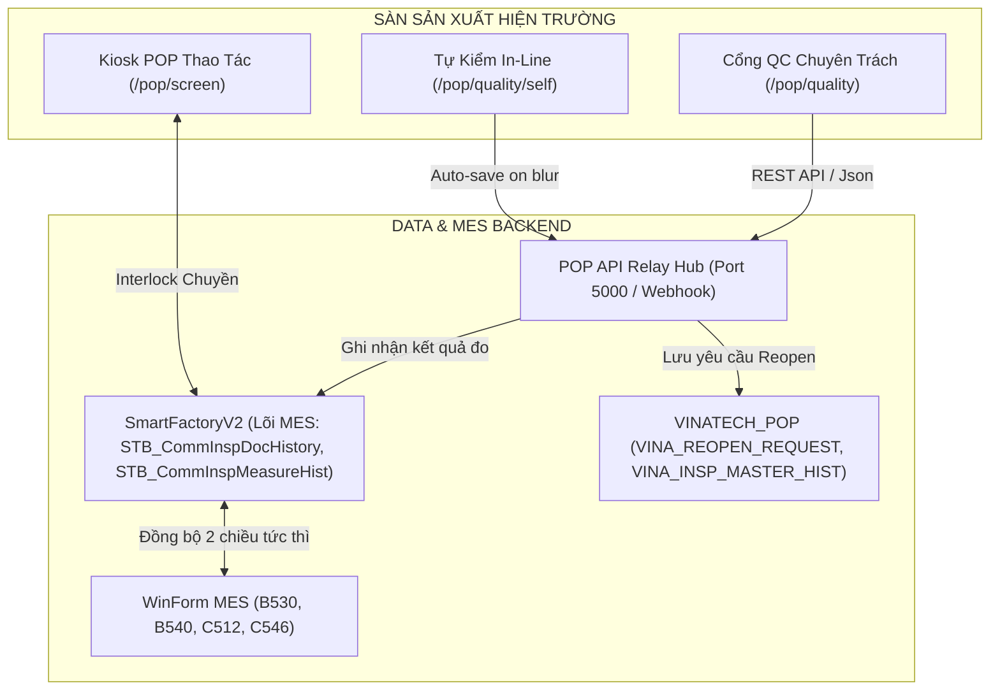
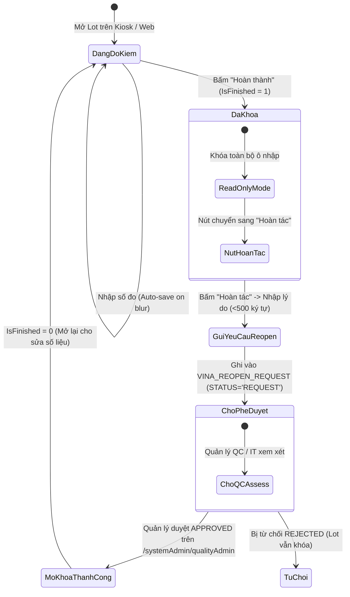

# 🔬 GIÁO TRÌNH ĐÀO TẠO PHÂN HỆ QUẢN LÝ CHẤT LƯỢNG WEB POP (POP QUALITY)
## Hệ Thống Kiosk Sản Xuất & Kiểm Soát Chất Lượng — VINATech VINA Co., Ltd
> **Cổng truy cập:** `https://pop.vinatech.com/pop/quality` & `https://pop.vinatech.com/pop/quality/self`  
> **Tài liệu phục vụ:** Đào tạo Kỹ sư IT, Quản lý Chất lượng (QA/QC), Kỹ thuật viên hiện trường & Tổ trưởng sản xuất  
> **Phiên bản:** 2026-Q3 | **Biên soạn:** Kỹ sư IT Nguyễn Văn Đức (vanduc - EA Team)  
> **Cơ sở dữ liệu liên đới:** `SmartFactoryV2` (MES Core) & `VINATECH_POP` (Kiosk Engine)

---

## ⛔ NGUYÊN TẮC CỐT LÕI KHI ĐÀO TẠO & DEMO (ZERO DATA MODIFICATION)

> [!CAUTION]
> **QUY TẮC BẤT BIẾN KHI THỰC HÀNH DEMO TRÊN LIVE WEB:**
> 1. **CHẾ ĐỘ DEMO XEM DỮ LIỆU (READ-ONLY DEMO):** Mọi thao tác trong buổi đào tạo chỉ nhằm mục đích minh họa giao diện, giải thích luồng nghiệp vụ và tra cứu dữ liệu. **TUYỆT ĐỐI KHÔNG BẤM NÚT "LƯU", KHÔNG BẤM NÚT "HOÀN THÀNH" (COMPLETE) TRÊN CÁC LOT SẢN XUẤT THẬT!**
> 2. **LƯU Ý ĐẶC BIỆT VỀ CƠ CHẾ AUTO-SAVE ON BLUR:** Tại giao diện Tự kiểm In-Line (`/pop/quality/self`), khi con trỏ chuột rời khỏi ô nhập dữ liệu (sự kiện `blur`), hệ thống sẽ **TỰ ĐỘNG GHI ĐÈ XUỐNG DATABASE VÀ ĐỒNG BỘ VỀ CORE MES**. Do đó:
>    - **Khi demo chỉ dẫn:** Chỉ click chọn xem các hạng mục, chỉ ra dải Spec (USL/LSL) và giải thích các số liệu mẫu đã đo sẵn.
>    - **Không nhập số giả định vào các ô trống của Lot đang sản xuất thật rồi click chuột ra ngoài.**
>    - **Để demo cơ chế khóa phiên:** Sử dụng các mã Lot **ĐÃ HOÀN THÀNH (`IsFinished = 1`)** được cấp trong tài liệu này (hệ thống sẽ ở chế độ Read-only 100%, an toàn tuyệt đối).

---

## 📑 MỤC LỤC BÀI GIẢNG

- [Phần 1: Tổng Quan Kiến Trúc Phân Hệ Chất Lượng Web POP](#phần-1-tổng-quan-kiến-trúc-phân-hệ-chất-lượng-web-pop)
- [Phần 2: Cấu Trúc 7 Tab Nghiệp Vụ Trên Giao Diện Quality Web](#phần-2-cấu-trúc-7-tab-nghiệp-vụ-trên-giao-diện-quality-web)
- [Phần 3: Trọng Tâm — Hướng Dẫn Tự Kiểm Tại Chuyền (`/pop/quality/self`)](#phần-3-trọng-tâm--hướng-dẫn-tự-kiểm-tại-chuyền-popqualityself)
- [Phần 4: Cơ Chế Khóa Phiên & Quy Trình Hoàn Tác (Reopen Request)](#phần-4-cơ-chế-khóa-phiên--quy-trình-hoàn-tác-reopen-request)
- [Phần 5: Danh Sách Mã Lot Thực Tế Dùng Để Demo Giáo Trình](#phần-5-danh-sách-mã-lot-thực-tế-dùng-để-demo-giáo-trình)
- [Phần 6: Kịch Bản Thao Tác Mẫu Từng Bước Cho Giảng Viên (Trainer Script)](#phần-6-kịch-bản-thao-tác-mẫu-từng-bước-cho-giảng-viên-trainer-script)
- [Phần 7: Sổ Tay Xử Lý Lỗi Thường Gặp (QC Troubleshooting FAQ)](#phần-7-sổ-tay-xử-lý-lỗi-thường-gặp-qc-troubleshooting-faq)

---

## PHẦN 1: TỔNG QUAN KIẾN TRÚC PHÂN HỆ CHẤT LƯỢNG WEB POP

### 1.1 Vai Trò Của Web POP Quality Trong Chuỗi Sản Xuất
Hệ thống Quản lý Chất lượng Web POP (`https://pop.vinatech.com/pop/quality`) là cổng giao tiếp thời gian thực dành cho bộ phận Kiểm soát Chất lượng (QC) và Công nhân vận hành máy (Operator) trên sàn xưởng.

Trước đây, công tác đo kiểm phải thực hiện qua các màn hình WinForm C# trên máy tính bàn (C110, C220, C310, C512, B597...). Việc chuyển đổi sang Web POP đem lại:
- **Thao tác chạm cảm ứng (Touch-friendly):** Phù hợp máy tính All-in-One / Tablet tại từng trạm máy.
- **Auto-Save on Blur:** Loại bỏ việc phải ấn nút lưu liên tục, chống mất mát dữ liệu khi mất điện hoặc lỗi mạng cục bộ.
- **Interlock Real-time:** Dữ liệu đo kiểm NG lập tức khóa công đoạn tiếp theo trên MES Core, ngăn chặn sản phẩm lỗi lọt sang khâu sau.



### 1.2 Ma Trận Ánh Xạ Giữa Web POP Và Core MES
Mọi tab chức năng trên Web POP đều tương ứng với màn hình WinForm và bảng CSDL chuẩn:

| Chức Năng Trên Web POP | Màn Hình WinForm Tương Đương | Bảng CSDL Chính (`SmartFactoryV2` / `VINATECH_POP`) | API Backend |
| :--- | :---: | :--- | :--- |
| **Tự kiểm In-Line (`/pop/quality/self`)** | `B597`, `C443` | `STB_CommInspDocHistory`, `STB_CommInspDocItem`, `STB_CommInspMeasureHist` | `POST /api/quality/saveInspection` |
| **IQC (Nguyên vật liệu đầu vào)** | `C110`, `C220` | `STB_MaterialQcInfo`, `STB_MaterialLotInfo`, `STB_MaterialMaster` | `GET /api/pop/quality/getIQCList` |
| **Process (PQC Công đoạn)** | `C220`, `C530` | `STB_CommInspDocHistory`, `STB_CommInspMeasureHist`, `STB_DefectRepairInfo` | `GET /api/pop/quality/getPQCList` |
| **OQC (Thành phẩm xuất xưởng)** | `C310`, `C512` | `STB_MaterialQcInfo` (`InspectionDocType='OQC'`), `STB_SetInfo` | `GET /api/pop/quality/getOQCList` |
| **FOQC (Kiểm định xuất khẩu)** | `C518` | `STB_MaterialQcInfo` (`InspectionDocType='FOQC'`), `Stb_ModelNotFOQC` | `GET /api/pop/quality/getFOQCList` |
| **Route Judge (Phán định tuyến P/F)** | `C546`, `C560` | `STB_ProdRouteHist.CompleteRoute`, `VINA_BLOOM_JUDGE_HISTORY` | `GET /api/pop/quality/getRouteJudgeList` |
| **Quản trị & Mở khóa hoàn tác** | `/systemAdmin/qualityAdmin` | `VINATECH_POP.dbo.VINA_REOPEN_REQUEST`, `VINA_REOPEN_POLICY` | `POST /api/quality/approveReopen` |

---

## PHẦN 2: CẤU TRÚC 7 TAB NGHIỆP VỤ TRÊN GIAO DIỆN QUALITY WEB

Khi truy cập vào `https://pop.vinatech.com/pop/quality`, thanh điều hướng Header hiển thị 7 tab nghiệp vụ:

```
https://pop.vinatech.com/pop/quality
├── 🧪 [Tab 1] IQC: Kiểm tra chất lượng nguyên vật liệu đầu vào trước khi cấp cho xưởng
├── ⚙️ [Tab 2] Process (PQC): Đo kiểm thông số công đoạn (Cuộn, Hàn, Bọc vỏ, Trộn, Mạ...)
├── 📦 [Tab 3] OQC: Kiểm định chất lượng thành phẩm đóng gói trước khi nhập kho
├── 🏁 [Tab 4] FOQC: Final Outgoing Quality Control (Kiểm tra độ tin cậy xuất xưởng)
├── ⚖️ [Tab 5] Route Judge (P/F): Phán định Đạt/Không đạt điều hướng Lot đặc biệt
├── 📜 [Tab 6] Inspection Records: Tra cứu lịch sử biên bản đo kiểm và xuất báo cáo
└── 👤 [Tab 7] Self Insp. View: Màn hình tự kiểm tại chuyền của công nhân vận hành
```

### Chi Tiết Nghiệp Vụ Từng Tab:
1. **Tab 1 — IQC (Incoming Quality Control):**
   - **Mục tiêu:** Tiếp nhận và kiểm tra vật liệu từ nhà cung cấp (Foil nhôm, than hoạt tính, dung dịch điện giải, vỏ nhôm, màng ngăn Separator, cao su nút, chân cắm terminal, thùng carton...).
   - **Quy trình:** Quét mã lô NVL (`MaterialLotID`) hoặc mã PO ➔ Hệ thống tải bộ chỉ tiêu AQL ➔ Nhập số lượng lấy mẫu, số phế phẩm phát hiện ➔ Phán định: **`Pass`** (Nhập kho sử dụng `ROH_VN_WH`), **`Reject`** (Trả NCC), hoặc **`Hold`** (Chờ giải trình).
2. **Tab 2 — Process PQC (In-Process Quality Control):**
   - **Mục tiêu:** QC chuyên trách đo kiểm đột xuất hoặc định kỳ theo ca trên từng máy sản xuất.
   - **Quy trình:** Chọn Nhà máy (Bắc Ninh / Bắc Giang) ➔ Chọn Dây chuyền (Line) ➔ Chọn Công đoạn (Route: V-22 Winding, V-24 Cuốn mép, V-27 Bọc vỏ...) ➔ Tải danh sách Lot đang chạy trên máy ➔ Kiểm tra dung sai kỹ thuật.
3. **Tab 3 — OQC (Outgoing Quality Control):**
   - **Mục tiêu:** Kiểm tra lô hàng đã đóng gói thành phẩm trước khi thủ kho nhấn nhận vào kho `FINISH_VN_WH`.
   - **Quy trình:** Kiểm tra ngoại quan thùng, tem nhãn Sanmina/chuẩn, đo kích thước hộp, kiểm tra quy cách dán băng dính và seal niêm phong.
4. **Tab 4 — FOQC (Final Outgoing Quality Control):**
   - **Mục tiêu:** Kiểm định các lô hàng đặc biệt dành cho khách hàng xuất khẩu có yêu cầu nghiêm ngặt (châu Âu, Mỹ, Nhật Bản). Cấp chứng thư phân tích xuất xưởng (COA).
5. **Tab 5 — Route Judge (Pass/Fail Phán Định Tuyến):**
   - **Mục tiêu:** Cho phép QC Trưởng hoặc Trưởng ca quyết định cho phép Lot tiếp tục đi công đoạn tiếp theo hay chuyển sang tuyến sửa chữa (Rework) hoặc hạ cấp (Scrap).
6. **Tab 6 — Inspection Records (Lịch Sử Kiểm Định):**
   - **Mục tiêu:** Tra cứu lại toàn bộ các biên bản kiểm tra trong quá khứ theo Barcode, Khoảng ngày, Model hoặc Mã nhân viên đo. Hỗ trợ xem biểu đồ phân bố và trích xuất dữ liệu phục vụ kiểm toán khách hàng.
7. **Tab 7 — Self Insp. View (`/pop/quality/self`):**
   - **Mục tiêu:** Cửa sổ làm việc nhanh được tích hợp sẵn từ Kiosk để công nhân tự đo mẫu đầu ca và giữa ca.

---

## PHẦN 3: TRỌNG TÂM — HƯỚNG DẪN TỰ KIỂM TẠI CHUYỀN (`/pop/quality/self`)

Phân hệ Tự kiểm là nơi công nhân và QC hiện trường thao tác nhiều nhất hàng ngày.

### 3.1 Bố Cục Màn Hình Tự Kiểm (5 Vùng Thao Tác)

```
+-----------------------------------------------------------------------------------------------------+
| [⬅ Quay lại Kiosk]    TỰ KIỂM TRA CHẤT LƯỢNG (IN-LINE PQC)    Người KT: [32010009 - Nguyễn Văn A] ↻ |
+-----------------------------------------------------------------------------------------------------+
| THÔNG TIN LOT: Barcode: VVQR283R033538 | Model: WEC3R0335QG (ECVT30-372) | Công đoạn: ROUTE_TEST2    |
+------------------------------------+----------------------------------------------------------------+
| [DANH SÁCH CHỈ TIÊU ĐO]            | [VÙNG NHẬP DỮ LIỆU ĐO MẪU & SPEC DUNG SAI]                     |
|                                    |                                                                |
| 1. V_LENGTHP (Chiều dài lá cực +)  | Hạng mục: V_LENGTHP (Chiều dài lá cực dương)                  |
|    - Tiêu chuẩn: 94.0 ~ 96.0 mm    | Tiêu chuẩn: 95.0 ± 1.0 mm  | Dưới (LSL): 94.0 | Trên (USL): 96.0|
|    - Đã đo: 2/3 mẫu                | Số mẫu mục tiêu: [ 3 ]     | Đã đo: [ 2 ]                      |
|                                    |                                                                |
| 2. V_LENGTHM (Chiều dài lá cực -)  | MẪU ĐO #1: [ 95.00 ] -> [OK] (Xanh lá)                         |
|    - Tiêu chuẩn: 79.0 ~ 91.0 mm    | MẪU ĐO #2: [ 95.00 ] -> [OK] (Xanh lá)                         |
|    - Đã đo: 2/3 mẫu                | MẪU ĐO #3: [       ] -> (Đang chờ nhập)                        |
|                                    |                                                                |
| 3. V_THICKP (Độ dày lá cực +)      | Nút: [+] Thêm mẫu đo    [-] Bớt mẫu đo                         |
| 4. V_WAppInsp (Ngoại quan cuộn)    |                                                                |
| 5. V_ESR (Điện trở nội ESR)        | BIỂU ĐỒ XU HƯỚNG (TREND CHART): [ Theo dõi biến thiên dải đo ] |
+------------------------------------+----------------------------------------------------------------+
| Trạng thái: ĐANG THỰC HIỆN        | Nút Thao Tác: [ LÀM MỚI ]  |  [ HOÀN THÀNH ] (Màu xanh dương)  |
+-----------------------------------------------------------------------------------------------------+
```

### 3.2 Cơ Chế Auto-Save On Blur & Đổi Màu Trực Quan Real-Time
1. **Cơ Chế Auto-Save On Blur:**
   - Khi công nhân nhập một con số đo (ví dụ: `95.0`) vào ô Mẫu đo, ngay khi **chạm tay ra ngoài ô nhập** hoặc **nhấn Tab/Enter**, trình duyệt kích hoạt sự kiện `blur`.
   - JavaScript Client (`popQualityInsp.js`) lập tức gửi lệnh HTTP POST ngầm lên API:
     ```http
     POST /api/quality/saveInspection
     Content-Type: application/json
     {
       "commInspDocNo": "20260929000174",
       "itemCode": "V_LENGTHP",
       "measureSeq": 3,
       "numericMeasure": 95.2,
       "workerCode": "32010009"
     }
     ```
   - Dữ liệu được ghi thẳng vào bảng `SmartFactoryV2.dbo.STB_CommInspMeasureHist`.
   - **Ưu điểm:** Không bao giờ sợ mất dữ liệu khi mất mạng hoặc lỡ tắt trình duyệt.
   - **Cảnh báo giảng dạy:** Giải thích cho học viên hiểu rằng chỉ cần gõ và click ra ngoài là dữ liệu đã ghi xuống DB thật, nên khi làm việc thực tế phải kiểm tra kỹ trước khi gõ.
2. **Phán Định Màu Tự Động:**
   - **`PASS (Hợp cách)`:** Giá trị đo nằm trong dải $[LSL, USL]$ $\rightarrow$ Ô đo hiển thị **Màu Xanh Lá (Green)**, nhãn trạng thái hiện chữ `OK`.
   - **`FAIL / NG (Không đạt)`:** Giá trị đo $< LSL$ hoặc $> USL$ $\rightarrow$ Ô đo lập tức nhấp nháy chuyển sang **Màu Đỏ (Red)**, nhãn hiện `NG`.
3. **Thêm / Bớt Mẫu Đo `[+]`:**
   - Trường hợp quy cách yêu cầu đo thêm (ví dụ phát hiện điểm nghi ngờ cần đo kiểm chứng mẫu số 4, số 5), chạm nút **`[+]`** để tăng số ô nhập mẫu.

---

## PHẦN 4: CƠ CHẾ KHÓA PHIÊN & QUY TRÌNH HOÀN TÁC (REOPEN REQUEST)

Đây là quy trình kiểm soát chất lượng chuẩn ISO / IATF 16949 quan trọng nhất cần đào tạo kỹ lưỡng.

### 4.1 Cơ Chế Khóa Phiên Khi Bấm "Hoàn Thành" (Complete Interlock)
- Khi toàn bộ các mẫu đo bắt buộc đã nhập xong, nút góc dưới bên phải sáng màu xanh dương: **`Hoàn thành`**.
- Khi người dùng bấm **`Hoàn thành`**:
  1. Hệ thống cập nhật trường `IsFinished = 1` trong bảng `SmartFactoryV2.dbo.STB_CommInspDocHistory`.
  2. Toàn bộ các ô nhập dữ liệu của Lot này lập tức chuyển sang chế độ **Read-only (Chỉ đọc - màu xám)**, ngăn chặn bất kỳ hành vi chỉnh sửa số liệu nào sau khi đã chốt.
  3. Nút **`Hoàn thành` (Màu xanh dương)** tự động chuyển thành nút **`Hoàn tác` (Màu xám)**.
  4. Hệ thống mở khóa công đoạn tiếp theo trên dây chuyền sản xuất MES Core.



### 4.2 Quy Trình Xin Phê Duyệt Mở Lại Phiên Đo Kiểm (Reopen Request)
Nếu công nhân bấm nhầm nút "Hoàn thành" trong khi chưa đo xong, hoặc phát hiện thiết bị đo bị sai lệch cần hiệu chuẩn và đo lại:

#### Bước 1: Thao tác phía Người thực hiện (Operator / QC Line)
1. Tại màn hình phiếu kiểm tra đang bị khóa, bấm vào nút **`Hoàn tác`**.
2. Một hộp thoại popup xuất hiện: **"Yêu cầu mở lại phiếu kiểm tra chất lượng"**.
3. Người dùng nhập lý do rõ ràng vào khung văn bản (tối đa 500 ký tự).  
   *Ví dụ lý do hợp lệ:* `"Bấm nhầm nút hoàn thành khi mới đo được 2/3 mẫu, xin mở lại để nhập nốt mẫu 3"` hoặc `"Thước kẹp bị lệch chuẩn, xin mở lại để đo lại bằng panme"`.
4. Bấm **`Gửi yêu cầu`**. Hệ thống ghi bản ghi vào bảng `VINATECH_POP.dbo.VINA_REOPEN_REQUEST` với cờ `STATUS = 'REQUEST'`.

#### Bước 2: Thao tác phía Cấp Phê Duyệt (QC Manager / Kỹ sư IT)
1. Quản lý chất lượng hoặc Kỹ sư IT truy cập vào trang: `https://pop.vinatech.com/systemAdmin/qualityAdmin`.
2. Chọn Tab **`되돌리기 요청 (Yêu cầu hoàn tác)`**.
3. Xem thông tin Barcode, người gửi, thời gian và nội dung giải trình.
4. Bấm nút **`승인 (Phê duyệt)`**.  
   *Ngay lập tức:* Backend POP cập nhật `STATUS = 'APPROVED'` và tự động kích hoạt trigger/SP đặt lại cờ `IsFinished = 0` trên bảng `SmartFactoryV2.dbo.STB_CommInspDocHistory`.
5. Tại màn hình Kiosk hiện trường, công nhân chỉ cần bấm nút `↻ Làm mới` là các ô nhập sẽ mở khóa trở lại bình thường.

---

## PHẦN 5: DANH SÁCH MÃ LOT THỰC TẾ DÙNG ĐỂ DEMO GIÁO TRÌNH

Toàn bộ các mã Lot dưới đây là **dữ liệu sản xuất thực tế ngày 28/09 - 29/09/2026** được trích xuất từ cơ sở dữ liệu production, đảm bảo có đầy đủ dữ liệu cấu hình để giảng viên trình chiếu trực tiếp trên máy chiếu:

### BẢNG TRA CỨU LOT DEMO THEO MỤC TIÊU BÀI HỌC

| STT | Mã Barcode Lot | Mã Phiếu DocNo | Mã Sản Phẩm | Tên / Quy Cách Model | Công Đoạn / Route | Trạng Thái Phiên | Mục Tiêu Giảng Dạy Demo |
| :-: | :--- | :--- | :--- | :--- | :--- | :---: | :--- |
| **1** | **`VVQR283R033538`** | `20260929000174` | `ECVT30-372` | HY-CAP WEC3R0335QG (0820 Low) | `ROUTE_TEST2` (Lắp ráp Cell) | **Chưa khóa**<br>(`IsFinished = False`) | ⭐ **DEMO CHÍNH: TỰ KIỂM DỞ DANG**<br>- Có sẵn 44 chỉ tiêu đo.<br>- Mẫu 1 & 2 đã có số liệu thật (95mm, 80mm).<br>- Minh họa dải Spec USL/LSL và ô mẫu 3 đang chờ.<br>- Nút Hoàn thành màu xanh dương. |
| **2** | **`VWQR2820001E07`** | `20260929000176` | `CRYPK0-022` | Băng Điện Cực Phủ Than | `ROUTE_ELECTRODE_QC_WF2` | **Chưa khóa**<br>(`IsFinished = False`) | **DEMO PQC DÂY CHUYỀN ĐIỆN CỰC**<br>- Minh họa kiểm soát độ dày mạ (µm), mật độ cán cuộn và khổ xẻ slitting. |
| **3** | **`VVQR282R718605`** | `20260929000098` | `ECVT27-350` | Siêu Tụ Điện 3.0V 500F | `ROUTE_TEST2_HY` | **ĐÃ HOÀN THÀNH**<br>(`IsFinished = True`)<br>*Pass 06:07 AM 29/09* | ⭐ **DEMO KHÓA PHIÊN & NÚT HOÀN TÁC**<br>- Chế độ Read-only an toàn 100% không sợ ghi đè.<br>- Minh họa nút "Hoàn tác" và popup xin Reopen. |
| **4** | **`VVQR203R825701`** | `20260920000162` | `LIVT38-009` | VEL13353R8257G (1335) | `ROUTE_TEST2` | **Đã có Yêu cầu Reopen** | **DEMO TIỀN LỆ LỖI THỰC TẾ**<br>- Minh họa bản ghi Reopen trong CSDL với lý do thật: `"ko nhap dc kt"`. |
| **5** | **`MVVQR296R030613`** | *(MaterialQcNo)* | `RDMD00-266` | Hộp Đóng Gói Module 16V | Tab **OQC** | **Đạt (Pass)**<br>*SL: 500 / Mẫu: 50* | **DEMO KIỂM ĐỊNH THÀNH PHẨM (OQC)**<br>- Minh họa cách kiểm tra lô xuất xưởng trước khi nhập kho thành phẩm. |
| **6** | **`26092800012`** | *(MaterialQcNo)* | `BELAB0-010` | Cuộn Tem Nhãn Barcode | Tab **IQC** | **Đang Chờ (None)**<br>*SL: 5000 / NCC: PGH* | **DEMO KIỂM TRA NVL ĐẦU VÀO (IQC)**<br>- Minh họa trạng thái lô hàng mới nhập kho, đang chờ kiểm định ngoại quan & kích thước. |
| **7** | **`VVQR163R072747`** | *(Defect Record)* | `ECVT30-357` | HY-CAP VEC3R0727QG (35105) | Công đoạn `V-27_HY` | **Phát sinh NG: 2 ea** | **DEMO QUẢN LÝ PHẾ PHẨM (DEFECT)**<br>- Minh họa mã lỗi `V-27_5VS_HY` (Lỗi bọc vỏ) hiển thị trong báo cáo chất lượng. |

---

## PHẦN 6: KỊCH BẢN THAO TÁC MẪU TỪNG BƯỚC CHO GIẢNG VIÊN (TRAINER SCRIPT)

Giảng viên thực hiện tuần tự theo 4 bước dưới đây để dẫn dắt học viên:

### BƯỚC 1: HƯỚNG DẪN ĐĂNG NHẬP & TRUY CẬP GIAO DIỆN CHẤT LƯỢNG (3 phút)
- **Hành động:** 
  1. Mở trình duyệt Chrome/Edge, truy cập `https://pop.vinatech.com/`.
  2. Đăng nhập bằng tài khoản nội bộ (SSO).
  3. Chọn Nhà máy: **VINATech VINA Co.,Ltd (Việt Nam)**.
  4. Trên thanh Menu trên cùng hoặc từ Kiosk `/pop/screen`, chọn nút **"Tự kiểm"** hoặc gõ trực tiếp URL `https://pop.vinatech.com/pop/quality`.
- **Lời thoại giảng viên:**
  > *"Thưa các bạn, toàn bộ hệ thống kiểm soát chất lượng của Vinatech hiện nay đã được chuyển giao hoàn toàn lên nền tảng Web POP. Chúng ta có thể truy cập từ máy tính bảng, màn hình Kiosk xưởng hoặc máy tính làm việc của phòng QC. Bây giờ chúng ta cùng mở giao diện Tự kiểm tại chuyền để xem cách hệ thống tự động tải tiêu chuẩn đo."*

---

### BƯỚC 2: DEMO GIAO DIỆN TỰ KIỂM ĐANG CHẠY — LOT `VVQR283R033538` (7 phút)
- **Hành động:**
  1. Tại ô tìm kiếm Barcode trên màn hình Tự kiểm, nhập hoặc quét mã: **`VVQR283R033538`**.
  2. Nhấn Tìm kiếm (Load Data).
- **Điểm giảng viên cần trỏ vào màn hình để giải thích:**
  1. **Header:** Trỏ vào thông tin Model `WEC3R0335QG (ECVT30-372)` và Mã nhân viên kiểm tra `32010009`.
  2. **Khung danh sách chỉ tiêu bên trái:** Chỉ ra rằng Model này có tổng cộng **44 hạng mục kiểm tra** được nạp tự động từ Master MES.
  3. **Hạng mục `V_LENGTHP` (Chiều dài cực dương):**
     - Cho học viên xem Spec: Giới hạn dưới LSL = `94.0 mm`, Giới hạn trên USL = `96.0 mm`.
     - Mẫu #1 đã đo là `95.00` $\rightarrow$ Nền màu **Xanh lá cây** (Pass).
     - Mẫu #2 đã đo là `95.00` $\rightarrow$ Nền màu **Xanh lá cây** (Pass).
     - Mẫu #3 đang để trống $\rightarrow$ Đây là lý do Lot này chưa bấm hoàn thành.
  4. **Giải thích cơ chế Auto-Save on Blur (LƯU Ý: KHÔNG GÕ SỐ THẬT):**
     > *"Các bạn chú ý, trên giao diện này hoàn toàn không có nút 'Lưu từng dòng'. Chỉ cần công nhân gõ giá trị đo và click chuột ra vùng trống bên ngoài, hệ thống sẽ tự động gửi lệnh POST ngầm xuống CSDL SmartFactoryV2 trong vòng 0.05 giây. Nếu đo ra 93.5 (dưới 94.0), ô sẽ lập tức đổi sang màu ĐỎ cảnh báo lỗi NG."*
  5. **Nút Hoàn thành:** Chỉ ra nút góc dưới bên phải đang có **Màu xanh dương** chữ **`Hoàn thành`**, cho biết phiên đo này vẫn đang mở cho ca làm việc tiếp tục thao tác.

---

### BƯỚC 3: DEMO CHẾ ĐỘ KHÓA PHIÊN & HOÀN TÁC — LOT `VVQR282R718605` (5 phút)
- **Hành động:**
  1. Trên ô Barcode, nhập mã: **`VVQR282R718605`**.
  2. Nhấn Tìm kiếm.
- **Điểm giảng viên cần trỏ vào màn hình để giải thích:**
  1. **Chế độ Read-only an toàn:** Cho học viên thấy toàn bộ các ô nhập dữ liệu đều bị mờ/khóa xám. Click chuột vào không gõ được chữ.
  2. **Nút Hoàn tác:** Trỏ vào nút góc dưới bên phải: Lúc này nút màu xanh dương đã biến mất, thay bằng nút màu xám có chữ **`Hoàn tác`**.
  3. **Thao tác thử nút Hoàn tác (Popup Demo):**
     - Giảng viên bấm thử vào nút **`Hoàn tác`**.
     - Một hộp thoại hiện lên yêu cầu: *"Nhập lý do mở lại phiên kiểm tra chất lượng (Tối đa 500 ký tự)"*.
     - Giảng viên giải thích: *"Khi gửi lý do ở đây, yêu cầu sẽ được chuyển tới Quản lý QC và IT trên trang /systemAdmin/qualityAdmin để duyệt. Tuyệt đối công nhân không thể tự ý sửa kết quả sau khi đã chốt."*
     - Bấm nút **`Hủy / Đóng`** popup (không bấm Gửi).

---

### BƯỚC 4: DEMO CÁC PHÂN HỆ QUẢN LÝ OQC, IQC & DEFECT SUMMARY (5 phút)
- **Hành động:**
  1. Chuyển sang Tab **`IQC`**: Nhập mã kiểm tra **`26092800012`** để minh họa lô vật tư tem nhãn `BELAB0-010` đang ở trạng thái chờ kiểm (`DecisionResult = None`).
  2. Chuyển sang Tab **`OQC`**: Nhập mã **`MVVQR296R030613`** để học viên thấy quy trình kiểm tra ngoại quan và dán tem thành phẩm trước khi xuất xưởng.
  3. Trình chiếu bảng **Defect Summary**: Minh họa cách thức các phế phẩm công đoạn (ví dụ Lot `VVQR163R072747` lỗi `V-27_5VS_HY`) được liên kết chặt chẽ giữa Kiosk sản xuất và biên bản chất lượng PQC.

---

## PHẦN 7: SỔ TAY XỬ LÝ LỖI THƯỜNG GẶP (QC TROUBLESHOOTING FAQ)

### 1. Lỗi POP-ERR-26: "작업자를 먼저 지정해 주세요" (Chưa chọn người kiểm tra)
- **Triệu chứng:** Khi công nhân nhập số liệu hoặc bấm lưu trên `/pop/quality/self`, màn hình báo lỗi tiếng Hàn: `"작업자를 먼저 지정해 주세요. (검사자 미기록 저장 불가)"`.
- **Nguyên nhân:** Ô mã nhân viên kiểm tra (`INSPECTOR_ID` / `InspWorkerCode`) bị bỏ trống. Hệ thống khóa chặn theo quy chuẩn ISO/IATF 16949 (không cho phép ghi nhận kết quả vô danh).
- **Cách xử lý tại xưởng:**
  1. Chạm vào ô **`검사자` (Người kiểm tra)** ở góc trên cùng bên phải màn hình.
  2. Dùng máy quét barcode quét mã thẻ nhân viên (hoặc chọn tên từ danh sách ca).
  3. Sau khi tên nhân viên hiện lên, tiếp tục nhập dữ liệu bình thường.

### 2. Hiện tượng "Số mẫu mục tiêu là 0" (Không hiện ô nhập số liệu)
- **Triệu chứng:** Chọn hạng mục kiểm tra nhưng màn hình thông báo: *"Số mẫu mục tiêu là 0 — tăng số mẫu mục tiêu ở khung quy cách để hiện ô nhập"*.
- **Nguyên nhân:** Model này chưa được thiết lập số mẫu mặc định trong bảng Master `STB_CommInspIndividualSpec` hoặc ca trước đặt về 0.
- **Cách xử lý tại xưởng:**
  1. Chạm vào ô số mẫu `0/0` ở khung quy cách bên phải (dưới ô Tiêu chuẩn).
  2. Bấm nút **`[+]`** để tăng số lượng mẫu đo lên (ví dụ: 3 mẫu hoặc 5 mẫu). Các ô nhập Mẫu #1, #2, #3 sẽ lập tức xuất hiện.

### 3. Không tìm thấy thông tin Lot khi quét Barcode trên Web Quality
- **Triệu chứng:** Quét Barcode vào Web Quality nhưng hệ thống báo: `"Không tìm thấy dữ liệu kiểm tra"` hoặc không load được bảng tiêu chuẩn.
- **Nguyên nhân:**
  - Lot chưa được đưa vào sản xuất trên Line (`IsLineInput = 0` trên MES).
  - Hoặc Model sản phẩm chưa được khai báo bộ chỉ tiêu kiểm tra trên màn hình MES WinForm `C151` / bảng `STB_MaterialQcInspectionItem`.
- **Cách xử lý:** Báo kỹ sư IT (ext: EA Team) kiểm tra cấu hình Master Data của Model trên `SmartFactoryV2`.

---
> **TÀI LIỆU LƯU HÀNH NỘI BỘ — VINATECH VINA IT & QUALITY DEPARTMENT**  
> *Mọi thắc mắc kỹ thuật hoặc yêu cầu cấp quyền duyệt Reopen, liên hệ IT EA Team: Nguyễn Văn Đức (vanduc).*
