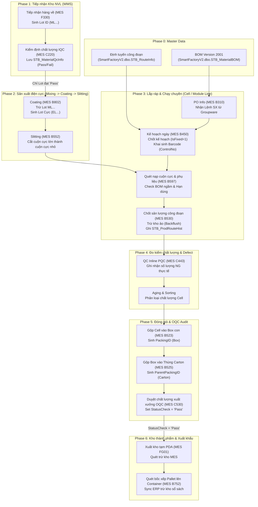

# 🏛️ TẬP 1: KIẾN TRÚC HỆ THỐNG, LUỒNG DỮ LIỆU VÀ CƠ CHẾ LIÊN THÔNG BẮN DỮ LIỆU
> **VINATECH SYSTEM ARCHITECTURE, INTEGRATION & DATA SPECIFICATION (VOLUME 1)**
>
> **Môi trường sản xuất:** SQL Server Instance: `dbserver.hycap.co.kr,5398`
> **Phạm vi áp dụng:** Hệ sinh thái phần mềm nhà máy Vinatech (Bắc Giang, Hà Nam, Hưng Yên)
>
> ← [Quay lại Mục lục chính](README.md) | 📖 [Tập 2: Quy trình nghiệp vụ & Hướng dẫn Form](VOL_02_BUSINESS_WORKFLOWS_AND_FORMS.md)

---

## 🏛️ 1. Ba Trụ Cột Kiến Trúc NAIS Framework

Hệ thống điều hành sản xuất NAIS MES vận hành dựa trên kiến trúc **Metadata-Driven** (Giao diện cấu hình động) và **Database-Centric** (Tập trung toàn bộ logic nghiệp vụ tại tầng CSDL):

```
                       [ CLIENT INTERFACE (MES GUI) ]
                                     │
                 1. Đọc Metadata     │ 2. Gọi SP thực thi
            ┌─────────────────────────┴────────────────────────┐
            ▼                                                  ▼
[ SmartFramework DB ]                                [ SmartFactoryV2 DB ]
- Menu & Phân quyền (Z410, Z220)                     - Dữ liệu nghiệp vụ thực tế
- UI Screen Layout XML                               - Logic nghiệp vụ trong SPs
- SP Routing Map (STB_ScreenObjects)                 - Lịch sử Routing (STB_ProdRouteHist)
```

### Trụ cột 1: UI Cấu Hình Động Qua XML (SmartFramework Metadata)
Màn hình NAIS MES không code cứng logic hay các grid hiển thị. Khi khởi chạy, client đọc tệp cấu hình giao diện lưu dưới dạng XML trong bảng `SmartFramework.dbo.STB_ScreenLayoutInfo` và `STB_ScreenObjects`.
*   Mỗi nút bấm "Save/Confirm" hoặc thanh tìm kiếm chỉ liên kết với tên Stored Procedure cấu hình trong DB.
*   *Lợi ích:* Sửa đổi logic nghiệp vụ chỉ cần cập nhật mã nguồn SP trong database, không cần biên dịch hay triển khai lại ứng dụng client.

### Trụ cột 2: Nghiệp Vụ Đóng Gói Hoàn Toàn Trong Stored Procedures
Toàn bộ quy tắc kiểm tra (Validation), tính toán định mức, so khớp FIFO và ghi lịch sử vận hành được thực thi tập trung bên trong các Stored Procedures. Ứng dụng client MES đóng vai trò thu thập thông tin quét và hiển thị thông điệp trả về từ DB thông qua các lệnh Raise Error của SQL Server.

### Trụ cột 3: Xử Lý Tồn Kho Trực Tiếp Tại Tầng SP (Không Dùng Trigger Giao Dịch Sản Xuất)
> [!IMPORTANT]
> **Quy tắc thiết kế hệ thống:** Hệ thống không sử dụng trigger trên các bảng sản xuất cốt lõi (như `STB_ProdRouteHist`, `STB_SetInfo`) để tự động tính toán tồn kho. 
> Logic trừ tồn kho NVL (Backflush) và cộng dồn bán thành phẩm được gọi trực tiếp tuần tự bên trong các SP nghiệp vụ sản xuất:
> `usp_DoProcessProdRouteHist` &rarr; `usp_DoProcessProdGIMaterialByBOM` &rarr; `usp_DoCreateMaterialDocLotInfoNotUsedBarcode`.

---

## 🗺️ 2. Sơ Đồ Kiến Trúc Luồng Dữ Liệu Tích Hợp (Coil-to-Container Data Flow)

Dưới đây là sơ đồ chi tiết vòng đời dữ liệu di chuyển từ cuộn nguyên liệu thô đầu vào cho đến khi đóng gói thành phẩm và xuất khẩu Container:



---

## 🗃️ 3. Vai Trò & Cấu Trúc Chi Tiết Của 13 Hệ Thống Cơ Sở Dữ Liệu

Mạng lưới thông tin của Vinatech liên thông qua 13 cơ sở dữ liệu trên SQL Server. Dưới đây là phân tích cấu trúc vật lý của từng DB:

### 3.1 AndonDB — Giám Sát Cảnh Báo & Dừng Máy
*   **Vai trò:** Nhận tín hiệu dừng máy từ các kiosk/POP trạm máy và kích hoạt còi/đèn Andon.
*   **Các bảng chính:**
    *   `STB_LineSituation_VVT` (Lịch sử sự cố dòng máy):
        *   `linecode` (`varchar(20)`, PK): Mã dây chuyền.
        *   `routecode` (`varchar(20)`, PK): Mã công đoạn (ví dụ: `V-23`, `B540`).
        *   `createdatetime` (`datetime`, PK): Thời điểm phát sinh sự cố.
        *   `status` (`int`): `0` = Bình thường, `1` = Dừng máy (Alarms), `2` = Chờ (Idle).
        *   `statusApp` / `statusEmail` (`int`): Cờ gửi thông báo (`0` = Chưa gửi, `1` = Đã gửi).
        *   `errorcode` / `errorname` (`nvarchar(1000)`): Chi tiết mã lỗi và mô tả lỗi kỹ thuật.
    *   `STB_LineInfo` (Thông tin danh mục Line):
        *   `LineCode` (`varchar(20)`, PK): Mã line.
        *   `MonitoringGroup` (`nvarchar(50)`): Gom nhóm hiển thị tivi đầu line.
    *   `STB_VVT_UserWarning` (Cấu hình người nhận tin nhắn Andon):
        *   `UserID` (`varchar(20)`, PK)
        *   `PhoneNo` (`varchar(20)`)

### 3.2 DZICUBE — Douzone Bizbox Alpha Groupware & Accounting Core
*   **Vai trò:** Quản lý quy trình chữ ký số hành chính, đối chiếu tài sản cố định và chi tiêu thẻ doanh nghiệp.
*   **Các bảng chính:**
    *   `ABDOCU` (Header chứng từ kế toán nháp phát sinh từ GW):
        *   `NO_DOCU` (`varchar(20)`, PK): Số chứng từ kế toán nháp.
        *   `CD_COMPANY` (`varchar(7)`): Mã công ty (`2000` = VN).
        *   `DT_WRITE` (`varchar(8)`): Ngày lập.
        *   `ID_WRITE` (`varchar(10)`): Người lập.
    *   `ABDOCU_D` (Chi tiết dòng chứng từ kế toán nháp):
        *   `NO_DOCU` (`varchar(20)`, PK, FK)
        *   `NO_DOLINE` (`numeric(5,0)`, PK): Số dòng.
        *   `CD_ACCT` (`varchar(10)`): Mã tài khoản định khoản kế toán (Nợ/Có).
        *   `AM_DR` (`numeric(17,4)`): Số tiền phát sinh Nợ (VND).
        *   `AM_CR` (`numeric(17,4)`): Số tiền phát sinh Có (VND).
        *   `CD_CC` (`varchar(10)`): Trung tâm chi phí (Cost Center).
        *   `CD_PARTNER` (`varchar(20)`): Mã nhà cung cấp/Khách hàng thụ hưởng.

### 3.3 erpdb — CSDL ERP Cũ (Legacy Archive)
*   **Vai trò:** Lưu trữ đóng băng phục vụ tra cứu số liệu quá khứ.
*   **Đặc thù:** Tên bảng được đặt trực tiếp bằng tiếng Hàn (Korean Collation):
    *   `사원마스타` (Sawon Master - Nhân sự): `사원번호` (Mã NV), `사원명` (Tên NV), `부서코드` (Mã phòng ban).
    *   `거래처마스타` (Georaecheo Master - Đối tác): `거래처코드` (Mã đối tác), `사업자번호` (Mã số thuế).
    *   `전표H` / `전표D` (Jeonpyo - Chứng từ kế toán cũ).

### 3.4 NEOE — ERP Douzone iU (Central General Ledger)
*   **Vai trò:** Trụ sở quản trị tài chính, Master Data và xuất nhập kho hạch toán.
*   **Các bảng chính:**
    *   `MA_ITEM` (Danh mục vật tư chính thức):
        *   `CD_ITEM` (`nvarchar(20)`, PK): Mã vật tư gốc.
        *   `NM_ITEM` / `STND_ITEM` (`nvarchar(100)`): Tên và thông số quy cách.
        *   `UNIT_IM` (`nvarchar(3)`): Đơn vị tính.
        *   `CLS_ITEM` (`nvarchar(3)`): Phân loại vật tư.
    *   `MA_PARTNER` (Danh mục đối tác):
        *   `CD_PARTNER` (`nvarchar(20)`, PK): Mã đối tác.
        *   `NO_BIZ` (`nvarchar(20)`): Mã số thuế đối tác.
    *   `PU_POH` (Header đơn mua hàng) / `PU_POL` (Line đơn mua hàng):
        *   `NO_PO` (`nvarchar(20)`, PK): Số PO mua hàng.
        *   `CD_PARTNER` (`nvarchar(20)`): Nhà cung cấp.
        *   `QT_PO` (`numeric(17,4)`): Số lượng đặt mua.
        *   `UM` / `AM` (`numeric(17,4)`): Đơn giá và thành tiền VND.
    *   `FI_DOCU` (Header bút toán sổ cái) / `FI_DOCU_D` (Line bút toán sổ cái).
    *   `PR_BOM` (Cây định mức vật tư):
        *   `CD_ITEM` (`nvarchar(20)`, PK): Thành phẩm.
        *   `CD_ITEM_SUB` (`nvarchar(20)`, PK): Vật tư cấu thành.
        *   `QT_BOM` (`numeric(17,7)`): Định mức tiêu hao.

### 3.5 SmartFactoryIncubator — Sandbox Thử Nghiệm R&D
*   **Vai trò:** Chứa dữ liệu đo kiểm tụ điện thử nghiệm của phòng R&D và lịch chuyển đổi.
*   **Các bảng chính:**
    *   `STB_CellTestResult` (Kết quả đo kiểm Cell):
        *   `ProdNo` (`varchar(50)`, PK): Mã vạch Cell.
        *   `Voltage` / `Capacitance` / `ESR` / `LeakageCurrent` (`numeric(18,6)`): Các thông số điện thế, điện dung, nội trở và dòng rò rỉ.
    *   `LUNAR_TO_SOLAR` (Bảng lịch Âm - Dương chuyển đổi):
        *   `SolarDate` (`varchar(8)`, PK)
        *   `LunarDate` (`varchar(8)`)

### 3.6 streamdocs — PDF Document Web-Stream Server
*   **Vai trò:** Quản lý metadata và an ninh hiển thị tệp PDF đính kèm của Groupware.
*   **Các bảng chính:**
    *   `pdf_resource` (Định danh tệp PDF vật lý):
        *   `file_uuid` (`varchar(50)`, PK)
        *   `file_path` (`varchar(500)`)
    *   `pdf_resource_owner` (Liên kết chủ sở hữu):
        *   `file_uuid` (`varchar(50)`, PK, FK)
        *   `document_save_code` (`varchar(50)`): Mã văn bản phê duyệt trên Groupware.
    *   `pdf_auth` (Quản lý token phiên hiển thị PDF trực tuyến):
        *   `session_token` (`varchar(500)`, PK)

### 3.7 VINATECH_DATA_KSOX — ICFR Compliance & Internal Control
*   **Vai trò:** Lưu trữ ma trận kiểm soát tài chính nội bộ phục vụ tuân thủ luật K-SOX Hàn Quốc.
*   **Các bảng chính:**
    *   `ICM_CTRLMATRIX_MT` (Master ma trận kiểm soát):
        *   `CONTROL_UUID` (`varchar(50)`, PK): ID chốt kiểm soát.
        *   `PROCESS_CODE` (`varchar(20)`): Quy trình nghiệp vụ chịu kiểm soát.

### 3.8 VINATECH_GROUP — Groupware Core Portal & Electronic Approval
*   **Vai trò:** Quản trị nhân sự, cây tổ chức và lưu trữ dữ liệu các tờ trình điện tử duyệt mua hàng, thanh toán, tuyển dụng và kế hoạch sản xuất.
*   **Các bảng chính:**
    *   `VINA_DOCUMENT_SAVE` (Header lưu trữ tất cả biểu mẫu trình duyệt):
        *   `DOCUMENT_SAVE_CODE` (`varchar(50)`, PK): Mã tờ trình duy nhất (Khóa ngoại liên kết tất cả bảng Form).
        *   `DOCUMENT_SAVE_STATE` (`varchar(50)`): Trạng thái phê duyệt (`DRAFT`, `APPROVING`, `APPROVED`, `REJECTED`).
        *   `DOCUMENT_SAVE_CONTENT` (`ntext`): Nội dung HTML hiển thị của tờ trình.
    *   `VINA_DOCUMENT_POH` (Header biểu mẫu PO Groupware):
        *   `DOCUMENT_SAVE_CODE` (`varchar(50)`, PK, FK)
        *   `NO_PO` (`nvarchar(20)`): Số đơn đặt mua hàng (Sync sang ERP).
    *   `VINA_DOCUMENT_POL` (Line biểu mẫu PO Groupware):
        *   `DOCUMENT_SAVE_CODE` (`varchar(50)`, PK, FK)
        *   `NO_PO_LINE` (`int`, PK): Số thứ tự dòng.
        *   `CD_ITEM` (`nvarchar(20)`): Mã vật tư.
        *   `QT_PO` (`numeric(17,4)`): Số lượng.
        *   `DOCUMENT_POL_REMAIN_QT_PO` (`numeric(17,4)`): Số lượng PO còn lại chưa nhận hàng.
    *   `VINA_EMP` (Danh mục nhân sự chính thức):
        *   `NO_EMP` (`nvarchar(10)`, PK): Mã nhân viên.
        *   `EMP_STOP` (`char(1)`): Cờ nghỉ việc/Khóa tài khoản (`Y` = Đã khóa, `N` = Hoạt động).
    *   `VINA_ORG_CHART_NODE` (Cây cấu trúc sơ đồ tổ chức).

### 3.9 VINATECH_POP — Point Of Production Terminal Gateway
*   **Vai trò:** Cấu hình máy trạm POP dưới xưởng, cấu hình PLC và bắt buộc quét NVL phụ.
*   **Các bảng chính:**
    *   `VINA_PC_MAC` (Map card mạng máy trạm):
        *   `PC_MAC_ADDRESS` (`varchar(50)`, PK): Địa chỉ MAC của PC trạm.
        *   `EQUIPMENT_SETTING_IDS` (`varchar(1000)`): Danh sách mã máy được PC này quản lý.
    *   `VINA_BOM_INPUT_ROUTE` (Ép quét nguyên vật liệu phụ theo công đoạn):
        *   `MATERIAL_CODE` (`nvarchar(50)`, PK): Mã thành phẩm chính.
        *   `SUB_MATERIAL_CODE` (`nvarchar(50)`, PK): Mã vật tư phụ cần quét.
        *   `INPUT_ROUTE_CODE` (`nvarchar(20)`, PK): Mã công đoạn sản xuất (Route Code).

### 3.10 VINATECH_RESTFUL — Identity & API Gateway
*   **Vai trò:** Cổng SSO tập trung xác thực một lần và quản lý IP Whitelist.
*   **Các bảng chính:**
    *   `VINA_SSO_TOKEN` (Bảng quản lý Token phiên làm việc):
        *   `ID_USER` (`varchar(20)`, PK): Mã nhân viên đăng nhập.
        *   `SSO_TOKEN_CODE` (`varchar(400)`): Mã Token JWT.
        *   `SSO_TOKEN_REG_DATE` (`datetime`): Thời điểm tạo phiên.

### 3.11 VINATECH_SPREADSHEET — Web Collaborative Spreadsheet
*   **Vai trò:** Lưu trữ dữ liệu các file Excel cộng tác trực tuyến đính kèm trong tờ trình Groupware.
*   **Các bảng chính:**
    *   `VINA_SPREAD_SHEET_JSON` (Nội dung dữ liệu bảng tính):
        *   `DOCUMENT_SAVE_CODE` (`varchar(50)`, PK): Liên kết tờ trình.
        *   `SPREAD_SHEET_JSON` (`nvarchar(max)`): Cấu trúc, giá trị, công thức lưu dạng JSON khổng lồ.

### 3.12 VINATECH_WEBSOCKET — WebSocket Real-time Router
*   **Vai trò:** Định tuyến các kết nối WebSocket thời gian thực giữa máy trạm Kiosk POP, cảm biến nhà xưởng và Tivi hiển thị Andon đầu Line.

### 3.13 WCMS_STANDARD_NEW — Cash Management System (CMS)
*   **Vai trò:** Tích hợp với ngân hàng liên kết, tự động đối chiếu và tạo bút toán đồng bộ ERP.
*   **Các bảng chính:**
    *   `WCMS_ACCOUNT_TRNX_LOG` (Nhật ký sao kê ngân hàng):
        *   `ACCOUNT_TRNX_LOG_UUID` (`nvarchar(40)`, PK)
        *   `IN_AMOUNT` / `OUT_AMOUNT` (`numeric(18,2)`): Số tiền vào / ra.
        *   `ERP_FLAG` (`nchar(1)`): Trạng thái đồng bộ ERP (`Y` = Thành công, `N` = Chờ, `E` = Lỗi).
        *   `ERP_TX_MSG` (`nvarchar(200)`): Báo lỗi phản hồi từ ERP.
    *   `WCMS_BIZ_PARTNER_ACCOUNT` (Thông tin ngân hàng thụ hưởng của nhà cung cấp phục vụ thanh toán tự động).

---

## 🔄 4. Ma Trận Ánh Xạ Biểu Mẫu Toàn Diện (Master Form-to-DB-to-MES Mapping Matrix)

Bảng dưới đây là tài liệu tham chiếu cốt lõi (Single Source of Truth) ánh xạ 17 biểu mẫu chính trên Groupware với cấu trúc bảng cơ sở dữ liệu vật lý và các màn hình, stored procedure liên đới của MES:

| STT | Tên Biểu Mẫu Nghiệp Vụ | Form ID | Bảng Dữ Liệu Groupware (VINATECH_GROUP) | Database & Bảng Liên Kết Khác | Màn Hình MES (SmartFactoryV2) | Stored Procedure Cốt Lõi |
| :--- | :--- | :--- | :--- | :--- | :--- | :--- |
| 1 | **Đề xuất mua sắm (PR)** | `purchaseRequestDocument` | `VINA_DOCUMENT_SAVE`, `VINA_DOCUMENT_PURCHASE_REQUEST` | ERP: `PU_PRH`, `PU_PRL` | *(Không có)* | `usp_SyncPurchaseRequest` |
| 2 | **Đơn đặt hàng (PO)** | `purchaseOrderDocument` | `VINA_DOCUMENT_POH`, `VINA_DOCUMENT_POL` | ERP: `PU_POH`, `PU_POL` | **B310** (PO Info) | `usp_GetPurchaseOrderList` |
| 3 | **Xác nhận hàng về** | `arrivalConfirmationDocument` | `VINA_DOCUMENT_RECEIVING_PHYSICAL_ITEM_H`, `_L` | MES: `STB_MaterialDocInfo`, `STB_MaterialDocDetail` | **F330** (Goods Receipt) | `usp_WarehouseDelivery_get` |
| 4 | **Nhập kho thực tế** | `receivingConfirmationDocument` | `VINA_DOCUMENT_PU_RCVH`, `VINA_DOCUMENT_PU_RCVL` | MES: `STB_MaterialLotInfo`<br>ERP: `PU_RCVH`, `PU_RCVL` | Kho vật lý MES | `usp_DoApplyIncomingQty` |
| 5 | **Quyết toán mua hàng** | `purchaseResolutionDocument` | `VINA_DOCUMENT_PURCHAE_RESOLUTION`, `_LINE` | ERP: `FI_DOCU`, `FI_DOCU_D` | *(Không có)* | `usp_DoCreateAccountingSlip` |
| 6 | **Đơn xin nghỉ việc** | `empRetireDocument` | `VINA_DOCUMENT_EMP_RETIRE`, `_CHECKLIST` | ERP: `MA_EMP`<br>MES Frame: `STB_UserInfo` | **Z410** (User Config) | `usp_DoGUILogin` |
| 7 | **Tăng ca ngày nghỉ/lễ** | `holidayWorkRequest` | `VINA_DOCUMENT_HOLIDAY_WORK` | MES: `STB_VN_ATTENDANCE_TIME` | Máy quét vân tay | `usp_SyncFingerData` |
| 8 | **Đơn bán hàng (Suju)** | `salesOrderDocument` | `VINA_DOCUMENT_SALES_ORDER`, `_LINE` | ERP: `SA_SOH`, `SA_SOL` | *(Không có)* | `usp_SyncSalesOrder` |
| 9 | **Yêu cầu xuất kho** | `deliverOutDocument` | `VINA_DOCUMENT_DELIVER_OUT_CONFIRMATION_IV`, `_LINE` | ERP: `SA_GIRH`, `SA_GIRL` | **FG01** (PDA Out) | `usp_GetShipmentRequestList` |
| 10 | **Xác nhận thực xuất** | `deliverOutConfirmationDocument` | `VINA_DOCUMENT_DELIVER_OUT_CONFIRMATION` | MES: `STB_SetInfo`<br>ERP: `MM_GI_LINE` | **B750** (Pallet), **B752** (Cont) | `usp_DoApplyRealShipment` |
| 11 | **Kế hoạch sản xuất ngày** | `dailyProductionOrderDocument` | `VINA_DOCUMENT_DAILY_PRODUCTION_ORDER`, `_LOT` | MES: `STB_DayProdPlan`, `STB_SetInfo` | **B450** (Prod Plan) | `usp_SyncDailyProductionPlan` |
| 12 | **Báo cáo sản lượng ngày** | `dailyProductionReportDocument` | `VINA_DOCUMENT_DAILY_PRODUCTION_ORDER_LOT` | MES: `STB_ProdRouteHist` | **B530** (Prod Input) | `usp_DoFinishRouteOperation` |
| 13 | **Yêu cầu tuyển dụng** | `empRequestDocument` | `VINA_DOCUMENT_EMP_REQUEST` | MES Frame: `STB_UserInfo` | **Z410** (User Config) | `usp_DoGUILogin` |
| 14 | **Đăng ký đi công tác** | `businessTripDocument` | `VINA_DOCUMENT_BUSINESS_TRIP` | ERP: Định khoản tạm ứng | *(Không có)* | Kế toán API |
| 15 | **Đăng ký nhà thầu/đối tác** | `partnerRegistrationDocument` | `VINA_DOCUMENT_PARTNER_REG` | ERP: `MA_PARTNER`<br>CMS: `WCMS_BIZ_PARTNER_ACCOUNT`| *(Không có)* | CMS API |
| 16 | **Yêu cầu sửa đổi BOM** | `bomRevisionDocument` | `VINA_DOCUMENT_BOM_REVISION` | ERP: `PR_BOM`<br>MES: `STB_MaterialBOM` | POP Kiosk | POP Route Config |
| 17 | **Đăng ký các loại code** | `itemRegistrationDocument` | `VINA_DOCUMENT_ITEM_REGISTRATION_H`, `_L` | ERP: `MA_ITEM`<br>MES: `STB_MaterialMaster` | **F130 / F140** | `usp_SyncMaterialMaster` |

---

## ⚡ 5. Cơ Chế Trừ Kho Tự Động & Triggers Đồng Bộ (Under-The-Hood Sync Engines)

### 5.1 Cơ chế Trigger Cascade trừ kho Nguyên vật liệu (WMS ↔ Production)
Việc cấn trừ tồn kho nguyên vật liệu diễn ra tự động thông qua chuỗi Trigger liên hoàn dưới SQL Server:

```
[Mẻ hàng B530 hoàn thành] 
        │ 
        ▼ (Gọi SP chèn dòng)
[STB_MaterialDocLotInfo] ──(Kích hoạt tgMaterialDocLotInfoIUD)──► [Cập nhật PickingQty trong STB_MaterialLotInfo]
        │
        ▼ (Xác nhận xuất vật lý)
[Giảm CurrentQty & PickingQty trong STB_MaterialLotInfo]
        │
        ▼ (Nếu CurrentQty = 0: Xóa bản ghi Lot)
        │
        ▼ (Kích hoạt tgMaterialLotInfoForUpdate)
[Đồng bộ số dư StockQty sang STB_MaterialStock]
```

#### Mã nguồn Trigger kiểm soát cờ Bypass an toàn:
Trong Trigger `tgMaterialDocLotInfoIUD` trên bảng chi tiết chứng từ, hệ thống sử dụng vùng bộ nhớ phiên làm việc (`CONTEXT_INFO`) để cho phép các SP sửa lỗi hoặc SP hủy chứng từ vượt qua kiểm tra tự động (Bypass), tránh xung đột dữ liệu:
```sql
-- Kiểm tra xem tiến trình có đang yêu cầu bypass trigger không
IF CONTEXT_INFO() = 0x999997 
BEGIN
    RETURN; -- Thoát ngay lập tức, không cập nhật PickingQty
END
```

### 5.2 Các SQL Server Agent Jobs chạy ngầm định kỳ
Hệ thống thiết lập các tác vụ ngầm tự động để đảm bảo tính liên thông và nhất quán dữ liệu liên nhà máy:

1.  **Đồng bộ dữ liệu liên nhà máy Bắc Ninh ↔ Bắc Giang:**
    *   *Job `Transfer_BacGiang_To_BacNinh`:* Chạy định kỳ mỗi 5 phút, gọi SP `usp_VN_Finshed_Waiting_BG` để đẩy thông tin các mẻ tụ bán thành phẩm từ nhà máy Bắc Giang sang cơ sở dữ liệu Bắc Ninh để tiếp tục công đoạn hoàn thiện.
    *   *Job `Transfer_BN_BG`:* Đẩy ngược thông tin hàng chờ từ Bắc Ninh về Bắc Giang để phục vụ đối soát.
2.  **Tự động chuyển hàng đóng gói sang công đoạn OQC:**
    *   *Job `vvt_productreceipt560`:* Tự động quét bảng `STB_DividePackaging` (dữ liệu gộp box thành công), chuyển thông tin sang màn hình kiểm định chất lượng xuất xưởng `C560` / `C530`.
3.  **Cảnh báo an toàn hạn dùng tự động:**
    *   *Job `MakeMaterialExpirationEmailAlert`:* Quét bảng `STB_MaterialLotInfo` hằng ngày, phát hiện các Lot nguyên vật liệu có ngày hết hạn (`LotAttr10` + Hạn dùng) nhỏ hơn 30 ngày để gửi email thông báo tự động cho bộ phận QC và Kho.

### 5.3 Cấu Hình Database Mail Gửi Cảnh Báo Tự Động
Để hệ thống SQL Agent Jobs gửi email thông báo tự động (về hạn dùng vật tư, hiệu chuẩn thiết bị) thành công, SQL Server cần cấu hình tính năng **Database Mail** thông qua SMTP Server doanh nghiệp:

#### Thông số SMTP doanh nghiệp:
*   **SMTP Server:** `smtp.office365.com` (Office 365) hoặc `smtp.gmail.com` (Google Workspace).
*   **Port:** `587` (SMTP STARTTLS).
*   **SSL (Secure Connection):** Bắt buộc bật (Yes).
*   **Tài khoản gửi:** Email hệ thống công ty (ví dụ: `mes-alert@vinatech.com.vn`).

#### Kịch bản thiết lập SQL Server Database Mail (Tối ưu hóa):
```sql
-- 1. Kích hoạt tính năng Database Mail trên SQL Instance
EXEC sp_configure 'show advanced options', 1;
RECONFIGURE;
EXEC sp_configure 'Database Mail XPs', 1;
RECONFIGURE;

-- 2. Khai báo tài khoản gửi thư (SMTP Account)
EXECute msdb.dbo.sysmail_add_account_sp
    @account_name = 'Vinatech_O365_Account',
    @email_address = 'mes-alert@vinatech.com.vn',
    @display_name = 'VINATECH MES SYSTEM ALERTS',
    @description = 'SMTP account for automated system warning emails.',
    @mailserver_name = 'smtp.office365.com',
    @port = 587,
    @enable_ssl = 1,
    @username = 'mes-alert@vinatech.com.vn',
    @password = 'Mật_Khẩu_Ứng_Dụng_Của_Email'; -- Thay bằng mật khẩu thực tế

-- 3. Tạo Profile gửi thư
EXECute msdb.dbo.sysmail_add_profile_sp
    @profile_name = 'Vinatech_Mail_Profile',
    @description = 'Database Mail Profile for Vinatech MES system notifications.';

-- 4. Liên kết SMTP Account vào Profile
EXECute msdb.dbo.sysmail_add_profileaccount_sp
    @profile_name = 'Vinatech_Mail_Profile',
    @account_name = 'Vinatech_O365_Account',
    @sequence_number = 1;

-- 5. Cấu hình Profile ở chế độ Public để Agent Jobs gọi được
EXECute msdb.dbo.sysmail_add_principalprofile_sp
    @profile_name = 'Vinatech_Mail_Profile',
    @principal_name = 'public',
    @is_default = 1;
```

---

## 🔍 6. Bộ Câu Hỏi SQL Đối Soát Hệ Thống (Golden Audit Queries)

### Mẫu 6.1: Đối chiếu đơn mua hàng (PO) liên thông Groupware ↔ ERP ↔ MES
```sql
SELECT 
    GW_H.DOCUMENT_SAVE_CODE AS [GW Doc Code],
    GW_H.NO_PO AS [PO Number],
    GW_L.CD_ITEM AS [Item Code],
    GW_L.QT_PO AS [Qty Ordered (GW)],
    GW_L.DOCUMENT_POL_REMAIN_QT_PO AS [Qty Remaining (GW)],
    -- Đối chiếu thông tin ERP
    ERP_L.QT_PO AS [Qty Registered (ERP)],
    -- Đối chiếu số liệu nhập kho thực tế tại MES
    (SELECT SUM(ML.CurrentQty) 
     FROM SmartFactoryV2.dbo.STB_MaterialLotInfo ML WITH(NOLOCK) 
     WHERE ML.PurchaseOrderNo = GW_H.NO_PO AND ML.MaterialCode = GW_L.CD_ITEM) AS [Actual Qty in MES WH]
FROM VINATECH_GROUP.dbo.VINA_DOCUMENT_POH GW_H WITH(NOLOCK)
INNER JOIN VINATECH_GROUP.dbo.VINA_DOCUMENT_POL GW_L WITH(NOLOCK) 
    ON GW_H.DOCUMENT_SAVE_CODE = GW_L.DOCUMENT_SAVE_CODE
-- Join sang ERP NEOE
LEFT JOIN NEOE.dbo.PU_POL ERP_L WITH(NOLOCK) 
    ON GW_H.NO_PO = ERP_L.NO_PO AND GW_L.CD_ITEM = ERP_L.CD_ITEM
WHERE GW_H.NO_PO = 'PO20260612001'; -- Thay bằng mã PO thực tế
```

### Mẫu 6.2: Đối soát dòng tiền ngân hàng và cờ đồng bộ ERP của Cash Management System
```sql
SELECT 
    LOG.ACCOUNT_NO AS [Bank Account],
    LOG.TRNX_DATE AS [Transaction Date],
    LOG.IN_AMOUNT AS [Amount In],
    LOG.OUT_AMOUNT AS [Amount Out],
    LOG.BOOK_DESC AS [Statement Description],
    LOG.ERP_FLAG AS [Sync State], -- 'Y' = Success, 'N' = Pending, 'E' = Error
    LOG.ERP_TX_MSG AS [Error Message from ERP]
FROM WCMS_STANDARD_NEW.dbo.WCMS_ACCOUNT_TRNX_LOG LOG WITH(NOLOCK)
WHERE LOG.ERP_FLAG <> 'Y' -- Lọc các giao dịch chưa sync thành công
  AND (LOG.IN_AMOUNT > 100000000 OR LOG.OUT_AMOUNT > 100000000); -- Lọc giao dịch trên 100 triệu VND
```

### Mẫu 6.3: Kiểm toán an ninh - Phát hiện Token SSO đang hoạt động của nhân viên đã thôi việc
```sql
SELECT 
    SSO.ID_USER AS [Active Username],
    SSO.SSO_TOKEN_CLIENT_IP AS [Client IP],
    SSO.SSO_TOKEN_REG_DATE AS [Session Created Time],
    E.EMP_STOP AS [GW Status], -- 'Y' = Đã khóa tài khoản trên Groupware
    E.DT_ENTER_LEAVE AS [Resignation Date],
    O.ORG_CHART_NODE_NAME AS [Employee Name]
FROM VINATECH_RESTFUL.dbo.VINA_SSO_TOKEN SSO WITH(NOLOCK)
INNER JOIN VINATECH_GROUP.dbo.VINA_EMP E WITH(NOLOCK) 
    ON SSO.ID_USER = E.NO_EMP AND SSO.CD_COMPANY = E.CD_COMPANY
LEFT JOIN VINATECH_GROUP.dbo.VINA_ORG_CHART_NODE O WITH(NOLOCK) 
    ON E.NO_EMP = O.NO_EMP AND E.CD_COMPANY = O.CD_COMPANY
WHERE E.EMP_STOP = 'Y' -- Lọc những tài khoản đã bị khóa/nghỉ việc nhưng token vẫn sống
   OR E.DT_ENTER_LEAVE <= CAST(GETDATE() AS DATE);
```

### Mẫu 6.4: Đối soát hiệu suất Line - Kết hợp POP quét NVL, MES chạy máy và Andon cảnh báo dừng máy
```sql
SELECT 
    SI.Barcode AS [Lot/Box No],
    SI.MaterialCode AS [Product Model],
    SI.InputLineCode AS [Line Code],
    PRH.RouteCode AS [Operation Step],
    PRH.ProdDateTime AS [MES Scan Time],
    PRH.MachineCode AS [Machine Code],
    (SELECT TOP 1 ANDON.errorname 
     FROM AndonDB.dbo.STB_LineSituation_VVT ANDON WITH(NOLOCK) 
     WHERE ANDON.linecode = SI.InputLineCode 
       AND ANDON.status = 1 -- Trạng thái dừng máy
       AND ANDON.createdatetime BETWEEN DATEADD(HOUR, -1, PRH.ProdDateTime) AND DATEADD(HOUR, 1, PRH.ProdDateTime)) AS [Coinciding Andon Error]
FROM SmartFactoryV2.dbo.STB_SetInfo SI WITH(NOLOCK)
INNER JOIN SmartFactoryV2.dbo.STB_ProdRouteHist PRH WITH(NOLOCK) 
    ON SI.ControlNo = PRH.ControlNo
WHERE SI.Barcode = 'VVPO273R010713' -- Mã Lot cần đối soát
ORDER BY PRH.ProdDateTime ASC;
```

### Mẫu 6.5: Đối chiếu Bán hàng & Xuất khẩu - Suju (SO) ↔ Shipment Request ↔ PDA FG01/B750/B752 ↔ ERP Giảm Tồn
```sql
SELECT 
    SO.NO_SO AS [Suju No],
    SOL.CD_ITEM AS [Product Code],
    SOL.QT_SO AS [SO Qty],
    SRL.QT_REQUEST AS [Shipment Request Qty],
    (SELECT COUNT(DISTINCT Barcode) 
     FROM SmartFactoryV2.dbo.STB_SetInfo WITH(NOLOCK) 
     WHERE PONo = SR.DOCUMENT_SAVE_CODE) AS [Pallets Loaded in MES],
     (SELECT SUM(QT_GI) 
      FROM NEOE.dbo.MM_GI_LINE WITH(NOLOCK) 
      WHERE NO_IS = SR.DOCUMENT_SAVE_CODE) AS [ERP Outbound Qty]
FROM VINATECH_GROUP.dbo.VINA_DOCUMENT_SALES_ORDER SO WITH(NOLOCK)
INNER JOIN VINATECH_GROUP.dbo.VINA_DOCUMENT_SALES_ORDER_LINE SOL WITH(NOLOCK)
    ON SO.DOCUMENT_SAVE_CODE = SOL.DOCUMENT_SAVE_CODE
LEFT JOIN VINATECH_GROUP.dbo.VINA_DOCUMENT_DELIVER_OUT_CONFIRMATION_IV_LINE SRL WITH(NOLOCK)
    ON SOL.CD_ITEM = SRL.CD_ITEM
LEFT JOIN VINATECH_GROUP.dbo.VINA_DOCUMENT_DELIVER_OUT_CONFIRMATION_IV SR WITH(NOLOCK)
    ON SRL.DOCUMENT_SAVE_CODE = SR.DOCUMENT_SAVE_CODE
WHERE SO.NO_SO = 'SO20260614001'; -- Mã Suju thực tế
```

### Mẫu 6.6: Đối soát Master Data & BOM - Kiểm tra tính nhất quán BOM 2001 ↔ POP Route Input Check
```sql
SELECT 
    BOM.ParentMaterialCode AS [Thành phẩm chính],
    BOM.ChildMaterialCode AS [Vật tư phụ cấu thành],
    BOM.UnitQty AS [Định mức tiêu hao],
    POP.INPUT_ROUTE_CODE AS [Công đoạn ép quét POP]
FROM SmartFactoryV2.dbo.STB_MaterialBOM BOM WITH(NOLOCK)
LEFT JOIN VINATECH_POP.dbo.VINA_BOM_INPUT_ROUTE POP WITH(NOLOCK)
    ON BOM.ParentMaterialCode = POP.MATERIAL_CODE AND BOM.ChildMaterialCode = POP.SUB_MATERIAL_CODE
WHERE BOM.ParentMaterialCode = '3562-600F' -- Mã sản phẩm cần đối soát
  AND BOM.IsUse = 1;
```

---

## 🔍 7. Hướng Dẫn Sử Dụng Script PowerShell Bổ Trợ

Các file script được lưu trữ trực tiếp tại thư mục `SYSTEM_MASTER_KNOWLEDGE_BASE/scripts/`.

### 7.1 `run_query.ps1` — Chạy truy vấn SQL nhanh
Dùng để thực thi các câu lệnh đọc dữ liệu (`SELECT`) trực tiếp từ Terminal và định dạng hiển thị kết quả.
*   **Cú pháp:**
    ```powershell
    powershell -File .\scripts\run_query.ps1 -Query "Nội_dung_câu_lệnh_SQL" [-Format Table|JSON|CSV]
    ```
*   **Ví dụ đối soát nhanh:**
    ```powershell
    powershell -File .\scripts\run_query.ps1 -Query "SELECT TOP 3 Barcode, CurrentQty, LocationCode FROM SmartFactoryV2.dbo.STB_MaterialLotInfo WITH(NOLOCK) WHERE CurrentQty > 0"
    ```

### 7.2 `db_sync_tool.ps1` — Tải và dọn dẹp Stored Procedure tạm
Hỗ trợ tải mã nguồn Stored Procedure từ database SQL Server về máy cục bộ để phục vụ đọc và gỡ lỗi mà không làm bẩn Git workspace.
*   **Tải mã nguồn SP:**
    ```powershell
    powershell -File .\scripts\db_sync_tool.ps1 -SPName "usp_DoProcessProdRouteHistForCalc_SmartApp_VNT"
    ```
    *Mã nguồn SP sẽ được lưu tạm thời vào file: `sql/procedures/usp_DoProcessProdRouteHistForCalc_SmartApp_VNT.sql`*
*   **Dọn dẹp Git workspace (Bắt buộc chạy trước khi commit):**
    ```powershell
    powershell -File .\scripts\db_sync_tool.ps1 -Clean
    ```

### 7.3 `validate_sql.ps1` — Kiểm tra quy tắc an toàn SQL
Bộ kiểm tra tĩnh phân tích file SQL hotfix để đảm bảo tuân thủ nguyên tắc an toàn dữ liệu của Vinatech.
*   **Cú pháp:**
    ```powershell
    powershell -File .\scripts\validate_sql.ps1 -FilePath "sql/hotfixes/MÃ_HOTFIX.sql"
    ```
*   *Quy tắc bắt buộc:* File SQL có lệnh sửa đổi dữ liệu (DML) phải chứa cấu trúc Transaction (`BEGIN TRAN` ... `ROLLBACK/COMMIT TRAN`), nếu không script kiểm tra sẽ báo lỗi và chặn không cho deploy.

### 7.4 `deploy_tool.ps1` — Triển khai Hotfix lên Production
Thực thi nạp file SQL hotfix đã vượt qua vòng kiểm tra an toàn lên database SQL Server.
*   **Cú pháp:**
    ```powershell
    powershell -File .\scripts\deploy_tool.ps1 -FilePath "sql/hotfixes/MÃ_HOTFIX.sql"
    ```

---

## 🧭 8. Siêu Prompt Tự Học Hệ Thống Dành Cho AI Agent

Khi bắt đầu một phiên làm việc mới hoặc nghiên cứu một phân hệ nghiệp vụ mới trên hệ thống Vinatech MES, AI Agent bắt buộc phải tuân thủ quy trình **Khảo sát 5 chiều** dưới đây:

### Quy trình Khảo sát 5 Chiều (5D Tracing Engine)
1.  **Chiều 1 (SmartFramework UI Meta-Audit):** Tra cứu Transaction Code (`TCode`, ví dụ: `B530`) trong bảng `STB_ScreenInfo` để lấy tên kỹ thuật của màn hình. SELECT cột `Layout` (định dạng XML) từ `STB_ScreenLayoutInfo` để trích xuất chính xác tên Stored Procedure nạp lưới dữ liệu và tên SP thực thi khi bấm nút Save/Process.
2.  **Chiều 2 (State Machine & Lineage):** Định vị thực thể chính của phân hệ (Lot NVL, Lot sản phẩm, Thùng hàng). Xác định SP tạo mới thực thể, các trường trạng thái dữ liệu (ví dụ: `IsProdFinish`, `StatusCheck`) và cách chúng dịch chuyển khi đi qua các màn hình kế tiếp.
3.  **Chiều 3 (Cross-Screen Integration):** Vẽ lại luồng liên kết nghiệp vụ giữa các bộ phận. Xác định SP kiểm tra ràng buộc chéo (ví dụ: màn hình sản xuất quét kiểm tra trạng thái Lot từ kho WMS; màn hình đóng gói kiểm tra trạng thái QC IQC/PQC).
4.  **Chiều 4 (Hidden Sync & Triggers):** Truy vấn danh mục trigger (`sys.triggers`) của các bảng tham gia quy trình nghiệp vụ để phát hiện logic tự động ẩn dưới database (ví dụ: trigger tự động trừ kho tổng khi Lot con thay đổi).
5.  **Chiều 5 (Logic Audit & Edge Cases):** Phân tích mã nguồn SP (`sys.sql_modules`) để tìm các cổng chặn rủi ro hoặc hardcode:
    *   Hardcode tên người dùng (`@UserId IN ('mrluan', 'phuong')`).
    *   Hardcode bộ lọc chi nhánh/nhà máy (`FactoryCode = 'VINA_BG'`).
    *   So sánh rỗng bằng toán tử lỗi (`SIExtInt01 = Null` thay vì `IS NULL`).
    *   Lỗi thực thi hàng loạt không sử dụng JOIN trong Trigger dẫn đến mất đồng bộ dữ liệu.
