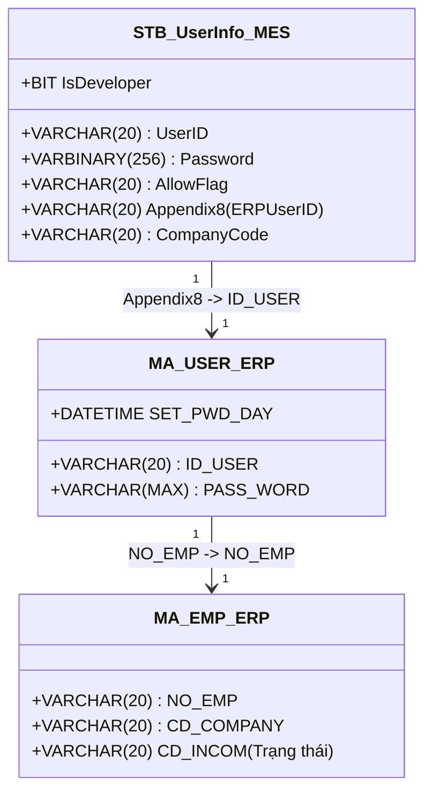
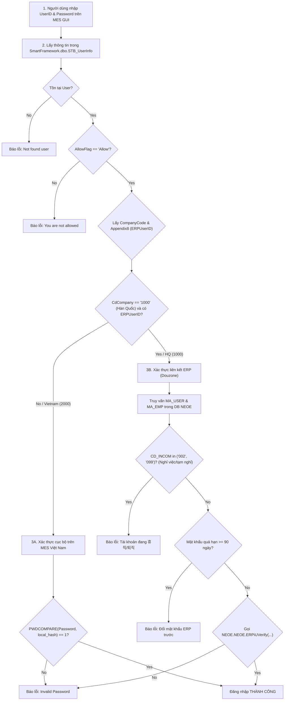

# Báo Cáo Nghiên Cứu Chi Tiết Vận Hành & Xác Thực Giữa Groupware Và NAIS MES

> **Mục đích:** Cung cấp cái nhìn toàn diện và chi tiết nhất về cơ chế xác thực người dùng, bản đồ tương tác giữa các biểu mẫu (Forms) trên Groupware và các màn hình (Screens) tương ứng trên NAIS MES, cùng luồng dữ liệu giao dịch trong database.
> **Ngày cập nhật:** 14/06/2026
> **Tác giả:** Antigravity (Advanced Agentic Coding Partner)

---

## 1. 🖥️ Tổng Quan Kiến Trúc Vận Hành (System Architecture Overview)

Sự kết nối giữa **Groupware (gw.vinatech.com)**, **ERP Douzone (NEOE)** và **NAIS MES (http://mes.hycap.co.kr:9952)** được thực hiện theo nguyên tắc: **Phê duyệt nghiệp vụ ở thượng nguồn (Groupware) -> Ghi nhận tài chính/kế toán ở trung nguồn (ERP) -> Thực thi hiện trường ở hạ nguồn (MES)**.

```
+-------------------------------------------------------------+
|                          GROUPWARE                          |
|  - Phê duyệt tờ trình (Forms: Purchase, Sales, Plans, HR)    |
|  - Trình bày nội dung & AI tinh chỉnh văn bản                |
+-------------------------------------------------------------+
                            │
                            ▼ (Sync dữ liệu tự động)
+-------------------------------------------------------------+
|                         ERP DOUZONE                         |
|  - Lưu trữ Master Data (Vật tư, Khách hàng, BOM)            |
|  - Sổ sách Kế toán, Công nợ, Quản lý Nhân sự gốc            |
+-------------------------------------------------------------+
        │                                             ▲
        ▼ (Sync dữ liệu xuống)                        │ (Báo cáo kết quả lên)
+---------------------------------------------------------------------------------+
|                                    NAIS MES                                     |
|             - Quản lý sản xuất, Routing, Lot Control, Đóng gói, QC              |
|             - Thiết bị kho PDA quét Barcode di động                             |
+---------------------------------------------------------------------------------+
```

---

## 2. 🔑 Cơ Chế Xác Thực Người Dùng Chi Tiết (Authentication Process)

Quy trình xác thực người dùng đăng nhập hệ thống MES được xử lý qua Stored Procedure `usp_DoGUILogin` (và `usp_DoDeveloperLogin`, `usp_DoRfcLogin`, `usp_DoMobileLogin`) trong database `SmartFramework`.

### 2.1 Bản đồ thuộc tính Xác thực & Liên kết Nhân sự
Tài khoản đăng nhập MES được quản lý trong bảng `SmartFramework.dbo.STB_UserInfo` (thiết lập qua màn hình **Z410**). 
*   **Appendix8 (ERPUserID):** Đây là trường mấu chốt lưu mã nhân viên ERP của người dùng (ví dụ: `32511007`), đóng vai trò là "Foreign Key" liên thông sang ERP/Groupware.
*   **AllowFlag:** Cờ cho phép đăng nhập (`Allow` / `Deny`).
*   **IsDeveloper:** Cờ cho phép tài khoản đăng nhập qua chế độ debug phát triển (`1` / `0`).



### 2.2 Sơ đồ Luồng Logic Xác thực Đăng nhập (Authentication Logic Flow)



#### Chi tiết Kỹ thuật của 4 Method Đăng nhập:

| Stored Procedure | Phạm vi áp dụng | Đặc điểm xác thực | Nguồn kiểm tra mật khẩu |
| :--- | :--- | :--- | :--- |
| `usp_DoGUILogin` | Ứng dụng NAIS MES trên máy tính | **Phân luồng:**<br>- **HQ (1000):** Liên thông ERP, gọi `ERPiUVerify` để khớp mật khẩu từ ERP, check trạng thái nhân sự, chặn quá 90 ngày đổi mật khẩu.<br>- **VN (2000):** Khớp mật khẩu local trong `STB_UserInfo`. | `STB_UserInfo.Password` (VN) hoặc `NEOE.MA_USER.PASS_WORD` (HQ) |
| `usp_DoDeveloperLogin` | Dành cho IT/Developer để debug | Giống hệt `usp_DoGUILogin` nhưng kiểm tra thêm điều kiện bắt buộc `IsDeveloper = 1` trong `STB_UserInfo`. | Tương tự GUI Login |
| `usp_DoRfcLogin` | Kết nối dạng API/RFC từ hệ thống khác | Chỉ xác thực cục bộ (Local database) thông qua hàm `PWDCOMPARE` trên bảng `STB_UserInfo` (Không phân luồng ERP). | `STB_UserInfo.Password` |
| `usp_DoMobileLogin` | MES trên thiết bị di động (PDA) | Kiểm tra trực tiếp plaintext password bằng toán tử so sánh bằng (`=`). | So sánh plaintext trực tiếp với `STB_UserInfo.Password` |

---

## 3. 🔄 Bản Đồ Tương Tác Giữa Các Biểu Mẫu Groupware Và Màn Hình MES (Form-to-Screen Map)

Dưới đây là chi tiết vận hành tương tác sâu giữa các biểu mẫu của Groupware và các màn hình (Screens) tương ứng trên NAIS MES.

### 3.1 Luồng Mua Hàng & Nhập Kho Vật Tư (Purchase & Receiving Flow)

Quy trình này kiểm soát từ khi có nhu cầu mua nguyên vật liệu cho đến khi hàng về kho và được kiểm định chất lượng bởi QC:

```
[Groupware PO] ────────────> [ERP PO]
                                │ (Đồng bộ)
                                v
[Groupware Arrival] ───────> [MES F330] ──(Tạo Lot)──> [MES C220 (IQC)]
                                                          │ (Cập nhật PASS)
                                                          v
[Groupware Receiving] <───────────────────────────── (Cho phép chọn)
         │
         v (Duyệt)
[Cập nhật Tồn kho MES/ERP]
```

#### Chi tiết tương tác các form và màn hình:

1.  **Form `purchaseOrderDocument` (Đăng ký PO) & `purchaseOrderCancelDocument` (Hủy PO):**
    *   *Mục đích:* Tạo đơn mua hàng gửi nhà cung cấp. Sau khi duyệt, thông tin PO được lưu vào ERP.
    *   *Tác động MES:* PO sẽ xuất hiện ở trạng thái chờ nhập. Nếu có form `receivingConfirmationDocument` (Xác nhận nhập kho) đang chờ duyệt liên đới, hệ thống sẽ **khóa cứng**, cấm hủy PO.
2.  **Form `arrivalConfirmationDocument` (Xác nhận hàng về) ➔ Màn hình MES F330 (Tiếp nhận NVL):**
    *   *Tương tác:* Khi hàng về, nhân viên mua hàng lập form hàng về trên Groupware. Sau khi duyệt, dữ liệu tự động đổ về màn hình **MES F330**.
    *   *Vận hành tại MES:* Thủ kho mở màn hình **F330**, tra cứu theo số chứng từ hàng về, tiến hành nhận hàng thực tế và **in tem mã vạch vật tư (Part Label - format `PartLabel` cấu hình ở A460)** dán lên từng cuộn/thùng. Hệ thống tạo các bản ghi Lot tương ứng trong `STB_MaterialLotInfo`.
3.  **Màn hình QC MES C220 (Kiểm tra IQC) ➔ Form `receivingConfirmationDocument` (Xác nhận nhập kho):**
    *   *Tương tác:* Đội QC nhận email tự động, tiến hành lấy mẫu kiểm tra ngoại quan và đặc tính tại màn hình MES **C220** (hoặc hotfix **C220_SPS**). QC nhập kết quả đo và đánh giá **PASS/REJECT**. Kết quả được lưu vào bảng `STB_MaterialQcInfo`.
    *   *Ràng buộc:* Khi lập form **Receiving Confirmation** (Xác nhận nhập kho) trên Groupware, hệ thống gọi API đối chiếu DB MES. **Chỉ các Lot có trạng thái QC kết quả là PASS** mới được hiển thị lên lưới để thủ kho chọn nhập kho chính thức. Nếu QC chưa duyệt hoặc bị Reject, form này sẽ không thể tạo được.
4.  **Form `receivingPhysicalItemConfirmationDocument` (Xác nhận nhập kho vật lý sản phẩm):**
    *   *Mục đích:* Khai báo nhập xuất kho vật lý nội bộ cho các Lot bán thành phẩm giữa các kho trong nhà máy bằng dropdown `I` (Nhập) hoặc `O` (Xuất).
5.  **Form `purchaseResolutionDocument` (Quyết toán mua hàng):**
    *   *Tương tác:* Thanh toán tiền cho nhà cung cấp dựa trên chứng từ hàng về hoặc nhập kho. Người duyệt đối chiếu trực tiếp với tệp đính kèm hóa đơn logistics (Ví dụ: [Bee Logistics_Vina tech_By_Air...pdf](file:///c:/Users/User%20Vinatech.DESKTOP-RJJSEQU/Desktop/PROCESS/GROUPWARE/GROUPWARE_KNOWLEDGE_BASE/Bee%20Logistics_Vina%20tech_By_Air_Inv-2925431946.pdf)) và mã phụ phí chuẩn (THC, CFS, FSC, v.v.). Sau khi duyệt, hệ thống tự động ghi sổ nợ ERP.

---

### 3.2 Luồng Bán Hàng & Xuất Kho Thành Phẩm (Sales & Shipment Flow)

Quy trình này kiểm soát từ khi nhận đơn đặt hàng của khách hàng đến khi bốc dỡ xuất hàng lên container và ghi nhận doanh thu:

```
[Groupware Suju] ───────────> [ERP Suju]
                                │ (Đồng bộ)
                                v
[Groupware Shipment Request] ─> [MES FG01] ──(Bắn mã vạch)──> [MES B750 (In tem Pallet)]
                                                                    │
                                                                    v
[Groupware Shipment Confirm] <─────────────────────────────── [MES B752 (Kiểm kê)]
         │
         v (Duyệt)
[Đăng ký doanh thu ERP & Xuất kho]
```

#### Chi tiết tương tác các form và màn hình:

1.  **Form `salesOrderDocument` (Suju - Đơn bán hàng):**
    *   *Tác động:* Đơn hàng được phê duyệt sẽ tự động đăng ký vào ERP dưới dạng Suju. Đồng thời, hệ thống tự động sinh một kế hoạch sản xuất tháng tương ứng trên Groupware (`Month Production Plan`) của nhà máy chịu trách nhiệm để bắt đầu chuẩn bị sản xuất.
2.  **Form `deliverOutDocument` (Yêu cầu xuất hàng) ➔ Màn hình MES FG01 (Xuất kho tạm):**
    *   *Tác động:* Sau khi yêu cầu xuất hàng được duyệt, ERP phát lệnh chuẩn bị hàng gửi đến kho thành phẩm.
    *   *Vận hành tại MES:* Thủ kho sử dụng thiết bị PDA mở màn hình **FG01**, tiến hành quét (scan) mã vạch **Packing ID (Box/Carton)** của các thùng hàng thực tế bốc từ kệ. Hệ thống tự động kiểm tra xem các Box này có được đánh giá **PASS OQC** (kiểm định chất lượng xuất xưởng tại màn hình **C530/C546** - bảng `STB_VN_FINISHGOODS_forQCAudit`) hay không. Nếu PASS, hệ thống cho phép ghi nhận xuất sang kho trung chuyển tạm thời.
3.  **Màn hình MES B750 (In tem Pallet) & B752 (Giám sát Pallet) ➔ Form `deliverOutConfirmationDocument` (Xác nhận xuất hàng):**
    *   *Vận hành tại MES:*
        *   Tại màn hình **B750**, thủ kho gom các thùng hàng lẻ thành Pallet, thực hiện lệnh in tem Pallet dán niêm phong cụm Pallet đã bọc màng PE.
        *   Khi bốc dỡ Pallet lên Container/Xe tải, nhân viên quét mã tem Pallet.
        *   Mở màn hình **B752** để đối chiếu giám sát danh sách chi tiết các Pallet trong thùng xe Container so với phiếu yêu cầu xuất hàng gốc.
    *   *Tác động Groupware:* Khi bốc hàng xong, nhân viên logistics lập form **Shipment Confirmation** (Xác nhận xuất hàng) trên Groupware. Sau khi duyệt, hệ thống tự động ghi nhận xuất kho thành phẩm vật lý khỏi ERP/MES và tự động khởi tạo đơn quyết toán doanh thu (`salesResolutionDocument` / `salesResolutionOverseasDocument`) gửi phòng Kế toán chốt doanh số.
4.  **Form `salesOrderCancelDocument` (Hủy đơn bán) & `deliverOutDeleteDocument` (Hủy thực xuất):**
    *   *Tác động:* Thu hồi các chứng từ bị nhập sai. Form hủy thực xuất chỉ có hiệu lực khi chứng từ kế toán liên quan ở trạng thái chờ duyệt (chưa được kế toán ký chốt sổ). Khi duyệt hủy, toàn bộ chuỗi dữ liệu liên quan (Yêu cầu xuất, Hóa đơn, Thực xuất, Doanh thu) trên ERP và MES đều được revert lại trạng thái ban đầu.

---

### 3.3 Luồng Kế Hoạch & Chỉ Thị Sản Xuất (Production Planning & Execution Flow)

Quy trình này liên kết kế hoạch từ Groupware xuống việc chia mẻ, chia Lot và chạy máy thực tế ở hiện trường nhà xưởng:

```
[Month Production Plan (GW)] ──(Xác nhận lô hàng)──> [MES B310 (PO xuất hiện)]
                                                             │
[Daily Production Order (GW)] ──(Chốt kế hoạch ngày)─> [MES B450 (Kế hoạch ngày)]
                                                             │
                                                             v (Chia Lot, In tem)
                                                      [Chạy máy B540/B597/B530]
                                                             │
[Daily Production Report (GW)] <──(Ghi nhận sản lượng)──────┘
```

#### Chi tiết tương tác các form và màn hình:

1.  **Giao diện Month Production Plan (Groupware) ➔ Màn hình MES B310 (Giám sát PO):**
    *   *Tương tác:* PO tháng sau khi được lập trên Groupware và nhấn nút **"Xác nhận lô hàng"** (chuyển trạng thái sang "Sản xuất") sẽ tự động đồng bộ xuống bảng `STB_ProductionOrderInfo` của MES và hiển thị trên màn hình **MES B310**. Phiên bản BOM bắt buộc phải được cấu hình là **2001** (hoặc **2002** cho dây chuyền Cell mới).
2.  **Form `dailyProductionOrderDocument` (Chỉ thị sản xuất ngày) ➔ Màn hình MES B450 (Kế hoạch ngày & Chia Lot):**
    *   *Tương tác:* Người lập kế hoạch tạo Kế hoạch ngày trên Groupware (chỉ định Nhà máy như `VVT_F1`, `VVT_F2`, `VVT_F3`, Line, Ca làm việc, Số lượng). Khi tích chọn và nhấn **"Mục tiêu lựa chọn Đã xác nhận"**, dữ liệu tự động đổ vào bảng `STB_DayProdPlan` và hiển thị trên màn hình **MES B450**.
    *   *Vận hành tại MES:* Tại màn hình **B450**, tổ trưởng sản xuất nhấn nút **"Tạo lô (LOT)"** chia tổng số lượng kế hoạch ngày thành các Lot nhỏ (ví dụ: 5.000 sản phẩm/Lot) và thực hiện in tem nhãn barcode lô (Assemble Label - format cấu hình tại A460) để phát xuống chuyền.
3.  **Hiện trường sản xuất (MES B540/B597/B530) ➔ Form `dailyProductionReportDocument` (Báo cáo sản xuất ngày):**
    *   *Vận hành tại MES:* 
        *   Công nhân quét tem Lot nguyên vật liệu cấp vào máy tại trạm **B540/B597** (hệ thống kiểm tra BOM và hạn dùng, ghi vào `STB_RawMaterialInputHist`).
        *   Đội QC đo PQC tại trạm **C443** (ghi vào `STB_CommInspDocHistory`).
        *   Công nhân chốt sản lượng mẻ sản xuất tại màn hình **B530**. Hệ thống chạy SP `usp_CheckPQCInputForProductHistForBarcode` để kiểm tra kết quả PQC, sau đó ghi nhận vào lịch sử công đoạn `STB_ProdRouteHist`.
    *   *Tương tác Groupware:* Dữ liệu sản lượng thực tế chạy máy, phế phẩm phát sinh tự động đổ về form **Báo cáo sản xuất ngày (Daily Production Report)** trên Groupware để tổ trưởng ký trình duyệt báo cáo ca làm việc.

---

### 3.4 Luồng Quản Lý Nhân Sự & Chấm Công (HR & Time Attendance Flow)

Quy trình này quản lý giờ giấc làm việc của công nhân trên chuyền và trạng thái tài khoản đăng nhập:

```
[Máy chấm công vân tay hiện trường]
                 │
                 ▼ (Quét định kỳ)
[MES Job SyncFingerData] ────> [STB_VN_ATTENDANCE_TIME (Attendance DB)]
                                           │
                                           ▼ (Đối chiếu)
[Groupware Leave / Attendance Modify] ────> [Cập nhật ngày công thực tế]
```

#### Chi tiết tương tác các form và màn hình:

1.  **Form `leaveDocument` (Xin nghỉ phép) & `leaveCancelDocument` (Hủy nghỉ phép) & `attendanceModifyDocument` (Sửa ngày công):**
    *   *Tác động:* Các ngày nghỉ được phê duyệt trên Groupware được sử dụng để HR đối chiếu với bảng chấm công MES. 
    *   *Vận hành hệ thống:* SQL Agent Job `SyncFingerData` chạy định kỳ gọi stored procedure `usp_SyncFingerData` để lấy dữ liệu quét vân tay từ bảng máy chấm công hiện trường `Stb_fingerUserInfo` (so sánh thời gian vào/ra dựa trên mã máy lẻ/chẵn để phân biệt Check-in/Check-out), tính toán giờ làm việc thực tế (`total_time`) và cập nhật vào bảng `STB_VN_ATTENDANCE_TIME`. Trưởng ca và nhân sự sử dụng form **Attendance Modify** để điều chỉnh ngày công nếu công nhân quên quét hoặc có sai lệch.
2.  **Form `empRetireDocument` (Nghỉ việc) ➔ Khóa tài khoản MES:**
    *   *Tác động:* Khi đơn xin nghỉ việc được duyệt hoàn toàn trên Groupware, phòng Nhân sự cập nhật ngày làm việc cuối cùng và chuyển trạng thái nhân sự trên ERP sang "Nghỉ việc" (`CD_INCOM = '099'`).
    *   *Khóa tài khoản MES:* Ở lần đăng nhập MES tiếp theo của nhân viên đó:
        *   Nếu là tài khoản HQ: `usp_DoGUILogin` kiểm tra trực tiếp bảng ERP `NEOE.MA_EMP`. Vì `CD_INCOM = '099'` (hoặc `'002'`), hệ thống ném lỗi: *"사용자가 휴직이거나 퇴직 상태입니다. 로그인할 수 없습니다."* và chặn đăng nhập ngay lập tức.
        *   Nếu là tài khoản Việt Nam: Nhân sự khóa thủ công tài khoản trong màn hình cấu hình **Z410** (đổi trạng thái `AllowFlag` từ `Allow` sang `Deny` trong `STB_UserInfo`).

---

## 4. 🗃️ Bảng Tra Cứu Mã Kho Việt Nam (Warehouse Code Master List)

Dưới đây là bảng đối chiếu danh mục mã kho (Material Warehouse Code) sử dụng trên hệ thống ERP và MES tại các nhà máy Vinatech Việt Nam:

| Mã Kho (Warehouse Code) | Công ty | Nhà máy | Tên Kho Tiếng Hàn | Tên Kho Tiếng Việt | Ghi Chú / Ý Nghĩa Vận Hành |
|:---|:---|:---|:---|:---|:---|
| **ROH_VN_WH** | VVT | VVT_F1 | 원자재창고(베트남) | Kho nguyên vật liệu Bắc Giang *(⚠️ Typo dịch)* | **Kho NVL chính nhà máy F1 (Bắc Ninh)** |
| **ROH_BG_WH** | VVT | VVT_F2 | Bg_원자재창고(베트남) | Kho nguyên vật liệu Bắc Ninh *(⚠️ Typo dịch)* | **Kho NVL chính nhà máy F2 (Bắc Giang)** |
| **HOLDING_VN_WH** | VVT | VVT_F1 | Hold원자재창고(베트남) | Kho nguyên vật liệu chờ xử lý Bắc Ninh | Kho tạm giữ kiểm tra IQC (F1 - Bắc Ninh) |
| **HOLDING_BG_WH** | VVT | VVT_F2 | Bg_Hold원자재창고(베트남) | Kho nguyên vật liệu chờ xử lý Bắc Giang | Kho tạm giữ kiểm tra IQC (F2 - Bắc Giang) |
| **MODULE_VN_WH** | VVT | VVT_F1 | 모듈(베트남) | Kho nguyên liệu cho hàng module Bắc Ninh | Kho cấp vật tư cho chuyền sản xuất Module F1 |
| **MODULE_BG_WH** | VVT | VVT_F2 | Bg_모듈(베트남) | Kho nguyên liệu cho hàng module Bắc Giang | Kho cấp vật tư cho chuyền sản xuất Module F2 |
| **ROUTE_VN_WH** | VVT | VVT_F1 | 공정창고(베트남) | Sản xuất Bắc Ninh | Kho ảo trên chuyền sản xuất F1 (Bắc Ninh) |
| **ROUTE_BG_WH** | VVT | VVT_F2 | Bg_공정창고(베트남) | Sản xuất Bắc Giang | Kho ảo trên chuyền sản xuất F2 (Bắc Giang) |
| **PROD_VN_WH** | VVT | VVT_F1 | 완제품창고(베트남) | Kho thành phẩm Bắc Ninh | Kho lưu trữ thành phẩm chính F1 (Bắc Ninh) |
| **PROD_BG_WH** | VVT | VVT_F2 | Bg_완제품창고(베트남) | Kho thành phẩm Bắc Giang | Kho lưu trữ thành phẩm chính F2 (Bắc Giang) |
| **W27** | VVT | VVT_F3 | 창고(비나에너솔) | Kho (Vina Enersol) | Kho nhà máy F3 (Vina Enersol Hà Nam) |

> [!WARNING]
> **LƯU Ý LỖI DỊCH THUẬT KHI LÀM FORM:**
> Cột tên tiếng Việt bị đảo ngược nhầm lẫn giữa Bắc Ninh và Bắc Giang ở hai kho chính: `ROH_VN_WH` ghi nhầm thành Bắc Giang, còn `ROH_BG_WH` ghi nhầm thành Bắc Ninh. Khi thao tác cấu hình hoặc chọn kho trên các form Groupware (`purchaseOrderDocument`, `receivingConfirmationDocument`), người dùng bắt buộc phải tuân theo ký hiệu chuẩn: **`VN` = Nhà máy Bắc Ninh (F1)** và **`BG` = Nhà máy Bắc Giang (F2)** bất kể cột hiển thị tiếng Việt bị dịch sai.

---

## 5. 🛠️ Cẩm Nang Hỗ Trợ Kỹ Thuật (Troubleshooting Guide)

### 5.1 Sự cố Đăng nhập MES
1.  **Lỗi: "Not found user" hoặc "Invalid Password"**
    *   *User Việt Nam:* Check tài khoản đã khởi tạo trong màn hình **Z410** chưa.
    *   *User Hàn Quốc:* Check cột `Appendix8` trong `STB_UserInfo` đã trỏ đúng ID_USER của ERP chưa.
2.  **Lỗi: "You are not allowed"**
    *   Kiểm tra AllowFlag của tài khoản trong `STB_UserInfo`. Chạy SQL sửa đổi:
        ```sql
        UPDATE SmartFramework.dbo.STB_UserInfo SET AllowFlag = 'Allow' WHERE UserID = 'Mã_Nhân_Viên'
        ```

### 5.2 Sự cố Đồng bộ Kế hoạch/Sản lượng
1.  **PO tháng không xuất hiện trên MES B310:**
    *   Kiểm tra xem trên Groupware đã nhấn nút **"Xác nhận lô hàng"** chưa (trạng thái phải chuyển sang "Sản xuất").
    *   Kiểm tra BOM Version đã chọn đúng **2001** (hoặc **2002**) chưa.
2.  **Sản lượng sản xuất không hiển thị trên ERP:**
    *   Kiểm tra xem các bản ghi trong `ESM_ProdRouteHist` có bị treo ở trạng thái `'N'` không:
        ```sql
        SELECT Count(*) FROM ESM_ProdRouteHist WITH(NOLOCK) WHERE ErpUpdate = 'N' OR ErpUpdate IS NULL
        ```
    *   Nếu số lượng lớn và không thay đổi trong thời gian dài -> Kiểm tra xem Windows Service **ESM Collector** trên server có bị dừng (Stopped) hay không.

### 5.3 Sự cố IQC (C220) & Nhập kho (Receiving)
*   Nếu không tìm thấy Lot hàng trên form **Receiving Confirmation** của Groupware, check xem QC đã làm IQC chưa hoặc IQC có bị Reject không.
    *   Truy vấn kiểm tra trạng thái QC:
        ```sql
        SELECT MaterialDocNo, MaterialLotNo, QcResult 
        FROM STB_MaterialQcInfo WITH(NOLOCK) 
        WHERE MaterialDocNo = 'Số_Chứng_Từ_Hàng_Về'
        ```
        Nếu `QcResult` khác `'PASS'`, hệ thống sẽ chặn không cho phép lập form nhập kho chính thức.
