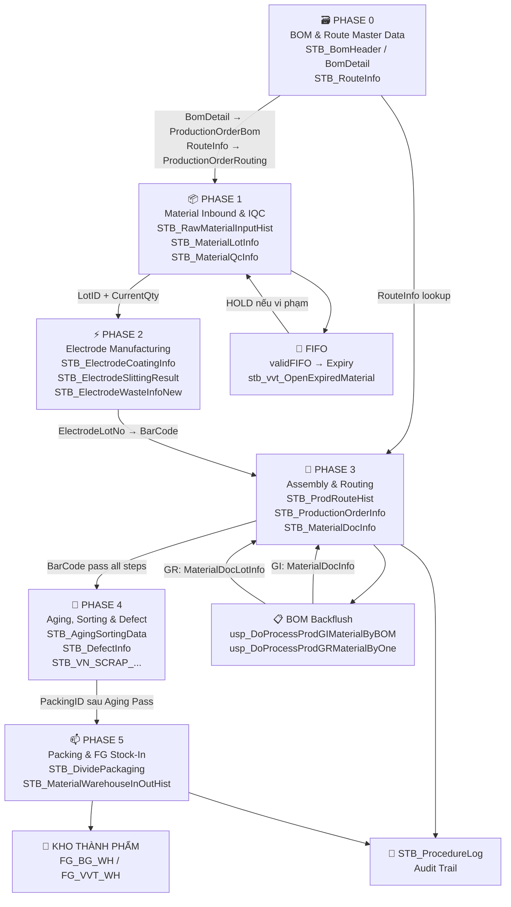

# KB_11 — Luồng Dữ Liệu & Stored Procedures (DataFlow)

> **Mục đích:** Bản đồ chi tiết luồng dữ liệu End-to-End qua 6 Phase sản xuất, kèm phân tích từng Stored Procedure cốt lõi và các lỗi thường gặp trong quá trình xử lý dữ liệu.
> ← [Về INDEX](KB_INDEX.md)

---

## 1. 🗺️ End-to-End Data Flow Overview



---

## 2. ⚙️ Phân Tích Stored Procedures Theo Phase

### Phase 0 — Master Data: BOM & Routing
*Nền tảng được tham chiếu bởi tất cả phase sau.*
*   `usp_BomHeader_iud`, `usp_BomDetail_iud`, `usp_RouteInfo_iud`
*   **Kỹ thuật:** `MERGE + OPENXML + CURSOR`. Client gửi XML, SP dùng Cursor duyệt từng dòng để Upsert.

### Phase 1 — Material Inbound & Quality Control (WMS & IQC)
*Nhập NVL, kiểm tra chất lượng (IQC), quản lý Lot theo FIFO.*
*   `usp_RawMaterialInputHist_iud` & `usp_Vietnam_RawMaterialInputHist_uid`: Validation NVL đầu vào. *Lưu ý: Logic kiểm tra BOM hiện đang bị khóa tạm thời (Nordex Audit).*
*   `usp_MaterialQcInfo_iud`: Ghi kết quả IQC. Nếu Fail → `STB_NCR_Report`.
*   `usp_MaterialWarehouseInOutHist_iud`: Ghi lịch sử xuất/nhập, gọi `usp_VVTMaterialWarehouse_validFIFO` để chặn vi phạm FIFO hoặc Hết hạn.

### Phase 2 — Electrode Manufacturing (Điện cực)
*Theo dõi quá trình: Coating → Rolling Press → Slitting.*
*   `pop_Electrode_Coating_iud`: Upsert thông số phủ. Trừ `CurrentQty` của NVL (`STB_MaterialLotInfo`), ghi `STB_MaterialWarehouseUsageHist`. Dùng `BEGIN TRAN`.
*   `usp_ElectrodeSlittingResult_iud`: Ghi nhận các cuộn nhỏ sau khi cắt.
*   `usp_ElectrodeWasteInfoNew_iud`: Ghi nhận phế liệu điện cực.

### Phase 2.5 — Lập Kế Hoạch & Chuẩn Bị Sản Xuất
*Nối Master Data với Sản xuất thực tế.*
*   `usp_ProductionOrderRouting_iud`: Copy `STB_RouteInfo` sang `STB_ProductionOrderRouting`. Cài đặt `RouteIndex`, `IsInputRoute`, `IsOutputRoute`.
*   `usp_SetInfo_iud`: "Khai sinh" `ControlNo` (Barcode) cho từng viên tụ.

### Phase 3 — Assembly & Production Routing (Trái tim hệ thống)
*Theo dõi từng sản phẩm qua chuỗi công đoạn.*
*   `usp_CheckInputRawMaterialCodeForProduct`: Validation Gate. Chặn route nếu chưa nạp đủ NVL theo BOM (tại V-23, V-24).
*   **`usp_DoProcessProdRouteHist` (Core Engine)**: Ghi lịch sử quét vào `STB_ProdRouteHist`. Validate số lượng (không được vượt công đoạn trước).
*   `usp_DoProcessProdGIMaterialByBOM`: Được gọi ở mọi Route. Trừ tồn kho NVL (Backflush) tự động.
*   `usp_DoProcessProdGRMaterialByOne`: Chỉ gọi ở bước cuối (`IsOutputRoute=1`). Tạo phiếu nhận thành phẩm (GR).

### Phase 4 — Aging, Sorting & Defect Management
*Đo kiểm và phân loại chất lượng.*
*   `usp_InsertDataAgingAndSorting`: Ghi kết quả Aging (Pass/Fail/A/B/C).
*   `usp_DefectInfo_iud`: Ghi nhận hàng NG.
*   `usp_Add_VN_SCRAP_WEIGHSCALE_PRODUCTIONS`: Cân phế liệu → quy đổi số lượng.

### Phase 5 — Packing & FG Stock-In (Đóng gói)
*Đóng gói và nhập kho thành phẩm.*
*   `usp_DivideAndPrintPackagingLabels`: Chia gói (Túi/Inner box) → `STB_DividePackaging`. Trả về dữ liệu in tem. Đọc 11 bảng khác nhau.
*   `usp_Vietnam_DoProcessBigBoxPacking_VVT_F3`: Gộp túi thành thùng Carton (Big Box).
*   `usp_VN_FinishGood_BG_StockIn_iud`: Nhập kho thành phẩm vào `FG_BG_WH`.

### Phase 6 — Warehouse & Export (Xuất kho)
*Quản lý tồn kho thực tế và xuất hàng đi khách.*
*   `ImportWarehouseFinshGood_uid`: Khai báo hàng từ xưởng vào kho Inventory (`STB_VN_FINISHGOODS_HN_New`).
*   `ExportWarehouseFinshGood_uid`: Xuất hàng, trừ tồn kho, ghi nhận Invoice.

---

## 3. 📋 SP → Table Mapping (Quick Reference)

| Stored Procedure | Tables READ | Tables WRITE |
|-----------------|-------------|--------------|
| `usp_Prod_Daily_Input_Schedule_iud` | — | Exec SP nhánh (`usp_Medium_Daily_Input`) |
| `usp_ProductionOrderRouting_iud` | — | **MERGE** STB_ProductionOrderRouting |
| `usp_SetInfo_iud` | — | **MERGE** STB_SetInfo |
| `usp_BomHeader_iud` | BomHeader, UserInfo | **MERGE** BomHeader; UPDATE BomDetail |
| `usp_RouteInfo_iud` | RouteInfo | **MERGE** RouteInfo |
| `usp_RawMaterialInputHist_iud` | — | INSERT RawMaterialInputHist, MaterialLotInfo |
| `usp_MaterialQcInfo_iud` | QcInfo, IQcDefectReport, NCR_REPORT | **MERGE** QcInfo; UPDATE IQcDefectReport, NCR_Report |
| `usp_MaterialWarehouseInOutHist_iud`| MaterialLotInfo, MaterialMaster, stb_vvt_OpenExpiredMaterial, ... | INSERT MaterialWarehouseInOutHist |
| `usp_VVTMaterialWarehouse_validFIFO`| MaterialLotInfo, MaterialWarehouseInOutHist, MaterialDocLotInfo | — (Chỉ Validate) |
| `pop_Electrode_Coating_iud` | MaterialLotInfo, MaterialWarehouseInOutHist, ... | **MERGE** ElectrodeCoatingInfo; UPDATE MaterialLotInfo |
| `usp_DoProcessProdRouteHist` | ProdRouteHist, ProductionOrderInfo, ProductionOrderRouting, RouteInfo, SetInfo | INSERT ProdRouteHist, ProcedureLog; UPDATE LineRouteMapping... |
| `usp_DoProcessProdGIMaterialByBOM` | LineRouteMapping, MaterialStock, ProductionOrderBom... | INSERT MaterialDocDetail, MaterialDocInfo |
| `usp_DivideAndPrintPackagingLabels` | MaterialLotInfo, ModelBasicInfo, PackingLabelSpec, SetInfo... | INSERT DividePackaging |
| `usp_VN_FinishGood_BG_StockIn_iud` | MaterialLotInfo | INSERT MaterialWarehouseInOutHist; UPDATE MaterialLotInfo |

---

## 4. 🔑 Key Identifiers (Chuỗi định danh)

```
VendorBarcode (Từ nhà cung cấp)
    │
    ↓ (Nhập kho)
LotID (Chứng minh thư nguyên liệu kho: ML...)
    │
    ├── ElectrodeLotNumber (Mã cuộn điện cực Phase 2)
    │
    └── ControlNo / Barcode (Mã viên tụ / Sản phẩm Phase 3+)
            │
            └── PackingID (Mã túi / Hộp nhỏ Phase 5)
                    │
                    └── BigBoxID (Thùng Carton bự Phase 5)
```

---

## 5. 🛠️ Nhật Ký Tùy Chỉnh & Gỡ Lỗi Nâng Cao

### Case 1: Chèn hậu tố "Dynamic Suffix" (GBAKAC-600F)
- **Vấn đề:** Muốn in thêm đuôi `-600F` trên nhãn nhưng không được sửa tên trong `STB_MaterialMaster` (vì rủi ro DB).
- **Giải pháp:** Dùng lệnh `REPLACE` ngay trong SP `usp_MaterialDocLotInfo_get` và SP in tem để chèn "ảo" đuôi này khi hiển thị, giữ nguyên Data gốc.

### Case 2: Cưỡng bức Scan vật tư (V-23, V-24)
- **Vấn đề:** Công nhân quên scan vật liệu → Lỗi Backflush hụt tồn kho.
- **Giải pháp:** Chèn đoạn check vào thẳng `usp_DoProcessProdRouteHist`. Nếu chưa scan đủ, Raise Error bằng tiếng Việt. Cấm đi tiếp.

### Case 3: Bắt buộc quét LOT cũ nhất (FIFO Validation)
- **Vấn đề:** Công nhân thích quét Lot mới → Lot cũ bị mốc, hết hạn.
- **Giải pháp:** Bật cờ `IsFIFO = 1` trong `STB_MaterialStockAttributeInfo`. `usp_VVTMaterialWarehouse_validFIFO` sẽ chặn nếu Lot scan không phải là Lot có `CreateDateTime` cũ nhất.

### Case 4: Lỗi "Exception occurred" tại F330 do `LotAttr10` NULL
- **Vấn đề:** Quét mã mới bị Exception màn hình.
- **Giải pháp:** Do cột `LotAttr10` (Ngày SX) bị rỗng, hàm DATEADD cộng thêm hạn dùng bị crash. Chạy lệnh UPDATE SQL điền tay `LotAttr10` cho các Lot bị lỗi. Đồng thời thêm Đặc tính tiêu chuẩn (A, B, C...) vào `STB_MaterialAttribute`.

### Case 5: Truy vết kế hoạch sai Line (Lỗi B450)
- **Vấn đề:** 2 Model khác nhau nhảy chung vào 1 Line báo cáo.
- **Giải pháp:** Dùng Time Window Query để quét 10 giây xung quanh CreateDateTime của bản ghi lỗi:
```sql
SELECT DayPlanNo, PlanDate, LineCode, MaterialCode, CreateDateTime
FROM STB_DayProdPlan
WHERE CreateUserID = 'ID_Người_Lập'
  AND CreateDateTime BETWEEN '2026-05-16 08:00:00' AND '2026-05-16 08:00:10'
ORDER BY DayPlanNo ASC
```

*Cập nhật: 2026-05-22*
