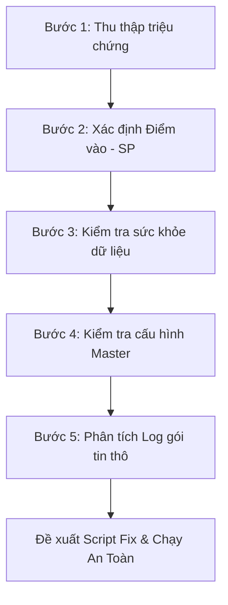

# 📘 KB_14_TRACE_BUG_METHODOLOGY — Cẩm Nang Truy Vết Lỗi & Dữ Liệu NAIS MES

> **Cập nhật:** 2026-05-25 | **Tác giả:** Antigravity (Google DeepMind Team)
> **Mục tiêu:** Hướng dẫn từng bước (Step-by-step) đầy đủ, chính xác, trực quan để kỹ sư vận hành/lập trình viên có thể tự mình truy tìm và sửa lỗi dữ liệu trên hệ thống MES Vinatech mà không cần đoán mò.

---

## 1. 🛡️ TRIẾT LÝ VÀ NGUYÊN TẮC VÀNG
> **"Không đoán mò — Chỉ tin vào dữ liệu thực tế trong Database"**

Khi tiếp nhận báo lỗi từ hiện trường, tuyệt đối không vội vàng đưa ra kết luận dựa trên mô tả cảm tính. Mọi lỗi hệ thống đều để lại dấu vết trong cơ sở dữ liệu. Bắt buộc phải thực hiện truy vấn `SELECT` để xác minh trạng thái thực của dữ liệu trước khi đưa ra phương án xử lý.

---

## 2. 📋 QUY TRÌNH TRUY VẾT LỖI 5 BƯỚC CHUẨN Y KHOA



### BƯỚC 1: Thu Thập Triệu Chứng Hiện Trường (Symptoms)
Trước khi mở SQL Server Management Studio (SSMS), hãy thu thập đủ **5 thông tin vàng**:
1. **Màn hình xảy ra lỗi:** (Mã TCode, ví dụ: `B523`, `B597`, `F330`...).
2. **Mã đối tượng bị lỗi:** (Mã Barcode, mã Lot, mã PO, hoặc mã Nguyên vật liệu...).
3. **Thao tác thực hiện:** (Nhấn nút "Gộp Box", "In tem", hay "Xác nhận nhập kho"...).
4. **Thông báo lỗi hiển thị trên giao diện (UI Error):** (Chụp ảnh màn hình hoặc ghi lại nguyên văn thông báo).
5. **Nhân sự thực hiện & Thời gian xảy ra lỗi:** (Để thu hẹp phạm vi quét log).

---

### BƯỚC 2: Xác Định Điểm Vào Hệ Thống (Entry Point - UI ➔ SP Mapping)
Hệ thống NAIS MES vận hành bằng cách gọi các Stored Procedure (SP) từ UI. Để biết nút bấm trên giao diện gọi SP nào, chạy các câu lệnh tra cứu sau:

```sql
-- 1. Tìm tên màn hình gốc theo mã TCode hiển thị trên UI
SELECT Name AS ScreenName, Caption, TCode 
FROM SmartFramework.dbo.STB_ScreenInfo
WHERE TCode = 'B523'; -- Thay thế bằng TCode bị lỗi

-- 2. Tìm tên Object (Nút bấm) và xem SP/Event tương ứng
-- Kết quả ScreenName ở bước 1 sẽ dùng làm điều kiện lọc ở đây
SELECT ObjectName, Caption, LinkURL, EventName 
FROM SmartFramework.dbo.STB_ScreenObjects
WHERE ScreenName = 'Vietnam_Donggoi_Hnam' -- Tên màn hình tìm được ở bước 1
  AND ObjectType = 'Action';
```

> 💡 **Mẹo:** Tên Stored Procedure thường nằm trong cột `LinkURL` hoặc `EventName` dưới dạng `usp_Vietnam_DoProcess...` hoặc `usp_DoProcess...`.

---

### BƯỚC 3: Kiểm Tra "Sức Khỏe" Dữ Liệu Hiện Tại (Data State Check)
Hệ thống chặn không cho thao tác thường do trạng thái Lot hoặc Barcode không đủ điều kiện (chưa qua công đoạn trước, chưa QC, hoặc đã bị báo phế). Chạy câu lệnh kiểm tra tổng quát sau:

```sql
-- Kiểm tra trạng thái toàn diện của một mã Barcode/Lot
SELECT 
    Barcode,
    MaterialCode,
    ProdQty,
    LotDecisionResult,  -- Trạng thái QC: 'PASS' = Đạt, 'FAIL' = Lỗi, NULL = Chưa đánh giá
    IsDefect,           -- 1 = Đang bị đánh dấu lỗi (NG), 0 = Bình thường
    DefectQty,          -- Số lượng lỗi
    IsProdFinish,       -- 1 = Đã hoàn tất công đoạn sản xuất, 0 = Chưa hoàn tất
    InputLineCode       -- Line sản xuất đăng ký
FROM STB_SetInfo
WHERE Barcode = 'Mã_Barcode_Cần_Check'; -- Ví dụ: 'SP20260525-001'
```

---

### BƯỚC 4: Kiểm Tra Cấu Hình Master Data (Configuration Check)
Nhiều lỗi xảy ra do thiếu cấu hình vật tư, thiết bị hoặc phân quyền trên hệ thống:

```sql
-- 1. Kiểm tra cấu hình gộp lot/sử dụng barcode của vật tư (Màn hình F110)
-- Nếu IsLotUse = 0 hoặc IsUseBarcode = 0, hệ thống sẽ chặn không cho quét Lot/In tem
SELECT MaterialCode, IsUseBarcode, IsLotUse 
FROM STB_MaterialStockAttributeInfo
WHERE MaterialCode = 'Mã_Vật_Tư_Cần_Check';

-- 2. Kiểm tra thông số voltage/farad của Model (Màn hình A410)
SELECT ModelCode, MBIExtText04 AS Voltage, MBIExtText05 AS Farad
FROM STB_ModelBasicInfo
WHERE ModelCode = 'Mã_Model_Cần_Check';
```

---

### BƯỚC 5: Phân Tích Log Hệ Thống Để Tìm Nguyên Nhân Gốc (Root Cause Analysis)
Khi giao diện báo lỗi chung chung (Ví dụ: "Lỗi hệ thống, liên hệ Admin"), đây là bước quan trọng nhất để xem lỗi thực tế xảy ra ở dòng code nào trong Database:

```sql
-- 1. Tra cứu log gói tin thô gửi từ Client lên Server
-- Giúp xác định chính xác dữ liệu Client truyền lên là gì
SELECT ProcessDateTime, IPAddress, Data, ProcessResult
FROM STB_ProcessTerminalDataLog
WHERE CAST(ProcessDateTime AS DATE) = CAST(GETDATE() AS DATE)
  AND Data LIKE '%Mã_Barcode_Cần_Check%'
ORDER BY ProcessDateTime DESC;

-- 2. Tra cứu log chi tiết các biến số bên trong Stored Procedure
-- Được SP tự động ghi lại khi xảy ra lỗi/validate chặn
SELECT ProcedureName, VariableName, VariableValue, CreateDateTime
FROM STB_ProcedureLog
WHERE CAST(CreateDateTime AS DATE) = CAST(GETDATE() AS DATE)
ORDER BY CreateDateTime DESC;
```

---

## 3. 🔍 ĐỌC VÀ PHÂN TÍCH CHUỖI DỮ LIỆU LOG (DATA LOG ANATOMY)

Cột `Data` trong bảng `STB_ProcessTerminalDataLog` lưu chuỗi dữ liệu thô phân tách bằng ký tự gạch đứng `|`.

**Ví dụ một chuỗi log gộp Box:**
`PRODPACKING|VELINE-01|VE10|SP20260525-001|1000|PK001|vanduc|...`

**Phân tích cấu trúc:**
1. `PRODPACKING`: Tên Action/Event (Sẽ được Route vào SP `usp_DoProcessTerminalData`).
2. `VELINE-01`: Mã Line sản xuất thực hiện.
3. `VE10`: Mã công đoạn sản xuất.
4. `SP20260525-001`: Mã Lot/Barcode sản phẩm.
5. `1000`: Số lượng sản phẩm (`ProdQty`).
6. `PK001`: Mã thùng/Box ID đích.
7. `vanduc`: Tài khoản User thực hiện.

> ⚠️ **Dấu hiệu bất thường cần tìm:**
> - Số lượng (`ProdQty`) truyền lên bằng `0` hoặc âm.
> - Mã Line hoặc mã Công đoạn bị trống hoặc không tồn tại trong Master Data.
> - Tài khoản User thực hiện chưa được phân quyền trên Line/Kho đó.

---

## 4. 🚀 HƯỚNG DẪN THỰC HÀNH DEMO THỰC TẾ (WALKTHROUGH DEMO)

### 🔴 Tình huống giả định:
> Công nhân Nguyễn Văn Đức báo lỗi: *"Tôi đang quét Lot `SP20260525-001` tại màn hình đóng gói **B523** để gộp vào Box ID `BOX-VNT-999` thì hệ thống báo lỗi đỏ: **[ERROR] Barcode không hợp lệ hoặc chưa qua QC kiểm tra**"*.

Dưới đây là tiến trình truy vết và giải quyết lỗi theo đúng 5 bước:

---

### Step 1: Xác định triệu chứng
* **Màn hình:** `B523` (Đóng gói sản phẩm).
* **Mã Lot:** `SP20260525-001`.
* **Thao tác:** Gộp Box (Packing).
* **Thông báo lỗi:** "Barcode không hợp lệ hoặc chưa qua QC kiểm tra".

---

### Step 2: Tìm Stored Procedure xử lý
Chạy truy vấn tra cứu trong SSMS:
```sql
-- Tìm xem màn B523 tên là gì
SELECT Name, Caption FROM SmartFramework.dbo.STB_ScreenInfo WHERE TCode = 'B523';
-- Kết quả trả về: Name = 'Vietnam_Donggoi_Hnam'

-- Tìm SP xử lý nút bấm trên màn hình đó
SELECT ObjectName, Caption, LinkURL FROM SmartFramework.dbo.STB_ScreenObjects
WHERE ScreenName = 'Vietnam_Donggoi_Hnam' AND ObjectType = 'Action';
-- Kết quả trả về: LinkURL = 'usp_Vietnam_DoProcessProdPacking_VVT_F3'
```
➔ Chúng ta xác định được SP cốt lõi xử lý logic này là: **`usp_Vietnam_DoProcessProdPacking_VVT_F3`**.

---

### Step 3: Kiểm tra sức khỏe dữ liệu thực tế
Truy vấn trực tiếp bảng `STB_SetInfo` để xem Lot này đang ở trạng thái nào:
```sql
SELECT Barcode, MaterialCode, ProdQty, LotDecisionResult, IsDefect, IsProdFinish
FROM STB_SetInfo
WHERE Barcode = 'SP20260525-001';
```

**Bảng kết quả trả về từ Database:**
| Barcode | MaterialCode | ProdQty | LotDecisionResult | IsDefect | IsProdFinish |
| :--- | :--- | :--- | :--- | :--- | :--- |
| SP20260525-001 | 10VHV1000MD12 | 1000 | **NULL** | 0 | 1 |

> 🔍 **Phân tích dữ liệu:**
> - `IsProdFinish = 1` ➔ Lot đã hoàn thành sản xuất (Đạt).
> - `IsDefect = 0` ➔ Lot không bị đánh dấu NG (Đạt).
> - `LotDecisionResult = NULL` ➔ **ĐÂY CHÍNH LÀ NGUYÊN NHÂN.** Giá trị `NULL` nghĩa là Lot này chưa được phòng QC kiểm tra và bấm xác nhận "PASS" tại công đoạn kiểm tra chất lượng ngoại quan (Màn hình QC `B597`).

---

### Step 4: Kiểm tra log hệ thống (Xác minh bổ sung)
Truy vấn log gói tin thô để xem thời điểm quét hệ thống phản hồi thế nào:
```sql
SELECT ProcessDateTime, IPAddress, Data, ProcessResult
FROM STB_ProcessTerminalDataLog
WHERE Data LIKE '%SP20260525-001%'
ORDER BY ProcessDateTime DESC;
```
*Kết quả cột `ProcessResult` trả về:* `NG: [B523_VALIDATION] Lot SP20260525-001 chua duoc QC phe duyet tai man hinh B597.` ➔ Khớp hoàn toàn với phân tích ở Step 3.

---

### Step 5: Đề xuất giải pháp sửa lỗi an toàn (Demo Transaction)

#### Phương án 1 (Khuyên dùng - Chuẩn nghiệp vụ):
Yêu cầu nhân viên QC vào màn hình `B597`, tìm mã Lot `SP20260525-001` và thực hiện đánh giá chất lượng sản phẩm sang **PASS**. Sau đó công nhân Đức quét lại trên B523 sẽ gộp box thành công.

#### Phương án 2 (Cứu hộ khẩn cấp bằng SQL - Chỉ chạy khi có chỉ thị từ Quản lý):
Nếu đây là đơn hàng gấp và Quản lý QC xác nhận lô này thực tế đã đạt nhưng hệ thống bị lỗi mạng chưa lưu kịp, chúng ta viết Script cập nhật an toàn bằng Transaction gửi cho User tự chạy:

```sql
-- SCRIPT FIX DỮ LIỆU AN TOÀN - CHỈ DÙNG KHI CÓ CHỈ THỊ CỦA QUẢN LÝ
BEGIN TRANSACTION;
BEGIN TRY
    -- 1. SELECT kiểm tra trước khi sửa
    SELECT Barcode, LotDecisionResult 
    FROM STB_SetInfo 
    WHERE Barcode = 'SP20260525-001';

    -- 2. Cập nhật trạng thái QC sang PASS để bypass validation
    UPDATE STB_SetInfo
    SET LotDecisionResult = 'PASS',
        ChangeUserID = 'system_fix',
        ChangeDateTime = GETDATE()
    WHERE Barcode = 'SP20260525-001'
      AND LotDecisionResult IS NULL; -- Điều kiện ràng buộc an toàn

    -- 3. SELECT kiểm tra lại sau khi sửa
    SELECT Barcode, LotDecisionResult 
    FROM STB_SetInfo 
    WHERE Barcode = 'SP20260525-001';

    -- Nếu kết quả hiển thị đã chuyển sang 'PASS', tiến hành COMMIT thực thi
    COMMIT TRANSACTION;
    PRINT 'Đã sửa dữ liệu thành công và lưu lại.';
END TRY
BEGIN CATCH
    -- Nếu có bất kỳ lỗi nào xảy ra trong quá trình chạy, quay ngược dữ liệu lại
    ROLLBACK TRANSACTION;
    PRINT 'Lỗi xảy ra: ' + ERROR_MESSAGE() + '. Đã ROLLBACK dữ liệu an toàn.';
END CATCH;
```

---

## 5. 🛠️ CÁC CÂU LỆNH SQL UTILITIES CỨU HỘ NHANH

### A. Kiểm tra nhanh lịch sử di chuyển Lot (Routing Trace)
Khi Lot không hiển thị ở công đoạn hiện tại, kiểm tra xem nó đã qua công đoạn trước chưa:
```sql
SELECT Barcode, ProcSeq, ProcessCode, MachineCode, InQty, OutQty, JobDate, CreateUserID
FROM STB_ProdRouteHist
WHERE Barcode = 'SP20260525-001'
ORDER BY ProcSeq ASC;
```

### B. Kiểm tra Lot Nguyên vật liệu đầu vào (WMS Trace)
Khi kho NVL báo không gộp được hoặc hệ thống báo Lot nguyên vật liệu không tồn tại:
```sql
SELECT MaterialLotNo, MaterialCode, WarehouseCode, CurrentQty, LotState, UseFlag
FROM STB_MaterialLotInfo
WHERE MaterialLotNo = 'Mã_Lot_NVL_Cần_Check';
-- LotState: 'U' = Đang sử dụng (Active), 'H' = Holding (Bị khóa), 'D' = Báo phế
```

---

## 6. ⚠️ CHECKLIST AN TOÀN TUYỆT ĐỐI CHO DEVELOPER
1. **SELECT trước, UPDATE/DELETE sau:** Luôn chạy câu lệnh SELECT với điều kiện WHERE định sửa để kiểm tra số dòng bị ảnh hưởng.
2. **Không tự ý chạy UID trực tiếp trên Production:** Viết script dưới dạng mẫu có **Transaction (BEGIN TRAN, ROLLBACK/COMMIT)** và gửi cho User có thẩm quyền tự chạy qua SSMS.
3. **Trigger Alert:** Nhớ rằng bảng `STB_MaterialLotInfo` có trigger cập nhật số tồn kho tự động. Khi can thiệp thủ công số lượng, phải kiểm tra các bảng liên quan như `STB_MaterialDocInfo` và `STB_MaterialDocDetail`.

---

*Cập nhật: 2026-05-25 | Tổng hợp và chuẩn hóa bởi Antigravity AI.*
