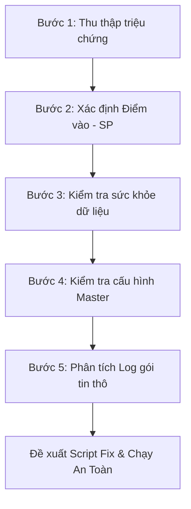

# 📘 KB_14_TRACE_BUG_METHODOLOGY — Cẩm Nang Truy Vết Lỗi & Dữ Liệu NAIS MES

> **Cập nhật:** 2026-05-25 | **Tác giả:** Antigravity (Google DeepMind Team)
> **Mục tiêu:** Hướng dẫn từng bước (Step-by-step) đầy đủ, chính xác, trực quan để kỹ sư vận hành/lập trình viên có thể tự mình truy tìm và sửa lỗi dữ liệu trên hệ thống MES Vinatech mà không cần đoán mò.

---

## 1. 🛡️ TRIẾT LÝ VÀ NGUYÊN TẮC VÀNG
> **"Không đoán mò — Chỉ tin vào dữ liệu thực tế trong Database"**

Khi tiếp nhận báo lỗi từ hiện trường, tuyệt đối không vội vàng đưa ra kết luận dựa trên mô tả cảm tính. Mọi lỗi hệ thống đều để lại dấu vết trong cơ sở dữ liệu. Bắt buộc phải thực hiện truy vấn `SELECT` để xác minh trạng thái thực của dữ liệu trước khi đưa ra phương án xử lý.

---

## 2. 📋 QUY TRÌNH TRUY VẾT LỖI 5 BƯỚC CHUẨN Y KHOA



### BƯỚC 1: Thu Thập Triệu Chứng Hiện Trường (Symptoms)
Trước khi mở SQL Server Management Studio (SSMS), hãy thu thập đủ **5 thông tin vàng**:
1. **Màn hình xảy ra lỗi:** (Mã TCode, ví dụ: `B523`, `B597`, `F330`...).
2. **Mã đối tượng bị lỗi:** (Mã Barcode, mã Lot, mã PO, hoặc mã Nguyên vật liệu...).
3. **Thao tác thực hiện:** (Nhấn nút "Gộp Box", "In tem", hay "Xác nhận nhập kho"...).
4. **Thông báo lỗi hiển thị trên giao diện (UI Error):** (Chụp ảnh màn hình hoặc ghi lại nguyên văn thông báo).
5. **Nhân sự thực hiện & Thời gian xảy ra lỗi:** (Để thu hẹp phạm vi quét log).

---

### BƯỚC 2: Xác Định Điểm Vào Hệ Thống (Entry Point - UI ➔ SP Mapping)
Hệ thống NAIS MES vận hành bằng cách gọi các Stored Procedure (SP) từ UI. Để biết nút bấm trên giao diện gọi SP nào, chạy các câu lệnh tra cứu sau:

```sql
-- 1. Tìm tên màn hình gốc theo mã TCode hiển thị trên UI
SELECT Name AS ScreenName, Caption, TCode 
FROM SmartFramework.dbo.STB_ScreenInfo
WHERE TCode = 'B523'; -- Thay thế bằng TCode bị lỗi

-- 2. Tìm tên Object (Nút bấm) và xem SP/Event tương ứng
-- Kết quả ScreenName ở bước 1 sẽ dùng làm điều kiện lọc ở đây
SELECT ObjectName, Caption, LinkURL, EventName 
FROM SmartFramework.dbo.STB_ScreenObjects
WHERE ScreenName = 'Vietnam_Donggoi_Hnam' -- Tên màn hình tìm được ở bước 1
  AND ObjectType = 'Action';
```

> 💡 **Mẹo:** Tên Stored Procedure thường nằm trong cột `LinkURL` hoặc `EventName` dưới dạng `usp_Vietnam_DoProcess...` hoặc `usp_DoProcess...`.

---

### BƯỚC 3: Kiểm Tra "Sức Khỏe" Dữ Liệu Hiện Tại (Data State Check)
Hệ thống chặn không cho thao tác thường do trạng thái Lot hoặc Barcode không đủ điều kiện (chưa qua công đoạn trước, chưa QC, hoặc đã bị báo phế). Chạy câu lệnh kiểm tra tổng quát sau:

```sql
-- Kiểm tra trạng thái toàn diện của một mã Barcode/Lot
SELECT 
    Barcode,
    MaterialCode,
    ProdQty,
    LotDecisionResult,  -- Trạng thái QC: 'PASS' = Đạt, 'FAIL' = Lỗi, NULL = Chưa đánh giá
    IsDefect,           -- 1 = Đang bị đánh dấu lỗi (NG), 0 = Bình thường
    DefectQty,          -- Số lượng lỗi
    IsProdFinish,       -- 1 = Đã hoàn tất công đoạn sản xuất, 0 = Chưa hoàn tất
    InputLineCode       -- Line sản xuất đăng ký
FROM STB_SetInfo
WHERE Barcode = 'Mã_Barcode_Cần_Check'; -- Ví dụ: 'SP20260525-001'
```

---

### BƯỚC 4: Kiểm Tra Cấu Hình Master Data (Configuration Check)
Nhiều lỗi xảy ra do thiếu cấu hình vật tư, thiết bị hoặc phân quyền trên hệ thống:

```sql
-- 1. Kiểm tra cấu hình gộp lot/sử dụng barcode của vật tư (Màn hình F110)
-- Nếu IsLotUse = 0 hoặc IsUseBarcode = 0, hệ thống sẽ chặn không cho quét Lot/In tem
SELECT MaterialCode, IsUseBarcode, IsLotUse 
FROM STB_MaterialStockAttributeInfo
WHERE MaterialCode = 'Mã_Vật_Tư_Cần_Check';

-- 2. Kiểm tra thông số voltage/farad của Model (Màn hình A410)
SELECT ModelCode, MBIExtText04 AS Voltage, MBIExtText05 AS Farad
FROM STB_ModelBasicInfo
WHERE ModelCode = 'Mã_Model_Cần_Check';
```

---

### BƯỚC 5: Phân Tích Log Hệ Thống Để Tìm Nguyên Nhân Gốc (Root Cause Analysis)
Khi giao diện báo lỗi chung chung (Ví dụ: "Lỗi hệ thống, liên hệ Admin"), đây là bước quan trọng nhất để xem lỗi thực tế xảy ra ở dòng code nào trong Database:

```sql
-- 1. Tra cứu log gói tin thô gửi từ Client lên Server
-- Giúp xác định chính xác dữ liệu Client truyền lên là gì
SELECT ProcessDateTime, IPAddress, Data, ProcessResult
FROM STB_ProcessTerminalDataLog
WHERE CAST(ProcessDateTime AS DATE) = CAST(GETDATE() AS DATE)
  AND Data LIKE '%Mã_Barcode_Cần_Check%'
ORDER BY ProcessDateTime DESC;

-- 2. Tra cứu log chi tiết các biến số bên trong Stored Procedure
-- Được SP tự động ghi lại khi xảy ra lỗi/validate chặn
SELECT ProcedureName, VariableName, VariableValue, CreateDateTime
FROM STB_ProcedureLog
WHERE CAST(CreateDateTime AS DATE) = CAST(GETDATE() AS DATE)
ORDER BY CreateDateTime DESC;
```

---

## 3. 🔍 ĐỌC VÀ PHÂN TÍCH CHUỖI DỮ LIỆU LOG (DATA LOG ANATOMY)

Cột `Data` trong bảng `STB_ProcessTerminalDataLog` lưu chuỗi dữ liệu thô phân tách bằng ký tự gạch đứng `|`.

**Ví dụ một chuỗi log gộp Box:**
`PRODPACKING|VELINE-01|VE10|SP20260525-001|1000|PK001|vanduc|...`

**Phân tích cấu trúc:**
1. `PRODPACKING`: Tên Action/Event (Sẽ được Route vào SP `usp_DoProcessTerminalData`).
2. `VELINE-01`: Mã Line sản xuất thực hiện.
3. `VE10`: Mã công đoạn sản xuất.
4. `SP20260525-001`: Mã Lot/Barcode sản phẩm.
5. `1000`: Số lượng sản phẩm (`ProdQty`).
6. `PK001`: Mã thùng/Box ID đích.
7. `vanduc`: Tài khoản User thực hiện.

> ⚠️ **Dấu hiệu bất thường cần tìm:**
> - Số lượng (`ProdQty`) truyền lên bằng `0` hoặc âm.
> - Mã Line hoặc mã Công đoạn bị trống hoặc không tồn tại trong Master Data.
> - Tài khoản User thực hiện chưa được phân quyền trên Line/Kho đó.

---

## 4. 🚀 HƯỚNG DẪN CHI TIẾT TỪNG STEP CHO 4 LỖI TRỌNG ĐIỂM (WITH DEMO CASES)

Dưới đây là cẩm nang hướng dẫn xử lý chi tiết từng bước (Step-by-step) cho 4 nhóm lỗi kinh điển trên hệ thống NAIS MES, được thiết kế dưới dạng "cầm tay chỉ việc", đảm bảo kỹ sư vận hành có thể tự tin xử lý an toàn kèm ví dụ demo thực tế.

---

### 4.1 LỖI KHÔNG GỘP ĐƯỢC BOX (MÀN HÌNH B523)

#### 🔴 Triệu chứng hiện trường:
Công nhân scan Lot/Barcode sản phẩm tại màn hình đóng gói **B523**, nhưng hệ thống báo lỗi đỏ: *"Chưa có tiêu chuẩn đóng gói"* hoặc *"Barcode không đủ điều kiện gộp box"*.

#### 🔍 Quy trình truy vết & xử lý (4 bước chuẩn):

*   **Bước 1: Kiểm tra cấu hình FIFO & Barcode trong Master (F110)**
    Hệ thống chỉ cho phép gộp box đối với các vật tư được khai báo sử dụng Barcode và quản lý Lot.
    ```sql
    -- Query kiểm tra master thuộc tính vật tư
    SELECT MaterialCode, IsUseBarcode, IsLotUse 
    FROM STB_MaterialStockAttributeInfo 
    WHERE MaterialCode = 'Mã_Vật_Tư'; -- Ví dụ: 'LIVT38-025'
    ```
    *   *Cách xử lý:* Nếu bảng trả về không có dữ liệu hoặc `IsLotUse = 0`, yêu cầu Master Data vào màn hình **F110** tìm mã vật tư và tích chọn **Use Barcode** + **Lot Use**, sau đó bấm **Save**.
    *   *Bypass nhanh bằng SQL:*
        ```sql
        UPDATE STB_MaterialStockAttributeInfo 
        SET IsLotUse = 1, IsUseBarcode = 1 
        WHERE MaterialCode = 'Mã_Vật_Tư';
        ```

*   **Bước 2: Kiểm tra trạng thái đánh giá chất lượng (QC Pass)**
    Hệ thống NAIS MES chặn cứng không cho đóng gói sản phẩm nếu lô hàng chưa qua kiểm tra QC hoặc bị QC đánh giá FAIL.
    ```sql
    -- Query kiểm tra kết quả đánh giá QC
    SELECT Barcode, LotDecisionResult, IsDefect, DefectQty 
    FROM STB_SetInfo 
    WHERE Barcode = 'Mã_Barcode_Sản_Phẩm'; -- Ví dụ: 'VVPO093R010707'
    ```
    *   *Cách xử lý:* Nếu `LotDecisionResult` is `NULL` hoặc `'FAIL'`, yêu cầu tổ QC vào màn hình **B597** đánh giá chất lượng lô hàng sang **PASS**. (Xem thêm mục 4.2 nếu cần hủy kết quả QC cũ để đánh giá lại).

*   **Bước 3: Kiểm tra xem Lot đã bị gộp vào Box khác chưa**
    ```sql
    -- Query kiểm tra xem Lot đã có PackingID (Box ID) gắn vào chưa
    SELECT LotID, LotNo, PackingID, CurrentQty 
    FROM STB_MaterialLotInfo 
    WHERE LotNo = 'Mã_Barcode_Sản_Phẩm';
    ```
    *   *Cách xử lý:* Nếu cột `PackingID` hiển thị một mã khác (Ví dụ: `'PKHN023117'`), nghĩa là Lot này đã được gộp vào Box đó rồi. Công nhân không thể gộp tiếp. Cần rã Box cũ ra trước (Xem mục 4.3).

*   **Bước 4: Kiểm tra tiêu chuẩn đóng gói (Packing Standard)**
    Mỗi Model khi đóng gói cần có cấu hình số lượng mỗi túi (`VinylBagQty`), hộp nhỏ (`InnerBoxQty`), thùng to (`OutBoxQty`).
    ```sql
    -- Query kiểm tra tiêu chuẩn đóng gói theo loại vật tư và kích thước (Size)
    SELECT * FROM STB_PackingStandard 
    WHERE MaterialTypeCode = 'FERT' 
      AND Size = 'Kích_Thước_Model'; -- Ví dụ: '0813' (đại diện size 8x13mm)
    ```
    *   *Cách xử lý:* Nếu bảng trống, yêu cầu Master Data vào màn hình **A419** thêm tiêu chuẩn đóng gói tương ứng với Size của Model đó.

---

### 4.2 LỖI USER MUỐN HỦY KẾT QUẢ, HỦY CÔNG ĐOẠN

Trong vận hành thực tế, việc công nhân scan nhầm, nhập sai số lượng phế (Defect Qty) hoặc QC đánh giá nhầm rất thường xảy ra. Dưới đây là phương pháp hủy an toàn trực tiếp từ DB.

#### 📐 KỊCH BẢN A: Hủy/Xóa sản lượng công đoạn sản xuất (Màn hình B530)
*   **Triệu chứng:** Công nhân scan nhầm sản lượng vào công đoạn `V-26` (Aging) trong khi Lot chưa chạy xong công đoạn `V-25`. Cần hủy công đoạn `V-26`.
*   **Ví dụ Demo:** Hủy công đoạn sản xuất mã `VE08` của Lot `VE260509-004`.
*   **Quy trình xử lý bằng Transaction:**
    ```sql
    BEGIN TRANSACTION;
    BEGIN TRY
        -- 1. Xem lịch sử công đoạn của Barcode để xác định sequence (ProcSeq)
        SELECT PRH.ControlNo, PRH.ProcSeq, PRH.RouteCode, PRH.ProdQty, PRH.CreateDateTime
        FROM STB_ProdRouteHist PRH
        JOIN STB_SetInfo SI ON PRH.ControlNo = SI.ControlNo
        WHERE SI.Barcode = 'VE260509-004'
        ORDER BY PRH.ProcSeq DESC; -- Dòng mới nhất hiện lên đầu

        -- 2. Thực hiện xóa công đoạn bị nhầm (Ví dụ: RouteCode = 'VE08')
        -- Ràng buộc xóa theo ControlNo và đúng RouteCode của dòng cuối
        DELETE FROM STB_ProdRouteHist
        WHERE ControlNo = (SELECT ControlNo FROM STB_SetInfo WHERE Barcode = 'VE260509-004')
          AND RouteCode = 'VE08';

        -- 3. Cập nhật reset trạng thái lỗi (DefectQty) trên SetInfo nếu cần
        UPDATE STB_SetInfo
        SET DefectQty = 0, IsDefect = 0
        WHERE Barcode = 'VE260509-004';

        COMMIT TRANSACTION;
        PRINT 'Hủy công đoạn thành công!';
    END TRY
    BEGIN CATCH
        ROLLBACK TRANSACTION;
        PRINT 'Lỗi: ' + ERROR_MESSAGE();
    END CATCH;
    ```

#### 🔬 KỊCH BẢN B: Hủy kết quả kiểm tra chất lượng QC (B597 / C443)
*   **Triệu chứng:** QC đánh giá nhầm Lot hàng sang FAIL hoặc load nhầm hạng mục kiểm tra cũ, muốn hủy kết quả để đo lại từ đầu.
*   **Ví dụ Demo:** Hủy tài liệu QC bị sai cho Barcode `VVPP163R072732`.
*   **Quy trình xử lý bằng Transaction:**
    ```sql
    BEGIN TRANSACTION;
    BEGIN TRY
        -- 1. Tìm CommInspDocNo (Mã tài liệu QC) đang liên kết với Barcode
        DECLARE @DocNo NVARCHAR(50);
        SELECT @DocNo = CIDH.CommInspDocNo
        FROM STB_CommInspDocHistory CIDH
        JOIN STB_SetInfo SI ON CIDH.ProdNo = SI.ControlNo
        WHERE SI.Barcode = 'VVPP163R072732';

        IF @DocNo IS NOT NULL
        BEGIN
            PRINT 'Tìm thấy tài liệu QC: ' + @DocNo;

            -- 2. Xóa các hạng mục kiểm tra chi tiết trước (STB_CommInspDocItem)
            DELETE FROM STB_CommInspDocItem WHERE CommInspDocNo = @DocNo;

            -- 3. Xóa lịch sử tài liệu QC (STB_CommInspDocHistory)
            DELETE FROM STB_CommInspDocHistory WHERE CommInspDocNo = @DocNo;
            
            PRINT 'Đã xóa hoàn toàn kết quả QC cũ.';
        END
        ELSE
        BEGIN
            PRINT 'Không tìm thấy kết quả QC nào cho Barcode này.';
        END

        COMMIT TRANSACTION;
    END TRY
    BEGIN CATCH
        ROLLBACK TRANSACTION;
        PRINT 'Lỗi xảy ra: ' + ERROR_MESSAGE();
    END CATCH;
    ```
    > ⚠️ **Lưu ý:** Sau khi chạy script, yêu cầu QC **tắt hoàn toàn màn hình B597/C443 và mở lại** để hệ thống xóa bộ nhớ đệm (cache) và tải lại spec mới từ đầu.

#### 📦 KỊCH BẢN C: Hủy/Sửa kết quả OQC Thành phẩm (C512 / C530)
*   **Triệu chứng:** Lô thành phẩm bị đánh giá nhầm trạng thái FAIL khiến thủ kho không thể nhập kho ở F110.
*   **Quy trình xử lý nhanh (Bypass sang PASS):**
    ```sql
    -- Cập nhật trực tiếp kết quả OQC sang PASS để thông luồng nhập kho
    UPDATE STB_CommInspDocHistory
    SET CommInspResult = 'PASS',
        FinishDateTime = GETDATE(),
        ChangeUserID = 'admin_fix'
    WHERE CommInspDocNo = (
        SELECT TOP 1 CIDH.CommInspDocNo 
        FROM STB_CommInspDocHistory CIDH
        JOIN STB_SetInfo SI ON CIDH.ProdNo = SI.ControlNo
        WHERE SI.Barcode = 'Mã_Barcode_Thành_Phẩm'
        ORDER BY CIDH.CreateDateTime DESC
    );
    ```

---

### 4.3 LỖI GỘP BOX 2 LẦN BỊ NHẦM (HỦY GỘP BOX & RÃ BOX)

#### 🔴 Triệu chứng hiện trường:
Công nhân đóng gói scan gộp nhầm 5 Lot con vào một Box ID (`PackingID`), hoặc gộp box 2 lần bị trùng lặp dẫn đến số lượng hiển thị trên tem bị sai lệch, số lượng tồn kho hiển thị âm hoặc bằng `0` (Lỗi HN544).

#### 🛠️ KỊCH BẢN A: Hủy gộp box / Rã box để đóng gói lại
*   **Ví dụ Demo:** Hủy gộp box (rã box) mã `PKHN023117` để giải phóng các Lot con bên trong.
*   **Quy trình xử lý bằng Transaction:**
    ```sql
    BEGIN TRANSACTION;
    BEGIN TRY
        -- 1. Xem danh sách các Lot con đang nằm trong Box bị gộp nhầm
        SELECT MaterialLotNo, LotNo, PackingID, CurrentQty, InitialQty 
        FROM STB_MaterialLotInfo 
        WHERE PackingID = 'PKHN023117';

        -- 2. Hủy liên kết Box: Set PackingID = NULL để giải phóng các Lot con ra ngoài
        UPDATE STB_MaterialLotInfo 
        SET PackingID = NULL 
        WHERE PackingID = 'PKHN023117';

        -- 3. Xóa thông tin Box lịch sử đóng gói trong bảng Divide (hàng Cell)
        DELETE FROM STB_DividePackaging WHERE PackingID = 'PKHN023117';

        -- 4. Xóa thông tin Box lịch sử đóng gói trong bảng SavePackingTime (nếu là hàng Module)
        DELETE FROM STB_SavePackingTime_VVT WHERE PackingID = 'PKHN023117';

        COMMIT TRANSACTION;
        PRINT 'Rã Box và giải phóng Lot thành công!';
    END TRY
    BEGIN CATCH
        ROLLBACK TRANSACTION;
        PRINT 'Lỗi rã Box: ' + ERROR_MESSAGE();
    END CATCH;
    ```

#### 🛠️ KỊCH BẢN B: Lỗi gộp box bị mất số lượng (Qty = 0 hoặc Qty âm)
*   **Triệu chứng:** Sau khi gộp box, do lỗi xung đột SP `usp_savePackingLabelQty_VVT` hoặc scan đúp, số lượng Lot hiện tại bị dồn về `0` hoặc âm.
*   **Ví dụ Demo:** Khôi phục số lượng thực tế là `20` cho Lot `SP260516-003` và xóa các Lot trùng lặp phát sinh.
*   **Quy trình xử lý:**
    ```sql
    BEGIN TRANSACTION;
    BEGIN TRY
        -- 1. Cập nhật số lượng thực tế cho Lot chuẩn cần giữ lại
        UPDATE STB_MaterialLotInfo
        SET InitialQty = 20, 
            CurrentQty = 20
        WHERE LotNo = 'SP260516-003';

        -- 2. Xóa bỏ các Lot ID con thừa/trùng lặp do hệ thống tự sinh sai khi scan đúp
        -- Dùng danh sách cụ thể thu thập được khi SELECT ở bước trước
        DELETE FROM STB_MaterialLotInfo 
        WHERE MaterialLotNo IN ('LotID_Thừa_1', 'LotID_Thừa_2');

        COMMIT TRANSACTION;
        PRINT 'Khôi phục số lượng gộp box thành công!';
    END TRY
    BEGIN CATCH
        ROLLBACK TRANSACTION;
        PRINT 'Lỗi: ' + ERROR_MESSAGE();
    END CATCH;
    ```

---

### 4.4 LỖI KHÔNG CHỐT ĐƯỢC CÔNG ĐOẠN (MÀN HÌNH B530)

Màn hình **B530** là nơi công nhân ghi nhận sản lượng hoàn thành của từng công đoạn sản xuất. Dưới đây là 3 nguyên nhân chặn chốt công đoạn phổ biến nhất.

#### 📐 KỊCH BẢN A: Chặn do quên scan Nguyên vật liệu tại trạm trước (V-23 / V-24)
*   **Triệu chứng:** Khi bấm chốt công đoạn `V-23` (Lắp cao su) hoặc `V-24` (Curling), hệ thống báo lỗi: *"Chưa nhập NVL cho Lắp Cao Su"* hoặc *"Chưa nhập NVL cho Curling"*.
*   **Nguyên nhân:** SP `usp_CheckInputRawMaterialCodeForProduct` kiểm tra và phát hiện barcode sản phẩm chưa được scan gán Lot vật tư đầu vào tại trạm **B540**.
*   **Cách khắc phục chuẩn:** Yêu cầu công nhân quay lại màn hình **B540**, scan barcode sản phẩm và quét đúng mã Lot NVL (cao su, sleeve) tương ứng.
*   **Bypass khẩn cấp bằng SQL (IT chèn dữ liệu giả lập NVL để thông luồng):**
    ```sql
    -- Chèn trực tiếp bản ghi scan NVL cho Barcode
    INSERT INTO STB_RawMaterialInputHist 
        (Barcode, RouteCode, MaterialCode, RawMaterialBarcode, CreateDateTime, CreateUserID)
    VALUES 
        ('Mã_Barcode_Bị_Lỗi', 'V-23', 'Mã_Vật_Tư_Cao_Su', 'Mã_Lot_NVL_Thực_Tế', GETDATE(), 'vinaadmin');
    ```

#### 📐 KỊCH BẢN B: Chặn do công đoạn phía sau đã được scan trước ("Đã hoàn thành thực tế rồi")
*   **Triệu chứng:** Công nhân quên chốt công đoạn `V-25` nhưng đã scan chốt công đoạn `V-26`. Khi quay lại chốt `V-25` thì hệ thống báo lỗi: *"Đã hoàn thành thực tế rồi"*.
*   **Nguyên nhân:** SP chặn chốt công đoạn trước nếu công đoạn sau đã có dữ liệu sản lượng (`AftProdQty <> 0`).
*   **Cách khắc phục:**
    1.  Chạy script **hủy công đoạn sau** (`V-26`) trước (Xem mục 4.2).
    2.  Yêu cầu công nhân scan chốt công đoạn trước (`V-25`) trên UI.
    3.  Sau đó scan chốt lại công đoạn sau (`V-26`) đúng thứ tự.

#### 📐 KỊCH BẢN C: Chặn do Gate 20 phút (Chỉ áp dụng tại nhà máy Bắc Ninh - VNT)
*   **Triệu chứng:** Khi bấm chốt công đoạn, hệ thống báo lỗi: *"Thời gian scan quá nhanh, phải đợi tối thiểu 20 phút từ công đoạn trước"*.
*   **Nguyên nhân:** SP `usp_DoProcessProdRouteHistForCalc_SmartApp_VNT` chặn đăng ký liên tiếp giữa các công đoạn có thời gian chênh lệch dưới 20 phút nhằm chống scan khống.
*   **Cách khắc phục (Bypass lùi giờ scan trước):**
    ```sql
    -- Lùi thời gian scan của công đoạn ngay trước đó về 25 phút trước
    UPDATE STB_ProdRouteHist
    SET CreateDateTime = DATEADD(MINUTE, -25, GETDATE())
    WHERE ControlNo = (SELECT ControlNo FROM STB_SetInfo WHERE Barcode = 'Mã_Barcode_Bị_Chặn')
      AND RouteCode = 'Mã_Công_Đoạn_Trước'; -- Ví dụ: 'V-22'
    ```

---

### 4.5 LỖI KHÔNG IN ĐƯỢC TEM (B450 / B523 / B756 / A460)

#### 🔴 Triệu chứng hiện trường:
Người dùng thao tác tạo Lot sản xuất hoặc in tem đóng gói nhưng máy in không phản hồi hoặc giao diện báo lỗi: *"Không tìm thấy định dạng nhãn"* hoặc tem in ra bị thiếu các thông số bắt buộc (Vol, Farad, Datecode...).

#### 🔍 Quy trình truy vết & xử lý (5 bước kiểm tra):

*   **Bước 1: Kiểm tra cấu hình nhãn in trong SmartFramework (Màn hình A460)**
    Lỗi `"Không tìm thấy định dạng nhãn"` xảy ra khi template nhãn chưa được thiết lập hoặc chưa được phê duyệt.
    ```sql
    -- Kiểm tra sự tồn tại và trạng thái active của mẫu tem
    SELECT FormatName, IsApproval, ApplyDate, FormatType
    FROM SmartFramework.dbo.STB_LabelInfo 
    WHERE FormatName LIKE '%HN%' -- Lọc theo tên nhà máy/mẫu
      AND IsApproval = 1;
    ```
    *   *Cách xử lý:* Nếu trống, vào màn hình **A460** chọn cấu hình: **`AssembleLabel`** (Dòng 2) dùng cho sản xuất, **`PartLabel`** dùng cho tem kho nguyên vật liệu, tích chọn **IsApproval = 1** và bấm **Save**.

*   **Bước 2: Kiểm tra cấu hình Vol/Farad của Model (Màn hình A410)**
    Khi in tem đóng gói, nếu Model thiếu cấu hình giá trị Điện áp (Voltage) và Điện dung (Farad), hệ thống sẽ chặn không cho in hoặc in ra tem trống thông số.
    ```sql
    -- Kiểm tra thông số Model cơ bản
    SELECT ModelCode, ModelName, MBIExtText04 AS Voltage, MBIExtText05 AS Farad 
    FROM STB_ModelBasicInfo 
    WHERE ModelCode = 'Mã_Model'; -- Ví dụ: 'RDMD00-368'
    ```
    *   *Cách xử lý:* Nếu các cột Vol/Farad bị rỗng (`NULL`), yêu cầu Master Data vào màn hình **A410** nhập đầy đủ thông số cho Model đó và bấm **Lưu**.

*   **Bước 3: Kiểm tra trạng thái QC Pass của Lot (Xem mục 4.1)**
    Lot chưa QC Pass (`LotDecisionResult IS NULL`) sẽ chặn in tem đóng gói.

*   **Bước 4: Kiểm tra cấu hình in tem VJ của mã sản phẩm**
    Nếu in tem không ra đúng đầu mã VJ mà ra mã VV:
    ```sql
    -- Kiểm tra thiết lập chuyển đổi mã VV -> VJ
    SELECT * FROM STB_Vietnam_PackingPrinting WHERE MaterialCode = 'Mã_Vật_Tư';
    ```
    *   *Cách xử lý:* Đảm bảo cờ `PrintVJ = 1` để hệ thống tự động đổi đầu mã khi in.

---

### 4.6 LỖI NHẬP PHẾ MÀN HNC321 BÁO LỖI TIẾNG HÀN (이전 공정에 실적처리 이력이 없습니다)

#### 🔴 Triệu chứng hiện trường:
Tại màn hình **HNC321** *(Qc nhập NG sản phẩm mang đi kiểm tra)*, khi nhập số lượng phế cho Barcode `ve260509-001` tại công đoạn `VE08` (Mã lỗi `VE08_34` - Taping khác...), hệ thống báo lỗi đỏ:
`Failed to save: 이전 공정에 실적처리 이력이 없습니다.`
*(Dịch nghĩa: Không có lịch sử xử lý sản lượng ở công đoạn trước).*

#### 🔍 Nguyên nhân gốc rễ:
Stored Procedure xử lý nghiệp vụ nhập phế (`usp_Vietnam_ScrapInput_HN`) chặn không cho phép nhập phế liệu tại công đoạn `VE08` nếu sản phẩm này chưa từng có dữ liệu chốt sản lượng (Routing History) ở công đoạn ngay trước đó (Ví dụ: `VE07` hoặc trạm trước của `VE08` trong cấu hình Routing của PO).

#### 🛠️ Kịch bản xử lý từng bước (Bypass bằng SQL):
Khi công đoạn trước bị bỏ qua không quét chốt và hàng thực tế đã phế, IT tiến hành chèn một dòng lịch sử sản lượng giả lập cho trạm trước để thông luồng:

*   **Step 1:** Truy vấn mã `ControlNo` của Barcode bị lỗi:
    ```sql
    SELECT ControlNo, Barcode, PONo, MaterialCode FROM STB_SetInfo WHERE Barcode = 've260509-001';
    ```
*   **Step 2:** Truy vấn xem công đoạn ngay trước `VE08` trong cấu hình Route của PO đó là gì:
    ```sql
    SELECT RouteCode, RouteIndex 
    FROM STB_ProductionOrderRouting 
    WHERE PONo = (SELECT PONo FROM STB_SetInfo WHERE Barcode = 've260509-001')
    ORDER BY RouteIndex ASC;
    -- Kết quả xác định được công đoạn trước là 'VE07'
    ```
*   **Step 3:** Thực hiện chèn bản ghi lịch sử Routing giả lập cho trạm `VE07` bằng Transaction an toàn:
    ```sql
    BEGIN TRANSACTION;
    BEGIN TRY
        DECLARE @CtrlNo NVARCHAR(50) = (SELECT ControlNo FROM STB_SetInfo WHERE Barcode = 've260509-001');

        INSERT INTO STB_ProdRouteHist 
            (ControlNo, ProcSeq, RouteCode, LineCode, MachineCode, InQty, OutQty, JobDate, ShiftCode, CreateUserID, CreateDateTime)
        VALUES 
            (@CtrlNo, 
             (SELECT ISNULL(MAX(ProcSeq), 0) + 1 FROM STB_ProdRouteHist WHERE ControlNo = @CtrlNo), 
             'VE07',            -- Mã công đoạn trước VE08
             'MCVC20220',       -- Mã Line phát sinh
             'MCVC20220',       -- Mã máy
             20, 20,            -- Số lượng phế
             CAST(GETDATE() AS DATE), 'A', 
             'vinaadmin', GETDATE());

        COMMIT TRANSACTION;
        PRINT 'Đã chèn lịch sử giả lập thành công! Hãy bảo công nhân bấm Lưu (Save) lại trên giao diện HNC321.';
    END TRY
    BEGIN CATCH
        ROLLBACK TRANSACTION;
        PRINT 'Lỗi: ' + ERROR_MESSAGE();
    END CATCH;
    ```
---

### 4.7 LỖI NHẢY BƯỚC CÂN ĐIỆN CỰC MIXING (PHẦN MỀM electrode.weighing)

#### 🔴 Triệu chứng hiện trường:
"Các bước cân cứ nhảy không đúng thứ tự process nên không cân được", "Mã điện cực HCE đang lỗi chưa thao tác được, sản xuất ra mà không được ghi nhận trên hệ thống".

#### 🔍 Nguyên nhân gốc rễ:
*   Phần mềm có checkbox **"CA ĐÊM CHUẨN BỊ TRƯỚC"** (`isnight` trên UI). Khi tích vào ô này, phần mềm gọi SP `usp_GetElectroMixPresentStep_vietnam` và `usp_ElectrodeStep_Vietnam` với tham số `@pOrder = 'kdem'` để đẩy Binder lên cân trước (vì cần thời gian khuấy sấy lâu).
*   Nếu ca ngày làm việc hoặc ca bình thường **quên bỏ tích checkbox này**, thứ tự process sẽ bị xáo trộn, bắt cân Binder trước rồi mới đến bột Than. Công nhân không thể cân lần lượt từ trên xuống theo quy trình chuẩn và bị báo lỗi nhảy bước.
*   Khi bước cân bị treo/chặn, mẻ trộn Mixing không thể chốt hoàn thành trên MES, dẫn đến bán thành phẩm (Slurry) sản xuất ra **không được ghi nhận trên hệ thống** (thiếu bản ghi trong `STB_ElectrodeMixInfo`). Khi sang công đoạn tiếp theo (Coating), quét mã Lot điện cực sẽ bị báo lỗi.

#### 🛠️ Kịch bản xử lý từng bước:

*   **Step 1 (Bypass vận hành):**
    Yêu cầu công nhân ca ngày **bỏ tích checkbox "CA ĐÊM CHUẨN BỊ TRƯỚC"** trên giao diện chính của phần mềm, sau đó bấm nút **"Làm mới màn hình"** để hệ thống sắp xếp lại thứ tự cân than trước.
*   **Step 2 (IT reset Lot bị kẹt):**
    Nếu Lot điện cực (Ví dụ: Lot của mã `HCE-202`) đã bị ghi nhận sai thứ tự và kẹt nửa chừng, IT chạy lệnh xóa dữ liệu cân tạm của Lot đó trong bảng `STB_ElectrodeMixStepInfo` để công nhân cân lại đúng thứ tự từ đầu:
    ```sql
    BEGIN TRANSACTION;
    DELETE FROM STB_ElectrodeMixStepInfo 
    WHERE ElectrodeLotNumber = 'Mã_Lot_Điện_Cực_HCE_Bị_Kẹt';
    COMMIT TRANSACTION;
    ```
    Sau đó chốt mẻ trộn bình thường để hệ thống tự động ghi nhận sản lượng Slurry, thông luồng cho Coating/Slitting tiếp theo.

---

### 4.8 ĐIỆN CỰC MÃ LIỆU 3582-600F CY KHÔNG TẠO ĐƯỢC TEM

#### 🔴 Triệu chứng hiện trường:
Khi sản xuất điện cực mã liệu `3582-600F CY`, hệ thống không cho tạo hoặc in tem điện cực.

#### 🔍 Nguyên nhân gốc rễ:
*   Mã điện cực `3582-600F CY` là mã model/sản phẩm mới chưa được khai báo đầy đủ cấu hình trong Master Data.
*   Đặc biệt, trạm cắt điện cực Slitting (B552) yêu cầu phải có cấu hình quy cách Slitting trong bảng **`stb_slittinglocationconfig_vvt`** mới cho phép in tem.

#### 🛠️ Kịch bản xử lý từng bước:

*   **Step 1:** Thêm cấu hình quy cách Slitting cho model `3582` (cả cực dương `BY` và cực âm `YP`):
    ```sql
    BEGIN TRANSACTION;
    INSERT INTO stb_slittinglocationconfig_vvt
        (PartNo, SlittingCode, SlittingSize, Farad, Width, WarehouseLocation, LocationWarehouse, RollQty, PositiveLocation, NegativeLocation)
    VALUES
        ('3582', 'BY', '200', '600', '39.34', 'VVT_F2', 'kho2', 20, 'A6-T3', 'B6-T3'),
        ('3582', 'YP', '180', '600', '39.34', 'VVT_F2', 'kho2', 20, 'A6-T3', 'B6-T3');
    COMMIT TRANSACTION;
    ```
*   **Step 2:** Kiểm tra và đảm bảo đã khai báo model `3582-600F CY` vào bảng `STB_ModelBasicInfo` (A410) đầy đủ thông số Vol/Farad (Vol = '3R0', Farad = '600.0') để các trạm QC và kho nhận diện được đúng:
    ```sql
    SELECT * FROM STB_ModelBasicInfo WHERE ModelCode = '3582-600F CY';
    -- Nếu thiếu, thực hiện chèn dữ liệu (Xem chi tiết tại KB_06 § 1.1)
    ```

---

## 5. 🛠️ CÁC CÂU LỆNH SQL UTILITIES CỨU HỘ NHANH

### A. Kiểm tra nhanh lịch sử di chuyển Lot (Routing Trace)
Khi Lot không hiển thị ở công đoạn hiện tại, kiểm tra xem nó đã qua công đoạn trước chưa:
```sql
SELECT Barcode, ProcSeq, ProcessCode, MachineCode, InQty, OutQty, JobDate, CreateUserID, CreateDateTime
FROM STB_ProdRouteHist
WHERE Barcode = 'Mã_Barcode_Cần_Tra'
ORDER BY ProcSeq ASC;
```

### B. Kiểm tra Lot Nguyên vật liệu đầu vào (WMS Trace)
Khi kho NVL báo không gộp được hoặc hệ thống báo Lot nguyên vật liệu không tồn tại:
```sql
SELECT MaterialLotNo, MaterialCode, WarehouseCode, CurrentQty, LotState, UseFlag
FROM STB_MaterialLotInfo
WHERE MaterialLotNo = 'Mã_Lot_NVL_Cần_Check';
-- LotState: 'U' = Đang sử dụng (Active), 'H' = Holding (Bị khóa), 'D' = Báo phế
```

### C. Tra cứu nhanh các ngoại lệ bỏ qua chặn FIFO/Hạn sử dụng
Nếu một Lot NVL hết hạn nhưng được phép dùng tiếp, kiểm tra xem đã được khai báo bypass chưa:
```sql
SELECT * FROM stb_vvt_OpenExpiredMaterial WHERE LotID = 'Mã_Lot_NVL';
```

---

## 6. ⚠️ CHECKLIST AN TOÀN TUYỆT ĐỐI CHO DEVELOPER
1. **SELECT trước, UPDATE/DELETE sau:** Luôn chạy câu lệnh SELECT với điều kiện WHERE định sửa để kiểm tra số dòng bị ảnh hưởng.
2. **Không tự ý chạy UID trực tiếp trên Production:** Viết script dưới dạng mẫu có **Transaction (BEGIN TRAN, ROLLBACK/COMMIT)** và gửi cho User có thẩm quyền tự chạy qua SSMS.
3. **Trigger Alert:** Nhớ rằng bảng `STB_MaterialLotInfo` có trigger cập nhật số tồn kho tự động. Khi can thiệp thủ công số lượng, phải kiểm tra các bảng liên quan như `STB_MaterialDocInfo` và `STB_MaterialDocDetail`.

---

*Cập nhật: 2026-05-26 | Tổng hợp và chuẩn hóa bởi Antigravity AI.*
