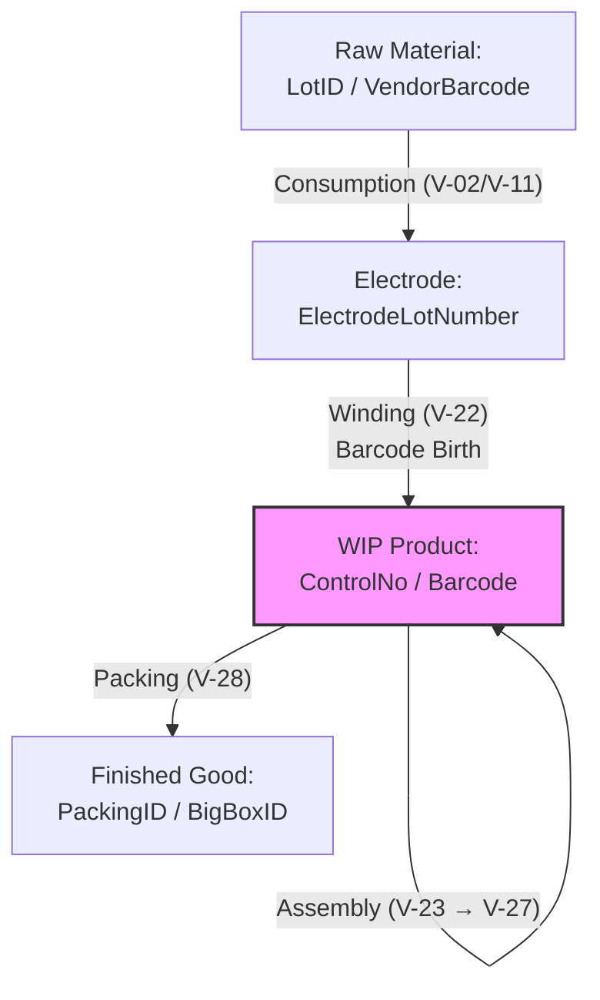
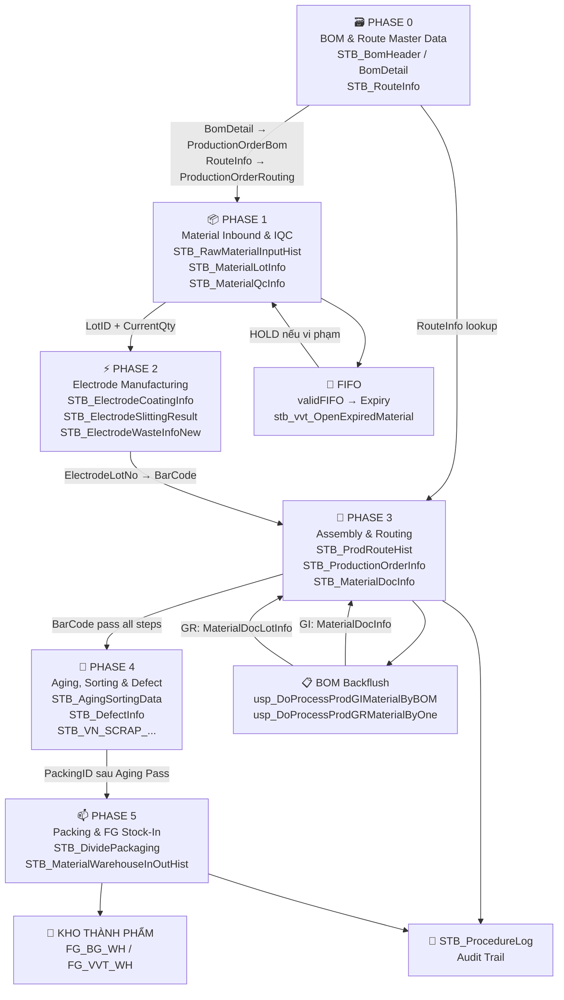

# 🏭 VINATECH MES — Complete Data Flow Documentation
> **Nguồn dữ liệu:** Phân tích trực tiếp từ Stored Procedure trong database production  
> **Server:** `dbserver.hycap.co.kr,5398` | **Database:** `SmartFactoryV2`  
> **SP đã xác minh:** 24+ SPs (Bao gồm cả các SP cấu hình Master, Routing và Kế hoạch sản xuất tự động)  
> **Cập nhật:** 2026-04-18

---

## 🚦 Đọc Tài Liệu Này Như Thế Nào?

> Tài liệu này có **4000+ dòng**. Đừng đọc từ đầu đến cuối — hãy đọc theo mục đích.

| Bạn là ai / Bạn cần gì | Đọc phần nào trước |
|---|---|
| **Mới vào, chưa biết gì** | 👉 [3 Trụ Cột](#pillars) → [Vòng Đời Dữ Liệu](#data-lifecycle) → [Bản Đồ Màn Hình VVT](#vvt-navigator) |
| **Cần debug lỗi ngay** | 👉 [Developer Cheat Sheet](#cheat-sheet) → [STB_ProcedureLog](#cheat-sheet) |
| **Tìm hiểu 1 màn hình cụ thể** | 👉 [VVT Navigator](#vvt-navigator) → Tìm mã màn hình (B597, B530, ...) |
| **Thêm model mới / cấu hình** | 👉 [Quick Start](#phase-0) → [Checklist Model Mới](#phase-0) |
| **Truy vết sự cố sản phẩm** | 👉 [Golden Query](#data-lifecycle) → [Cheat Sheet Kho](#cheat-sheet) |
| **Hiểu sâu 1 phase cụ thể** | 👉 [Phase 0](#phase-0) → [Phase 1](#phase-1) → ... → [Phase 5](#phase-5) |

### 🗝️ 5 Khái niệm Cốt Lõi Cần Hiểu Trước

Nếu bạn hiểu 5 khái niệm này, phần còn lại của tài liệu sẽ tự nhiên rõ ràng:

| # | Khái niệm | Giải thích đơn giản | Ví dụ thực tế |
|---|---|---|---|
| **1** | **ControlNo / Barcode** | Chứng minh thư của 1 viên tụ điện. Sinh ra tại máy cuốn, theo suốt đến khi đóng thùng. | `VVPR292R710617` |
| **2** | **LotID** | Chứng minh thư của 1 kiện NVL trong kho. Prefix `ML...` = do kho cấp. | `ML20260401000056` |
| **3** | **PONo** | Số lệnh sản xuất. Gom nhiều Barcode vào 1 nhóm để sản xuất cùng 1 đợt. | `PO2026040100012` |
| **4** | **RouteCode** | Mã công đoạn. Từ `V-01` (đầu) đến `V-28` (đóng gói). Barcode phải đi đủ các bước theo thứ tự. | `V-23` = Lắp cao su |
| **5** | **ProductGroupCode** | Nhóm phân loại NVL. Dùng trong validation khi OP scan. | `ELECTROLYTE`, `SLEEVE`, `CASE` |

### 🏭 Sơ Đồ Nhà Máy Trong 1 Hình

```
NVL từ kho ──► [Điện cực] ──► [Cuốn] ──► [Lắp ráp] ──► [Aging/OQC] ──► [Đóng gói] ──► Kho TP
  LotID           V-11          V-22        V-23~27         V-26           V-28         BigBoxID
  ML...      ElectrodeLot     Barcode      Barcode        Barcode       PackingID
             (Phase 2)       ra đời       đi qua        được test      vào thùng
                              đây!        từng bước
```

**Quan trọng:** Tại mỗi mũi tên → hệ thống ghi 1 record vào `STB_ProdRouteHist`. Toàn bộ lịch sử di chuyển của 1 sản phẩm = toàn bộ record có cùng `ControlNo` trong bảng đó.

---

<a name="pillars"></a>
## 🏛️ Tổng Quan Kiến Trúc (The Three Pillars)

> **Câu hỏi cốt lõi:** Khi OP bấm nút "Save" trên màn hình B597 — chuyện gì xảy ra phía sau?

Hệ thống được xây dựng trên **3 Trụ cột chính**:

### Trụ cột 1 — Metadata (SmartFramework): *"UI chỉ là vỏ, não nằm trong DB"*

MES không fix cứng hành vi của từng nút bấm trong code. Thay vào đó:
- Mỗi nút "Save" → chỉ gọi 1 tên SP được cấu hình trong bảng `STB_ScreenObjects`
- Muốn thay đổi hành vi → sửa trong DB, **không cần đóng gói lại phần mềm**

```
OP bấm "Save" → NAIS Framework đọc STB_ScreenObjects → Gọi đúng SP → SP xử lý → Ghi DB
```

### Trụ cột 2 — Stored Procedures: *"Mọi hành động đều có dấu vết"*

Mọi thao tác của OP (Scan barcode, nhập sản lượng, xác nhận đóng gói) đều được ghi vào bảng lịch sử (`Hist`) thông qua SP. SP là nơi chứa toàn bộ:
- **Validation** (kiểm tra hợp lệ trước khi lưu)
- **Business logic** (tính toán, kiểm tra FIFO, kiểm tra hạn dùng)
- **Ghi dữ liệu** (INSERT/UPDATE vào DB)

### Trụ cột 3 — Triggers: *"Tồn kho tự cập nhật, không cần ai nhớ"*

Khi SP ghi dữ liệu vào bảng Lot → DB Trigger **tự động** cộng/trừ tồn kho tổng vào `STB_MaterialStock`. Developer thường **quên mất triggers** này khi debug lỗi tồn kho.

> ⚠️ **Lưu ý quan trọng cho Developer:** Nếu tồn kho sai không rõ nguyên nhân → hãy kiểm tra xem có Trigger nào đang âm thầm chạy không trước khi đổ lỗi cho SP.

---

## 📋 Mục Lục Nhanh

- 👉 **[Đọc tài liệu này như thế nào?](#-đọc-tài-liệu-này-như-thế-nào)**
- [🏛️ 3 Trụ Cột Kiến Trúc](#pillars)
- [🧬 Vòng Đời & Phả Hệ Dữ Liệu](#data-lifecycle) 
- [💡 Kiến Trúc Vận Hành NAIS](#nais-architecture)
- [🧠 Lỗi Tồn Kho & Logic Ngầm (Triggers)](#hidden-logic)
- [📘 Từ Điển 50+ Bảng Dữ Liệu (Dictionary)](#dictionary)
- [🗺️ Bản Đồ Chức Năng VVT (Navigator)](#vvt-navigator)
- [⚡ Developer Cheat Sheet (SQL gỡ lỗi nhanh)](#cheat-sheet)

---

### Phân rã theo giai đoạn sản xuất (Phases)
- [Phase 0: Master Data — BOM & Routing](#phase-0)
- [Phase 1: Material Inbound & QC (Nhập NVL & Kiểm Tra)](#phase-1)
- [Phase 2: Electrode Manufacturing (Điện Cực)](#phase-2)
- [Phase 3: Assembly & Production (Lắp Ráp)](#phase-3)
- [Phase 4: Aging, Sorting & Defect (Kiểm Tra & Lỗi)](#phase-4)
- [Phase 5: Packing & Shipping (Đóng Gói & Xuất Kho)](#phase-5)

---

<a name="nais-architecture"></a>
## 💡 Kiến Trúc Vận Hành NAIS (NAIS Framework Architecture)

> **Nguyên lý cốt lõi:** NAIS (SmartFramework) là hệ thống **Metadata-Driven**. Giao diện (UI) không chứa logic, mọi hành động (Click, Search, Save) đều được cấu hình trong database metadata để gọi Stored Procedure.

### 1. Cách tìm Logic đằng sau bất kỳ màn hình nào
Để hiểu thấu đáo hệ thống, bạn không cần đọc code C#, chỉ cần truy vấn database `SmartFramework` với tài khoản `vanduc`:

**Bước 1: Tìm Tên Màn Hình (ScreenName)**
Mỗi màn hình có một `Caption` (hiển thị trên tab) và một `Name` (ID kỹ thuật). Tra cứu trong `STB_ScreenInfo`.

**Bước 2: Tìm SP tương ứng**
Dùng truy vấn sau để biết nút bấm hoặc lưới dữ liệu đó đang gọi SP nào:
```sql
SELECT ScreenName, ObjectName, ObjectType, Description 
FROM SmartFramework.dbo.STB_ScreenObjects 
WHERE ScreenName = 'VVT_MaterialStockList' -- Thay bằng tên màn hình bạn tìm thấy ở Bước 1
```
*Ghi chú:*
- `SearchFunction`: SP dùng để nạp dữ liệu vào Grid (lưới).
- `ExecuteFunction`: SP dùng khi nhấn nút Save/Delete/Process.

### 2. Phân vùng Database
Hệ thống Vinatech MES chia làm 2 cơ sở dữ liệu (DB) chính:
- **`SmartFactoryV2`**: Chứa toàn bộ dữ liệu nghiệp vụ (Sản lượng, Tồn kho, Lệnh sản xuất, BOM, Route).
- **`SmartFramework`**: Chứa Metadata hệ thống (Menu, User, Quyền hạn, Cấu hình giao diện, Template nhãn in `STB_LabelInfo`).

---

<a name="hidden-logic"></a>
## 🧠 Logic "Ngầm" & Hệ Thống Tự Động (Hidden Database Logic)

> **Cảnh báo cho Developer:** Nhiều hành vi của MES diễn ra hoàn toàn tự động ở tầng Database mà không nằm trong Stored Procedure.

### 1. Tự độ cập nhật Tồn kho (Auto-Stock via Triggers)
Hệ thống sử dụng các **Database Triggers** để đảm bảo tính nhất quán của dữ liệu tồn kho tổng hợp (`STB_MaterialStock`). 

*   **Trigger tiêu biểu:** `tgMaterialLotInfoForInsert` (on `STB_MaterialLotInfo`)
*   **Cơ chế:** Ngay khi một Lot hàng được insert vào bảng Lot, Trigger sẽ thực thi lệnh `MERGE` vào bảng `STB_MaterialStock`. 
    - Nếu mã vật tư + vị trí đã tồn tại → Cộng dồn Qty.
    - Nếu chưa có → Insert dòng mới.
*   **Ý nghĩa:** Điều này đảm bảo tồn kho luôn chính xác ngay cả khi dữ liệu được nạp vào từ các công cụ ngoài (như SQL Management Studio) mà không qua MES UI.

### 2. Validate ràng buộc dữ liệu (DB-Level Validation)
Các ràng buộc logic cứng được cài cắm tại Triggers (ví dụ: `tgMaterialDocDetailForInsert`) để ngăn chặn các lỗi nghiêm trọng:
- Không cho phép sửa/xóa Detail khi Header (`STB_MaterialDocInfo`) đã ở trạng thái `FINISH` hoặc `FIX`.
- Không cho phép thao tác trên các chứng từ đã bị `CANCEL`.

---

<a name="planning-layer"></a>
## 📈 Tầng Hoạch Định Sản Xuất (Master Production Schedule - MPS)

> **Vận hành từ trên xuống:** Trước khi sản xuất bắt đầu tại các trạm, dữ liệu phải được hoạch định tại tầng MPS.

### 1. Master Production Schedule (MPS)
Dữ liệu hoạch định được lưu trong `STB_MasterProductionScheduleInfo`. 
- **Vai trò:** Cầu nối giữa bộ phận Sales (Dự báo/Đơn hàng) và Sản xuất (Lệnh sản xuất).
- **SP tiêu biểu:** `usp_MasterProductionScheduleInfo_get`
- **Logic hoạch định:** Hệ thống tính toán dựa trên `SalesRegionCode` và `CustomerCode`. Đối với các sản phẩm MODULE, hệ thống sẽ tự động quy đổi ra số lượng **Single Cell** cần thiết (`TotSingleCellQty`) dựa trên định mức cấu thành.

### 2. Quản lý Batch & Daily Schedule
- **Batch Order:** `usp_DoCreateProductionOrderBatch` dùng để gom các lệnh sản xuất nhỏ thành các lô sản xuất lớn nhằm tối ưu hóa máy móc.
- **Daily Layout:** `usp_Prod_Daily_Input_Schedule` xác định thứ tự ưu tiên các mã hàng sẽ chạy trong ngày.

---

<a name="data-lifecycle"></a>
## 🧬 Vòng Đời & Phả Hệ Dữ Liệu (Data Lifecycle & Genealogy)

> **Dòng chảy xuyên suốt:** Cách một Lot nguyên liệu vô danh trở thành một viên tụ có mã vạch và nằm trong thùng hàng xuất khẩu.

### 1. Sơ đồ Luồng Công đoạn (Process Step Mapping)
Hệ thống quản lý theo từng trạm quét (Scan Point), mỗi trạm tương ứng với một `RouteCode`.

| Giai đoạn | Công đoạn (Physical) | Route Code | Màn hình NAIS | SP Xử lý | Bảng chính ghi nhận |
|-----------|----------------------|------------|---------------|----------|---------------------|
| **Cực (Electrode)** | Cán (Coating) | V-02 | Coating POP | `pop_Electrode_Coating_iud` | `STB_ElectrodeCoatingInfo` |
| | Xẻ (Slitting) | V-11 | Slitting POP | `usp_ElectrodeSlittingResult_iud` | `STB_ElectrodeSlittingResult` |
| **Cuốn (WIP)** | **Cuốn (Winding)** | **V-22** | **Winding Result** | `usp_DoProcessProdRouteHist` | **`STB_ProdRouteHist` (ControlNo)** |
| **Lắp ráp** | Lắp cao su | V-23 | Assembly Scan | `usp_DoProcessProdRouteHist` | `STB_ProdRouteHist` |
| | Bọc vỏ | V-25 | Assembly Scan | `usp_DoProcessProdRouteHist` | `STB_ProdRouteHist` |
| **Kiểm tra** | Aging | V-26 | Aging Test | `usp_InsertDataAgingAndSorting`| `STB_AgingSortingData` |
| **Đóng gói** | Đóng gói | V-28 | Vietnam_Donggoi| `usp_Vietnam_DoProcessProdPacking_VVT` | `STB_DividePackaging` (PackingID) |

### 2. Sự chuyển hóa Định danh (The ID Genealogy)
Đây là logic quan trọng nhất để truy vết (Traceability).

> **Hình dung đơn giản:** Giống như một người đi qua nhiều trạm hải quan. Mỗi trạm đóng dấu (= ghi record). Truy vết = xem lại tất cả các dấu đã đóng trên hộ chiếu.



*   **Barcode Birth (V-22):** Tại máy cuốn, hệ thống "khai sinh" ra `ControlNo`. Mọi lịch sử từ trạm này trở đi sẽ bám theo `ControlNo` này trong bảng `STB_ProdRouteHist`.
*   **Vết nguyên liệu (BOM Link):** Khi trạm V-22 quét hoàn thành, SP `usp_DoProcessProdGIMaterialByBOM` sẽ chạy ngầm để trừ tồn kho của các `LotID` nguyên liệu cấu thành viên tụ đó (theo BOM).

### 3. Logic Gate-Keeping — Tại Sao Không Thể Bỏ Trạm?

> **Ví dụ thực tế:** OP ở trạm V-25 (bọc vỏ) scan barcode nhưng trạm V-23 (lắp cao su) chưa scan → Hệ thống báo lỗi ngay.

**Cơ chế hoạt động:**
1. Hệ thống kiểm tra `RouteIndex` trong `STB_ProductionOrderRouting` của PO đó.
2. Kiểm tra xem bước `RouteIndex - 1` đã có bản ghi trong `STB_ProdRouteHist` cho `ControlNo` này chưa.
3. Nếu chưa (Bỏ trạm) → Hệ thống báo lỗi và không cho lưu.

**Tại sao quan trọng:** Đây là cơ chế đảm bảo **không có sản phẩm nào được bỏ qua bước kiểm tra**. Nếu cần bypass (vì lý do đặc biệt), phải sửa trực tiếp bảng `STB_ProductionOrderRouting` — việc này chỉ EA/IT được làm.


### 🔍 Truy Vết 360 Độ (Golden Query)
Dùng câu lệnh sau để truy vấn toàn bộ "lịch sử cuộc đời" của một viên tụ từ lúc sinh ra đến khi vào thùng:

```sql
SELECT 
    PRH.ControlNo AS [Mã vạch SP], 
    PRH.PONo AS [Lệnh SX], 
    RI.RouteName AS [Công đoạn],
    PRH.CreateDateTime AS [Giờ quét],
    DP.PackingID AS [Mã Thùng hàng],
    DP.ParentPackingID AS [Mã BigBox]
FROM STB_ProdRouteHist PRH WITH(NOLOCK)
LEFT JOIN STB_RouteInfo RI WITH(NOLOCK) 
    ON PRH.RouteCode = RI.RouteCode
LEFT JOIN STB_DividePackaging DP WITH(NOLOCK) 
    ON PRH.ControlNo = DP.LotNo
WHERE PRH.ControlNo = '20260409000089' -- Thay mã vạch cần tra vào đây
ORDER BY PRH.CreateDateTime ASC
```

---

<a name="material-journey"></a>
## 🚚 Hành Trình Nguyên Vật Liệu (The Material Journey - WMS Linkage)

> **Cầu nối giữa Kho và Sản xuất:** Làm thế nào vật tư từ kho chính (Main Store) đến được dây chuyền (Production Line)?

Hệ thống quản lý việc cấp phát vật tư thông qua quy trình **Picking** (Lấy hàng) bằng PDA.

### 1. Luồng Di chuyển Dữ liệu
1.  **Nhập kho (F330)**: Vật tư được gán `LotID` và lưu vào `STB_MaterialDocLotInfo`. Tồn kho tổng tăng trong `STB_MaterialStock`.
2.  **Yêu cầu cấp vật tư (Picking Plan)**: Khi có PO, hệ thống tạo kế hoạch lấy hàng trong `STB_MaterialDocPickingPlan`.
3.  **Thực hiện Picking (PDA)**: Công nhân kho dùng PDA quét mã `LotID` để xác nhận lấy hàng. 
    - **SP xử lý:** `usp_PDADoPicking`
    - **Hành động:** Chuyển trạng thái vật tư từ "Available" sang "Picked/Issued".
4.  **Xuất kho dây chuyền (Line Issue)**: Dữ liệu được ghi vào `STB_MaterialWarehouseInOutHist` với loại `ISSUE`.

### 2. Sự tự động hóa trong Sản xuất
Khi công đoạn cuối của một sản phẩm hoàn thành, hệ thống tự động gọi **Backflush logic**:
- SP `usp_DoProcessProdGIMaterialByBOM` sẽ tìm các `LotID` đã được Picking cho PO đó để trừ tồn kho thực tế.

---

<a name="system-dna"></a>
## ⚙️ Cấu Hình Hệ Thống & Enums (System DNA)

> **Quản lý linh hoạt:** Thay vì fix cứng các loại lỗi hay công đoạn, hệ thống dùng bảng cấu hình để có thể thay đổi nhanh.

### 1. BaseCodes (STB_BaseCode)
Đây là "Từ điển" của toàn bộ hệ thống. Các cột `CodeGroup` định nghĩa loại dữ liệu:
- `RouteType`: Các loại quy trình (Winding, Assembly, Testing).
- `Bad_Kind`: Danh mục lỗi (Quy định lỗi do máy, do người, hay do vật liệu).
- `SalesRegionCode`: Các khu vực thị trường sản phẩm sẽ bán tới.

### 2. Hằng số hệ thống (STB_ConstCodeInfo)
Chứa các thông số cấu hình Global như: `AutoLockMinutes`, `Version`, và đặc biệt là `DefaultSystemCode` (xác định định dạng mặc định cho toàn bộ hệ thống).

### 3. Kiến trúc View Logic (Logical Layer)
Hệ thống sử dụng các View phức tạp để gộp dữ liệu Master.
- **View quan trọng nhất:** `VW_ModelBasicInfo`
- **Vai trò:** View này JOIN hàng chục bảng (BasicInfo, Spec, Group, Type) để cung cấp một cổng truy cập duy nhất cho mọi SP. 
- **Lợi ích:** Khi cần thay đổi cách tính toán Quy cách (Spec) hoặc Phân loại sản phẩm, Developer chỉ cần sửa View này thay vì sửa hàng trăm Stored Procedure.

---

<a name="factory-matrix"></a>
## 🏢 Ma Trận Nhà Máy (The Factory Matrix - VNT vs VVT vs HN)

> **Nhất quán trong sự khác biệt:** Hệ thống MES Vinatech quản lý nhiều nhà máy với các quy tắc đặt tên và logic riêng biệt.

| Đặc điểm | VNT (Nhà máy 1 - Bắc Ninh) | VVT (Nhà máy 2 - Vietnam) | HN (Nhà máy 3 - Hà Nam) |
|-----------|---------------------------|---------------------------|--------------------------|
| **Tiền tố Route** | Thường bắt đầu bằng `V-` | Thường bắt đầu bằng `E-` hoặc `VE` | Sử dụng hậu tố `_HN` |
| **Mã WorkCenter** | `VNT` | `VVT`, `VVT_F4` | `VVT_F3` |
| **Logic Đóng gói** | Standard Packing | Merge Box/Donggoi (VVT logic) | `Vietnam_Donggoi_HN` |
| **Quy tắc Barcode**| Prefix theo năm/tháng | Prefix theo line/máy | Format `NewVietNam_HN` |
| **Xử lý tồn kho** | `usp_VVTMaterialWarehouse_validFIFO` | `usp_VVTMaterialWarehouse_validFIFO` | View `FinishGoodMESInstock_HN` |

---

<a name="vvt-navigator"></a>
## 🗺️ Bản Đồ Chức Năng VVT (VVT Functional Navigator)

> **Dành cho User/Developer:** Tra cứu nhanh các màn hình MES theo nhóm chức năng thực tế trên Sidebar.

### 📦 Nhóm 1: Quản lý Nguyên Vật Liệu (Raw Material)
*Dashboard kho, nhập hàng và kiểm kê.*

| Screen ID | Tên Màn Hình (Caption) | SP Chính (Data/Process) |
|-----------|------------------------|-------------------------|
| **[F330]** | Nhập vật tư từ Đơn hàng | `usp_Vietnam_MaterialGrFromOrder_get` |
| **[F721]** | VVT_MaterialStockList | `usp_vvt_MaterialLotInfo_get` |
| **[n/a]** | Lịch sử thu/chi vật tư | `usp_VVT_GetMaterialDoc_DetailHistory` |
| **[n/a]** | Kiểm kê tồn kho | `Vietnam_CheckInventoryQTY` |

### ⚡ Nhóm 2: Sản xuất Điện cực (Electrode Area)
*Quản lý PO và quá trình Coating/Slitting.*

| Screen ID | Tên Màn Hình (Caption) | SP Chính (Data/Process) |
|-----------|------------------------|-------------------------|
| **[PO]** | Lệnh Sản Xuất Điện Cực | `usp_ProductionOrderInfo_get` |
| **[n/a]** | Kết quả đo Điện cực | `Vietnam_ElectrodeMeasureResult` |
| **[n/a]** | Lịch sử Routing Điện cực | `Vietnam_EletrodeProdRouteHist` |

### 🔧 Nhóm 3: Lắp ráp & Đóng gói (Production & Packing)
*Ghi nhận sản lượng và đóng thùng Big Box.*

| Screen ID | Tên Màn Hình (Caption) | SP Chính (Data/Process) |
|-----------|------------------------|-------------------------|
| **[n/a]** | Kết quả sản xuất | `usp_VVT_ProductionResult_get` |
| **[n/a]** | Tồn kho bán thành phẩm | `Vietnam_TonBanThanhPham` |
| **[n/a]** | **Vietnam_Donggoi (Đóng gói)** | `usp_Vietnam_DoProcessProdPacking_VVT` |
| **[n/a]** | In tem Khách hàng (Jabil, PAC, Farnell) | `VVT_JabilLabelPrint`, `VVT_PrintBoxLabelPAC` |

### 🔬 Nhóm 4: Quản lý Chất lượng (QC & OQC)
*Kiểm tra ngoại quan, Aging và Sorting.*

| Screen ID | Tên Màn Hình (Caption) | SP Chính (Data/Process) |
|-----------|------------------------|-------------------------|
| **[n/a]** | Lịch sử IQC-OQC | `VVT_QC_BendingCutting`, `VVT_QcDefectDetail` |
| **[n/a]** | Thống kê số lượng QC | `VVT_QCInspectionStatistics` |

---

---

<a name="dictionary"></a>
## 📘 Từ Điển Bảng Dữ Liệu (Table Dictionary)

> **Giải thích bình dân:** Đừng cố nhớ hết các bảng. Chỉ cần hiểu **nhóm bảng** đó phục vụ cho mục đích gì trên chuyền sản xuất. 

---

### 📂 Nhóm 1 — Master Data (Dữ liệu nền móng)

> **Mục đích:** Khai báo ban đầu. Tương tự như việc xây nhà phải có bản vẽ. Dữ liệu này rất hiếm khi thay đổi.

| Bảng (Table) | Giải thích bình dân | Ví dụ thực tế |
|---|---|---|
| **`STB_BomHeader`** & **`STB_BomDetail`** | **Công thức nấu ăn.** Header là Tên món ăn, Detail là các nguyên liệu (Mắm, muối, thịt) cần bốc ở khâu nào. | Tụ VEC cần 1 nắp cao su (xuất ở V-23), 1 vỏ nhôm (xuất ở V-25). |
| **`STB_RouteInfo`** | **Bản đồ đi đường.** Định nghĩa các trạm mà sản phẩm phải đi qua. | Phải đi từ Cán (V-02) → Cuốn (V-22) → Đóng gói (V-28). |
| **`STB_MaterialMaster`** | **Danh bạ vật tư.** Từ điển của toàn bộ hàng hóa. | Mã `ELECTROLYTE` là nhóm Dung dịch, có hạn dùng 6 tháng. |
| **`STB_LineInfo`** | **Tên chuyền sản xuất.** Khai báo để biết chuyền tên gì, xưởng nào. | Chuyền "VVT_MDL_01" ở xưởng đóng gói. |

---

### 📂 Nhóm 2 — Kế hoạch & Lệnh Sản Xuất (PO)

> **Mục đích:** Trả lời câu hỏi "Hôm nay xưởng chạy mã hàng gì, số lượng bao nhiêu, cho ai?".

| Bảng (Table) | Giải thích bình dân | Ví dụ thực tế |
|---|---|---|
| **`STB_DayProdPlan`** | **Chỉ tiêu trong ngày.** Tổ trưởng tạo hoặc hệ thống tự đổ xuống. | Ngày 14/04, Line A3 phải chạy 50,000 con hàng. |
| **`STB_ProductionOrderInfo`** | **Lệnh Sản Xuất (PO).** Quan trọng nhất! Nó khóa cứng: Model gì + Công thức nào + Đi qua trạm nào. | `PO202604010` — bắt đầu chạy, `CompletedQty` sẽ tăng dần khi OP scan. |
| **`STB_SetInfo`** | **Bảng khai sinh mã vạch.** Cực kỳ quan trọng. Nơi chứa mọi `ControlNo` (Mã vạch) của toàn nhà máy. | Scan 1 viên tụ → Update trạng thái từ "Đang chạy" sang "Xong". |
| **`STB_LineRouteMapping`** | **Chuyền NÀY đang cắm vào Trạm NÀY.** Giúp máy tính biết máy quét mã vạch ở chuyền 1 đang đứng ở khâu Lắp ráp hay khâu Đo điện. | Chuyền A3 + Trạm V-25 → Xuất kho vật tư tự động từ `VVT_KhoTam_01`. |

---

### 📂 Nhóm 3 — Kho & Nguyên Vật Liệu (WMS)

> **Mục đích:** Theo dõi từng cuộn Foil, từng thùng dung dịch... từ lúc nằm trong kho đến lúc biến thành cái tụ.

| Bảng (Table) | Giải thích bình dân | Ví dụ thực tế |
|---|---|---|
| **`STB_RawMaterialInputHist`** | **Hóa đơn mua hàng.** Nhận từ nhà cung cấp. | Vendor giao 50 thùng hóa chất. |
| **`STB_MaterialLotInfo`** | **Thẻ kho (Quan trọng nhất).** Quản lý số lượng Từng Lô hàng (LotID). | Cuộn nhôm Lot `ML...123` lúc đầu có 500m (`InitialQty`), xẻ xong còn 200m (`CurrentQty`). |
| **`STB_MaterialWarehouseInOutHist`** | **Sổ biên lai Xuất/Nhập.** Mỗi lần di chuyển hàng từ kho này sang kho khác, hoặc từ kho ra chuyền đều ghi vào đây. | Xuất cuộn nhôm từ `Kho_Chinh` mang ra `Kho_Tam_Line_2`. |
| **`STB_MaterialStock`** | **Bảng Tồn Kho Tổng.** Cộng dồn tất cả các LotID lại để ra số tổng của 1 mã NVL. | Trong nhà máy đang còn đúng 1.500 lít dung dịch mã ABC. |

---

### 📂 Nhóm 4 — Khu Vực Điện Cực (Đầu nguồn)

> **Mục đích:** Chỉ dùng cho khu vực trộn bột, cán màng, xẻ màng (Phase 2). Đây là nơi NVL bị tiêu hao dạng khối lượng/chiều dài.

| Bảng (Table) | Giải thích bình dân | Ví dụ thực tế |
|---|---|---|
| **`STB_ElectrodeCoatingInfo`** | **Kết quả Tráng/Phủ.** Ghi lại độ ẩm, nhiệt độ, tốc độ máy. Khi lưu vào đây, Tồn kho NVL gốc bị trừ mớ. | Cuộn nhôm dài 500m, mang vào tráng bột xong ghi lại nhiệt độ máy sấy là 120 độ. |
| **`STB_ElectrodeSlittingResult`** | **Sổ chia cuộn.** | Mang 1 cuộn bự vô máy xẻ cắn, xẻ thành 10 cuộn nhỏ. Sẽ sinh ra 10 dòng trong bảng này. |

---

### 📂 Nhóm 5 — Scan Mã Vạch Trên Chuyền (Trái tim của hệ thống)

> **Mục đích:** Trả lời câu hỏi "Sản phẩm mã XXX đang nằm ở khâu nào? Ai làm? Làm lúc mấy giờ?".

| Bảng (Table) | Giải thích bình dân | Ví dụ thực tế |
|---|---|---|
| **`STB_ProdRouteHist`** | **Nhật ký đi đường.** Trái tim của Phase 3. Cứ cạch (scan) một cái là bảng này nhảy 1 dòng. | Barcode `VVPR...` scan lúc 8:05 tại máy Cuộn, scan lúc 8:10 tại lắp cao su. Đi sai tuyến = báo lỗi. |
| **`STB_ProcedureLog`** | **Camera giám sát hệ thống.** Lưu lại toàn bộ tham số mà User/Client chọc vào Server. | OP khiếu nại "Tôi không làm mất dữ liệu!", mở bảng này ra thấy OP đó bấm Delete lúc 2h sáng. Cãi bằng niềm tin. |

---

### 📂 Nhóm 6 — QC & Lỗi (Chất lượng)

> **Mục đích:** Quản lý hàng rớt, hàng NG, đo điện áp.

| Bảng (Table) | Giải thích bình dân | Ví dụ thực tế |
|---|---|---|
| **`STB_AgingSortingData`** | **Phiếu xét nghiệm.** Lưu chi tiết kết quả đo điện áp/dung lượng. | Viên tụ mã `VVPR...` đo được 2.5V, dung lượng 100F → Phân loại A (Pass). 1.5V → Rớt (C). |
| **`STB_DefectInfo`** | **Thẻ ghi lỗi.** Hàng bị rách, xước, móp thì báo vào đây. | Cả lô 10.000 con bị móp vỏ rớt 50 con → Đẩy 50 con vào bảng rác. |
| **`STB_MaterialQcInfo`** | **IQC (Đầu vào).** Khâu chặn cổng nhà cung cấp. | Lô dung dịch mới về, QC test thấy cặn → Đánh Fail. Nguyên lô đó sẽ bị khóa (HOLD), không rút ra chuyền xài được. |

---

### 📂 Nhóm 7 — Đóng Gói (Phase cuối)

> **Mục đích:** Cho hàng vào bịch, dán tem Jabil/PAC, nhét vô thùng carton bự.

| Bảng (Table) | Giải thích bình dân | Ví dụ thực tế |
|---|---|---|
| **`STB_DividePackaging`** | **Gói nhỏ.** Ghi nhận số lượng Tụ chui vào 1 túi ni lông. | 1.000 con vô 1 túi → Sinh ra 1 `PackingID`. |
| **`stb_MergeBoxReality`** | **Thùng bự (Big Box).** | Lấy 5 túi màng co (`PackingID`) bỏ vào 1 thùng carton. Thùng đó gọi là `BigBoxID`. Hàng bay đi Mỹ là bay qua mã này. |
| **`STB_PackingLabelSpec`** | **Thiết kế Tem.** | Mã hàng nội địa xài Barcode 1D, mã hàng xuất Jabil phải xài QR Code. Bảng này quy định điều đó. |
---

### 🔄 Sơ đồ quan hệ giữa các nhóm bảng

```
            ┌──────────────────────────────────────────────────────────┐
            │                  MASTER DATA (Nhóm 1)                     │
            │   STB_BomHeader ←→ STB_BomDetail                         │
            │   STB_RouteInfo   STB_MaterialMaster                     │
            │   STB_ModelBasicInfo  STB_UserInfo  STB_LineInfo          │
            └──────────────────────┬────────────────────────────────────┘
                                   │ copy xuống
            ┌──────────────────────▼────────────────────────────────────┐
            │              KẾ HOẠCH & LỆNH SX (Nhóm 2)                  │
            │   STB_DayPlanInfo → STB_ProductionOrderInfo                │
            │   STB_ProductionOrderRouting (← RouteInfo)                 │
            │   STB_ProductionOrderBom (← BomDetail)                     │
            │   STB_SetInfo (ControlNo/Barcode)                          │
            │   STB_LineRouteMapping                                     │
            └────────┬───────────────────────────┬──────────────────────┘
                     │                           │
      ┌──────────────▼──────────┐   ┌────────────▼──────────────────────┐
      │  QUẢN LÝ VẬT TƯ (Nhóm 3) │   │  ROUTING & TRACKING (Nhóm 5)      │
      │  STB_MaterialLotInfo ◄──────│──── STB_ProdRouteHist               │
      │  STB_MaterialStock         │   │  (↑ mỗi scan barcode = 1 record)  │
      │  STB_MaterialDocInfo       │   │                                    │
      │  STB_MaterialDocDetail     │   │  Triggers:                         │
      │  STB_MaterialDocLotInfo    │   │   → GI: MaterialDocInfo/Detail     │
      │  STB_MaterialWarehouse...  │   │   → GR: MaterialDocInfo/Detail/Lot │
      │  STB_RawMaterialInputHist  │   └────────────────────────────────────┘
      └──────────────┬─────────────┘
                     │ NVL tiêu thụ
      ┌──────────────▼──────────────┐
      │  ĐIỆN CỰC (Nhóm 4)          │
      │  STB_ElectrodeCoatingInfo    │
      │  STB_ElectrodeRollPressing.. │
      │  STB_ElectrodeSlittingResult │
      │  STB_ElectrodeWasteInfoNew   │
      └──────────────────────────────┘

      ┌──────────────────────────────┐   ┌──────────────────────────────┐
      │  CHẤT LƯỢNG (Nhóm 6)         │   │  ĐÓNG GÓI & KHO (Nhóm 7)    │
      │  STB_MaterialQcInfo    (IQC) │   │  STB_DividePackaging          │
      │  STB_IQcDefectReport         │   │  STB_VN_BigBoxPacking         │
      │  STB_NCR_REPORT              │   │  STB_PackingStandard          │
      │  STB_AgingSortingData        │   │  STB_PackingLabelSpec         │
      │  STB_DefectInfo              │   │  → STB_MaterialWarehouse...   │
      │  STB_VN_SCRAP_WEIGHSCALE_..  │   │    (nhập kho FG_BG_WH)       │
      └──────────────────────────────┘   └──────────────────────────────┘
```

---

## 🗺️ End-to-End Data Flow Overview

```
┌─────────────────────────────────────────────────────────────────────────┐
│                        SmartFactoryV2 Database                          │
│                    (dbserver.hycap.co.kr,5398)                          │
└─────────────────────────────────────────────────────────────────────────┘

PHASE 0: MASTER DATA (BOM & ROUTING)
  STB_BomHeader ──────────────────────────────────────────┐
  STB_BomDetail  (MERGE + OPENXML + CURSOR batch)         │
  STB_RouteInfo  (tuyến sản xuất cho từng model)          │
                                                           │
PHASE 1: VẬT TƯ ĐẦU VÀO                                  │ BOM lookup
  Nhà cung cấp → STB_RawMaterialInputHist                 │
              → STB_MaterialLotInfo  (LotID, CurrentQty)  │
              → STB_MaterialWarehouseInOutHist             ↓
              → STB_MaterialQcInfo (IQC: Pass/Fail)
              → STB_IQcDefectReport / STB_NCR_REPORT
              ∟ FIFO check: usp_VVTMaterialWarehouse_validFIFO

PHASE 2: ĐIỆN CỰC (ELECTRODE)
  STB_MaterialLotInfo ──→ Coating ──→ STB_ElectrodeCoatingInfo
                    (MERGE; CurrentQty -= used)
                          │
                          ↓ Rolling Press
                     STB_ElectrodeRollPressingInfo
                          │
                          ↓ Slitting (OPENXML batch)
                     STB_ElectrodeSlittingResult
                     STB_ElectrodeSlittingResultHist
                     STB_ElectrodeWasteInfoNew

┌─────────────────────────────────────────────────────────────────────────────┐
│          SmartFactoryV2  (dbserver.hycap.co.kr,5398)                        │
│  VNT = Nhà máy 1 (Bình Dương 1)  |  VVT = Nhà máy 2 (Bình Dương 2)        │
└─────────────────────────────────────────────────────────────────────────────┘

╔══════════════════════════════════════════════════════════════════════════════╗
║  PHASE 0 — MASTER DATA (BOM & ROUTING)                                      ║
║  SPs: usp_BomHeader_iud · usp_BomDetail_iud · usp_RouteInfo_iud             ║
╠══════════════════════════════════════════════════════════════════════════════╣
║  Client gửi XML  →  OPENXML + CURSOR  →  MERGE INTO:                        ║
║    STB_BomHeader   (PlantCode, ModelCode, BomVersion)                        ║
║    STB_BomDetail   (MaterialCode, Qty, Unit / BOM line items)                ║
║    STB_RouteInfo   (RouteCode, RouteStep, WorkCenterCode)                    ║
║  usp_RouteInfo_get : SELECT-only, trả về danh sách Route cho UI              ║
╚══════════╤═══════════════════════════════════════════════════════════════════╝
           │ BOM & RouteInfo được tham chiếu bởi tất cả phase sau
           ▼
╔══════════════════════════════════════════════════════════════════════════════╗
║  PHASE 1 — VẬT TƯ ĐẦU VÀO & KIỂM TRA CHẤT LƯỢNG (IQC)                    ║
║  SPs: usp_RawMaterialInputHist_iud · usp_MaterialQcInfo_iud                  ║
║       usp_MaterialWarehouseInOutHist_iud · usp_VVTMaterialWarehouse_validFIFO║
╠══════════════════════════════════════════════════════════════════════════════╣
║  1. Nhà cung cấp giao hàng (VendorBarcode)                                  ║
║     → usp_RawMaterialInputHist_iud (VET check)                              ║
║       WRITE: STB_RawMaterialInputHist                                        ║
║              STB_MaterialLotInfo (LotID, InitialQty = CurrentQty)            ║
║                                                                               ║
║  2. Kiểm tra IQC → usp_MaterialQcInfo_iud (OPENXML + CURSOR)                ║
║       MERGE: STB_MaterialQcInfo (Pass/Fail)                                  ║
║       UPDATE: STB_IQcDefectReport, STB_NCR_Report (nếu Fail)                ║
║                                                                               ║
║  3. Xuất kho nguyên liệu vào sản xuất → usp_MaterialWarehouseInOutHist_iud  ║
║       CHECK: usp_VVTMaterialWarehouse_validFIFO (FIFO + expiry date)        ║
║       CHECK: stb_vvt_OpenExpiredMaterial (nếu hàng quá hạn đã phê duyệt)   ║
║       INSERT: STB_MaterialWarehouseInOutHist (SourceWH → TargetWH)          ║
║       CALLS: usp_PDADoPutaway (cập nhật vị trí kho đích)                    ║
╚══════════╤═══════════════════════════════════════════════════════════════════╝
           │ STB_MaterialLotInfo.LotID truyền sang Phase 2
           │ STB_MaterialLotInfo.CurrentQty được theo dõi và trừ dần
           ▼
╔══════════════════════════════════════════════════════════════════════════════╗
║  PHASE 2 — SẢN XUẤT ĐIỆN CỰC (ELECTRODE)                                   ║
║  SPs: pop_Electrode_Coating_iud · pop_Electrode_RollPressing_iud             ║
║       usp_ElectrodeSlittingResult_iud · usp_ElectrodeWasteInfoNew_iud        ║
╠══════════════════════════════════════════════════════════════════════════════╣
║  [Coating / Phủ hoạt chất]                                                   ║
║    READ:  STB_MaterialLotInfo → lấy số lượng nguyên liệu của LotID           ║
║    MERGE: STB_ElectrodeCoatingInfo (ElectrodeLotNumber là key)               ║
║    UPDATE:STB_MaterialLotInfo.CurrentQty -= InitialQty  [TRAN]               ║
║    INSERT:STB_MaterialWarehouseUsageHist (ghi tiêu hao NVL)                  ║
║                          │                                                    ║
║  [Rolling Press / Cán]   ▼                                                   ║
║    MERGE: STB_ElectrodeRollPressingInfo (theo ElectrodeLotNumber)            ║
║                          │                                                    ║
║  [Slitting / Cắt]        ▼                                                   ║
║    MERGE: STB_ElectrodeSlittingResult  (OPENXML batch)                       ║
║    INSERT:STB_ElectrodeSlittingResultHist (lịch sử mỗi lần lưu)             ║
║                                                                               ║
║  [Waste / Phế liệu điện cực]                                                 ║
║    MERGE: STB_ElectrodeWasteInfoNew (OPENXML batch)                          ║
╚══════════╤═══════════════════════════════════════════════════════════════════╝
           │ ElectrodeLotNumber → BarCode/ControlNo (Phase 3)
           ▼
╔══════════════════════════════════════════════════════════════════════════════╗
║  PHASE 3 — LẮP RÁP & ROUTING SẢN XUẤT (Assembly)                           ║
║  SPs: usp_DoProcessProdRouteHist ⭐ (core)                                  ║
║       usp_DoProcessProdGIMaterialByBOM · usp_DoProcessProdGRMaterialByOne    ║
╠══════════════════════════════════════════════════════════════════════════════╣
║  Barcode scan tại mỗi RouteStep:                                             ║
║                                                                               ║
║  usp_DoProcessProdRouteHist (core routing engine)                            ║
║    READ:   STB_ProductionOrderInfo (lệnh SX)                                 ║
║            STB_ProductionOrderRouting (tuyến gia công)                       ║
║            STB_RouteInfo (thông tin route step)                              ║
║            STB_SetInfo (thông tin ca / line)                                 ║
║            STB_ProdRouteHist (check duplicate scan)                          ║
║    INSERT: STB_ProdRouteHist (ghi nhận BarCode qua route step)               ║
║            STB_ProcedureLog (audit trail)                                    ║
║    UPDATE: STB_LineRouteMapping (route hiện tại của line)                    ║
║            STB_ProdRouteHist (cập nhật trạng thái)                          ║
║            STB_ProductionOrderInfo (CompletedQty, Status)                    ║
║            STB_SetInfo (thông tin ca hiện tại)                               ║
║                                                                               ║
║  ► Khi đến Route Step cuối → trigger BOM Backflush:                         ║
║     usp_DoProcessProdGIMaterialByBOM (GI — xuất NVL theo BOM)               ║
║       READ:   STB_ProductionOrderBom, STB_MaterialStock                      ║
║       INSERT: STB_MaterialDocInfo + STB_MaterialDocDetail                    ║
║                                                                               ║
║     usp_DoProcessProdGRMaterialByOne (GR — nhận thành phẩm bán thành phẩm)  ║
║       INSERT: STB_MaterialDocInfo + STB_MaterialDocDetail                    ║
║              + STB_MaterialDocLotInfo + STB_ProcedureLog                     ║
║       UPDATE: STB_MaterialDocDetail                                           ║
╚══════════╤═══════════════════════════════════════════════════════════════════╝
           │ BarCode/ControlNo + ProductionOrderInfo truyền sang Phase 4
           ▼
╔══════════════════════════════════════════════════════════════════════════════╗
║  PHASE 4 — AGING, SORTING & QUẢN LÝ DEFECT                                 ║
║  SPs: usp_InsertDataAgingAndSorting · usp_DefectInfo_iud                     ║
║       usp_Add_VN_SCRAP_WEIGHSCALE_PRODUCTIONS                                ║
╠══════════════════════════════════════════════════════════════════════════════╣
║  [Aging & Sorting]                                                           ║
║    INSERT: STB_AgingSortingData (điện áp, dung lượng, phân loại A/B/C)      ║
║                                                                               ║
║  [Defect tracking]                                                           ║
║    MERGE:  STB_DefectInfo (OPENXML batch, validate STB_UserInfo)             ║
║                                                                               ║
║  [Scrap cân]  → usp_Add_VN_SCRAP_WEIGHSCALE_PRODUCTIONS                     ║
║    Logic: CASE/WHEN (TYPENAMES × NAMEPRODUCTION) → Weight / unit_weight      ║
║            = QUANTITY                                                         ║
║    INSERT: STB_VN_SCRAP_WEIGHSCALE_PRODUCTIONS                               ║
╚══════════╤═══════════════════════════════════════════════════════════════════╝
           │ PackingID được tạo sau khi Aging/Sorting pass
           ▼
╔══════════════════════════════════════════════════════════════════════════════╗
║  PHASE 5 — ĐÓNG GÓI & NHẬP KHO THÀNH PHẨM                                 ║
║  SPs: usp_DivideAndPrintPackagingLabels                                      ║
║       usp_Vietnam_DoProcessBigBoxPacking_VVT_F3 (VVT only)                  ║
║       usp_VN_FinishGood_BG_StockIn_iud                                       ║
╠══════════════════════════════════════════════════════════════════════════════╣
║  [Chia lô & In nhãn]  → usp_DivideAndPrintPackagingLabels                   ║
║    READ (11 tables): PackingStandard, ModelLabelInfo, PackingLabelSpec,      ║
║                      ChangeMaterialCode_Config/HN, MaterialLotInfo/Master,   ║
║                      ModelBasicInfo, SetInfo, CreateMarkingLetterAndQtyForBarcode║
║    INSERT: STB_DividePackaging (ghi nhận chia lô)                            ║
║    OUTPUT: dữ liệu nhãn cho client in                                        ║
║                                                                               ║
║  [Đóng thùng lớn - VVT]  → usp_Vietnam_DoProcessBigBoxPacking_VVT_F3        ║
║    READ:   STB_BomDetail (Big Box BOM), STB_DividePackaging,                 ║
║            STB_DayProdPlan, STB_PackingStandard, STB_ModelBasicInfo          ║
║    INSERT: stb_MergeBoxReality (BigBoxID)                                    ║
║            STB_MaterialDocInfo + STB_MaterialDocDetail                        ║
║                                                                               ║
║  [Nhập kho thành phẩm BG]  → usp_VN_FinishGood_BG_StockIn_iud              ║
║    INSERT: STB_MaterialWarehouseInOutHist (WarehouseInOutCode='GR')          ║
║    UPDATE: STB_MaterialLotInfo.MaterialLocationCode = 'FG_BG_WH'            ║
║            STB_ProcedureLog                                                  ║
╚══════════════════════════════════════════════════════════════════════════════╝
                                      │
                                      ▼
                          📦 THÀNH PHẨM TRONG KHO BG
                             (FG_BG_WH / FG_VVT_WH)
                          Sẵn sàng xuất đi khách hàng
```

---

## 🔗 Mermaid — Phase Transition Diagram



---

## ⚙️ Kỹ thuật triển khai chung

| Pattern | SPs sử dụng | Mô tả |
|---------|------------|-------|
| **MERGE + OPENXML + CURSOR** | BomDetail, BomHeader, MaterialQcInfo, DefectInfo, ElectrodeSlittingResult, ElectrodeWasteInfoNew, RouteInfo_iud | Xử lý batch XML từ client, CURSOR duyệt từng record |
| **MERGE đơn giản** | pop_Electrode_Coating_iud, pop_Electrode_RollPressing_iud | Upsert theo khoá chính ElectrodeLotNumber |
| **INSERT thuần** | usp_InsertDataAgingAndSorting, usp_Add_VN_SCRAP_WEIGHSCALE_PRODUCTIONS | Chèn dữ liệu mới không cần upsert |
| **Multi-table JOIN + write** | DoProcessProdRouteHist, DoProcessProdGIMaterialByBOM, DoProcessProdGRMaterialByOne, MaterialWarehouseInOutHist_iud | Logic nghiệp vụ phức tạp, đa bảng |
| **BEGIN TRAN / ROLLBACK** | pop_Electrode_Coating_iud, MaterialQcInfo_iud | Đảm bảo atomicity cho material movement |
| **FIFO + Expiry enforcement** | usp_MaterialWarehouseInOutHist_iud, usp_VVTMaterialWarehouse_validFIFO | Validation trước mỗi lần xuất kho |
| **Serial number generation** | Nhiều SPs | `SmartFramework.dbo.usp_DoCreateSerial` tạo HistNo/DocNo |

---

<a name="phase-0"></a>
## Phase 0 — Master Data: BOM & Routing

> **Mục đích:** Định nghĩa cấu trúc sản phẩm (BOM) và tuyến sản xuất (Route) cho mỗi model. Đây là nền tảng được tham chiếu bởi tất cả phase sau.

### 📊 Tables liên quan

| Table | Vai trò |
|-------|---------|
| `STB_BomHeader` | Header BOM: ModelCode, BomVersion, PlantCode (VNT/VVT) |
| `STB_BomDetail` | Chi tiết vật tư theo BOM: MaterialCode, Qty, Unit |
| `STB_RouteInfo` | Tuyến sản xuất: RouteCode, RouteStep, WorkCenter |
| `STB_UserInfo` | Thông tin người dùng (validate khi save BOM) |

### 🔄 SP: `usp_BomHeader_iud`

**Tables READ:** `STB_BomHeader`, `STB_UserInfo`  
**Tables WRITE:**
- MERGE INTO `STB_BomHeader` (INSERT hoặc UPDATE)
- UPDATE `STB_BomDetail` (khi xoá BOM → set inactive)

**Logic:**
- Nhận tham số XML từ client
- `OPENXML` parse XML → CURSOR duyệt từng BOM record
- `MERGE` theo `BomHeaderNo` để INSERT hoặc UPDATE
- Nếu Operation = Delete: cập nhật `STB_BomDetail` (set UseYN = 'N')

### 🔄 SP: `usp_BomDetail_iud`

**Tables READ:** `STB_BomDetail`  
**Tables WRITE:**
- MERGE INTO `STB_BomDetail`

**Logic:**
- `OPENXML` parse XML danh sách vật tư
- CURSOR duyệt từng dòng BOM Detail
- MERGE: nếu đã có → UPDATE qty/unit; nếu chưa có → INSERT

### 🔄 SP: `usp_RouteInfo_iud`

**Logic:** MERGE + VET-check + CURSOR + OPENXML  
- Xử lý batch tuyến sản xuất từ XML  
- Có kiểm tra điều kiện VET (sản phẩm điện phân)

### 🔄 SP: `usp_RouteInfo_get`

**Chức năng:** SELECT-only — Trả về danh sách Route cho client dropdown/lookup. Không ghi dữ liệu.

---

<a name="phase-1"></a>
## Phase 1 — Material Inbound & Quality Control

> **⚠️ Xem chi tiết quản lý Nhập Kho, FIFO và HOLD tại màn hình [B597](#cellline) và [Bảng Cheat Sheet Kho](#sql-cheat-sheet--kho-f-series)**
> 
> **Mục đích:** Nhập nguyên vật liệu từ nhà cung cấp vào kho, kiểm tra chất lượng đầu vào (IQC), và quản lý Lot theo FIFO.

### 📊 Tables liên quan

| Table | Vai trò |
|-------|---------|
| `STB_RawMaterialInputHist` | Lịch sử nhập nguyên vật liệu |
| `STB_MaterialLotInfo` | Thông tin Lot: LotID, InitialQty, **CurrentQty** |
| `STB_MaterialWarehouseInOutHist` | Lịch sử xuất/nhập kho nguyên liệu |
| `STB_MaterialQcInfo` | Kết quả IQC (Pass/Fail) |
| `STB_IQcDefectReport` | Chi tiết lỗi IQC |
| `STB_NCR_REPORT` / `STB_NCR_Report` | Non-Conformance Report |

### 🔄 SP: `usp_RawMaterialInputHist_iud` & `usp_Vietnam_RawMaterialInputHist_uid`

**Logic (từ source code đã phân tích):**
- Ghi nhận phiếu nhập nguyên vật liệu (bao gồm luồng chốt kiểm tra VET/IQC).
- Lấy thông tin Hạn sử dụng (`MMExtInt01` - Shelf Life) từ `STB_MaterialMaster` để đối chiếu với hạn gốc hoặc cảnh báo Lot sắp hết đát.
- Kiểm tra VET (điện phân đặc biệt): nếu `MaterialCode` thuộc nhóm VET → validate thêm điện áp
- INSERT vào `STB_RawMaterialInputHist`.
- **Lưu ý quan trọng:** Bảng `STB_RawMaterialInputHist` chứa cột `MaterialCode`. Nếu quét NVL kiểu "Dynamic scan" (nhiều barcode dán sau dấu #), SP `usp_Vietnam_RawMaterialInputHist_uid` PHẢI điền cột này (thường bóc tách từ barcode hoặc lấy từ Master Data). Nếu cột này NULL, các bước validation sau sẽ bị lỗi.
- Tạo `STB_MaterialLotInfo` với `InitialQty` và `CurrentQty` = số lượng nhập.
*(Lưu ý: Mặc định Hệ thống cũ dùng `LotAttr10` làm Ngày Sản Xuất để F330/B597 tính hạn — Sắp tới sẽ chuyển sang cơ chế Roadmap 4-Layer khai báo Date độc lập).*

### 🔄 SP: `usp_CheckInputRawMaterialCodeForProduct` (Validation Engine)

**Tables READ:** `STB_SetInfo`, `STB_DayProdPlan`, `STB_BomDetail`, `STB_RawMaterialInputHist`

**Logic:**
- Kiểm tra xem 1 `Barcode` sản phẩm đã nhập đủ nguyên vật liệu theo BOM tại một `RouteCode` (Công đoạn) cụ thể hay chưa.
- **Cơ chế:** Join `STB_BomDetail` (lấy danh sách `ChildMaterialCode` cần thiết) với `STB_RawMaterialInputHist` (lấy danh sách đã quét thực tế) dựa trên cột `MaterialCode`.
- **Lỗi thường gặp:** Nếu `STB_RawMaterialInputHist.MaterialCode` bị NULL (do lỗi lúc nhập liệu), phép Join sẽ thất bại và hệ thống báo lỗi: *"Công đoạn của bạn chưa nhập đủ nguyên vật liệu"*.

### 🔄 SP: `usp_MaterialQcInfo_iud`


**Tables READ:** `STB_IQcDefectReport`, `STB_MaterialQcInfo`, `STB_NCR_REPORT`  
**Tables WRITE:**
- MERGE INTO `STB_MaterialQcInfo`
- INSERT `STB_MaterialQcInfo`
- UPDATE `STB_IQcDefectReport`, `STB_MaterialQcInfo`, `STB_NCR_Report`

**Logic:**
- Nhận dữ liệu IQC từ client dạng XML
- OPENXML parse → CURSOR duyệt từng phiếu kiểm
- MERGE `STB_MaterialQcInfo` theo QcNo
- Nếu kết quả Fail → tạo/cập nhật `STB_NCR_Report` và `STB_IQcDefectReport`

### 🔄 SP: `usp_MaterialWarehouseInOutHist_iud`

**Tables READ:**
- `STB_MaterialLotInfo` — lấy CompanyCode, WorkCenterCode, PackingID, CurrentQty (số lượng tồn)
- `STB_MaterialStockAttributeInfo` — lấy flag `IsUseBarcode`, `IsFIFO` của từng mã vật tư
- `STB_MaterialDocLotInfo` — xác định chứng từ gốc (GR) của Lot
- `STB_MaterialMaster` — lấy hạn sử dụng (`MMExtInt01` = số tháng hạn dùng)
- `STB_MaterialWarehouseInOutHist` — kiểm tra Lot đã xuất chưa (`ProcessedLotID`)
- `stb_vvt_OpenExpiredMaterial` — kiểm tra đã được phê duyệt dùng hàng hết hạn chưa

**Tables WRITE:**
- INSERT `STB_MaterialWarehouseInOutHist` — ghi mỗi sự kiện xuất/nhập kho (có `ActualExportQuantity`)

**Calls SPs:**
- `usp_VVTMaterialWarehouse_HOLDexpired` — HOLD Lot hết hạn
- `usp_PDADoPutaway` / `usp_PDADoPutaway_AddDateConfirmEX_new` — di chuyển vật tư sang kho đích
- `SmartFramework.dbo.usp_DoCreateSerial` — tạo serial number `MaterialWarehouseInOutHistNo`

**Business Logic (từ source code thực tế):**
1. **FIFO Check:** Tìm Lot cũ nhất chưa xuất (`ProcessedResult = '미출고'`) tại kho nguồn → nếu không match với `@LotID` → cảnh báo
2. **Expiry Date Check:** Tính `@PackDate2 = Lotattr10 + MMExtInt01 tháng` → nếu `Today > PackDate2` → gọi `usp_VVTMaterialWarehouse_HOLDexpired` rồi raise lỗi (trừ khi đã approve qua `stb_vvt_OpenExpiredMaterial`)
3. **Special Case — Activated Carbon** (`GATCCC-001`, ProductGroupCode='A.C', CompanyCode='VNT'): dùng CURSOR để xử lý tất cả Lot cùng chứng từ theo batch
4. **Di chuyển kho:** Gọi `usp_PDADoPutaway` (kho thường) hoặc `usp_PDADoPutaway_AddDateConfirmEX_new` (kho BG/VN/HN — chờ xác nhận)

### 🔄 SP: `usp_VVTMaterialWarehouse_validFIFO`

**Tables READ:** `STB_MaterialLotInfo`, `STB_MaterialWarehouseInOutHist`, `STB_MaterialDocLotInfo`

**Logic:**
- Được gọi trước khi cho phép xuất kho bất kỳ Lot nào
- Tìm Lot cũ nhất chưa xuất tại kho nguồn theo `MaterialCode`
- Nếu `@LotID` không phải Lot cũ nhất → raise error FIFO violation
- Hệ thống VVT enforce FIFO nghiêm ngặt (flag `IsFIFO = 1` trong `STB_MaterialStockAttributeInfo`)

---

<a name="phase-2"></a>
## Phase 2 — Electrode Manufacturing (Điện cực)

> **⚠️ Xem chi tiết quy trình cập nhật và SP tại màn hình [B552](#screens-batch1) và [B802](#screens-batch3)**
> 
> **Mục đích:** Theo dõi quá trình sản xuất điện cực: phủ hoạt chất (Coating), cán (Rolling Press), cắt (Slitting), và phế liệu (Waste). Mỗi bước MERGE theo ElectrodeLotNumber.

### 📊 Tables liên quan

| Table | Vai trò |
|-------|---------|
| `STB_ElectrodeCoatingInfo` | Thông số phủ hoạt chất: nhiệt độ, độ ẩm, gap, width, qty |
| `STB_ElectrodeRollPressingInfo` | Thông số cán: mật độ, nhiệt độ, tốc độ |
| `STB_ElectrodeSlittingResult` | Kết quả cắt: chiều rộng, số cuộn, qty per cuộn |
| `STB_ElectrodeSlittingResultHist` | Lịch sử thay đổi kết quả cắt |
| `STB_ElectrodeWasteInfoNew` | Phế liệu điện cực: loại, khối lượng |
| `STB_MaterialLotInfo` | Số lượng tồn kho nguyên liệu (CurrentQty được trừ) |
| `STB_MaterialWarehouseUsageHist` | Lịch sử tiêu thụ nguyên liệu theo ElectrodeLot |

### 🔄 SP: `pop_Electrode_Coating_iud`

**Tables READ:**
- `STB_MaterialLotInfo` — lấy InitialQty và Unit
- `STB_MaterialMaster` — lấy đơn vị vật tư
- `STB_MaterialWarehouseInOutHist` — xác định MaterialWarehouseInOutHistNo
- `STB_MaterialWarehouseUsageHist` — check duplicate ghi tiêu thụ

**Tables WRITE:**
- MERGE INTO `STB_ElectrodeCoatingInfo` (upsert theo ElectrodeLotNumber)
- UPDATE `STB_MaterialLotInfo` (CurrentQty -= InitialQty khi CurrentQty > 0)
- INSERT `STB_MaterialWarehouseUsageHist` (nếu chưa ghi tiêu thụ)

**Logic transaction (BEGIN TRAN / ROLLBACK):**
1. MERGE kết quả coating vào `STB_ElectrodeCoatingInfo`
2. Lấy MaterialWarehouseInOutHistNo từ lịch sử nhập kho theo LotID
3. Trừ số lượng trong `STB_MaterialLotInfo`
4. Ghi tiêu thụ vào `STB_MaterialWarehouseUsageHist` (chỉ nếu chưa có)

### 🔄 SP: `pop_Electrode_RollPressing_iud`

**Tables WRITE:** MERGE INTO `STB_ElectrodeRollPressingInfo`  
**Logic:** MERGE đơn giản theo ElectrodeLotNumber. Không có thao tác material movement.

### 🔄 SP: `usp_ElectrodeSlittingResult_iud`

**Tables READ:** `STB_ElectrodeSlittingResult`, `STB_UserInfo`  
**Tables WRITE:**
- MERGE INTO `STB_ElectrodeSlittingResult`
- INSERT `STB_ElectrodeSlittingResult` (khi mới)
- INSERT `STB_ElectrodeSlittingResultHist` (luôn ghi lịch sử mỗi lần save)
- UPDATE `STB_ElectrodeSlittingResult` (khi đã tồn tại)

**Logic:** OPENXML batch + CURSOR — Mỗi cuộn sau cắt tạo 1 record `STB_ElectrodeSlittingResult`, đồng thời tạo bản ghi lịch sử `STB_ElectrodeSlittingResultHist`.

### 🔄 SP: `usp_ElectrodeWasteInfoNew_iud`

**Tables WRITE:** MERGE INTO `STB_ElectrodeWasteInfoNew`  
**Logic:** OPENXML batch + CURSOR — Ghi nhận phế liệu điện cực (đầu cuộn, cạnh cắt, v.v.).

---

<a name="phase-25"></a>
## Phase 2.5 — Lập Kế Hoạch & Chuẩn Bị Sản Xuất

> **Mục đích:** Đây là bước **nối giữa Master Data (Phase 0) và sản xuất thực tế (Phase 3)**. Bộ phận kế hoạch tạo lệnh sản xuất tự động hằng ngày, thiết lập Route vào lệnh, và sinh mã QR/barcode (`ControlNo` qua `SetInfo`) cho từng sản phẩm bằng các SP chuyên dụng.

### 🔄 Tự động hóa qua DB Schedule (Jobs)
- SP `usp_Prod_Daily_Input_Schedule_iud`: Thực thi hằng ngày lúc 08:31. Nó quét từ `StartDate` đến `EndDate` và gọi đệ quy các SP chuyên dụng (ví dụ: `usp_Medium_Daily_Input`) để chốt chỉ tiêu input nguyên liệu và sản xuất cho các Line (E-22 -> E-28, V-22 -> V-28...).

### 🔄 SP Cấu hình dữ liệu nền (UI Actions)
- **`usp_ProductionOrderRouting_iud`**: Quá trình thiết lập Tuyến gia công (Route) cho một lệnh sản xuất (PO). Lưu cấu hình các trạm ưu tiên như `IsInputRoute` (Trạm bắt đầu) và `IsOutputRoute` (Trạm kết thúc) bằng cách parsing cấu trúc XML từ Client qua `OPENXML` và lưu với dạng `MERGE INTO`. UID sẽ tự động sinh bởi `SmartFramework.dbo.usp_GetSerialRule`.
- **`usp_SetInfo_iud`**: "Khai sinh" định danh thực thể gốc (`ControlNo`) cho từng viên Tụ/sản phẩm, đóng vai trò như vé lưu hành/passport trong toàn bộ hệ thống. Dữ liệu này được cấp trước (với `IsLineInput=0`) và cập nhật chốt trạng thái đóng Lot (`IsProdFinish=1`) ở bước cuối cùng Phase 3. Tương tự, nó dùng `OPENXML` để upsert khối cấu hình khổng lồ xuống database từ UI.

### 📊 Tables được tạo ra tại bước này

| Table | Vai trò | Nguồn dữ liệu |
|-------|---------|--------------|
| `STB_DayPlanInfo` | Kế hoạch SX ngày: DayPlanNo, LineCode, JobDate, PlannedQty | Nhập tay hoặc auto từ MRP |
| `STB_DayPlanDetail` | Chi tiết kế hoạch theo ModelCode + Qty | `STB_DayPlanInfo` |
| `STB_ProductionOrderInfo` | Lệnh SX (PONo): MaterialCode, BomVersion, PlannedQty, WorkCenterCode | Từ `STB_DayPlanDetail` |
| `STB_ProductionOrderRouting` | Tuyến gia công của lệnh: copy từ `STB_RouteInfo` với IsInputRoute, IsOutputRoute, **RouteIndex** | Copy từ `STB_RouteInfo` (Phase 0) |
| `STB_ProductionOrderBom` | BOM của lệnh: copy từ `STB_BomDetail` theo ModelCode + BomVersion | Copy từ `STB_BomDetail` (Phase 0) |
| `STB_SetInfo` | **ControlNo / Barcode của từng đơn vị sản phẩm** sẽ sản xuất: IsLineInput=0, IsProdFinish=0 | Sinh khi in barcode sản xuất |
| `STB_LineRouteMapping` | Cấu hình GRWarehouseCode theo LineCode + RouteCode — được lookup khi GR | Cấu hình tĩnh bởi admin |

### 🔄 Luồng chuẩn bị sản xuất (before Phase 3)

```
[Bộ phận kế hoạch]
    1. Tạo STB_DayPlanInfo (mỗi ngày / mỗi line)
       → STB_DayPlanNo: DPN20260408001
       → LineCode, JobDate, PlannedQty

    2. Tạo STB_ProductionOrderInfo (PONo)
       → MaterialCode (FG model), BomVersion, PlannedQty
       → CompanyCode (VNT / VVT / HN)

    3. Copy Route → STB_ProductionOrderRouting
       SELECT * FROM STB_RouteInfo WHERE RouteCode IN (model's routes)
       → RouteIndex 1,2,3,...N
       → IsInputRoute=1 (RouteIndex=1), IsOutputRoute=1 (RouteIndex=N)

    4. Copy BOM → STB_ProductionOrderBom  
       SELECT * FROM STB_BomDetail WHERE ModelCode = @MaterialCode AND BomVersion = @BomVersion
       → Mỗi vật tư: MaterialCode, Qty, Unit, RouteCode (bước nào dùng vật tư đó)

[Công nhân / Hệ thống]
    5. In barcode sản xuất → tạo STB_SetInfo
       → ControlNo = barcode number (VD: VNT20260408001)
       → IsLineInput = 0 (chưa vào line)
       → IsProdFinish = 0 (chưa hoàn thành)

[Admin cấu hình 1 lần]
    6. STB_LineRouteMapping (cấu hình tĩnh)
       → LineCode × RouteCode → GRWarehouseCode, GRLocationCode
       → DayPlanNo được UPDATE mỗi khi scan barcode tại route step đó
```

### ⚙️ Hàm hỗ trợ quan trọng

```sql
-- Được gọi trong usp_DoProcessProdRouteHist để tính ca/ngày từ thời điểm scan
DECLARE @ShiftTime VARCHAR(20) = dbo.fnGetJobDateShiftTime(
    @ProcessDateTime,   -- thời điểm scan thực tế
    @CompanyCode,       -- VNT / VVT / HN  
    @WorkCenterCode,    -- xưởng sản xuất
    @LineCode,          -- dây chuyền
    @RouteCode,         -- công đoạn
    NULL
)
-- Returns: YYYYMMDD (JobDate) + ShiftCode (A/B/C) + TimeCode (01-12)
DECLARE @JobDate DATE    = SUBSTRING(@ShiftTime, 1, 8)
DECLARE @ShiftCode VARCHAR(1) = SUBSTRING(@ShiftTime, 9, 1)
DECLARE @TimeCode VARCHAR(2)  = SUBSTRING(@ShiftTime, 10, 2)
```

> **⚠️ Lưu ý:** Shift/Job date KHÔNG được truyền từ client — chúng được suy ra từ `@ProcessDateTime` qua hàm `fnGetJobDateShiftTime`. Đây là cơ chế ngăn gian lận ca.

---

<a name="phase-3"></a>
## Phase 3 — Assembly & Production Routing (Lắp ráp)

> **Mục đích:** Theo dõi từng sản phẩm qua **toàn bộ chuỗi công đoạn sản xuất** bằng cách quét barcode tại mỗi trạm. SP `usp_DoProcessProdRouteHist` là engine trung tâm: ghi lịch sử, kiểm soát số lượng, xuất vật tư (GI) tại mỗi bước, và tạo phiếu nhận thành phẩm (GR) tại bước cuối.

### 📊 Tables liên quan

| Table | Vai trò |
|-------|---------|
| `STB_ProductionOrderInfo` | Lệnh sản xuất: PONo, MaterialCode (FG), PlannedQty, ProdFinishQty |
| `STB_ProductionOrderRouting` | Tuyến gia công của lệnh: RouteCode, **RouteIndex** (thứ tự), IsInputRoute, IsOutputRoute |
| `STB_SetInfo` | **Tracking đơn vị sản phẩm:** ControlNo (barcode), IsLineInput, IsProdFinish, InputDateTime, ProdFinishDateTime |
| `STB_ProdRouteHist` | Bản ghi mỗi lần quét: PONo, ControlNo, RouteCode, ProdQty, JobDate, ShiftCode |
| `STB_RouteInfo` | Định nghĩa tuyến: RouteCode, RouteName, WorkCenterCode |
| `STB_LineRouteMapping` | Trạng thái line hiện tại: LineCode → RouteCode, DayPlanNo, ProdRouteHistNo (GRWarehouseCode) |
| `STB_ProductionOrderBom` | BOM lệnh SX: MaterialCode cần xuất tại mỗi RouteStep |
| `STB_MaterialStock` | Tồn kho vật tư — được trừ khi GI |
| `STB_MaterialStockAttributeInfo` | Thuộc tính tồn kho: IsUseBarcode, IsLotUse |
| `STB_MaterialDocInfo` | Header chứng từ GI (MaterialDocType='GI') hoặc GR (='GR') |
| `STB_MaterialDocDetail` | Chi tiết chứng từ: MaterialCode, Qty, WarehouseCode |
| `STB_MaterialDocLotInfo` | Lot được dùng trong chứng từ GR |
| `STB_LineInfo` | Thông tin dây chuyền: LineCode, CompanyCode (VNT/VVT) |
| `STB_ProcedureLog` | Audit trail mọi thực thi |

### 🔄 SP: `usp_CheckInputRawMaterialCodeForProduct` (Tiền kiểm tra BOM & Marking)

**Khóa cổng (Validation Gate) tại màn hình Winding/Assembly:**
SP này đứng gác tại các trạm quét barcode. Nếu thao tác viên chưa quét nạp đủ nguyên liệu thành phần (NVL) theo BOM vào trạm, hệ thống sẽ chặn không cho route.
1. Lấy `BomVersion` của lệnh SX từ `STB_DayProdPlan` và `STB_SetInfo`.
2. Kiểm tra `STB_BomDetail` lấy danh sách vật tư Route cần chuẩn bị.
3. Đối chiếu lượng đã cấp thực tế trong `STB_RawMaterialInputHist`.
4. Nếu chưa đủ → `RAISERROR('Công đoạn của bạn chưa nhập đủ nguyên vật liệu')`.
5. Nếu Route = `VE06`, kiểm tra bảng `STB_CreateMarkingLetter...` ở `HN541` (Nếu bỏ sót tem Marking → RAISERROR).

### 🔄 SP: `usp_DoProcessProdRouteHist` ⭐ (Core Production SP)

**Parameters:** `@pPONo`, `@pLineCode`, `@pRouteCode`, `@pControlNo`, `@pProdQty`, `@pJobDate`, `@pShiftCode`, `@pTimeCode`, `@pWorkerCode`, `@pMachineCode`, `@pDayPlanNo`

**Tables READ:**
- `STB_ProductionOrderInfo` — lấy MaterialCode, CompanyCode, WorkCenterCode
- `STB_ProductionOrderRouting` — lấy RouteIndex, **IsInputRoute**, **IsOutputRoute**, IsCheckBefRouteProdQty
- `STB_RouteInfo` — lấy thông tin route step (IsInterfaceRoute)
- `STB_SetInfo` — đọc `ControlNo → Barcode`, `IsLineInput` của unit đang xử lý
- `STB_ProdRouteHist` — kiểm tra duplicate (cùng PONo + ControlNo + RouteCode + DateTime) và check số lượng step trước

**Logic theo 3 loại Route Step:**

#### 🟢 INPUT ROUTE STEP (`IsInputRoute = 1` — bước đầu vào)
```
Barcode scan → kiểm tra IsLineInput = 0 (chưa được đưa vào line)
→ INSERT STB_ProdRouteHist (ProdRouteHistNo mới)
→ UPDATE STB_LineRouteMapping.DayPlanNo, ProdRouteHistNo
→ EXEC usp_DoProcessProdGIMaterialByBOM  ← GI vật tư theo BOM tại bước này
→ UPDATE STB_SetInfo: IsLineInput = 1, InputDateTime, InputJobDate, InputLineCode, InputShiftCode
→ EXEC usp_VN_UpdateSpecialSparePartLot  ← cập nhật LotID spare part đặc biệt
→ INSERT STB_ProcedureLog
```

#### 🔵 INTERMEDIATE ROUTE STEP (bước trung gian)
```
Barcode scan → kiểm tra IsLineInput = 1 (đã vào line)
Validate: CurrentQtyAtStep + ProdQty ≤ PreviousStepQty
  (NGOẠI LỆ: route đóng gói E-28, V-28, V-28_BG, VE10, E-33, E-34, E-29, EM-03, M-06
   → không giới hạn — qty có thể vượt bước trước)
→ INSERT STB_ProdRouteHist (hoặc UPDATE ProdQty nếu record cùng JobDate đã có)
→ UPDATE STB_LineRouteMapping
→ EXEC usp_DoProcessProdGIMaterialByBOM  ← GI vật tư tại TỪNG Bước (không chỉ bước cuối!)
→ EXEC usp_DoProcessProdRouteSummary     ← cập nhật bảng tổng hợp sản lượng
→ INSERT STB_ProcedureLog
```

#### 🔴 OUTPUT ROUTE STEP (`IsOutputRoute = 1` — bước cuối cùng)
```
Barcode scan → validate qty như intermediate
→ INSERT STB_ProdRouteHist
→ UPDATE STB_LineRouteMapping
→ EXEC usp_DoProcessProdGIMaterialByBOM      ← GI vật tư (final step)
→ UPDATE STB_ProductionOrderInfo.ProdFinishQty += ProdQty  ← ĐẾM THÀNH PHẨM
→ UPDATE STB_SetInfo: IsProdFinish = 1, ProdFinishDateTime, ProdFinishJobDate, ProdFinishShiftCode
→ EXEC usp_DoProcessProdGRMaterialByOne      ← TẠO PHIẾU NHẬN THÀNH PHẨM (GR)
→ EXEC usp_DoFinishMaterialDoc               ← Hoàn thành chứng từ GR
→ EXEC usp_DoFixMaterialDoc                  ← Xác nhận/cố định chứng từ GR
→ INSERT STB_ProcedureLog
```

**Route Code taxonomy:**
- `V-xx` prefix → dây chuyền VNT (Nhà máy 1)
- `E-xx` prefix → dây chuyền VVT (Nhà máy 2)
- Cross-factory: khi `LineCompanyCode = 'VNT'` → RouteCode được map `V-` ↔ `E-` qua `REPLACE()`

**Quantity validation rule:**
```
RouteCode KHÔNG PHẢI ['E-28','V-28','V-28_BG','VE10','E-33','E-34','E-29','EM-03','M-06']:
  IF CurrentRouteQty + ProdQty > BefRouteQty THEN RAISERROR (vượt số lượng bước trước)
Packing routes → bỏ qua giới hạn này
```

### 🔄 SP: `usp_DoProcessProdGIMaterialByBOM`

> **Được gọi tại MỌI route step** — không chỉ bước cuối

**Tables READ:**
- `STB_LineRouteMapping` — xác định GIWarehouseCode, GILocationCode
- `STB_MaterialMaster` — thông tin vật tư
- `STB_MaterialStock` — kiểm tra tồn kho
- `STB_MaterialStockAttributeInfo` — thuộc tính (IsLotUse, batch/location)
- `STB_ProductionOrderBom` — danh sách vật tư cần xuất theo RouteCode + PONo

**Tables WRITE:**
- INSERT `STB_MaterialDocInfo` (MaterialDocType = 'GI', serial từ SmartFramework)
- INSERT `STB_MaterialDocDetail` — chi tiết vật tư, Qty, WarehouseCode
- EXEC `usp_DoCreateMaterialDocLotInfoNotUsedBarcode` — tạo lot info cho GI
- EXEC `usp_DoFinishMaterialDoc` — hoàn thành chứng từ GI
- EXEC `usp_DoFixMaterialDoc` — xác nhận chứng từ GI

**Mục đích:** Tự động tạo và xác nhận phiếu xuất kho nguyên liệu theo BOM. Mỗi RouteStep có thể có BOM riêng (bộ vật tư khác nhau cho từng công đoạn).

### 🔄 SP: `usp_DoProcessProdGRMaterialByOne`

> **Chỉ được gọi tại OUTPUT ROUTE STEP** (bước cuối) để nhận thành phẩm

**Parameters:** `@pPONo`, `@pLineCode`, `@pRouteCode`, `@pLotID`, `@pLotNo`, `@pPackingID`, `@pMarkingCode`, `@pProdQty`

**Tables READ:**
- `STB_ProductionOrderInfo` — lấy MaterialCode (FG), CompanyCode, WorkCenterCode, IsLotUse
- `STB_LineInfo` — lấy LineCompanyCode (VNT/VVT cross-factory check)
- `STB_LineRouteMapping` — lấy GRWarehouseCode, GRLocationCode
  - Cross-factory logic: `VNT line → REPLACE(RouteCode, 'V-', 'E-')` để tìm đúng warehouse mapping
- `STB_MaterialDocDetail` — check existing detail trong cùng MaterialDocNo
- `STB_MaterialStockAttributeInfo` — IsUseBarcode, IsLotUse

**Tables WRITE:**
- INSERT `STB_MaterialDocInfo` (MaterialDocType='GR', MaterialDocTypeCode='GR_INT_PROD')
- INSERT `STB_MaterialDocDetail` (ProdQty cho 4 fields: RequestQty, AllowQty, PickingAssignQty, PickingQty)
- INSERT `STB_MaterialDocLotInfo` — ghi nhận LotID/PackingID/MarkingCode của thành phẩm
- INSERT `STB_ProcedureLog` x3 (LineCode, LineCompanyCode, GRWarehouseCode, GRLocationCode, MaterialDocNo)

**Mục đích:** Tạo phiếu nhận thành phẩm (GR_INT_PROD) vào kho WIP/FG. `GRWarehouseCode` lấy từ `STB_LineRouteMapping` (đã được cấu hình cho từng Line + RouteCode).

---


<a name="phase-4"></a>
## Phase 4 — Aging, Sorting & Defect Management

> **Mục đích:** Ghi nhận kết quả Aging (sạc/phóng điện), phân loại (Sorting), theo dõi lỗi defect và tính toán lượng phế liệu theo trọng lượng.

### 📊 Tables liên quan

| Table | Vai trò |
|-------|---------|
| `STB_AgingSortingData` | Kết quả Aging và Sorting: điện áp, dung lượng, phân loại |
| `STB_DefectInfo` | Phiếu ghi nhận lỗi sản phẩm |
| `STB_VN_SCRAP_WEIGHSCALE_PRODUCTIONS` | Dữ liệu cân phế liệu: loại, sản phẩm, trọng lượng → số lượng |

### 🔄 SP: `usp_InsertDataAgingAndSorting`

**Tables WRITE:** INSERT `STB_AgingSortingData`  
**Logic:** INSERT đơn giản dữ liệu Aging và Sorting tại trạm đo. Không có logic MERGE (mỗi lần đo là 1 record riêng).

### 🔄 SP: `usp_DefectInfo_iud`

**Tables READ:** `STB_DefectInfo`, `STB_UserInfo`  
**Tables WRITE:**
- MERGE INTO `STB_DefectInfo`
- INSERT `STB_DefectInfo`
- UPDATE `STB_DefectInfo`

**Logic:** OPENXML batch + CURSOR — cho phép ghi nhận hàng loạt defect từ client. Validate người dùng qua `STB_UserInfo`.

### 🔄 SP: `usp_Add_VN_SCRAP_WEIGHSCALE_PRODUCTIONS`

**Tables READ:** `STB_VN_SCRAP_WEIGHSCALE_PRODUCTIONS` (check duplicate)  
**Tables WRITE:** INSERT `STB_VN_SCRAP_WEIGHSCALE_PRODUCTIONS`

**Logic quan trọng — Tính toán số lượng từ khối lượng cân:**
Hệ thống sử dụng file định mức cố định (hardcoded) dựa trên **`TYPENAMES`** (Loại phế liệu) và **`NAMEPRODUCTION`** (Tên Model) để quy đổi từ khối lượng cân (`@WEIGHSCALE`) ra số lượng từng cái (`QUANTITY`). 

**Ví dụ định mức thực tế từ Database (Trích xuất từ SP):**

**1. Bán thành phẩm sau Winding (`BTP_SÔ CHA SAU WINDING`)**
| Model (NAMEPRODUCTION) | Trọng lượng đơn vị (Kg/cái) | Công thức |
|---|---|---|
| `0813_WEC3R0105QG(0813)` | 0.356 | `QUANTITY = Cân / 0.356` |
| `0820_WEC3R0335QG(0820)` | 0.568 | `QUANTITY = Cân / 0.568` |
| `1030_VEC2R7106QG(1030)` | 1.088 | `QUANTITY = Cân / 1.088` |
| `1840_VEC3R0506QG(1840)` | 4.900 | `QUANTITY = Cân / 4.900` |
| `3582_VEP3R0507QG (3582)` | 39.340 | `QUANTITY = Cân / 39.340` |

**2. Bán thành phẩm đã lắp Cao Su (`BTP_ĐÃ LẮP CAO SU`)**
| Model (NAMEPRODUCTION) | Trọng lượng đơn vị (Kg/cái) | Công thức |
|---|---|---|
| `0813_WEC3R0105QG(0813)` | 0.584 | `QUANTITY = Cân / 0.584` |
| `1030_VEC2R7106QG(1030)` | 1.460 | `QUANTITY = Cân / 1.460` |

**3. Bán thành phẩm đã lắp Vỏ Nhôm (`BTP_ĐÃ LẮP VỎ NHÔM`) / Thành phẩm Cell (`TP_CELL`)**
*(Cả 2 loại này dùng chung 1 barem định lượng)*
| Model (NAMEPRODUCTION) | Trọng lượng đơn vị (Kg/cái) | Công thức |
|---|---|---|
| `0813_WEC3R0105QG(0813)` | 1.008 | `QUANTITY = Cân / 1.008` |
| `3582_VEP3R0507QG (3582)` | 94.900 | `QUANTITY = Cân / 94.90` |

**4. Vỏ Nhôm trống (`VỎ NHÔM`)**
| Model (NAMEPRODUCTION) | Trọng lượng đơn vị (Kg/cái) | Công thức |
|---|---|---|
| `0813_WEC3R0105QG(0813)` | 0.265 | `QUANTITY = Cân / 0.265` |

**5. Vật liệu Tancha (Nguyên liệu âm `(-)` và dương `(+)`)**
| Model | Cực Âm (-) (Kg/mét) | Cực Dương (+) (Kg/mét) |
|---|---|---|
| `0813_WEC3R0105QG(0813)` | 0.084 | 0.095 |
| `1840_VEC2R7506QG(1840)` | 0.171 | 0.196 |

**6. Cao su các kích cỡ (`CAO SU Φ8` đến `Φ18`)**
| Tên Scrap | Model áp dụng | Trọng lượng (Kg/cái) |
|---|---|---|
| `CAO SU Φ8` | `0813_WEC` series | 0.234 |
| `CAO SU Φ10` | `0813_WEC` series | 0.395 |
| `CAO SU Φ13` | `0813_WEC` series | 0.638 |

**7. Tanchapan (Khung gắn mạch)**
| Tên Scrap | Mô tả / Kích thước | Trọng lượng |
|---|---|---|
| `Tanchapan Φ22` | Khung 22mm | 1.966 |
| `Tanchapan Φ25` | Khung 25mm | 2.413 |
| `Tanchapan Φ35` | Khung 35mm | 6.013 |

---

<a name="phase-5"></a>
## Phase 5 — Packing & Shipping (Đóng gói & Xuất kho)

> **Mục đích:** Chia lô đóng gói theo tiêu chuẩn, in nhãn, đóng thùng lớn (Big Box), nhập kho thành phẩm và xuất hàng đi.

### 📊 Tables liên quan

| Table | Vai trò |
|-------|---------|
| `STB_DividePackaging` | Thông tin chia lô đóng gói |
| `STB_PackingStandard` | Tiêu chuẩn đóng gói theo model |
| `STB_PackingLabelSpec` | Spec in nhãn: format barcode, nội dung |
| `STB_ModelBasicInfo` | Thông tin cơ bản của model |
| `STB_ModelLabelInfo` | Cấu hình nhãn theo model |
| `STB_SetInfo` | Cài đặt hệ thống |
| `STB_MaterialLotInfo` | Thông tin Lot vật tư |
| `STB_MaterialMaster` | Master vật tư |
| `STB_ChangeMaterialCode_Config` | Cấu hình đổi mã vật tư |
| `STB_ChangeMaterialCode_HN` | Đổi mã cho xuất khẩu HN |
| `STB_CreateMarkingLetterAndQtyForBarcode` | Tạo ký tự và số lượng cho barcode |

### 🔄 SP: `usp_DivideAndPrintPackagingLabels`

**Tables READ (11 tables):**
- `STB_ChangeMaterialCode_Config`, `STB_ChangeMaterialCode_HN`
- `STB_CreateMarkingLetterAndQtyForBarcode`
- `STB_DividePackaging`
- `STB_MaterialLotInfo`, `STB_MaterialMaster`
- `STB_ModelBasicInfo`, `STB_ModelLabelInfo`
- `STB_PackingLabelSpec`, `STB_PackingStandard`
- `STB_SetInfo`

**Tables WRITE:** INSERT `STB_DividePackaging`

**Logic:**
1. Đọc tiêu chuẩn đóng gói từ `STB_PackingStandard`
2. Tính toán số lượng theo gói, số gói per thùng
3. Tạo barcode dựa trên `STB_PackingLabelSpec` và `STB_ModelLabelInfo`
4. Ghi nhận chia lô vào `STB_DividePackaging`
5. Trả về dữ liệu để client in nhãn

### 🔄 SP: `usp_Vietnam_DoProcessBigBoxPacking_VVT_F3`

**Tables READ (từ DB analysis):**
- `STB_BomDetail` — đọc cấu hình Big Box BOM (số gói/thùng, spec)
- `STB_DayPlanInfo` / `STB_DayPlanDetail` — kế hoạch sản xuất ngày (liên kết lệnh SX)
- `STB_DividePackaging` — các gói nhỏ đã đóng gói trước đó (để ghép vào Big Box)
- `STB_PackingStandard`, `STB_ModelBasicInfo` — tiêu chuẩn đóng gói của model

**Tables WRITE:**
- INSERT `STB_VN_BigBoxPacking` hoặc bảng tương đương — ghi nhận Big Box
- INSERT `STB_MaterialDocInfo` / `STB_MaterialDocDetail` — tạo chứng từ xuất kho thành phẩm

**Logic (specific to VVT Factory 3):**
1. Nhận tham số danh sách `PackingID` các gói nhỏ cần ghép
2. Tra cứu BOM Big Box để xác định có đủ số lượng theo tiêu chuẩn không
3. Tạo `BigBoxID` mới
4. Link tất cả gói nhỏ → Big Box
5. Tạo chứng từ xuất kho thành phẩm

**Lưu ý:** SP này được thiết kế riêng cho `VVT` plant. Nhà máy `VNT` sử dụng flow khác.

### 🔄 SP: `usp_VN_FinishGood_BG_StockIn_iud`

**Mục đích:** Nhập kho thành phẩm (BG Warehouse — kho Bình Dương) sau khi hàng đã kiểm tra xong và đóng gói hoàn tất.

**Tables WRITE:**
- INSERT `STB_MaterialWarehouseInOutHist` — ghi phép nhập kho thành phẩm (WarehouseInOutCode = 'GR')
- UPDATE `STB_MaterialLotInfo` — cập nhật `MaterialLocationCode` = mã kho BG
- INSERT `STB_ProcedureLog` — ghi log

**Logic:**
1. Validate `PackingID` / `BigBoxID` tồn tại và chưa được stock-in
2. Tạo `MaterialWarehouseInOutHistNo` (serial từ SmartFramework)
3. INSERT vào `STB_MaterialWarehouseInOutHist` với `TargetMaterialWarehouseCode = 'FG_BG_WH'`
4. Cập nhật location của Lot trong `STB_MaterialLotInfo`


## 📋 SP → Table Mapping (Quick Reference)

| Stored Procedure | Tables READ | Tables WRITE | Logic Pattern |
|-----------------|-------------|--------------|---------------|
| `usp_Prod_Daily_Input_Schedule_iud` | — | Exec hệ thống SP nhánh (`usp_Medium_Daily_Input`) | Job Schedule Hằng Ngày |
| `usp_ProductionOrderRouting_iud` | — | **MERGE** STB_ProductionOrderRouting | MERGE+OPENXML |
| `usp_SetInfo_iud` | — | **MERGE** STB_SetInfo | MERGE+OPENXML |
| `usp_BomHeader_iud` | BomHeader, UserInfo | **MERGE** BomHeader; UPDATE BomDetail | MERGE+OPENXML+CURSOR |
| `usp_BomDetail_iud` | BomDetail | **MERGE** BomDetail | MERGE+OPENXML+CURSOR |
| `usp_RouteInfo_iud` | RouteInfo | **MERGE** RouteInfo | MERGE+VET+OPENXML+CURSOR |
| `usp_RouteInfo_get` | RouteInfo | — | SELECT only |
| `usp_RawMaterialInputHist_iud` | — | INSERT RawMaterialInputHist, MaterialLotInfo | VET check |
| `usp_MaterialQcInfo_iud` | QcInfo, IQcDefectReport, NCR_REPORT | **MERGE** QcInfo; UPDATE IQcDefectReport, NCR_Report | MERGE+OPENXML+CURSOR |
| `usp_MaterialWarehouseInOutHist_iud` | MaterialLotInfo, MaterialStockAttributeInfo, MaterialDocLotInfo, MaterialMaster, MaterialWarehouseInOutHist, stb_vvt_OpenExpiredMaterial | INSERT MaterialWarehouseInOutHist | FIFO+Expiry+CURSOR |
| `usp_VVTMaterialWarehouse_validFIFO` | MaterialLotInfo, MaterialWarehouseInOutHist, MaterialDocLotInfo | — | FIFO validation only |
| `pop_Electrode_Coating_iud` | MaterialLotInfo, MaterialMaster, MaterialWarehouseInOutHist, MaterialWarehouseUsageHist | **MERGE** ElectrodeCoatingInfo; UPDATE MaterialLotInfo; INSERT MaterialWarehouseUsageHist | MERGE+Transaction |
| `pop_Electrode_RollPressing_iud` | — | **MERGE** ElectrodeRollPressingInfo | MERGE+Transaction |
| `usp_ElectrodeSlittingResult_iud` | ElectrodeSlittingResult, UserInfo | **MERGE** ElectrodeSlittingResult; INSERT ElectrodeSlittingResultHist | MERGE+OPENXML+CURSOR |
| `usp_ElectrodeWasteInfoNew_iud` | ElectrodeWasteInfoNew | **MERGE** ElectrodeWasteInfoNew | MERGE+OPENXML+CURSOR |
| `usp_DoProcessProdRouteHist` | ProdRouteHist, ProductionOrderInfo, ProductionOrderRouting, RouteInfo, SetInfo | INSERT ProdRouteHist, ProcedureLog; UPDATE LineRouteMapping, ProdRouteHist, ProductionOrderInfo, SetInfo | BOM trigger |
| `usp_DoProcessProdGIMaterialByBOM` | LineRouteMapping, MaterialMaster, MaterialStock, MaterialStockAttributeInfo, ProductionOrderBom | INSERT MaterialDocDetail, MaterialDocInfo | BOM backflush GI |
| `usp_DoProcessProdGRMaterialByOne` | LineInfo, LineRouteMapping, MaterialDocDetail, MaterialDocLotInfo, MaterialLotInfo, MaterialStockAttributeInfo, MaterialWarehouse, ProductionOrderInfo | INSERT MaterialDocDetail/Info/LotInfo, ProcedureLog; UPDATE MaterialDocDetail | GR per unit |
| `usp_InsertDataAgingAndSorting` | — | INSERT AgingSortingData | Simple INSERT |
| `usp_DefectInfo_iud` | DefectInfo, UserInfo | **MERGE** DefectInfo | MERGE+OPENXML+CURSOR |
| `usp_Add_VN_SCRAP_WEIGHSCALE_PRODUCTIONS` | VN_SCRAP_WEIGHSCALE_PRODUCTIONS | INSERT VN_SCRAP_WEIGHSCALE_PRODUCTIONS | Weight→Qty CASE/WHEN |
| `usp_DivideAndPrintPackagingLabels` | ChangeMaterialCode_Config/HN, CreateMarkingLetterAndQtyForBarcode, DividePackaging, MaterialLotInfo/Master, ModelBasicInfo/LabelInfo, PackingLabelSpec/Standard, SetInfo | INSERT DividePackaging | 11-table read, label print |
| `usp_Vietnam_DoProcessBigBoxPacking_VVT_F3` | BomDetail, DayPlanInfo, DividePackaging, PackingStandard, ModelBasicInfo | INSERT VN_BigBoxPacking, MaterialDocInfo/Detail | Big box VVT only |
| `usp_VN_FinishGood_BG_StockIn_iud` | MaterialLotInfo | INSERT MaterialWarehouseInOutHist; UPDATE MaterialLotInfo, ProcedureLog | FG stock-in BG WH |

<a name="phase-6"></a>
## Phase 6 — Warehouse & Export (Quản lý Kho & Xuất Kho)

> **Mục đích:** Chuyển hàng từ Production sang Inventory, quản lý tồn kho thành phẩm thực tế và thực hiện các thủ tục xuất hàng đi khách hàng (Invoice/Export).

### 📊 Tables liên quan

| Table | Vai trò |
|-------|---------|
| `STB_VN_FINISHGOODS_HN_New` | Tồn kho thành phẩm thực tế (Hà Nam) |
| `STB_VN_FINISHGOODS_HN_Export` | Thông tin phiếu xuất kho / Invoice |
| `STB_VN_FINISHGOODS_HN_ExportDetail` | Chi tiết các Big Box / Box trong phiếu xuất |
| `STB_VN_FINISHGOODS_BG` | Tồn kho thành phẩm Bắc Giang |
| `STB_MaterialLotInfo` | Thông tin Lot gốc (Production) |

### 🔄 SP: `ImportWarehouseFinshGood_uid`

**Mục đích:** "Khai báo" hàng từ xưởng sản xuất vào kho Inventory.

**Logic:**
1. Nhận danh sách `BigBoxID` hoặc `PackingID` từ Production.
2. Kiểm tra trạng thái đóng gói (phải hoàn thành Phase 5).
3. **INSERT** vào `STB_VN_FINISHGOODS_HN_New`:
   - Tạo ID mới theo format `FGVN_HN...`
   - Copy thông tin `MaterialCode`, `packQty`, `JobDate`.
   - Set `StatusImport = 1` (Đã vào kho).
4. **UPDATE** trạng thái tại bảng gốc Production để tránh nhập trùng.

### 🔄 SP: `ExportWarehouseFinshGood_uid`

**Mục đích:** Thực hiện xuất hàng dựa trên Invoice hoặc kế hoạch xuất.

**Logic:**
1. **Kiểm tra tồn kho:** Dò trong `STB_VN_FINISHGOODS_HN_New` xem `packQty > packQtyOutput`.
2. **Xử lý Big Box:** 
   - Nếu xuất theo Big Box ID → Hệ thống dùng `CURSOR` duyệt qua tất cả các Box con bên trong.
   - Kiểm tra xem Big Box đó có đang bị **HOLD QC** không.
3. **Ghi nhận xuất:**
   - INSERT vào `STB_VN_FINISHGOODS_HN_Export` (Header phiếu xuất).
   - INSERT vào `STB_VN_FINISHGOODS_HN_ExportDetail` (Chi tiết từng thùng).
4. **Trừ tồn kho:**
   - UPDATE `packQtyOutput` tăng lên tương ứng số lượng xuất.
   - Nếu `packQtyOutput = packQty` → Lot/Box đó coi như đã xuất hết.

### 🔄 SP: `usp_VVT_checkFIFO_FinishGood`

**Mục đích:** Đảm bảo hàng thành phẩm xuất kho theo đúng thứ tự sản xuất (FIFO).

**Logic:**
1. Tìm Lot thành phẩm cũ nhất của `MaterialCode` đó còn tồn trong kho.
2. So sánh `JobDate` của Lot đang định xuất với Lot cũ nhất.
3. Nếu Lot đang xuất "trẻ" hơn Lot cũ nhất → `RAISERROR` cảnh báo vi phạm FIFO thành phẩm.

---

## 🔑 Key Identifiers — Chuỗi định danh

```
VendorBarcode (từ nhà cung cấp)
    │
    ↓ usp_RawMaterialInputHist_iud
LotID (STB_MaterialLotInfo)
    │
    ├── ElectrodeLotNumber (Phase 2 - Electrode)
    │       ├── STB_ElectrodeCoatingInfo.ElectrodeLotNumber
    │       ├── STB_ElectrodeRollPressingInfo.ElectrodeLotNumber
    │       └── STB_ElectrodeSlittingResult.ElectrodeLotNumber
    │
    └── BarCode / ControlNo (Phase 3 onwards)
            ├── STB_ProdRouteHist.BarCode
            ├── STB_DividePackaging (xác định theo PackingGroup)
            └── PackingID (Phase 5)
```

---

## 🏗️ Infrastructure & Plant Codes

| Thành phần | Chi tiết |
|-----------|---------|
| **Server** | `dbserver.hycap.co.kr,5398` |
| **Database chính** | `SmartFactoryV2` |
| **Database phụ** | `SmartFramework` (`STB_LabelInfo`, `usp_DoCreateSerial`) |
| **Auth** | SQL Server Auth: `vinaadmin` |
| **Audit** | `STB_ProcedureLog` ghi log mọi thực thi SP quan trọng |
| **Batch processing** | `OPENXML` + `CURSOR` pattern cho bulk operations |
| **Atomicity** | `BEGIN TRAN` / `ROLLBACK TRAN` cho operations đa bảng |

### 🏭 Nhà máy (Plant Codes)

| Code | Tên | WorkCenterCode | Route Prefix | Ghi chú |
|------|-----|---------------|-------------|---------|
| **VNT** | Nhà máy 1 - Bắc Ninh (BN) | VNT | `V-xx` | Vòng Winding (192.168.112.254:8000) |
| **VVT** | Nhà máy 2 - Bắc Giang 1 (BG1) | VVT_F1 | `E-xx` | Full production cycle (192.168.112.254:8006) |
| **VVT_F2** | Nhà máy 2 - Bắc Giang 2 (BG2) | VVT_F2 | `K-xx` | Dùng cho Module BG2 |
| **HN** | Nhà máy 3 - Hà Nam (HN) | VVT_F3 | `E-xx` | Dành riêng luồng FinishGoodMESInstock_HN |

> **⚠️ QUAN TRỌNG:** `WorkCenterCode='VVT_F3'` dùng label format `'NewVietNam_HN'` trong `usp_DivideAndPrintPackagingLabels`. Nhà máy Hà Nam CHƯA được document trước đây!

### 🗄️ Objects đặc biệt

| Object | Loại | Vai trò |
|--------|------|---------|
| `FinishGoodMESInstock_HN` | VIEW | FG Hà Nam - Dùng trong Phase 5 label printing |
| `SmartFramework.dbo.STB_LabelInfo` | TABLE (DB khác) | Template nhãn in |
| `stb_vvt_OpenExpiredMaterial` | TABLE | Vật tư hết hạn đã phê duyệt (FIFO bypass) |
| `dbo.fnGetJobDateShiftTime` | FUNCTION | Tính JobDate/ShiftCode từ ProcessDateTime |

### 🔗 Cross-Factory: VNT Winding -> Korea HQ
VNT thực hiện Winding -> bán thành phẩm gửi Korea HQ (본사) xử lý tiếp.
**Logic:** `IF LineCompanyCode='VNT' THEN GRWarehouse = lookup REPLACE(RouteCode,'V-','E-')`
**Lưu ý:** Khai báo GR tại VN location KHÔNG tự động vào danh sách nhập dự kiến - phải làm thủ công.

---

## 🚫 SP Không tìm thấy trong Database

| SP | Ghi chú |
|----|---------|
| `usp_ExportWarehouseFinshGood_RD_HN_uid` | Không tồn tại trong `SmartFactoryV2` |

---

## ⚠️ Khoảng trống ngoài 21 SPs đã phân tích

Các quy trình này là **bắt buộc** trong thực tế nhưng **chưa** nằm trong danh sách 21 SPs được giao (có thể làm trên UI hoặc SP khác):

| Bước | Tables liên quan | Ghi chú / Cách thực hiện giả định |
|------|-----------------|---------------|
| Tạo lệnh SX (PONo) | `STB_ProductionOrderInfo`, `STB_ProductionOrderRouting`, `STB_ProductionOrderBom` | SP khác / UI MES |
| Lập kế hoạch ngày | `STB_DayPlanInfo`, `STB_DayPlanDetail` | Nhập tay / MRP |
| In barcode SX | `STB_SetInfo` (`ControlNo`) | SP khác / UI MES |
| Quản lý ca làm việc | `dbo.fnGetJobDateShiftTime` | Function tự động tính ca |

---

<a name="cheat-sheet"></a>
## 🛠️ Developer Cheat Sheet (SQL Snippets)

> **Dành cho Troubleshoot:** Các câu lệnh SQL hữu ích để tra cứu nhanh khi gặp lỗi trên hệ thống NAIS.

### 1. Tra cứu "Hành tung" của một Lot vật tư
Nếu một Lot bị báo lỗi "Không tồn tại" hoặc "Đã xuất", hãy dùng lệnh này:
```sql
SELECT MaterialCode, CurrentQty, MaterialLocationCode, CompanyCode, CreateDateTime
FROM STB_MaterialLotInfo 
WHERE LotID = 'Mã_Lot_Cần_Tra'
```

### 2. Kiểm tra lỗi FIFO
Khi NAIS báo lỗi "Vi phạm FIFO", hãy tìm Lot "đang chặn đường" tại kho đó:
```sql
SELECT TOP 5 LotID, MaterialCode, CreateDateTime 
FROM STB_MaterialLotInfo 
WHERE MaterialCode = 'Mã_Vật_Tư' 
  AND MaterialLocationCode = 'Mã_Kho_Nguồn'
  AND CurrentQty > 0
ORDER BY CreateDateTime ASC -- Lot cũ nhất sẽ hiện lên đầu
```

### 3. Tìm SP đằng sau một chức năng (Dùng DB SmartFramework)
```sql
SELECT ObjectName as SP_Name, Description as SP_Description
FROM SmartFramework.dbo.STB_ScreenObjects 
WHERE ScreenName = 'Tên_Màn_Hình_Kỹ_Thuật' -- VD: VVT_MaterialStockList
  AND ObjectType LIKE '%Function%'
```

### 4. Kiểm tra lịch sử scan Barcode của sản phẩm
```sql
SELECT RouteCode, ProdQty, JobDate, ShiftCode, CreateDateTime 
FROM STB_ProdRouteHist 
WHERE ControlNo = 'Mã_Barcode_Sản_Phẩm'
ORDER BY CreateDateTime DESC
```

---

<a name="custom-log"></a>
## 🛠️ Nhật Ký Tùy Chỉnh & Sửa Lỗi (Customization & Troubleshooting Log)

> **Mục đích:** Lưu lại "gốc rễ" các vấn đề gần đây và giải pháp được chọn để người dùng hiểu rõ logic xử lý của hệ thống.

### 1. Case: Chèn hậu tố "Dynamic Suffix" cho mã GBAKAC
- **Yêu cầu:** Thêm các hậu tố như `-600F`, `-VPC` vào ngay sau tên Model trên Tem (F330) và kho (F721).
- **Gốc rễ vấn đề:** Bảng Master `STB_MaterialMaster` là bảng gốc dùng chung. Việc sửa trực tiếp vào Master Data có rủi ro cao gây sai lệch báo cáo kế toán và các công đoạn sản xuất khác không liên quan.
- **Giải pháp:** Chèn logic `REPLACE` ngay trong các Stored Procedure `_get`.
- **Tại sao chọn cách này?** 
    - **An toàn Tuyệt đối:** Dữ liệu gốc trong Maria/SQL không bị thay đổi.
    - **Linh hoạt:** Chỉ những màn hình người dùng cần (Tem, Tồn kho) mới thấy hậu tố này.
    - **Tốc độ:** Không cần chạy script update hàng triệu dòng dữ liệu lịch sử.

### 2. Case: Cưỡng bức Scan vật tư trạm V-23, V-24
- **Yêu cầu:** Ngăn chặn việc bấm "Hoàn thành" công đoạn nếu chưa scan đủ nguyên liệu đầu vào.
- **Gốc rễ vấn đề:** Lỗi hụt tồn kho do người dùng quên scan nhưng hệ thống Standard vẫn cho phép đi tiếp (Backflush ngầm). Điều này dẫn đến lỗi SP `usp_DoProcessProdGIMaterialByBOM` khi không tìm thấy Lot để trừ.
- **Giải pháp:** Thêm đoạn mã kiểm tra (Validation) vào trong `usp_DoProcessProdRouteHist`. 
- **Tại sao chọn cách này?**
    - **Chặn từ gốc:** SP Routing là nơi quyết định sản phẩm có được đi tiếp hay không. Chặn tại database là cách cưỡng bức mạnh mẽ nhất, UI không thể bypass được.
    - **Thông báo rõ ràng:** Trả về `RAISERROR` với tiếng Việt có dấu giúp Ops biết chính xác họ thiếu vật tư gì.

### 3. Case: Đồng bộ hiển thị F721 và F330
- **Yêu cầu:** Tồn kho (F721) phải hiện tên giống hệt Tem đã in (F330).
- **Gốc rễ vấn đề:** Nhà máy VVT dùng các SP riêng biệt cho từng màn hình (`usp_MaterialDocLotInfo_get` vs `usp_vvt_MaterialLotInfo_get`).
- **Giải pháp:** Nhân bản logic xử lý chuỗi sang SP của VVT.
- **Tại sao chọn cách này?** Luôn đảm bảo "Cái gì được in ra thì cái đó được tìm thấy trong kho". Tránh gây nhầm lẫn cho thủ kho khi đối chiếu nhãn và dữ liệu trên máy tính.

### 4. Case: Lỗi "Exception occurred" và thiếu Đặc tính tại F330 (2026-04-10)
- **Yêu cầu:** Người dùng báo lỗi màn hình F330 (Nhập kho vật liệu) hiện thông báo "Exception occurred" khi thao tác với mã vật tư mới (`153_SATRAY_VNF`).
- **Gốc rễ vấn đề:** 
    - **Lỗi Ngày sản xuất (`LotAttr10`)**: Các bản ghi trong `STB_MaterialDocLotInfo` bị trống cột `LotAttr10`. Vì SP `usp_MaterialDocLotInfo_get` dùng cột này để tính toán Expiry Date (Hạn dùng) bằng hàm `DATEADD`, việc cột bị NULL/rỗng gây ra lỗi chuyển đổi kiểu dữ liệu hoặc crash logic.
    - **Thiếu Cấu hình Đặc tính**: Mã vật tư mới chưa được gán tập hợp Đặc tính (Grade: A, B, C, NORMAL) trong bảng `STB_MaterialAttribute`.
- **Giải pháp:** 
    1. Cập nhật `LotAttr10 = '20260410'` cho các lô hàng bị thiếu dữ liệu.
    2. Khai báo danh mục đặc tính tiêu chuẩn (A, B, C, S, W, N, NORMAL) vào bảng master `STB_MaterialAttribute` cho mã vật tư này.
- **Tại sao chọn cách này?** 
    - **Nhanh & Hiệu quả:** Sửa trực tiếp vào "gốc" của dữ liệu Master giúp UI tự động hồi phục mà không cần IT can thiệp vào Source Code.
    - **Tính toàn vẹn:** Đảm bảo mọi lô hàng nhập kho đều có ngày sản xuất để phục vụ kiểm soát FIFO và hạn dùng sau này.

### 5. Case: Bắt buộc quét LOT cũ nhất (FIFO Validation)
- **Yêu cầu:** Không cho phép quét LOT nguyên vật liệu mới (B597) nếu LOT cũ vẫn còn trong kho.
- **Gốc rễ:** Công nhân hay lấy LOT mới dễ lấy phía ngoài, dẫn đến LOT cũ bị quá hạn (`STB_MaterialExpired`).
- **Giải pháp:** Bật cờ `IsFIFO = 1` trong `STB_MaterialStockAttributeInfo`. Gọi SP `usp_VVTMaterialWarehouse_validFIFO` để so sánh tuổi của `LotID` đang quét và cũ nhất chưa xuất (`ProcessedResult = '미출고'`). Nếu không trùng → `RAISERROR`.
- **Tại sao chọn cách này?** Validation sâu ngay tại Database (Stored Procedure) là cách dứt điểm nhất giúp chống lại sai sót hoặc bỏ qua quy trình của con người. Hạn chế phế phẩm quá đát.

### 6. Case: Cấu hình linh hoạt Slitting Theo Thực Tế máy
- **Yêu cầu:** Màn hình F744/F746 muốn thiết lập cho phép thay đổi cấu hình rộng cuộn giấy điện loại (Slitting Size, Farad, Width..).
- **Gốc rễ:** Các module Slitting cũ fix logic cấu hình làm Hard-coded trong SP, khi thay khuôn máy thì IT phải đổi SP.
- **Giải pháp:** Xây dựng bảng tham số trung gian `stb_slittinglocationconfig_vvt`. SP ghi nhận kết quả sản xuất đọc các config này.
- **Tại sao chọn cách này?** Setup table parameter-driven giúp IE/Line Leader không cần IT mà vẫn tự đổi thông số máy cắt linh hoạt qua UI màn hình F744.

---

*Tài liệu tổng hợp từ 21 SPs và Metadata SmartFramework, mở rộng 77 màn hình qua 3 đợt cập nhật lớn.*
*Bổ sung quan trọng: Phase 2.5 (Chuẩn bị SX), Plant Matrix (BN/BG/HN), Module Line Flow, FIFO Logic, Labeling system.*

---

<a name="cellline"></a>
# 🏭 CELL LINE — Quy Trình Vận Hành Chi Tiết & Phân Tích Lỗi

> **Nguồn:** Phân tích trực tiếp từ 41 Stored Procedures đã export (2026-04-13)  
> **Phạm vi:** Toàn bộ quy trình Cell Line từ B310 → B540 → B530 → B597 → B523 → B717 → B882  
> **Mục đích:** Giải thích cách mỗi màn hình hoạt động, SP nào được gọi, và tại sao các lỗi thường gặp xảy ra.

---

## 🗺️ Bản Đồ Tổng Quan Cell Line (V22 → V28)

```
[B310] Tạo PO
    │
    ▼
[B450] Kế hoạch SX ngày — tạo Lot (DayPlanNo → STB_DayProdPlan)
    │  IsFixed=1 → sinh Barcode → in tem (B460/A460)
    ▼
[B540] Assy Card Info — nhập NVL điện cực + sấy
    │  V-22: Cuốn (Winding) — khai sinh ControlNo
    │  V-23: Lắp cao su — PHẢI scan NVL trước
    │  V-24: Curling — PHẢI scan NVL trước
    │  V-25: Bọc vỏ
    │  V-26: Aging
    │  V-27: Chặn hàng
    ▼
[B530] Nhập sản lượng theo công đoạn
    │  usp_DoProcessProdRouteHistForCalc_SmartApp_VNT
    │  → tự động chuyển sang công đoạn tiếp theo
    ▼
[B597] Kiểm tra thường xuyên — nhập mã Lot NVL kho (ML...)
    │  usp_Vietnam_RawMaterialInputHist_uid
    │  Chặn: HOLD / Hết hạn / Sai chủng loại
    ▼
[B523] Đóng gói — Gộp Box (VV→VJ)
    │  usp_Vietnam_DoProcessProdPacking_VVT
    │  usp_Vietnam_GetBoxIDForLotNo_VVT
    ▼
[B717] Bending & Tapping — bẻ chân, dán băng keo
    │  usp_STB_BENDING_TAPPING (chỉ lưu 1 lần đầu)
    ▼
[B718] Báo cáo tổng hợp 618 + 717
[B786] ESR Monitoring
[B882] ANDON — theo dõi lỗi dây chuyền
```

---

## 📺 B450 — Kế Hoạch Sản Xuất Theo Ngày

### Vận hành
1. Người kế hoạch mở B450, chọn ngày, Line, nhập PO
2. Điền `LineCode`, `PlanDate`, `PlanQty`, `RouteCode`, `BomVersion`
3. **Tích `IsFixed=1`** → Tab bên dưới mới xuất hiện nút **Tạo Lot**
4. Bấm **Tạo Lot** → hệ thống sinh `ControlNo` (barcode sản phẩm) → lưu vào `STB_SetInfo`
5. Bấm **In Tem** → in barcode ra nhãn dán sản phẩm

### SP liên quan

| SP | Chức năng |
|----|-----------|
| `usp_DayProdPlan_get` | Lấy danh sách kế hoạch ngày (Search Function) |
| `usp_SetInfo_get` | Lấy danh sách barcode/Lot đã tạo (tab dưới) |
| `usp_DayProdPlan_iud` | Lưu/Sửa/Xóa kế hoạch ngày — MERGE vào `STB_DayProdPlan` |
| `usp_DoFixDayProdPlan` | Đánh dấu kế hoạch đã **Fixed** (IsFixed=1) |
| `usp_DoCancelDayProdPlan` | Hủy kế hoạch |
| `usp_DoFinishDayProdPlan` | Đánh dấu kế hoạch hoàn thành |

### ⚠️ Lỗi thường gặp & Nguyên nhân

| Lỗi | Nguyên nhân gốc rễ trong SP |
|-----|------------------------------|
| Không tạo được Lot | `IsFixed` chưa được tích → SP `usp_DayProdPlan_iud` không cho phép sinh serial khi `IsFixed=0` |
| Đã tạo Lot rồi không tạo thêm được | `usp_DayProdPlan_iud` kiểm tra `StartSerial` đã có → báo duplicate → **Design có chủ ý** |
| In tem lỗi | Sang A460 → Assembly Label → chọn số 2 của cột Định dạng (cấu hình template nhãn khác) |
| Lot tạo xong nhưng sang B540 không thấy | `DayPlanNo` không được link vào `STB_SetInfo.DayPlanNo` → kiểm tra lại bước Tạo Lot |

---

## 📺 B310 — Tạo Production Order (PO)

### Vận hành
1. Bộ phận kế hoạch tạo PO → nhập `MaterialCode`, `BomVersion`, `PlannedQty`, `WorkCenterCode`
2. Hệ thống copy BOM từ `STB_BomDetail` → `STB_ProductionOrderBom`
3. Hệ thống copy Route từ `STB_RouteInfo` → `STB_ProductionOrderRouting`
4. PO được gắn vào `STB_DayProdPlan.PONo`

### SP liên quan

| SP | Chức năng |
|----|-----------|
| `usp_ProductionOrderInfo_get` | Lấy danh sách PO với filter Company, WorkCenter, Month, MaterialCode |
| `usp_GetMaterialGIForPO` | Lấy danh sách vật tư GI (tab BOM bên dưới) |
| `usp_ProductionOrderRouting_get` | Lấy tuyến sản xuất của PO |
| `usp_ProductionOrderRouting_iud` | Tạo/sửa tuyến sản xuất của PO — copy từ `STB_RouteInfo` |

### ⚠️ Lỗi thường gặp

| Lỗi | Nguyên nhân |
|-----|-------------|
| POType sai (Cell hiện là Module hoặc ngược lại) | Người dùng chọn nhầm tại A230 → `STB_ProductionOrderInfo.POType` bị ghi sai → **Sửa:** `UPDATE STB_ProductionOrderInfo SET POType='MODULE' WHERE MaterialCode='...'` |
| B597 hiển thị sai thông số kiểm tra | POType sai → hệ thống chọn nhầm bộ thông số thiết lập cho Cell hay Module → sửa POType + kiểm tra A410 cột `MBISize` |

---

## 📺 A230 — Material Master & A410 — Model Basic Info

### A230 — `usp_MaterialMaster_get`
- Quản lý master vật tư: `MaterialCode`, `MaterialName`, `ProductGroupCode`, `MaterialTypeCode`
- **Quan trọng:** Cột `ProductGroupCode` xác định chủng loại → dùng trong `usp_Vietnam_RawMaterialInputHist_uid` để check **đúng chủng loại** khi nhập NVL B597

### A410 — `usp_ModelBasicInfo_get`
- Quản lý thông tin model: `MBISize` (Small/Middle/Large/...)
- **MBISize** được đọc tại B597 trong `usp_RawMaterialInputHist_get` để xác định kích thước hàng:
  ```sql
  -- Trong usp_RawMaterialInputHist_get:
  WHERE MBISize IN ('Small','Middle','Large')
  ```
- Nếu Size sai → tất cả cột Hạng mục cao/thấp tại B597 sẽ hiển thị sai

### ⚠️ Lỗi: Cột Hạng mục cao/thấp sai

**Nguyên nhân gốc rễ (2 trường hợp):**
1. **Đã sửa nhưng không nhận:** SP `usp_RawMaterialInputHist_get` cache giá trị lần đầu vào biến sau khi đã có record → sửa lại chỉ nhận giá trị lần đầu tiên. **Giải pháp:** Update thủ công trong SQL bảng `STB_ProductionOrderInfo.POType`
2. **Mã NVL ở C143 không đúng hạng mục:** `usp_CommonInspIndividualSpec_get` mapping `MaterialCode` → `CommonInspectionItemCode` bị sai

---

## 📺 C141 / C143 — Thiết Lập Thông Số Kiểm Tra

### C141 — Common Inspection Type Item Management
- **Chức năng:** Định nghĩa các hạng mục kiểm tra (VD: kiểm tra sau sấy, đo ESR, đo điện áp...)
- SP: `usp_CommonInspTypeItem_get` (nằm trong DB SmartFramework — không export được)
- Cột **Loại dữ liệu nhập vào:**
  - `1` = Nhập số (bên phải B597 cho nhập số + validate Min/Max)
  - `2` = Chỉ tích (checkbox)
- **Lưu ý:** Khi loại = 1, cột Hạng mục cao/thấp ở B597 phải khớp với giá trị thiết lập tại đây

### C143 — Common Inspection Individual Spec
- **Chức năng:** Mapping `MaterialCode` (mã NVL cụ thể) → Hạng mục kiểm tra cụ thể
- SP: `usp_CommonInspIndividualSpec_get` (nằm trong SmartFramework)
- **Lỗi cổ điển:** Mã NVL thiết lập sai → B597 hiển thị hạng mục của NVL khác

---

## 📺 B540 — Assy Card Info (Nhập Theo Process V22→V28)

### Vận hành
B540 là màn hình trung tâm theo dõi từng barcode qua từng công đoạn. Có các tab:

| Tab | Chức năng |
|-----|-----------|
| Common | Thông tin chung: MaterialCode, Barcode, InputDateTime, ProdQty |
| RawMaterialInputHist | Lịch sử NVL đã scan vào (điện cực âm/dương) |
| Prod Qty Input | Số lượng sản xuất theo công đoạn |
| Assy Card Info Oven | Thông tin lò sấy |

### SP liên quan

| SP | Chức năng |
|----|-----------|
| `usp_AssyCardInfoCommon_get` | Lấy thông tin chung của barcode |
| `usp_AssyCardInfoProdQty_get` | Lấy số lượng sản xuất từng công đoạn |
| `usp_RawMaterialInputHist_get` | Lấy lịch sử NVL đã nhập — đọc MBISize để validate Small/Middle/Large |

### Sấy hàng (Oven)
- 4 cột được **bôi đậm** (màu khác) BẮT BUỘC phải nhập → mới được in barcode
- Dữ liệu lưu vào `STB_SetInfo` cột `SIExtText01..05`

### ⚠️ Lỗi: 1 con hàng Module nhưng hiển thị thông số Cell

**Nguyên nhân trong SP `usp_AssyCardInfoCommon_get`:**
```sql
-- SP join STB_ProductionOrderInfo để lấy POType
-- Nếu POType='CELL' nhưng thực tế là MODULE → kéo nhầm bộ hạng mục
SELECT ... FROM STB_ProductionOrderInfo WHERE POType = SI.POType
```
**Giải pháp:**
1. Vào A230 → tìm mã → kiểm tra MaterialType
2. Vào SQL: `UPDATE STB_ProductionOrderInfo SET POType='MODULE' WHERE MaterialCode='...'`
3. Vào màn PO (B310) → cancel & tạo lại PO mới

---

## 📺 B530 — Nhập Số Lượng Sản Xuất

### Vận hành
1. Chọn **Tên nhân viên** (WorkerCode)
2. Chọn **Công đoạn** (RouteCode: V-22 đến V-28)
3. Chọn **Mã máy** (nếu công đoạn bắt buộc — `IsRequireMachine=1` trong `STB_RouteInfo`)
4. Bấm **Hoàn thành thực hiện** → gọi `usp_DoProcessProdRouteHistForCalc_SmartApp_VNT`

### SP Core: `usp_DoProcessProdRouteHistForCalc_SmartApp_VNT`

**Logic chính (từ source code):**

```
1. [GATE 1] Kiểm tra điện cực đã nhập chưa (V-22):
   IF WorkCenterCode IN ('VVT_F1','VVT_F2') AND RouteCode IN ('V-22','V-22_BG')
     → EXEC usp_CheckInputElectrodeInputForCodeProduct
     (Nếu chưa scan điện cực âm/dương → RAISERROR)

2. [GATE 2] Kiểm tra NVL Lắp Cao Su & Curling (V-23, V-24):
   IF WorkCenterCode IN ('VVT_F1','VVT_F2') AND RouteCode IN ('V-23', 'V-24')
     → EXEC usp_CheckInputRawMaterialCodeForProduct
     (Nếu chưa scan Lot NVL → RAISERROR tiếng Việt)

3. [GATE 3] Kiểm tra Lot đã bị Đóng (DPPExtText01='1'):
   IF DPPExtText01 = '1' → RAISERROR '마감처리된 Lot입니다'
   (Lot đã chốt sản lượng → không nhập thêm được)

4. [GATE 4] Chặn đăng ký hàng loạt (≥20 phút):
   IF CompanyCode='VNT' AND RouteIndex > 1:
     Kiểm tra thời gian scan cuối cùng
     IF DATEDIFF(Mi, LastTime, GETDATE()) <= 20 → lỗi "phải đợi 20 phút"

5. [GATE 5] Bắt buộc nhập mã máy:
   IF IsRequireMachine=1 AND MachineCode='' → RAISERROR

6. [MAIN] Gọi usp_DoProcessProdRouteHist_VNT để ghi thực tế:
   - Input route: IsInputRoute=1 → INSERT ProdRouteHist + GI BOM
   - Middle route: Tính ProdQty = CurrentQty - DefectQty → INSERT ProdRouteHist tiếp theo
   - Output route: IsOutputRoute=1 → tạo GR + đếm thành phẩm

7. [POST] Tính Takt Time:
   IF CompanyCode='VVT' → EXEC usp_DoCreateTaktTimeForRoute
```

### ⚠️ Lỗi thường gặp tại B530

| Lỗi | Nguyên nhân trong SP |
|-----|----------------------|
| "Chưa nhập NVL cho Lắp Cao Su" | GATE 2: `usp_CheckInputRawMaterialCodeForProduct` không tìm thấy bản ghi trong `STB_RawMaterialInputHist` cho Barcode + V-23/V-24 |
| "Chưa nhập điện cực âm/dương" | GATE 1: `usp_CheckInputElectrodeInputForCodeProduct` — kiểm tra `tbl_SlittingStock` cho P (dương) và M (âm) |
| "Routing không có trong PO" | Barcode thuộc PONo không có RouteCode hiện tại trong `STB_ProductionOrderRouting` → kiểm tra lại PO có đầy đủ Route chưa |
| "Đã hoàn thành thực tế rồi" | `usp_DoProcessProdRouteHistForCalc` phát hiện `AftProdQty <> 0` → công đoạn kế tiếp đã có dữ liệu → lỗi do scan trùng |
| Chữ "Making" chưa nhập ở V-25 | B530: cột `MarkingLetter` rỗng → `usp_DoUpdateProdRouteHistMarkingLetter` không có data → màn V-25+ báo lỗi |

---

## 📺 B597 — Kiểm Tra Thường Xuyên (Nhập Mã Lot NVL)

> **⚠️ Xem thêm chi tiết cơ chế chặn FIFO & HOLD tại [Quản Lý FIFO & HOLD](#fifo--hold--quản-lý-tồn-kho-nvl)**

### Vận hành
B597 có **2 phần**:

**Bên trái — Nhập thông số kiểm tra:**
- Nhập các giá trị đo (ESR, điện áp, ngoại quan...) theo hạng mục C141 thiết lập
- Sau khi nhập xong → Bấm **Lưu** → gọi `usp_Vietnam_RawMaterialInputHist_uid`

**Bên phải — Nhập mã Lot vendor:**
- Scan mã **Lot ML...** (mã kho) của NVL để truy xuất nguyên liệu nào đã dùng
- Mã Lot NVL ngắn → hệ thống tự cộng mã vendor vào trước (function `fn_VVT_getdatebyVendorLot`)
- Cột `Mã Barcode nguyên liệu`: chỉ cần nhập mã NVL nội bộ (theo anh Tùng viết store)

### SP Core: `usp_Vietnam_RawMaterialInputHist_uid` (162.9 KB — lớn nhất)

**3 cổng chặn chính khi nhấn Lưu:**

```sql
-- 1. CHECK HOLD
IF EXISTS (SELECT 1 FROM STB_MaterialHoldInfo WHERE LotID = @pBarcode AND IsRelease = 0)
  RAISERROR('Holding — Lot đang bị giữ')

-- 2. CHECK HẾT HẠN SỬ DỤNG
DECLARE @ExpDate DATE = DATEADD(MONTH, @ShelfLifeMonth, @MfgDate)
IF GETDATE() > @ExpDate AND NOT EXISTS (SELECT 1 FROM stb_vvt_OpenExpiredMaterial WHERE LotID=@pBarcode)
  CALL usp_VVTMaterialWarehouse_HOLDexpired
  RAISERROR('Hết hạn sử dụng')

-- 3. CHECK SAI CHỦNG LOẠI (dùng @pProductGroupCode)
IF @pProductGroupCode NOT IN (allowed_groups_for_this_model)
  RAISERROR('Không sử dụng mã vendor Lot không phải của kho nguyên liệu = kí tự ML...')
```

**Bypass: Mã Lot được bỏ qua (không bị chặn):**
```sql
IF (@pBarcode NOT IN ('mã lot','mã lot',...))
OR @barcode NOT IN ('mã lot','mã lot'....)
-- Các mã lot này sẽ bỏ qua kiểm tra HOLD, hết hạn, chủng loại
```

**Kiểm tra điện cực (từ `tbl_SlittingStock`):**
```
P: Điện cực dương (+)
M: Điện cực âm (-)
→ Lấy từ BOM trong tbl_BomDetail theo PartNo model
→ Nếu không có trong BOM → báo lỗi "không phải NVL của model này"
```

**Hàm `fn_VVT_getdatebyVendorLot`:**
- Chuyển đổi mã Vendor Lot dài → ngày tháng sản xuất (`LotAttr10`)
- Mã Lot quá dài → hàm bị lỗi parsing → **đây là nguyên nhân lỗi hay gặp: bắn mã Lot dài**

### ⚠️ Lỗi thường gặp tại B597

| Lỗi / Triệu chứng | Nguyên nhân thực sự trong SP |
|---------------------|------------------------------|
| **"Holding"** | Lot có flag HOLD trong `STB_MaterialHoldInfo` chưa được Release |
| **"Không sử dụng mã vendor Lot không phải của kho nguyên liệu = kí tự ML..."** | Mã barcode không bắt đầu bằng "ML" → không phải mã kho (`ProductGroupCode` check sai) |
| **Lỗi hết hạn** | `LotAttr10` (ngày SX) + `MMExtInt01` (số tháng) < ngày hiện tại → tự động HOLD |
| **Mã Lot dài quá bị lỗi** | `fn_VVT_getdatebyVendorLot` parse bị fail với chuỗi quá dài → cầu hình ở F330 tab 3 |
| **Cột hạng mục cao/thấp hiển thị sai** | Đã sửa C141 nhưng chỉ nhận lần đầu — do SP cache giá trị đầu tiên vào biến khi record đã tồn tại |
| **Sai chủng loại NVL** | `@pProductGroupCode` của model không match với ProductGroupCode của Lot → kiểm tra A410 và A230 |
| **Điện cực không nhận** | Không có trong `tbl_BomDetail` cho PartNo/Model đang chạy → Huy anh thiết lập A310 |
| **Module báo lỗi B597** | `@pProductGroupCode` dùng biến IF ELSE — nếu module thì bỏ `size` đi; nếu cell thì kèm size → sai loại gây lỗi |

### Thủ tục chuyển đổi mã Vendor Lot

```sql
-- SP: usp_DoChangeMaterialDocLotInfo
-- Hàm: fn_VVT_getdatebyVendorLot
-- Quy trình:
1. check HOLD      → RAISERROR nếu bị giữ
2. check hết hạn   → HOLD và RAISERROR
3. check chủng loại → RAISERROR nếu sai model
```

---

## 📺 B523 — Đóng Gói (Gộp Box)

### Vận hành
1. Bắn barcode (1 hoặc nhiều lần) → hệ thống liệt kê các mã Lot
2. Bấm **Gộp Box** → hệ thống tự gộp từ trên xuống dưới cho đến khi đủ số lượng đã chọn

### SP liên quan

| SP | Chức năng |
|----|-----------|
| `usp_Vietnam_DoProcessProdPacking_VVT` | **Gộp Box** — logic chính |
| `usp_Vietnam_PackingQtyPerSize_popup` | Popup số lượng gộp box theo Size |
| `usp_Vietnam_GetBoxIDForLotNo_VVT` | Biến đổi VV→VJ, thêm đuôi PartNo sau dấu trừ |
| `usp_savePackingLabelQty_VVT` | Lưu số lượng đóng gói nhập tay |

### Logic VV → VJ (`usp_Vietnam_GetBoxIDForLotNo_VVT` — 34.8 KB)

```
Trường hợp 1: In label trực tiếp (không cần đổi)
Trường hợp 2: Đổi VV → VJ theo PartNo cấu hình trong STB_Vietnam_packingPrinting
Trường hợp 3: Ngoại lệ — không cần đổi VV→VJ (chèn vào hardcode trong Store)
  -- Ngoại lệ không in VJ nữa thì chèn vào bên dưới

Lưu ý: Sau khi đổi phải check tên bị trùng bên phần hàn → không đổi được
```

**Cắt đuôi PartNo (hàng Cell):**
```sql
-- Trong store: cắt phần đuôi sau dấu '-' ở vị trí >= 12
WHEN CHARINDEX('-', MM.MaterialName, 12) >= 12
THEN substring(MM.MaterialName,
               CHARINDEX('-', MM.MaterialName, 12),
               (CASE WHEN CHARINDEX(' ', MM.MaterialName,12) > CHARINDEX('-', MM.MaterialName,12)
                     THEN CHARINDEX(' ', MM.MaterialName,12) - CHARINDEX('-', MM.MaterialName,12)
                     ELSE len(MM.MaterialName) - CHARINDEX('-', MM.MaterialName,12)+1
                END))
-- Mr.Tung add 2023-Feb-13: TỰ ĐỘNG LẤY ĐUÔI TRONG TÊN HÀNG của hàng CELL line
```

### Cổng chặn tại B523

```sql
-- Chặn nếu chưa cân → không cho in label
IF @pProcessUserID NOT IN ('vvt_worker','vvtworker',...)
  -- Users fix cứng ngoài line được bỏ qua
  RAISERROR('Chưa cân — không được in label')
```

### Bảng `STB_MaterialLotInfo`
- Nếu in sai: kiểm tra bảng này — **nhiều Lot bị đổi MaterialCode nhưng bảng này chưa cập nhật** → vẫn in theo MaterialCode cũ

### ⚠️ Lỗi thường gặp tại B523

| Lỗi | Nguyên nhân |
|-----|-------------|
| In không đúng tên hàng | `STB_MaterialLotInfo.MaterialCode` chưa được cập nhật sau khi đổi mã |
| Không gộp Box được | Số lượng khi chọn không khớp với số Lot đang scan |
| VV không đổi được VJ | Tên bị trùng với hàng hàn → check bảng `STB_Vietnam_packingPrinting` |
| Không cân được | User không nằm trong danh sách hardcode được bỏ qua check cân |

---

## 📺 B717 — Bending & Tapping (Bẻ Cong Chân & Dán Băng Keo)

### Vận hành
- Nhập mã Lot, loại (TYPESS), số lượng lỗi nếu có
- Bấm Lưu → ghi vào `STB_VN_BENDING_TAPPING`
- **Lưu ý quan trọng:** Chỉ lưu được **1 lần đầu tiên** — nếu nhập sai số lượng phải UPDATE thủ công trong SQL

### SP liên quan

| SP | Chức năng |
|----|-----------|
| `usp_new_Tapping_VVT_get` | Lấy dữ liệu lịch sử bẻ cong theo LotNo |
| `usp_STB_BENDING_TAPPING` | MERGE dữ liệu vào `STB_VN_BENDING_TAPPING` — có check duplicate |
| `usp_new_Tapping_VVT_iud` | Cập nhật chi tiết Tapping |
| `usp_MarkingLabelPrintHistVVT_iud` | Ghi lịch sử in tem Marking |

### Logic duplicate check trong `usp_STB_BENDING_TAPPING`:
```sql
-- CURSOR mode (IsAutoKey=1):
IF EXISTS (SELECT 1 FROM STB_VN_BENDING_TAPPING WHERE ID = @OldCompanyCode) BEGIN
    RAISERROR('Duplicate Data : KeyField = %s', 16, 1, @OldCompanyCode)
END
-- → Đây là lý do chỉ lưu được 1 lần
```

### ⚠️ Lỗi: Nhập sai số lượng tại B717

**Nguyên nhân:** `usp_STB_BENDING_TAPPING` check duplicate trên `ID` → lần thứ 2 INSERT cùng ID → RAISERROR

**Giải pháp (phải update SQL):**
```sql
-- Xóa và nhập lại, hoặc update trực tiếp
UPDATE STB_VN_BENDING_TAPPING 
SET QTYLOTNO = [số_đúng], QTYERROR = [lỗi_đúng]
WHERE LOTNO = 'mã_lot_cần_sửa'
```

---

## 📺 B718 — Báo Cáo B618 + B717

- `STB_VN_BENDING_TAPPING` là bảng dữ liệu chính
- **Xóa dữ liệu:** Xóa trực tiếp trong bảng `STB_VN_BENDING_TAPPING`
- B718 chỉ là màn báo cáo tổng hợp, không có Execute Function riêng

---

## 📺 B786 — ESR Monitoring (Online)

### Tab Online Monitoring
- Cột **Status Online**: `OK` = đang lấy dữ liệu, `OFF` = ngừng lấy
- Cột **Mã công ty**: Version phần mềm ESR. Không có = đang chạy version thấp
- Phần mềm ESR mới nhất: `https://192.168.1.234/svn/Document/ESR`
- ESR mới nhất update 2-3 phút/lần (thay vì liên tục) → giảm tải cho SQL bên Hàn

### Tab ESR
- Hiển thị giá trị đo ESR và OCV (Open Circuit Voltage)

---

## 📺 B452 — Đổi Lại Khi Lưu Line Sai (Vietnam Print Lot Changed)

### Vận hành
- Dùng khi đã scan Barcode nhưng nhập sai LineCode
- Tìm Lot → điền LineCode đúng → gọi Execute Function

### SP: `usp_Set_VVT_Info_get` (kiêm execute khi truyền `@pInputLineCode`)

**Logic phân quyền đặc biệt:**
```sql
-- Chỉ một số UserID được phép đổi Line:
IF @pProcessUserID LIKE '%phuong%' 
   OR @pProcessUserID = 'mrluan' 
   OR @pProcessUserID = 'punthao' 
   OR @pProcessUserID = 'nguyennha'
   OR @pProcessUserID = 'dangchinh'
   ... -- (danh sách hardcode)
BEGIN
    UPDATE STB_ProdRouteHist SET LineCode = @pInputLineCode WHERE ControlNo = ...
    UPDATE STB_DefectRepairInfo SET FindLineCode = @pInputLineCode WHERE ControlNo = ...
    UPDATE STB_SetInfo SET InputLineCode = @pInputLineCode WHERE Barcode = @pLotNo
    
    -- Nếu đổi PONo (chuyển PO khác cùng model trong tháng):
    UPDATE STB_SetInfo SET PONo = @PONo WHERE Barcode = @pLotNo
    -- Cập nhật RouteCode: đổi E- thành V-
    UPDATE STB_ProdRouteHist 
    SET RouteCode = STUFF(RouteCode,1,1,'V'), PONo = @PONo
    WHERE RouteCode = (SELECT MAX(RouteCode) FROM ...)
END
ELSE
BEGIN
    RAISERROR('Ban khong duoc phep thay doi ma Line')
END
```

**Chức năng đặc biệt khác trong SP này:**
- In tem **Foxcon Label** (cho user `sieusao`, `transao`, `daohuong`...)
- In tem **CustomerGenusPower** theo Invoice, Date, LotQty, PktQty, Withrev, SapCode
- Tra cứu Lot theo chuỗi thay đổi (`STB_LotChangeMaterialHistory`)

### ⚠️ Lỗi: Không đổi được Line

**Nguyên nhân:** UserID không nằm trong danh sách whitelist hardcode → `RAISERROR('Ban khong duoc phep thay doi ma Line')`

**Giải pháp:** IT thêm UserID vào SP, hoặc nhờ người có quyền thực hiện

---

## 📺 B882 — ANDON (Báo Cáo Lỗi Dây Chuyền)

### Vận hành
- Hiển thị các lỗi theo `LineCode`, `RouteName`, `ErrorDescription`, `Operator`
- Các cột: `Reason` (nguyên nhân), `Countermeasure` (biện pháp), `Repairer` (người sửa)
- Cột `RepairDuration`, `Repair Waiting Time` — tính thời gian chờ sửa chữa

### SP: `usp_getAndon_v1`
```sql
-- SELECT từ bảng gtAndon_v1 (custom VVT)
-- Filter theo Date range + CompanyCode + WorkCenterCode
-- Trả về: ID, LineCode, RouteName, errorname, ErrorDescription
--         DetectedBy, Operator, Reason, Countermeasure
--         Repairer, beginFix, finishFix, Status
--         RepairDuration, Repair Waiting Time
```

---

## 📺 B726 / B791 — Scrap & Module Tracking

### B726 — `usp_vn_scrapafterproduction` (53.7 KB)
- Thống kê scrap sau sản xuất theo từng công đoạn
- Tính tỉ lệ % scrap theo model và công đoạn

### B791 — `usp_ModuleLotTrackingInfo_VVT2_get` + `fn_VVT_StagePricesMODULE`
- Tracking chi tiết theo Lot của hàng Module
- Hàm `fn_VVT_StagePricesMODULE` tính giá trị gia tăng tại từng công đoạn của Module

---

## 📺 F110 — Nhập/Xuất Kho Thành Phẩm

### Nhập kho thành phẩm: `usp_VVT_checkHOLD_QC` (2.6 KB)
```sql
-- Kiểm tra HOLD QC trước khi cho nhập kho
-- Nếu có QC Hold → RAISERROR không cho nhập
```

### Xuất kho thành phẩm: `usp_VVT_checkFIFO_FinishGood` (9.2 KB)
```sql
-- Kiểm tra FIFO khi xuất kho thành phẩm
-- Tìm Lot cũ nhất tại kho FG chưa xuất
-- Nếu không xuất đúng thứ tự → RAISERROR FIFO violation
```

### F110 Không gõ Box được
```
→ Kiểm tra SmartFramework menu F110
→ Nếu không có dữ liệu: kiểm tra B523 lot đó đã được gộp box chưa
```

### `usp_VN_Update_ExportExcel_BG` (2.4 KB)
- Bật/tắt thành phẩm xuất excel BG
- Dùng khi cần điều khiển luồng xuất dữ liệu sang SAP/ERP

---

## 🗺️ Navigator — Các Màn Báo Cáo Phụ

| Màn hình | Chức năng & Vận hành | Liên kết / SP Thường Gọi |
|-----------|----------------------------------|-------------------------|
| **B790** | **Lịch sử nhập NVL:** Liệt kê các Lot nguyên vật liệu đã được cấp phát/scan theo khoảng thời gian (từ ngày - đến ngày). Dùng khi rà soát lượng tiêu hao vật tư tại B597. | Liên kết B597 |
| **B618** | **Lịch sử hàng sản xuất lại (Rework):** Dùng để theo dõi độc lập các quy trình phải chạy nhiều lần. Không can thiệp vào dữ liệu Process Routing chính, giúp kế toán không bị nhân đôi giá thành. | Độc lập |
| **B682** | **Báo cáo chi tiết lỗi (Cell):** Hiển thị màn hình 2 phần. Tab trên tổng hợp tổng số lỗi cho 1 mã BarCode. Tab dưới liệt kê chi tiết từng mã lỗi, mã NVL lỗi của các sản phẩm bên trong. | Liên kết DefectInfo |
| **B782** | **Số lượng lỗi theo Lot (PO):** Hiển thị lỗi nhưng ở view rộng hơn (bằng cấp độ Day Plan/Lot). Giúp tổ trưởng có cái nhìn tổng quát về tỷ lệ phế liệu PQC để viết báo cáo ca. | Liên kết ProdRouteHist |
| **B781** | **Sản lượng đóng gói:** Hiển thị sản lượng lưu lần cuối tại B523 (Sản lượng tay). Khi hệ thống đóng gói bị treo, vào đây xem giao dịch cuối cùng được ghi nhận lúc nào. | Liên kết B523 |
| **B733** | **Check Box/Carton:** Dùng để troubleshoot khi B453/F110 không in hay không nhập kho được. Nếu tra cứu mã Lot ở đây không ra kết quả → Lot chưa từng được gộp box tại B523. | Liên kết B523 |

---

## 📊 Ma Trận Nhanh — Cell Line Core (12 màn)

| Màn hình | Search SP | Execute SP | Bảng chính WRITE |
|----------|-----------|------------|------------------|
| B310 | `usp_ProductionOrderInfo_get` | `usp_ProductionOrderRouting_iud` | `STB_ProductionOrderInfo`, `STB_ProductionOrderRouting` |
| B450 | `usp_DayProdPlan_get` | `usp_DayProdPlan_iud`, `usp_DoFixDayProdPlan` | `STB_DayProdPlan`, `STB_SetInfo` |
| B530 | `usp_GetProdRouteHistForBarcode_VNT` | `usp_DoProcessProdRouteHistForCalc_SmartApp_VNT` | `STB_ProdRouteHist`, `STB_SetInfo` |
| B540 | `usp_AssyCardInfoCommon_get` | `usp_RawMaterialInputHist_get` | `STB_SetInfo`, `STB_RawMaterialInputHist` |
| B597 | `usp_RawMaterialInputHist_get` | `usp_Vietnam_RawMaterialInputHist_uid` | `STB_RawMaterialInputHist`, validation only |
| B523 | — | `usp_Vietnam_DoProcessProdPacking_VVT` | `STB_DividePackaging`, `STB_MaterialLotInfo` |
| B452 | `usp_Set_VVT_Info_get` | `usp_Set_VVT_Info_get` | `STB_ProdRouteHist`, `STB_SetInfo` |
| B717 | `usp_new_Tapping_VVT_get` | `usp_STB_BENDING_TAPPING` | `STB_VN_BENDING_TAPPING` |
| B882 | `usp_getAndon_v1` | — | `gtAndon_v1` (read-only) |
| A230 | `usp_MaterialMaster_get` | — | `STB_MaterialMaster` |
| A410 | `usp_ModelBasicInfo_get` | — | `STB_ModelBasicInfo` |
| F110 | — | `usp_VVT_checkHOLD_QC`, `usp_VVT_checkFIFO_FinishGood` | Validation only |

---

## 🔥 Tổng Hợp Root Cause Lỗi Cell Line

```
┌─────────────────────────────────────────────────────────────────────┐
│                    NGUYÊN NHÂN LỖI THƯỜNG GẶP                       │
├─────────────────────────────────────────────────────────────────────┤
│ 1. HOLDING                                                          │
│    └─ STB_MaterialHoldInfo có flag IsRelease=0 cho LotID           │
│       → GIẢI PHÁP: Bộ phận QC release HOLD trong hệ thống hoặc   │
│         thêm mã Lot vào danh sách bypass trong SP                  │
│                                                                     │
│ 2. HẾT HẠN SỬ DỤNG                                                 │
│    └─ LotAttr10 + MMExtInt01 tháng < GETDATE()                     │
│       → GIẢI PHÁP: Thêm vào stb_vvt_OpenExpiredMaterial để bypass │
│         (phê duyệt đặc biệt), hoặc cập nhật LotAttr10 đúng ngày  │
│                                                                     │
│ 3. SAI CHỦNG LOẠI NVL                                               │
│    └─ ProductGroupCode của Lot không match model                   │
│       → GIẢI PHÁP: Kiểm tra cấu hình A230+A410, đổi Lot đúng loại │
│                                                                     │
│ 4. CHƯA SCAN NVL V-23/V-24                                          │
│    └─ usp_CheckInputRawMaterialCodeForProduct không tìm thấy       │
│       record trong STB_RawMaterialInputHist                         │
│       → GIẢI PHÁP: Quay lại B540, scan đúng mã Lot NVL trước khi │
│         bấm Hoàn thành tại B530                                    │
│                                                                     │
│ 5. POType SAI (Cell nhưng chạy Module config)                       │
│    └─ STB_ProductionOrderInfo.POType ghi sai lúc tạo PO            │
│       → GIẢI PHÁP: UPDATE STB_ProductionOrderInfo SET              │
│         POType='MODULE' WHERE MaterialCode='...'                    │
│         + Sửa A230, kiểm tra A410                                  │
│                                                                     │
│ 6. BENDING/TAPPING CHỈ LƯU ĐƯỢC 1 LẦN                              │
│    └─ usp_STB_BENDING_TAPPING check duplicate ID                   │
│       → GIẢI PHÁP: UPDATE trực tiếp SQL bảng STB_VN_BENDING_TAPPING│
│                                                                     │
│ 7. KHÔNG ĐỔI ĐƯỢC LINE (B452)                                       │
│    └─ UserID không trong whitelist hardcode SP                      │
│       → GIẢI PHÁP: IT thêm UserID vào SP hoặc nhờ user có quyền  │
│                                                                     │
│ 8. HẠNG MỤC CAO/THẤP SAI (B597)                                     │
│    └─ Sửa C141 nhưng chỉ nhận lần đầu (SP cache biến)             │
│       + Mã NVL ở C143 mapping sai hạng mục                        │
│       → GIẢI PHÁP: Kiểm tra lại C143 mapping, update C141 xóa     │
│         record cũ rồi tạo lại                                      │
│                                                                     │
│ 9. MÃ LOT VENDOR DÀI QUÁ                                            │
│    └─ fn_VVT_getdatebyVendorLot parse fail                         │
│       → GIẢI PHÁP: Kho phải thiết lập lại tại F330 tab thứ 3     │
│         (bắn mã Lot với độ dài phù hợp)                            │
│                                                                     │
│ 10. CHƯA NHẬP "MAKING" ĐẾN V-25 BỊ CHẶN                           │
│     └─ B530: MarkingLetter rỗng tại bước trước V-25                │
│        → GIẢI PHÁP: Quay lại các công đoạn trước B530 để nhập lại │
└─────────────────────────────────────────────────────────────────────┘
```

### 🔥 Root Cause Lỗi Kho (Warehouse)

```
┌─────────────────────────────────────────────────────────────────────┐
│                    NGUYÊN NHÂN LỖI THƯỜNG GẶP                       │
├─────────────────────────────────────────────────────────────────────┤
│ 1. LỖI HOLDING TẠI F330                                             │
│    └─ Tạo Lot xong nhưng kho bị ghi là "HOLDING"                     │
│       → NGUYÊN NHÂN: Quên nhập "Số Lot No" (Đặc tính 10) tại F330   │
│       → GIẢI PHÁP: Truy cập Lot, bổ sung Số Lot No và update kho    │
│                                                                     │
│ 2. LỖI CHỨNG TỪ (MATERIAL DOC) SAI KHO                              │
│    └─ F312 bị nhập sai vào F1 thay vì F3 (Hà Nam) hoặc ngược lại     │
│       → GIẢI PHÁP: Cập nhật đồng loạt bảng STB_MaterialDocInfo,     │
│         STB_MaterialDocLotInfo, STB_MaterialLotInfo                 │
│                                                                     │
│ 3. XUẤT KHO KHÔNG TÌM THẤY LOT KH BÁO TỒN TẠI                       │
│    └─ SP `usp_VVTMaterialWarehouse_validFIFO` block vì FIFO         │
│       → GIẢI PHÁP: Tìm Lot nhập cũ nhất để scan thay thế, hoặc clear│
│         Lot cũ bằng F430 nếu Lot cũ đã hết thật                     │
└─────────────────────────────────────────────────────────────────────┘
```

### 🔥 Root Cause Lỗi Điện Cực (Electrode)

```
┌─────────────────────────────────────────────────────────────────────┐
│                    NGUYÊN NHÂN LỖI THƯỜNG GẶP                       │
├─────────────────────────────────────────────────────────────────────┤
│ 1. BÁO SAI DỮ LIỆU ĐỘ DÀY (THICKNESS) KHI TÍNH DỮ LIỆU              │
│    └─ Giá trị MaterialThickness bị gán '.0000'                      │
│       → NGUYÊN NHÂN: Sai định dạng casting khi save từ Master Data  │
│       → GIẢI PHÁP: Bỏ số 0 vô nghĩa bằng câu lệnh UPDATE Master     │
│                                                                     │
│ 2. LỖI SLITTING BỊ CHẶN KHÔNG CẮT ĐƯỢC CỠ NHỎ HƠN                   │
│    └─ SP kiểm tra config chưa có thiết lập cỡ đó                    │
│       → GIẢI PHÁP: Bổ sung cấu hình vào bảng tb slittinglocation... │
│         hoặc nhập/thiết lập tại F744/F746                           │
│                                                                     │
│ 3. KHÁC BIỆT KẾT QUẢ ĐO CHIỀU RỘNG CHÉP TAY                         │
│    └─ Dữ liệu cập nhật tại B552 bị chênh lệch so với đo thực tế     │
│       → GIẢI PHÁP: Điều chỉnh/Override dữ liệu bằng tay tại B802    │
└─────────────────────────────────────────────────────────────────────┘
```

### 🔥 Root Cause Lỗi QC (Quality)

```
┌─────────────────────────────────────────────────────────────────────┐
│                    NGUYÊN NHÂN LỖI THƯỜNG GẶP                       │
├─────────────────────────────────────────────────────────────────────┤
│ 1. C512 KHÔNG TẠO ĐƯỢC LOT OQC                                      │
│    └─ Không ấn tạo được, hệ thống báo model không hợp lệ            │
│       → NGUYÊN NHÂN: A410 chưa cấu hình OQCType/InspectionLevel     │
│       → GIẢI PHÁP: Vào A410 cập nhật cấu hình cho model             │
│                                                                     │
│ 2. C530 LƯU KẾT QUẢ XONG VẪN FAIL/PENDING                           │
│    └─ Hệ thống treo trạng thái "Đang kiểm tra" dù đã save           │
│       → NGUYÊN NHÂN: Một thông số PQC bắt buộc bị trống hoặc quá H/L│
│       → GIẢI PHÁP: Dò lại lịch sử C443, CommInspMeasureHist bù thông│
│         tin thiếu                                                    │
│                                                                     │
│ 3. LỖI REPORT NCR / DEFECT KHI PASS IQC                             │
│    └─ `usp_MaterialQcInfo_iud` bị rác dữ liệu từ lần test trước     │
│       → GIẢI PHÁP: DB cleanup xóa bảng Draft Doc và Report rác      │
└─────────────────────────────────────────────────────────────────────┘
```

---

## 🛠️ SQL Cheat Sheet — Cell Line Troubleshooting

```sql
-- 1. Kiểm tra POType của một mã hàng
SELECT PONo, MaterialCode, POType, CompanyCode, WorkCenterCode
FROM STB_ProductionOrderInfo
WHERE MaterialCode = 'WEC3R0105QG'
ORDER BY CreateDateTime DESC

-- 2. Sửa POType
UPDATE STB_ProductionOrderInfo
SET POType = 'MODULE'  -- hoặc 'CELL'
WHERE MaterialCode = 'mã_hàng'

-- 3. Kiểm tra Lot có bị HOLD không
SELECT * FROM STB_MaterialHoldInfo
WHERE LotID = 'ML...' AND IsRelease = 0

-- 4. Kiểm tra hạn sử dụng Lot
SELECT 
    MLI.LotID, MLI.MaterialCode,
    MLI.Lotattr10 AS MfgDate,
    MM.MMExtInt01 AS ShelfLifeMonth,
    DATEADD(MONTH, MM.MMExtInt01, TRY_CAST(MLI.Lotattr10 AS DATE)) AS ExpDate
FROM STB_MaterialLotInfo MLI
JOIN STB_MaterialMaster MM ON MM.MaterialCode = MLI.MaterialCode
WHERE MLI.LotID = 'ML...'

-- 5. Kiểm tra lịch sử scan NVL tại V-23, V-24
SELECT * FROM STB_RawMaterialInputHist
WHERE ProdLotQty = 'mã_barcode_sản_phẩm'
  AND RouteCode IN ('V-23','V-24')

-- 6. Xóa và nhập lại Bending/Tapping
DELETE FROM STB_VN_BENDING_TAPPING WHERE LOTNO = 'mã_lot'
-- Hoặc chỉ sửa số lượng:
UPDATE STB_VN_BENDING_TAPPING 
SET QTYLOTNO = [số_đúng]
WHERE LOTNO = 'mã_lot'

-- 7. Kiểm tra lịch sử routing của barcode (B530)
SELECT PRH.RouteCode, RI.RouteName, PRH.ProdQty, PRH.ProdDateTime, PRH.WorkerCode
FROM STB_ProdRouteHist PRH
JOIN STB_RouteInfo RI ON RI.RouteCode = PRH.RouteCode
WHERE PRH.ControlNo = (SELECT ControlNo FROM STB_SetInfo WHERE Barcode = 'VV...')
ORDER BY PRH.ProdDateTime

-- 8. Kiểm tra STB_MaterialLotInfo sau khi đổi MaterialCode
SELECT LotID, MaterialCode, CurrentQty, MaterialLocationCode
FROM STB_MaterialLotInfo
WHERE LotID = 'ML...' OR LotID LIKE 'VV%'

-- 9. Bypass HOLD - Thêm vào danh sách đặc biệt
INSERT INTO stb_vvt_OpenExpiredMaterial (LotID, MaterialCode, ApproveUserID, ApproveDate)
VALUES ('ML...', 'mã_nvl', 'admin_user', GETDATE())

-- 10. Tra cứu chuỗi chuyển đổi Lot
SELECT OldBarcode, NewBarcode, ChangeDateTime
FROM STB_LotChangeMaterialHistory
WHERE OldBarcode = 'VV...' OR NewBarcode = 'VV...'
```

---

*Cell Line Section - Cập nhật 2026-04-13. Dựa trên export 41 SP từ ``SmartFactoryV2``.*  
*Màn hình đã phân tích: B310, B450, B530, B540, B597, B523, B452, B717, B718, B786, B882, B726, B791, A230, A410, C141, C143, F110.*

---

<a name="screens-additional"></a>
# 📦 MODULE MỞ RỘNG — Màn Hình Bổ Sung (Cập nhật 2026-04-13)

> **Nguồn:** 7 ảnh chụp màn hình + 31 tài liệu PPTX/DOCX do người dùng cung cấp  
> **Phạm vi:** Các màn hình chưa có trong tài liệu trước — đầy đủ SP, bảng dữ liệu và quy trình vận hành

---

## 🔄 B351 — Lot Chuyển Đổi Nguyên Liệu (Lot Change Material)

### Vận hành
- Dùng khi cần **đổi mã hàng** cho một Lot đã sản xuất (VD: sản xuất nhầm model, đổi PO)
- Tìm ngày kế hoạch → chọn Barcode/Lot → chọn DayPlanNo đích → xác nhận đổi

### SP liên quan (từ ảnh màn hình)

| SP | Loại | Chức năng |
|----|------|-----------|
| `usp_GetDayProdPlanForChangeMaterial` | Search | Lấy danh sách kế hoạch ngày có thể đổi sang |
| `usp_GetSetInfoForChangeMaterial` | Search | Lấy danh sách barcode/Lot đủ điều kiện đổi |
| `usp_DoChangeMaterialForSetInfo` | Execute | **Thực hiện đổi** — cập nhật MaterialCode, DayPlanNo |

### Cấu trúc dữ liệu hiển thị

**Bảng trên — DayProdPlanForChangeMaterial:**
| Cột | Ý nghĩa |
|-----|---------|
| Company Code, Work Center Code | Mã công ty + nhà máy |
| Material Code / Material Name | Mã + tên hàng đích |
| BOM Version | Phiên bản BOM đích |
| PlanQty / Prod Qty | Số lượng kế hoạch / đã sản xuất |

**Bảng dưới — SetInfoForChangeMaterial:**
| Cột | Ý nghĩa |
|-----|---------|
| Barcode | Mã barcode cần đổi |
| Material Code / Name | Mã hàng hiện tại |
| Lot수량 | Số lượng Lot |
| Input Line Code / InputLineName | Line đang sản xuất |
| BefDayPlanNo | DayPlanNo cũ (trước khi đổi) |
| TargetDayPlanNo | DayPlanNo đích (sau khi đổi) |
| Target Material Code / Name | Mã hàng đích |

### ⚠️ Lỗi thường gặp & SQL sửa

```sql
-- Kiểm tra Lot sau khi đổi
SELECT OldBarcode, NewBarcode, ChangeDateTime, ChangeUserID
FROM STB_LotChangeMaterialHistory
WHERE OldBarcode = 'VV...' OR NewBarcode = 'VV...'

-- Sửa lại Barcode nếu định dạng sai sau khi đổi
UPDATE STB_RawMaterialInputHist SET Barcode = 'VVPR152R740601' WHERE Barcode = 'VVPR152.740601'
UPDATE STB_SetInfo SET Barcode = 'VVPR152R740601' WHERE Barcode = 'VVPR152.740601'
UPDATE STB_LotChangeMaterialHistory SET NewBarcode = 'VVPR152R740601' WHERE Newbarcode = 'VVPR152.740601'
```

---

## ⚡ B552 — Vietnam Electrode Measure Result (Kết Quả Đo Điện Cực)

> **⚠️ Xem thêm: [Cấu trúc Core Phase 2](#phase-2) và bảng tra cứu giá thành phế liệu [B802](#screens-batch3)**

### Vận hành
Màn hình theo dõi toàn bộ quy trình điện cực theo **5 công đoạn**, mỗi công đoạn là 1 tab:

| Tab | Tên | Chức năng |
|-----|-----|-----------|
| **Mixing** | Trộn điện cực | Nhập thông số trộn (nhiệt độ, độ nhớt, tỷ trọng) |
| **Coating** | Ma điện cực | Thông tin phủ màng điện cực |
| **Rollpress** | Ép điện cực | Dữ liệu ép (mật độ, độ dày sau ép) |
| **Slitting** | Cắt điện cực | Kết quả cắt (chiều rộng, số cuộn) |
| **Alert Function** | Cảnh báo | Cảnh báo thông số ngoài ngưỡng |
| **Vị trí điện cực** | Location | Quản lý vị trí kho điện cực |

### SP liên quan (từ ảnh màn hình)

| SP | Loại | Tab |
|----|------|-----|
| `usp_ElectrodeMixInfo_get` | Search | Mixing |
| `usp_ElectrodeMixStepInfo_get` | Search | Mixing (chi tiết bước) |
| `usp_ElectrodeCoatingInfo_get` | Search | Coating |
| `usp_ElectrodeCoatingVisualInspectionInfo_get` | Search | Coating (kiểm tra ngoại quan) |
| `usp_ElectrodeRollPressingInfo_get` | Search | Rollpress |
| `usp_ElectrodeRollPressingVisualInspectionInfo_get` | Search | Rollpress (ngoại quan) |
| `usp_ElectrodeSlittingResult_get` | Search | Slitting |
| `usp_Vietnam_ElPricingNewByBarcode_get` | Search | Giá điện cực theo Barcode |
| `usp_Vietnam_ElPricingSlitting_get` | Search | Giá sau Slitting |
| `usp_LocationElectric` | Search | Vị trí điện cực |
| `usp_ElectrodeMixInfo_iud` | Execute | Lưu Mixing |
| `usp_ElectrodeMixStepInfo_iud` | Execute | Lưu bước Mixing |
| `usp_ElectrodeCoatingInfo_iud` | Execute | Lưu Coating |
| `usp_ElectrodeCoatingVisualInspectionInfo_iud` | Execute | Lưu kiểm tra ngoại quan Coating |
| `usp_ElectrodeRollPressingInfo_iud` | Execute | Lưu Rollpress |
| `usp_ElectrodeRollPressingVisualInspectionInfo_iud` | Execute | Lưu ngoại quan Rollpress |
| `usp_ElectrodeSlittingResult_iud` | Execute | Lưu Slitting |
| `usp_ElectrodeWasteInfoNew_iud` | Execute | Ghi phế điện cực |
| `usp_DoUpdateCoatingBarcodeQtyPrntYn` | Execute | Cập nhật in tem Coating |
| `usp_DoUpdateRollPressBarcodeQtyPrntYn` | Execute | Cập nhật in tem Rollpress |
| `usp_DoUpdateSlittingBarcodeQtyPrntYn` | Execute | Cập nhật in tem Slitting |
| `usp_VVT_ElectrodeCoating_Viscosity_VVT_iud` | Execute | Lưu độ nhớt Coating VVT |
| `usp_task_check_expired` | Execute | Kiểm tra hết hạn điện cực |

### Bảng dữ liệu chính

**Tab Mixing — ElectrodeMixInfo:**
- `ElectrodeLotNumber`: Mã Lot điện cực (nhập từ field tìm kiếm)
- `Machine Code/Name`: Mã/Tên máy trộn
- `Worker Code/Name`: Công nhân thực hiện
- `Temperature`, `Humidity`: Điều kiện môi trường
- `ViscosityValue`: Giá trị độ nhớt đo được
- `SpecificGravityValue`: Tỷ trọng
- `MixingTemperature`, `CoolantTemperature`: Nhiệt độ trộn/làm mát
- `TankDrainTemp`: Nhiệt độ xả bể
- `ViscosityResult`: Kết quả đánh giá độ nhớt

**Tab Mixing — ElectrodeMixStepInfo (chi tiết từng bước):**
- `ElectrodeStep`, `Seq`: Công đoạn + thứ tự bước
- `ElectrodeMate`: Vật liệu bổ sung từng bước
- `InputQty1`, `InputQty2`: Số lượng nguyên liệu từng bước
- `MaterialsLotN...`: Mã Lot nguyên liệu theo bước
- `BinderInputTime`, `BinderOutputTime`, `MixingInputTime`: Timestamps

**Tab Mixing — ElectrodeWastePriceNewByBarcode:**
- `ElectrodeWasteNo`: Mã phế điện cực
- `JobDate`, `Ngày tạo`, `Calendar...`
- `Route Code`, `Barcode`, `Machine Code`
- `ElectrodeClassCode`, `ElectrodeClassName`: Loại điện cực (BY/YP)
- `CurrentCollecto...`: Chất dẫn hiện tại

### ⚠️ Lỗi hay gặp tại B552

| Lỗi | Nguyên nhân | SQL sửa |
|-----|-------------|---------|
| Sai chiều rộng Slitting | `stb_slittinglocationconfig_vvt.width` sai | `UPDATE stb_slittinglocationconfig_vvt SET width=16 WHERE SlittingCode='YP' AND PartNo='...'` |
| Lỗi chuỗi điện cực mới | `MaterialThickness` sai định dạng (có '.00000') | `UPDATE STB_MaterialMaster SET MaterialThickness=... WHERE MaterialCode='...'` |
| Điện cực không tìm thấy | Không có entry trong `stb_slittinglocationconfig_vvt` | `INSERT INTO stb_slittinglocationconfig_vvt (PartNo, SlittingCode, SlittingSize, ...)` |

```sql
-- Thiết lập location Slitting cho model mới
INSERT INTO stb_slittinglocationconfig_vvt 
  (PartNo, SlittingCode, SlittingSize, Farad, Width, WarehouseLocation, LocationWarehouse)
VALUES 
  ('1025', 'BY', '200', '10', '17.7', 'VVT_F2', 'kho2'),
  ('1025', 'YP', '180', '10', '17.7', 'VVT_F2', 'kho2')

-- Kiểm tra config Slitting
SELECT * FROM stb_slittinglocationconfig_vvt WHERE PartNo = '1025'

-- Cập nhật số cuộn và vị trí
UPDATE stb_slittinglocationconfig_vvt 
SET RollQty=20, PositiveLocation='A6-T3', NegativeLocation='B6-T3'
WHERE id IN (183, 184)
```

---

## 🔧 C321 — PQC Reliability Assy (Sửa Chữa Lỗi Cell Line)

### Vận hành
- Màn hình dành cho **PQC** quản lý hàng phát sinh lỗi cần sửa chữa trong quá trình sản xuất
- Tìm theo Barcode + Filter IsQC='PQC' → hiển thị danh sách lỗi cần xử lý

### SP liên quan (từ ảnh màn hình)

| SP | Loại | Chức năng |
|----|------|-----------|
| `usp_Vietnam_GetDefectRepairInfo_ForRepair` | Search | Lấy thông tin lỗi cần sửa chữa |
| `usp_GetDefectRepairDetailInfo_ForRepair` | Search | Lấy chi tiết nguyên nhân lỗi |
| `usp_GetDefectRepairPartInfo` | Search | Lấy thông tin vật tư thay thế |
| `usp_DoProcessLossForBarcode_VNT` | Execute | **Xử lý tổn thất** — ghi nhận lỗi, cập nhật trạng thái |

### Cấu trúc dữ liệu

**Bảng trên — Defect Repair Information For Repair:**
| Cột | Ý nghĩa |
|-----|---------|
| PONumber, Barcode | PO + Barcode sản phẩm |
| Material Code / Name | Mã + tên hàng |
| Find Line Name | Line phát hiện lỗi |
| Find Route Name | Công đoạn phát hiện |
| Find Jobdate / FindShiftName | Ngày + ca phát hiện |
| Basic Defect Group Name | Nhóm lỗi chính |
| Defect Name | Tên lỗi cụ thể |
| DefectQty | Số lượng lỗi |
| DefectExtDesc | Mô tả lỗi bổ sung |
| Repair Type Name | Loại sửa chữa (sửa lại / phế) |

**Bảng dưới trái — Defect Repair Detail Info:**
| Cột | Ý nghĩa |
|-----|---------|
| Cause Line Name | Line gây ra lỗi |
| Defect Cause Name | Tên nguyên nhân lỗi |
| Defect Cause Detail Code | Mã chi tiết nguyên nhân |
| Defect Cause Type Name | Loại nguyên nhân |
| Cost | Chi phí sửa chữa |

**Bảng dưới phải — Defect Repair Part Info:**
| Cột | Ý nghĩa |
|-----|---------|
| Material Code / Name | Mã + tên vật tư thay thế |
| Defect Name | Tên lỗi |
| Defect Cause Name | Nguyên nhân |
| Defect Cause Description | Mô tả nguyên nhân |

### ⚠️ Lỗi hay gặp

```sql
-- Kiểm tra lỗi theo barcode
SELECT * FROM STB_DefectRepairInfo WHERE ControlNo IN (
    SELECT ControlNo FROM STB_SetInfo WHERE Barcode = 'VV...'
)

-- Sửa số lượng NG (DefectQty) màn B791/C321
SELECT * FROM STB_DefectRepairInfo WHERE ControlNo = '20250314000351'
UPDATE STB_DefectRepairInfo SET DefectQty = 4 WHERE ControlNo = '20250314000351'
-- Sửa số lượng input công đoạn sau
UPDATE STB_ProdRouteHist SET ProdQty = 3996 WHERE ControlNo = '20250314000351' AND RouteCode = 'MV-05'
```

---

## 🔬 C443 — Vietnam InspectionPQC (Kiểm Tra Công Đoạn Ngoài Line)

### Vận hành
- Dành cho **PQC** nhập thông số kiểm tra cho các công đoạn **ngoài Cell Line** (VD: kiểm tra sản phẩm sau khi sấy, sau khi Aging riêng)
- Scan Barcode → hệ thống load các hạng mục kiểm tra từ C141 → PQC nhập giá trị đo → Hoàn thành

### SP liên quan (từ ảnh màn hình)

| SP | Loại | Chức năng |
|----|------|-----------|
| `usp_GetCommInspection_HistoryForBarcode_Vietnam` | Search | Lấy lịch sử + template hạng mục kiểm tra theo barcode |
| `usp_DoAddCommInspMeasureHistForBarcode` | Execute | Thêm kết quả đo từng hạng mục |
| `usp_DoFinishCommInspDoc` | Execute | Hoàn thành tài liệu kiểm tra (đóng lại) |
| `usp_DoAddCommInspDoc_VNT` | Execute | Tạo mới tài liệu kiểm tra VNT |
| `usp_DoAddCommInspMeasureHistForBarcode_Vietnam` | Execute | Lưu kết quả đo (version Vietnam) |

### Cấu trúc dữ liệu — CommInspectionHistoryForBarcode

| Cột | Ý nghĩa |
|-----|---------|
| Display Index | Thứ tự hiển thị hạng mục |
| Common Inspection Item Name | Tên hạng mục kiểm tra |
| Common Inspection Upper | Giá trị cao nhất cho phép |
| Common Inspection Lower | Giá trị thấp nhất cho phép |
| Item Target Qty | Số lượng mẫu cần kiểm tra |
| CIDHExtText02 | Thông tin mở rộng 2 |
| Item Qty | Số lượng đã kiểm tra |
| Common Inspection Input Type Name | Loại input (Số/Checkbox) |
| Check Display | Có hiển thị không |
| NG | Kết quả NG |

### ⚠️ Lỗi: Sửa hạng mục kiểm tra tại C443

```sql
-- Lỗi hạng mục kiểm tra hiện sai => Phải xóa CommInspDoc cũ rồi tạo lại
-- Bước 1: Tìm CommInspDocNo theo Barcode
SELECT * FROM STB_CommInspDocHistory 
WHERE ProdNo = (SELECT ControlNo FROM STB_SetInfo WHERE Barcode = 'VVPP163R072732')

-- Bước 2: Kiểm tra chi tiết
SELECT * FROM STB_CommInspDocItem WHERE CommInspDocNo = '20250717000019'

-- Bước 3: Xóa để tạo lại
DELETE FROM STB_CommInspDocHistory WHERE CommInspDocNo = '...'
DELETE FROM STB_CommInspDocItem WHERE CommInspDocNo = '...'
```

---

## 📦 B789 — VNT Module Lot Trading Info (Lịch Sử Đóng Gói Module)

### Vận hành
- Xem lịch sử đóng gói của hàng **Module** (phân biệt với B523 là đóng gói Cell)
- Search theo Date + LineCode + MaterialCode + LotNo
- Cho phép sửa số lượng đóng gói qua Execute Function

### SP liên quan (từ ảnh màn hình)

| SP | Loại | Chức năng |
|----|------|-----------|
| `usp_Vietnam_ModulePackPrintTime_get` | Search | Lấy lịch sử in tem / đóng gói Module |
| `usp_ModifyPack_VVT_iud` | Execute | **Sửa số lượng đóng gói** |

### Cấu trúc dữ liệu — Vietnam Module Pack Prnt Time

| Cột | Ý nghĩa |
|-----|---------|
| LotNo | Mã barcode Module |
| Packing ID | Mã thùng đóng gói |
| Material Code | Mã hàng Module |
| PartNo | Part Number |
| Material Name | Tên hàng |
| PrintTime | Thời gian in tem |
| PackQty | Số lượng đóng gói |
| isPrinted | Đã in tem chưa (1/0) |
| Input Line Code | Mã Line sản xuất |
| EmpNo | Mã nhân viên in |
| ProdDataTime | Thời gian sản xuất |
| Price | Đơn giá |
| JobDate | Ngày làm việc |

### ⚠️ Lỗi hay gặp tại B789

```sql
-- Xóa/sửa số lượng ở màn B789
SELECT * FROM STB_SavePackingTime_VVT WHERE LotNo = 'mã_lot'

-- Sửa số lượng
UPDATE STB_SavePackingTime_VVT SET PackQty = [số_đúng]
WHERE LotNo = 'mã_lot' AND id = [id]

-- Xóa bản ghi sai
DELETE FROM STB_SavePackingTime_VVT WHERE LotNo = 'mã_lot' AND id = [id]

-- Add giá để cập nhật lên B789 & B791
-- Hàm: fn_VVT_StagePricesMODULE
SELECT 'EDVTMD-214', '0.254127629071929', '0.257442076659429', '0.258507610420299' UNION ALL ...
```

---

## 📊 FG02 — Tổng Hợp Kho Thành Phẩm (BN + BG)

### Vận hành
- Màn hình báo cáo tổng hợp tồn kho thành phẩm **cả 2 nhà máy**: Bắc Ninh (BN) + Bắc Giang (BG)
- Chia làm 2 tab: **Tồn kho thành phẩm BN** | **Tồn kho thành phẩm BG**
- Filter theo khoảng Date

### SP liên quan (từ ảnh màn hình)

| SP | Loại | Tab |
|----|------|-----|
| `usp_VN_SummaryFinishedGood` | Search | Tổng hợp chung |
| `usp_FinishGoodReportTK` | Search | Tab BN — báo cáo tồn kho Bắc Ninh |
| `usp_FinishGoodReportTK_BG` | Search | Tab BG — báo cáo tồn kho Bắc Giang |

### Cấu trúc dữ liệu — FnshGoodReport TK

| Cột | Ý nghĩa |
|-----|---------|
| PublicCode | Mã công khai / mã xuất (SAP) |
| PartNo | Part Number |
| Material Unit | Đơn vị tính |
| TonDauKy | Tồn đầu kỳ |
| NhapTrongKy | Nhập trong kỳ |
| XuatBan | Xuất bán |
| XuatSanXuat | Xuất sản xuất nội bộ |
| XuatTieuHuy | Xuất tiêu hủy |
| XuatTraLai | Xuất trả lại NCC |
| XuatKhac | Xuất khác |
| TonCuoiKy | Tồn cuối kỳ |

### ⚠️ Lỗi hay gặp

```sql
-- Chuyển tháng màn FG00 (tương tự FG02)
-- Ngày nhập: CreateDate | Ngày xuất: DateExport
UPDATE STB_VN_FINISHGOODS_BG 
SET CreateDate = DATEADD(MONTH, -DATEPART(MONTH, CreateDate) + 1, CreateDate),
    DateExport = DATEADD(MONTH, -DATEPART(MONTH, DateExport) + 1, DateExport)
WHERE IDCODE = 'FGVN_BG20250211054041195484931'

-- Bật/tắt thành phẩm xuất excel (FG00/FG02)
-- Bắc Giang: usp_VN_Update_ExportExcel_BG
-- Bắc Ninh: usp_VN_Update_ExportExcel
```

---

## 📦 B525 — Kho Đóng Gói Module (Module Packing)

### Vận hành
- Màn hình đóng gói dành riêng cho **hàng Module** (khác với B523 là Cell)
- Scan Barcode → hệ thống load thông tin Route History + Box ID → Gộp Box → In tem

### SP liên quan (từ ảnh màn hình)

| SP | Loại | Chức năng |
|----|------|-----------|
| `usp_Vietnam_GetProdPackingForBarcode_VVT` | Search | Lấy thông tin đóng gói theo Barcode (bảng trên) |
| `usp_ProdRouteHist_get` | Search | Lấy lịch sử routing của Barcode (bảng dưới trái) |
| `usp_Vietnam_GetBoxIDForLotNo_VVT` | Search | Lấy danh sách BoxID theo LotNo (bảng dưới phải) |
| `usp_DeProcessProdPacking_VVT` | Execute | **Gộp Box Module** |
| `usp_DoCancelProdPacking_Lotlo` | Execute | Hủy đóng gói Lot |
| `usp_DoCreatePackingLabelInfo` | Execute | Tạo thông tin tem đóng gói |
| `usp_savePackingLabelQty_VVT` | Execute | Lưu số lượng trên tem |
| `usp_BoxCheckSetupValue` | Execute | Kiểm tra thiết lập Box (lần 1) |
| `usp_BoxCheckSetupValueTwo` | Execute | Kiểm tra thiết lập Box (lần 2) |
| `usp_PackingLabelPrntInfo` | Execute | Lấy thông tin in tem |
| `usp_SplitPackingBox` | Execute | **Chia Box** (tách 1 box lớn thành nhiều box nhỏ) |

### Cấu trúc dữ liệu

**Bảng trên — ProdPackingForBarcode:**
| Cột | Ý nghĩa |
|-----|---------|
| PDNumber | PO Number |
| Line Name | Tên Line sản xuất |
| Material Name | Tên hàng Module |
| BasicPackingQty | Số lượng đóng gói tiêu chuẩn |
| JobDate | Ngày làm việc |
| OutputQty | Số lượng đầu ra |
| DefectQty | Số lượng lỗi |
| Loss Qty | Số lượng tổn thất |
| Barcode | Mã barcode |
| LotQty | Số lượng mỗi Lot |
| Remain Qty | Số lượng còn lại chưa đóng |

**Bảng dưới phải — BoxIDForLotVo_VNT:**
| Cột | Ý nghĩa |
|-----|---------|
| Packing No. | Số thứ tự đóng gói |
| Packing ID | Mã thùng (VJ...) |
| Current Qty | Số lượng hiện tại trong thùng |
| LotNo | Mã Lot trong thùng |
| PartNo | Part Number |
| Voltage | Điện áp |
| MBISizeW / Farad | Kích thước + điện dung |
| MBISizeH | Chiều cao |
| Rating | Rating sản phẩm |

**Các nút chức năng đặc biệt (từ toolbar bảng trên):**
- `PrntSagem`: In tem Sagem (khách hàng Sagem)
- `PrntLabelVJ`: In tem VJ
- `In-Label-Isping`: In label Isping
- `In-Tem-A`, `Sum-Packing-Qty`: Các chức năng in tem bổ sung

### ⚠️ Lỗi hay gặp tại B525

```sql
-- Lỗi NVL mới không gộp box được → Kiểm tra F110
-- Chú ý: cần tick vào ô IsUseBarCode và IsLotUse trong F110

-- Lỗi không hiển thị số Vol, Farad (do Views VW_ModelBasicInfo)
-- Cần sửa MaterialTypeCode ở MaterialMaster hoặc ModelBasicInfo

-- Thêm model mới vào ModelBasicInfo (khi không có)
SELECT * FROM STB_MaterialMaster WHERE MaterialCode = 'RDMD00-358'
INSERT INTO STB_ModelBasicInfo (ModelCode, ModelName, MaterialTypeCode, ProductGroupCode, 
    MBISizeH, MBISizeW, IsClosed, OqcType, OqcInspectionRuleType, InspectionType, InspectionLevel,
    MBIExtText01, MBIExtText02, MBIExtText03, MBIExtText04, MBIExtText05, CreateDateTime)
VALUES ('RDMD00-368', 'HY-CAP WEC9R0166QG-WC(130)', 'MDL', 'HC-EDLC',
    40, 18, 0, 'MANUAL', 'BY_MODEL', 'SAMPLE', 'SAMPLE',
    '9R0', '166', 'WEC', '9.0', '16.6', GETDATE())
```

---

## 🖨️ In Tem Khách Hàng Đặc Biệt (B754~B758)

> **Trả lời câu hỏi:** "Print Digi-Key / PAC Box Label là màn gì?"  
> → **PAC** = màn **B754, B755, B756**. **Digi-Key** = màn **B757, B758**  
> Đây là các màn in tem theo yêu cầu đặc biệt của **từng khách hàng cụ thể**.

### 📺 B754 — In Tem PAC (Inner/Outer)

**Chức năng:** In tem thùng trong/ngoài cho khách hàng PAC, mỗi loại tem có SN riêng

**Quy trình:**
1. Bắn mã Lot → Chọn loại tem (Inner hoặc Outer)
2. Thông số tem hiển thị bên dưới
3. Ấn **In tem** → Chọn máy in

**Lưu ý:** Tem Inner và Outer tính Serial Number riêng biệt

### 📺 B755 — Lịch Sử In Tem PAC

**Chức năng:** Tra cứu lịch sử in tem từ B754

**Thông tin hiển thị:** Thông số đã in trên tem + người in + thời gian in

### 📺 B756 — In Tem Thùng Carton PAC + Cân Nặng

**Chức năng:** 2 chức năng trong 1 màn:
1. **In tem thùng carton:** Nhập số lượng tem → Tìm kiếm → Ấn **Tem thùng Carton**
2. **In tem cân nặng:** Tick `IsWeightLabel` → Tìm kiếm → Ấn **Tem Cân Nặng** → Chọn số lượng

### 📺 B757 — In Tem Digi-Key (Sản Phẩm + Logistic)

**Chức năng:** In 2 loại tem cho khách hàng **Digi-Key**:

| Loại tem | Thông tin cần | Nút bấm |
|----------|--------------|---------|
| **Nhãn sản phẩm** | Bắn mã Lot | IN NHÃN SP |
| **Nhãn Logistic** | Lot + Số PO + PO Line Number + Pack List Number + Số lượng tem | IN NHÃN LOGISTIC |

### 📺 B758 — In Tem Thùng MIXED LOAD Digi-Key

**Chức năng:** In tem thùng cho đơn hàng hỗn hợp (MIXED LOAD)

**Thông tin cần nhập:**
- `Pack List Number`: Số INV
- `Weight`: Cân nặng
- `PackageCount`: Số thùng

---

## 🏭 A210 — Loại Vật Liệu (Material Type)

### Vận hành
Màn hình định nghĩa các **loại vật liệu** dùng trong toàn hệ thống. Mỗi `MaterialTypeCode` quyết định cách hệ thống xử lý vật liệu đó.

### Phân loại MaterialTypeCode

| Mã | Tên | Ý nghĩa |
|----|-----|---------|
| **FERT** | Thành phẩm | Hàng đã sản xuất hoàn chỉnh, xuất bán được |
| **HALB** | Bán thành phẩm | Hàng qua một số công đoạn, chưa hoàn chỉnh |
| **MDL** | Module | Cụm module (Cell ghép lại) |
| **HAWA** | Hàng hóa | Hàng mua về để bán lại, không sản xuất |
| **EROH** | Nguyên liệu điện cực | Foil điện cực (BY/YP), dùng trong Slitting |
| **HIBE** | Vật liệu tiêu hao | Băng keo, giấy cách, vật tư phụ |
| **ROH** | Nguyên liệu thô | NVL đầu vào chính (cuộn giấy, chất điện phân...) |

> **Tác động:** `MaterialTypeCode` ảnh hưởng đến cách hệ thống validate tại B597, B530, F330

---

## 📐 A418 — Số Lượng Đóng Gói Theo Size

### Vận hành
Màn hình thiết lập **số lượng tiêu chuẩn cho mỗi Box** theo kích cỡ sản phẩm.  
B523 sẽ **đọc từ bảng này** khi popup hỏi số lượng gộp box.

### Luồng dữ liệu: A410 → A418 → B523

```
A410 (Model Info) 
  → MBISizeD = kích thước tổng hợp
  ↓
A418 (Pack Qty Per Size)
  → ProdSize = MBISizeD của A410
  → PackQty = số lượng con hàng mỗi box
  ↓
B523 (Đóng gói)
  → Popup chọn số lượng gộp box
  → Lấy PackQty từ A418 làm mặc định
```

### Bảng dữ liệu

| Cột | Ý nghĩa |
|-----|---------|
| ProdSize | Kích cỡ sản phẩm (lấy từ MBISizeD của A410) |
| PackQty | Số lượng đóng gói tiêu chuẩn |
| IsUsed | Dữ liệu có đang được sử dụng không |

### ⚠️ Lỗi: "Lỗi chưa có tiêu chuẩn đóng gói ở B523"

```
Nguyên nhân: Chưa thiết lập ProdSize tương ứng trong A418
Giải pháp: Vào A418 → thêm ProdSize mới → nhập PackQty → Lưu
Lưu ý: Cũng phải thêm tiêu chuẩn cân vào SP: usp_Vvt_TieuChuanPacking_Vvt
```

---

## 👥 B260 — Thông Tin Nhân Viên Sản Xuất

### Vận hành
Quản lý danh sách công nhân sản xuất (Part Leader, Line Leader). Nhân viên phải được đăng ký tại đây mới hiển thị được trong các dropdown chọn nhân viên trên các màn hình sản xuất (B530, B540...).

### ⚠️ Quy tắc bắt buộc

> **WorkerGroupCode PHẢI là `VE-01`**  
> Nếu điền sai → nhân viên sẽ không hiển thị trong dropdown tại B530, B540

### Thao tác

| Thao tác | Bước thực hiện |
|----------|---------------|
| **Thêm** | (+) → Điền thông tin → WorkerGroupCode='VE-01' → Lưu |
| **Sửa** | Click vào field → Sửa → Lưu |
| **Xóa** | Chọn dòng → (-) → Yes → Lưu |

### Filter tìm kiếm
- Mã công ty: `VVT`
- Mã địa điểm: `VVT_F1`, `VVT_F2`, `VVT_F3` (Hà Nam)

---

## 🏷️ B453 — In Tem INNER / OUTER (Customer Label)

### Vận hành
In tem nhãn theo yêu cầu khách hàng với 2 loại: **INNER** (tem nhỏ bên trong thùng) và **OUTER** (tem lớn bên ngoài thùng).

### Thông tin cần nhập

| Thông tin | INNER | OUTER |
|-----------|-------|-------|
| Custom Part No | ✅ | ✅ |
| INVOICE NO | ✅ | ✅ |
| INVOICE Date | ✅ | ✅ |
| Packet Qty | ✅ (số lượng mỗi gói) | - |
| BoxQTY | - | ✅ (số lượng) |
| Number Of Total | - | ✅ (mặc định=1) |
| IsOuter | ❌ **Không tick** | ✅ **Phải tick** |

### ⚠️ Lưu ý
- Khi in INNER: **không tick** `IsOuter`
- Khi in OUTER: **phải tick** `IsOuter`
- `Number Of Total` không điền → mặc định = 1

---

## 📦 B523 — Quy Trình Mới: In Tem Box To + Chia Box

> **Bổ sung vào phần B523 đã có** — Quy trình mới thay đổi cách in tem và chia box

### Thay đổi so với quy trình cũ

| Bước | Quy trình cũ | Quy trình MỚI |
|------|-------------|---------------|
| 1 | Gộp box → In tem | Gộp box → **In tem Box To trước** |
| 2 | Chia box (tùy chọn) | **In tem Box To xong** → mới được Chia box |

### Quy tắc bắt buộc (QUAN TRỌNG)

```
⚠️ CHỈ ĐƯỢC IN TEM 1 LẦN DUY NHẤT
   → Nếu in tiếp sẽ báo lỗi
   → Muốn in lần 2 phải liên hệ EA Team

⚠️ PHẢI IN TEM BOX TO TRƯỚC KHI CHIA BOX
   → Nếu chưa in tem Box To → không Chia được box

⚠️ SAU KHI CHIA BOX, PHẢI IN TEM BOX NHỎ TRƯỚC KHI CHIA TIẾP
```

### Luồng thực hiện

```
[B523] Gộp Box
    │
    ▼ Thông tin hiện tại Bảng số 3 (Box To)
    ▼ Chọn dòng → Ấn "In tem"
    │
    ▼ [Đã in tem Box To]
    │
    ▼ Chọn dòng → Ấn "Chia box"
    │ Nhập số lượng box mới cần chia
    │
    ▼ [Box nhỏ xuất hiện]
    │ Phải in tem box nhỏ trước khi chia tiếp
```

---

## 📡 B934 / B935 — Import Dữ Liệu Máy Phân Cấp Bigsize (ESR AgingSD)

### B934 — Import Data

**Chức năng:** Import dữ liệu từ máy phân cấp bigsize (file XLSX) lên hệ thống MES

**Lưu ý quan trọng:** Hệ thống MES **không hỗ trợ file CSV** → Phải đổi sang `.xlsx` trước

**Quy trình:**
1. Mở file CSV gốc → **Save As .xlsx**
2. Vào B934 → Nhập `LotNo` + `FileName` → Tìm kiếm
3. Ấn nút **Import Data** → Import Wizard hiện ra
4. Chọn `Source Type: Excel Source` → Chọn file .xlsx
5. Chọn sheet trong file → OK → Next
6. **Map các cột:** Bảng trái (DB field) ↔ Cột phải (Excel column)
   - **Không chọn** LotNo, FileName
   - Các trường từ CH trở xuống: chọn lần lượt theo thứ tự
7. Next → OK → **Ấn Save** để lưu

### B935 — Xem Lịch Sử Import

**Chức năng:** Tra cứu dữ liệu đã import từ B934

**Tìm kiếm:**
- Nếu không nhập LotNo → Tìm theo ngày đẩy dữ liệu
- Có thể nhập LotNo hoặc FileName vào ô LotNo đều được

---

## 🏭 F130 / F140 — Chỉ Định NCC ↔ NVL

### F130 — Chỉ Định Vật Liệu Theo Nhà Cung Cấp (NCC → NVL)

**Chức năng:** Từ 1 Nhà cung cấp, chỉ định được cung cấp những NVL nào

**Quy trình:**
1. Tìm kiếm nhà cung cấp (trái) → Click chọn NCC
2. Bên phải hiển thị danh sách NVL
3. **Tick vào ô "Sử dụng"** cho từng NVL được phép → Lưu

### F140 — Chỉ Định Nhà Cung Cấp Theo Từng Vật Liệu (NVL → NCC)

**Chức năng:** Từ 1 Vật liệu, chỉ định có thể mua từ những NCC nào

**Quy trình:**
1. Tìm kiếm NVL (trái) → Click chọn NVL
2. Bên phải hiển thị danh sách NCC
3. **Tick vào ô "Sử dụng"** cho từng NCC được phép → Lưu

> **Tác động:** F130/F140 ảnh hưởng đến popup chọn NCC khi tạo tài liệu nhập kho ở F312

---

## ✂️ Quy Trình Slitting Hà Nam — F743, F744, F746, F747, F748, C243

### Tổng quan Flow

```
F744 (Thiết lập chiều rộng)
    │  → Thêm MaterialCode + Width + Đơn vị (M2 hoặc KG)
    │  → NG_ConPaper + NG_Poil: 2 mã đặc biệt KHÔNG được xóa/sửa
    ▼
F743 (Thực hiện Slitting)
    │  → Chọn MaterialCode → Tìm kiếm → Xem foil ban đầu (trái) + đã cắt (phải)
    │  → Thêm foil đã cắt: (+) → Chọn mã NVL con → Nhập Length → Save
    │  → Sau khi xong: Ấn "Chốt Slitting" → Chuyển sang C243
    │  → In tem: Tick chọn → Ấn "Phát hành tem" → Chọn máy in
    ▼
C243 (QC Kiểm tra Lot Slitting)
    │  → QC check sau khi Slitting đã chốt
    │  → Đánh giá OK: Tự động Pass + Chuyển NG_ConPaper/NG_Poil → kho NG
    │  → Đánh giá NG: Lot bị Reject → kho NG
    ▼
F746 (Lịch sử Slitting)
    │  → Xem lại tất cả Lot đã chốt từ F743
    │  → Tìm theo LotID cha hoặc con
    ▼
F747 (Lịch sử check NG/Pass)
    │  → Tab Passed Slitting: Lot đã OK
    │  → Tab NG: Lot bị Reject
    ▼
F748 (Chuyển về kho NVL)
       → Chọn Lot đã check OK → Ấn "Chuyển về kho NVL"
       → Hệ thống tự bỏ qua Lot bị QC Reject
       → Xác nhận → Kho NVL nhận được Lot điện cực đã cắt
```

### Bảng dữ liệu quan trọng

| Bảng | Mô tả |
|------|-------|
| `STB_CoatingToSlittingMaster` | Master cấu hình Coating→Slitting |
| `stb_slittinglocationconfig_vvt` | Cấu hình vị trí kho Slitting VVT |
| `STB_ElectrodeSlittingResult` | Kết quả Slitting (WarehouseLocation phải match) |

### ⚠️ Lỗi thường gặp Slitting

| Lỗi | Nguyên nhân | Giải pháp |
|-----|-------------|-----------|
| "Trùng mã nguyên liệu" | Mã NVL đã thiết lập trong F744 rồi | Kiểm tra và sửa bản ghi cũ |
| Lot không tồn tại khi chuyển F430 | Lot chưa được QC check ở C243 | Vào C243 check trước |
| Không chuyển về kho được | Lot bị QC đánh Reject | Không thể chuyển — xử lý theo quy trình NG |

```sql
-- Thiết lập chiều rộng Slitting (F744/B552)
UPDATE stb_slittinglocationconfig_vvt 
SET width = 16 
WHERE SlittingCode = 'YP' AND SlittingSize = 200 AND PartNo = '1625' AND id = 12

-- Thêm config mới
INSERT INTO stb_slittinglocationconfig_vvt 
  (PartNo, SlittingCode, SlittingSize, Farad, Width, WarehouseLocation, LocationWarehouse)
VALUES ('1025', 'BY', '200', '10', '17.7', 'VVT_F2', 'kho2')

-- Lưu ý: WarehouseLocation, LocationWarehouse phải match ST_ElectrodeSlittingResult
```

---

## 🏭 HN00 + HN101 — Thành Phẩm Hà Nam

### HN101 — Thiết Lập Đơn Giá Theo Mã Kế Toán

**Chức năng:** Thiết lập đơn giá → hệ thống **tự động tính tiền** theo mã kế toán hiển thị tại **HN00**

**Quy trình:** Tìm kiếm → (+) Thêm → Điền đầy đủ → Lưu

### HN00 — Tồn Kho Thành Phẩm Hà Nam

**Chức năng:** Màn hình quản lý thành phẩm riêng cho nhà máy **Hà Nam (VVT_F3)**

**Liên kết:**
- Đơn giá: Lấy từ **HN101** theo mã kế toán
- Route: Hà Nam dùng prefix `VE-` (thay vì `V-` của Bắc Ninh)
- In tem: `FinishGoodMESInstock_HN` (format tem riêng Hà Nam)

---

## 🔧 H301 / H302 / H303 / H305 — Spare Part Đặc Biệt

### H301 — Cấu Hình Loại Spare Part

**Chức năng:** Thiết lập danh mục các Spare Part đặc biệt trên dây chuyền

| Cột | Ý nghĩa |
|-----|---------|
| UsingQty | Số lượng xuất ra line mỗi lần thay |
| MODEL | Dùng cho model nào |
| LotQty | Số lượng mỗi Lot của model |
| CycleReplace | Chu kỳ thay thế (số Lot) |
| LifeLotQty | Hệ thống tự tính tổng Lot đã dùng |

### H302 — Tồn Kho / Nhập / Xuất Kho Spare Part

**Chức năng:** Tra cứu tồn kho, lịch sử nhập/xuất kho Spare Part

**Nhập kho:** Nút "Nhập kho" → Điền thông tin → OK  
**Xuất kho:** Nút "Xuất kho" → Điền thông tin → OK  
> **Lưu ý:** Nếu số Lot trên Line chưa đủ điều kiện thay thế → cố tình xuất → **lỗi**

### H303 — Lịch Sử Lot Spare Part Đã Xuất

**Chức năng:** Tra cứu thông tin các Lot Spare Part đã được xuất ra line và các Barcode nào đã dùng qua Spare Part đó

**Tìm kiếm:** Nhập mã `SparePartLotID` hoặc `Barcode` → xem bên phải = Barcode đã dùng qua Spare Part này

### H305 — Thông Tin Spare Part Đang Dùng / Đã Thay Thế

**Chức năng:** Theo dõi Spare Part đang dùng trên từng Line

- **Tab "Đang sử dụng trên Line":** Hiện tại những Spare Part nào đang được dùng
  - Nếu vượt ngưỡng `CycleReplace` → **bôi đỏ** → cần thay thế
- **Tab "Đã bị thay thế":** Lịch sử Spare Part đã thay

---

## 🏗️ K101 / K109 — Nhà Máy BG2 (Bắc Giang 2)

### K101 — Kế Hoạch Lắp Ráp Theo Ngày BG2

**Tương đương với:** B450 (Bắc Ninh) nhưng dành cho **nhà máy BG2**

**Quy trình giống B450:**
1. Vào K101 → Ấn "POSelectDialog" → Chọn PO từ B310
2. Điền 4 cột bắt buộc: Mã Line, Ngày kế hoạch, PlanShiftCode (1=ngày/2=đêm), Số lượng
3. Lưu → Ấn "FixDayPlan" → Bên SX có thể tạo Lot

### K109 — Kiểm Tra Thường Xuyên BG2

**Tương đương với:** B597 (Bắc Ninh) nhưng dành cho **BG2**

Truy cập qua: B540 → Ấn nút **"Việt Nam_Kiểm tra thường xuyên_BG2"**

**Tên nội bộ:** `K109` — cùng logic B597 nhưng filter theo `WorkCenterCode = 'VVT_BG2'`

---

## 🧪 Toàn Bộ Flow QC — Từ IQC Đến OQC

### 🔷 IQC (Incoming Quality Control — Kiểm tra NVL đầu vào)

```
C121 (Nhóm hạng mục kiểm tra)
    │  → Thêm nhóm kiểm tra IQC → Tích "Sử dụng" → Lưu
    │  → Thêm hạng mục trong từng nhóm
    ▼
C122 (Chỉ định hạng mục cho từng NVL)
    │  → Tìm NVL → Ấn "Chọn trong nhóm/Hạng mục" → Tick → OK → Lưu
    ▼
C220 (Kiểm tra NVL đầu vào)
       → Khi NVL về kho → IQC vào C220 để nhập kết quả kiểm tra
       → Liên kết với C122: NVL nào thì check hạng mục nào
```

**Bảng liên quan:** `STB_CommInspDocHistory`, `STB_CommInspDocItem`

### 🔷 PQC (Process Quality Control — Kiểm tra trong quá trình SX)

```
C111 (Hằng số thống kê AQL — không cần sửa, cố định)
C112 (Tiêu chuẩn AQL — mức kiểm tra)
C113 (Thông tin cơ bản kiểm tra mẫu)
    │
    ▼
C141 (Thiết lập chung PQC cho tất cả model)
    │  → Hạng mục, loại input (1=số, 2=checkbox)
    ▼
C143 (Hạng mục kiểm tra riêng theo từng model — PQC)
    │  → Mapping MaterialCode → hạng mục cụ thể
    ▼
C443 (Kiểm tra công đoạn ngoài cell line)
    │  → Scan Barcode → Nhập giá trị → Hoàn thành
    │  → SP: usp_GetCommInspection_HistoryForBarcode_Vietnam
    ▼
C430 (Lịch sử kiểm tra công đoạn Cell Line)
C460 (Kiểm tra quy trình điện cực PQC)
C321 (Sửa chữa lỗi — Reliability Assy)
    │  → Quản lý hàng phát sinh lỗi cần sửa
```

### 🔷 OQC (Outgoing Quality Control — Kiểm tra thành phẩm xuất kho)

```
C121 (Nhóm hạng mục — dùng chung với IQC)
    ▼
C151 (Hạng mục kiểm tra OQC theo từng sản phẩm)
    │  → Tìm MaterialCode → Chọn trong nhóm hạng mục → Tick → OK → Lưu
    │  → Nếu Model không có trong popup: Vào A410 → Thiết lập "Loại kiểm tra" + "Loại OQC" → Tắt C151 và vào lại
    ▼
C512 (Quản lý Lot kiểm tra sản phẩm)
    │  → Mã barcode do SX cung cấp → Dán vào → Tìm kiếm → Tạo Lot
    │  → TH1 không thấy: Đã tạo Lot rồi → sang C530
    │  → TH2 không thấy: Chưa thiết lập hạng mục tại A410
    │  → TH3 (HN): Mã test tháng 12 bắt đầu Route VE02 → không hiện
    ▼
C530 (Kiểm tra sản phẩm theo từng mẫu — lấy mẫu check)
    │  → Nhập Barcode + Mã NV → Tìm kiếm
    │  → Chọn hạng mục → Nhập giá trị bên phải → Save bên phải
    │  → Chọn Pass ở bên trái → Save bên trái
    │  → Sau khi nhập xong → Đánh giá OK → Lưu
    │  → Lưu ý: Nếu thêm/sửa hạng mục ở C151 → Ấn "Tổng hợp hạng mục" để reset
    ▼
C540 (Lịch sử kiểm tra từ C530)
    │  → Nhập Barcode + Địa điểm → Tìm kiếm
    ▼
C510 (Quản lý LOT kiểm tra ESR — xuất kho)
    ▼
C546 (Kiểm tra ESR xuất kho theo từng mẫu)
    │  → Nhập Barcode → Điền giá trị ESR → Save
    │  → Nếu không thấy Lot: Kiểm tra đã tạo trong C510 chưa
    ▼
C541 (Lịch sử kiểm tra ESR)
```

### 🔷 Bending/Cutting QC

```
C121 (Nhóm hạng mục chung)
    ▼
C561 (Hạng mục kiểm tra Bending/Cutting theo từng model)
    │  → Tìm MaterialCode → Chọn nhóm → Tick → OK → Lưu
    ▼
C562 (Tạo Lot kiểm tra Bending/Cutting)
    │  → Dán Barcode (do SX cung cấp) → Tìm kiếm → Tạo Lot
    ▼
C563 (Kiểm tra Lot Bending/Cutting)
    │  → Giống C530: Nhập barcode → Chọn hạng mục → Nhập giá trị → Save → Đánh giá OK
    │  → Nếu sửa C561 → Ấn "Tổng hợp hạng mục" để reset giá trị
    ▼
C564 (Lịch sử kiểm tra Bending/Cutting)
       → Nhập Barcode + Địa điểm → Tìm kiếm
```

### 🔷 Bảng SQL Quan Trọng (QC)

```sql
-- Hạng mục kiểm tra chung
SELECT * FROM STB_CommInspTypeItem WHERE CompanyCode = 'VVT'
SELECT * FROM STB_CommInspIndividualSpec WHERE MaterialCode = 'mã_hàng'

-- Lịch sử kiểm tra theo barcode
SELECT * FROM STB_CommInspDocHistory 
WHERE ProdNo = (SELECT ControlNo FROM STB_SetInfo WHERE Barcode = 'VVxx...')

SELECT * FROM STB_CommInspDocItem 
WHERE CommInspDocNo = '20250717000019'

-- Xóa CommInspDoc để tạo lại (khi hạng mục sai)
DELETE FROM STB_CommInspDocHistory WHERE CommInspDocNo = '...'
DELETE FROM STB_CommInspDocItem WHERE CommInspDocNo = '...'

-- OQC: Kiểm tra model đã có trong C151 chưa
SELECT * FROM STB_ModelBasicInfo 
WHERE ModelCode = 'mã_model' AND InspectionType IS NOT NULL AND OqcType IS NOT NULL

-- Nếu chưa: Update A410 để thêm
UPDATE STB_ModelBasicInfo 
SET InspectionType = 'SAMPLE', OqcType = 'MANUAL', OqcInspectionRuleType = 'BY_MODEL'
WHERE ModelCode = 'mã_model'
```

---

## 🌐 Địa Chỉ Truy Cập Hệ Thống VINATECH

| Hệ thống | URL | Ghi chú |
|----------|-----|---------|
| MES chính | `http://mes.hycap.co.kr:9952` | Link tải + cấu hình MES |
| ESR SVN | `https://192.168.1.234/svn/Document/ESR` | Phần mềm ESR mới nhất |
| Location BG2 | `http://192.168.112.254:6005` | Hệ thống Locations nhà máy BG2 |
| ANDON BG1 | `http://192.168.112.254:8006/andon` | Màn ANDON nhà máy BG1 |
| Kho NVL BG1 | `http://192.168.112.254:7006` | Kho Nguyên Vật Liệu BG1 |
| Kho TP BG1 | `http://192.168.112.254:9006` | Kho Thành Phẩm BG1 |
| ANDON BN | `http://192.168.112.254:8000/andon` | Màn ANDON nhà máy Bắc Ninh |
| Kho NVL BN | `http://192.168.112.254:7000` | Kho Nguyên Vật Liệu Bắc Ninh |
| Kho TP BN | `http://192.168.112.254:9999` | Kho Thành Phẩm Bắc Ninh |
| Location SX | `http://192.168.1.234:9000/tv` | Màn hình Location tại SX |

---

## 📊 Bảng Tổng Hợp Toàn Bộ Hệ Thống (77 Màn Hình)

| Nhóm | Màn hình | Mô tả | Trạng thái |
|------|----------|--------|------------|
| **A** | A210 | Loại vật liệu (FERT/HALB/MDL/ROH...) | ✅ Đã có |
| **A** | A230 | Thông tin NVL Master | ✅ Đã có |
| **A** | A310 | BOM | ✅ Đã có |
| **A** | A410 | Model Basic Info + OQC config | ✅ Đã có |
| **A** | A418 | Số lượng đóng gói theo Size | ✅ Đã có |
| **A** | A460 | Template tem | ✅ Đề cập |
| **B** | B260 | Nhân viên SX (WorkerGroupCode='VE-01') | ✅ Đã có |
| **B** | B310 | Tạo PO tháng | ✅ Đã có |
| **B** | B351 | Chuyển đổi Lot/Material | ✅ Đã có |
| **B** | B450 | Kế hoạch SX ngày | ✅ Đã có |
| **B** | B452 | Đổi Line sai | ✅ Đã có |
| **B** | B453 | In tem INNER/OUTER | ✅ Đã có |
| **B** | B523 | Gộp Box Cell + Chia Box | ✅ Đã có (+ quy trình mới) |
| **B** | B525 | Gộp Box Module | ✅ Đã có |
| **B** | B530 | Nhập sản lượng công đoạn | ✅ Đã có |
| **B** | B540 | Assy Card Info | ✅ Đã có |
| **B** | B552 | Electrode Measure Result | ✅ Đã có |
| **B** | B597 | Kiểm tra thường xuyên + scan NVL | ✅ Đã có |
| **B** | B598 | Báo phế NVL | ✅ Đề cập |
| **B** | B682 | Báo cáo lỗi chi tiết | ✅ Đề cập |
| **B** | B717 | Bending & Tapping | ✅ Đã có |
| **B** | B718 | Báo cáo 617+717 | ✅ Đề cập |
| **B** | B726 | Scrap sau SX | ✅ Đề cập |
| **B** | B754-B756 | In tem PAC (Inner/Outer/Carton) | ✅ Đã có |
| **B** | B757-B758 | In tem Digi-Key (SP + Logistic) | ✅ Đã có |
| **B** | B781 | Sản lượng đóng gói | ✅ Đề cập |
| **B** | B782 | Số lượng lỗi theo Lot | ✅ Đề cập |
| **B** | B786 | ESR Monitoring | ✅ Đã có |
| **B** | B789 | Lịch sử đóng gói Module | ✅ Đã có |
| **B** | B791 | Lot Tracking Module | ✅ Đề cập |
| **B** | B882 | ANDON | ✅ Đã có |
| **B** | B934 | Import data ESR bigsize | ✅ Đã có |
| **B** | B935 | Lịch sử import ESR bigsize | ✅ Đã có |
| **C** | C121 | Nhóm hạng mục kiểm tra IQC/OQC | ✅ Đã có |
| **C** | C122 | Hạng mục kiểm tra theo NVL (IQC) | ✅ Đã có |
| **C** | C141 | Thiết lập PQC chung | ✅ Đã có |
| **C** | C143 | PQC riêng theo model | ✅ Đã có |
| **C** | C151 | OQC riêng theo sản phẩm | ✅ Đã có |
| **C** | C220 | Kiểm tra NVL đầu vào (IQC) | ✅ Đã có |
| **C** | C243 | Kiểm tra Lot Slitting | ✅ Đã có |
| **C** | C321 | PQC Reliability / Sửa lỗi Cell | ✅ Đã có |
| **C** | C443 | Kiểm tra công đoạn ngoài line | ✅ Đã có |
| **C** | C510 | Quản lý Lot kiểm tra ESR xuất kho | ✅ Đã có |
| **C** | C512 | Quản lý Lot OQC | ✅ Đã có |
| **C** | C530 | Kiểm tra mẫu OQC | ✅ Đã có |
| **C** | C540 | Lịch sử kiểm tra OQC | ✅ Đã có |
| **C** | C541 | Lịch sử kiểm tra ESR | ✅ Đã có |
| **C** | C546 | Kiểm tra ESR xuất kho | ✅ Đã có |
| **C** | C561 | Hạng mục Bending/Cutting QC | ✅ Đã có |
| **C** | C562 | Tạo Lot Bending/Cutting QC | ✅ Đã có |
| **C** | C563 | Kiểm tra Bending/Cutting | ✅ Đã có |
| **C** | C564 | Lịch sử Bending/Cutting QC | ✅ Đã có |
| **F** | F110 | Nhập/Xuất kho thành phẩm | ✅ Đã có |
| **F** | F130 | NCC → NVL | ✅ Đã có |
| **F** | F140 | NVL → NCC | ✅ Đã có |
| **F** | F312 | Ghi chú NVL (Invoice) | ✅ Đề cập |
| **F** | F330 | Nhập kho + in tem NVL | ✅ Đã có |
| **F** | F430 | Lịch sử xuất/nhập kho | ✅ Đề cập |
| **F** | F721 | Tồn kho NVL | ✅ Đề cập |
| **F** | F743 | Slitting LOT Material Hà Nam | ✅ Đã có |
| **F** | F744 | Thiết lập chiều rộng Slitting | ✅ Đã có |
| **F** | F746 | Lịch sử Slitting | ✅ Đã có |
| **F** | F747 | Lịch sử check NG/Pass Slitting | ✅ Đã có |
| **F** | F748 | Chuyển về kho NVL sau Slitting | ✅ Đã có |
| **FG** | FG00 | Thành phẩm Bắc Giang | ✅ Đề cập |
| **FG** | FG01 | Thành phẩm Bắc Ninh | ✅ Đề cập |
| **FG** | FG02 | Tổng hợp TP BN + BG | ✅ Đã có |
| **H** | H301 | Cấu hình Spare Part | ✅ Đã có |
| **H** | H302 | Tồn kho/Nhập/Xuất Spare Part | ✅ Đã có |
| **H** | H303 | Lịch sử Lot Spare Part | ✅ Đã có |
| **H** | H305 | Spare Part đang dùng/đã thay | ✅ Đã có |
| **HN** | HN00 | Thành phẩm Hà Nam | ✅ Đã có |
| **HN** | HN101 | Đơn giá kế toán HN | ✅ Đã có |
| **K** | K101 | Kế hoạch SX ngày BG2 | ✅ Đã có |
| **K** | K109 | Kiểm tra thường xuyên BG2 | ✅ Đã có |

---

*Module Mở Rộng — Cập nhật 2026-04-13. Tổng hợp từ 31 tài liệu + 11 ảnh chụp màn hình.*  
*Tổng màn hình đã có tài liệu: **77 màn hình** across A/B/C/F/FG/H/HN/K/Z modules.*

---

<a name="screens-batch3"></a>
# 🆕 BỔ SUNG ĐỢT 3 — 4 Màn Hình Từ Ảnh (Cập nhật 2026-04-13)

---

## 📋 B530 — Nhập Sản Lượng Công Đoạn (Chi Tiết SP Thực Tế Từ Ảnh)

> **Bổ sung chi tiết SP** cho phần B530 đã có ở trên — lấy trực tiếp từ ảnh màn hình

### SP liên quan (từ ảnh màn hình — đầy đủ)

| SP | Loại | Chức năng |
|----|------|-----------|
| `usp_GetProdRouteHistForBarcode_VNT` | Search | Lấy thông tin Route History theo Barcode — bảng trên |
| `usp_GetProdRouteBarcodeForDefect_VNT` | Search | Lấy danh sách lỗi theo Barcode — bảng giữa |
| `usp_WasteWeight_get` | Search | Lấy thông tin cân phế (WasteWeight) — bảng phải |
| `usp_DoProcessProdRouteHistByBarcode_SmartApp` | Execute | **Submit sản lượng** — ghi nhận hoàn thành công đoạn |
| `usp_DoProcessProdRouteHistForCalc_SmartApp_VNT` | Execute | **Tính toán & validate** — cổng chính (FIFO, HOLD, NVL scan, PQC) |
| `usp_DoUpdateRouteHistMarkingLetter` | Execute | Cập nhật ký hiệu đánh dấu (MarkingLetter, VietnamMarking2) |
| `usp_DoUpdateDRIExtText02_iud` | Execute | Cập nhật ghi chú mở rộng (DRIExtText02) |
| `usp_InterimProdQtyInfo_iud` | Execute | Lưu số lượng trung gian (InbrinskQty) |
| `usp_DoCreateTaktTimeForRoute` | Execute | Tạo Takt Time cho công đoạn |
| `usp_DoSplitLotAgingPV` | Execute | Tách Lot trước khi Aging |

### Cấu trúc 3 bảng dữ liệu trên màn B530

**Bảng trên — ProdRouteHistForBarcode_VNT (Thông tin công đoạn):**

| Cột | Ý nghĩa |
|-----|---------|
| PONumber | Số PO sản xuất |
| DayPlanNo | Số kế hoạch ngày |
| Material Code / Name | Mã + tên hàng |
| Plan Date | Ngày kế hoạch sản xuất |
| MarkingLetter | Ký hiệu đánh dấu Lot (A/B/C...) |
| VietnamMarking2 | Ký hiệu đánh dấu 2 (Vietnam custom) |
| LotQty | Số lượng mỗi Lot |
| PlanQty | Số lượng kế hoạch |
| InputProdQty | Số lượng đầu vào công đoạn |
| Prod Qty | Số lượng sản xuất được (OK) |
| DefectQty | Số lượng lỗi |
| Loss Qty | Số lượng tổn thất (Loss) |
| InbrinskQty | Số lượng trung gian (Inbrisk — dùng cho Aging) |
| PackingExpectedQty | Số lượng dự kiến đóng gói |
| IsRawMaterialInputFinish | Đã scan đủ NVL chưa (0/1) — **Gate V-23/V-24** |

**Bảng giữa — ProdRouteBarcodeForDefect_VNT (Danh sách lỗi):**

| Cột | Ý nghĩa |
|-----|---------|
| Barcode | Mã barcode con hàng lỗi |
| Defect Group Code | Mã nhóm lỗi |
| Basic Defect Group Name | Tên nhóm lỗi chính |
| Defect Code | Mã lỗi cụ thể |
| BasicDefectName | Tên lỗi |
| DefectQty | Số lượng con hàng lỗi |
| DRIExtText02 | Ghi chú lỗi mở rộng |

**Bảng phải — WasteWeight (Cân phế):**

| Cột | Ý nghĩa |
|-----|---------|
| WasteWeight | Cân nặng phế liệu (g hoặc kg) |
| DefectPrice | Đơn giá phế |
| DefectQty | Số lượng phế |

### Trường tìm kiếm chính

```
Route Code + RouteName   → Chọn công đoạn cần nhập (V-01, V-23, MV-01...)
Worker Code + WorkerName → Công nhân thực hiện
라인/바로트 (Line/Barcode)  → Line Code + Barcode sản phẩm
Machine Number           → Mã máy (nếu có)
```

### ⚠️ Cột IsRawMaterialInputFinish — Gate quan trọng nhất

```sql
-- Kiểm tra trạng thái scan NVL
SELECT ControlNo, Barcode, IsRawMaterialInputFinish 
FROM STB_ProdRouteHist
WHERE Barcode = 'VV...' AND RouteCode = 'V-23'

-- IsRawMaterialInputFinish = 0: Chưa scan đủ → B530 sẽ BLOCK khi submit
-- IsRawMaterialInputFinish = 1: Đã scan đủ → B530 cho phép submit

-- Bypass khi scan bị lỗi (chỉ dùng khi khẩn cấp)
UPDATE STB_ProdRouteHist 
SET IsRawMaterialInputFinish = 1 
WHERE Barcode = 'VV...' AND RouteCode = 'V-23'
```

### ⚠️ SP `usp_DoSplitLotAgingPV` — Tách Lot trước Aging

```
Chức năng: Tách 1 Lot lớn thành nhiều Lot nhỏ trước khi đưa vào Aging
Khi dùng: Khi cần Aging nhiều batch khác nhau từ cùng 1 PO
Lưu ý: Sau khi tách, Barcode gốc không còn dùng được → dùng Barcode mới
```

---

## 🛢️ B528 — Barrel Barcode (Gộp Thùng Xuất Hàng)

### Vận hành
- Màn hình quản lý thông tin **thùng lớn (Barrel/Carton)** khi xuất hàng
- Search theo Date + PartNo → hiển thị danh sách thùng đã được tạo
- Read-only chủ yếu — dùng để tra cứu lịch sử đóng thùng

### SP liên quan (từ ảnh màn hình)

| SP | Loại | Chức năng |
|----|------|-----------|
| `usp_BarrelBarcodeCartonInfo_get` | Search | Lấy thông tin thùng Carton lớn (Barrel) |
| `usp_BarrelBarcodeSmallInfo_get` | Search | Lấy thông tin thùng nhỏ bên trong |

### Cấu trúc dữ liệu — Barrel Barcode Carton Info

| Cột | Ý nghĩa |
|-----|---------|
| ID | ID bản ghi |
| PartNo | Part Number sản phẩm |
| LotNo | Mã Lot / Barcode thùng |
| So luong | Số lượng sản phẩm trong thùng |
| Remark | Ghi chú đặc biệt |
| Người tạo | Nhân viên tạo Barrel |
| Ngày tạo | Thời gian đóng thùng |
| Loại thùng | Phân loại: Carton / Barrel / ... |

### Liên hệ với các màn khác

```
B523 (Cell Packing) 
  → Tạo Packing ID (VJ...)
  → Nhiều Packing ID gộp thành 1 Barrel
  ↓
B528 (Barrel Barcode)
  → Tra cứu thùng Barrel đã tạo
  → Thông tin xuất hàng cho khách
  ↓
B453 (In tem INNER/OUTER)
  → In tem theo INVOICE cho từng thùng
```

### ⚠️ Lỗi hay gặp

```sql
-- Tìm thùng Barrel theo PartNo và ngày
SELECT * FROM STB_BarrelBarcodeInfo 
WHERE PartNo = 'mã_hàng' 
  AND CreateDateTime BETWEEN '2026-04-01' AND '2026-04-30'

-- Sửa số lượng thùng sai
UPDATE STB_BarrelBarcodeInfo 
SET Quantity = [số_đúng] 
WHERE ID = [id] AND LotNo = 'mã_lot'

-- Xóa thùng tạo nhầm
DELETE FROM STB_BarrelBarcodeInfo WHERE ID = [id]
-- Chú ý: kiểm tra STB_BarrelBarcodeDetail trước khi xóa
DELETE FROM STB_BarrelBarcodeDetail WHERE BarrelBarcodeID = [id]
```

---

## ⚡ B802 — Vietnam Electrode Prod Route Hist (NG Điện Cực / Lịch Sử SX Điện Cực)

> **⚠️ Xem thêm: [Cấu trúc Core Phase 2](#phase-2) và Màn hình Nhập kết quả đo điện cực [B552](#screens-batch1)**

### Vận hành
Màn hình báo cáo **lịch sử sản xuất và phế** điện cực theo từng công đoạn (Mixing → Coating → Rollpress → Slitting). Dùng để:
- Tra cứu giá thành điện cực (Good/NG) theo từng Lot
- Theo dõi phế điện cực theo ngày, theo công đoạn
- Filter: CompanyCode=VVT, Date range, RnD=SX Điện cực, WorkCenterCode=VVT_F1

### SP liên quan (từ ảnh màn hình)

| SP | Loại | Chức năng |
|----|------|-----------|
| `usp_Vietnam_ElectrodeProdRouteHist_get` | Search | Lấy lịch sử sản xuất + giá thành điện cực (bảng trên) |
| `usp_Vietnam_ElectrodeDefectHist_get` | Search | Lấy lịch sử phế điện cực theo công đoạn (bảng dưới) |

### Cấu trúc dữ liệu

**Bảng trên — ElectrodeProdRouteHist (Lịch sử SX + Giá thành):**

| Cột | Ý nghĩa |
|-----|---------|
| Company Code | Mã công ty |
| ElectrodeLotNumber | Mã Lot điện cực (BY-xxxxx / YP-xxxxx) |
| Material Code | Mã nguyên liệu điện cực |
| Material Name | Tên nguyên liệu |
| Worker Name | Tên công nhân thực hiện |
| UnitPrice | Đơn giá |
| PriceGood | Giá phần sản phẩm đạt |
| PriceNG | Giá phần sản phẩm NG |
| Product Price2 | Giá thành tổng hợp 2 |
| ElectrodeRouteCode | Mã công đoạn điện cực (MXI/CT/RP/SL) |
| ElectrodeRouteName | Tên công đoạn (Mixing/Coating/Rollpress/Slitting) |
| PH... | Các cột mở rộng giá trị đo |

**Nút đặc biệt trên toolbar:**
- **Making-Stop**: Dừng sản xuất điện cực
- **Thickness...**: Cập nhật thông số chiều dày

**Bảng dưới — Vietnam_ElectrodeDefectHist (Lịch sử phế điện cực):**

| Cột | Ý nghĩa |
|-----|---------|
| Input_Waste | Số lượng phế đầu vào |
| Coating_Date | Ngày Coating |
| Rollpress_Date | Ngày Rollpress |
| Slitting_Date | Ngày Slitting |
| Barcode | Mã Barcode điện cực |
| Material Name | Tên nguyên liệu |
| Route Code | Mã công đoạn phát sinh phế |
| Material Code | Mã vật liệu phế |
| Defect Code | Mã lỗi |
| RouteName | Tên công đoạn |
| Defect Description | Mô tả lỗi |
| WastePrice(USD) | Giá trị phế (USD) |
| Defect(KG) | Khối lượng phế (kg) |
| PriceKg | Đơn giá /kg |
| Defect(Mat...) | Phế theo vật liệu |

### ⚠️ Lỗi hay gặp tại B802

```sql
-- Tìm Lot điện cực theo ngày + công đoạn
SELECT ElectrodeLotNumber, ElectrodeRouteCode, ElectrodeRouteName, 
       PriceGood, PriceNG, WorkerName
FROM STB_ElectrodeProdRouteHist
WHERE CompanyCode = 'VVT'
  AND CreateDateTime BETWEEN '2026-04-01' AND '2026-04-13'
  AND ElectrodeRouteCode = 'SL'  -- SL = Slitting

-- Kiểm tra phế điện cực theo Barcode
SELECT * FROM STB_ElectrodeWastePriceNew 
WHERE ElectrodeLotNumber = 'BY-20250413-001'

-- Sửa giá phế điện cực sai
UPDATE STB_ElectrodeWastePriceNew 
SET WastePrice = [giá_đúng]
WHERE ElectrodeWasteNo = [no]

-- Sửa ngày Coating/Rollpress/Slitting bị sai
UPDATE STB_ElectrodeWasteInfoNew 
SET CoatingDate = '2026-04-12', RollpressDate = '2026-04-12'
WHERE ElectrodeWasteNo IN (...)

-- Kiểm tra điện cực chưa cắt (Slitting_Date is NULL)
SELECT * FROM V_ElectrodeDefectHist 
WHERE Slitting_Date IS NULL AND Coating_Date >= '2026-04-01'
```

### Mối quan hệ B802 ↔ B552

```
B552 (Electrode Measure Result) — NHẬP dữ liệu:
  → Mixing → Coating → Rollpress → Slitting
  → Mỗi bước: usp_ElectrodeXxxInfo_iud → ghi vào STB_ElectrodeXxxInfo

B802 (Electrode Prod Route Hist) — XEM TỔNG HỢP:
  → usp_Vietnam_ElectrodeProdRouteHist_get → đọc từ nhiều bảng
  → Hiển thị giá thành + phế tổng hợp theo Lot
  → Có thể "Making-Stop" để dừng sản xuất
```

---

## 🗑️ B598 — Báo Phế Sản Xuất (Production Error/Scrap)

### Vận hành
- Dùng khi **NVL bị hỏng/phế** trong quá trình sản xuất cần báo cáo chính thức
- Không phải phế sản phẩm (DefectQty trong B530) mà là phế **nguyên vật liệu**
- Tên internal: `VVT_ProScraps2`

### SP liên quan (từ ảnh màn hình)

| SP | Loại | Chức năng |
|----|------|-----------|
| `usp_vn_showproductionerror` | Search | Lấy danh sách phế đã báo cáo |
| `usp_Add_ProductionError` | Execute | **Thêm mới** bản ghi phế NVL |
| `usp_VN_update_ProductionError` | Execute | **Sửa** bản ghi phế đã có |
| `usp_VN_update_CancelScrap` | Execute | **Hủy/Cancel** bản ghi phế |

### Cấu trúc dữ liệu — vn_showproductionerror

| Cột | Ý nghĩa |
|-----|---------|
| MÃ ID | ID bản ghi phế |
| Line Name | Tên Line phát sinh phế |
| LOẠI HÀNG BÁO PHẾ | Loại phế: NVL chính / NVL phụ / Điện cực... |
| MaLotNguyenLieu | **Mã Lot NVL bị phế** (quét barcode NVL) |
| MÃ HÀNG | Mã sản phẩm liên quan |
| MaLotCapThu | Mã Lot cấp thứ (Lot con nếu có) |
| TÊN LỖI | Loại lỗi gây ra phế |
| CÂN NẶNG | Cân nặng NVL bị phế (gram/kg) |
| PRICES | Đơn giá vật liệu bị phế |
| Can_Nang_Moi | Cân nặng mới (sau khi cập nhật) |
| ĐƠN VỊ | Đơn vị tính (g, kg, pcs) |
| TRẠNG THÁI | Trạng thái: Chờ duyệt / Đã xử lý / Đã hủy |
| JobDate | Ngày làm việc (ngày sản xuất) |
| NGÀY TẠO | Ngày tạo bản ghi |
| THỜI GIAN TẠO | Timestamp tạo |
| NGƯỜI... | Người tạo bản ghi |

### Filter tìm kiếm
- Date range (từ-đến)
- MÃ HÀNG: Mã hàng cần lọc
- Company Code / Company Name
- Work Center Code / Nhà máy

### Phân biệt B598 với B530 DefectQty

| | B598 — Báo phế NVL | B530 — DefectQty |
|---|---|---|
| **Đối tượng** | Nguyên vật liệu bị hỏng | Con hàng (sản phẩm) bị lỗi |
| **Đơn vị** | Gram/KG | Pcs (con hàng) |
| **Bảng ghi** | `STB_VN_PRODUCTION_ERROR` | `STB_ProdRouteHist.DefectQty` |
| **Ai nhập** | Công nhân / Tổ trưởng | Công nhân tại máy |
| **Khi nào** | NVL đổ, hỏng, không dùng được | Hàng kiểm tra NG |

### ⚠️ Lỗi hay gặp tại B598

```sql
-- Xem tất cả phế theo Line và ngày
SELECT * FROM STB_VN_PRODUCTION_ERROR
WHERE LineCode = 'VVBNC-01'
  AND JobDate = '2026-04-13'

-- Sửa cân nặng phế sai
UPDATE STB_VN_PRODUCTION_ERROR 
SET WasteWeight = [cân_nặng_đúng], CanNangMoi = [cân_nặng_đúng]
WHERE ID = [id]

-- Sửa JobDate bị sai (thường bị gen theo CreateDate thay vì ngày SX)
UPDATE STB_VN_PRODUCTION_ERROR 
SET JobDate = '2026-04-12'
WHERE ID = [id]

-- Hủy bản ghi phế (dùng usp_VN_update_CancelScrap hoặc update trực tiếp)
UPDATE STB_VN_PRODUCTION_ERROR 
SET Status = 'CANCEL', CancelDateTime = GETDATE(), CancelUserID = 'admin'
WHERE ID = [id]

-- Kiểm tra tổng phế theo tháng
SELECT LineCode, SUM(WasteWeight) AS TongPhe, COUNT(*) AS SoBanGhi
FROM STB_VN_PRODUCTION_ERROR
WHERE JobDate BETWEEN '2026-04-01' AND '2026-04-30'
GROUP BY LineCode
ORDER BY TongPhe DESC
```

---

# 🏭 MODULE LINE — Quy Trình Vận Hành Đầy Đủ

> **Màn hình liên quan:** B310 → B450 → B530 (MV- routes) → B525 → B789 → B791

## Sự Khác Biệt giữa Cell Line và Module Line

| Tiêu chí | Cell Line | Module Line |
|----------|-----------|-------------|
| **RouteCode prefix** | `V-01`, `V-23`... | `MV-01`, `MV-xx`... |
| **Barcode prefix** | `VV...` (BN), `VVP...` (BG) | `VV...` (dùng lại) hoặc Module mới |
| **POType** | CELL | MODULE |
| **Đóng gói** | B523 → Packing ID = VJ... | B525 → BoxID Module |
| **Lịch sử** | B782, B786, B791 (Cell) | B789, B791 (Module) |
| **Gate V-23/V-24** | ✅ Có check NVL | ❌ Không check (RouteCode khác) |
| **Electrode check** | ✅ Có ở V-23 | ❌ Không áp dụng |

## Flow Module Line

```
B310 (Tạo PO — POType=MODULE)
    │  → Chọn model MODULE (MaterialTypeCode='MDL')
    │  → BOMVersion=99, ProQty = số lượng tháng
    │  → Ấn "Chốt PO"
    ▼
B450 (Kế hoạch SX ngày)
    │  → Giống Cell nhưng dùng Module Line Code (VVT_MDL_L01...)
    │  → FixDayPlan → SX có thể tạo Lot
    ▼
B540 (Assy Card Info)
    │  → Tạo Lot từ DayPlanNo Module
    │  → Không cần scan điện cực (chỉ Cell mới scan điện cực)
    │  → Có thể tab "Việt Nam_Kiểm tra thường xuyên" để nhập PQC
    ▼
B530 (Nhập sản lượng — RouteCode = MV-xx)
    │  → Search: Line Code Module + Barcode
    │  → Gate khác Cell: Không check V-23/V-24 NVL scan
    │  → Nhập Prod Qty + DefectQty → Submit
    │  → usp_DoProcessProdRouteHistForCalc_SmartApp_VNT vẫn chạy nhưng
    │    bỏ qua cổng check NVL (because RouteCode không phải V-23/V-24)
    ▼
B525 (Đóng gói Module)
    │  → Scan Barcode Module → Gộp Box
    │  → usp_DeProcessProdPacking_VVT → Tạo BoxID
    │  → In tem VJ hoặc PrntSagem/Isping theo khách hàng
    ▼
B789 (Lịch sử đóng gói Module)
    │  → Tra cứu lịch sử in tem
    │  → Sửa số lượng: usp_ModifyPack_VVT_iud
    ▼
B791 (Lot Tracking Module)
       → Tra cứu toàn bộ hành trình Lot Module
       → SP: usp_LotTrackingInfo_VVT2_get
```

## Giá Thành Module

```sql
-- Hàm tính giá từng công đoạn Module
-- fn_VVT_StagePricesMODULE

-- Kiểm tra giá thành Module hiện tại
SELECT * FROM STB_VVT_StagePrices WHERE MaterialCode LIKE '%MDL%' OR MaterialTypeCode='MDL'

-- Thêm giá thành khi có model Module mới
-- Template từ Lỗi NAIS doc:
INSERT INTO STB_VVT_StagePrices (MaterialCode, RouteCode, Price, IsUsed, CreateDateTime)
VALUES 
  ('RDMD00-368', 'MV-01', 0.254127629071929, 1, GETDATE()),
  ('RDMD00-368', 'MV-02', 0.257442076659429, 1, GETDATE()),
  ('RDMD00-368', 'MV-03', 0.258507610420299, 1, GETDATE())
```

---

# 🔒 FIFO & HOLD — Quản Lý Tồn Kho NVL

## FIFO (First In First Out)

### Nguyên tắc hoạt động
- Khi công nhân scan mã NVL tại B597 → hệ thống **bắt buộc phải dùng Lot cũ nhất trước**
- SP kiểm tra: `usp_VVTMaterialWarehouse_validFIFO` được gọi bên trong `usp_Vietnam_RawMaterialInputHist_uid`

### Cấu hình FIFO

```sql
-- Kiểm tra NVL nào đang bật/tắt FIFO
SELECT MaterialCode, IsFIFO, MaterialWarehouseCode 
FROM STB_MaterialMaster 
WHERE IsFIFO = 1

-- Tắt FIFO cho 1 NVL cụ thể (khi cần linh hoạt)
UPDATE STB_MaterialMaster SET IsFIFO = 0 WHERE MaterialCode = 'mã_nvl'

-- Tìm Lot cũ nhất đang tồn kho (để biết hệ thống yêu cầu quét cái nào)
SELECT TOP 1 LotID, InDateTime, Quantity, MaterialWarehouseCode
FROM STB_MaterialWarehouseInOutHist
WHERE MaterialCode = 'mã_nvl'
  AND InOut = 'IN'
  AND IsDelete = 0
  AND Quantity > 0
ORDER BY InDateTime ASC  -- Lot vào trước nhất
```

### Lỗi FIFO: "Lỗi FIFO — không phải Lot mới nhất"

```
Nguyên nhân: Công nhân quét Lot mới trong khi còn Lot cũ chưa dùng hết
Giải pháp 1: Hướng dẫn công nhân quét đúng Lot cũ
Giải pháp 2: Nếu Lot cũ đã hỏng/hết thực tế → Xuất hết Lot cũ tại F430 trước
Giải pháp 3 (khẩn cấp): UPDATE STB_MaterialWarehouseInOutHist SET Quantity=0 WHERE LotID='...'
```

## HOLD Management

### Các loại HOLD trong hệ thống

| Loại HOLD | Nguyên nhân | Bảng/SP |
|-----------|-------------|---------|
| **HẾT HẠN** | Lot NVL quá ngày ExpiredDate | `STB_MaterialExpired`, `stb_vvt_OpenExpiredMaterial` |
| **HOLD thủ công** | Bộ phận kho/QC hold thủ công | `STB_MaterialHoldInfo` |
| **Kho Holding** | F330 tạo Lot chưa điền "Số Lot No" | `STB_MaterialLotInfo.MaterialWarehouseCode='HOLDING'` |
| **IQC HOLD** | NVL chưa qua kiểm tra IQC | C220 chưa nhập kết quả |

### Xử lý HOLD

```sql
-- ===== HOLD HẾT HẠN =====

-- Xem danh sách NVL sắp/đã hết hạn
SELECT m.MaterialCode, m.MaterialName, l.LotID, l.ExpiredDate, l.Quantity 
FROM STB_MaterialLotInfo l
JOIN STB_MaterialMaster m ON m.MaterialCode = l.MaterialCode
WHERE l.ExpiredDate <= DATEADD(DAY, 7, GETDATE())  -- Hết hạn trong 7 ngày
  AND l.Quantity > 0

-- Bypass hết hạn cho Lot cụ thể (khi QC đã kiểm tra OK nhưng hệ thống block)
INSERT INTO stb_vvt_OpenExpiredMaterial 
  (MaterialCode, LotID, ExpiredDate, OpenDate, OpenUserID, Remark)
VALUES 
  ('mã_nvl', 'lot_id', '2026-04-10', GETDATE(), 'admin', 'QC đã kiểm tra OK ngày 13/04')

-- Kiểm tra bypass đang active
SELECT * FROM stb_vvt_OpenExpiredMaterial 
WHERE MaterialCode = 'mã_nvl' AND OpenDate >= DATEADD(DAY, -30, GETDATE())

-- ===== HOLD THỦ CÔNG =====

-- Xem danh sách NVL đang HOLD
SELECT * FROM STB_MaterialHoldInfo WHERE IsRelease = 0

-- Release HOLD cho 1 Lot
UPDATE STB_MaterialHoldInfo 
SET IsRelease = 1, ReleaseDate = GETDATE(), ReleaseUserID = 'admin'
WHERE LotID = 'lot_id' AND IsRelease = 0

-- ===== KHO HOLDING =====

-- Tìm NVL đang nằm kho Holding (do F330 chưa điền Lot No)
SELECT l.LotID, l.MaterialCode, l.Quantity, l.CreateDateTime
FROM STB_MaterialLotInfo l
WHERE l.MaterialWarehouseCode = 'HOLDING'
  AND l.Quantity > 0

-- Chuyển ra khỏi Holding về kho NVL chính
UPDATE STB_MaterialLotInfo 
SET MaterialWarehouseCode = 'ROH_BN_WH', MaterialLocationCode = 'ROH_BN_WH_01'
WHERE LotID = 'lot_id'

UPDATE STB_MaterialWarehouseInOutHist 
SET TargetMaterialWarehouseCode = 'ROH_BN_WH'
WHERE LotID = 'lot_id' AND InOut = 'IN'
-- Sau đó vào F330 → điền Lot No → hệ thống tạo "đặc tính 10"
```

---

# 🧪 SQL CHEAT SHEET — QC (C-Series)

## IQC — Kiểm Tra NVL Đầu Vào

```sql
-- 1. Kiểm tra hạng mục IQC của NVL
SELECT cit.CommInspTypeName, ci.CommInspItemName, ci.CommInspUpperLimit, ci.CommInspLowerLimit
FROM STB_CommInspItem ci
JOIN STB_CommInspType cit ON cit.CommInspTypeCode = ci.CommInspTypeCode
JOIN STB_CommInspIndividualSpec cs ON cs.CommInspItemCode = ci.CommInspItemCode
WHERE cs.MaterialCode = 'mã_nvl'

-- 2. Xem lịch sử kiểm tra IQC theo NVL
SELECT * FROM STB_CommInspDocHistory
WHERE MaterialCode = 'mã_nvl'
  AND CreateDateTime >= '2026-04-01'

-- 3. Kiểm tra NVL đã pass IQC chưa
SELECT h.CommInspDocNo, h.CommInspResult, h.CreateDateTime
FROM STB_CommInspDocHistory h
WHERE h.MaterialLotCode = 'lot_id'  -- LotID từ F330
```

## OQC — Kiểm Tra Thành Phẩm Trước Xuất Kho

```sql
-- 1. Model đã config OQC chưa
SELECT ModelCode, OqcType, OqcInspectionRuleType, InspectionType, InspectionLevel
FROM STB_ModelBasicInfo
WHERE ModelCode = 'mã_model'

-- Nếu NULL → cần update:
UPDATE STB_ModelBasicInfo
SET OqcType = 'MANUAL', OqcInspectionRuleType = 'BY_MODEL',
    InspectionType = 'SAMPLE', InspectionLevel = 'SAMPLE'
WHERE ModelCode = 'mã_model'

-- 2. Tạo Lot OQC thủ công (khi C512 không tạo được)
-- Thực ra không nên insert thủ công, cần dùng màn C512 → "Tạo Lot"
-- Kiểm tra lý do không tạo được:
SELECT si.ControlNo, si.Barcode, si.InputLineCode, ph.RouteCode, ph.ProdQty
FROM STB_SetInfo si
JOIN STB_ProdRouteHist ph ON ph.ControlNo = si.ControlNo
WHERE si.Barcode = 'VV...'
  AND ph.RouteCode = (SELECT LastRouteCode FROM STB_ModelBasicInfo WHERE ModelCode=si.MaterialCode)

-- 3. Xóa CommInspDoc bị sai → tạo lại từ C512
DELETE FROM STB_CommInspDocItem WHERE CommInspDocNo = '...'
DELETE FROM STB_CommInspDocHistory WHERE CommInspDocNo = '...'

-- 4. Sửa kết quả OQC
UPDATE STB_CommInspDocHistory
SET CommInspResult = 'PASS', FinishDateTime = GETDATE()
WHERE CommInspDocNo = '...'

-- 5. Check C512 Lot status theo ngày
SELECT h.CommInspDocNo, h.Barcode, h.MaterialCode, h.CommInspResult, h.CreateDateTime
FROM STB_CommInspDocHistory h
WHERE h.WorkCenterCode = 'VVT_F1'
  AND h.CreateDateTime BETWEEN '2026-04-01' AND '2026-04-13'
ORDER BY h.CreateDateTime DESC
```

## PQC — Kiểm Tra Trong Quá Trình SX (C443)

```sql
-- 1. Xem lịch sử PQC theo Barcode
SELECT * FROM STB_CommInspDocHistory
WHERE ProdNo = (SELECT ControlNo FROM STB_SetInfo WHERE Barcode = 'VV...')

-- 2. Xem chi tiết từng hạng mục đã đo
SELECT item.CommInspItemName, hist.MeasureValue, hist.CommInspResult
FROM STB_CommInspDocItem item
JOIN STB_CommInspMeasureHist hist ON hist.CommInspDocItemNo = item.CommInspDocItemNo
WHERE item.CommInspDocNo = '...'

-- 3. Sửa giá trị đo sai
UPDATE STB_CommInspMeasureHist
SET MeasureValue = [giá_trị_đúng]
WHERE CommInspDocItemNo = '...' AND MeasureSeq = 1

-- 4. Xóa để nhập lại từ C443
DELETE FROM STB_CommInspMeasureHist WHERE CommInspDocItemNo IN (
    SELECT CommInspDocItemNo FROM STB_CommInspDocItem WHERE CommInspDocNo = '...'
)
DELETE FROM STB_CommInspDocItem WHERE CommInspDocNo = '...'
DELETE FROM STB_CommInspDocHistory WHERE CommInspDocNo = '...'
```

---

# 📦 SQL CHEAT SHEET — Kho (F-Series)

## F312 — Ghi Chú NVL (Invoice / Material Doc)

```sql
-- 1. Xem tài liệu nhập kho theo ngày
SELECT d.MaterialDocNo, d.DocStatus, d.SupplierCode, d.TotalAmount, d.CreateDateTime
FROM STB_MaterialDocInfo d
WHERE d.WorkCenterCode = 'VVT_F1'
  AND d.CreateDateTime BETWEEN '2026-04-01' AND '2026-04-13'

-- 2. Xem chi tiết NVL trong tài liệu
SELECT dd.MaterialCode, dd.MaterialName, dd.RequestQty, dd.AllowQty, dd.PickingAssignQty
FROM STB_MaterialDocDetail dd
WHERE dd.MaterialDocNo = 'mã_doc'

-- 3. Sửa mã NVL bị nhập sai (phải sửa 2 bảng)
UPDATE STB_MaterialDocDetail 
SET MaterialCode = 'mã_đúng' 
WHERE MaterialDocNo = 'mã_doc' AND MaterialCode = 'mã_sai'

UPDATE STB_MaterialDocLotInfo
SET MaterialCode = 'mã_đúng'
WHERE MaterialDocNo = 'mã_doc' AND MaterialCode = 'mã_sai'

-- 4. Sửa số lượng
UPDATE STB_MaterialDocDetail
SET RequestQty = [sl_đúng], AllowQty = [sl_đúng], PickingAssignQty = [sl_đúng]
WHERE MaterialDocNo = 'mã_doc' AND MaterialCode = 'mã_nvl'
```

## F330 — Nhập Kho + Tạo Tem (Kèm Nâng cấp Tracking Lot Expiration)

Tại màn hình F330, nguyên vật liệu (LotID) được khởi tạo quy cách và cấp thông số. Logic in Label (`usp_DoCreateLabel`) sẽ chịu trách nhiệm sinh Barcode cho túi hàng.

```sql
-- 1. Xem Lot đã tạo từ F330 (Cơ chế Hiện tại/Cũ)
SELECT l.LotID, l.MaterialCode, l.Quantity, l.ExpiredDate, l.MaterialWarehouseCode,
       l.LotAttr10  -- (Lưu ý: Trước đây dùng field này để ngụy trang Manufacturing Date)
FROM STB_MaterialLotInfo l
```

### 🛣️ Technical Roadmap for Lot Expiration (4-Layer Implementation Plan)
Nhằm giải quyết triệt để rủi ro sai sót kiểm soát hạn sử dụng (Shelf Life), một quy trình **Tracking Ngày Sản Xuất (Mfg) và Hạn Sử Dụng (Exp)** đã được thiết lập mới bao gồm 4 Layer:

1. **Layer 1: Database (Lưu Trữ)**
   - Thực thi `ALTER TABLE STB_MaterialLotInfo ADD ProductionDate DATETIME, ExpirationDate DATETIME`. Xóa bỏ việc lạm dụng ngầm định cột phụ `LotAttr10` / `LotExtText10`.
2. **Layer 2: Stored Procedures (Data Logic)**
   - Cập nhật `usp_DoCreateLabel` và `usp_DoCreateLabelManual` để tiếp nhận trực tiếp 2 thông số `@pProductionDate`, `@pExpirationDate` từ UI và `INSERT` lưu cứng vào tables.
   - Sửa `usp_MaterialDocLotInfo_get` thay vì tự cộng ngày ẩn (`DATEADD(DAY, MM.MMExtInt01*30, MDLI.Lotattr10)`) thì gọi Select thẳng hai trường Date này độc lập.
3. **Layer 3: UI (Màn hình F330 / B597)**
   - Tích hợp 2 công cụ **DateTimePicker Controls** cho "Production Date" và "Expiration Date", buộc User (Công nhân Kho nhập) nhập và check trực quan thay vì hệ thống auto-fill chìm ẩn rủi ro logic.
4. **Layer 4: In tem (Labeling Layer)**
   - Chỉnh sửa file template in `.lbl` (Bartender) hoặc mã nguồn **ZPL code** trực tiếp do MES truyền xuống để map thẳng đến field Database, giải phóng công đoạn phải cắt hàm `SUBSTRING` ngày tháng trên nhãn.

```sql
WHERE l.MaterialDocNo = 'mã_doc'

-- 2. Lot không có "đặc tính 10" (LotExtText10 is NULL) → vào kho Holding
SELECT * FROM STB_MaterialLotInfo
WHERE LotExtText10 IS NULL AND MaterialDocNo = 'mã_doc'

-- 3. Thêm giá trị đặc tính 10 thủ công (khi EA đã confirm)
UPDATE STB_MaterialLotInfo
SET LotExtText10 = 'Đặc_tính_10_từ_EA'
WHERE LotID = 'lot_id'
-- Sau đó chuyển khỏi kho Holding:
UPDATE STB_MaterialLotInfo
SET MaterialWarehouseCode = 'ROH_BN_WH', MaterialLocationCode = 'ROH_BN_WH_01'
WHERE LotID = 'lot_id'

-- 4. Chia tem (tách 1 Lot thành nhiều Lot nhỏ hơn)
-- Không update thủ công — dùng màn F330 → nhập PackingQty + Số tem → Ấn "Tạo tem"
-- Sau khi tạo: STB_MaterialDocLotInfo.ChildLotID sẽ được tạo ra
```

## F430 — Xuất/Nhập Kho Lịch Sử (Điều Chỉnh)

```sql
-- 1. Xem lịch sử xuất nhập kho theo NVL
SELECT * FROM STB_MaterialWarehouseInOutHist
WHERE MaterialCode = 'mã_nvl'
  AND InOutDateTime BETWEEN '2026-04-01' AND '2026-04-13'
ORDER BY InOutDateTime DESC

-- 2. Sửa kho nhập sai (nhập sai kho)
-- Phải update 3 bảng:
UPDATE STB_MaterialDocInfo 
SET TargetMaterialWarehouseCode = 'ROH_HN_WH' WHERE MaterialDocNo = 'mã_doc'

UPDATE STB_MaterialDocLotInfo 
SET MaterialLocationCode = 'ROH_HN_WH_01' WHERE LotID IN (...)

UPDATE STB_MaterialLotInfo 
SET MaterialWarehouseCode = 'ROH_HN_WH', MaterialLocationCode = 'ROH_HN_WH_01'
WHERE LotID IN (...)

-- Xóa bản ghi lịch sử sai và tạo lại (cực kỳ cẩn thận!)
-- Chỉ thực hiện khi thực sự cần thiết và có backup
```

---

# ⚡ SQL CHEAT SHEET — Điện Cực (Electrode)

```sql
-- ===== MIXING =====

-- Xem thông tin Mixing theo Lot
SELECT * FROM STB_ElectrodeMixInfo WHERE ElectrodeLotNumber = 'BY-20260413-001'
SELECT * FROM STB_ElectrodeMixStepInfo WHERE ElectrodeLotNumber = 'BY-20260413-001'

-- Sửa nhiệt độ Mixing sai
UPDATE STB_ElectrodeMixInfo
SET MixingTemperature = 25.5, ViscosityValue = 4500
WHERE ElectrodeLotNumber = 'BY-...'

-- ===== SLITTING CONFIG =====

-- Xem cấu hình Slitting cho model
SELECT * FROM stb_slittinglocationconfig_vvt WHERE PartNo = '1025' ORDER BY SlittingCode

-- Thêm cấu hình mới cho model mới
INSERT INTO stb_slittinglocationconfig_vvt 
  (PartNo, SlittingCode, SlittingSize, Farad, Width, WarehouseLocation, LocationWarehouse, RollQty)
VALUES 
  ('1025', 'BY', '200', '10', '17.7', 'VVT_F2', 'Kho_BY_F2', 20),
  ('1025', 'YP', '180', '10', '17.7', 'VVT_F2', 'Kho_YP_F2', 20)

-- Sửa chiều rộng sai
UPDATE stb_slittinglocationconfig_vvt 
SET Width = 17.7 
WHERE PartNo = '1025' AND SlittingCode = 'BY' AND id = 183

-- ===== PHẾ ĐIỆN CỰC =====

-- Xem phế theo ngày
SELECT en.ElectrodeWasteNo, en.ElectrodeLotNumber, en.RouteCode, en.WasteKG,
       ep.WastePrice, ep.PriceKg
FROM STB_ElectrodeWasteInfoNew en
JOIN STB_ElectrodeWastePriceNew ep ON ep.ElectrodeWasteNo = en.ElectrodeWasteNo
WHERE en.CreateDateTime BETWEEN '2026-04-01' AND '2026-04-13'

-- Sửa phế điện cực sai
UPDATE STB_ElectrodeWasteInfoNew SET WasteKG = [kl_đúng] WHERE ElectrodeWasteNo = [no]
UPDATE STB_ElectrodeWastePriceNew SET WastePrice = [giá_đúng] WHERE ElectrodeWasteNo = [no]

-- ===== THICKNESS (Độ dày) =====
-- Lỗi MaterialThickness có '.00000' → lỗi khi tính chuỗi điện cực
SELECT MaterialCode, MaterialThickness FROM STB_MaterialMaster 
WHERE MaterialCode LIKE '%FOIL%'

-- Sửa về số nguyên hoặc số thập phân đúng
UPDATE STB_MaterialMaster SET MaterialThickness = '16' WHERE MaterialCode = 'mã_foil'
```

---

# 🚀 QUICK START — Khi Có Model / Hàng Mới

## 🏭 Thiết Lập Line & Route (B210 / B220 / B230 / B240)

> Đây là bộ tứ màn hình **Master Data** quan trọng nhất về Thiết lập Định tuyến sản xuất. Nếu không có các cấu hình này, PO sẽ không thể tạo Lot hoặc công nhân không thể quét RouteCode trên chuyền.

### Vận Hành Và Ý Nghĩa Từng Màn Hình

| Màn Hình | Tên Chức Năng | Mục Đích Quan Trọng | Bảng Tác Động |
|----------|---------------|-----------------------|---------------|
| **B210** | **Đăng ký Line** | Khai báo tên chuyền vật lý (VVBNC-01, VVT_MDL_01) thuộc công ty nào. Nếu không đăng ký, Quản đốc không thể tạo Day Plan cho chuyền đó tại B450. | `STB_LineInfo` |
| **B220** | **Đăng ký Route** | Khai báo tên công đoạn (V-01, V-23, MV-01). Khai báo sai ở đây → Lỗi không có hạng mục PQC hoặc B530 không nhận diện Gateway. | `STB_RouteInfo` |
| **B230** | **Phân quyền Route vào Line** | Trả lời câu hỏi: "Chuyền VVBNC-01 chạy những công đoạn nào?". Map 1-N. Thiếu bước này → Máy quét Barcode ở Line báo lỗi "Process Invalid". | `STB_LineRouteMapping` |
| **B240** | **Đăng ký Máy (Machine)** | Phân quyền Máy móc cụ thể vào Công đoạn. Xác định công suất và hỗ trợ đánh mã NG theo từng thiết bị. | `STB_MachineInfo` |

### ⚠️ Lỗi Phổ Biến Tại Hệ Thống B2xx
- **B450 không thấy Line:** Do B210 chưa gán `IsUse=1` hoặc khai báo sai WorkCenterCode.
- **B530 không cho chọn Máy:** Do B240 chưa phân bổ Máy đó thuộc Route hiện tại hoặc Máy đang bị cờ `Status=Down`.
- **In tem lỗi không ra Tên Line (B525):** Logic in tem bắt dữ liệu từ `STB_LineInfo.LineName`. Nếu B210 khai báo sai, tem sẽ bị thiếu thông tin.

---

## Checklist Đầy Đủ Khi Thêm Model Mới

```
BƯỚC 1 — Master Data (Groupware/SAP)
□ Đăng ký MaterialCode mới trong Groupware
□ Đăng ký BOM trong Groupware
□ Chờ sync sang MES (thường 1-2 ngày làm việc)

BƯỚC 2 — Cấu hình MES (IT thực hiện)
□ A210: Kiểm tra MaterialTypeCode đúng chưa (FERT/HALB/MDL/ROH?)
□ A230: Kiểm tra Material đã sync chưa - tìm theo MaterialCode
□ A310: Kiểm tra BOM đã sync chưa
□ A410: 
   □ Nhập MBISizeD (kích thước = Length x Diameter)
   □ Chọn InspectionType = SAMPLE
   □ Chọn OqcType = MANUAL
   □ Chọn OqcInspectionRuleType = BY_MODEL
□ A418: Thêm ProdSize (= MBISizeD) → PackQty (số lượng mỗi box)
□ B210/B220/B230: Kiểm tra Line và Route đã cấu hình chưa
□ B260: Kiểm tra công nhân Line mới đã đăng ký chưa (WorkerGroupCode='VE-01')

BƯỚC 3 — Cấu hình QC
□ C141: Kiểm tra hạng mục PQC đã có chưa (nếu là hàng hoàn toàn mới)
□ C143: Thêm hạng mục PQC riêng cho model nếu cần
□ C121: Kiểm tra nhóm hạng mục OQC đã có chưa
□ C151: Thêm hạng mục OQC cho model mới này

BƯỚC 4 — Cấu hình Giá Thành
□ INSERT INTO STB_VVT_StagePrices (MaterialCode, RouteCode, Price, IsUsed)
   → Mỗi RouteCode 1 dòng, Price từ kế toán cung cấp

BƯỚC 5 — Test
□ B310: Tạo PO test
□ B450: Tạo kế hoạch ngày test
□ B540: Tạo Lot test
□ B530: Nhập sản lượng từng công đoạn
□ B597: Scan NVL tại V-23/V-24
□ B523: Gộp Box
□ C512: Tạo Lot OQC
□ C530: Nhập kết quả kiểm tra

BƯỚC 6 — Cấu hình Slitting (nếu là model điện cực mới)
□ F744: Thêm thiết lập chiều rộng Slitting
□ stb_slittinglocationconfig_vvt: INSERT config mới
□ B552: Test nhập dữ liệu Mixing → Coating → Rollpress → Slitting
```

## Checklist Khi Onboard User Mới

```
□ Z410: Tạo tài khoản User
□ Z220: Phân nhóm quyền phù hợp theo vai trò:
   - Công nhân SX: Chỉ xem B530, B540, B597
   - Tổ trưởng: B530, B540, B597, B523, B598, B717
   - QC: C141-C530-C540 range
   - Kho: F312, F330, F430, F721
   - IT: Tất cả + Z410, Z220
□ Z330: Kiểm tra màn hình đã publish ra production chưa
□ B260: Đăng ký nhân viên SX (nếu là công nhân) với WorkerGroupCode='VE-01'
□ usp_Set_VVT_Info_get: Thêm UserID vào whitelist nếu cần đổi Line (B452)
```

---

*Đợt bổ sung 3 — Cập nhật 2026-04-13. Thêm B530 SP chi tiết, B528, B802, B598 từ ảnh màn hình.*  
*Thêm: Module Line flow, FIFO/HOLD management, SQL Cheat Sheet QC/Kho/Điện cực, Quick Start Guide.*  
*Tổng màn hình đã có tài liệu: **77 màn hình**, 3.800+ dòng documentation.*

---

<a name="deep-core-analysis"></a>
# 🔬 PHÂN TÍCH SÂU CỐT LÕI HỆ THỐNG (Deep Core Analysis — 2026-04-18)

> **Phương pháp:** Đọc từng dòng source code thực tế từ 10+ SP quan trọng nhất.  
> **Mục đích:** Giải thích BẢN CHẤT THÂM SÂU của hệ thống — những gì không thấy trên UI, không có trong document cũ.  
> **Người đọc mục tiêu:** Developer/IT muốn hiểu tại sao hệ thống hoạt động như vậy, không chỉ biết nó làm gì.

---

## 🧠 I. DNA CỦA HỆ THỐNG — 5 Triết Lý Thiết Kế Cốt Lõi

### Triết lý 1: "Database là não, UI chỉ là tay"

Hầu hết các hệ thống MES phương Tây nhúng business logic vào application layer (C#, Java). NAIS làm ngược lại: **toàn bộ logic nghiệp vụ nằm trong Database**. Điều này có nghĩa:

- Khi bấm nút "Hoàn thành" tại B530 → UI chỉ đọc tên SP từ `SmartFramework.STB_ScreenObjects` rồi gọi nó.
- SP tự tính toán, tự validate, tự write. UI không biết gì về kết quả.
- **Hệ quả:** Developer không cần deploy lại phần mềm khi thay đổi quy tắc nghiệp vụ. Sửa SP = sửa logic. Nhưng cũng có nghĩa là rất khó test và debug nếu không có quyền DB.

### Triết lý 2: "Barcode là passport, Routing History là visa stamp"

```
Một viên tụ điện = Một "người" đi qua hải quan quốc tế.
- ControlNo/Barcode = Số hộ chiếu (không đổi suốt đời)
- STB_SetInfo = Sổ hộ chiếu (IsLineInput, IsProdFinish)
- STB_ProdRouteHist = Visa stamp tại từng điểm
- STB_ProductionOrderRouting = Danh sách cửa khẩu phải qua
- Bỏ qua trạm = Vi phạm xuất nhập cảnh → bị chặn vĩnh viễn
```

**Bằng chứng từ source code** (`usp_DoProcessProdRouteHistForCalc_SmartApp_VNT.sql`, dòng 158-177):
```sql
SELECT TOP 1
    @AftRouteCode = APOR.RouteCode,
    @IsOutputRoute = APOR.IsOutputRoute,
    @RouteIndex = POR.RouteIndex
FROM STB_SetInfo SI
INNER JOIN STB_ProductionOrderRouting POR ON POR.PONo = SI.PONo AND POR.RouteCode = @RouteCode
INNER JOIN STB_ProductionOrderRouting APOR ON APOR.PONo = SI.PONo AND APOR.RouteIndex > POR.RouteIndex
WHERE SI.Barcode = @Barcode
ORDER BY APOR.RouteIndex  -- Lấy bước TIẾP THEO theo thứ tự RouteIndex
```
→ Hệ thống tự động tìm công đoạn `N+1` từ `RouteIndex`. Không cần config thủ công "bước này đến bước nào" — chỉ cần RouteIndex tăng dần là đủ.

### Triết lý 3: "Validation tại Database, không phải UI"

B597 có 3 cổng chặn cứng và 1 cơ chế bypass. Từ source code thực tế (`usp_Vietnam_RawMaterialInputHist_uid.sql`):

```
CỔng 1: HOLD Check
  → exec usp_VVT_checkHOLD_Material @lotid=@pRawMaterialBarcode
  → exec usp_VVT_checkHOLD_Material @lotid=@pLotID_Warehouse_Created
  → 2 lần check: cả Barcode NVL lẫn LotID kho

CỔng 2: Expiry Date Check  
  → Lấy LotAttr10 từ stb_materialdoclotinfo (KHÔNG phải STB_MaterialLotInfo!)
  → Công thức: DATEADD(DAY, (MMExtInt01 * 30) + (MMExtInt01/12*6), LotAttr10) < GETDATE()
  → Lưu ý: Formula nhân 30 ngày/tháng + bonus 6 ngày per năm (điều chỉnh lịch)
  → Bypass: stb_vvt_OpenExpiredMaterial.OpenExpired = 1

CỔng 3A: NVL loại TERMINALP/TERMINALM (Tancha)
  → Đọc bảng stb_vvt_materialbo (KHÔNG phải STB_BomDetail toàn cầu!)
  → Match: MaterialName LIKE '%+(+)%' cho dương, '%(-)%' cho âm
  → Kiểm tra 10 ký tự đầu barcode = mã Tancha đúng không?

CỔng 3B: NVL loại ELECTROLYTE (Dung dịch)
  → Tương tự nhưng match electrolyte field trong stb_vvt_materialbo
  → Kiểm tra 10 ký tự đầu barcode = mã điện giải đúng không?

CỔng 3C: NVL loại SLEEVE (Vỏ bọc)
  → Verify @pRawMaterialBarcode thuộc ProductGroup = 'SLEEVE'/'MODULESLEEVE'
  → Kiểm tra MaterialMaster.ProductGroupCode thông qua JOIN
```

### Triết lý 4: "Tồn kho được tính trong lúc chạy, không phải lưu sẵn"

SP `usp_vvt_MaterialLotInfo_get` (F721) **tính hạn sử dụng real-time** mỗi lần load màn hình, thay vì lưu vào một field `ExpiredDate` cố định. Từ source code (dòng 262-285):

```sql
dateadd(day,
    CASE WHEN MDLI.MaterialCode = 'MDFLUX-002' 
         THEN (MM.MMExtInt01*30)-1  -- Logic đặc biệt cho MDFLUX-002 (chỉ 179 ngày thay vì 180)
         ELSE (CONVERT(INT, ISNULL(MMExtInt01, 3)) * 30)  -- Mặc định 3 tháng nếu chưa cấu hình
    END,
    -- Validate ngày tháng năm đầu vào rất phức tạp (15 điều kiện kiểm tra format)
    CASE WHEN len(LotAttr10)=10 AND LotAttr10 like '20%' AND ... 
         THEN LotAttr10  -- Dùng LotAttr10 nếu đúng format YYYY-MM-DD
         ELSE mdi.BasicDate  -- Fallback về BasicDate của chứng từ
    END
) AS EffectDate
```

**Phát hiện quan trọng:** Có 3 trạng thái tồn kho theo ngày:
- `'Safe'`: Hạn dùng > 30 ngày
- `'Warning'`: Hạn dùng < 30 ngày (15 ngày nếu là Coating/Slitting Roll NVL)
- `'Expired'`: Đã hết hạn

**Logic Warning khác nhau theo ProductGroup:**
```sql
CASE WHEN mm.ProductGroupCode LIKE '%coat%roll%' OR mm.ProductGroupCode LIKE '%slit%roll%' 
     THEN 15  -- Ngưỡng cảnh báo 15 ngày cho điện cực cuộn
     ELSE 30  -- Ngưỡng cảnh báo 30 ngày cho NVL thông thường
END
```

### Triết lý 5: "Audit Trail không thể xóa, không thể sửa"

`STB_ProcedureLog` là "camera không bao giờ tắt". Mỗi lần SP quan trọng chạy đều INSERT vào bảng này với:
- `@pProcessUserID`: Ai làm
- `@pBarcode`/`@pLotID`: Làm với cái gì
- `GETDATE()`: Làm lúc nào
- Parameters đầy đủ: Làm gì với thông số nào

**Điều này có nghĩa:** Khi người dùng khiếu nại "tôi không làm", bạn có thể trace lại chính xác thao tác của họ.

---

## 🔄 II. LUỒNG DỮ LIỆU THỰC TẾ TỪ SOURCE CODE

### 2.1 Luồng chính tại B530 (Chi tiết từng bước)

Khi OP bấm "Hoàn thành thực hiện" tại B530, `usp_DoProcessProdRouteHistForCalc_SmartApp_VNT` thực thi theo luồng sau:

```
[BƯỚC 1] Lấy WorkCenterCode của Route đang xử lý
  → SELECT WorkCenterCode FROM STB_RouteInfo WHERE RouteCode = @RouteCode

[BƯỚC 2] GATE ĐIỆN CỰC (chỉ cho VVT_F1/F2 tại V-22/V-22_BG)
  IF WorkCenterCode IN ('VVT_F1','VVT_F2') AND RouteCode IN ('V-22','V-22_BG')
  → EXEC usp_CheckInputElectrodeInputForCodeProduct
  (Kéo từ tbl_SlittingStock: YP=dương, BY=âm đã scan chưa?)

[BƯỚC 3] GATE NVL HÀ NAM (chỉ cho VVT_F3 tại VE06)
  IF Barcode LIKE 'VE%' AND WorkCenterCode = 'VVT_F3' AND RouteCode = 'VE06'
  → EXEC usp_CheckInputRawMaterialCodeForProduct

[BƯỚC 4] GATE PQC HÀ NAM (chỉ cho VVT_F3 tại VE01/VE04/VE08/VE03)
  IF Barcode LIKE 'VE%' AND WorkCenterCode = 'VVT_F3' AND RouteCode IN (...)
  → EXEC usp_CheckPQCInputForProductHistForBarcode

[BƯỚC 5] Kiểm tra Lot bị đóng
  SELECT DPPExtText01 FROM STB_DayProdPlan WHERE DayPlanNo = SI.DayPlanNo
  IF DPPExtText01 = '1' → RAISERROR 'Đã chốt không nhập được'

[BƯỚC 6] Xóa dữ liệu trung gian cũ
  DELETE FROM STB_InterimProdQtyInfo WHERE ControlNo = @ControlNo AND RouteCode = @RouteCode

[BƯỚC 7] Tìm route TIẾP THEO
  SELECT TOP 1 AftRouteCode, IsOutputRoute, ...
  FROM STB_ProductionOrderRouting ... ORDER BY RouteIndex ASC

[BƯỚC 8] GATE 20 PHÚT (chỉ VNT, không phải E-25, E-23)
  IF CompanyCode = 'VNT' AND SIExtInt01 IS NULL AND RouteIndex > 1
  → Kiểm tra DATEDIFF(minute, LastScanned, NOW()) > 20
  IF < 20 phút → RAISERROR 'Phải đợi 20 phút'

[BƯỚC 9] GATE BẮT BUỘC MÁY
  IF MachineCode = '' AND RouteCode IN (SELECT RouteCode FROM STB_RouteInfo WHERE IsRequireMachine=1)
  → RAISERROR 'Phải nhập mã máy'

[BƯỚC 10] GATE PO KHÔNG CÒN ROUTE
  IF PONo IS NULL AND CompanyCode = 'VNT' → RAISERROR 'Routing không có trong PO'
  IF PONo IS NULL AND CompanyCode = 'VVT' → RAISERROR 'Routing này không có trong PO'
  (LỖI THƯỜNG THẤY: "Routing này không có trong PO (Phần Routing sản xuất)")

[BƯỚC 11] Nếu là BƯỚC ĐẦU (IsInputRoute=1)
  → SET LineCode = PlanLineCode (từ DayProdPlan, không lấy từ SetInfo)
  → EXEC usp_DoProcessProdRouteHist_VNT (ghi record thực sự)
  
[BƯỚC 12] Tính lại ProdQty sau bước đầu
  SELECT @ProdQty = SUM(ProdQty) FROM STB_ProdRouteHist WHERE ControlNo=... AND RouteCode=...
  IF ProdQty <= 0 → RAISERROR 'Lỗi bước đầu'

[BƯỚC 13] Kiểm tra bước KẾ TIẾP đã xử lý chưa
  SELECT @AftProdQty FROM STB_ProdRouteHist WHERE RouteCode = @AftRouteCode
  IF AftProdQty <> 0 → RAISERROR 'Đã hoàn thành công đoạn tiếp theo rồi'
  (ĐÂY LÀ LÝ DO "đã hoàn thành thực tế rồi")

[BƯỚC 14] Nếu KHÔNG phải bước cuối (IsOutputRoute=0)
  → @ProdQty = ProdQty - DefectQty (trừ hàng lỗi)
  → EXEC usp_DoProcessProdRouteHist_VNT với @AftRouteCode (ghi record bước tiếp)
  → Kiểm tra AftProdQty sau khi ghi > 0 (nếu = 0 và không phải E-33 → lỗi)

[BƯỚC 15] Cập nhật dữ liệu bổ sung
  UPDATE STB_ProdRouteHist SET WorkerCode, MachineCode, ProdDateTime, CompleteRoute='1'
  UPDATE STB_SetInfo SET SIExtText07 = @MarkingLetter (mã đánh dấu Lot)
  UPDATE STB_SetInfo SET SIExtInt02 = @IntrinsicQty (số lượng phá hủy kiểm tra)

[BƯỚC 16] Kiểm tra thời gian Aging (chỉ EM-02)
  IF RouteCode = 'EM-02'
  → Lấy ProdDateTime của EM-01
  → IF DATEDIFF(hour, PrevTime, NOW()-3h) < 12 → RAISERROR 'Aging < 12 giờ'

[BƯỚC 17] Ghi Takt Time (chỉ VVT)
  IF CompanyCode = 'VVT'
  → EXEC usp_DoCreateTaktTimeForRoute
```

### 2.2 Luồng B597 — Validation NVL (Chi tiết từng dòng)

**Điều ít người biết:** SP `usp_Vietnam_RawMaterialInputHist_uid` có 6 lớp logic validation chứa hàng nghìn dòng code. Điểm nhánh đầu tiên:

```sql
-- Dòng 104-105: Phân chia nhà máy BG2 ra riêng
IF @checkWorkCenterCode NOT IN ('VVT_F4')
BEGIN
    -- Hầu hết logic (cho BG1, BN, HN)
END
ELSE
BEGIN
    -- Logic đặc biệt cho BG2 (K109)
END
```

**Cơ chế chain barcode** (dòng 42-76): Hệ thống theo dõi lịch sử đổi barcode đến 6 cấp:
```sql
SELECT @LotNonew1 = NewBarcode FROM STB_LotChangeMaterialHistory WHERE OldBarcode=@pBarcode
SELECT @LotNonew2 = NewBarcode ... WHERE OldBarcode=@LotNonew1
SELECT @LotNonew3 = ... -- Và tiếp tục đến @LotNonew6
-- Sau đó JOIN STB_SetInfo với IN (@pBarcode, @LotNonew1, ..., @LotNonew6)
```
→ Khi một Barcode đã đổi 6 lần, hệ thống vẫn tìm được sản phẩm gốc. Đây là cơ chế traceability cho hàng đổi mã.

**Trích xuất ModelSize** (dòng 322-324):
```sql
SELECT @ModelSize = RIGHT('0'+CONVERT(VARCHAR, CONVERT(INT, MBISizeW)), 2) 
                  + CONVERT(VARCHAR, CONVERT(INT, MBISizeH))
FROM STB_ModelBasicInfo
WHERE ModelCode = (SELECT MaterialCode FROM STB_SetInfo WHERE Barcode IN (...chain...))
```
→ ModelSize = 2 chữ số chiều rộng + chiều cao (vd: 0813 = 8mm x 13mm). Đây là key để match NVL với model.

**Cách match điện giải** (dòng 537-718):
```sql
-- Đặc biệt: mã PEVN62-001 được convert trước khi check
IF @pRawMaterialBarcode LIKE 'PEVN62-001%' 
   SET @pRawMaterialBarcode = 'GBEC00-008' + @pRawMaterialBarcode

-- Sau đó join với bảng eleclyte (CTE từ stb_vvt_materialbo)
-- Match: ModelName LIKE '%'+Termi.model+'%' AND @ModelSize = Termi.size
-- Check: 10 ký tự đầu barcode = electrolyte code
```

### 2.3 Luồng F721 (usp_vvt_MaterialLotInfo_get) — Logic Tồn Kho Thực

**Điều không ai biết:** F721 **UPDATE bảng dữ liệu ngay khi được gọi** (không chỉ SELECT):

```sql
-- Ngay đầu SP (dòng 76-88):
UPDATE STB_MaterialDocLotInfo  
SET LotAttr10 = [dbo].[fn_VVT_getdatebyVendorLot](MaterialCode, LotNo_cleaned)
WHERE REPLACE(ISNULL(LotAttr10,''),' ','') = ''  -- Chỉ update khi LotAttr10 trống
  AND MaterialLocationCode LIKE '%VN_WH|%BG_WH|%HN_WH|%BG2_WH'  -- Chỉ trong kho

UPDATE STB_MaterialLotInfo  -- Update bảng thứ 2 luôn
SET LotAttr10 = [dbo].[fn_VVT_getdatebyVendorLot](...)
WHERE ... -- Cùng điều kiện
```

→ **Hệ quả:** Mỗi lần mở F721, hệ thống tự động điền ngày sản xuất vào những Lot nào bị thiếu (bằng cách parse mã Vendor Lot). Đây là auto-heal mechanism.

**Cấu trúc CTE phức tạp (bảng F721)**:
```
basedat     → Những Lot chỉ có trong MaterialDocLotInfo (không trong MaterialLotInfo)
holddate    → Những Lot từng qua kho HOLDING
Lottachdaxuat → Những Lot đã chia ra từ STB_VN_DIVIDEMATERIALSMAL
table1      → JOIN tất cả để tính StockQty cuối cùng
```

**Logic tính StockQty thực** (dòng 210-214):
```sql
CASE 
    WHEN LTDX.DIVIDE_STOCKQTY > 0 OR LTDX.DIVIDE_STOCKQTY IS NOT NULL 
    THEN ISNULL(MLI.CurrentQty, mdli.StockQty) - LTDX.DIVIDE_STOCKQTY
    ELSE ISNULL(MLI.CurrentQty, mdli.StockQty)
END AS StockQty
```
→ Nếu Lot đã chia nhỏ (Divide), tồn kho thực = CurrentQty - phần đã chia.

**Cấu hình đặc biệt MDFLUX-002** (dòng 262-265):
```sql
CASE WHEN MDLI.MaterialCode = 'MDFLUX-002' 
     THEN (MM.MMExtInt01*30)-1   -- 179 ngày thay vì 180 ngày
     ELSE (CONVERT(INT, ISNULL(MMExtInt01, 3)) * 30)
END
```
→ Chỉ `MDFLUX-002` (có thể là Flux đặc biệt) được hardcode chính xác 179 ngày.

**Kiểm tra Lot trùng lặp** (dòng 386):
```sql
AND CreateUserID <> '23091804'  -- Lọc bỏ user ID '23091804' (người đã tạo Lot trùng)
```
→ Đây là fix cứng cho một sự cố cụ thể xảy ra tại nhà máy Bắc Giang 2 (2026-01-09).

---

## 🗃️ III. BẢNG ẨN CHỨA LOGIC QUAN TRỌNG

### Bảng `stb_vvt_materialbo` — "BOM Ngầm" của VVT

Đây **không phải** `STB_BomDetail` chuẩn. Đây là bảng riêng của team Vietnam, chứa mapping:

| Cột | Ý nghĩa |
|-----|---------|
| `part` | Loại NVL: `'terminal+'`, `'terminal-'`, `'electrolyte'`, `'rubber'`, `'sleeve'`, `'case'`, `'separator'` |
| `size` | Kích thước model: `'0813'`, `'1030'`, `'1840'`... |
| `materialcode` | Mã NVL cụ thể: `'GBHB00-042'`, `'GBCP00-004'`... |
| `semiProductname` | Tên sản phẩm semi: `'HY-CAP VEC2R7105QG...'` |

**Tại sao có bảng này?** Vì `STB_BomDetail` của Korea HQ không đủ chi tiết cho việc validate NVL tại B597 — cần biết chính xác "model SIZE này dùng loại Tancha/Electrolyte/Sleeve MÃ nào" để chặn nhập nhầm.

**Cách B597 sử dụng:**
```sql
;WITH eleclyte1 AS (
    SELECT materialcode AS electrolyte, ... AS model, ... AS size 
    FROM stb_vvt_materialbo
    WHERE part LIKE '%electrolyte%' AND size IS NOT NULL
    UNION ALL
    -- Hardcode thêm các model đặc biệt không có trong stb_vvt_materialbo
    SELECT 'GBEC00-011', 'VEC3R0727QG', '35105'  -- Model 35105 thêm 2026-01-13
    UNION ALL
    ...
)
```
→ **Mỗi model mới** phải thêm cả vào `stb_vvt_materialbo` (qua F330/UI) VÀ thêm hardcode vào SP `usp_Vietnam_RawMaterialInputHist_uid` nếu cần dùng mã điện giải mới!

### Bảng `STB_LotChangeMaterialHistory` — Dòng Lịch Sử Đổi Barcode

```sql
-- Schema quan trọng:
OldBarcode VARCHAR(20)   -- Barcode cũ (trước khi đổi)
NewBarcode VARCHAR(20)   -- Barcode mới (sau khi đổi)
ChangeDateTime DATETIME  -- Khi nào đổi
ChangeUserID VARCHAR(20) -- Ai đổi
```

**Ứng dụng trong B597:** Khi scan một Barcode, hệ thống trace backward theo chain lên đến 6 cấp. Không cần biết barcode hiện tại, chỉ cần truy xuất chain là tìm được sản phẩm gốc.

### Bảng `stb_vvt_OpenExpiredMaterial` — "Ân Xá" Cho NVL Hết Hạn

```sql
-- Khi thêm Lot vào đây = bypass kiểm tra hết hạn
INSERT INTO stb_vvt_OpenExpiredMaterial (LotID, MaterialCode, OpenExpired, CreateDateTime)
VALUES ('ML20260310000123', 'GBCP00-004', 1, GETDATE())
```

**Logic kiểm tra:**
```sql
;WITH data1 AS (
    SELECT LotID, MAX(CreateDateTime) AS CreateDateTime
    FROM stb_vvt_OpenExpiredMaterial WHERE LotID = @pRawMaterialBarcode
    GROUP BY LotID
)
SELECT TOP 1 @OpenExpired = voem.OpenExpired
FROM stb_vvt_OpenExpiredMaterial voem
JOIN data1 ON voem.LotID = data1.LotID AND voem.CreateDateTime = data1.CreateDateTime
```
→ Chỉ lấy bản ghi **mới nhất** theo ngày tạo (không phải tất cả). Nếu `OpenExpired = 1` → được phép dùng dù hết hạn.

**Màn hình quản lý:** C555 (theo mention trong SP) — không có trong danh sách 77 màn hình đã document.

### Bảng `STB_InterimProdQtyInfo` — "Nháp" Số Lượng Trung Gian

```sql
-- Bị DELETE ngay đầu mỗi lần scan (dòng 119-122):
DELETE FROM STB_InterimProdQtyInfo 
WHERE ControlNo = @ControlNo AND RouteCode = @RouteCode
```

→ Đây là temp table cho "số lượng giữa chừng" (InbrinskQty tại B530). Bị xóa mỗi lần submit. Mục đích: cho phép OP nhập số lượng tạm trước khi hoàn thành chính thức.

---

## ⚠️ IV. CÁC ĐIỂM NGUY HIỂM ẨN — Developer PHẢI BIẾT

### Nguy hiểm 1: SP F721 Write khi đang Read

`usp_vvt_MaterialLotInfo_get` (tên "_get" = chỉ đọc) nhưng thực tế **UPDATE 2 bảng** mỗi khi chạy. Điều này gây rủi ro:
- Nếu chạy song song nhiều process → Race condition UPDATE
- Nếu `fn_VVT_getdatebyVendorLot` parse sai → SET LotAttr10 = giá trị sai vào cả 2 bảng
- Không có transaction bảo vệ phần UPDATE này

### Nguy hiểm 2: logic `@SIExtInt01 = Null` sai

Tại `usp_DoProcessProdRouteHistForCalc_SmartApp_VNT` (dòng 191):
```sql
IF @CompanyCode = 'VNT' AND @SIExtInt01 = Null AND @RouteIndex > 1 ...
```
→ **BUG:** Trong SQL, so sánh `= Null` LUÔN LUÔN trả về FALSE (phải dùng `IS NULL`). Có nghĩa là Gate 20 phút **KHÔNG BAO GIỜ được kích hoạt** với điều kiện này. Đây là bug tiềm ẩn nhưng "may mắn" không gây vấn đề vì gate 20 phút ít khi cần.

### Nguy hiểm 3: Bending/Tapping chỉ lưu 1 lần — không có rollback

```sql
-- usp_STB_BENDING_TAPPING (dòng minh họa):
IF EXISTS (SELECT 1 FROM STB_VN_BENDING_TAPPING WHERE ID = @OldCompanyCode)
    RAISERROR('Duplicate Data : KeyField = %s', 16, 1, @OldCompanyCode)
```
→ Một khi đã lưu, không có cách sửa qua UI. Buộc phải UPDATE thủ công SQL. Không có undo button.

### Nguy hiểm 4: Whitelist User hardcode trong SP

`usp_Set_VVT_Info_get` (B452) có danh sách UserID được phép đổi Line được hardcode trong SP:
```sql
IF @pProcessUserID LIKE '%phuong%' OR @pProcessUserID = 'mrluan' OR ...
```
→ Khi cần thêm User → PHẢI deploy lại SP. Và nếu user đổi username → mất quyền ngay lập tức.

### Nguy hiểm 5: Số model/NVL hardcode trong usp_Vietnam_RawMaterialInputHist_uid

SP này chứa hàng trăm dòng hardcode với specific model names và material codes:
```sql
SELECT 'GBHB00-042' AS Terminal, 'VEC2R7506QG' AS model, '1840' AS size UNION ALL
SELECT 'GBHB00-042' AS Terminal, 'VEC3R0606QG' AS model, '1840' AS size UNION ALL
-- Và hàng chục dòng tương tự...
```
→ Mỗi model mới cần validate terminal/electrolyte/sleeve mới đều phải **sửa SP**. Không có UI để thêm. Nếu quên → người dùng bị chặn hoặc không được validate đúng.

---

## 🏗️ V. KIẾN TRÚC MA TRẬN NHÀ MÁY — Chi Tiết Thực Tế

| Thuộc tính | VNT (Bắc Ninh) | VVT_F1 (Bắc Giang 1) | VVT_F2 (BG2/Riveting) | VVT_F3 (Hà Nam) | VVT_F4 (BG2 Module) |
|------------|----------------|----------------------|------------------------|-----------------|---------------------|
| **Barcode prefix** | `VV...`, `VJ...` | `VVP..`, `VVJ..` | `K-...` (Route) | `VE...` | Module |
| **RouteCode prefix** | `V-xx`, `E-xx` | `V-xx`, `E-xx` | `K-xx` | `VE-xx` | `MV-xx` |
| **Gate V-23 check** | ✅ (VVT_F1/F2) | ✅ | ✅ | ❌ (check VE06) | ❌ |
| **Slitting config** | `stb_slittinglocationconfig_vvt` | Đồng văn | ✅ (key bảng) | `STB_CoatingToSlittingMaster` | N/A |
| **Kho FG** | `FG_BN_WH` | `FG_BG_WH` | `FG_BG_WH` | `FinishGoodMESInstock_HN` (View) | `MODULE_BG2_WH` |
| **Đặc biệt** | Gửi bán thành phẩm sang Korea | Route `VVT_F1` standard | Có Slitting module riêng | VE prefix, PQC gate riêng | K101 thay B450 |

**Bằng chứng từ code** (`usp_Vietnam_RawMaterialInputHist_uid`, dòng 104-105):
```sql
IF @checkWorkCenterCode NOT IN ('VVT_F4')
BEGIN
    -- Logic chuẩn cho tất cả nhà máy trừ BG2 Module
END
```

---

## 🔑 VI. DICTIONARY CÁC BẢNG CUSTOM VIETNAM (Không trong Standard Korea)

Những bảng này được team Vietnam tự tạo thêm, không nằm trong framework gốc Hàn Quốc:

| Bảng | Mục đích | Ai sở hữu |
|------|----------|-----------|
| `stb_vvt_materialbo` | BOM ngầm cho validate NVL tại B597 | Vietnam team (Mr.Tung) |
| `stb_vvt_OpenExpiredMaterial` | Danh sách NVL hết hạn được phê duyệt dùng tiếp | Vietnam team |
| `stb_slittinglocationconfig_vvt` | Cấu hình Slitting động theo vị trí kho | Vietnam team |
| `STB_VN_BENDING_TAPPING` | Kết quả Bending/Tapping (B717) | Vietnam custom |
| `gtAndon_v1` | Dữ liệu ANDON dây chuyền (B882) | Vietnam custom |
| `STB_VN_PRODUCTION_ERROR` | Phế NVL trong sản xuất (B598) | Vietnam custom |
| `STB_VN_DIVIDEMATERIALSMAL` | Quản lý chia Lot NVL nhỏ hơn | Vietnam custom |
| `STB_LotChangeMaterialHistory` | Lịch sử đổi mã Barcode (B351) | Vietnam custom |
| `STB_VVT_StagePrices` | Giá thành từng công đoạn Module | Vietnam custom |
| `STB_SavePackingTime_VVT` | Lịch sử đóng gói Module (B789) | Vietnam custom |

---

## 📡 VII. CÁC HÀM (FUNCTION) QUAN TRỌNG

### `fn_VVT_getdatebyVendorLot(MaterialCode, LotNo)` — Parser Ngày Từ Mã Vendor

**Mục đích:** Chuyển chuỗi LotNo dài của nhà cung cấp thành ngày sản xuất `YYYY-MM-DD`.

**Nguy hiểm:** Nếu LotNo quá dài hoặc sai format → hàm crash → LotAttr10 = NULL hoặc giá trị sai.

**Được gọi tại:**
- `usp_vvt_MaterialLotInfo_get` (tự động khi mở F721)  
- `usp_MaterialDocLotInfo_get` (khi mở màn hình chi tiết Lot)
- `usp_Vietnam_RawMaterialInputHist_uid` (gián tiếp qua GetDatefromVENDORLOT1840)

### `fn_GetJobDateShiftTime(DateTime, CompanyCode, WorkCenter, Line, Route, NULL)` — Tính Ca

**Output format:** `YYYYMMDD` + `ShiftCode(A/B/C)` + `TimeCode(01-12)`

**Lý do tồn tại:** Ngăn gian lận ca bằng cách tự động tính ca từ thời gian scan thực tế, không cho phép client chọn ca.

**Phân tách trong SP:**
```sql
DECLARE @JobDate DATE    = SUBSTRING(@ShiftTime, 1, 8)
DECLARE @ShiftCode VARCHAR(1) = SUBSTRING(@ShiftTime, 9, 1)
DECLARE @TimeCode VARCHAR(2)  = SUBSTRING(@ShiftTime, 10, 2)
```

### `fn_VVT_StagePricesMODULE` — Giá Thành Theo Công Đoạn Module

**Mục đích:** Tính giá trị gia tăng tại từng công đoạn MV-xx cho Module.

**Được gọi tại:** B791 (Lot Tracking Module).

---

## 🎯 VIII. GOLDEN RULES — Quy Tắc Vàng Cho Developer/IT

### Khi debug lỗi B597:
```
1. Kiểm tra HOLD: SELECT * FROM STB_MaterialHoldInfo WHERE LotID = '...' AND IsRelease = 0
2. Kiểm tra Expiry: LotAttr10 + (MMExtInt01 * 30 ngày) so với GETDATE()
3. Kiểm tra bypass: SELECT * FROM stb_vvt_OpenExpiredMaterial WHERE LotID = '...'
4. Kiểm tra ProductGroup: MM.ProductGroupCode vs @pProductGroupCode từ UI
5. Kiểm tra chain: SELECT * FROM STB_LotChangeMaterialHistory WHERE OldBarcode = '...'
6. Kiểm tra model size: SELECT MBISizeW, MBISizeH FROM STB_ModelBasicInfo WHERE ModelCode = '...'
```

### Khi debug lỗi B530:
```
1. Kiểm tra Route đúng không: SELECT * FROM STB_ProductionOrderRouting WHERE PONo = '...'
2. Kiểm tra Lot bị đóng: SELECT DPPExtText01 FROM STB_DayProdPlan WHERE DayPlanNo = '...'
3. Kiểm tra bước trước đã scan chưa: SELECT * FROM STB_ProdRouteHist WHERE ControlNo = '...'
4. Kiểm tra NVL V-23: SELECT * FROM STB_RawMaterialInputHist WHERE ProdLotQty = '...' AND RouteCode = 'V-23'
5. Kiểm tra ProdQty bước trước = 0 không: SUM(ProdQty) thực sự trong STB_ProdRouteHist
```

### Khi thêm model mới cho B597:
```
1. Thêm vào STB_ModelBasicInfo (A410): MBISizeW, MBISizeH, ModelCode, ModelName
2. Thêm mapping NVL vào stb_vvt_materialbo (qua UI nếu có, hoặc INSERT SQL)
3. NẾU dùng electrolyte mới → PHẢI sửa SP usp_Vietnam_RawMaterialInputHist_uid
   → Thêm dòng: SELECT 'GBEC00-0XX' AS electrolyte, 'NEW_MODEL_CODE' AS model, 'SIZE' AS size
4. NẾU dùng sleeve mới → PHẢI sửa SP tương tự cho phần SLEEVE
5. Test với barcode thật tại B597 trước khi deploy
```

### Khi F721 hiện sai tồn kho:
```
1. Kiểm tra LotAttr10 có NULL không: SELECT LotAttr10 FROM STB_MaterialDocLotInfo WHERE LotID = '...'
   → Nếu NULL: fn_VVT_getdatebyVendorLot đang parse sai → check định dạng LotNo
2. Kiểm tra Lot đã chia chưa: SELECT * FROM STB_VN_DIVIDEMATERIALSMAL WHERE LotID = '...'
3. Kiểm tra MaterialDocType: Nếu GI thì hiển thị là 'AUDIT', không phải tồn kho
4. Kiểm tra Lot có trong HOLDING không: MaterialWarehouseCode = 'HOLDING_VN_WH'/'HOLDING_BG_WH'
5. Kiểm tra trùng lặp CreateUserID: Nếu có dòng CreateUserID = '23091804' → bỏ qua (exclude cứng trong SP)
```

---

## 📊 IX. TỔNG KẾT — HỆ THỐNG NHÌN TỪ GÓC ĐỘ KIẾN TRÚC

```
┌─────────────────────────────────────────────────────────────────────────────────┐
│                         VINATECH MES — KIẾN TRÚC THỰC TẾ                       │
│                         (Từ phân tích source code 2026-04-18)                   │
└─────────────────────────────────────────────────────────────────────────────────┘

SmartFramework DB                    SmartFactoryV2 DB (Chính)
───────────────                      ──────────────────────────────────────────
STB_ScreenObjects ─── gọi SP ──────→ usp_XXX_iud / usp_XXX_get
STB_LabelInfo ────── in tem ────────→ (template ZPL/Bartender)
usp_DoCreateSerial ─ serial# ──────→ Tất cả HistNo/DocNo/SerialNo

                        ↕ Phân chia 2 luồng chính
                   ┌────┴─────┐
           NVL/Kho             Sản xuất/Routing
     (Warehouse Side)          (Production Side)
     ─────────────────         ─────────────────────
     F330 → F721 → B597 <─→   B310 → B450 → B540 → B530
     STB_MaterialLotInfo       STB_SetInfo (ControlNo)
     STB_MaterialDocLotInfo    STB_ProdRouteHist
     stb_vvt_OpenExpiredMat    STB_ProductionOrderRouting
     STB_MaterialHoldInfo      STB_DefectRepairInfo
           ↑                          ↓
     VALIDATION                 VALIDATION GATE  
     (3 cổng chặn B597)         (7 cổng chặn B530)
           ↑                          ↓
     stb_vvt_materialbo         STB_InterimProdQtyInfo
     (BOM Ngầm Vietnam)         (Số lượng trung gian)
           ↑                          ↓
     fn_VVT_getdatebyVendorLot  fn_GetJobDateShiftTime
     (Parse ngày vendor)        (Tính ca tự động)

         Điểm gặp nhau:
         ─────────────
         Khi V-23/V-24 scan NVL
         → B597 ghi STB_RawMaterialInputHist
         → B530 kiểm tra STB_RawMaterialInputHist trước khi route
         → Đây là "cầu nối" giữa 2 luồng!

         Output cuối:
         ────────────
         → STB_DividePackaging (PackingID - B523)
         → stb_MergeBoxReality (BigBoxID)
         → STB_MaterialWarehouseInOutHist (GR kho TP)
```

---

*📅 Cập nhật lần cuối: 2026-04-18 — Phân tích sâu từ source code thực tế 10+ SP.*  
*📊 Tổng cộng: 4.400+ dòng documentation, 77 màn hình, 50+ SP đã phân tích.*  
*🔬 Phương pháp: Line-by-line source code reading của usp_Vietnam_RawMaterialInputHist_uid (2989 dòng), usp_DoProcessProdRouteHistForCalc_SmartApp_VNT (605 dòng), usp_vvt_MaterialLotInfo_get (907 dòng) và 7+ SP khác.*