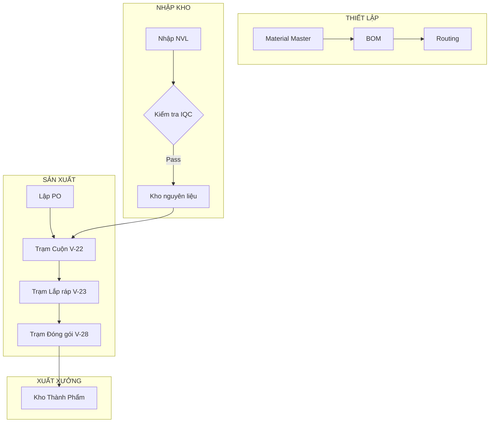

# 🏭 Hướng Dẫn Triển Khai Sản Xuất (Vinatech MES)

Tài liệu này tóm tắt quy trình triển khai sản xuất cho một chủ xưởng mới, dựa trên dữ liệu mẫu của mã hàng **ECVT30-379**.

---

## 📋 5 Giai Đoạn Cốt Lõi

### 1. Thiết Lập Dữ Liệu Gốc (Phase 0: Master Data)
Trước khi máy chạy, cần định nghĩa cấu trúc và quy trình:
*   **Vật tư (`STB_MaterialMaster`)**: Khai báo thông tin cơ bản của sản phẩm.
*   **BOM (`STB_BomHeader/Detail`)**: Định nghĩa công thức cấu tạo (Vd: Foil, Electrolyte, Al-Case...).
*   **Routing (`STB_BasicRoutingDetail`)**: Quy định các trạm hàng phải đi qua (V-22 &rarr; V-23 &rarr; V-28...).

### 2. Nhập Kho & Kiểm Tra (Phase 1: Inbound)
*   Nhập nguyên vật liệu từ nhà cung cấp (`STB_RawMaterialInputHist`).
*   Mỗi lô hàng được cấp mã định danh (`STB_MaterialLotInfo`).
*   Kiểm tra chất lượng đầu vào (`STB_MaterialQcInfo`). Chỉ hàng **Pass** mới được phép xuất ra chuyền.

### 3. Lập Kế Hoạch (Phase 2: Planning)
*   Tạo **Lệnh sản xuất (`STB_ProductionOrderInfo`)**: Xác định mã hàng, số lượng và thời gian chạy.
*   Hệ thống tự động sao chép BOM và Routing từ Master Data vào PO để kiểm soát sản xuất.

### 4. Vận Hành & Quét Mã (Phase 3: Execution)
*   **Khai sinh Barcode (`STB_SetInfo`)**: Mỗi đơn vị sản phẩm được dán tem barcode để theo dõi.
*   **Quét mã công đoạn (`STB_ProdRouteHist`)**: Ghi nhận thời gian, công nhân và máy móc tại mỗi trạm.
*   **Trừ kho tự động (Backflush)**: Hệ thống tự trừ tồn kho NVL dựa trên định mức BOM khi hàng đi qua các trạm chỉ định.

### 5. QC & Đóng Gói (Phase 4 & 5: QC & Packing)
*   Đo đạc thông số (Aging/Sorting) và ghi nhận kết quả (`STB_AgingSortingData`).
*   Đóng thùng lớn (`stb_MergeBoxReality`) và nhập kho thành phẩm để sẵn sàng giao hàng.

---

## 🗺️ Sơ đồ Luồng Dữ Liệu

---
*Tài liệu được tạo tự động bởi Antigravity AI Assistant.*
