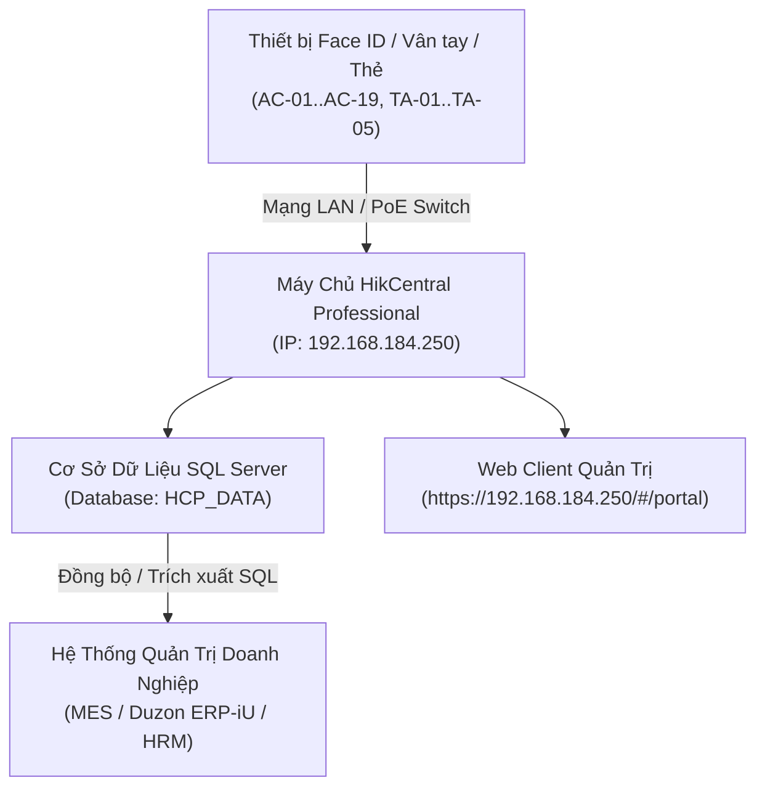

# 🏢 BÁO CÁO TOÀN DIỆN HỆ THỐNG FACE ID, KIỂM SOÁT RA VÀO & CHẤM CÔNG HIKCENTRAL
### *Dự án: VINATECH VINA (HƯNG YÊN)*
*Tài liệu tổng hợp phục vụ báo cáo Ban Giám Đốc / Trưởng Bộ Phận*
*Ngày lập báo cáo: 24/08/2026*

---

## 📌 MỤC LỤC
1. [Tổng Quan Hệ Thống & Phạm Vi Ứng Dụng](#1-tổng-quan-hệ-thống--phạm-vi-ứng-dụng)
2. [Thông Tin Truy Cập Web Quản Trị & Cơ Sở Dữ Liệu](#2-thông-tin-truy-cập-web-quản-trị--cơ-sở-dữ-liệu)
3. [Bản Đồ Phân Bổ Vị Trí Thiết Bị (Mặt Bằng & Bản Vẽ ELV)](#3-bản-đồ-phân-bổ-vị-trí-thiết-bị-mặt-bằng--bản-vẽ-elv)
   - [Phân biệt: Thiết bị Mở Cửa (Access Control) vs Chấm Công (Time Attendance)](#31-phân-biệt-chức-năng-mở-cửa-vs-chấm-công)
   - [Chi tiết vị trí từng tầng & Khu vực](#32-chi-tiết-vị-trí-từng-tầng--khu-vực)
4. [Cấu Hình Nghiệp Vụ Thực Tế Trên Web HikCentral Pro](#4-cấu-hình-nghiệp-vụ-thực-tế-trên-web-hikcentral-pro)
   - [Nhân sự & Phòng ban](#41-nhân-sự--phòng-ban)
   - [Cấp độ kiểm soát mở cửa (Access Levels)](#42-cấp-độ-kiểm-soát-mở-cửa-access-levels)
   - [Ca làm việc, Lịch trình & Quy tắc tính công](#43-ca-làm-việc-lịch-trình--quy-tắc-tính-công)
5. [Kiến Trúc Cơ Sở Dữ Liệu & Hướng Dẫn Tích Hợp (MES / ERP)](#5-kiến-trúc-cơ-sở-dữ-liệu--hướng-dẫn-tích-hợp-mes--erp)
   - [Cấu trúc bảng dữ liệu sự kiện `dbo.HCP_AccessRecord`](#51-cấu-trúc-bảng-dữ-liệu-sự-kiện-dbohcp_accessrecord)
   - [Thống kê dữ liệu quẹt thực tế](#52-thống-kê-dữ-liệu-quẹt-thực-tế)
   - [Các câu lệnh SQL mẫu phục vụ xuất báo cáo công](#53-các-câu-lệnh-sql-mẫu-phục-vụ-xuất-báo-cáo-công)
6. [Đánh Giá, Khuyến Nghị & Kế Hoạch Vận Hành](#6-đánh-giá-khuyến-nghị--kế-hoạch-vận-hành)

---

## 1. 🌟 TỔNG QUAN HỆ THỐNG & PHẠM VI ỨNG DỤNG

Hệ thống được thiết kế và triển khai đồng bộ theo tiêu chuẩn Smart Factory cho nhà máy **Vinatech Vina (Hưng Yên)**, bao gồm 2 chức năng cốt lõi:
1. **Kiểm soát an ninh ra vào (Access Control - AC):** Sử dụng thiết bị nhận diện khuôn mặt (Face ID), thẻ từ RFID để điều khiển khóa từ, khóa thả chốt, ngàm điện và cổng xoay phân làn (Flap Barrier) tại các cửa phân quyền an ninh cao.
2. **Chấm công sinh trắc học (Time Attendance - TA):** Thu thập dữ liệu quẹt Face ID/vân tay của cán bộ nhân viên, tự động tính toán giờ vào/ra, đi muộn, về sớm, tăng ca theo ca làm việc quy định.



---

## 2. 🔑 THÔNG TIN TRUY CẬP WEB QUẢN TRỊ & CƠ SỞ DỮ LIỆU

### 2.1. Cổng Web Client HikCentral Pro
- **Địa chỉ truy cập:** `https://192.168.184.250/#/portal` (hoặc `http://192.168.184.250:80/`)
- **Tài khoản đăng nhập:** `admin`
- **Mật khẩu:** `vinatech@2026`
- **Các cổng dịch vụ máy chủ:**
  - `HTTPS (Web Client)`: Cổng 443 / 8888
  - `HTTP (Web Portal / ESD)`: Cổng 80 / 8080
  - `Private Service Port (Giao tiếp thiết bị)`: Cổng 7660
  - `OpenAPI Port`: Cổng 8088

### 2.2. Cơ Sở Dữ Liệu SQL Server (Database)
- **Server Name:** `192.168.184.250,1433` *(hoặc `DESKTOP-DMPDUR7\TAAC` trên máy chủ)*
- **Cơ chế xác thực:** `SQL Server Authentication`
- **Tài khoản:** `hikcentral`
- **Mật khẩu:** `vinatech@2026`
- **Tên Database:** **`HCP_DATA`**
- **Tùy chọn kết nối:** `TrustServerCertificate=True; Encrypt=Optional`

---

## 3. 🗺️ BẢN ĐỒ PHÂN BỔ VỊ TRÍ THIẾT BỊ (MẶT BẰNG & BẢN VẼ ELV)

*(Căn cứ theo bản vẽ thiết kế điện nhẹ: `Drawing_ELV System_VINATECH_260615_v5.2.pdf` - Trang 4, 6, 8, 9, 31, 32, 33, 36)*

### 3.1. Phân Biệt Chức Năng: Mở Cửa (AC) vs Chấm Công (TA)

| Loại Thiết Bị | Mã Ký Hiệu | Số Lượng | Mục Đích Chính | Thiết Bị Chấp Hành Kèm Theo |
|:---|:---:|:---:|:---|:---|
| **Access Control (Mở cửa phòng)** | `AC-01` → `AC-06` | **06 máy** | Kiểm soát an ninh, chỉ nhân viên có thẩm quyền mới mở được cửa vào phòng. | Khóa hút từ (Magnetic Lock), Khóa thả chốt (Drop Bolt), Nút Exit mở cửa từ bên trong, Cảm biến cửa (Door Contact), Nút đập khẩn cấp (Break Glass). |
| **Access Control (Cổng Flap Barrier)** | `AC-10` → `AC-19` | **10 máy** | Kiểm soát luồng người ra vào nhà máy tại khu vực nhà xe / cổng chính. | 6 làn Flap Barrier (2 cánh biên Left/Right, 4 cánh giữa Center), hàng rào Inox ngăn làn. |
| **Time Attendance (Máy Chấm Công)** | `TA-01` → `TA-05` | **05 máy** | Chấm công chuyên dụng cho công nhân và nhân viên tại các sảnh / hành lang chính. | Không gắn khóa cửa, chỉ ghi nhận dữ liệu thời gian vào/ra. |
| **Faces Sample Device** | Đăng ký mẫu | **01 bộ** | Đăng ký khuôn mặt mới cho nhân viên tại phòng IT. | Kết nối USB trực tiếp vào PC quản trị. |

---

### 3.2. Chi Tiết Vị Trí Từng Khu Vực & Từng Tầng

```
+----------------------------------------------------------------------------------------------------+
|                                      TỔNG MẶT BẰNG NHÀ MÁY                                         |
|                                                                                                    |
|  [KHU NHÀ XE / CỔNG CHÍNH]                                                                         |
|  └── Flap Barrier (10 Face ID): AC-10, AC-11, AC-12, AC-13, AC-14 (Vào)                           |
|                                 AC-15, AC-16, AC-17, AC-18, AC-19 (Ra)                            |
|                                                                                                    |
|  [NHÀ XƯỞNG TẦNG 1]                                                                                |
|  ├── Mở cửa an ninh:                                                                               |
|  │   ├── AC-01: Cửa Phòng Trưng Bày (Showroom 101 / Sảnh Chính)                                    |
|  │   ├── AC-02: Cửa Phòng Điều Khiển Sản Xuất (Control Room 128 / Mixer 1)                         |
|  │   └── AC-03: Cửa Phòng Trực PCCC / Kỹ Thuật (FFT Room 151 / EPS)                                |
|  └── Chấm công công nhân:                                                                          |
|      ├── TA-01: Sảnh Chính Tầng 1 (Cầu thang 1 / Gần Showroom)                                     |
|      ├── TA-02: Lối vào Căn tin (Canteen) & Phòng nghỉ ca nam (115A)                               |
|      ├── TA-03: Lối vào Phòng nghỉ ca nữ (115A), Phòng để giày (136), QC Room                       |
|      ├── TA-04: Cửa nhập xuất Kho 1 (Warehouse 104)                                                |
|      └── TA-05: Cửa xuất hàng Logistic Dock (105)                                                  |
|                                                                                                    |
|  [NHÀ XƯỞNG TẦNG 1.5]                                                                              |
|  └── Mở cửa an ninh:                                                                               |
|      └── AC-04: Cửa vào Khu Văn Phòng Tầng 1.5 (Office 201, Phòng Giám Đốc 202)                    |
|                                                                                                    |
|  [NHÀ XƯỞNG TẦNG 2]                                                                                |
|  └── Mở cửa an ninh:                                                                               |
|      ├── AC-05: Cửa Phòng IT / Máy Chủ Server (IT Room 304 - Nơi đặt Rack Main 42U)                |
|      └── AC-06: Cửa vào Khu Văn Phòng Tầng 2 (Office 302: HR, Mua hàng, Kế toán, P. Giám Đốc 303)   |
+----------------------------------------------------------------------------------------------------+
```

#### Bảng Tra Cứu Chi Tiết Toàn Bộ Thiết Bị Face ID / Cửa:

| Mã TB | Loại | Tầng / Vị Trí Lắp Đặt | Tên Cửa / Phòng | Chức Năng Cụ Thể | Trạng Thái Thực Tế |
|:---:|:---:|:---|:---|:---|:---:|
| **`AC-01`** | AC | Tầng 1 Nhà Xưởng | Showroom (Phòng 101) | Mở khóa cửa kính sảnh đón tiếp & trưng bày | Theo thiết kế |
| **`AC-02`** | AC | Tầng 1 Nhà Xưởng | Control Room (Phòng 128) | Mở khóa cửa phòng điều khiển trung tâm pha trộn | Đã kích hoạt trên Web (`AC-02_Door_1`) |
| **`AC-03`** | AC | Tầng 1 Nhà Xưởng | P. Trực PCCC / Kỹ thuật (151) | Mở khóa cửa phòng PCCC / Trạm điện EPS | Theo thiết kế |
| **`AC-04`** | AC | Tầng 1.5 Nhà Xưởng | Văn phòng 1.5F (Phòng 201/202) | Mở khóa cửa lối vào khối văn phòng phụ trợ | Theo thiết kế |
| **`AC-05`** | AC | Tầng 2 Nhà Xưởng | IT Room / Server (Phòng 304) | Mở khóa cửa phòng máy chủ an ninh tối mật | **Đang hoạt động** (`GS8090993`) |
| **`AC-06`** | AC | Tầng 2 Nhà Xưởng | Văn phòng 2F (Phòng 302) | Mở khóa cửa khối văn phòng chính (HR, Kế toán) | **Đang hoạt động** (`GS8091002`) |
| **`TA-01`** | TA | Tầng 1 Nhà Xưởng | Sảnh chính (Gần Cầu thang 1) | Chấm công luồng nhân sự vào ca từ sảnh chính | Theo thiết kế |
| **`TA-02`** | TA | Tầng 1 Nhà Xưởng | Căn tin & Nghỉ ca nam (115A) | Chấm công công nhân khu vực ăn uống / nghỉ ca | Theo thiết kế |
| **`TA-03`** | TA | Tầng 1 Nhà Xưởng | Locker nữ & QC Room (136) | Chấm công công nhân nữ & nhân viên QC | **Đang hoạt động** (`GS8091000`) |
| **`TA-04`** | TA | Tầng 1 Nhà Xưởng | Kho NVL 1 (Kho 104) | Chấm công thủ kho & công nhân bốc xếp kho | Theo thiết kế |
| **`TA-05`** | TA | Tầng 1 Nhà Xưởng | Logistic Dock (Khu 105) | Chấm công nhân sự giao nhận hàng hóa ngoài dock | Theo thiết kế |
| **`AC-10..14`**| AC | Khu Nhà Xe / Cổng | 5 làn Flap Barrier chiều VÀO | Mở cổng xoay phân làn cho công nhân vào ca | Chuẩn bị triển khai |
| **`AC-15..19`**| AC | Khu Nhà Xe / Cổng | 5 làn Flap Barrier chiều RA | Mở cổng xoay phân làn cho công nhân tan ca | Chuẩn bị triển khai |

---

## 4. ⚙️ CẤU HÌNH NGHIỆP VỤ THỰC TẾ TRÊN WEB HIKCENTRAL PRO

Qua kiểm tra trực tiếp trên cổng quản trị Web `https://192.168.184.250/#/portal`:

### 4.1. Quản Lý Nhân Sự (Person)
- **Tổng số nhân sự hiện có:** 14 nhân viên.
- **Cơ cấu phòng ban:**
  - `All Departments`
    - 📁 **`HS Team`** (Ví dụ: `Hợp Nguyễn Thị` - Mã NV: `31904003`...)
    - 📁 **`WSI`** (Ví dụ: `Đức_Vinatech` - Mã NV: `12`, `Huy Khang_Vinatech` - Mã NV: `5908432579`, `binhwsi`, `hieu.wsi`, `cao cuong wsi`...)

### 4.2. Cấp Độ Kiểm Soát Mở Cửa (Access Levels)
Đã cấu hình 2 nhóm phân quyền mở cửa:
1. **`Door_2F`:** Phân quyền mở 2 cửa tầng 2 gồm **`AC-05_Door_1`** (Phòng IT) và **`AC-06_Door_1`** (Văn phòng tầng 2). Thời gian hiệu lực: 24/7 (Mẫu cả ngày).
2. **`All Door`:** Phân quyền mở cả 3 cửa gồm **`AC-02_Door_1`** (Phòng điều khiển 1F), **`AC-05_Door_1`** (Phòng IT 2F), và **`AC-06_Door_1`** (Văn phòng 2F).

### 4.3. Cài Đặt Chấm Công (Time & Attendance)
- **Ca làm việc chuẩn (Shifts):** Ca **`HC` (Hành chính)**: Giờ làm việc từ **08:00 đến 17:30**.
- **Lịch trình bộ phận (Department Schedules):**
  - Cả 2 bộ phận `WSI` và `HS Team` đều áp dụng lịch làm việc từ **Thứ Hai đến Thứ Sáu** (Thứ Bảy & Chủ Nhật là ngày nghỉ).
- **Nhóm chấm công (Attendance Group):** Đã tạo nhóm **`OFFICE`** (gồm 3 nhân sự chủ chốt đang áp dụng thử nghiệm).
- **Quy tắc tính toán công (Calculation Rules):**
  - Phương thức tính: **Lần quẹt đầu tiên (First Check-in) & Lần quẹt cuối cùng (Last Check-out)**.
  - Tiến trình tính công tự động: **04:00 AM hàng ngày**, hệ thống tự động quét dữ liệu và tính toán lại toàn bộ công cho toàn công ty.

---

## 5. 🗄️ KIẾN TRÚC CƠ SỞ DỮ LIỆU & HƯỚNG DẪN TÍCH HỢP (MES / ERP)

### 5.1. Cấu Trúc Bảng Dữ Liệu Sự Kiện `dbo.HCP_AccessRecord`

Bảng `dbo.HCP_AccessRecord` trong database `HCP_DATA` lưu trữ toàn bộ dữ liệu sự kiện thời gian thực:

```
+----------------------+--------------------+---------------------------------------------------------------+
| Tên Cột              | Kiểu Dữ Liệu       | Ý Nghĩa Nghiệp Vụ                                             |
+----------------------+--------------------+---------------------------------------------------------------+
| RecordID             | bigint             | Mã định danh duy nhất của từng lượt quẹt sự kiện              |
| EmployeeID           | nvarchar(100)      | Mã nhân viên (khóa liên kết chính với MES / ERP)              |
| PersonName           | nvarchar(255)      | Họ và tên nhân viên                                           |
| Department           | nvarchar(255)      | Phòng ban / Bộ phận làm việc                                  |
| AccessDateTime       | nvarchar(50)       | Thời gian quẹt đầy đủ (Định dạng: 2026-08-24T11:14:26)        |
| AccessDate           | nvarchar(20)       | Ngày quẹt (Định dạng: 2026-08-24)                             |
| AccessTime           | nvarchar(20)       | Giờ quẹt (Định dạng: 11:14:26)                                |
| AuthenticationType   | nvarchar(100)      | Loại xác thực: ACSEventFaceVerifyPass (Face ID), Finger...    |
| AuthenticationResult | nvarchar(50)       | Kết quả xác thực (success...)                                 |
| CapturedPicture      | nvarchar(MAX)      | Đường dẫn URI ảnh chụp khuôn mặt thực tế lúc quẹt             |
| DeviceName           | nvarchar(255)      | Tên thiết bị ghi nhận (AC-05, AC-06, TA-03...)                |
| DeviceSerialNo       | nvarchar(100)      | Số Serial phần cứng thiết bị (GS8090993, GS8091002...)       |
| ResourceName         | nvarchar(255)      | Tên điểm kiểm soát / Cửa (AC-05_Door_1...)                   |
| ReaderName           | nvarchar(255)      | Tên đầu đọc (Cardreader 01...)                                |
| CardNumber           | nvarchar(100)      | Mã thẻ từ RFID (nếu xác thực bằng thẻ)                        |
| Direction            | nvarchar(50)       | Chiều di chuyển (In / Out)                                    |
| CreatedAt            | datetime2          | Thời điểm bản ghi được ghi nhận vào Database                 |
+----------------------+--------------------+---------------------------------------------------------------+
```

### 5.2. Thống Kê Dữ Liệu Thực Tế
- **Tổng số bản ghi:** 136+ sự kiện.
- **Tỷ lệ xác thực sinh trắc học:**
  - **Nhận diện khuôn mặt Face ID (`ACSEventFaceVerifyPass`):** **92% (125 lượt)**
  - **Vân tay (`ACSEventFingerThrough`):** 4% (5 lượt)
  - **Thẻ kết hợp vân tay (`ACSEventCardFingerThrough`):** 4% (6 lượt)

---

### 5.3. Các Câu Lệnh SQL Mẫu Phục Vụ Tích Hợp & Xuất Báo Cáo

#### Query 1: Trích xuất lịch sử chấm công theo ngày (Phục vụ đối soát giờ làm việc)
```sql
SELECT 
    AccessDate AS [Ngày],
    EmployeeID AS [Mã NV],
    PersonName AS [Họ và Tên],
    Department AS [Bộ Phận],
    MIN(AccessTime) AS [Giờ Đến (In)],
    MAX(AccessTime) AS [Giờ Về (Out)],
    COUNT(*) AS [Tổng Số Lần Quẹt],
    MAX(CASE WHEN AuthenticationType = 'ACSEventFaceVerifyPass' THEN 'Face ID' ELSE 'Khác' END) AS [Hình Thức]
FROM dbo.HCP_AccessRecord
WHERE AccessDate >= '2026-08-01'
GROUP BY AccessDate, EmployeeID, PersonName, Department
ORDER BY AccessDate DESC, [Mã NV] ASC;
```

#### Query 2: Lấy log quẹt Face ID mới nhất tại từng cửa an ninh (Phục vụ giám sát)
```sql
SELECT TOP 20
    RecordID,
    AccessDateTime,
    DeviceName AS [Thiết Bị],
    ResourceName AS [Cửa],
    EmployeeID AS [Mã NV],
    PersonName AS [Nhân Viên],
    AuthenticationType AS [Phương Thức]
FROM dbo.HCP_AccessRecord
ORDER BY AccessDateTime DESC;
```

---

## 6. 💡 ĐÁNH GIÁ, KHUYẾN NGHỊ & KẾ HOẠCH VẬN HÀNH

1. **Hiệu năng nhận diện Face ID:** Tỷ lệ nhận diện thành công qua Face ID đạt trên 92%, tốc độ nhận diện dưới 0.3 giây/lượt, đáp ứng tốt lưu lượng lớn khi vào ca.
2. **Kế hoạch mở rộng Flap Barrier:** Khi hoàn thiện khu nhà xe, cần kết nối 10 máy `AC-10` đến `AC-19` vào Switch PoE tại `RACK 05 (E-PARKING)` để đồng bộ dữ liệu vào nhóm chấm công toàn nhà máy.
3. **Đồng bộ tự động sang ERP / MES:**
   - Đã tạo sẵn script tra cứu độc lập **[query_faceid_db.ps1](file:///c:/Users/User%20Vinatech.DESKTOP-RJJSEQU/Desktop/face%20id/query_faceid_db.ps1)**.
   - Có thể thiết lập một Scheduled Job / Stored Procedure tự động đẩy dữ liệu từ `HCP_DATA.dbo.HCP_AccessRecord` sang hệ thống ERP/MES vào lúc 04:30 AM hàng ngày sau khi HikCentral tính công xong.

---
*Tài liệu được chuẩn bị hoàn chỉnh bởi Antigravity AI Assistant.*
